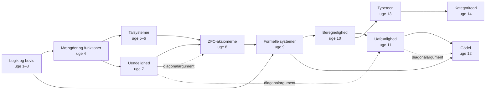

# Matematikkens grundlag: fra logik over mængder til Gödel

*Læringsplan, noter, øvelser og løsninger til YouTube-playlisten **"Foundations of Mathematics – Logic to Sets to Goedel"***

Dette dokument er din studiemakker til playlisten. Videoerne giver dig forelæsningerne, og dokumentet giver dig resten: en ugeplan, noter der samler op og lukker huller, øvelser på tre niveauer med løsninger, programmeringsopgaver og et afsluttende projekt.

Når du er færdig, skal du kunne forklare hele kæden

> **logik → aksiomer → mængder → talsystemer → formelle teorier → beregning → uafgørlighed → ufuldstændighed**

og præcist forklare, hvad sætninger som *"ZFC beviser X"*, *"en teori er konsistent"*, *"et problem er uafgørligt"* og *"Gödels ufuldstændighedssætning"* betyder.

---

## Sådan bruger du planen

**Rytmen i en uge** (typisk 3 arbejdsgange á 2–3 timer):

1. **Se videoerne aktivt.** Hav papir og blyant klar. Stop ved hvert *"Pause og tænk"*-spørgsmål og svar, før du ser videre.
2. **Læs 🧠 Kernebegreber.** Noterne samler op på videoerne og dækker det, videoerne springer over. Hvis en video og noterne siger noget forskelligt, er det som regel et spørgsmål om konvention (fx om 0 ∈ ℕ). Her bruger vi altid ℕ = {0, 1, 2, …}.
3. **Lav øvelserne.** Minimum: alle ★, de fleste ★★, mindst én ★★★, 💻-opgaverne og 🗣️-opgaven.
4. **Tjek løsningerne først efter et ærligt forsøg.** Brug 15-minutters-reglen: sidder du fast i 15 minutter, må du læse den første linje (hintet) i løsningen. Så prøver du igen.
5. **Tag checkpointet.** Kan du ikke sætte flueben ved alt, så gentag de relevante øvelser, før du går videre. Hver uge bygger på de foregående.

**Tidsforbrug:** ca. 6½–9 timer om ugen. Uge 12 og 14 er de tungeste. Planen er på 14 uger, og du kan sætte 1–2 bufferuger af til det afsluttende projekt. Har du mindre tid, så brug to kalenderuger på hver uge i planen. Det er bedre end at springe over.

**Symbolforklaring:**

| Mærke | Betydning |
|---|---|
| ★ | Grundlæggende: definitioner, beregninger, direkte brug af stoffet |
| ★★ | Standardbeviser: det niveau, du skal kunne |
| ★★★ | Udfordring: valgfri, men det er her, man bliver rigtig god |
| 💻 | Programmering (Python 3, kun standardbiblioteket, og Lean 4 hvor det er angivet) |
| 🗣️ | Forklar med dine egne ord, skriftligt eller højt for en anden |
| (tilføjet) | Materiale, der ikke er i playlisten, men som er lagt ind for at lukke et hul |

**Visning:** Dokumentet bruger LaTeX-formler (`$...$`), foldbare løsninger (`<details>`) og et Mermaid-diagram. Det vises bedst i **Obsidian**, **VS Code** (indbygget Markdown-preview) eller på **GitHub**. Løsningerne er foldet sammen, så du ikke kommer til at se dem ved et uheld.

**Når du sidder fast:**

- Skriv definitionerne ud, ord for ord. Halvdelen af alle beviser følger direkte af definitionerne.
- Prøv små tilfælde: n = 0, 1, 2, eller en mængde med 2 elementer.
- Test påstanden i Python. Det er ikke et bevis, men det viser dig, om påstanden overhovedet er sand, og ofte hvorfor.
- Bruger du en AI-assistent, så bed om **et hint** og ikke om løsningen. Bed den fx om at pege på det skridt i dit bevis, der ikke holder.

---

## Fremskridt

- [ ] Uge 1: Udsagnslogik
- [ ] Uge 2: Kvantorer og bevismetoder
- [ ] Uge 3: Induktion
- [ ] Uge 4: Mængder, relationer og funktioner
- [ ] Uge 5: Konstruktion af de naturlige tal · *Projekt del A*
- [ ] Uge 6: Heltal, rationale tal og reelle tal
- [ ] Uge 7: Uendelighed
- [ ] Uge 8: Aksiomatisk mængdelære (ZFC)
- [ ] Uge 9: Formelle systemer: syntaks og semantik · *Projekt del B*
- [ ] Uge 10: Beregnelighed: Turing-maskiner og Church–Turing-tesen
- [ ] Uge 11: Uafgørlighed
- [ ] Uge 12: Gödels ufuldstændighedssætninger
- [ ] Uge 13: Typeteori og Curry–Howard · *Projekt del C*
- [ ] Uge 14: Kategoriteori og syntese · *Projekt del D*
- [ ] Afsluttende selvtest

---

## Det store kort



De stiplede pile viser forløbets vigtigste enkeltidé, **diagonalargumentet**. Det optræder fire gange: Cantors sætning (uge 7), Russells paradoks (uge 8), halting-problemet (uge 11) og Gödels sætning (uge 12). Hold øje med det.

---

## Overblik: 14 uger

| Uge | Emne | Fra playlisten | Tilføjet i dette dokument | Tid (ca.) |
|---|---|---|---|---|
| 1 | Udsagnslogik | P1 (Logic), P2 (logic & propositions) | Sandhedstabel-generator i Python | 6½ t |
| 2 | Kvantorer og bevismetoder | P2 (proofs, contradiction, cases, quantifiers), P3 | Hvordan man skriver et bevis på dansk | 8 t |
| 3 | Induktion | P2 (well ordering, induction, strong induction) | Strukturel induktion, rekursion ↔ induktion | 7½ t |
| 4 | Mængder, relationer og funktioner | P1 (Sets), P2 (sets, relations) | Ækvivalensrelationer, Kuratowski-par | 8 t |
| 5 | Konstruktion af de naturlige tal | P1 (Numbers: naturals) | Natural Number Game (Lean), rekursionssætningen | 8 t |
| 6 | Heltal, rationale og reelle tal | P1 (Numbers, Reals, Complex) | Dedekind-snit, "hvilket 2-tal?" | 8 t |
| 7 | Uendelighed | P2 (infinite sets) | Cantors sætning, tællelig mange programmer | 7½ t |
| 8 | Aksiomatisk mængdelære | P4, P5, P6 | Det kumulative hierarki, uafhængighed | 6½ t |
| 9 | Formelle systemer | *ingen video* | Hele ugen: MIU, Hilbert-kalkyle, fuldstændighedssætningen, PA | 8 t |
| 10 | Beregnelighed | P7: L5 (TM-delen), L6, L7 | DFA-primer, Computerphile om λ-kalkyle | 7½–8½ t |
| 11 | Uafgørlighed | P7: L8, L9 (L10 valgfri) | Rices sætning, halting-paradokset i Python | 7½–8½ t |
| 12 | Gödels ufuldstændighed | P7: L11, P8, P9, P10 | Misforståelser om Gödel, Goodstein-følger | 9 t (fordel gerne over 1½ uge) |
| 13 | Typeteori og Curry–Howard | P11, P12, P13 (valgfri) | λ-kalkyle, beviser i Lean | 8 t |
| 14 | Kategoriteori og syntese | P14: Milewski 1.1–3.1 (3.2 valgfri) | Milewski 6.1 (Functors), syntesen | 9 t |
| +1–2 | Afsluttende projekt og selvtest | | *Hvorfor er 1 + 1 = 2?* | 6–10 t |

---

## Playlisten: nøgle P1–P14

Resten af dokumentet henviser til videoerne med disse nøgler. Rækkefølgen i din playliste kan afvige en smule, så søg på titlen, hvis du er i tvivl.

| Nøgle | Indhold | Bruges i uge |
|---|---|---|
| P1 | The Bright Side of Mathematics: *Start Learning Mathematics* (Logic, Sets, Numbers, Reals, Complex) | 1, 4, 5, 6 |
| P2 | MIT OCW 6.042J *Mathematics for Computer Science* (Spring 2015): udvalgte korte videoer | 1, 2, 3, 4, 7 |
| P3 | TrevTutor: *Direct Proof* (+ kontraposition/modstrid) | 2 |
| P4 | Oxford Mathematics: *Set Theory: What is Set Theory and what is it for?* | 8 |
| P5 | Oxford Mathematics: *Set Theory: Russell's Paradox* | 8 |
| P6 | Kort ZFC-overblik (*10 Axioms in 10 Minutes*) | 8 |
| P7 | MIT 18.404J *Theory of Computation* (Fall 2020), Michael Sipser: L5, L6, L7, L8, L9, (L10), L11 | 10, 11, 12 |
| P8 | Numberphile: *Gödel's Incompleteness Theorem* | 12 |
| P9 | *Gödel's 1st Incompleteness Theorem: Proof by Diagonalization* | 12 |
| P10 | Joel David Hamkins: *The Gödel incompleteness phenomenon* | 12 |
| P11 | Peter Dybjer: *Intuitionistic Type Theory, Lecture I* | 13 |
| P12 | Forelæsning om Curry–Howard-korrespondancen | 13 |
| P13 | Introduktion til Homotopy Type Theory (valgfri) | 13 |
| P14 | Bartosz Milewski: *Category Theory* 1.1–3.1 (+ 3.2 valgfri) | 14 |

**Sipsers forelæsninger:** Den komplette liste med titler står på [MIT OCW's videoside for 18.404J](https://ocw.mit.edu/courses/18-404j-theory-of-computation-fall-2020/video_galleries/video-lectures/). Hver forelæsning varer ca. 80 minutter, så del dem gerne i to.

---

## Hvad jeg har tilføjet, og hvorfor

Playlisten er god, men den har nogle huller, hvis målet er at forstå hele kæden. Her er, hvad dette dokument tilføjer:

1. **Uge 9 (formelle systemer) har ingen video.** Playlisten springer direkte fra ZFC (P6) til Turing-maskiner (P7). Men netop syntaks vs. semantik, beviser som formelle objekter, Gödels *fuldstændigheds*sætning og Peano-aritmetik er det, som udsagn som "ZFC beviser X" og "konsistent" hviler på. Derfor er uge 9 skrevet som en selvstændig tekstuge med søgeord til supplerende videoer.
2. **Sipsers L5–L7 forudsætter endelige automater (DFA'er)** fra L1–L4, som ikke er i playlisten. Uge 10 har derfor en kort DFA-primer, og L1 er foreslået som valgfri.
3. **λ-kalkylen mangler.** Den er både Churchs version af "algoritme" (uge 10) og grundlaget for Curry–Howard og typeteori (uge 13). Derfor er Computerphiles video [*Lambda Calculus*](https://www.youtube.com/watch?v=eis11j_iGMs) (13 min) tilføjet.
4. **Funktorer kommer først i Milewskis video 6.1.** Hans første seks videoer når ikke frem til funktorer, som er en del af læringsmålet. Derfor er [*Category Theory 6.1: Functors*](https://www.youtube.com/watch?v=FyoQjkwsy7o) tilføjet i uge 14.
5. **[Natural Number Game](https://adam.math.hhu.de/#/g/leanprover-community/NNG4)** (Lean 4 i browseren). Her bygger du selv de naturlige tal op fra Peano-aksiomerne og beviser regnereglerne ét skridt ad gangen, som et spil. Det er den praktiske side af både uge 5 og uge 13 og indgår i det afsluttende projekt.
6. **Ækvivalensrelationer (uge 4) og rekursionssætningen (uge 5)** er med, fordi uge 6 bygger ℤ og ℚ som ækvivalensklasser, og fordi "definition ved rekursion" er kernen i beviset for 1 + 1 = 2.
7. **Programmeringsopgaver hver uge.** Du programmerer i forvejen, og mange af idéerne (rekursion, diagonalisering, Gödel-nummerering, quines, λ-kalkyle) forstår man bedst ved selv at implementere dem.
8. **Præcise definitioner af de fire nøglesætninger og en liste over typiske misforståelser om Gödel** (uge 12). Gödel er nok det emne i matematikken, der oftest bliver misforstået.
9. **Det afsluttende projekt er delt i fire dele,** som du laver undervejs (efter uge 5, 9, 13 og 14) i stedet for alt til sidst.
10. **En afsluttende selvtest, en ordliste (dansk–engelsk), en logbog og en liste over gratis bøger** står sidst i dokumentet.

---

## Notation: snydeark

| Symbol | Læses | Første gang |
|---|---|---|
| $\neg p,\ p \land q,\ p \lor q$ | ikke p, p og q, p eller q | uge 1 |
| $p \to q,\ p \leftrightarrow q$ | hvis p så q, p hvis og kun hvis q | uge 1 |
| $\forall x,\ \exists x$ | for alle x, der findes et x | uge 2 |
| $a \in A,\ A \subseteq B$ | a er element i A, A er delmængde af B | uge 4 |
| $\emptyset,\ \mathcal{P}(A),\ A \times B$ | tomme mængde, potensmængde, kartesisk produkt | uge 4 |
| $f : A \to B$ | f er en funktion fra A til B | uge 4 |
| $\mathbb{N} = \{0,1,2,\dots\}$ | de naturlige tal (med 0) | uge 5 |
| $S(n)$ | efterfølgeren til n | uge 5 |
| $\mathbb{Z},\ \mathbb{Q},\ \mathbb{R},\ \mathbb{C}$ | hele, rationale, reelle og komplekse tal | uge 6 |
| $\lvert A\rvert$ | kardinaliteten (størrelsen) af A | uge 7 |
| $T \vdash \varphi$ | teorien T beviser φ (syntaks) | uge 9 |
| $\mathfrak{M} \models \varphi$ | φ er sand i modellen 𝔐 (semantik) | uge 9 |
| $\langle M \rangle$ | kodningen af Turing-maskinen M som streng | uge 10 |
| $A \le_m B$ | A kan reduceres til B | uge 11 |
| $\ulcorner \varphi \urcorner$ | Gödel-nummeret for formlen φ | uge 12 |
| $\mathrm{Con}(T)$ | aritmetisk udsagn: "T er konsistent" | uge 12 |
| $a : A$ | a er et element (en term) af typen A | uge 13 |
| $g \circ f$ | sammensætning: først f, så g | uge 4, 14 |

---

## Uge 1 — Udsagnslogik

> **Læringsmål:** Du kan opstille og læse sandhedstabeller, forklare præcis hvad implikation betyder (også når forudsætningen er falsk), afgøre logisk ækvivalens og gyldighed af argumenter, og omskrive formler til CNF/DNF.
> **Tidsforbrug:** ca. 1.5 t video · ca. 5 t øvelser
> **Forudsætninger:** Ingen ud over gymnasiets matematik. Lidt Python til 💻-opgaverne.

### 📺 Se

- [ ] **P1** Start Learning Logic – delen om logiske udsagn (logical statements), negation og konjunktion.
  - *Fokus:* Hvad der gør en sætning til et udsagn, og hvordan et konnektiv (connective) er *defineret* af sin sandhedstabel.
  - *Pause og tænk:* Er "$x + 1 = 3$" et udsagn? Hvad mangler der?
- [ ] **P1** Start Learning Logic – delen om disjunktion, tautologi og logisk ækvivalens.
  - *Fokus:* At "eller" i matematik er *inklusivt*, og forskellen på en formel, der er sand for *én* tildeling af sandhedsværdier, og en tautologi, der er sand for *alle*.
  - *Pause og tænk:* Hvorfor er $p \vee \neg p$ en tautologi, mens $p \vee q$ ikke er?
- [ ] **P1** Start Learning Logic – delen om implikation (conditional), biimplikation (biconditional) og deduktionsregler.
  - *Fokus:* Sandhedstabellen for $p \to q$, og hvordan deduktionsregler (fx modus ponens) bruges til at komme fra præmisser til en konklusion.
  - *Pause og tænk:* Hvilken af de fire rækker i tabellen for $p \to q$ er den eneste, hvor implikationen er falsk – og hvorfor netop den?
- [ ] **P2** Videoerne om logik og udsagn (logic & propositions / propositional logic).
  - *Fokus:* MIT's måde at bruge logik i beviser på, og begreberne gyldig (valid) og opfyldelig (satisfiable) – de dukker op igen, når vi når til beregnelighed.
  - *Pause og tænk:* Hvordan kan man afgøre, om en formel med 20 variable er opfyldelig? Hvor mange rækker har sandhedstabellen?
- [ ] *(tilføjet, valgfri)* MIT 6.042J-lærebogen "Mathematics for Computer Science", kapitlet om logiske formler (Logical Formulas): https://courses.csail.mit.edu/6.042/spring15/mcs.pdf

### 🧠 Kernebegreber

> **Bemærk:** I denne uge behandler vi logik **semantisk**: en formel er sand eller falsk afhængigt af, hvilke sandhedsværdier variablene får. Vi taler om *sandhed*, ikke om *bevis*. I uge 9 vender vi tilbage til logik som ren **syntaks**: formler som symbolstrenge og formelle beviser som regelstyret symbolmanipulation ($\vdash$). Skellet mellem $\vDash$ (sandhed) og $\vdash$ (bevisbarhed) er centralt i Gödels sætninger. (Pas på: for logisk konsekvens i førsteordenslogik (first-order logic) falder de to begreber faktisk sammen – det er Gödels *fuldstændighedssætning* (completeness theorem). *Ufuldstændighedssætningerne* handler om noget andet: at en teori som aritmetikken ikke kan bevise alle udsagn, der er sande om $\mathbb{N}$.)

**Udsagn (proposition).** En sætning, der er enten sand (S) eller falsk (F), men ikke begge. "$7$ er et primtal" er et udsagn. "Luk døren!" og "$x > 3$" er ikke (det sidste bliver et udsagn, når $x$ fastlægges – det er et *prædikat*, se uge 2).

**Formler.** Vi bruger propositionsvariable (propositional variables) $p, q, r, \dots$ Formler defineres *rekursivt*: hver variabel er en formel, og hvis $\varphi$ og $\psi$ er formler, så er $\neg\varphi$, $(\varphi \wedge \psi)$, $(\varphi \vee \psi)$, $(\varphi \to \psi)$ og $(\varphi \leftrightarrow \psi)$ formler. Konvention: $\neg$ binder stærkest, $\to$ og $\leftrightarrow$ svagest; sæt hellere en parentes for meget.

**Konnektiver (connectives)** er defineret ved deres sandhedstabel (truth table):

| $p$ | $q$ | $\neg p$ | $p \wedge q$ | $p \vee q$ | $p \to q$ | $p \leftrightarrow q$ |
|:-:|:-:|:-:|:-:|:-:|:-:|:-:|
| S | S | F | S | S | S | S |
| S | F | F | F | S | F | F |
| F | S | S | F | S | S | F |
| F | F | S | F | F | S | S |

En **sandhedstildeling** (valuation) er en funktion $v$, der giver hver variabel værdien S eller F; tabellen bestemmer så værdien af enhver formel. En formel med $n$ variable har $2^n$ tildelinger (rækker).

**Implikation (implication).** $p \to q$ ("hvis $p$, så $q$") er *kun* falsk, når $p$ er sand og $q$ er falsk. Når $p$ er falsk, er $p \to q$ sand – det kaldes **tom sandhed** (vacuous truth). Hvorfor er det det rigtige valg?
- *Løfte:* "Hvis du består, får du en is." Løftet er kun brudt, hvis du består og ikke får en is. Dumper du, er løftet ikke brudt.
- *Matematisk brug:* Vi vil have, at "for alle heltal $n$: hvis $n > 2$, så er $n^2 > 4$" er sandt. Men for $n = 1$ har vi F $\to$ F, og for $n = -3$ har vi F $\to$ S (da $9 > 4$). Skal den generelle påstand være sand, må begge disse rækker give S.
- $p \to q$ betyder altså præcis $\neg(p \wedge \neg q)$: "det sker ikke, at $p$ er sand og $q$ falsk". Der er *ingen* påstand om årsag og virkning.

Til implikationen $p \to q$ hører: den **omvendte** (converse) $q \to p$, den **inverse** (inverse) $\neg p \to \neg q$ og den **kontraponerede** (contrapositive) $\neg q \to \neg p$. Den kontraponerede er ækvivalent med $p \to q$; den omvendte og den inverse er ækvivalente med hinanden, men *ikke* med $p \to q$. **Biimplikation** $p \leftrightarrow q$ ("$p$ hvis og kun hvis $q$") er sand, når $p$ og $q$ har samme sandhedsværdi.

**Klassifikation.** En formel $\varphi$ er
- en **tautologi** (tautology), hvis den er sand under *alle* tildelinger,
- en **kontradiktion** (contradiction), hvis den er falsk under alle tildelinger,
- **opfyldelig** (satisfiable), hvis den er sand under *mindst én* tildeling.

$\varphi$ er en tautologi $\iff$ $\neg\varphi$ er ikke opfyldelig. Vi skriver $\top$ for en vilkårlig tautologi og $\bot$ for en vilkårlig kontradiktion.

**Logisk ækvivalens og konsekvens.** $\varphi \equiv \psi$ betyder, at $\varphi$ og $\psi$ har samme sandhedsværdi under *enhver* tildeling (ækvivalent: $\varphi \leftrightarrow \psi$ er en tautologi). $\varphi_1, \dots, \varphi_n \vDash \psi$ (logisk konsekvens, semantic consequence) betyder: enhver tildeling, der gør alle $\varphi_i$ sande, gør også $\psi$ sand. **Vigtigt:** $\to$ og $\leftrightarrow$ er symboler *i* formler; $\equiv$ og $\vDash$ er udsagn *om* formler (metasprog). Den skelnen bliver afgørende i uge 9 og i Gödel-ugerne.

**Standardlove** (her må $p, q, r$ erstattes af vilkårlige formler, og en delformel må erstattes af en ækvivalent formel):

| Lov | Ækvivalens |
|---|---|
| Dobbelt negation | $\neg\neg p \equiv p$ |
| De Morgan | $\neg(p \wedge q) \equiv \neg p \vee \neg q$ og $\neg(p \vee q) \equiv \neg p \wedge \neg q$ |
| Kommutativ, associativ | $p \wedge q \equiv q \wedge p$, $(p \wedge q) \wedge r \equiv p \wedge (q \wedge r)$, tilsvarende for $\vee$ |
| Distributiv | $p \wedge (q \vee r) \equiv (p \wedge q) \vee (p \wedge r)$ og $p \vee (q \wedge r) \equiv (p \vee q) \wedge (p \vee r)$ |
| Implikation | $p \to q \equiv \neg p \vee q$ |
| Kontraposition | $p \to q \equiv \neg q \to \neg p$ |
| Biimplikation | $p \leftrightarrow q \equiv (p \to q) \wedge (q \to p)$ |
| Identitet, dominans | $p \wedge \top \equiv p$, $p \vee \bot \equiv p$, $p \vee \top \equiv \top$, $p \wedge \bot \equiv \bot$ |
| Udelukket tredje, modsigelse | $p \vee \neg p \equiv \top$ og $p \wedge \neg p \equiv \bot$ |
| Absorption | $p \wedge (p \vee q) \equiv p$ og $p \vee (p \wedge q) \equiv p$ |

*Gennemregnet eksempel 1 (kontraposition med love):*

$$\neg q \to \neg p \;\equiv\; \neg\neg q \vee \neg p \;\equiv\; q \vee \neg p \;\equiv\; \neg p \vee q \;\equiv\; p \to q.$$

(Implikationsloven, dobbelt negation, kommutativitet, implikationsloven.)

*Gennemregnet eksempel 2 (jagt på en falsificerende række):* Er $((p \to q) \wedge \neg q) \to \neg p$ en tautologi? En implikation er kun falsk, hvis forudsætningen er S og konklusionen F. Konklusionen $\neg p$ er F kræver $p$ = S; forudsætningen kræver $\neg q$ = S, altså $q$ = F. Men så er $p \to q$ = F, og forudsætningen er F. Ingen række gør formlen falsk, så den er en tautologi. Denne teknik er ofte hurtigere end en hel tabel.

**Gyldige argumenter.** Et argument med præmisser $P_1, \dots, P_n$ og konklusion $C$ er **gyldigt** (valid), hvis $P_1, \dots, P_n \vDash C$, dvs. hvis $(P_1 \wedge \dots \wedge P_n) \to C$ er en tautologi – ækvivalent: hvis $P_1 \wedge \dots \wedge P_n \wedge \neg C$ *ikke* er opfyldelig. Gyldighed handler om *form*, ikke om præmisserne faktisk er sande.

| Navn | Præmisser | Konklusion | Gyldig? |
|---|---|---|---|
| Modus ponens | $p \to q$, $p$ | $q$ | Ja |
| Modus tollens | $p \to q$, $\neg q$ | $\neg p$ | Ja |
| Hypotetisk syllogisme | $p \to q$, $q \to r$ | $p \to r$ | Ja |
| Disjunktiv syllogisme | $p \vee q$, $\neg p$ | $q$ | Ja |
| At bekræfte konsekvensen (affirming the consequent) | $p \to q$, $q$ | $p$ | Nej: $p$ = F, $q$ = S |
| At benægte forudsætningen (denying the antecedent) | $p \to q$, $\neg p$ | $\neg q$ | Nej: $p$ = F, $q$ = S |

**Normalformer.** En *literal* er en variabel eller en negeret variabel. En formel er i **disjunktiv normalform** (DNF), hvis den er en disjunktion af konjunktioner af literaler, og i **konjunktiv normalform** (CNF), hvis den er en konjunktion af *klausuler* (clauses), hvor hver klausul er en disjunktion af literaler.

**Sætning.** Enhver formel er ækvivalent med en formel i DNF og med en formel i CNF.
*Bevisidé:* For hver række i sandhedstabellen, hvor $\varphi$ er S, dannes en konjunktion, der beskriver præcis den række (fx $p$ = S, $q$ = F giver $p \wedge \neg q$). Disjunktionen af disse er en DNF for $\varphi$ (er der ingen sande rækker, brug $p \wedge \neg p$). For CNF: lav en klausul for hver række, hvor $\varphi$ er F, som netop udelukker den række (fx $p$ = S, $q$ = F giver $\neg p \vee q$), og tag konjunktionen (er der ingen falske rækker, brug $p \vee \neg p$). Eksempel: $p \leftrightarrow q \equiv (p \wedge q) \vee (\neg p \wedge \neg q)$ (DNF) $\equiv (\neg p \vee q) \wedge (p \vee \neg q)$ (CNF).

**Funktionel fuldstændighed (functional completeness).** En mængde konnektiver er funktionelt fuldstændig, hvis *enhver* sandhedsfunktion $\{S, F\}^n \to \{S, F\}$ (med $n \geq 1$) kan udtrykkes med en formel i $n$ variable, der kun bruger disse konnektiver. Konstruktionen i DNF-beviset virker for en *vilkårlig* sandhedstabel, så den viser, at $\{\neg, \wedge, \vee\}$ er funktionelt fuldstændig. Opgave 1.10 viser, at $\{\neg, \wedge\}$ og endda NAND alene er nok – derfor kan en computer i princippet bygges udelukkende af NAND-porte (NAND gates).

**SAT.** Opfyldelighedsproblemet (satisfiability, SAT): givet en formel, er den opfyldelig? Man kan altid afgøre det ved at prøve alle $2^n$ tildelinger, men det vokser eksplosivt. Ingen kender en generelt effektiv metode (det er kernen i P vs NP-problemet). Bemærk: SAT er *afgørbart* – der findes en algoritme. Senere møder vi problemer, hvor der slet ingen algoritme findes.

**Typiske fejl**
- At læse $p \to q$ som "$p$ forårsager $q$" eller som "$q \to p$".
- Forkert De Morgan: $\neg(p \wedge q) \equiv \neg p \wedge \neg q$ er *falsk* (prøv $p$ = S, $q$ = F).
- At tro, at et gyldigt argument har en sand konklusion. Det er kun garanteret, hvis præmisserne også er sande.
- At bruge "hvis … så" om både $\to$ (inde i en formel) og $\vDash$ (et udsagn om formler).
- At skrive $p \to q \to r$ uden parenteser. $(p \to q) \to r$ og $p \to (q \to r)$ er ikke ækvivalente.

### ✏️ Øvelser

**1.1** ★ — Hvilke af følgende er udsagn? Angiv sandhedsværdien, hvis den kendes. (a) "$7$ er et primtal." (b) "Luk døren!" (c) "$x + 2 = 5$." (d) "Ethvert lige tal større end $2$ er summen af to primtal." (e) "Denne sætning er falsk." *(Den sidste vender tilbage i Gödel-ugerne.)*

**1.2** ★ — Opstil sandhedstabeller, og afgør for hver formel, om den er en tautologi, en kontradiktion eller opfyldelig (men ikke en tautologi): (a) $(p \to q) \to p$ (b) $p \to (q \to p)$ (c) $(p \vee q) \wedge \neg p \wedge \neg q$.

**1.3** ★ — Betragt sætningen "Hvis $f$ er differentiabel i $a$, så er $f$ kontinuert i $a$" (sand, kendt fra gymnasiet). Formulér den omvendte, den inverse og den kontraponerede sætning. Hvilke er sande? Giv et modeksempel til de falske.

**1.4** ★ — Afgør sandhedsværdien, og begrund: (a) "Hvis $2 + 2 = 5$, så er Månen lavet af ost." (b) "Hvis $2 + 2 = 4$, så er $7$ et lige tal." (c) "Alle mennesker, der har gået på Mars, er grønne." *(Forsmag på kvantorerne i uge 2.)* (d) Vi ved, at $p \to q$ er sand, og at $q$ er sand. Hvad kan vi slutte om $p$?

**1.5** ★★ — Vis med standardlovene (uden sandhedstabeller): (a) $\neg(p \to q) \equiv p \wedge \neg q$ (b) $(p \to r) \wedge (q \to r) \equiv (p \vee q) \to r$ (c) $p \to (q \to r) \equiv (p \wedge q) \to r$. *(a og b bruges i uge 2 til modstridsbeviser og bevis ved tilfælde.)*

**1.6** ★★ — Formalisér hvert argument med propositionsvariable, og afgør, om det er gyldigt. Navngiv formen, og giv en falsificerende tildeling, hvis det er ugyldigt.

- (a) "Hvis det regner, er vejen våd. Vejen er våd. Altså regner det."
- (b) "Hvis programmet terminerer, udskriver det OK. Det udskrev ikke OK. Altså terminerede det ikke."
- (c) "Hvis Anna kommer, kommer Bo. Hvis Bo kommer, kommer Carl. Carl kommer ikke. Altså kommer Anna ikke."
- (d) "Hvis $n$ er delelig med $4$, er $n$ lige. $n$ er ikke delelig med $4$. Altså er $n$ ikke lige."

**1.7** ★★ — (a) Vis, at $\varphi \vDash \psi$ gælder, hvis og kun hvis $\varphi \to \psi$ er en tautologi. (b) Vis, at hvis $\varphi$ er en kontradiktion, så gælder $\varphi \vDash \psi$ for *enhver* formel $\psi$. (c) Forklar med ord, hvorfor (b) betyder, at en teori, der indeholder en modstrid, er ubrugelig. *(Forbereder begrebet konsistens.)*

**1.8** ★★ — Lad $\varphi = (p \to q) \wedge (q \to r)$. (a) Opstil sandhedstabellen. (b) Aflæs en DNF og en CNF for $\varphi$ med metoden fra kernebegreberne. (c) Find en kortere CNF.

**1.9** ★★ — På en ø taler riddere altid sandt, og skurke lyver altid. Du møder A og B. A siger: "Vi er begge skurke." Lad $a$ betyde "A er ridder" og $b$ "B er ridder". Opstil en formel, der udtrykker situationen, og bestem, hvad A og B er. Er løsningen entydig?

**1.10** ★★★ — Funktionel fuldstændighed. (a) Vis, at $\{\neg, \wedge\}$ er funktionelt fuldstændig. (b) Definér NAND ved $p \uparrow q :\equiv \neg(p \wedge q)$. Vis, at $\{\uparrow\}$ alene er funktionelt fuldstændig. (c) Vis, at $\{\wedge, \vee\}$ *ikke* er funktionelt fuldstændig. *Hint til (c):* Hvad er værdien af en formel bygget af $\wedge$ og $\vee$, når alle variable er S? (Et helt stringent bevis for (c) bruger strukturel induktion fra uge 3 – en forsmag; et omhyggeligt argument "led for led" er nok her.)

**1.11** ★★ 💻 — Skriv i Python (kun standardbiblioteket) en sandhedstabelgenerator og en tautologi-/ækvivalenstester, hvor formler repræsenteres som Python-funktioner, fx `lambda p, q: implies(p, q)`. Brug `itertools.product`. Test dine svar på 1.2, 1.5 og 1.6, og lad programmet finde en falsificerende tildeling, når en ækvivalens ikke holder.

**1.12** ★★ 💻 — Brute-force-SAT. Repræsentér en CNF-formel som en liste af klausuler, hvor klausulen $x_1 \vee \neg x_3$ skrives `[1, -3]`. Skriv en funktion, der prøver alle $2^n$ tildelinger og returnerer en opfyldende tildeling eller `None`. Test på $(x_1 \vee x_2) \wedge (\neg x_1 \vee x_3) \wedge (\neg x_2 \vee \neg x_3) \wedge (\neg x_3 \vee x_2)$, og brug derefter programmet til at vise, at argumentet "$x_1 \to x_2$, $x_2 \to x_3$, $x_1$, altså $x_3$" er gyldigt (se kernebegreberne om gyldighed og opfyldelighed). Hvor mange tildelinger skal der prøves ved $n = 50$?

**1.13** ★★ 🗣️ — Forklar for en klassekammerat, der aldrig har haft logik, hvorfor $p \to q$ er sand, når $p$ er falsk – og hvorfor det *ikke* betyder, at matematikere tillader "hvad som helst". Brug mindst ét matematisk eksempel.

### ✅ Løsninger

<details>
<summary>Løsning 1.1</summary>

(a) Udsagn, sand. (b) Ikke et udsagn – en ordre har ingen sandhedsværdi. (c) Ikke et udsagn, så længe $x$ ikke er fastlagt; det er et prædikat (uge 2). Med $x = 3$ bliver det et sandt udsagn. (d) Et udsagn: det er enten sandt eller falsk, men ingen ved hvilket (Goldbachs formodning). Et udsagn behøver ikke have en *kendt* sandhedsværdi. (e) Ikke et udsagn: hvis det var sandt, ville det være falsk, og omvendt. Selvreference kan altså bryde sandhedsbegrebet; Gödel bruger en beslægtet konstruktion, men med "bevisbar" i stedet for "sand", og så opstår der intet paradoks, men en sætning, som teorien hverken kan bevise eller modbevise – forudsat at teorien er konsistent og opfylder visse yderligere betingelser, som vi præciserer i Gödel-ugerne.

</details>

<details>
<summary>Løsning 1.2</summary>

| $p$ | $q$ | $p \to q$ | (a) $(p \to q) \to p$ | $q \to p$ | (b) $p \to (q \to p)$ | (c) |
|:-:|:-:|:-:|:-:|:-:|:-:|:-:|
| S | S | S | S | S | S | F |
| S | F | F | S | S | S | F |
| F | S | S | F | F | S | F |
| F | F | S | F | S | S | F |

(a) Opfyldelig, men ikke en tautologi (faktisk er $(p \to q) \to p \equiv p$). (b) Tautologi. (c) Kontradiktion: $p \vee q$ kræver, at mindst én er S, men $\neg p \wedge \neg q$ kræver, at begge er F.

</details>

<details>
<summary>Løsning 1.3</summary>

Lad $d$: "$f$ er differentiabel i $a$" og $k$: "$f$ er kontinuert i $a$". Sætningen er $d \to k$.
- Omvendt: $k \to d$, "Hvis $f$ er kontinuert i $a$, er $f$ differentiabel i $a$." **Falsk:** $f(x) = |x|$ er kontinuert i $0$, men ikke differentiabel der (knæk).
- Invers: $\neg d \to \neg k$, "Hvis $f$ ikke er differentiabel i $a$, er $f$ ikke kontinuert i $a$." **Falsk**, samme modeksempel.
- Kontraponeret: $\neg k \to \neg d$, "Hvis $f$ ikke er kontinuert i $a$, er $f$ ikke differentiabel i $a$." **Sand**, da den er ækvivalent med den oprindelige.

Bemærk, at den omvendte og den inverse er hinandens kontraponerede, og derfor altid har samme sandhedsværdi.

</details>

<details>
<summary>Løsning 1.4</summary>

(a) Sand: forudsætningen er falsk (tom sandhed). (b) Falsk: S $\to$ F. (c) Sand: sætningen er $\forall x\,(M(x) \to G(x))$, og der findes intet menneske med $M(x)$ sand, så hver instans er F $\to$ (noget), som er S. (d) Intet: både $p$ = S og $p$ = F er forenelige med $p \to q$ = S og $q$ = S (række 1 og 3). At slutte $p$ ville være fejlslutningen "at bekræfte konsekvensen".

</details>

<details>
<summary>Løsning 1.5</summary>

(a)
$$\neg(p \to q) \equiv \neg(\neg p \vee q) \equiv \neg\neg p \wedge \neg q \equiv p \wedge \neg q.$$
(Implikation, De Morgan, dobbelt negation.) Tolkning: en implikation er falsk præcis når forudsætningen holder og konklusionen ikke gør.

(b)
$$(p \to r) \wedge (q \to r) \equiv (\neg p \vee r) \wedge (\neg q \vee r) \equiv (\neg p \wedge \neg q) \vee r \equiv \neg(p \vee q) \vee r \equiv (p \vee q) \to r.$$
(Implikation, distributiv lov "baglæns" med $r$ som fælles led, De Morgan, implikation.)

(c)
$$p \to (q \to r) \equiv \neg p \vee (\neg q \vee r) \equiv (\neg p \vee \neg q) \vee r \equiv \neg(p \wedge q) \vee r \equiv (p \wedge q) \to r.$$
(Implikation to gange, associativitet, De Morgan, implikation.)

</details>

<details>
<summary>Løsning 1.6</summary>

(a) $r$: det regner, $v$: vejen er våd. Præmisser $r \to v$, $v$; konklusion $r$. **Ugyldigt** (at bekræfte konsekvensen). Falsificerende tildeling: $r$ = F, $v$ = S (vejen kan være våd, fordi nogen har vandet).

(b) $t$: terminerer, $o$: udskriver OK. Præmisser $t \to o$, $\neg o$; konklusion $\neg t$. **Gyldigt** (modus tollens).

(c) $a, b, c$. Præmisser $a \to b$, $b \to c$, $\neg c$; konklusion $\neg a$. **Gyldigt:** hypotetisk syllogisme giver $a \to c$, og modus tollens med $\neg c$ giver $\neg a$. Alternativt: en falsificerende tildeling skulle have $a$ = S og $c$ = F; så kræver $a \to b$, at $b$ = S, men så er $b \to c$ = F. Umuligt.

(d) $f$: delelig med 4, $l$: lige. Præmisser $f \to l$, $\neg f$; konklusion $\neg l$. **Ugyldigt** (at benægte forudsætningen). Tildeling $f$ = F, $l$ = S – konkret $n = 2$.

</details>

<details>
<summary>Løsning 1.7</summary>

(a) ($\Rightarrow$) Antag $\varphi \vDash \psi$, og lad $v$ være en tildeling. Er $\varphi$ F under $v$, er $\varphi \to \psi$ S. Er $\varphi$ S, er $\psi$ S (antagelsen), så $\varphi \to \psi$ er S. Altså er $\varphi \to \psi$ S under alle $v$. ($\Leftarrow$) Antag $\varphi \to \psi$ er en tautologi, og lad $v$ gøre $\varphi$ sand. Da $\varphi \to \psi$ er S under $v$ og $\varphi$ er S, må $\psi$ være S (ellers var vi i rækken S $\to$ F). Altså $\varphi \vDash \psi$.

(b) Vi skal vise: enhver tildeling, der gør $\varphi$ sand, gør $\psi$ sand. Men der findes ingen tildeling, der gør $\varphi$ sand, så påstanden er tomt sand. (Eller via (a): $\varphi \to \psi$ har altid falsk forudsætning, så den er en tautologi.)

(c) Hvis vores antagelser (aksiomer) tilsammen er modstridende, følger *alle* udsagn af dem – både $\psi$ og $\neg\psi$. Så skelner teorien ikke længere mellem sandt og falsk. Derfor er det så vigtigt, at en teori er **konsistent** (fri for modstrid), og det er netop konsistens, Gödels anden ufuldstændighedssætning handler om.

</details>

<details>
<summary>Løsning 1.8</summary>

(a)

| $p$ | $q$ | $r$ | $p \to q$ | $q \to r$ | $\varphi$ |
|:-:|:-:|:-:|:-:|:-:|:-:|
| S | S | S | S | S | S |
| S | S | F | S | F | F |
| S | F | S | F | S | F |
| S | F | F | F | S | F |
| F | S | S | S | S | S |
| F | S | F | S | F | F |
| F | F | S | S | S | S |
| F | F | F | S | S | S |

(b) DNF (én konjunktion pr. sand række):
$$(p \wedge q \wedge r) \vee (\neg p \wedge q \wedge r) \vee (\neg p \wedge \neg q \wedge r) \vee (\neg p \wedge \neg q \wedge \neg r).$$
CNF (én klausul pr. falsk række, der udelukker netop den række):
$$(\neg p \vee \neg q \vee r) \wedge (\neg p \vee q \vee \neg r) \wedge (\neg p \vee q \vee r) \wedge (p \vee \neg q \vee r).$$

(c) Implikationsloven direkte: $\varphi \equiv (\neg p \vee q) \wedge (\neg q \vee r)$. Tabelmetoden giver altid en normalform, men sjældent den korteste.

</details>

<details>
<summary>Løsning 1.9</summary>

A er ridder, netop hvis det, A siger, er sandt: $a \leftrightarrow (\neg a \wedge \neg b)$.
- Hvis $a$ = S: højresiden kræver $\neg a$ = S, altså $a$ = F. Modstrid.
- Altså $a$ = F. Så skal højresiden være F, dvs. $\neg(\neg a \wedge \neg b) \equiv a \vee b$ er S. Da $a$ = F, må $b$ = S.

A er skurk, B er ridder, og løsningen er entydig (tjek: med $a$ = F, $b$ = S er venstresiden F og højresiden F, så biimplikationen er S; de tre andre tildelinger gør den F).

</details>

<details>
<summary>Løsning 1.10</summary>

(a) Da $\{\neg, \wedge, \vee\}$ er funktionelt fuldstændig (DNF-sætningen), er det nok at udtrykke $\vee$ med $\neg$ og $\wedge$. Ved De Morgan og dobbelt negation: $p \vee q \equiv \neg(\neg p \wedge \neg q)$. Erstat hvert $\vee$ i en DNF på denne måde.

(b) Ved (a) er det nok at udtrykke $\neg$ og $\wedge$ med $\uparrow$:
- $\neg p \equiv \neg(p \wedge p) \equiv p \uparrow p$.
- $p \wedge q \equiv \neg\neg(p \wedge q) \equiv \neg(p \uparrow q) \equiv (p \uparrow q) \uparrow (p \uparrow q)$.

(c) Påstand: enhver formel $\varphi$ bygget af variable med kun $\wedge$ og $\vee$ er S under tildelingen $v_S$, der gør alle variable S. Bevis ved induktion over formlens opbygning (strukturel induktion, uge 3): en variabel er S under $v_S$; og hvis $\varphi$ og $\psi$ er S, så er både $\varphi \wedge \psi$ og $\varphi \vee \psi$ S. Men $\neg p$ er F under $v_S$. Altså kan $\neg p$ ikke udtrykkes, og $\{\wedge, \vee\}$ er ikke funktionelt fuldstændig.

</details>

<details>
<summary>Løsning 1.11</summary>

```python
from itertools import product

def implies(a, b):
    return (not a) or b

def valuations(n):
    # Alle 2**n tildelinger som tupler af True/False
    return product([True, False], repeat=n)

def truth_table(f, names):
    print(" ".join(names), "  f")
    for values in valuations(len(names)):
        row = " ".join("S" if v else "F" for v in values)
        print(row, "  ", "S" if f(*values) else "F")

def is_tautology(f, n):
    return all(f(*v) for v in valuations(n))

def is_satisfiable(f, n):
    return any(f(*v) for v in valuations(n))

def counterexample(f, g, n):
    # Første tildeling hvor f og g er forskellige, ellers None
    for v in valuations(n):
        if f(*v) != g(*v):
            return v
    return None

def equivalent(f, g, n):
    return counterexample(f, g, n) is None

truth_table(lambda p, q: implies(p, q), ["p", "q"])
# 1.2(b): tautologi?
print(is_tautology(lambda p, q: implies(p, implies(q, p)), 2))
# 1.5(b)
print(equivalent(lambda p, q, r: implies(p, r) and implies(q, r),
                 lambda p, q, r: implies(p or q, r), 3))
# 1.6(a): at bekræfte konsekvensen
print(is_tautology(lambda r, v: implies(implies(r, v) and v, r), 2))
# p -> q er ikke ækvivalent med den omvendte q -> p
print(counterexample(lambda p, q: implies(p, q), lambda p, q: implies(q, p), 2))
```

Forventet output:

```text
p q   f
S S    S
S F    F
F S    S
F F    S
True
True
False
(True, False)
```

Bemærk: `and`, `or`, `not` er Pythons konnektiver. Implikation findes ikke indbygget, derfor hjælpefunktionen `implies`.

</details>

<details>
<summary>Løsning 1.12</summary>

```python
from itertools import product

def satisfies(clauses, v):
    # v: dict fra variabelnummer til bool. Literal k > 0 betyder x_k, k < 0 betyder ikke x_k.
    return all(any(v[abs(lit)] == (lit > 0) for lit in clause) for clause in clauses)

def brute_force_sat(clauses, n):
    for values in product([False, True], repeat=n):
        v = {i + 1: values[i] for i in range(n)}
        if satisfies(clauses, v):
            return v
    return None

f1 = [[1, 2], [-1, 3], [-2, -3], [-3, 2]]
print(brute_force_sat(f1, 3))
# Gyldighed: præmisser x1 -> x2, x2 -> x3, x1 og negeret konklusion (ikke x3)
f2 = [[-1, 2], [-2, 3], [1], [-3]]
print(brute_force_sat(f2, 3))
```

Output:

```text
{1: False, 2: True, 3: False}
None
```

Den første formel er opfyldelig (og $x_1$ = F, $x_2$ = S, $x_3$ = F er den eneste løsning: de to sidste klausuler giver $x_3 \to x_2$ og $x_2 \to \neg x_3$, så $x_3$ = F osv.). Den anden er ikke opfyldelig, og derfor er argumentet "$x_1 \to x_2$, $x_2 \to x_3$, $x_1$, altså $x_3$" gyldigt: et argument er gyldigt, netop når præmisserne sammen med den negerede konklusion er uopfyldelige. Ved $n = 50$ er der $2^{50} \approx 1.1 \cdot 10^{15}$ tildelinger – ved en milliard pr. sekund tager det ca. 13 dage.

</details>

<details>
<summary>Løsning 1.13</summary>

Et godt svar indeholder:
- At $p \to q$ kun påstår "det sker ikke, at $p$ er sand og $q$ falsk" – dvs. $p \to q \equiv \neg(p \wedge \neg q)$.
- Løfte-analogien: et løfte er kun brudt, når betingelsen er opfyldt og resultatet udebliver.
- Et matematisk eksempel på en generel påstand $\forall n\,(P(n) \to Q(n))$, hvor instanser med falsk $P(n)$ skal tælle som sande, fx "hvis $n > 2$, så $n^2 > 4$" med $n = 1$ og $n = -3$.
- At "tom sandhed" ikke giver os noget gratis: fra $p \to q$ alene kan vi intet slutte om $q$; vi skal også vide, at $p$ er sand (modus ponens).
- At $\to$ ikke udtrykker årsag eller relevans, kun en sammenhæng mellem sandhedsværdier.

</details>

### 🔗 Forbindelse

Udsagnslogik er det nederste led i kæden logik → aksiomer → mængder → tal → formelle teorier → beregning → uafgørbarhed → ufuldstændighed. Her har du lært *semantikken* ($\vDash$): hvornår en formel er sand. I uge 2 udvider vi med kvantorer og bruger slutningsreglerne til rigtige beviser; i uge 9 vender logikken tilbage som ren syntaks ($\vdash$). SAT og brute-force-søgning er en første smagsprøve på spørgsmålet "kan en maskine afgøre det?".

### 🏁 Checkpoint

Du er klar til næste uge, når du kan:
- [ ] opstille sandhedstabellen for en formel med tre variable uden fejl.
- [ ] forklare, hvorfor $p \to q$ er sand, når $p$ er falsk, og hvorfor $p \to q \not\equiv q \to p$.
- [ ] vise $\neg(p \to q) \equiv p \wedge \neg q$ og $p \to q \equiv \neg q \to \neg p$ med standardlovene.
- [ ] afgøre, om et argument er gyldigt, og genkende "at bekræfte konsekvensen" og "at benægte forudsætningen".
- [ ] omskrive en formel til DNF og CNF ud fra dens sandhedstabel.
- [ ] forklare forskellen på $\to$ (i formlen) og $\vDash$ (om formler).

---

## Uge 2 — Kvantorer og bevismetoder

> **Læringsmål:** Du kan oversætte mellem dansk og prædikatlogik (predicate logic), negere udsagn med kvantorer korrekt og forstå, hvorfor kvantorernes rækkefølge betyder noget. Du kan skrive direkte beviser, beviser ved kontraposition, modstrid og tilfælde – på ordentligt dansk.
> **Tidsforbrug:** ca. 2 t video · ca. 6 t øvelser
> **Forudsætninger:** Uge 1 (især $p \to q \equiv \neg q \to \neg p$, $\neg(p \to q) \equiv p \wedge \neg q$ og opgave 1.5).

### 📺 Se

- [ ] **P2** Videoerne om kvantorer og prædikatlogik (quantifiers & predicate logic).
  - *Fokus:* At et prædikat først bliver et udsagn, når variablen er bundet af en kvantor eller erstattet af en værdi – og at *domænet* skal angives.
  - *Pause og tænk:* Er $\forall x\, \exists y\, (x < y)$ sand over $\mathbb{N}$? Hvad sker der, hvis du bytter om på kvantorerne?
- [ ] **P2** Videoen/videoerne om introduktion til beviser (intro to proofs).
  - *Fokus:* Hvad et bevis er: en kæde af skridt, hvor hvert skridt er en antagelse, en definition, et tidligere resultat eller følger ved en gyldig slutningsregel.
  - *Pause og tænk:* Hvorfor er "jeg har tjekket de første million tilfælde" ikke et bevis for et udsagn om alle naturlige tal?
- [ ] **P3** TrevTutor – direkte bevis (direct proof) samt kontraposition og modstrid, hvis de er med i playlisten.
  - *Fokus:* Bevisets skelet: "Antag … Vis …", og at man næsten altid starter med at *pakke definitionerne ud* (lige: $n = 2k$ …).
  - *Pause og tænk:* Hvorfor skal to forskellige lige tal skrives som $2k$ og $2l$ – ikke $2k$ og $2k$?
- [ ] **P2** Videoerne om modstridsbevis (proof by contradiction).
  - *Fokus:* Strukturen "antag det modsatte, udled en modstrid", og beviset for at $\sqrt{2}$ er irrationalt.
  - *Pause og tænk:* Hvor i $\sqrt{2}$-beviset bruges det, at brøken er uforkortelig?
- [ ] **P2** Videoerne om bevis ved tilfælde (proof by cases).
  - *Fokus:* At tilfældene tilsammen skal dække *alle* muligheder.
  - *Pause og tænk:* Hvilken ækvivalens fra opgave 1.5 er det logiske grundlag for bevis ved tilfælde?
- [ ] *(tilføjet, valgfri)* MIT 6.042J-lærebogen, kapitlet "What is a Proof?": https://courses.csail.mit.edu/6.042/spring15/mcs.pdf

### 🧠 Kernebegreber

**Prædikater og domæne.** Et prædikat (predicate) $P(x)$ er et udtryk med en fri variabel $x$, som bliver et udsagn, når $x$ erstattes med et element fra et fastlagt **domæne** (domain, universe of discourse) $D$. Eksempel: $P(x)$: "$x^2 > 4$" over $\mathbb{Z}$; $P(3)$ er sand, $P(1)$ falsk. Prædikater kan have flere variable: $L(x, y)$: "$x < y$".

**Kvantorer (quantifiers).**
- $\forall x\, P(x)$ ("for alle $x$") er sand, hvis $P(a)$ er sand for *hvert* $a \in D$.
- $\exists x\, P(x)$ ("der findes $x$") er sand, hvis $P(a)$ er sand for *mindst ét* $a \in D$.
- $\exists!\, x\, P(x)$ ("der findes netop ét") betyder $\exists x\, (P(x) \wedge \forall y\, (P(y) \to y = x))$.

Domænet kan ændre sandhedsværdien: $\exists x\, (x^2 = 2)$ er falsk over $\mathbb{Q}$, men sand over $\mathbb{R}$. Vi skriver ofte domænet ved kvantoren: $\forall x \in \mathbb{Z}$, $\exists \varepsilon > 0$.

**Afgrænsede kvantorer.** "Alle $P$ er $Q$" er $\forall x\, (P(x) \to Q(x))$. "Nogle $P$ er $Q$" er $\exists x\, (P(x) \wedge Q(x))$. Klassisk fejl: $\exists x\, (P(x) \to Q(x))$ er sand, blot der findes ét $x$, som *ikke* er $P$ (tom sandhed).

**Negation af kvantorer** (generaliserede De Morgan-love):

$$\neg \forall x\, P(x) \equiv \exists x\, \neg P(x), \qquad \neg \exists x\, P(x) \equiv \forall x\, \neg P(x).$$

Mekanisk opskrift: skub $\neg$ indad, vend hver kvantor ($\forall$ bliver $\exists$ og omvendt), og negér kernen. Afgrænsningen bevares: $\neg\, \forall \varepsilon > 0\, P(\varepsilon) \equiv \exists \varepsilon > 0\, \neg P(\varepsilon)$. Med opgave 1.5(a): $\neg \forall x\, (P(x) \to Q(x)) \equiv \exists x\, (P(x) \wedge \neg Q(x))$ – et **modeksempel** (counterexample) er et $x$, der er $P$ men ikke $Q$.

**Kvantorernes rækkefølge.** Kvantorer af samme slags kan byttes ($\forall x\, \forall y \equiv \forall y\, \forall x$), men blandede kan ikke. Over $\mathbb{N}$:
- $\forall x\, \exists y\, (y > x)$ er **sand**: givet $x$, vælg $y = x + 1$. Her må $y$ afhænge af $x$.
- $\exists y\, \forall x\, (y > x)$ er **falsk**: det ville være et tal, der er større end alle tal – også sig selv. For ethvert kandidat-$y$ er $x = y$ et modeksempel.

Tænk på det som et spil: ved $\forall$ vælger modstanderen, ved $\exists$ vælger du, og man vælger i den rækkefølge, kvantorerne står. Generelt gælder $\exists y\, \forall x\, P(x, y) \vDash \forall x\, \exists y\, P(x, y)$, men ikke omvendt.

**Definitioner, vi bruger** (alle variable er heltal):
- $n$ er **lige** (even), hvis der findes $k \in \mathbb{Z}$ med $n = 2k$; **ulige** (odd), hvis der findes $k$ med $n = 2k + 1$.
- $a$ **går op i** $b$, skrevet $a \mid b$, hvis der findes $k \in \mathbb{Z}$ med $b = ak$.
- $p$ er et **primtal** (prime), hvis $p \geq 2$ og de eneste positive divisorer i $p$ er $1$ og $p$.
- Et reelt tal $x$ er **rationalt**, hvis $x = a/b$ med $a, b \in \mathbb{Z}$, $b \neq 0$; ellers **irrationalt**.

Vi bruger frit regneregler for heltal, og at ethvert heltal er enten lige eller ulige, men ikke begge (opgave 3.2). Mere generelt: **division med rest** (division with remainder) – for $n \in \mathbb{Z}$ og $d \geq 1$ findes entydige $q, r$ med $n = qd + r$ og $0 \leq r < d$ (kan bevises med velordningsprincippet fra uge 3).

**Bevismetoder** – alle hviler på slutningsregler og ækvivalenser fra uge 1:

| Metode | Du vil vise | Du gør | Logisk grundlag |
|---|---|---|---|
| Direkte bevis | $p \to q$ | Antag $p$, udled $q$ | Definitionen af $\to$ |
| Kontraposition | $p \to q$ | Antag $\neg q$, udled $\neg p$ | $p \to q \equiv \neg q \to \neg p$ |
| Modstrid | $s$ | Antag $\neg s$, udled en modstrid $r \wedge \neg r$ | $\neg s \to \bot \equiv s$ |
| Tilfælde | $r$ | Vis $p \vee q$, $p \to r$ og $q \to r$ | Opgave 1.5(b) |
| Biimplikation | $p \leftrightarrow q$ | Vis $p \to q$ og $q \to p$ | $p \leftrightarrow q \equiv (p \to q) \wedge (q \to p)$ |
| Universel påstand | $\forall x\, P(x)$ | "Lad $x$ være vilkårlig", vis $P(x)$ | Intet blev antaget om $x$ |
| Modeksempel | $\neg \forall x\, P(x)$ | Find ét $a$ med $\neg P(a)$ | $\neg \forall x\, P(x) \equiv \exists x\, \neg P(x)$ |

**Direkte bevis.** *Sætning:* Hvis $n$ er ulige, er $n^2$ ulige.
*Bevis.* Antag, at $n$ er ulige. Så findes $k \in \mathbb{Z}$ med $n = 2k + 1$. Da er $n^2 = 4k^2 + 4k + 1 = 2(2k^2 + 2k) + 1$, og da $2k^2 + 2k$ er et heltal, er $n^2$ ulige. Hermed er det vist. $\blacksquare$

**Kontraposition.** *Lemma:* Hvis $n^2$ er lige, er $n$ lige.
*Bevis.* Vi viser den kontraponerede: hvis $n$ ikke er lige, er $n^2$ ikke lige. Er $n$ ikke lige, er $n$ ulige, og så er $n^2$ ulige ifølge sætningen ovenfor, altså ikke lige. $\blacksquare$
(Et direkte bevis er svært her: fra $n^2 = 2k$ er der ingen oplagt vej til $n$.)

**Modstrid.** *Sætning:* $\sqrt{2}$ er irrationalt. *(Bruges igen i uge 6–7.)*
*Bevis.* Antag for modstrid, at $\sqrt{2}$ er rationalt. Så kan vi skrive $\sqrt{2} = a/b$ med $a, b \in \mathbb{Z}$, $b > 0$, hvor brøken er uforkortelig, dvs. $a$ og $b$ har ingen fælles divisor større end $1$. (At en brøk kan forkortes helt, følger af velordningsprincippet i uge 3.) Kvadrering giver $a^2 = 2b^2$, så $a^2$ er lige, og ifølge lemmaet er $a$ lige: $a = 2c$ for et $c \in \mathbb{Z}$. Indsat: $4c^2 = 2b^2$, dvs. $b^2 = 2c^2$, så $b^2$ er lige, og dermed er $b$ lige. Men så går $2$ op i både $a$ og $b$, i modstrid med at brøken var uforkortelig. Altså er antagelsen forkert, og $\sqrt{2}$ er irrationalt. $\blacksquare$

*Sætning (Euklid):* Der findes uendeligt mange primtal.
*Bevis.* Antag for modstrid, at der kun er endeligt mange: $p_1, p_2, \dots, p_k$ (listen er ikke tom, da $2$ er et primtal, så $k \geq 1$). Sæt $N = p_1 p_2 \cdots p_k + 1$. Da $N \geq 2$, har $N$ en primdivisor $q$ (bevises i uge 3). Så er $q$ et af tallene $p_i$, og $q$ går op i både $p_1 \cdots p_k$ og $N$, altså også i differensen $N - p_1 \cdots p_k = 1$ (opgave 2.5(b)). Men intet primtal går op i $1$. Modstrid. $\blacksquare$
Bemærk: $N$ er *ikke* nødvendigvis selv et primtal: $2 \cdot 3 \cdot 5 \cdot 7 \cdot 11 \cdot 13 + 1 = 30031 = 59 \cdot 509$.

**Tilfælde.** *Sætning:* For alle $n \in \mathbb{Z}$ er $n^2 + n$ lige.
*Bevis.* Lad $n$ være et vilkårligt heltal. Vi deler op i tilfælde. *Tilfælde 1:* $n$ er lige, $n = 2k$. Så er $n^2 + n = 4k^2 + 2k = 2(2k^2 + k)$. *Tilfælde 2:* $n$ er ulige, $n = 2k + 1$. Så er $n^2 + n = (2k+1)(2k+2) = 2(2k+1)(k+1)$. Da ethvert heltal er lige eller ulige, er alle tilfælde dækket, og $n^2 + n$ er lige. $\blacksquare$

**Eksistensbeviser.** Et **konstruktivt** bevis for $\exists x\, P(x)$ angiver et konkret $x$. Et **ikke-konstruktivt** bevis viser blot, at der må findes et.
*Sætning:* Der findes irrationale tal $a, b$, så $a^b$ er rationalt.
*Bevis.* Betragt $\sqrt{2}^{\sqrt{2}}$. *Tilfælde 1:* Det er rationalt. Så virker $a = b = \sqrt{2}$. *Tilfælde 2:* Det er irrationalt. Så sæt $a = \sqrt{2}^{\sqrt{2}}$ og $b = \sqrt{2}$: $a^b = \sqrt{2}^{\sqrt{2} \cdot \sqrt{2}} = \sqrt{2}^{2} = 2$. $\blacksquare$
Beviset fortæller ikke, *hvilket* tilfælde der gælder. Konstruktiv matematik (se P11 om intuitionistisk typeteori) accepterer ikke den slags beviser; opgave 2.9 giver et konstruktivt bevis.

**Sådan skriver du et bevis på dansk.**
- Sig, hvad du vil vise: "Vi skal vise, at …"
- Indfør hver variabel med dens type: "Lad $n$ være et vilkårligt heltal."
- Markér antagelser: "Antag, at …" / "Antag for modstrid, at …"
- Pak definitioner ud: "Da $n$ er lige, findes et heltal $k$, så $n = 2k$."
- Begrund hvert skridt: "Da … følger det, at …", "Ifølge lemmaet …"
- Afslut tydeligt: "Hermed er det vist." eller $\blacksquare$
- Skriv hele sætninger. En læser skal kunne kontrollere hvert skridt uden at gætte.

**Typiske fejl**
- At "bevise" en $\forall$-påstand med eksempler. Eksempler kan kun *modbevise* en $\forall$-påstand.
- Samme bogstav til forskellige ting: "$m = 2k$ og $n = 2k$" antager i smug, at $m = n$.
- At starte fra konklusionen og ende med noget sandt ("$-1 = 1$; kvadrér: $1 = 1$, sandt!"). Kun gyldigt, hvis alle skridt kan vendes.
- Forkert negation: negationen af "alle elever har bestået" er "mindst én elev har ikke bestået", ikke "ingen har bestået".
- At tro, at $N = p_1 \cdots p_k + 1$ i Euklids bevis selv er et primtal.
- At glemme domænet: $\forall x\, \exists y\, (y^2 = x)$ er falsk over $\mathbb{R}$, men sand over $\mathbb{C}$.

*Læs evt.:* Hammack, "Book of Proof", kap. 2 og 4–7, eller Velleman, "How to Prove It", kap. 2–3.

### ✏️ Øvelser

**2.1** ★ — Oversæt til prædikatlogik. Brug $P(n)$: "$n$ er et primtal" og $L(n)$: "$n$ er lige" med domæne $\mathbb{N}$ i (a)–(c). Afgør, om udsagnet er sandt, falsk eller ukendt.

- (a) "Ethvert lige tal større end $2$ er summen af to primtal."
- (b) "Der findes et største primtal."
- (c) "Ikke alle primtal er ulige."
- (d) "Mellem to reelle tal $x < y$ ligger der altid et rationalt tal." (Brug $\mathbb{R}$ og $\mathbb{Q}$ som domæner.)

**2.2** ★ — Negér følgende, og skub $\neg$ helt ind, så intet $\neg$ står foran en kvantor.

- (a) $\forall x\, \exists y\, (x < y)$ og (b) $\exists x\, \forall y\, (x \leq y)$. Afgør for begge over $\mathbb{Z}$, om det er udsagnet eller dets negation, der er sandt.
- (c) Definitionen af, at $f$ er kontinuert i $a$: $\forall \varepsilon > 0\, \exists \delta > 0\, \forall x\, (|x - a| < \delta \to |f(x) - f(a)| < \varepsilon)$. Formulér også negationen med ord.

**2.3** ★ — Afgør sandhedsværdien, og begrund (med et vidne eller et modeksempel):

- (a) $\forall x \in \mathbb{Z}\, \exists y \in \mathbb{Z}\, (x + y = 0)$
- (b) $\exists y \in \mathbb{Z}\, \forall x \in \mathbb{Z}\, (x + y = 0)$
- (c) $\forall x \in \mathbb{N}\, \exists y \in \mathbb{N}\, (y < x)$
- (d) $\exists x \in \mathbb{N}\, \forall y \in \mathbb{N}\, (x \leq y)$
- (e) $\forall x \in \mathbb{R}\, \exists y \in \mathbb{R}\, (y^2 = x)$

**2.4** ★ — (a) Vis, at summen af to ulige heltal er lige. (b) Vis, at produktet af to ulige heltal er ulige. (c) Find fejlen: "*Påstand:* Summen af to lige tal er delelig med 4. *Bevis:* Lad $m$ og $n$ være lige, altså $m = 2k$ og $n = 2k$. Så er $m + n = 4k$." Er påstanden sand?

**2.5** ★★ — Lad $a, b, c \in \mathbb{Z}$. Vis: (a) Hvis $a \mid b$ og $b \mid c$, så $a \mid c$. (b) Hvis $a \mid b$ og $a \mid c$, så $a \mid (bx + cy)$ for alle $x, y \in \mathbb{Z}$. (c) Brug (b) til at vise, at hvis et positivt heltal $d$ går op i både $n$ og $n + 1$, så er $d = 1$. *(Bruges i Euklids bevis, opgave 2.10 og uge 3.)*

**2.6** ★★ — (a) Vis ved kontraposition: hvis $3 \mid n^2$, så $3 \mid n$. *Hint:* Hvis $3 \nmid n$, er $n = 3k + 1$ eller $n = 3k + 2$. (b) Vis, at $\sqrt{3}$ er irrationalt. (c) Prøv at køre det samme argument for $\sqrt{4}$. Præcis hvor bryder det sammen?

**2.7** ★★ — Bevis ved tilfælde. (a) For alle $x \in \mathbb{R}$ gælder $|x - 3| + |x + 1| \geq 4$. For hvilke $x$ gælder lighedstegn? (b) For ethvert $n \in \mathbb{Z}$ er $n^2$ på formen $4k$ eller $4k + 1$. (c) Slut, at intet heltal på formen $4k + 3$ er en sum af to kvadrattal.

**2.8** ★★ — Vis for $n \in \mathbb{Z}$: $n$ er lige, hvis og kun hvis $7n + 4$ er lige.

**2.9** ★★ — (a) Giv et *konstruktivt* bevis for, at der findes irrationale $a, b$ med $a^b$ rationalt. *Hint:* $a = \sqrt{2}$ og $b = \log_2 9$. Husk at bevise, at $b$ er irrationalt. (b) Modbevis: "For alle heltal $a, b, c$: hvis $a \mid bc$, så $a \mid b$ eller $a \mid c$."

**2.10** ★★★ — Vis, at der findes uendeligt mange primtal på formen $4k + 3$. *Hint:* Efterlign Euklid med $N = 4 p_1 p_2 \cdots p_k - 1$, og vis først, at et produkt af tal på formen $4k + 1$ selv er på formen $4k + 1$. Du må bruge, at ethvert heltal $\geq 2$ er et produkt af primtal (opgave 3.8). Hvorfor virker det samme trick ikke for primtal på formen $4k + 1$?

**2.11** ★★ 💻 — Skriv en Python-funktion `first_counterexample(prop, start, stop)`, der returnerer det mindste $n$ i intervallet, hvor `prop(n)` er falsk (eller `None`). Brug den på (a) "$n^2 + n + 41$ er et primtal for alle $n \in \mathbb{N}$", (b) "$2^{2^n} + 1$ er et primtal for alle $n \in \mathbb{N}$", (c) Goldbachs formodning for lige tal op til $10\,000$. Forklar, hvad resultatet i (c) beviser – og hvad det ikke beviser.

**2.12** ★★ 🗣️ — Forklar med egne ord (a) forskellen på $\forall x\, \exists y\, P(x, y)$ og $\exists y\, \forall x\, P(x, y)$ med et eksempel fra hverdagen og et fra matematik, og (b) hvorfor et computerprogram, der har tjekket en påstand for alle $n < 10^{18}$, ikke er et bevis – og hvad et bevis så er.

### ✅ Løsninger

<details>
<summary>Løsning 2.1</summary>

(a) $\forall n\, \big( (L(n) \wedge n > 2) \to \exists p\, \exists q\, (P(p) \wedge P(q) \wedge n = p + q) \big)$. Ukendt (Goldbachs formodning).

(b) $\exists p\, \big( P(p) \wedge \forall q\, (P(q) \to q \leq p) \big)$. Falsk (Euklid: der er uendeligt mange primtal).

(c) $\neg \forall p\, (P(p) \to \neg L(p))$, som er ækvivalent med $\exists p\, (P(p) \wedge L(p))$. Sand: $p = 2$.

(d) $\forall x \in \mathbb{R}\, \forall y \in \mathbb{R}\, \big( x < y \to \exists r \in \mathbb{Q}\, (x < r \wedge r < y) \big)$. Sand ($\mathbb{Q}$ ligger tæt i $\mathbb{R}$); det bevises, når de reelle tal konstrueres (jf. P1 Start Learning Reals).

</details>

<details>
<summary>Løsning 2.2</summary>

(a) $\neg \forall x\, \exists y\, (x < y) \equiv \exists x\, \forall y\, \neg(x < y) \equiv \exists x\, \forall y\, (y \leq x)$. Over $\mathbb{Z}$ er *udsagnet* sandt ($y = x + 1$); negationen ("der findes et største heltal") er falsk.

(b) $\neg \exists x\, \forall y\, (x \leq y) \equiv \forall x\, \exists y\, (y < x)$. Over $\mathbb{Z}$ er *negationen* sand ($y = x - 1$): der er intet mindste heltal. (Over $\mathbb{N}$ ville udsagnet være sandt med $x = 0$.)

(c) Vend kvantorerne, og brug $\neg(p \to q) \equiv p \wedge \neg q$:
$$\exists \varepsilon > 0\, \forall \delta > 0\, \exists x\, \big( |x - a| < \delta \wedge |f(x) - f(a)| \geq \varepsilon \big).$$
Med ord: der findes en tolerance $\varepsilon > 0$, så uanset hvor lille en afstand $\delta > 0$ man vælger, findes der et $x$ tættere end $\delta$ på $a$, hvor $f(x)$ afviger mindst $\varepsilon$ fra $f(a)$. (Tænk på et spring i grafen.)

</details>

<details>
<summary>Løsning 2.3</summary>

- (a) Sand. Lad $x \in \mathbb{Z}$; vælg $y = -x$.
- (b) Falsk. Lad $y \in \mathbb{Z}$ være givet; så er $x = 1 - y$ et modeksempel, da $x + y = 1 \neq 0$. Et enkelt $y$ kan ikke virke for alle $x$.
- (c) Falsk. Modeksempel: $x = 0$; der findes intet $y \in \mathbb{N}$ med $y < 0$.
- (d) Sand. Vidne: $x = 0$.
- (e) Falsk. Modeksempel: $x = -1$, da $y^2 \geq 0$ for alle reelle $y$.

</details>

<details>
<summary>Løsning 2.4</summary>

(a) Lad $m, n$ være ulige: $m = 2k + 1$, $n = 2l + 1$ med $k, l \in \mathbb{Z}$. Så er $m + n = 2k + 2l + 2 = 2(k + l + 1)$, som er lige. $\blacksquare$

(b) Med samme notation: $mn = 4kl + 2k + 2l + 1 = 2(2kl + k + l) + 1$, som er ulige. $\blacksquare$

(c) Fejlen er, at samme $k$ bruges for både $m$ og $n$; det svarer til at antage $m = n$. Korrekt: $m = 2k$, $n = 2l$, så $m + n = 2(k + l)$ – lige, men ikke nødvendigvis delelig med $4$. Påstanden er falsk: $2 + 4 = 6$.

</details>

<details>
<summary>Løsning 2.5</summary>

(a) Antag $a \mid b$ og $b \mid c$. Så findes $k, l \in \mathbb{Z}$ med $b = ak$ og $c = bl$. Da er $c = (ak)l = a(kl)$, og $kl \in \mathbb{Z}$, så $a \mid c$. $\blacksquare$

(b) Antag $b = ak$ og $c = al$. For vilkårlige $x, y \in \mathbb{Z}$ er $bx + cy = akx + aly = a(kx + ly)$, så $a \mid (bx + cy)$. $\blacksquare$

(c) Antag $d \geq 1$, $d \mid n$ og $d \mid (n + 1)$. Ifølge (b) med $x = -1$, $y = 1$ går $d$ op i $-n + (n + 1) = 1$. Så $1 = dm$ for et heltal $m$; da $d \geq 1$ og produktet er positivt, er $m \geq 1$, og så er $d = 1/m \leq 1$. Altså $d = 1$. $\blacksquare$

</details>

<details>
<summary>Løsning 2.6</summary>

(a) Vi viser den kontraponerede: hvis $3 \nmid n$, så $3 \nmid n^2$. Ved division med rest er $n = 3k + r$ med $r \in \{0, 1, 2\}$, og $r \neq 0$, da $3 \nmid n$.
- $n = 3k + 1$: $n^2 = 9k^2 + 6k + 1 = 3(3k^2 + 2k) + 1$.
- $n = 3k + 2$: $n^2 = 9k^2 + 12k + 4 = 3(3k^2 + 4k + 1) + 1$.

I begge tilfælde har $n^2$ resten $1$ ved division med $3$, så (ved entydigheden af resten) $3 \nmid n^2$. $\blacksquare$

(b) Antag for modstrid, at $\sqrt{3} = a/b$ med $b > 0$ og brøken uforkortelig. Så er $a^2 = 3b^2$, og $3 \mid a^2$, så $3 \mid a$ ifølge (a). Skriv $a = 3c$: $9c^2 = 3b^2$, dvs. $b^2 = 3c^2$, så $3 \mid b^2$ og $3 \mid b$. Så går $3$ op i både $a$ og $b$ – modstrid. $\blacksquare$

(c) Vi ville få $a^2 = 4b^2$ og have brug for lemmaet "hvis $4 \mid n^2$, så $4 \mid n$". Det er falsk: $n = 2$ giver $4 \mid 4$, men $4 \nmid 2$. Argumentet bryder altså sammen i lemmaet – heldigvis, for $\sqrt{4} = 2/1$ er rationalt.

</details>

<details>
<summary>Løsning 2.7</summary>

(a) Tre tilfælde efter fortegnene inde i de numeriske værdier:
- $x \geq 3$: $|x - 3| + |x + 1| = (x - 3) + (x + 1) = 2x - 2 \geq 2 \cdot 3 - 2 = 4$.
- $-1 \leq x < 3$: $(3 - x) + (x + 1) = 4$.
- $x < -1$: $(3 - x) + (-x - 1) = 2 - 2x > 2 + 2 = 4$.

Tilfældene dækker alle reelle tal, så uligheden gælder altid. Lighed gælder præcis for $-1 \leq x \leq 3$ (i første tilfælde kun for $x = 3$).

(b) Er $n = 2m$, er $n^2 = 4m^2$, altså formen $4k$. Er $n = 2m + 1$, er $n^2 = 4m^2 + 4m + 1 = 4(m^2 + m) + 1$. $\blacksquare$

(c) Lad $a, b \in \mathbb{Z}$. Ifølge (b) er $a^2$ lig $4s$ eller $4s + 1$, og $b^2$ lig $4t$ eller $4t + 1$, for passende heltal $s, t$. Summen er derfor $4(s+t)$, $4(s+t) + 1$ eller $4(s+t) + 2$. Ved entydigheden af rest ved division med $4$ er $a^2 + b^2$ aldrig på formen $4k + 3$. Fx er $3, 7, 11, 15$ ikke summer af to kvadrattal. $\blacksquare$

</details>

<details>
<summary>Løsning 2.8</summary>

($\Rightarrow$) Antag $n$ lige, $n = 2k$. Så er $7n + 4 = 14k + 4 = 2(7k + 2)$, som er lige.

($\Leftarrow$) Ved kontraposition: antag, at $n$ ikke er lige. Så er $n$ ulige, $n = 2k + 1$, og $7n + 4 = 14k + 11 = 2(7k + 5) + 1$ er ulige, altså ikke lige.

Begge retninger er vist, så $n$ er lige, hvis og kun hvis $7n + 4$ er lige. $\blacksquare$

</details>

<details>
<summary>Løsning 2.9</summary>

(a) Lad $a = \sqrt{2}$ (irrationalt) og $b = \log_2 9$. Da $9 > 1$, er $b > 0$.
*$b$ er irrationalt:* Antag for modstrid, at $b = p/q$ med $p, q$ positive heltal. Så er $2^{p/q} = 9$, altså $2^p = 9^q$. Venstresiden er lige (da $p \geq 1$), højresiden er et produkt af ulige tal og derfor ulige (opgave 2.4(b)). Modstrid.
*$a^b$ er rationalt:*

$$a^b = \left(2^{1/2}\right)^{\log_2 9} = \left(2^{\log_2 9}\right)^{1/2} = 9^{1/2} = 3.$$

Her har vi et konkret vidne – beviset er konstruktivt. $\blacksquare$

(b) Modeksempel: $a = 4$, $b = c = 2$. Så er $bc = 4$, og $4 \mid 4$, men $4 \nmid 2$. (Når $a$ er et *primtal*, er udsagnet faktisk sandt – det er Euklids lemma.)

</details>

<details>
<summary>Løsning 2.10</summary>

*Hjælperesultat:* $(4a + 1)(4b + 1) = 16ab + 4a + 4b + 1 = 4(4ab + a + b) + 1$. Ved gentagen brug (formelt: induktion over antallet af faktorer, uge 3) er et produkt af vilkårligt mange tal på formen $4k + 1$ selv på formen $4k + 1$.

*Bevis.* Et ulige tal har rest $1$ eller $3$ ved division med $4$. Antag for modstrid, at der kun er endeligt mange primtal på formen $4k + 3$, nemlig $p_1, \dots, p_k$ (listen er ikke tom, da $3$ er med). Sæt

$$N = 4 p_1 p_2 \cdots p_k - 1 = 4(p_1 \cdots p_k - 1) + 3.$$

Så er $N \geq 4 \cdot 3 - 1 = 11$, og $N$ er ulige. Skriv $N$ som et produkt af primtal (opgave 3.8). Alle faktorerne er ulige, da $N$ er ulige. Hvis alle faktorerne var på formen $4k + 1$, ville $N$ være på formen $4k + 1$ ifølge hjælperesultatet – men $N$ har rest $3$. Altså har $N$ en primfaktor $q$ på formen $4k + 3$, og så er $q = p_i$ for et $i$. Da $q \mid 4 p_1 \cdots p_k$ og $q \mid N$, giver opgave 2.5(b), at $q \mid 4 p_1 \cdots p_k - N = 1$. Modstrid, da $q \geq 3$. $\blacksquare$

*Hvorfor ikke $4k + 1$?* Et produkt af tal på formen $4k + 3$ kan være på formen $4k + 1$ (fx $3 \cdot 3 = 9$), så man kan ikke på samme måde tvinge en primfaktor af den ønskede form frem. (Påstanden er sand, men kræver et andet bevis.)

</details>

<details>
<summary>Løsning 2.11</summary>

```python
def is_prime(n):
    # Prøvedivision op til kvadratroden af n
    if n < 2:
        return False
    d = 2
    while d * d <= n:
        if n % d == 0:
            return False
        d += 1
    return True

def first_counterexample(prop, start, stop):
    for n in range(start, stop):
        if not prop(n):
            return n
    return None

def goldbach_ok(n):
    # Sand hvis n ikke er et lige tal > 2, eller hvis n = p + q for primtal p, q
    if n % 2 == 1 or n <= 2:
        return True
    return any(is_prime(p) and is_prime(n - p) for p in range(2, n // 2 + 1))

n = first_counterexample(lambda n: is_prime(n * n + n + 41), 0, 1000)
print("(a)", n, n * n + n + 41)
n = first_counterexample(lambda n: is_prime(2 ** (2 ** n) + 1), 0, 6)
print("(b)", n, 2 ** (2 ** n) + 1)
print("(c)", first_counterexample(goldbach_ok, 0, 10001))
```

Output:

```text
(a) 40 1681
(b) 5 4294967297
(c) None
```

(a) $40^2 + 40 + 41 = 1681 = 41^2$. Det ses også uden computer: $40^2 + 40 + 41 = 40 \cdot 41 + 41 = 41 \cdot 41$. Påstanden holder for $n = 0, \dots, 39$ og er alligevel falsk.

(b) $2^{32} + 1 = 4294967297 = 641 \cdot 6700417$ (Euler). Fermat troede, at alle disse tal var primtal.

(c) Programmet *beviser*, at Goldbachs formodning holder for alle lige tal fra $4$ til $10\,000$ – et endeligt udsagn, som computeren faktisk har tjekket. Det beviser *intet* om alle lige tal: der er uendeligt mange tilbage. Der findes påstande, der holder meget længe og så fejler; fx fejler Pólyas formodning først ved $n = 906\,150\,257$. En computersøgning kan finde modeksempler, men aldrig bevise en $\forall$-påstand over et uendeligt domæne.

</details>

<details>
<summary>Løsning 2.12</summary>

Et godt svar indeholder:
- At i $\forall x\, \exists y$ må $y$ vælges *efter* $x$ og afhænge af det, mens $\exists y\, \forall x$ kræver ét $y$, der virker for alle $x$ på én gang.
- Et hverdagseksempel: "Alle har en mor" ($\forall x\, \exists y$, sandt) vs. "Der er én, der er mor til alle" ($\exists y\, \forall x$, falsk).
- Et matematisk eksempel, fx $\forall x\, \exists y\, (y > x)$ vs. $\exists y\, \forall x\, (y > x)$ over $\mathbb{N}$.
- At $\exists y\, \forall x$ medfører $\forall x\, \exists y$, men ikke omvendt.
- At endeligt mange tjek ikke dækker et uendeligt domæne, og at påstande kan fejle sent (fx $n^2 + n + 41$ ved $n = 40$, Pólya ved ca. $9 \cdot 10^8$).
- At et bevis er en endelig kæde af begrundede skridt fra antagelser og definitioner, der dækker *alle* tilfælde på én gang (fx "lad $n$ være vilkårlig").

</details>

### 🔗 Forbindelse

Kvantorer gør udsagnslogik til prædikatlogik – det sprog, som al matematik (og senere ZFC og aritmetikken) formuleres i. Bevismetoderne er slutningsreglerne fra uge 1 brugt i praksis. $\sqrt{2}$-beviset vender tilbage, når vi konstruerer tallene, og modstridsbeviset er skabelonen for diagonalargumenterne bag uafgørbarhed og Gödels sætning. I uge 3 lærer du induktion – bevismetoden, der udnytter strukturen af $\mathbb{N}$.

### 🏁 Checkpoint

Du er klar til næste uge, når du kan:
- [ ] oversætte en dansk sætning med "alle", "nogle" og "ingen" til prædikatlogik med korrekt brug af $\to$ og $\wedge$.
- [ ] negere et udsagn med tre kvantorer (fx kontinuitetsdefinitionen) mekanisk og korrekt.
- [ ] give et konkret eksempel, hvor $\forall x\, \exists y$ er sand, men $\exists y\, \forall x$ er falsk.
- [ ] skrive beviset for, at $\sqrt{2}$ er irrationalt, udenad og forklare hvert skridt.
- [ ] vælge mellem direkte bevis, kontraposition, modstrid og tilfælde – og begrunde valget.
- [ ] skrive et kort bevis på dansk med "Lad …", "Antag …", "Da … følger det, at …" og "Hermed er det vist."

---

## Uge 3 — Induktion

> **Læringsmål:** Du kan bevise udsagn om alle naturlige tal med velordningsprincippet, almindelig induktion og stærk induktion, skrive rekursive definitioner og bevise egenskaber ved rekursivt definerede objekter med strukturel induktion.
> **Tidsforbrug:** ca. 1.5 t video · ca. 6 t øvelser
> **Forudsætninger:** Uge 1–2 (især bevisskabelonerne og opgave 2.5).

### 📺 Se

- [ ] **P2** Videoerne om velordningsprincippet (Well Ordering Principle).
  - *Fokus:* Beviser efter skabelonen "tag det *mindste* modeksempel, og find et endnu mindre".
  - *Pause og tænk:* Hvorfor gælder princippet ikke for $\mathbb{Z}$ eller for de positive rationale tal?
- [ ] **P2** Videoerne om induktion (induction).
  - *Fokus:* Præcis hvad der antages i induktionsskridtet: $P(n)$ for ét vilkårligt $n$ – ikke $P(n)$ for alle $n$.
  - *Pause og tænk:* Hvilken del af domino-billedet svarer til basis, og hvilken til induktionsskridtet? Hvad går galt, hvis man mangler én af dem?
- [ ] **P2** Videoerne om stærk induktion (strong induction).
  - *Fokus:* Hvornår du har brug for *alle* tidligere tilfælde, og hvorfor der så ofte skal flere basistilfælde til.
  - *Pause og tænk:* Er stærk induktion "stærkere" end almindelig induktion – kan den bevise mere?
- [ ] *(tilføjet, valgfri)* MIT 6.042J-lærebogen, kapitlerne "The Well Ordering Principle" og "Induction" samt kapitlet om rekursive datatyper (Recursive Data Types) om strukturel induktion: https://courses.csail.mit.edu/6.042/spring15/mcs.pdf
- [ ] *(tilføjet, valgfri)* Lean 4 Natural Number Game – en forsmag på uge 5, hvor induktion bliver et aksiom om $\mathbb{N}$; de første niveauer handler om induktionsbeviser for addition: https://adam.math.hhu.de/#/g/leanprover-community/NNG4

### 🧠 Kernebegreber

**Velordningsprincippet (Well-Ordering Principle, WOP).** Enhver ikke-tom samling af naturlige tal har et mindste element. Det gælder *ikke* for $\mathbb{Z}$ (ingen mindste) eller for de positive rationale tal ($1, \tfrac12, \tfrac14, \dots$ har intet mindste).

*Skabelon for bevis ved WOP.* Vis $\forall n \in \mathbb{N}\, P(n)$ sådan: lad $C$ være samlingen af modeksempler, $C = \{n \in \mathbb{N} : \neg P(n)\}$. Antag for modstrid, at $C$ ikke er tom. Ved WOP har $C$ et mindste element $m$. Udled en modstrid – typisk ved at finde et modeksempel mindre end $m$.

*Eksempel.* Ethvert heltal $n \geq 2$ har en primdivisor.
*Bevis.* Antag for modstrid, at samlingen $C$ af tal $n \geq 2$ uden primdivisor ikke er tom, og lad $m$ være dens mindste element. Er $m$ et primtal, er $m$ selv en primdivisor i $m$ – umuligt. Altså har $m$ en divisor $a$ med $1 < a < m$. Da $a < m$, er $a \notin C$, så $a$ har en primdivisor $p$. Men $p \mid a$ og $a \mid m$ giver $p \mid m$ (opgave 2.5(a)). Modstrid. $\blacksquare$

*Løftet fra uge 2 indfriet.* Er $x = a/b$ rationalt med $b > 0$, så vælg (ved WOP) en fremstilling med *mindst mulig* positiv nævner $b$. Hvis et $d > 1$ gik op i både $a$ og $b$, ville $x = (a/d)/(b/d)$ have en mindre nævner. Altså er denne fremstilling uforkortelig.

**Almindelig induktion (induction).** For ethvert prædikat $P$ over $\mathbb{N}$:

$$\Big( P(0) \wedge \forall n \in \mathbb{N}\, \big( P(n) \to P(n+1) \big) \Big) \to \forall n \in \mathbb{N}\, P(n).$$

Startes der i $b$ i stedet for $0$, vises $P(b)$ og $P(n) \to P(n+1)$ for alle $n \geq b$; så gælder $P(n)$ for alle $n \geq b$.

*Skabelon* (skriv altid alle fire dele):
1. **Påstand:** Formulér $P(n)$ eksplicit.
2. **Basis:** Vis $P(0)$ (eller $P(b)$).
3. **Induktionsskridt:** "Lad $n \geq 0$ være vilkårlig, og antag $P(n)$ (induktionsantagelsen, IA). Vi viser $P(n+1)$."
4. **Konklusion:** "Ved induktion gælder $P(n)$ for alle $n \in \mathbb{N}$."

*Eksempel.* $P(n)$: $\displaystyle\sum_{i=0}^{n} i = \frac{n(n+1)}{2}$.
**Basis:** $n = 0$: venstresiden er $0$, højresiden $\frac{0 \cdot 1}{2} = 0$.
**Skridt:** Antag $P(n)$. Så er
$$\sum_{i=0}^{n+1} i = \left(\sum_{i=0}^{n} i\right) + (n+1) \overset{\text{IA}}{=} \frac{n(n+1)}{2} + (n+1) = \frac{(n+1)(n+2)}{2},$$
hvilket netop er $P(n+1)$. **Konklusion:** Ved induktion gælder formlen for alle $n \in \mathbb{N}$. $\blacksquare$

*Hvorfor virker induktion?* Fra WOP: antag $P(0)$ og $P(n) \to P(n+1)$ for alle $n$, men at modeksempelsamlingen $C$ ikke er tom. Lad $m$ være dens mindste element. $m \neq 0$, da $P(0)$ gælder. Så er $m - 1 \in \mathbb{N}$ og $m - 1 \notin C$ (det er mindre end $m$), dvs. $P(m-1)$ – og skridtet giver $P(m)$. Modstrid.

**Stærk induktion (strong induction).**

$$\Big( \forall n \in \mathbb{N}\, \big( (\forall k < n\; P(k)) \to P(n) \big) \Big) \to \forall n \in \mathbb{N}\, P(n).$$

I skridtet må du altså antage $P(k)$ for *alle* $k < n$. For $n = 0$ er antagelsen tomt sand (uge 1!), så du skal reelt vise $P(0)$ uden hjælp. I praksis behandler man ofte nogle små tilfælde separat.

*Eksempel.* Ethvert $n \geq 1$ er en sum af *forskellige* potenser af $2$ (dvs. $n$ har en binær fremstilling).
*Bevis.* Stærk induktion på $n \geq 1$. For $n = 1 = 2^0$ er det klart. Lad $n \geq 2$, og antag påstanden for alle $k$ med $1 \leq k < n$. *Er $n$ lige*, $n = 2m$ med $1 \leq m < n$: ifølge IA er $m = 2^{a_1} + \dots + 2^{a_r}$ med forskellige $a_i$, og så er $n = 2^{a_1 + 1} + \dots + 2^{a_r + 1}$, stadig med forskellige eksponenter. *Er $n$ ulige*, $n = 2m + 1$ med $1 \leq m < n$: som før er $2m$ en sum af forskellige potenser med eksponenter $\geq 1$, og vi lægger $2^0$ til, som ikke er brugt. $\blacksquare$
Bemærk, at vi brugte $P(m)$ med $m \approx n/2$ – ikke $P(n-1)$. Derfor stærk induktion.

**Ækvivalens (skitse).** WOP $\Rightarrow$ induktion (vist ovenfor). Induktion $\Rightarrow$ stærk induktion: brug almindelig induktion på $Q(n) :\equiv P(0) \wedge \dots \wedge P(n)$. Stærk induktion $\Rightarrow$ WOP: lad $S$ være en samling uden mindste element, og vis ved stærk induktion $P(n)$: "$n \notin S$" – for hvis alle $k < n$ ligger uden for $S$ og $n \in S$, var $n$ det mindste element. Altså er $S$ tom. De tre principper er altså lige stærke – givet de øvrige grundlæggende egenskaber ved $\mathbb{N}$ og $<$, som vi har brugt undervejs (fx at ethvert $m \neq 0$ har formen $(m-1) + 1$). Ingen af dem kan bevises "ud af ingenting": noget må antages om $\mathbb{N}$. **I uge 5 bliver induktion et aksiom** (Peano-aksiomerne).

**Rekursive definitioner (recursive definitions).** En funktion på $\mathbb{N}$ defineres ved en basisværdi og en regel, der udtrykker værdien i $n+1$ ved tidligere værdier:
- Fakultet: $0! = 1$ og $(n+1)! = (n+1) \cdot n!$.
- Sumtegn: $\sum_{i=1}^{0} a_i = 0$ og $\sum_{i=1}^{n+1} a_i = \left(\sum_{i=1}^{n} a_i\right) + a_{n+1}$.
- Fibonacci: $F_0 = 0$, $F_1 = 1$ og $F_{n+2} = F_{n+1} + F_n$.
- Strenge over et alfabet $\Sigma$: den tomme streng $\varepsilon$ er en streng, og er $w$ en streng og $a \in \Sigma$, er $wa$ en streng. (Lister i Python kan defineres på samme måde.)

At sådan en definition faktisk fastlægger præcis én funktion, kræver selv et induktionsbevis (rekursionssætningen, the recursion theorem); det vender tilbage, når $\mathbb{N}$ bygges op fra aksiomer.

**Rekursivt definerede mængder og strukturel induktion (structural induction).** Mængden $B$ af *balancerede parentesstrenge* defineres ved: (i) $\varepsilon \in B$; (ii) hvis $u \in B$, så $(u) \in B$; (iii) hvis $u, v \in B$, så $uv \in B$; (iv) intet andet er i $B$. Fx er $(())()$ i $B$.

*Princippet:* For at vise $P(x)$ for alle $x \in B$, vis at $P$ gælder for basiselementerne, og at hver konstruktionsregel bevarer $P$: $P(u) \to P((u))$ og $(P(u) \wedge P(v)) \to P(uv)$. Det er gyldigt, fordi hvert element dannes i endeligt mange skridt – det er stærk induktion på antallet af skridt.

*Eksempel.* Lad $d(w)$ være antal "(" minus antal ")" i $w$. For alle $u \in B$ er $d(u) = 0$. **Basis:** $d(\varepsilon) = 0$. **Regel (ii):** $d((u)) = 1 + d(u) - 1 = 0$. **Regel (iii):** $d(uv) = d(u) + d(v) = 0$. $\blacksquare$
Formlerne fra uge 1 er også rekursivt defineret, så strukturel induktion virker på formler (se løsning 1.10(c)). Det samme gælder formelle beviser, når logikken i uge 9 behandles som syntaks.

**Rekursion og induktion.** Rekursion er at *definere eller beregne* noget ud fra mindre tilfælde; induktion er at *bevise* noget ud fra mindre tilfælde. De passer sammen som hånd i handske:

```python
def sum_to(n):
    """Returnerer 0 + 1 + ... + n for n >= 0."""
    if n == 0:
        return 0                  # basistilfælde  <->  basis i beviset
    return sum_to(n - 1) + n      # rekursivt kald <->  induktionsantagelsen
```

At `sum_to(n)` returnerer $n(n+1)/2$, bevises ved induktion på $n$: basis er første gren, og i skridtet må vi antage, at det rekursive kald `sum_to(n - 1)` giver det rigtige. At funktionen terminerer, følger af, at argumentet falder, og at der ikke findes uendelige aftagende følger i $\mathbb{N}$ (WOP).

**Typiske fejl**
- At skrive "antag, at det gælder for $n$" uden at formulere $P(n)$. Så ved hverken du eller læseren, hvad der skal vises.
- At antage $\forall n\, P(n)$ i skridtet – det er at antage konklusionen.
- At glemme basis: skridtet alene beviser intet (opgave 3.7(b)).
- Et skridt, der ikke virker for de mindste $n$ – "alle heste har samme farve" (opgave 3.7(a)).
- For få basistilfælde i stærk induktion, når skridtet bruger $P(n-4)$ eller lignende (opgave 3.5).
- At "vise" $P(n+1)$ ved at gå baglæns fra $P(n+1)$ til noget sandt uden at kunne vende skridtene.
- At tro, at numerisk tjek af en identitet for mange $n$ er et bevis (opgave 3.12).

*Læs evt.:* Hammack, "Book of Proof", kap. 10; Velleman, "How to Prove It", kap. 6.

### ✏️ Øvelser

**3.1** ★ — Vis ved induktion: (a) $\sum_{i=1}^{n} (2i - 1) = n^2$ for alle $n \geq 1$. (b) $\sum_{i=0}^{n} 2^i = 2^{n+1} - 1$ for alle $n \in \mathbb{N}$. Hvad betyder (b) for binære tal?

**3.2** ★ — (a) Vis ved induktion, at ethvert $n \in \mathbb{N}$ er lige eller ulige. (b) Vis, at intet heltal er både lige og ulige. (c) Udvid (a) til alle $n \in \mathbb{Z}$. *(Dette er fundamentet under beviserne i uge 2.)*

**3.3** ★ — Vis ved induktion, at $3 \mid n^3 - n$ for alle $n \in \mathbb{N}$. Find bagefter et direkte bevis ved at faktorisere $n^3 - n$.

**3.4** ★★ — Vis, at $2^n > n^2$ for alle $n \geq 5$. For hvilke $n \in \{0, 1, 2, 3, 4\}$ gælder uligheden? Dit induktionsskridt virker sandsynligvis allerede fra $n = 3$ – hvorfor kan man så ikke bare starte der?

**3.5** ★★ — Vis med stærk induktion, at ethvert beløb på $n \geq 12$ kr. kan betales med 4- og 5-kronersfrimærker. Hvor mange basistilfælde skal du bruge, og hvorfor? Hvilke beløb under 12 kr. kan *ikke* betales?

**3.6** ★★ — Om Fibonacci-tallene: (a) Vis, at $\sum_{i=0}^{n} F_i = F_{n+2} - 1$ for alle $n \in \mathbb{N}$. (b) Vis med stærk induktion, at $F_n < 2^n$ for alle $n \in \mathbb{N}$.

**3.7** ★★ — Find fejlen i hvert "bevis".
- (a) *Påstand:* I enhver gruppe af $n \geq 1$ heste har alle heste samme farve. *Bevis:* Basis $n = 1$: klart. Skridt: Antag påstanden for $n$, og betragt $n + 1$ heste $h_1, \dots, h_{n+1}$. Ifølge IA har $h_1, \dots, h_n$ samme farve, og $h_2, \dots, h_{n+1}$ har samme farve. Da $h_2$ er med i begge grupper, har alle $n + 1$ heste samme farve.
- (b) *Påstand:* For alle $n \in \mathbb{N}$ er $n = n + 1$. *Bevis:* Antag $n = n + 1$. Læg $1$ til på begge sider: $n + 1 = n + 2$, hvilket er påstanden for $n + 1$.

**3.8** ★★ — Vis med stærk induktion, at ethvert heltal $n \geq 2$ er et produkt af (ét eller flere) primtal. *(Bruges i opgave 2.10.)* Beviser dit argument også, at primfaktoriseringen er entydig?

**3.9** ★★ — Fulde binære træer (full binary trees) defineres rekursivt: (i) en enkelt knude er et fuldt binært træ (knuden er et *blad*); (ii) hvis $T_1$ og $T_2$ er fulde binære træer, så er træet med en ny rod, hvis to børn er $T_1$ og $T_2$, et fuldt binært træ (roden er en *indre knude*). Lad $L(T)$ og $I(T)$ være antal blade og indre knuder. Vis med strukturel induktion, at $L(T) = I(T) + 1$, og slut, at et fuldt binært træ altid har et ulige antal knuder.

**3.10** ★★★ — Lad $B$ være mængden af balancerede parentesstrenge fra kernebegreberne, og $d(w)$ som der. Kald en streng $w$ af "(" og ")" *god*, hvis $d(w) = 0$ og $d(p) \geq 0$ for ethvert præfiks $p$ af $w$. (a) Vis med strukturel induktion, at ethvert $u \in B$ er godt. *Hint:* Hvorfor skal påstanden indeholde begge betingelser? (b) Vis med stærk induktion på længden, at enhver god streng ligger i $B$. Så er $B$ præcis mængden af gode strenge.

**3.11** ★★ 💻 — Skriv en rekursiv Python-funktion `power(a, n)`, der beregner $a^n$ for $n \geq 0$ med *hurtig potensopløftning*: $a^{2m} = (a^m)^2$ og $a^{2m+1} = a \cdot (a^m)^2$. (a) Bevis med stærk induktion, at funktionen returnerer $a^n$. (b) Udvid den, så den også tæller multiplikationer, og vis, at antallet højst er $2k$, hvor $k$ er antallet af cifre i $n$'s binære fremstilling. Sammenlign med $n - 1$ multiplikationer for den naive metode.

**3.12** ★★ 💻 — (a) Skriv en memoiseret Fibonacci-funktion med `functools.lru_cache`, og tjek numerisk identiteten fra 3.6(a) og Cassinis identitet $F_{n+1} F_{n-1} - F_n^2 = (-1)^n$ for $1 \leq n < 300$. (b) Tjekket er ikke et bevis – bevis Cassinis identitet ved induktion. (c) Hvorfor er memoisering nødvendig?

**3.13** ★★ 🗣️ — Forklar for en programmør, der kan rekursion, men aldrig har set induktion: hvad induktion er, hvorfor den er et gyldigt bevisprincip, og hvordan en rekursiv funktion og et induktionsbevis for dens korrekthed svarer til hinanden.

### ✅ Løsninger

<details>
<summary>Løsning 3.1</summary>

(a) $P(n)$: $\sum_{i=1}^{n} (2i - 1) = n^2$.
**Basis** $n = 1$: $2 \cdot 1 - 1 = 1 = 1^2$.
**Skridt:** Lad $n \geq 1$, og antag $P(n)$. Så er
$$\sum_{i=1}^{n+1} (2i - 1) = n^2 + 2(n+1) - 1 = n^2 + 2n + 1 = (n+1)^2.$$
**Konklusion:** $P(n)$ for alle $n \geq 1$. (Summen af de første $n$ ulige tal er $n^2$.) $\blacksquare$

(b) $P(n)$: $\sum_{i=0}^{n} 2^i = 2^{n+1} - 1$.
**Basis** $n = 0$: $2^0 = 1 = 2^1 - 1$.
**Skridt:** Antag $P(n)$. Så er $\sum_{i=0}^{n+1} 2^i = 2^{n+1} - 1 + 2^{n+1} = 2 \cdot 2^{n+1} - 1 = 2^{n+2} - 1$.
**Konklusion:** $P(n)$ for alle $n \in \mathbb{N}$. $\blacksquare$
Binært: tallet, der skrives med $n + 1$ ettaller, er $2^{n+1} - 1$ – fx $1111_2 = 15 = 2^4 - 1$. Derfor er det største tal, der kan gemmes i $n$ bits, $2^n - 1$.

</details>

<details>
<summary>Løsning 3.2</summary>

(a) $P(n)$: der findes $k \in \mathbb{N}$ med $n = 2k$ eller $n = 2k + 1$.
**Basis:** $0 = 2 \cdot 0$.
**Skridt:** Antag $P(n)$. Er $n = 2k$, er $n + 1 = 2k + 1$. Er $n = 2k + 1$, er $n + 1 = 2k + 2 = 2(k+1)$. I begge tilfælde gælder $P(n+1)$. $\blacksquare$

(b) Antag for modstrid, at $n = 2k = 2l + 1$ med $k, l \in \mathbb{Z}$. Så er $2(k - l) = 1$. Sæt $j = k - l \in \mathbb{Z}$. Er $j \leq 0$, er $2j \leq 0 < 1$; er $j \geq 1$, er $2j \geq 2 > 1$. Modstrid. $\blacksquare$

(c) Lad $n < 0$. Så er $-n \in \mathbb{N}$, og ifølge (a) er $-n = 2k$ eller $-n = 2k + 1$. I første tilfælde er $n = 2(-k)$, i andet $n = -2k - 1 = 2(-k - 1) + 1$. $\blacksquare$

</details>

<details>
<summary>Løsning 3.3</summary>

$P(n)$: $3 \mid n^3 - n$.
**Basis:** $0^3 - 0 = 0 = 3 \cdot 0$.
**Skridt:** Antag $P(n)$. Så er
$$(n+1)^3 - (n+1) = n^3 + 3n^2 + 3n + 1 - n - 1 = (n^3 - n) + 3(n^2 + n).$$
Ifølge IA går $3$ op i $n^3 - n$, og $3$ går op i $3(n^2 + n)$, så ifølge opgave 2.5(b) går $3$ op i summen. $\blacksquare$

*Direkte bevis:* $n^3 - n = (n-1)n(n+1)$ er et produkt af tre på hinanden følgende heltal. Ved division med rest er $n = 3q + r$ med $r \in \{0, 1, 2\}$; er $r = 0$, går $3$ op i $n$, er $r = 1$ i $n - 1$, og er $r = 2$ i $n + 1$. Så går $3$ op i produktet. (Beviset virker for alle $n \in \mathbb{Z}$.)

</details>

<details>
<summary>Løsning 3.4</summary>

$P(n)$: $2^n > n^2$, for $n \geq 5$.
**Basis** $n = 5$: $32 > 25$.
**Skridt:** Lad $n \geq 5$, og antag $2^n > n^2$. Så er $2^{n+1} = 2 \cdot 2^n > 2n^2$. Det er nok at vise $2n^2 \geq (n+1)^2$, dvs. $n^2 \geq 2n + 1$, dvs. $(n-1)^2 \geq 2$. Det gælder, da $n - 1 \geq 4$. Altså $2^{n+1} > (n+1)^2$. $\blacksquare$

Små $n$: $n = 0$: $1 > 0$ ✔; $n = 1$: $2 > 1$ ✔; $n = 2$: $4 > 4$ ✘; $n = 3$: $8 > 9$ ✘; $n = 4$: $16 > 16$ ✘.
Skridtet $P(n) \to P(n+1)$ gælder for alle $n \geq 3$ (da $(n-1)^2 \geq 4 \geq 2$). Men et skridt hjælper kun, hvis der er en sand basis at starte fra: $P(3)$ og $P(4)$ er falske, så dominobrikkerne $3$ og $4$ vælter ikke. Den første sande basis, hvorfra skridtet kan køre, er $n = 5$.

</details>

<details>
<summary>Løsning 3.5</summary>

$P(n)$: der findes $a, b \in \mathbb{N}$ med $n = 4a + 5b$.
**Basistilfælde:** $12 = 4 + 4 + 4$, $13 = 4 + 4 + 5$, $14 = 4 + 5 + 5$, $15 = 5 + 5 + 5$.
**Skridt:** Lad $n \geq 16$, og antag $P(k)$ for alle $12 \leq k < n$. Da $12 \leq n - 4 < n$, er $n - 4 = 4a + 5b$, og så er $n = 4(a + 1) + 5b$. $\blacksquare$

Vi skal bruge fire basistilfælde, fordi skridtet går $4$ tilbage: $P(16)$ bygger på $P(12)$, $P(17)$ på $P(13)$ osv. Uden $P(13), P(14), P(15)$ ville kun $12, 16, 20, \dots$ være dækket.
Beløb under 12 kr., der ikke kan betales: $1, 2, 3, 6, 7, 11$ (mens $0, 4, 5, 8, 9, 10$ kan). Altså er $11$ det største beløb, der ikke kan betales.

</details>

<details>
<summary>Løsning 3.6</summary>

(a) $P(n)$: $\sum_{i=0}^{n} F_i = F_{n+2} - 1$.
**Basis** $n = 0$: $F_0 = 0 = F_2 - 1 = 1 - 1$.
**Skridt:** Antag $P(n)$. Så er $\sum_{i=0}^{n+1} F_i = F_{n+2} - 1 + F_{n+1} = F_{n+3} - 1$ ifølge rekursionen. $\blacksquare$

(b) $P(n)$: $F_n < 2^n$.
**Basis:** $F_0 = 0 < 1 = 2^0$ og $F_1 = 1 < 2 = 2^1$.
**Skridt:** Lad $n \geq 2$, og antag $P(k)$ for alle $k < n$. Så er
$$F_n = F_{n-1} + F_{n-2} < 2^{n-1} + 2^{n-2} < 2^{n-1} + 2^{n-1} = 2^n.$$
Vi brugte *to* tidligere tilfælde, derfor stærk induktion og to basistilfælde. $\blacksquare$

</details>

<details>
<summary>Løsning 3.7</summary>

(a) Skridtet fejler for $n = 1$, altså fra $1$ til $2$ heste. Med $h_1, h_2$ er de to grupper $\{h_1\}$ og $\{h_2\}$, og de har *ingen* fælles hest – "$h_2$ er med i begge grupper" er falsk. Skridtet $P(n) \to P(n+1)$ er korrekt for $n \geq 2$, men kæden knækker ved det første led: $P(1)$ er sand, $P(2)$ er falsk. Moral: tjek skridtet for de mindste værdier af $n$.

(b) Skridtet er faktisk korrekt: fra $n = n + 1$ følger $n + 1 = n + 2$. Men basis mangler, og den er falsk: $0 \neq 1$. Et induktionsskridt uden basis beviser intet – dominobrikkerne står korrekt, men ingen vælter den første.

</details>

<details>
<summary>Løsning 3.8</summary>

$P(n)$: $n$ er et produkt af ét eller flere primtal.
Lad $n \geq 2$, og antag $P(k)$ for alle $k$ med $2 \leq k < n$.
- *Er $n$ et primtal*, er $n$ et produkt af ét primtal.
- *Ellers* har $n$ en divisor $a$ med $1 < a < n$. Så er $n = ab$ med $b = n/a$, og $1 < b < n$ (fordi $a < n$ giver $b > 1$, og $a > 1$ giver $b < n$). Ifølge IA er både $a$ og $b$ produkter af primtal, så $n = ab$ er det også (sæt de to produkter sammen).

(Tallet $n = 2$ er et primtal og dækkes af første tilfælde, så der kræves ingen separat basis.) Ved stærk induktion gælder $P(n)$ for alle $n \geq 2$. $\blacksquare$

Nej, beviset siger intet om entydighed: vi valgte en vilkårlig faktorisering $n = ab$, og andre valg kunne a priori give andre primtal. Entydigheden (aritmetikkens fundamentalsætning) kræver Euklids lemma: hvis et primtal $p$ går op i $bc$, går $p$ op i $b$ eller i $c$ (jf. opgave 2.9(b)).

</details>

<details>
<summary>Løsning 3.9</summary>

$P(T)$: $L(T) = I(T) + 1$.
**Basis:** En enkelt knude har $L = 1$, $I = 0$, og $1 = 0 + 1$.
**Regel (ii):** Antag $P(T_1)$ og $P(T_2)$, og lad $T$ være træet med ny rod og børn $T_1$, $T_2$. Bladene i $T$ er bladene i $T_1$ og $T_2$, og de indre knuder er dem i $T_1$ og $T_2$ plus den nye rod:
$$L(T) = L(T_1) + L(T_2) = (I(T_1) + 1) + (I(T_2) + 1) = \big(I(T_1) + I(T_2) + 1\big) + 1 = I(T) + 1.$$
Ved strukturel induktion gælder $P(T)$ for alle fulde binære træer. $\blacksquare$

Antal knuder er $L + I = 2I + 1$, som er ulige.

</details>

<details>
<summary>Løsning 3.10</summary>

(a) *Hint-svar:* Med kun præfiksbetingelsen kan vi ikke klare reglen $uv$ – vi skal vide, at $d(u) = 0$ for at kontrollere præfikser af formen $uq$. Vi *styrker* derfor induktionsantagelsen.
$Q(u)$: $u$ er god.
- **Basis:** $\varepsilon$ har kun præfikset $\varepsilon$, og $d(\varepsilon) = 0$.
- **Regel (ii):** Antag $u$ god. $d((u)) = 1 + 0 - 1 = 0$. Et præfiks af $(u)$ er enten $\varepsilon$ ($d = 0$), eller "$($" efterfulgt af et præfiks $p$ af $u$ ($d = 1 + d(p) \geq 1$), eller hele $(u)$ ($d = 0$). Alle $\geq 0$.
- **Regel (iii):** Antag $u$ og $v$ gode. $d(uv) = 0 + 0 = 0$. Et præfiks af $uv$ er enten et præfiks $p$ af $u$ ($d(p) \geq 0$) eller $uq$ med $q$ et præfiks af $v$: $d(uq) = d(u) + d(q) = d(q) \geq 0$.

Altså er ethvert $u \in B$ godt. $\blacksquare$

(b) Stærk induktion på længden $|w|$. Antag, at alle gode strenge kortere end $w$ ligger i $B$, og lad $w$ være god.
- Er $|w| = 0$, er $w = \varepsilon \in B$.
- Er $|w| \geq 1$: præfikset af længde $1$ har $d \geq 0$, så $w$ starter med "$($". Lad $k \geq 1$ være den *mindste* længde, hvor præfikset $w_k$ af længde $k$ har $d(w_k) = 0$ (den findes ved WOP, da $d(w) = 0$). Da $d(w_1) = 1$, er $k \geq 2$. For $1 \leq j < k$ er $d(w_j) \geq 0$ og $\neq 0$, altså $\geq 1$. Da $d(w_{k-1}) \geq 1$ og $d(w_k) = 0$, er det $k$'te tegn "$)$". Så $w = (u)v$, hvor $(u) = w_k$.
- *$u$ er god:* $d(u) = d(w_k) - 1 + 1 = 0$. Lad $p$ være et præfiks af $u$ med længde $j$. Præfikset $w_{j+1}$ af $w$ er netop "$($" efterfulgt af $p$, og $1 \leq j + 1 \leq k - 1$ (da $u$ har længde $k - 2$). Så er $d(p) = d(w_{j+1}) - 1 \geq 1 - 1 = 0$.
- *$v$ er god:* $d(v) = d(w) - d(w_k) = 0$, og for et præfiks $q$ af $v$ er $d(q) = d((u)q) \geq 0$, da $(u)q$ er et præfiks af $w$.
- $u$ og $v$ er kortere end $w$, så ifølge IA er $u, v \in B$. Ved regel (ii) er $(u) \in B$, og ved regel (iii) er $w = (u)v \in B$. $\blacksquare$

$B$ er i øvrigt det klassiske eksempel på et sprog (language), som ingen endelig automat (finite automaton) kan genkende (jf. P7, L1): man skal kunne "tælle" vilkårligt dybt.

</details>

<details>
<summary>Løsning 3.11</summary>

```python
def power(a, n):
    """Returnerer a**n for et heltal n >= 0 (hurtig potensopløftning)."""
    if n == 0:
        return 1
    half = power(a, n // 2)       # rekursivt kald på et mindre tal
    if n % 2 == 0:
        return half * half        # a^(2m) = (a^m)^2
    return a * half * half        # a^(2m+1) = a * (a^m)^2

def power_count(a, n):
    """Som power, men returnerer (a**n, antal multiplikationer)."""
    if n == 0:
        return 1, 0
    half, m = power_count(a, n // 2)
    if n % 2 == 0:
        return half * half, m + 1
    return a * half * half, m + 2

print(power(3, 13))
print(all(power(a, n) == a ** n for a in range(-5, 6) for n in range(60)))
for n in [10, 100, 1000, 10 ** 6]:
    print(n, power_count(2, n)[1])
```

Output:

```text
1594323
True
10 6
100 10
1000 16
1000000 27
```

(a) $P(n)$: `power(a, n)` returnerer $a^n$ (for alle $a$). **Basis** $n = 0$: returnerer $1 = a^0$. **Skridt:** Lad $n \geq 1$, og antag $P(k)$ for alle $k < n$. Sæt $m = \lfloor n/2 \rfloor$; da $n \geq 1$, er $m < n$, så ifølge IA er `half` $= a^m$. Er $n = 2m$, returneres $(a^m)^2 = a^{2m} = a^n$. Er $n = 2m + 1$, returneres $a \cdot (a^m)^2 = a^{2m+1} = a^n$. $\blacksquare$ (Samme argument, $m < n$, viser, at rekursionen terminerer.)

(b) Lad $M(n)$ være antallet af multiplikationer og $k(n)$ antallet af binære cifre ($k(0) = 0$ og $k(n) = k(\lfloor n/2 \rfloor) + 1$ for $n \geq 1$, fordi halvering fjerner det sidste binære ciffer). Påstand: $M(n) \leq 2k(n)$. Basis: $M(0) = 0$. Skridt ($n \geq 1$, stærk induktion): $M(n) \leq M(\lfloor n/2 \rfloor) + 2 \leq 2k(\lfloor n/2 \rfloor) + 2 = 2k(n)$. $\blacksquare$
For $n = 10^6$ (20 binære cifre) bruges 27 multiplikationer i stedet for $999\,999$. Samme idé bruges i kryptografi (RSA) med meget store eksponenter.

</details>

<details>
<summary>Løsning 3.12</summary>

(a)

```python
from functools import lru_cache

@lru_cache(maxsize=None)
def fib(n):
    """F_0 = 0, F_1 = 1, F_(n+2) = F_(n+1) + F_n."""
    if n < 2:
        return n
    return fib(n - 1) + fib(n - 2)

ok_sum = all(sum(fib(i) for i in range(n + 1)) == fib(n + 2) - 1
             for n in range(300))
ok_cassini = all(fib(n + 1) * fib(n - 1) - fib(n) ** 2 == (-1) ** n
                 for n in range(1, 300))
print(fib(100))
print(ok_sum, ok_cassini)
```

Output:

```text
354224848179261915075
True True
```

(b) $P(n)$: $F_{n+1} F_{n-1} - F_n^2 = (-1)^n$, for $n \geq 1$.
**Basis** $n = 1$: $F_2 F_0 - F_1^2 = 1 \cdot 0 - 1 = -1 = (-1)^1$.
**Skridt:** Antag $P(n)$. Brug $F_{n+2} = F_{n+1} + F_n$ og $F_{n+1} - F_n = F_{n-1}$:
$$F_{n+2} F_n - F_{n+1}^2 = (F_{n+1} + F_n) F_n - F_{n+1}^2 = F_n^2 - F_{n+1}(F_{n+1} - F_n) = F_n^2 - F_{n+1} F_{n-1} = -(-1)^n = (-1)^{n+1}.$$
Det er $P(n+1)$. $\blacksquare$

(c) Uden memoisering udløser `fib(n)` i alt $2F_{n+1} - 1$ kald (vis det selv ved stærk induktion) – eksponentielt mange, da $F_n$ vokser som ca. $1.618^n$. Med `lru_cache` beregnes hver værdi kun én gang. (Kalder man `fib(5000)` direkte, kan man ramme Pythons rekursionsgrænse; her bygges værdierne op fra små $n$, så det sker ikke.) Uanset hvor mange $n$ vi tjekker, dækker det kun endeligt mange tilfælde – kun induktionsbeviset i (b) dækker dem alle.

</details>

<details>
<summary>Løsning 3.13</summary>

Et godt svar indeholder:
- Induktionsprincippet: fra $P(0)$ og $\forall n\, (P(n) \to P(n+1))$ kan man slutte $\forall n\, P(n)$ (dominobrikker, eller: "bevis for $P(0)$ plus en opskrift, der laver et bevis for $P(n+1)$ ud fra et bevis for $P(n)$").
- Hvorfor det er gyldigt: et mindste modeksempel kan ikke findes (WOP), eller: hvert $n$ nås fra $0$ i endeligt mange $+1$-skridt. Og at det i sidste ende er en *egenskab ved $\mathbb{N}$*, som vi tager som aksiom (uge 5).
- Sammenhængen: basistilfældet i funktionen svarer til basis i beviset; det rekursive kald svarer til induktionsantagelsen; at argumentet bliver mindre, sikrer både terminering og at IA må bruges.
- At stærk induktion svarer til rekursive kald på vilkårligt mindre argumenter (fx `n // 2`), og strukturel induktion til rekursion over træer eller lister.
- At test af funktionen på mange input ikke er et korrekthedsbevis; induktionsbeviset er.

</details>

### 🔗 Forbindelse

Induktion er den første bevismetode, der er skræddersyet til $\mathbb{N}$, og rekursion er den tilsvarende måde at definere og beregne på. I uge 5 bliver induktion et aksiom, når $\mathbb{N}$ bygges op med efterfølgerfunktionen $S(n)$; i uge 9 er formler og formelle beviser netop rekursivt definerede objekter; og forbindelsen mellem rekursion og beregning er selve fundamentet for Turing-maskiner, uafgørbarhed og Gödels kodning.

### 🏁 Checkpoint

Du er klar til næste uge, når du kan:
- [ ] skrive et fuldstændigt induktionsbevis med eksplicit $P(n)$, basis, skridt og konklusion, fx for $\sum_{i=0}^{n} 2^i = 2^{n+1} - 1$.
- [ ] afgøre, hvornår der kræves stærk induktion og hvor mange basistilfælde der skal til (frimærkeopgaven).
- [ ] bevise et udsagn med velordningsprincippet via et mindste modeksempel.
- [ ] forklare præcis, hvor "alle heste har samme farve"-beviset fejler.
- [ ] skrive en rekursiv definition og bevise en egenskab ved den med strukturel induktion (fx fulde binære træer).
- [ ] forklare sammenhængen mellem en rekursiv funktion og induktionsbeviset for dens korrekthed.

---

## Uge 4 — Mængder, relationer og funktioner

> **Læringsmål:** Du kan regne sikkert med mængder (∈, ⊆, ∪, ∩, ∖, potensmængde, kartesisk produkt), bevise mængdeidentiteter, arbejde med ækvivalensrelationer, ækvivalensklasser og partitioner, og afgøre og bevise om en funktion er injektiv, surjektiv eller bijektiv.
> **Tidsforbrug:** ca. 2.5 t video · ca. 5.5 t øvelser
> **Forudsætninger:** Uge 1–3 (udsagnslogik, kvantorer, bevisteknikker og induktion)

### 📺 Se

- [ ] **P1 Start Learning Sets – overview & element relation, predicates**
  Fokus: forskellen på et element og en mængde, og hvordan et prædikat $P(x)$ bruges til at udvælge elementer.
  Pause og tænk: Er $\emptyset$ og $\lbrace \emptyset \rbrace$ den samme mængde? Hvor mange elementer har hver af dem?
- [ ] **P1 Start Learning Sets – equality & subsets; union, intersection, difference, power set**
  Fokus: at lighed af mængder *defineres* via elementer, og at $A \subseteq B$ er defineret ved implikationen $\forall x\,(x \in A \to x \in B)$.
  Pause og tænk: Hvorfor er $\emptyset \subseteq A$ sand for enhver mængde $A$? (Tænk på implikationens sandhedstabel fra uge 1.)
- [ ] **P1 Start Learning Sets – Cartesian product & maps; range, image, preimage**
  Fokus: en afbildning (map) er fastlagt af tre ting: definitionsmængde (domain), dispositionsmængde (codomain) og hvilket element der sendes hvorhen.
  Pause og tænk: Giver urbilledet $f^{-1}[Y]$ mening, selv hvis $f$ ikke har en invers funktion?
- [ ] **P1 Start Learning Sets – injectivity, surjectivity, bijectivity; composition of maps**
  Fokus: definitionerne med kvantorer; tegn små pilediagrammer mellem endelige mængder.
  Pause og tænk: Kan $x \mapsto x^2$ gøres bijektiv ved kun at ændre definitions- og dispositionsmængde?
- [ ] **P2: videoerne om sets**
  Fokus: potensmængden og kartesiske produkter; læg mærke til den præcise notation.
  Pause og tænk: Hvor mange elementer har $\mathcal{P}(\lbrace 1,2,3 \rbrace)$? Kan du liste dem systematisk?
- [ ] **P2: videoerne om binary relations/functions**
  Fokus: en relation som en mængde af par; P2 tæller ofte pile ("højst én pil ud", "mindst én pil ind"). Oversæt pile-sproget til definitionerne i Kernebegreber nedenfor.
  Pause og tænk: Hvilket pile-krav svarer til injektiv, og hvilket til surjektiv?
- [ ] (tilføjet) Læs i MIT 6.042J-bogen "Mathematics for Computer Science", kapitlet om Mathematical Data Types (sets, functions, binary relations): https://courses.csail.mit.edu/6.042/spring15/mcs.pdf — eller kapitlerne om Sets, Relations og Functions i Hammacks "Book of Proof".

### 🧠 Kernebegreber

**Mængder og ekstensionalitet.** En mængde (set) er fuldstændig bestemt af sine elementer. Vi skriver $x \in A$ for "$x$ er element i $A$". Ekstensionalitetsprincippet (extensionality):

$$A = B \iff \forall x\,(x \in A \leftrightarrow x \in B).$$

Rækkefølge og gentagelser er derfor ligegyldige: $\lbrace 1,2,2 \rbrace = \lbrace 2,1 \rbrace$. **Delmængde** (subset): $A \subseteq B :\iff \forall x\,(x \in A \to x \in B)$. Heraf får vi standardmetoden *dobbelt inklusion*: $A = B \iff (A \subseteq B \wedge B \subseteq A)$.

**∈ versus ⊆.** $\in$ forbinder et element med en mængde; $\subseteq$ forbinder to mængder. Med $A = \lbrace 1, \lbrace 1 \rbrace \rbrace$ gælder både $\lbrace 1 \rbrace \in A$ og $\lbrace 1 \rbrace \subseteq A$, men $\lbrace \lbrace 1 \rbrace \rbrace \not\in A$. Den tomme mængde $\emptyset$ er delmængde af alt (implikationen $x \in \emptyset \to x \in A$ har altid falsk præmis), men $\emptyset \in A$ gælder kun, hvis $\emptyset$ faktisk er et af elementerne.

**Mængdebyggernotation** (set-builder notation): $\lbrace x \in A : P(x) \rbrace$ er mængden af de $x \in A$, der opfylder $P$. Vi udvælger altid fra en allerede givet mængde $A$ — hvorfor det er vigtigt, ser du med Russells paradoks (P5) senere i forløbet.

**Operationer** (defineret via logik fra uge 1):
- $x \in A \cup B \iff x \in A \vee x \in B$ (foreningsmængde, union)
- $x \in A \cap B \iff x \in A \wedge x \in B$ (fællesmængde, intersection)
- $x \in A \setminus B \iff x \in A \wedge x \notin B$ (differens, difference)
- Komplement (complement) i forhold til et univers $U$: $A^c = U \setminus A$.

**De Morgans love for mængder:** $(A \cup B)^c = A^c \cap B^c$ og $(A \cap B)^c = A^c \cup B^c$.
*Bevis* (den første): for $x \in U$ gælder
$x \in (A \cup B)^c \iff \neg(x \in A \vee x \in B) \iff \neg(x \in A) \wedge \neg(x \in B) \iff x \in A^c \cap B^c$.
Det midterste skridt er netop De Morgan fra udsagnslogikken. Mønstret er generelt: *mængdeidentiteter er tautologier i forklædning*.

**Potensmængde** (power set): $\mathcal{P}(A) = \lbrace B : B \subseteq A \rbrace$. Fx $\mathcal{P}(\lbrace a,b \rbrace) = \lbrace \emptyset, \lbrace a \rbrace, \lbrace b \rbrace, \lbrace a,b \rbrace \rbrace$.

**Sætning.** Hvis $A$ har $n$ elementer, har $\mathcal{P}(A)$ præcis $2^n$ elementer.
*Bevis* (induktion efter $n$). $n = 0$: $A = \emptyset$ og $\mathcal{P}(\emptyset) = \lbrace \emptyset \rbrace$ har $1 = 2^0$ element. Skridt: lad $A' = A \cup \lbrace a \rbrace$ med $a \notin A$ og $|A| = n$. Delmængderne af $A'$ deles i to disjunkte slags: dem uden $a$ (præcis delmængderne af $A$, $2^n$ stk. ifølge induktionsantagelsen) og dem med $a$. Afbildningen $B \mapsto B \cup \lbrace a \rbrace$ er en bijektion fra $\mathcal{P}(A)$ til den anden slags (den inverse fjerner $a$). I alt $2^n + 2^n = 2^{n+1}$. ∎
(Alternativ: en delmængde af $\lbrace a_1, \dots, a_n \rbrace$ svarer til en bitstreng af længde $n$, hvor bit $i$ fortæller om $a_i$ er med.)

**Ordnede par og kartesisk produkt.** Et ordnet par (ordered pair) $(a,b)$ skal opfylde $(a,b) = (c,d) \iff a = c \wedge b = d$. Kartesisk produkt (Cartesian product): $A \times B = \lbrace (a,b) : a \in A,\ b \in B \rbrace$, og $|A \times B| = |A| \cdot |B|$ for endelige $A, B$. I mængdelæren *definerer* man parret som en mængde, **Kuratowski-parret** $(a,b) := \lbrace \lbrace a \rbrace, \lbrace a,b \rbrace \rbrace$ — at det har den ønskede egenskab, beviser du i øvelse 4.9. Derefter kan relationer, funktioner og (i uge 5–6) tal alle bygges af mængder.

**Relationer.** En (binær) relation (relation) fra $A$ til $B$ er en delmængde $R \subseteq A \times B$; vi skriver $a \mathrel{R} b$ for $(a,b) \in R$. En relation på $A$ (dvs. $R \subseteq A \times A$) er
- refleksiv (reflexive): $\forall a \in A:\ a \mathrel{R} a$
- symmetrisk (symmetric): $\forall a,b:\ a \mathrel{R} b \to b \mathrel{R} a$
- transitiv (transitive): $\forall a,b,c:\ (a \mathrel{R} b \wedge b \mathrel{R} c) \to a \mathrel{R} c$
- antisymmetrisk (antisymmetric): $\forall a,b:\ (a \mathrel{R} b \wedge b \mathrel{R} a) \to a = b$

**Ækvivalensrelationer.** En ækvivalensrelation (equivalence relation) $\sim$ er refleksiv, symmetrisk og transitiv. Ækvivalensklassen (equivalence class) af $a$ er $[a] = \lbrace x \in A : x \sim a \rbrace$, og kvotientmængden er $A/{\sim} = \lbrace [a] : a \in A \rbrace$. En partition (partition) af $A$ er en mængde $\Pi$ af ikke-tomme, parvis disjunkte delmængder af $A$, hvis forening er $A$.

**Sætning.** For en ækvivalensrelation gælder $a \sim b \iff [a] = [b]$, og to klasser er enten ens eller disjunkte. Derfor er $A/{\sim}$ en partition af $A$.
*Bevis.* ($\Rightarrow$) Antag $a \sim b$. Er $x \in [a]$, så $x \sim a$ og $a \sim b$, så $x \sim b$ (transitivitet), dvs. $x \in [b]$. Altså $[a] \subseteq [b]$; da $b \sim a$ (symmetri), giver samme argument $[b] \subseteq [a]$. ($\Leftarrow$) $a \in [a]$ (refleksivitet) $= [b]$, så $a \sim b$. Hvis $x \in [a] \cap [b]$, er $a \sim x$ og $x \sim b$, så $a \sim b$ og $[a] = [b]$. Endelig er hver klasse ikke-tom og $a \in [a]$, så klasserne dækker $A$. ∎
Omvendt giver enhver partition en ækvivalensrelation: "$a \sim b$ hvis $a$ og $b$ ligger i samme blok".

**Eksempel: kongruens modulo $n$.** For $n \geq 1$ defineres på $\mathbb{Z}$: $a \equiv b \pmod n :\iff n \mid (a - b)$.
Refleksiv: $n \mid 0$. Symmetrisk: $a - b = kn \Rightarrow b - a = (-k)n$. Transitiv: $a - b = kn$ og $b - c = ln$ giver $a - c = (k+l)n$. Ved division med rest ligger hvert $a$ i præcis én af klasserne $[0], [1], \dots, [n-1]$. Man kan regne med klasserne: $[a] + [b] := [a+b]$. Men det kræver, at resultatet ikke afhænger af, hvilke repræsentanter man vælger — *veldefineret* (well-defined): hvis $a \equiv a'$ og $b \equiv b'$, så er $(a+b) - (a'+b') = (a - a') + (b - b')$ delelig med $n$. **Dette mønster — definér en ækvivalensrelation, tag klasserne, tjek veldefinerethed — er præcis sådan $\mathbb{Z}$ og $\mathbb{Q}$ bygges i uge 6.**

**Funktioner.** En funktion (function) $f: A \to B$ er en relation $f \subseteq A \times B$, så der for hvert $a \in A$ findes *præcis ét* $b \in B$ med $(a,b) \in f$; det $b$ kaldes $f(a)$. $A$ er definitionsmængden (domain), $B$ dispositionsmængden (codomain). For $X \subseteq A$ og $Y \subseteq B$:
- billede (image): $f[X] = \lbrace f(x) : x \in X \rbrace$; værdimængden (range) er $f[A]$
- urbillede (preimage): $f^{-1}[Y] = \lbrace a \in A : f(a) \in Y \rbrace$ — findes altid, også når $f$ ikke er inverterbar.

$f$ er **injektiv** (injective) hvis $f(a) = f(a') \to a = a'$ for alle $a, a' \in A$; **surjektiv** (surjective) hvis $\forall b \in B\ \exists a \in A:\ f(a) = b$; **bijektiv** (bijective) hvis begge dele. Sammensætning (composition): $(g \circ f)(a) = g(f(a))$ for $f: A \to B$, $g: B \to C$ — *først* $f$, *så* $g$.

**Sætning.** Er $f$ og $g$ injektive, er $g \circ f$ injektiv. Er de surjektive, er $g \circ f$ surjektiv.
*Bevis.* Hvis $g(f(a)) = g(f(a'))$, giver injektivitet af $g$ at $f(a) = f(a')$, og så giver injektivitet af $f$ at $a = a'$. For $c \in C$ findes $b$ med $g(b) = c$ og $a$ med $f(a) = b$; så er $(g \circ f)(a) = c$. ∎

**Sætning.** $f: A \to B$ har en invers $g: B \to A$ (dvs. $g \circ f = \mathrm{id}_A$ og $f \circ g = \mathrm{id}_B$) netop når $f$ er bijektiv.
*Bevis.* ($\Rightarrow$) $f(a) = f(a')$ giver $a = g(f(a)) = g(f(a')) = a'$; og hvert $b$ er ramt, da $b = f(g(b))$. ($\Leftarrow$) Er $f$ bijektiv, findes for hvert $b$ netop ét $a$ med $f(a) = b$; sæt $g(b) := a$. Som mængde er $g = \lbrace (b,a) : (a,b) \in f \rbrace$ — parrene vendt om. ∎

**Typiske fejl**
- At blande $\in$ og $\subseteq$ sammen, eller $\emptyset$ og $\lbrace \emptyset \rbrace$ (den første har 0 elementer, den anden 1).
- At "bevise" $A = B$ ved kun at vise $A \subseteq B$.
- At sige "$x^2$ er ikke surjektiv" uden at nævne dispositionsmængden — surjektivitet afhænger af den.
- At skrive $f^{-1}[Y]$ og tro, at det forudsætter en invers funktion.
- At læse $g \circ f$ som "først $g$".
- At tjekke transitivitet med ét eksempel i stedet for et generelt argument, eller at glemme refleksivitet.

### ✏️ Øvelser

**4.1** ★ — Lad $A = \lbrace 1, 2, \lbrace 1 \rbrace \rbrace$. Afgør om følgende er sande: (a) $1 \in A$ (b) $\lbrace 1 \rbrace \in A$ (c) $\lbrace 1 \rbrace \subseteq A$ (d) $\lbrace \lbrace 1 \rbrace \rbrace \subseteq A$ (e) $\lbrace 2 \rbrace \in A$ (f) $\emptyset \subseteq A$ (g) $\emptyset \in A$ (h) $\lbrace 1, \lbrace 1 \rbrace \rbrace \subseteq A$.

**4.2** ★ — Lad $U = \lbrace 1, \dots, 6 \rbrace$, $A = \lbrace 1,2,3,4 \rbrace$ og $B = \lbrace 3,4,5 \rbrace$.
(a) Beregn $A \cup B$, $A \cap B$, $A \setminus B$, $B \setminus A$, $A^c$, $(A \cup B)^c$ og $A^c \cap B^c$. Hvilken lov ser du?
(b) Beregn $A \times (B \setminus A)$.
(c) Skriv $\mathcal{P}(\lbrace a,b,c \rbrace)$, $\mathcal{P}(\emptyset)$ og $\mathcal{P}(\mathcal{P}(\emptyset))$ op. Hvor mange elementer har $\mathcal{P}(\mathcal{P}(\lbrace 1,2 \rbrace))$?
(d) Find mængder $A, B$ med $\mathcal{P}(A \cup B) \neq \mathcal{P}(A) \cup \mathcal{P}(B)$.

**4.3** ★ — Afgør for hver relation på $\lbrace 1,2,3 \rbrace$, om den er refleksiv, symmetrisk, transitiv og/eller antisymmetrisk. Angiv klasserne, hvis det er en ækvivalensrelation.
$R_1 = \lbrace (1,1),(2,2),(3,3),(1,2),(2,1) \rbrace$, $R_2 = \lbrace (1,2),(2,3) \rbrace$, $R_3 = \lbrace (a,b) : a \leq b \rbrace$, $R_4 = \emptyset$.

**4.4** ★ — Afgør om funktionen er injektiv, surjektiv eller bijektiv; angiv den inverse, hvis den findes.
(a) $f: \mathbb{Z} \to \mathbb{Z}$, $f(n) = 2n$ (b) $g: \mathbb{Z} \to \mathbb{Z}$, $g(n) = n + 3$ (c) $h: \mathbb{R} \to \mathbb{R}$, $h(x) = x^2$ (d) $x \mapsto x^2$ som funktion $\mathbb{R} \to [0, \infty)$ (e) $x \mapsto x^2$ som funktion $[0,\infty) \to [0,\infty)$.
Beregn desuden for $h$ fra (c): $h[\,[-1,2]\,]$, $h^{-1}[\lbrace 4 \rbrace]$ og $h^{-1}[\,[-1,0)\,]$.

**4.5** ★★ — Bevis for vilkårlige mængder:
(a) $A \setminus (B \cup C) = (A \setminus B) \cap (A \setminus C)$
(b) $A \cap (B \cup C) = (A \cap B) \cup (A \cap C)$
(c) Gælder $A \setminus (B \setminus C) = (A \setminus B) \setminus C$ altid? Bevis eller giv et modeksempel.

**4.6** ★★ — Definér på $\mathbb{R}$: $x \sim y :\iff x - y \in \mathbb{Z}$. Bevis at $\sim$ er en ækvivalensrelation. Beskriv klassen $[x]$, og bevis at hver klasse indeholder præcis ét tal fra intervallet $[0,1)$. (Hint: brug $\lfloor x \rfloor$, det største heltal $\leq x$.)

**4.7** ★★ — Lad $f: A \to B$ og $g: B \to C$.
(a) Bevis: hvis $g \circ f$ er injektiv, er $f$ injektiv.
(b) Bevis: hvis $g \circ f$ er surjektiv, er $g$ surjektiv.
(c) Vis med et eksempel, at $g \circ f$ kan være bijektiv, selvom $g$ ikke er injektiv og $f$ ikke er surjektiv.

**4.8** ★★ — Lad $f: A \to B$ være en vilkårlig funktion, og definér $a \sim a' :\iff f(a) = f(a')$.
(a) Bevis at $\sim$ er en ækvivalensrelation, og at $[a] = f^{-1}[\lbrace f(a) \rbrace]$.
(b) Bevis at $\varphi: A/{\sim} \to f[A]$, $\varphi([a]) = f(a)$, er veldefineret og bijektiv.
(Bruges i uge 6: $\mathbb{Z}$ bygges ved at identificere par $(a,b)$, der "burde" give samme differens.)

**4.9** ★★★ — Kuratowski-parret $(a,b) := \lbrace \lbrace a \rbrace, \lbrace a,b \rbrace \rbrace$.
(a) Bevis at $(a,b) = (c,d) \iff a = c \wedge b = d$. (Hint: del op efter om $a = b$.)
(b) Hvorfor ville $(a,b) := \lbrace a,b \rbrace$ ikke fungere?
(c) Vis at hvis $a \in A$ og $b \in B$, så er $(a,b) \in \mathcal{P}(\mathcal{P}(A \cup B))$. Forklar hvorfor det betyder, at $A \times B$ kan udskilles som en delmængde af en mængde, vi allerede har. (Bruges i uge 8 om ZFC.)

**4.10** ★★★ — Lad $f: A \to B$ med $A \neq \emptyset$.
(a) Bevis: $f$ er injektiv $\iff$ der findes $g: B \to A$ med $g \circ f = \mathrm{id}_A$ (venstreinvers).
(b) Bevis: $f$ er surjektiv $\iff$ der findes $h: B \to A$ med $f \circ h = \mathrm{id}_B$ (højreinvers). Hvilket "valg" skal man træffe i beviset, og hvorfor er det uproblematisk, når $B$ er endelig?
(c) Bevis: hvis både $g$ og $h$ findes, er $g = h$.
(d) Hvorfor kræver (a) at $A \neq \emptyset$?

**4.11** ★ 💻 — Repræsentér endelige mængder som `frozenset` og funktioner som `dict` i Python. Skriv `power_set(A)`, `is_function(f, A, B)`, `is_injective(f)`, `is_surjective(f, B)` og `compose(g, f)`. Tjek at $|\mathcal{P}(A)| = 2^n$ for $n = 0, \dots, 6$, udskriv $\mathcal{P}(\lbrace 1,2,3 \rbrace)$, og tæl hvor mange af alle funktioner $\lbrace 0,1,2 \rbrace \to \lbrace 0,1 \rbrace$ der er injektive hhv. surjektive. Forklar tallene.

**4.12** ★★ 💻 — Repræsentér en relation på en endelig mængde som en mængde af par. Skriv `is_equivalence(R, A)` og `classes(R, A)`. Test med kongruens modulo 3 på $\lbrace 0, \dots, 9 \rbrace$ og med relationen $\lvert a - b \rvert \leq 1$ — find for den sidste et konkret brud på transitiviteten.

**4.13** ★ 🗣️ — Forklar med dine egne ord (5–10 linjer) hvorfor matematikere definerer en funktion som en *mængde af par* i stedet for som "en regel" eller "en forskrift". Hvad vinder man, og hvad er forskellen på en funktion og en forskrift?

### ✅ Løsninger

<details>
<summary>Løsning 4.1</summary>

Elementerne i $A$ er præcis $1$, $2$ og $\lbrace 1 \rbrace$.
(a) Sand. (b) Sand. (c) Sand, fordi det eneste element i $\lbrace 1 \rbrace$, nemlig $1$, ligger i $A$. (d) Sand, fordi det eneste element, $\lbrace 1 \rbrace$, ligger i $A$. (e) Falsk: $\lbrace 2 \rbrace$ er ikke et af de tre elementer. (f) Sand (gælder for alle mængder). (g) Falsk: $\emptyset$ er ikke et af elementerne. (h) Sand: både $1$ og $\lbrace 1 \rbrace$ er elementer i $A$.

</details>

<details>
<summary>Løsning 4.2</summary>

(a) $A \cup B = \lbrace 1,2,3,4,5 \rbrace$, $A \cap B = \lbrace 3,4 \rbrace$, $A \setminus B = \lbrace 1,2 \rbrace$, $B \setminus A = \lbrace 5 \rbrace$, $A^c = \lbrace 5,6 \rbrace$, $(A \cup B)^c = \lbrace 6 \rbrace$. Da $B^c = \lbrace 1,2,6 \rbrace$, er $A^c \cap B^c = \lbrace 6 \rbrace$ — De Morgan: $(A \cup B)^c = A^c \cap B^c$.

(b) $B \setminus A = \lbrace 5 \rbrace$, så $A \times (B \setminus A) = \lbrace (1,5),(2,5),(3,5),(4,5) \rbrace$.

(c) $\mathcal{P}(\lbrace a,b,c \rbrace) = \lbrace \emptyset, \lbrace a \rbrace, \lbrace b \rbrace, \lbrace c \rbrace, \lbrace a,b \rbrace, \lbrace a,c \rbrace, \lbrace b,c \rbrace, \lbrace a,b,c \rbrace \rbrace$ (8 = $2^3$ elementer).
$\mathcal{P}(\emptyset) = \lbrace \emptyset \rbrace$ (1 element) og $\mathcal{P}(\mathcal{P}(\emptyset)) = \lbrace \emptyset, \lbrace \emptyset \rbrace \rbrace$ (2 elementer).
$\mathcal{P}(\lbrace 1,2 \rbrace)$ har $2^2 = 4$ elementer, så $\mathcal{P}(\mathcal{P}(\lbrace 1,2 \rbrace))$ har $2^4 = 16$.

(d) $A = \lbrace 1 \rbrace$, $B = \lbrace 2 \rbrace$: $\lbrace 1,2 \rbrace \in \mathcal{P}(A \cup B)$, men $\lbrace 1,2 \rbrace$ er hverken delmængde af $A$ eller af $B$. (Inklusionen $\mathcal{P}(A) \cup \mathcal{P}(B) \subseteq \mathcal{P}(A \cup B)$ gælder dog altid.)

</details>

<details>
<summary>Løsning 4.3</summary>

- $R_1$: refleksiv (alle $(a,a)$ er med), symmetrisk ($(1,2)$ og $(2,1)$ er begge med), transitiv (de eneste ikke-trivielle kæder er $(1,2),(2,1)$ som kræver $(1,1)$, og $(2,1),(1,2)$ som kræver $(2,2)$ — begge med). Ikke antisymmetrisk ($1 \mathrel{R_1} 2$ og $2 \mathrel{R_1} 1$, men $1 \neq 2$). Ækvivalensrelation med klasserne $\lbrace 1,2 \rbrace$ og $\lbrace 3 \rbrace$.
- $R_2$: ikke refleksiv ($(1,1)$ mangler), ikke symmetrisk ($(2,1)$ mangler), ikke transitiv ($(1,2),(2,3)$ men ikke $(1,3)$). Antisymmetrisk (der er ingen par begge veje, så betingelsen er tomt opfyldt).
- $R_3$ ($\leq$): refleksiv, ikke symmetrisk ($1 \leq 2$ men ikke $2 \leq 1$), transitiv, antisymmetrisk. (En *partiel orden*.)
- $R_4 = \emptyset$: ikke refleksiv (fx $(1,1) \notin R_4$), men symmetrisk, transitiv og antisymmetrisk — alle tre er implikationer med falsk præmis, altså tomt sande.

</details>

<details>
<summary>Løsning 4.4</summary>

(a) Injektiv: $2n = 2m \Rightarrow n = m$. Ikke surjektiv: $1$ rammes ikke (ingen heltal $n$ med $2n = 1$).
(b) Bijektiv med invers $g^{-1}(m) = m - 3$: tjek $g(g^{-1}(m)) = m$ og $g^{-1}(g(n)) = n$.
(c) Hverken injektiv ($h(-1) = h(1)$) eller surjektiv ($-1$ rammes ikke).
(d) Surjektiv (for $y \geq 0$ er $(\sqrt{y})^2 = y$), ikke injektiv ($(-1)^2 = 1^2$).
(e) Bijektiv med invers $y \mapsto \sqrt{y}$. Samme forskrift i (c)–(e), tre forskellige svar — definitions- og dispositionsmængde er en del af funktionen.

$h[\,[-1,2]\,] = [0,4]$: for $x \in [-1,2]$ er $0 \leq x^2 \leq 4$, og omvendt er $y \in [0,4]$ lig $h(\sqrt{y})$ med $\sqrt{y} \in [0,2]$.
$h^{-1}[\lbrace 4 \rbrace] = \lbrace -2, 2 \rbrace$. $h^{-1}[\,[-1,0)\,] = \emptyset$, da $x^2 \geq 0$.

</details>

<details>
<summary>Løsning 4.5</summary>

(a) For vilkårligt $x$:
$x \in A \setminus (B \cup C) \iff x \in A \wedge \neg(x \in B \vee x \in C) \iff x \in A \wedge x \notin B \wedge x \notin C$
$\iff (x \in A \wedge x \notin B) \wedge (x \in A \wedge x \notin C) \iff x \in (A \setminus B) \cap (A \setminus C)$.
Vi brugte De Morgan og $p \equiv p \wedge p$. Ved ekstensionalitet er mængderne ens.

(b) $x \in A \cap (B \cup C) \iff x \in A \wedge (x \in B \vee x \in C) \iff (x \in A \wedge x \in B) \vee (x \in A \wedge x \in C) \iff x \in (A \cap B) \cup (A \cap C)$, hvor det midterste skridt er den distributive lov $p \wedge (q \vee r) \equiv (p \wedge q) \vee (p \wedge r)$.

(c) Nej. Modeksempel: $A = B = C = \lbrace 1 \rbrace$. Så er $B \setminus C = \emptyset$ og $A \setminus (B \setminus C) = \lbrace 1 \rbrace$, mens $(A \setminus B) \setminus C = \emptyset \setminus \lbrace 1 \rbrace = \emptyset$.

</details>

<details>
<summary>Løsning 4.6</summary>

Refleksiv: $x - x = 0 \in \mathbb{Z}$. Symmetrisk: $x - y = k \in \mathbb{Z} \Rightarrow y - x = -k \in \mathbb{Z}$. Transitiv: $x - y = k$ og $y - z = l$ giver $x - z = k + l \in \mathbb{Z}$.

Klassen er $[x] = \lbrace x + k : k \in \mathbb{Z} \rbrace$ — alle tal, der har samme brøkdel $x - \lfloor x \rfloor$ som $x$ (pas på med negative tal: $-1.3$ har brøkdel $0.7$, ikke $0.3$).

*Eksistens:* sæt $t = x - \lfloor x \rfloor$. Da $\lfloor x \rfloor \leq x < \lfloor x \rfloor + 1$, er $t \in [0,1)$, og $x - t = \lfloor x \rfloor \in \mathbb{Z}$, så $t \in [x]$.
*Entydighed:* hvis $t, t' \in [0,1)$ begge ligger i $[x]$, er $t \sim t'$, dvs. $t - t' \in \mathbb{Z}$. Men $-1 < t - t' < 1$, og det eneste heltal i det interval er $0$, så $t = t'$.

Dermed er $[x] \mapsto x - \lfloor x \rfloor$ en bijektion $\mathbb{R}/{\sim} \to [0,1)$. Geometrisk "limer" man $0$ og $1$ sammen: kvotienten opfører sig som en cirkel.

</details>

<details>
<summary>Løsning 4.7</summary>

(a) Antag $f(a) = f(a')$. Så er $g(f(a)) = g(f(a'))$, dvs. $(g \circ f)(a) = (g \circ f)(a')$, og injektivitet af $g \circ f$ giver $a = a'$.

(b) Lad $c \in C$. Da $g \circ f$ er surjektiv, findes $a \in A$ med $g(f(a)) = c$. Så er $b := f(a) \in B$ et element med $g(b) = c$.

(c) $A = \lbrace 1 \rbrace$, $B = \lbrace 1,2 \rbrace$, $C = \lbrace 1 \rbrace$, $f(1) = 1$, $g(1) = g(2) = 1$. Så er $g \circ f = \mathrm{id}_{\lbrace 1 \rbrace}$ bijektiv, men $g$ er ikke injektiv og $f$ ikke surjektiv ($2$ rammes ikke).

</details>

<details>
<summary>Løsning 4.8</summary>

(a) Refleksiv: $f(a) = f(a)$. Symmetrisk og transitiv, fordi lighed er symmetrisk og transitiv. Og $x \in [a] \iff f(x) = f(a) \iff f(x) \in \lbrace f(a) \rbrace \iff x \in f^{-1}[\lbrace f(a) \rbrace]$.

(b) *Veldefineret:* $\varphi$ er defineret via en repræsentant, så vi skal vise, at valget er ligegyldigt: hvis $[a] = [a']$, så er $a \sim a'$, dvs. $f(a) = f(a')$. Altså afhænger $\varphi([a])$ kun af klassen.
*Injektiv:* $\varphi([a]) = \varphi([a']) \Rightarrow f(a) = f(a') \Rightarrow a \sim a' \Rightarrow [a] = [a']$.
*Surjektiv:* et $b \in f[A]$ har formen $b = f(a) = \varphi([a])$.

Moralen: "identificér de elementer, som $f$ ikke kan skelne" giver en kvotient, der er i bijektion med billedet. I uge 6 er $f(a,b) = a - b$ den tanke, der ligger bag konstruktionen af $\mathbb{Z}$ — dog uden at vi har lov til at bruge $a - b$, fordi heltallene ikke findes endnu.

</details>

<details>
<summary>Løsning 4.9</summary>

(a) ($\Leftarrow$) er klar. ($\Rightarrow$) Antag $\lbrace \lbrace a \rbrace, \lbrace a,b \rbrace \rbrace = \lbrace \lbrace c \rbrace, \lbrace c,d \rbrace \rbrace$.

*Tilfælde $a = b$.* Så er venstre side $\lbrace \lbrace a \rbrace \rbrace$ med ét element. Derfor er $\lbrace c \rbrace = \lbrace a \rbrace$ og $\lbrace c,d \rbrace = \lbrace a \rbrace$, så $c = a$ og $d = a$. Altså $a = c$ og $b = a = d$.

*Tilfælde $a \neq b$.* Venstre side har to forskellige elementer: $\lbrace a \rbrace$ (1 element) og $\lbrace a,b \rbrace$ (2 elementer). Da $\lbrace c \rbrace$ ligger i venstre side og kun har ét element, må $\lbrace c \rbrace = \lbrace a \rbrace$, så $c = a$. Hvis $d = c$, ville højre side være $\lbrace \lbrace a \rbrace \rbrace$ med ét element — modstrid. Så $d \neq c$, og $\lbrace c,d \rbrace$ har to elementer, hvorfor $\lbrace c,d \rbrace = \lbrace a,b \rbrace$, dvs. $\lbrace a,d \rbrace = \lbrace a,b \rbrace$. Da $b \in \lbrace a,d \rbrace$ og $b \neq a$, er $b = d$. ∎

(b) $\lbrace 1,2 \rbrace = \lbrace 2,1 \rbrace$, men vi vil have $(1,2) \neq (2,1)$. En uordnet mængde kan ikke huske rækkefølge; Kuratowski koder "første koordinat" som det element, der ligger i *begge* mængderne $\lbrace a \rbrace$ og $\lbrace a,b \rbrace$.

(c) $\lbrace a \rbrace \subseteq A \cup B$ og $\lbrace a,b \rbrace \subseteq A \cup B$, så $\lbrace a \rbrace, \lbrace a,b \rbrace \in \mathcal{P}(A \cup B)$. Dermed er $\lbrace \lbrace a \rbrace, \lbrace a,b \rbrace \rbrace \subseteq \mathcal{P}(A \cup B)$, dvs. $(a,b) \in \mathcal{P}(\mathcal{P}(A \cup B))$. Derfor kan man definere
$$A \times B = \lbrace p \in \mathcal{P}(\mathcal{P}(A \cup B)) : \exists a \in A\ \exists b \in B\ (p = (a,b)) \rbrace$$
ved mængdebyggernotation fra en mængde, der allerede findes (via forenings- og potensmængdeaksiomerne). Sådan bliver par, relationer og funktioner "bare mængder".

</details>

<details>
<summary>Løsning 4.10</summary>

(a) ($\Leftarrow$) Hvis $g \circ f = \mathrm{id}_A$ og $f(a) = f(a')$, så er $a = g(f(a)) = g(f(a')) = a'$.
($\Rightarrow$) Vælg et fast $a_0 \in A$ (muligt da $A \neq \emptyset$). For $b \in f[A]$ findes netop ét $a$ med $f(a) = b$ (injektivitet); sæt $g(b) := a$. For $b \notin f[A]$ sættes $g(b) := a_0$. Så er $g(f(a)) = a$ for alle $a$.

(b) ($\Leftarrow$) For $b \in B$ er $b = f(h(b))$, så $b$ rammes.
($\Rightarrow$) For hvert $b$ er $f^{-1}[\lbrace b \rbrace] \neq \emptyset$ (surjektivitet). *Vælg* et element $h(b) \in f^{-1}[\lbrace b \rbrace]$. Så er $f(h(b)) = b$. Valget: vi skal træffe et valg for *hvert* $b$ samtidig. For endelig $B$ kan det gøres ét ad gangen (induktion efter $|B|$). For vilkårlige uendelige $B$ er det præcis, hvad udvalgsaksiomet (axiom of choice) garanterer — det møder du i uge 8.

(c) $g = g \circ \mathrm{id}_B = g \circ (f \circ h) = (g \circ f) \circ h = \mathrm{id}_A \circ h = h$ (sammensætning er associativ). Så er $g = h$ en tosidet invers, og $f$ er bijektiv.

(d) Hvis $A = \emptyset$ og $B \neq \emptyset$, er den tomme funktion $\emptyset \to B$ injektiv, men der findes ingen funktion $B \to \emptyset$ overhovedet (et $b \in B$ skal sendes et sted hen).

</details>

<details>
<summary>Løsning 4.11</summary>

```python
from itertools import combinations, product

def power_set(A):
    """Alle delmængder af A, som en frozenset af frozensets."""
    elems = list(A)
    return frozenset(frozenset(c)
                     for r in range(len(elems) + 1)
                     for c in combinations(elems, r))

def is_function(f, A, B):
    """En dict er en funktion A -> B hvis nøglerne er præcis A og værdierne ligger i B."""
    return set(f) == set(A) and all(v in B for v in f.values())

def is_injective(f):
    return len(set(f.values())) == len(f)      # ingen værdi rammes to gange

def is_surjective(f, B):
    return set(f.values()) == set(B)           # billedet er hele B

def compose(g, f):
    """g ∘ f: først f, derefter g."""
    return {a: g[f[a]] for a in f}

for n in range(7):
    assert len(power_set(range(n))) == 2 ** n
print(sorted(sorted(S) for S in power_set({1, 2, 3})))

A, B = [0, 1, 2], [0, 1]
alle = [dict(zip(A, v)) for v in product(B, repeat=len(A))]
print(len(alle), sum(is_injective(f) for f in alle),
      sum(is_surjective(f, B) for f in alle))

f = {1: 'a', 2: 'b', 3: 'c'}
g = {'a': 10, 'b': 20, 'c': 30}
h = compose(g, f)
print(h, is_function(h, [1, 2, 3], [10, 20, 30]), is_injective(h))
```

Output:

```
[[], [1], [1, 2], [1, 2, 3], [1, 3], [2], [2, 3], [3]]
8 0 6
{1: 10, 2: 20, 3: 30} True True
```

Forklaring: der er $2^3 = 8$ funktioner (2 valg for hvert af 3 elementer). Ingen er injektive, for 3 elementer kan ikke sendes til 3 forskellige værdier i en mængde med 2 elementer (skuffeprincippet, pigeonhole principle). Alle undtagen de 2 konstante funktioner er surjektive: $8 - 2 = 6$. Bemærk at en `dict` automatisk giver hver nøgle præcis én værdi — "præcis ét $b$" i definitionen af funktion er indbygget.

</details>

<details>
<summary>Løsning 4.12</summary>

```python
def is_equivalence(R, A):
    refl = all((a, a) in R for a in A)
    sym = all((b, a) in R for (a, b) in R)
    trans = all((a, d) in R for (a, b) in R for (c, d) in R if b == c)
    return refl and sym and trans

def classes(R, A):
    """Mængden af ækvivalensklasser [a] = {x i A : x ~ a}."""
    return {frozenset(x for x in A if (x, a) in R) for a in A}

A = range(10)
R = {(a, b) for a in A for b in A if (a - b) % 3 == 0}
print(is_equivalence(R, A))
for K in sorted(classes(R, A), key=min):
    print(sorted(K))

S = {(a, b) for a in A for b in A if abs(a - b) <= 1}
print(is_equivalence(S, A))
print([(a, b, c) for a in A for b in A for c in A
       if (a, b) in S and (b, c) in S and (a, c) not in S][:3])
```

Output:

```
True
[0, 3, 6, 9]
[1, 4, 7]
[2, 5, 8]
False
[(0, 1, 2), (1, 2, 3), (2, 1, 0)]
```

$S$ er refleksiv og symmetrisk, men ikke transitiv: $0 \mathrel{S} 1$ og $1 \mathrel{S} 2$, men ikke $0 \mathrel{S} 2$. ("Næsten ens" er typisk ikke en ækvivalensrelation.) Da `classes` bruger en mængde af `frozenset`s, forsvinder dubletter automatisk: $[0] = [3] = [6] = [9]$ tælles én gang.

</details>

<details>
<summary>Løsning 4.13</summary>

Et godt svar indeholder:
- At "en regel" ikke er et præcist matematisk begreb, mens "mængde af par med præcis ét $b$ for hvert $a$" er det.
- At to forskellige forskrifter kan give *samme* funktion (fx $x \mapsto (x+1)^2$ og $x \mapsto x^2 + 2x + 1$), og at funktionen er selve sammenhængen mellem input og output, ikke formlen.
- At mange funktioner ikke har nogen pæn forskrift (fx vilkårlige funktioner $\mathbb{N} \to \lbrace 0,1 \rbrace$), men stadig findes som mængder.
- At man ved at gøre alt til mængder (par via Kuratowski, relationer, funktioner) kun behøver *én* grundteori — mængdelæren — som fundament; det er forudsætningen for "ZFC beviser X" senere.
- (Gerne) at definitions- og dispositionsmængden hører med, fordi fx surjektivitet afhænger af dem.

</details>

### 🔗 Forbindelse

Denne uge oversætter logikken fra uge 1–3 til mængdesprog: hver mængdeidentitet er en tautologi, og hvert bevis for injektivitet er et kvantorbevis. Med par, relationer, funktioner og ækvivalensklasser har du nu byggeklodserne til at konstruere talsystemerne: $\mathbb{N}$ i uge 5 og $\mathbb{Z}$, $\mathbb{Q}$, $\mathbb{R}$ som kvotienter og snit i uge 6. Senere (uge 8) ser du, hvilke aksiomer der garanterer, at alle disse mængder faktisk findes.

### 🏁 Checkpoint

Du er klar til næste uge, når du kan:
- [ ] afgøre $\in$ og $\subseteq$ for små mængder med indlejrede klammer uden at tage fejl (fx $\emptyset$ vs. $\lbrace \emptyset \rbrace$).
- [ ] bevise en mængdeidentitet både ved dobbelt inklusion og ved en kæde af logiske ækvivalenser.
- [ ] bevise $|\mathcal{P}(A)| = 2^n$ ved induktion.
- [ ] tjekke om en relation er en ækvivalensrelation, finde dens klasser og forklare, hvorfor klasserne udgør en partition.
- [ ] forklare, hvad "veldefineret" betyder for en operation på ækvivalensklasser, med kongruens modulo $n$ som eksempel.
- [ ] bevise eller modbevise injektivitet og surjektivitet for en konkret funktion, og bevise at en sammensætning af injektioner er injektiv.

---

## Uge 5 — Konstruktion af de naturlige tal

> **Læringsmål:** Du kan formulere Peano-aksiomerne og forklare hvorfor hvert aksiom er nødvendigt, bygge de naturlige tal som mængder (von Neumann), forklare hvorfor definition ved rekursion kræver en sætning, og bevise regneregler for $+$ og $\cdot$ ved induktion ud fra de rekursive definitioner.
> **Tidsforbrug:** ca. 1.5 t video · ca. 6.5 t øvelser (heraf ca. 2 t i Lean)
> **Forudsætninger:** Uge 1–4 (især induktion fra uge 3 og funktioner og relationer fra uge 4)

### 📺 Se

- [ ] **P1 Start Learning Numbers – natural numbers in set theory**
  Fokus: idéen om at bygge tallene af mængder med $0 := \emptyset$ og efterfølgeren $S(n) := n \cup \lbrace n \rbrace$.
  Pause og tænk: Skriv $3$ op som en mængde, der kun indeholder $\emptyset$ og klammer. Hvor mange elementer har den?
- [ ] **P1 Start Learning Numbers – successor map & addition**
  Fokus: addition defineres *rekursivt* ud fra efterfølgerfunktionen. I dette forløb bruger vi altid rekursion i det andet argument: $m + S(n) = S(m + n)$. Bruger videoen den spejlvendte konvention, så oversæt.
  Pause og tænk: Hvilke regneskridt skal du bruge for at vise $2 + 1 = 3$?
- [ ] **P1 Start Learning Numbers – induction & associativity**
  Fokus: hvilken variabel man laver induktion over, og hvorfor valget betyder noget.
  Pause og tænk: Hvorfor er det naturligt at lave induktion over $k$ i $(m + n) + k = m + (n + k)$?
- [ ] **P1 Start Learning Numbers – ordering**
  Fokus: to beskrivelser af $<$: via addition ($\exists k$) og via mængder ($m \in n$).
  Pause og tænk: Hvorfor er $m \in n$ og $m \subsetneq n$ det samme for von Neumann-tal?
- [ ] **P1 Start Learning Numbers – multiplication**
  Fokus: multiplikation er gentaget addition, formaliseret ved rekursion.
  Pause og tænk: Hvorfor starter vi med $m \cdot 0 = 0$ og ikke $m \cdot 1 = m$?
- [ ] (tilføjet) **Lean 4 Natural Number Game** (kører i browseren, ingen installation): https://adam.math.hhu.de/#/g/leanprover-community/NNG4 — spil *Tutorial World* og start på *Addition World* i denne uge (se øvelse 5.12).

### 🧠 Kernebegreber

**Peano-aksiomerne** (Dedekind–Peano, andenordens form). Vi nummererer dem (N1)–(N5) for ikke at forveksle dem med videonøglerne. En struktur $(N, 0, S)$ opfylder dem, hvis:
- (N1) $0 \in N$.
- (N2) $S: N \to N$ er en funktion (efterfølgerfunktionen, successor function).
- (N3) $S$ er injektiv: $S(m) = S(n) \to m = n$.
- (N4) $0$ er ikke en efterfølger: $\forall n:\ S(n) \neq 0$.
- (N5) Induktionsaksiomet (induction axiom): for enhver delmængde $M \subseteq N$ gælder: hvis $0 \in M$ og $\forall n\,(n \in M \to S(n) \in M)$, så er $M = N$.

(N5) kvantificerer over *alle delmængder* — derfor "andenordens" (second-order). I uge 9 møder du førsteordens-Peano-aritmetik (PA), hvor (N5) erstattes af et skema med én instans pr. formel; den forskel bliver vigtig for ufuldstændighed.

**Hvorfor hvert aksiom er nødvendigt.** Strukturer, der bryder præcis ét af (N3)–(N5):
- Uden (N3): $\lbrace 0,1 \rbrace$ med $S(0) = 1$, $S(1) = 1$. Tallene "går i stå".
- Uden (N4): $\lbrace 0 \rbrace$ med $S(0) = 0$. Tallene "løber i ring".
- Uden (N5): $\mathbb{N} \cup \lbrace \infty \rbrace$ med $S(\infty) = \infty$. Der er "fremmede" elementer, som man aldrig når fra $0$; (N5) siger præcis: *alt nås fra 0 ved at tage efterfølgere*.

Dedekind beviste, at alle strukturer, der opfylder (N1)–(N5), er isomorfe (isomorphic) — de er "den samme" struktur med andre navne. Vi skal derfor bare bygge *én* model.

**Von Neumann-konstruktionen.** Definér $0 := \emptyset$ og $S(x) := x \cup \lbrace x \rbrace$. Så er
$$1 = \lbrace \emptyset \rbrace = \lbrace 0 \rbrace,\quad 2 = \lbrace \emptyset, \lbrace \emptyset \rbrace \rbrace = \lbrace 0,1 \rbrace,\quad 3 = \lbrace 0,1,2 \rbrace,\quad \dots,\quad n = \lbrace 0, 1, \dots, n-1 \rbrace.$$
Hvert tal er mængden af alle mindre tal, og $n$ har præcis $n$ elementer.

**Induktive mængder og $\omega$.** En mængde $I$ er *induktiv* (inductive), hvis $\emptyset \in I$ og $x \in I \to x \cup \lbrace x \rbrace \in I$. At der overhovedet findes en induktiv mængde, kan ikke bevises fra de øvrige aksiomer i mængdelæren; det kræver et selvstændigt aksiom, *uendelighedsaksiomet* (Axiom of Infinity), som vi vender tilbage til med ZFC i uge 8. Givet en induktiv mængde $I_0$ definerer vi
$$\omega := \lbrace x \in I_0 : x \text{ ligger i enhver induktiv mængde} \rbrace,$$
den *mindste* induktive mængde, og sætter $\mathbb{N} := \omega$. ($\omega$ afhænger ikke af valget af $I_0$, og $\omega$ er selv induktiv, fordi $\emptyset$ og — for $x \in \omega$ — også $x \cup \lbrace x \rbrace$ ligger i enhver induktiv mængde. Det giver (N1) og (N2) med $0 := \emptyset$ og $S(x) := x \cup \lbrace x \rbrace$.) (N5) gælder så automatisk: er $M \subseteq \omega$ induktiv, så er $\omega \subseteq M$ pr. definition, dvs. $M = \omega$. (N4) gælder, da $n \in S(n)$, så $S(n) \neq \emptyset$. (N3) kræver lidt arbejde (øvelse 5.8).

**Rekursionssætningen** (recursion theorem). Lad $X$ være en mængde, $a \in X$ og $g: X \to X$. Så findes der præcis én funktion $f: \mathbb{N} \to X$ med
$$f(0) = a \qquad\text{og}\qquad f(S(n)) = g(f(n)) \text{ for alle } n \in \mathbb{N}.$$

*Hvorfor kræver det et bevis?* "Definitionen" af $f$ bruger $f$ selv — den er cirkulær. En funktion er en mængde af par (uge 4), så vi skal vise, at der *findes* en mængde af par med de to egenskaber, og at den er entydig. Induktion alene *beviser* at noget gælder for alle $n$; rekursion skal *konstruere* et objekt. At det ikke er automatisk, ses i strukturen $\lbrace 0 \rbrace$ med $S(0) = 0$ (bryder (N4)): kravene giver $f(0) = a$ og $f(0) = f(S(0)) = g(a)$, hvilket er umuligt, hvis $g(a) \neq a$.
*Bevisidé:* kald $R \subseteq \mathbb{N} \times X$ *tilladt*, hvis $(0,a) \in R$ og $(n,x) \in R \to (S(n), g(x)) \in R$. Lad $f$ være fællesmængden af alle tilladte relationer. Vis ved induktion, at der for hvert $n$ er præcis ét $x$ med $(n,x) \in f$ — her bruges (N3) og (N4). Entydighed: hvis $f$ og $f'$ begge virker, er $\lbrace n : f(n) = f'(n) \rbrace$ induktiv. Hele beviset er øvelse 5.9.

**Addition og multiplikation.** For fast $m$ giver rekursionssætningen (med $X = \mathbb{N}$, $a = m$, $g = S$) en funktion $n \mapsto m + n$ med
$$m + 0 = m, \qquad m + S(n) = S(m + n).$$
Tilsvarende (med $a = 0$ og $g(x) = x + m$):
$$m \cdot 0 = 0, \qquad m \cdot S(n) = m \cdot n + m.$$
Med $1 := S(0)$ og $2 := S(1)$ får vi en første smagsprøve:
$$1 + 1 = 1 + S(0) = S(1 + 0) = S(1) = 2.$$
Hvert skridt er enten en definition eller en regel for $+$ — intet andet. (Et fuldt formelt bevis i Peano-aritmetik kommer senere i forløbet.)

**Sætning (associativitet).** $(m + n) + k = m + (n + k)$.
*Bevis* (induktion efter $k$). $k = 0$: $(m+n) + 0 = m + n = m + (n + 0)$. Skridt: antag påstanden for $k$. Så er
$(m+n) + S(k) = S((m+n)+k) = S(m + (n+k)) = m + S(n+k) = m + (n + S(k))$. ∎

**Lemma A.** $0 + n = n$. *Bevis* (induktion efter $n$): $0 + 0 = 0$; og $0 + S(n) = S(0 + n) = S(n)$. ∎

**Lemma B.** $S(m) + n = S(m + n)$. *Bevis* (induktion efter $n$): $S(m) + 0 = S(m) = S(m + 0)$; og $S(m) + S(n) = S(S(m) + n) = S(S(m+n)) = S(m + S(n))$. ∎

**Sætning (kommutativitet).** $m + n = n + m$.
*Bevis* (induktion efter $n$). $n = 0$: $m + 0 = m = 0 + m$ (Lemma A). Skridt: $m + S(n) = S(m + n) = S(n + m) = S(n) + m$ (induktionsantagelsen og derefter Lemma B). ∎

**Orden.** $m \leq n :\iff \exists k \in \mathbb{N}:\ m + k = n$, og $m < n :\iff m \leq n \wedge m \neq n$. For von Neumann-tallene gælder desuden $m < n \iff m \in n \iff m \subsetneq n$ — ordenen er simpelthen $\in$. (Du tjekker det for små tal i øvelse 5.10.)

**Typiske fejl**
- At bruge $n + 1 = S(n)$ eller $m + n = n + m$, før det er bevist. Kun de rekursive ligninger er givet.
- At lave induktion over den "forkerte" variabel: rekursionen er i andet argument, så induktion over andet argument passer til definitionen.
- At tro at von Neumann-mængderne *er* de naturlige tal. De er én model; enhver struktur, der opfylder (N1)–(N5), kan bruges.
- At tro at "definition ved rekursion" er selvindlysende. Uden (N3)/(N4) kan den fejle.
- At glemme at $0 \in \mathbb{N}$ i dette forløb.

### ✏️ Øvelser

**5.1** ★ — (a) Skriv $3$ og $4$ op som von Neumann-mængder, kun med $\emptyset$ og klammer. (b) Afgør om $2 \in 4$, $2 \subseteq 4$ og $4 = \lbrace 0,1,2,3 \rbrace$. (c) Er $\lbrace 1 \rbrace = \lbrace \lbrace \emptyset \rbrace \rbrace$ et von Neumann-tal? Begrund.

**5.2** ★ — Brug kun definitionerne af $+$ og $\cdot$, Lemma A og $3 := S(2)$, $4 := S(3)$:
(a) Vis $2 + 2 = 4$. (b) Vis $n + 1 = S(n)$ for alle $n$. (c) Vis $m \cdot 1 = m$ for alle $m$. (d) Vis $2 \cdot 2 = 4$.

**5.3** ★ — Afgør for hver struktur, hvilke af (N1)–(N5) der gælder.
(a) $\lbrace 0,1,2 \rbrace$ med $S(0) = 1$, $S(1) = 2$, $S(2) = 0$.
(b) $\lbrace 0,1,2 \rbrace$ med $S(0) = 1$, $S(1) = 2$, $S(2) = 1$.
(c) De lige tal $\lbrace 0, 2, 4, \dots \rbrace$ med "nul" $0$ og $S(n) = n + 2$.
(d) $\mathbb{Q}_{\geq 0} = \lbrace x \in \mathbb{Q} : x \geq 0 \rbrace$ med $0$ og $S(x) = x + 1$.

**5.4** ★★ — Bevis ved induktion (brug gerne sætningerne i Kernebegreber):
(a) $0 \cdot n = 0$. (b) $S(m) \cdot n = m \cdot n + n$.

**5.5** ★★ — Bevis ved induktion:
(a) $m \cdot n = n \cdot m$ (brug 5.4).
(b) $m \cdot (n + k) = m \cdot n + m \cdot k$ (distributivitet).
(c) $(m \cdot n) \cdot k = m \cdot (n \cdot k)$ (brug (b)).

**5.6** ★★ — (Bruges i uge 6.)
(a) Vis at ethvert $n \neq 0$ er en efterfølger: $n = S(k)$ for et $k$. (Hint: induktion med $M = \lbrace 0 \rbrace \cup \lbrace n : \exists k\ n = S(k) \rbrace$.)
(b) Forkortningsreglen (cancellation law): $m + k = n + k \to m = n$.
(c) $m + n = 0 \to m = 0 \wedge n = 0$.
(d) $m \cdot n = 0 \to m = 0 \vee n = 0$.

**5.7** ★★ — Bevis at $\leq$ (defineret ved $m \leq n \iff \exists k:\ m + k = n$) er refleksiv, transitiv og antisymmetrisk, dvs. en partiel orden (partial order). Bevis desuden $m \leq n \to m + p \leq n + p$.

**5.8** ★★★ — Arbejd i $\omega$ og brug kun, at enhver induktiv delmængde af $\omega$ er hele $\omega$. En mængde $x$ er *transitiv*, hvis $y \in x \to y \subseteq x$.
(a) Vis at hvert $n \in \omega$ er transitivt.
(b) Vis at $n \notin n$ for alle $n \in \omega$.
(c) Vis at $S(n) = n \cup \lbrace n \rbrace$ er injektiv på $\omega$, dvs. at (N3) holder for von Neumann-tallene.

**5.9** ★★★ — Bevis rekursionssætningen fuldt ud efter bevisidéen i Kernebegreber. Angiv præcis, hvor (N3), (N4) og (N5) bruges.

**5.10** ★★ 💻 — Byg von Neumann-tallene $0, \dots, 5$ i Python med `frozenset`. Tjek med `assert` at $n = \lbrace 0, \dots, n-1 \rbrace$, at `len(n) == n`, og at $m < n \iff m \in n \iff m \subsetneq n$ for alle $m, n \leq 5$. Skriv en funktion, der printer et tal kun med ∅ og klammer.

**5.11** ★★ 💻 — Repræsentér Peano-tal i Python som `ZERO = ()` og `S(n) = (n,)`. Skriv `add` og `mul` rekursivt *præcis* efter definitionerne (ingen `int`-aritmetik indeni), og `to_int` kun til visning. Beregn $2 + 3$ og $2 \cdot 3$, tjek $1 + 1 = 2$, og tjek kommutativitet og associativitet af `add` samt kommutativitet af `mul` for alle tal op til 7.

**5.12** ★ 💻 — (Lean) Spil *Tutorial World* og *Addition World* i Natural Number Game. Find og bevis sætningerne `zero_add`, `succ_add`, `add_comm` og `add_assoc`. Skriv for hver af dem ned, hvilken variabel du laver induktion over, og sammenlign med beviserne i Kernebegreber. Hvilke af spillets grundregler svarer til $m + 0 = m$ og $m + S(n) = S(m+n)$?

**5.13** ★ 🗣️ — Forklar med egne ord (5–10 linjer) forskellen på *at bevise noget ved induktion* og *at definere noget ved rekursion*, og hvorfor det sidste kræver rekursionssætningen.

### ✅ Løsninger

<details>
<summary>Løsning 5.1</summary>

(a) $3 = \lbrace \emptyset, \lbrace \emptyset \rbrace, \lbrace \emptyset, \lbrace \emptyset \rbrace \rbrace \rbrace$ og
$4 = \lbrace \emptyset, \lbrace \emptyset \rbrace, \lbrace \emptyset, \lbrace \emptyset \rbrace \rbrace, \lbrace \emptyset, \lbrace \emptyset \rbrace, \lbrace \emptyset, \lbrace \emptyset \rbrace \rbrace \rbrace \rbrace$.

(b) $4 = S(3) = 3 \cup \lbrace 3 \rbrace = \lbrace 0,1,2 \rbrace \cup \lbrace 3 \rbrace = \lbrace 0,1,2,3 \rbrace$. Derfor $2 \in 4$, og da $2 = \lbrace 0,1 \rbrace$ og $0, 1 \in 4$, også $2 \subseteq 4$.

(c) Nej. $\lbrace 1 \rbrace \neq \emptyset$, så det er ikke $0$. Ethvert andet von Neumann-tal har formen $S(k) = k \cup \lbrace k \rbrace$ og indeholder $0 = \emptyset$ (for $k = 0$ er $S(0) = \lbrace \emptyset \rbrace$; og hvis $\emptyset \in S(k)$, så $\emptyset \in S(k) \subseteq S(S(k))$ — en lille induktion). Men $\emptyset \notin \lbrace \lbrace \emptyset \rbrace \rbrace$, da det eneste element er $\lbrace \emptyset \rbrace \neq \emptyset$.

</details>

<details>
<summary>Løsning 5.2</summary>

(a) $2 + 2 = 2 + S(1) = S(2 + 1) = S(2 + S(0)) = S(S(2 + 0)) = S(S(2)) = S(3) = 4$.

(b) $n + 1 = n + S(0) = S(n + 0) = S(n)$.

(c) $m \cdot 1 = m \cdot S(0) = m \cdot 0 + m = 0 + m = m$ (sidste skridt er Lemma A).

(d) $2 \cdot 2 = 2 \cdot S(1) = 2 \cdot 1 + 2 = 2 + 2 = 4$, hvor vi brugte (c) og (a).

</details>

<details>
<summary>Løsning 5.3</summary>

(N1) og (N2) gælder i alle fire tilfælde.
(a) (N3) gælder ($S$ er en bijektion), (N4) gælder ikke ($S(2) = 0$), (N5) gælder: en mængde, der indeholder $0$ og er lukket under $S$, indeholder $1$ og $2$.
(b) (N3) gælder ikke ($S(0) = S(2) = 1$), (N4) gælder ($0$ rammes ikke), (N5) gælder af samme grund som i (a).
(c) Alle fem gælder: $n + 2 = m + 2 \Rightarrow n = m$; $0$ er ikke $n + 2$ for noget lige $n \geq 0$; og en mængde med $0$, der er lukket under $+2$, indeholder alle lige tal. Moralen: aksiomerne beskriver en *struktur*, ikke bestemte objekter — de lige tal med "$+2$" er en lige så god model af $\mathbb{N}$ som de sædvanlige.
(d) (N3) og (N4) gælder ($x + 1 = y + 1 \Rightarrow x = y$, og $x + 1 \geq 1 > 0$). (N5) gælder ikke: $M = \mathbb{N} \subseteq \mathbb{Q}_{\geq 0}$ indeholder $0$ og er lukket under $S$, men $\tfrac12 \notin M$.

</details>

<details>
<summary>Løsning 5.4</summary>

(a) Induktion efter $n$. $0 \cdot 0 = 0$ (definition). Skridt: $0 \cdot S(n) = 0 \cdot n + 0 = 0 \cdot n = 0$.

(b) Induktion efter $n$. $n = 0$: $S(m) \cdot 0 = 0 = m \cdot 0 + 0$. Skridt: antag $S(m) \cdot n = m \cdot n + n$. Så er
$$\begin{aligned}
S(m) \cdot S(n) &= S(m) \cdot n + S(m) && \text{(def. af } \cdot) \\
&= (m \cdot n + n) + S(m) && \text{(ind.antagelse)} \\
&= m \cdot n + (n + S(m)) && \text{(associativitet)} \\
&= m \cdot n + S(n + m) && \text{(def. af } +) \\
&= m \cdot n + S(m + n) && \text{(kommutativitet)} \\
&= m \cdot n + (m + S(n)) && \text{(def. af } +) \\
&= (m \cdot n + m) + S(n) && \text{(associativitet)} \\
&= m \cdot S(n) + S(n) && \text{(def. af } \cdot).
\end{aligned}$$

</details>

<details>
<summary>Løsning 5.5</summary>

(a) Induktion efter $n$. $n = 0$: $m \cdot 0 = 0 = 0 \cdot m$ (5.4a). Skridt: $m \cdot S(n) = m \cdot n + m = n \cdot m + m = S(n) \cdot m$ (induktionsantagelsen, derefter 5.4b).

(b) Induktion efter $k$. $k = 0$: $m \cdot (n + 0) = m \cdot n = m \cdot n + 0 = m \cdot n + m \cdot 0$. Skridt:
$m \cdot (n + S(k)) = m \cdot S(n + k) = m \cdot (n + k) + m = (m \cdot n + m \cdot k) + m = m \cdot n + (m \cdot k + m) = m \cdot n + m \cdot S(k)$.

(c) Induktion efter $k$. $k = 0$: begge sider er $0$. Skridt:
$(m \cdot n) \cdot S(k) = (m \cdot n) \cdot k + m \cdot n = m \cdot (n \cdot k) + m \cdot n = m \cdot (n \cdot k + n) = m \cdot (n \cdot S(k))$,
hvor tredje lighedstegn er (b) læst baglæns, med $n \cdot k$ og $n$ i rollerne som $n$ og $k$.

</details>

<details>
<summary>Løsning 5.6</summary>

(a) $0 \in M$, og hvis $n \in M$, er $S(n)$ en efterfølger, så $S(n) \in M$. Ved (N5) er $M = \mathbb{N}$: hvert $n$ er $0$ eller en efterfølger. (Bemærk at induktionsantagelsen slet ikke bruges.)

(b) Induktion efter $k$. $k = 0$: $m + 0 = n + 0$ er $m = n$. Skridt: hvis $m + S(k) = n + S(k)$, så $S(m + k) = S(n + k)$, og (N3) giver $m + k = n + k$, hvorefter induktionsantagelsen giver $m = n$.

(c) Antag $n \neq 0$. Ved (a) er $n = S(k)$, så $m + n = S(m + k) \neq 0$ ved (N4) — modstrid. Altså er $n = 0$, og så $m = m + 0 = 0$.

(d) Antag $n \neq 0$, så $n = S(k)$. Så er $0 = m \cdot S(k) = m \cdot k + m$, og (c) giver $m = 0$.

Dette bruges i uge 6: (b) til at vise transitivitet for relationen, der definerer $\mathbb{Z}$, og (d) (overført til $\mathbb{Z}$) til at vise, at $\mathbb{Z}$ ikke har nuldivisorer — det skal bruges i konstruktionen af $\mathbb{Q}$.

</details>

<details>
<summary>Løsning 5.7</summary>

*Refleksiv:* $m + 0 = m$, så $m \leq m$ med $k = 0$.
*Transitiv:* $m + k = n$ og $n + l = p$ giver $m + (k + l) = (m + k) + l = n + l = p$.
*Antisymmetrisk:* $m + k = n$ og $n + l = m$ giver $m + (k + l) = (m + k) + l = n + l = m = m + 0$. Med kommutativitet: $(k + l) + m = 0 + m$, så forkortning (5.6b) giver $k + l = 0$, og 5.6c giver $k = l = 0$. Altså $n = m + 0 = m$.
*Forenelighed med $+$:* hvis $m + k = n$, så er $(m + p) + k = m + (p + k) = m + (k + p) = (m + k) + p = n + p$, dvs. $m + p \leq n + p$.

</details>

<details>
<summary>Løsning 5.8</summary>

(a) Lad $M = \lbrace n \in \omega : n \text{ er transitiv} \rbrace$. $\emptyset$ er transitiv (tomt sandt). Antag $n$ transitiv og $y \in S(n) = n \cup \lbrace n \rbrace$. Hvis $y \in n$, er $y \subseteq n \subseteq S(n)$. Hvis $y = n$, er $y = n \subseteq S(n)$. Så $S(n)$ er transitiv; $M$ er induktiv og dermed lig $\omega$.

(b) Lad $M = \lbrace n \in \omega : n \notin n \rbrace$. $\emptyset \notin \emptyset$. Antag $n \notin n$, og antag for modstrid $S(n) \in S(n) = n \cup \lbrace n \rbrace$.
- Hvis $S(n) \in n$: da $n$ er transitiv (a), er $S(n) \subseteq n$, og da $n \in S(n)$, får vi $n \in n$ — modstrid.
- Hvis $S(n) = n$: så er $n \in S(n) = n$ — modstrid.

Altså $S(n) \notin S(n)$, og $M = \omega$.

(c) Antag $S(n) = S(m)$ og $n \neq m$. Da $n \in S(n) = m \cup \lbrace m \rbrace$ og $n \neq m$, er $n \in m$. Symmetrisk er $m \in n$. Da $n$ er transitiv og $m \in n$, er $m \subseteq n$; sammen med $n \in m$ giver det $n \in n$, i modstrid med (b). Altså $n = m$. ∎

(I fuld ZFC følger (b) også af regularitetsaksiomet, men beviset her klarer sig uden.)

</details>

<details>
<summary>Løsning 5.9</summary>

*Eksistens.* Lad $\mathcal{T}$ være mængden af tilladte $R \subseteq \mathbb{N} \times X$. $\mathcal{T} \neq \emptyset$, da $\mathbb{N} \times X$ selv er tilladt. Sæt $f := \bigcap \mathcal{T}$.
- $f$ er tilladt: $(0,a)$ ligger i alle $R \in \mathcal{T}$; og hvis $(n,x) \in f$, ligger $(n,x)$ i alle $R$, så $(S(n), g(x))$ ligger i alle $R$, dvs. i $f$. Derfor er $f$ den *mindste* tilladte relation: $f \subseteq R$ for alle $R \in \mathcal{T}$.
- Lad $M = \lbrace n \in \mathbb{N} : \text{der er præcis ét } x \text{ med } (n,x) \in f \rbrace$. Vi viser $M = \mathbb{N}$ med (N5).

*$0 \in M$:* $(0,a) \in f$. Antag $(0,b) \in f$ med $b \neq a$, og sæt $f' = f \setminus \lbrace (0,b) \rbrace$. Så er $f'$ tilladt: $(0,a) \in f'$; og hvis $(n,x) \in f'$, er $(S(n), g(x)) \in f$, og det er ikke $(0,b)$, fordi $S(n) \neq 0$ **(N4)**. Minimaliteten giver $f \subseteq f'$, men $(0,b) \in f \setminus f'$ — modstrid.

*$n \in M \Rightarrow S(n) \in M$:* lad $x$ være det entydige element med $(n,x) \in f$. Så er $(S(n), g(x)) \in f$. Antag $(S(n), y) \in f$ med $y \neq g(x)$, og sæt $f' = f \setminus \lbrace (S(n), y) \rbrace$. $f'$ er tilladt: $(0,a) \in f'$, da $0 \neq S(n)$ **(N4)**. Hvis $(m,z) \in f'$, er $(S(m), g(z)) \in f$; var det lig $(S(n), y)$, ville $S(m) = S(n)$, så $m = n$ **(N3)**, så $z = x$ (entydighed i $n$), så $g(z) = g(x) \neq y$ — umuligt. Altså ligger $(S(m), g(z))$ i $f'$. Igen giver minimaliteten af $f$ en modstrid.

Ved **(N5)** er $M = \mathbb{N}$, så $f$ er en funktion $\mathbb{N} \to X$. $f(0) = a$, og da $(n, f(n)) \in f$ og $f$ er tilladt, er $(S(n), g(f(n))) \in f$, dvs. $f(S(n)) = g(f(n))$.

*Entydighed.* Hvis $f$ og $f'$ begge opfylder ligningerne, er $M' = \lbrace n : f(n) = f'(n) \rbrace$ induktiv: $f(0) = a = f'(0)$, og $f(n) = f'(n)$ giver $f(S(n)) = g(f(n)) = g(f'(n)) = f'(S(n))$. Ved **(N5)** er $f = f'$. ∎

</details>

<details>
<summary>Løsning 5.10</summary>

```python
def S(n):
    """Efterfølger: S(n) = n ∪ {n}."""
    return n | frozenset([n])

N = [frozenset()]                 # N[0] = 0 = ∅
for _ in range(5):
    N.append(S(N[-1]))            # N[1], ..., N[5]

for n, x in enumerate(N):
    assert x == frozenset(N[:n])  # n = {0, 1, ..., n-1}
    assert len(x) == n            # n har præcis n elementer
for m in range(6):
    for n in range(6):
        assert (N[m] in N[n]) == (m < n)   # m < n  ⟺  m ∈ n
        assert (N[m] < N[n]) == (m < n)   # m < n  ⟺  m ⊊ n
print("Alle tjek OK")

def show(x):
    """Skriv en mængde ud med kun ∅ og krøllede parenteser."""
    if not x:
        return "∅"
    return "{" + ", ".join(sorted((show(y) for y in x), key=len)) + "}"

print(show(N[3]))
```

Output:

```
Alle tjek OK
{∅, {∅}, {∅, {∅}}}
```

Bemærk: `frozenset` skal bruges (ikke `set`), fordi elementer i en mængde skal være uforanderlige (hashable) — og her er elementerne selv mængder. For frozensets betyder `<` "ægte delmængde". (På Windows kan det være nødvendigt at køre med UTF-8-output, fx `set PYTHONIOENCODING=utf-8`, for at få ∅ vist.)

</details>

<details>
<summary>Løsning 5.11</summary>

```python
ZERO = ()                 # 0
def S(n):                 # S(n)
    return (n,)

def add(m, n):
    if n == ZERO:                 # m + 0 = m
        return m
    return S(add(m, n[0]))        # m + S(k) = S(m + k)

def mul(m, n):
    if n == ZERO:                 # m · 0 = 0
        return ZERO
    return add(mul(m, n[0]), m)   # m · S(k) = m·k + m

def to_int(n):                    # kun til visning
    return 0 if n == ZERO else 1 + to_int(n[0])

def from_int(k):                  # kun til bekvem indtastning
    n = ZERO
    for _ in range(k):
        n = S(n)
    return n

two = S(S(ZERO))
three = S(two)
print(to_int(add(two, three)), to_int(mul(two, three)))
print(add(S(ZERO), S(ZERO)) == two)          # 1 + 1 = 2

tal = [from_int(k) for k in range(8)]
assert all(add(a, b) == add(b, a) for a in tal for b in tal)
assert all(mul(a, b) == mul(b, a) for a in tal for b in tal)
assert all(add(add(a, b), c) == add(a, add(b, c))
           for a in tal for b in tal for c in tal)
print("Kommutativitet og associativitet OK for 0..7")
```

Output:

```
5 6
True
Kommutativitet og associativitet OK for 0..7
```

`n[0]` er forgængeren $k$, når $n = S(k)$ — det svarer til 5.6(a). Bemærk at testene kun tjekker endeligt mange tilfælde; *beviset* for alle $n$ er induktionen i Kernebegreber.

</details>

<details>
<summary>Løsning 5.12</summary>

Spillets grundregler `add_zero` ($a + 0 = a$) og `add_succ` ($a + \mathrm{succ}(b) = \mathrm{succ}(a + b)$) svarer præcis til vores definition med rekursion i andet argument. Bevisplaner (taktikkerne hedder `induction`, `rw` og `rfl`; spillet viser målet efter hvert skridt):
- `zero_add` ($0 + n = n$): induktion over $n$. Basis: omskriv med `add_zero`. Skridt: omskriv med `add_succ`, derefter med induktionsantagelsen. (= Lemma A.)
- `succ_add` ($\mathrm{succ}(a) + b = \mathrm{succ}(a + b)$): induktion over $b$. Basis: `add_zero` på begge sider. Skridt: `add_succ` (to gange), derefter induktionsantagelsen. (= Lemma B.)
- `add_comm` ($a + b = b + a$): induktion over $b$. Basis: `add_zero` og `zero_add`. Skridt: `add_succ`, `succ_add` og induktionsantagelsen. (= kommutativitetsbeviset.)
- `add_assoc` ($a + b + c = a + (b + c)$): induktion over $c$. Basis: `add_zero` (to gange). Skridt: `add_succ` (tre gange) og induktionsantagelsen.

I alle fire tilfælde laves induktion over den variabel, der står *til højre* for et $+$ — fordi det er dér, definitionen kan "pakke" en efterfølger ud. Det er samme valg som i Kernebegreber.

</details>

<details>
<summary>Løsning 5.13</summary>

Et godt svar indeholder:
- Induktion *beviser et udsagn* $P(n)$ for alle $n$: man viser $P(0)$ og $P(n) \to P(S(n))$, og (N5) anvendt på $M = \lbrace n : P(n) \rbrace$ giver resten.
- Rekursion *konstruerer et objekt*: en funktion $f$, dvs. en mængde af par. At $f$ findes og er entydig, er et eksistensudsagn, som skal bevises.
- Den rekursive "definition" nævner $f$ på begge sider og er derfor cirkulær, indtil rekursionssætningen garanterer, at der findes præcis én funktion, der opfylder ligningerne.
- Beviset for rekursionssætningen bruger (N3), (N4) og (N5); uden (N4) kan det gå galt (eksemplet $\lbrace 0 \rbrace$ med $S(0) = 0$).
- $+$ og $\cdot$ er netop defineret ved rekursion, så alle regneregler hviler på sætningen.

</details>

### 🔗 Forbindelse

Nu er tallene ikke længere noget, vi "bare kender": $\mathbb{N}$ er en mængde bygget af $\emptyset$, og $+$ og $\cdot$ er funktioner, hvis eksistens er bevist. I uge 6 bygger vi $\mathbb{Z}$, $\mathbb{Q}$ og $\mathbb{R}$ oven på $\mathbb{N}$ med ækvivalensklasser og snit. Peano-aksiomerne kommer igen i uge 9 som den formelle teori PA — den teori, Gödels ufuldstændighedssætning handler om — og rekursive definitioner er kernen i beregnelighed.

### 🏁 Checkpoint

Du er klar til næste uge, når du kan:
- [ ] skrive (N1)–(N5) op fra hukommelsen og give en struktur, der bryder præcis ét af (N3), (N4), (N5).
- [ ] skrive $0, 1, 2, 3$ som von Neumann-mængder og forklare, hvorfor $m < n \iff m \in n$.
- [ ] formulere rekursionssætningen og forklare, hvorfor rekursive definitioner kræver den.
- [ ] udregne fx $2 + 2 = 4$ og $2 \cdot 2 = 4$ skridt for skridt ud fra definitionerne.
- [ ] bevise associativitet og kommutativitet af $+$ ved induktion, inklusive de to lemmaer.
- [ ] løse `zero_add` og `add_comm` i Natural Number Game.

---

## Uge 6 — Heltal, rationale tal og reelle tal

> **Læringsmål:** Du kan konstruere $\mathbb{Z}$ og $\mathbb{Q}$ som mængder af ækvivalensklasser og bevise, at regneoperationerne er veldefinerede; forklare hvorfor $\mathbb{Q}$ har "huller"; definere $\mathbb{R}$ via Dedekind-snit og forklare fuldstændighed; og beskrive $\mathbb{C}$ som $\mathbb{R}^2$ med en særlig multiplikation.
> **Tidsforbrug:** ca. 2 t video · ca. 6 t øvelser
> **Forudsætninger:** Uge 2 ($\sqrt{2}$ er irrational), uge 4 (ækvivalensrelationer og veldefinerethed), uge 5 ($\mathbb{N}$, regneregler og forkortning)

### 📺 Se

- [ ] **P1 Start Learning Numbers – integers**
  Fokus: et heltal repræsenteres af et par $(a,b)$ af naturlige tal, og mange par repræsenterer samme heltal.
  Pause og tænk: Hvorfor repræsenterer $(3,5)$ og $(0,2)$ "det samme" heltal, og hvordan kan man udtrykke det *uden* at bruge minus?
- [ ] **P1 Start Learning Numbers – rationals**
  Fokus: samme idé med brøker: $(p,q)$ står for $p/q$, og vi skal identificere $(1,2)$ med $(2,4)$.
  Pause og tænk: Hvad går galt, hvis man tillader $q = 0$?
- [ ] **P1 Start Learning Reals – de første dele** (skim de dybere analysedele)
  Fokus: hvorfor $\mathbb{Q}$ ikke er nok, og begreberne øvre grænse, supremum og fuldstændighed. Læg mærke til, om videoen *konstruerer* $\mathbb{R}$ eller beskriver den *aksiomatisk*; Kernebegreber nedenfor bruger Dedekind-snit.
  Pause og tænk: Har mængden $\lbrace x \in \mathbb{Q} : x^2 < 2 \rbrace$ en mindste øvre grænse i $\mathbb{Q}$?
- [ ] **P1 Start Learning Complex – de første dele**
  Fokus: $\mathbb{C}$ som talpar med en særlig multiplikationsregel, og hvorfor $i^2 = -1$ bliver en *sætning*, ikke en antagelse.
  Pause og tænk: Kan man definere $i$ uden at "forestille sig" et tal, hvis kvadrat er $-1$?

### 🧠 Kernebegreber

**Heltal: formelle differenser.** Idé: parret $(a,b) \in \mathbb{N} \times \mathbb{N}$ skal betyde "$a - b$". Men minus findes ikke i $\mathbb{N}$, så vi siger i stedet
$$(a,b) \sim (c,d) :\iff a + d = b + c.$$
*$\sim$ er en ækvivalensrelation.* Refleksiv: $a + b = b + a$. Symmetrisk: $a + d = b + c \Rightarrow c + b = d + a$. Transitiv: antag $a + d = b + c$ og $c + f = d + e$. Læg ligningerne sammen: $(a + f) + (c + d) = (b + e) + (c + d)$, og forkortningsreglen (5.6b) giver $a + f = b + e$, dvs. $(a,b) \sim (e,f)$. ∎

Definition: $\mathbb{Z} := (\mathbb{N} \times \mathbb{N})/{\sim}$ med
$$[(a,b)] + [(c,d)] := [(a+c,\ b+d)], \qquad [(a,b)] \cdot [(c,d)] := [(ac+bd,\ ad+bc)], \qquad -[(a,b)] := [(b,a)].$$
(Motivation: $(a-b)(c-d) = (ac+bd) - (ad+bc)$.)

**Veldefinerethed.** Operationerne er defineret via *repræsentanter*, så vi skal vise, at resultatet kun afhænger af klasserne. For $+$: antag $(a,b) \sim (a',b')$ og $(c,d) \sim (c',d')$, dvs. $a + b' = b + a'$ og $c + d' = d + c'$. Læg sammen:
$$(a + c) + (b' + d') = (b + d) + (a' + c'),$$
hvilket netop siger $(a+c,\ b+d) \sim (a'+c',\ b'+d')$. ∎ (Multiplikation: øvelse 6.5. Negation er let: $a + b' = b + a'$ er det samme som $b + a' = a + b'$, dvs. $(b,a) \sim (b',a')$.)

**Indlejring og normalform.** $\iota: \mathbb{N} \to \mathbb{Z}$, $\iota(n) = [(n,0)]$, er injektiv ($(m,0) \sim (n,0) \iff m = n$) og bevarer regningerne: $[(m,0)] + [(n,0)] = [(m+n,0)]$ og $[(m,0)] \cdot [(n,0)] = [(mn,0)]$. Hver klasse indeholder præcis ét par af formen $(n,0)$ eller $(0,n)$. *Eksistens:* ordenen på $\mathbb{N}$ er total (for alle $a, b$ er $a \leq b$ eller $b \leq a$ — en let induktion efter $b$). Er $b \leq a$, dvs. $a = b + k$, så er $(a,b) \sim (k,0)$; er $a \leq b$, dvs. $b = a + k$, så er $(a,b) \sim (0,k)$. *Entydighed:* $(m,0) \sim (n,0) \iff m = n$, $(0,m) \sim (0,n) \iff m = n$, og $(m,0) \sim (0,n) \iff m + n = 0 \iff m = n = 0$ (5.6c). Vi skriver $n$ for $[(n,0)]$ og $-n$ for $[(0,n)]$. *Orden på $\mathbb{Z}$:* $[(a,b)] \leq [(c,d)] :\iff a + d \leq b + c$ (motivation: $a - b \leq c - d$); den er veldefineret og total, og $x > 0$ betyder, at $x = [(n,0)]$ med $n \neq 0$.

**Rationale tal.** Samme opskrift på $\mathbb{Z} \times (\mathbb{Z} \setminus \lbrace 0 \rbrace)$:
$$(p,q) \sim (r,s) :\iff ps = qr.$$
*Transitivitet:* af $ps = qr$ og $ru = st$ fås $(pu)s = (ps)u = (qr)u = q(ru) = q(st) = (qt)s$. Da $s \neq 0$, og $\mathbb{Z}$ ikke har nuldivisorer ($xy = 0 \Rightarrow x = 0 \vee y = 0$, jf. 5.6d), kan vi forkorte $s$: $pu = qt$. ∎
$\mathbb{Q} := (\mathbb{Z} \times (\mathbb{Z} \setminus \lbrace 0 \rbrace))/{\sim}$, og vi skriver $p/q$ for $[(p,q)]$. Operationer:
$$\frac{p}{q} + \frac{r}{s} := \frac{ps + qr}{qs}, \qquad \frac{p}{q} \cdot \frac{r}{s} := \frac{pr}{qs}.$$
Nævneren $qs \neq 0$, igen fordi $\mathbb{Z}$ ikke har nuldivisorer. *Veldefinerethed af $\cdot$:* hvis $pq' = qp'$, så $(pr)(q's) = (pq')(rs) = (qp')(rs) = (p'r)(qs)$. ($+$ er øvelse 6.6.) Indlejring: $n \mapsto n/1$.

**$\mathbb{Q}$ er et legeme** (field): $+$ og $\cdot$ er associative og kommutative, $\cdot$ er distributiv over $+$, $0 = 0/1$ og $1 = 1/1$ er neutrale, alle $x$ har en additiv invers, og alle $x \neq 0$ har en multiplikativ invers: $(p/q)^{-1} = q/p$ for $p \neq 0$. Desuden er $\mathbb{Q}$ ordnet: ethvert rationalt tal har en repræsentant med positiv nævner (da $(p,q) \sim (-p,-q)$), og med $q, s > 0$ er $p/q < r/s :\iff ps < qr$.

**Hullerne i $\mathbb{Q}$.** Der findes intet $x \in \mathbb{Q}$ med $x^2 = 2$ (uge 2). Mere præcist: lad $S \subseteq \mathbb{Q}$. Et tal $u$ er en *øvre grænse* (upper bound) for $S$, hvis $x \leq u$ for alle $x \in S$, og et *supremum* (least upper bound) er en øvre grænse, der er $\leq$ enhver anden øvre grænse. Et ordnet legeme er *fuldstændigt* (complete), hvis enhver ikke-tom, opadtil begrænset delmængde har et supremum.

**Sætning.** $A = \lbrace x \in \mathbb{Q} : x^2 < 2 \rbrace$ er ikke-tom og opadtil begrænset (fx af $2$), men har intet supremum i $\mathbb{Q}$. Så $\mathbb{Q}$ er ikke fuldstændigt.
*Bevisidé:* et supremum $s$ ville opfylde $s^2 = 2$: er $s^2 < 2$, kan $s$ gøres en smule større og stadig ligge i $A$; er $s^2 > 2$, kan $s$ gøres en smule mindre og stadig være en øvre grænse. Og $s^2 = 2$ er umuligt i $\mathbb{Q}$. (Fuldt bevis: øvelse 6.9.)

**Reelle tal via Dedekind-snit.** Idé: et reelt tal er bestemt af mængden af rationale tal, der ligger *til venstre* for det. Et *Dedekind-snit* (Dedekind cut) er en delmængde $\alpha \subseteq \mathbb{Q}$ med
1. $\alpha \neq \emptyset$ og $\alpha \neq \mathbb{Q}$;
2. $\alpha$ er nedadtil lukket: $x \in \alpha \wedge y < x \Rightarrow y \in \alpha$;
3. $\alpha$ har intet største element.

$\mathbb{R} :=$ mængden af alle Dedekind-snit. Eksempler:
- Rationalt tal $r$: $r^{\ast} := \lbrace x \in \mathbb{Q} : x < r \rbrace$. Afbildningen $r \mapsto r^{\ast}$ indlejrer $\mathbb{Q}$ i $\mathbb{R}$.
- $\sqrt{2} := \lbrace x \in \mathbb{Q} : x < 0 \vee x^2 < 2 \rbrace$. Det er et snit (øvelse 6.8), men ikke af formen $r^{\ast}$ — det udfylder et hul.

*Orden:* $\alpha \leq \beta :\iff \alpha \subseteq \beta$. Den er total (øvelse 6.7). *Addition:* $\alpha + \beta := \lbrace a + b : a \in \alpha,\ b \in \beta \rbrace$ (øvelse 6.10). Multiplikation defineres også, men kræver tilfældeopdeling efter fortegn; vi springer detaljerne over.

**Sætning (fuldstændighed).** Lad $\mathcal{A}$ være en ikke-tom mængde af snit, der alle er $\subseteq \beta$ for et snit $\beta$. Så er $\gamma := \bigcup \mathcal{A}$ et snit, og $\gamma = \sup \mathcal{A}$.
*Bevis.* (1) $\gamma \neq \emptyset$, da $\mathcal{A}$ indeholder et ikke-tomt snit; $\gamma \subseteq \beta \neq \mathbb{Q}$, så $\gamma \neq \mathbb{Q}$. (2) Er $x \in \gamma$ og $y < x$, ligger $x$ i et $\alpha \in \mathcal{A}$, så $y \in \alpha \subseteq \gamma$. (3) Er $x \in \gamma$, ligger $x$ i et $\alpha \in \mathcal{A}$, som har et $y > x$ med $y \in \alpha \subseteq \gamma$. Altså er $\gamma$ et snit. Det er en øvre grænse, da $\alpha \subseteq \gamma$ for alle $\alpha \in \mathcal{A}$, og det er den mindste: er $\delta \supseteq \alpha$ for alle $\alpha \in \mathcal{A}$, er $\delta \supseteq \bigcup \mathcal{A} = \gamma$. ∎
Supremum er altså bare *foreningsmængde* — fuldstændigheden er næsten gratis, når tallene er mængder.

**Alternativ: Cauchy-følger.** Man kan også definere et reelt tal som en ækvivalensklasse af Cauchy-følger (Cauchy sequences) af rationale tal, hvor to følger er ækvivalente, hvis deres differens går mod $0$. Det giver en struktur, der er isomorf med Dedekinds; vi går ikke i detaljer, fordi det kræver grænseværdibegrebet.

**Komplekse tal.** $\mathbb{C} := \mathbb{R} \times \mathbb{R}$ med
$$(a,b) + (c,d) := (a+c,\ b+d), \qquad (a,b) \cdot (c,d) := (ac - bd,\ ad + bc).$$
Indlejring $a \mapsto (a,0)$. Sæt $i := (0,1)$; så er $i^2 = (0 \cdot 0 - 1 \cdot 1,\ 0 \cdot 1 + 1 \cdot 0) = (-1, 0)$, dvs. $i^2 = -1$ er en *sætning*. Og $(a,0) + (b,0) \cdot (0,1) = (a,0) + (0,b) = (a,b)$, så $(a,b) = a + bi$. $\mathbb{C}$ er et legeme med $(a,b)^{-1} = \left( \frac{a}{a^2+b^2},\ \frac{-b}{a^2+b^2} \right)$ for $(a,b) \neq (0,0)$, men kan ikke ordnes som et ordnet legeme (i et ordnet legeme er kvadrater $\geq 0$, men $i^2 = -1 < 0$).

**Meta-pointe: hvilket "2"?** Formelt er $2_{\mathbb{N}} = \lbrace \emptyset, \lbrace \emptyset \rbrace \rbrace$, $2_{\mathbb{Z}} = [(2,0)]$ (en uendelig mængde af par), $2_{\mathbb{Q}} = [(2_{\mathbb{Z}}, 1_{\mathbb{Z}})]$, $2_{\mathbb{R}} = \lbrace x \in \mathbb{Q} : x < 2 \rbrace$ og $2_{\mathbb{C}} = (2_{\mathbb{R}}, 0_{\mathbb{R}})$ — fem forskellige mængder. Vi identificerer dem via indlejringerne $\mathbb{N} \hookrightarrow \mathbb{Z} \hookrightarrow \mathbb{Q} \hookrightarrow \mathbb{R} \hookrightarrow \mathbb{C}$, som bevarer $+$, $\cdot$ og orden. Spørgsmål som "er $1 \in 2$?" er sande for von Neumann-tallene, men matematisk meningsløse: det, der betyder noget, er *strukturen* (regneregler, orden, fuldstændighed), ikke hvilke mængder der bruges. Den tanke — strukturalisme — vender tilbage i uge 14.

**Typiske fejl**
- At definere en operation på klasser uden at tjekke veldefinerethed.
- At bruge minus eller division i konstruktionen, før de findes (fx "$(a,b)$ er jo bare $a - b$").
- At glemme betingelsen $q \neq 0$ eller at bruge, at $\mathbb{Z}$ ikke har nuldivisorer, uden at nævne det.
- At bruge egenskaber ved $\mathbb{R}$ (fx "$\sqrt{2}$ findes") mens man konstruerer $\mathbb{R}$ — det er cirkulært.
- At tro at $\lbrace x \in \mathbb{Q} : x^2 < 2 \rbrace$ er et snit (den er ikke nedadtil lukket).
- At tro at et snit er "et tal mellem to rationale tal"; snittet *er* tallet.

### ✏️ Øvelser

**6.1** ★ — (a) Hvilke af parrene $(3,5)$, $(7,9)$, $(2,0)$, $(10,12)$, $(0,2)$ er ækvivalente under $\sim$ fra $\mathbb{Z}$-konstruktionen? (b) Beregn med definitionerne $[(3,5)] + [(4,1)]$, $[(3,5)] \cdot [(4,1)]$ og $-[(3,5)]$, skriv resultaterne på normalform og tjek dem mod dine forventninger. (c) Vis at $[(2,0)] + [(0,2)] = [(0,0)]$.

**6.2** ★ — (a) Er $(2,4) \sim (-3,-6)$ i $\mathbb{Q}$-konstruktionen? (b) Beregn med definitionerne $1/2 + 1/3$ og $(2/3) \cdot (3/4)$, og forkort. (c) Antag at vi tillod $q = 0$. Vis at $(0,0)$ så ville være ækvivalent med alle par, og at transitiviteten derfor bryder sammen.

**6.3** ★ — I $\mathbb{C} = \mathbb{R}^2$: beregn $(1,2) \cdot (3,-1)$ og tjek med regning i formen $a + bi$. Beregn $i^3$ og $i^4$ som par. Find $(3,4)^{-1}$ og kontrollér, at $(3,4) \cdot (3,4)^{-1} = (1,0)$.

**6.4** ★ — Hvilke af disse delmængder af $\mathbb{Q}$ er Dedekind-snit? Begrund kort.
(a) $\lbrace x : x < 3 \rbrace$ (b) $\lbrace x : x \leq 3 \rbrace$ (c) $\lbrace x : x^2 < 2 \rbrace$ (d) $\lbrace x : x < 0 \vee x^2 < 2 \rbrace$ (e) $\mathbb{Q}$ (f) $\lbrace x : x > 1 \rbrace$ (g) $\emptyset$

**6.5** ★★ — Bevis at multiplikationen på $\mathbb{Z}$, $[(a,b)] \cdot [(c,d)] = [(ac+bd,\ ad+bc)]$, er veldefineret. (Hint: vis først, at formlen er symmetrisk i de to par, og at det derfor er nok at skifte repræsentant i første faktor.)

**6.6** ★★ — Bevis at additionen på $\mathbb{Q}$ er veldefineret, og at indlejringen $n \mapsto n/1$ bevarer $+$ og $\cdot$.

**6.7** ★★ — Bevis at ordenen på snit er total: for alle snit $\alpha, \beta$ gælder $\alpha \subseteq \beta$ eller $\beta \subseteq \alpha$.

**6.8** ★★ — Bevis at $\alpha = \lbrace x \in \mathbb{Q} : x < 0 \vee x^2 < 2 \rbrace$ er et Dedekind-snit. (Hint til "intet største element": for $x \geq 0$ med $x^2 < 2$ kan du bruge $h = \frac{2 - x^2}{2x + 2}$ og vise $(x + h)^2 < 2$.)

**6.9** ★★★ — Bevis fuldt ud, at $A = \lbrace x \in \mathbb{Q} : x^2 < 2 \rbrace$ ikke har et supremum i $\mathbb{Q}$. (Hint: antag $s$ er et supremum; se på tilfældene $s^2 < 2$, $s^2 > 2$ og $s^2 = 2$. I tilfældet $s^2 > 2$ kan du prøve $s - h$ med $h = \frac{s^2 - 2}{2s}$.)

**6.10** ★★★ — (a) Vis at $\alpha + \beta := \lbrace a + b : a \in \alpha,\ b \in \beta \rbrace$ er et snit, når $\alpha$ og $\beta$ er snit. (b) Vis at $r^{\ast} + s^{\ast} = (r+s)^{\ast}$ for $r, s \in \mathbb{Q}$. (c) Vis at $\bigcap_{n \geq 1} (1/n)^{\ast}$ *ikke* er et snit, og foreslå, hvordan infimum af en nedadtil begrænset mængde af snit i stedet kan defineres.

**6.11** ★★ 💻 — Skriv Python-klasser `Z` og `Q` bygget på `int`: `Z(a, b)` gemmer parret på normalform $(n,0)$ eller $(0,n)$, og `Q(p, q)` gemmer brøken forkortet med `math.gcd` og positiv nævner. Implementér `+`, `*`, negation, `==` (via ækvivalensrelationen) og en pæn `repr`. Test med tallene fra 6.1 og 6.2.

**6.12** ★★ 💻 — Repræsentér snittet for $\sqrt{2}$ som et prædikat på `fractions.Fraction` (en funktion, der returnerer `True`, hvis $x \in \alpha$). Brug bisektion med invarianten "venstre endepunkt ligger i snittet, højre gør ikke" til at indkredse $\sqrt{2}$ i et interval af længde $2^{-20}$ med rationale endepunkter. Forklar, hvorfor løkken aldrig kan finde $\sqrt{2}$ "præcist".

**6.13** ★ 🗣️ — "Er $1 \in 2$?" Forklar med egne ord (5–10 linjer), hvorfor spørgsmålet har svaret "ja" for von Neumann-tallene, men alligevel ikke er et meningsfuldt matematisk spørgsmål — og hvad det betyder, at $2 \in \mathbb{N}$ og $2 \in \mathbb{R}$ formelt er forskellige objekter.

### ✅ Løsninger

<details>
<summary>Løsning 6.1</summary>

(a) $(3,5) \sim (7,9)$ fordi $3 + 9 = 12 = 5 + 7$; $(3,5) \sim (10,12)$ fordi $3 + 12 = 15 = 5 + 10$; $(3,5) \sim (0,2)$ fordi $3 + 2 = 5 = 5 + 0$. Så $(3,5), (7,9), (10,12), (0,2)$ ligger i samme klasse (heltallet $-2$), mens $(2,0)$ ligger alene blandt de fem (heltallet $2$): $3 + 0 \neq 5 + 2$.

(b) $[(3,5)] + [(4,1)] = [(7,6)] = [(1,0)]$, dvs. $-2 + 3 = 1$.
$[(3,5)] \cdot [(4,1)] = [(3 \cdot 4 + 5 \cdot 1,\ 3 \cdot 1 + 5 \cdot 4)] = [(17, 23)] = [(0,6)]$, dvs. $(-2) \cdot 3 = -6$.
$-[(3,5)] = [(5,3)] = [(2,0)]$, dvs. $-(-2) = 2$.

(c) $[(2,0)] + [(0,2)] = [(2,2)]$, og $(2,2) \sim (0,0)$ fordi $2 + 0 = 2 + 0$.

</details>

<details>
<summary>Løsning 6.2</summary>

(a) Ja: $2 \cdot (-6) = -12 = 4 \cdot (-3)$.

(b) $1/2 + 1/3 = (1 \cdot 3 + 2 \cdot 1)/(2 \cdot 3) = 5/6$. $(2/3)(3/4) = 6/12$, og $(6,12) \sim (1,2)$ da $6 \cdot 2 = 12 \cdot 1$, så resultatet er $1/2$.

(c) For alle $(p,q)$ er $0 \cdot q = 0 = 0 \cdot p$, så $(0,0) \sim (p,q)$. Dermed ville $(1,1) \sim (0,0)$ og $(0,0) \sim (2,1)$, men $(1,1) \not\sim (2,1)$, da $1 \cdot 1 \neq 1 \cdot 2$. Transitiviteten fejler, så $\sim$ ville ikke være en ækvivalensrelation.

</details>

<details>
<summary>Løsning 6.3</summary>

$(1,2)(3,-1) = (1 \cdot 3 - 2 \cdot (-1),\ 1 \cdot (-1) + 2 \cdot 3) = (5, 5)$. Kontrol: $(1 + 2i)(3 - i) = 3 - i + 6i - 2i^2 = 3 + 5i + 2 = 5 + 5i$.

$i^3 = i^2 \cdot i = (-1,0)(0,1) = (-1 \cdot 0 - 0 \cdot 1,\ -1 \cdot 1 + 0 \cdot 0) = (0,-1)$.
$i^4 = i^3 \cdot i = (0,-1)(0,1) = (0 \cdot 0 - (-1) \cdot 1,\ 0 \cdot 1 + (-1) \cdot 0) = (1, 0)$.

$(3,4)^{-1} = \left( \tfrac{3}{25}, \tfrac{-4}{25} \right)$, og $(3,4) \cdot \left( \tfrac{3}{25}, \tfrac{-4}{25} \right) = \left( \tfrac{9}{25} + \tfrac{16}{25},\ \tfrac{-12}{25} + \tfrac{12}{25} \right) = (1, 0)$.

</details>

<details>
<summary>Løsning 6.4</summary>

(a) Ja: ikke-tom, $3$ ligger ikke i mængden, nedadtil lukket, og intet største element (for $x < 3$ er $\frac{x + 3}{2}$ større end $x$ og stadig $< 3$). Det er $3^{\ast}$.
(b) Nej: $3$ er et største element.
(c) Nej: ikke nedadtil lukket ($0$ er med, $-2 < 0$, men $(-2)^2 = 4 \not< 2$).
(d) Ja — se 6.8. Det er $\sqrt{2}$.
(e) Nej: et snit må ikke være hele $\mathbb{Q}$.
(f) Nej: ikke nedadtil lukket ($2$ er med, men $0 < 2$ er ikke).
(g) Nej: et snit må ikke være tomt.

</details>

<details>
<summary>Løsning 6.5</summary>

*Symmetri:* at bytte om på $(a,b)$ og $(c,d)$ giver $(ca + db,\ cb + da)$, som er præcis samme par som $(ac + bd,\ ad + bc)$ (kommutativitet i $\mathbb{N}$).

*Skift i første faktor:* antag $(a,b) \sim (a',b')$, dvs. $a + b' = b + a' =: t$. Vi skal vise $(ac + bd,\ ad + bc) \sim (a'c + b'd,\ a'd + b'c)$, dvs.
$$(ac + bd) + (a'd + b'c) = (ad + bc) + (a'c + b'd).$$
Venstre side er $c(a + b') + d(b + a') = ct + dt$. Højre side er $c(b + a') + d(a + b') = ct + dt$. Ens. (Bemærk: vi har kun brugt $+$ og $\cdot$ i $\mathbb{N}$ og de regneregler, vi beviste i uge 5 — ingen subtraktion.)

*Skift i anden faktor:* følger af symmetrien. *Skift i begge:* skift én ad gangen. ∎

</details>

<details>
<summary>Løsning 6.6</summary>

*Veldefinerethed af $+$:* antag $(p,q) \sim (p',q')$, dvs. $pq' = qp'$. Vi skal vise $(ps + qr,\ qs) \sim (p's + q'r,\ q's)$, dvs.
$$(ps + qr) \cdot q's = qs \cdot (p's + q'r).$$
Venstre side: $pq' \cdot s^2 + qq' \cdot rs$. Højre side: $qp' \cdot s^2 + qq' \cdot rs$. Da $pq' = qp'$, er de ens. Formlen $\frac{ps + qr}{qs}$ er symmetrisk i de to brøker, så skift i anden summand klares på samme måde. ∎

*Indlejring:* $\frac{m}{1} + \frac{n}{1} = \frac{m \cdot 1 + 1 \cdot n}{1 \cdot 1} = \frac{m + n}{1}$ og $\frac{m}{1} \cdot \frac{n}{1} = \frac{mn}{1}$. Den er injektiv: $(m,1) \sim (n,1) \iff m \cdot 1 = 1 \cdot n \iff m = n$.

</details>

<details>
<summary>Løsning 6.7</summary>

Antag $\alpha \not\subseteq \beta$; vi viser $\beta \subseteq \alpha$. Vælg $a \in \alpha$ med $a \notin \beta$. Lad $b \in \beta$. Hvis $a \leq b$, så er $a \in \beta$ ($a = b$ direkte, eller $a < b$ og $\beta$ er nedadtil lukket) — modstrid. Altså $b < a$, og da $\alpha$ er nedadtil lukket og $a \in \alpha$, er $b \in \alpha$. Så $\beta \subseteq \alpha$. ∎

</details>

<details>
<summary>Løsning 6.8</summary>

(1) $0 \in \alpha$ (da $0^2 < 2$), så $\alpha \neq \emptyset$. $2 \notin \alpha$ (da $2 \geq 0$ og $2^2 = 4 \geq 2$), så $\alpha \neq \mathbb{Q}$.

(2) Lad $x \in \alpha$ og $y < x$. Er $y < 0$, er $y \in \alpha$. Er $y \geq 0$, er $0 \leq y < x$, så $x > 0$, og da $x \in \alpha$ må $x^2 < 2$. Så $y^2 < x^2 < 2$ (for ikke-negative tal bevarer kvadrering uligheder), og $y \in \alpha$.

(3) Lad $x \in \alpha$. Er $x < 0$, er $0 \in \alpha$ større. Er $x \geq 0$, så er $x^2 < 2$. Sæt $h = \frac{2 - x^2}{2x + 2}$. Så er $h$ rational, $h > 0$, og $h \leq \frac{2}{2} = 1$. Da $h \leq 1$:
$$(x+h)^2 = x^2 + h(2x + h) \leq x^2 + h(2x + 1) < x^2 + h(2x + 2) = x^2 + (2 - x^2) = 2.$$
Altså er $x + h \in \alpha$ og $x + h > x$. Så $\alpha$ har intet største element. ∎

</details>

<details>
<summary>Løsning 6.9</summary>

$A \neq \emptyset$ ($1 \in A$), og $2$ er en øvre grænse (er $x > 2$, er $x^2 > 4$). Antag for modstrid, at $s \in \mathbb{Q}$ er et supremum. Da $1 \in A$, er $s \geq 1 > 0$.

*Tilfælde $s^2 < 2$:* med $h = \frac{2 - s^2}{2s + 2}$ viser regningen i 6.8, at $(s+h)^2 < 2$. Så $s + h \in A$ og $s + h > s$, i modstrid med at $s$ er en øvre grænse.

*Tilfælde $s^2 > 2$:* sæt $h = \frac{s^2 - 2}{2s} > 0$. Så er $s - h = \frac{s^2 + 2}{2s} > 0$ og
$$(s-h)^2 = s^2 - 2sh + h^2 = 2 + h^2 > 2.$$
$s - h$ er en øvre grænse for $A$: er $x \in A$ med $x > s - h$, så er $x > 0$ og $x^2 > (s-h)^2 > 2$, i modstrid med $x \in A$. Men $s - h < s$, i modstrid med at $s$ er den *mindste* øvre grænse.

*Tilfælde $s^2 = 2$:* umuligt, da $\sqrt{2}$ er irrational (uge 2).

Alle tilfælde giver modstrid, så $A$ har intet supremum i $\mathbb{Q}$. ∎
(Sjov detalje: $s - h = \frac{s^2 + 2}{2s} = \frac{1}{2}\left(s + \frac{2}{s}\right)$ er præcis et skridt i Newtons metode for $x^2 = 2$.)

</details>

<details>
<summary>Løsning 6.10</summary>

(a) *Ikke-tom:* $\alpha, \beta \neq \emptyset$. *Ikke hele $\mathbb{Q}$:* vælg $a' \notin \alpha$ og $b' \notin \beta$. For $a \in \alpha$ er $a < a'$ (ellers $a' \leq a$, og så $a' \in \alpha$ ved nedadtil-lukkethed), og tilsvarende $b < b'$ for $b \in \beta$. Så er $a + b < a' + b'$ for alle elementer, og $a' + b' \notin \alpha + \beta$. *Nedadtil lukket:* lad $y < a + b$ med $a \in \alpha$, $b \in \beta$. Så er $y - b < a$, altså $y - b \in \alpha$, og $y = (y - b) + b \in \alpha + \beta$. *Intet største element:* givet $a + b$, vælg $a'' \in \alpha$ med $a'' > a$; så er $a'' + b \in \alpha + \beta$ og større.

(b) $\subseteq$: er $a < r$ og $b < s$, er $a + b < r + s$. $\supseteq$: lad $x < r + s$ og sæt $\varepsilon = r + s - x > 0$. Så er $a = r - \varepsilon/2 < r$, $b = s - \varepsilon/2 < s$ og $a + b = x$. Indlejringen $r \mapsto r^{\ast}$ bevarer altså $+$.

(c) $x \in \bigcap_{n \geq 1} (1/n)^{\ast} \iff x < 1/n$ for alle $n \geq 1 \iff x \leq 0$ (er $x > 0$, findes $n$ med $1/n < x$). Fællesmængden er $\lbrace x : x \leq 0 \rbrace$, som har største element $0$ — ikke et snit. Forslag: for en ikke-tom, nedadtil begrænset mængde $\mathcal{A}$ af snit, sæt $\delta = \bigcap \mathcal{A}$ og fjern et eventuelt største element: $\inf \mathcal{A} := \delta \setminus \lbrace \max \delta \rbrace$, hvis $\delta$ har et maksimum, og ellers $\delta$. (Her giver det $\lbrace x : x < 0 \rbrace = 0^{\ast}$, som forventet.) Alternativt: $\inf \mathcal{A}$ er supremum af mængden af nedre grænser.

</details>

<details>
<summary>Løsning 6.11</summary>

```python
from math import gcd

class Z:
    """Heltal som klassen [(a, b)] af par af naturlige tal; (a, b) står for a - b."""
    def __init__(self, a, b=0):
        assert a >= 0 and b >= 0
        m = min(a, b)                       # normalform: (n, 0) eller (0, n)
        self.a, self.b = a - m, b - m
    def __add__(self, o):                   # [(a,b)] + [(c,d)] = [(a+c, b+d)]
        return Z(self.a + o.a, self.b + o.b)
    def __mul__(self, o):                   # [(a,b)]·[(c,d)] = [(ac+bd, ad+bc)]
        a, b, c, d = self.a, self.b, o.a, o.b
        return Z(a * c + b * d, a * d + b * c)
    def __neg__(self):                      # -[(a,b)] = [(b,a)]
        return Z(self.b, self.a)
    def __eq__(self, o):                    # (a,b) ~ (c,d)  ⟺  a + d = b + c
        return self.a + o.b == self.b + o.a
    def __repr__(self):
        return str(self.a) if self.b == 0 else f"-{self.b}"

class Q:
    """Rationale tal som klassen [(p, q)] med q ≠ 0; (p, q) står for p/q."""
    def __init__(self, p, q=1):
        if q == 0:
            raise ZeroDivisionError("nævneren må ikke være 0")
        if q < 0:
            p, q = -p, -q                   # normalform: positiv nævner ...
        g = gcd(p, q)                       # ... og forkortet (gcd(0, q) = q)
        self.p, self.q = p // g, q // g
    def __add__(self, o):                   # p/q + r/s = (ps + qr)/(qs)
        return Q(self.p * o.q + self.q * o.p, self.q * o.q)
    def __mul__(self, o):                   # (p/q)(r/s) = pr/(qs)
        return Q(self.p * o.p, self.q * o.q)
    def __neg__(self):
        return Q(-self.p, self.q)
    def inverse(self):                      # kræver p ≠ 0
        return Q(self.q, self.p)
    def __eq__(self, o):                    # (p,q) ~ (r,s)  ⟺  ps = qr
        return self.p * o.q == self.q * o.p
    def __repr__(self):
        return f"{self.p}/{self.q}"

print(Z(3, 5) + Z(4, 1), Z(3, 5) * Z(4, 1), Z(2, 0) == Z(7, 5), -Z(3, 5))
print(Q(1, 2) + Q(1, 3), Q(2, 3) * Q(3, 4), Q(2, 4) == Q(-3, -6), Q(-4, 6))
print(Q(3, 4) * Q(3, 4).inverse(), Q(0, 5))
```

Output:

```
1 -6 True 2
5/6 1/2 True -2/3
1/1 0/1
```

Normalformen vælger én kanonisk repræsentant i hver klasse, så to objekter repræsenterer samme tal netop når de gemte par er ens. `__eq__` er alligevel skrevet med ækvivalensrelationen for at vise sammenhængen. (For at holde det kort er `Q` bygget direkte på Pythons `int` i stedet for på klassen `Z`.)

</details>

<details>
<summary>Løsning 6.12</summary>

```python
from fractions import Fraction as F

def sqrt2(x):
    """Dedekind-snittet for √2:  x ∈ α  ⟺  x < 0 eller x² < 2."""
    return x < 0 or x * x < 2

def bisect(cut, lo, hi, steps):
    """Indsnævr [lo, hi] med invarianten: lo ∈ snittet, hi ∉ snittet."""
    assert cut(lo) and not cut(hi)
    for _ in range(steps):
        mid = (lo + hi) / 2
        if cut(mid):
            lo = mid
        else:
            hi = mid
    return lo, hi

lo, hi = bisect(sqrt2, F(1), F(2), 20)
print(lo, hi)
print(float(lo), float(hi - lo))
```

Output:

```
741455/524288 1482911/1048576
1.4142131805419922 9.5367431640625e-07
```

Intervallet har længde $2^{-20} \approx 9.5 \cdot 10^{-7}$. Alle endepunkter er rationale tal, og hvert rationalt tal ligger enten i snittet eller udenfor — der er intet rationalt tal "på grænsen", fordi $x^2 = 2$ ingen rationale løsninger har. Løkken kan derfor kun indkredse $\sqrt{2}$, aldrig ramme det. Det reelle tal $\sqrt{2}$ er ikke et endepunkt; det *er* selve prædikatet (snittet). Bemærk at koden aldrig bruger kvadratrødder eller `float` i beregningen — kun $+$, $\cdot$, $/$ og $<$ på rationale tal.

</details>

<details>
<summary>Løsning 6.13</summary>

Et godt svar indeholder:
- For von Neumann-tallene er $2 = \lbrace 0, 1 \rbrace$, så $1 \in 2$ er sandt — men det er en egenskab ved den valgte *kodning*, ikke ved tallet 2. Med en anden kodning (fx Zermelos $0 = \emptyset$, $S(n) = \lbrace n \rbrace$) er $1 \in 2$ også sandt, men $0 \in 2$ falsk; for von Neumann er $0 \in 2$ sandt.
- Alle modeller af Peano-aksiomerne er isomorfe, så ingen sætning om aritmetik kan afhænge af kodningen; spørgsmål som "$1 \in 2$?" er derfor uden betydning for aritmetikken (på engelsk kalder man sådanne kodningsafhængige sandheder "junk theorems").
- $2_{\mathbb{N}}$, $2_{\mathbb{Z}}$, $2_{\mathbb{Q}}$, $2_{\mathbb{R}}$ er formelt forskellige mængder, men indlejringerne bevarer $+$, $\cdot$ og orden, så vi kan trygt identificere dem.
- Konklusionen: matematik handler om *struktur* (relationer og operationer), ikke om hvad objekterne "er lavet af" — mængdelæren viser blot, at der *findes* objekter med den ønskede struktur.

</details>

### 🔗 Forbindelse

Med denne uge er hele talhierarkiet $\mathbb{N} \hookrightarrow \mathbb{Z} \hookrightarrow \mathbb{Q} \hookrightarrow \mathbb{R} \hookrightarrow \mathbb{C}$ bygget ud fra mængder (formelt indlejringer, ikke delmængder — jf. meta-pointen): ækvivalensklasser (uge 4) oven på $\mathbb{N}$ (uge 5), plus Dedekind-snit. Det viser, at "al almindelig matematik kan udføres i mængdelæren" — derfor giver det mening at sige "ZFC beviser X". Samtidig har snittene krævet delmængder af $\mathbb{Q}$ og uendelige mængder, så i uge 7–8 skal vi se nærmere på uendelighed og på, hvilke aksiomer der tillader alle disse konstruktioner.

### 🏁 Checkpoint

Du er klar til næste uge, når du kan:
- [ ] definere $\mathbb{Z}$ som $(\mathbb{N} \times \mathbb{N})/{\sim}$ og bevise, at $\sim$ er en ækvivalensrelation (inklusive hvor forkortningsreglen bruges).
- [ ] forklare, hvad veldefinerethed er, og bevise den for $+$ på $\mathbb{Z}$ og $\mathbb{Q}$.
- [ ] forklare, hvorfor $q \neq 0$ er nødvendigt i konstruktionen af $\mathbb{Q}$.
- [ ] bevise, at $\lbrace x \in \mathbb{Q} : x^2 < 2 \rbrace$ ikke har et supremum i $\mathbb{Q}$.
- [ ] definere et Dedekind-snit, vise at $\sqrt{2}$-snittet er et snit, og forklare hvorfor supremum af snit er deres foreningsmængde.
- [ ] regne med $\mathbb{C}$ som par og vise $i^2 = -1$ ud fra definitionen.

---

## Uge 7 — Uendelighed: tællelighed og Cantors diagonalargument

> **Læringsmål:** Du kan sammenligne størrelsen af uendelige mængder med injektioner og bijektioner, bevise at $\mathbb{Z}$, $\mathbb{N}\times\mathbb{N}$ og $\mathbb{Q}$ er tællelige, og føre Cantors diagonalargument og Cantors sætning $|A| < |\mathcal{P}(A)|$ helt igennem.
> **Tidsforbrug:** ca. 1.5 t video · ca. 6 t øvelser
> **Forudsætninger:** Uge 1–6 (især funktioner, injektiv/surjektiv/bijektiv og potensmængde fra uge 4, induktion fra uge 3 og $\mathbb{N}$ fra uge 5)

### 📺 Se

- [ ] **P2: videoerne om uendelige mængder (infinite sets)** — kardinalitet, tællelige mængder og Cantors diagonalargument.
  - Fokus: Læg mærke til, at "samme størrelse" *defineres* via bijektioner, og at "mindre end eller lig" defineres via injektioner (for ikke-tomme mængder kan man i stedet bruge surjektioner den anden vej — med udvalgsaksiomet, se nedenfor). Se, hvordan diagonalargumentet er bygget: antag en liste, konstruér et objekt der afviger fra *hvert* element på ét bestemt sted.
  - Pause og tænk: Hvorfor er det ikke en modstrid, at de lige tal er en ægte delmængde af $\mathbb{N}$ og alligevel har "lige så mange" elementer?
  - Pause og tænk: I diagonalargumentet — hvad ville gå galt, hvis vi forsøgte at bruge det samme argument på $\mathbb{Q}$?
- [ ] **P2: videoerne om binære relationer og funktioner (binary relations/functions)** — kun hvis du vil genopfriske injektiv/surjektiv/bijektiv fra uge 4.
  - Fokus: Sammenhængen "injektion $A \to B$ findes $\iff$ surjektion $B \to A$ findes" (for $A \neq \emptyset$). Retningen "$\Rightarrow$" er let (send alt uden for billedet til et fast $a_0 \in A$); retningen "$\Leftarrow$" kræver i almindelighed udvalgsaksiomet (uge 8) — men ikke når $B = \mathbb{N}$, for så kan man vælge det *mindste* urbillede.
  - Pause og tænk: Hvis $f: A \to B$ er injektiv og $g: B \to C$ er injektiv, er $g \circ f$ så injektiv? (Bruges til at vise, at $\le$ mellem kardinaliteter er transitiv.)
- [ ] (tilføjet) **MIT 6.042J-lærebogen**, kapitlet "Infinite Sets": https://courses.csail.mit.edu/6.042/spring15/mcs.pdf
  - Fokus: Samme stof som P2-videoerne, men med fuldstændige beviser. Læs afsnittene om tællelige mængder og om potensmængder.
  - Pause og tænk: Hvordan formulerer bogen Cantors sætning, og hvor i beviset bruges antagelsen om, at $f$ er surjektiv?
- [ ] (tilføjet) Kort visualisering af Hilberts hotel (søg: "Hilbert's hotel infinity explained").
  - Fokus: Oversæt hver "flytning af gæster" til en konkret funktion $\mathbb{N} \to \mathbb{N}$.
  - Pause og tænk: Hvilken funktion svarer til "alle gæster flytter til værelse $2n$"? Er den injektiv? Surjektiv?

### 🧠 Kernebegreber

**Størrelse via funktioner.** Uendelige mængder kan ikke "tælles op", men de kan *sammenlignes*:

- $|A| = |B|$ (samme kardinalitet, *equinumerous*) betyder: der findes en bijektion $f: A \to B$.
- $|A| \le |B|$ betyder: der findes en injektion $f: A \to B$.
- $|A| < |B|$ betyder: $|A| \le |B|$, men ikke $|A| = |B|$.

Bemærk: $|A|$ er her kun en *skrivemåde* — vi har (endnu) ikke defineret et objekt "$|A|$". "Samme kardinalitet" er en ækvivalensrelation (identiteten, den inverse og sammensætningen af bijektioner er bijektioner).

**Definition.** En mængde $A$ er
- *endelig* (finite), hvis $|A| = |\{0, 1, \dots, n-1\}|$ for et $n \in \mathbb{N}$ ($n = 0$ giver $\emptyset$);
- *tælleligt uendelig* (countably infinite), hvis $|A| = |\mathbb{N}|$ — dvs. elementerne kan opremses $a_0, a_1, a_2, \dots$ uden gentagelser;
- *tællelig* (countable), hvis den er endelig eller tælleligt uendelig. Ækvivalent: $|A| \le |\mathbb{N}|$, og for $A \neq \emptyset$: der findes en surjektion $\mathbb{N} \to A$ (en opremsning, hvor gentagelser er tilladt);
- *overtællelig* (uncountable), hvis den ikke er tællelig.

**Lemma.** Enhver delmængde $S \subseteq \mathbb{N}$ er tællelig. *Bevisidé:* Er $S$ uendelig, opremses den i voksende orden: $s_0 = \min S$, $s_{k+1} = \min(S \setminus \{s_0, \dots, s_k\})$ — minimum findes ved velordningsprincippet (P2). Derfor: findes en injektion $A \to \mathbb{N}$, er $A$ tællelig.

**Tællelige eksempler.**
1. *Galilei:* $n \mapsto 2n$ er en bijektion fra $\mathbb{N}$ til de lige tal. En uendelig mængde kan altså have samme størrelse som en ægte delmængde af sig selv.
2. *Hilberts hotel:* Et fuldt hotel med værelser $0, 1, 2, \dots$ kan tage én ny gæst ind ($n \mapsto n+1$ er en bijektion $\mathbb{N} \to \mathbb{N}\setminus\{0\}$) og endda uendeligt mange nye gæster ($n \mapsto 2n$ frigiver alle ulige værelser).
3. $\mathbb{Z}$: $g(n) = n/2$ for lige $n$ og $g(n) = -(n+1)/2$ for ulige $n$ giver opremsningen $0, -1, 1, -2, 2, \dots$ — en bijektion $\mathbb{N} \to \mathbb{Z}$.
4. $\mathbb{N}\times\mathbb{N}$: *Cantors parringsfunktion* (Cantor pairing function)
$$\pi(x, y) = \frac{(x+y)(x+y+1)}{2} + y$$
nummererer parrene diagonal for diagonal ($d = x + y$). Før diagonal $d$ ligger $T(d) = d(d+1)/2$ par, og $y$ er positionen på diagonalen. $\pi$ er en bijektion (øvelse 7.5):

| | $y=0$ | $y=1$ | $y=2$ | $y=3$ |
|---|---|---|---|---|
| $x=0$ | 0 | 2 | 5 | 9 |
| $x=1$ | 1 | 4 | 8 | |
| $x=2$ | 3 | 7 | | |
| $x=3$ | 6 | | | |

5. $\mathbb{Q}$: Skriv hvert $q \in \mathbb{Q}$ entydigt som $a/b$ med $b \ge 1$ og $\gcd(|a|, b) = 1$. Så er $q \mapsto \pi(g^{-1}(a), b)$ en injektion $\mathbb{Q} \to \mathbb{N}$. Altså er $\mathbb{Q}$ tællelig — og da $\mathbb{Q}$ er uendelig, tælleligt uendelig.
6. **Sætning.** En tællelig forening af tællelige mængder er tællelig. *Bevis:* Lad $A_0, A_1, \dots$ være tællelige og ikke-tomme. Vælg for hvert $i$ en surjektion $f_i: \mathbb{N} \to A_i$. Så er $n \mapsto f_i(j)$, hvor $(i, j) = \pi^{-1}(n)$, en surjektion $\mathbb{N} \to \bigcup_i A_i$. $\square$ Bemærk ordet *vælg*: vi træffer uendeligt mange valg uden en konkret regel. Det kræver i almindelighed (en svag form af) udvalgsaksiomet (axiom of choice) — se uge 8. I konkrete tilfælde som $\mathbb{Q}$ har vi eksplicitte $f_i$ og behøver det ikke.

**Diagonalargumentet.** **Sætning (Cantor).** Mængden $\{0,1\}^{\mathbb{N}}$ af alle uendelige 0/1-følger er overtællelig.

*Bevis:* Antag, at $s_0, s_1, s_2, \dots$ er en opremsning af alle følger. Definér $d(n) = 1 - s_n(n)$. For hvert $n$ er $d(n) \neq s_n(n)$, så $d \neq s_n$. Altså mangler $d$ på listen — modstrid. $\square$

| | plads 0 | plads 1 | plads 2 | plads 3 |
|---|---|---|---|---|
| $s_0$ | **0** | 1 | 1 | 0 |
| $s_1$ | 1 | **1** | 0 | 0 |
| $s_2$ | 0 | 0 | **0** | 1 |
| $s_3$ | 1 | 0 | 1 | **1** |
| $d$ | 1 | 0 | 1 | 0 |

**$(0,1) \subseteq \mathbb{R}$ er overtællelig.** Her skal man passe på med decimalfremstillinger: $0.0999\ldots = 0.1000\ldots$. Faktum: hvert $x \in (0,1)$ har mindst én og højst to decimalfremstillinger, og har det to, ender den ene på lutter 9-taller og den anden på lutter 0'er. *Bevis:* Givet en liste $x_0, x_1, \dots$, vælg for hvert $x_n$ en fremstilling $0.a_{n0}a_{n1}a_{n2}\ldots$. Sæt $d_n = 5$ hvis $a_{nn} \neq 5$ og $d_n = 4$ hvis $a_{nn} = 5$, og $y = 0.d_0d_1d_2\ldots$. Da $y$ kun har cifrene 4 og 5, har $y$ *netop én* fremstilling. Hvis $y = x_n$, måtte $x_n$'s valgte fremstilling være $y$'s — men de er forskellige på plads $n$. Så $y$ er ikke på listen. $\square$

**Cantors sætning.** For enhver mængde $A$ gælder $|A| < |\mathcal{P}(A)|$.

*Bevis.* (1) $a \mapsto \{a\}$ er en injektion $A \to \mathcal{P}(A)$, så $|A| \le |\mathcal{P}(A)|$. (2) Vi viser, at ingen $f: A \to \mathcal{P}(A)$ er surjektiv (så heller ikke bijektiv). Lad $f$ være givet og definér
$$D = \{x \in A : x \notin f(x)\}.$$
$D \subseteq A$. Antag $D = f(d)$ for et $d \in A$. Da gælder: $d \in D \iff d \notin f(d) \iff d \notin D$. Modstrid. Altså rammer $f$ ikke $D$. $\square$

> **Diagonalmønstret** — samme idé kommer igen tre gange i kurset: "et objekt, der gør det modsatte af, hvad objekt nr. $x$ siger om $x$ selv".
> - Uge 8: Russells paradoks $R = \{x : x \notin x\}$ er $D$ med $f(x) = x$.
> - Uge 11: halting-problemet — maskinen $D$ gør det modsatte af, hvad $M$ gør på input $\langle M \rangle$.
> - Uge 12: Gödel-sætningen $G$ siger "$G$ er ikke bevisbar".

**Schröder–Bernstein (Cantor–Schröder–Bernstein).** Hvis $|A| \le |B|$ og $|B| \le |A|$, så er $|A| = |B|$. (Bevis: øvelse 7.10.) Det gør det meget lettere at vise $|A| = |B|$: find to injektioner i stedet for én bijektion.

**Uendeligt mange uendeligheder.** Skriv $\aleph_0 = |\mathbb{N}|$. Ved Cantors sætning er $|\mathbb{N}| < |\mathcal{P}(\mathbb{N})| < |\mathcal{P}(\mathcal{P}(\mathbb{N}))| < \cdots$. Via karakteristiske funktioner $S \mapsto \chi_S$ er $|\mathcal{P}(\mathbb{N})| = |\{0,1\}^{\mathbb{N}}|$, og $|\{0,1\}^{\mathbb{N}}| = |\mathbb{R}|$ (øvelse 7.9).

**Kontinuumshypotesen (CH).** Findes der en mængde $S$ med $|\mathbb{N}| < |S| < |\mathbb{R}|$? Cantor formodede nej, men kunne ikke bevise det. Svaret er overraskende: spørgsmålet kan hverken bevises eller modbevises ud fra de sædvanlige aksiomer ZFC — forudsat at ZFC er modstridsfri (Gödel 1938, Cohen 1963). Hvad det præcist betyder, bliver emnet i uge 8–9.

**Programmer er tællelige — funktioner er ikke.** For et endeligt alfabet $\Sigma$ er mængden $\Sigma^*$ af endelige strenge tællelig (øvelse 7.6). Et Python-program er en endelig streng over et endeligt alfabet, så der findes kun tælleligt mange programmer — og dermed højst tælleligt mange *beregnelige* funktioner $\mathbb{N} \to \{0,1\}$. Men $\{0,1\}^{\mathbb{N}}$ er overtællelig. **Altså findes der funktioner $\mathbb{N} \to \{0,1\}$, som intet program beregner.** Argumentet er ikke-konstruktivt; i uge 11 finder vi et konkret eksempel (halting-problemet) — med et diagonalargument.

**Typiske fejl**
- At tro at en ægte delmængde altid er "mindre". Det gælder kun for endelige mængder.
- At vise en injektion $A \to B$ og konkludere $|A| = |B|$. En injektion giver kun $\le$; brug Schröder–Bernstein med en injektion den anden vej.
- At bruge diagonalargumentet på en liste af rationale tal og "konkludere", at $\mathbb{Q}$ er overtællelig. Diagonaltallet er et reelt tal, men ikke nødvendigvis rationalt — så der er ingen modstrid.
- At vælge nye cifre 0 eller 9 i beviset for $(0,1)$: så kan diagonaltallet være lig med et tal på listen (fx $0.0999\ldots = 0.1$).
- At tro at $D$ i Cantors bevis er en fast mængde. $D$ afhænger af $f$ — beviset viser, at *hver* $f$ misser *sin egen* $D$.

### ✏️ Øvelser

**7.1** ★ — (a) Angiv en bijektion $\mathbb{N} \to \mathbb{N}\setminus\{0, 1, 2\}$ og forklar den med Hilberts hotel. (b) Beregn $g(0), \dots, g(6)$ for opremsningen $g: \mathbb{N} \to \mathbb{Z}$ fra Kernebegreber, og find en formel for den inverse $g^{-1}: \mathbb{Z} \to \mathbb{N}$. (c) Angiv en bijektion $(0,1) \to (3,7)$ og en bijektion $(0,1) \to \mathbb{R}$.

**7.2** ★ — Beregn $\pi(2,3)$ og $\pi(0,4)$. Find det par $(x, y)$ med $\pi(x, y) = 17$ — uden at prøve alle par.

**7.3** ★ — Lad $A = \{0, 1, 2\}$ og $f: A \to \mathcal{P}(A)$ givet ved $f(0) = \{0, 1\}$, $f(1) = \emptyset$, $f(2) = \{0, 2\}$. Beregn Cantors mængde $D = \{x \in A : x \notin f(x)\}$ og kontrollér, at $D \notin \{f(0), f(1), f(2)\}$. Hvor mange elementer i $\mathcal{P}(A)$ rammer $f$ slet ikke?

**7.4** ★ — Vis, at de irrationale tal $\mathbb{R}\setminus\mathbb{Q}$ er overtællelige. Du må bruge, at $\mathbb{R}$ er overtællelig, og at en forening af to tællelige mængder er tællelig.

**7.5** ★★ — Bevis, at Cantors parringsfunktion $\pi: \mathbb{N}\times\mathbb{N} \to \mathbb{N}$ er en bijektion.

**7.6** ★★ — Lad $\Sigma = \{a_1, \dots, a_k\}$ være et endeligt alfabet. Vis, at mængden $\Sigma^*$ af alle endelige strenge over $\Sigma$ er tællelig, ved at konstruere en eksplicit injektion $\Sigma^* \to \mathbb{N}$. Konkludér, at der kun findes tælleligt mange Python-programmer. (Bruges i uge 10–12; idéen er en forløber for Gödel-nummerering.)

**7.7** ★★ — Konstruér en eksplicit bijektion $[0,1) \to (0,1)$. (Hint: Hilberts hotel på delmængden $\{0, \tfrac12, \tfrac13, \tfrac14, \dots\}$.)

**7.8** ★★ — Vis, at mængden af 0/1-følger, der *til sidst er 0* (dvs. kun har endeligt mange 1-taller), er tællelig. Hvorfor ødelægger det ikke diagonalargumentet for $\{0,1\}^{\mathbb{N}}$ — hvilken følge "slipper ud" af denne mængde?

**7.9** ★★★ — Vis, at $|(0,1)| = |\{0,1\}^{\mathbb{N}}|$, og konkludér at $|\mathbb{R}| = |\mathcal{P}(\mathbb{N})|$. Brug Schröder–Bernstein og øvelse 7.1(c).

**7.10** ★★★ — (Valgfri.) Bevis Schröder–Bernsteins sætning: hvis $f: A \to B$ og $g: B \to A$ er injektive, findes en bijektion $h: A \to B$.

**7.11** ★ 💻 — Skriv Python-funktionerne `pair(x, y)` og `unpair(n)` (den inverse af $\pi$) og test, at `unpair(pair(x, y)) == (x, y)` for alle $x, y < 200$. Brug `math.isqrt` til at finde diagonalen.

**7.12** ★★ 💻 — Skriv en generator, der opremser alle ikke-negative rationale tal *uden gentagelser* (brug `fractions.Fraction`). Metode: gå diagonalerne $p + q = s$ igennem for $s = 1, 2, 3, \dots$ og behold kun brøker $p/q$ med $\gcd(p, q) = 1$. Udskriv de første 15 og tjek for gentagelser blandt de første 10 000.

**7.13** ★★ 💻 — Diagonalisering i praksis: skriv `diagonal(fs)`, der givet en liste `fs` af Python-funktioner $\mathbb{N} \to \{0,1\}$ returnerer en ny funktion `g` med `g(n) != fs[n](n)` for alle `n < len(fs)`. Test med mindst fem funktioner og udskriv "tabellen" som i Kernebegreber. Forklar i én sætning, hvorfor dette argument — anvendt på en liste af *alle* programmer — antyder uge 11.

**7.14** ★★ 🗣️ — Forklar med dine egne ord (ca. ½ side) til en klassekammerat, hvorfor der er "flere" reelle tal end naturlige tal, men ikke flere rationale tal end naturlige tal. Brug ordene bijektion, injektion og diagonalargument.

### ✅ Løsninger

<details>
<summary>Løsning 7.1</summary>

(a) $h(n) = n + 3$. Den er injektiv ($n+3 = m+3 \Rightarrow n = m$) og surjektiv på $\mathbb{N}\setminus\{0,1,2\}$ (hvert $m \ge 3$ er $h(m-3)$). Hotelversion: tre nye gæster ankommer; gæsten i værelse $n$ flytter til $n+3$, og værelserne 0, 1, 2 bliver ledige.

(b) $g(0), \dots, g(6) = 0, -1, 1, -2, 2, -3, 3$. Den inverse:
$$g^{-1}(z) = \begin{cases} 2z & \text{hvis } z \ge 0, \\ -2z - 1 & \text{hvis } z < 0. \end{cases}$$
Kontrol: $g^{-1}(-2) = 3$ og $g(3) = -(3+1)/2 = -2$. Da $g^{-1}$ sender $z \ge 0$ til de lige tal og $z < 0$ til de ulige, og begge dele er injektive, er det en bijektion.

(c) $x \mapsto 3 + 4x$ er en bijektion $(0,1) \to (3,7)$ (lineær, voksende; invers $y \mapsto (y-3)/4$). For $\mathbb{R}$: $x \mapsto \pi x - \pi/2$ er en bijektion $(0,1) \to (-\pi/2, \pi/2)$, og $\tan$ er en bijektion $(-\pi/2, \pi/2) \to \mathbb{R}$ (kontinuert, strengt voksende, går mod $\pm\infty$ i endepunkterne). Sammensætningen $x \mapsto \tan(\pi x - \pi/2)$ er altså en bijektion $(0,1) \to \mathbb{R}$.

</details>

<details>
<summary>Løsning 7.2</summary>

$\pi(2,3) = \frac{5 \cdot 6}{2} + 3 = 18$ og $\pi(0,4) = \frac{4 \cdot 5}{2} + 4 = 14$.

For $n = 17$: find det største $d$ med $T(d) = d(d+1)/2 \le 17$. $T(5) = 15 \le 17 < 21 = T(6)$, så $d = 5$. Positionen på diagonalen er $y = 17 - 15 = 2$, og $x = d - y = 3$. Kontrol: $\pi(3,2) = \frac{5\cdot 6}{2} + 2 = 17$. ✓

</details>

<details>
<summary>Løsning 7.3</summary>

- $0 \in f(0) = \{0,1\}$, så $0 \notin D$.
- $1 \notin f(1) = \emptyset$, så $1 \in D$.
- $2 \in f(2) = \{0,2\}$, så $2 \notin D$.

Altså $D = \{1\}$. Kontrol: $D \neq f(0)$ (de er uenige om 0), $D \neq f(1)$ (uenige om 1), $D \neq f(2)$ (uenige om 2) — præcis "diagonalen". $|\mathcal{P}(A)| = 8$, og $f$ rammer højst 3 af dem, så mindst 5 delmængder rammes ikke (her præcis 5, da de tre værdier er forskellige). For endelige mængder er Cantors sætning bare $n < 2^n$; det interessante er, at beviset virker uden at tælle.

</details>

<details>
<summary>Løsning 7.4</summary>

Antag for modstrid, at $I = \mathbb{R}\setminus\mathbb{Q}$ er tællelig. $\mathbb{Q}$ er tællelig. Så er $\mathbb{R} = \mathbb{Q} \cup I$ en forening af to tællelige mængder og dermed tællelig (flet opremsningerne: $q_0, i_0, q_1, i_1, \dots$ er en surjektion fra $\mathbb{N}$). Men $\mathbb{R}$ er overtællelig — modstrid. Altså er $I$ overtællelig. (Morale: "næsten alle" reelle tal er irrationale.)

</details>

<details>
<summary>Løsning 7.5</summary>

Lad $T(d) = d(d+1)/2$. Der gælder $T(0) = 0$ og $T(d+1) - T(d) = d + 1 \ge 1$, så $T$ er strengt voksende og ubegrænset. Derfor findes der til hvert $n \in \mathbb{N}$ netop ét $d$ med $T(d) \le n < T(d+1)$. (∗)

*Surjektiv:* Givet $n$, tag $d$ fra (∗), og sæt $y = n - T(d)$ og $x = d - y$. Da $0 \le n - T(d) < d + 1$, er $0 \le y \le d$, så $x \in \mathbb{N}$. Og $\pi(x, y) = T(x+y) + y = T(d) + y = n$.

*Injektiv:* Antag $\pi(x, y) = n$, og sæt $d = x + y$. Så er $n = T(d) + y$ med $0 \le y \le d$, dvs. $T(d) \le n \le T(d) + d < T(d+1)$. Ved entydigheden i (∗) er $d$ bestemt af $n$; derefter er $y = n - T(d)$ og $x = d - y$ bestemt af $n$. To par med samme $\pi$-værdi er altså ens. $\square$

</details>

<details>
<summary>Løsning 7.6</summary>

Opfat $a_i$ som "cifret" $i \in \{1, \dots, k\}$ og læs en streng som et tal i base $k+1$:
$$c(a_{i_1}a_{i_2}\cdots a_{i_m}) = \sum_{j=1}^{m} i_j\,(k+1)^{m-j}, \qquad c(\text{tom streng}) = 0.$$
*Injektiv:* Hvert naturligt tal har en entydig fremstilling i base $k+1$. Da alle cifre $i_j$ er $\ge 1$, er der ingen foranstillede nuller, så strengen (inkl. dens længde) kan aflæses entydigt af $c(w)$. Altså er $c$ injektiv, og $\Sigma^*$ er tællelig. (Den er også uendelig, så tælleligt uendelig.)

Et Python-program er en endelig streng over et endeligt alfabet (fx bytes, $k = 256$). Mængden af programmer er en delmængde af $\Sigma^*$ og derfor tællelig. Hvert program beregner højst én funktion, så der findes højst tælleligt mange beregnelige funktioner.

</details>

<details>
<summary>Løsning 7.7</summary>

Definér $h: [0,1) \to (0,1)$ ved
$$h(0) = \tfrac12, \qquad h\!\left(\tfrac1n\right) = \tfrac{1}{n+1} \text{ for } n \ge 2, \qquad h(x) = x \text{ ellers}.$$
"Hotellet" er følgen $0, \tfrac12, \tfrac13, \tfrac14, \dots$; hver gæst flytter ét værelse op, så $0$ forsvinder fra billedet. *Injektiv:* på hotellet er $h$ injektiv (forskellige værelser flyttes til forskellige værelser), udenfor er $h$ identiteten, og hotellet afbildes ind i sig selv, så de to dele kan ikke kollidere. *Surjektiv:* $\tfrac12 = h(0)$, $\tfrac{1}{n+1} = h(\tfrac1n)$ for $n \ge 2$, og ethvert andet $y \in (0,1)$ er $h(y)$. Bemærk at $0 \notin (0,1)$ ikke skal rammes. $\square$

</details>

<details>
<summary>Løsning 7.8</summary>

En følge $s$ med kun endeligt mange 1-taller svarer til en *endelig* delmængde $\{i : s_i = 1\}$ af $\mathbb{N}$. Afbildningen $s \mapsto \sum_{i} s_i 2^i$ (en endelig sum) er injektiv ind i $\mathbb{N}$ pga. entydigheden af binær fremstilling. Så mængden er tællelig (faktisk en bijektion: hvert $n$ har præcis én binær fremstilling).

Diagonalargumentet anvendt på en opremsning $s_0, s_1, \dots$ af *disse* følger giver en diagonalfølge $d$ med $d(n) = 1 - s_n(n)$. Der er ingen modstrid: $d$ har typisk uendeligt mange 1-taller og ligger derfor *uden for* mængden. Eksempel: i den binære opremsning ovenfor er $s_n$ bitsene i $n$. Bit nr. $n$ i $n$ er 0 (da $n < 2^n$), så $s_n(n) = 0$ for alle $n$, og diagonalfølgen bliver $d = 1, 1, 1, \dots$ — med uendeligt mange 1-taller. Diagonalargumentet viser kun, at en liste misser *noget* i den mængde, man diagonaliserer ind i.

</details>

<details>
<summary>Løsning 7.9</summary>

Hint: to injektioner, og undgå cifferfælden fra Kernebegreber.

*Injektion $(0,1) \to \{0,1\}^{\mathbb{N}}$:* hvert $x \in (0,1)$ har en entydig binær fremstilling $0.b_0b_1b_2\ldots_2$, som *ikke* ender på lutter 1-taller. Send $x \mapsto (b_0, b_1, \dots)$. Forskellige $x$ giver forskellige følger (følgen bestemmer $x = \sum b_i 2^{-(i+1)}$).

*Injektion $\{0,1\}^{\mathbb{N}} \to (0,1)$:* send $s$ til decimaltallet $0.(4+s_0)(4+s_1)(4+s_2)\ldots$ Det har kun cifrene 4 og 5, så det har en entydig decimalfremstilling, og forskellige følger giver forskellige tal. Tallet ligger mellem $0.444\ldots$ og $0.555\ldots$, altså i $(0,1)$.

Schröder–Bernstein giver $|(0,1)| = |\{0,1\}^{\mathbb{N}}|$. Med 7.1(c) er $|\mathbb{R}| = |(0,1)|$, og $S \mapsto \chi_S$ er en bijektion $\mathcal{P}(\mathbb{N}) \to \{0,1\}^{\mathbb{N}}$. Altså $|\mathbb{R}| = |(0,1)| = |\{0,1\}^{\mathbb{N}}| = |\mathcal{P}(\mathbb{N})|$. $\square$

</details>

<details>
<summary>Løsning 7.10</summary>

Idé: start i den del af $A$, som $g$ ikke rammer, og følg "kæden" frem og tilbage.

Sæt $C_0 = A \setminus g(B)$, $C_{n+1} = g(f(C_n))$ og $C = \bigcup_{n} C_n \subseteq A$. Definér
$$h(a) = \begin{cases} f(a) & a \in C, \\ g^{-1}(a) & a \notin C. \end{cases}$$
*Veldefineret:* hvis $a \notin C$, så er $a \notin C_0$, dvs. $a \in g(B)$, og $g^{-1}(a)$ er entydig, da $g$ er injektiv.

*Injektiv:* Lad $h(a) = h(a')$. Er begge i $C$: $f(a) = f(a')$, så $a = a'$. Er ingen i $C$: $g^{-1}(a) = g^{-1}(a')$, så $a = g(g^{-1}(a)) = a'$. Blandet tilfælde, $a \in C_n$ og $a' \notin C$: $f(a) = g^{-1}(a')$ giver $a' = g(f(a)) \in g(f(C_n)) = C_{n+1} \subseteq C$ — modstrid.

*Surjektiv:* Lad $b \in B$. Hvis $g(b) \notin C$, er $h(g(b)) = g^{-1}(g(b)) = b$. Hvis $g(b) \in C$, så er $g(b) \notin C_0$ (det ligger i $g(B)$), så $g(b) \in C_{n+1} = g(f(C_n))$ for et $n$, dvs. $g(b) = g(f(a))$ med $a \in C_n$. Da $g$ er injektiv, er $b = f(a) = h(a)$. $\square$

Bemærk: beviset bruger ikke udvalgsaksiomet.

</details>

<details>
<summary>Løsning 7.11</summary>

```python
from math import isqrt

def pair(x, y):
    """Cantors parringsfunktion N x N -> N."""
    return (x + y) * (x + y + 1) // 2 + y

def unpair(n):
    """Invers: returnerer (x, y) med pair(x, y) == n."""
    d = (isqrt(8 * n + 1) - 1) // 2    # største d med d(d+1)/2 <= n
    y = n - d * (d + 1) // 2            # position på diagonal d
    return d - y, y

print(pair(2, 3), pair(0, 4), unpair(17))
print(all(unpair(pair(x, y)) == (x, y) for x in range(200) for y in range(200)))
print([unpair(n) for n in range(6)])
```

Hvorfor virker `d`? $T(d) \le n \iff d^2 + d \le 2n \iff (2d+1)^2 \le 8n + 1 \iff 2d + 1 \le \lfloor\sqrt{8n+1}\rfloor$. Heltalsdivisionen giver netop det største sådanne $d$ — og `isqrt` undgår afrundingsfejl fra kommatal.

Output:
```
18 14 (3, 2)
True
[(0, 0), (1, 0), (0, 1), (2, 0), (1, 1), (0, 2)]
```

</details>

<details>
<summary>Løsning 7.12</summary>

```python
from math import gcd
from fractions import Fraction
from itertools import count, islice

def rationals():
    """Alle ikke-negative rationale tal, hvert præcis én gang."""
    for s in count(1):                 # diagonal s: p + q = s
        for q in range(s, 0, -1):      # q = s, s-1, ..., 1
            p = s - q
            if gcd(p, q) == 1:         # kun uforkortelige brøker
                yield Fraction(p, q)

print(*islice(rationals(), 15))
first = list(islice(rationals(), 10_000))
print(len(set(first)) == len(first))   # ingen gentagelser?
```

Output:
```
0 1 1/2 2 1/3 3 1/4 2/3 3/2 4 1/5 5 1/6 2/5 3/4
True
```

Hvorfor præcis én gang: hvert $r \ge 0$ har netop én uforkortelig fremstilling $p/q$ med $q \ge 1$ (for $r = 0$ er det $0/1$, da $\gcd(0, q) = q$), og den forekommer på diagonal $s = p + q$. Alternativ: *Calkin–Wilf-følgen* $q_0 = 1$, $q_{k+1} = 1/(2\lfloor q_k \rfloor - q_k + 1)$ giver $1, \tfrac12, 2, \tfrac13, \tfrac32, \tfrac23, 3, \dots$ — alle *positive* rationale tal uden gentagelser; sæt $0$ foran for at få de ikke-negative.

</details>

<details>
<summary>Løsning 7.13</summary>

```python
def diagonal(fs):
    """Returnér g: N -> {0,1} med g(n) != fs[n](n) for alle n < len(fs)."""
    def g(n):
        if n < len(fs):
            return 1 - fs[n](n)        # vend diagonal-bitten
        return 0                       # uden for listen: vilkårligt
    return g

fs = [
    lambda n: 0,                       # konstant 0
    lambda n: 1,                       # konstant 1
    lambda n: n % 2,                   # 1 på ulige tal
    lambda n: int(n >= 3),             # 1 fra 3 og frem
    lambda n: int(n in (1, 4, 9)),     # indikator for {1, 4, 9}
]
g = diagonal(fs)
for i, f in enumerate(fs):
    print(i, [f(n) for n in range(6)])
print("g", [g(n) for n in range(6)])
print(all(g(i) != f(i) for i, f in enumerate(fs)))
```

Output:
```
0 [0, 0, 0, 0, 0, 0]
1 [1, 1, 1, 1, 1, 1]
2 [0, 1, 0, 1, 0, 1]
3 [0, 0, 0, 1, 1, 1]
4 [0, 1, 0, 0, 1, 0]
g [1, 0, 1, 0, 0, 0]
True
```

Uge 11-forbindelsen: hvis man mekanisk kunne lave listen `fs` over *alle* programmer, der altid standser med svar 0 eller 1, ville `g` selv være et sådant program (kør program nr. $n$ på $n$ og vend svaret) — og alligevel ikke stå på listen. Modstriden viser, at man ikke mekanisk kan afgøre, hvilke programmer der altid standser. Uge 11 bruger præcis samme trick til at vise, at halting-problemet er uafgørligt.

</details>

<details>
<summary>Løsning 7.14</summary>

Et godt svar indeholder:
- at "samme størrelse" betyder, at der findes en bijektion, og at det er en definition — ikke en optælling;
- et eksempel på, at en ægte delmængde kan være lige så stor (lige tal, Hilberts hotel);
- idéen bag at $\mathbb{Q}$ er tællelig: skriv brøkerne i et gitter og gå diagonalerne igennem (eller en injektion $\mathbb{Q} \to \mathbb{N}\times\mathbb{N} \to \mathbb{N}$);
- diagonalargumentet for $\mathbb{R}$ (eller $(0,1)$): enhver liste misser tallet, der afviger fra tal nr. $n$ i ciffer nr. $n$ — inkl. bemærkningen om $0.0999\ldots = 0.1$;
- forklaringen på, hvorfor argumentet ikke virker for $\mathbb{Q}$: diagonaltallet behøver ikke være rationalt;
- at "flere" her betyder: injektion $\mathbb{N} \to \mathbb{R}$ findes, men ingen bijektion.

</details>

### 🔗 Forbindelse

Mængdelæren fra uge 4 og tallene fra uge 5–6 giver os nu et præcist sprog for *uendelighed*. Cantors diagonalmønster $D = \{x : x \notin f(x)\}$ er den vigtigste enkeltidé i resten af kurset: det giver Russells paradoks (uge 8), halting-problemet (uge 11) og Gödels sætning (uge 12). Og optællingen "tælleligt mange programmer, men overtælleligt mange funktioner" er den første antydning af, at der findes ting, man ikke kan beregne (uge 10–11). Kontinuumshypotesen peger frem mod spørgsmålet om, hvad aksiomer overhovedet kan afgøre (uge 8–9).

### 🏁 Checkpoint

Du er klar til næste uge, når du kan:
- [ ] definere endelig, tælleligt uendelig, tællelig og overtællelig, og angive en eksplicit bijektion $\mathbb{N} \to \mathbb{Z}$;
- [ ] beregne $\pi(x, y)$ og $\pi^{-1}(n)$ i hånden og bevise, at $\pi$ er en bijektion;
- [ ] vise at $\mathbb{Q}$ og $\Sigma^*$ er tællelige;
- [ ] føre diagonalargumentet for $\{0,1\}^{\mathbb{N}}$ og for $(0,1)$, inklusive håndteringen af $0.0999\ldots = 0.1$;
- [ ] bevise Cantors sætning $|A| < |\mathcal{P}(A)|$ uden hjælp, og pege på "diagonalen" $D$;
- [ ] forklare, hvorfor der findes funktioner $\mathbb{N} \to \{0,1\}$, som intet program kan beregne.

---

## Uge 8 — Aksiomatisk mængdelære (ZFC)

> **Læringsmål:** Du kan udlede Russells paradoks, forklare hvordan ZFC undgår det (og bevise, at der ikke findes en mængde af alle mængder), og for hvert ZFC-aksiom sige hvad det betyder, og hvad vi har brugt det til. Du ved, hvad det betyder, at CH og AC er uafhængige af ZF(C) — intuitivt.
> **Tidsforbrug:** ca. 1.5 t video · ca. 5 t øvelser
> **Forudsætninger:** Uge 4 (mængder og funktioner), uge 5–6 (tal som mængder), uge 7 (Cantors sætning og diagonalmønstret)

### 📺 Se

- [ ] **P4** Oxford Mathematics — "Set Theory: What is Set Theory and what is it for?"
  - Fokus: Mængdelæren har to roller: (1) et *fundament*, hvor alle matematiske objekter kan modelleres som mængder, og (2) en *teori om uendelighed* (uge 7). Læg mærke til, hvilke objekter der nævnes som "kodet" ved mængder.
  - Pause og tænk: Hvilke objekter fra uge 4–6 har du allerede set bygget ud af mængder? (Par, funktioner, $\mathbb{N}$, $\mathbb{Z}$, $\mathbb{Q}$, …)
  - Pause og tænk: Hvad vinder man ved at have *ét* fælles fundament frem for mange separate teorier?
- [ ] **P5** Oxford Mathematics — "Set Theory: Russell's Paradox"
  - Fokus: Præcis *hvilken* antagelse der fører til modstriden, og hvordan man redder teorien uden at smide al mængdelære ud.
  - Pause og tænk: Skriv $R = \{x : x \notin x\}$ op og sammenlign med Cantors $D = \{x \in A : x \notin f(x)\}$ fra uge 7. Hvad er $A$, og hvad er $f$?
  - Pause og tænk: Er $\{x : x \notin x\}$ et problem, hvis man kun må danne $\{x \in A : x \notin x\}$ for en *given* mængde $A$?
- [ ] **P6** — kort ZFC-overblik ("10 Axioms in 10 Minutes"-typen)
  - Fokus: For hvert aksiom: *hvilke nye mængder giver det os lov til at bygge?* Hav tabellen fra Kernebegreber ved siden af og udfyld den, mens du ser.
  - Pause og tænk: Hvilket aksiom sikrer, at $A \cap B$ findes? Og $A \times B$?
  - Pause og tænk: Hvorfor er udvalgsaksiomet det eneste, der har været kontroversielt?
- [ ] (tilføjet) Læsning: Halmos, *Naive Set Theory*, de første afsnit (aksiomerne introduceres ét ad gangen med motivation) — eller kapitlet om mængder i Open Logic Project, *Sets, Logic, Computation*.
  - Fokus: Hvordan Halmos udleder "der findes ingen mængde af alle mængder" direkte fra udskillelsesaksiomet.
  - Pause og tænk: Hvilke af aksiomerne *konstruerer* mængder, og hvilke *begrænser* dem?

### 🧠 Kernebegreber

**Naiv mængdelære og Russells paradoks.** Det naive *komprehensionsprincip* (unrestricted comprehension) siger: for enhver egenskab $\varphi(x)$ findes mængden $\{x : \varphi(x)\}$. Formelt: $\exists B\,\forall x\,(x \in B \leftrightarrow \varphi(x))$. Tag $\varphi(x) := x \notin x$, og lad $R$ være den tilhørende mængde. Så gælder
$$R \in R \iff R \notin R,$$
en modstrid (Russell 1901). Det er *Cantors diagonalargument med $f(x) = x$*: listen er "alle mængder", og $x$ "siger" noget om sig selv via $x \in x$ (øvelse 8.7).

**ZFC's løsning: udskillelse (Separation).** Man må kun *udskille* elementer fra en mængde, man allerede har:
$$\forall p_1 \cdots \forall p_k\,\forall A\,\exists B\,\forall x\,\bigl(x \in B \leftrightarrow (x \in A \land \varphi(x, p_1, \dots, p_k))\bigr).$$
Det er et *aksiomskema* (axiom schema): ét aksiom for hver formel $\varphi$ (hvor $B$ ikke forekommer frit) — uendeligt mange aksiomer. Hvad en "formel" præcis er, bliver defineret i uge 9.

**Sætning.** For enhver mængde $A$ er $R_A = \{x \in A : x \notin x\}$ ikke et element af $A$. Derfor findes der ingen mængde af alle mængder.

*Bevis.* $R_A$ findes ved Separation. Antag $R_A \in A$. Hvis $R_A \in R_A$, så opfylder $R_A$ betingelsen, dvs. $R_A \notin R_A$. Hvis $R_A \notin R_A$, så opfylder $R_A$ (som ligger i $A$) betingelsen, så $R_A \in R_A$. Begge tilfælde er umulige, så $R_A \notin A$. Hvis $V$ var en mængde af alle mængder, ville $R_V \in V$ — modstrid. $\square$

Paradokset er altså blevet til en *sætning*: "alle mængder" er ikke en mængde (man kalder den slags samlinger for *klasser*). Bemærk, at beviset ikke bruger funderingsaksiomet.

**ZFC-aksiomerne** (Zermelo–Fraenkel med udvalgsaksiomet, *Choice*). ZF = de første ni; ZFC = ZF + Choice. Sproget har kun ét ikke-logisk symbol: $\in$.

| Aksiom | Uformel betydning | Brugt i kurset |
|---|---|---|
| Ekstensionalitet (Extensionality) | mængder med de samme elementer er ens | uge 4: $A = B$ vises via $A \subseteq B$ og $B \subseteq A$ |
| Tomme mængde (Empty set) | $\emptyset$ findes | uge 5: $0 = \emptyset$ |
| Parring (Pairing) | for alle $a, b$ findes $\{a, b\}$ | etpunktsmængder (singletons) $\{a\} = \{a, a\}$, Kuratowski-par |
| Forening (Union) | for en mængde $F$ findes $\bigcup F$ | $A \cup B = \bigcup\{A, B\}$; $S(n) = n \cup \{n\}$ |
| Potensmængde (Power set) | $\mathcal{P}(A)$ findes | uge 4; uge 7 (Cantor); $A \times B$ |
| Udskillelse (Separation, skema) | $\{x \in A : \varphi(x)\}$ findes | $A \cap B$, $A \setminus B$; stopper Russell |
| Erstatning (Replacement, skema) | billedet af en mængde under en definerbar funktion er en mængde | $\{\omega, \mathcal{P}(\omega), \mathcal{P}(\mathcal{P}(\omega)), \dots\}$, $V_\omega$ |
| Uendelighed (Infinity) | der findes en mængde med $\emptyset$, lukket under $x \mapsto x \cup \{x\}$ | uge 5: $\omega = \mathbb{N}$ findes |
| Fundering (Foundation/Regularity) | hver ikke-tom mængde $A$ har et $m \in A$ med $m \cap A = \emptyset$ | ingen $x \in x$, ingen uendelige $\in$-kæder nedad |
| Udvalg (Choice) | fra enhver familie af ikke-tomme mængder kan man vælge ét element fra hver | uge 7: tællelig forening af tællelige mængder |

**Tre aksiomer på formel førsteordensform** (kun $\in$, $=$, logiske symboler; forbereder uge 9):
$$\textbf{Ekstensionalitet:}\quad \forall A\,\forall B\,\bigl(\forall x\,(x \in A \leftrightarrow x \in B) \rightarrow A = B\bigr)$$
$$\textbf{Parring:}\quad \forall a\,\forall b\,\exists P\,\forall x\,\bigl(x \in P \leftrightarrow (x = a \lor x = b)\bigr)$$
Separation er skrevet ovenfor. Bemærk forskellen til naiv komprehension: det ekstra led "$x \in A \land$".

**Erstatning** er nødvendig, når man bygger mængder "rekursivt i det uendelige". Funktionen $n \mapsto \mathcal{P}^n(\omega)$ ($\mathcal{P}$ anvendt $n$ gange) er definerbar, så billedet $\{\omega, \mathcal{P}(\omega), \mathcal{P}(\mathcal{P}(\omega)), \dots\}$ af $\omega$ er en mængde. Uden Erstatning (Zermelos oprindelige system) kan man ikke bevise, at denne mængde findes.

**Fundering** udelukker "mærkelige" mængder: Med $A = \{x\}$ får vi $x \notin x$; med $A = \{x, y\}$ kan $x \in y \in x$ ikke ske; og der findes ingen følge $x_0 \ni x_1 \ni x_2 \ni \cdots$ (øvelse 8.5). Fundering er *ikke* det, der redder os fra Russell — det gør Separation.

**Udvalgsaksiomet (AC).** For enhver mængde $F$ af ikke-tomme mængder findes en *udvalgsfunktion* $c: F \to \bigcup F$ med $c(X) \in X$ for alle $X \in F$. Russells eksempel: Fra uendeligt mange par *sko* kan man vælge uden AC — "tag den venstre". Fra uendeligt mange par *sokker* (to ens sokker) er der ingen regel, og man har brug for AC. For endelige familier kan man bevise udvalg i ZF ved induktion. Over ZF er AC ækvivalent med *Zorns lemma* og *velordningssætningen* (enhver mængde kan velordnes). AC har overraskende konsekvenser, fx *Banach–Tarskis paradoks* (en kugle kan deles i endeligt mange stykker, som kan samles til to kugler af samme størrelse) — de stykker kan ikke tildeles et rumfang, så der er ingen egentlig modstrid.

**Det kumulative hierarki** (the cumulative hierarchy). Start med ingenting og tag potensmængder:
$$V_0 = \emptyset, \qquad V_{n+1} = \mathcal{P}(V_n).$$
- $V_1 = \{\emptyset\}$, $V_2 = \{\emptyset, \{\emptyset\}\}$, $V_3 = \{\emptyset, \{\emptyset\}, \{\{\emptyset\}\}, \{\emptyset, \{\emptyset\}\}\}$.
- Størrelser: $|V_{n+1}| = 2^{|V_n|}$ giver $0, 1, 2, 4, 16, 65536$, og $|V_6| = 2^{65536}$ (et tal med 19 729 cifre).
- $x \in V_{n+1} \iff x \subseteq V_n$, og $V_n \subseteq V_{n+1}$. Von Neumann-tallet $n$ ligger i $V_{n+1}$ men ikke i $V_n$.
- $V_\omega = \bigcup_n V_n$ er mængden af *arveligt endelige mængder* (hereditarily finite sets). Så fortsætter man transfinit: $V_{\omega+1} = \mathcal{P}(V_\omega)$ osv. Med Fundering ligger *enhver* mængde på et eller andet niveau — universet er "bygget nedefra".

**"Alt er en mængde".** Med ZFC kan hele den almindelige matematik formuleres:
- tal: $0 = \emptyset$, $S(n) = n \cup \{n\}$, $\mathbb{N} = \omega$ (uge 5); $\mathbb{Z}$, $\mathbb{Q}$ som ækvivalensklasser af par, $\mathbb{R}$ fx som Dedekind-snit (uge 6);
- par: $(a, b) = \{\{a\}, \{a, b\}\}$ (Kuratowski), og $A \times B \subseteq \mathcal{P}(\mathcal{P}(A \cup B))$;
- funktioner: $f: A \to B$ er en delmængde af $A \times B$, hvor hvert $a$ har præcis ét $b$ (uge 4).

Derfor kan en sætning som "enhver kontinuert funktion på $[0,1]$ antager et maksimum" i princippet oversættes til en (meget lang) formel med kun $\in$. Når matematikere siger "det er bevist", mener de i sidste ende: *ZFC beviser det* (præciseres i uge 9).

**Uafhængighed.** Gödel (1938) byggede inde i en vilkårlig model af ZF et "mindste" univers $L$ (det konstruktible univers), hvor både AC og CH gælder. Cohen (1963) opfandt *forcing* og byggede universer, hvor CH er falsk (og andre, hvor AC er falsk). Konklusion: *hvis ZF er modstridsfri, så kan ZFC hverken bevise eller modbevise CH, og ZF kan hverken bevise eller modbevise AC.* Intuitivt: der findes flere forskellige "mængdeuniverser", som alle opfylder aksiomerne, og de er uenige om CH. Ordene "model", "modstridsfri" og "uafhængig" gøres præcise i uge 9.

**Typiske fejl**
- At sige at ZFC "forbyder" $R$. $R$ er stadig en fin *beskrivelse*; ZFC garanterer bare ikke, at den beskriver en mængde — og beviset ovenfor viser, at den ikke gør.
- At tro at Fundering løser Russells paradoks. Det er Separation, der gør.
- At blande $\in$ og $\subseteq$: $\emptyset \subseteq \{1\}$, men $\emptyset \notin \{1\}$; og $\{\emptyset\} \neq \emptyset$.
- At tro at $(a, b) = \{a, b\}$. Så ville $(1,2) = (2,1)$.
- At tro at AC er "falsk", fordi Banach–Tarski lyder absurd. Den strider mod intuition om rumfang, ikke mod logik.
- At læse "CH er uafhængig" som "CH er meningsløs" eller "sandheden er ukendt endnu". Det er en *bevist* matematisk sætning om, hvad ZFC kan bevise.

### ✏️ Øvelser

**8.1** ★ — (a) Skriv $V_0, V_1, V_2, V_3$ op. (b) Find for hver af mængderne $\emptyset$, $\{\emptyset, \{\emptyset\}\}$, $\{\{\{\emptyset\}\}\}$ og von Neumann-tallet $3$ det mindste $n$ med mængden $\in V_n$. (c) Vis ved induktion, at $V_n \subseteq V_{n+1}$ for alle $n$.

**8.2** ★ — (a) Brug von Neumann-tallene $1 = \{\emptyset\}$ og $2 = \{\emptyset, \{\emptyset\}\}$ og udregn Kuratowski-parrene $(1,2)$, $(2,1)$ og $(1,1)$. Vis $(1,2) \neq (2,1)$. (b) Hvilke ZFC-aksiomer garanterer, at følgende findes: $A \cup B$, $A \cap B$, $A \setminus B$, $\{a, b, c\}$, $A \times B$?

**8.3** ★ — (a) Skriv aksiomerne om den tomme mængde, forening og potensmængde som formler med kun $\in$, $=$ og logiske symboler (skriv $x \subseteq A$ ud). (b) Oversæt til dansk, og afgør om det kan bevises i ZFC: $\forall x\,\exists y\,(x \in y)$ og $\exists x\,\forall y\,(y \in x)$.

**8.4** ★★ — (a) Bevis: for enhver mængde $A$ er $R_A = \{x \in A : x \notin x\} \notin A$. (b) Konkludér, at der ikke findes en mængde af alle mængder. (c) For en ikke-tom mængde $F$ defineres $\bigcap F = \{x : \forall X\,(X \in F \rightarrow x \in X)\}$. Vis, at $\bigcap F$ er en mængde i ZF, og forklar, hvad der går galt for $F = \emptyset$.

**8.5** ★★ — Brug Funderingsaksiomet til at vise: (a) ingen mængde $x$ opfylder $x \in x$; (b) der findes ikke $x, y$ med $x \in y$ og $y \in x$; (c) der findes ingen følge $x_0, x_1, x_2, \dots$ med $x_{n+1} \in x_n$ for alle $n$.

**8.6** ★★ — Bevis Kuratowski-parrets grundegenskab: $(a, b) = (c, d) \Rightarrow a = c \land b = d$. (Hint: skeln mellem $a = b$ og $a \neq b$.)

**8.7** ★★ — *Russell er Cantor.* Antag, at $V$ er en mængde af alle mængder. Vis, at $\mathcal{P}(V) = V$, og at identiteten $V \to \mathcal{P}(V)$ derfor er surjektiv. Hvad bliver Cantors mængde $D$ i dette tilfælde? Hvad viser argumentet altså i ZFC?

**8.8** ★★ — (a) Lad $F$ være en mængde af ikke-tomme delmængder af $\mathbb{N}$. Konstruér en udvalgsfunktion på $F$ *uden* at bruge udvalgsaksiomet. (b) Hvorfor virker samme idé ikke for ikke-tomme delmængder af $\mathbb{R}$? (c) Forklar sko-og-sokker-eksemplet med dine egne ord. (Knyt an til P2: videoerne om Well Ordering Principle.)

**8.9** ★★★ — *Ackermann-kodning.* Definér $\operatorname{code}: V_\omega \to \mathbb{N}$ rekursivt ved $\operatorname{code}(x) = \sum_{y \in x} 2^{\operatorname{code}(y)}$. (a) Udregn $\operatorname{code}$ af $0, 1, 2, 3$ (von Neumann). (b) Vis ved induktion på $n$, at $\operatorname{code}$ afbilder $V_n$ bijektivt på $\{0, 1, \dots, |V_n| - 1\}$. (c) Konkludér, at $\operatorname{code}$ er en bijektion $V_\omega \to \mathbb{N}$, så $V_\omega$ er tælleligt uendelig. (Forløber for Gödel-nummerering i uge 12.)

**8.10** ★★ 💻 — Arveligt endelige mængder med `frozenset`: (a) byg $V_0, \dots, V_4$ og udskriv størrelserne; (b) tjek Funderingsaksiomet for alle $x \in V_4$; (c) for $A = V_3$: beregn $R_A = \{x \in A : x \notin x\}$ og tjek, at $R_A \notin A$ — præcis beviset fra 8.4; (d) (ekstra) implementér `code` og `decode` fra 8.9 og tjek, at $\operatorname{code}$ afbilder $V_4$ på $\{0, \dots, 15\}$.

**8.11** ★★ 🗣️ — Forklar med dine egne ord (ca. ½ side): Hvorfor var naiv mængdelære et problem, og hvordan løser ZFC det? Hvad betyder det, at "al matematik kan formuleres i ZFC"? Og ved vi, at ZFC selv er modstridsfri?

### ✅ Løsninger

<details>
<summary>Løsning 8.1</summary>

(a) $V_0 = \emptyset$, $V_1 = \{\emptyset\}$, $V_2 = \{\emptyset, \{\emptyset\}\}$, $V_3 = \{\emptyset, \{\emptyset\}, \{\{\emptyset\}\}, \{\emptyset, \{\emptyset\}\}\}$.

(b) Brug $x \in V_{n+1} \iff x \subseteq V_n$.
- $\emptyset$: $\emptyset \notin V_0 = \emptyset$, men $\emptyset \in V_1$. Svar: $n = 1$.
- $\{\emptyset, \{\emptyset\}\} = 2$: ikke $\subseteq V_1$ (da $\{\emptyset\} \notin V_1$), men $\subseteq V_2$. Svar: $n = 3$.
- $\{\{\{\emptyset\}\}\}$: dens eneste element $\{\{\emptyset\}\}$ ligger i $V_3$, men ikke i $V_2$. Så mængden er $\subseteq V_3$, men ikke $\subseteq V_2$. Svar: $n = 4$.
- $3 = \{\emptyset, \{\emptyset\}, \{\emptyset, \{\emptyset\}\}\}$: alle elementer ligger i $V_3$, men $2 \notin V_2$. Svar: $n = 4$.

(c) $n = 0$: $V_0 = \emptyset \subseteq V_1$. Induktionsskridt: antag $V_n \subseteq V_{n+1}$. Lad $x \in V_{n+1}$, dvs. $x \subseteq V_n$. Så er $x \subseteq V_{n+1}$, dvs. $x \in \mathcal{P}(V_{n+1}) = V_{n+2}$. Altså $V_{n+1} \subseteq V_{n+2}$. $\square$

</details>

<details>
<summary>Løsning 8.2</summary>

(a) $(1,2) = \{\{1\}, \{1, 2\}\} = \{\{\{\emptyset\}\}, \{\{\emptyset\}, \{\emptyset, \{\emptyset\}\}\}\}$.
$(2,1) = \{\{2\}, \{2, 1\}\} = \{\{2\}, \{1, 2\}\}$.
$(1,1) = \{\{1\}, \{1, 1\}\} = \{\{1\}\} = \{\{\{\emptyset\}\}\}$ (ved Ekstensionalitet er $\{1,1\} = \{1\}$).
$(1,2) \neq (2,1)$: $\{1\} \in (1,2)$, men $\{1\} \notin (2,1)$, fordi $\{1\} \neq \{2\}$ (da $1 \neq 2$) og $\{1\} \neq \{1,2\}$ (forskelligt antal elementer). Ved Ekstensionalitet er mængderne forskellige.

(b)
- $A \cup B = \bigcup\{A, B\}$: Parring + Forening.
- $A \cap B = \{x \in A : x \in B\}$ og $A \setminus B = \{x \in A : x \notin B\}$: Separation.
- $\{a, b, c\} = \bigcup\{\{a, b\}, \{c\}\}$: Parring (tre gange; $\{c\} = \{c, c\}$) + Forening.
- $A \times B$: For $a \in A$, $b \in B$ er $\{a\}, \{a, b\} \subseteq A \cup B$, så $(a, b) \subseteq \mathcal{P}(A \cup B)$, dvs. $(a,b) \in \mathcal{P}(\mathcal{P}(A \cup B))$. Så
$A \times B = \{z \in \mathcal{P}(\mathcal{P}(A \cup B)) : \exists a\,\exists b\,(a \in A \land b \in B \land z = (a, b))\}$: Parring, Forening, Potensmængde (to gange) og Separation.

</details>

<details>
<summary>Løsning 8.3</summary>

(a)
$$\exists E\,\forall x\,\neg(x \in E)$$
$$\forall F\,\exists U\,\forall x\,\bigl(x \in U \leftrightarrow \exists A\,(A \in F \land x \in A)\bigr)$$
$$\forall A\,\exists P\,\forall x\,\bigl(x \in P \leftrightarrow \forall z\,(z \in x \rightarrow z \in A)\bigr)$$

(b) $\forall x\,\exists y\,(x \in y)$: "enhver mængde er element i en eller anden mængde". Kan bevises: tag $y = \{x\}$ (Parring).
$\exists x\,\forall y\,(y \in x)$: "der findes en mængde, som indeholder alle mængder". Den kan *modbevises* i ZF — det er 8.4(b). Altså beviser ZF negationen $\neg\exists x\,\forall y\,(y \in x)$.

</details>

<details>
<summary>Løsning 8.4</summary>

(a) $R_A$ findes ved Separation (med $\varphi(x) := \neg(x \in x)$). Antag $R_A \in A$. Da $R_A \in A$, gælder pr. definition $R_A \in R_A \iff R_A \notin R_A$. Det er en modstrid uanset om $R_A \in R_A$ eller ej. Altså $R_A \notin A$.

(b) Hvis $V$ indeholdt alle mængder, ville specielt $R_V \in V$, i modstrid med (a).

(c) Vælg $X_0 \in F$ (findes, da $F \neq \emptyset$). Ethvert $x$, der ligger i alle $X \in F$, ligger specielt i $X_0$. Derfor er
$$\bigcap F = \{x \in X_0 : \forall X\,(X \in F \rightarrow x \in X)\},$$
som er en mængde ved Separation. For $F = \emptyset$ er betingelsen $\forall X\,(X \in \emptyset \rightarrow x \in X)$ *tomt sand* for alle $x$, så "$\bigcap \emptyset$" skulle indeholde alle mængder — og en sådan mængde findes ikke ved (b). Derfor lader man $\bigcap \emptyset$ være udefineret (eller definerer den relativt til en fast grundmængde).

</details>

<details>
<summary>Løsning 8.5</summary>

Fundering: hver ikke-tom $A$ har et $m \in A$ med $m \cap A = \emptyset$.

(a) Lad $A = \{x\}$ (Parring). Det eneste mulige $m$ er $x$, så $x \cap \{x\} = \emptyset$. Hvis $x \in x$, ville $x \in x \cap \{x\}$ — modstrid. Altså $x \notin x$.

(b) Antag $x \in y$ og $y \in x$, og lad $A = \{x, y\}$. Hvis $m = x$: $y \in x$ og $y \in A$, så $y \in x \cap A \neq \emptyset$. Hvis $m = y$: $x \in y \cap A$. Begge dele er i modstrid med Fundering.

(c) Antag en sådan følge findes, og lad $A = \{x_n : n \in \mathbb{N}\}$ (en mængde ved Erstatning anvendt på $\omega$). For ethvert $m = x_k \in A$ er $x_{k+1} \in x_k \cap A$, så intet element er $\in$-minimalt. Modstrid med Fundering. $\square$

</details>

<details>
<summary>Løsning 8.6</summary>

Antag $\{\{a\}, \{a, b\}\} = \{\{c\}, \{c, d\}\}$.

*Tilfælde $a = b$:* Venstresiden er $\{\{a\}\}$ med ét element. Så er $\{c\} = \{a\}$ og $\{c, d\} = \{a\}$, hvilket giver $c = a$ og $d = a$. Altså $a = c$ og $b = a = d$.

*Tilfælde $a \neq b$:* Venstresiden har to forskellige elementer, $\{a\}$ (ét element) og $\{a, b\}$ (to elementer). Hvis $c = d$, ville højresiden være $\{\{c\}\}$ med kun ét element — umuligt. Altså $c \neq d$, og højresiden har netop ét element med ét element, nemlig $\{c\}$. Det eneste element med ét element på venstresiden er $\{a\}$, så $\{a\} = \{c\}$, dvs. $a = c$. Tilsvarende er elementerne med to elementer ens: $\{a, b\} = \{c, d\} = \{a, d\}$. Da $b \in \{a, d\}$ og $b \neq a$, er $b = d$. $\square$

</details>

<details>
<summary>Løsning 8.7</summary>

Hvert $x \in V$ er en mængde, hvis elementer er mængder og dermed ligger i $V$; altså $x \subseteq V$, dvs. $x \in \mathcal{P}(V)$. Omvendt er hver delmængde $S \subseteq V$ en mængde og ligger derfor i $V$. Så $V \subseteq \mathcal{P}(V)$ og $\mathcal{P}(V) \subseteq V$, dvs. $\mathcal{P}(V) = V$ (Ekstensionalitet), og identiteten $\mathrm{id}: V \to \mathcal{P}(V)$ er surjektiv.

Cantors sætning siger, at ingen $f: V \to \mathcal{P}(V)$ er surjektiv. Beviset anvendt på $f = \mathrm{id}$ giver
$$D = \{x \in V : x \notin \mathrm{id}(x)\} = \{x \in V : x \notin x\} = R_V,$$
præcis Russells mængde. I ZFC viser argumentet altså (igen) at *$V$ ikke er en mængde*. Russells paradoks er Cantors diagonalargument anvendt på "listen af alle mængder".

</details>

<details>
<summary>Løsning 8.8</summary>

(a) Sæt $c(X) = \min X$. Minimum findes, fordi enhver ikke-tom delmængde af $\mathbb{N}$ har et mindste element (velordningsprincippet, P2). $c = \{(X, n) \in F \times \mathbb{N} : n = \min X\}$ er en mængde ved Separation — der er ingen "frie valg", kun en regel. Altså behøves AC ikke.

(b) En ikke-tom delmængde af $\mathbb{R}$ har ikke nødvendigvis et mindste element (fx $(0,1)$), så $\min$ er ingen regel. Man kunne håbe på en anden eksplicit regel, men det kan man bevise er umuligt: en udvalgsfunktion på alle ikke-tomme delmængder af $\mathbb{R}$ giver en velordning af $\mathbb{R}$, og det er konsistent med ZF (hvis ZF er modstridsfri), at $\mathbb{R}$ ikke kan velordnes. ZFC beviser, at en velordning findes, men kan ikke pege på én.

(c) Sko: hvert par har en venstre og en højre sko, så reglen "vælg venstre" definerer udvalgsfunktionen — ingen AC. Sokker: de to sokker i et par er ens; der er ingen egenskab, der udpeger én af dem. For endeligt mange par kan man bare vælge én ad gangen (induktion), men for uendeligt mange par kræver det et aksiom, at "valget" samlet eksisterer som en mængde.

</details>

<details>
<summary>Løsning 8.9</summary>

(a) $\operatorname{code}(\emptyset) = 0$ (tom sum). $1 = \{0\}$: $2^0 = 1$. $2 = \{0, 1\}$: $2^0 + 2^1 = 3$. $3 = \{0, 1, 2\}$: $2^0 + 2^1 + 2^3 = 11$ (bemærk $2^{\operatorname{code}(2)} = 2^3$). Omvendt: $11 = 1011_2$ har 1-bits på plads 0, 1, 3 og afkodes til $\{\operatorname{decode}(0), \operatorname{decode}(1), \operatorname{decode}(3)\} = \{0, 1, 2\} = 3$.

(b) Lad $t_n = |V_n|$, så $t_{n+1} = 2^{t_n}$. *Basis:* $V_0 = \emptyset$ og $\{0, \dots, -1\} = \emptyset$. *Skridt:* Antag at $\operatorname{code}$ er en bijektion $V_n \to \{0, \dots, t_n - 1\}$. Et $x \in V_{n+1}$ er en delmængde af $V_n$, og $\operatorname{code}(x) = \sum_{y \in x} 2^{\operatorname{code}(y)}$ er det tal, hvis binære fremstilling har 1-bits præcis på pladserne $\{\operatorname{code}(y) : y \in x\} \subseteq \{0, \dots, t_n - 1\}$. Afbildningen er en sammensætning af tre bijektioner:
$$\mathcal{P}(V_n) \to \mathcal{P}(\{0, \dots, t_n - 1\}) \to \{0, \dots, 2^{t_n} - 1\},$$
hvor den første er "anvend $\operatorname{code}$ elementvis" (bijektiv, da $\operatorname{code}$ er bijektiv på $V_n$), og den anden er "læs som binære bits" (bijektiv ved entydighed af binær fremstilling). Altså er $\operatorname{code}$ en bijektion $V_{n+1} \to \{0, \dots, t_{n+1} - 1\}$. (Definitionen af $\operatorname{code}(x)$ afhænger ikke af $n$, så værdierne på $V_n \subseteq V_{n+1}$ stemmer overens.)

(c) *Injektiv:* to elementer $x, x' \in V_\omega$ ligger begge i et fælles $V_n$ (hierarkiet er voksende, 8.1(c)), hvor $\operatorname{code}$ er injektiv. *Surjektiv:* givet $k \in \mathbb{N}$, vælg $n$ med $t_n > k$ (muligt da $t_n \to \infty$); så er $k = \operatorname{code}(x)$ for et $x \in V_n$. $\square$

Kodningen viser, at endelig mængdelære og aritmetik på $\mathbb{N}$ kan oversættes til hinanden — samme idé som Gödel-nummerering.

</details>

<details>
<summary>Løsning 8.10</summary>

```python
from itertools import combinations

def powerset(A):
    """Potensmængden af frozenset A, som frozenset af frozensets."""
    elems = list(A)
    return frozenset(frozenset(c)
                     for r in range(len(elems) + 1)
                     for c in combinations(elems, r))

def show(x):
    """Pæn udskrift, fx frozenset() -> {}."""
    parts = sorted((show(y) for y in x), key=lambda s: (len(s), s))
    return "{" + ", ".join(parts) + "}"

# (a) V_0, ..., V_4
V = [frozenset()]                       # V_0 = tom mængde
for n in range(4):
    V.append(powerset(V[-1]))           # V_{n+1} = P(V_n)
print([len(Vn) for Vn in V])
print(show(V[3]))

# (b) Fundering: hver ikke-tom x har et m i x med m ∩ x = tom
def foundation_ok(x):
    return len(x) == 0 or any(not (m & x) for m in x)
print(all(foundation_ok(x) for x in V[4]))

# (c) Separationsbeviset for A = V_3
A = V[3]
R = frozenset(x for x in A if x not in x)
print(R == A, R in A)

# (d) Ackermann-kodning
def code(x):
    return sum(2 ** code(y) for y in x)

def decode(k):
    return frozenset(decode(i) for i in range(k.bit_length()) if k >> i & 1)

print(sorted(code(x) for x in V[4]) == list(range(16)))
print(show(decode(11)))
```

Output:
```
[0, 1, 2, 4, 16]
{{}, {{}}, {{{}}}, {{}, {{}}}}
True
True False
True
{{}, {{}}, {{}, {{}}}}
```

Kommentarer: I (c) er $R_A = A$, fordi ingen arveligt endelig mængde er element i sig selv (Fundering) — og $A = V_3 \notin V_3$, i overensstemmelse med 8.4. Python kan i øvrigt slet ikke bygge et `frozenset`, der indeholder sig selv: det skal eksistere, før det kan puttes i en mængde — en slags indbygget Fundering. Den sidste linje er von Neumann-tallet $3$. $V_5$ (65 536 elementer) kan også beregnes på under et sekund; $V_6$ kan ikke.

</details>

<details>
<summary>Løsning 8.11</summary>

Et godt svar indeholder:
- naiv komprehension ("enhver egenskab bestemmer en mængde") og udledningen af $R \in R \iff R \notin R$;
- at Separation kun tillader $\{x \in A : \varphi(x)\}$ for en allerede eksisterende $A$, og at paradokset derved bliver til sætningen "der findes ingen mængde af alle mængder";
- forbindelsen til Cantors diagonalargument;
- at tal, par, funktioner, $\mathbb{R}$ osv. kan kodes som mængder, så matematiske udsagn kan skrives som formler i sproget $\{\in\}$, og "bevist" kan betyde "bevist ud fra ZFC";
- ærligheden om, at vi *ikke* har bevist, at ZFC er modstridsfri: der kendes ingen modstrid, og ZFC er testet grundigt i over hundrede år, men Gödels anden ufuldstændighedssætning (uge 12) viser, at ZFC ikke kan bevise sin egen modstridsfrihed (medmindre den er modstridende).

</details>

### 🔗 Forbindelse

Vi har nu *aksiomerne* under mængderne: al matematik fra uge 4–7 kan udføres inden for ZFC, og Russells paradoks er afløst af et bevis. Men vi har talt løst om "ZFC beviser", "formel" og "uafhængig". Uge 9 gør det præcist: et formelt sprog, formelle beviser ($\vdash$), modeller og sandhed ($\vDash$). Først da kan vi formulere, hvad Gödels sætninger (uge 12) egentlig påstår om ZFC og aritmetik.

### 🏁 Checkpoint

Du er klar til næste uge, når du kan:
- [ ] udlede Russells paradoks og forklare, at det er Cantors diagonalargument med $f(x) = x$;
- [ ] bevise ud fra Separation, at der ikke findes en mængde af alle mængder;
- [ ] nævne alle ZFC-aksiomer og for hvert give dets betydning og et sted, hvor det er brugt;
- [ ] skrive Ekstensionalitet, Parring og Separation som formler med kun $\in$, $=$ og logiske symboler;
- [ ] opskrive $V_0, \dots, V_3$ og deres størrelser, og bruge Fundering til at vise $x \notin x$;
- [ ] forklare sko-og-sokker-eksemplet og hvad det intuitivt betyder, at CH er uafhængig af ZFC.

---

## Uge 9 — Formelle systemer: syntaks og semantik

> **Læringsmål:** Du kan skelne skarpt mellem syntaks (formler, afledninger, $\vdash$) og semantik (strukturer, sandhed, $\vDash$), føre og tjekke formelle afledninger, og forklare præcist hvad "ZFC beviser X", "T er konsistent" og "X er uafhængig af ZFC" betyder — samt forskellen på Gödels *fuldstændighedssætning* og en *fuldstændig teori*.
> **Tidsforbrug:** ca. 2 t video/læsning (tilføjet — ingen playlist-video) · ca. 6 t øvelser (9.12 er valgfri)
> **Forudsætninger:** Uge 1–2 (udsagnslogik, kvantorer, bevisteknikker), uge 3 (strukturel induktion), uge 5 (Peano-aksiomerne), uge 7 (tællelighed), uge 8 (ZFC)

### 📺 Se

**Der er ingen video i playlisten til denne uge.** Ugen er derfor bygget op, så Kernebegreber og øvelserne kan stå alene. Brug gerne en eller flere af de supplerende kilder nedenfor.

- [ ] (tilføjet) En forelæsning om førsteordens logik (søg: "first-order logic syntax semantics lecture")
  - Fokus: Hvordan termer og formler defineres rekursivt ud fra en *signatur*, og hvordan sandhed i en struktur defineres rekursivt (Tarski). Læg mærke til, hvornår taleren taler *om* sproget (metasprog) og *i* sproget (objektsprog).
  - Pause og tænk: Hvad er forskellen på en formel med frie variable og en sætning (sentence)?
  - Pause og tænk: Hvorfor giver det ingen mening at spørge, om $\forall x\,\exists y\,(y < x)$ er "sand", før man har valgt en struktur?
- [ ] (tilføjet) MU-puslespillet (søg: "MU puzzle Hofstadter MIU system")
  - Fokus: Forskellen på at *lege inde i* systemet (producere strenge) og at *ræsonnere om* systemet (bevise, at MU ikke kan produceres).
  - Pause og tænk: Hvilken størrelse ændrer sig "pænt" under alle fire regler?
- [ ] (tilføjet) Fuldstændighedssætningen (søg: "Gödel completeness theorem lecture")
  - Fokus: Udsagnet $T \vdash \varphi \iff T \vDash \varphi$, og idéen i Henkins bevis: man bygger en model ud af selve syntaksen.
  - Pause og tænk: Hvilken retning er "let" (sundhed), og hvilken er dyb?
- [ ] (tilføjet, valgfri) Ikke-standardmodeller (søg: "nonstandard models of arithmetic compactness theorem")
  - Fokus: Hvorfor kan førsteordens aksiomer ikke fastlægge $\mathbb{N}$ entydigt?
  - Pause og tænk: Hvordan ser en ikke-standardmodel af aritmetik ud "fra oven"?
- [ ] (tilføjet) Lean 4 Natural Number Game: https://adam.math.hhu.de/#/g/leanprover-community/NNG4 — spil de første verdener (Tutorial og Addition).
  - Fokus: Hvert skridt tjekkes af en maskine — det er formelle afledninger i praksis. Læg mærke til, at $x + 0 = x$ er gratis, mens $0 + x = x$ kræver induktion (øvelse 9.7).
  - Pause og tænk: Hvilke af spillets "regler" svarer til aksiomer, og hvilke til slutningsregler?
- [ ] (tilføjet) Læsning: Open Logic Project, *Sets, Logic, Computation* (kapitlerne om syntaks og semantik for førsteordens logik og om fuldstændighedssætningen); Enderton, *A Mathematical Introduction to Logic*, kap. 1–2 (ambitiøst); Peter Smith, *Gödel Without (Too Many) Tears*, de første kapitler; Hofstadter, *Gödel, Escher, Bach*, kap. 1 (MU-puslespillet).
  - Fokus: Vælg én kilde og læs definitionen af "struktur" og "$\mathfrak{M} \vDash \varphi$" grundigt.
  - Pause og tænk: Sammenlign kildens bevissystem med Hilbert-systemet nedenfor — hvilke aksiomer og regler har den?

### 🧠 Kernebegreber

#### 1. Formelle sprog og velformede formler

Et *alfabet* (alphabet) $\Sigma$ er en mængde af symboler, og $\Sigma^*$ er mængden af endelige strenge (tællelig, uge 7). Et *formelt sprog* er en delmængde af $\Sigma^*$, typisk defineret rekursivt.

**Definition (udsagnslogiske formler).** Alfabetet er variablerne $p_0, p_1, p_2, \dots$ (vi skriver $p, q, r$), konnektiverne $\neg, \land, \lor, \rightarrow$ og parenteserne $($, $)$. Mængden af *velformede formler* (well-formed formulas, wff) er den *mindste* mængde, så:
1. hver variabel er en wff;
2. hvis $\varphi$ er en wff, så er $\neg\varphi$ en wff;
3. hvis $\varphi, \psi$ er wff'er, så er $(\varphi \land \psi)$, $(\varphi \lor \psi)$ og $(\varphi \rightarrow \psi)$ wff'er.

"Mindste" giver *strukturel induktion* (uge 3): for at vise at alle wff'er har en egenskab, viser man den for variabler og at den bevares af 2 og 3. *Entydig læsbarhed* (unique readability): en wff, som ikke er en variabel, har netop ét hovedkonnektiv og entydige delformler — den *er* i virkeligheden et syntakstræ. Derfor kan vi definere funktioner ved *strukturel rekursion*, fx sandhedsværdi. Konventioner: yderste parenteser udelades, og $\rightarrow$ læses højreassociativt: $\varphi \rightarrow \psi \rightarrow \chi$ betyder $\varphi \rightarrow (\psi \rightarrow \chi)$.

#### 2. Formelle systemer, afledninger og teoremer

Et *formelt system* (formal system) består af et formelt sprog, en mængde *aksiomer* (axioms) og en mængde *slutningsregler* (inference rules) af formen "fra formler af disse former må man slutte en formel af denne form".

**Definition.** En *afledning* (derivation, formelt bevis) af $\varphi$ fra en mængde præmisser $\Gamma$ er en **endelig følge** $\varphi_1, \varphi_2, \dots, \varphi_n = \varphi$, hvor hvert $\varphi_k$ er et aksiom, et element i $\Gamma$, eller følger af tidligere led ved en slutningsregel. Vi skriver $\Gamma \vdash \varphi$. Er $\Gamma = \emptyset$, skriver vi $\vdash \varphi$ og kalder $\varphi$ et *teorem* (theorem).

Den vigtigste egenskab: **at tjekke et bevis er mekanisk** — det kræver ingen forståelse, kun mønstergenkendelse (💻 9.12). At *finde* et bevis er noget helt andet (uge 11).

#### 3. MIU-systemet og MU-puslespillet (Hofstadter)

Alfabet $\{M, I, U\}$; eneste aksiom: $MI$. Regler ($x, y$ er vilkårlige strenge, evt. tomme):

| Regel | Fra | Må man slutte |
|---|---|---|
| R1 | $xI$ | $xIU$ |
| R2 | $Mx$ | $Mxx$ |
| R3 | $xIIIy$ | $xUy$ |
| R4 | $xUUy$ | $xy$ |

Eksempel: $MI \Rightarrow MII \Rightarrow MIIII \Rightarrow MUI$ (R2, R2, R3). **Er $MU$ et teorem?**

**Sætning.** $MU$ er ikke et teorem i MIU.
*Bevis.* Lad $c(s)$ være antallet af $I$'er i $s$. Vi viser ved induktion på afledningens længde, at $3 \nmid c(s)$ for hvert teorem $s$. Aksiomet: $c(MI) = 1$. R1 og R4 ændrer ikke $c$; R2 giver $c \mapsto 2c$; R3 giver $c \mapsto c - 3$. Hvis $3 \nmid c$, så $3 \nmid 2c$ (da 3 er et primtal og $3 \nmid 2$) og $3 \nmid c - 3$. Men $c(MU) = 0$, og $3 \mid 0$. $\square$

**Pointen:** Vi har *bevist*, at noget *ikke kan bevises*. Beviset foregår ikke *inde i* MIU (dér kan man kun producere strenge), men i vores almindelige matematik *om* systemet — en *metasætning*. Sproget, vi studerer, kaldes *objektsproget*; sproget, vi ræsonnerer i, kaldes *metasproget*. Udsagn som "ZFC $\nvdash$ CH" (uge 8) er netop metasætninger af denne slags.

#### 4. Et Hilbert-system for udsagnslogik

Sprog: kun $\neg$ og $\rightarrow$ (de andre er forkortelser, fx $\varphi \lor \psi := \neg\varphi \rightarrow \psi$). Aksiomskemaer — for *alle* formler $\varphi, \psi, \chi$:
$$\text{A1: } \varphi \rightarrow (\psi \rightarrow \varphi)$$
$$\text{A2: } (\varphi \rightarrow (\psi \rightarrow \chi)) \rightarrow ((\varphi \rightarrow \psi) \rightarrow (\varphi \rightarrow \chi))$$
$$\text{A3: } (\neg\psi \rightarrow \neg\varphi) \rightarrow (\varphi \rightarrow \psi)$$
Eneste slutningsregel, *modus ponens* (MP): fra $\varphi$ og $\varphi \rightarrow \psi$ sluttes $\psi$.

Hvert skema har uendeligt mange *instanser*, men om en given formel er en instans, kan afgøres mekanisk. **Den klassiske afledning af $\vdash \varphi \rightarrow \varphi$:**

| Nr. | Formel | Begrundelse |
|---|---|---|
| 1 | $(\varphi \rightarrow ((\varphi \rightarrow \varphi) \rightarrow \varphi)) \rightarrow ((\varphi \rightarrow (\varphi \rightarrow \varphi)) \rightarrow (\varphi \rightarrow \varphi))$ | A2 med $\psi := \varphi \rightarrow \varphi$, $\chi := \varphi$ |
| 2 | $\varphi \rightarrow ((\varphi \rightarrow \varphi) \rightarrow \varphi)$ | A1 med $\psi := \varphi \rightarrow \varphi$ |
| 3 | $(\varphi \rightarrow (\varphi \rightarrow \varphi)) \rightarrow (\varphi \rightarrow \varphi)$ | MP 2, 1 |
| 4 | $\varphi \rightarrow (\varphi \rightarrow \varphi)$ | A1 med $\psi := \varphi$ |
| 5 | $\varphi \rightarrow \varphi$ | MP 4, 3 |

Fem linjer for noget "indlysende" — formelle beviser er lange, men helt præcise. **Deduktionssætningen** (deduction theorem): hvis $\Gamma \cup \{\varphi\} \vdash \psi$, så $\Gamma \vdash \varphi \rightarrow \psi$. Den er den formelle udgave af "antag $\varphi$ og vis $\psi$" (direkte bevis, uge 1–2) og bevises ved induktion på afledningen ved hjælp af A1, A2 og $\vdash \varphi \rightarrow \varphi$.

#### 5. Semantik for udsagnslogik — sundhed og fuldstændighed

En *valuation* (sandhedstildeling) $v$ tildeler hver variabel en værdi i $\{0, 1\}$ og udvides rekursivt: $v(\neg\varphi) = 1 - v(\varphi)$, og $v(\varphi \rightarrow \psi) = 0$ netop når $v(\varphi) = 1$ og $v(\psi) = 0$. $\varphi$ er en *tautologi*, $\vDash \varphi$, hvis $v(\varphi) = 1$ for alle $v$. $\Gamma \vDash \varphi$ betyder: enhver $v$, der gør alle formler i $\Gamma$ sande, gør $\varphi$ sand.

- **Sundhed** (soundness): $\Gamma \vdash \varphi \Rightarrow \Gamma \vDash \varphi$. *Bevis:* A1–A3 er tautologier, og MP bevarer sandhed; induktion på afledningens længde (øvelse 9.6).
- **Fuldstændighed** (completeness): $\Gamma \vDash \varphi \Rightarrow \Gamma \vdash \varphi$. (Tilfældet $\Gamma = \emptyset$ — enhver tautologi kan bevises — skyldes Post 1921; for uendelige $\Gamma$ bruger man desuden kompakthed. Beviset udelades.)

Konsekvens: om $\vdash \varphi$ gælder i udsagnslogik, kan afgøres med en sandhedstabel. For førsteordens logik findes ingen sådan algoritme (Church og Turing 1936 — uge 11).

#### 6. Førsteordens logik: syntaks

En *signatur* (signature) $L$ består af konstantsymboler, funktionssymboler og relationssymboler, hver med en aritet (antal argumenter).
- Aritmetik: $L_A = \{0, S, +, \cdot, <\}$ — konstanten $0$, den 1-stedige funktion $S$, de 2-stedige funktioner $+, \cdot$ og den 2-stedige relation $<$.
- Mængdelære: $L_\in = \{\in\}$ — én 2-stedig relation (uge 8).

*Termer* (terms): variabler $x, y, z, \dots$ og konstanter er termer; er $t_1, \dots, t_n$ termer og $f$ et $n$-stedigt funktionssymbol, er $f(t_1, \dots, t_n)$ en term. Eksempel: $S(S(0))$ og $x + S(y)$. *Numeralet* for $n$ er $\underline{n} = S(S(\cdots S(0)\cdots))$ med $n$ $S$'er.

*Formler* (formulas): atomare formler $t_1 = t_2$ og $R(t_1, \dots, t_n)$; og hvis $\varphi, \psi$ er formler, så også $\neg\varphi$, $(\varphi \land \psi)$, $(\varphi \lor \psi)$, $(\varphi \rightarrow \psi)$, $(\varphi \leftrightarrow \psi)$, $\forall x\,\varphi$ og $\exists x\,\varphi$.

*Frie variable* defineres rekursivt: i en atomar formel er alle variable frie; $\neg$ og binære konnektiver bevarer dem; og $\mathrm{FV}(\forall x\,\varphi) = \mathrm{FV}(\exists x\,\varphi) = \mathrm{FV}(\varphi) \setminus \{x\}$. En forekomst af $x$ inden for rækkevidden af $\forall x$ eller $\exists x$ er *bunden*. En *sætning* (sentence) er en formel uden frie variable. Eksempel: i $\exists y\,(y < x)$ er $y$ bunden og $x$ fri — formlen siger noget om $x$ ("$x$ er ikke mindst") og er hverken sand eller falsk i sig selv.

#### 7. Semantik: strukturer og sandhed

En *$L$-struktur* $\mathfrak{M}$ består af en ikke-tom mængde $M$ (universet/domænet) og en fortolkning af hvert symbol: en konstant $c$ som et element $c^{\mathfrak{M}} \in M$, et $n$-stedigt funktionssymbol $f$ som en funktion $f^{\mathfrak{M}}: M^n \to M$, og et $n$-stedigt relationssymbol $R$ som en delmængde $R^{\mathfrak{M}} \subseteq M^n$. *Standardmodellen* for aritmetik er $\mathfrak{N} = (\mathbb{N}, 0, S, +, \cdot, <)$.

*Sandhed* (satisfaction, Tarski) defineres rekursivt: $\mathfrak{M} \vDash \varphi[a]$ ("$\varphi$ er sand i $\mathfrak{M}$, når de frie variable får værdierne $a$"). Atomare formler: beregn termernes værdier og sammenlign. Konnektiver: som sandhedstabeller. Kvantorer:
$$\mathfrak{M} \vDash \forall x\,\varphi \iff \text{for alle } m \in M \text{ gælder } \mathfrak{M} \vDash \varphi[x := m],$$
og tilsvarende for $\exists$ med "for mindst ét $m$". For en sætning $\sigma$ gælder altid præcis én af $\mathfrak{M} \vDash \sigma$ og $\mathfrak{M} \vDash \neg\sigma$.

**Eksempel.** $\sigma = \forall x\,\exists y\,(y < x)$. I $(\mathbb{Z}, <)$ er $\sigma$ sand: givet $x$, tag $y = x - 1$. I $(\mathbb{N}, <)$ er $\sigma$ falsk: for $x = 0$ findes intet $y < 0$. *Samme sætning, forskellig sandhedsværdi* — sandhed er relativ til en struktur. Bemærk at strukturer er mængdeteoretiske objekter: semantikken foregår i metateorien (typisk ZFC, uge 8).

#### 8. Teorier: $T \vdash \varphi$ versus $T \vDash \varphi$

En *teori* $T$ er en mængde af sætninger (dens aksiomer). $\mathfrak{M}$ er en *model* af $T$, $\mathfrak{M} \vDash T$, hvis alle sætninger i $T$ er sande i $\mathfrak{M}$.
- $T \vDash \varphi$ (*semantisk konsekvens*): $\varphi$ er sand i **alle** modeller af $T$.
- $T \vdash \varphi$ (*syntaktisk afledbarhed*): der findes en afledning af $\varphi$ fra $T$ i et fast bevissystem for førsteordens logik — fx Hilbert-systemet ovenfor (nu for alle førsteordens formler) plus kvantoraksiomer ($\forall x\,\varphi \rightarrow \varphi[t/x]$, når ingen variabel i $t$ bliver bundet ved substitutionen; og $\forall x\,(\varphi \rightarrow \psi) \rightarrow (\varphi \rightarrow \forall x\,\psi)$, når $x$ ikke er fri i $\varphi$), lighedsaksiomer ($x = x$ og substitution af lige for lige) og reglerne MP og generalisation. Hvilket af de sædvanlige systemer man vælger, er ligegyldigt: de beviser præcis det samme.

**Gödels fuldstændighedssætning (completeness theorem, 1929).** For enhver teori $T$ og sætning $\varphi$:
$$T \vdash \varphi \iff T \vDash \varphi.$$
"$\Rightarrow$" er sundhed (let). "$\Leftarrow$" er dyb: hvis $\varphi$ er sand i alle modeller, *findes* der et endeligt bevis.

> ⚠️ **To forskellige betydninger af "fuldstændig".**
> - Fuldstændighedssætningen handler om **logikken**: alt, der semantisk følger, kan bevises.
> - En **teori** $T$ kaldes *fuldstændig* (complete), hvis $T \vdash \varphi$ eller $T \vdash \neg\varphi$ for **hver** sætning $\varphi$.
>
> Gödels *ufuldstændighedssætning* (uge 12) siger, at PA og ZFC (hvis de er konsistente) *ikke* er fuldstændige teorier. (Gödels egen version fra 1931 antog en lidt stærkere betingelse, ω-konsistens; Rosser svækkede den til konsistens i 1936.) Det strider ikke mod fuldstændighedssætningen: hvis $T \nvdash \varphi$ og $T \nvdash \neg\varphi$, så findes der ifølge fuldstændighedssætningen en model af $T$, hvor $\varphi$ er falsk, og en anden, hvor $\varphi$ er sand.

#### 9. Konsistens, kompakthed og ikke-standardmodeller

$T$ er *konsistent* (modstridsfri, consistent), hvis der ikke findes en $\varphi$ med $T \vdash \varphi$ og $T \vdash \neg\varphi$. Ækvivalent: $T \nvdash \bot$, hvor $\bot$ er en fast modstrid (fx $\neg\forall x\,(x = x)$, som findes i ethvert sprog — også i $L_\in$, der ikke har symbolet $0$). En inkonsistent teori beviser *alt* (fra $\varphi$ og $\neg\varphi$ kan ethvert $\psi$ afledes — øvelse 9.5(c)), så den er værdiløs.

**Modeleksistens.** $T$ er konsistent $\iff$ $T$ har en model. ("$\Leftarrow$": i en model kan $\varphi$ og $\neg\varphi$ ikke begge være sande, så ved sundhed kan de ikke begge bevises. "$\Rightarrow$": fuldstændighedssætningen.)

**Kompakthedssætningen** (compactness). $T$ har en model $\iff$ hver endelig delmængde af $T$ har en model. *Idé:* hvis $T$ ingen model har, er $T$ inkonsistent; afledningen af $\bot$ er endelig og bruger kun endeligt mange aksiomer.

**Ikke-standardmodeller.** Lad $\mathrm{Th}(\mathfrak{N})$ være alle $L_A$-sætninger, der er sande i $\mathfrak{N}$. Tilføj en ny konstant $c$ og sætningerne $c > \underline{0}$, $c > \underline{1}$, $c > \underline{2}$, … (hvor $c > t$ er en forkortelse for $t < c$). Hver endelig delmængde har en model ($\mathfrak{N}$ med $c$ fortolket som et stort tal), så ved kompakthed findes en model $\mathfrak{M}$ med et element, der er større end alle "standardtal" — og $\mathfrak{M}$ opfylder *præcis de samme* $L_A$-sætninger som $\mathfrak{N}$. Ingen førsteordens teori kan altså beskrive $\mathbb{N}$ entydigt (øvelse 9.9). Intuitivt ligner $\mathfrak{M}$ "en kopi af $\mathbb{N}$ efterfulgt af mange kopier af $\mathbb{Z}$" (er $\mathfrak{M}$ tællelig, ligger $\mathbb{Z}$-kopierne tæt ordnet som $\mathbb{Q}$).

#### 10. Peano-aritmetik (PA) som førsteordens teori

Sprog $L_A$. Aksiomer:
$$\text{PA1: } \forall x\,\neg(Sx = 0) \qquad \text{PA2: } \forall x\,\forall y\,(Sx = Sy \rightarrow x = y)$$
$$\text{PA3: } \forall x\,(x + 0 = x) \qquad \text{PA4: } \forall x\,\forall y\,(x + Sy = S(x + y))$$
$$\text{PA5: } \forall x\,(x \cdot 0 = 0) \qquad \text{PA6: } \forall x\,\forall y\,(x \cdot Sy = x \cdot y + x)$$
$$\text{PA7: } \forall x\,\forall y\,\bigl(x < y \leftrightarrow \exists z\,(x + Sz = y)\bigr)$$
**Induktionsskemaet:** for hver formel $\varphi(x, y_1, \dots, y_k)$ er følgende et aksiom:
$$\forall y_1 \cdots \forall y_k\,\Bigl[\bigl(\varphi(0) \land \forall x\,(\varphi(x) \rightarrow \varphi(Sx))\bigr) \rightarrow \forall x\,\varphi(x)\Bigr].$$
*Sammenlign med uge 5:* Andenordens-induktionsaksiomet siger "for **enhver delmængde** $P \subseteq \mathbb{N}$: hvis $0 \in P$ og $P$ er lukket under $S$, så er $P = \mathbb{N}$". Det kvantificerer over overtælleligt mange delmængder (uge 7). Skemaet har kun tælleligt mange instanser — én pr. formel — og dækker derfor kun de *definerbare* delmængder. Derfor er der plads til ikke-standardmodeller af PA (og at de faktisk findes, følger af kompakthed, afsnit 9), mens andenordens-Peano-aksiomerne bestemmer $\mathbb{N}$ entydigt op til isomorfi (Dedekind). Til gengæld har førsteordens logik fuldstændighed og kompakthed, som andenordens logik mangler. $\mathfrak{N} \vDash \mathrm{PA}$.

#### 11. Effektiv aksiomatiserbarhed

$T$ er *effektivt aksiomatiserbar* (effectively/recursively axiomatizable), hvis der findes en algoritme, der for enhver streng afgør, om den er et aksiom i $T$. PA er det (syv aksiomer, og "er dette en instans af induktionsskemaet?" kan tjekkes mekanisk); ZFC er det også (endeligt mange aksiomer plus to skemaer). Konsekvens: *teoremerne kan opremses mekanisk* — gennemløb alle endelige strenge (tælleligt mange, uge 7), tjek om strengen er en gyldig afledning, og udskriv i så fald sidste linje. Ordet "algoritme" gøres præcist med Turing-maskiner i uge 10. Modeksempel: $\mathrm{Th}(\mathfrak{N})$ er konsistent og fuldstændig, men (Gödel, uge 12) ikke effektivt aksiomatiserbar.

#### 12. Nu præcist: hvad betyder udsagnene om ZFC?

- **"ZFC beviser X"** ($\mathrm{ZFC} \vdash X$): der findes en *endelig afledning* af sætningen $X$ (i sproget $L_\in$) ud fra ZFC's aksiomer ved førsteordens logikkens regler. Ækvivalent (fuldstændighed): $X$ er sand i alle modeller af ZFC.
- **"ZFC er konsistent"**: $\mathrm{ZFC} \nvdash \bot$; ækvivalent: ZFC har en model.
- **"X er uafhængig af ZFC"**: $\mathrm{ZFC} \nvdash X$ **og** $\mathrm{ZFC} \nvdash \neg X$. Er ZFC konsistent, giver fuldstændighedssætningen modeller af ZFC, hvor $X$ gælder, og modeller, hvor $X$ ikke gælder. For CH: Gödel viste "hvis ZFC er konsistent, så er ZFC + CH konsistent", og Cohen viste det samme for ZFC + $\neg$CH. Tilsammen: er ZFC konsistent, er CH uafhængig af ZFC. Resultaterne er *relative* — ZFC kan ikke bevise sin egen konsistens (medmindre ZFC er inkonsistent; uge 12), så konsistensen af ZFC er en antagelse, ikke et resultat.

| | Syntaks | Semantik |
|---|---|---|
| Grundobjekt | formel som streng/træ | struktur (model), valuation |
| Relation | $T \vdash \varphi$: afledbar | $T \vDash \varphi$: sand i alle modeller |
| Metode | bevis = endelig følge, tjekkes mekanisk | sandhed defineret rekursivt (Tarski) |
| Uden præmisser | teorem: $\vdash \varphi$ | gyldig/tautologi: $\vDash \varphi$ |
| Modstrid | $T \vdash \bot$ (inkonsistent) | $T$ har ingen model |
| Broen | sundhed: $\vdash$ giver $\vDash$ | fuldstændighed: $\vDash$ giver $\vdash$ |

**Typiske fejl**
- At forveksle fuldstændighedssætningen (om logikken) med fuldstændige teorier (om PA, ZFC …) — se boksen ovenfor.
- At sige "sand" uden at nævne strukturen. Når man siger "Gödel-sætningen er sand, men ikke bevisbar", menes *sand i $\mathfrak{N}$* — ikke sand i alle modeller af PA (så ville den være bevisbar!).
- At blande $\rightarrow$ og $\vdash$: $\rightarrow$ er et symbol *i* formler; $\vdash$ er en relation i *metasproget* om formler. Deduktionssætningen forbinder dem.
- At tro at beviset for "MU er ikke et teorem" er en afledning i MIU. Det er en metasætning.
- At læse "uafhængig" som "ingen har fundet et bevis endnu". Uafhængighed er selv *bevist*.
- At kalde induktionsskemaet for "ét aksiom". Det er uendeligt mange — og det er netop pointen i forhold til uge 5.

### ✏️ Øvelser

**9.1** ★ — (a) Hvilke af følgende strenge er wff'er efter den strenge definition i afsnit 1? Angiv hovedkonnektivet for dem, der er. $(p \rightarrow q)$; $p \rightarrow q$; $\neg\neg p$; $(p\,\neg\,q)$; $((p \rightarrow q) \rightarrow \neg r)$; $(\neg p)$. (b) Angiv de frie variable, og afgør hvilke der er sætninger: (i) $\forall x\,(x < y)$; (ii) $\exists x\,(x = Sy) \land x = 0$; (iii) $\forall x\,\exists y\,(x + y = 0)$; (iv) $\forall y\,(y < x \rightarrow \exists x\,(x = y))$.

**9.2** ★ — MIU: (a) Afled $MUIIU$. (b) Afled $MIIIII$ (fem $I$'er). (c) Vis, at hverken $MIIIU$ eller $UMI$ er teoremer. (Den sidste kræver en ny invariant.)

**9.3** ★ — Betragt strukturerne $(\mathbb{N}, 0, +, <)$, $(\mathbb{Z}, 0, +, <)$ og $(\mathbb{Q}, 0, +, <)$. (a) Afgør for hver struktur, om sætningen er sand: $\sigma_1 = \forall x\,\exists y\,(y < x)$; $\sigma_2 = \forall x\,\forall y\,(x < y \rightarrow \exists z\,(x < z \land z < y))$; $\sigma_3 = \exists x\,\forall y\,\neg(y < x)$; $\sigma_4 = \forall x\,\exists y\,(x + y = 0)$; $\sigma_5 = \forall x\,\exists y\,(x < y)$. (b) Find for hvert par af strukturer en sætning, der er sand i den ene og falsk i den anden.

**9.4** ★★ — Betragt det lille sprog med wff'er $p \mid \neg\varphi \mid (\varphi \rightarrow \psi)$ (variabler, negation, implikation med parenteser). Vis ved strukturel induktion: (a) hver wff har lige mange venstre- og højreparenteser, og antallet er lig antallet $b(\varphi)$ af $\rightarrow$; (b) antallet $v(\varphi)$ af variabelforekomster opfylder $v(\varphi) = b(\varphi) + 1$. (Samme teknik bruges til at tælle i syntakstræer i uge 10 og 12.)

**9.5** ★★ — Afled i Hilbert-systemet (A1–A3, MP): (a) $\{\varphi\} \vdash \psi \rightarrow \varphi$; (b) $\{\varphi \rightarrow \psi,\ \psi \rightarrow \chi\} \vdash \varphi \rightarrow \chi$ (hypotetisk syllogisme); (c) $\{\varphi, \neg\varphi\} \vdash \psi$ for vilkårligt $\psi$ (ex falso — "en modstrid beviser alt").

**9.6** ★★ — Sundhed: (a) Vis, at alle instanser af A1, A2, A3 er tautologier, og at MP bevarer sandhed under enhver valuation. (b) Konkludér ved induktion på afledningens længde, at $\vdash \varphi \Rightarrow\ \vDash \varphi$. (c) Brug (b) til at vise $\nvdash p$ og $\nvdash (p \rightarrow q) \rightarrow (q \rightarrow p)$. Sammenlign metoden med MU-beviset.

**9.7** ★★ — Peano-aritmetik. (a) Vis $\mathrm{PA} \vdash \underline{2} + \underline{2} = \underline{4}$, dvs. $SS0 + SS0 = SSSS0$, og angiv hvilket aksiom hvert skridt bruger. (b) Vis $\mathrm{PA} \vdash \forall x\,(0 + x = x)$ med induktionsskemaet — angiv præcis hvilken formel $\varphi(x)$ du bruger. (c) Hvorfor er (b) ikke bare et aksiom, når $x + 0 = x$ er det? (Sammenlign med Natural Number Game.)

**9.8** ★★ — Lad $T$ være teorien om strenge lineære ordninger i sproget $\{<\}$: $\forall x\,\neg(x < x)$; $\forall x\,\forall y\,\forall z\,((x < y \land y < z) \rightarrow x < z)$; $\forall x\,\forall y\,(x < y \lor x = y \lor y < x)$. (a) Vis, at $\varphi = \exists x\,\forall y\,\neg(y < x)$ ("der er et mindste element") er uafhængig af $T$. Er $T$ konsistent? Er $T$ fuldstændig? (b) Vis, at $T \cup \{\varphi\}$ heller ikke er fuldstændig. (c) Forklar analogien til "CH er uafhængig af ZFC".

**9.9** ★★★ — *Ikke-standardmodel.* Lad $T' = \mathrm{Th}(\mathfrak{N}) \cup \{c > \underline{n} : n \in \mathbb{N}\}$, hvor $c$ er en ny konstant. (a) Vis, at hver endelig delmængde af $T'$ har en model, og konkludér med kompakthed, at $T'$ har en model $\mathfrak{M}$. (b) Vis, at $\mathfrak{M} \vDash \mathrm{PA}$, men at $\mathfrak{M}$ ikke er isomorf med $\mathfrak{N}$. (c) Vis, at der ikke findes en $L_A$-formel $\psi(x)$, så $\mathfrak{M} \vDash \psi[a]$ netop når $a$ er et standardtal (værdien af et numeral). (d) Hvorfor er dette ikke i modstrid med, at andenordens-Peano-aksiomerne fra uge 5 bestemmer $\mathbb{N}$ entydigt?

**9.10** ★★ 💻 — *MIU-udforsker.* Skriv `successors(s)`, der returnerer alle strenge, der følger af `s` ved én regel, og `theorems(max_len)`, der med bredde-først-søgning (BFS) fra $MI$ finder alle teoremer, som kan afledes uden at nogen mellemstreng bliver længere end `max_len`. Tjek for `max_len = 10`: antal fundne teoremer, at alle har et antal $I$'er, der ikke er deleligt med 3, og at $MU$ ikke er fundet, mens $MUIIU$ og $MIIIII$ er.

**9.11** ★★ 💻 — *Syntaks og semantik adskilt.* Skriv (1) en parser, der oversætter en tekst som `"(p -> q) & ~r"` til et syntakstræ (AST) af tupler — med `~`, `&`, `|`, `->` i faldende bindingsstyrke og `->` højreassociativ — og (2) en funktion `evaluate(tree, v)`, der beregner sandhedsværdien under en valuation `v`. Byg en tautologitester og test den på A1, A2, A3, Peirces lov $((p \rightarrow q) \rightarrow p) \rightarrow p$ (bruges i uge 13) og $(p \rightarrow q) \rightarrow (q \rightarrow p)$. Gem koden som `prop.py`.

**9.12** ★★★ 💻 — (Valgfri.) *Bevistjekker.* Skriv en funktion, der tjekker en Hilbert-afledning: hver linje skal være en præmis, en instans af A1/A2/A3 (mønstergenkendelse med metavariable) eller følge ved MP fra to tidligere linjer. Test på femlinjebeviset for $p \rightarrow p$, på din afledning fra 9.5(c), og på en ugyldig "afledning".

**9.13** ★★ 🗣️ — Forklar med dine egne ord (ca. 1 side), som til en klassekammerat, der har hørt om Gödel på YouTube: forskellen på $T \vdash \varphi$ og $T \vDash \varphi$; hvad "ZFC beviser X", "ZFC er konsistent" og "X er uafhængig af ZFC" betyder; og hvorfor Gödels fuldstændighedssætning og ufuldstændighedssætning ikke modsiger hinanden.

### ✅ Løsninger

<details>
<summary>Løsning 9.1</summary>

(a)
- $(p \rightarrow q)$: wff, hovedkonnektiv $\rightarrow$.
- $p \rightarrow q$: *ikke* en wff efter den strenge definition (parenteserne mangler) — men accepteret med konventionen om at udelade yderste parenteser.
- $\neg\neg p$: wff, hovedkonnektiv det yderste $\neg$.
- $(p\,\neg\,q)$: ikke en wff ($\neg$ er 1-stedig og kan ikke stå mellem to formler).
- $((p \rightarrow q) \rightarrow \neg r)$: wff, hovedkonnektiv den *anden* $\rightarrow$; delformlerne er $(p \rightarrow q)$ og $\neg r$.
- $(\neg p)$: ikke en wff — reglen for $\neg$ tilføjer ingen parenteser, og parenteser kommer kun med binære konnektiver.

(b)
- (i) Fri: $y$. Ikke en sætning.
- (ii) Kvantoren $\exists x$ virker kun på $(x = Sy)$. Første $x$ er bundet, men $x$ i $x = 0$ er fri. Frie variable: $\{x, y\}$. Ikke en sætning.
- (iii) Ingen frie variable: en sætning.
- (iv) $x$ i $y < x$ er fri; $x$ i $\exists x\,(x = y)$ er bunden (en *anden* forekomst). Frie variable: $\{x\}$. Ikke en sætning. (Dårlig stil — omdøb den bundne til $z$.)

</details>

<details>
<summary>Løsning 9.2</summary>

(a) $MI \xrightarrow{R2} MII \xrightarrow{R2} MIIII \xrightarrow{R1} MIIIIU \xrightarrow{R3} MUIU \xrightarrow{R2} MUIUUIU \xrightarrow{R4} MUIIU$.
(I R3-skridtet er $x = M$, $y = IU$; i R4-skridtet er $x = MUI$, $y = IU$.)

(b) $MI \xrightarrow{R2} MII \xrightarrow{R2} MIIII \xrightarrow{R2} MIIIIIIII \xrightarrow{R1} MIIIIIIIIU \xrightarrow{R3} MIIIIIUU \xrightarrow{R4} MIIIII$.
(Otte $I$'er; i R3-skridtet er $x = MIIIII$, $y = U$, så tre $I$'er erstattes af $U$ lige før det sidste $U$; R4 fjerner $UU$.)

(c) $MIIIU$ har 3 $I$'er, som er deleligt med 3 — ikke et teorem ved invarianten fra Kernebegreber. $UMI$ har 1 $I$, så den invariant hjælper ikke. Ny invariant: *hvert teorem begynder med $M$ og indeholder ikke andre $M$'er.* Det gælder for $MI$; R1 tilføjer $U$ bagtil; R2 bevarer det første $M$ og kopierer kun $x$, som ingen $M$ indeholder; R3 og R4 erstatter eller fjerner kun $I$'er og $U$'er. Induktion på afledningens længde giver invarianten, og $UMI$ begynder ikke med $M$.

</details>

<details>
<summary>Løsning 9.3</summary>

(a)

| Sætning | $\mathbb{N}$ | $\mathbb{Z}$ | $\mathbb{Q}$ | Begrundelse |
|---|---|---|---|---|
| $\sigma_1$ (intet mindste element) | falsk | sand | sand | i $\mathbb{N}$: $x = 0$; ellers $y = x - 1$ |
| $\sigma_2$ (tæthed) | falsk | falsk | sand | $x = 0, y = 1$ i $\mathbb{N}$ og $\mathbb{Z}$; i $\mathbb{Q}$: $z = (x+y)/2$ |
| $\sigma_3$ (mindste element) | sand | falsk | falsk | $x = 0$ i $\mathbb{N}$; $x - 1 < x$ ellers |
| $\sigma_4$ (additiv invers) | falsk | sand | sand | i $\mathbb{N}$: $x = 1$; ellers $y = -x$ |
| $\sigma_5$ (intet største element) | sand | sand | sand | $y = x + 1$ |

(b) $\mathbb{N}$ vs. $\mathbb{Z}$: $\sigma_3$ (sand i $\mathbb{N}$, falsk i $\mathbb{Z}$). $\mathbb{Z}$ vs. $\mathbb{Q}$: $\sigma_2$ (falsk i $\mathbb{Z}$, sand i $\mathbb{Q}$) — eller $\neg\sigma_2$ den anden vej. $\mathbb{N}$ vs. $\mathbb{Q}$: $\sigma_1$ eller $\sigma_2$. Bemærk: $\sigma_5$ skelner ikke mellem dem.

</details>

<details>
<summary>Løsning 9.4</summary>

Lad $l(\varphi)$ og $r(\varphi)$ være antallet af venstre- og højreparenteser.

(a) Vi viser $l(\varphi) = r(\varphi) = b(\varphi)$.
- *Variabel $p$:* $l = r = b = 0$.
- *$\neg\varphi$:* $\neg$ tilføjer hverken parenteser eller $\rightarrow$, så værdierne er som for $\varphi$, hvor påstanden gælder ved induktionsantagelsen.
- *$(\varphi \rightarrow \psi)$:* $l = l(\varphi) + l(\psi) + 1$, $r = r(\varphi) + r(\psi) + 1$, $b = b(\varphi) + b(\psi) + 1$. Ved induktionsantagelsen er de tre ens.

(b)
- *$p$:* $v = 1 = 0 + 1$.
- *$\neg\varphi$:* $v$ og $b$ uændrede.
- *$(\varphi \rightarrow \psi)$:* $v = v(\varphi) + v(\psi) = (b(\varphi) + 1) + (b(\psi) + 1) = (b(\varphi) + b(\psi) + 1) + 1 = b + 1$. $\square$

Tolkning: i syntakstræet er $\rightarrow$-knuderne de indre knuder med to børn og variablerne bladene — et binært træ med $b$ sådanne knuder har $b + 1$ blade.

</details>

<details>
<summary>Løsning 9.5</summary>

(a)
1. $\varphi$ — præmis
2. $\varphi \rightarrow (\psi \rightarrow \varphi)$ — A1
3. $\psi \rightarrow \varphi$ — MP 1, 2

(b)
1. $\psi \rightarrow \chi$ — præmis
2. $(\psi \rightarrow \chi) \rightarrow (\varphi \rightarrow (\psi \rightarrow \chi))$ — A1
3. $\varphi \rightarrow (\psi \rightarrow \chi)$ — MP 1, 2
4. $(\varphi \rightarrow (\psi \rightarrow \chi)) \rightarrow ((\varphi \rightarrow \psi) \rightarrow (\varphi \rightarrow \chi))$ — A2
5. $(\varphi \rightarrow \psi) \rightarrow (\varphi \rightarrow \chi)$ — MP 3, 4
6. $\varphi \rightarrow \psi$ — præmis
7. $\varphi \rightarrow \chi$ — MP 6, 5

(c)
1. $\neg\varphi$ — præmis
2. $\neg\varphi \rightarrow (\neg\psi \rightarrow \neg\varphi)$ — A1
3. $\neg\psi \rightarrow \neg\varphi$ — MP 1, 2
4. $(\neg\psi \rightarrow \neg\varphi) \rightarrow (\varphi \rightarrow \psi)$ — A3
5. $\varphi \rightarrow \psi$ — MP 3, 4
6. $\varphi$ — præmis
7. $\psi$ — MP 6, 5

Derfor beviser en inkonsistent teori alt, og "$T$ konsistent" $\iff$ "$T \nvdash \bot$".

</details>

<details>
<summary>Løsning 9.6</summary>

(a) Vi viser, at ingen valuation gør instanserne falske.
- **A1** $\varphi \rightarrow (\psi \rightarrow \varphi)$: falsk kræver $v(\varphi) = 1$ og $v(\psi \rightarrow \varphi) = 0$; det sidste kræver $v(\varphi) = 0$. Umuligt.
- **A2**: falsk kræver $v(\varphi \rightarrow (\psi \rightarrow \chi)) = 1$ og $v((\varphi \rightarrow \psi) \rightarrow (\varphi \rightarrow \chi)) = 0$. Det sidste kræver $v(\varphi \rightarrow \psi) = 1$ og $v(\varphi \rightarrow \chi) = 0$, altså $v(\varphi) = 1$, $v(\chi) = 0$ og dermed $v(\psi) = 1$. Men så er $v(\varphi \rightarrow (\psi \rightarrow \chi)) = v(1 \rightarrow (1 \rightarrow 0)) = 0$. Modstrid.
- **A3** $(\neg\psi \rightarrow \neg\varphi) \rightarrow (\varphi \rightarrow \psi)$: falsk kræver $v(\varphi) = 1$, $v(\psi) = 0$; men så er $v(\neg\psi) = 1$ og $v(\neg\varphi) = 0$, så forleddet er falsk og hele implikationen sand. Modstrid.
- **MP**: hvis $v(\varphi) = 1$ og $v(\varphi \rightarrow \psi) = 1$, så er $v(\psi) = 1$ (ellers var implikationen falsk).

(b) Lad $\varphi_1, \dots, \varphi_n$ være en afledning. Ved stærk induktion på $k$ er hvert $\varphi_k$ en tautologi: enten er $\varphi_k$ en aksiominstans (tautologi ved (a)), eller også følger det ved MP af tidligere led, som er tautologier, og så er $v(\varphi_k) = 1$ for alle $v$ ved (a). Specielt er $\varphi_n = \varphi$ en tautologi.

(c) $p$ er ikke en tautologi ($v(p) = 0$), så $\nvdash p$. For $(p \rightarrow q) \rightarrow (q \rightarrow p)$: tag $v(p) = 0$, $v(q) = 1$; så er $p \rightarrow q$ sand og $q \rightarrow p$ falsk, så formlen er falsk. Altså $\nvdash (p \rightarrow q) \rightarrow (q \rightarrow p)$.

Sammenligning: præcis som ved MU finder vi en egenskab (her "er en tautologi", dér "antal $I$'er er ikke deleligt med 3"), som aksiomerne har og reglerne bevarer — og som den pågældende formel mangler. Det er den generelle metode til at bevise ikke-bevisbarhed.

</details>

<details>
<summary>Løsning 9.7</summary>

(a) Alle skridt er instanser af aksiomerne (vi indsætter termer for de universelt kvantificerede variable) samt lighedsregler (substitution af lige for lige):
- $SS0 + S0 = S(SS0 + 0)$ — PA4 med $x := SS0$, $y := 0$.
- $SS0 + 0 = SS0$ — PA3 med $x := SS0$. Altså $SS0 + S0 = SSS0$.
- $SS0 + SS0 = S(SS0 + S0)$ — PA4 med $x := SS0$, $y := S0$.
- Indsæt: $SS0 + SS0 = S(SSS0) = SSSS0$.

(b) Brug $\varphi(x) := (0 + x = x)$.
- *Basis* $\varphi(0)$: $0 + 0 = 0$ er PA3 med $x := 0$.
- *Skridt* $\forall x\,(\varphi(x) \rightarrow \varphi(Sx))$: antag $0 + x = x$. Ved PA4 er $0 + Sx = S(0 + x)$, og ved antagelsen er det $Sx$.
- Instansen af induktionsskemaet for $\varphi$ giver $\forall x\,(0 + x = x)$ ved MP.

(c) Aksiomerne definerer $+$ ved rekursion i *andet* argument: PA3 og PA4 siger, hvad $x + 0$ og $x + Sy$ er. Om $0 + x$ siger de intet direkte; for at nå alle $x$ skal man "gå op ad" $0, S0, SS0, \dots$ — dvs. induktion. Faktisk findes der modeller af PA1–PA7 uden induktion, hvor $0 + x = x$ er falsk for et ikke-standard $x$, så (b) kan *ikke* bevises uden induktion. I Natural Number Game er `add_zero` gratis, mens `zero_add` er den første sætning, der kræver `induction`.

</details>

<details>
<summary>Løsning 9.8</summary>

(a) $(\mathbb{N}, <)$ og $(\mathbb{Z}, <)$ er begge modeller af $T$ (strenge lineære ordninger). $(\mathbb{N}, <) \vDash \varphi$ (0 er mindst), og $(\mathbb{Z}, <) \vDash \neg\varphi$. Hvis $T \vdash \varphi$, ville $\varphi$ ved sundhed være sand i *alle* modeller af $T$, også i $\mathbb{Z}$ — umuligt. Så $T \nvdash \varphi$. Tilsvarende giver $\mathbb{N}$, at $T \nvdash \neg\varphi$. Altså er $\varphi$ uafhængig af $T$. $T$ er konsistent (den har en model), men ikke fuldstændig ($\varphi$ afgøres ikke).

(b) Lad $\psi$ være tæthed: $\forall x\,\forall y\,(x < y \rightarrow \exists z\,(x < z \land z < y))$. Både $(\mathbb{N}, <)$ og $(\mathbb{Q}_{\ge 0}, <)$ (de ikke-negative rationale tal) er modeller af $T \cup \{\varphi\}$ — begge har mindste element 0. $\psi$ er falsk i $\mathbb{N}$ og sand i $\mathbb{Q}_{\ge 0}$. Samme argument viser, at $\psi$ er uafhængig af $T \cup \{\varphi\}$.

(c) Samme metode: for at vise at en sætning er uafhængig af en teori, finder man to modeller af teorien — én hvor sætningen er sand og én hvor den er falsk. For ZFC og CH spiller Gödels konstruktible univers $L$ (hvor CH gælder) og Cohens forcing-modeller (hvor CH er falsk) rollen som $\mathbb{N}$ og $\mathbb{Z}$. Forskellen: for ZFC kan vi ikke bevise, at der overhovedet findes en model, så resultatet er relativt ("hvis ZFC er konsistent, så …").

</details>

<details>
<summary>Løsning 9.9</summary>

(a) En endelig $T_0 \subseteq T'$ indeholder kun endeligt mange sætninger $c > \underline{n}$, fx alle med $n \le N$. Fortolk $c$ som $N + 1$ i $\mathfrak{N}$. Denne struktur opfylder alle sætninger i $\mathrm{Th}(\mathfrak{N})$ (de nævner ikke $c$) og alle $c > \underline{n}$ med $n \le N$. Så $T_0$ har en model, og ved kompakthed har $T'$ en model $\mathfrak{M}$.

(b) Hvert PA-aksiom (også hver instans af induktionsskemaet) er sandt i $\mathfrak{N}$, så $\mathrm{PA} \subseteq \mathrm{Th}(\mathfrak{N}) \subseteq T'$, og $\mathfrak{M} \vDash \mathrm{PA}$. Antag at $h: \mathfrak{M} \to \mathfrak{N}$ er en isomorfi (en bijektion, der bevarer $0, S, +, \cdot, <$). Så sender $h$ værdien af $\underline{n}$ i $\mathfrak{M}$ til $n$ (induktion på $n$: $h(0^{\mathfrak{M}}) = 0$ og $h(S^{\mathfrak{M}}(a)) = h(a) + 1$). Lad $m = h(c^{\mathfrak{M}})$. Da $\mathfrak{M} \vDash c > \underline{m}$, er $h(c^{\mathfrak{M}}) > m$, dvs. $m > m$. Modstrid.

(c) Antag at $\psi(x)$ definerer standardtallene i $\mathfrak{M}$. Så gælder $\mathfrak{M} \vDash \psi(0)$ og $\mathfrak{M} \vDash \forall x\,(\psi(x) \rightarrow \psi(Sx))$ (efterfølgeren af et standardtal er et standardtal). Induktionsinstansen for $\psi$ er en sætning, som er sand i $\mathfrak{N}$, og ligger derfor i $\mathrm{Th}(\mathfrak{N}) \subseteq T'$. Altså $\mathfrak{M} \vDash \forall x\,\psi(x)$ — alle elementer er standard, også $c^{\mathfrak{M}}$. Men $c^{\mathfrak{M}} > \underline{n}$ for alle $n$, så $c^{\mathfrak{M}}$ er ikke værdien af noget numeral. Modstrid.

(d) Andenordens-induktion taler om *alle* delmængder af universet. Mængden af standardelementer i $\mathfrak{M}$ er en delmængde, som indeholder 0 og er lukket under $S$, men ikke er hele $\mathfrak{M}$ — så $\mathfrak{M}$ opfylder *ikke* andenordens-aksiomet. Førsteordens-skemaet "ser" kun definerbare delmængder, og ved (c) er denne delmængde ikke definerbar. Prisen for andenordens-entydigheden er, at andenordens logik ikke har et fuldstændigt bevissystem.

</details>

<details>
<summary>Løsning 9.10</summary>

```python
from collections import deque

def successors(s):
    """Alle strenge, der følger af s ved én anvendelse af én regel."""
    out = set()
    if s.endswith("I"):                        # R1: xI -> xIU
        out.add(s + "U")
    out.add("M" + s[1:] * 2)                   # R2: Mx -> Mxx
    for i in range(1, len(s) - 2):             # R3: xIIIy -> xUy
        if s[i:i + 3] == "III":
            out.add(s[:i] + "U" + s[i + 3:])
    for i in range(1, len(s) - 1):             # R4: xUUy -> xy
        if s[i:i + 2] == "UU":
            out.add(s[:i] + s[i + 2:])
    return out

def theorems(max_len):
    """BFS fra aksiomet MI; strenge længere end max_len kasseres."""
    seen = {"MI"}
    queue = deque(["MI"])
    while queue:
        s = queue.popleft()
        for t in successors(s):
            if len(t) <= max_len and t not in seen:
                seen.add(t)
                queue.append(t)
    return seen

T = theorems(10)
print(len(T))
print(sorted(T, key=lambda s: (len(s), s))[:8])
print(all(t.count("I") % 3 != 0 for t in T))   # invarianten
print("MU" in T, "MUIIU" in T, "MIIIII" in T)
```

Output:
```
87
['MI', 'MII', 'MIU', 'MUI', 'MIIU', 'MIUI', 'MIUU', 'MUII']
True
False True True
```

Bemærk: da alle strenge begynder med $M$, starter løkkerne for R3 og R4 ved position 1. BFS'en kan kun *finde* teoremer — den kan bekræfte, men aldrig afkræfte, at en streng er et teorem; at $MU$ ikke findes for `max_len = 10`, beviser intet om længere afledninger — det gør kun invariant-beviset. Den forskel mellem "søge efter beviser" og "bevise at der intet bevis er" vender tilbage i uge 11.

</details>

<details>
<summary>Løsning 9.11</summary>

```python
import re
from itertools import product

# ---------- SYNTAKS: tekst -> tokens -> syntakstræ ----------
TOKEN = re.compile(r"\s*(->|[()~&|]|[A-Za-z][A-Za-z0-9]*)")

def tokenize(text):
    tokens, pos, text = [], 0, text.strip()
    while pos < len(text):
        m = TOKEN.match(text, pos)
        if not m:
            raise SyntaxError(f"ukendt tegn ved position {pos}")
        tokens.append(m.group(1))
        pos = m.end()
    return tokens

def parse(text):
    """imp := disj ['->' imp];  disj := conj {'|' conj};
       conj := neg {'&' neg};   neg := '~' neg | '(' imp ')' | variabel"""
    toks = tokenize(text)
    pos = 0

    def peek():
        return toks[pos] if pos < len(toks) else None

    def eat(tok):
        nonlocal pos
        if peek() != tok:
            raise SyntaxError(f"forventede {tok!r}, fik {peek()!r}")
        pos += 1

    def imp():                          # højreassociativ
        left = disj()
        if peek() == "->":
            eat("->")
            return ("imp", left, imp())
        return left

    def disj():
        left = conj()
        while peek() == "|":
            eat("|")
            left = ("or", left, conj())
        return left

    def conj():
        left = neg()
        while peek() == "&":
            eat("&")
            left = ("and", left, neg())
        return left

    def neg():
        nonlocal pos
        tok = peek()
        if tok == "~":
            eat("~")
            return ("not", neg())
        if tok == "(":
            eat("(")
            tree = imp()
            eat(")")
            return tree
        if tok is not None and tok[0].isalpha():
            pos += 1
            return ("var", tok)
        raise SyntaxError(f"uventet token {tok!r}")

    tree = imp()
    if peek() is not None:
        raise SyntaxError(f"overskydende token {peek()!r}")
    return tree

# ---------- SEMANTIK: træ + valuation -> sandhedsværdi ----------
def evaluate(tree, v):
    op = tree[0]
    if op == "var":
        return v[tree[1]]
    if op == "not":
        return not evaluate(tree[1], v)
    a, b = evaluate(tree[1], v), evaluate(tree[2], v)
    if op == "and":
        return a and b
    if op == "or":
        return a or b
    return (not a) or b                 # op == "imp"

def variables(tree):
    if tree[0] == "var":
        return {tree[1]}
    return set().union(*(variables(t) for t in tree[1:]))

def is_tautology(tree):
    names = sorted(variables(tree))
    return all(evaluate(tree, dict(zip(names, bits)))
               for bits in product([False, True], repeat=len(names)))

if __name__ == "__main__":
    tests = ["p -> (q -> p)",
             "(p -> (q -> r)) -> ((p -> q) -> (p -> r))",
             "(~q -> ~p) -> (p -> q)",
             "((p -> q) -> p) -> p",
             "(p -> q) -> (q -> p)"]
    for s in tests:
        print(f"{s:45} {is_tautology(parse(s))}")
    print(parse("~p & q -> r | s"))
```

Output:
```
p -> (q -> p)                                 True
(p -> (q -> r)) -> ((p -> q) -> (p -> r))     True
(~q -> ~p) -> (p -> q)                        True
((p -> q) -> p) -> p                          True
(p -> q) -> (q -> p)                          False
('imp', ('and', ('not', ('var', 'p')), ('var', 'q')), ('or', ('var', 'r'), ('var', 's')))
```

Pointen: `parse` ved intet om sandhed (ren syntaks), og `evaluate` ved intet om tekst (ren semantik, defineret ved strukturel rekursion på træet). Den sidste linje viser bindingsstyrken: $(\neg p \land q) \rightarrow (r \lor s)$.

</details>

<details>
<summary>Løsning 9.12</summary>

Hint: et aksiomskema er et træ med "huller" (metavariable); en formel er en instans, hvis hullerne kan udfyldes *konsistent* (samme metavariabel → samme deltræ).

```python
from prop import parse          # parseren fra 9.11, gemt som prop.py

# Aksiomskemaerne; A, B, C er metavariable
AXIOMS = {
    "A1": parse("A -> (B -> A)"),
    "A2": parse("(A -> (B -> C)) -> ((A -> B) -> (A -> C))"),
    "A3": parse("(~B -> ~A) -> (A -> B)"),
}
META = {"A", "B", "C"}

def match(pattern, formula, env):
    """Kan metavariablerne i pattern erstattes konsistent, så vi får formula?"""
    if pattern[0] == "var":
        if pattern[1] not in META:
            return pattern == formula
        if pattern[1] in env:                  # allerede bundet: skal være ens
            return env[pattern[1]] == formula
        env[pattern[1]] = formula
        return True
    if pattern[0] != formula[0]:
        return False
    return all(match(p, f, env) for p, f in zip(pattern[1:], formula[1:]))

def justify(f, earlier, premises):
    """Returnér en begrundelse for linjen f, eller None."""
    if f in premises:
        return "præmis"
    for name, pattern in AXIOMS.items():
        if match(pattern, f, {}):
            return name
    for i, g in enumerate(earlier):            # MP: g og (g -> f) står tidligere
        for j, h in enumerate(earlier):
            if h == ("imp", g, f):
                return f"MP {i + 1},{j + 1}"
    return None

def check_proof(lines, premises=()):
    prem = [parse(p) for p in premises]
    earlier = []
    for k, text in enumerate(lines, start=1):
        f = parse(text)
        reason = justify(f, earlier, prem)
        print(f"{k}: {text:52} [{reason or 'FEJL'}]")
        if reason is None:
            return False
        earlier.append(f)
    return True

print(check_proof([
    "(p -> ((p -> p) -> p)) -> ((p -> (p -> p)) -> (p -> p))",
    "p -> ((p -> p) -> p)",
    "(p -> (p -> p)) -> (p -> p)",
    "p -> (p -> p)",
    "p -> p",
]))
print(check_proof(["~p", "~p -> (~q -> ~p)", "~q -> ~p",
                   "(~q -> ~p) -> (p -> q)", "p -> q", "p", "q"],
                  premises=["p", "~p"]))
print(check_proof(["p -> q"]))
```

Output:
```
1: (p -> ((p -> p) -> p)) -> ((p -> (p -> p)) -> (p -> p)) [A2]
2: p -> ((p -> p) -> p)                                 [A1]
3: (p -> (p -> p)) -> (p -> p)                          [MP 2,1]
4: p -> (p -> p)                                        [A1]
5: p -> p                                               [MP 4,3]
True
1: ~p                                                   [præmis]
2: ~p -> (~q -> ~p)                                     [A1]
3: ~q -> ~p                                             [MP 1,2]
4: (~q -> ~p) -> (p -> q)                               [A3]
5: p -> q                                               [MP 3,4]
6: p                                                    [præmis]
7: q                                                    [MP 6,5]
True
1: p -> q                                               [FEJL]
False
```

Bemærk: tjekkeren ved intet om sandhed — den genkender kun mønstre. At beviser kan tjekkes af et så simpelt program, er præcis det, "effektivt aksiomatiserbar" udnytter, og det bruges afgørende i uge 12. (Navnene A, B, C er kun metavariable inde i skemaerne; i de formler, der tjekkes, er de almindelige variable, fordi `match` kun behandler mønster-siden specielt.)

</details>

<details>
<summary>Løsning 9.13</summary>

Et godt svar indeholder:
- $T \vdash \varphi$: der findes et *endeligt, mekanisk tjekbart* bevis ud fra $T$'s aksiomer (syntaks); $T \vDash \varphi$: $\varphi$ er sand i *alle* modeller af $T$ (semantik);
- at en model er en struktur (en mængde med fortolkninger af symbolerne), og at sandhed altid er sandhed *i en struktur*;
- "ZFC beviser X" = der findes en endelig afledning af X fra ZFC-aksiomerne i førsteordens logik;
- "ZFC er konsistent" = ZFC beviser ikke $\bot$ (ækvivalent: ZFC har en model) — og at dette ikke kan bevises i ZFC selv (uge 12);
- "X er uafhængig af ZFC" = hverken X eller $\neg$X kan bevises; ved fuldstændighed findes modeller af begge slags; CH som eksempel;
- forskellen på fuldstændighedssætningen (logikken fanger al semantisk konsekvens) og at en teori er fuldstændig (afgør enhver sætning);
- hvorfor de ikke modsiger hinanden: ufuldstændighed betyder, at der findes modeller, der er uenige om en sætning — og fuldstændighedssætningen siger netop, at ikke-bevisbarhed svarer til eksistensen af en model, hvor sætningen er falsk.

</details>

### 🔗 Forbindelse

Denne uge er hængslet i kæden: logikken fra uge 1–2 er blevet et *formelt system*, og aksiomerne fra uge 5 og 8 er blevet *førsteordens teorier* (PA og ZFC), hvor "bevis" er et matematisk objekt — en endelig streng, der kan tjekkes mekanisk. Det åbner to spørgsmål, som resten af kurset besvarer: *Hvad er "mekanisk" præcist?* (Turing-maskiner, uge 10), og *kan en mekanisk bevisprocedure afgøre alt?* (nej: uafgørlighed i uge 11 og ufuldstændighed i uge 12).

### 🏁 Checkpoint

Du er klar til næste uge, når du kan:
- [ ] definere wff'er rekursivt og bevise en egenskab ved strukturel induktion;
- [ ] bevise, at $MU$ ikke er et teorem, og forklare hvorfor det er en metasætning;
- [ ] reproducere femlinjeafledningen af $\vdash \varphi \rightarrow \varphi$ og tjekke en afledning linje for linje;
- [ ] definere signatur, term, formel, fri variabel, sætning, struktur og $\mathfrak{M} \vDash \sigma$, og afgøre sandheden af enkle sætninger i $\mathbb{N}$, $\mathbb{Z}$ og $\mathbb{Q}$;
- [ ] formulere Gödels fuldstændighedssætning og forklare forskellen på den og en fuldstændig teori;
- [ ] opskrive PA med induktionsskemaet og forklare forskellen til andenordens-induktion;
- [ ] forklare præcist, hvad "ZFC beviser X", "ZFC er konsistent" og "X er uafhængig af ZFC" betyder.

---

## Uge 10 — Beregnelighed: Turing-maskiner og Church–Turing-tesen

> **Læringsmål:** Du kan definere en Turing-maskine formelt, skelne mellem Turing-genkendelige og afgørlige sprog, forklare den universelle Turing-maskine og Church–Turing-tesen og bevise, at der findes sprog, som ingen Turing-maskine genkender.
> **Tidsforbrug:** ca. 3.5 t video · ca. 4–5 t øvelser
> **Forudsætninger:** Uge 1–6 (logik, bevisteknikker, mængder, funktioner, induktion), uge 7 (tællelighed og Cantors diagonalargument), uge 9 (formelle teorier og beviser)

### 📺 Se

Læs den korte indføring i endelige automater (DFA) i 🧠 Kernebegreber, *før* du ser videoerne. L5–L7 bygger på Sipsers forelæsning 1–4 om endelige automater og kontekstfrie grammatikker. Delene om kontekstfri grammatik (context-free grammar, CFG) og stakautomater (pushdown automata, PDA) kan du skimme; de bruges ikke senere i planen.

- [ ] **(valgfri) P7 L1 "Introduction, Finite Automata, Regular Expressions"** — kun hvis DFA-indføringen ikke er nok.
  Fokus: den formelle definition af en DFA og begrebet "sproget, som en maskine genkender".
  Pause og tænk: Hvorfor kan en DFA ikke "huske" et vilkårligt stort tal?
- [ ] **P7 L5 "CF Pumping Lemma, Turing Machines"** — spring pumpelemmaet over, og start ved Turing-maskinerne.
  Fokus: 7-tuplen, konfigurationer og de tre udfald accept, afvis (reject) og uendelig løkke (loop).
  Pause og tænk: Hvorfor kan en Turing-maskine løbe for evigt, når en DFA altid standser? Hvad sker der med antallet af 0'er ved hvert gennemløb i Sipsers maskine for $\{0^{2^n} : n \ge 0\}$?
- [ ] **P7 L6 "TM Variants, Church-Turing Thesis"**
  Fokus: flerbånds- og nondeterministiske maskiner, enumeratorer (enumerators), Hilberts 10. problem og de tre beskrivelsesniveauer.
  Pause og tænk: Hvorfor skal simuleringen af en nondeterministisk maskine søge i bredden og ikke i dybden? Hvorfor kan tesen ikke bevises?
- [ ] **P7 L7 "Decision Problems for Automata and Grammars"** — skim CFG-delen ($A_{CFG}$, $E_{CFG}$).
  Fokus: kodninger $\langle B, w\rangle$ og beviserne for, at $A_{DFA}$, $E_{DFA}$ og $EQ_{DFA}$ er afgørlige.
  Pause og tænk: Hvordan afgør man, om $L(A) = \emptyset$, uden at afprøve uendeligt mange strenge?
- [ ] **(tilføjet) Computerphile – "Lambda Calculus"** (Graham Hutton, 13 min): https://www.youtube.com/watch?v=eis11j_iGMs
  Fokus: Churchs alternative beregningsmodel, hvor alt er funktioner.
  Pause og tænk: Hvordan kan man få gentagelse (rekursion) i et sprog uden navne og løkker?

### 🧠 Kernebegreber

**Kort indføring i DFA'er.** En *deterministisk endelig automat* (deterministic finite automaton, DFA) er en 5-tupel $M = (Q, \Sigma, \delta, q_0, F)$, hvor $Q$ er en endelig mængde af tilstande (states), $\Sigma$ et endeligt alfabet, $\delta : Q \times \Sigma \to Q$ overgangsfunktionen, $q_0 \in Q$ starttilstanden og $F \subseteq Q$ de accepterende tilstande. På input $w = a_1 a_2 \cdots a_n$ sætter vi $r_0 = q_0$ og $r_i = \delta(r_{i-1}, a_i)$. $M$ *accepterer* $w$, hvis $r_n \in F$. Sproget $L(M) = \{w \in \Sigma^* : M \text{ accepterer } w\}$ er det sprog, $M$ *genkender*. Et sprog er *regulært* (regular), hvis en DFA genkender det. En DFA standser altid efter præcis $|w|$ skridt.

*Eksempel:* $M_{\text{lige}}$ med $Q = \{L, U\}$, $q_0 = L$, $F = \{L\}$, $\delta(L,0) = L$, $\delta(L,1) = U$, $\delta(U,0) = U$, $\delta(U,1) = L$ genkender de binære strenge med et lige antal 1-taller. Invarianten "tilstanden er $L$, netop når det læste præfiks har et lige antal 1-taller" vises ved induktion på præfiksets længde.

En DFA har kun endelig hukommelse. Sproget $\{0^n 1^n : n \ge 0\}$ er **ikke** regulært (bevises med pumpelemmaet i Sipsers L3; vi tager det for givet). Man skal kunne tælle ubegrænset højt, og derfor har vi brug for en stærkere model.

**Turing-maskinen (Sipser).** En Turing-maskine (TM) er en 7-tupel $(Q, \Sigma, \Gamma, \delta, q_0, q_{acc}, q_{rej})$, hvor $Q$ er endelig, inputalfabetet $\Sigma$ ikke indeholder blanktegnet $\sqcup$, båndalfabetet $\Gamma$ opfylder $\Sigma \subseteq \Gamma$ og $\sqcup \in \Gamma$, $\delta : Q \times \Gamma \to Q \times \Gamma \times \{L, R\}$, og $q_{acc} \ne q_{rej}$. Båndet er uendeligt mod højre. Input står længst til venstre, resten er $\sqcup$, og hovedet starter i felt 0. Hvis hovedet står længst til venstre og skal flytte til venstre, bliver det stående.

En *konfiguration* $u\,q\,v$ (med $u, v \in \Gamma^*$) betyder: båndet indeholder $uv$ efterfulgt af blanktegn, tilstanden er $q$, og hovedet står på det første symbol i $v$. Vi skriver $C \leadsto C'$ for "C giver C′ i ét skridt" (Sipser: *yields*). Hvis $\delta(q, b) = (q', c, L)$, så gælder $ua\,q\,bv \leadsto u\,q'\,acv$. Hvis $\delta(q, b) = (q', c, R)$, så gælder $ua\,q\,bv \leadsto uac\,q'\,v$. Startkonfigurationen er $q_0\,w$. På input $w$ kan maskinen **acceptere** (nå $q_{acc}$), **afvise** (nå $q_{rej}$) eller **løbe for evigt** (loop).

**Genkendelig og afgørlig.** $L(M) = \{w : M \text{ accepterer } w\}$. Et sprog $L$ er *Turing-genkendeligt* (Turing-recognizable), hvis $L = L(M)$ for en TM $M$. $M$ er en *afgører* (decider), hvis den standser på **alle** input. $L$ er *afgørligt* (decidable), hvis en afgører genkender det. Ethvert afgørligt sprog er genkendeligt. Det omvendte gælder ikke (uge 11). Hvis $L$ er afgørligt, er komplementet $\overline{L}$ også afgørligt: byt om på $q_{acc}$ og $q_{rej}$ (det virker kun for afgørere!).

**Tre beskrivelsesniveauer.** (1) *Formel*: hele $\delta$. (2) *Implementeringsniveau*: hvordan hovedet bevæger sig, og hvad der skrives. (3) *Højniveau*: en algoritme i ord, hvor objekter er kodet som strenge. Et eksempel på niveau 2, Sipsers $M_1$ for $B = \{w\#w : w \in \{0,1\}^*\}$: *"Bevæg hovedet i zigzag mellem tilsvarende pladser på hver side af #, og sammenlign symbolerne. Afvis, hvis de er forskellige, eller hvis der ikke er noget #. Kryds symbolerne ud undervejs. Når alt til venstre for # er krydset ud, så afvis, hvis der er ukrydsede symboler til højre for #, og acceptér ellers."*

**Formelt eksempel $M_{01}$ for $\{0^n1^n : n \ge 0\}$** (bruges i 10.3 og 10.11). Idéen er at erstatte det første 0 med $x$, gå til det første 1 og erstatte det med $y$, gå tilbage og gentage. Når der ikke er flere 0'er, tjekker maskinen, at der kun står $y$'er tilbage. Hver celle angiver (symbol der skrives, flytning, ny tilstand), altså $\delta(q, a)$ i rækkefølgen *skriv, flyt, tilstand*. En tom celle betyder "gå til $q_{rej}$".

| tilstand | 0 | 1 | x | y | ⊔ |
|---|---|---|---|---|---|
| $q_0$ | $x, R, q_1$ | | | $y, R, q_3$ | $\sqcup, R, q_{acc}$ |
| $q_1$ | $0, R, q_1$ | $y, L, q_2$ | | $y, R, q_1$ | |
| $q_2$ | $0, L, q_2$ | | $x, R, q_0$ | $y, L, q_2$ | |
| $q_3$ | | | | $y, R, q_3$ | $\sqcup, R, q_{acc}$ |

**Varianter.** En *flerbånds-TM* (multitape TM) har $k$ bånd og $\delta : Q \times \Gamma^k \to Q \times \Gamma^k \times \{L,R,S\}^k$. Den kan simuleres af én båndmaskine, hvor båndene står adskilt af # og hovedpositionerne er markeret. En *nondeterministisk TM* har $\delta : Q \times \Gamma \to \mathcal{P}(Q \times \Gamma \times \{L,R\})$ og accepterer, hvis *en eller anden* gren accepterer. Den simuleres deterministisk ved bredde-først-søgning i beregningstræet; dybde-først kunne sidde fast i en uendelig gren. En *enumerator* er en TM med printer, og $L$ er genkendeligt $\iff$ en enumerator udskriver præcis $L$. **Alle varianterne genkender præcis de samme sprog.** Den robusthed er et første argument for, at begrebet er det rigtige.

**Kodninger og den universelle TM.** Ethvert endeligt objekt $O$ (et tal, en graf, en DFA, en TM) kan kodes som en streng $\langle O \rangle$, og par kodes som $\langle O_1, O_2 \rangle$. En TM er et *endeligt* objekt, fordi $\delta$ er en endelig tabel. Den **universelle Turing-maskine** $U$ gør følgende på input $\langle M, w\rangle$: den simulerer $M$ på $w$, accepterer, hvis $M$ accepterer, og afviser, hvis $M$ afviser. Hvis $M$ løber for evigt, gør $U$ det også. Derfor genkender $U$ sproget
$$A_{TM} = \{\langle M, w\rangle : M \text{ er en TM, der accepterer } w\}.$$
Tænk på $U$ som en Python-fortolker skrevet i Python.

**Church–Turing-tesen.** *Ethvert intuitivt "algoritmisk" (mekanisk, effektivt) beregnbart problem kan løses af en Turing-maskine.* I 1930'erne kom tre bud på en præcis definition: Churchs λ-kalkule (lambda calculus), de generelle rekursive funktioner (general recursive functions) fra Herbrand, Gödel (1934) og Kleene, og Turings maskiner (1936). Det er **bevist**, at de tre modeller er ækvivalente; disse ækvivalenser er matematiske sætninger. Selve tesen forbinder derimod et uformelt begreb ("algoritme") med et formelt ("TM-beregnelig"). Derfor er den en tese og ikke en sætning: den kan ikke bevises, men den kunne i princippet modbevises af en overbevisende mekanisk procedure, som ingen TM kan udføre. Tesen handler om *hvad* der kan beregnes, ikke om *hvor hurtigt*. Takket være tesen er "der findes ingen algoritme" og "ingen TM kan" det samme udsagn.

**Afgørlige problemer om DFA'er (L7).**
- $A_{DFA} = \{\langle B, w\rangle : B \text{ er en DFA, der accepterer } w\}$: simulér $B$ på $w$. Det tager $|w|$ skridt og standser altid.
- $E_{DFA} = \{\langle A\rangle : L(A) = \emptyset\}$: markér $q_0$, og markér derefter gentagne gange enhver tilstand, der har en overgang fra en markeret tilstand, indtil intet nyt markeres (højst $|Q|$ runder). Acceptér, hvis ingen tilstand i $F$ er markeret.
- $EQ_{DFA} = \{\langle A, B\rangle : L(A) = L(B)\}$: konstruér med produktkonstruktionen (tilstande er par $(p, q)$) en DFA $C$ med $L(C) = (L(A) \cap \overline{L(B)}) \cup (\overline{L(A)} \cap L(B))$. Så gælder $L(A) = L(B) \iff L(C) = \emptyset$, og det afgøres med $E_{DFA}$.

**Sætning.** *Der findes sprog over $\{0,1\}$, som ingen TM genkender.*
*Bevis.* (1) Mængden af TM'er (med inputalfabet $\{0,1\}$, op til omdøbning af tilstande og båndsymboler) er tællelig: $M \mapsto \langle M\rangle \in \{0,1\}^*$ er injektiv, og $\{0,1\}^*$ er tællelig, fordi strengene kan opremses efter længde og dernæst leksikografisk (*shortlex*-orden): $\varepsilon, 0, 1, 00, 01, \dots$ (se 10.7). (2) Afbildningen $M \mapsto L(M)$ er surjektiv fra en tællelig mængde over på mængden af genkendelige sprog, så den er også tællelig. (3) Mængden af alle sprog er $\mathcal{P}(\{0,1\}^*)$. Den er i bijektion med $\mathcal{P}(\mathbb{N})$ og derfor overtællelig ifølge Cantor (uge 7). Altså findes der sprog, der ikke er genkendelige (faktisk overtælleligt mange). $\square$ Beviset er ikke-konstruktivt. Uge 11 giver et konkret eksempel.

**Forbindelse til uge 9.** En teori $T$ er *effektivt aksiomatiserbar* (effectively axiomatizable), hvis mængden af dens aksiomer er **afgørlig**. PA's induktionsskema og ZFC's skemaer indeholder uendeligt mange aksiomer, men man kan afgøre, om en given formel er et af dem. Så er $\mathrm{Thm}(T) = \{\varphi : T \vdash \varphi\}$ **Turing-genkendelig**. Et bevis er nemlig en endelig liste af formler, og det er afgørligt, om en liste er et bevis: hver linje skal være et aksiom eller følge af tidligere linjer ved en slutningsregel. Genkenderen gennemløber alle strenge $s_0, s_1, s_2, \dots$ og accepterer, hvis $s_i$ er et bevis, hvis sidste linje er $\varphi$. Hvis $T \vdash \varphi$, findes beviset på et tidspunkt. Ellers søger maskinen for evigt. Afstanden mellem "genkendelig" og "afgørlig" er kernen i uge 12.

**Typiske fejl**
- "$M$ accepterer ikke $w$" betyder ikke "$M$ afviser $w$". $M$ kan også løbe for evigt.
- At bytte $q_{acc}$ og $q_{rej}$ i en *genkender* giver ikke en genkender for komplementet, fordi løkker forbliver løkker.
- At forveksle det uendelige bånd med et uendeligt program. Programmet ($\delta$) er altid endeligt.
- At kalde Church–Turing-tesen en sætning. Det er ækvivalensen mellem modellerne, der er en sætning.
- At afgøre $E_{DFA}$ ved at "prøve alle strenge". Det standser aldrig, så brug grafsøgning.

### ✏️ Øvelser

**10.1** ★ — (a) Angiv tilstandsfølgen for $M_{\text{lige}}$ på $1011$ og $0110$, og afgør, om strengene accepteres. (b) Hvordan ændrer du $F$, så maskinen genkender strengene med et *ulige* antal 1-taller? (c) Angiv en DFA (hele 5-tuplen), der genkender de binære strenge, som ender på 1.

**10.2** ★★ — Lad $\mathrm{val}(w)$ være den værdi, $w$ har som binært tal ($\mathrm{val}(\varepsilon) = 0$ og $\mathrm{val}(wb) = 2\,\mathrm{val}(w) + b$). Lad $M_3 = (\{0,1,2\}, \{0,1\}, \delta, 0, \{0\})$ med $\delta(r, b) = (2r + b) \bmod 3$. Bevis ved induktion på $|w|$, at $M_3$ efter at have læst $w$ står i tilstand $\mathrm{val}(w) \bmod 3$, og konkludér, hvilket sprog $M_3$ genkender. Kontrollér med $110$ og $1011$.

**10.3** ★ — Skriv hele følgen af konfigurationer for $M_{01}$ på input $01$ og på input $001$. Forklar derefter, hvorfor $M_{01}$ standser på *ethvert* input, så den er en afgører.

**10.4** ★ — Sandt eller falsk? Begrund kort. (a) Ethvert afgørligt sprog er Turing-genkendeligt. (b) Hvis $M$ genkender $L$ og standser på alle input, er $L$ afgørligt. (c) Hvis $L$ er afgørligt, er $\overline{L}$ afgørligt. (d) Hvis $M$ genkender $L$, så genkender $M'$ ($M$ med $q_{acc}$ og $q_{rej}$ byttet om) sproget $\overline{L}$. (e) Ethvert endeligt sprog er afgørligt. (f) Hvis $M$ ikke accepterer $w$, afviser $M$ $w$.

**10.5** ★★ — (a) Vis, at de afgørlige sprog er lukkede under foreningsmængde og fællesmængde. (b) Vis, at de genkendelige sprog er lukkede under foreningsmængde. Hvorfor virker "kør $M_1$, og kør derefter $M_2$" ikke her? (c) Vis, at de genkendelige sprog er lukkede under fællesmængde.

**10.6** ★★ — Vis, at $ALL_{DFA} = \{\langle A\rangle : A \text{ er en DFA og } L(A) = \Sigma^*\}$ er afgørligt. Brug afgøreren for $E_{DFA}$ som byggeklods. (Idéen "løs et problem ved at omforme det til et andet" hedder en reduktion og er hovedværktøjet i uge 11.)

**10.7** ★ — (a) Skriv de første 15 binære strenge i shortlex-orden (først efter længde, dernæst leksikografisk), nummereret fra 0. (b) Vis, at strengen $w$ har nummer $\mathrm{val}(1w) - 1$. (c) Hvilke numre har $101$ og $1101$? (Opremsningen giver rækker og søjler i diagonaltabellen i uge 11.)

**10.8** ★★ — Lad $T$ være en effektivt aksiomatiserbar teori. (a) Beskriv på højniveau en TM, der genkender $\mathrm{Thm}(T)$. (b) Hvorfor er den ikke nødvendigvis en afgører? (c) Vis, at hvis $T$ desuden er *fuldstændig* (for hver sætning $\varphi$ gælder $T \vdash \varphi$ eller $T \vdash \neg\varphi$) og *konsistent*, så er mængden af sætninger (lukkede formler), som $T$ beviser, afgørlig. (Dette er nøglen til uge 12.)

**10.9** ★★★ — Vis, at et *uendeligt* sprog $L$ er afgørligt, netop når en enumerator udskriver $L$ i shortlex-orden. Hvad med endelige sprog?

**10.10** ★ 💻 — Skriv en DFA-simulator `run_dfa(delta, start, accepting, w)` i Python, hvor `delta` er en ordbog `(tilstand, symbol) -> tilstand`. Test den med $M_{\text{lige}}$ på `''`, `'0'`, `'1'`, `'1011'`, `'0110'` og `'111'`. Implementér $M_3$ fra 10.2, og kontrollér den mod `int(w, 2) % 3 == 0` for alle binære strenge med længde højst 10.

**10.11** ★★ 💻 — Skriv en simulator for en TM med ét bånd: `run_tm(delta, w, max_steps)`, hvor `delta` er en ordbog `(tilstand, symbol) -> (ny tilstand, skriv, 'L'/'R')`, og en manglende overgang betyder afvis. Den skal returnere `'accept'`, `'reject'` eller `'timeout'` sammen med båndindholdet og antallet af skridt. Brug den til (a) en TM, der lægger 1 til et binært tal (fx `1011` → `1100` og `111` → `1000`), og (b) $M_{01}$. Test (b) mod en direkte Python-kontrol på alle strenge med længde højst 10. Hvor mange skridt bruger $M_{01}$ på $0^n1^n$ for $n = 5, 10, 20, 40$? Hvad sker der ved $n = 1000$ med `max_steps=10_000`?

**10.12** ★★ 🗣️ — Forklar en klassekammerat Church–Turing-tesen: hvad den siger, hvorfor den er en tese og ikke en sætning, hvad der tæller som evidens, og hvad der ville kunne modbevise den. Truer kvantecomputere tesen?

### ✅ Løsninger

<details>
<summary>Løsning 10.1</summary>

(a) $1011$: $L \xrightarrow{1} U \xrightarrow{0} U \xrightarrow{1} L \xrightarrow{1} U$. Den ender i $U \notin F$ og **afvises** (tre 1-taller).
$0110$: $L \xrightarrow{0} L \xrightarrow{1} U \xrightarrow{1} L \xrightarrow{0} L$. Den ender i $L \in F$ og **accepteres**.

(b) Sæt $F = \{U\}$. Tilstandsfølgen er den samme, kun kriteriet ændres. (Komplementet af et regulært sprog er altså regulært.)

(c) $Q = \{a, b\}$, $\Sigma = \{0,1\}$, $q_0 = a$, $F = \{b\}$, $\delta(a,0) = \delta(b,0) = a$ og $\delta(a,1) = \delta(b,1) = b$. Invariant: tilstanden er $b$, netop når det senest læste symbol er 1. For $\varepsilon$ står maskinen i $a$, som ikke accepterer, og det er korrekt.

</details>

<details>
<summary>Løsning 10.2</summary>

Lad $\hat\delta(r, w)$ være tilstanden efter at have læst $w$ fra $r$: $\hat\delta(r, \varepsilon) = r$ og $\hat\delta(r, wb) = \delta(\hat\delta(r, w), b)$.

*Påstand:* $\hat\delta(0, w) = \mathrm{val}(w) \bmod 3$ for alle $w$.

*Basis:* $\hat\delta(0, \varepsilon) = 0 = \mathrm{val}(\varepsilon) \bmod 3$.

*Induktionsskridt:* Antag påstanden for $w$, og lad $r = \mathrm{val}(w) \bmod 3$, så $\mathrm{val}(w) = 3k + r$. Så gælder
$$\hat\delta(0, wb) = \delta(r, b) = (2r + b) \bmod 3,$$
og $\mathrm{val}(wb) = 2(3k + r) + b = 6k + (2r + b)$, så $\mathrm{val}(wb) \bmod 3 = (2r+b) \bmod 3$. $\square$

Da $F = \{0\}$, er $L(M_3) = \{w : 3 \text{ går op i } \mathrm{val}(w)\}$ (inklusive $\varepsilon$ og strenge med foranstillede nuller).
Kontrol: $110$: $0 \to 1 \to 0 \to 0$ accepteres, og $\mathrm{val} = 6$. $1011$: $0 \to 1 \to 2 \to 2 \to 2$ afvises, og $\mathrm{val} = 11 \equiv 2$.

</details>

<details>
<summary>Løsning 10.3</summary>

Input $01$:
$$q_0\,01 \leadsto x\,q_1\,1 \leadsto q_2\,xy \leadsto x\,q_0\,y \leadsto xy\,q_3\,\sqcup \leadsto xy\sqcup\,q_{acc}$$
Maskinen **accepterer**.

Input $001$:
$$q_0\,001 \leadsto x\,q_1\,01 \leadsto x0\,q_1\,1 \leadsto x\,q_2\,0y \leadsto q_2\,x0y \leadsto x\,q_0\,0y \leadsto xx\,q_1\,y \leadsto xxy\,q_1\,\sqcup$$
Der er ingen overgang for $(q_1, \sqcup)$, så maskinen går til $q_{rej}$ og **afviser**.

*Hvorfor den altid standser:* Hver gang maskinen er i $q_0$ og læser et 0, erstattes et 0 permanent af $x$. Det kan højst ske $|w|$ gange. Mellem to besøg i $q_0$ bevæger $q_1$ sig kun mod højre gennem den endelige ikke-tomme del, indtil den møder 1 (og vender) eller noget andet (og afviser). $q_2$ bevæger sig kun mod venstre, indtil den møder $x$, og der står altid et $x$ til venstre, fordi $q_0$ lige har skrevet det. $q_3$ bevæger sig kun mod højre og standser ved det første symbol, der ikke er $y$. Hver fase er altså endelig, og der er højst $|w|+1$ faser. Maskinen er en afgører for $\{0^n1^n\}$.

</details>

<details>
<summary>Løsning 10.4</summary>

(a) **Sandt.** En afgører er i særdeleshed en genkender.
(b) **Sandt.** $M$ er per definition en afgører for $L$.
(c) **Sandt.** Byt om på $q_{acc}$ og $q_{rej}$ i afgøreren. Den standser stadig altid og svarer nu omvendt.
(d) **Falsk.** Lad $M$ løbe for evigt på alle input. Så er $L(M) = \emptyset$, men $M'$ løber også for evigt overalt, så $L(M') = \emptyset \ne \Sigma^* = \overline{L}$.
(e) **Sandt.** Hvis $L = \{w_1, \dots, w_k\}$, sammenligner maskinen input med hver $w_i$ (endeligt meget arbejde) og accepterer, hvis den finder et match.
(f) **Falsk.** $M$ kan løbe for evigt på $w$.

</details>

<details>
<summary>Løsning 10.5</summary>

(a) Lad $M_1$ og $M_2$ være afgørere for $L_1$ og $L_2$. Maskinen $N$ gør følgende på input $w$: kør $M_1$ på $w$, og kør derefter $M_2$ på $w$. Begge standser. Acceptér, hvis mindst én accepterede (for $\cup$), henholdsvis hvis begge accepterede (for $\cap$). $N$ standser altid og svarer korrekt.

(b) Hvis $M_1$ løber for evigt på et $w \in L_2$, når vi aldrig til $M_2$, og $w$ bliver aldrig accepteret. Løsningen er at køre dem **skiftevis**: udfør ét skridt af $M_1$ og så ét skridt af $M_2$ (på to bånd, eller med begge konfigurationer lagret på ét bånd), og gentag. Acceptér, så snart én af dem accepterer. Hvis $w \in L_1 \cup L_2$, accepterer en af dem efter endeligt mange skridt, og det opdages. Hvis $w \notin L_1 \cup L_2$, accepterer ingen af dem, og $N$ accepterer aldrig. Altså er $L(N) = L_1 \cup L_2$. Denne teknik kaldes skiftevis simulering (dovetailing).

(c) Kør $M_1$ på $w$. Hvis den accepterer, køres $M_2$ på $w$, og $N$ accepterer, hvis $M_2$ gør. Hvis $w \in L_1 \cap L_2$, accepterer begge efter endelig tid. Hvis $w \notin L_1 \cap L_2$, accepterer mindst én af dem ikke, og så accepterer $N$ heller ikke (den afviser eller løber for evigt). Det er tilladt for en genkender.

</details>

<details>
<summary>Løsning 10.6</summary>

Lad $R$ være afgøreren for $E_{DFA}$. Maskinen $S$ gør følgende på input $\langle A\rangle$, hvor $A = (Q, \Sigma, \delta, q_0, F)$:
1. Konstruér $A' = (Q, \Sigma, \delta, q_0, Q \setminus F)$. Da $\delta$ er total, accepterer $A'$ præcis de strenge, som $A$ afviser, så $L(A') = \overline{L(A)}$.
2. Kør $R$ på $\langle A'\rangle$, og svar det samme.

Korrekthed: $L(A) = \Sigma^* \iff \overline{L(A)} = \emptyset \iff L(A') = \emptyset \iff R$ accepterer $\langle A'\rangle$. $S$ standser altid, fordi trin 1 er en endelig omskrivning, og $R$ er en afgører. Afbildningen $\langle A\rangle \mapsto \langle A'\rangle$ er en reduktion fra $ALL_{DFA}$ til $E_{DFA}$.

</details>

<details>
<summary>Løsning 10.7</summary>

(a) 0: $\varepsilon$, 1: 0, 2: 1, 3: 00, 4: 01, 5: 10, 6: 11, 7: 000, 8: 001, 9: 010, 10: 011, 11: 100, 12: 101, 13: 110, 14: 111.

(b) Lad $|w| = n$. Der er $2^0 + 2^1 + \dots + 2^{n-1} = 2^n - 1$ strenge, der er kortere end $w$, og de kommer alle før $w$. Blandt de $2^n$ strenge af længde $n$ har $w$ leksikografisk plads $\mathrm{val}(w)$ (nummereret fra 0). Så nummeret er $2^n - 1 + \mathrm{val}(w) = \mathrm{val}(1w) - 1$, fordi $\mathrm{val}(1w) = 2^n + \mathrm{val}(w)$.

(c) $101$: $\mathrm{val}(1101) - 1 = 13 - 1 = 12$. $1101$: $\mathrm{val}(11101) - 1 = 29 - 1 = 28$.

Afbildningen $w \mapsto \mathrm{val}(1w) - 1$ er en bijektion $\{0,1\}^* \to \mathbb{N}$. Den omvendte afbildning er: skriv $n+1$ binært, og fjern det forreste 1-tal. Altså er $\{0,1\}^*$ tællelig.

</details>

<details>
<summary>Løsning 10.8</summary>

(a) Maskinen $P$ gør følgende på input $\varphi$:
For $i = 0, 1, 2, \dots$: lad $s_i$ være den $i$'te streng i shortlex-orden. Tjek, om $s_i$ koder en endelig liste af formler $\psi_1, \dots, \psi_k$, hvor hver $\psi_j$ er et aksiom i $T$ (afgørligt ifølge antagelsen), et logisk aksiom eller følger af tidligere $\psi$'er ved en slutningsregel (afgørligt), og hvor $\psi_k = \varphi$. Hvis ja, så acceptér.
Hvis $T \vdash \varphi$, findes der et bevis $s_i$, og $P$ accepterer ved trin $i$. Hvis $T \nvdash \varphi$, accepterer $P$ aldrig. Altså er $L(P) = \mathrm{Thm}(T)$.

(b) Hvis $T \nvdash \varphi$, søger $P$ for evigt. Den kan aldrig vide, at der ikke kommer et bevis senere.

(c) Maskinen $P'$ gør følgende på input $\varphi$: hvis $\varphi$ ikke er en sætning (en lukket formel), så afvis (syntakstjek er afgørligt). Ellers søg som i (a), men efter et bevis for $\varphi$ **eller** for $\neg\varphi$. Acceptér ved et bevis for $\varphi$, og afvis ved et bevis for $\neg\varphi$.
Fuldstændigheden sikrer, at en af søgningerne lykkes, så $P'$ standser altid. Konsistensen sikrer, at svaret er korrekt: finder vi et bevis for $\neg\varphi$, gælder $T \nvdash \varphi$. Hvis vi derimod accepterer, har vi fundet et bevis for $\varphi$. (Konsistens bruges kun til at gøre netop *denne* algoritme korrekt: en inkonsistent teori beviser alle sætninger, og så er mængden trivielt afgørlig.) **Konsekvens (uge 12):** Hvis mængden af sætninger, som $T$ beviser, kan vises at være *uafgørlig*, kan $T$ ikke både være konsistent, effektivt aksiomatiserbar og fuldstændig.

</details>

<details>
<summary>Løsning 10.9</summary>

Skriv $u <_{sl} v$, når $u$ kommer før $v$ i shortlex-orden. For hvert $w$ findes der kun endeligt mange $u$ med $u <_{sl} w$.

($\Rightarrow$) Lad $M$ være en afgører for $L$. Enumeratoren $E$ gennemløber $s_0, s_1, s_2, \dots$ i shortlex-orden, kører $M$ på hver af dem (det standser altid) og udskriver $s_i$, hvis $M$ accepterer. Den udskriver præcis $L$, i shortlex-orden. (Uden afgørerens standsegaranti ville $E$ kunne gå i stå på et $s_i \notin L$.)

($\Leftarrow$) Lad $E$ udskrive det uendelige sprog $L$ i shortlex-orden. Maskinen $M$ gør følgende på input $w$: kør $E$, og hver gang $E$ udskriver en streng $u$, så acceptér, hvis $u = w$, og afvis, hvis $w <_{sl} u$.
- *$M$ standser:* $L$ er uendelig, og der er kun endeligt mange strenge $\le_{sl} w$, så $E$ udskriver før eller siden et $u$ med $w \le_{sl} u$.
- *$M$ svarer korrekt:* Hvis $w \in L$, udskrives $w$, før noget større udskrives, så $M$ accepterer. Hvis $w \notin L$, udskrives $w$ aldrig, og det første udskrevne $u$ med $w \le_{sl} u$ opfylder $w <_{sl} u$, så $M$ afviser.

*Endelige sprog* er altid afgørlige (10.4(e)), så også her er "afgørlig $\iff$ shortlex-enumerator" sandt: ($\Leftarrow$) holder trivielt. Men den afgører, vi får, er ikke konstrueret ud fra $E$. Vi ved nemlig ikke, hvornår $E$ har udskrevet sit sidste ord. Argumentet er ikke-konstruktivt.

</details>

<details>
<summary>Løsning 10.10</summary>

```python
from itertools import product

def run_dfa(delta, start, accepting, w):
    """Simulér en DFA; returnér True hvis w accepteres."""
    q = start
    for a in w:
        q = delta[(q, a)]          # én overgang pr. symbol
    return q in accepting

# M_lige: lige antal 1-taller (L = lige, U = ulige)
even_ones = {('L', '0'): 'L', ('L', '1'): 'U',
             ('U', '0'): 'U', ('U', '1'): 'L'}
for w in ['', '0', '1', '1011', '0110', '111']:
    print(repr(w), run_dfa(even_ones, 'L', {'L'}, w))

# M_3 fra 10.2: tilstand = rest ved division med 3
mod3 = {(r, b): (2 * r + int(b)) % 3 for r in range(3) for b in '01'}
ok = all(run_dfa(mod3, 0, {0}, w) == (int(w or '0', 2) % 3 == 0)
         for n in range(11)
         for w in map(''.join, product('01', repeat=n)))
print('M_3 korrekt:', ok)
```

Output:
```
'' True
'0' True
'1' False
'1011' False
'0110' True
'111' False
M_3 korrekt: True
```
(`int('', 2)` giver en fejl, derfor `w or '0'` for den tomme streng.)

</details>

<details>
<summary>Løsning 10.11</summary>

Simulatoren bruger et bånd, der er uendeligt i **begge** retninger (en ordbog fra position til symbol). Det er en harmløs variant, der kan simuleres af Sipsers model, og den gør inkrement-maskinen enklere, fordi `111` → `1000` skal skrive et nyt ciffer til venstre.

```python
from itertools import product

BLANK = '_'

def tape_str(tape):
    """Båndindhold uden blanktegn i enderne."""
    if not tape:
        return ''
    cells = (tape.get(i, BLANK) for i in range(min(tape), max(tape) + 1))
    return ''.join(cells).strip(BLANK)

def run_tm(delta, w, start='q0', accept='qa', reject='qr', max_steps=10_000):
    """Simulér en 1-bånds TM. Manglende overgang = afvis (Sipsers konvention)."""
    tape = dict(enumerate(w))          # position -> symbol
    state, head, steps = start, 0, 0
    while state not in (accept, reject):
        if steps >= max_steps:
            return 'timeout', tape_str(tape), steps
        sym = tape.get(head, BLANK)
        state, write, move = delta.get((state, sym), (reject, sym, 'R'))
        tape[head] = write
        head += 1 if move == 'R' else -1
        steps += 1
    return ('accept' if state == accept else 'reject'), tape_str(tape), steps

# (a) binær inkrement: gå til højre ende, og læg 1 til med mente mod venstre
inc = {
    ('q0', '0'): ('q0', '0', 'R'), ('q0', '1'): ('q0', '1', 'R'),
    ('q0', BLANK): ('carry', BLANK, 'L'),
    ('carry', '1'): ('carry', '0', 'L'),     # 1 + mente = 0, mente videre
    ('carry', '0'): ('qa', '1', 'L'),        # 0 + mente = 1, færdig
    ('carry', BLANK): ('qa', '1', 'L'),      # nyt forreste ciffer
}
for w in ['0', '1', '1011', '111']:
    print(w, '->', run_tm(inc, w)[1])

# (b) M_01 fra Kernebegreber
zo = {
    ('q0', '0'): ('q1', 'x', 'R'), ('q0', 'y'): ('q3', 'y', 'R'),
    ('q0', BLANK): ('qa', BLANK, 'R'),
    ('q1', '0'): ('q1', '0', 'R'), ('q1', 'y'): ('q1', 'y', 'R'),
    ('q1', '1'): ('q2', 'y', 'L'),
    ('q2', '0'): ('q2', '0', 'L'), ('q2', 'y'): ('q2', 'y', 'L'),
    ('q2', 'x'): ('q0', 'x', 'R'),
    ('q3', 'y'): ('q3', 'y', 'R'), ('q3', BLANK): ('qa', BLANK, 'R'),
}
def in_L(w):
    n = len(w) // 2
    return w == '0' * n + '1' * n

ok = all((run_tm(zo, w)[0] == 'accept') == in_L(w)
         for n in range(11) for w in map(''.join, product('01', repeat=n)))
print('M_01 korrekt:', ok)
for n in [5, 10, 20, 40]:
    print(n, run_tm(zo, '0' * n + '1' * n)[2], 'skridt')
print(run_tm(zo, '0' * 1000 + '1' * 1000)[0])
```

Output:
```
0 -> 1
1 -> 10
1011 -> 1100
111 -> 1000
M_01 korrekt: True
5 61 skridt
10 221 skridt
20 841 skridt
40 3281 skridt
timeout
```
Antallet af skridt er præcis $2n^2 + 2n + 1$, altså kvadratisk. Ved $n = 1000$ kræves ca. 2 millioner skridt, så simulatoren giver `timeout`. **Pointe:** `timeout` betyder "ikke færdig endnu" og *ikke* "afvist". Den forskel er hele emnet for uge 11.

</details>

<details>
<summary>Løsning 10.12</summary>

Et godt svar indeholder:
- Tesen: enhver funktion eller ethvert problem, der kan beregnes af en *mekanisk procedure* (endelig instruktion, udført skridt for skridt uden indsigt), kan beregnes af en Turing-maskine.
- At "algoritme" er et *uformelt* begreb. Man kan kun bevise sætninger om formelt definerede begreber, så tesen kan ikke bevises. Den fungerer som en definition eller en empirisk påstand om, hvad mekanisk beregning er.
- Evidens: Turing-maskiner, λ-kalkule, generelle rekursive funktioner, flerbåndsmaskiner, nondeterministiske maskiner og moderne programmeringssprog er *bevisligt* ækvivalente. Ingen har fundet en overbevisende mekanisk procedure uden for klassen, og Turings analyse af en menneskelig "computer" med papir og blyant peger på de samme grundoperationer.
- Et modbevis ville kræve en procedure, som alle accepterer som mekanisk udførbar, men som beregner noget, ingen TM kan (fx løser halting-problemet, uge 11).
- Kvantecomputere: de kan simuleres af en TM (muligvis langt langsommere), så de beregner de samme funktioner. De udfordrer højst spørgsmål om *effektivitet* (den "udvidede" tese om polynomiel tid), ikke tesen selv.

</details>

### 🔗 Forbindelse

Nu har vi en præcis definition af "algoritme", og det gør det muligt at *bevise*, at noget ikke kan beregnes. Tælleargumentet (uge 7 → uge 10) viser, at ikke-genkendelige sprog findes, og uge 11 giver konkrete eksempler med diagonalisering. Observationen om, at en effektivt aksiomatiserbar teoris sætninger kan genkendes men ikke nødvendigvis afgøres (10.8), er den bro, som Gödel-beviset i uge 12 går over.

### 🏁 Checkpoint

Du er klar til næste uge, når du kan:
- [ ] skrive Sipsers 7-tupel op fra hukommelsen og forklare hver komponent.
- [ ] simulere en lille TM i hånden med konfigurationer $u\,q\,v$.
- [ ] forklare forskellen på genkendelig og afgørlig med et eksempel på, hvorfor "loop" gør forskellen.
- [ ] beskrive den universelle TM og forklare, hvorfor den genkender $A_{TM}$ uden at afgøre den.
- [ ] forklare, hvorfor Church–Turing-tesen er en tese, og hvad den bruges til.
- [ ] bevise, at der findes ikke-genkendelige sprog, ud fra Cantors sætning.
- [ ] forklare, hvorfor sætningerne i en effektivt aksiomatiserbar teori udgør et genkendeligt sprog.

---

## Uge 11 — Uafgørlighed

> **Læringsmål:** Du kan bevise, at $A_{TM}$ og halting-problemet er uafgørlige, sammenligne beviset med Cantor og Russell, bruge afbildningsreduktioner (mapping reductions) til at vise uafgørlighed og forklare Rices sætning og dens konsekvenser for programmer.
> **Tidsforbrug:** ca. 2.5 t video (+ 1.3 t valgfri) · ca. 5–6 t øvelser
> **Forudsætninger:** Uge 10 (Turing-maskiner, genkendelig og afgørlig, den universelle TM), uge 7 (Cantors diagonalargument), uge 8 (Russells paradoks), uge 2 (kontraposition)

### 📺 Se

- [ ] **P7 L8 "Undecidability"**
  Fokus: at $A_{TM}$ er genkendeligt, diagonalbeviset med maskinen $D$, tabelbilledet og at $\overline{A_{TM}}$ ikke er genkendeligt.
  Pause og tænk: Hvad sker der, når $D$ får sin egen beskrivelse $\langle D\rangle$ som input? Hvor i beviset bruger man, at $H$ *altid* standser?
- [ ] **P7 L9 "Reducibility"**
  Fokus: $HALT_{TM}$, $E_{TM}$, $REGULAR_{TM}$ og $EQ_{TM}$, definitionen af $\le_m$ og retningen af en reduktion.
  Pause og tænk: Hvis du vil vise, at $B$ er uafgørligt, skal du så reducere $A_{TM}$ til $B$ eller $B$ til $A_{TM}$? Hvorfor bygger man maskiner som $M_w$, som man aldrig kører?
- [ ] **(valgfri) P7 L10 "Computation History Method"**
  Fokus: en accepterende beregningshistorie som streng, og hvordan den giver uafgørlighed for problemer, der ikke nævner maskiner.
  Pause og tænk: Hvorfor er det lettere at *kontrollere* en færdig beregningshistorie end at afgøre, om der findes en?

### 🧠 Kernebegreber

**Hvad betyder "uafgørligt" præcist?** Et *beslutningsproblem* (decision problem) er et sprog $L \subseteq \Sigma^*$, hvor instanserne er strenge og ja-instanserne er elementerne i $L$. **"$L$ er uafgørligt" betyder, at der ikke findes nogen TM, som standser på ethvert input $w$ og accepterer, netop når $w \in L$.** Ifølge Church–Turing-tesen betyder det, at der ikke findes nogen algoritme. Det betyder *ikke*:
- at vi ikke kender svaret på konkrete instanser. For hvert konkret par $\langle M, w\rangle$ er svaret enten ja eller nej, og mange enkelte instanser kan sagtens afgøres.
- at enhver begrænset version er uafgørlig. **Enhver endelig delmængde af instanserne giver et afgørligt problem** (en tabel), også selvom vi ikke ved, hvilken tabel der er den rigtige.

Uafgørlighed siger, at der ikke findes én *uniform* metode, der virker på alle de uendeligt mange instanser.

**Sætning 1.** $A_{TM} = \{\langle M, w\rangle : M \text{ accepterer } w\}$ er genkendeligt, men **uafgørligt**.
*Bevis.* Den universelle TM genkender $A_{TM}$ (uge 10). Antag, at $H$ afgør $A_{TM}$: $H$ standser altid, accepterer $\langle M, w\rangle$, hvis $M$ accepterer $w$, og afviser ellers. Konstruér $D$, der på input $\langle M\rangle$ kører $H$ på $\langle M, \langle M\rangle\rangle$ og gør det *modsatte*: afviser, hvis $H$ accepterer, og accepterer, hvis $H$ afviser. $D$ standser altid. Nu gælder
$$D \text{ accepterer } \langle D\rangle \iff H \text{ afviser } \langle D, \langle D\rangle\rangle \iff D \text{ accepterer ikke } \langle D\rangle.$$
Det er en modstrid, så $H$ findes ikke. $\square$

*Tabelbilledet.* Opregn alle TM'er $M_1, M_2, M_3, \dots$ (de er tællelige). Felt $(i, j)$ viser $H$'s svar på $\langle M_i, \langle M_j\rangle\rangle$. $D$'s række er diagonalen med alle svar vendt, så $D$ er forskellig fra hver $M_i$ på input $\langle M_i\rangle$. Men $D$ er en TM, så $D = M_k$ for et $k$, og felt $(k,k)$ kan ikke udfyldes.

| | $\langle M_1\rangle$ | $\langle M_2\rangle$ | $\langle M_3\rangle$ | $\cdots$ |
|---|---|---|---|---|
| $M_1$ | **acc** | rej | acc | |
| $M_2$ | acc | **acc** | acc | |
| $M_3$ | rej | rej | **rej** | |
| $D$ | rej | rej | acc | ? |

*Samme trick tre gange:*

| | Cantor (uge 7) | Russell (uge 8) | Turing |
|---|---|---|---|
| objekter | delmængder $f(n) \subseteq \mathbb{N}$ | mængder $x$ | maskiner $M$ |
| diagonalen | $n \in f(n)$? | $x \in x$? | accepterer $M$ input $\langle M\rangle$? |
| vend den | $C = \{n : n \notin f(n)\}$ | $R = \{x : x \notin x\}$ | $D$ accepterer $\langle M\rangle$ ⟺ $M$ accepterer ikke $\langle M\rangle$ |
| modstrid | $C = f(k)$ giver $k \in C \iff k \notin C$ | $R \in R \iff R \notin R$ | $D$ accepterer $\langle D\rangle$ ⟺ ikke |
| konklusion | $f$ er ikke surjektiv | $R$ er ikke en mængde | $H$ findes ikke |

**Sætning 2.** $L$ er afgørligt $\iff$ både $L$ og $\overline{L}$ er genkendelige.
*Bevis.* ($\Rightarrow$) følger af uge 10. ($\Leftarrow$) Lad $M_1$ genkende $L$ og $M_2$ genkende $\overline{L}$. Kør dem skiftevis ét skridt ad gangen på $w$. Da $w$ ligger i netop én af de to mængder, accepterer netop én af maskinerne efter endelig tid. Acceptér, hvis det er $M_1$, og afvis, hvis det er $M_2$. $\square$
*Korollar.* $\overline{A_{TM}}$ er **ikke genkendeligt**. Det er vores første konkrete ikke-genkendelige sprog.

**Halting-problemet.** $HALT_{TM} = \{\langle M, w\rangle : M \text{ standser på } w\}$ er genkendeligt, men uafgørligt.
*Bevis.* Antag, at $R$ afgør $HALT_{TM}$. Maskinen $S$ gør følgende på $\langle M, w\rangle$: kør $R$. Hvis $R$ afviser, så afvis ($M$ løber for evigt, så den accepterer ikke). Hvis $R$ accepterer, så simulér $M$ på $w$ (det standser!), og svar som $M$. Så afgør $S$ sproget $A_{TM}$, hvilket er umuligt. $\square$

**Afbildningsreduktion.** $A \le_m B$, hvis der findes en *beregnelig* funktion $f : \Sigma^* \to \Sigma^*$ (en TM, der på ethvert $w$ standser med $f(w)$ på båndet), så
$$w \in A \iff f(w) \in B \quad \text{for alle } w.$$
**Sætning 3.** Hvis $A \le_m B$ og $B$ er afgørligt, så er $A$ afgørligt. Afgøreren for $A$ beregner $f(w)$ og kører afgøreren for $B$ på $f(w)$. Det samme gælder for "genkendelig".
**Kontraposition (uge 2):** Hvis $A \le_m B$ og $A$ er uafgørligt, så er $B$ uafgørligt. Tilsvarende gælder: hvis $A$ ikke er genkendeligt, er $B$ ikke genkendeligt. Desuden gælder $A \le_m B \iff \overline{A} \le_m \overline{B}$ (med samme $f$). **Retningen:** vil du vise, at $B$ er svært, så reducér et kendt svært problem **til** $B$.

**Standardeksempler (L9).** Ingen af disse $f$'er kører $M$. De skriver kun en beskrivelse, og derfor standser de altid. (Input, der ikke er en gyldig kode $\langle M, w\rangle$, ligger ikke i $A_{TM}$ og sendes til en fast streng uden for målsproget, så $f$ er defineret overalt.)
- $E_{TM} = \{\langle M\rangle : L(M) = \emptyset\}$. Lad $f(\langle M, w\rangle) = \langle M_w\rangle$, hvor $M_w$ gør følgende på input $x$: hvis $x \ne w$, så afvis. Ellers kør $M$ på $w$, og acceptér, hvis $M$ accepterer. Så er $L(M_w) = \{w\}$, hvis $M$ accepterer $w$, og ellers $\emptyset$. Altså gælder $A_{TM} \le_m \overline{E_{TM}}$, så $\overline{E_{TM}}$ og dermed $E_{TM}$ er uafgørlige.
- $REGULAR_{TM} = \{\langle M\rangle : L(M) \text{ er regulært}\}$. $M_2$ gør følgende på input $x$: hvis $x = 0^n1^n$, så acceptér. Ellers kør $M$ på $w$, og acceptér, hvis $M$ accepterer. $L(M_2)$ er $\Sigma^*$ (regulært), hvis $M$ accepterer $w$, og ellers $\{0^n1^n\}$ (ikke regulært). Altså $A_{TM} \le_m REGULAR_{TM}$.
- $EQ_{TM} = \{\langle M_1, M_2\rangle : L(M_1) = L(M_2)\}$. Lad $f(\langle M\rangle) = \langle M, M_\emptyset\rangle$, hvor $M_\emptyset$ afviser alt. Så gælder $E_{TM} \le_m EQ_{TM}$.

**Rices sætning.** Lad $P$ være en mængde af TM-beskrivelser, som (i) er en *sprogegenskab*, dvs. $L(M_1) = L(M_2) \Rightarrow (\langle M_1\rangle \in P \iff \langle M_2\rangle \in P)$, og (ii) er *ikke-triviel*, dvs. nogle TM'er har egenskaben og andre har den ikke. Så er $P$ uafgørlig (bevis: 11.9). Eksempler er "$L(M)$ indeholder 0110", "$L(M)$ er endeligt", "$L(M)$ er regulært" og "$M$ accepterer ingenting". Syntaktiske egenskaber som "$M$ har 7 tilstande" eller "$M$ bruger mere end 100 skridt på $\varepsilon$" er *ikke* sprogegenskaber, og de er afgørlige.

**Konsekvenser for programmører.** For programmer i ethvert Turing-komplet sprog (Python, C, Java) følger det af Church–Turing og Rice, at intet program kan afgøre for *alle* programmer, om de terminerer, om en linje er død kode, om en funktion kan returnere `None`, om output kan lække en hemmelighed, eller om programmet opfører sig som en virus. Derfor **approksimerer** statisk analyse. Et værktøj er enten *ufuldstændigt* (afviser nogle korrekte programmer eller giver falske alarmer), *usundt* (overser nogle fejl) eller giver op ("ved ikke", timeout). I deres logiske del accepterer Lean og Agda kun rekursion, hvis terminering de selv kan se, og de afviser derfor også nogle programmer, der faktisk terminerer. Det skyldes ikke dårlig ingeniørkunst. Det er en sætning.

**(Valgfrit) Beregningshistorier (L10).** En accepterende beregningshistorie for $M$ på $w$ er strengen $C_1\#C_2\#\cdots\#C_k$ af konfigurationer. $M$ accepterer $w$, netop når der *findes* en sådan historie, og det er let (afgørligt) at *kontrollere*, om en given streng er én. Kan man indkode "er en accepterende historie for $M$ på $w$" i et andet problem af formen "findes der et objekt med egenskab X?", arver det problem derfor uafgørligheden fra $A_{TM}$. Sådan vises bl.a., at Posts korrespondanceproblem (Post Correspondence Problem, PCP) er uafgørligt. PCP er et rent dominospil, der ikke nævner maskiner.

**Typiske fejl**
- Forkert retning: $B \le_m A_{TM}$ viser kun, at $B$ er "højst lige så svært" som $A_{TM}$, og siger intet om, hvorvidt $B$ er uafgørligt.
- At tro, at reduktionen skal *køre* $M$. Den konstruerer kun en beskrivelse og skal altid standse.
- "Uafgørligt" = "svaret er ukendt". Nej, se definitionen ovenfor.
- At bruge Rice på syntaktiske egenskaber ved programteksten.
- At glemme, hvor antagelsen "$H$ standser altid" bruges: den gør $D$ til en afgører, og derfor må $D$ selv stå i tabellen.

### ✏️ Øvelser

**11.1** ★ — Fire maskiner har følgende opførsel på hinandens beskrivelser (acc = accepterer, rej = afviser, loop = løber for evigt). Rækker er maskiner, søjler er input.

| | $\langle M_1\rangle$ | $\langle M_2\rangle$ | $\langle M_3\rangle$ | $\langle M_4\rangle$ |
|---|---|---|---|---|
| $M_1$ | acc | rej | loop | acc |
| $M_2$ | loop | loop | acc | rej |
| $M_3$ | acc | acc | rej | loop |
| $M_4$ | rej | acc | acc | loop |

(a) Angiv $D'$'s svar på $\langle M_1\rangle, \dots, \langle M_4\rangle$, når $D'$ accepterer $\langle M\rangle$, netop hvis $M$ *ikke* accepterer $\langle M\rangle$, og ellers afviser. (b) Vis, at $D' \ne M_i$ for alle $i$. (c) Hvorfor kan man ikke bygge $D'$ som en TM, hvis $M_i$'erne gennemløber *alle* TM'er?

**11.2** ★ — Sandt eller falsk? Begrund. (a) For maskinen $M_{01}$ fra uge 10 og input $0011$ er spørgsmålet "standser den?" uafgørligt. (b) Problemet "givet en TM med højst 5 tilstande og båndalfabet $\{0, 1, \sqcup\}$, standser den på $\varepsilon$?" er afgørligt. (c) $HALT_{TM}$ er genkendeligt. (d) $\overline{HALT_{TM}}$ er genkendeligt. (e) Hvis $A \le_m B$ og $A$ er afgørligt, er $B$ afgørligt. (f) $HALT_{TM}$ begrænset til input $\langle M, w\rangle$ af længde højst 1000 er afgørligt.

**11.3** ★ — Vis, at hvis $L$ er genkendeligt men ikke afgørligt, så er $\overline{L}$ ikke genkendeligt. Anvend resultatet på $HALT_{TM}$.

**11.4** ★ — Vis, at $\le_m$ er transitiv, og at $A \le_m B$ medfører $\overline{A} \le_m \overline{B}$.

**11.5** ★★ — Angiv en eksplicit afbildningsreduktion $A_{TM} \le_m HALT_{TM}$, og bevis, at den virker. Hvad kan du slutte om $\overline{HALT_{TM}}$?

**11.6** ★★ — Vis *uden* at bruge Rices sætning, at $ACC_{0110} = \{\langle M\rangle : M \text{ accepterer } 0110\}$ er uafgørligt. Er det genkendeligt? Er komplementet?

**11.7** ★★ 💻 — *Paradoksprogrammet.* Et "program" er en kildetekst, der definerer en funktion `main(inp)`. Antag, at der findes en Python-funktion `halts(src, inp)`, som altid standser og returnerer `True`, netop når programmet `src` standser på input `inp`. (a) Skriv et program `D_SRC`, der bruger `halts` til at gøre det modsatte af, hvad der forudsiges om programmet kørt på sin egen kildetekst. (b) Forklar, hvorfor `D_SRC` kørt på `D_SRC` giver en modstrid, og hvor "diagonalen" er. (c) Afprøv med den konkrete (forkerte) kandidat `halts = lambda src, inp: False`, og forklar, hvorfor *enhver* kandidat tager fejl på et bestemt input.

**11.8** ★★ 💻 — *En reduktion er en programtransformation.* Skriv `make_Q(P_src, x)`, der returnerer kildeteksten til et program $Q$, som ignorerer sit eget input og kører $P$ på $x$. Afprøv den med et $P$, der standser på input af lige længde og løber for evigt ellers. Bevis, at $\langle P, x\rangle \mapsto Q$ er en reduktion $HALT \le_m HALT_\varepsilon$, hvor $HALT_\varepsilon = \{Q : Q \text{ standser på det tomme input}\}$, og konkludér, at $HALT_\varepsilon$ er uafgørligt.

**11.9** ★★★ — Bevis Rices sætning. *Hint:* Antag først, at en maskine $T_\emptyset$ med $L(T_\emptyset) = \emptyset$ ikke har egenskaben, og vælg en $T$, der har den.

**11.10** ★★★ — Lad $TOTAL = \{\langle M\rangle : M \text{ standser på ethvert input}\}$. Vis, at hverken $TOTAL$ eller $\overline{TOTAL}$ er genkendeligt. *Hint:* Reducér $\overline{HALT_{TM}}$ til $TOTAL$ med en maskine, der simulerer $M$ på $w$ i $|x|$ skridt.

**11.11** ★ 💻 — Genbrug `run_tm` fra 10.11, og skriv `halts_within(delta, w, k)`. (a) Forklar, hvorfor sproget $\{\langle M, w, k\rangle : M \text{ standser på } w \text{ inden for } k \text{ skridt}\}$ er afgørligt. (b) Afprøv funktionen med en maskine, der løber for evigt på input, der starter med 1, og med inkrement-maskinen på `'1' * 50`. (c) Bevis, at der ikke findes nogen *beregnelig* funktion $b$, så enhver $M$, der standser på $w$, gør det inden for $b(\langle M, w\rangle)$ skridt.

**11.12** ★★ 🗣️ — En ven, der programmerer, siger: "Med nok AI og regnekraft kan vi bygge et værktøj, der finder alle uendelige løkker i et hvilket som helst Python-program." Forklar præcist, hvad der er rigtigt og forkert i det, og hvad rigtige analyseværktøjer gør i stedet.

### ✅ Løsninger

<details>
<summary>Løsning 11.1</summary>

(a) Diagonalen er: $M_1$ på $\langle M_1\rangle$: acc, $M_2$ på $\langle M_2\rangle$: loop, $M_3$ på $\langle M_3\rangle$: rej, $M_4$ på $\langle M_4\rangle$: loop. "Accepterer ikke" omfatter både rej og loop, så $D'$ svarer **rej, acc, acc, acc**.

(b) $D'$ og $M_1$ er forskellige på $\langle M_1\rangle$ (rej mod acc). $D'$ og $M_2$ er forskellige på $\langle M_2\rangle$ (acc mod loop), og tilsvarende for $M_3$ (acc mod rej) og $M_4$ (acc mod loop). Generelt gælder, at $D'$ accepterer $\langle M_i\rangle$, netop når $M_i$ ikke gør det, så $L(D') \ne L(M_i)$.

(c) $L(D') = \{\langle M\rangle : M \text{ accepterer ikke } \langle M\rangle\}$. Hvis $D'$ var en TM, ville den selv være et $M_k$ i listen, og $D'$ på $\langle D'\rangle$ ville give modstriden fra Sætning 1. Sproget er altså ikke engang genkendeligt. For at bygge $D'$ skulle man kunne *opdage* "loop", og det er netop det, der ikke kan lade sig gøre.

</details>

<details>
<summary>Løsning 11.2</summary>

(a) **Falsk.** Det er én instans, og en "tabel med ét felt" er afgørlig. Vi kan tilmed bare køre maskinen: den accepterer efter 13 skridt.
(b) **Sandt.** Op til omdøbning af tilstandene er der kun endeligt mange sådanne maskiner, så problemet har kun endeligt mange (væsentligt forskellige) instanser og er afgørligt via en tabel. *Hvilken* tabel der er den rigtige, er en helt anden sag: for det beslægtede "Busy Beaver"-problem (maskiner med 5 tilstande og 2 båndsymboler) blev svaret først endeligt bestemt i 2024, efter årtiers arbejde.
(c) **Sandt.** Simulér $M$ på $w$, og acceptér, når den standser.
(d) **Falsk.** Hvis både $HALT_{TM}$ og komplementet var genkendelige, ville $HALT_{TM}$ være afgørligt (Sætning 2).
(e) **Falsk.** Lad $A = \{0\}$ og $f(w) = \langle M_{acc}, \varepsilon\rangle$ for $w = 0$ og ellers $f(w) = \langle M_{rej}, \varepsilon\rangle$, hvor $M_{acc}$ accepterer alt og $M_{rej}$ afviser alt. Så er $A \le_m A_{TM}$, men $A_{TM}$ er uafgørligt. En reduktion overfører sværhed "opad" og afgørlighed "nedad", ikke omvendt.
(f) **Sandt.** Der er kun endeligt mange strenge af længde højst 1000.

</details>

<details>
<summary>Løsning 11.3</summary>

Antag, at $\overline{L}$ er genkendeligt. Da $L$ også er genkendeligt, siger Sætning 2, at $L$ er afgørligt, i modstrid med antagelsen. $\square$

$HALT_{TM}$ er genkendeligt (simulér og acceptér ved standsning) og uafgørligt, så $\overline{HALT_{TM}}$ (de par, hvor $M$ løber for evigt på $w$, plus strenge, der ikke er gyldige koder) er **ikke genkendeligt**. Man kan altså ikke engang lave et program, der på et tidspunkt siger "ja", hver gang et program løber for evigt.

</details>

<details>
<summary>Løsning 11.4</summary>

*Transitivitet:* Lad $f$ reducere $A$ til $B$ og $g$ reducere $B$ til $C$. Så er $g \circ f$ beregnelig: kør maskinen for $f$ og derefter maskinen for $g$ på resultatet. Begge standser altid. Og
$$w \in A \iff f(w) \in B \iff g(f(w)) \in C.$$
*Komplementer:* Med samme $f$ gælder $w \in \overline{A} \iff w \notin A \iff f(w) \notin B \iff f(w) \in \overline{B}$. $\square$

</details>

<details>
<summary>Løsning 11.5</summary>

Givet $\langle M, w\rangle$ lader vi $f(\langle M, w\rangle) = \langle M', w\rangle$, hvor $M'$ er som $M$, bortset fra at alle overgange til $q_{rej}$ i stedet går til en ny tilstand $q_{\infty}$ med $\delta(q_\infty, a) = (q_\infty, a, R)$ for alle $a$, så den kører mod højre for evigt. Strenge, der ikke har formen $\langle M, w\rangle$, sendes til en fast streng uden for $HALT_{TM}$, fx $\langle M_{\text{loop}}, \varepsilon\rangle$.

$f$ er beregnelig, fordi den kun omskriver en endelig overgangstabel.
Korrekthed: Hvis $M$ accepterer $w$, accepterer $M'$ også $w$ og standser. Hvis $M$ afviser $w$, går $M'$ i $q_\infty$ og standser aldrig. Hvis $M$ løber for evigt, gør $M'$ det også. Altså gælder $\langle M, w\rangle \in A_{TM} \iff \langle M', w\rangle \in HALT_{TM}$.

Konklusion: $HALT_{TM}$ er uafgørligt, og ifølge 11.4 er $\overline{A_{TM}} \le_m \overline{HALT_{TM}}$. Da $\overline{A_{TM}}$ ikke er genkendeligt, er $\overline{HALT_{TM}}$ det heller ikke.

</details>

<details>
<summary>Løsning 11.6</summary>

Lad $f(\langle M, w\rangle) = \langle M_w\rangle$, hvor $M_w$ gør følgende på input $x$: *ignorér $x$, kør $M$ på $w$, og acceptér, hvis $M$ accepterer.*
- Hvis $M$ accepterer $w$, accepterer $M_w$ alle $x$, så $L(M_w) = \Sigma^* \ni 0110$.
- Hvis ikke, accepterer $M_w$ intet, så $L(M_w) = \emptyset \not\ni 0110$.

Altså gælder $\langle M, w\rangle \in A_{TM} \iff \langle M_w\rangle \in ACC_{0110}$. $f$ skriver kun en beskrivelse og standser altid. Derfor er $A_{TM} \le_m ACC_{0110}$, og $ACC_{0110}$ er uafgørligt.

$ACC_{0110}$ er **genkendeligt**: kør $M$ på $0110$. Derfor er komplementet **ikke** genkendeligt (11.3).

</details>

<details>
<summary>Løsning 11.7</summary>

```python
def run(src, inp, env=None):
    """Kør programmet src (som definerer main) på input inp."""
    ns = dict(env or {})
    exec(src, ns)
    return ns['main'](inp)

D_SRC = '''
def main(src):
    if halts(src, src):   # standser programmet src på sin egen kildetekst?
        while True:       # ja  -> så løber D for evigt
            pass
    return "stop"         # nej -> så standser D
'''

# En konkret (forkert) kandidat: svar altid "standser ikke"
never = lambda src, inp: False
print(run(D_SRC, D_SRC, {'halts': never}))
```
Output: `stop`

(b) Kør $D$ på sin egen kildetekst. Hvis `halts(D_SRC, D_SRC)` er `True`, går $D$ i en uendelig løkke, så $D$ standser ikke, og `halts` tog fejl. Hvis den er `False`, returnerer $D$ `"stop"`, så $D$ standser, og `halts` tog igen fejl. En korrekt `halts` kan altså ikke findes. **Diagonalen** er at køre et program på *sin egen* kildetekst, `halts(src, src)`, præcis som $\langle M, \langle M\rangle\rangle$ i Sætning 1 og $n \in f(n)$ hos Cantor.

(c) Med `never` returnerer $D$ `"stop"`, altså standser $D$ på `D_SRC`, selvom kandidaten påstod det modsatte. Med `lambda src, inp: True` ville $D$ løbe for evigt (kør det ikke!), selvom kandidaten sagde "standser". Generelt gælder for *enhver* kandidat $h$, der selv altid standser: $D$ (bygget med $h$) standser på sin egen kildetekst $\iff$ $h$ svarer `False` på netop den instans. Så $h$ tager fejl på en *konkret, konstruerbar* instans. (Strengt taget er programmet $D$ inklusive $h$'s kode. Derfor giver hver kandidat sit eget modeksempel.) Bemærk, at "kør programmet og se efter" ikke er en kandidat, fordi den aldrig kan svare `False`.

</details>

<details>
<summary>Løsning 11.8</summary>

```python
def run(src, inp):
    ns = {}
    exec(src, ns)
    return ns['main'](inp)

def make_Q(P_src, x):
    """Kildetekst til Q: ignorér eget input, og kør P på x."""
    return f'''
def main(_inp):
    ns = {{}}
    exec({P_src!r}, ns)       # indlæs programmet P
    return ns["main"]({x!r})  # kør P på x
'''

P_SRC = '''
def main(s):
    while len(s) % 2 == 1:    # løber for evigt på input af ulige længde
        pass
    return "ok"
'''
Q = make_Q(P_SRC, "ab")
print(run(Q, ""), run(Q, "hvad som helst"))
Q_bad = make_Q(P_SRC, "abc")   # kør IKKE denne: den løber for evigt
```
Output: `ok ok`

*Bevis for reduktionen:* $f(\langle P, x\rangle) = $ `make_Q(P, x)` er beregnelig: den laver kun strengformatering og standser altid, uanset om $P$ standser. $Q$ opfører sig på ethvert input præcis som $P$ på $x$. Derfor gælder
$$P \text{ standser på } x \iff Q \text{ standser på } \varepsilon.$$
Altså $HALT \le_m HALT_\varepsilon$. Da $HALT$ er uafgørligt, er $HALT_\varepsilon$ uafgørligt (kontraposition af Sætning 3). Bemærk, at $Q$ enten standser på *alle* input eller på *ingen*, så den samme $f$ viser også $HALT \le_m TOTAL$ (bruges i 11.10).

</details>

<details>
<summary>Løsning 11.9</summary>

Lad $P$ være en ikke-triviel sprogegenskab, og lad $T_\emptyset$ være en TM, der afviser alt.

*Tilfælde 1: $\langle T_\emptyset\rangle \notin P$.* Vælg en $T$ med $\langle T\rangle \in P$ (det kan vi, fordi $P$ er ikke-triviel). Definér $f(\langle M, w\rangle) = \langle M_w\rangle$, hvor $M_w$ gør følgende på input $x$: *kør $M$ på $w$. Hvis $M$ afviser, så afvis. Hvis $M$ accepterer, så kør $T$ på $x$, og svar som $T$.*
- Hvis $M$ accepterer $w$, er $L(M_w) = L(T)$, så $\langle M_w\rangle \in P$ (sprogegenskab).
- Hvis $M$ ikke accepterer $w$ (afviser eller løber for evigt), accepterer $M_w$ intet, så $L(M_w) = \emptyset = L(T_\emptyset)$ og dermed $\langle M_w\rangle \notin P$.

$f$ er beregnelig, fordi den kun skriver en beskrivelse. Altså $A_{TM} \le_m P$, og $P$ er uafgørlig.

*Tilfælde 2: $\langle T_\emptyset\rangle \in P$.* Lad $P'$ være mængden af TM-beskrivelser uden for $P$. $P'$ er også en ikke-triviel sprogegenskab, og $\langle T_\emptyset\rangle \notin P'$, så $P'$ er uafgørlig ifølge tilfælde 1. Hvis $P$ var afgørlig, kunne man afgøre $P'$: tjek, at input er en gyldig TM-kode (afgørligt), og vend svaret. Altså er $P$ uafgørlig. $\square$

</details>

<details>
<summary>Løsning 11.10</summary>

*$TOTAL$ er ikke genkendeligt.* Vi viser $\overline{HALT_{TM}} \le_m TOTAL$. Givet $\langle M, w\rangle$ lader vi $f(\langle M, w\rangle) = \langle M'\rangle$, hvor $M'$ gør følgende på input $x$: *simulér $M$ på $w$ i $|x|$ skridt. Hvis $M$ er standset inden for de skridt, så gå i en uendelig løkke. Ellers acceptér.* (Strenge, der ikke er gyldige koder, ligger i $\overline{HALT_{TM}}$ og sendes til en fast maskine, der accepterer alt.)
- Hvis $M$ aldrig standser på $w$, standser $M'$ på alle $x$, så $\langle M'\rangle \in TOTAL$.
- Hvis $M$ standser på $w$ efter $t$ skridt, løber $M'$ for evigt på alle $x$ med $|x| \ge t$, så $\langle M'\rangle \notin TOTAL$.

Da $\overline{HALT_{TM}}$ ikke er genkendeligt (11.3), er $TOTAL$ det heller ikke.

*$\overline{TOTAL}$ er ikke genkendeligt.* Reduktionen fra 11.8 (i TM-udgave: $M''$ ignorerer $x$ og kører $M$ på $w$) giver $HALT_{TM} \le_m TOTAL$. Ifølge 11.4 er så $\overline{HALT_{TM}} \le_m \overline{TOTAL}$, og $\overline{TOTAL}$ er ikke genkendeligt. $\square$

Fortolkning: intet program kan opremse præcis de programmer, der altid terminerer. Lean og Agda opremser en ægte *delmængde* af dem.

</details>

<details>
<summary>Løsning 11.11</summary>

```python
# Forudsætter run_tm, BLANK og inc fra løsning 10.11.
def halts_within(delta, w, k):
    """Afgørligt: standser TM'en på w inden for k skridt?"""
    return run_tm(delta, w, max_steps=k)[0] != 'timeout'

loop1 = {('q0', '0'): ('qa', '0', 'R'),     # input starter med 0: acceptér
         ('q0', '1'): ('q0', '1', 'R'),     # ellers: løb mod højre for evigt
         ('q0', BLANK): ('q0', BLANK, 'R')}
print(halts_within(loop1, '0', 10))
print(halts_within(loop1, '1', 10))
print(halts_within(loop1, '1', 10**5))
print(halts_within(inc, '1' * 50, 10))
print(halts_within(inc, '1' * 50, 200))
```
Output: `True`, `False`, `False`, `False`, `True` (én pr. linje).

(a) Simulationen udfører højst $k$ skridt og standser derfor altid med det rigtige svar.

(b) `loop1` på `'1'` giver `False` for alle $k$, men det kan ingen endelig kørsel *bevise*. Inkrement-maskinen på `'1' * 50` giver `False` ved $k = 10$, selvom den standser efter 102 skridt. Svaret "nej, ikke inden for $k$" siger altså intet om standsning generelt.

(c) Antag, at en sådan beregnelig $b$ findes. Så afgøres $HALT_{TM}$ sådan: på $\langle M, w\rangle$ beregnes $k = b(\langle M, w\rangle)$, og svaret er `halts_within(M, w, k)`. Hvis $M$ standser, sker det inden for $k$ skridt, og ellers standser den aldrig, så svaret er korrekt. Det er i modstrid med uafgørligheden. Standsetider vokser altså hurtigere end enhver beregnelig funktion (jf. Busy Beaver-funktionen).

</details>

<details>
<summary>Løsning 11.12</summary>

Et godt svar indeholder:
- Et præcist udsagn: der findes ikke noget program (AI eller ej, uanset regnekraft), der for *alle* Python-programmer og input svarer korrekt "løkke" eller "ikke løkke" og selv altid standser. Det følger af halting-problemets uafgørlighed, og Church–Turing-tesen dækker også AI, der kører på computere.
- At det *ikke* er et spørgsmål om hastighed eller intelligens, men et matematisk bevis (diagonalargumentet eller paradoksprogrammet).
- Hvad der er rigtigt: for mange konkrete programmer *kan* man afgøre det, og gode værktøjer finder mange løkker i praksis.
- Hvad værktøjer gør i stedet: de approksimerer. De giver falske alarmer eller overser fejl, de svarer "ved ikke", eller de arbejder i begrænsede sprog, hvor terminering kan ses (strukturel rekursion i Lean og Agda, eller løkker med kendte grænser).
- Rices sætning: det samme gælder for *enhver* ikke-triviel egenskab ved programmets opførsel (død kode, null-fejl, virus-opførsel), men ikke for syntaktiske egenskaber.

</details>

### 🔗 Forbindelse

Diagonaliseringen fra Cantor (uge 7) og Russell (uge 8) viser her sin tredje skikkelse: der findes veldefinerede ja/nej-spørgsmål, som ingen algoritme kan besvare. Reduktioner gør det til en værktøjskasse. I uge 12 bruger vi det samme på *matematikken selv*: "er $\varphi$ bevisbar i $T$?" og "er $\varphi$ sand i $\mathbb{N}$?" viser sig at være spørgsmål af samme slags, og Gödels sætning falder ud som en konsekvens.

### 🏁 Checkpoint

Du er klar til næste uge, når du kan:
- [ ] gennemføre diagonalbeviset for, at $A_{TM}$ er uafgørligt, uden noter, og tegne tabelbilledet.
- [ ] forklare parallellen mellem Cantor, Russell og Turing i én sætning pr. led.
- [ ] bevise, at $L$ er afgørligt $\iff$ $L$ og $\overline{L}$ er genkendelige, og bruge det til at vise, at $\overline{A_{TM}}$ ikke er genkendeligt.
- [ ] definere $A \le_m B$ og altid vælge den rigtige retning, når du viser uafgørlighed.
- [ ] formulere Rices sætning og afgøre, om den kan bruges på en given egenskab.
- [ ] forklare, hvad "uafgørligt" betyder, og hvad det ikke betyder (konkrete instanser og endelige begrænsninger).

---

## Uge 12 — Gödels ufuldstændighedssætninger

> **Læringsmål:** Du kan forklare Gödel-nummerering, aritmetisering og diagonallemmaet, bevise første ufuldstændighedssætning ad to veje (via beregnelighed og via selvreference), formulere anden ufuldstændighedssætning præcist med alle antagelser og afvise de typiske misforståelser.
> **Tidsforbrug:** ca. 4 t video · ca. 5 t øvelser (planens tungeste uge; fordel den gerne over halvanden uge)
> **Forudsætninger:** Uge 9 (førsteordenslogik, $\vdash$ og $\models$, PA, ZFC, fuldstændighedssætningen), uge 10–11 (Turing-maskiner, genkendelighed, uafgørlighed, reduktioner), uge 7 (diagonalisering)

### 📺 Se

Se videoerne i denne rækkefølge: fra broen (Sipser) over intuitionen og det detaljerede bevis til overblikket.

- [ ] **P7 L11 "Recursion Theorem and Logic"**
  Fokus: rekursionssætningen (maskinen SELF bygget af delene A og B), det nye bevis for, at $A_{TM}$ er uafgørligt, at $\mathrm{Th}(\mathbb{N}, +)$ er afgørlig, at $\mathrm{Th}(\mathbb{N}, +, \times)$ er uafgørlig, og Sipsers korte vej til Gödel.
  Pause og tænk: Hvordan kan en maskine udskrive sin egen beskrivelse uden at indeholde en kopi af sig selv? Hvorfor giver uafgørligheden af $\mathrm{Th}(\mathbb{N}, +, \times)$ straks sande, men ubeviselige udsagn?
- [ ] **P8 Numberphile – Gödel's Incompleteness Theorem** (intuition)
  Fokus: idéen "denne sætning kan ikke bevises", og hvor den populære version forenkler.
  Pause og tænk: Hvilke af antagelserne (konsistent, effektivt aksiomatiserbar, nok aritmetik) bliver nævnt, og hvilke mangler?
- [ ] **P9 "Gödel's 1st Incompleteness Theorem – Proof by Diagonalization"**
  Fokus: kodning af symboler, formler og beviser, relationen $\mathrm{Prf}$, substitutionsfunktionen og diagonaliseringen.
  Pause og tænk: Hvor kommer selvreferencen fra, når ingen formel bogstaveligt indeholder sit eget Gödel-tal? Hvorfor er det afgørende, at "$x$ koder et bevis for $y$" er *afgørligt*?
- [ ] **P10 Joel David Hamkins – "The Gödel incompleteness phenomenon"** (afslutning)
  Fokus: ufuldstændighed som et *fænomen* med flere beviser, og forskellen på at antage sundhed (soundness) og blot konsistens.
  Pause og tænk: Hvilke af argumenterne bruger kun konsistens, og hvilke bruger sundhed? Hvad betyder resultaterne for, hvordan matematikere arbejder i praksis?

### 🧠 Kernebegreber

**Rekursionssætningen (L11).** Lad $T$ være en TM, der beregner en funktion $t(x, w)$. Så findes der en TM $R$, der beregner $r(w) = t(\langle R\rangle, w)$. En maskine kan altså få adgang til *sin egen beskrivelse* og regne videre med den. Konstruktionen bruger to dele: A skriver en beskrivelse af B, og B bruger den beskrivelse til at genskabe A og dermed hele maskinen. Et program, der udskriver sin egen kildetekst, kaldes en *quine* (12.10). Anvendelse: antag, at $H$ afgør $A_{TM}$. Rekursionssætningen giver så en maskine $B$, der på input $w$ gør følgende: "hent $\langle B\rangle$, kør $H$ på $\langle B, w\rangle$, og gør det modsatte". Så accepterer $B$ input $w$, netop når $H$ siger, at $B$ *ikke* accepterer $w$, hvilket er en modstrid. Altså findes $H$ ikke. Det er et diagonalbevis uden en eksplicit tabel.

**Aritmetik: afgørlig eller ej.** $\mathrm{Th}(\mathbb{N}, +)$, mængden af sande sætninger om $\mathbb{N}$ med kun $+$, er **afgørlig** (Presburger 1929; Sipser bruger automater). $\mathrm{Th}(\mathbb{N}, +, \times)$ er **uafgørlig**: Sipser viser $A_{TM} \le_m \mathrm{Th}(\mathbb{N}, +, \times)$ ved at konstruere en sætning $\varphi_{M,w}$, der er sand, netop når der findes et tal, som koder en accepterende beregningshistorie for $M$ på $w$. Det er multiplikationen, der gør det muligt at kode *følger* som tal.

**Gödel via beregnelighed (Sipsers vej).**
*Sætning.* Lad $T$ være en effektivt aksiomatiserbar teori i aritmetikkens sprog, som er **sund** (sound), dvs. alle sætninger, $T$ beviser, er sande i $\mathbb{N}$. Så findes en sand sætning $\varphi$ med $T \nvdash \varphi$ og $T \nvdash \neg\varphi$.
*Bevis.* (1) $\mathrm{Thm}(T)$ er genkendelig (uge 10). (2) $\mathrm{Th}(\mathbb{N}) := \mathrm{Th}(\mathbb{N}, +, \times)$, mængden af sande aritmetiske sætninger, er *ikke* genkendelig. Hvis den var, kunne vi afgøre den: for hver sætning $\psi$ er præcis én af $\psi$ og $\neg\psi$ sand, så vi kan køre genkenderen på begge skiftevis. Men $\mathrm{Th}(\mathbb{N})$ er uafgørlig. (3) Altså er $\mathrm{Thm}(T) \ne \mathrm{Th}(\mathbb{N})$ (begrænset til sætninger). Sundhed giver $\mathrm{Thm}(T) \subseteq \mathrm{Th}(\mathbb{N})$, så der findes en sand $\varphi \notin \mathrm{Thm}(T)$. Da $\neg\varphi$ er falsk, beviser $T$ den heller ikke. $\square$

**Gödel-nummerering.** Giv hvert symbol en kode, fx

| symbol | 0 | S | + | · | = | ( | ) | ¬ | → | ∀ | x | ′ |
|---|---|---|---|---|---|---|---|---|---|---|---|---|
| kode | 1 | 2 | 3 | 4 | 5 | 6 | 7 | 8 | 9 | 10 | 11 | 12 |

(Variable skrives $x, x', x'', \dots$.) En formel $s_1 s_2 \cdots s_k$ får Gödel-tallet
$$\ulcorner s_1 \cdots s_k \urcorner = 2^{c(s_1)} \cdot 3^{c(s_2)} \cdot 5^{c(s_3)} \cdots p_k^{c(s_k)},$$
og et bevis $\varphi_1, \dots, \varphi_n$ får koden $2^{\ulcorner\varphi_1\urcorner} \cdot 3^{\ulcorner\varphi_2\urcorner} \cdots p_n^{\ulcorner\varphi_n\urcorner}$. Aritmetikkens fundamentalsætning (entydig primfaktorisering) sikrer, at kodningen er injektiv og kan afkodes. Talfiguren (numeral) for $n$ er $\overline{n} = S(S(\cdots S(0)\cdots))$ med $n$ S'er. Det er sådan, en formel kan "tale om" tallet $n$. (I kodeeksemplerne skriver vi talfigurer uden parenteser, $S0$, $SS0$, …, så de består af tabellens symboler.)

**Aritmetisering.** Lad $T$ være effektivt aksiomatiserbar. Relationen
$$\mathrm{Prf}_T(x, y) \;:\iff\; x \text{ koder et } T\text{-bevis for formlen med kode } y$$
er afgørlig (for de sædvanlige teorier endda *primitivt rekursiv*, dvs. den kan beregnes med løkker med på forhånd kendte grænser). Afgørlige relationer er **repræsenterbare** i Robinson-aritmetik $Q$: der findes en formel $\mathrm{Prf}_T(x, y)$, så $Q \vdash \mathrm{Prf}_T(\overline{m}, \overline{n})$, når relationen gælder, og $Q \vdash \neg\mathrm{Prf}_T(\overline{m}, \overline{n})$, når den ikke gør. ($Q$ er i det væsentlige PA uden induktionsskemaet; til gengæld tilføjes aksiomet $x \ne 0 \to \exists y\,(x = S(y))$, som PA kan bevise ved induktion. Aksiomerne er $S(x) \ne 0$, $S(x) = S(y) \to x = y$, $x \ne 0 \to \exists y\, (x = S(y))$, $x + 0 = x$, $x + S(y) = S(x + y)$, $x \cdot 0 = 0$ og $x \cdot S(y) = x \cdot y + x$.) Sæt
$$\mathrm{Prov}_T(y) := \exists x\, \mathrm{Prf}_T(x, y), \qquad \mathrm{Con}(T) := \neg\mathrm{Prov}_T(\overline{\ulcorner 0 = S(0) \urcorner}).$$
Den ubegrænsede $\exists$ i $\mathrm{Prov}_T$ svarer til en søgning, der måske aldrig slutter: relationen er genkendelig, præcis som $\mathrm{Thm}(T)$. For konsistente $T \supseteq Q$ er den faktisk *uafgørlig* (det er en sætning, se 12.8 for PA, og ikke en direkte følge af, at der står en $\exists$).

**Diagonallemmaet.** *For hver formel $\varphi(x)$ med én fri variabel findes en sætning $G$, så $Q \vdash G \leftrightarrow \varphi(\overline{\ulcorner G \urcorner})$ (og dermed $T \vdash G \leftrightarrow \varphi(\overline{\ulcorner G \urcorner})$ for enhver $T \supseteq Q$).* Idé: lad $\mathrm{diag}(n)$ være koden for den formel, man får ved at sætte talfiguren $\overline{n}$ ind i formlen med kode $n$. Formlen $\psi(x)$ := "$\varphi$ gælder for $\mathrm{diag}(x)$", og $G := \psi(\overline{\ulcorner\psi\urcorner})$. Så er $\mathrm{diag}(\ulcorner\psi\urcorner) = \ulcorner G\urcorner$, og $G$ siger "$\varphi$ gælder for mig", selvom $G$ ikke indeholder sit eget Gödel-tal (detaljer: 12.7). Det er samme trick som $D(\langle D\rangle)$ og quinen.

**Første ufuldstændighedssætning (Gödel 1931, Rosser 1936).** *Hvis $T$ er konsistent, effektivt aksiomatiserbar og indeholder $Q$ (eller mere generelt fortolker nok aritmetik), så er $T$ ufuldstændig: der findes en sætning $G_T$ med $T \nvdash G_T$ og $T \nvdash \neg G_T$.*
Med $\varphi(x) := \neg\mathrm{Prov}_T(x)$ giver diagonallemmaet **Gödel-sætningen** $G$ med $T \vdash G \leftrightarrow \neg\mathrm{Prov}_T(\overline{\ulcorner G\urcorner})$, altså "jeg kan ikke bevises i $T$".
- $T \nvdash G$ kræver kun konsistens (12.4a). $G$ er desuden **sand** i $\mathbb{N}$ (12.4b).
- $T \nvdash \neg G$: hvis $T$ er sund, følger det, fordi $G$ er sand. Gödel selv brugte *ω-konsistens* (der er ingen $\theta$ med $T \vdash \exists x\, \theta(x)$ og samtidig $T \vdash \neg\theta(\overline{n})$ for alle $n$). Rosser (1936) klarede sig med ren konsistens ved hjælp af en snedigere sætning: "for ethvert bevis for mig findes et kortere bevis for min negation".

**Anden ufuldstændighedssætning.** *Hvis $T$ er konsistent, effektivt aksiomatiserbar og stærk nok til, at $\mathrm{Prov}_T$ opfylder Hilbert–Bernays' afledelighedsbetingelser (derivability conditions), så gælder $T \nvdash \mathrm{Con}(T)$.* Det gælder fx for PA, ZFC og alle deres konsistente, effektivt aksiomatiserbare udvidelser (for ZFC læses $\mathrm{Con}(\mathrm{ZFC})$ via den aritmetik, der kan fortolkes i ZFC). Betingelserne er: (D1) hvis $T \vdash \varphi$, så $T \vdash \mathrm{Prov}(\ulcorner\varphi\urcorner)$. (D2) $T \vdash \mathrm{Prov}(\ulcorner\varphi \to \psi\urcorner) \to (\mathrm{Prov}(\ulcorner\varphi\urcorner) \to \mathrm{Prov}(\ulcorner\psi\urcorner))$. (D3) $T \vdash \mathrm{Prov}(\ulcorner\varphi\urcorner) \to \mathrm{Prov}(\ulcorner\mathrm{Prov}(\ulcorner\varphi\urcorner)\urcorner)$.
*Idé:* Argumentet "hvis $T$ er konsistent, så $T \nvdash G$" kan udføres *inde i* $T$ med D1–D3. Det giver $T \vdash \mathrm{Con}(T) \to G$. Hvis $T \vdash \mathrm{Con}(T)$, ville $T \vdash G$, i modstrid med første sætning.

**Tarskis sætning (1933/36).** Der findes ingen formel $\mathrm{True}(x)$, så $\mathbb{N} \models \mathrm{True}(\overline{\ulcorner\varphi\urcorner}) \leftrightarrow \varphi$ for alle sætninger $\varphi$. Sandhed kan altså ikke defineres i aritmetikken, mens bevisbarhed kan (12.6). Det er løgnerparadokset gjort til en sætning.

**Hvorfor hver antagelse er nødvendig.**
- *Effektivt aksiomatiserbar:* $\mathrm{Th}(\mathbb{N})$ (tag *alle* sande sætninger som aksiomer) er konsistent og fuldstændig, men aksiommængden er ikke afgørlig (ikke engang genkendelig).
- *Nok aritmetik:* Presburger-aritmetik ($+$ uden $\times$) er konsistent, effektivt aksiomatiserbar og *fuldstændig*. Den er for svag til at kode beviser.
- *Konsistens:* en inkonsistent teori beviser alt og er derfor trivielt "fuldstændig".

**Konkrete uafhængige udsagn.** *Goodsteins sætning* (Goodstein 1944): enhver Goodstein-følge når 0 (12.11). Den er sand og kan bevises i ZFC, men ikke i PA (Kirby–Paris 1982). *Paris–Harrington* (1977): en skærpelse af den endelige Ramsey-sætning, der er sand, men ikke kan bevises i PA. $\mathrm{Con}(\mathrm{PA})$ kan bevises i ZFC, fordi ZFC viser, at $(\omega, +, \cdot)$ er en model af PA. *Kontinuumshypotesen* (CH) er uafhængig af ZFC, hvis ZFC er konsistent (Gödel 1938, Cohen 1963). Den uafhængighed er vist med modeller og er ikke et tilfælde af Gödels sætning.

> **Misforståelser om Gödel** (jf. Franzén, *Gödel's Theorem: An Incomplete Guide to Its Use and Abuse*)
> - *"Matematikken er inkonsistent eller usikker."* Nej. Sætningen *antager* konsistens og siger noget om, hvad en bestemt teori kan bevise.
> - *"Der findes sandheder, som aldrig kan bevises."* Nej, ikke absolut. $G_T$ er uafhængig af **$T$**, men $T + \mathrm{Con}(T) \vdash G_T$. Enhver sand sætning kan bevises i *en eller anden* teori (fx den, der har den som aksiom). Pointen er, at ingen *fast* effektiv teori fanger alle sandheder.
> - *"Den gælder for ethvert formelt system."* Nej, kun for konsistente, effektivt aksiomatiserbare teorier, der indeholder nok aritmetik. Presburger-aritmetik og Tarskis elementære geometri er fuldstændige.
> - *"Den beviser, at menneskets bevidsthed overgår computere."* Det er et omstridt filosofisk argument (Lucas, Penrose) og ingen sætning. For at "se", at $G_T$ er sand, skal man vide, at $T$ er konsistent.
> - *"Fuldstændighedssætningen (uge 9) og ufuldstændighedssætningen modsiger hinanden."* Nej. Ordet "fuldstændig" betyder to forskellige ting: *logikken* er fuldstændig ($T \models \varphi \Rightarrow T \vdash \varphi$), mens *teorien* $T$ er ufuldstændig (hverken $G_T$ eller $\neg G_T$ kan bevises). Sammen giver de, at $T + \neg G_T$ har en model. Den model er ikke $\mathbb{N}$, men en *ikke-standard* model.

> **De fire sætninger — præcist**
> - **"ZFC beviser X":** $X$ er en sætning i mængdelærens sprog $\{\in\}$, og der findes en *endelig* følge af formler, hvor hver formel er et ZFC-aksiom (inkl. instanser af skemaerne), et logisk aksiom eller følger af tidligere formler ved en slutningsregel, og hvor den sidste er $X$. Det kan kontrolleres mekanisk. Ifølge fuldstændighedssætningen er det ækvivalent med, at $X$ gælder i *alle* modeller af ZFC. Det betyder "følger af aksiomerne", ikke "er absolut sandt".
> - **"$T$ er konsistent":** der findes ingen $\varphi$ med $T \vdash \varphi$ og $T \vdash \neg\varphi$. Ækvivalent: $T$ beviser ikke *alle* sætninger. For $T \supseteq Q$ er det ækvivalent med $T \nvdash 0 = S(0)$ (fordi $Q \vdash \neg(0 = S(0))$). Ækvivalent (fuldstændighedssætningen): $T$ har en model. $\mathrm{Con}(T)$ er en aritmetisk sætning: "ingen $x$ koder et $T$-bevis for $0 = S(0)$", altså "en bestemt bevissøgnings-TM standser aldrig".
> - **"Problemet $L$ er uafgørligt":** der findes ingen TM, som standser på alle input og accepterer præcis $L$. Det siger intet om konkrete instanser eller endelige begrænsninger.
> - **"Gödels ufuldstændighed":** (1) enhver konsistent, effektivt aksiomatiserbar teori $T \supseteq Q$ har en sætning $G_T$ med $T \nvdash G_T$ og $T \nvdash \neg G_T$. (2) Er $T$ desuden stærk nok (fx PA eller ZFC), gælder $T \nvdash \mathrm{Con}(T)$. Forbindelsen til uafgørlighed: var $T$ fuldstændig, ville $\mathrm{Thm}(T)$ være afgørlig (10.8), men for konsistente $T \supseteq Q$ er den uafgørlig.

**Typiske fejl**
- At glemme antagelserne eller at bytte "konsistent" og "sund" om. PA + $\neg\mathrm{Con}(\mathrm{PA})$ er konsistent, men ikke sund (12.5).
- At tro, at $G$ bogstaveligt indeholder sit eget Gödel-tal. Selvreferencen opnås *indirekte* via $\mathrm{diag}$.
- At tro, at anden sætning siger "$T \vdash \neg\mathrm{Con}(T)$". Den siger kun $T \nvdash \mathrm{Con}(T)$.
- At læse "$\mathrm{Prov}_T(\overline{\ulcorner\varphi\urcorner})$ er sand" som "$\varphi$ er sand". Det første betyder kun "$T$ beviser $\varphi$".

### ✏️ Øvelser

**12.1** ★ — Brug kodetabellen fra Kernebegreber. (a) Beregn $\ulcorner S0 \urcorner$ og $\ulcorner 0{=}0 \urcorner$. (b) Hvilken formel har Gödel-tallet $262500$? (c) Hvorfor er $10$ ikke Gödel-tallet for nogen streng? (d) Hvorfor kan to forskellige strenge ikke få samme Gödel-tal?

**12.2** ★ — Udfyld for hver teori: konsistent? effektivt aksiomatiserbar? indeholder (eller fortolker) $Q$? fuldstændig? Teorierne er $Q$, PA, Presburger-aritmetik, $\mathrm{Th}(\mathbb{N}, +, \times)$, PA $+ \{0 = S(0)\}$ og ZFC. Forklar, hvorfor ingen af dem er et modeksempel til første ufuldstændighedssætning.

**12.3** ★ — Rigtigt, forkert eller omstridt? Begrund. (a) "Gödel beviste, at matematikken er inkonsistent." (b) "PA's Gödel-sætning er sand, men kan aldrig bevises." (c) "Tarskis aksiomer for elementær euklidisk geometri er ufuldstændige på grund af Gödel." (d) "Da ZFC ikke kan bevise $\mathrm{Con}(\mathrm{ZFC})$, kan vi ikke vide, om ZFC er konsistent." (e) "Gödel viser, at mennesker kan mere end computere."

**12.4** ★★ — Lad $T$ være konsistent, effektivt aksiomatiserbar og indeholde $Q$, og lad $T \vdash G \leftrightarrow \neg\mathrm{Prov}_T(\overline{\ulcorner G\urcorner})$. (a) Vis, at $T \nvdash G$. (b) Vis, at $G$ er sand i $\mathbb{N}$. (c) Vis, at $T \nvdash \neg G$, hvis $T$ også er sund.

**12.5** ★★ — Antag, at PA er konsistent, og lad $T' = \mathrm{PA} + \neg\mathrm{Con}(\mathrm{PA})$. (a) Vis med anden sætning, at $T'$ er konsistent. (b) Er $T'$ sund? Hvordan ser en model af $T'$ ud? (c) Hvad lærer det dig om forskellen på konsistens og sundhed?

**12.6** ★★ — (a) Bevis Tarskis sætning med diagonallemmaet (anvendt på $\mathrm{Th}(\mathbb{N})$, som indeholder $Q$). (b) Udled en ny udgave af første sætning: hvis $T$ er effektivt aksiomatiserbar og sund, så er $T$ ufuldstændig. *Hint:* Hvad ville $\mathrm{Prov}_T$ være, hvis $T$ var fuldstændig?

**12.7** ★★★ — Bevis diagonallemmaet i detaljer. Du må bruge, at $\mathrm{diag}$ er beregnelig og derfor repræsenteres i $Q$ af en formel $D(x, y)$ med $Q \vdash \forall y\,(D(\overline{n}, y) \leftrightarrow y = \overline{\mathrm{diag}(n)})$ for alle $n$.

**12.8** ★★★ — *Gödel via halting-problemet.* Du må bruge følgende: (F1) der er en beregnelig afbildning $\langle M, w\rangle \mapsto H_{M,w}$ til sætninger af formen $\exists x\, \theta(x)$, hvor $\theta$ kun har *begrænsede* kvantorer ($\forall y < t$, $\exists y < t$), så $\theta(\overline{n})$ kan tjekkes mekanisk ("$x$ koder en standsende beregning af $M$ på $w$"), og $\mathbb{N} \models H_{M,w}$, netop når $M$ standser på $w$. (F2) *$\Sigma_1$-fuldstændighed:* enhver sand sætning af formen $\exists x\, \theta(x)$ med $\theta$ som i (F1) kan bevises i $Q$. (F3) PA er sund. Vis (a) at $HALT_{TM} \le_m \mathrm{Thm}(\mathrm{PA})$, så $\mathrm{Thm}(\mathrm{PA})$ er uafgørlig. (b) at PA er ufuldstændig (brug 10.8). (c) at der findes $\langle M, w\rangle$, hvor $M$ *ikke* standser på $w$, men $\mathrm{PA} \nvdash \neg H_{M,w}$. Hvilken form har den sande, ubeviselige sætning?

**12.9** ★ 💻 — Skriv `encode(formula)` og `decode(g)` i Python for kodetabellen (brug `*` for ·). `decode` skal give en fejl for tal, der ikke er Gödel-tal. Test med `'0=0'`, `262500`, `'∀x(x+0=x)'` (tur-retur) og `10`. Hvor mange cifre har koden for "beviset" med de to linjer `0=0`, `0=0`?

**12.10** ★ 💻 — (a) Kør quinen nedenfor, og kontrollér, at den udskriver præcis sin egen kildetekst. (b) Skriv et program, der udskriver sin egen kildetekst *baglæns*. (c) Forklar, hvilken del der svarer til A og B i rekursionssætningen, og hvad `s % s` har med $\mathrm{diag}$ at gøre.
```python
s = 's = %r\nprint(s %% s)'
print(s % s)
```

**12.11** ★★ 💻 — *Goodstein-følger.* Skriv $n$ i *arvelig base $b$* (hereditary base-$b$ notation), dvs. også eksponenterne og deres eksponenter skrives i base $b$. Fx er $100 = 2^{2^2+2} + 2^{2^2+1} + 2^2$. Goodstein-følgen for $m$ starter med $a_0 = m$ i base 2. Næste led fås ved at erstatte hvert $b$ med $b+1$ og trække 1 fra, og derefter fortsætter man med base $b+1$. (a) Beregn i hånden de første fire led af $G(4)$. (b) Skriv `bump(n, b)` og `goodstein(m, terms)`. (c) Udskriv hele $G(3)$ og de første 12 led af $G(4)$, samt bitlængderne af de første 6 led af $G(19)$. (d) Forklar, hvorfor Goodsteins sætning er interessant i forhold til PA.

**12.12** ★★ 🗣️ — *Afslutning på kæden.* Forklar for en medstuderende uden at bruge noter: (1) hvad "ZFC beviser X", "en teori er konsistent", "et problem er uafgørligt" og "Gödels ufuldstændighedssætninger" betyder præcist, og (2) hvordan kæden logik → aksiomer → mængder → tal → formelle teorier → beregning → uafgørlighed → ufuldstændighed hænger sammen.

### ✅ Løsninger

<details>
<summary>Løsning 12.1</summary>

(a) $\ulcorner S0\urcorner = 2^{2} \cdot 3^{1} = 12$ og $\ulcorner 0{=}0\urcorner = 2^1 \cdot 3^5 \cdot 5^1 = 2 \cdot 243 \cdot 5 = 2430$.

(b) $262500 = 2^2 \cdot 3^1 \cdot 5^5 \cdot 7^1$. Eksponenterne $2, 1, 5, 1$ giver symbolerne S, 0, =, 0, så formlen er $S0 = 0$ (en *falsk* formel, men stadig en formel).

(c) $10 = 2^1 \cdot 3^0 \cdot 5^1$. Eksponenten til 3 er 0, og ingen symboler har kode 0. Et Gödel-tal skal have eksponenter $\ge 1$ på de første $k$ primtal og 0 på resten, uden "huller".

(d) Ifølge aritmetikkens fundamentalsætning har ethvert tal $\ge 2$ en entydig primfaktorisering. Tallet bestemmer derfor eksponenterne $c(s_1), c(s_2), \dots$ entydigt, og da $c$ er injektiv, bestemmer det også symbolerne.

</details>

<details>
<summary>Løsning 12.2</summary>

| teori | konsistent | effektivt aks. | indeholder $Q$ | fuldstændig |
|---|---|---|---|---|
| $Q$ | ja | ja (endelig) | ja | nej |
| PA | ja* | ja | ja | nej |
| Presburger | ja | ja | nej (ingen $\times$) | ja |
| $\mathrm{Th}(\mathbb{N}, +, \times)$ | ja | **nej** | ja | ja |
| PA $+ \{0 = S(0)\}$ | **nej** | ja | ja | ja (trivielt: beviser alt) |
| ZFC | ja* | ja | ja (fortolker $Q$ via $\omega$) | nej |

\* Kan ikke bevises inde i teorien selv (anden sætning). Konsistensen af PA kan bevises i ZFC. Konsistensen af ZFC er en udbredt antagelse.

Første sætning siger: konsistent ∧ effektivt aksiomatiserbar ∧ indeholder $Q$ ⇒ ufuldstændig. De teorier, der opfylder alle tre antagelser ($Q$, PA, ZFC), er ufuldstændige. De tre fuldstændige teorier mangler netop én antagelse hver. Ingen er et modeksempel.

</details>

<details>
<summary>Løsning 12.3</summary>

(a) **Forkert.** Sætningen antager konsistens og viser begrænsninger ved bestemte teorier.
(b) **Forkert** som absolut påstand. $G_{\mathrm{PA}}$ kan ikke bevises i PA, men den kan bevises i $\mathrm{PA} + \mathrm{Con}(\mathrm{PA})$ og i ZFC.
(c) **Forkert.** Tarskis elementære geometri er fuldstændig og afgørlig. Den kan ikke definere de naturlige tal og opfylder derfor ikke antagelsen om "nok aritmetik".
(d) **Delvist rigtigt.** Hvis ZFC er konsistent, kan ZFC ikke bevise $\mathrm{Con}(\mathrm{ZFC})$. Men et sådant bevis ville heller ikke give sikkerhed, fordi en *inkonsistent* ZFC beviser alt, også $\mathrm{Con}(\mathrm{ZFC})$. Vores tillid kommer fra andre kilder (intuitive modeller, erfaring, stærkere teorier), og "viden" er ikke det samme som "bevis i ZFC".
(e) **Omstridt, og ingen sætning.** Argumentet (Lucas, Penrose) kræver, at mennesker kan *vide*, at en given teori er konsistent, og det er netop tvivlsomt.

</details>

<details>
<summary>Løsning 12.4</summary>

(a) Antag $T \vdash G$. Så findes et bevis med en kode $n$, dvs. $\mathrm{Prf}_T(n, \ulcorner G\urcorner)$ er sand. Ved repræsenterbarhed er $Q \vdash \mathrm{Prf}_T(\overline{n}, \overline{\ulcorner G\urcorner})$, og da $T \supseteq Q$, giver $\exists$-introduktion $T \vdash \mathrm{Prov}_T(\overline{\ulcorner G\urcorner})$. Men fra $T \vdash G$ og $T \vdash G \to \neg\mathrm{Prov}_T(\overline{\ulcorner G\urcorner})$ får vi $T \vdash \neg\mathrm{Prov}_T(\overline{\ulcorner G\urcorner})$. Så er $T$ inkonsistent, hvilket er en modstrid. Altså $T \nvdash G$.

(b) Diagonallemmaet giver ækvivalensen allerede i $Q$, og $Q$ er sand i $\mathbb{N}$, så $\mathbb{N} \models G \leftrightarrow \neg\mathrm{Prov}_T(\overline{\ulcorner G\urcorner})$. Repræsenterbarheden sikrer desuden, at formlen $\mathrm{Prf}_T$ udtrykker den rigtige relation i $\mathbb{N}$. Derfor betyder $\mathbb{N} \models \mathrm{Prov}_T(\overline{\ulcorner G\urcorner})$ præcis, at "$T \vdash G$", og det er falsk ifølge (a). Altså $\mathbb{N} \models \neg\mathrm{Prov}_T(\overline{\ulcorner G\urcorner})$, dvs. $\mathbb{N} \models G$.

(c) Hvis $T \vdash \neg G$ og $T$ er sund, ville $\neg G$ være sand i $\mathbb{N}$, i modstrid med (b). Altså $T \nvdash \neg G$, og $G$ er uafhængig af $T$. (Uden sundhed kræver dette ω-konsistens eller Rossers trick.)

</details>

<details>
<summary>Løsning 12.5</summary>

(a) Antag, at $T'$ er inkonsistent. Så beviser $\mathrm{PA} + \neg\mathrm{Con}(\mathrm{PA})$ en modstrid, og ved modstridsbevis (deduktionssætningen) gælder $\mathrm{PA} \vdash \neg\neg\mathrm{Con}(\mathrm{PA})$, dvs. $\mathrm{PA} \vdash \mathrm{Con}(\mathrm{PA})$. Det strider mod anden sætning, fordi PA er konsistent. Altså er $T'$ konsistent.

(b) $T'$ er **ikke sund**. Da PA er konsistent, koder intet naturligt tal et PA-bevis for $0 = S(0)$, så $\neg\mathrm{Con}(\mathrm{PA})$ er falsk i $\mathbb{N}$. Men $T'$ er konsistent og har derfor en model (fuldstændighedssætningen). Modellen er ikke $\mathbb{N}$, men en *ikke-standard model*, hvor "beviset" for $0 = S(0)$ er et ikke-standard (uendeligt stort) element, som ikke svarer til nogen rigtig, endelig bevisfølge.

(c) Konsistens betyder "ingen modstrid kan udledes". Sundhed betyder "alt, hvad der udledes, er sandt i $\mathbb{N}$". En konsistent teori kan godt bevise falske aritmetiske udsagn. $T'$ beviser endda $\neg\mathrm{Con}(T')$, fordi et PA-bevis også er et $T'$-bevis. Anden sætning siger kun $T \nvdash \mathrm{Con}(T)$, ikke $T \vdash \neg\mathrm{Con}(T)$.

</details>

<details>
<summary>Løsning 12.6</summary>

(a) Antag, at $\mathrm{True}(x)$ definerer sandhed. Diagonallemmaet anvendt på $\neg\mathrm{True}(x)$ i teorien $\mathrm{Th}(\mathbb{N}) \supseteq Q$ giver en sætning $L$ med $\mathbb{N} \models L \leftrightarrow \neg\mathrm{True}(\overline{\ulcorner L\urcorner})$. Per antagelse er $\mathbb{N} \models \mathrm{True}(\overline{\ulcorner L\urcorner}) \leftrightarrow L$. Tilsammen giver det $\mathbb{N} \models L \leftrightarrow \neg L$, hvilket er umuligt. $L$ er "løgnersætningen". $\square$

(b) Antag, at $T$ er effektivt aksiomatiserbar, sund og fuldstændig. For en sætning $\varphi$ gælder: hvis $\varphi$ er sand, så $T \vdash \varphi$ eller $T \vdash \neg\varphi$, og det sidste er udelukket af sundhed. Omvendt giver $T \vdash \varphi$ ved sundhed, at $\varphi$ er sand. Altså $T \vdash \varphi \iff \varphi$ sand. Men $\mathrm{Prov}_T$ er en formel med $\mathbb{N} \models \mathrm{Prov}_T(\overline{\ulcorner\varphi\urcorner}) \iff T \vdash \varphi$, og så ville $\mathrm{Prov}_T$ definere sandhed, i modstrid med (a). Så $T$ er ufuldstændig. Kort sagt: *bevisbarhed kan defineres, sandhed kan ikke, og derfor er de forskellige*.

</details>

<details>
<summary>Løsning 12.7</summary>

Lad $\varphi(x)$ være givet. Definér
$$\psi(x) := \exists y\,\big(D(x, y) \wedge \varphi(y)\big),$$
dvs. "resultatet af at diagonalisere $x$ har egenskaben $\varphi$". Lad $m = \ulcorner\psi\urcorner$ og $G := \psi(\overline{m})$. Per definition af $\mathrm{diag}$ er
$$\mathrm{diag}(m) = \ulcorner \psi(\overline{m}) \urcorner = \ulcorner G\urcorner.$$
Ved repræsenterbarhed er $Q \vdash \forall y\,(D(\overline{m}, y) \leftrightarrow y = \overline{\ulcorner G\urcorner})$. I $Q$ gælder derfor
$$G \;\leftrightarrow\; \exists y\,\big(D(\overline{m}, y) \wedge \varphi(y)\big) \;\leftrightarrow\; \exists y\,\big(y = \overline{\ulcorner G\urcorner} \wedge \varphi(y)\big) \;\leftrightarrow\; \varphi(\overline{\ulcorner G\urcorner}).$$
Det første $\leftrightarrow$ er definitionen af $G$, det andet bruger repræsentationen af $\mathrm{diag}$, og det tredje er ren logik om lighed. $\square$

*Bemærk:* $G$ indeholder talfiguren for $m = \ulcorner\psi\urcorner$, ikke for $\ulcorner G\urcorner$ (som er et meget større tal). Selvreferencen opstår, fordi $G$ *beskriver en beregning* ($\mathrm{diag}(m)$), hvis resultat er dens egen kode. Det svarer til quinen, hvor `s` ikke indeholder hele programmet, men `s % s` producerer det.

</details>

<details>
<summary>Løsning 12.8</summary>

(a) Lad $f(\langle M, w\rangle) = H_{M,w}$, som er beregnelig ifølge (F1).
- Hvis $M$ standser på $w$, er $H_{M,w}$ en sand sætning af formen $\exists x\,\theta(x)$, så $Q \vdash H_{M,w}$ (F2), og dermed $\mathrm{PA} \vdash H_{M,w}$.
- Hvis $\mathrm{PA} \vdash H_{M,w}$, er $H_{M,w}$ sand (F3), så $M$ standser på $w$ (F1).

Altså $\langle M, w\rangle \in HALT_{TM} \iff H_{M,w} \in \mathrm{Thm}(\mathrm{PA})$, og $\mathrm{Thm}(\mathrm{PA})$ er uafgørlig.

(b) PA er konsistent (den er sund) og effektivt aksiomatiserbar. Var den fuldstændig, ville mængden af beviste sætninger være afgørlig ifølge 10.8(c), i modstrid med (a). Altså er PA ufuldstændig.

(c) Antag, at $\mathrm{PA} \vdash \neg H_{M,w}$ for *alle* $\langle M, w\rangle$, hvor $M$ ikke standser på $w$. Så kan $\overline{HALT_{TM}}$ genkendes: søg på input $\langle M, w\rangle$ efter et PA-bevis for $\neg H_{M,w}$, og acceptér, hvis det findes. Hvis $M$ ikke standser, findes beviset. Hvis $M$ standser, er $\neg H_{M,w}$ falsk og kan ikke bevises (F3), så vi accepterer aldrig. Men $\overline{HALT_{TM}}$ er ikke genkendeligt (uge 11), hvilket er en modstrid. Altså findes der en ikke-standsende $\langle M, w\rangle$ med $\mathrm{PA} \nvdash \neg H_{M,w}$.
Den sande, ubeviselige sætning $\neg H_{M,w} \equiv \forall x\, \neg\theta(x)$ har formen **"en bestemt maskine standser aldrig"** (en såkaldt $\Pi_1$-sætning), præcis som $\mathrm{Con}(\mathrm{PA})$.

</details>

<details>
<summary>Løsning 12.9</summary>

```python
SYMBOLS = ['0', 'S', '+', '*', '=', '(', ')', '¬', '→', '∀', 'x', "'"]
CODE = {s: i + 1 for i, s in enumerate(SYMBOLS)}   # '0'->1, 'S'->2, ...

def primes():
    """Uendelig generator: 2, 3, 5, 7, 11, ..."""
    found, n = [], 2
    while True:
        if all(n % p for p in found):
            found.append(n)
            yield n
        n += 1

def encode(formula):
    """Gödel-tal: 2^c(s1) * 3^c(s2) * 5^c(s3) * ..."""
    g = 1
    for p, s in zip(primes(), formula):
        g *= p ** CODE[s]
    return g

def decode(g):
    """Omvendt: faktorisér g og aflæs eksponenterne i rækkefølge."""
    if g < 1:                  # 0 og negative tal er ikke Gödel-tal
        raise ValueError("ikke Gödel-tallet for en symbolstreng")
    out = []
    for p in primes():
        if g == 1:
            return ''.join(out)
        e = 0
        while g % p == 0:
            g //= p
            e += 1
        if not 1 <= e <= len(SYMBOLS):
            raise ValueError("ikke Gödel-tallet for en symbolstreng")
        out.append(SYMBOLS[e - 1])

print(encode('0=0'), decode(262500))
f = '∀x(x+0=x)'
print(encode(f), decode(encode(f)) == f)
try:
    decode(10)
except ValueError as e:
    print(10, e)
proof = 2 ** encode('0=0') * 3 ** encode('0=0')
print(len(str(proof)), 'cifre')
```
Output:
```
2430 S0=0
54611323532628602224280495048298486831846389645808000000 True
10 ikke Gödel-tallet for en symbolstreng
1891 cifre
```
Selv et bevis på to linjer har en kode med 1891 cifre. Gödel-tal er et *teoretisk* værktøj, der viser, at "bevis" kan udtrykkes som en egenskab ved tal. Til praktisk brug er de ubrugelige.

</details>

<details>
<summary>Løsning 12.10</summary>

(a) Output er præcis de to linjer i programmet. `%r` indsætter `repr(s)`, altså strengen *med* anførselstegn og `\n` som escape-sekvens, og `%%` bliver til et enkelt `%`.

(b)
```python
s = 's = %r\nsrc = s %% s\nprint(src[::-1])'
src = s % s
print(src[::-1])
```
Her er `src` præcis programmets egen kildetekst (uden det afsluttende linjeskift), og programmet kan gøre *hvad som helst* med den, fx vende den om. Det er rekursionssætningen i praksis: $r(w) = t(\langle R\rangle, w)$ med $t$ = "vend om".

(c) Strengen `s` er data, en beskrivelse af koden. Den spiller rollen som **A** ("skriv beskrivelsen af B"). Linjerne efter `s = ...` er **B**, der tager beskrivelsen og bygger hele programmet (inkl. A) ud fra den, fordi `repr(s)` genskaber linjen `s = ...`. Operationen `s % s`, "sæt en beskrivelse ind i sig selv", er præcis $\mathrm{diag}$ fra diagonallemmaet: "tag formlen med kode $n$, og sæt $\overline{n}$ ind". Quinen, maskinen SELF, $D(\langle D\rangle)$ og Gödel-sætningen er samme konstruktion i fire forklædninger.

</details>

<details>
<summary>Løsning 12.11</summary>

(a) $a_0 = 4 = 2^2$ giver $3^3 - 1 = 26 = 2\cdot 3^2 + 2\cdot 3 + 2$, som giver $2 \cdot 4^2 + 2 \cdot 4 + 2 - 1 = 41 = 2\cdot 4^2 + 2\cdot 4 + 1$, som giver $2\cdot 5^2 + 2 \cdot 5 + 1 - 1 = 60$. Altså $4, 26, 41, 60$.

(b)–(c)
```python
def bump(n, b):
    """Skriv n i arvelig base b, og erstat hvert b med b+1."""
    result, exp = 0, 0
    while n > 0:
        n, digit = divmod(n, b)
        if digit:
            # eksponenten skrives også arveligt, derfor rekursion
            result += digit * (b + 1) ** bump(exp, b)
        exp += 1
    return result

def goodstein(m, terms):
    """De første (højst) terms led af Goodstein-følgen for m."""
    seq, b = [m], 2
    while len(seq) < terms and m > 0:
        m = bump(m, b) - 1
        b += 1
        seq.append(m)
    return seq

print(goodstein(3, 10))
print(goodstein(4, 12))
print([t.bit_length() for t in goodstein(19, 6)])
```
Output:
```
[3, 3, 3, 2, 1, 0]
[4, 26, 41, 60, 83, 109, 139, 173, 211, 253, 299, 348]
[5, 43, 513, 7257, 120605, 2311978]
```
(Vi udskriver bitlængder for $G(19)$, fordi selve tallene hurtigt får millioner af cifre.)

(d) Følgen *ser* ud til at eksplodere. Alligevel siger **Goodsteins sætning**, at den altid når 0. $G(4)$ gør det først efter omkring $3 \cdot 2^{402653211}$ skridt. Beviset erstatter basen med ordinaltallet $\omega$ og viser, at det tilhørende ordinaltal ($< \varepsilon_0$) aftager strengt. Da ordinaltallene er velordnede, kan det ikke aftage uendeligt længe. (*Ordinaltal* er en udvidelse af tallene $0, 1, 2, \dots$ ud i det uendelige: $\omega$ fra uge 5 og 8 er det første uendelige ordinaltal, og derefter kommer $\omega+1, \omega+2, \dots, \omega\cdot 2, \dots, \omega^\omega, \dots$. Ligesom $\mathbb{N}$ opfylder de velordningsprincippet fra uge 3. Detaljerne er ikke pensum her. Bemærk bare idéen: en *uendelig* velordning bruges til at bevise et udsagn om *endelige* tal.) Sætningen er et helt konkret udsagn om naturlige tal af formen "for alle $m$ findes $k$ med $a_k = 0$". Den kan bevises i ZFC, men **ikke i PA** (Kirby–Paris 1982). For hvert *fast* $m$ er "$G(m)$ når 0" en sand $\Sigma_1$-sætning og kan derfor bevises i PA (jf. F2 i 12.8). Det er kun den generelle sætning for *alle* $m$, der ligger uden for PA. Den er et "naturligt" eksempel på Gödel-fænomenet, ikke en kunstig selvrefererende sætning.

</details>

<details>
<summary>Løsning 12.12</summary>

Et godt svar indeholder:
- **"ZFC beviser X":** en endelig, mekanisk kontrollerbar afledning af $X$ fra ZFC's aksiomer. Det svarer til sandhed i *alle* modeller af ZFC (fuldstændighedssætningen), ikke til "absolut sandhed".
- **"$T$ er konsistent":** $T$ beviser ikke både $\varphi$ og $\neg\varphi$. Ækvivalent (for $T \supseteq Q$): $T \nvdash 0 = S(0)$, og ækvivalent: $T$ har en model. $\mathrm{Con}(T)$ er selv et aritmetisk udsagn ("en bevissøgning standser aldrig").
- **"Uafgørligt":** ingen TM standser på alle input med korrekt ja/nej-svar. Det handler om en uniform metode, ikke om enkelte instanser.
- **Gödel 1 og 2** med *alle* antagelser (konsistent, effektivt aksiomatiserbar, indeholder $Q$ eller er stærk nok til D1–D3), og hvad sætningerne *ikke* siger.
- **Kæden:** logik giver et præcist begreb om bevis ($\vdash$) → aksiomer (ZFC) fastlægger mængder → tallene konstrueres som mængder, og aritmetikken (PA) fortolkes i ZFC → formelle teorier er effektivt aksiomatiserede, så deres sætninger kan *opremses af en TM* → beregning (Turing, Church–Turing) → diagonalisering giver uafgørlige problemer (halting) → aritmetik kan udtrykke standsning ($\Sigma_1$), så en fuldstændig teori ville afgøre halting-problemet → ufuldstændighed. Selvreference (quine, $\mathrm{diag}$, $D(\langle D\rangle)$, Cantor, Russell) er den fælles mekanisme.

</details>

### 🔗 Forbindelse

Her samles kæden. Formelle teorier (uge 9) er effektive objekter, deres sætninger kan genkendes af Turing-maskiner (uge 10), og aritmetik er stærk nok til at udtrykke beregning, så halting-problemets uafgørlighed (uge 11) bliver til ufuldstændighed. Diagonalargumentet fra Cantor og Russell er den fælles kerne. De sidste uger handler om typeteori og Curry–Howard, hvor beviser *er* programmer. Der ser vi, hvordan systemer som Lean lever med Gödel og halting-problemet ved at kræve, at de funktioner, der indgår i beviser, terminerer.

### 🏁 Checkpoint

Du er klar til næste uge, når du kan:
- [ ] Gödel-nummerere en kort formel i hånden og forklare, hvorfor kodningen er injektiv.
- [ ] forklare, hvad $\mathrm{Prf}_T$, $\mathrm{Prov}_T$ og $\mathrm{Con}(T)$ er, og hvorfor $\mathrm{Prf}_T$ er afgørlig, men $\mathrm{Prov}_T$ ikke er.
- [ ] bevise, at en sund, effektivt aksiomatiserbar teori er ufuldstændig, via genkendelighed (Sipsers vej).
- [ ] formulere diagonallemmaet og bevise, at $T \nvdash G$, når $T$ er konsistent.
- [ ] formulere første og anden ufuldstændighedssætning med alle antagelser og give et eksempel på, at hver antagelse er nødvendig.
- [ ] tilbagevise mindst tre typiske misforståelser om Gödel.
- [ ] forklare de fire sætninger ("ZFC beviser X", konsistens, uafgørlighed, ufuldstændighed) præcist og uden noter.

---

## Uge 13 — Typeteori og Curry–Howard

> **Læringsmål:** Forstå λ-kalkylen (utypet og simpelt typet), og hvorfor den ene er Turing-komplet og den anden ikke er. Kunne forklare Curry–Howard-korrespondancen (udsagn = typer, beviser = programmer) og konstruere bevistermer i hånden og i Lean 4. Kende de grundlæggende begreber i Martin-Löfs typeteori og se, at eliminatoren for ℕ *er* induktionsprincippet.
> **Tidsforbrug:** ca. 3 t video (+ ca. 1 t valgfri HoTT) · ca. 5 t øvelser
> **Forudsætninger:** Uge 1–2 (udsagnslogik, kvantorer, bevisteknikker), uge 3 og 5 (induktion, rekursionssætningen, ℕ), uge 9 (formelle systemer, ⊢), uge 10 (Church–Turing), uge 11 (halting-problemet)

### 📺 Se

- [ ] **(tilføjet)** Computerphile – "Lambda Calculus" (Graham Hutton, 13 min): https://www.youtube.com/watch?v=eis11j_iGMs — spring over, hvis du så den i uge 10.
  - **Fokus:** De tre slags termer (variabel, abstraktion, applikation), og hvordan man "regner" ved at substituere. Læg mærke til, at alt – også sandhedsværdier og tal – er funktioner.
  - **Pause og tænk:** Når Hutton definerer TRUE og FALSE som funktioner, hvilken funktion må NOT så være? Prøv selv, før han viser det.
- [ ] **P11** Peter Dybjer – Intuitionistic Type Theory, Lecture I (+ de efterfølgende forelæsninger, hvis de er i playlisten).
  - **Fokus:** De fire slags *domme* (judgments), forskellen mellem en *proposition* og en *dom*, og hvordan hver type indføres med formations-, introduktions-, eliminations- og beregningsregler. Hold øje med, hvordan de naturlige tal og deres eliminator (rekursoren) behandles.
  - **Pause og tænk:** Hvorfor er $a : A$ ikke selv et udsagn, man kan sætte "¬" foran? Hvad er forskellen på "$A$ er sand" og "jeg har et bevis $a : A$"?
  - **Pause og tænk:** Hvilke to ligninger skal rekursoren for ℕ opfylde – og hvor har du set netop de ligninger før (uge 5)?
- [ ] **P12** Forelæsning om Curry–Howard-korrespondancen (propositions as types, proofs as programs).
  - **Fokus:** Oversættelsestabellen udsagn ↔ type og især, at *bevisnormalisering* (at fjerne omveje i et bevis) svarer til *evaluering* (β-reduktion) af et program.
  - **Pause og tænk:** Hvilket program svarer til reglen modus ponens? Og hvilket bevis svarer til funktionen `lambda x: x`?
- [ ] **P13** (valgfri/avanceret) Introduktion til Homotopy Type Theory.
  - **Fokus:** Kun det store billede: typer som rum, elementer som punkter, beviser for $a = b$ som *stier*, og univalensaksiomet.
  - **Pause og tænk:** Hvis to beviser for $a = b$ kan være forskellige "stier", hvad betyder det så, at lighed har *struktur*?

### 🧠 Kernebegreber

**1. Utypet λ-kalkyle (untyped lambda calculus).** Termer dannes af grammatikken
$$M, N ::= x \;\;\text{(variabel)} \qquad \lambda x.\,M \;\;\text{(abstraktion)} \qquad M\,N \;\;\text{(applikation)}.$$
Konventioner: applikation er venstreassociativ ($M\,N\,P = (M\,N)\,P$), og $\lambda$ rækker så langt til højre som muligt. $\lambda x$ *binder* $x$; termer, der kun adskiller sig ved omdøbning af bundne variable, identificeres (α-ækvivalens). Den eneste regneregel er **β-reduktion**:
$$(\lambda x.\,M)\,N \;\to_\beta\; M[x := N],$$
hvor $M[x:=N]$ er substitution, der undgår *indfangning* af frie variable (omdøb bundne variable først). En term uden redex (deludtryk af formen $(\lambda x.M)N$) er på **normalform**. **Church–Rosser-sætningen:** β-reduktion er konfluent, så en normalform er entydig, *hvis* den findes. $M =_\beta N$ betyder, at $M$ og $N$ kan forbindes med reduktioner frem og tilbage.

**2. Church-kodninger.** Data er funktioner:
- Booleans: $\mathsf{true} = \lambda x.\lambda y.\,x$, $\mathsf{false} = \lambda x.\lambda y.\,y$, $\mathsf{if} = \lambda b.\lambda t.\lambda e.\,b\,t\,e$, $\mathsf{not} = \lambda b.\,b\,\mathsf{false}\,\mathsf{true}$.
- Church-tal: $\overline{n} = \lambda f.\lambda x.\,f^n\,x$ ("anvend $f$ $n$ gange"), altså $\overline 0 = \lambda f.\lambda x.\,x$ og $\overline 1 = \lambda f.\lambda x.\,f\,x$.
- $\mathsf{succ} = \lambda n.\lambda f.\lambda x.\,f\,(n\,f\,x)$ og $\mathsf{add} = \lambda m.\lambda n.\lambda f.\lambda x.\,m\,f\,(n\,f\,x)$.

*Regneeksempel:* $\mathsf{succ}\,\overline 0 = (\lambda n.\lambda f.\lambda x.\,f\,(n\,f\,x))(\lambda g.\lambda y.\,y) \to_\beta \lambda f.\lambda x.\,f\,((\lambda g.\lambda y.\,y)\,f\,x) \to_\beta \lambda f.\lambda x.\,f\,((\lambda y.\,y)\,x) \to_\beta \lambda f.\lambda x.\,f\,x = \overline 1.$ Bemærk: $\mathsf{succ}$ svarer præcis til $S(n)$ fra uge 5 – vi har bare en anden *repræsentation* af tallene.

**3. Ikke-terminering og rekursion.** $\Omega = (\lambda x.\,x\,x)(\lambda x.\,x\,x) \to_\beta \Omega$, så $\Omega$ har ingen normalform. **Y-kombinatoren** $Y = \lambda f.\,(\lambda x.\,f\,(x\,x))(\lambda x.\,f\,(x\,x))$ opfylder $Y\,g =_\beta g\,(Y\,g)$ for alle $g$, dvs. $Y\,g$ er et *fikspunkt* for $g$. Det giver generel rekursion: en rekursiv definition "$h = F(h)$" løses ved $h := Y\,F$. Med Church-tal, booleans og $Y$ kan man udtrykke alle beregnelige funktioner: **den utypede λ-kalkyle er Turing-komplet** (Church og Turing viste 1936–37, at λ-definerbar = Turing-beregnelig; jf. Church–Turing-tesen i uge 10). Prisen: termer kan køre for evigt, og det er uafgørligt, om en term har en normalform (samme diagonalargument som i uge 11).

**4. Simpelt typet λ-kalkyle (simply typed λ-calculus, STLC).** Typer: $A, B ::= o \mid A \to B$ (basistyper $o$ og funktionstyper; $\to$ er højreassociativ). En *kontekst* $\Gamma = x_1{:}A_1, \dots, x_n{:}A_n$ angiver variablenes typer, og dommen $\Gamma \vdash M : A$ ("i kontekst $\Gamma$ har $M$ typen $A$") udledes med tre slutningsregler (inference rules):
$$\frac{x{:}A \in \Gamma}{\Gamma \vdash x : A}\;(\text{var}) \qquad \frac{\Gamma,\ x{:}A \vdash M : B}{\Gamma \vdash \lambda x{:}A.\,M : A \to B}\;(\text{abs}) \qquad \frac{\Gamma \vdash M : A \to B \qquad \Gamma \vdash N : A}{\Gamma \vdash M\,N : B}\;(\text{app})$$
Det er *præcis* samme slags objekt som de formelle systemer i uge 9: aksiomer og slutningsregler, og en typeudledning er et endeligt, mekanisk kontrollerbart træ. (Symbolet $\vdash$ er ikke tilfældigt – se punkt 5.)

**Sætning (stærk normalisering, Tait 1967).** Hver veltypet term i STLC har kun endelige reduktionsfølger; alle programmer terminerer. Derfor kan $\Omega$ og $Y$ *ikke* typebestemmes (selvapplikation $x\,x$ ville kræve $A = A \to B$). **Konsekvens:** STLC er ikke Turing-komplet. Det er ikke en fejl, men prisen for logisk konsistens: hvis alle termer terminerer, kan man ikke skrive en lukket term af den tomme type (se nedenfor), og et diagonalargument som i uge 11 viser, at intet sprog, hvor alle programmer terminerer, og hvis programmer kan opremses og køres af en mekanisk fortolker, kan beregne alle totale beregnelige funktioner (øvelse 13.10).

**5. Curry–Howard-korrespondancen.** Glem termerne i reglerne ovenfor: (abs) bliver til →-introduktion ("antag $A$, vis $B$, konkludér $A \to B$"), og (app) bliver til →-eliminering, altså *modus ponens*. Generelt:

| Logik | Typeteori / programmering |
|---|---|
| udsagn $A$ | type $A$ |
| bevis for $A$ | term (program) $a : A$ |
| $A \to B$ | funktionstype: funktion fra beviser for $A$ til beviser for $B$ |
| $A \wedge B$ | produkttype $A \times B$: par $\langle a, b \rangle$ med $\mathsf{fst}$, $\mathsf{snd}$ |
| $A \vee B$ | sumtype $A + B$ (tagged union): $\mathsf{inl}\,a$ eller $\mathsf{inr}\,b$, elimineres med $\mathsf{case}$ |
| $\top$ (sand) | enhedstypen $\mathbf 1$ med ét element $()$ |
| $\bot$ (falsk) | den tomme type $\mathbf 0$ uden elementer |
| $\neg A$ | $A \to \bot$ |
| bevisnormalisering (fjern omveje) | evaluering (β-reduktion) |

Her er $\mathsf{case} : A + B \to (A \to C) \to (B \to C) \to C$ (bevis ved tilfælde!), og fra $\bot$ får man alt: $\mathsf{absurd} : \bot \to C$ (ex falso). *Eksempel på "omvej":* at bevise lemmaet $A \to B$ (term $\lambda x{:}A.\,M$) og straks anvende det på et bevis $N : A$ giver termen $(\lambda x.\,M)\,N$; β-reduktion til $M[x:=N]$ er at "indsætte beviset for lemmaet direkte".

**6. Intuitionistisk (konstruktiv) logik og BHK.** Brouwer–Heyting–Kolmogorov-fortolkningen siger, hvad et *bevis* er: et bevis for $A \wedge B$ er et par af beviser; for $A \vee B$ et bevis for $A$ eller et for $B$ *sammen med en markering af hvilket*; for $A \to B$ en metode, der omdanner ethvert bevis for $A$ til et bevis for $B$; der er intet bevis for $\bot$; for $\forall x \in D.\,P(x)$ en metode, der til hvert $d \in D$ giver et bevis for $P(d)$; for $\exists x \in D.\,P(x)$ et par $(d, p)$ af et *vidne* $d$ og et bevis $p$ for $P(d)$. Under BHK er **princippet om det udelukkede tredje** (law of excluded middle; kort: udelukket tredje) $A \vee \neg A$ ikke generelt bevisbart: et bevis ville være en ensartet metode, der for *ethvert* udsagn (f.eks. "maskinen $M$ standser") fortæller, hvilken side der gælder. Men den *dobbeltnegerede* version er konstruktivt bevisbar:
$$\lambda k{:}\neg(A \vee \neg A).\;k\,\big(\mathsf{inr}\,(\lambda a{:}A.\;k\,(\mathsf{inl}\,a))\big) \;:\; \neg\neg(A \vee \neg A).$$
Idé: hvis $k$ påstår, at $A \vee \neg A$ er umulig, så må $\neg A$ gælde (ethvert $a : A$ ville give en modstrid $k\,(\mathsf{inl}\,a) : \bot$), men så har vi $A \vee \neg A$ alligevel – modstrid. Konstruktiv logik *forkaster* altså ikke udelukket tredje; den nægter blot at antage den.

**7. Martin-Löfs typeteori (MLTT) – som hos Dybjer.** Fire slags domme: $A\ \mathsf{type}$; $a : A$; $A \equiv B$ (ens typer); $a \equiv b : A$ (definitorisk/beregningsmæssigt ens elementer). **Afhængige typer** (dependent types): en familie $B(x)$ af typer, der afhænger af $x : A$.
- **Π-typer** $\prod_{x:A} B(x)$: funktioner $\lambda x.\,b$ med $b(x) : B(x)$. Som udsagn: $\forall x{:}A.\,B(x)$. Hvis $B$ ikke afhænger af $x$, er det bare $A \to B$.
- **Σ-typer** $\sum_{x:A} B(x)$: par $(a, b)$ med $a : A$ og $b : B(a)$. Som udsagn: $\exists x{:}A.\,B(x)$ – *konstruktivt*: vidne + bevis. Uafhængigt: $A \times B$.
- **Identitetstypen** $\mathrm{Id}_A(a, b)$: beviser for, at $a = b$. Introduktion: $\mathsf{refl}_a : \mathrm{Id}_A(a, a)$. Hvis $a \equiv b$, så er $\mathsf{refl}_a : \mathrm{Id}_A(a, b)$. Eliminatoren ($J$) siger groft: for at vise en egenskab for alle $a, b$ og $p : \mathrm{Id}_A(a,b)$ er det nok at vise den for $a$, $a$, $\mathsf{refl}_a$. Heraf fås symmetri, transitivitet og kongruens: fra $p : \mathrm{Id}_A(a,b)$ og $f : A \to B$ fås $\mathsf{ap}_f(p) : \mathrm{Id}_B(f\,a, f\,b)$.
- **Typen ℕ:** $0 : \mathbb N$, $\mathsf{succ} : \mathbb N \to \mathbb N$, og eliminatoren (rekursoren) for enhver familie $C(n)$:
$$\mathsf{rec}_C : C(0) \to \Big(\prod_{k:\mathbb N} C(k) \to C(\mathsf{succ}\,k)\Big) \to \prod_{n:\mathbb N} C(n),$$
med beregningsreglerne $\mathsf{rec}(c_0, c_s, 0) \equiv c_0$ og $\mathsf{rec}(c_0, c_s, \mathsf{succ}\,n) \equiv c_s\,n\,(\mathsf{rec}(c_0, c_s, n))$.

Læs typen som et udsagn med $C(n) := P(n)$: "hvis $P(0)$, og $P(k) \to P(k+1)$ for alle $k$, så $P(n)$ for alle $n$". **Rekursoren ER induktionsprincippet** (uge 3), og når $C$ er en konstant familie $C(n) = X$ (f.eks. $X = \mathbb N$), er den rekursionssætningen (uge 5) – endda i den lidt stærkere form, hvor skridtet også må afhænge af $k$. F.eks. er addition $m + n := \mathsf{rec}(m,\ \lambda k.\lambda y.\,\mathsf{succ}\,y,\ n)$, så $m + 0 \equiv m$ og $m + \mathsf{succ}\,n \equiv \mathsf{succ}(m + n)$. Derfor gælder $1 + 1 \equiv \mathsf{succ}(1 + 0) \equiv \mathsf{succ}\,1 \equiv 2$, og $\mathsf{refl}_2 : \mathrm{Id}_{\mathbb N}(1+1, 2)$ (se projektets Del C).

**8. Bevisassistenter.** Lean, Coq (nu Rocq) og Agda er implementeringer af afhængig typeteori: du skriver en term, og typecheckeren kontrollerer, at den har den type, der er dit udsagn. At kontrollere et bevis er at typechecke et program. I Lean 4 (uden Mathlib) er induktion bogstaveligt talt rekursoren:

```lean
theorem my_induction (P : Nat → Prop) (h0 : P 0)
    (hs : ∀ n, P n → P (n + 1)) : ∀ n, P n :=
  fun n => Nat.rec (motive := P) h0 hs n
```

**9. HoTT (valgfrit, kun overblik).** I Homotopy Type Theory læses typer som rum, elementer som punkter og elementer af $\mathrm{Id}_A(a,b)$ som *stier* fra $a$ til $b$; der kan være mange forskellige stier. **Univalensaksiomet** siger groft sagt, at ækvivalente typer er lige – "isomorfe strukturer kan ikke skelnes", en formel udgave af det strukturelle synspunkt (uge 6 og 14).

**Typiske fejl**
- At tro, at $\mathsf{succ}\,\overline 1$ "er" tallet 2. Det *reducerer til* termen $\overline 2$; tallene er repræsentationer.
- At glemme at undgå variabelindfangning ved substitution: $(\lambda x.\lambda y.\,x)\,y$ reducerer til $\lambda y'.\,y$ (en konstant funktion), ikke til $\lambda y.\,y$ (identiteten).
- At blande $\Gamma \vdash M : A$ (typedom) sammen med $M =_\beta N$ (beregningsmæssig lighed) eller med $\mathrm{Id}_A(a,b)$ (lighed som *type/udsagn*).
- At tro, at intuitionistisk logik siger "$A \vee \neg A$ er falsk". Den siger kun, at den ikke kan bevises generelt; $\neg\neg(A \vee \neg A)$ kan bevises.
- At tro, at "ikke Turing-komplet" gør STLC ubrugelig. Det er netop det, der gør den brugbar som *logik*.

### ✏️ Øvelser

**13.1** ★ — Reducér til normalform og vis hvert β-skridt: (a) $(\lambda x.\lambda y.\,x)\,a\,b$; (b) $(\lambda x.\,x\,x)(\lambda y.\,y)$; (c) $(\lambda f.\lambda x.\,f\,(f\,x))\,(\lambda y.\,y)\,z$.

**13.2** ★ — (a) Vis trin for trin, at $\mathsf{succ}\,\overline 1 \to_\beta^* \overline 2$ og $\mathsf{add}\,\overline 1\,\overline 1 \to_\beta^* \overline 2$. (b) Vis, at $\mathsf{not}\,\mathsf{true} \to_\beta^* \mathsf{false}$. (c) Definér $\mathsf{and}$ og $\mathsf{or}$ som λ-termer, og tjek $\mathsf{and}\,\mathsf{true}\,\mathsf{false} \to_\beta^* \mathsf{false}$. ((a) er "$1 + 1 = 2$ ved ren beregning" – samme idé som `rfl` i projektets Del C.)

**13.3** ★ — Giv fulde typeudledninger (træer med reglerne var/abs/app) for (a) $\vdash \lambda x{:}A.\,\lambda y{:}B.\,x : A \to B \to A$ og (b) $\vdash \lambda f{:}A \to B.\,\lambda x{:}A.\,f\,x : (A \to B) \to A \to B$. Hvilke logiske udsagn er det, du lige har bevist? (c) Find en term af typen $(A \to B \to C) \to (B \to A \to C)$.

**13.4** ★★ — (a) Vis, at $\Omega$ kun kan reduceres til sig selv og derfor ikke har nogen normalform. (b) Bevis, at $\lambda x.\,x\,x$ ikke kan typebestemmes i STLC (for nogen annotation $\lambda x{:}A$), og konkludér, at $\Omega$ heller ikke kan.

**13.5** ★★ — Lad $Y = \lambda f.\,(\lambda x.\,f\,(x\,x))(\lambda x.\,f\,(x\,x))$. (a) Vis, at $Y\,g =_\beta g\,(Y\,g)$ for en vilkårlig term $g$. Reducerer $Y\,g$ direkte til $g\,(Y\,g)$? (b) Antag, at $\mathsf{iszero}$, $\mathsf{pred}$ og $\mathsf{mul}$ er givne λ-termer for Church-tal (de kan defineres, men det er ikke pointen her). Forklar, hvordan $Y$ giver en fakultetsfunktion ud fra $F = \lambda f.\lambda n.\,\mathsf{if}\,(\mathsf{iszero}\,n)\,\overline 1\,(\mathsf{mul}\,n\,(f\,(\mathsf{pred}\,n)))$. (c) Har $Y\,(\lambda y.\,y)$ en normalform?

**13.6** ★★ — Konstruér bevistermer (brug $\langle\cdot,\cdot\rangle$, $\mathsf{fst}$, $\mathsf{snd}$, $\mathsf{inl}$, $\mathsf{inr}$, $\mathsf{case}$ fra Kernebegreber) for: (a) $A \wedge B \to B \wedge A$; (b) $A \vee B \to B \vee A$; (c) $((A \vee B) \to C) \to (A \to C) \wedge (B \to C)$; (d) $A \to \neg\neg A$; (e) $\neg\neg\neg A \to \neg A$. Hvorfor kan du ikke på samme måde finde en term af typen $\neg\neg A \to A$?

**13.7** ★★ 💻 — (Lean 4) Bevis følgende som *termer* (ingen `by`), i en Lean 4-webeditor (søg: "Lean 4 web editor") eller lokalt. Kun Lean 4 core, ingen Mathlib.
```lean
example (p q : Prop) : p ∧ q → q ∧ p := sorry
example (p q : Prop) : p → (q → p) := sorry
example (p q r : Prop) : (p → q) → (q → r) → (p → r) := sorry
example (p : Prop) : ¬¬(p ∨ ¬p) := sorry
```

**13.8** ★★ — (MLTT-rekursoren) (a) Definér multiplikation med $\mathsf{rec}$ (og $+$ fra Kernebegreber), så $m \cdot 0 \equiv 0$ og $m \cdot \mathsf{succ}\,n \equiv m \cdot n + m$. Beregn $2 \cdot 1$ med beregningsreglerne alene. (b) Hvorfor er $n + 0 \equiv n$ en *definitorisk* lighed, mens $0 + n = n$ kræver et induktionsbevis? Skitsér beviset som en anvendelse af $\mathsf{rec}$ med $C(n) := \mathrm{Id}_{\mathbb N}(0 + n, n)$. (Kobler til uge 3 og 5.)

**13.9** ★★★ — (Hvorfor kan udelukket tredje ikke bevises?) Betragt de tre sandhedsværdier $0 < \tfrac12 < 1$ med $a \wedge b = \min(a,b)$, $a \vee b = \max(a,b)$, $a \to b = 1$ hvis $a \le b$ og ellers $b$, samt $\neg a = a \to 0$. Det er en kendt sætning (sundhed for Heyting-algebraer), at enhver formel, der kan bevises i intuitionistisk udsagnslogik, får værdien 1 for *alle* tildelinger. (a) Vis, at $p \vee \neg p$ og $\neg\neg p \to p$ ikke er intuitionistisk bevisbare. (b) Tjek, at $\neg\neg(p \vee \neg p)$ får værdien 1 for alle tre værdier af $p$ – i overensstemmelse med Kernebegreber punkt 6. (c) Hvorfor viser (a) *ikke*, at $p \vee \neg p$ er "falsk"?

**13.10** ★★★ — (Totalitet koster universalitet.) Antag, at $L$ er et programmeringssprog, hvor *alle* programmer terminerer, at programmerne kan opregnes $P_0, P_1, P_2, \dots$, og at fortolkeren $\mathsf{eval}(i, n) =$ "output af $P_i$ på input $n$" er en total, beregnelig funktion $\mathbb N^2 \to \mathbb N$. (a) Vis, at der findes en total beregnelig funktion $f : \mathbb N \to \mathbb N$, som intet $P_i$ beregner. (b) Konkludér, at $L$ ikke kan indeholde sin egen fortolker (hvis $L$ kan lægge 1 til og sammensætte funktioner), og at stærkt normaliserende sprog som STLC ikke er Turing-komplette. (c) Sammenlign med halting-problemet (uge 11): hvilken "udvej" tager et Turing-komplet sprog?

**13.11** ★★ 💻 — (Python) Implementér Church-booleans ($\mathsf{true}$, $\mathsf{false}$, $\mathsf{not}$, $\mathsf{and}$, $\mathsf{or}$) og Church-tal ($\overline 0$, $\mathsf{succ}$, $\mathsf{add}$, $\mathsf{mul}$ og potens $m^n$) med Python-`lambda`, kun med funktioner af ét argument. Skriv `to_int` og `to_bool`, og test f.eks. $1+1$, $2 \cdot 3$ og $2^3$, samt $\mathsf{add}$ og $\mathsf{mul}$ for alle $a, b < 5$. Bonus: Python evaluerer ivrigt (strict), så $Y$ løber i uendelig løkke; brug i stedet $Z = \lambda f.\,(\lambda x.\,f\,(\lambda v.\,x\,x\,v))(\lambda x.\,f\,(\lambda v.\,x\,x\,v))$ til at definere fakultet.

**13.12** ★ 💻 — (Python, udsagn som typer) Med `TypeVar`s `A` og `B`: skriv *totale* funktioner `swap(p: tuple[A, B]) -> tuple[B, A]` og `const(a: A) -> Callable[[B], A]`. Hvilke udsagn "beviser" de? Argumentér for, at der ikke findes en total funktion af typen `A -> B` for vilkårlige `A`, `B`. Hvorfor kan man alligevel skrive `def bad(a: A) -> B: raise Exception` uden at typecheckeren klager – og hvad siger det om Python som logik?

**13.13** ★★ 🗣️ — Forklar for en klassekammerat, der kan programmere men ikke kender logik, hvad "beviser er programmer" betyder. Brug mindst ét konkret eksempel, og forklar, hvorfor en bevisassistent som Lean *må* kræve, at alle funktioner terminerer.

### ✅ Løsninger

<details>
<summary>Løsning 13.1</summary>

(a) $(\lambda x.\lambda y.\,x)\,a\,b = ((\lambda x.\lambda y.\,x)\,a)\,b \to_\beta (\lambda y.\,a)\,b \to_\beta a$.

(b) $(\lambda x.\,x\,x)(\lambda y.\,y) \to_\beta (\lambda y.\,y)(\lambda y.\,y) \to_\beta \lambda y.\,y$.

(c) $(\lambda f.\lambda x.\,f\,(f\,x))\,(\lambda y.\,y)\,z \to_\beta (\lambda x.\,(\lambda y.\,y)((\lambda y.\,y)\,x))\,z \to_\beta (\lambda y.\,y)((\lambda y.\,y)\,z) \to_\beta (\lambda y.\,y)\,z \to_\beta z$.

Bemærk i (c): termen er $\overline 2\,\mathsf{id}\,z$ – "anvend identiteten to gange på $z$". Rækkefølgen af reduktionerne er ligegyldig for resultatet (Church–Rosser).

</details>

<details>
<summary>Løsning 13.2</summary>

(a) Skriv $\overline 1 = \lambda g.\lambda y.\,g\,y$ (omdøbt for overskuelighed).
$$\mathsf{succ}\,\overline 1 \to_\beta \lambda f.\lambda x.\,f\,(\overline 1\,f\,x) \to_\beta \lambda f.\lambda x.\,f\,((\lambda y.\,f\,y)\,x) \to_\beta \lambda f.\lambda x.\,f\,(f\,x) = \overline 2.$$
$$\mathsf{add}\,\overline 1\,\overline 1 \to_\beta^* \lambda f.\lambda x.\,\overline 1\,f\,(\overline 1\,f\,x) \to_\beta^* \lambda f.\lambda x.\,\overline 1\,f\,(f\,x) \to_\beta^* \lambda f.\lambda x.\,f\,(f\,x) = \overline 2,$$
hvor første skridt er to β-skridt (for $m$ og $n$), og $\overline 1\,f\,u \to_\beta (\lambda y.\,f\,y)\,u \to_\beta f\,u$ bruges to gange.

(b) $\mathsf{not}\,\mathsf{true} \to_\beta \mathsf{true}\,\mathsf{false}\,\mathsf{true} \to_\beta (\lambda y.\,\mathsf{false})\,\mathsf{true} \to_\beta \mathsf{false}$.

(c) $\mathsf{and} = \lambda p.\lambda q.\,p\,q\,\mathsf{false}$ ("hvis $p$, så $q$, ellers false") og $\mathsf{or} = \lambda p.\lambda q.\,p\,\mathsf{true}\,q$. Tjek: $\mathsf{and}\,\mathsf{true}\,\mathsf{false} \to_\beta^* \mathsf{true}\,\mathsf{false}\,\mathsf{false} \to_\beta^* \mathsf{false}$ (true vælger sit første argument).

</details>

<details>
<summary>Løsning 13.3</summary>

(a)
$$\dfrac{\dfrac{\dfrac{x{:}A \in (x{:}A,\ y{:}B)}{x{:}A,\ y{:}B \vdash x : A}\;\text{var}}{x{:}A \vdash \lambda y{:}B.\,x : B \to A}\;\text{abs}}{\vdash \lambda x{:}A.\,\lambda y{:}B.\,x : A \to B \to A}\;\text{abs}$$
Udsagnet $A \to (B \to A)$: "hvis $A$ er sand, så følger $A$ af hvad som helst" (Hilbert-aksiomet K).

(b) Lad $\Gamma = f{:}A \to B,\ x{:}A$.
$$\dfrac{\dfrac{\dfrac{\dfrac{}{\Gamma \vdash f : A \to B}\;\text{var} \qquad \dfrac{}{\Gamma \vdash x : A}\;\text{var}}{\Gamma \vdash f\,x : B}\;\text{app}}{f{:}A \to B \vdash \lambda x{:}A.\,f\,x : A \to B}\;\text{abs}}{\vdash \lambda f{:}A\to B.\,\lambda x{:}A.\,f\,x : (A \to B) \to A \to B}\;\text{abs}$$
Udsagnet er $(A \to B) \to (A \to B)$ – i "uncurried" form $((A \to B) \wedge A) \to B$, dvs. modus ponens. Selve app-reglen *er* modus ponens.

(c) $\lambda f{:}A \to B \to C.\;\lambda b{:}B.\;\lambda a{:}A.\;f\,a\,b$. (Logisk: rækkefølgen af to antagelser er ligegyldig.)

</details>

<details>
<summary>Løsning 13.4</summary>

(a) Lad $\omega = \lambda x.\,x\,x$, så $\Omega = \omega\,\omega$. Den eneste redex i $\Omega$ er hele termen ($\omega$ selv indeholder ingen redex, for $x\,x$ starter med en variabel). Kontraktion giver $(x\,x)[x := \omega] = \omega\,\omega = \Omega$. Altså er den eneste reduktionsfølge $\Omega \to_\beta \Omega \to_\beta \cdots$, som er uendelig, og $\Omega$ er aldrig på normalform.

(b) Antag $\Gamma \vdash \lambda x{:}A.\,x\,x : T$. Den eneste regel, der kan give en abstraktion, er (abs), så $T = A \to B$ og $\Gamma, x{:}A \vdash x\,x : B$. Denne dom må komme fra (app): der findes $C$ med $\Gamma, x{:}A \vdash x : C \to B$ og $\Gamma, x{:}A \vdash x : C$. Men (var) giver kun $x$ typen $A$, så $A = C \to B$ og $A = C$, dvs. $A = A \to B$. Det er umuligt, fordi typen $A \to B$ indeholder strengt flere symboler end $A$. Da enhver delterm af en veltypet term selv er veltypet, er $\Omega$ (som indeholder $\lambda x.\,x\,x$) heller ikke veltypet. Dette stemmer med stærk normalisering.

</details>

<details>
<summary>Løsning 13.5</summary>

(a) Lad $W = (\lambda x.\,g\,(x\,x))(\lambda x.\,g\,(x\,x))$. Så
$$Y\,g \to_\beta W \to_\beta g\,\big((\lambda x.\,g\,(x\,x))(\lambda x.\,g\,(x\,x))\big) = g\,W.$$
Og $g\,(Y\,g) \to_\beta g\,W$. Begge sider reducerer til $g\,W$, så $Y\,g =_\beta g\,(Y\,g)$. Men $Y\,g$ reducerer *ikke* til $g\,(Y\,g)$ – de mødes kun i fællesreduktet $g\,W$. (Turings kombinator $\Theta$ har den stærkere egenskab $\Theta\,g \to_\beta^* g\,(\Theta\,g)$.)

(b) Sæt $\mathsf{fact} := Y\,F$. Så $\mathsf{fact}\,n =_\beta F\,\mathsf{fact}\,n =_\beta \mathsf{if}\,(\mathsf{iszero}\,n)\,\overline 1\,(\mathsf{mul}\,n\,(\mathsf{fact}\,(\mathsf{pred}\,n)))$ – præcis den rekursive definition. $F$ selv er *ikke* rekursiv; $Y$ "binder knuden".

(c) Nej. Med $I = \lambda y.\,y$: $Y\,I \to_\beta W_I = (\lambda x.\,I\,(x\,x))(\lambda x.\,I\,(x\,x))$, og reducerer vi de to indre redexer $I\,(x\,x) \to_\beta x\,x$, får vi $Y\,I \to_\beta^* (\lambda x.\,x\,x)(\lambda x.\,x\,x) = \Omega$. Hvis $Y\,I$ havde en normalform $N$, ville $\Omega$ ifølge Church–Rosser også reducere til $N$ (et fælles reduktum af $\Omega$ og $N$ må være $N$ selv, da $N$ ikke kan reduceres). Men $\Omega$ reducerer kun til $\Omega$, som ikke er på normalform – modstrid. Det svarer til et program, der kalder sig selv uden at gøre fremskridt.

</details>

<details>
<summary>Løsning 13.6</summary>

(a) $\lambda p{:}A \wedge B.\;\langle \mathsf{snd}\,p,\ \mathsf{fst}\,p \rangle$.

(b) $\lambda s{:}A \vee B.\;\mathsf{case}\,s\,(\lambda a.\,\mathsf{inr}\,a)\,(\lambda b.\,\mathsf{inl}\,b)$ – bevis ved tilfælde.

(c) $\lambda h{:}(A \vee B) \to C.\;\langle \lambda a{:}A.\,h\,(\mathsf{inl}\,a),\ \lambda b{:}B.\,h\,(\mathsf{inr}\,b) \rangle$.

(d) $\lambda a{:}A.\;\lambda k{:}\neg A.\;k\,a$. (Husk $\neg\neg A = (A \to \bot) \to \bot$.)

(e) $\lambda t{:}\neg\neg\neg A.\;\lambda a{:}A.\;t\,(\lambda k{:}\neg A.\,k\,a)$. Her er $\lambda k.\,k\,a : \neg\neg A$ (det er (d) anvendt på $a$), og $t$ af den giver $\bot$.

Om $\neg\neg A \to A$: givet $h : (A \to \bot) \to \bot$ skal vi producere et *element* af $A$. Men $h$ kan kun give os elementer af $\bot$, og for at kalde $h$ skal vi selv have en funktion $A \to \bot$. Der er ingen måde at "trække" et $a$ ud. Over intuitionistisk logik er $\neg\neg A \to A$ faktisk ækvivalent med udelukket tredje (se 13.9 for et stringent argument for, at den ikke kan bevises).

</details>

<details>
<summary>Løsning 13.7</summary>

```lean
example (p q : Prop) : p ∧ q → q ∧ p :=
  fun h => ⟨h.2, h.1⟩            -- eller: And.intro (And.right h) (And.left h)

example (p q : Prop) : p → (q → p) :=
  fun hp _ => hp                  -- ignorér beviset for q

example (p q r : Prop) : (p → q) → (q → r) → (p → r) :=
  fun hpq hqr hp => hqr (hpq hp)  -- funktionssammensætning!

example (p : Prop) : ¬¬(p ∨ ¬p) :=
  fun h => h (Or.inr (fun hp => h (Or.inl hp)))
```
I Lean er `¬p` defineret som `p → False`, så `¬¬(p ∨ ¬p)` er `(p ∨ ¬p → False) → False`, og termen er præcis den fra Kernebegreber punkt 6. Prøv også `example (p : Prop) : p ∨ ¬p := Classical.em p` og derefter `#print axioms` på et navngivet teorem: Lean fortæller, at beviset bruger aksiomerne `propext`, `Classical.choice` og `Quot.sound` – i Lean er udelukket tredje en sætning, der udledes af *tilføjede* aksiomer (udvalgsaksiomet sammen med propositionel ekstensionalitet og funktionsekstensionalitet, som Lean får fra `Quot.sound`; Diaconescus sætning), ikke noget, der kan konstrueres i den rene typeteori.

</details>

<details>
<summary>Løsning 13.8</summary>

(a) $m \cdot n := \mathsf{rec}(0,\ \lambda k.\lambda y.\,y + m,\ n)$ med konstant familie $C(n) = \mathbb N$. Beregningsreglerne giver $m \cdot 0 \equiv 0$ og $m \cdot \mathsf{succ}\,n \equiv m \cdot n + m$. Med $2 = \mathsf{succ}(\mathsf{succ}\,0)$ og $1 = \mathsf{succ}\,0$:
$$2 \cdot 1 \equiv 2 \cdot 0 + 2 \equiv 0 + 2 \equiv \mathsf{succ}(0 + 1) \equiv \mathsf{succ}(\mathsf{succ}(0 + 0)) \equiv \mathsf{succ}(\mathsf{succ}\,0) = 2.$$
Hvert $\equiv$ er én beregningsregel for $\mathsf{rec}$ (for $\cdot$ eller for $+$).

(b) $+$ er defineret ved rekursion i *andet* argument, så $n + 0 \equiv n$ er selve beregningsreglen – den gælder for en *variabel* $n$ uden videre. For $0 + n$ er $n$ en variabel, så $\mathsf{rec}(0, \ldots, n)$ kan ikke regnes videre: vi ved ikke, om $n$ er $0$ eller en efterfølger. Vi bruger derfor $\mathsf{rec}$ med $C(n) := \mathrm{Id}_{\mathbb N}(0 + n, n)$:
- $c_0$: $0 + 0 \equiv 0$, så $\mathsf{refl}_0 : C(0)$.
- $c_s$: givet $k$ og $p : \mathrm{Id}(0 + k, k)$ skal vi finde et element af $\mathrm{Id}(0 + \mathsf{succ}\,k,\ \mathsf{succ}\,k)$. Da $0 + \mathsf{succ}\,k \equiv \mathsf{succ}(0 + k)$, er det nok at anvende $\mathsf{succ}$ på begge sider af $p$ (kongruens, $\mathsf{ap}_{\mathsf{succ}}(p)$, som bevises med identitetstypens eliminator).

Så er $\mathsf{rec}(\mathsf{refl}_0, c_s) : \prod_{n:\mathbb N} \mathrm{Id}(0 + n, n)$ – et induktionsbevis. Valgfrit i Lean 4 core:
```lean
example (n : Nat) : n + 0 = n := rfl          -- definitorisk

theorem my_zero_add (n : Nat) : 0 + n = n := by
  induction n with
  | zero => rfl
  | succ k ih =>
    show Nat.succ (0 + k) = Nat.succ k          -- definitorisk omskrivning
    rw [ih]
```

</details>

<details>
<summary>Løsning 13.9</summary>

(a) Tag $p = \tfrac12$. Så $\neg p = \tfrac12 \to 0 = 0$ (fordi $\tfrac12 \not\le 0$), og $p \vee \neg p = \max(\tfrac12, 0) = \tfrac12 \neq 1$. Ved sundhed kan $p \vee \neg p$ derfor ikke bevises. Tilsvarende: $\neg\neg p = \neg 0 = (0 \to 0) = 1$, og $\neg\neg p \to p = 1 \to \tfrac12 = \tfrac12 \ne 1$ (fordi $1 \not\le \tfrac12$). Så heller ikke $\neg\neg p \to p$ kan bevises.

(b) $p = 0$: $\neg 0 = 1$, $p \vee \neg p = 1$, $\neg 1 = 0$, $\neg 0 = 1$. $p = 1$: $\neg 1 = 0$, $p \vee \neg p = 1$, dobbeltnegation giver 1. $p = \tfrac12$: $p \vee \neg p = \tfrac12$, $\neg\tfrac12 = 0$, $\neg 0 = 1$. Altså værdien 1 i alle tilfælde – konsistent med, at formlen er bevisbar (vi fandt termen).

(c) Værdierne her er ikke "sandheder om verden", men en model, der skelner *bevisbart* fra *ikke-bevisbart* i intuitionistisk logik. Med kun værdierne $\{0, 1\}$ (klassisk semantik) er $p \vee \neg p$ en tautologi. Konklusionen er derfor kun "ikke bevisbar uden ekstra aksiom" – samme slags udsagn som uafhængighedsresultater: bevisbarhed er relativ til systemet (jf. uge 9 og 12).

</details>

<details>
<summary>Løsning 13.10</summary>

(a) Definér $f(n) := \mathsf{eval}(n, n) + 1$. Den er total og beregnelig, fordi $\mathsf{eval}$ er det. Antag, at $P_e$ beregner $f$. Så $\mathsf{eval}(e, n) = f(n)$ for alle $n$, specielt $\mathsf{eval}(e, e) = f(e) = \mathsf{eval}(e, e) + 1$ – modstrid. Så intet $P_i$ beregner $f$. (Diagonalisering: $f$ afviger fra $P_n$ på plads $n$, præcis som Cantor i uge 7.)

(b) Hvis $L$ kunne udtrykke $\mathsf{eval}$, og $L$ er lukket under sammensætning og indeholder $n \mapsto (n, n)$ og $+1$, så kunne $L$ udtrykke $f$ – modstrid med (a). Altså kan $L$ ikke indeholde sin egen fortolker, og der findes totale beregnelige funktioner uden for $L$. Da alle STLC-termer terminerer, og STLC-termer kan opregnes og evalueres mekanisk, gælder det også for STLC (her ved man endda, at de funktioner, STLC kan udtrykke på Church-tal af én fast type, kun er de såkaldte udvidede polynomier (extended polynomials; Schwichtenberg)). Samme argument virker for Gödels System T og for Leans totale fragment: de er ikke Turing-komplette.

(c) I et Turing-komplet sprog *findes* den universelle fortolker, så diagonalfunktionen $n \mapsto \mathsf{eval}(n,n) + 1$ kan skrives – men så må den divergere på sit eget indeks (programmet kører for evigt, og "$+1$" af ingenting er intet). Udvejen er altså at opgive totalitet, og prisen er, at det bliver uafgørligt, hvilke programmer der terminerer (uge 11). Man må vælge: *total og ikke universel* eller *universel og ikke total*. Logikker (Lean, Agda) vælger det første.

</details>

<details>
<summary>Løsning 13.11</summary>

```python
# Church-booleans: et valg mellem to argumenter
TRUE  = lambda a: lambda b: a
FALSE = lambda a: lambda b: b
NOT   = lambda p: p(FALSE)(TRUE)
AND   = lambda p: lambda q: p(q)(FALSE)
OR    = lambda p: lambda q: p(TRUE)(q)
to_bool = lambda p: p(True)(False)

# Church-tal: n = λf.λx. f(f(...f(x)))  (n gange)
zero = lambda f: lambda x: x
succ = lambda n: lambda f: lambda x: f(n(f)(x))
add  = lambda m: lambda n: lambda f: lambda x: m(f)(n(f)(x))
mul  = lambda m: lambda n: lambda f: m(n(f))      # gentag "n gange f" m gange
exp  = lambda m: lambda n: n(m)                  # m^n
to_int = lambda n: n(lambda k: k + 1)(0)         # anvend +1 n gange på 0

def church(k):
    n = zero
    for _ in range(k):
        n = succ(n)
    return n

one = succ(zero); two = succ(one); three = add(one)(two)
print(to_int(add(one)(one)), to_int(mul(two)(three)), to_int(exp(two)(three)))
print(to_bool(AND(TRUE)(NOT(FALSE))), to_bool(OR(FALSE)(FALSE)))
for a in range(5):
    for b in range(5):
        assert to_int(add(church(a))(church(b))) == a + b
        assert to_int(mul(church(a))(church(b))) == a * b
print("alle tests OK")

# Bonus: Z-kombinatoren (Y "forsinket" med λv, så ivrig evaluering ikke løkker)
Z = lambda f: (lambda x: f(lambda v: x(x)(v)))(lambda x: f(lambda v: x(x)(v)))
fact = Z(lambda rec: lambda n: 1 if n == 0 else n * rec(n - 1))
print(fact(5))
```
Output:
```
2 6 8
True False
alle tests OK
120
```
Bemærk, at `to_int` og `to_bool` ikke er en del af λ-kalkylen; de "aflæser" blot en Church-kodning ved at give den konkrete Python-værdier. Fakultetsfunktionen bruger Pythons `if` og tal for at holde koden kort; alt kunne i princippet udtrykkes med Church-kodninger.

</details>

<details>
<summary>Løsning 13.12</summary>

```python
from typing import Callable, TypeVar
A = TypeVar("A")
B = TypeVar("B")

def swap(p: tuple[A, B]) -> tuple[B, A]:      # A ∧ B → B ∧ A
    a, b = p
    return (b, a)

def const(a: A) -> Callable[[B], A]:          # A → (B → A)
    return lambda b: a

print(swap((1, "hej")), const(42)("ignoreres"))   # ('hej', 1) 42
```
`swap` beviser $A \wedge B \to B \wedge A$, og `const` beviser $A \to (B \to A)$ (samme term som i 13.3(a)).

Ingen total `A -> B`: Hvis der fandtes én, der virkede for *alle* typer, kunne vi vælge `A` = en type med et element (f.eks. `None`-typen) og `B` = den tomme type (`typing.Never`/`NoReturn`, som ingen værdier har). En total funktion skulle så returnere en værdi af en type uden værdier – umuligt. Logisk: $A \to B$ er ikke en tautologi (sæt $A$ sand, $B$ falsk). Intuitivt ved en generisk funktion intet om `B` og har ingen `B`-værdi at returnere.

`def bad(a: A) -> B: raise Exception` (eller en uendelig løkke) accepteres, fordi typecheckeren ikke kræver totalitet: et program, der aldrig returnerer, "har" enhver returtype. Som logik betragtet er Python derfor *inkonsistent*: hver type, også $\bot$, har en "bevisterm". Det er præcis grunden til, at bevisassistenter kræver terminering (jf. 13.10).

</details>

<details>
<summary>Løsning 13.13</summary>

Et godt svar indeholder:
- At et udsagn svarer til en type, og at et bevis svarer til et program/en værdi af den type; "at bevise $A$" = "at konstruere et element af $A$".
- Mindst ét konkret eksempel, f.eks. $A \wedge B \to B \wedge A$ = funktionen, der bytter om på et par, eller modus ponens = funktionskald.
- At implikation er funktionstyper, ∧ er par, ∨ er tagged union (man skal vide *hvilken* side), ⊥ er den tomme type og $\neg A = A \to \bot$.
- At at kontrollere et bevis = at typechecke, hvilket er mekanisk (jf. formelle systemer i uge 9).
- At et ikke-terminerende program kunne "bevise" hvad som helst, også ⊥ (f.eks. `def f() -> Never: return f()`, som aldrig returnerer en værdi – i Python ender den med en `RecursionError`), så en bevisassistent uden terminering ville være inkonsistent; og at man derfor giver afkald på Turing-fuldstændighed (13.10, uge 11).
- Gerne: at udelukket tredje ikke er et program, man kan skrive generelt, men kan tilføjes som aksiom.

</details>

### 🔗 Forbindelse

Denne uge viser, at *bevis* og *beregning* er to sider af samme sag: formelle systemer (uge 9) og programmer (uge 10) mødes i Curry–Howard. Diagonalargumentet fra uge 11 dukker op igen som valget mellem totalitet (konsistent logik) og universalitet (Turing-komplethed) – beslægtet med Gödels grænser i uge 12. Rekursoren for ℕ binder induktion (uge 3) og rekursionssætningen (uge 5) sammen, og det bruges i projektets Del C. Uge 14 løfter perspektivet endnu et niveau: logik, typer og mængder som eksempler på *kategorier*.

### 🏁 Checkpoint

Du er klar til næste uge, når du kan:
- [ ] β-reducere en lille λ-term til normalform og regne $\mathsf{add}\,\overline 1\,\overline 1 \to_\beta^* \overline 2$ i hånden.
- [ ] Forklare, hvorfor $\Omega$ ikke terminerer, hvorfor $Y$ giver rekursion, og hvorfor ingen af dem kan typebestemmes i STLC.
- [ ] Opstille Curry–Howard-tabellen (→, ∧, ∨, ⊤, ⊥, ¬, ∀, ∃) fra hukommelsen.
- [ ] Skrive bevistermer for $A \wedge B \to B \wedge A$ og $\neg\neg(A \vee \neg A)$ – på papir og i Lean.
- [ ] Forklare BHK-fortolkningen og hvorfor $A \vee \neg A$ ikke kan bevises konstruktivt.
- [ ] Forklare, hvorfor rekursoren for ℕ er induktionsprincippet, og hvorfor $1 + 1 = 2$ gælder "per definition" i typeteori.
- [ ] Forklare med et diagonalargument, hvorfor et sprog, hvor alle programmer terminerer, ikke kan være Turing-komplet.

---

## Uge 14 — Kategoriteori og syntese

> **Læringsmål:** Kende definitionen af en kategori, morfi (morphism) og funktor (functor), kunne genkende Set, ordninger, monoider, typer og logik som kategorier, og karakterisere begreber (isomorfi, mono/epi, initial/terminal, produkt) alene ved sammensætning. Kunne forklare hele kæden logik → aksiomer → mængder → tal → formelle teorier → beregning → uafgørlighed → ufuldstændighed.
> **Tidsforbrug:** ca. 5 t video (+ ca. ¾ t valgfri 3.2) · ca. 4 t øvelser og syntese
> **Forudsætninger:** Uge 4 (afbildninger, injektiv/surjektiv), uge 6 (konstruktioner af tal, "hvilket 2?"), uge 13 (typer, Curry–Howard); hele forløbet til syntesen

### 📺 Se

- [ ] **P14** Milewski – Category Theory 1.1: Motivation and Philosophy
  - **Fokus:** Hvorfor *komposition* er kernen i både matematik og programmering, og hvorfor abstraktion handler om at glemme detaljer.
  - **Pause og tænk:** Hvad er det, man "glemmer", når man kun ser på, hvordan pile kan sættes sammen, og ikke på, hvad objekterne indeholder?
- [ ] **P14** Milewski – Category Theory 1.2: What is a category?
  - **Fokus:** Objekter, morfier, identitet, komposition og de to love (associativitet og enhed).
  - **Pause og tænk:** I kategorien af typer og funktioner – hvad er identitetsmorfien på `int`, og hvorfor er komposition automatisk associativ?
- [ ] **P14** Milewski – Category Theory 2.1: Functions, epimorphisms
  - **Fokus:** Hvordan "surjektiv" kan omformuleres uden at se på elementer (epimorfi).
  - **Pause og tænk:** Hvorfor er $g \circ f = h \circ f \Rightarrow g = h$ en rimelig "pile-version" af surjektivitet? (Sammenlign med uge 4.)
- [ ] **P14** Milewski – Category Theory 2.2: Monomorphisms, simple types
  - **Fokus:** Monomorfi som pile-version af injektivitet; typerne `Void`, unit og `Bool`.
  - **Pause og tænk:** Hvor mange funktioner findes der `Void -> Bool`? Og `Bool -> ()`? Hvad har det med ⊥ og ⊤ at gøre (uge 13)?
- [ ] **P14** Milewski – Category Theory 3.1: Examples of categories, orders, monoids
  - **Fokus:** Ordninger og monoider som kategorier – her er morfierne *ikke* funktioner.
  - **Pause og tænk:** I en ordning som kategori: hvad svarer transitivitet og refleksivitet til?
- [ ] **P14** (valgfri) Milewski – Category Theory 3.2: Kleisli category
  - **Fokus:** "Pyntede" funktioner (f.eks. funktioner, der også returnerer en log) kan sammensættes, hvis man definerer kompositionen rigtigt. Dette er en forsmag på monader (monads) og ikke nødvendigt for resten af ugen.
  - **Pause og tænk:** Hvad er identitetsmorfien i logge-eksemplet, og hvorfor skal den have en *tom* log?
- [ ] **(tilføjet)** Milewski – "Category Theory 6.1: Functors": https://www.youtube.com/watch?v=FyoQjkwsy7o — funktorer er en del af læringsmålet, men kommer senere i serien.
  - **Fokus:** Funktorer som strukturbevarende afbildninger mellem kategorier; `Maybe` og lister som eksempler.
  - **Pause og tænk:** Hvilke to love skal `fmap` opfylde? Hvorfor opfylder en "`fmap`", der både anvender $f$ og vender listen om, *ikke* identitetsloven?
- Valgfrit: initiale og terminale objekter samt produkter gennemgås i Milewskis forelæsning 4.1 og frem (søg: "Milewski Category Theory 4.1 terminal and initial objects").

### 🧠 Kernebegreber

**1. Definition.** En **kategori** (category) $\mathcal C$ består af
- en samling af *objekter* $A, B, C, \dots$;
- for hvert par $A, B$ en mængde $\mathrm{Hom}(A, B)$ af *morfier* $f : A \to B$;
- for hvert $A$ en *identitet* $\mathrm{id}_A : A \to A$;
- en *komposition*: til $f : A \to B$ og $g : B \to C$ en morfi $g \circ f : A \to C$,

så **associativitet** $h \circ (g \circ f) = (h \circ g) \circ f$ og **enhedslovene** $f \circ \mathrm{id}_A = f = \mathrm{id}_B \circ f$ gælder. Morfier behøver *ikke* være funktioner, og $\circ$ er givne data, ikke noget man udregner "indeni".

**2. Eksempler.**
- **Set:** mængder og afbildninger (uge 4) med sædvanlig sammensætning.
- **En (partiel) ordning $(P, \le)$ (partially ordered set, poset):** objekter er elementerne; der er præcis én morfi $a \to b$, hvis $a \le b$, og ellers ingen. Identitet = refleksivitet, komposition = transitivitet; lovene gælder automatisk, fordi to parallelle morfier altid er ens.
- **En monoid $(M, \cdot, e)$:** ét objekt $\star$, $\mathrm{Hom}(\star, \star) = M$, komposition = $\cdot$, identitet = $e$. Omvendt er en kategori med ét objekt præcis en monoid.
- **Typer og funktioner:** objekter er typer, morfier er (totale) funktioner; identiteten er `lambda x: x`.
- **Logik:** objekter er udsagn, en morfi $A \to B$ er et bevis for $B$ under antagelsen $A$ (beviser identificeres, når de normaliserer til det samme – ellers gælder associativitet ikke uden videre; den simpleste udgave har højst én morfi $A \to B$, netop når $A \vdash B$, og er da en præordning). **Curry–Howard–Lambek:** intuitionistisk udsagnslogik med ⊤, ∧, →, simpelt typet λ-kalkyle med par (uge 13) og *kartesisk lukkede kategorier* er tre ansigter af samme struktur – ⊤ svarer til et terminalt objekt, ∧ til produkter og $A \to B$ til eksponentialobjekter $B^A$ (∨ og ⊥ svarer tilsvarende til koprodukter og et initialt objekt).

**3. Isomorfi, mono og epi.** $f : A \to B$ er en **isomorfi**, hvis der findes $g : B \to A$ med $g \circ f = \mathrm{id}_A$ og $f \circ g = \mathrm{id}_B$. $f$ er en **monomorfi**, hvis $f \circ g = f \circ h \Rightarrow g = h$ for alle $g, h : Z \to A$, og en **epimorfi**, hvis $g \circ f = h \circ f \Rightarrow g = h$ for alle $g, h : B \to Z$.

**Sætning.** I Set gælder: mono ⇔ injektiv, epi ⇔ surjektiv, iso ⇔ bijektiv. (Beviser i 14.4–14.5; nøglen er at teste med afbildninger fra en ét-punktsmængde, henholdsvis ind i $\{0,1\}$.) I andre kategorier kan en morfi være både mono og epi uden at være en isomorfi (14.2).

**4. Initiale og terminale objekter.** $I$ er **initialt**, hvis der for hvert $X$ findes præcis én morfi $I \to X$; $T$ er **terminalt**, hvis der for hvert $X$ findes præcis én morfi $X \to T$.

| Kategori | Initialt objekt | Terminalt objekt |
|---|---|---|
| Set | $\varnothing$ (den tomme afbildning) | en ét-punktsmængde $\{\star\}$ |
| Logik | $\bot$ (ex falso) | $\top$ |
| Typer | den tomme type (`Void`, `Never`) | enhedstypen (`()`, `None`) |
| Ordning | mindste element (hvis det findes) | største element (hvis det findes) |

Terminale (og initiale) objekter er **entydige op til entydig isomorfi** (14.7). Derfor kan vi tale om "*den*" ét-punktsmængde, selvom $\{0\}$ og $\{1\}$ er forskellige mængder.

**5. Produkter via universel egenskab (valgfrit).** Et **produkt** af $A$ og $B$ er et objekt $P$ med $\pi_1 : P \to A$, $\pi_2 : P \to B$, så der for alle $f : X \to A$, $g : X \to B$ findes *præcis én* $\langle f, g \rangle : X \to P$ med $\pi_1 \circ \langle f, g\rangle = f$ og $\pi_2 \circ \langle f, g\rangle = g$. I Set er det $A \times B$ (uge 4), i logik $A \wedge B$ (∧-introduktion og -eliminering), i typer par/`tuple[A, B]`, i en ordning den største nedre grænse (14.9).

**6. Funktorer.** En **funktor** $F : \mathcal C \to \mathcal D$ sender hvert objekt $A$ til $F(A)$ og hver morfi $f : A \to B$ til $F(f) : F(A) \to F(B)$, så
$$F(\mathrm{id}_A) = \mathrm{id}_{F(A)} \qquad \text{og} \qquad F(g \circ f) = F(g) \circ F(f).$$
Eksempler:
- **Lister:** $A \mapsto$ lister over $A$, og $F(f)$ = `map f` (`fmap` i Haskell).
- **Maybe/Optional:** $A \mapsto A \sqcup \{\text{Nothing}\}$ (*disjunkt* forening: Nothing må aldrig kunne forveksles med et element af $A$ – jf. 14.11), og $F(f)$ anvender $f$ på en værdi og lader Nothing være.
- **Potensmængdefunktoren** $\mathcal P : \mathbf{Set} \to \mathbf{Set}$: $A \mapsto \mathcal P(A)$ og $\mathcal P(f)(X) = f[X] = \{f(x) : x \in X\}$ (billedmængden, uge 4).
- **Glemsomme funktorer** (forgetful functors), f.eks. $U : \mathbf{Mon} \to \mathbf{Set}$, der sender en monoid til dens underliggende mængde og glemmer operationen.
- En funktor mellem to ordninger (som kategorier) er præcis en *ordensbevarende* (voksende) funktion: $a \le b \Rightarrow F(a) \le F(b)$.

Funktorer bevarer isomorfier: $F(f^{-1}) \circ F(f) = F(f^{-1} \circ f) = F(\mathrm{id}) = \mathrm{id}$, og tilsvarende den anden vej.

**7. Det strukturelle synspunkt og alternative grundlag.** I kategoriteori karakteriseres et objekt ved sine *relationer* til andre objekter, ikke ved hvad det "består af". Tænk på uge 6: er $2 = \{\varnothing, \{\varnothing\}\}$ (von Neumann) eller $\{\{\varnothing\}\}$ (Zermelo)? Kategorisk er spørgsmålet ligegyldigt. Et **naturligt-tal-objekt** (natural numbers object) er et objekt $N$ med $0 : 1 \to N$ og $s : N \to N$ (hvor $1$ er et terminalt objekt), så der for hvert $X$ med $x : 1 \to X$ og $f : X \to X$ findes præcis én $u : N \to X$ med $u \circ 0 = x$ og $u \circ s = f \circ u$. Det er *rekursionssætningen fra uge 5* formuleret som universel egenskab, og den bestemmer ℕ op til entydig isomorfi – alle konstruktioner af ℕ er "lige gode". Lawveres **ETCS** (Elementary Theory of the Category of Sets) aksiomatiserer mængdelære via afbildninger i stedet for ∈, og **topos-teori** studerer kategorier, der opfører sig som Set, og hvis indre logik generelt er intuitionistisk (uge 13).

**Typiske fejl**
- At tro, at morfier altid er funktioner, og at objekter altid er mængder (se ordninger og monoider).
- At tro, at mono ⇔ injektiv og epi ⇔ surjektiv i *enhver* kategori. Det gælder i Set, men "injektiv" giver slet ikke mening, hvis morfierne ikke er funktioner.
- At tro, at mono + epi ⇒ iso. Falsk generelt (14.2).
- At glemme identitetsloven, når man tjekker en funktor, eller at tjekke kompositionsloven med kun én bestemt funktion.
- At tro, at Pythons `Optional` automatisk er en lovlig funktor: hvis funktionerne selv modtager eller returnerer `None`, kan kompositionsloven fejle (14.11).

### 🗺️ Syntese — hele kortet

Her er hele kæden, som forløbet har bygget. Læs den langsomt, og tjek for hvert led, at du kan give et eksempel og en præcis definition.

**Logik (uge 1–3).** Logikken fastlægger sprogets byggesten (udsagn, ¬ ∧ ∨ → ↔, kvantorerne ∀ ∃) og hvad en *gyldig slutning* er. Et bevis er en kæde af gyldige slutninger fra antagelser til konklusion; teknikkerne direkte bevis, kontraposition, modstrid, tilfælde og induktion er alle mønstre for sådanne kæder.

**Logik → aksiomer.** Logik alene beviser kun logisk gyldige udsagn (sande i alle strukturer, f.eks. tautologier); matematik kræver *antagelser*. Et aksiomsystem gør antagelserne eksplicitte, så "sætning" betyder "følger logisk af disse aksiomer". Russells paradoks viser, at den naive antagelse "enhver egenskab bestemmer en mængde" er inkonsistent – derfor skal aksiomerne vælges med omhu.

**Aksiomer → mængder (uge 4, 6–8).** ZFC's aksiomer (ekstensionalitet, par, forening, potensmængde, udskillelse, uendelighed, erstatning, fundering, udvalg) beskriver, hvilke mængder der findes. Ud fra dem bygges relationer og afbildninger som mængder af ordnede par (uge 4), og man kan sammenligne størrelser af uendelige mængder: ℕ og ℚ er tællelige, ℝ og $\mathcal P(\mathbb N)$ er overtællelige (uge 7–8).

**Mængder → tal (uge 5–6).** Von Neumanns tal $0 = \varnothing$, $S(n) = n \cup \{n\}$ og uendelighedsaksiomet giver ℕ som den mindste induktive mængde. Induktion bliver en *sætning*, og rekursionssætningen retfærdiggør definitionerne af $+$ og $\cdot$. Derfra konstrueres ℤ, ℚ og ℝ som ækvivalensklasser, Dedekind-snit eller lignende. Det strukturelle synspunkt siger, at det kun er strukturen $(\mathbb N, 0, S)$, der betyder noget, ikke hvilken mængde "2" er.

**Tal → formelle teorier (uge 9).** For at kunne tale *om* beviser gør vi sproget selv til et matematisk objekt: formler er endelige strenge, og et bevis er en endelig følge af formler, hvor hver linje er et aksiom eller følger af tidligere linjer ved en regel. $T \vdash \varphi$ betyder, at en sådan følge findes; $T \vDash \varphi$ betyder, at $\varphi$ er sand i alle modeller af $T$. Sundhed ($\vdash \Rightarrow \vDash$) og Gödels fuldstændighedssætning ($\vDash \Rightarrow \vdash$) siger, at de to begreber falder sammen i førsteordenslogik. Peano-aritmetik (PA) er en formel teori om ℕ, og ZFC er en formel teori om mængder, som bl.a. kan bevise PA's aksiomer for $\omega$.

**Formelle teorier → beregning (uge 10).** At *kontrollere* et bevis er mekanisk. Derfor er mængden af teoremer i en effektivt aksiomatiseret teori *semi-afgørlig*: en maskine kan opremse alle beviser. Hilberts spørgsmål var, om man også mekanisk kan *afgøre*, om en formel er et teorem. For at svare måtte man definere "mekanisk": Turing-maskiner, λ-kalkyle og rekursive funktioner viste sig at være ækvivalente, og Church–Turing-tesen siger, at de indfanger den intuitive idé om en algoritme.

**Beregning → uafgørlighed (uge 11).** Med en præcis definition af algoritme kan man bevise, at visse problemer ikke har nogen: halting-problemet $\mathrm{HALT} = \{\langle M, w\rangle : M \text{ standser på } w\}$ er uafgørligt ved diagonalisering, og ved reduktioner følger det for mange andre, bl.a. Hilberts *Entscheidungsproblem* for førsteordenslogik (Church og Turing 1936).

**Uafgørlighed → ufuldstændighed (uge 12).** Gödel-nummerering ⌜φ⌝ gør udsagn om formler og beviser til udsagn om tal, og diagonallemmaet giver en sætning $G$ med $T \vdash G \leftrightarrow \neg\mathrm{Prov}_T(⌜G⌝)$. **Første ufuldstændighedssætning:** Hvis $T$ er konsistent, effektivt aksiomatiseret og indeholder nok aritmetik (f.eks. Robinsons Q), så findes en sætning $G$ med $T \nvdash G$ og $T \nvdash \neg G$. (For Gödels egen $G$ ovenfor følger $T \nvdash G$ af konsistens, men $T \nvdash \neg G$ kræver ω-konsistens; Rosser viste 1936 med en modificeret sætning, at konsistens er nok.) En beregningsversion: hvis $T$ var effektivt aksiomatiseret, fuldstændig og kun beviste sande sætninger, kunne man afgøre HALT ved at søge efter et bevis for enten "$M$ standser på $w$" eller dets negation – modstrid med uge 11. **Anden ufuldstændighedssætning:** en sådan $T$, som desuden er stærk nok til at formalisere beviset for første sætning (f.eks. PA eller ZFC; Q er for svag i standardformuleringen), kan ikke bevise sin egen konsistens: hvis $T$ er konsistent, så $T \nvdash \mathrm{Con}(T)$.

**Og videre (uge 13–14).** Typeteori viser, at beviser *er* programmer (Curry–Howard), og at logikker betaler for konsistens ved at opgive Turing-fuldstændighed. Kategoriteori viser, at de samme strukturer (produkter, eksponentialer, initiale og terminale objekter) går igen i mængder, logik og typer, og tilbyder et strukturelt alternativ til ZFC som grundlag.

**Diagonalisering – den røde tråd.** Fire (fem) af forløbets hovedresultater er *samme argument*: man har en "opremsning", danner diagonalen og vender den.

| Uge | Opremsning | Diagonalobjekt | Konklusion |
|---|---|---|---|
| 7 | $f : \mathbb N \to \{0,1\}^{\mathbb N}$ | $d(n) = 1 - f(n)(n)$ | $\{0,1\}^{\mathbb N}$ (og ℝ) er overtællelig |
| 8 | $f : A \to \mathcal P(A)$ | $D = \{x \in A : x \notin f(x)\}$ | ingen surjektion; med "alle mængder" fås Russells paradoks |
| 11 | maskiner $M$ på input $\langle M \rangle$ | $D$ standser på $\langle M\rangle$ netop når $M$ ikke gør | HALT er uafgørligt |
| 12 | formler $\varphi(x)$ på tal ⌜ψ⌝ | $G \leftrightarrow \neg\mathrm{Prov}_T(⌜G⌝)$ | $T \nvdash G$, hvis $T$ er konsistent |
| 13 | totale programmer $P_n$ | $\mathsf{eval}(n,n) + 1$ | totale sprog er ikke universelle |

I hvert tilfælde bruges "negationen" ($1 - \cdot$, $\notin$, "gør det modsatte", ¬, $+1$) netop fordi den *ikke har noget fikspunkt*. Lawveres fikspunktssætning (1969) formulerer dette én gang for alle i en kartesisk lukket kategori – et fint eksempel på kategoriteoriens samlende kraft.

**De fire målsætninger, præcist.**
- **"ZFC beviser X"** ($\mathrm{ZFC} \vdash X$): der findes en endelig følge af formler, som ender med $X$, og hvor hver formel er et ZFC-aksiom, et logisk aksiom eller følger af tidligere ved en slutningsregel. Et udsagn om endelige strenge, som i princippet kan kontrolleres af en maskine.
- **"Teorien $T$ er konsistent":** der findes ingen $\varphi$ med både $T \vdash \varphi$ og $T \vdash \neg\varphi$ (ækvivalent: $T \nvdash \bot$). Ved fuldstændighedssætningen er det ækvivalent med, at $T$ har en model.
- **"Problemet er uafgørligt":** der findes ingen Turing-maskine, der standser på *alle* input og svarer korrekt ja/nej. Det er et bevist faktum om alle algoritmer, ikke et udsagn om vores nuværende viden.
- **"Gödels ufuldstændighed":** første og anden sætning ovenfor – en grænse for, hvad én fast, effektiv, konsistent teori med nok aritmetik kan bevise, ikke en påstand om, at matematik er usikker eller selvmodsigende.

### ✏️ Øvelser

**14.1** ★ — (a) Gør rede for, at $(\mathbb N, \le)$ er en kategori: hvad er morfierne, identiteterne og kompositionen, og hvorfor gælder lovene? (b) Hvilke morfier er isomorfier? (c) Hvorfor er $(\mathbb N, <)$ *ikke* en kategori på samme måde?

**14.2** ★ — Betragt monoiderne $(\mathbb Z, +, 0)$, $(\mathbb N, +, 0)$ og (strenge, sammenkædning, `""`) som kategorier med ét objekt. (a) Tjek kategorilovene for $(\mathbb Z, +, 0)$. (b) Find isomorfierne i hver af de tre. (c) Vis, at i $(\mathbb N, +, 0)$ er *hver* morfi både mono og epi. Hvad fortæller det om påstanden "mono + epi ⇒ iso"?

**14.3** ★ — (a) Vis, at $\varnothing$ er initialt og $\{\star\}$ terminalt i Set. Hvorfor er $\varnothing$ ikke terminalt, og $\{\star\}$ ikke initialt? (b) Find initiale og terminale objekter (hvis de findes) i $(\mathbb N, \le)$ og i delelighedsordningen på ℕ (en morfi $a \to b$, når $a$ går op i $b$). (c) Oversæt "⊥ er initialt" og "⊤ er terminalt" til logik.

**14.4** ★★ — Bevis, at en afbildning $f : A \to B$ i Set er en monomorfi, hvis og kun hvis den er injektiv. (Kobler til uge 4.)

**14.5** ★★ — Bevis, at en afbildning $f : A \to B$ i Set er en epimorfi, hvis og kun hvis den er surjektiv. *Hint:* for "⇒", brug to afbildninger $B \to \{0, 1\}$.

**14.6** ★★ — Bevis i en vilkårlig kategori: (a) identitetsmorfien på et objekt er entydig; (b) en isomorfi har præcis én invers; (c) hvis $f : A \to B$ og $g : B \to C$ er isomorfier, er $g \circ f$ det også; (d) enhver isomorfi er både mono og epi.

**14.7** ★★ — Bevis, at hvis $T$ og $T'$ begge er terminale, så findes der præcis én morfi $T \to T'$, og den er en isomorfi. Hvad betyder det for udsagnet "enhedstypen er entydig"?

**14.8** ★★ — (a) Vis, at potensmængdefunktoren $\mathcal P$ med $\mathcal P(f)(X) = f[X]$ opfylder begge funktorlove. (b) Lad `map` være defineret ved `map f [] = []` og `map f (x : xs) = f x : map f xs`. Bevis funktorlovene for lister ved induktion efter listens længde (uge 3!). (c) Vis, at enhver funktor sender isomorfier til isomorfier.

**14.9** ★★★ — (Produkter.) (a) Vis, at $A \times B$ med de to projektioner er et produkt i Set (eksistens *og* entydighed af $\langle f, g\rangle$). (b) Vis, at i en ordning som kategori er et produkt af $a$ og $b$ præcis en største nedre grænse, og bestem produktet i $(\mathbb N, \le)$ og i delelighedsordningen på ℕ. (c) Vis, at to produkter af $A$ og $B$ er isomorfe. (d) Forklar, hvordan den universelle egenskab svarer til reglerne for ∧ i logik og til par-typen i programmering.

**14.10** ★★ 💻 — (Python) Repræsentér en endelig kategori med en liste af objekter, en dict `mor` (morfinavn ↦ (kilde, mål)), en dict `ident` (objekt ↦ identitetsmorfi) og en kompositionstabel `comp` ((g, f) ↦ navn på $g \circ f$). Skriv `check_category`, der tjekker identiteternes typer, lukkethed under komposition, enhedslovene og associativitet, og returnerer en liste af fejl. Test med ordningen $0 \le 1 \le 2$, med $(\mathbb Z/3, +)$ som én-objekt-kategori, og med "subtraktion mod 3" (som skal fejle).

**14.11** ★★ 💻 — (Python) Implementér `fmap_list(f, xs)` og `fmap_opt(f, x)` (for `Optional`, hvor `None` spiller rollen som Nothing). Property-test identitets- og kompositionsloven på 1000 tilfældige lister og `Optional[int]`-værdier. Find derefter et modeksempel, der viser, at `Optional` *ikke* er en lovlig funktor, hvis funktionerne selv må returnere `None`.

**14.12** ★ 💻 — (Python) Repræsentér afbildninger mellem endelige mængder som dicts. Tjek for *alle* afbildninger $f : \{0,1,2\} \to \{x, y, z, w\}$, at $f$ er injektiv, præcis når den er mono – testet med alle par $g, h : \{0,1\} \to \{0,1,2\}$. Hvor mange afbildninger og hvor mange injektive er der?

**14.13** ★★ 🗣️ — Skriv (ca. 1 side) en forklaring af hele kæden logik → aksiomer → mængder → tal → formelle teorier → beregning → uafgørlighed → ufuldstændighed til en klassekammerat, uden at kigge i syntesen. Inkludér præcise forklaringer af "ZFC beviser X", "en teori er konsistent", "et problem er uafgørligt" og "Gödels ufuldstændighed", og vis, hvordan diagonalisering binder det sammen.

### ✅ Løsninger

<details>
<summary>Løsning 14.1</summary>

(a) Objekter: naturlige tal. $\mathrm{Hom}(a, b)$ har ét element, hvis $a \le b$, ellers intet. Identitet $\mathrm{id}_a$: findes, fordi $a \le a$ (refleksivitet). Komposition: fra $a \le b$ og $b \le c$ fås $a \le c$ (transitivitet), så der findes en (den eneste) morfi $a \to c$. Lovene: begge sider af $h \circ (g \circ f) = (h \circ g) \circ f$ er morfier $a \to d$, og der er højst én sådan, så de er ens; tilsvarende for enhedslovene.

(b) Hvis $f : a \to b$ har en invers $g : b \to a$, er $a \le b$ og $b \le a$, så $a = b$ (antisymmetri). Altså er kun identiteterne isomorfier.

(c) $<$ er ikke refleksiv: der er ingen morfi $a \to a$, så identiteterne mangler.

</details>

<details>
<summary>Løsning 14.2</summary>

(a) Ét objekt $\star$, morfier = heltal, $m \circ n := m + n$, $\mathrm{id}_\star = 0$. Associativitet: $(k + m) + n = k + (m + n)$. Enhed: $n + 0 = n = 0 + n$.

(b) $(\mathbb Z, +, 0)$: alle morfier er isomorfier (inversen af $n$ er $-n$), så kategorien er en *gruppe*. $(\mathbb N, +, 0)$: $m + n = 0$ kræver $m = n = 0$, så kun $0$ er en isomorfi. Strenge: $uv = $ `""` kræver, at begge er tomme (længder lægges sammen), så kun den tomme streng er en isomorfi.

(c) Mono: $n \circ g = n \circ h$ betyder $n + g = n + h$, og så er $g = h$ (man kan trække $n$ fra i ℤ). Epi: tilsvarende $g + n = h + n \Rightarrow g = h$. Altså er f.eks. $1$ både mono og epi, men ikke en isomorfi. Konklusion: "mono + epi ⇒ iso" gælder i Set (bijektiv ⇒ invertibel), men *ikke* i en vilkårlig kategori.

</details>

<details>
<summary>Løsning 14.3</summary>

(a) En afbildning $\varnothing \to X$ er en delmængde af $\varnothing \times X = \varnothing$, altså den tomme mængde af par; den opfylder betingelsen "hvert element i definitionsmængden har præcis ét billede" tomt. Så der er præcis én. Til $\{\star\}$: hver $x \in X$ må sendes til $\star$, så der er præcis én afbildning $X \to \{\star\}$. $\varnothing$ er ikke terminalt: hvis $X \ne \varnothing$, findes ingen afbildning $X \to \varnothing$ (et $x \in X$ har intet sted at gå hen). $\{\star\}$ er ikke initialt: der er to afbildninger $\{\star\} \to \{0, 1\}$.

(b) $(\mathbb N, \le)$: initialt objekt er $0$ (da $0 \le n$ for alle $n$); intet terminalt objekt, fordi der ikke er noget største naturligt tal. Delelighed: initialt er $1$ (1 går op i alt), terminalt er $0$ (alt går op i $0$, da $0 = n \cdot 0$).

(c) "⊥ er initialt": for hvert udsagn $B$ er der et (entydigt) bevis for $\bot \to B$ – *ex falso quodlibet*. "⊤ er terminalt": for hvert $A$ gælder $A \to \top$ trivielt. I typer: `absurd : Void -> B` og den konstante funktion `A -> ()`.

</details>

<details>
<summary>Løsning 14.4</summary>

(⇐) Antag $f$ injektiv og $f \circ g = f \circ h$ for $g, h : Z \to A$. For hvert $z \in Z$ er $f(g(z)) = f(h(z))$, så $g(z) = h(z)$ ved injektivitet. Da $g$ og $h$ har samme værdier overalt, er $g = h$. Altså er $f$ mono.

(⇒) Antag $f$ mono, og lad $a, a' \in A$ med $f(a) = f(a')$. Definér $g, h : \{\star\} \to A$ ved $g(\star) = a$, $h(\star) = a'$. Så er $(f \circ g)(\star) = f(a) = f(a') = (f \circ h)(\star)$, dvs. $f \circ g = f \circ h$, og mono giver $g = h$, altså $a = a'$. Så $f$ er injektiv.

Bemærk: ét-punktsmængden "udpeger elementer" – en afbildning $\{\star\} \to A$ *er* et element af $A$. Sådan kan kategoriteori tale om elementer uden at bruge ∈.

</details>

<details>
<summary>Løsning 14.5</summary>

(⇐) Antag $f$ surjektiv og $g \circ f = h \circ f$ for $g, h : B \to Z$. Lad $b \in B$. Vælg $a$ med $f(a) = b$. Så $g(b) = g(f(a)) = h(f(a)) = h(b)$. Altså $g = h$, og $f$ er epi.

(⇒) Antag $f$ epi. Definér $g, h : B \to \{0,1\}$ ved $g(b) = 1$, hvis $b \in f[A]$, ellers $0$, og $h(b) = 1$ for alle $b$. For hvert $a \in A$ er $f(a) \in f[A]$, så $g(f(a)) = 1 = h(f(a))$, dvs. $g \circ f = h \circ f$. Epi giver $g = h$, altså $g(b) = 1$ for alle $b$, dvs. $f[A] = B$. Så $f$ er surjektiv.

</details>

<details>
<summary>Løsning 14.6</summary>

(a) Lad $i, i'$ begge være identiteter på $A$. Så $i = i \circ i'$ (fordi $i'$ er identitet, højre enhedslov med $f = i$) og $i \circ i' = i'$ (fordi $i$ er identitet, venstre enhedslov med $f = i'$). Altså $i = i'$.

(b) Lad $g, g'$ være inverser til $f : A \to B$. Så
$$g = g \circ \mathrm{id}_B = g \circ (f \circ g') = (g \circ f) \circ g' = \mathrm{id}_A \circ g' = g'.$$

(c) Kandidat: $f^{-1} \circ g^{-1}$. Så $(f^{-1} \circ g^{-1}) \circ (g \circ f) = f^{-1} \circ (g^{-1} \circ g) \circ f = f^{-1} \circ f = \mathrm{id}_A$ (associativitet og enhedslov), og symmetrisk $(g \circ f) \circ (f^{-1} \circ g^{-1}) = \mathrm{id}_C$.

(d) Hvis $f \circ g = f \circ h$, så $g = f^{-1} \circ f \circ g = f^{-1} \circ f \circ h = h$; altså mono. Epi tilsvarende ved at sammensætte med $f^{-1}$ fra højre.

</details>

<details>
<summary>Løsning 14.7</summary>

Da $T'$ er terminalt, findes præcis én morfi $u : T \to T'$, og da $T$ er terminalt, præcis én $v : T' \to T$. Nu er $v \circ u : T \to T$ en morfi ind i det terminale objekt $T$; men $\mathrm{id}_T$ er også en sådan, og der er kun én, så $v \circ u = \mathrm{id}_T$. Symmetrisk er $u \circ v = \mathrm{id}_{T'}$. Altså er $u$ en isomorfi, og den er den eneste morfi $T \to T'$.

Betydning: alle ét-punktsmængder (og alle enhedstyper) er isomorfe via en *entydig* isomorfi, så det er uskadeligt at sige "*den* enhedstype". Hvilke elementer mængden "består af" er irrelevant – det strukturelle synspunkt.

</details>

<details>
<summary>Løsning 14.8</summary>

(a) Identitet: $\mathcal P(\mathrm{id}_A)(X) = \{x : x \in X\} = X$. Komposition: for $f : A \to B$, $g : B \to C$ og $X \subseteq A$ gælder
$$z \in (g \circ f)[X] \iff \exists x \in X : z = g(f(x)) \iff \exists y \in f[X] : z = g(y) \iff z \in g[f[X]],$$
så $\mathcal P(g \circ f) = \mathcal P(g) \circ \mathcal P(f)$. (Den midterste ækvivalens: sæt $y = f(x)$, henholdsvis vælg $x \in X$ med $f(x) = y$.)

(b) *Identitet*, induktion efter længden: `map id [] = []`. Hvis `map id xs = xs`, så `map id (x : xs) = id x : map id xs = x : xs`. *Komposition*: `map (g∘f) [] = [] = map g (map f [])`. Induktionsskridt, antag `map (g∘f) xs = map g (map f xs)`:
`map (g∘f) (x : xs) = g (f x) : map (g∘f) xs = g (f x) : map g (map f xs) = map g (f x : map f xs) = map g (map f (x : xs))`.

(c) Hvis $f : A \to B$ har invers $f^{-1}$, så er $F(f^{-1}) \circ F(f) = F(f^{-1} \circ f) = F(\mathrm{id}_A) = \mathrm{id}_{F(A)}$ og tilsvarende $F(f) \circ F(f^{-1}) = \mathrm{id}_{F(B)}$. Altså er $F(f)$ en isomorfi med invers $F(f^{-1})$.

</details>

<details>
<summary>Løsning 14.9</summary>

(a) Lad $\pi_1(a, b) = a$ og $\pi_2(a, b) = b$. Givet $f : X \to A$, $g : X \to B$, sæt $\langle f, g\rangle(x) = (f(x), g(x))$. Så $\pi_1 \circ \langle f, g\rangle = f$ og $\pi_2 \circ \langle f, g\rangle = g$. Entydighed: hvis $u : X \to A \times B$ opfylder $\pi_1 \circ u = f$ og $\pi_2 \circ u = g$, så er $u(x) = (\pi_1(u(x)), \pi_2(u(x))) = (f(x), g(x))$ for alle $x$, altså $u = \langle f, g\rangle$.

(b) I en ordning er "morfi $x \to y$" det samme som $x \le y$, og entydighed er gratis (højst én morfi). Produktbetingelsen siger derfor: $p \le a$, $p \le b$, og for alle $x$: ($x \le a$ og $x \le b$) ⇒ $x \le p$. Det er præcis definitionen af en største nedre grænse. I $(\mathbb N, \le)$: $\min(a, b)$. I delelighedsordningen: $\gcd(a, b)$ – den går op i både $a$ og $b$, og enhver fælles divisor $x$ går op i $\gcd(a, b)$ (kendt fra Euklids algoritme/Bézout). Også $\gcd(0, 0) = 0$ passer, da alt går op i $0$.

(c) Lad $(P, \pi_1, \pi_2)$ og $(P', \pi_1', \pi_2')$ være produkter. Den universelle egenskab for $P$ giver $u : P' \to P$ med $\pi_i \circ u = \pi_i'$, og den for $P'$ giver $u' : P \to P'$ med $\pi_i' \circ u' = \pi_i$ ($i = 1, 2$). Så opfylder $u \circ u' : P \to P$, at $\pi_i \circ (u \circ u') = \pi_i' \circ u' = \pi_i$. Men $\mathrm{id}_P$ opfylder også $\pi_i \circ \mathrm{id}_P = \pi_i$, så entydigheden (med $X = P$, $f = \pi_1$, $g = \pi_2$) giver $u \circ u' = \mathrm{id}_P$. Symmetrisk $u' \circ u = \mathrm{id}_{P'}$.

(d) Projektionerne er ∧-eliminering ($A \wedge B \vdash A$ og $A \wedge B \vdash B$); eksistensen af $\langle f, g\rangle$ er ∧-introduktion (fra $C \vdash A$ og $C \vdash B$ fås $C \vdash A \wedge B$). I programmering: `fst`/`snd` og funktionen `lambda x: (f(x), g(x))`. Det er Curry–Howard–Lambek i praksis.

</details>

<details>
<summary>Løsning 14.10</summary>

```python
from itertools import product

def check_category(objs, mor, ident, comp):
    """mor: navn -> (kilde, mål); ident: objekt -> navn; comp: (g, f) -> navn på g∘f"""
    errors = []
    for a in objs:                                   # identiteter har typen a -> a
        if mor[ident[a]] != (a, a):
            errors.append(f"id_{a} har forkert type")
    for g, f in product(mor, mor):                   # lukkethed under komposition
        if mor[f][1] == mor[g][0]:
            h = comp.get((g, f))
            if h is None:
                errors.append(f"{g}∘{f} mangler")
            elif mor[h] != (mor[f][0], mor[g][1]):
                errors.append(f"{g}∘{f} har forkert type")
    if errors:
        return errors                                # resten kræver lukkethed
    for f, (a, b) in mor.items():                    # enhedslove
        if comp[(f, ident[a])] != f or comp[(ident[b], f)] != f:
            errors.append(f"enhedslov fejler for {f}")
    for h, g, f in product(mor, mor, mor):           # associativitet
        if mor[f][1] == mor[g][0] and mor[g][1] == mor[h][0]:
            if comp[(h, comp[(g, f)])] != comp[(comp[(h, g)], f)]:
                errors.append(f"associativitet fejler for ({h},{g},{f})")
    return errors

# Eksempel 1: ordningen 0 <= 1 <= 2 som kategori
objs = [0, 1, 2]
mor = {f"{a}<={b}": (a, b) for a in objs for b in objs if a <= b}
ident = {a: f"{a}<={a}" for a in objs}
comp = {(g, f): f"{mor[f][0]}<={mor[g][1]}"
        for g in mor for f in mor if mor[f][1] == mor[g][0]}
print(check_category(objs, mor, ident, comp))

# Eksempel 2: monoiden (Z/3, +) som kategori med ét objekt
mor3 = {str(k): ("*", "*") for k in range(3)}
comp3 = {(g, f): str((int(g) + int(f)) % 3) for g in mor3 for f in mor3}
print(check_category(["*"], mor3, {"*": "0"}, comp3))

# Eksempel 3: "komposition" = subtraktion mod 3 -- ikke en kategori
compbad = {(g, f): str((int(g) - int(f)) % 3) for g in mor3 for f in mor3}
errs = check_category(["*"], mor3, {"*": "0"}, compbad)
print(len(errs), errs[:2])
```
Output:
```
[]
[]
20 ['enhedslov fejler for 1', 'enhedslov fejler for 2']
```
I eksempel 3 er $0$ en højre-enhed ($g - 0 = g$), men ikke en venstre-enhed ($0 - f = -f \ne f$ for $f \ne 0$ mod 3), og subtraktion er ikke associativ – 2 enhedsfejl og 18 associativitetsfejl.

</details>

<details>
<summary>Løsning 14.11</summary>

```python
import random

def fmap_list(f, xs):
    return [f(x) for x in xs]

def fmap_opt(f, x):          # Optional[A] -> Optional[B]
    return None if x is None else f(x)

def compose(g, f):
    return lambda x: g(f(x))

identity = lambda x: x
f = lambda x: 2 * x + 1
g = lambda x: x * x - 3

random.seed(1)
for _ in range(1000):
    xs = [random.randint(-100, 100) for _ in range(random.randint(0, 10))]
    o = random.choice([None, random.randint(-100, 100)])
    # identitetsloven: fmap id = id
    assert fmap_list(identity, xs) == xs
    assert fmap_opt(identity, o) == o
    # kompositionsloven: fmap (g ∘ f) = fmap g ∘ fmap f
    assert fmap_list(compose(g, f), xs) == fmap_list(g, fmap_list(f, xs))
    assert fmap_opt(compose(g, f), o) == fmap_opt(g, fmap_opt(f, o))
print("Funktorlovene holdt i 1000 tilfældige tests")

# Faldgrube: funktioner, der selv returnerer/modtager None
f2 = lambda x: None
g2 = lambda y: 0 if y is None else y
print(fmap_opt(compose(g2, f2), 5), fmap_opt(g2, fmap_opt(f2, 5)))
```
Output:
```
Funktorlovene holdt i 1000 tilfældige tests
0 None
```
Den sidste linje viser, at $\mathrm{fmap}(g_2 \circ f_2)(5) = 0$, mens $\mathrm{fmap}\,g_2(\mathrm{fmap}\,f_2(5)) = $ `None`: kompositionsloven fejler. Årsagen er, at `Optional[Optional[int]]` "klapper sammen" til `Optional[int]` – man kan ikke skelne "Nothing" fra "Just Nothing". En lovlig Maybe-funktor bruger en markeret repræsentation, f.eks. `("just", x)` og `("nothing",)`. Bemærk også, at tests aldrig *beviser* lovene; det gør argumentet i 14.8.

</details>

<details>
<summary>Løsning 14.12</summary>

```python
from itertools import product

def all_maps(dom, cod):
    """Alle afbildninger dom -> cod, som dicts."""
    for values in product(cod, repeat=len(dom)):
        yield dict(zip(dom, values))

def comp(f, g):                      # f ∘ g
    return {z: f[g[z]] for z in g}

def is_injective(f):
    return len(set(f.values())) == len(f)

def is_mono(f, A, Z):
    """f∘g = f∘h  ⇒  g = h  for alle g, h: Z -> A."""
    maps = list(all_maps(Z, A))
    return all(g == h for g in maps for h in maps if comp(f, g) == comp(f, h))

A, B, Z = [0, 1, 2], ["x", "y", "z", "w"], [0, 1]
n_inj = 0
for f in all_maps(A, B):
    assert is_injective(f) == is_mono(f, A, Z)
    n_inj += is_injective(f)
print(len(list(all_maps(A, B))), "afbildninger tjekket,", n_inj, "injektive")
```
Output: `64 afbildninger tjekket, 24 injektive`. Der er $4^3 = 64$ afbildninger og $4 \cdot 3 \cdot 2 = 24$ injektive. Testen bruger kun ét bestemt $Z$; beviset i 14.4 viser, at det gælder for alle $Z$ (og at $Z = \{\star\}$ faktisk er nok til "mono ⇒ injektiv").

</details>

<details>
<summary>Løsning 14.13</summary>

Et godt svar indeholder:
- Alle otte led i kæden i rigtig rækkefølge, med én konkret begrundelse for hver overgang (f.eks. "Russells paradoks ⇒ vi har brug for præcise aksiomer"; "bevistjek er mekanisk ⇒ teoremer kan opremses").
- Von Neumann-konstruktionen af ℕ og rekursionssætningen som broen fra mængder til tal.
- Forskellen på $\vdash$ (syntaktisk: der findes en endelig afledning) og $\vDash$ (semantisk: sand i alle modeller), samt sundhed og fuldstændighed.
- Præcise formuleringer af de fire målsætninger (som i syntesen) – især at "uafgørligt" handler om *ingen algoritme*, og at konsistens betyder "beviser ikke $\bot$".
- Gödels første sætning med alle hypoteser (konsistent, effektivt aksiomatiseret, nok aritmetik) og den anden ($T \nvdash \mathrm{Con}(T)$).
- Diagonaliseringen som fælles mønster i Cantor, Russell, halting og Gödel – og hvorfor "negationen" skal være uden fikspunkt.
- Gerne: hvor typeteori og kategoriteori passer ind som alternative/supplerende grundlag.

</details>

### 🔗 Forbindelse

Kategoriteori er ikke endnu et led i kæden, men et *fugleperspektiv* på den: mængder (uge 4–8), logik (uge 1–2, 9) og typer (uge 13) viser sig at være eksempler på samme strukturer, og universelle egenskaber (som naturligt-tal-objektet) forklarer, hvorfor "hvilket 2?" er et ligegyldigt spørgsmål. Syntesen samler hele forløbet og forbereder det afsluttende projekt, især Del D.

### 🏁 Checkpoint

Du er klar til det afsluttende projekt og selvtesten, når du kan:
- [ ] Give definitionen af en kategori og tjekke lovene for Set, en ordning og en monoid.
- [ ] Bevise, at mono ⇔ injektiv og epi ⇔ surjektiv i Set, og give et eksempel på en morfi, der er mono og epi uden at være iso.
- [ ] Finde initiale og terminale objekter i Set, i logik og blandt typer, og bevise, at de er entydige op til isomorfi.
- [ ] Definere en funktor, tjekke funktorlovene for lister og $\mathcal P$, og forklare, hvorfor Pythons `Optional` er en faldgrube.
- [ ] Forklare hele kæden logik → … → ufuldstændighed mundtligt på 5 minutter.
- [ ] Give præcise definitioner af "ZFC beviser X", "konsistent", "uafgørligt" og Gödels to ufuldstændighedssætninger.
- [ ] Vise, hvordan Cantor, Russell, halting-problemet og Gödel alle er diagonalargumenter.

---

## 🎓 Afsluttende projekt — Hvorfor er 1 + 1 = 2?

Projektet samler hele forløbet i ét spørgsmål, som lyder trivielt, men som kræver hele kæden for at besvare ordentligt: *Hvorfor er 1 + 1 = 2, og hvad betyder det overhovedet, at det er "bevist"?* Du laver fire dele undervejs, så projektet vokser sammen med din forståelse.

| Del | Hvornår | Indhold | Omfang |
|---|---|---|---|
| A | efter uge 5 | Mængdeteoretisk udledning fra von Neumann-tallene | 1–2 sider |
| B | efter uge 9 | Formel afledning i førsteordens Peano-aritmetik | ca. 1 side |
| C | efter uge 13 | Bevis i Lean 4 og forklaring via Curry–Howard | kode + ½–1 side |
| D | efter uge 14 | Essay: bevis, sandhed og grænser | 2–4 sider |

### Del A — Mængdeteoretisk udledning (efter uge 5)

**Krav:**
- Definér $0$, $1$, $2$ som von Neumann-tal og efterfølgeren $S(n) = n \cup \{n\}$, og skriv $1$ og $2$ ud som eksplicitte mængder.
- Angiv, hvilke aksiomer der sikrer, at disse mængder og ℕ findes (tommængde/udskillelse, par, forening, uendelighed).
- Formulér rekursionssætningen præcist (eksistens *og* entydighed), og brug den til at definere $+ : \mathbb N \times \mathbb N \to \mathbb N$ med $m + 0 = m$ og $m + S(n) = S(m + n)$.
- Udled $1 + 1 = 2$ trin for trin, med en begrundelse for *hvert* lighedstegn.
- Bonus: vis, at $1 + 1 \neq 1$, direkte ud fra mængderne.

**Bedømmelse (tjekliste):**
- [ ] $0, 1, 2$ og $S$ er korrekt defineret, og $1 = \{\varnothing\}$, $2 = \{\varnothing, \{\varnothing\}\}$ står eksplicit.
- [ ] Relevante aksiomer er nævnt for eksistensen af mængderne og af ℕ.
- [ ] Rekursionssætningen er korrekt formuleret, og $+$ er defineret som en *funktion* (ikke blot "ved ligningerne").
- [ ] Hvert trin i udledningen har en korrekt begrundelse (definition, rekursionsligning, ekstensionalitet, substitution).
- [ ] Definitioner ($:=$) er holdt adskilt fra påstande, der bevises.
- [ ] Sproget er præcist, og notationen er konsistent.

<details>
<summary>Modelløsning Del A</summary>

**Definitioner.** $0 := \varnothing$ og $S(x) := x \cup \{x\}$. Så
$$1 := S(0) = \varnothing \cup \{\varnothing\} = \{\varnothing\}, \qquad 2 := S(1) = \{\varnothing\} \cup \{\{\varnothing\}\} = \{\varnothing, \{\varnothing\}\}.$$

**Eksistens.** $\varnothing$ findes (tommængdeaksiomet, eller udskillelse anvendt på en vilkårlig mængde med betingelsen $x \ne x$). For enhver mængde $x$ findes $\{x\} = \{x, x\}$ (par), og $x \cup \{x\}$ findes (par + forening). Uendelighedsaksiomet giver en *induktiv* mængde $I$ ($\varnothing \in I$, og $x \in I \Rightarrow S(x) \in I$). Ved udskillelse er $\mathbb N := \{x \in I : x \text{ tilhører enhver induktiv mængde}\}$ en mængde, og den er den mindste induktive mængde. Heraf følger induktionsprincippet: en induktiv delmængde af ℕ er hele ℕ.

**Rekursionssætningen.** Lad $X$ være en mængde, $a \in X$ og $g : X \to X$. Så findes der præcis én funktion $h : \mathbb N \to X$ med $h(0) = a$ og $h(S(n)) = g(h(n))$ for alle $n \in \mathbb N$.

**Addition.** For fast $m \in \mathbb N$ anvendes sætningen med $X = \mathbb N$, $a = m$ og $g = S$. Det giver en entydig $h_m$ med $h_m(0) = m$ og $h_m(S(n)) = S(h_m(n))$. Definér $m + n := h_m(n)$. Så er $+$ en funktion $\mathbb N \times \mathbb N \to \mathbb N$ (en mængde af par $((m, n), h_m(n))$, som findes ved udskillelse i $(\mathbb N \times \mathbb N) \times \mathbb N$), og den opfylder
$$\text{(R1)}\quad m + 0 = m, \qquad \text{(R2)}\quad m + S(n) = S(m + n).$$

**Udledning.**

| Trin | Udtryk | Begrundelse |
|---|---|---|
| 1 | $1 + 1 = 1 + S(0)$ | $1 = S(0)$ pr. definition; $+$ er en funktion, så lige input giver lige output (substitution af lige for lige) |
| 2 | $= S(1 + 0)$ | (R2) med $m = 1$, $n = 0$ |
| 3 | $= S(1)$ | (R1) med $m = 1$ giver $1 + 0 = 1$; $S$ er en funktion |
| 4 | $= 1 \cup \{1\}$ | definitionen af $S$ |
| 5 | $= \{\varnothing\} \cup \{\{\varnothing\}\}$ | $1 = \{\varnothing\}$ |
| 6 | $= \{\varnothing, \{\varnothing\}\}$ | $x \in A \cup B \iff x \in A \vee x \in B$, og ekstensionalitet |
| 7 | $= 2$ | $2 = \{\varnothing, \{\varnothing\}\}$ (udregnet ovenfor), ekstensionalitet |

Allerede efter trin 3 har vi $1 + 1 = S(1) = 2$ direkte fra definitionen $2 := S(1)$; trin 4–7 viser, at der også er tale om *samme mængde*, når man skriver den ud. Transitivitet af $=$ binder kæden sammen.

**Bonus: $1 + 1 \ne 1$.** $\{\varnothing\} \in 2$, men $\{\varnothing\} \notin 1 = \{\varnothing\}$, fordi $\{\varnothing\} \ne \varnothing$ (den ene har et element, den anden har ingen). Ved ekstensionalitet er $2 \ne 1$.

</details>

### Del B — Formel afledning i Peano-aritmetik (efter uge 9)

**Krav:**
- Angiv sproget ($0$, $S$, $+$, og gerne $\cdot$), de to additionsaksiomer $\forall x\,(x + 0 = x)$ og $\forall x\,\forall y\,(x + Sy = S(x + y))$, og de logiske regler du bruger: universel instantiering (fra $\forall x\,\varphi$ sluttes $\varphi[t/x]$), lighedsregler (refleksivitet, symmetri, transitivitet, kongruens for $S$) og modus ponens.
- Med forkortelserne $1 := S0$ og $2 := SS0$: skriv en nummereret afledning af $S0 + S0 = SS0$, hvor hver linje har en begrundelse, der henviser til aksiomer eller tidligere linjer.
- Forklar forskellen mellem objektsproget (formlerne) og metasproget ("1 + 1 = 2" er en forkortelse, vi bruger *om* formlen).
- Bemærk, hvilke aksiomer du faktisk har brugt, og hvad det betyder for, i hvilke svage teorier $1 + 1 = 2$ kan bevises.

**Bedømmelse (tjekliste):**
- [ ] Alle aksiomer og slutningsregler er angivet, før de bruges.
- [ ] Hver linje følger *mekanisk* af tidligere linjer – ingen "det er jo klart".
- [ ] Substitutionerne i universel instantiering er korrekte (rigtige termer indsat for rigtige variable).
- [ ] Kongruensskridtet ($s = t \Rightarrow Ss = St$) og transitivitetsskridtet er eksplicitte.
- [ ] Forskellen mellem $\vdash$ og $\vDash$ og mellem objekt- og metasprog er forklaret.
- [ ] Det er bemærket, at kun induktionsfri aksiomer er brugt (så også Robinsons Q beviser resultatet).

<details>
<summary>Modelløsning Del B</summary>

**Aksiomer og regler.** (A1) $\forall x\,(x + 0 = x)$. (A2) $\forall x\,\forall y\,(x + Sy = S(x + y))$. Lighedsaksiomer: (E1) $\forall x\,\forall y\,(x = y \to Sx = Sy)$ (kongruens) og (E2) $\forall x\,\forall y\,\forall z\,(x = y \to (y = z \to x = z))$ (transitivitet). Regler: universel instantiering (UI) og modus ponens (MP).

**Kort version** (kongruens og transitivitet brugt som afledte regler):

1. $S0 + S0 = S(S0 + 0)$ — UI på (A2) to gange: $x := S0$, $y := 0$.
2. $S0 + 0 = S0$ — UI på (A1): $x := S0$.
3. $S(S0 + 0) = SS0$ — kongruens for $S$ anvendt på 2.
4. $S0 + S0 = SS0$ — transitivitet på 1 og 3.

**Fuld Hilbert-version:**

1. $\forall x\,\forall y\,(x + Sy = S(x + y))$ — (A2)
2. $\forall y\,(S0 + Sy = S(S0 + y))$ — UI(1), $x := S0$
3. $S0 + S0 = S(S0 + 0)$ — UI(2), $y := 0$
4. $\forall x\,(x + 0 = x)$ — (A1)
5. $S0 + 0 = S0$ — UI(4), $x := S0$
6. $\forall x\,\forall y\,(x = y \to Sx = Sy)$ — (E1)
7. $S0 + 0 = S0 \to S(S0 + 0) = SS0$ — UI(6) to gange, $x := S0 + 0$, $y := S0$
8. $S(S0 + 0) = SS0$ — MP(5, 7)
9. $\forall x\,\forall y\,\forall z\,(x = y \to (y = z \to x = z))$ — (E2)
10. $S0 + S0 = S(S0 + 0) \to (S(S0 + 0) = SS0 \to S0 + S0 = SS0)$ — UI(9) tre gange, $x := S0 + S0$, $y := S(S0 + 0)$, $z := SS0$
11. $S(S0 + 0) = SS0 \to S0 + S0 = SS0$ — MP(3, 10)
12. $S0 + S0 = SS0$ — MP(8, 11)

Linje 12 er den formel, som vi i metasproget forkorter "$1 + 1 = 2$". Afledningen viser $\mathrm{PA} \vdash S0 + S0 = SS0$. Da kun (A1), (A2) og lighedsaksiomer er brugt – ingen induktion – gælder også $\mathrm{Q} \vdash S0 + S0 = SS0$ for Robinsons aritmetik Q. Ved sundhed er formlen sand i *enhver* model af Q, specielt i standardmodellen ℕ.

</details>

### Del C — 1 + 1 = 2 i Lean 4 (efter uge 13)

**Krav:**
- Bevis `1 + 1 = 2` for Leans indbyggede `Nat` på to måder: `rfl` og `by decide`. Forklar, hvorfor `rfl` virker (definitorisk udfoldning = beregning), og hvad Curry–Howard siger om, hvad beviset *er* (en term af typen `1 + 1 = 2`).
- Definér dine egne naturlige tal `MyNat` med `zero` og `succ`, definér addition rekursivt i andet argument, og bevis `one + one = two` *både* med `rfl` og med et omskrivningsbevis (`rw`) i Natural Number Game-stil med lemmaer som `add_succ`, `add_zero`, `one_eq_succ_zero` og `two_eq_succ_one`.
- Sammenlign omskrivningsbeviset trin for trin med Del A og Del B.
- Valgfrit: spil de første verdener af Lean 4 Natural Number Game, som kører i browseren: https://adam.math.hhu.de/#/g/leanprover-community/NNG4 — NNG har sin egen type ℕ og sine egne lemmaer; idéen er den samme – omskriv tal til `succ`-form, brug `add_succ` og `add_zero`, og afslut med `rfl` – men den præcise syntaks på de enkelte baner kan afvige fra koden nedenfor.

**Bedømmelse (tjekliste):**
- [ ] Koden kompilerer i Lean 4 uden Mathlib og uden `sorry`.
- [ ] Forklaringen af `rfl` nævner, at Lean *regner* begge sider ud til samme normalform, og at det svarer til $\equiv$ i Martin-Löfs typeteori.
- [ ] Curry–Howard er forklaret: udsagnet er en type, beviset er en term, og typecheckeren er beviskontrollen.
- [ ] Omskrivningsbeviset har samme struktur som Del A/B, og sammenhængen er forklaret.
- [ ] Det er forklaret, hvorfor `n + 0 = n` er `rfl`, men `0 + n = n` kræver induktion (jf. øvelse 13.8).

<details>
<summary>Modelløsning Del C</summary>

```lean
-- 1) Leans indbyggede naturlige tal
example : 1 + 1 = 2 := rfl
example : 1 + 1 = 2 := by decide

-- 2) Egne naturlige tal, som i Natural Number Game
inductive MyNat where
  | zero : MyNat
  | succ : MyNat → MyNat

namespace MyNat

def add : MyNat → MyNat → MyNat
  | m, MyNat.zero   => m
  | m, MyNat.succ n => MyNat.succ (add m n)

instance : Add MyNat := ⟨add⟩

theorem add_zero (m : MyNat) : m + zero = m := rfl
theorem add_succ (m n : MyNat) : m + succ n = succ (m + n) := rfl

def one : MyNat := succ zero
def two : MyNat := succ one

theorem one_eq_succ_zero : one = succ zero := rfl
theorem two_eq_succ_one : two = succ one := rfl

-- Ren beregning
theorem one_add_one' : one + one = two := rfl

-- Omskrivningsbevis: samme kæde som i Del A og B
theorem one_add_one : one + one = two :=
  calc
    one + one = one + succ zero := by rw [one_eq_succ_zero]  -- rw omskriver alle `one`; derefter lukker rfl målet
    _ = succ (one + zero) := by rw [add_succ]
    _ = succ one := by rw [add_zero]
    _ = two := by rw [two_eq_succ_one]

end MyNat
```

**Hvorfor virker `rfl`?** `rfl : a = a` er introduktionsreglen for lighedstypen (som $\mathsf{refl}_a$ i uge 13). For at acceptere `rfl : 1 + 1 = 2` skal Lean kontrollere, at `1 + 1` og `2` er *definitorisk* ens. Det gør den ved at folde definitionerne ud og regne: `1 + 1` bliver via den rekursive definition af addition til `succ (1 + 0)` og derefter til `succ 1`, som er `2` (konceptuelt; for tal-literaler bruger Lean desuden hurtig indbygget aritmetik). At bevise er her bogstaveligt at beregne. `by decide` bruger i stedet, at lighed på `Nat` er afgørlig: Lean kører beslutningsproceduren for lighed på `Nat`, får svaret "sand" og omdanner det til et bevis.

**Curry–Howard.** Udsagnet `1 + 1 = 2` er en *type*, og beviset er en *term* af den type. `#check (rfl : 1 + 1 = 2)` viser, at termen typechecker. Beviskontrol er typecheck.

**Sammenligning.** De fire `calc`-trin er præcis trin 1–3 fra Del A efterfulgt af definitionen $2 := S(1)$, og de svarer til linje 1–4 i den korte version af Del B: omskriv $1$ til $S(0)$, brug rekursionsligning (R2) (`add_succ`), brug (R1) (`add_zero`), og genkend $S(1)$ som $2$. Hvert `rw` er en anvendelse af en lighed (substitution af lige for lige), og `rw` lukker automatisk målet med `rfl`, når de to sider er blevet syntaktisk ens.

**Hvorfor `n + 0 = n` er `rfl`, men `0 + n = n` ikke er:** Addition er defineret ved rekursion i *andet* argument. Så `n + zero` regnes straks ud til `n`, mens `zero + n` sidder fast, når `n` er en variabel. Det sidste kræver induktion, dvs. rekursoren for ℕ (øvelse 13.8).

</details>

### Del D — Essay: Hvad betyder "bevis", og hvor går grænserne? (efter uge 14)

**Krav:** Et sammenhængende essay på 2–4 sider (på dansk, med præcise definitioner), der besvarer:
1. Hvad er et bevis i et formelt system? (Sprog, aksiomer, slutningsregler, afledning; beviskontrol er mekanisk.)
2. Hvad er forskellen på "$\mathrm{ZFC} \vdash 1 + 1 = 2$" og "$1 + 1 = 2$ er sand"? Inddrag sundhed og fuldstændighed.
3. Hvorfor kan ZFC ikke bevise sin egen konsistens, og hvad betyder det?
4. Hvad viser Turing (uafgørlighed) og Gödel (ufuldstændighed) om grænserne for formelle systemer?
5. Gør dette $1 + 1 = 2$ "usikkert"? (Svaret er nej – begrund det.)

**Disposition (forslag):**
- **Indledning.** Spørgsmålet "hvorfor er 1 + 1 = 2?" har tre lag: *definitioner* (hvad er 1, 2 og +), *bevis* (i hvilket system) og *grundlag* (hvad garanterer systemet). Nævn Del A–C som tre forskellige svar på det andet lag.
- **1. Formelle beviser.** Definér en formel teori og en afledning. Pointe: "$T \vdash \varphi$" er et udsagn om eksistensen af en endelig streng, som en maskine kan kontrollere. Brug Del B som eksempel, og nævn, at Del C er samme idé udført af en typechecker (Curry–Howard).
- **2. Bevis og sandhed.** $\vDash$: sand i en model. Sundhed ($T \vdash \varphi \Rightarrow T \vDash \varphi$) og Gödels fuldstændighedssætning ($T \vDash \varphi \Rightarrow T \vdash \varphi$) for førsteordenslogik. "$1 + 1 = 2$ er sand" betyder, at formlen gælder i standardmodellen ℕ; da Q beviser den, gælder den ved sundhed i *enhver* model af Q, PA og ZFC (for ZFC: om $\omega$ i enhver model af ZFC).
- **3. Konsistens.** Definér $\mathrm{Con}(T)$ som et aritmetisk udsagn ("intet tal koder et $T$-bevis for $0 = 1$"). Anden ufuldstændighedssætning: hvis ZFC er konsistent, så $\mathrm{ZFC} \nvdash \mathrm{Con}(\mathrm{ZFC})$. Forklar, at vi kun kan få *relativ* konsistens: $\mathrm{Con}(\mathrm{ZFC})$ kan bevises i stærkere teorier (f.eks. ZFC + "der findes en utilgængelig kardinal"), hvis egen konsistens så er endnu mindre sikker; og ZFC beviser $\mathrm{Con}(\mathrm{PA})$.
- **4. Grænser.** Turing: der er ingen algoritme, der afgør halting, og dermed heller ingen, der afgør, om en vilkårlig formel er logisk gyldig (Entscheidungsproblem), eller – forudsat at ZFC er konsistent – om den er et teorem i ZFC. Gödel I: enhver konsistent, effektivt aksiomatiseret teori med nok aritmetik er ufuldstændig. Forbind dem via diagonalisering og via argumentet "fuldstændig + effektiv ⇒ afgørlig".
- **5. Er 1 + 1 = 2 usikkert?** Nej:
  - Hvis ZFC var inkonsistent, ville ZFC bevise alt, også $1 + 1 \ne 2$. Men det ville vise, at *ZFC* er defekt, ikke at $1 + 1 = 2$ er falsk.
  - $1 + 1 = 2$ kræver ingenting af ZFC: det kan bevises i Robinsons Q med den korte beregning fra Del B (tolv linjer), og i Lean kontrolleres det ved en endelig udregning.
  - Q har standardmodellen ℕ, og for lukkede ligninger mellem tal er sandhed en endelig udregning – man kan bogstaveligt tælle efter. Ufuldstændighed rammer udsagn med ubegrænsede kvantorer (som $\mathrm{Con}(T)$ eller $G$), ikke endelige regnestykker; faktisk beviser Q *alle* sande $\Sigma_1$-udsagn, dvs. udsagn af formen "der findes $n$ med en afgørlig egenskab" ($\Sigma_1$-fuldstændighed).
  - Konklusion: Gödel og Turing viser grænser for, hvad *ét* fast system kan bevise *om sig selv* og om uendelige spørgsmål. De undergraver ikke konkrete, endelige beregninger.
- **Afslutning.** Hvad har du lært om forskellen mellem "at vide noget" og "at kunne bevise det i et bestemt system"? Nævn gerne typeteori og kategoriteori som alternative grundlag, hvor "bevis" har en anden, men beslægtet betydning.

**Bedømmelse (tjekliste):**
- [ ] $\vdash$ og $\vDash$ er præcist defineret og konsekvent adskilt.
- [ ] Sundhed og fuldstændighedssætningen er korrekt formuleret, og det er forklaret, at fuldstændighedssætningen *ikke* modsiger ufuldstændighedssætningen.
- [ ] Anden ufuldstændighedssætning er korrekt formuleret med hypotesen "hvis ZFC er konsistent".
- [ ] Relativ konsistens og Q-argumentet er brugt til at forklare, hvorfor $1 + 1 = 2$ ikke er usikkert.
- [ ] Turings og Gödels resultater er forbundet (diagonalisering eller "fuldstændig ⇒ afgørlig").
- [ ] Der er ingen "populære" overfortolkninger (f.eks. "Gödel viser, at matematik er usikker" eller "nogle sandheder kan aldrig kendes").
- [ ] Teksten er sammenhængende, bruger eksempler fra Del A–C og er på 2–4 sider.

---

## 🧪 Afsluttende selvtest

Besvar spørgsmålene skriftligt, før du åbner svarene. Sand/falsk-spørgsmål skal altid begrundes – et svar uden begrundelse tæller ikke.

**1.** Hvad betyder "$\mathrm{ZFC} \vdash X$" præcist? Hvorfor er det et udsagn om endelige objekter?

<details>
<summary>Svar</summary>

Det betyder, at der findes en endelig følge af formler $\varphi_1, \dots, \varphi_n$ med $\varphi_n = X$, hvor hver $\varphi_i$ enten er et aksiom i ZFC, et logisk aksiom eller følger af tidligere formler ved en slutningsregel (f.eks. modus ponens). Formler er endelige strenge over et endeligt alfabet, og beviset er en endelig følge af dem, så påstanden er "der findes en endelig streng med en mekanisk kontrollerbar egenskab". Det siger ikke direkte noget om "sandhed"; forbindelsen til sandhed går via sundhed.

</details>

**2.** Hvad betyder det, at en teori $T$ er konsistent? Giv en syntaktisk og en semantisk formulering, og forklar, hvorfor en inkonsistent teori beviser alt.

<details>
<summary>Svar</summary>

Syntaktisk: der findes ingen formel $\varphi$ med både $T \vdash \varphi$ og $T \vdash \neg\varphi$; ækvivalent $T \nvdash \bot$ (for aritmetik: $T \nvdash 0 = 1$). Semantisk: $T$ har en model. Ækvivalensen er Gödels fuldstændighedssætning (sundhed giver den ene retning). Hvis $T \vdash \varphi$ og $T \vdash \neg\varphi$, så kan man for ethvert $\psi$ slutte $\varphi \vee \psi$ fra $\varphi$ og derefter $\psi$ fra $\varphi \vee \psi$ og $\neg\varphi$ (*ex falso quodlibet*). Så en inkonsistent teori er værdiløs.

</details>

**3.** Hvad betyder det, at et problem er uafgørligt? Hvad er forskellen på *afgørlig* og *semi-afgørlig* (genkendelig), illustreret med halting-problemet?

<details>
<summary>Svar</summary>

Et problem (en mængde $L$ af strenge) er *afgørligt*, hvis der findes en Turing-maskine, der standser på alle input og accepterer præcis dem i $L$. Det er *uafgørligt*, hvis ingen sådan maskine findes. *Semi-afgørligt*: en maskine accepterer præcis dem i $L$, men må køre for evigt på input uden for $L$. $\mathrm{HALT}$ er semi-afgørligt (simulér $M$ på $w$, og acceptér, hvis den standser), men ikke afgørligt. Dets komplement er ikke engang semi-afgørligt: hvis både $L$ og komplementet var semi-afgørlige, kunne man køre de to maskiner parallelt og afgøre $L$.

</details>

**4.** Formulér Gödels første ufuldstændighedssætning med alle hypoteser, og giv for hver hypotese et eksempel, der viser, at den ikke kan undværes.

<details>
<summary>Svar</summary>

Hvis $T$ er (i) konsistent, (ii) effektivt aksiomatiseret (aksiommængden er afgørlig) og (iii) indeholder nok aritmetik (f.eks. Robinsons Q), så findes en aritmetisk sætning $G$ med $T \nvdash G$ og $T \nvdash \neg G$. (Gödel brugte ω-konsistens; Rosser viste 1936, at konsistens er nok.)
- Uden (i): en inkonsistent teori beviser alt og er derfor trivielt "fuldstændig".
- Uden (ii): $\mathrm{Th}(\mathbb N)$ = mængden af alle sande aritmetiske sætninger er konsistent og fuldstændig, men ikke effektivt aksiomatiserbar.
- Uden (iii): Presburger-aritmetik (ℕ med kun $+$) er konsistent, effektiv og fuldstændig – ja, endda afgørlig.

</details>

**5.** Formulér Gödels anden ufuldstændighedssætning. Hvad er $\mathrm{Con}(T)$ for et udsagn?

<details>
<summary>Svar</summary>

Hvis $T$ er konsistent, effektivt aksiomatiseret og tilstrækkelig stærk (f.eks. PA eller ZFC), så $T \nvdash \mathrm{Con}(T)$. Her er $\mathrm{Con}(T)$ en aritmetisk sætning, der via Gödel-nummerering siger "der findes intet tal $p$, som koder et $T$-bevis for $0 = 1$", altså $\neg \exists p\ \mathrm{Proof}_T(p, ⌜0 = 1⌝)$. Det er et udsagn *i* teoriens eget sprog om teoriens egne beviser.

</details>

**6.** Sand eller falsk: "Gödels fuldstændighedssætning og ufuldstændighedssætning modsiger hinanden."

<details>
<summary>Svar</summary>

**Falsk.** Fuldstændighedssætningen (1929) handler om *logikken*: hvis $\varphi$ er sand i alle modeller af $T$, så $T \vdash \varphi$. Ufuldstændighedssætningen handler om *teorien*: der findes $G$, så hverken $G$ eller $\neg G$ kan bevises. Sammen siger de: da $T \nvdash G$, findes en model af $T$, hvor $G$ er falsk, og da $T \nvdash \neg G$, findes en model, hvor $G$ er sand. $G$ er sand i ℕ, men falsk i visse ikke-standard-modeller. Ordet "fuldstændig" betyder to forskellige ting.

</details>

**7.** Sand eller falsk: "Et uafgørligt problem er et problem, hvor vi ikke kender svaret."

<details>
<summary>Svar</summary>

**Falsk.** Uafgørlighed er et *bevist* udsagn: der findes ingen algoritme, som svarer korrekt på *alle* instanser. Åbne problemer (f.eks. tvillingprimtalsformodningen) er noget andet: der er ét spørgsmål, vi endnu ikke kender svaret på. Et enkelt ja/nej-spørgsmål er altid afgørligt i teknisk forstand – en af de to konstante maskiner "svar ja" og "svar nej" er korrekt. Og hver enkelt instans af halting-problemet har et bestemt svar; det er den *ensartede metode*, der ikke findes.

</details>

**8.** Sand eller falsk: "ℚ er overtællelig, fordi der ligger et rationalt tal mellem to vilkårlige rationale tal."

<details>
<summary>Svar</summary>

**Falsk.** ℚ er tællelig: afbildningen $\mathbb Z \times (\mathbb N \setminus \{0\}) \to \mathbb Q$, $(p, q) \mapsto p/q$, er surjektiv, og $\mathbb Z \times \mathbb N$ er tællelig (opremses f.eks. efter $\lvert p\rvert + q$). Tæthed handler om *ordningen*, mens tællelighed handler om eksistensen af en bijektion med ℕ, og opremsningen behøver ikke respektere $<$. Overtællelighed (som for ℝ) kræver et argument som Cantors diagonalargument.

</details>

**9.** Sand eller falsk: "Halting-problemet for programmer på højst 100 tegn over et fast alfabet (kørt på tomt input) er afgørligt."

<details>
<summary>Svar</summary>

**Sand** (i princippet). Der er kun endeligt mange sådanne programmer. For hvert af dem er svaret enten "standser" eller "standser ikke", så den korrekte svarfunktion er en endelig tabel, og enhver endelig tabel kan beregnes af en algoritme, der har tabellen indbygget. Én af de endeligt mange mulige tabeller er den rigtige, så en afgørende algoritme *findes*. Men vi kan ikke nødvendigvis *finde* den: at afgøre, hvilken tabel der er korrekt, kræver at løse endnu åbne spørgsmål (jf. busy beaver-funktionen). Pas på: hvis inputtet er vilkårligt, kan påstanden blive falsk, fordi en universel maskine kan skrives på under 100 tegn.

</details>

**10.** Sand eller falsk: "Hvis ZFC er konsistent, så er ZFC + ¬Con(ZFC) også konsistent."

<details>
<summary>Svar</summary>

**Sand.** Lemma: hvis $T \nvdash \varphi$, så er $T + \neg\varphi$ konsistent. (Ellers $T + \neg\varphi \vdash \bot$, så ved deduktionssætningen $T \vdash \neg\varphi \to \bot$, altså $T \vdash \neg\neg\varphi$ og dermed $T \vdash \varphi$ klassisk.) Ifølge anden ufuldstændighedssætning er $\mathrm{ZFC} \nvdash \mathrm{Con}(\mathrm{ZFC})$, hvis ZFC er konsistent; brug lemmaet med $\varphi = \mathrm{Con}(\mathrm{ZFC})$. Bemærk: teorien er konsistent, men *usund* for aritmetik – den "beviser", at der findes et bevis for $0 = 1$, men (hvis ZFC faktisk er konsistent) er dette "bevis" i hver model et ikke-standard-tal. Konsistens er ikke det samme som sandhed.

</details>

**11.** Sand eller falsk: "Gödel viste, at der findes matematiske sandheder, som aldrig kan bevises."

<details>
<summary>Svar</summary>

**Falsk** som absolut påstand, **sand** relativt til en fast teori. For hver konsistent, effektiv teori $T$ med nok aritmetik findes en sætning $G_T$, som $T$ ikke kan bevise (og som er sand i ℕ, hvis $T$ er sund). Men $G_T$ kan sagtens bevises i en anden teori, f.eks. $T + \mathrm{Con}(T)$ eller trivielt $T + G_T$. Den nye teori har så sin egen $G$. Der findes altså ingen *enkelt* effektiv teori, der fanger alle aritmetiske sandheder – men der findes ikke en bestemt sandhed, der er "ubevisbar overhovedet".

</details>

**12.** Sand eller falsk: "Hvis en teori er effektivt aksiomatiseret og fuldstændig, så er det afgørligt, om en given sætning er et teorem." Begrund, og forklar sammenhængen med Gödels første sætning.

<details>
<summary>Svar</summary>

**Sand.** Teoremerne i en effektivt aksiomatiseret teori er semi-afgørlige: man kan opremse alle endelige strenge og tjekke, om de er beviser. Givet $\varphi$: oprems beviser, indtil der findes et bevis for $\varphi$ eller for $\neg\varphi$ – det sker på et tidspunkt, fordi $T$ er fuldstændig. Er $T$ konsistent, kan kun ét af dem findes, og svaret er korrekt. Er $T$ inkonsistent, er alle sætninger teoremer, og det er trivielt afgørligt. Sammenhæng: for *konsistente* teorier med nok aritmetik er teoremmængden *uafgørlig* (den kan kode halting-problemet), så de kan ikke være fuldstændige – en beregningsversion af Gödels første sætning.

</details>

**13.** Sand eller falsk: "I ZFC må induktionsprincippet for ℕ tilføjes som et ekstra aksiom."

<details>
<summary>Svar</summary>

**Falsk.** I ZF defineres ℕ ($= \omega$) som den mindste induktive mængde: fællesmængden af alle induktive delmængder af en induktiv mængde, som uendelighedsaksiomet giver. Hvis $A \subseteq \mathbb N$ er induktiv (indeholder $0$ og er lukket under $S$), så er $\mathbb N \subseteq A$ pr. minimalitet, dvs. $A = \mathbb N$. Induktion er altså en *sætning*. Det, der skal postuleres, er uendelighedsaksiomet. (I PA er induktion derimod et aksiomskema.)

</details>

**14.** Sand eller falsk: "Ethvert udsagn i aritmetikkens sprog, der er sandt i ℕ, kan bevises i PA."

<details>
<summary>Svar</summary>

**Falsk** (forudsat at PA er konsistent). Gödel-sætningen $G_{\mathrm{PA}}$ og $\mathrm{Con}(\mathrm{PA})$ er sande i ℕ, men kan ikke bevises i PA. Der findes også "naturlige" eksempler: Goodsteins sætning og Paris–Harringtons sætning er sande, men ikke bevisbare i PA. De kan bevises i ZFC.

</details>

**15.** Bevis, at der for enhver mængde $A$ ikke findes nogen surjektion $f : A \to \mathcal P(A)$.

<details>
<summary>Svar</summary>

Antag, at $f : A \to \mathcal P(A)$ er surjektiv. Lad $D = \{x \in A : x \notin f(x)\}$; den findes ved udskillelse, og $D \in \mathcal P(A)$. Ved surjektivitet findes $d \in A$ med $f(d) = D$. Hvis $d \in D$, så $d \notin f(d) = D$; hvis $d \notin D$, så $d \in f(d) = D$. Begge dele er modstrid, så $f$ er ikke surjektiv. (Diagonalargumentet; med $A$ = "alle mængder" og $f(x) = x$ er $D$ Russells mængde.)

</details>

**16.** Bevis, at der findes funktioner $\mathbb N \to \{0, 1\}$, som ingen Turing-maskine beregner.

<details>
<summary>Svar</summary>

Hver Turing-maskine kan beskrives af en endelig streng $\langle M\rangle$ over et fast endeligt alfabet, og mængden af endelige strenge over et endeligt alfabet er tællelig (opremses efter længde og derefter leksikografisk). Så der er tælleligt mange maskiner, og hver beregner højst én funktion $\mathbb N \to \{0,1\}$. Men mængden af alle funktioner $\mathbb N \to \{0, 1\}$ er overtællelig (Cantors diagonalargument, eller $\{0,1\}^{\mathbb N} \cong \mathcal P(\mathbb N)$ og spørgsmål 15). Altså kan de beregnelige funktioner ikke udtømme alle funktioner – faktisk er "næsten alle" ikke-beregnelige.

</details>

**17.** Giv en bevisskitse for, at halting-problemet er uafgørligt.

<details>
<summary>Svar</summary>

Antag, at $H$ afgør $\mathrm{HALT}$: på input $\langle M, w\rangle$ standser $H$ altid og accepterer, netop hvis $M$ standser på $w$. Konstruér $D$: på input $\langle M\rangle$ kører $D$ $H$ på $\langle M, \langle M\rangle\rangle$; hvis $H$ accepterer, går $D$ i uendelig løkke, ellers standser $D$. Kør $D$ på $\langle D\rangle$: $D$ standser på $\langle D\rangle$ ⇔ $H$ afviser $\langle D, \langle D\rangle\rangle$ ⇔ $D$ standser ikke på $\langle D\rangle$. Modstrid, så $H$ findes ikke.

</details>

**18.** Sand eller falsk: "Den simpelt typede λ-kalkyle er Turing-komplet, ligesom den utypede."

<details>
<summary>Svar</summary>

**Falsk.** Ved stærk normalisering terminerer alle veltypede termer, så man kan ikke udtrykke ikke-terminerende beregninger ($\Omega$ og $Y$ kan ikke typebestemmes). Diagonalargumentet i øvelse 13.10 viser desuden, at et sprog, hvor alle programmer terminerer, og hvis programmer kan opremses og fortolkes mekanisk, ikke kan beregne alle totale beregnelige funktioner. Det er prisen for, at den typede kalkyle kan bruges som en konsistent logik (Curry–Howard).

</details>

**19.** Sand eller falsk: "$\neg\neg(A \vee \neg A)$ kan bevises i intuitionistisk logik, men $A \vee \neg A$ kan ikke."

<details>
<summary>Svar</summary>

**Sand.** Bevistermen er $\lambda k.\,k\,(\mathsf{inr}\,(\lambda a.\,k\,(\mathsf{inl}\,a)))$ af typen $(A \vee \neg A \to \bot) \to \bot$. At $A \vee \neg A$ ikke kan bevises, ses f.eks. i den tre-værdige Heyting-algebra $\{0, \tfrac12, 1\}$: med $A = \tfrac12$ får $A \vee \neg A$ værdien $\tfrac12 \ne 1$ (øvelse 13.9). Under BHK ville et bevis være en ensartet metode til at afgøre ethvert udsagn.

</details>

**20.** Sand eller falsk: "I enhver kategori er en monomorfi en injektiv funktion."

<details>
<summary>Svar</summary>

**Falsk.** I en vilkårlig kategori behøver morfier slet ikke være funktioner – i en ordning som kategori er en morfi $a \to b$ blot kendsgerningen $a \le b$ (og alle morfier dér er både mono og epi). I Set gælder mono ⇔ injektiv (øvelse 14.4), men det er en sætning om netop Set. Selv i kategorier af strukturerede mængder kan pile-begreberne afvige fra element-begreberne: i kategorien af ringe er inklusionen $\mathbb Z \to \mathbb Q$ en epimorfi uden at være surjektiv.

</details>

---

## 📚 Ressourcer

### Gratis bøger og noter (lovligt gratis fra forfatterne)

| Titel | Hvad den er god til | Uger |
|---|---|---|
| [Book of Proof](https://richardhammack.github.io/BookOfProof/) (Richard Hammack) | Den bedste gratis bog om at lære at skrive beviser. Mange øvelser med løsninger | 1–4, 7 |
| [Mathematics for Computer Science](https://courses.csail.mit.edu/6.042/spring15/mcs.pdf) (Lehman, Leighton, Meyer) | Lærebogen til P2 (MIT 6.042J) | 1–4, 7 |
| [Sets, Logic, Computation](https://slc.openlogicproject.org/) (Open Logic Project) | Mængdelære, førsteordens logik, fuldstændighedssætningen, Turing-maskiner og uafgørlighed i én bog. **Den bedste kilde til uge 9** | 7–11 |
| [Gödel Without (Too Many) Tears](https://www.logicmatters.net/resources/pdfs/GWT2edn.pdf) (Peter Smith) | Kort, præcis og venlig gennemgang af ufuldstændighedssætningerne | 12 |
| [Theorem Proving in Lean 4](https://lean-lang.org/theorem_proving_in_lean4/) | Afhængig typeteori og beviser i Lean, set fra praksis | 13, projekt |
| [Programming Language Foundations in Agda](https://plfa.github.io/) | λ-kalkyle og typer, fortalt for programmører | 13 |
| [Homotopy Type Theory: Univalent Foundations](https://homotopytypetheory.org/book/) (HoTT-bogen) | Kun hvis du vil videre med P13 (avanceret) | 13 |
| [Category Theory for Programmers](https://github.com/hmemcpy/milewski-ctfp-pdf) (Milewski, PDF-udgave) | Bogen bag P14 | 14 |

### Bøger, der er værd at låne eller købe

- **Daniel Velleman, *How to Prove It*.** Klassikeren om bevisteknik (uge 1–4).
- **Terence Tao, *Analysis I*, kapitel 2–3.** Bygger ℕ op fra Peano-aksiomerne og mængdelære, fuldstændig stringent (uge 5–6).
- **Paul Halmos, *Naive Set Theory*.** Kort og elegant (uge 4–8).
- **Michael Sipser, *Introduction to the Theory of Computation*.** Bogen bag P7 (uge 10–12).
- **Nagel & Newman, *Gödel's Proof*.** Kort og tilgængelig, god som første læsning før P9 (uge 12).
- **Torkel Franzén, *Gödel's Theorem: An Incomplete Guide to Its Use and Abuse*.** Om hvad Gödel *ikke* siger (uge 12).
- **Douglas Hofstadter, *Gödel, Escher, Bach*.** Legende og lang; MIU-systemet i uge 9 kommer herfra.
- **Herbert Enderton, *A Mathematical Introduction to Logic*.** Til dig, der vil have den formelle logik helt stringent (uge 9, 12).

### Interaktivt

- **[Natural Number Game](https://adam.math.hhu.de/#/g/leanprover-community/NNG4).** Lean 4 i browseren, uden installation (uge 5, 13, projekt).
- **[MIT 18.404J videoside](https://ocw.mit.edu/courses/18-404j-theory-of-computation-fall-2020/video_galleries/video-lectures/).** Alle Sipsers forelæsninger med titler, slides og noter.

### Videoer tilføjet uden for playlisten

- [Computerphile: *Lambda Calculus*](https://www.youtube.com/watch?v=eis11j_iGMs) (Graham Hutton, 13 min), uge 10/13
- [Bartosz Milewski: *Category Theory 6.1: Functors*](https://www.youtube.com/watch?v=FyoQjkwsy7o), uge 14

---

## 📖 Ordliste: dansk–engelsk

Videoerne er på engelsk og noterne på dansk. Her er de vigtigste begreber begge veje.

| Dansk | Engelsk | Uge |
|---|---|---|
| udsagn | proposition, statement | 1 |
| konnektiv (logisk operator) | connective | 1 |
| sandhedstabel | truth table | 1 |
| tautologi / modstrid | tautology / contradiction | 1 |
| logisk ækvivalens | logical equivalence | 1 |
| implikation, biimplikation | implication (conditional), biconditional | 1 |
| kontraposition, omvendt udsagn | contrapositive, converse | 1 |
| prædikat | predicate | 2 |
| alkvantor / eksistenskvantor | universal / existential quantifier | 2 |
| direkte bevis | direct proof | 2 |
| modstridsbevis (indirekte bevis) | proof by contradiction | 2 |
| bevis ved kontraposition | proof by contrapositive | 2 |
| bevis ved tilfælde | proof by cases | 2 |
| modeksempel | counterexample | 2 |
| induktionsbasis / induktionsskridt | base case / inductive step | 3 |
| stærk induktion | strong induction | 3 |
| velordningsprincippet | well-ordering principle | 3 |
| rekursiv definition | recursive definition | 3 |
| strukturel induktion | structural induction | 3 |
| mængde, element, delmængde | set, element, subset | 4 |
| potensmængde | power set | 4 |
| ordnet par, kartesisk produkt | ordered pair, Cartesian product | 4 |
| ækvivalensrelation, ækvivalensklasse | equivalence relation, equivalence class | 4 |
| klassedeling (partition) | partition | 4 |
| injektiv / surjektiv / bijektiv | injective / surjective / bijective | 4 |
| billedmængde, urbillede | image, preimage | 4 |
| sammensætning (af funktioner) | composition | 4 |
| efterfølger | successor | 5 |
| rekursionssætningen | recursion theorem | 5 |
| veldefineret | well-defined | 6 |
| legeme | field | 6 |
| Dedekind-snit | Dedekind cut | 6 |
| mindste øvre grænse (supremum) | least upper bound (supremum) | 6 |
| ligemægtig (samme kardinalitet) | equinumerous | 7 |
| tællelig / overtællelig | countable / uncountable | 7 |
| diagonalargument | diagonal argument | 7 |
| udskillelsesaksiomet | axiom (schema) of separation / specification | 8 |
| erstatningsaksiomet | axiom (schema) of replacement | 8 |
| fundamentaksiomet | axiom of foundation / regularity | 8 |
| udvalgsaksiomet | axiom of choice | 8 |
| uafhængig (af ZFC) | independent (of ZFC) | 8, 9 |
| syntaks / semantik | syntax / semantics | 9 |
| velformet formel | well-formed formula | 9 |
| slutningsregel | inference rule | 9 |
| afledning (formelt bevis) | derivation (formal proof) | 9 |
| sætning, teorem | theorem | 9 |
| struktur, model | structure, model | 9 |
| sund (sundhed) | sound (soundness) | 9 |
| fuldstændig (fuldstændighed) | complete (completeness) | 9 |
| konsistent (modsigelsesfri) | consistent | 9 |
| effektivt aksiomatiserbar | effectively axiomatizable | 9 |
| endelig automat | finite automaton (DFA) | 10 |
| Turing-maskine | Turing machine | 10 |
| genkendelig (Turing-genkendelig) | (Turing-)recognizable | 10 |
| afgørlig | decidable | 10 |
| uafgørlig | undecidable | 11 |
| stopproblemet (halting-problemet) | halting problem | 11 |
| reduktion | reduction | 11 |
| Gödel-nummerering | Gödel numbering | 12 |
| diagonallemmaet | diagonal lemma (fixed-point lemma) | 12 |
| ufuldstændighed | incompleteness | 12 |
| λ-kalkyle | lambda calculus | 13 |
| (afhængig) type | (dependent) type | 13 |
| konstruktiv (intuitionistisk) logik | constructive (intuitionistic) logic | 13 |
| kategori, objekt, morfi | category, object, morphism | 14 |
| funktor | functor | 14 |

---

## 📝 Logbog-skabelon

Kopiér skabelonen ind i din egen notesfil hver uge. Det tager fem minutter, og det er de fem minutter, der gør, at du stadig kan stoffet om et halvt år.

```text
### Uge __  (dato: ________)

Videoer set:
Tid brugt:        video __ t   ·   øvelser __ t

De tre vigtigste idéer, med mine egne ord:
  1.
  2.
  3.

Øvelser løst:     ★ __/__   ★★ __/__   ★★★ __/__   💻 __/__   🗣️ __/__
Det har jeg endnu ikke forstået:
Én forbindelse til en tidligere uge:
Checkpoint bestået?   ja / nej, gentager: ______
```

---

*God fornøjelse. Når du er færdig, kan du noget, som de fleste universitetsstuderende i matematik aldrig får samlet: hele vejen fra "hvad er et udsagn?" til "hvad kan et formelt system ikke?".*
