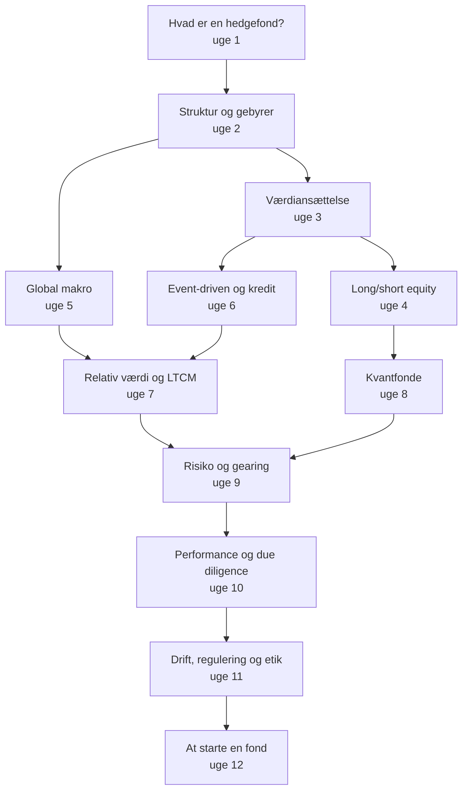

# Hedgefonde: struktur, strategier og risiko

*Læringsplan, noter, øvelser og løsninger til YouTube-playlisten **"Hedge Funds - Structure, Strategies and Risk"***

Dette dokument er din studiemakker til playlisten. Videoerne giver dig forelæsninger, praktikere og de store sager, og dokumentet giver dig resten: en plan uge for uge, noter der dækker det, videoerne mangler, regneopgaver og analyseopgaver med løsninger, Python-modeller og et afsluttende projekt, hvor du designer og forsvarer din egen (fiktive) fond.

Når du er færdig, skal du kunne forklare

> **hvad en hedgefond er → hvordan den er bygget og betalt → hvordan hver strategi tjener (og taber) penge → hvordan risiko og gearing styres → hvordan investorer vurderer fonde → hvilke regler og hvilken etik der gælder**

og kunne svare præcist på spørgsmål som *"Hvorfor er 2-og-20 en option for forvalteren?"*, *"Hvorfor gik LTCM ned, selv om de havde ret på lang sigt?"* og *"Hvilke røde flag burde have afsløret Madoff?"*.

> ⚠️ **Vigtigt: undervisning, ikke investeringsrådgivning.**
> - Intet i dette dokument er en anbefaling om at købe eller sælge noget. Aktiecases og pitches er træningsøvelser på papir.
> - Hedgefonde er generelt kun for professionelle og velhavende investorer. Gearing, short-salg og derivater kan give tab, der er større end indskuddet.
> - **Insiderhandel og markedsmanipulation er ulovligt** (EU's markedsmisbrugsforordning, MAR). Uge 11 gennemgår reglerne.

---

## Sådan bruger du planen

**Forudsætninger:** Matematik A, lidt Python og en grundlæggende forståelse af aktier og renter. Planen kan følges alene eller **ved siden af quant-planen** (`Quant_Trading_Research_Laeringsplan.md`). Den går mere i dybden med statistik, tidsrækker og derivater, mens denne plan handler om branchen, strategierne og beslutningerne.

**Rytmen i en uge** (typisk 3 arbejdsgange á 2–3 timer):

1. **Se videoerne.** Stop ved hvert *"Pause og tænk"*-spørgsmål. Videoer markeret *(valgfri)* kan du springe over første gang.
2. **Læs 🧠 Kernebegreber.** Noterne dækker hele ugen, også de emner, der ikke findes gode videoer om: fondsstruktur og high-water mark, prime brokerage, Amaranth, regulering (AIFMD, MAR, SEC) og multi-manager-fonde.
3. **Lav øvelserne:** regneopgaver ★, analyse ★★, udfordringer ★★★, Python-modeller 💻 og skriftlige analyser 🗣️.
4. **Tjek løsningerne først efter et ærligt forsøg.**
5. **Tag checkpointet,** før du går videre.

**Symbolforklaring:**

| Mærke | Betydning |
|---|---|
| ★ / ★★ / ★★★ | Beregning / analyse / udfordring |
| 💻 | Python-model (kun standardbiblioteket, simuleret eller fiktiv data) |
| 🗣️ | Skriftlig analyse eller forklaring med dine egne ord |
| **H5.3** | Video fra playlisten (uge 5, nummer 3). Den fulde liste står i `Hedge_Fund_Cloud_Handoff.md` |
| 🔎 | Søgeplads: der fandtes ingen god, bekræftet video, så noterne dækker emnet fuldt |

**Visning:** LaTeX-formler, foldbare løsninger og Mermaid-diagram vises bedst i **Obsidian**, **VS Code** eller på **GitHub**.

---

## Fremskridt

- [ ] Uge 1: Hvad er en hedgefond?
- [ ] Uge 2: Struktur, gebyrer og investorer
- [ ] Uge 3: Regnskab og værdiansættelse
- [ ] Uge 4: Long/short equity og short-salg · *Projekt del A*
- [ ] Uge 5: Global makro
- [ ] Uge 6: Event-driven, kredit og distressed
- [ ] Uge 7: Relativ værdi, arbitrage og LTCM · *Projekt del B*
- [ ] Uge 8: Kvantitative og systematiske fonde
- [ ] Uge 9: Risikostyring, gearing og kollaps
- [ ] Uge 10: Performance, allokatorer og due diligence · *Projekt del C*
- [ ] Uge 11: Drift, regulering og etik
- [ ] Uge 12: At starte en fond: kultur og karriere · *Projekt del D*
- [ ] Afsluttende selvtest

---

## Det store kort



Den røde tråd er **gearing og likviditet**. Næsten alle store hedgefond-kollaps, fra LTCM (uge 7) og Amaranth over quant-kollapset i 2007 (uge 8) til Archegos (uge 9), handler mindre om at have forkert og mere om ikke at kunne holde positionen længe nok.

---

## Overblik: 12 uger

| Uge | Emne | Videoer (kerne) | Tilføjet i noterne | Tid (ca.) |
|---|---|---|---|---|
| 1 | Hvad er en hedgefond? | Khan Academy, Shiller, Redleaf (Yale) | Historie, myter, Buffetts væddemål | 6½ t |
| 2 | Struktur, gebyrer og investorer | Swensen (Yale) | Master-feeder, high-water mark, gebyrmotor | 6½ t |
| 3 | Regnskab og værdiansættelse | Ackman, Damodaran ×2 | DCF og multipler for "Nordlys A/S" | 8½ t |
| 4 | Long/short equity og short-salg | Damodaran, Boyle (GameStop) | Eksponering, låneomkostninger, squeeze | 8½ t |
| 5 | Global makro | Dalio, Shiller (pengepolitik), Boyle (Soros) | Renteparitet, kronens fastkurs | 8 t |
| 6 | Event-driven, kredit og distressed | Boyle (merger arb), Icahn, Howard Marks | Implicit sandsynlighed, obligationsmatematik | 8½ t |
| 7 | Relativ værdi og LTCM | Rosenfeld (LTCM), Haghani | Konvergenshandler, margin calls | 8½ t |
| 8 | Kvantitative fonde | Simons, Man AHL, Asness, Lo | Quant-kollapset i 2007, crowding | 8½ t |
| 9 | Risiko, gearing og kollaps | Boyle (Archegos) | VaR/ES, margin-spiraler, Amaranth | 7½ t |
| 10 | Performance og due diligence | Lo (NBER), 60 Minutes (Madoff) | Bias i indeks, udglattede afkast, røde flag | 9 t |
| 11 | Drift, regulering og etik | Shiller (svindel og regulering) | AIFMD, MAR, SEC, SAC Capital | 7½ t |
| 12 | At starte en fond, kultur og karriere | Dalio TED | Pod-modellen, forretningsmodel, karrierer | 6½ t |
| +1–2 | Projekt og selvtest | | *Byg og forsvar en hedgefond* | 10–15 t |

---

## Hvad jeg har tilføjet, og hvorfor

1. **Emner uden god video er dækket fuldt i noterne:** fondsstruktur (master-feeder, prime broker, administrator), high-water mark-mekanik, Amaranth, regulering (AIFMD, MAR, SEC) og multi-manager-"pods". Videoerne om dem kom fra AI-genererede "dokumentar"-kanaler eller trading-influencere og er derfor valgt fra. Hvor der måske findes en god video, står der en 🔎-søgeplads i handoff'en.
2. **Tal og modeller frem for anekdoter.** Hver strategi har en lille regnemodel i Python: gebyrmotor, DCF, merger-arb, konvergenshandel med margin calls, VaR og performance-analyse.
3. **Sagerne er brugt som træning,** ikke som underholdning: LTCM, Soros 1992, quant-kollapset i 2007, Madoff, SAC Capital, GameStop, Amaranth og Archegos. Du lærer at se, hvad der kunne vides på forhånd.
4. **Dansk og europæisk kontekst:** Finanstilsynet, AIFMD og MAR, kronens fastkurspolitik, Lasse Heje Pedersen (CBS) og et praksis-forløb i mikrostruktur fra Københavns Universitet i quant-planen.
5. **Et projekt i fire dele:** en aktie-pitch, en handelsidé, en due diligence-rapport og din egen fond med term sheet og forretningsmodel.

---

## Notation: snydeark

| Symbol / begreb | Betydning | Uge |
|---|---|---|
| AUM | Aktiver under forvaltning (assets under management) | 1–2 |
| 2 og 20 | 2 % årligt forvaltningsgebyr + 20 % resultathonorar | 2 |
| HWM | High-water mark: højeste NAV, der er betalt resultathonorar af | 2 |
| NAV | Indre værdi pr. andel (net asset value) | 2, 11 |
| GP / LP | Forvalter (general partner) / investor (limited partner) | 2 |
| FCFF, WACC, $g$ | Fri pengestrøm, kapitalomkostning, vækstrate | 3 |
| Brutto- / nettoeksponering | (long + short) / (long − short) i forhold til egenkapitalen | 4 |
| $p$ (merger arb) | Markedets implicitte sandsynlighed for at handlen gennemføres | 6 |
| $L$ | Gearing = aktiver / egenkapital | 7, 9 |
| VaR, ES | Value at Risk, Expected Shortfall | 9 |
| $SR,\ \alpha,\ \beta$ | Sharpe ratio, alpha og beta fra regression | 10 |
| IDD / ODD | Investerings- / operationel due diligence | 10 |
| AIFM, AIFMD, MAR | EU's forvalterregler / markedsmisbrugsforordningen | 11 |

---

## Uge 1 — Hvad er en hedgefond?

> **Læringsmål:** Kunne definere en hedgefond præcist og skelne den fra investeringsforeninger/ETF'er, private equity, venture capital, prop trading og family offices. Kende historien fra A.W. Jones til i dag, de vigtigste strategifamilier og investortyper, og regne med brutto- vs. nettoafkast, absolut afkast og alpha.
> **Tidsforbrug:** ca. 2.5 t video · ca. 4 t øvelser
> **Forudsætninger:** HTX Matematik A (procentregning, rentes rente, varians); Foundations-planen (præcise definitioner, simple beviser).

### 📺 Se

- [ ] **H1.1** Hedge funds, venture capital, and private equity | Finance & Capital Markets | Khan Academy (Khan Academy)
  Fokus: den grove forskel på de tre typer "alternative" fonde — hvem investerer, i hvad, og hvor længe.
  Pause og tænk: Hvorfor må en hedgefond typisk kun sælges til professionelle eller velhavende investorer, mens en indeksfond må sælges til alle?
- [ ] **H1.2** 20. Professional Money Managers and their Influence (YaleCourses)
  Fokus: Shillers overblik over professionelle forvaltere — investeringsforeninger, pensionskasser, universitetsfonde og hedgefonde — og deres indflydelse på markedet.
  Pause og tænk: Hvilke incitamenter har en forvalter, der bliver betalt en procentdel af formuen, sammenlignet med en, der får en andel af gevinsten?
- [ ] **H1.3** 14. Guest Lecture by Andrew Redleaf (YaleCourses)
  Fokus: hvordan en praktiserende hedgefondsforvalter (Whitebox Advisors) tænker om markedseffektivitet, risiko og at finde fejlprisninger.
  Pause og tænk: Redleaf er skeptisk over for en ren "markedet har altid ret"-tankegang. Hvad skulle være sandt om markedet, for at hedgefonde *overhovedet* kunne tjene penge systematisk efter gebyrer?

### 🧠 Kernebegreber

**1. Definition.** Der findes ingen entydig juridisk definition af en hedgefond. En brugbar arbejdsdefinition:

> En **hedgefond (hedge fund)** er en *privat* investeringsfond for en *lukket kreds* af investorer, der (i) kun udbydes til professionelle eller særligt kvalificerede investorer, (ii) har et *fleksibelt mandat* — den må gå short, bruge gearing (leverage) og derivater og koncentrere sine positioner — (iii) typisk opkræver både et fast forvaltningshonorar (management fee) og et resultathonorar (performance fee), (iv) har begrænset likviditet for investorerne (lock-up, kvartalsvis indløsning) og (v) ofte sigter mod *absolut afkast (absolute return)* frem for at slå et indeks.

I EU er en hedgefond juridisk en **alternativ investeringsfond (AIF)**, og forvalteren (AIFM) er reguleret af AIFMD-direktivet; i Danmark giver Finanstilsynet tilladelse til og fører tilsyn med AIF-forvaltere (mere i uge 2 og 11). Ordet "hedge" er historisk: en hedgefond er *ikke* nødvendigvis afdækket — mange har betydelig markedseksponering.

**2. Kort historie.**
- **1949:** Alfred Winslow Jones starter A.W. Jones & Co.: *long* i aktier han tror på, *short* i aktier han tror er for dyre (så markedsrisikoen delvis udlignes), *gearing* til at skalere aktievalget op, og et **resultathonorar på 20 %** af gevinsten (oprindeligt uden fast forvaltningshonorar). Det er skabelonen for long/short equity (uge 4).
- **1966:** En artikel i *Fortune* gør modellen kendt; mange kopierer den. Bjørnemarkedet (bear market) 1969–74 rammer mange af de nye fonde hårdt — de var ofte mere long end "hedged".
- **1990'erne — makroæraen:** Soros' Quantum Fund (pundet 1992, uge 5), Julian Robertsons Tiger og andre store makrofonde. **1998:** LTCM kollapser (uge 7).
- **2000'erne–2020'erne:** Institutionalisering — pensionskasser og universitetsfonde bliver de største investorer; quant-fonde og multi-manager-platforme vokser. Kriser undervejs: quant quake august 2007 (uge 8), 2008 (den gennemsnitlige hedgefond tabte markant, men mindre end aktiemarkedet), Madoff 2008 (uge 10), Archegos 2021 (uge 9).
- **Størrelse:** Den samlede branche forvaltede **ca. 4.5 billioner USD (engelsk: *trillion*, $10^{12}$) ved udgangen af 2024** ifølge HFR. Tallene varierer efter kilde og definition (fx om multi-manager-fondes gearing tælles med), så brug dem som størrelsesorden. Bemærk: dansk "billion" = engelsk "trillion".

**3. Sammenligning med andre investeringsformer.**

| Type | Typiske investorer | Likviditet for investor | Short/gearing | Typiske gebyrer | Regulering (EU) |
|---|---|---|---|---|---|
| Investeringsforening / UCITS-ETF | Alle, også små private | Daglig | Stærkt begrænset | 0.05–1.5 % p.a. | UCITS-direktivet, stram |
| Hedgefond | Professionelle, velhavende | Månedlig/kvartalsvis, lock-up | Ja, fleksibelt | Fx 1.5–2 % + 15–20 % af gevinst | AIFMD |
| Private equity (kapitalfond) | Institutioner | Bundet ca. 10 år | Gearing i porteføljeselskaber | Fx 2 % + 20 % carried interest | AIFMD |
| Venture capital | Institutioner, fonde | Bundet ca. 10 år | Sjældent | Fx 2 % + 20 % | AIFMD (evt. lettere regime) |
| Prop trading-firma | Ingen eksterne — egne penge | — | Ja | — | Som værdipapirhandler |
| Family office | Én familie | Efter familiens ønske | Ja, kan være stor | Interne omkostninger | Ofte let reguleret |

Hedgefonde handler typisk *likvide* værdipapirer og kan vende porteføljen hurtigt; private equity *køber hele virksomheder* og ejer dem i år. Bemærk "liquid alternatives": UCITS-fonde, der kopierer hedgefondsstrategier inden for UCITS' regler. Family offices kan være lige så aggressive som hedgefonde, men med mindre gennemsigtighed — Archegos var et family office.

**4. Hvem investerer?** Pensionskasser (inkl. danske — typisk som en mindre andel af "alternative investeringer"), universitetsfonde/endowments (Yale-modellen, uge 2), statslige formuefonde (sovereign wealth funds), family offices, fund of funds (fonde der investerer i flere hedgefonde og lægger et ekstra gebyrlag på) og velhavende privatpersoner. Institutioner søger primært *diversifikation* og *afkast med lav korrelation til aktier*, ikke nødvendigvis det højeste rå afkast.

**5. Strategikort (følger planens uger).**

| Familie | Idé i én sætning | Uge |
|---|---|---|
| Long/short equity | Køb undervurderede, shorte overvurderede aktier | 4 |
| Global makro | Positioner i renter, valuta, råvarer ud fra økonomiske syn | 5 |
| Event-driven, kredit, distressed | Fusioner, aktivisme, virksomheder i krise, obligationer | 6 |
| Relativ værdi / arbitrage | Køb det billige og sælg det dyre af to næsten ens aktiver, ofte med gearing | 7 |
| Kvantitativ / systematisk (inkl. CTA) | Regler og modeller i stedet for skøn, mange små positioner | 8 |
| Multi-strategi / multi-manager | Mange teams ("pods") med strenge risikogrænser under ét tag | 12 |

**6. Absolut afkast, beta og alpha.** En investeringsforening har typisk et *relativt* mål: slå sit benchmark. En hedgefond med *absolut afkast*-mål forsøger at tjene penge i alle markeder (fx "$r_f$ + 4 % p.a. med lav volatilitet"). For at skelne dygtighed fra markedseksponering skriver man fondens merafkast som

$$
R_p - r_f = \alpha + \beta\,(R_m - r_f) + \varepsilon ,
$$

hvor $R_m$ er markedets afkast, $\beta$ fondens følsomhed over for markedet, $\varepsilon$ støj med middelværdi 0, og **alpha** $\alpha$ det merafkast, markedet *ikke* forklarer. Ex post: $\alpha = (R_p - r_f) - \beta(R_m - r_f)$.

*Eksempel:* $r_f = 3\,\%$, $R_m = 12\,\%$, fonden giver $R_p = 10\,\%$ med $\beta = 0.5$. Forventet ud fra beta: $3 + 0.5\cdot 9 = 7.5\,\%$, så $\alpha = 10 - 7.5 = 2.5$ procentpoint. Fonden "tabte" til markedet, men skabte alpha. Pointe: beta kan købes billigt i en indeksfond; det er alpha (og diversifikation), man bør betale hedgefondsgebyrer for.

**7. Brutto vs. netto (uge 1-konvention).** Med forvaltningshonorar $m$ (fx 2 %) af primo-formuen og resultathonorar $p$ (fx 20 %) af gevinsten efter forvaltningshonorar, og *uden* high-water mark (indføres i uge 2):

$$
n = g - m - p\cdot\max(g-m,\,0),
$$

hvor $g$ er bruttoafkast (gross return) og $n$ nettoafkast (net return). *Eksempel:* $g = 15\,\%$: $15 - 2 = 13$, resultathonorar $0.2\cdot 13 = 2.6$, så $n = 10.4\,\%$. Gebyrerne tager $4.6$ af $15$ procentpoint, dvs. ca. 31 % af bruttogevinsten. Ved $g = -5\,\%$ er $n = -7\,\%$.

Til sammenligning af risiko bruger vi **Sharpe ratio** $SR = (E[R] - r_f)/\sigma$ over samme periode (her år); den måler merafkast pr. enhed volatilitet og uddybes i uge 10. Beregnes den på daglige afkast, annualiseres den som $SR_{\text{år}} = SR_{\text{dag}}\cdot\sqrt{252}$ — det forudsætter, at de daglige afkast er uafhængige og identisk fordelte (iid), hvilket sjældent holder præcist for hedgefonde (uge 10).

**8. Myter og virkelighed.**
- *"Hedgefonde slår markedet."* Efter gebyrer har et bredt hedgefondsindeks (fx HFRI Fund Weighted Composite) i perioden ca. 2009–2020 typisk givet flere procentpoint mindre om året end S&P 500 målt i rå afkast. Men de havde også lavere beta og volatilitet — en fair sammenligning er risikojusteret (uge 10). Gennemsnittet skjuler stor spredning mellem fonde.
- *Buffetts væddemål (2008–2017):* Warren Buffett vædede med Protégé Partners om, at en S&P 500-indeksfond (Vanguard) over 10 år ville slå en kurv af fem fund of funds valgt af Protégé. **Indeksfonden vandt klart:** ifølge Buffetts aktionærbrev for 2017 gav den ca. 8.5 % p.a. (ca. 126 % samlet), mens fund-of-funds-kurvene lå på ca. 0.3–6.5 % p.a. Forklaringer: et stærkt aktiemarked (hvor lav beta "koster"), og to gebyrlag. Det viser *ikke*, at alle hedgefonde er dårlige — men at gebyrer og lav beta har en høj pris i et stigende marked.
- *"Hedgefonde er altid risikable"* og *"hedgefonde er altid afdækkede"* er begge forkerte: risikoen varierer enormt mellem strategier.
- *Overlevelsesbias (survivorship bias):* Fonde, der lukker efter tab, forsvinder fra databaserne, så historiske gennemsnit ser for pæne ud (uge 10).

**Typiske fejl**
- At tro "hedge" betyder risikofri eller markedsneutral.
- At sammenligne hedgefonde med S&P 500 uden at korrigere for beta og volatilitet — eller omvendt at bruge "risikojustering" som undskyldning for høje gebyrer uden alpha.
- At glemme, at gebyrer også rammer *rentes rente*: et tabt procentpoint i år mangler også at forrente sig næste år.
- At forveksle dansk *milliard/billion* med engelsk *billion/trillion*.
- At kalde et højt afkast "alpha" uden at trække markedets bidrag fra.

### ✏️ Øvelser

**1.1** ★ — Klassificér hver enhed som *UCITS-ETF*, *hedgefond*, *private equity*, *venture capital*, *prop trading-firma* eller *family office*, og begrund kort: (a) Fond der køber hele mellemstore industrivirksomheder med lånte penge og sælger dem efter 4–7 år. (b) Fond der følger MSCI World, handles på børsen og kan købes af alle. (c) Firma hvor ansatte tradere handler futures for firmaets egne penge. (d) Fond med kvartalsvis indløsning, 1 års lock-up, 2 % + 20 %, som er long 130 % og short 70 % af formuen i europæiske aktier. (e) Selskab der forvalter formuen for én familie efter et virksomhedssalg. (f) Fond der investerer i 25 nystartede softwarevirksomheder pr. fondsgeneration.

**1.2** ★ — Brug uge 1-konventionen med $m = 2\,\%$ og $p = 20\,\%$. Find nettoafkastet for bruttoafkast $g = 15\,\%$, $g = 2\,\%$ og $g = -5\,\%$. Hvor stor en andel af bruttogevinsten tager gebyrerne i tilfældet $g = 15\,\%$?

**1.3** ★ — Et år falder aktiemarkedet 20 %, og $r_f = 2\,\%$. Investeringsforeningen *Nordisk Aktie* (benchmark: markedet) giver −15 %; hedgefonden *Fjeld Absolute* (mål: $r_f$ + 4 %) giver −3 %. (a) Find hver fonds afkast relativt til sit mål. (b) Hvem nåede sit mål? (c) Året efter stiger markedet 25 %, og Fjeld giver +8 %. Har Fjeld "fejlet"?

**1.4** ★ — En Jones-fond har 100 mio. kr. i egenkapital, er long 110 mio. kr. og short 50 mio. kr. (se bort fra finansieringsomkostninger og renter på short-provenuet). (a) Find brutto- og nettoeksponering (gross/net exposure) i procent af egenkapitalen. (b) Find fondens afkast, hvis longs stiger 12 % og shorts stiger 7 %. (c) Find afkastet, hvis longs falder 8 % og shorts falder 13 %. (bruges i uge 4)

**1.5** ★★ — $r_f = 3\,\%$, $R_m = 11\,\%$. Fond A giver 9 % med $\beta = 0.4$; fond B giver 13 % med $\beta = 1.3$. (a) Beregn alpha for begge. (b) Hvilken fond skabte værdi ud over markedseksponering? (c) Forklar, hvordan en investor i princippet kan kombinere fond A med en indeksfond og et lån/indskud til $r_f$, så kombinationen får $\beta = 1$, og find dens afkast.

**1.6** ★★ — Med uge 1-konventionen: (a) Vis, at det bruttoafkast $g$, der giver et ønsket nettoafkast $n > 0$, er $g = m + n/(1-p)$. (b) Hvilket bruttoafkast kræves for $n = 4\,\%$ med 2 og 20? (c) Find gebyrernes andel af bruttogevinsten ved $g = 10\,\%$.

**1.7** ★★ — Buffetts væddemål. (a) Hvad bliver 1 USD til over 10 år ved 8.5 % p.a.? Ved 2.2 % p.a.? (b) En fund of funds tager 1 % + 10 % oven på de underliggende hedgefondes 2 % + 20 % (begge med uge 1-konventionen). Hvis de underliggende fonde tjener 8 % brutto, hvad får slutinvestoren så? (c) Hvor stor en andel af bruttoafkastet går til gebyrer, og hvad bliver forskellen efter 10 år?

**1.8** ★★ — Diversifikation. Aktier: forventet afkast 8 %, volatilitet 16 %. En hedgefond: 6 %, volatilitet 8 %, korrelation med aktier $\rho = 0.2$. $r_f = 2\,\%$. (a) Beregn Sharpe ratio (årlig) for hver. (b) Find forventet afkast, volatilitet og Sharpe ratio for 80 % aktier + 20 % hedgefond. (Brug $\mathrm{Var}(wX + (1-w)Y) = w^2\sigma_X^2 + (1-w)^2\sigma_Y^2 + 2w(1-w)\rho\sigma_X\sigma_Y$.) (c) Hvad viser det om, hvorfor institutioner kan ønske en fond med lavere afkast end aktier?

**1.9** ★★★ — Resultathonoraret som en option. Lad $f(g) = m + p\max(g-m, 0)$ være gebyret og $n(g) = g - f(g)$ nettoafkastet. (a) Vis, at $f$ er konveks og $n$ konkav. (b) Brug Jensens ulighed til at vise $E[n(G)] \le n(E[G])$ for et stokastisk bruttoafkast $G$. (c) Taleksempel: sammenlign et sikkert $g = 10\,\%$ med $G = +30\,\%$ eller $-10\,\%$ med sandsynlighed ½ hver. Beregn forventet nettoafkast og forventet gebyr. Hvem har glæde af volatiliteten? (uddybes i uge 2)

**1.10** ★★ 💻 — Skriv et program, der simulerer 10 års bruttoafkast $g_t \sim N(9\,\%, 10\,\%^2)$ med `random.seed(42)`, anvender 2 og 20 med uge 1-konventionen hvert år, og udskriver brutto- og nettoafkast pr. år, slutværdien af 100 brutto og netto, de samlede gebyrer, og hvor stor en andel af bruttogevinsten investor mister. Forklar, hvorfor tabet er større end summen af gebyrerne.

**1.11** ★★ 💻 — Alpha-intuition med regression. Simulér 120 måneder: markedets merafkast $x_t \sim N(0.6\,\%, 4.5\,\%^2)$ og fondens merafkast $y_t = 0.2\,\% + 0.4\,x_t + e_t$, $e_t \sim N(0, 1.5\,\%^2)$. Estimér $\beta = \widehat{\mathrm{Cov}}(x,y)/\widehat{\mathrm{Var}}(x)$ og $\alpha = \bar y - \beta\bar x$ med `random.seed(2)`, annualisér alpha (×12), og beregn standardfejlen $\mathrm{se}(\hat\alpha) = s\sqrt{1/n + \bar x^2/S_{xx}}$ med $s^2 = \sum \hat e_t^2/(n-2)$ og $S_{xx} = \sum (x_t - \bar x)^2$. Gentag for seeds 1–5. Hvad lærer du om at *måle* alpha? (bruges i uge 10)

**1.12** ★★ 🗣️ — Skriv ½–1 side: "Hedgefonde slog ikke S&P 500 i 2009–2019 — er de derfor en dårlig investering?" Tag stilling, og brug mindst tre begreber fra ugen.

### ✅ Løsninger

<details>
<summary>Løsning 1.1</summary>

(a) **Private equity** — køber hele virksomheder med gæld (buyout), lang holdeperiode. (b) **UCITS-ETF** — børsnoteret, daglig likviditet, alle må købe. (c) **Prop trading-firma** — egne penge, ingen eksterne investorer. (d) **Hedgefond** — begrænset likviditet, lock-up, resultathonorar og en 130/70 long/short-portefølje (nettoeksponering 60 %). (e) **Family office**. (f) **Venture capital** — tidlig fase, mange små ejerandele i startups.

</details>

<details>
<summary>Løsning 1.2</summary>

- $g = 15\,\%$: efter forvaltningshonorar 13 %; resultathonorar $0.2\cdot 13 = 2.6$; $n = 10.4\,\%$. Gebyrer $2 + 2.6 = 4.6$ procentpoint, dvs. $4.6/15 \approx 30.7\,\%$ af bruttogevinsten.
- $g = 2\,\%$: $g - m = 0$, intet resultathonorar; $n = 0\,\%$.
- $g = -5\,\%$: $n = -5 - 2 = -7\,\%$ (resultathonoraret er aldrig negativt).

</details>

<details>
<summary>Løsning 1.3</summary>

(a) Nordisk Aktie: $-15 - (-20) = +5$ procentpoint i forhold til benchmark. Fjeld: mål $2 + 4 = 6\,\%$, afkast $-3\,\%$, dvs. $-9$ procentpoint under målet.
(b) Nordisk Aktie nåede sit *relative* mål (slog markedet), selv om investorerne tabte 15 %. Fjeld nåede ikke sit *absolutte* mål, men beskyttede kapitalen langt bedre.
(c) Ikke i forhold til sit mandat: $8\,\% > 6\,\%$, så det absolutte mål er nået. At ligge 17 procentpoint under markedet er netop prisen for lav markedseksponering. Over de to år: Fjeld $0.97\cdot 1.08 - 1 = 4.8\,\%$; markedet $0.80\cdot 1.25 - 1 = 0\,\%$; Nordisk Aktie med fx +28 % i år 2 ville give $0.85\cdot 1.28 - 1 = 8.8\,\%$ — hvem der "vinder", afhænger af perioden.

</details>

<details>
<summary>Løsning 1.4</summary>

(a) Bruttoeksponering $(110 + 50)/100 = 160\,\%$; nettoeksponering $(110 - 50)/100 = 60\,\%$.
(b) Long-gevinst $110\cdot 0.12 = 13.2$; short-tab $50\cdot 0.07 = 3.5$. Afkast $(13.2 - 3.5)/100 = 9.7\,\%$.
(c) Long-tab $110\cdot 0.08 = 8.8$; short-gevinst $50\cdot 0.13 = 6.5$. Afkast $-2.3\,\%$.
I begge scenarier slog longs shorts med 5 procentpoint — det er aktievalget (alpha-kilden), mens nettoeksponeringen på 60 % bestemmer, hvor meget markedet trækker.

</details>

<details>
<summary>Løsning 1.5</summary>

(a) A: $\alpha = (9 - 3) - 0.4\cdot(11 - 3) = 6 - 3.2 = 2.8$ procentpoint. B: $\alpha = (13 - 3) - 1.3\cdot 8 = 10 - 10.4 = -0.4$ procentpoint.
(b) A skabte positiv alpha; B's højere afkast skyldes udelukkende høj beta (og var faktisk lidt dårligere end en geareret indeksposition).
(c) Hold 100 % i A og en indeksposition på $0.6$ (finansieret med lån til $r_f$, så den samlede formue stadig er 100 %). Beta: $0.4 + 0.6 = 1$. Afkast: $9 + 0.6\cdot(11 - 3) = 9 + 4.8 = 13.8\,\% = r_f + 1\cdot 8 + 2.8$. Alpha "flyttes" uændret over på en beta-1-portefølje (portable alpha) — forudsat man kan låne til $r_f$ og ser bort fra omkostninger. Bemærk, at kombinationen er geareret: falder markedet, forstørres tabet tilsvarende, og den estimerede alpha er usikker (øvelse 1.11).

</details>

<details>
<summary>Løsning 1.6</summary>

(a) For $g > m$: $n = (g - m)(1 - p)$, så $g - m = n/(1-p)$ og $g = m + n/(1-p)$. ($n > 0$ kræver netop $g > m$.)
(b) $g = 2 + 4/0.8 = 2 + 5 = 7\,\%$.
(c) $g = 10\,\%$: $n = 8\cdot 0.8 = 6.4\,\%$; gebyrer $3.6$ procentpoint $= 36\,\%$ af bruttogevinsten. (Ved 15 % var andelen ca. 31 % — andelen falder med $g$, fordi det faste honorar fylder mindre.)

</details>

<details>
<summary>Løsning 1.7</summary>

(a) $1.085^{10} \approx 2.261$ (ca. +126 %); $1.022^{10} \approx 1.243$ (ca. +24 %).
(b) Hedgefondslag: $(8 - 2)\cdot 0.8 = 4.8\,\%$. Fund-of-funds-lag: $(4.8 - 1)\cdot 0.9 = 3.42\,\%$.
(c) Gebyrer: $8 - 3.42 = 4.58$ procentpoint, dvs. ca. 57 % af bruttoafkastet. Over 10 år: $1.08^{10} \approx 2.159$ mod $1.0342^{10} \approx 1.400$ — investor får ca. 40 % gevinst i stedet for ca. 116 %. Gebyrlag er en central forklaring på væddemålets udfald.

</details>

<details>
<summary>Løsning 1.8</summary>

(a) Aktier: $(8-2)/16 = 0.375$. Hedgefond: $(6-2)/8 = 0.5$.
(b) $E = 0.8\cdot 8 + 0.2\cdot 6 = 7.6\,\%$. Varians (i %²): $0.64\cdot 256 + 0.04\cdot 64 + 2\cdot 0.8\cdot 0.2\cdot 0.2\cdot 16\cdot 8 = 163.84 + 2.56 + 8.192 = 174.592$, så $\sigma \approx 13.21\,\%$. $SR = 5.6/13.21 \approx 0.424$.
(c) Porteføljen har lidt lavere afkast men klart lavere risiko og *højere* Sharpe ratio end rene aktier (fx 50/50 giver $SR \approx 0.52$). Lav korrelation gør fonden værdifuld *i porteføljen*, selv om dens eget afkast er lavere. Forudsætning: at de 6 % og $\rho = 0.2$ holder efter gebyrer og i kriser — det gør korrelationer ofte ikke.

</details>

<details>
<summary>Løsning 1.9</summary>

(a) $g \mapsto \max(g - m, 0)$ er maksimum af to affine funktioner og derfor konveks; $f = m + p\cdot(\text{konveks})$ med $p > 0$ er konveks. $n(g) = g - f(g)$ er en affin funktion minus en konveks, altså konkav.
(b) Jensens ulighed for konkav $n$: $E[n(G)] \le n(E[G])$. Ækvivalent: $E[f(G)] \ge f(E[G])$ — samme forventede bruttoafkast giver højere forventet gebyr, jo mere spredt afkastet er.
(c) Sikkert: $n(10\,\%) = 6.4\,\%$, gebyr $3.6\,\%$.
Risikabelt: $n(30\,\%) = 30 - 2 - 0.2\cdot 28 = 22.4\,\%$; $n(-10\,\%) = -12\,\%$. $E[n] = (22.4 - 12)/2 = 5.2\,\%$. Gebyr: $(2 + 5.6)/2 + 2/2 = 4.8\,\%$.
Samme forventede brutto (10 %), men forvalteren får $1.2$ procentpoint mere, og investoren $1.2$ procentpoint mindre (plus mere risiko). Forvalteren ejer reelt en *call-option* på fondens resultat — og optioner er mere værd, jo højere volatiliteten er. Det er kernen i moral hazard-problemet i uge 2.

</details>

<details>
<summary>Løsning 1.10</summary>

```python
import random

random.seed(42)
m, p = 0.02, 0.20            # 2 % management fee, 20 % incentive fee
gross_val = net_val = 100.0  # start-NAV
fees_total = 0.0
print("År  brutto   netto   gebyr")
for year in range(1, 11):
    g = random.gauss(0.09, 0.10)          # simuleret bruttoafkast
    mgmt = m * net_val                    # på primo-NAV
    gain = g * net_val - mgmt             # gevinst efter mgmt fee
    inc = p * max(gain, 0.0)              # ingen HWM (uge 1-konvention)
    new_net = net_val + gain - inc
    fees_total += mgmt + inc
    print(f"{year:2d} {g:7.2%} {new_net/net_val - 1:7.2%} {mgmt + inc:7.2f}")
    net_val = new_net
    gross_val *= 1 + g
print(f"Brutto slutværdi: {gross_val:.2f}")
print(f"Netto slutværdi:  {net_val:.2f}")
print(f"Gebyrer i alt:    {fees_total:.2f}")
print(f"Andel af bruttogevinst tabt: {1 - (net_val - 100) / (gross_val - 100):.1%}")
```

Forventet output:

```text
År  brutto   netto   gebyr
 1   7.56%   4.45%    3.11
 2   7.27%   4.22%    3.19
 3   7.89%   4.71%    3.46
 4  16.02%  11.22%    5.48
 5   7.72%   4.58%    3.99
 6  -5.97%  -7.97%    2.65
 7  12.32%   8.26%    4.96
 8   6.33%   3.46%    3.78
 9   6.83%   3.86%    4.05
10  10.16%   6.53%    5.15
Brutto slutværdi: 205.60
Netto slutværdi:  151.19
Gebyrer i alt:    39.82
Andel af bruttogevinst tabt: 51.5%
```

Forskellen $205.60 - 151.19 = 54.41$ er større end gebyrerne $39.82$, fordi hvert betalt gebyr også mister sit fremtidige afkast (tabt rentes rente). Bemærk også år 7: gebyr betales på hele gevinsten, selv om en del blot genvinder tabet fra år 6 — det forhindrer en high-water mark (uge 2).

</details>

<details>
<summary>Løsning 1.11</summary>

```python
import math
import random
from statistics import mean

def estimate(seed, n=120):
    random.seed(seed)
    x = [random.gauss(0.006, 0.045) for _ in range(n)]           # markedets merafkast
    y = [0.002 + 0.4 * xi + random.gauss(0, 0.015) for xi in x]  # fondens merafkast
    mx, my = mean(x), mean(y)
    sxx = sum((a - mx) ** 2 for a in x)
    beta = sum((a - mx) * (b - my) for a, b in zip(x, y)) / sxx
    alpha = my - beta * mx
    resid = [b - alpha - beta * a for a, b in zip(x, y)]
    s2 = sum(e * e for e in resid) / (n - 2)
    se_alpha = math.sqrt(s2 * (1 / n + mx ** 2 / sxx))
    return beta, alpha, se_alpha

beta, alpha, se = estimate(2)
print(f"beta = {beta:.3f}")
print(f"alpha pr. måned = {alpha:.4%} (sand værdi 0.2000%)")
print(f"alpha p.a. (x12) = {12 * alpha:.2%}")
print(f"std.fejl(alpha) = {se:.4%}, t = {alpha / se:.2f}")
for s in range(1, 6):
    print(s, f"{estimate(s)[1]:.4%}")
```

Forventet output:

```text
beta = 0.423
alpha pr. måned = 0.2248% (sand værdi 0.2000%)
alpha p.a. (x12) = 2.70%
std.fejl(alpha) = 0.1319%, t = 1.71
1 0.5033%
2 0.2248%
3 0.0770%
4 0.2955%
5 0.1101%
```

(Bemærk: $\mathrm{Cov}/\mathrm{Var}$ med $n-1$ i begge nævnere giver samme $\beta$ som $S_{xy}/S_{xx}$.) Pointe: selv med 10 års data og en *sand* alpha på 2.4 % p.a. svinger estimatet fra ca. 0.9 % til 6 % p.a. mellem seeds, og for seed 2 er t-værdien kun 1.71 — under den sædvanlige grænse på ca. 2. (Med $s \approx 1.5\,\%$ er den teoretiske standardfejl ca. $0.14\,\%$ pr. måned, så selv den *sande* alpha giver i gennemsnit kun $t \approx 1.5$.) Alpha er svær at skelne fra held — derfor er track records på få år meget usikre (uge 10).

</details>

<details>
<summary>Løsning 1.12</summary>

Et godt svar indeholder:
- At rå afkast ikke er nok: hedgefondsindekser havde lavere beta og volatilitet, og 2009–2019 var et usædvanligt stærkt aktiemarked, hvor lav beta koster meget.
- Alpha-begrebet: spørgsmålet er, om fondene leverede merafkast *ud over* deres markedseksponering — og om det var positivt efter gebyrer.
- Diversifikationsargumentet (som i 1.8) og at det kræver lav korrelation *også i kriser*.
- Gebyrernes betydning (1.6–1.7), inkl. at beta kan købes billigt via indeksfonde.
- Spredning: "gennemsnitsfonden" findes ikke; nogle fonde er meget bedre, mange dårligere, og overlevelsesbias pynter på gennemsnittet.
- En nuanceret konklusion: ikke "dårlige" per se, men mange var dyre for det, de leverede; Buffetts væddemål som konkret illustration, korrekt gengivet.

</details>

### 🔗 Forbindelse

Denne uge tegner kortet: definitionen, investorerne og strategifamilierne, som uge 4–8 gennemgår én for én. Gebyrformlen og option-intuitionen i 1.9 bliver til en fuld gebyrmotor med high-water mark i uge 2, og alpha/beta-regressionen i 1.11 er grundstenen i performanceanalysen i uge 10.

### 🏁 Checkpoint

Du er klar til næste uge, når du kan:
- [ ] Give en præcis definition af en hedgefond og forklare forskellen til en UCITS-fond, private equity og et family office.
- [ ] Fortælle hovedlinjerne i historien fra A.W. Jones (1949) til i dag med mindst fire årstal/begivenheder.
- [ ] Nævne de seks strategifamilier og give én sætning om hver.
- [ ] Beregne nettoafkast fra bruttoafkast med 2 og 20 og forklare, hvorfor gebyrtabet vokser over tid.
- [ ] Beregne alpha ex post givet $R_p$, $R_m$, $r_f$ og $\beta$ — og forklare, hvorfor et estimeret alpha er usikkert.
- [ ] Gengive Buffetts væddemål korrekt og forklare, hvad det viser og ikke viser.

---

## Uge 2 — Struktur, gebyrer og investorer

> **Læringsmål:** Forstå hvordan en hedgefond er bygget juridisk og operationelt (forvaltningsselskab, fond, master-feeder, serviceudbydere), og kunne beregne gebyrer præcist med high-water mark, hurdle og krystallisering. Kunne analysere forvalterens økonomi (break-even AUM) og resultathonoraret som en call-option — set fra både forvalterens og investorens (LP'ens) side.
> **Tidsforbrug:** ca. 1.25 t video (+ ca. 0.25 t valgfri) · ca. 5 t øvelser
> **Forudsætninger:** Uge 1 (gebyrformel uden HWM, alpha/beta); Foundations (funktioner, stykvise definitioner, simple beviser).

### 📺 Se

- [ ] **H2.1** 9. Guest Lecture by David Swensen (YaleCourses)
  Fokus: investorens (LP'ens) syn på hedgefonde — Yale-universitetsfondens aktivallokering, "absolute return" som aktivklasse, og hvorfor interessesammenfald og gebyrer betyder så meget.
  Pause og tænk: Swensen mener, at aktiv forvaltning kun giver mening i ineffektive markeder og med ekstraordinære forvaltere. Hvad betyder det for, hvor stor en andel af *alle* hedgefonde en typisk investor bør overveje?
  Pause og tænk: Hvorfor kan en universitetsfond med en uendelig tidshorisont tåle længere lock-up end en pensionskasse, der skal udbetale pensioner hver måned?
- [ ] **H2.2** Søgeplads: én troværdig forklaring af gebyrstruktur (2-and-20, high-water mark, hurdle) og serviceudbydere (prime broker, administrator) — søg fx: "Patrick Boyle hedge fund fees high water mark" (fx Patrick Boyle; ikke verificeret) — (valgfri)
  Fokus: mekanikken bag high-water mark og hvem der gør hvad omkring fonden. Videoen er ikke verificeret — noterne nedenfor dækker emnet fuldt.
  Pause og tænk: Hvis en fond falder 20 % og derefter stiger 20 %, skal forvalteren så have resultathonorar? Svar før du ser forklaringen.

### 🧠 Kernebegreber

**1. Juridisk struktur.** En hedgefond består typisk af (mindst) tre enheder:

```text
   Investorer (LP'er / aktionærer)
              │  tegner andele
              ▼
   ┌──────────────────────┐   forvaltningsaftale   ┌──────────────────────┐
   │ Fonden (LP/selskab)  │◄──────────────────────►│ Forvaltningsselskab  │
   │ ejer porteføljen     │ ── gebyrer betales ──► │ ansatte, beslutninger│
   └──────────────────────┘                        └──────────────────────┘
              ▲
              │ ledes af General Partner (GP) eller bestyrelse
```

- **Forvaltningsselskabet (management company / investment manager)** ejes af grundlæggerne, ansætter folk og træffer investeringsbeslutningerne. Det modtager forvaltningshonoraret og (direkte eller via GP'en) resultathonoraret.
- **Fonden** er en separat juridisk person: i USA ofte et **limited partnership (LP)**, hvor investorerne er *limited partners* med begrænset hæftelse, og en **general partner (GP)** — typisk et selskab ejet af forvalteren — har ansvaret; offshore (fx Cayman Islands) ofte et **selskab (exempted company)**, hvor investorerne er aktionærer og en bestyrelse (ofte med uafhængige medlemmer) fører tilsyn.
- Dokumenter: tilbudsdokument (*private placement memorandum*, PPM), fondsvedtægter / partnerskabsaftale (LPA) og tegningsaftale (subscription agreement). Her står gebyrer, likviditetsvilkår og risici.

**2. Onshore, offshore og master-feeder.** Investorer har forskellige skatteforhold. En amerikansk skattepligtig investor vil typisk have et skattemæssigt transparent partnership (afkastet beskattes direkte hos investoren). En amerikansk *skattefritaget* investor (pensionskasse, universitetsfond) vil undgå, at gearet afkast bliver skattepligtigt (UBTI, *unrelated business taxable income*), og en ikke-amerikansk investor vil undgå amerikanske skatteforpligtelser. Løsningen er **master-feeder**:

- **Onshore feeder** (fx Delaware LP) for skattepligtige amerikanske investorer; **offshore feeder** (fx Cayman-selskab) for skattefritagede og udenlandske investorer.
- Begge feedere investerer alt i én **masterfond**, som ejer porteføljen og handler. Afkast fordeles forholdsmæssigt (pro rata) til feederne; gebyrer opkræves normalt på feeder-/andelsklasseniveau.
- Fordele: én portefølje (ingen skæv handel mellem fonde, lavere omkostninger, samlet størrelse over for prime brokers), og skatteneutralitet — hver investorgruppe beskattes som om den investerede i "sin" type fond.

I EU bruges ofte fonde i Luxembourg eller Irland. Forvalteren er en **AIFM** under **AIFMD**: tilladelse, krav om uafhængig risikostyring og værdiansættelse, en **depositar (depositary)**, rapportering af gearing, og et markedsføringspas til *professionelle* investorer i hele EU. Små forvaltere under tærsklerne (ca. 100 mio. EUR med gearing, 500 mio. EUR uden gearing og uden indløsningsret i 5 år) skal kun registreres. I Danmark gennemføres AIFMD i lov om forvaltere af alternative investeringsfonde, og **Finanstilsynet** giver tilladelse og fører tilsyn. I USA registreres større rådgivere hos SEC og rapporterer bl.a. på Form PF (mere i uge 11).

**3. Serviceudbydere.**

| Udbyder | Opgaver | Hvorfor vigtig |
|---|---|---|
| Prime broker | Finansiering (margin-lån), værdipapirudlån til short-salg, opbevaring, clearing, rapportering, "capital introduction" | Fondens gearing og shorts afhænger af den; den kan hæve marginkrav i en krise (uge 9) |
| Administrator | Beregner NAV (net asset value), fører investorregister, behandler tegning/indløsning, KYC/AML, gebyrberegning | Uafhængig NAV er et værn mod svindel (Madoff havde ingen reel uafhængig kontrol, uge 10) |
| Revisor | Reviderer årsregnskabet | Uafhængig bekræftelse af aktiver og værdier |
| Custodian / depositar | Opbevarer aktiver; i EU kontrollerer depositaren også pengestrømme og ejerskab | Aktivernes adskillelse fra forvalteren |
| Advokater, compliance | Fondsdokumenter, regulering, markedsføringsregler | Lovlighed og investorbeskyttelse |

Modpartsrisiko: Da Lehman Brothers' europæiske enhed blev sat under insolvensbehandling (administration) i 2008, blev aktiver for en række hedgefonde, der brugte den som prime broker, låst fast i lang tid. Siden bruger større fonde ofte flere prime brokers (multi-prime).

**4. Gebyrer — definitioner.** **Forvaltningshonorar (management fee)** $m$: fast sats p.a. af formuen (historisk 2 %, opkræves typisk månedligt eller kvartalsvist). **Resultathonorar (performance/incentive fee)** $p$: andel af gevinsten (historisk 20 %). "2 og 20" er skabelonen, men branchegennemsnittet er i 2020'erne faldet til ca. 1.3–1.5 % og ca. 15–17 % (opgørelser varierer efter kilde). Nogle store multi-manager-fonde bruger i stedet *pass-through*, hvor investorerne betaler fondens faktiske omkostninger (uge 12).

- **High-water mark (HWM)** $H$: den højeste NAV pr. andel, hvor der senest blev betalt resultathonorar. Der betales kun resultathonorar af værdi *over* $H$ — et tab skal tjenes hjem først.
- **Hurdle rate** $h$: minimumsafkast før resultathonorar. **Hard hurdle:** honorar kun af afkastet *over* hurdlen. **Soft hurdle:** når hurdlen er nået, beregnes honoraret af *hele* gevinsten — typisk med *catch-up*, så investoren aldrig ender under hurdlen.
- **Krystallisering (crystallization):** hvor ofte et optjent (periodiseret) resultathonorar bliver endeligt betalt og $H$ opdateret — oftest årligt. Hyppigere krystallisering er bedre for forvalteren (øvelse 2.5c).
- **Udligning (equalization)** og **serieregnskab (series accounting):** teknikker der sikrer, at investorer, der træder ind på forskellige tidspunkter (og NAV-niveauer), betaler resultathonorar af *deres egen* gevinst (øvelse 2.9).
- **Andelsklasser (share classes):** samme portefølje, forskellige vilkår — fx en *founders' class* med lavere gebyrer for de første investorer, valutasikrede klasser (DKK, EUR), eller lavere gebyr mod længere lock-up.

**5. Gebyrmotoren (uge 2-konvention).** Lad $V_0$ være NAV pr. andel primo, $H$ den aktuelle high-water mark, $g$ bruttoafkastet i året, og $m, p, h$ som ovenfor. Årligt:

$$
M = m V_0,\qquad \tilde V = V_0(1+g) - M,\qquad T = H(1+h),
$$

$$
I_{\text{hard}} = p\,\max(\tilde V - T,\ 0),\qquad
I_{\text{soft}} = \begin{cases} \min\{p(\tilde V - H),\ \tilde V - T\} & \tilde V > T \\ 0 & \text{ellers,}\end{cases}
$$

$$
V_1 = \tilde V - I,\qquad H \leftarrow V_1 \ \text{ hvis } I > 0 .
$$

Uden HWM sættes $H := V_0$ hvert år, og med $h = 0$ giver det præcis uge 1-formlen $I = p\max(g-m,0)V_0$. (I praksis periodiseres gebyrerne månedligt, og den offentliggjorte NAV er efter optjent resultathonorar; konventionen fanger mekanikken.)

*Eksempel:* $V_0 = H = 100$, 2 og 20, ingen hurdle. År 1: $g = -10\,\%$: $M = 2$, $\tilde V = 88$, $I = 0$, $H = 100$. År 2: $g = +20\,\%$: $M = 1.76$, $\tilde V = 105.6 - 1.76 = 103.84$, $I = 0.2\cdot 3.84 = 0.768$, $V_1 = 103.072 = H$. *Uden* HWM ville år 2 koste $0.2\cdot(103.84 - 88) = 3.168$ — forskellen $2.4 = 0.2\cdot 12$ er honoraret for blot at genvinde tabet.

**6. Likviditetsvilkår.**
- **Lock-up:** periode efter tegning, hvor man ikke kan indløse (hard), eller kun mod et indløsningsgebyr på fx 2–5 % (soft).
- **Indløsningsfrekvens og varsel:** fx kvartalsvis med 45–90 dages varsel. Typisk udbetales 90–95 % hurtigt og resten efter revisionen (holdback).
- **Gate:** grænse for hvor stor en andel af fonden (eller af en investors andel), der kan indløses pr. periode, fx 20–25 %. Ved flere anmodninger reduceres alle pro rata.
- **Side pocket:** illikvide aktiver udskilles i en særlig klasse, som kun de daværende investorer deltager i, og som først udbetales ved realisering. Kan være fornuftigt — men blev i 2008 også brugt til at fastholde kapital.
- **Suspension:** i ekstreme tilfælde kan NAV-beregning og indløsninger suspenderes helt.

Pointen er *matchning af aktiver og passiver*: en fond med illikvide positioner og daglig likviditet risikerer brandudsalg (fire sales), når mange indløser samtidig — til skade for dem der bliver.

**7. Forvalterens økonomi.** Med faste omkostninger $C$ (løn, data, systemer, jura, compliance) er break-even på forvaltningshonoraret alene

$$
A^* = \frac{C}{m}, \qquad\text{og med forventet resultathonorar } k \text{ (i \% af AUM p.a.): } A^* = \frac{C}{m + k}.
$$

Med $C = 7$ mio. kr. og $m = 1.5\,\%$ er $A^* \approx 467$ mio. kr. — langt over hvad de fleste nye fonde starter med. Derfor *seed-aftaler* (en investor giver startkapital mod en andel af forvalterens indtægter), founders' classes, og at mange nye fonde lukker inden for få år.

**8. Resultathonoraret som call-option.** Med HWM er $I = p\max(\tilde V - H, 0)$: forvalteren ejer $p$ *call-optioner* på fondens værdi med strike $H$ — betalt af investorerne. En options værdi stiger med volatiliteten (uge 1, øvelse 1.9), så en ren gebyrmaksimerende forvalter har et incitament til at øge risikoen: **moral hazard**. Efter et stort tab er optionen langt "out of the money", hvilket kan friste til at satse alt (gamble for resurrection) eller lukke fonden og starte en ny uden HWM. Dæmpere: forvalterens egen investering i fonden (co-investment), omdømme og fremtidige gebyrer (franchiseværdi), risikogrænser, investorernes indløsningsret og — sjældent i hedgefonde — tilbagebetaling (clawback).

**9. LP-perspektivet (Swensen).** For en allokator som Yale (der fra 1990 gjorde "absolute return" til en selvstændig aktivklasse, se også Swensens bog *Pioneering Portfolio Management*) er spørgsmålene: (i) Leverer forvalteren *alpha* efter gebyrer, eller sælger han dyr beta? (ii) Er interesserne afstemt — egen investering, rimelige gebyrer, HWM, kapacitetsgrænse? (iii) Passer likviditetsvilkårene til investorens egne forpligtelser? (iv) Er der gennemsigtighed og uafhængig drift (administrator, revisor) — *operational due diligence* (uge 10)? Store investorer forhandler ofte rabatter eller særlige vilkår i en *side letter*.

**Typiske fejl**
- At beregne resultathonorar af bruttoafkastet i stedet for af gevinsten *efter* forvaltningshonorar og *over* HWM.
- At glemme at opdatere $H$ efter et betalt resultathonorar — eller at hæve $H$ uden at der er betalt honorar.
- At forveksle hard og soft hurdle; en soft hurdle uden catch-up-loft kan efterlade investoren under hurdlen.
- At tro, at master-feeder handler om at skjule noget: formålet er fælles portefølje og *skatteneutralitet*.
- At tro, at kvartalsvis indløsning betyder, at man får pengene den dag, man beder om det (varsel, gates, holdback).
- At se et højt resultathonorar som "rimeligt fordi forvalteren kun tjener, når vi tjener" — optionen belønner også ren risiko.

### ✏️ Øvelser

**2.1** ★ — Hvem gør hvad? Tildel hver opgave til *prime broker*, *administrator*, *revisor*, *depositar/custodian*, *advokat* eller *forvaltningsselskab*: (a) beregner NAV hver måned og behandler indløsninger; (b) låner fonden aktier, så den kan gå short; (c) yder lån mod sikkerhed i porteføljen; (d) afgiver erklæring om årsregnskabet; (e) opbevarer aktiverne og kontrollerer pengestrømme (EU); (f) skriver PPM og fondsvedtægter; (g) beslutter at købe 2 % af fonden i en bestemt aktie. Forklar derefter med én sætning, hvorfor investorer kræver, at NAV beregnes af en uafhængig administrator.

**2.2** ★ — En fond har NAV pr. andel $V_0 = 105$ og high-water mark $H = 110$ (den faldt sidste år). Vilkår: 2 og 20, ingen hurdle, uge 2-konventionen. Bruttoafkastet i år er 12 %. (a) Find $M$, $\tilde V$, $I$, $V_1$ og nettoafkastet. (b) En investor har 10 mio. kr. i fonden primo. Hvor meget betaler hun i forvaltnings- og resultathonorar, og hvad er hendes nettogevinst? (c) Hvad ville nettoafkastet være uden HWM? (d) Hvad er den nye HWM?

**2.3** ★ — Likviditet. Fonden *Nordvind Partners* (500 mio. kr.) har 1 års hard lock-up, kvartalsvis indløsning (kvartalets sidste dag) med 60 dages varsel og en gate på 20 % af fondens NAV pr. kvartal. (a) En investor tegnede 1. marts 2025. Hvad er den tidligste indløsningsdato, og hvornår skal anmodningen senest være modtaget? (b) På den dato anmoder investorer om i alt 150 mio. kr., heraf vores investor om 24 mio. kr. Hvor meget får hun udbetalt, og hvad sker der med resten? (c) Forklar, hvorfor gaten kan være i de *tilbageværende* investorers interesse.

**2.4** ★ — Hurdles. $V_0 = H = 100$, $p = 20\,\%$, hurdle $h = 5\,\%$. For simpelhed er $\tilde V$ (NAV efter forvaltningshonorar) givet: (i) $\tilde V = 112$, (ii) $\tilde V = 106$, (iii) $\tilde V = 104$. Beregn resultathonoraret og investorens slut-NAV med hard hurdle og med soft hurdle med catch-up. Hvorfor er $\min$ i soft-formlen nødvendig i tilfælde (ii)?

**2.5** ★★ — HWM over fire år. $V_0 = H = 100$, 2 og 20, ingen hurdle. Bruttoafkast: +20 %, −25 %, +30 %, +15 %. (a) Beregn med uge 2-konventionen for hvert år: $M$, $I$, $V_1$ og $H$. Find de samlede gebyrer og slut-NAV. (b) Gentag uden HWM og sammenlign. (c) Krystallisering: se bort fra forvaltningshonorar. En fond stiger 10 % i første halvår og falder derefter tilbage til præcis startværdien (bruttoværdi 100 → 110 → 100). Find investorens slut-NAV med årlig og med halvårlig krystallisering af et 20 % resultathonorar med HWM.

**2.6** ★★ — Forvalterens break-even. En ny forvalter har faste omkostninger på 7.0 mio. kr. om året og opkræver 1.5 % og 20 %. (a) Find break-even AUM på forvaltningshonoraret alene. (b) Fonden starter med 50 mio. kr. Hvilket afkast *efter* forvaltningshonorar skal fonden levere, for at resultathonoraret dækker resten af omkostningerne? (c) Antag et forventet bruttoafkast på 8 % og brug uge 1-formlen til et "naivt" forventet resultathonorar i % af AUM. Hvad bliver break-even AUM? (d) Nævn tre måder, nye forvaltere håndterer problemet på, og én risiko ved hver.

**2.7** ★★ — Optionen og moral hazard. Ét år, $V_0 = H = 100$, $p = 20\,\%$, se bort fra forvaltningshonorar. Bruttoværdien bliver $100(1+\sigma)$ eller $100(1-\sigma)$ med sandsynlighed ½ hver. (a) Find det forventede resultathonorar og investorens forventede slut-NAV som funktion af $\sigma$, og udregn for $\sigma = 10\,\%$ og $30\,\%$. (b) Fonden har 100 mio. kr., hvoraf forvalteren selv har 5 mio. kr. (der opkræves ikke gebyr af dem). Find forvalterens forventede samlede gevinst og standardafvigelsen på hans egen beholdning for begge $\sigma$. Fjerner egeninvesteringen incitamentet til at øge risikoen? (c) Diskutér incitamentet efter et tab på 30 %, når $H$ stadig er 100.

**2.8** ★★ — Master-feeder. En masterfond på 1,000 mio. USD har en onshore feeder (Delaware LP, 300 mio.) og en offshore feeder (Cayman, 700 mio., heraf 100 mio. i en founders' class). (a) Placér følgende investorer i den rigtige feeder og forklar: en amerikansk privatperson, en amerikansk universitetsfond, en dansk pensionskasse, et family office i Singapore. (b) Masteren tjener 10 % brutto. Onshore og offshore standardklasse betaler 2 og 20, founders' class 1.5 og 15 (alle starter ved deres HWM; uge 1-formlen). Find nettoafkast og nettogevinst i USD for hver klasse samt de samlede gebyrer. (c) Hvorfor er det en fordel, at begge feedere investerer gennem *én* master frem for at have to parallelle fonde?

**2.9** ★★★ — Udligning og serieregnskab. En fond har $H = 100$. Investor A købte én andel til 100; fonden faldt til 80, hvor investor B købte én andel. Ved årets udgang er bruttoværdien 110 pr. andel (se bort fra forvaltningshonorar), og 20 % resultathonorar beregnes på *fondsniveau* af værdi over $H$. (a) Find hver investors slut-NAV, betalte honorar, og det honorar B "burde" have betalt af sin egen gevinst. (b) Med *serieregnskab* får B sin egen serie med $H_B = 80$. Find begge seriers slut-NAV, og forklar hvordan serierne kan slås sammen (roll-up) bagefter. (c) Lad $E < H$ være B's indgangskurs og $V$ bruttoværdien ved krystallisering. Vis, at B's "gratis passager"-fordel ved fondsniveau-HWM er $p\cdot\max(\min(V, H) - E,\ 0)$. (d) Nævn en alternativ udligningsmetode og en ulempe ved serieregnskab.

**2.10** ★★ 💻 — Gebyrmotor. Implementér uge 2-konventionen som en funktion `run_fund(path, m, p, hwm, hurdle, soft)`, der starter i NAV 100 og returnerer slut-NAV, samlede forvaltningshonorarer og samlede resultathonorarer. Kør den på den konstruerede bruttoafkast-sti +18 %, +10 %, −25 %, +12 %, +20 %, +15 %, +6 %, +9 % (et drawdown og en genopretning), og udskriv en årstabel for varianten med HWM. Sammenlign derefter fire varianter: uden HWM, med HWM, HWM + hard hurdle 5 %, HWM + soft hurdle 5 %, med investorens nettoafkast p.a. Kommentér HWM-effekten i årene 4–5.

**2.11** ★★ 💻 — Break-even-beregner. Skriv (a) en funktion, der giver break-even AUM for faste omkostninger $C$, forvaltningshonorar $m$ og forventet resultathonorarsats $k$; (b) en Monte Carlo-funktion, der estimerer det gennemsnitlige årlige resultathonorar i % af primo-NAV med HWM, når bruttoafkast er $N(\mu, \sigma^2)$ i 5 år (2,000 stier, `random.seed(7)`); (c) en tabel over forvalterens resultat ved AUM 50, 100, 250, 500 og 1,000 mio. kr. Brug $C = 7$ mio. kr., $m = 1.5\,\%$, $p = 20\,\%$, $\mu = 8\,\%$, og $\sigma \in \{5, 10, 20\}\,\%$. Hvad viser (b) om option-effekten — selv med HWM?

**2.12** ★★ 🗣️ — Du er investeringschef i en dansk pensionskasse og skal skrive et notat på ½–1 side (inspireret af Swensen, H2.1): "Hvilke vilkår kræver vi, før vi investerer i en hedgefond?" Dæk gebyrer, interessesammenfald, likviditet og drift.

### ✅ Løsninger

<details>
<summary>Løsning 2.1</summary>

(a) Administrator. (b) Prime broker (værdipapirudlån). (c) Prime broker (margin-finansiering). (d) Revisor. (e) Depositar/custodian. (f) Advokat. (g) Forvaltningsselskabet (investment manager).
Uafhængig NAV: forvalteren har et direkte økonomisk incitament (gebyrer, tiltrækning af kapital) til at vise høje og jævne værdier; en uafhængig administrator, der selv henter priser og afstemmer beholdninger med prime broker/custodian, gør overvurdering og fiktive aktiver (som hos Madoff) langt sværere.

</details>

<details>
<summary>Løsning 2.2</summary>

(a) $M = 0.02\cdot 105 = 2.10$. $\tilde V = 105\cdot 1.12 - 2.10 = 117.60 - 2.10 = 115.50$. $I = 0.2\cdot(115.50 - 110) = 1.10$. $V_1 = 114.40$. Nettoafkast $114.40/105 - 1 \approx 8.95\,\%$.
(b) Hun ejer $10\text{ mio.}/105$ andele, så beløb skaleres med $10/105$ mio. kr.: forvaltningshonorar $2.10\cdot 10/105 = 0.200$ mio. kr.; resultathonorar $1.10\cdot 10/105 \approx 0.105$ mio. kr. Bruttogevinst $1.2$ mio. kr.; nettogevinst $1.2 - 0.200 - 0.105 \approx 0.895$ mio. kr.
(c) Uden HWM: $I = 0.2\cdot(115.50 - 105) = 2.10$, $V_1 = 113.40$, nettoafkast $8.00\,\%$.
(d) Der blev betalt honorar, så $H = 114.40$.

</details>

<details>
<summary>Løsning 2.3</summary>

(a) Lock-up udløber 1. marts 2026, så den første kvartalsdato derefter er **31. marts 2026**. 60 dages varsel: 31. marts minus 60 dage er **30. januar 2026** (1 dag i januar + 28 i februar + 31 i marts = 60). Anmodningen kan normalt indgives under lock-up, så længe indløsningsdatoen ligger efter.
(b) Gate: $0.20\cdot 500 = 100$ mio. kr. Anmodninger 150 mio. kr. > 100, så alle får $100/150 = 2/3$ pro rata: hun får $24\cdot 2/3 = 16$ mio. kr. De resterende 8 mio. kr. rulles typisk over til næste kvartal (ofte uden fortrinsret, afhængigt af vedtægterne), og en del af beløbet kan desuden holdes tilbage til efter revisionen.
(c) Uden gate skulle fonden sælge 30 % af porteføljen på kort tid — de mest likvide positioner først og måske til nedsatte priser. De tilbageværende ville stå tilbage med en dårligere, mere illikvid portefølje og bære prisfaldet. Gaten fordeler likviditeten mere retfærdigt over tid.

</details>

<details>
<summary>Løsning 2.4</summary>

$T = 105$.

| $\tilde V$ | Hard: $I$ | Hard: slut-NAV | Soft: $I$ | Soft: slut-NAV |
|---|---|---|---|---|
| 112 | $0.2\cdot 7 = 1.4$ | 110.6 | $\min(2.4;\ 7) = 2.4$ | 109.6 |
| 106 | $0.2\cdot 1 = 0.2$ | 105.8 | $\min(1.2;\ 1) = 1.0$ | 105.0 |
| 104 | 0 | 104 | 0 (under hurdle) | 104 |

I (ii) ville et soft-honorar på hele gevinsten, $0.2\cdot 6 = 1.2$, sende investoren ned på $104.8 < 105$, altså under hurdlen. Catch-up-loftet $\tilde V - T$ sikrer, at investoren mindst får hurdlen: forvalteren "indhenter" sin andel, men kun af det, der ligger over $T$. Når gevinsten er stor nok ($\tilde V \ge H + (T-H)/(1-p) = 106.25$), får forvalteren fuldt 20 % af hele gevinsten.

</details>

<details>
<summary>Løsning 2.5</summary>

(a) Med HWM:

| År | $g$ | $M$ | $\tilde V$ | $I$ | $V_1$ | $H$ |
|---|---|---|---|---|---|---|
| 1 | +20 % | 2,000 | 118,000 | 3,600 | 114,400 | 114,400 |
| 2 | −25 % | 2,288 | 83,512 | 0 | 83,512 | 114,400 |
| 3 | +30 % | 1,670 | 106,895 | 0 | 106,895 | 114,400 |
| 4 | +15 % | 2,138 | 120,792 | 1,278 | 119,513 | 119,513 |

Fx år 4: $M = 0.02\cdot 106.895 = 2.138$; $\tilde V = 106.895\cdot 1.15 - 2.138 = 120.792$; $I = 0.2\cdot(120.792 - 114.400) = 1.278$. Samlet: forvaltningshonorar $8.10$, resultathonorar $4.88$, slut-NAV $119.51$. (Bruttoværdi uden gebyrer: $100\cdot 1.2\cdot 0.75\cdot 1.3\cdot 1.15 = 134.55$.)
(b) Uden HWM er år 1–2 ens. År 3: $I = 0.2\cdot(106.895 - 83.512) = 4.677$, $V_1 = 102.219$. År 4: $M = 2.044$, $\tilde V = 117.551 - 2.044 = 115.507$, $I = 0.2\cdot(115.507 - 102.219) = 2.658$, $V_1 = 112.849$. Samlet: forvaltningshonorar $8.00$, resultathonorar $10.93$, slut-NAV $112.85$. HWM sparer investoren for honorar på genopretningen i år 3 og hæver slut-NAV med ca. $6.7$.
(c) Årlig krystallisering: bruttoværdien ender på 100 = $H$, intet honorar, slut-NAV **100**. Halvårlig: efter halvår 1 betales $0.2\cdot 10 = 2$, NAV $108$, $H = 108$; derefter falder porteføljen med $1/11 \approx 9.09\,\%$ til $108\cdot 10/11 \approx 98.18$ (under $H$, intet honorar). Slut-NAV **98.18** — investoren har betalt honorar for en gevinst, der forsvandt. Hyppigere krystallisering øger værdien af forvalterens option.

</details>

<details>
<summary>Løsning 2.6</summary>

(a) $A^* = 7.0/0.015 \approx 466.7$ mio. kr.
(b) Forvaltningshonorar $0.015\cdot 50 = 0.75$ mio. kr. Mangler $6.25$ mio. kr., som skal være 20 % af gevinsten: gevinst $6.25/0.2 = 31.25$ mio. kr., dvs. $62.5\,\%$ afkast efter forvaltningshonorar (ca. 64 % brutto) — urealistisk og farligt at sigte efter.
(c) $k = 0.2\cdot(8 - 1.5) = 1.3\,\%$. $A^* = 7.0/(0.015 + 0.013) = 250$ mio. kr. Men resultathonoraret er usikkert og er nul i dårlige år og under HWM, så man kan ikke budgettere faste omkostninger med det.
(d) Eksempler: *Seed-kapital* mod en andel af forvalterens omsætning (risiko: man afgiver en stor del af fremtidig indtjening). *Lave omkostninger* — outsourcing af drift, få ansatte (risiko: svag drift og compliance, som investorerne opdager i due diligence). *Founders' class* med lave gebyrer (risiko: lavere indtægt i mange år). *Platform eller multi-manager-pod* i stedet for egen fond (risiko: strenge stop-loss-regler og mindre selvstændighed, uge 12).

</details>

<details>
<summary>Løsning 2.7</summary>

(a) Honorar $0.2\cdot 100\sigma = 20\sigma$ i op-scenariet, 0 i ned-scenariet, så $E[I] = 10\sigma$. Investorens forventede slut-NAV: $E[V] - E[I] = 100 - 10\sigma$. $\sigma = 10\,\%$: $E[I] = 1$, investor 99. $\sigma = 30\,\%$: $E[I] = 3$, investor 97. Samme forventede bruttoafkast (0), men tredobbelt forventet honorar — betalt af investoren.
(b) Honorar af de eksterne 95 mio. kr.: $E[\text{honorar}] = 0.5\cdot 0.2\cdot 95\sigma = 9.5\sigma$ mio. kr. Egenbeholdningen har forventet ændring 0 og standardafvigelse $5\sigma$ mio. kr.
- $\sigma = 10\,\%$: forventet gevinst $0.95$ mio. kr.; egenbeholdning $\pm 0.5$ mio. kr.
- $\sigma = 30\,\%$: forventet gevinst $2.85$ mio. kr.; egenbeholdning $\pm 1.5$ mio. kr.
En *risikoneutral* forvalter foretrækker stadig høj $\sigma$; egeninvesteringen ændrer ikke den forventede gevinst her. Den virker kun gennem risikoaversion (han kan tabe 1.5 mio. kr. af egne penge) og er mest effektiv, når den er stor i forhold til hans formue og til gebyrindtægten.
(c) Efter −30 % er NAV 70 og strike 100: optionen er langt out of the money, og forvalteren får intet resultathonorar, før fonden er steget ca. 43 % (plus forvaltningshonorar). To farlige reaktioner: øge risikoen for at nå $H$ ("gamble for resurrection"), eller lukke fonden og starte en ny med frisk HWM. Mod det virker omdømme, investorernes indløsningsret og risikogrænser — og nogle fonde tilbyder et reduceret resultathonorar, indtil et vist tab er genvundet, for at holde på nøglemedarbejdere.

</details>

<details>
<summary>Løsning 2.8</summary>

(a) Amerikansk privatperson → **onshore** (transparent partnership, beskattes direkte). Amerikansk universitetsfond → **offshore** (skattefritaget; offshore-selskabet fungerer som "blocker", så gearet afkast ikke bliver UBTI). Dansk pensionskasse og family office i Singapore → **offshore** (ikke-amerikanske investorer undgår amerikanske skatteangivelser; Cayman er skatteneutralt, så de beskattes efter hjemlandets regler).
(b) 2 og 20: $(10 - 2)\cdot 0.8 = 6.4\,\%$. Founders: $(10 - 1.5)\cdot 0.85 = 7.225\,\%$.
- Onshore (300): $19.2$ mio. USD. Offshore standard (600): $38.4$ mio. USD. Founders (100): $7.225$ mio. USD.
- Samlet bruttogevinst $100$; investorernes nettogevinst $64.825$; gebyrer $35.175$ mio. USD.
(Onshore tages resultatandelen ofte som en *incentive allocation* — en tildeling af overskud til GP'en — frem for et gebyr af skattemæssige grunde; økonomisk er det det samme for investoren.)
(c) Én portefølje: alle investorer får præcis samme positioner og priser (ingen mistanke om, at den ene fond får de bedste handler), lavere drifts- og handelsomkostninger, større samlet størrelse over for prime brokers og modparter, og kun ét sæt positioner at risikostyre.

</details>

<details>
<summary>Løsning 2.9</summary>

(a) Fondsniveau: $I = 0.2\cdot(110 - 100) = 2$ pr. andel, så begge ender på **108**. A: bruttogevinst 10, betalt 2 — korrekt (20 % af gevinsten over A's HWM). B: bruttogevinst $110 - 80 = 30$, betalt 2, men 20 % af egen gevinst ville være **6**. B har sparet 4, og forvalteren har tabt 4.
(b) Serie 1 (A): $H_1 = 100$, $I = 2$, NAV 108, ny $H_1 = 108$. Serie 2 (B): $H_2 = 80$, $I = 0.2\cdot 30 = 6$, NAV **104**, ny $H_2 = 104$. Begge serier står nu præcis på deres HWM, så de kan slås sammen uden at nogen vinder eller taber: B's andel konverteres til $104/108 \approx 0.963$ andele i serie 1. Man ruller kun serier sammen, når de er på eller over deres HWM ved krystallisering.
(c) Retfærdigt honorar for B: $p\max(V - E, 0)$. Faktisk honorar: $p\max(V - H, 0)$. Forskel $D = p[\max(V-E,0) - \max(V-H,0)]$, med $E < H$:
- $V \ge H$: $D = p[(V-E) - (V-H)] = p(H - E) = p(\min(V,H) - E)$.
- $E < V < H$: $D = p(V - E) = p(\min(V,H) - E)$.
- $V \le E$: $D = 0 = p\max(\min(V,H) - E, 0)$, da $\min(V,H) = V \le E$.
I alle tilfælde er $D = p\max(\min(V,H) - E,\ 0)$. $\square$
(d) Alternativ: *udligningsfaktor/depreciation deposit* — B betaler ved indtræden et ekstra beløb (eller får særskilt beregnet et honorar), som justeres ved krystallisering, så hver investor ender med at betale af sin egen gevinst, mens alle har samme NAV pr. andel. Ulempe ved serieregnskab: mange serier med hver sin NAV, besværlig rapportering, og serier under HWM kan ikke rulles sammen i lang tid.

</details>

<details>
<summary>Løsning 2.10</summary>

```python
def run_fund(path, m=0.02, p=0.20, hwm=True, hurdle=0.0, soft=False, show=False):
    """Gebyrmotor: NAV pr. andel starter i 100. Returnerer (slut-NAV, mgmt i alt, incentive i alt)."""
    nav = high = 100.0
    tot_m = tot_i = 0.0
    for year, g in enumerate(path, 1):
        start = nav
        mgmt = m * start                       # forvaltningshonorar af primo-NAV
        pre = start * (1 + g) - mgmt           # NAV efter mgmt fee, før incentive
        if not hwm:
            high = start                       # uden HWM: tærskel = primo-NAV
        t = high * (1 + hurdle)                # tærskel (hurdle oven på HWM)
        if pre <= t:
            inc = 0.0
        elif soft:                             # soft hurdle med fuld catch-up
            inc = min(p * (pre - high), pre - t)
        else:                                  # hard hurdle (eller ingen hurdle)
            inc = p * (pre - t)
        nav = pre - inc
        if inc > 0:
            high = nav                         # ny high-water mark
        tot_m += mgmt
        tot_i += inc
        if show:
            print(f"{year:2d} {g:+7.1%} {nav:8.2f} {high:8.2f} {mgmt:6.2f} {inc:6.2f} {nav/start-1:+7.2%}")
    return nav, tot_m, tot_i

path = [0.18, 0.10, -0.25, 0.12, 0.20, 0.15, 0.06, 0.09]   # konstrueret sti med drawdown
print("År  brutto      NAV      HWM   mgmt    inc    netto")
run_fund(path, show=True)

gross = 100.0
for g in path:
    gross *= 1 + g
n = len(path)
print(f"\nBrutto (ingen gebyrer): {gross:.2f}, {(gross/100)**(1/n)-1:.2%} p.a.")
variants = [("Uden HWM", dict(hwm=False)), ("Med HWM", {}),
            ("HWM + hard 5 %", dict(hurdle=0.05)), ("HWM + soft 5 %", dict(hurdle=0.05, soft=True))]
print("Variant             slut-NAV   mgmt    inc  netto p.a.")
for name, kw in variants:
    nav, tm, ti = run_fund(path, **kw)
    print(f"{name:18s} {nav:9.2f} {tm:6.2f} {ti:6.2f} {(nav/100)**(1/n)-1:9.2%}")
```

Forventet output:

```text
År  brutto      NAV      HWM   mgmt    inc    netto
 1  +18.0%   112.80   112.80   2.00   3.20 +12.80%
 2  +10.0%   120.02   120.02   2.26   1.80  +6.40%
 3  -25.0%    87.61   120.02   2.40   0.00 -27.00%
 4  +12.0%    96.38   120.02   1.75   0.00 +10.00%
 5  +20.0%   113.72   120.02   1.93   0.00 +18.00%
 6  +15.0%   126.81   126.81   2.27   1.70 +11.51%
 7   +6.0%   130.87   130.87   2.54   1.01  +3.20%
 8   +9.0%   138.20   138.20   2.62   1.83  +5.60%

Brutto (ingen gebyrer): 173.85, 7.16% p.a.
Variant             slut-NAV   mgmt    inc  netto p.a.
Uden HWM              130.24  17.32  15.66     3.36%
Med HWM               138.20  17.76   9.55     4.13%
HWM + hard 5 %        143.43  18.10   5.03     4.61%
HWM + soft 5 %        138.25  17.78   9.56     4.13%
```

Kommentar: I år 4–5 stiger fonden 10 % og 18 % netto, men NAV er under $H = 120.02$, så der betales intet resultathonorar — uden HWM ville investoren have betalt for at få sit eget tab tilbage. HWM løfter nettoafkastet fra 3.36 % til 4.13 % p.a. En hard hurdle på 5 % (oven på HWM) virker kraftigt; en soft hurdle med catch-up ændrer næsten intet, når årsgevinsterne er store. Bemærk også, at forvaltningshonoraret (ca. 18) er en stor del af de samlede gebyrer — det betales også i tabsår. Bruttoværdien er 173.85 mod 138.20 netto: forskellen (35,65) er større end gebyrerne (27,31), fordi betalte gebyrer også mister deres fremtidige afkast.

</details>

<details>
<summary>Løsning 2.11</summary>

```python
import random

def break_even(costs, m, inc_rate=0.0):
    """AUM hvor (m + forventet incentive-sats) * AUM dækker de faste omkostninger."""
    return costs / (m + inc_rate)

def avg_incentive_rate(mu, sigma, m=0.02, p=0.20, years=5, n_paths=2000):
    """Gennemsnitligt incentive-gebyr pr. år i % af primo-NAV, med HWM."""
    total = 0.0
    for _ in range(n_paths):
        nav = high = 1.0
        for _ in range(years):
            pre = nav * (1 + random.gauss(mu, sigma)) - m * nav
            inc = p * max(pre - high, 0.0)
            total += inc / nav
            nav = pre - inc
            high = max(high, nav)
    return total / (n_paths * years)

random.seed(7)
costs, m, p, mu = 7.0, 0.015, 0.20, 0.08          # mio. kr.; 1,5 % og 20 %; 8 % brutto
naive = p * (mu - m)                              # uge 1-formel uden usikkerhed
print(f"Kun mgmt fee:      {break_even(costs, m):7.1f} mio. kr.")
print(f"Naiv incentive:    {naive:.2%} -> {break_even(costs, m, naive):7.1f} mio. kr.")
for sigma in (0.05, 0.10, 0.20):
    r = avg_incentive_rate(mu, sigma, m, p)
    print(f"sigma={sigma:.0%}: incentive {r:.2%} -> {break_even(costs, m, r):7.1f} mio. kr.")
print("AUM   mgmt  inc(naiv)  resultat")
for aum in (50, 100, 250, 500, 1000):
    rev_m, rev_i = m * aum, naive * aum
    print(f"{aum:4d} {rev_m:6.2f} {rev_i:8.2f} {rev_m + rev_i - costs:9.2f}")
```

Forventet output:

```text
Kun mgmt fee:        466.7 mio. kr.
Naiv incentive:    1.30% ->   250.0 mio. kr.
sigma=5%: incentive 1.31% ->   248.8 mio. kr.
sigma=10%: incentive 1.41% ->   240.1 mio. kr.
sigma=20%: incentive 1.76% ->   214.6 mio. kr.
AUM   mgmt  inc(naiv)  resultat
  50   0.75     0.65     -5.60
 100   1.50     1.30     -4.20
 250   3.75     3.25      0.00
 500   7.50     6.50      7.00
1000  15.00    13.00     21.00
```

Fortolkning: Med samme forventede bruttoafkast (8 %) stiger det gennemsnitlige resultathonorar fra 1.31 % til 1.76 % af NAV om året, når volatiliteten går fra 5 % til 20 %. HWM'en dæmper option-effekten (tab skal tjenes hjem), men fjerner den ikke: forvalteren får stadig sin andel af de gode år og bærer ikke tabene. For investoren er det omvendt — mere volatilitet betyder højere forventede gebyrer for det samme forventede bruttoafkast. Bemærk også, at kun AUM på 500 mio. kr. og derover giver et solidt overskud; under ca. 250 mio. kr. taber forvalteren penge selv i et "normalt" år.

</details>

<details>
<summary>Løsning 2.12</summary>

Et godt svar indeholder:
- **Formål først:** hvilken rolle fonden skal spille i porteføljen (diversifikation, lav korrelation, alpha) — og at den skal bedømmes efter gebyrer og risikojusteret.
- **Gebyrer:** forvaltningshonorar der falder med størrelsen, resultathonorar kun over HWM, gerne hurdle (fx $r_f$), årlig (ikke hyppigere) krystallisering, ingen gebyr på ren beta; evt. rabat via side letter.
- **Interessesammenfald:** betydelig egeninvestering fra forvalteren, kapacitetsgrænse (fonden lukker for ny kapital før strategien bliver for stor), nøglepersonklausul.
- **Likviditet:** lock-up, indløsningsfrekvens, gates og side pockets skal passe til pensionskassens egne udbetalinger og til porteføljens faktiske likviditet.
- **Drift og gennemsigtighed:** uafhængig administrator og anerkendt revisor, flere prime brokers, regelmæssig risikorapportering, AIFMD-reguleret forvalter (Finanstilsynet/anden EU-myndighed), operational due diligence.
- En klar konklusion (fx "vi investerer kun, hvis alle punkter er opfyldt, og ellers i billigere alternativer").

</details>

### 🔗 Forbindelse

Strukturen (forvaltningsselskab, master-feeder, prime broker) og gebyrmotoren går igen i resten af planen: prime brokerens marginkrav er centrale i kollapsene i uge 7 og 9, option-incitamentet forklarer risikotagning i uge 9, og gebyrer, HWM og operationel due diligence er grundlaget for performance- og allokatoranalysen i uge 10. Reguleringen (AIFMD, Finanstilsynet, SEC) uddybes i uge 11, og forvalterens økonomi vender tilbage, når vi "starter en fond" i uge 12.

### 🏁 Checkpoint

Du er klar til næste uge, når du kan:
- [ ] Tegne strukturen for en master-feeder-fond og forklare, hvilke investorer der går i hvilken feeder og hvorfor.
- [ ] Nævne prime brokerens, administratorens og depositarens opgaver og pege på én risiko ved hver.
- [ ] Beregne forvaltnings- og resultathonorar over flere år med HWM og med hard eller soft hurdle.
- [ ] Forklare krystallisering og udligning med et taleksempel.
- [ ] Beregne break-even AUM for en forvalter og forklare, hvorfor mange nye fonde lukker.
- [ ] Forklare resultathonoraret som en call-option og diskutere moral hazard og modvægte.

---

## Uge 3 — Regnskab og værdiansættelse

> **Læringsmål:** Kunne læse og forbinde de tre regnskaber, beregne de vigtigste nøgletal og frie pengestrømme (FCFF, FCFE), og lave en DCF-værdiansættelse med CAPM, WACC og terminalværdi inkl. følsomhedsanalyse. Kunne lave en relativ værdiansættelse med multipler og peer groups og forklare Damodarans "Bermuda-trekant" og idéen om fortælling + tal.
> **Tidsforbrug:** ca. 3.5 t video (+ ca. 2.5 t valgfri) · ca. 5 t øvelser
> **Forudsætninger:** Uge 1 (beta, alpha, $r_f$); HTX Matematik A (rentes rente, kvotientrækker); Foundations (summer, konvergens af geometriske rækker, induktion).

### 📺 Se

- [ ] **H3.1** William Ackman: Everything You Need to Know About Finance and Investing in Under an Hour | Big Think (Big Think)
  Fokus: hvordan en virksomhed tjener penge, de grundlæggende regnskabsbegreber, og hvordan en investor tænker om værdi og om at eje gode forretninger. Ackman driver selv en hedgefond (Pershing Square) — se det som en forklaring af tankegangen, ikke som investeringsråd.
  Pause og tænk: Ackman beskriver en aktie som en andel af en virksomhed. Hvad er så den "rigtige" pris for en andel — og hvilke tal fra regnskabet ville du skulle bruge?
- [ ] **H3.2** Session 2: The Bermuda Triangle of Valuation (Aswath Damodaran)
  Fokus: de tre ting, der får værdiansættelser til at gå galt — usikkerhed, kompleksitet og bias — og hvordan man lever med dem i stedet for at lade som om de ikke findes.
  Pause og tænk: Hvis du får betaling for at nå frem til en bestemt værdi (fx som rådgiver for køberen), hvor i modellen er det nemmest at "skubbe" tallene, uden at det ses?
- [ ] **H3.3** Session 4: The DCF Big Picture and first steps on Riskfree rates (Aswath Damodaran) — (valgfri)
  Fokus: DCF-modellens struktur, og hvorfor den risikofrie rente skal være i samme valuta (og samme inflation) som pengestrømmene.
  Pause og tænk: Hvorfor er en statsobligationsrente ikke altid risikofri?
- [ ] **H3.4** Session 7: Betas, relative risk and first steps on cost of debt (Aswath Damodaran) — (valgfri)
  Fokus: beta som *relativ* risiko over for markedet og estimationsusikkerheden i en regressionsbeta (sammenlign med øvelse 1.11).
  Pause og tænk: Hvorfor kan en sektor-beta (gennemsnit af mange virksomheder) være bedre end én virksomheds egen regressionsbeta?
- [ ] **H3.5** Session 12: The Terminal Value (Aswath Damodaran)
  Fokus: terminalværdiens tre metoder, hvorfor den stabile vækstrate ikke kan overstige økonomiens vækst, og at vækst kræver reinvestering.
  Pause og tænk: Terminalværdien udgør ofte over 70 % af værdien. Er det et tegn på, at DCF er ubrugelig — eller på noget andet?

### 🧠 Kernebegreber

**1. De tre regnskaber.**
- **Resultatopgørelsen (income statement)** måler indtjening i en periode: omsætning − vareforbrug = bruttoresultat; − kapacitetsomkostninger = **EBITDA** (resultat før renter, skat, af- og nedskrivninger); − afskrivninger = **EBIT** (driftsresultat); − nettorenter = resultat før skat; − skat = **nettoresultat**.
- **Balancen (balance sheet)** er et øjebliksbillede: aktiver = egenkapital + gæld. Driftsaktiver (anlæg, varelager, tilgodehavender) finansieres af egenkapital, rentebærende gæld og driftsgæld (fx leverandørgæld).
- **Pengestrømsopgørelsen (cash flow statement)** viser, hvor kontanterne kom fra og gik hen: drift (CFO), investering (CFI) og finansiering (CFF).

Sammenhængen (indirekte metode): $\text{CFO} = \text{nettoresultat} + \text{afskrivninger} - \Delta\text{NWC}$, hvor **driftsarbejdskapitalen (net working capital)** er $\text{NWC} = \text{varelager} + \text{tilgodehavender} - \text{leverandørgæld}$. Desuden: egenkapital$_{\text{ultimo}}$ = egenkapital$_{\text{primo}}$ + nettoresultat − udbytte (uden emissioner/tilbagekøb), anlæg$_{\text{ultimo}}$ = anlæg$_{\text{primo}}$ + capex − afskrivninger, og ændringen i likvider $= \text{CFO} + \text{CFI} + \text{CFF}$. Hvis balancen ikke stemmer, er en af disse forbindelser brudt.

**2. Nøgletal.** (Vi bruger *primo*-kapital i afkastgrader: kapitalen der var til rådighed i året.)
- Marginer: bruttomargin, EBITDA-margin, EBIT-margin, nettomargin = post / omsætning.
- $\text{ROE} = \dfrac{\text{nettoresultat}}{\text{egenkapital}}$ — afkast til ejerne; påvirkes af gearing.
- $\text{NOPAT} = \text{EBIT}\,(1-t)$ og $\text{ROIC} = \dfrac{\text{NOPAT}}{\text{investeret kapital}}$, hvor investeret kapital = egenkapital + rentebærende gæld − likvider (= driftsanlæg + NWC). ROIC måler forretningens kvalitet uafhængigt af finansieringen; værdi skabes kun, når $\text{ROIC} > \text{WACC}$.
- Gearing: nettorentebærende gæld / EBITDA og gæld / egenkapital.
- **Enterprise value** $\text{EV} = \text{markedsværdi af egenkapital} + \text{nettorentebærende gæld}$ (+ evt. minoriteter m.m.). **EV/EBITDA** og **P/E** = kurs / indtjening pr. aktie. Reglen om *konsistens*: EV hører sammen med tal *før* renter (EBITDA, EBIT, FCFF); egenkapitalværdi med tal *efter* renter (nettoresultat, FCFE).

**3. Frie pengestrømme.**

$$
\text{FCFF} = \text{EBIT}(1-t) + \text{afskrivninger} - \text{capex} - \Delta\text{NWC},
$$

$$
\text{FCFE} = \text{FCFF} - \text{renter}\,(1-t) + \text{nettolåntagning}.
$$

FCFF (free cash flow to the firm) tilfalder *alle* kapitalindskydere og diskonteres med WACC; FCFE (free cash flow to equity) tilfalder aktionærerne og diskonteres med egenkapitalomkostningen $r_E$.

**4. Diskonteringsrenten.** Nutidsværdi: $PV = \sum_t CF_t/(1+r)^t$. Egenkapitalomkostning via **CAPM**: $r_E = r_f + \beta\cdot\text{ERP}$, hvor ERP er aktierisikopræmien (equity risk premium), fx 4–6 %. Gældsomkostning efter skat: $r_D(1-t)$, fordi renter er fradragsberettigede.

$$
\text{WACC} = \frac{E}{E+D}\,r_E + \frac{D}{E+D}\,r_D\,(1-t),
$$

med markedsværdier eller en målkapitalstruktur. Pengestrømme og rente skal matche i valuta og inflation (nominelle kr. ↔ nominel kronerente).

**5. DCF og terminalværdi.** Med en eksplicit prognoseperiode på $n$ år:

$$
\text{EV} = \sum_{t=1}^{n} \frac{\text{FCFF}_t}{(1+\text{WACC})^t} + \frac{TV_n}{(1+\text{WACC})^n},\qquad TV_n = \frac{\text{FCFF}_{n+1}}{\text{WACC} - g}.
$$

$TV_n$ er **Gordons vækstformel**: summen af en uendelig kvotientrække med kvotient $q = (1+g)/(1+\text{WACC}) < 1$ (øvelse 3.7). Krav: $g < \text{WACC}$, og $g$ bør ikke overstige den langsigtede nominelle vækst i økonomien (en tommelfingerregel er $g \le r_f$). Vækst er ikke gratis: i stabil tilstand er $g = \text{reinvesteringsrate}\times\text{ROIC}$, så $\text{FCFF} = \text{NOPAT}(1 - g/\text{ROIC})$ (øvelse 3.9). Egenkapitalværdi = EV − nettorentebærende gæld; værdi pr. aktie = egenkapitalværdi / antal aktier.

*Eksempel:* FCFF = 100, 110, 120 i år 1–3, derefter $g = 2\,\%$, WACC $= 8\,\%$. PV af år 1–3: $92.59 + 94.31 + 95.26 = 282.16$. $TV_3 = 120\cdot 1.02/0.06 = 2040$, $PV = 2.040/1.08^3 = 1619.42$. $\text{EV} \approx 1901.6$, hvoraf terminalværdien er ca. **85 %**. Derfor er **følsomhedsanalyse** (WACC × $g$) obligatorisk: små ændringer i $\text{WACC} - g$ flytter værdien meget.

**6. Relativ værdiansættelse (pricing).** I stedet for at beregne en *iboende værdi* (value) spørger man, hvad markedet *betaler* for sammenlignelige virksomheder: vælg en **peer group**, beregn multipler (EV/EBITDA, P/E, EV/omsætning), tag median, og gang med virksomhedens eget nøgletal. Faldgruber: virksomheder er aldrig helt ens (vækst, risiko, marginer, gearing), så man bør *kontrollere* for forskellene — fx med en regression af multiplen på forventet vækst (øvelse 3.8, uddybes i H4.1). Relativ værdiansættelse kan ikke afsløre, at hele sektoren er overvurderet.

**7. Damodarans Bermuda-trekant og fortælling + tal.**
- **Usikkerhed (uncertainty):** fremtiden er usikker; det er ikke en fejl i modellen. Svaret er scenarier, intervaller og simulation (øvelse 3.11) — ikke at give op.
- **Kompleksitet (complexity):** flere linjer i regnearket giver ikke mere præcision, men flere steder at lave fejl. "Less is more".
- **Bias:** man har ofte besluttet sig, før man regner (betaling, egen position, flokken). Værdiansættelse er aldrig helt objektiv; skriv dine antagelser ned *før* du ser kursen.
- **Fortælling + tal (narrative and numbers):** en god værdiansættelse starter med en historie om virksomheden (marked, konkurrencefordel, risiko), oversætter den til nøgledrivere (vækst, margin, reinvestering, risiko) og tjekker om historien er *mulig, plausibel og sandsynlig*. Tal uden historie bliver regnearksleg; historie uden tal bliver eventyr. Se også Damodarans *The Little Book of Valuation*.

**8. Hvorfor dette er hedgefonds-stof.** Long/short equity (uge 4), aktivisme og event-driven (uge 6) bygger på at finde forskelle mellem pris og værdi. En hedgefond bruger ikke DCF til at finde "den rigtige kurs", men til at forstå, hvilke antagelser kursen *indeholder* (reverse DCF) — og om man har en velbegrundet grund til at tro noget andet end markedet. Brug aldrig ikke-offentlig, kursfølsom information (intern viden, insider information) — det er ulovligt efter EU MAR (uge 11).

**Typiske fejl**
- At blande FCFF med $r_E$ eller FCFE med WACC — eller EV-multipler med nettoresultat.
- At glemme at trække nettogæld fra EV, før man dividerer med antal aktier.
- At sætte $g$ tæt på eller over WACC (værdien eksploderer) eller over økonomiens langsigtede vækst.
- At antage høj vækst uden den reinvestering, der skal til (eller omvendt).
- At tro, at en præcis DCF-værdi med to decimaler er præcis — den arver usikkerheden fra hver eneste antagelse.
- At vælge peers, der "giver det rigtige svar" (bias).

### ✏️ Øvelser

**Datablad — Nordlys A/S** (fiktiv dansk producent af varmepumper; mio. kr.; skattesats $t = 22\,\%$; 100 mio. aktier; aktiekurs 25 kr.).

*Resultatopgørelse 2025:* omsætning 2,000; vareforbrug 1,100; kapacitetsomkostninger 500; afskrivninger 120; renteomkostninger 40.

*Balance 31/12/2024:* materielle anlægsaktiver 1,000; varelager 250; tilgodehavender 300; likvider 150 — egenkapital 700; rentebærende gæld 800; leverandørgæld 200.

*Om 2025:* capex 180; udbytte 80; afdrag på gæld 50 (ingen ny gæld, ingen emissioner); ultimo 2025: varelager 270, tilgodehavender 320, leverandørgæld 210.

**3.1** ★ — Opstil Nordlys' resultatopgørelse for 2025 med bruttoresultat, EBITDA, EBIT, resultat før skat, skat og nettoresultat. Beregn brutto-, EBITDA-, EBIT- og nettomargin samt indtjening pr. aktie (EPS).

**3.2** ★ — Opstil pengestrømsopgørelsen for 2025 (indirekte metode: CFO, CFI, CFF) og balancen pr. 31/12/2025. Kontrollér, at balancen stemmer.

**3.3** ★ — Beregn for Nordlys: ROE og ROIC (primo-kapital), nettorentebærende gæld/EBITDA (ultimo), markedsværdi, EV (ultimo-nettogæld), EV/EBITDA og P/E. Skaber Nordlys værdi, hvis WACC er ca. 7.4 %?

**3.4** ★ — Diskontering. (a) Find nutidsværdien af 100 kr. om 5 år ved 7 %. (b) Find nutidsværdien af 50 kr. ved udgangen af hvert af de næste 3 år ved 8 %. (c) Et projekt koster 120 kr. i dag og giver pengestrømmene fra (b). Find NPV, og afgør om projektet skal gennemføres.

**3.5** ★★ — Beregn Nordlys' FCFF og FCFE for 2025 på to måder hver (fra EBIT og fra nettoresultatet). Vis, at $\text{FCFE} - \text{udbytte}$ er lig med ændringen i likvider, og forklar, hvorfor FCFE er meget mindre end nettoresultatet.

**3.6** ★★ — Kapitalomkostning. $r_f = 3\,\%$, Nordlys' beta $= 1.1$, ERP $= 5\,\%$, gældsrente $r_D = 5\,\%$ før skat. (a) Find $r_E$ med CAPM. (b) Find WACC med en målkapitalstruktur $D/(D+E) = 25\,\%$. (c) Find WACC med markedsværdier (egenkapital til kurs 25, gæld 750 til bogført værdi). (d) Hvad sker der med $r_E$ og WACC, hvis beta i stedet er 1.4? Hvorfor er beta-estimatet en svag del af modellen (jf. øvelse 1.11 og H3.4)?

**3.7** ★★ — Gordons formel. (a) Bevis, at $\sum_{t=1}^{\infty} \dfrac{C(1+g)^{t-1}}{(1+r)^t} = \dfrac{C}{r-g}$ for $-1 < g < r$. Hvad sker der for $g \ge r$? (b) Find værdien for $C = 100$, $r = 8\,\%$ og $g = 2\,\%$; for $g = 3\,\%$; og for $r = 7\,\%$, $g = 2\,\%$. (c) Vis, at $\partial V/\partial g = C/(r-g)^2$, og forklar hvorfor følsomheden vokser, når $g$ nærmer sig $r$.

**3.8** ★★ — Peer group. Peers til Nordlys (alle fiktive):

| Peer | EV/EBITDA | P/E | Forventet vækst |
|---|---|---|---|
| Fjordvarme A/S | 9.5 | 18 | 8 % |
| Polar Heat AB | 7.0 | 12 | 4 % |
| Thermo Nord ASA | 8.2 | 15 | 6 % |
| Kaldluft GmbH | 6.1 | 10 | 2 % |
| Islandia Energi hf. | 11.0 | 22 | 10 % |

(a) Find median EV/EBITDA og median P/E, og beregn Nordlys' implicitte værdi pr. aktie med hver (EBITDA 400, nettoresultat 187.2, nettogæld 632.8). (b) Lav en lineær regression af EV/EBITDA på vækst (i %-point) med mindste kvadraters metode, og find den implicitte værdi pr. aktie, når Nordlys' forventede vækst er 5 %. (c) Diskutér: hvorfor giver metoderne forskellige svar, og hvad kan regressionen ikke kontrollere for?

**3.9** ★★★ — Konsistent vækst. (a) Antag stabil tilstand: virksomheden reinvesterer andelen $RR$ af NOPAT, og den nye kapital forrentes med ROIC. Vis, at NOPAT vokser med $g = RR\cdot\text{ROIC}$, og at $\text{FCFF} = \text{NOPAT}(1 - g/\text{ROIC})$. (b) Vis, at $TV = \text{NOPAT}_{n+1}(1 - g/\text{ROIC})/(\text{WACC} - g)$, og at hvis $\text{ROIC} = \text{WACC}$, er $TV = \text{NOPAT}_{n+1}/\text{WACC}$ — uafhængigt af $g$. Fortolk. (c) I Nordlys' basis-DCF (øvelse 3.10) er $\text{FCFF}_6 = 128.4\cdot 1.05^5\cdot 1.025$ og $\text{NOPAT}_6 = 218.4\cdot 1.05^5\cdot 1.025$. Hvilken reinvesteringsrate og ROIC antager modellen implicit i terminalperioden? Beregn TV, når ROIC i stedet er (i) 16.18 % (dagens ROIC) og (ii) lig WACC $= 7.35\,\%$, og find værdien pr. aktie i hvert tilfælde. PV af år 1–5 er 601.0 mio. kr.

**3.10** ★★ 💻 — DCF-beregner. Skriv en funktion `dcf(fcff0, growth, years, wacc, g, net_debt, shares)`, der lader FCFF vokse med `growth` i `years` år, tilføjer en Gordon-terminalværdi og returnerer EV, terminalværdiens andel af EV og værdi pr. aktie. Brug Nordlys: $\text{FCFF}_0 = 128.4$, vækst 5 % i 5 år, WACC $= 7.35\,\%$, $g = 2.5\,\%$, nettogæld 632.8, 100 mio. aktier. Udskriv derefter en følsomhedstabel med WACC $\in \{6.35; 6.85; 7.35; 7.85; 8.35\}\,\%$ og $g \in \{1.5; 2.0; 2.5; 3.0; 3.5\}\,\%$. Hvor stor en del af tabellen ligger over den aktuelle kurs på 25 kr.?

**3.11** ★★ 💻 — Usikkerhed (Bermuda-trekantens første hjørne). Simulér 10,000 scenarier med `random.seed(3)`: basis-FCFF $= 128.4\cdot Z$ med $Z \sim N(1;\ 0.1^2)$, vækst år 1–5 $\sim N(5\,\%;\ (2\,\%)^2)$, WACC uniform på $[6.5\,\%;\ 8.5\,\%]$, $g$ uniform på $[1.5\,\%;\ 3.0\,\%]$ (trukket i den rækkefølge). Udskriv middelværdi, median, 10 %- og 90 %-fraktil af værdien pr. aktie, og andelen af scenarier over 25 kr. Hvorfor ligger medianen under basis-værdien fra 3.10?

**3.12** ★★ 🗣️ — Fortælling + tal. Skriv ½–1 side: en kort fortælling om Nordlys (marked for varmepumper, konkurrence, regulering, risici) og oversæt den til de fire drivere vækst, margin, reinvestering og risiko. Angiv mindst ét sted, hvor din egen bias kunne påvirke tallene, og hvordan du ville teste fortællingen (mulig → plausibel → sandsynlig).

### ✅ Løsninger

<details>
<summary>Løsning 3.1</summary>

| Post | Mio. kr. | Margin |
|---|---|---|
| Omsætning | 2,000 | |
| − Vareforbrug | −1,100 | |
| = Bruttoresultat | 900 | 45.0 % |
| − Kapacitetsomkostninger | −500 | |
| = EBITDA | 400 | 20.0 % |
| − Afskrivninger | −120 | |
| = EBIT | 280 | 14.0 % |
| − Renteomkostninger | −40 | |
| = Resultat før skat | 240 | |
| − Skat (22 %) | −52.8 | |
| = Nettoresultat | 187.2 | 9.36 % |

EPS $= 187.2/100 = 1.872$ kr.

</details>

<details>
<summary>Løsning 3.2</summary>

NWC primo $= 250 + 300 - 200 = 350$; ultimo $= 270 + 320 - 210 = 380$; $\Delta\text{NWC} = 30$.

| Pengestrømsopgørelse 2025 | Mio. kr. |
|---|---|
| Nettoresultat | 187.2 |
| + Afskrivninger | 120.0 |
| − Stigning i NWC | −30.0 |
| = CFO | 277.2 |
| CFI: capex | −180.0 |
| CFF: udbytte −80, afdrag −50 | −130.0 |
| Ændring i likvider | −32.8 |

Balance 31/12/2025: anlæg $1000 + 180 - 120 = 1060$; varelager 270; tilgodehavender 320; likvider $150 - 32.8 = 117.2$. Aktiver i alt $1767.2$.
Egenkapital $700 + 187.2 - 80 = 807.2$; rentebærende gæld $800 - 50 = 750$; leverandørgæld 210. Passiver i alt $1767.2$. ✓ (Primo: $1700 = 1700$.)

</details>

<details>
<summary>Løsning 3.3</summary>

- ROE $= 187.2/700 \approx 26.7\,\%$.
- NOPAT $= 280\cdot 0.78 = 218.4$. Investeret kapital primo $= 700 + 800 - 150 = 1350$ (tjek: anlæg 1,000 + NWC 350). ROIC $= 218.4/1.350 \approx 16.2\,\%$.
- Nettogæld ultimo $= 750 - 117.2 = 632.8$; nettogæld/EBITDA $= 632.8/400 \approx 1.58$.
- Markedsværdi $= 100\cdot 25 = 2500$; EV $= 2500 + 632.8 = 3132.8$.
- EV/EBITDA $= 3132.8/400 \approx 7.8$; P/E $= 25/1.872 \approx 13.4$.
ROIC (16.2 %) > WACC (ca. 7.4 %): forretningen skaber værdi på den kapital, den har investeret. ROE er højere end ROIC pga. gearing.

</details>

<details>
<summary>Løsning 3.4</summary>

(a) $100/1.07^5 \approx 71.30$ kr.
(b) $50/1.08 + 50/1.08^2 + 50/1.08^3 = 46.30 + 42.87 + 39.69 \approx 128.85$ kr.
(c) NPV $= -120 + 128.85 = 8.85$ kr. > 0, så projektet skaber værdi ved et afkastkrav på 8 % (og bør gennemføres, hvis 8 % er den rigtige risikojusterede rente).

</details>

<details>
<summary>Løsning 3.5</summary>

Fra EBIT: $\text{FCFF} = 280\cdot 0.78 + 120 - 180 - 30 = 218.4 - 90 = 128.4$.
Fra nettoresultat: $\text{FCFF} = 187.2 + 40\cdot 0.78 + 120 - 180 - 30 = 187.2 + 31.2 - 90 = 128.4$. ✓
FCFE fra FCFF: $128.4 - 31.2 + (-50) = 47.2$. Fra nettoresultat: $187.2 + 120 - 180 - 30 - 50 = 47.2$. ✓
$\text{FCFE} - \text{udbytte} = 47.2 - 80 = -32.8 = \Delta$likvider. ✓ (Uden emissioner/tilbagekøb er det, der ikke udbetales til aktionærerne, præcis det der bliver i kassen.)
FCFE er meget mindre end nettoresultatet (47.2 mod 187.2), fordi Nordlys reinvesterer: capex overstiger afskrivningerne med 60, arbejdskapitalen binder 30, og 50 går til at afdrage gæld. Nordlys betaler altså mere udbytte (80), end den frie pengestrøm til ejerne dækker — det kan ikke fortsætte for evigt uden at tære på kassen eller øge gælden.

</details>

<details>
<summary>Løsning 3.6</summary>

(a) $r_E = 3 + 1.1\cdot 5 = 8.5\,\%$.
(b) $r_D(1-t) = 5\cdot 0.78 = 3.9\,\%$. WACC $= 0.75\cdot 8.5 + 0.25\cdot 3.9 = 6.375 + 0.975 = 7.35\,\%$.
(c) $E = 2500$, $D = 750$, $E/(E+D) = 0.769$. WACC $= 0.769\cdot 8.5 + 0.231\cdot 3.9 \approx 6.54 + 0.90 = 7.44\,\%$.
(d) $r_E = 3 + 1.4\cdot 5 = 10\,\%$; WACC (målstruktur) $= 0.75\cdot 10 + 0.975 = 8.475\,\%$. En ændring i beta på 0.3 flytter WACC over 1 procentpoint — med DCF-modellen fra 3.10 (ved $g = 2.5\,\%$) svarer WACC $= 8.475\,\%$ til et fald i værdien fra 23.98 til ca. 18.22 kr., dvs. ca. 24 %. En regressionsbeta har stor standardfejl (som alpha i 1.11), afhænger af periode, frekvens og indeks, og ændrer sig når virksomheden ændrer gearing. Derfor bruger Damodaran ofte en *bottom-up*-beta baseret på gennemsnittet for sektoren.

</details>

<details>
<summary>Løsning 3.7</summary>

(a) Sæt $q = (1+g)/(1+r)$. Da $-1 < g < r$, er $0 < q < 1$. Summen er
$$
\sum_{t=1}^{\infty} \frac{C(1+g)^{t-1}}{(1+r)^t} = \frac{C}{1+r}\sum_{k=0}^{\infty} q^k = \frac{C}{1+r}\cdot\frac{1}{1-q} = \frac{C}{1+r}\cdot\frac{1+r}{r-g} = \frac{C}{r-g},
$$
hvor vi brugte den geometriske række $\sum_{k\ge 0} q^k = 1/(1-q)$ for $\lvert q\rvert < 1$ (partialsummen er $(1-q^{N})/(1-q)$, og $q^N \to 0$). For $g \ge r$ er $q \ge 1$, leddene går ikke mod 0, og summen divergerer (for $C > 0$): formlen giver meningsløse (negative eller uendelige) værdier.
(b) $100/0.06 \approx 1666.7$; $100/0.05 = 2000$; $100/0.05 = 2000$. At hæve $g$ med 1 procentpoint har samme effekt som at sænke $r$ med 1 procentpoint — kun forskellen $r - g$ betyder noget.
(c) $V(g) = C(r-g)^{-1}$, så $V'(g) = C(r-g)^{-2}$. Når $r - g \to 0^+$, vokser $V'(g)$ som $1/(r-g)^2$: en lille fejl i $g$ (eller $r$) giver en enorm fejl i værdien. Ved $r - g = 6\,\%$ er $V' \approx 27778$ kr. pr. enhed $g$ (dvs. ca. 278 kr. pr. procentpoint); ved $r - g = 3\,\%$ firedobles den.

</details>

<details>
<summary>Løsning 3.8</summary>

(a) Sorteret EV/EBITDA: 6.1; 7.0; **8.2**; 9.5; 11.0 → median 8.2. Implicit EV $= 8.2\cdot 400 = 3280$; egenkapital $3.280 - 632.8 = 2647.2$; pr. aktie $26.47$ kr.
Sorteret P/E: 10, 12, **15**, 18, 22 → median 15. Egenkapital $15\cdot 187.2 = 2808$; pr. aktie $28.08$ kr.
(b) $\bar x = 6$, $\bar y = 8.36$. $S_{xx} = 4 + 4 + 0 + 16 + 16 = 40$. $S_{xy} = 2\cdot 1.14 + (-2)(-1.36) + 0 + (-4)(-2.26) + 4\cdot 2.64 = 2.28 + 2.72 + 9.04 + 10.56 = 24.6$. Hældning $b = 24.6/40 = 0.615$, skæring $a = 8.36 - 0.615\cdot 6 = 4.67$. For vækst 5 %: $4.67 + 0.615\cdot 5 = 7.745$. EV $= 7.745\cdot 400 = 3098$; egenkapital $2465.2$; pr. aktie $\approx 24.65$ kr.
(c) Medianen ignorerer, at Nordlys vokser lidt under median-peeren (5 % mod 6 %), så den overvurderer. P/E påvirkes desuden af forskelle i gearing og skat, som EV/EBITDA er (mere) uafhængig af. Regressionen kontrollerer kun for vækst — ikke for risiko, marginer, reinvesteringsbehov, kvalitet af regnskaber eller landeforskelle — og fem punkter giver et meget usikkert estimat. Og hvis hele sektoren er overvurderet, ser Nordlys "relativt fair" ud, selv om den også er overvurderet.

</details>

<details>
<summary>Løsning 3.9</summary>

(a) Næste års nye investering er $RR\cdot\text{NOPAT}_t$, og den forrentes med ROIC, så $\text{NOPAT}_{t+1} = \text{NOPAT}_t + \text{ROIC}\cdot RR\cdot\text{NOPAT}_t$ (antaget at eksisterende kapital fortsat giver samme NOPAT). Altså $g = RR\cdot\text{ROIC}$. Den frie pengestrøm er det, der ikke reinvesteres: $\text{FCFF} = \text{NOPAT}(1 - RR) = \text{NOPAT}(1 - g/\text{ROIC})$.
(b) Indsæt i Gordon: $TV = \text{FCFF}_{n+1}/(\text{WACC}-g) = \text{NOPAT}_{n+1}(1 - g/\text{ROIC})/(\text{WACC} - g)$. Med $\text{ROIC} = \text{WACC} = W$: $TV = \text{NOPAT}_{n+1}\cdot\frac{(W-g)/W}{W-g} = \text{NOPAT}_{n+1}/W$, uafhængigt af $g$. Fortolkning: vækst skaber kun værdi, hvis den nye kapital tjener *mere* end kapitalomkostningen. Ved ROIC = WACC er vækst værdineutral; ved ROIC < WACC ødelægger vækst værdi.
(c) $\text{NOPAT}_6 \approx 285.71$, $\text{FCFF}_6 \approx 167.97$. Implicit $RR = 1 - 167.97/285.71 \approx 41.2\,\%$, og implicit ROIC $= g/RR = 2.5/41.2 \approx 6.07\,\%$ — *under* WACC. Basismodellen antager altså (uden at sige det) værdiødelæggende vækst i al fremtid. Diskonteringsfaktor $1.0735^5 \approx 1.4256$.
- Basis: $TV = 167.97/0.0485 \approx 3463.3$; PV $2429.3$; EV $3030.4$; pr. aktie **23.98** kr.
- (i) ROIC 16.18 %: $RR = 2.5/16.18 \approx 15.5\,\%$; $TV = 285.71\cdot 0.8455/0.0485 \approx 4980.6$; PV $3493.6$; EV $4094.6$; pr. aktie **34.62** kr.
- (ii) ROIC = WACC: $TV = 285.71/0.0735 \approx 3887.2$; PV $2726.6$; EV $3327.7$; pr. aktie **26.95** kr.
Konklusion: antagelsen om langsigtet ROIC flytter værdien fra ca. 24 til ca. 35 kr. — mere end hele følsomhedstabellens midterområde. Damodaran anbefaler typisk at lade ROIC i terminalperioden bevæge sig mod (men ikke nødvendigvis helt ned til) WACC, medmindre virksomheden har varige konkurrencefordele.

</details>

<details>
<summary>Løsning 3.10</summary>

```python
def dcf(fcff0, growth, years, wacc, g, net_debt, shares):
    """Værdi pr. aktie: eksplicit periode med vækst `growth`, derefter Gordon med `g`."""
    if wacc <= g:
        raise ValueError("WACC skal være større end g")
    pv, fcff = 0.0, fcff0
    for t in range(1, years + 1):
        fcff *= 1 + growth
        pv += fcff / (1 + wacc) ** t
    tv = fcff * (1 + g) / (wacc - g)            # terminalværdi ultimo år `years`
    pv_tv = tv / (1 + wacc) ** years
    ev = pv + pv_tv
    return ev, pv_tv / ev, (ev - net_debt) / shares

# Nordlys A/S (mio. kr.; 100 mio. aktier)
fcff0, net_debt, shares = 128.4, 632.8, 100.0
ev, tv_share, ps = dcf(fcff0, 0.05, 5, 0.0735, 0.025, net_debt, shares)
print(f"EV = {ev:.1f} mio. kr., TV-andel = {tv_share:.1%}, værdi pr. aktie = {ps:.2f} kr.")

waccs = [0.0635, 0.0685, 0.0735, 0.0785, 0.0835]
gs = [0.015, 0.020, 0.025, 0.030, 0.035]
print("WACC  g:  " + "".join(f"{g:8.1%}" for g in gs))
for w in waccs:
    row = "".join(f"{dcf(fcff0, 0.05, 5, w, g, net_debt, shares)[2]:8.2f}" for g in gs)
    print(f"{w:8.2%} " + row)
```

Forventet output:

```text
EV = 3030.4 mio. kr., TV-andel = 80.2%, værdi pr. aktie = 23.98 kr.
WACC  g:      1.5%    2.0%    2.5%    3.0%    3.5%
   6.35%    25.06   28.10   31.92   36.89   43.60
   6.85%    22.09   24.51   27.49   31.24   36.12
   7.35%    19.63   21.60   23.98   26.90   30.58
   7.85%    17.55   19.18   21.12   23.45   26.32
   8.35%    15.78   17.15   18.75   20.65   22.94
```

11 af de 25 celler ligger over 25 kr. Inden for et "rimeligt" interval (±1 procentpoint på WACC, ±1 på $g$) spænder værdien fra ca. 16 til ca. 44 kr. — fra klart overvurderet til klart undervurderet i forhold til kursen. Terminalværdien udgør ca. 80 % af EV. Pointen: en DCF giver ikke "svaret", men viser *hvilke antagelser* kursen 25 kr. svarer til (fx WACC 7.35 % og $g \approx 2.7\,\%$, eller WACC 6.85 % og $g \approx 2.1\,\%$).

</details>

<details>
<summary>Løsning 3.11</summary>

```python
import random
from statistics import mean, median, quantiles

def value_per_share(fcff0, growth, wacc, g, years=5, net_debt=632.8, shares=100.0):
    pv, fcff = 0.0, fcff0
    for t in range(1, years + 1):
        fcff *= 1 + growth
        pv += fcff / (1 + wacc) ** t
    pv += fcff * (1 + g) / (wacc - g) / (1 + wacc) ** years
    return (pv - net_debt) / shares

random.seed(3)
vals = []
for _ in range(10_000):
    fcff0 = 128.4 * random.gauss(1.0, 0.10)     # usikker basis-FCFF
    growth = random.gauss(0.05, 0.02)           # vækst år 1-5
    wacc = random.uniform(0.065, 0.085)
    g = random.uniform(0.015, 0.030)            # terminal vækst
    vals.append(value_per_share(fcff0, growth, wacc, g))

dec = quantiles(vals, n=10)                     # 9 decilgrænser
print(f"Middelværdi: {mean(vals):.2f} kr., median: {median(vals):.2f} kr.")
print(f"10 %-fraktil: {dec[0]:.2f} kr., 90 %-fraktil: {dec[-1]:.2f} kr.")
print(f"Andel af scenarier over kursen 25 kr.: {sum(v > 25 for v in vals) / len(vals):.1%}")
print(f"Basis-scenarie: {value_per_share(128.4, 0.05, 0.0735, 0.025):.2f} kr.")
```

Forventet output:

```text
Middelværdi: 22.50 kr., median: 21.83 kr.
10 %-fraktil: 15.91 kr., 90 %-fraktil: 29.97 kr.
Andel af scenarier over kursen 25 kr.: 29.8%
Basis-scenarie: 23.98 kr.
```

Medianen (21,83) ligger under basis (23,98), fordi de simulerede intervaller ikke er centreret om basis-antagelserne: WACC har midtpunkt 7.5 % (basis 7.35 %) og $g$ midtpunkt 2.25 % (basis 2.5 %), så det typiske scenarie har en større $\text{WACC} - g$. Middelværdien ligger over medianen, fordi værdien er konveks i $\text{WACC} - g$ (lang højre hale, jf. 3.7c). Hovedpointen: et 80 %-interval fra ca. 16 til 30 kr. er den ærlige måde at præsentere usikkerheden på — og kursen 25 kr. ligger midt i det, så der er ingen klar "fejlprisning" her.

</details>

<details>
<summary>Løsning 3.12</summary>

Et godt svar indeholder:
- En sammenhængende fortælling: fx efterspørgsel drevet af udfasning af gas- og oliefyr og EU-klimamål, konkurrence fra store europæiske og asiatiske producenter, afhængighed af tilskudsordninger, råvare- og komponentpriser.
- Oversættelse til drivere: vækst (fx 5 % de næste 5 år, derefter ca. 2–2.5 %), margin (EBIT-margin ca. 14 %, under pres hvis konkurrencen skærpes), reinvestering (capex og NWC, konsistent med vækst via $g = RR\cdot\text{ROIC}$, jf. 3.9), risiko (beta, gearing, politisk risiko i WACC).
- En test af fortællingen: *mulig* (kan markedet overhovedet blive så stort?), *plausibel* (har Nordlys en konkurrencefordel?), *sandsynlig* (hvad siger data om branchens marginer?).
- Mindst én konkret bias: fx at man vælger peers eller $g$, der bekræfter det, man allerede tror, eller at man er påvirket af kursen eller af en "grøn" historie — og et modtræk (skriv antagelser ned før kursen ses, lav følsomhed og scenarier).
- En pointe om, at fortællingen skal kunne ændres, når nye data kommer (feedback-loop).

</details>

### 🔗 Forbindelse

Denne uge giver værktøjerne til at vurdere *enkeltaktier og virksomheder*: relativ værdiansættelse og peer groups fortsætter i uge 4 (long/short equity, H4.1), og DCF, gæld og pengestrømme bruges i event-driven, kredit og distressed i uge 6. CAPM-betaen er den samme som i alpha-regressionen fra uge 1 og bliver central i performanceanalysen i uge 10. Bermuda-trekanten — usikkerhed, kompleksitet, bias — er en tilbagevendende advarsel i hele planen.

### 🏁 Checkpoint

Du er klar til næste uge, når du kan:
- [ ] Opstille de tre regnskaber for en simpel virksomhed og vise, at balancen stemmer via pengestrømsopgørelsen.
- [ ] Beregne marginer, ROE, ROIC, nettogæld/EBITDA, EV/EBITDA og P/E — og sige hvilke multipler der hører sammen med hvilke tal.
- [ ] Beregne FCFF og FCFE og forklare forskellen.
- [ ] Beregne $r_E$ med CAPM og WACC, og lave en DCF med Gordon-terminalværdi og en følsomhedstabel.
- [ ] Bevise Gordons formel og forklare, hvorfor $g$ skal være konsistent med reinvestering og ROIC.
- [ ] Lave en relativ værdiansættelse med en peer group og forklare dens begrænsninger.
- [ ] Forklare Bermuda-trekanten og idéen om fortælling + tal med et eksempel.

---

## Uge 4 — Long/short equity og short-salg

> **Læringsmål:** Forstå investeringsprocessen i en long/short-aktiefond, beregne gross, net og beta-justeret eksponering, og forklare short-salgets mekanik, økonomi og asymmetriske risiko — herunder short squeezes og GameStop-episoden i januar 2021.
> **Tidsforbrug:** ca. 2.5 t video (+1 t valgfri) · ca. 6 t øvelser
> **Forudsætninger:** Uge 1–3 (hedgefondens rolle, gebyrer, multipler og DCF); fra Foundations: induktion og uligheder (AM-GM bruges i 4.9).

### 📺 Se

- [ ] **H4.1** Session 21 (UG) and Session 19 (MBA): Pricing Analytics and Peer Groups (Aswath Damodaran)
  - Fokus: relativ værdiansættelse med multipler og peer-grupper — det er sådan, mange L/S-fonde finder "dyr" og "billig" inden for samme sektor.
  - Pause og tænk: Hvis to selskaber i samme branche handler til P/E 30 og 12, hvilke fundamentale forskelle (vækst, risiko, afkast på kapital) kunne retfærdiggøre forskellen — og hvornår er det en mulig pair trade?
- [ ] **H4.2** (søgeplads) A Short Explanation of Short Selling (feat. Plain Bagel) (PBS Two Cents) — eller The Plain Bagels egen video om short-salg; ikke verificeret, så noterne nedenfor dækker mekanikken fuldt ud
  - Fokus: lån af aktien, salg, tilbagekøb og levering — hvem låner ud, og hvad koster det?
  - Pause og tænk: Hvorfor kan tabet på en short-position i princippet være ubegrænset, mens gevinsten højst er 100 %?
- [ ] **H4.3** Everything You Thought You Knew About GameStop Was Wrong! (Patrick Boyle)
  - Fokus: hvad der faktisk drev kursen i januar 2021, og hvad SEC-stabens rapport konkluderede.
  - Pause og tænk: Hvad er forskellen på et "short squeeze" og et kursløft drevet af almindelige købere med positive forventninger?
- [ ] **H4.4** GameStop and Predatory Trading with Lasse Pedersen  | Markus Academy | Ep. 54 (Markus' Academy) — (valgfri)
  - Fokus: Lasse Heje Pedersens (CBS) begreb om "predatory trading" — at handle mod en aktør, der er tvunget til at handle.
  - Pause og tænk: Hvorfor er en stor, kendt og trængt short-position en sårbarhed i sig selv, uafhængigt af om tesen er rigtig?

### 🧠 Kernebegreber

**1. Investeringsprocessen.** En long/short equity-fond (L/S) køber aktier, den forventer klarer sig *relativt* godt, og sælger short i aktier, den forventer klarer sig relativt dårligt. Processen:
1. *Idégenerering* (idea generation): screens (multipler, kvalitet, momentum), branchekendskab, nyheder, kapitalmarkedsbegivenheder.
2. *Research*: regnskaber (uge 3), branche, konkurrenter, ledelse, kundeinterviews (lovligt — ingen intern viden, se nedenfor).
3. *Tese* (thesis): hvorfor er aktien fejlprissat, og hvad er værdien? Skal kunne skrives i 2–3 sætninger.
4. *Variant perception*: hvad mener *du*, som afviger fra markedets konsensus — og hvorfor har du ret? Uden en afvigende opfattelse har man ingen fordel (edge).
5. *Katalysator* (catalyst): en begivenhed, der får markedet til at se det, du ser (regnskab, produktlancering, refinansiering, opkøb).
6. *Positionsstørrelse* (position sizing): fx så tabet i bear-scenariet højst koster $x\,\%$ af NAV, eller så hver position bidrager med samme volatilitet.
7. *Exit*: på forhånd definerede grunde til at lukke — målkurs nået, tesen brudt, katalysatoren udeblevet, eller risikogrænse ramt.

Brug af intern viden (insider information) er ulovligt og strafbart; i EU reguleres det af markedsmisbrugsforordningen MAR.

**2. Eksponering.** Lad positionerne have markedsværdier $V_i$ (positiv = long, negativ = short) og NAV være fondens egenkapital. Definér
$$L=\sum_{V_i>0}V_i,\qquad S=\sum_{V_i<0}\lvert V_i\rvert,$$
$$\text{Gross}=\frac{L+S}{\text{NAV}},\qquad \text{Net}=\frac{L-S}{\text{NAV}},\qquad \text{Beta-net}=\frac{\sum_i \beta_i V_i}{\text{NAV}}.$$
Gross måler gearing og samlet risikomængde; net måler den retningsbestemte eksponering målt i kroner (uden beta-justering); beta-justeret net måler forventet følsomhed over for markedet: hvis markedet bevæger sig $m$, er det forventede P&L $\approx \text{Beta-net}\cdot m\cdot\text{NAV}$ (i en én-faktormodel $R_i=\alpha_i+\beta_i R_m+\varepsilon_i$).

*Eksempel:* NAV 100, long 130, short 90: gross 220 %, net 40 % ("130/90"). Hvis longs har gennemsnitsbeta 1.1 og shorts 1.4: beta-net $=(143-126)/100=17\,\%$.

- *Retningsbestemt L/S* (directional): typisk net 30–70 %, dvs. en del markedsrisiko.
- *Markedsneutral* (market neutral): enten dollar-neutral (net $\approx 0$) eller beta-neutral (beta-net $\approx 0$). De er ikke det samme: shorter man høj-beta-aktier, kan man være dollar-neutral og alligevel netto short markedet.

**3. Pair trade.** Long aktie A og short aktie B i samme sektor. Beta-neutral hedge-ratio: short $h=\beta_A/\beta_B$ kroner B pr. krone A. Så forsvinder markedsleddet:
$$V_A R_A - hV_A R_B = V_A(\alpha_A+\varepsilon_A) - hV_A(\alpha_B+\varepsilon_B),$$
og tilbage er den *idiosynkratiske* (selskabsspecifikke) forskel — præcis det, analytikeren påstår at kunne forudsige. Sektorrisiko fjernes kun, hvis A og B har samme sektoreksponering.

**4. Short-salgets mekanik** (short selling).
1. *Locate*: før salget skal mægleren have lånt aktien, aftalt at låne den eller have rimelig grund til at tro, at den kan lånes til levering (i USA kræver Reg SHO en sådan locate; i EU forbyder short-salgsforordningen "nøgent" short-salg (naked short selling) af aktier).
2. *Lån* (borrow): aktien lånes typisk fra pensionskasser og depotbanker via fondens prime broker (uge 2). Udlåneren får sikkerhed (collateral), ofte ca. 102 % af markedsværdien i kontanter.
3. *Låneafgift og rebate*: en lettilgængelig aktie ("general collateral") koster måske 0.25–0.5 % p.a.; en svært lånbar aktie (hard-to-borrow) kan koste 10–100 % p.a. Short-sælgeren får renter af sin kontantsikkerhed, *rebate rate* $=r_f-\text{fee}$, som kan blive negativ.
4. *Recall risk*: udlåneren kan kalde aktien tilbage; kan den ikke genlånes, må positionen lukkes — ofte netop når det gør mest ondt.
5. *Udbytte*: short-sælgeren skylder udlåneren et beløb svarende til udbyttet (manufactured dividend).
6. *Margin*: mægleren kræver sikkerhed ud over provenuet (fx i USA initialt 150 % af short-værdien efter Reg T) og en vedligeholdelsesmargin; stiger kursen, kommer et margin call.
7. *Indberetning*: i EU skal netto-shortpositioner i aktier fra 0.1 % af aktiekapitalen indberettes til tilsynet (i Danmark Finanstilsynet), og fra 0.5 % offentliggøres de.

**5. Asymmetrisk payoff.** Short $q$ aktier til $P_0$, luk til $P_T$, låneafgift $f$ p.a. over $\tau$ år, udbytte $D$ pr. aktie:
$$\text{P\&L}=q(P_0-P_T)-f\cdot\overline{qP}\cdot\tau-qD,$$
hvor $\overline{qP}$ er den gennemsnitlige markedsværdi. Gevinsten er højst $qP_0$ (kursen går til 0); tabet er ubegrænset. Desuden *vokser* en tabende short som andel af porteføljen (kursen stiger, NAV falder), mens en tabende long skrumper. Tabende shorts kræver derfor aktiv risikostyring — og tvungne tilbagekøb skubber selv kursen op.

**6. Short interest og days-to-cover.** Short interest (SI) = antal aktier solgt short. Nøgletal:
$$\text{SI i \% af free float}=\frac{\text{SI}}{\text{free float}},\qquad \text{days-to-cover}=\frac{\text{SI}}{\text{gennemsnitlig daglig handel (ADV)}}.$$
Høj SI og mange days-to-cover betyder trængsel (crowding): mange skal købe de samme få aktier, hvis de vil ud.

**7. Short squeeze og GameStop (januar 2021).** Et *short squeeze* opstår, når stigende kurs tvinger shorts til at dække ind (margin calls, risikogrænser, recalls), hvilket presser kursen yderligere op. GameStop (GME) var en af de mest shortede aktier i USA; rapporteret short interest lå over 100 % af free float (muligt fordi lånte aktier kan videreudlånes). Kursen steg fra ca. 17–20 USD i starten af januar til en lukkekurs på ca. 348 USD den 27. januar 2021 (kurser før aktiesplittet 4:1 i 2022; split-justerede kursgrafer viser en fjerdedel). Hedgefonden Melvin Capital, som var short GME, tabte ifølge pressen ca. 53 % i januar, fik en kapitalindsprøjtning på 2.75 mia. USD fra Citadel og Point72 og lukkede i 2022. SEC-stabens rapport (oktober 2021) fandt bl.a., at short-dækning bidrog, men kun udgjorde en lille del af købsvolumen — kursløftet var primært drevet af bred købsinteresse (mange private investorer); at der ikke var klare tegn på, at et "gamma squeeze" via optionshandleres hedging var hovedforklaringen; og at flere mæglere den 28. januar begrænsede køb, fordi clearinghusets sikkerhedskrav steg kraftigt. Senere gik USA over til T+1-afvikling (2024).

**8. Aktivistiske short-sælgere.** Nogle fonde offentliggør negativ research om et selskab, de er short i (fx anklager om regnskabsfejl). Det kan afsløre reel svindel — Wirecard (2020) blev afsløret af journalister og short-sælgere, efter at den tyske tilsynsmyndighed i 2019 endda havde forbudt short-salg i aktien. Men at sprede vildledende oplysninger for at tjene på en position er markedsmanipulation og ulovligt under MAR.

**9. Aktiepitch (memo).** Fast struktur: (1) anbefaling, horisont og målkurs; (2) tese og variant perception; (3) forretningen og nøgledrivere; (4) værdiansættelse — multipler mod peers og DCF med bull/base/bear-scenarier; (5) katalysatorer; (6) risici og "hvad får mig til at tage fejl" (pre-mortem); (7) positionsstørrelse, likviditet, exit — og for shorts: lånbarhed, låneafgift, SI og days-to-cover.

**Typiske fejl**
- At tro, at net 0 % betyder ingen markedsrisiko (beta kan være skæv).
- At glemme låneafgift og udbytte i P&L på shorts.
- At behandle en short som et spejlbillede af en long — payoff, positionsdynamik og recall-risiko er asymmetriske.
- At regne gross-eksponering uden futures- og swapnominaler.
- At kalde enhver hurtig kursstigning et "short squeeze".

### ✏️ Øvelser

**4.1** ★ — En fond har NAV 200 mio. kr., longs for 260 mio. kr. og shorts for 180 mio. kr. Beregn long-, short-, gross- og net-eksponering i % af NAV.

**4.2** ★ — Du sælger short 2,000 aktier til 50 USD og lukker efter 90 dage til 42 USD. Låneafgiften er 3 % p.a. (beregn den af startværdien med dage/365), og der udbetales et udbytte på 0.60 USD pr. aktie i perioden. Beregn P&L. Gentag, hvis du i stedet må lukke til 65 USD.

**4.3** ★ — En aktie har 60 mio. aktier i free float, short interest 18 mio. aktier og gennemsnitlig daglig handel 2.4 mio. aktier. Beregn SI i % af free float og days-to-cover. Hvad bliver days-to-cover, hvis handlen halveres? Og hvor mange handelsdage tager det med den oprindelige handel, hvis shorts kun kan stå for 20 % af den daglige handel uden at flytte kursen?

**4.4** ★ — Sammenlign P&L for long hhv. short 1,000 aktier købt/solgt til 100 kr., hvis kursen ender på 0, 50, 150, 200 og 400 kr. (ignorér omkostninger). Hvad er maksimal gevinst og maksimalt tab i hvert tilfælde?

**4.5** ★★ — Portefølje (mio. kr., NAV 100): long A 40 ($\beta=1.3$), B 30 (0,9), C 35 (1,1); short D 25 (1,5), E 20 (0,7), F 15 (1,0). Beregn gross, net og beta-justeret net. Hvor mange indeksfutures (β = 1) skal sælges for at blive beta-neutral, og hvad bliver gross og net bagefter (tæl futures med)? (bruges i 4.11)

**4.6** ★★ — Pair trade: long A for 10 mio. kr. ($\beta_A=1.2$), short B ($\beta_B=0.8$). (a) Hvor stor skal short-positionen være for beta-neutralitet? (b) Markedet falder 10 %, A har idiosynkratisk afkast +3 % og B −2 %. Beregn P&L og opdel i markeds- og idiosynkratisk del. (c) Gentag med en dollar-neutral short på 10 mio. kr.

**4.7** ★★ — NAV 100 mio. kr.; en short i aktie X vejer 5 %. X stiger 60 % (resten af porteføljen er uændret). Find ny NAV og ny vægt af X. Hvad hvis X stiger 60 % igen? Hvor meget skal der købes tilbage efter første stigning for at komme tilbage til 5 %? Sammenlign med en long på 5 %, der falder 60 %.

**4.8** ★★ — Du er short for 10 mio. USD med 102 % kontantsikkerhed; $r_f=5\,\%$. Beregn den årlige rebate for (a) en general collateral-aktie med låneafgift 0.25 % og (b) en hard-to-borrow-aktie med låneafgift 30 %. Hvor meget skal aktien i (b) falde på et år, før positionens samlede P&L (kursgevinst plus rebate på sikkerheden) bliver positivt? Hvor meget dyrere end (a) er (b) pr. år?

**4.9** ★★★ — En "−1×"-position rebalanceres dagligt, så den altid er short for 100 % af sin egen værdi; værdien efter $n$ dage er $V_n=V_0\prod_{t=1}^n(1-R_t)$. (a) Beregn $V_2/V_0$, hvis kursen stiger 50 % og derefter falder 33⅓ %. (b) Bevis: hvis $\prod_t(1+R_t)=1$ (kursen ender, hvor den startede) og $R_t<1$ for alle $t$, så er $\prod_t(1-R_t)\le 1$, med lighed kun hvis alle $R_t=0$. (Kurserne er positive, så $R_t>-1$. Hint: AM-GM — for positive tal $a_1,\dots,a_n$ er $(a_1\cdots a_n)^{1/n}\le\frac1n\sum_t a_t$, med lighed netop når alle $a_t$ er ens.)

**4.10** ★★★ — En fond med NAV 1,000 mio. USD er short 3 % af NAV i en aktie til 20 USD. (a) Tabet, hvis kursen stiger til 350 USD uden at der dækkes ind? (b) Hvor stor må positionen højst være, hvis en 17.5-dobling højst må koste 10 % af NAV? (c) Fonden har et stop-loss ved 40 USD, men aktien springer overnight fra 35 USD til 90 USD. Tabet? (d) Diskutér kort, hvorfor flere samtidige shorts i "trængte" aktier forværrer problemet (jf. januar 2021).

**4.11** ★★ 💻 — Skriv en eksponeringsberegner: input er en liste af (navn, markedsværdi med fortegn, beta) og NAV; output er long, short, gross, net, beta-net, den futures-hedge der gør porteføljen beta-neutral, og forventet P&L ved markedsfald på 10 % og 20 %. Test på data fra 4.5.

**4.12** ★★ 💻 — Skriv en P&L-simulator for en short-position, hvor låneafgiften betales dagligt (afgift/252 af dagens markedsværdi). Simulér 126 handelsdage for en short på 10,000 aktier til 20 USD med afgift 5 %. Kursen følger en geometrisk Brownsk bevægelse (geometric Brownian motion, GBM): hver dag ganges kursen med $\exp\big((\mu-\sigma^2/2)/252+\sigma Z/\sqrt{252}\big)$, hvor $Z\sim N(0,1)$ trækkes uafhængigt; brug $\mu=0$, $\sigma=40\,\%$ og `random.Random(42)`. Lav derefter et squeeze-scenarie: samme sti til og med dag 60, derefter stiger kursen 15 % pr. dag i 10 dage, afgiften hopper til 80 %, og positionen lukkes på dag 70.

**4.13** ★★ 🗣️ — Skriv et kort (ca. 1 side) short-pitch-memo for et *fiktivt* selskab efter strukturen i Kernebegreber afsnit 9. Afsnittet om risici skal behandle squeeze-, recall- og katalysatorrisiko.

### ✅ Løsninger

<details>
<summary>Løsning 4.1</summary>

Long $=260/200=130\,\%$, short $=180/200=90\,\%$. Gross $=(260+180)/200=220\,\%$. Net $=(260-180)/200=40\,\%$. Fonden er altså "130/90" med 2.2 gange gearing målt på gross.

</details>

<details>
<summary>Løsning 4.2</summary>

Kursgevinst $2000\cdot(50-42)=16{.}000$ USD. Låneafgift $100{.}000\cdot 0.03\cdot 90/365=739.73$ USD. Udbytte skyldt $2000\cdot 0.60=1{.}200$ USD.
P&L $=16{.}000-739.73-1{.}200=14{.}060.27$ USD (ca. 14.1 % af startværdien).

Ved lukning til 65 USD: $2000\cdot(50-65)=-30{.}000$, i alt $-30{.}000-739.73-1{.}200=-31{.}939.73$ USD. (I praksis ville afgiften være lidt højere, da den beregnes af den voksende markedsværdi.)

</details>

<details>
<summary>Løsning 4.3</summary>

SI i % af free float $=18/60=30\,\%$. Days-to-cover $=18/2.4=7.5$ dage. Halveret handel: $18/1.2=15$ dage. Hvis shorts kun kan stå for 20 % af handlen: $7.5/0.2=37.5$ handelsdage — næsten to måneder, hvor alle shorts konkurrerer om at købe.

</details>

<details>
<summary>Løsning 4.4</summary>

Long P&L $=1000(P_T-100)$, short P&L $=1000(100-P_T)$:

| $P_T$ | Long | Short |
|---|---|---|
| 0 | −100,000 | +100,000 |
| 50 | −50,000 | +50,000 |
| 150 | +50,000 | −50,000 |
| 200 | +100,000 | −100,000 |
| 400 | +300,000 | −300,000 |

Long: maks. tab 100,000 kr., gevinst ubegrænset. Short: maks. gevinst 100,000 kr. (+100 %), tab ubegrænset.

</details>

<details>
<summary>Løsning 4.5</summary>

$L=105$, $S=60$: gross $165\,\%$, net $45\,\%$.
$\sum\beta V$: longs $52+27+38.5=117.5$; shorts $-(37.5+14+15)=-66.5$; beta-net $=51\,\%$.
Beta-neutral: sælg indeksfutures for 51 mio. kr. Herefter: short-side $60+51=111$, gross $=(105+111)/100=216\,\%$, net $=(105-111)/100=-6\,\%$, beta-net $0$. Bemærk: porteføljen er nu dollar-*short*, men beta-neutral — og gross er steget, så gearingen (og afhængigheden af beta-estimaterne) er større.

</details>

<details>
<summary>Løsning 4.6</summary>

(a) $h=\beta_A/\beta_B=1.5$: short B for 15 mio. kr.
(b) $R_A=1.2\cdot(-10\,\%)+3\,\%=-9\,\%$, $R_B=0.8\cdot(-10\,\%)-2\,\%=-10\,\%$. P&L $=10\cdot(-0.09)-15\cdot(-0.10)=-0.9+1.5=+0.6$ mio. kr. Markedsdel: $10\cdot 1.2\cdot(-0.1)-15\cdot 0.8\cdot(-0.1)=-1.2+1.2=0$. Idiosynkratisk del: $10\cdot 0.03+15\cdot 0.02=0.6$.
(c) Short B for 10: markedsdel $-1.2+0.8=-0.4$; idiosynkratisk $0.3+0.2=0.5$; i alt $+0.1$ mio. kr. Dollar-neutral var netto *long* beta-eksponering for $10\cdot 1.2-10\cdot 0.8=4$ mio. kr., så markedsfaldet åd det meste af gevinsten.

</details>

<details>
<summary>Løsning 4.7</summary>

Første stigning: tab $5\cdot 0.6=3$; NAV $=97$; short-værdi $=8$; vægt $8/97=8.25\,\%$.
Anden stigning: ny kurs $1.6^2=2.56$ gange start; ekstra tab $8\cdot 0.6=4.8$; NAV $92.2$; short-værdi $12.8$; vægt $13.9\,\%$.
Tilbage til 5 % efter første stigning: mål $0.05\cdot 97=4.85$, så der skal købes tilbage for $8-4.85=3.15$ mio. kr. (ca. 39 % af positionen) — *ind i en stigende kurs*, hvilket er brændstof til et squeeze.
Long på 5 %, der falder 60 %: værdi 2, NAV 97, vægt $2.06\,\%$ — tabere skrumper af sig selv.

</details>

<details>
<summary>Løsning 4.8</summary>

Sikkerhed $10.2$ mio. USD.
(a) Rebate $=5\,\%-0.25\,\%=4.75\,\%$: modtager $10.2\cdot 0.0475=0.4845$ mio. USD p.a.
(b) Rebate $=5\,\%-30\,\%=-25\,\%$: *betaler* $10.2\cdot 0.25=2.55$ mio. USD p.a.
Samlet P&L $=10\cdot d-2.55$ mio. USD, hvor $d$ er kursfaldet; det er positivt, når $d>2.55/10=25.5\,\%$. I (a) giver positionen derimod $+0.4845$ mio. USD ved uændret kurs (i praksis næsten den risikofri rente på provenuet). Forskellen mellem (a) og (b) er $0.4845+2.55=3.03$ mio. USD pr. år $=10.2\cdot(30\,\%-0.25\,\%)$ — svarende til ca. 30 % af positionens værdi. (Provenuet på 10 mio. er ikke fondens egne penge, så man skal ikke regne "tabt risikofri rente" af hele sikkerheden som en ekstra omkostning.) Høj låneafgift er markedets pris for, at mange vil shorte — og et varsel om squeeze-risiko.

</details>

<details>
<summary>Løsning 4.9</summary>

(a) $(1-0.5)(1+\tfrac13)=0.5\cdot\tfrac43=\tfrac23$: positionen har tabt 33.3 %, selvom kursen er tilbage ved start (en fast short på antal aktier ville have P&L 0).

(b) Sæt $x_t=1+R_t$; $x_t>0$, da kurserne er positive, og $\prod x_t=1$. Vi skal vise $\prod(2-x_t)\le 1$. Antagelsen $R_t<1$ giver $x_t<2$, så alle $2-x_t>0$, og AM-GM giver
$$\prod_{t=1}^n(2-x_t)\le\Big(\frac1n\sum_t(2-x_t)\Big)^n=\big(2-\bar x\big)^n.$$
AM-GM igen: $\bar x\ge(\prod x_t)^{1/n}=1$, så $0<2-\bar x\le 1$ og dermed $\prod(2-x_t)\le 1$. Lighed kræver lighed i begge AM-GM-uligheder, dvs. alle $x_t$ ens og lig 1, altså $R_t=0$. Konklusion: dagligt rebalancerede inverse produkter taber i sidelæns, volatile markeder ("volatility drag").

</details>

<details>
<summary>Løsning 4.10</summary>

(a) Position $30$ mio. USD $=1.5$ mio. aktier. Tab $1.5\cdot(350-20)=495$ mio. USD $\approx 49.5\,\%$ af NAV — plus stigende låneafgift.
(b) Tab ved 17.5-dobling $=w\cdot 16.5\cdot\text{NAV}\le 0.10\cdot\text{NAV}\Rightarrow w\le 0.61\,\%$.
(c) Stop-loss ved 40 USD ville begrænse tabet til $1.5\cdot 20=30$ mio. (3 %), men ved et kursspring fra 35 til 90 USD handles der først til ca. 90: tab $1.5\cdot 70=105$ mio. USD $=10.5\,\%$ af NAV. Stop-loss er en ordre, ikke en garanti.
(d) Skitse: crowded shorts er korrelerede i stress — samme ejere, samme købere. Når mange stiger samtidig, rammer margin calls og risikogrænser hele porteføljen, fonden må købe tilbage i flere navne på én gang, og andre markedsdeltagere kan handle mod den (predatory trading, jf. H4.4). Diversifikation på papiret forsvinder, når korrelationen går mod 1.

</details>

<details>
<summary>Løsning 4.11</summary>

```python
# Eksponeringsberegner: positioner i mio. kr. (negativ = short)
positioner = [  # (navn, markedsværdi, beta)
    ("A", 40, 1.3), ("B", 30, 0.9), ("C", 35, 1.1),
    ("D", -25, 1.5), ("E", -20, 0.7), ("F", -15, 1.0),
]
NAV = 100.0

def eksponering(pos, nav):
    lang = sum(v for _, v, _ in pos if v > 0)
    kort = -sum(v for _, v, _ in pos if v < 0)
    beta_net = sum(v * b for _, v, b in pos)
    return {"long": lang / nav, "short": kort / nav,
            "gross": (lang + kort) / nav, "net": (lang - kort) / nav,
            "beta_net": beta_net / nav}

e = eksponering(positioner, NAV)
for k, v in e.items():
    print(f"{k:>8}: {100*v:7.1f} %")
hedge = -e["beta_net"] * NAV          # indeksfutures med beta 1
print(f"Futures-hedge for beta-neutralitet: {hedge:.1f} mio. kr.")
e2 = eksponering(positioner + [("Indeks", hedge, 1.0)], NAV)
print(f"Efter hedge: gross {100*e2['gross']:.1f} %, net {100*e2['net']:.1f} %, "
      f"beta-net {100*e2['beta_net']:.1f} %")
for m in (-0.20, -0.10, 0.10):
    print(f"Marked {100*m:+.0f} %: forventet P&L før hedge {100*e['beta_net']*m:+.1f} % af NAV")
```

Forventet output:
```
    long:   105.0 %
   short:    60.0 %
   gross:   165.0 %
     net:    45.0 %
beta_net:    51.0 %
Futures-hedge for beta-neutralitet: -51.0 mio. kr.
Efter hedge: gross 216.0 %, net -6.0 %, beta-net 0.0 %
Marked -20 %: forventet P&L før hedge -10.2 % af NAV
Marked -10 %: forventet P&L før hedge -5.1 % af NAV
Marked +10 %: forventet P&L før hedge +5.1 % af NAV
```

</details>

<details>
<summary>Løsning 4.12</summary>

```python
import math, random

def short_sim(priser, aktier, fee_sti):
    """Short 'aktier' stk. til priser[0]. Låneafgift betales dagligt af markedsværdien."""
    gebyr = 0.0
    for t in range(1, len(priser)):
        gebyr += aktier * priser[t] * fee_sti[t] / 252
    kurs_pnl = aktier * (priser[0] - priser[-1])
    return kurs_pnl, gebyr, kurs_pnl - gebyr

def gbm(p0, mu, sigma, n, rng):
    p = [p0]
    for _ in range(n):
        z = rng.gauss(0, 1)
        p.append(p[-1] * math.exp((mu - 0.5 * sigma**2) / 252 + sigma * z / math.sqrt(252)))
    return p

rng = random.Random(42)
basis = gbm(20.0, 0.0, 0.40, 126, rng)
fee = [0.05] * 127
k, g, tot = short_sim(basis, 10_000, fee)
print(f"Basis : slutkurs {basis[-1]:6.2f}  kurs-P&L {k:10.0f}  gebyr {g:8.0f}  i alt {tot:10.0f}")

# Squeeze: fra dag 60 stiger kursen 15 % pr. dag i 10 dage, låneafgiften hopper til 80 %
sq = basis[:61]
for _ in range(10):
    sq.append(sq[-1] * 1.15)
fee_sq = [0.05] * 61 + [0.80] * 10
k, g, tot = short_sim(sq, 10_000, fee_sq)
print(f"Squeeze: slutkurs {sq[-1]:6.2f}  kurs-P&L {k:10.0f}  gebyr {g:8.0f}  i alt {tot:10.0f}")
print(f"Kursen ganget med {sq[-1]/sq[60]:.2f} på 10 dage; P&L i % af startværdi: {100*tot/(10_000*20):.0f} %")
```

Forventet output:
```
Basis : slutkurs  22.31  kurs-P&L     -23092  gebyr     5088  i alt     -28180
Squeeze: slutkurs  81.06  kurs-P&L    -610620  gebyr    17138  i alt    -627758
Kursen ganget med 4.05 på 10 dage; P&L i % af startværdi: -314 %
```
Bemærk: selv med $\mu=0$ endte basisstien med tab — én sti er ikke en forventning. I squeeze-scenariet er tabet over tre gange den oprindelige positionsstørrelse, og låneafgiften stiger, fordi den beregnes af en voksende markedsværdi. (Simulatoren er et undervisningsværktøj: vil du øve short-salg, så gør det med simulerede data eller paper trading — rigtige shorts kan give tab ud over indskuddet, og margin calls kan tvinge lukning på det værst tænkelige tidspunkt.)

</details>

<details>
<summary>Løsning 4.13</summary>

Et godt svar indeholder:
- En klar anbefaling (short), horisont og målkurs samt tesen i 2–3 sætninger.
- En eksplicit variant perception: hvad konsensus mener, og hvorfor du afviger (med konkrete, lovligt indhentede data).
- Værdiansættelse med multipler mod en begrundet peer-gruppe og bull/base/bear-scenarier med sandsynligheder.
- Mindst én dateret katalysator — og hvad du gør, hvis den udebliver.
- Risici: squeeze (SI, days-to-cover), recall og stigende låneafgift, opkøbsrisiko (bud på selskabet), at tesen er forkert.
- Positionsstørrelse begrundet i et tab-i-bear-scenariet-budget (jf. 4.10) og klare exit-regler.
- Bevidsthed om at offentliggørelse af vildledende negativ omtale er markedsmanipulation (MAR).

</details>

### 🔗 Forbindelse

Long/short equity er den ældste og en af de største hedgefondsstrategier (A. W. Jones' oprindelige "hedged fund"), og begreberne gross, net og beta-net går igen i alle senere uger. Pair trades er forløberen for statistisk arbitrage i uge 8, og crowding og tvungne salg er centrale i risikostyringen i uge 9. Short-salgsreglerne og GameStop vender tilbage under regulering i uge 11.

### 🏁 Checkpoint

Du er klar til næste uge, når du kan:
- [ ] beregne gross, net og beta-justeret net for en portefølje og finde den futures-hedge, der gør den beta-neutral;
- [ ] forklare locate, lån, låneafgift, rebate, recall, udbytte og margin ved short-salg;
- [ ] beregne P&L på en short inkl. låneafgift og udbytte;
- [ ] forklare, hvorfor tabende shorts vokser i vægt, og hvordan det fører til squeezes;
- [ ] beregne SI i % af free float og days-to-cover og tolke dem;
- [ ] gengive de centrale fakta om GameStop i januar 2021 uden myter;
- [ ] skrive et struktureret aktiepitch-memo med tese, katalysator, risici og positionsstørrelse.

---

## Uge 5 — Global makro

> **Læringsmål:** Kende makroøkonomiens byggesten (BNP, inflation, centralbanker, rentekurve, realrente, valuta, betalingsbalance) og Dalios gældscyklusser; forstå, hvordan makrofonde udtrykker synspunkter med futures, swaps, terminsforretninger og optioner; kunne regne covered interest parity, carry og asymmetrisk risiko/afkast — med pundkrisen i 1992 og den danske fastkurspolitik som cases.
> **Tidsforbrug:** ca. 2 t video · ca. 6 t øvelser
> **Forudsætninger:** Uge 1–4 (gearing, eksponering, short-positioner); fra Foundations: induktion (bruges i 5.7). Renters rente og nutidsværdi fra uge 3.

### 📺 Se

- [ ] **H5.1** How The Economic Machine Works by Ray Dalio (Principles by Ray Dalio)
  - Fokus: de tre kræfter — produktivitetsvækst, den korte gældscyklus og den lange gældscyklus — og de fire måder at nedbringe gæld på.
  - Pause og tænk: Hvorfor betyder det, at én persons udgift er en anden persons indkomst, at gældsnedbringelse kan blive selvforstærkende?
  - Pause og tænk: Hvad gør en gældsnedbringelse "smuk" (beautiful deleveraging) i Dalios forstand?
- [ ] **H5.2** 18. Monetary Policy (YaleCourses)
  - Fokus: centralbankens værktøjer, styrerenten, rentekurven og grænsen for, hvor lavt renten kan sættes.
  - Pause og tænk: Hvis centralbanken sænker den korte rente, hvorfor følger den lange rente så ikke nødvendigvis med?
- [ ] **H5.3** How George Soros Broke the Bank of England (Patrick Boyle)
  - Fokus: ERM-båndet, hvorfor Storbritannien ikke kunne holde kursen, og hvorfor handlen var asymmetrisk.
  - Pause og tænk: Hvad kunne Bank of England gøre for at forsvare pundet — og hvorfor var hvert af værktøjerne dyrt eller begrænset?

### 🧠 Kernebegreber

**1. Makroøkonomiens byggesten.**
- *BNP* (GDP): værdien af den samlede produktion i en periode. Nominelt BNP vokser med real vækst plus inflation: $1+g_{\text{nom}}=(1+g_{\text{real}})(1+\pi)$, hvor $\pi$ her er stigningen i BNP-deflatoren (prisniveauet for hele produktionen, ikke kun forbrugerpriserne).
- *Inflation* $\pi$: stigningstakten i et prisindeks (fx forbrugerprisindekset). ECB og Fed sigter efter ca. 2 % på mellemlangt sigt.
- *Centralbank og styrerente* (policy rate): centralbanken styrer den korteste rente. Danmarks Nationalbank bruger renten til at holde kronekursen fast over for euroen — dansk pengepolitik følger derfor i praksis ECB.
- *Rentekurven* (yield curve): renten på statsobligationer som funktion af løbetid. Normalt stigende; *inverteret* (kort rente over lang), når markedet venter rentefald — ofte før recessioner, men ikke som en mekanisk lov. Fra spotrenter $y_1,y_2$ kan man udlede den implicitte 1-årige rente om et år (forward rate): $(1+y_2)^2=(1+y_1)(1+f_{1,2})$.
- *Realrente* (real interest rate) via Fisher-ligningen: $1+i=(1+r)(1+\pi)$, så $r=\frac{1+i}{1+\pi}-1\approx i-\pi$.
- *Valuta* (FX): $S$ = pris i indenlandsk valuta for én enhed udenlandsk valuta (fx $S=6.90$ DKK/USD). $S$ stiger, når den udenlandske valuta styrkes.
- *Betalingsbalancen* (balance of payments): et overskud på de løbende poster (current account, $CA$: handel, løn- og formueindkomst m.m.) modsvares — bortset fra små poster og fejl — af en lige så stor nettokapitaludstrømning, dvs. landet opbygger nettofordringer på udlandet. (Fortegnskonventionerne for den finansielle balance varierer mellem lærebøger.) Et land med overskud på løbende poster sparer mere op, end det investerer: $CA=S_{\text{opsparing}}-I$. Danmark har i mange år haft store overskud.
- *Taylor-reglen* (beskrivende tommelfingerregel): $i=r^*+\pi+0.5(\pi-\pi^*)+0.5\cdot\text{output gap}$.

**2. Dalios økonomiske maskine (H5.1).** Økonomien er summen af transaktioner; kredit gør det muligt at bruge mere, end man tjener, nu — men skal betales tilbage senere. Tre kræfter:
1. *Produktivitetsvækst*: langsom og stabil; bestemmer den lange trend.
2. *Den korte gældscyklus* (ca. 5–8 år): kredit udvides, efterspørgsel og inflation stiger, centralbanken strammer, recession, lempelse.
3. *Den lange gældscyklus* (ca. 50–75 år): gæld vokser hurtigere end indkomst gennem mange korte cykler, indtil renten ikke kan sænkes mere og gældsnedbringelse (deleveraging) bliver nødvendig.

De fire håndtag: udgiftsnedskæringer (deflationært), gældsnedskrivning/rekonstruktion (deflationært), omfordeling af formue (fra dem, der har, til dem, der mangler — politisk svært og ikke i sig selv inflationært) og pengeskabelse (inflationært). En "smuk" gældsnedbringelse balancerer dem, så nominel vækst ligger over den nominelle rente.

*Gældsdynamik.* Lad $d_t$ være gæld/indkomst, $r$ renten på gælden (tilskrives gælden), $g$ nominel indkomstvækst og $b$ ny nettolåntagning i % af indkomst. Så
$$d_{t+1}=a\,d_t+b,\qquad a=\frac{1+r}{1+g}.$$
Hvis $a<1$ (dvs. $g>r$), konvergerer $d_t$ mod $d^*=b/(1-a)$, og $d_n=d^*+a^n(d_0-d^*)$ (bevises i 5.7). Derfor er $g$ versus $r$ helt central i makro.

**3. Refleksivitet** (reflexivity, Soros): markedsdeltagernes opfattelser påvirker fundamentals, som igen påvirker opfattelserne. Eksempel: tvivl om en fastkurs → kapitalflugt → centralbanken må hæve renten → økonomien svækkes → mere tvivl. Feedback-løkker kan skabe bobler og krak, hvor priser bevæger sig langt fra "ligevægt".

**4. Hvordan makrohandler udtrykkes.**
- *Futures*: standardiserede, børshandlede terminskontrakter på indeks, statsobligationer, renter, råvarer og valuta; kun margin stilles, så nominel eksponering $\gg$ indskud (gearing, uge 9).
- *Renteswaps* (interest rate swaps): byt fast mod variabel rente på en nominel hovedstol. "Betal fast/modtag variabel" tjener, hvis renterne stiger (svarer til short obligationer).
- *FX-terminer* (FX forwards): aftal i dag en kurs $F$ for veksling på dato $T$.
- *Optioner* (options): ret, ikke pligt. En put med strike $K$ betaler $\max(K-S_T,0)$; maks. tab er præmien.

**5. Covered interest parity og carry.** Lån $S$ kr. i indenlandsk valuta, køb én udenlandsk enhed, placér den til $i_{\text{for}}$ og sælg $(1+i_{\text{for}}T)$ enheder på termin til $F$. Strategien er risikofri og kræver ingen egenkapital, så uden arbitrage må
$$F=S\cdot\frac{1+i_{\text{dom}}T}{1+i_{\text{for}}T}\qquad(\text{ved }T=1:\ F=S\cdot\tfrac{1+i_{\text{dom}}}{1+i_{\text{for}}}).$$
Valutaen med den højeste rente handles derfor med *terminsrabat*. Termin minus spot kaldes *terminspoint*.
*Carry trade*: lang højrentevaluta, finansieret i lavrentevaluta. En lang termin giver P&L $N(S_T-F)$; er spotkursen uændret, tjener man rentespændet ("carry"). *Uncovered interest parity* (UIP) siger, at forventet valutabevægelse præcis æder carry'en; empirisk har carry i gennemsnit givet positivt afkast, men med sjældne, voldsomme kollaps ("op ad trappen, ned med elevatoren").

**6. Asymmetri og konveksitet.** Makrofonde søger handler, hvor gevinsten ved at have ret er mange gange tabet ved at tage fejl. Med sandsynlighed $p$ for gevinsten $G$ og ellers tabet $L$ er forventningen positiv, når $p>L/(L+G)$. Optioner gør payoff'et *konvekst*: $\max(K-S,0)$ er maksimum af to affine funktioner og dermed konveks — tabet er låst, gevinsten ikke. Prisen er præmien, og den er høj, når markedet frygter bevægelsen.

**7. Case: Bank of England, september 1992.** Storbritannien gik i oktober 1990 ind i Den Europæiske Valutakursmekanisme (ERM) med centralkurs 2.95 DEM/GBP og et bånd på $\pm 6\,\%$ (bund ca. 2,778). Efter Tysklands genforening holdt Bundesbank renten høj, mens Storbritannien var i recession — en høj britisk rente for at forsvare pundet var politisk og økonomisk smertefuld. Med fast kurs, fri kapitalbevægelighed og ønsket om selvstændig pengepolitik ramte landet "den umulige treenighed" (impossible trinity). Den 16. september 1992 ("Black Wednesday") købte Bank of England pund for store dele af reserverne og hævede renten fra 10 % til 12 % med varsel om 15 %; samme aften trådte pundet ud af ERM og faldt i de følgende måneder kraftigt mod D-marken. Soros' Quantum Fund (med Stanley Druckenmiller) var short pund for ca. 10 mia. USD og tjente ifølge gængse opgørelser ca. 1 mia. USD (kilderne varierer lidt i tallene). Handlen var asymmetrisk: pundet kunne (så længe båndet holdt) næsten ikke stige meget, men kunne falde meget. Soros var ikke alene — mange banker, virksomheder og fonde solgte pund.

**8. Dansk vinkel: kronen og ERM II.** Danmark har ført fastkurspolitik siden 1982 og har siden 1999 deltaget i ERM II med centralkurs 7.46038 kr. pr. euro og et bånd på $\pm 2.25\,\%$ (i praksis holdes kursen meget tættere). I januar 2015, efter at den schweiziske centralbank opgav sit kursloft over for euroen, strømmede kapital *ind* i kroner (spekulation i en opskrivning). Nationalbanken svarede med valutaopkøb (valutareserven voksede på få uger med ca. 250–300 mia. kr. til over 700 mia. kr.; opgørelserne varierer efter periode), rentenedsættelser til $-0.75\,\%$ og et midlertidigt stop for udstedelse af statsobligationer — og fastkursen holdt. Forskellen fra 1992: mod et *opskrivningspres* sælger centralbanken kroner, som den selv kan skabe i ubegrænset mængde; mod et *nedskrivningspres* skal den sælge valutareserver, som er endelige. Asymmetrien vender derfor: spekulanten betaler negativ rente, mens sandsynligheden for opskrivning er lav. (Dette er en historisk beskrivelse, ikke en vurdering af fremtidige kursbevægelser.)

**Typiske fejl**
- At blande kursnoteringer sammen (DKK pr. USD vs. USD pr. DKK) — skriv altid enheden.
- At tro, at terminskursen er markedets prognose; den er (næsten) bare rentespændet via CIP.
- At regne realrente som $i-\pi$ ved høj inflation, hvor forskellen til den eksakte formel bliver stor.
- At kalde carry "gratis penge" — det er betaling for at bære kollapsrisiko.
- At tro, at Soros alene "knuste" pundet; fundamentals og mange aktører pressede samtidig.
- At overføre 1992-logikken direkte til kronen uden at skelne mellem op- og nedskrivningspres.

### ✏️ Øvelser

**5.1** ★ — Beregn realrenten eksakt og med tilnærmelsen $i-\pi$: (a) $i=4\,\%$, $\pi=2.5\,\%$; (b) $i=1\,\%$, $\pi=6\,\%$; (c) en 10-årig nominel rente på 4.2 % og en markedsimpliceret inflation (break-even inflation) på 2.3 %.

**5.2** ★ — $S=6.90$ DKK/USD, $i_{\text{DKK}}=2\,\%$ og $i_{\text{USD}}=4.5\,\%$ p.a. Beregn 1-årig terminskurs og terminspoint, og 3-måneders terminskurs med simpel forrentning. Hvilken valuta handles med terminsrabat, og hvorfor?

**5.3** ★ — Den 1-årige statsrente er 4.0 % og den 2-årige 3.5 %. (a) Find den implicitte 1-årige rente om et år. (b) Den 2-årige rente er 4.4 % og den 10-årige 3.8 %; beregn hældningen i basispoint (bp) og fortolk den. (c) Hvorfor er en inverteret kurve ikke et sikkert recessionssignal?

**5.4** ★ — Brug Taylor-reglen med $r^*=0.5\,\%$ og $\pi^*=2\,\%$. (a) $\pi=4\,\%$, output gap $-1\,\%$. (b) $\pi=1\,\%$, output gap $-3\,\%$. Find den anbefalede styrerente og den reale styrerente i (a). Hvad er problemet i (b), og hvilke værktøjer har centralbanker brugt i den situation?

**5.5** ★★ — Med tallene fra 5.2 køber du 1 mio. USD på 1-årig termin. (a) Find P&L i kroner, hvis spot om et år er 6.90, 6,555 (−5 %) og 7,245 (+5 %). (b) Hvor meget kan USD falde, før handlen giver tab? (c) Hvad siger UIP om forventet P&L, og hvad viser empirien om carry? (bruges i 5.11)

**5.6** ★★ — $S=7.46$ DKK/EUR, $i_{\text{DKK}}=2.6\,\%$, $i_{\text{EUR}}=2.3\,\%$, $T=1$. En bank stiller terminskursen 7.50. (a) Find CIP-kursen. (b) Konstruér en arbitrage med 1 mio. EUR og beregn den risikofri gevinst. (c) Nævn tre grunde til, at små CIP-afvigelser kan bestå i praksis.

**5.7** ★★ — Brug gældsdynamikken $d_{t+1}=a\,d_t+b$, $a=(1+r)/(1+g)$, fra Kernebegreber afsnit 2. (a) $d_0=3$, $r=3\,\%$, $b=0$: find $d_{10}$ for $g=5\,\%$ og for $g=1\,\%$. (b) Bevis ved induktion, at $d_n=d^*+a^n(d_0-d^*)$ med $d^*=b/(1-a)$ for $a\neq 1$. (c) Med $g=5\,\%$, $r=3\,\%$ og $b=5\,\%$: find $d^*$ og $d_{10}$. Fortolk i Dalios sprog.

**5.8** ★★ — I september 1992 lå pundet nær bunden af ERM-båndet: spot 2.78 DEM/GBP, centralkurs 2.95. En spekulant overvejer at gå short pund. (a) Hvis fastkursen holder, og pundet vender tilbage til centralkursen, hvad er tabet i %? Hvis pundet devalueres til 2.40, hvad er gevinsten? (b) Find den break-even-sandsynlighed for devaluering, der gør forventningen nul. (c) Gentag (b), hvis tabet ved "fastkursen holder" realistisk kun er ca. 2 % (rentespænd og små kursudsving). Hvad siger det om asymmetrien?

**5.9** ★★★ — Stiliseret pund-handel. $S=2.80$ DEM/GBP, $i_{\text{DEM}}=9\,\%$, $i_{\text{GBP}}=10\,\%$ p.a. (simpel forrentning), $T=0.25$ år. (a) Find 3-måneders terminskursen. (b) Fonden sælger 10 mio. GBP på termin. Beregn P&L i DEM, hvis spot ved udløb er 2.85 (fastkursen holder) hhv. 2.40 (devaluering), og forventet P&L med sandsynligheder 0.7/0.3. (c) Alternativt købes en 3-måneders put på 10 mio. GBP med strike 2.75 til præmie 0.02 DEM pr. GBP. Beregn P&L i samme scenarier og forventningen (ignorér rente på præmien). (d) Vis, at $f(S)=\max(K-S,0)$ er konveks, og forklar, hvad det betyder for maksimalt tab. (e) Hvorfor bliver optioner typisk dyrere, netop når en devaluering ser sandsynlig ud?

**5.10** ★★★ — Kronen i 2015. (a) Beregn ERM II-båndets grænser ud fra centralkursen 7.46038 og $\pm 2.25\,\%$. (b) En udenlandsk investor flytter euro til kroner i et år for at spekulere i en opskrivning. Kronerenten er $-0.75\,\%$, euro-renten $-0.20\,\%$, og spot er 7.46 (stiliseret: vi antager, at investoren får Nationalbankens indskudsbevisrente på kroner og ECB's indlånsrente på euro). Målt i euro: hvad er afkastet relativt til at blive i euro, hvis kursen er uændret, og hvis kronen opskrives 5 % (kursen bliver $7.46/1.05$)? Find break-even-sandsynligheden for opskrivning. (c) Gentag med en opskrivning på kun 2 %. (d) Forklar i 5–8 linjer, hvorfor et "angreb" på kronen i opadgående retning er en helt anden situation end pundkrisen i 1992.

**5.11** ★★ 💻 — Skriv en FX-terminsberegner: input $S$, $i_{\text{dom}}$, $i_{\text{for}}$, $T$ og nominel $N$ (udenlandsk valuta). Output: terminskurs (CIP), terminspoint, carry ved uændret spot, break-even-spot og en scenarietabel med P&L for spotændringer på −10, −5, −2.5, 0, 2.5, 5 og 10 %. Test på 5.5.

**5.12** ★★ 💻 — Skriv en CIP-tjekker, der for en liste af kvoteringer (par, $S$, markedets $F$, $i_{\text{dom}}$, $i_{\text{for}}$, $T$) beregner CIP-kursen, afvigelsen i bp og — hvis afvigelsen overstiger handelsomkostninger på 5 bp — hvilken arbitrage der skal udføres. Test på EURDKK (7.46; 7.50; 2.6 %; 2.3 %; 1 år), USDDKK (6.90; 6,858; 2 %; 4.5 %; 0.25 år) og GBPDKK (8.60; 8.56; 2 %; 4 %; 0.1 år).

**5.13** ★★ 🗣️ — Skriv ca. ½–1 side: Forklar Dalios korte og lange gældscyklus og Soros' refleksivitet med dine egne ord, og vis med pundkrisen som eksempel, hvordan en makrofond kan bruge sådanne rammer til at finde asymmetriske handler — og hvordan de samme rammer kan få én til at tage fejl.

### ✅ Løsninger

<details>
<summary>Løsning 5.1</summary>

(a) $r=1.04/1.025-1=1.463\,\%$; tilnærmelse $1.5\,\%$.
(b) $r=1.01/1.06-1=-4.717\,\%$; tilnærmelse $-5\,\%$. Forskellen vokser med inflationen.
(c) $r=1.042/1.023-1=1.857\,\%$; tilnærmelse $1.9\,\%$. (Break-even inflation indeholder også risiko- og likviditetspræmier, så det er et skøn over den forventede realrente.)

</details>

<details>
<summary>Løsning 5.2</summary>

1 år: $F=6.90\cdot 1.02/1.045=6.7349$ DKK/USD; terminspoint $-0.1651$.
3 måneder: $F=6.90\cdot(1+0.02/4)/(1+0.045/4)=6.90\cdot 1.005/1.01125=6.8574$.
USD (højrentevalutaen) handles med terminsrabat: ellers kunne man låne kroner, købe dollar, få den høje dollarrente *og* sælge dollaren tilbage til en ikke-lavere kurs — en risikofri gevinst. Terminsrabatten neutraliserer præcis rentefordelen.

</details>

<details>
<summary>Løsning 5.3</summary>

(a) $1.035^2/1.04-1=3.002\,\%$. Markedet prissætter (inkl. eventuel løbetidspræmie) en lavere kort rente om et år — typisk forventede rentenedsættelser.
(b) $3.8\,\%-4.4\,\%=-60$ bp: inverteret kurve. Kort rente høj (stram pengepolitik), lang rente lavere (forventning om lavere renter/vækst/inflation).
(c) Kurven afspejler både forventninger og løbetidspræmier, som kan ændre sig (fx pga. centralbankers obligationsopkøb); tidsforskydningen til en eventuel recession er lang og variabel, og der er få observationer — et statistisk signal, ikke en lov.

</details>

<details>
<summary>Løsning 5.4</summary>

(a) $i=0.5+4+0.5\cdot 2+0.5\cdot(-1)=5.0\,\%$; real styrerente $\approx 5.0-4=1.0\,\%$ (eksakt $1.05/1.04-1=0.96\,\%$).
(b) $i=0.5+1+0.5\cdot(-1)+0.5\cdot(-3)=-0.5\,\%$. Problemet er den nedre grænse for renten (zero/effective lower bound): renten kan kun sættes lidt under nul, før kontanter bliver attraktive. Værktøjer: negative renter (ECB, Danmark, Schweiz), kvantitative lempelser (QE — opkøb af obligationer for at presse lange renter ned), forward guidance (løfter om lave renter længe).

</details>

<details>
<summary>Løsning 5.5</summary>

$F=6.7349$ (5.2); P&L $=10^6(S_T-F)$:
- $S_T=6.90$: $+165{.}072$ kr. (carry; $2.39\,\%$ af den nominelle værdi 6.9 mio. kr.)
- $S_T=6.555$: $-179{.}928$ kr.
- $S_T=7.245$: $+510{.}072$ kr.

(b) Break-even ved $S_T=F$: USD må falde $1-6.7349/6.90=2.39\,\%$.
(c) UIP: $E[S_T]=F$, dvs. forventet P&L $=0$ — carry'en ædes af en forventet svækkelse af højrentevalutaen. Empirisk holder UIP dårligt på kort sigt: carry har i lange perioder givet positivt gennemsnitsafkast, men med negativ skævhed og store tab i stressperioder (fx efteråret 2008), hvor højrentevalutaer faldt kraftigt.

</details>

<details>
<summary>Løsning 5.6</summary>

(a) $F_{\text{CIP}}=7.46\cdot 1.026/1.023=7.4819$.
(b) Markedets 7.50 er for høj → sælg euro på termin: lån $7.46$ mio. kr. til 2.6 %, køb 1 mio. EUR spot, placér til 2.3 % → 1,023 mio. EUR, sælg dem på termin til 7.50 → $7.6725$ mio. kr. Tilbagebetal lånet: $7.46\cdot 1.026=7.65396$ mio. kr. Gevinst $7.6725-7.65396=0.01854$ mio. $=18{.}540$ kr. — uden egenkapital og uden kursrisiko (bortset fra modpartsrisiko).
(c) Handelsomkostninger (bid–ask-spænd), forskel mellem de renter man reelt kan låne/placere til, bankers balance- og kapitalomkostninger (regulering gør arbitragen dyr), modpartsrisiko, og efterspørgselspres i bestemte valutaer (den såkaldte cross-currency basis).

</details>

<details>
<summary>Løsning 5.7</summary>

(a) $g=5\,\%$: $a=1.03/1.05=0.98095$, $d_{10}=3a^{10}=2.475$. $g=1\,\%$: $d_{10}=3\cdot(1.03/1.01)^{10}=3.650$. Samme rente, men lav nominel vækst får gældsbyrden til at vokse — selv uden ny låntagning.
(b) Basis $n=0$: $d^*+a^0(d_0-d^*)=d_0$. Skridt: antag $d_n=d^*+a^n(d_0-d^*)$. Da $d^*=b/(1-a)$ opfylder $d^*=a d^*+b$, fås
$$d_{n+1}=a d_n+b=a d^*+b+a^{n+1}(d_0-d^*)=d^*+a^{n+1}(d_0-d^*).$$
(c) $d^*=0.05/(1-0.98095)=2.625$; $d_{10}=2.625+0.98095^{10}\cdot 0.375=2.934$. Fortolkning: når den nominelle vækst overstiger renten, kan gældskvoten falde, selv om man fortsat låner — kernen i en "smuk" gældsnedbringelse. Er $g<r$ (deflation/recession), vokser kvoten, og udgiftsnedskæringer kan forværre det ved at sænke $g$.

</details>

<details>
<summary>Løsning 5.8</summary>

(a) Tab $(2.95-2.78)/2.78=6.12\,\%$; gevinst $(2.78-2.40)/2.78=13.67\,\%$.
(b) $p\cdot 13.67=(1-p)\cdot 6.12\Rightarrow p=6.12/(6.12+13.67)=0.309$.
(c) $p=2/(2+13.67)=0.128$. Spekulanten behøver altså kun tro på ca. 13 % sandsynlighed for devaluering. Båndet begrænser, hvor meget pundet kan stige, mens fundamentals (recession, høj tysk rente) gjorde et fald sandsynligt — det er asymmetrien.

</details>

<details>
<summary>Løsning 5.9</summary>

(a) $F=2.80\cdot(1+0.09/4)/(1+0.10/4)=2.80\cdot 1.0225/1.025=2.79317$ DEM/GBP.
(b) Short termin: P&L $=10^7(F-S_T)$. $S_T=2.85$: $-568{.}293$ DEM. $S_T=2.40$: $+3{.}931{.}707$ DEM. Forventning $0.7\cdot(-568{.}293)+0.3\cdot 3{.}931{.}707=+781{.}707$ DEM; gevinst/tab-forhold ca. 6.9.
(c) Præmie $0.02\cdot 10^7=200{.}000$ DEM. $S_T=2.85$: put værdiløs, P&L $-200{.}000$. $S_T=2.40$: $(2.75-2.40)\cdot 10^7-200{.}000=3{.}300{.}000$. Forventning $0.7\cdot(-0.2)+0.3\cdot 3.3=0.85$ mio. DEM.
(d) $f(S)=\max(K-S,0)$ er maksimum af de affine funktioner $0$ og $K-S$. For $\lambda\in[0,1]$: $\lambda f(x)+(1-\lambda)f(y)\ge \lambda\cdot 0+(1-\lambda)\cdot 0=0$ og $\ge\lambda(K-x)+(1-\lambda)(K-y)=K-(\lambda x+(1-\lambda)y)$, så $\lambda f(x)+(1-\lambda)f(y)\ge f(\lambda x+(1-\lambda)y)$. Konveksitet: payoff'et "bøjer opad", og tabet er nedad begrænset til præmien — terminsforretningen har derimod et lineært, i princippet ubegrænset tab.
(e) Optionsudstedere kræver betaling for den risiko, de overtager; når markedet ser devaluering som sandsynlig, stiger den implicitte volatilitet, og put'en er i forvejen tættere på at være "in the money". Den billige asymmetri findes kun, før konsensus ser den.

</details>

<details>
<summary>Løsning 5.10</summary>

(a) $7.46038\cdot 1.0225=7.6282$ og $7.46038\cdot 0.9775=7.2925$ kr. pr. euro.
(b) 1 EUR → 7.46 kr. → efter et år $7.46\cdot 0.9925$ kr. Alternativ: $0.998$ EUR. Uændret kurs: $0.9925/0.998-1=-0.551\,\%$. Opskrivning 5 %: $0.9925\cdot 1.05/0.998-1=+4.421\,\%$. Break-even: $q\cdot 4.421=(1-q)\cdot 0.551\Rightarrow q=0.551/(0.551+4.421)=0.111$.
(c) Opskrivning 2 %: gevinst $0.9925\cdot 1.02/0.998-1=1.438\,\%$; $q=0.551/(0.551+1.438)=0.277$.
(d) Et godt svar: Mod opskrivningspres sælger Nationalbanken kroner for euro; kroner kan den selv skabe, så der er ingen "reserver, der slipper op" — valutareserven *vokser*. Negative renter gør det dyrt at holde kroner, så spekulanten betaler løbende, mens centralbanken kan vente. I 1992 skulle Bank of England købe pund med endelige reserver og hæve renten midt i en recession — forsvaret var både begrænset og politisk dyrt. Dertil kommer, at fastkursen er et bredt politisk forankret mål i Danmark, og at ERM II-rammen i princippet giver mulighed for støtte ved båndets grænser. Omkostningerne ved forsvaret er reelle (negative renter for opsparere og banker, risiko på en stor valutabeholdning), men de truer ikke evnen til at forsvare kursen mod opskrivning.

</details>

<details>
<summary>Løsning 5.11</summary>

```python
# FX-forward makrohandel: lang 'N' enheder fremmed valuta (USD) mod DKK på termin
def forward(S, i_dom, i_for, T):
    """Covered interest parity med simpel forrentning over T år."""
    return S * (1 + i_dom * T) / (1 + i_for * T)

def pnl_long_forward(N, F, S_T):
    return N * (S_T - F)          # i indenlandsk valuta (DKK)

S, i_dkk, i_usd, T, N = 6.90, 0.020, 0.045, 1.0, 1_000_000
F = forward(S, i_dkk, i_usd, T)
print(f"Termin F = {F:.5f} DKK/USD, terminspoint = {F - S:+.5f}")
print(f"Carry hvis spot er uændret: {pnl_long_forward(N, F, S):,.0f} kr. "
      f"({100*(S-F)/S:.2f} % af nominel)")
print(f"Break-even spot: {F:.4f} (USD må falde {100*(1-F/S):.2f} %)")
print("  dS (%)    S_T     P&L (kr.)")
for pct in (-10, -5, -2.5, 0, 2.5, 5, 10):
    ST = S * (1 + pct / 100)
    print(f"{pct:+6.1f}  {ST:7.4f}  {pnl_long_forward(N, F, ST):12,.0f}")
```

Forventet output:
```
Termin F = 6.73493 DKK/USD, terminspoint = -0.16507
Carry hvis spot er uændret: 165,072 kr. (2.39 % af nominel)
Break-even spot: 6.7349 (USD må falde 2.39 %)
  dS (%)    S_T     P&L (kr.)
 -10.0   6.2100      -524,928
  -5.0   6.5550      -179,928
  -2.5   6.7275        -7,428
  +0.0   6.9000       165,072
  +2.5   7.0725       337,572
  +5.0   7.2450       510,072
 +10.0   7.5900       855,072
```
P&L er lineær i $S_T$: carry'en (165,072 kr.) er lille i forhold til kursrisikoen (ca. 345,000 kr. pr. 5 % kursbevægelse). Da en termin kræver lidt eller intet indskud, er handlen i praksis stærkt gearet. (Hvis Windows-terminalen ikke kan vise æ/ø/å, så sæt miljøvariablen `PYTHONIOENCODING=utf-8`.)

</details>

<details>
<summary>Løsning 5.12</summary>

```python
# Covered interest parity-tjek. S og F i indenlandsk valuta pr. fremmed enhed.
quotes = [  # (par, S, F_marked, i_dom, i_for, T i år)
    ("EURDKK", 7.4600, 7.5000, 0.0260, 0.0230, 1.00),
    ("USDDKK", 6.9000, 6.8580, 0.0200, 0.0450, 0.25),
    ("GBPDKK", 8.6000, 8.5600, 0.0200, 0.0400, 0.10),
]
omk_bp = 5   # samlede handelsomkostninger i basispoint af nominel

for par, S, Fm, i_d, i_f, T in quotes:
    F_cip = S * (1 + i_d * T) / (1 + i_f * T)
    afv_bp = 1e4 * (Fm - F_cip) / F_cip
    if abs(afv_bp) <= omk_bp:
        handling = "ingen arbitrage efter omkostninger"
    elif afv_bp > 0:
        handling = "F for høj: lån indenl., køb spot, placér fremmed, sælg termin"
    else:
        handling = "F for lav: lån fremmed, sælg spot, placér indenl., køb termin"
    print(f"{par}: F_CIP={F_cip:.4f}  F_marked={Fm:.4f}  afvigelse={afv_bp:+6.1f} bp -> {handling}")
```

Forventet output:
```
EURDKK: F_CIP=7.4819  F_marked=7.5000  afvigelse= +24.2 bp -> F for høj: lån indenl., køb spot, placér fremmed, sælg termin
USDDKK: F_CIP=6.8574  F_marked=6.8580  afvigelse=  +0.9 bp -> ingen arbitrage efter omkostninger
GBPDKK: F_CIP=8.5829  F_marked=8.5600  afvigelse= -26.6 bp -> F for lav: lån fremmed, sælg spot, placér indenl., køb termin
```
I virkelige markeder er afvigelser på 20+ bp i store valutapar sjældne og kortvarige — kvoteringerne her er konstruerede for at teste logikken.

</details>

<details>
<summary>Løsning 5.13</summary>

Et godt svar indeholder:
- Kort gældscyklus (kredit, efterspørgsel, inflation, centralbankens stramning/lempelse) og lang gældscyklus (gæld vokser hurtigere end indkomst, indtil renten ikke kan sænkes mere) med Dalios fire håndtag.
- Refleksivitet som feedback mellem opfattelser og fundamentals, med et konkret eksempel.
- Pundkrisen: fundamental spænding (tysk rente, britisk recession, fast kurs) + begrænset opside for pundet i båndet → asymmetrisk handel; reference til tallene i 5.8–5.9.
- Hvordan en fond udtrykker synspunktet (termin, optioner, renteinstrumenter) og størrelsesbestemmer positionen ud fra tab, hvis man tager fejl.
- Begrænsninger: rammerne er beskrivende, timing er svær, mange "oplagte" makrohandler fejler i lang tid (fx at spå om en fastkurs' fald, som i Danmarks tilfælde ikke kom), og bagklogskab får vinderne til at ligne genier (survivorship bias).
- Ingen tone af "sikker gevinst".

</details>

### 🔗 Forbindelse

Global makro er den mest "top-down" strategi: i stedet for enkeltaktier (uge 4) handles renter, valuta og indeks via futures, terminer og optioner — med høj nominel gearing. Gældsdynamik og kreditcyklus fortsætter i uge 6 (Howard Marks) og uge 7 (gearingscyklusser og LTCM), og asymmetri, konveksitet og tvungne salg vender tilbage i risikostyringen i uge 9.

### 🏁 Checkpoint

Du er klar til næste uge, når du kan:
- [ ] beregne realrente (eksakt og tilnærmet) og en implicit forward-rente fra rentekurven;
- [ ] udlede covered interest parity ved et arbitrageargument og beregne terminskurs og terminspoint;
- [ ] beregne P&L, carry og break-even for en FX-termin og forklare UIP vs. carry-empirien;
- [ ] forklare Dalios korte og lange gældscyklus og regne på gældsdynamikken $d_{t+1}=a d_t+b$;
- [ ] gengive pundkrisen i 1992 (ERM-bånd, renteforsvar, short pund, ca. 1 mia. USD) og forklare asymmetrien;
- [ ] forklare, hvorfor pres for opskrivning af kronen (2015) er en anden situation end pres for nedskrivning.

---

## Uge 6 — Event-driven, kredit og distressed

> **Læringsmål:** Kunne regne på merger arbitrage (spread, annualiseret afkast, implicit gennemførselssandsynlighed, hedge-ratio ved aktiebytte) og forklare aktivisme og special situations; forstå obligationspris, effektiv rente, duration, kreditspænd og kapitalstrukturens prioritet; kende distressed-investering, Chapter 11, fulcrum security og Howard Marks' kreditcyklus.
> **Tidsforbrug:** ca. 2.5 t video · ca. 6 t øvelser
> **Forudsætninger:** Uge 3 (nutidsværdi, DCF, værdiansættelse), uge 4 (short-salg, beta), uge 5 (renter og rentekurve); grundlæggende sandsynlighed og binomialfordeling fra HTX.

### 📺 Se

- [ ] **H6.1** Merger Arbitrage Hedge Fund Strategy ― How Does it Work? (Patrick Boyle)
  - Fokus: hvorfor der er et spread mellem budpris og markedskurs, og hvad der får handler til at falde fra hinanden.
  - Pause og tænk: Hvorfor minder merger arbitrage om at sælge forsikring — og hvornår skal forsikringsselskabet betale?
- [ ] **H6.2** 15. Guest Lecture by Carl Icahn (YaleCourses)
  - Fokus: aktivistens argument — hvad ejere kan presse på for, og hvordan bestyrelser og ledelser forsvarer sig.
  - Pause og tænk: Hvilke af Icahns krav skaber varig værdi, og hvilke flytter bare værdi fra fremtiden til nutiden?
- [ ] **H6.3** Howard Marks: "Mastering the Market Cycle" (Goldman Sachs)
  - Fokus: pendulet mellem frygt og grådighed, og hvorfor kreditmarkedet er den mest cykliske del af økonomien.
  - Pause og tænk: Hvilke observerbare tegn kunne fortælle dig, at kreditvinduet står vidt åbent — og hvad betyder det for fremtidige misligholdelser?

### 🧠 Kernebegreber

**1. Event-driven.** Strategier, der forsøger at tjene på selskabsbegivenheder: fusioner og opkøb, aktivisme, spin-offs, indeksændringer, rekonstruktioner og konkurser. Afkastet afhænger mere af, om begivenheden indtræffer, end af markedets generelle retning — *indtil* markedet krakker (se afsnit 3).

**2. Merger arbitrage (kontant bud).** Et selskab (køber, acquirer) byder $O$ pr. aktie for målselskabet (target). Målselskabets aktie handler til $P<O$, fordi handlen kan falde (konkurrencemyndigheder, finansiering, generalforsamling, ændrede forhold) og fordi pengene først kommer om $T$ år. Hvis handlen falder, ventes aktien at falde til et fallback-niveau $B$.
- *Brutto-spread*: $s=O/P-1$. *Annualiseret* (renters rente): $(1+s)^{1/T}-1$; simpelt: $s/T$.
- *Implicit sandsynlighed* $p$ (ignorerer rente og risikopræmie): $P=pO+(1-p)B\iff p=\dfrac{P-B}{O-B}$. Med rente: $P(1+r_fT)=pO+(1-p)B$.
- *Payoff-profil*: lille gevinst $O-P$ med høj sandsynlighed, stort tab $P-B$ med lav sandsynlighed — negativt skævt, som at sælge en put-option.
- *Opsider*: et konkurrerende bud eller en forhøjelse ("bump"). *Nedsider*: brud, forsinkelse (lavere annualiseret afkast), genforhandling til lavere pris.
- *Jura*: merger arbitrage handler på *offentligt annoncerede* bud. At handle på ikke-offentlig viden om et kommende opkøb (fra rådgivere, ledelse eller lækager) er insiderhandel — ulovligt og strafbart, i EU efter MAR — og opkøb er en af de hyppigste kilder til insidersager.

*Eksempel:* $P=38.20$, $O=40$, $B=30$, 120 dage. $s=4.71\,\%$, annualiseret $15.0\,\%$, $p=8.2/10=0.82$. Nedside ved brud: $30/38.20-1=-21.5\,\%$ — man risikerer ca. 4.6 kr. for hver krone, man kan tjene.

**3. Aktiebytte og hedge-ratio.** Ved et aktiebud (stock-for-stock) får hver target-aktie $\rho$ køberaktier. Budværdien $\rho P_A$ svinger med køberens kurs. Arbitragøren køber 1 target-aktie til kursen $P_{\text{tgt}}$ og sælger $\rho$ køberaktier short til $P_A$. Gennemføres handlen, konverteres target-aktien til $\rho$ køberaktier, som lukker shorten, og gevinsten $\rho P_A-P_{\text{tgt}}$ (kurserne ved åbning af positionen) er låst uanset køberens senere kurs. Falder handlen, taber man typisk på begge ben: target falder, og køberen stiger ofte. (Collars — prisintervaller for byttet — komplicerer hedgen.)
*Korrelation med krak:* i stille markeder er merger arbitrage næsten markedsneutral, men i krak stiger brudsandsynligheden (finansiering tørrer ud, købere fortryder), så tabene klumper sig sammen. Mitchell og Pulvino (2001) fandt, at strategiens afkast ligner at sælge put-optioner på markedet.

**4. Aktivisme.** En aktivistisk investor køber en betydelig post og presser bestyrelsen: aktietilbagekøb/udbytte, salg af selskabet, frasalg eller spin-off af divisioner, omkostningsreduktion, ny ledelse, bedre selskabsledelse (governance). Værktøjer: offentlige breve, møder med andre aktionærer, og som sidste udvej en *proxy fight* (kampvalg om bestyrelsespladser på generalforsamlingen). I USA skal en investor, der ejer over 5 % med henblik på at påvirke selskabet, indsende en *Schedule 13D* til SEC (siden 2024 inden for 5 hverdage; tidligere 10 dage); passive investorer bruger den kortere 13G. I EU/Danmark gælder flagningspligt fra 5 % af stemmerne til selskabet og Finanstilsynet. Debatten: skaber aktivister varig værdi, eller presser de på kortsigtede gevinster? Evidensen er blandet, men mange studier finder ingen systematisk langsigtet tilbagegang efter aktivistkampagner.

**5. Special situations.**
- *Spin-offs*: et selskab udskiller en division som selvstændigt børsnoteret selskab. Indeks- og institutionelle investorer, som ikke må/vil eje det nye (ofte lille) selskab, sælger mekanisk — tvungne salg kan give lave kurser.
- *Indeksændringer*: optagelse i et stort indeks skaber forudsigelig købsefterspørgsel fra indeksfonde på en kendt dato. Handlen er offentlig og derfor trængt (crowded).
- Fælles princip: find en *ikke-økonomisk* sælger eller køber (en, der handler af regel- eller tvangsgrunde).

**6. Obligationer: pris, rente og duration.** En obligation med pålydende $F$, årlig kupon $c F$ og $n$ år til udløb har ved effektiv rente (yield to maturity) $y$ prisen
$$P(y)=\sum_{t=1}^{n}\frac{cF}{(1+y)^t}+\frac{F}{(1+y)^n}.$$
$P$ er aftagende og konveks i $y$. *Macaulay-duration* $D=\frac{1}{P}\sum_t t\cdot \text{CF}_t/(1+y)^t$ er den nutidsværdivægtede gennemsnitlige løbetid; *modificeret duration* $D_{\text{mod}}=D/(1+y)$ giver
$$\frac{\Delta P}{P}\approx -D_{\text{mod}}\,\Delta y.$$
For store $\Delta y$ er tilnærmelsen upræcis: den overvurderer kursfaldet ved rentestigninger og undervurderer kursstigningen ved rentefald (konveksitet).

**7. Kreditspænd.** Kreditspændet (credit spread) $s=y_{\text{virksomhed}}-y_{\text{stat}}$ med samme løbetid. Én-periode-model: obligationen betaler 1 uden misligholdelse og recovery $R$ med sandsynlighed PD; med tab ved misligholdelse $\text{LGD}=1-R$ og prisfastsættelse som forventet nutidsværdi:
$$\frac{1}{1+y}=\frac{1-\text{PD}\cdot\text{LGD}}{1+r}\quad\Rightarrow\quad s=y-r=\frac{(1+r)\,\text{PD}\cdot\text{LGD}}{1-\text{PD}\cdot\text{LGD}}\approx \text{PD}\cdot\text{LGD}.$$
Empirisk er spændet større end det forventede tab (risikopræmie og likviditetspræmie). *Ratings* (S&P/Fitch AAA … D; Moody's Aaa … C): BBB−/Baa3 og bedre er *investment grade*, lavere er *high yield*.

**8. Kapitalstruktur og prioritet.** Ved konkurs fordeles værdien efter prioritet (absolute priority rule): sikret gæld (secured) → usikret senior gæld → efterstillet (subordinated) gæld → præferenceaktier → almindelige aktier. Hver klasse får først noget, når klasserne over er fuldt dækket. I praksis afviges der ofte lidt (forhandlede kompromisser). En gældsklasses recovery som funktion af virksomhedsværdien $V$ er stykvis lineær — fx for en klasse med krav $K$ efter seniorgæld $S_0$: $\min(\max(V-S_0,0),K)/K$, dvs. en "call spread" på $V$.

**9. Distressed og rekonstruktion.** Distressed-investorer køber gæld i nødlidende selskaber til store kursrabatter. I USA giver *Chapter 11* selskabet beskyttelse mod kreditorerne (automatic stay), mens ledelsen typisk fortsætter (debtor in possession) og kan rejse ny prioriteret DIP-finansiering. En rekonstruktionsplan grupperer kravene i klasser, som stemmer (en klasse accepterer, når mindst 2/3 af beløbet og over halvdelen af antallet blandt de kreditorer i klassen, der stemmer, siger ja); retten kan under visse betingelser gennemtvinge en plan (cramdown). *Chapter 7* er likvidation. I Danmark findes rekonstruktion og konkurs efter konkursloven. *Fulcrum security*: den mest seniore klasse, der ikke dækkes fuldt — den konverteres typisk til ejerskab af det rekonstruerede selskab og bærer dermed både risiko og opside. Strategien kræver juridisk ekspertise, tålmodighed og accept af lav likviditet.

**10. Kreditcyklussen (Howard Marks).** Långivernes risikovillighed svinger som et pendul: i gode tider åbner "kreditvinduet" — lave spænd, svage lånebetingelser (fx covenant-lite-lån), lån til svagere låntagere. Det skaber de misligholdelser, som senere lukker vinduet; så kan selv sunde selskaber ikke refinansiere, og distressed-mulighederne opstår. Marks' pointe er ikke at forudsige tidspunktet, men at vide, *hvor* i cyklussen man står, og justere aggressivitet derefter.

**Typiske fejl**
- At annualisere et kort spread og tro, at det annualiserede tal er et "forventet afkast" — det er betinget af gennemførsel og tidsplan.
- At glemme, at merger-arb-tab er korrelerede i krak.
- At bruge $\text{PD}\cdot\text{LGD}$ som om spændet *kun* var forventet tab.
- At glemme konveksitet ved store rentestød.
- At tro, at aktionærer får noget i en konkurs, før kreditorerne er dækket.
- At forveksle "billig gæld" (lav kurs) med "god handel" — kursen kan være lav af gode grunde.

### ✏️ Øvelser

**6.1** ★ — Et kontant bud på 40 kr. pr. aktie; aktien handler til 38.20 kr.; forventet lukning om 120 dage; fallback 30 kr. Beregn brutto-spread, simpelt og renters-rente-annualiseret afkast, implicit sandsynlighed for gennemførsel (uden rente) og procentvis tab ved brud.

**6.2** ★ — Beregn prisen på en 3-årig obligation med pålydende 100, årlig kupon 5 % og effektiv rente 6 %. Hvorfor handler den under kurs 100?

**6.3** ★ — (a) PD $=2\,\%$ p.a. og recovery $40\,\%$: hvad er det tilnærmede kreditspænd i bp? (b) En high yield-obligation har spænd 450 bp; med recovery 40 %, hvilken årlig PD svarer det til (tilnærmet)? (c) Historisk har BBB-selskaber haft en årlig misligholdelsesrate omkring 0.2 %. Hvis spændet er 150 bp, hvor stor en del af spændet er så (med LGD 60 %) kompensation for forventet tab?

**6.4** ★ — Et selskab med virksomhedsværdi (EV) 500 mio. kr. har sikret gæld 200, usikret seniorgæld 250 og efterstillet gæld 150 (mio. kr.). Find recovery for hver klasse og aktionærerne under absolut prioritet, og identificér fulcrum security. Gentag for EV 350.

**6.5** ★★ — Udled den eksakte én-periode-formel for kreditspændet i Kernebegreber afsnit 7, og beregn det eksakte og tilnærmede spænd for $r=4\,\%$, PD $=2\,\%$, LGD $=60\,\%$. Vis, at den relative fejl ved tilnærmelsen er $(1+r)/(1-x)-1$ med $x=\text{PD}\cdot\text{LGD}$.

**6.6** ★★ — Gentag den implicitte sandsynlighed i 6.1 med $r_f=4\,\%$ (simpel rente, $T=120/365$). Hvorfor stiger $p$? Hvad ville en risikopræmie for brudrisiko gøre ved fortolkningen af $p$?

**6.7** ★★ — For obligationen i 6.2: beregn Macaulay- og modificeret duration, den tilnærmede kursændring ved +100 bp, og den eksakte (prisen ved 7 %). Forklar forskellen. (bruges i uge 9)

**6.8** ★★ — Aktiebytte: target handler til 47, køber til 60, og hver target-aktie byttes til 0.85 køberaktie. (a) Find budværdi og spread. (b) Du køber 10,000 target-aktier; hvor mange køberaktier skal du shorte, og hvad er P&L ved gennemførsel (ignorér udbytter og lånegebyr)? (c) Handlen falder: target går til 38 og køber til 63. P&L? (d) Gentag (c), hvis køber i stedet falder til 55.

**6.9** ★★★ — En merger-arb-portefølje har 10 handler á 10 % af NAV. Gennemføres en handel, tjener positionen 4 %; falder den, taber den 25 %. Lad $k$ være antal brud. (a) Vis, at P&L i % af NAV er $4-2.9k$. (b) "Normale tider": brud uafhængige med sandsynlighed 5 %. Find $E[\text{P\&L}]$, standardafvigelsen og $P(\text{tab})$. (c) "Krise": brudsandsynlighed 30 %. Find $E[\text{P\&L}]$ og $P(\text{tab})$. (d) Antag krise et år ud af ti. Forventet årligt P&L? (e) Forklar, hvorfor en Sharpe ratio beregnet på år uden krise overvurderer strategien, og hvorfor uafhængighedsantagelsen er farlig.

**6.10** ★★★ — Distressed: et selskab har sikret lån 300 og usikrede obligationer med pålydende 500 (mio. kr.), som handler til kurs 40. I rekonstruktionen forbliver det sikrede lån gæld; obligationsejerne får al ny egenkapital, udvandet 10 % af et ledelsesincitamentsprogram; de gamle aktionærer udslettes. Forventet afslutning om 1.5 år. (a) Opskriv obligationernes recovery som funktion af reorganiseret EV $V$ for $300\le V\le 800$. (b) Beregn recovery, afkast og annualiseret afkast for $V=450, 600, 750$. (c) Med sandsynligheder $0.3/0.4/0.3$: forventet recovery og forventet afkast. (d) Hvorfor er obligationerne fulcrum security for $300\le V<800$, og hvad sker der, hvis $V>800$? (e) Nævn fire risici, som modellen ignorerer.

**6.11** ★★ 💻 — Skriv en merger-arb-beregner, der for en liste af kontante handler (navn, kurs, bud, fallback, dage) udskriver spread, annualiseret afkast, implicit sandsynlighed uden og med rente ($r_f=4\,\%$), tab ved brud og en positionsvægt, så et brud højst koster 1 % af NAV. Test på Alfa (38.20; 40; 30; 120), Beta (96.50; 100; 70; 200) og Gamma (23.10; 25; 15; 60). Diskutér kort, hvorfor sizing efter "maks. tab ved brud" er mere robust end sizing efter annualiseret afkast.

**6.12** ★★ 💻 — Skriv en obligationsberegner med funktionerne `pris`, `ytm` (bisektion) og `duration`. (a) Find YTM og duration for den 3-årige 5 %-obligation til kurs 97.32699. (b) En 7-årig virksomhedsobligation med kupon 6 % handler ved statsrente 3.5 % + spænd 250 bp. Find pris og modificeret duration, og sammenlign eksakt kursændring med durationstilnærmelsen ved spændstød på +100, +200 og +500 bp.

**6.13** ★★ 🗣️ — Skriv ca. ½–1 side: Hvad er Howard Marks' kreditcyklus, hvilke observerbare indikatorer kan sige noget om, hvor i cyklussen man er, og hvordan hænger cyklussen sammen med både merger arbitrage (6.9) og distressed-investering (6.10)?

### ✅ Løsninger

<details>
<summary>Løsning 6.1</summary>

Spread $=40/38.20-1=4.71\,\%$. $T=120/365=0.3288$ år. Simpelt annualiseret $4.71\,\%/0.3288=14.33\,\%$; renters rente $(1.0471)^{365/120}-1=15.03\,\%$.
$p=(38.20-30)/(40-30)=0.82$. Tab ved brud: $30/38.20-1=-21.5\,\%$ (8.20 kr. pr. aktie mod en mulig gevinst på 1.80 kr.).

</details>

<details>
<summary>Løsning 6.2</summary>

$P=\frac{5}{1.06}+\frac{5}{1.06^2}+\frac{105}{1.06^3}=4.717+4.450+88.160=97.327$.
Kuponen (5 %) er lavere end markedsrenten (6 %); investoren kompenseres for den lave kupon med en kursgevinst frem mod udløb (pull to par).

</details>

<details>
<summary>Løsning 6.3</summary>

(a) $s\approx 0.02\cdot 0.60=1.2\,\%=120$ bp.
(b) $\text{PD}\approx 0.045/0.60=7.5\,\%$ p.a.
(c) Forventet tab $\approx 0.002\cdot 0.60=0.12\,\%=12$ bp, dvs. kun ca. $12/150=8\,\%$ af spændet. Resten er risikopræmie (misligholdelser klumper sig i recessioner), likviditetspræmie m.m.

</details>

<details>
<summary>Løsning 6.4</summary>

EV 500: sikret 200 af 200 (100 %); senior usikret 250 af 250 (100 %); efterstillet $500-450=50$ af 150 ($33.3\,\%$); aktionærer 0. Fulcrum: den efterstillede gæld.
EV 350: sikret 200 (100 %); senior usikret $150/250=60\,\%$; efterstillet 0 %; aktionærer 0. Fulcrum: den usikrede seniorgæld.

</details>

<details>
<summary>Løsning 6.5</summary>

Under risikoneutral prissætning er prisen af et krav, der lover 1, både $\frac{1}{1+y}$ (definitionen af $y$) og $\frac{(1-\text{PD})\cdot 1+\text{PD}\cdot R}{1+r}=\frac{1-\text{PD}\cdot\text{LGD}}{1+r}$. Med $x=\text{PD}\cdot\text{LGD}$: $1+y=\frac{1+r}{1-x}$, så
$$s=y-r=\frac{1+r}{1-x}-(1+r)=\frac{(1+r)x}{1-x}.$$
Tal: $x=0.012$; $y=1.04/0.988-1=5.263\,\%$; $s=1.263\,\%$ (126 bp) mod tilnærmet 120 bp. Relativ fejl: $s/x-1=(1+r)/(1-x)-1=1.04/0.988-1=5.3\,\%$ — lille, når både $r$ og $x$ er små.

</details>

<details>
<summary>Løsning 6.6</summary>

$1+r_fT=1+0.04\cdot 120/365=1.01315$; $P(1+r_fT)=38.702$; $p=(38.702-30)/10=0.870$.
$p$ stiger, fordi en del af spreadet nu forklares som betaling for at binde kapital (tidsværdi) frem for brudrisiko. Hvis investorerne desuden kræver en risikopræmie for at bære brudrisikoen (som er korreleret med krak), ligger prisen lavere end den rene forventning — så den "implicitte" $p$ undervurderer den reelle sandsynlighed. Den er en *risikoneutral* sandsynlighed, ikke en prognose.

</details>

<details>
<summary>Løsning 6.7</summary>

Nutidsværdier: $4.717$, $4.450$, $88.160$; $P=97.327$.
$D=(1\cdot 4.717+2\cdot 4.450+3\cdot 88.160)/97.327=2.857$ år; $D_{\text{mod}}=2.857/1.06=2.696$.
Tilnærmet: $\Delta P\approx -2.696\cdot 0.01\cdot 97.327=-2.62$ ($-2.70\,\%$).
Eksakt: $P(7\,\%)=94.751$, $\Delta P=-2.576$ ($-2.65\,\%$). Durationen overvurderer faldet lidt, fordi prisfunktionen er konveks.

</details>

<details>
<summary>Løsning 6.8</summary>

(a) Budværdi $0.85\cdot 60=51.00$; spread $51/47-1=8.51\,\%$.
(b) Short $0.85\cdot 10{.}000=8{.}500$ køberaktier (provenu 510,000). Ved gennemførsel bliver de 10,000 target-aktier til 8,500 køberaktier, som lukker shorten: P&L $=510{.}000-470{.}000=+40{.}000$ kr. uanset køberens kurs.
(c) Long: $10{.}000\cdot(38-47)=-90{.}000$; short: $8{.}500\cdot(60-63)=-25{.}500$; i alt $-115{.}500$.
(d) Short: $8{.}500\cdot(60-55)=+42{.}500$; i alt $-47{.}500$. Hedgen hjælper kun, hvis køberen falder — ved brud stiger køberen ofte, fordi markedet var skeptisk over for opkøbet.

</details>

<details>
<summary>Løsning 6.9</summary>

(a) Hver position er 10 % af NAV: gennemført $+0.4$ %-point, brud $-2.5$. P&L $=0.4(10-k)-2.5k=4-2.9k$.
(b) $k\sim\text{Bin}(10;0.05)$, $E[k]=0.5$: $E[\text{P\&L}]=4-1.45=2.55\,\%$. $\text{Var}(k)=10\cdot 0.05\cdot 0.95=0.475$, SD $=2.9\sqrt{0.475}=2.00\,\%$. Tab kræver $k\ge 2$ (ved $k=1$ er P&L $+1.1$): $P(k\ge 2)=1-0.5987-0.3151=0.0861$.
(c) $E[k]=3$: $E[\text{P\&L}]=4-8.7=-4.7\,\%$; $P(k\ge 2)=1-0.0282-0.1211=0.8507$.
(d) $0.9\cdot 2.55+0.1\cdot(-4.7)=1.825\,\%$ p.a.
(e) I normale år ser strategien ud til at give 2.55 % med 2 % volatilitet og sjældne tab — en høj Sharpe ratio. Men kriseåret, hvor bruddene sker *samtidig*, sænker forventningen fra 2.55 % til 1,825 % (ca. 28 % lavere) og skaber store tab. Med uafhængige brud ville selv 3 brud være meget usandsynligt ($P(k\ge 3)\approx 1.2\,\%$ ved 5 %); i virkeligheden har brud en fælles årsag (finansiering, recession), så halerne er tykkere. Et backtest på rolige år overvurderer altså risikojusteret afkast — samme mønster som ved at sælge forsikring eller put-optioner.

</details>

<details>
<summary>Løsning 6.10</summary>

(a) Ny egenkapital er værd $V-300$; obligationsejerne får 90 %: $\text{rec}(V)=0.9(V-300)/500$ (af pålydende).
(b) Afkast $=\text{rec}/0.40-1$; annualiseret $(\text{rec}/0.40)^{1/1.5}-1$:

| $V$ | Recovery | Afkast | Annualiseret |
|---|---|---|---|
| 450 | 27 % | −32.5 % | −23.1 % |
| 600 | 54 % | +35.0 % | +22.1 % |
| 750 | 81 % | +102.5 % | +60.1 % |

(c) $E[\text{rec}]=0.3\cdot 0.27+0.4\cdot 0.54+0.3\cdot 0.81=0.54$; forventet afkast $35\,\%$ (ca. 22 % p.a.).
(d) For $300\le V<800$ dækkes det sikrede lån fuldt, mens obligationerne (krav 500) ikke gør — de er den mest seniore klasse, der ikke dækkes fuldt (ved $V=800$ er deres krav netop dækket efter absolut prioritet; at de i planen alligevel kun får 90 % af egenkapitalen, skyldes ledelsesprogrammet). For $V>800$ ville værdien overstige alle krav, så de gamle aktionærer ifølge absolut prioritet skulle have noget; så var aktien fulcrum, og planens fordeling ville være til forhandling.
(e) Fx: usikkerhed om $V$ (værdiansættelsen er selv omstridt mellem klasserne), forsinkelse (lavere annualiseret afkast), juridiske tvister og afvigelser fra absolut prioritet, ny DIP-finansiering foran i køen, lav likviditet i obligationerne, rådgiveromkostninger, og at den nye aktie kan handle under fair value efter rekonstruktionen.

</details>

<details>
<summary>Løsning 6.11</summary>

```python
# Merger-arb-beregner for kontante bud (fiktive handler)
deals = [  # (navn, kurs P, bud O, fallback B, dage til lukning)
    ("Alfa", 38.20, 40.00, 30.00, 120),
    ("Beta", 96.50, 100.00, 70.00, 200),
    ("Gamma", 23.10, 25.00, 15.00, 60),
]
r_f = 0.04
max_tab_nav = 0.01   # højst 1 % af NAV tabt pr. handel ved brud

print(f"{'Handel':6} {'spread':>7} {'ann.':>7} {'p naiv':>7} {'p m/rente':>9} {'brud':>7} {'vægt':>6}")
for navn, P, O, B, dage in deals:
    T = dage / 365
    spread = O / P - 1
    ann = (1 + spread) ** (1 / T) - 1
    p_naiv = (P - B) / (O - B)
    p_rente = (P * (1 + r_f * T) - B) / (O - B)
    brud = B / P - 1
    vaegt = max_tab_nav / -brud
    print(f"{navn:6} {100*spread:6.2f}% {100*ann:6.2f}% {p_naiv:7.3f} {p_rente:9.3f} "
          f"{100*brud:6.1f}% {100*vaegt:5.1f}%")
```

Forventet output:
```
Handel  spread    ann.  p naiv p m/rente    brud   vægt
Alfa     4.71%  15.03%   0.820     0.870  -21.5%   4.7%
Beta     3.63%   6.72%   0.883     0.954  -27.5%   3.6%
Gamma    8.23%  61.74%   0.810     0.825  -35.1%   2.9%
```
Diskussion: Gamma ser bedst ud målt på annualiseret afkast (61.7 %), men det tal kommer fra en kort løbetid, forudsætter at handlen lukker til tiden og at kapitalen straks kan geninvesteres i noget lige så godt. Gamma har samtidig den største nedside (−35 %) og laveste implicitte sandsynlighed. Sizing efter maks. tab ved brud gør tabet ved hvert brud ens (1 % af NAV) og afhænger kun af fallback-skønnet, som er lettere at vurdere end en præcis sandsynlighed. Kelly-lignende formler kræver præcise sandsynligheder og er meget følsomme over for fejl i dem — og ingen af metoderne tager højde for, at brud er korrelerede (6.9), så man bør også have en grænse for samlet eksponering.

</details>

<details>
<summary>Løsning 6.12</summary>

```python
def pris(kupon, y, n, face=100.0):
    """Obligation med årlig kupon (rate) og n år til udløb, effektiv rente y."""
    return sum(kupon * face / (1 + y) ** t for t in range(1, n + 1)) + face / (1 + y) ** n

def ytm(P, kupon, n, lo=-0.5, hi=1.0):
    for _ in range(100):                 # bisektion: pris er aftagende i y
        mid = (lo + hi) / 2
        if pris(kupon, mid, n) > P:
            lo = mid
        else:
            hi = mid
    return (lo + hi) / 2

def duration(kupon, y, n, face=100.0):
    P = pris(kupon, y, n, face)
    mac = sum(t * kupon * face / (1 + y) ** t for t in range(1, n + 1)) / P
    mac += n * face / (1 + y) ** n / P
    return mac, mac / (1 + y)

kupon, n, P_marked = 0.05, 3, 97.32699
y = ytm(P_marked, kupon, n)
mac, mod = duration(kupon, y, n)
print(f"YTM = {100*y:.4f} %, Macaulay = {mac:.4f}, modificeret = {mod:.4f}")

kupon, n, r_stat, s = 0.06, 7, 0.035, 0.025      # 7-årig virksomhedsobligation
y = r_stat + s
P0 = pris(kupon, y, n)
mac, mod = duration(kupon, y, n)
print(f"7-årig: pris {P0:.3f}, mod. duration {mod:.3f}")
for chok in (0.01, 0.02, 0.05):
    P1 = pris(kupon, y + chok, n)
    print(f"spread +{1e4*chok:.0f} bp: eksakt {100*(P1/P0-1):6.2f} %, "
          f"durationsapprox. {-100*mod*chok:6.2f} %")
```

Forventet output:
```
YTM = 6.0000 %, Macaulay = 2.8573, modificeret = 2.6956
7-årig: pris 100.000, mod. duration 5.582
spread +100 bp: eksakt  -5.39 %, durationsapprox.  -5.58 %
spread +200 bp: eksakt -10.41 %, durationsapprox. -11.16 %
spread +500 bp: eksakt -23.56 %, durationsapprox. -27.91 %
```
Obligationen handler til kurs 100, fordi kuponen er lig den effektive rente (3.5 % + 2.5 %). Ved små stød er durationen præcis; ved +500 bp (et realistisk stød for en virksomhed på vej mod distress) overvurderer den faldet med over 4 %-point pga. konveksitet. (Bemærk: et sådant spændstød vil i praksis ofte ledsages af ændrede forventninger om recovery — modellen er kun rentematematikken.)

</details>

<details>
<summary>Løsning 6.13</summary>

Et godt svar indeholder:
- Pendulet: långivernes risikovillighed svinger mellem grådighed og frygt; gode tider → løsere betingelser → dårligere lån → flere misligholdelser → lukket kreditvindue → overdreven forsigtighed.
- Indikatorer (ingen er en timingmodel): kreditspænd i forhold til historik, andelen af covenant-lite-lån, udstedelse af lavt ratede obligationer og lån med høj gearing, nye fondes størrelse, misligholdelsesrater, bankernes udlånsundersøgelser.
- Sammenhæng med merger arbitrage: når kreditvinduet lukker, kan købere ikke finansiere opkøb → brud klumper sig (6.9).
- Sammenhæng med distressed: et lukket vindue tvinger selskaber i rekonstruktion og sælgere til at sælge billigt — det er her, distressed-investorer finder muligheder (6.10), men kun hvis de selv har kapital og ikke er tvunget til at sælge.
- Marks' pointe: man kan ikke forudsige timingen, men kan vurdere, om omgivelserne er "risikable" eller "forsigtige", og justere aggressiviteten.

</details>

### 🔗 Forbindelse

Event-driven-strategier tjener på begivenheder frem for markedets retning — men merger arbitrage og kredit viser, at "markedsneutral" i normale tider kan blive stærkt markedsafhængig i krak. Det er temaet for uge 7 (relativ værdi og LTCM) og uge 9 (gearing og kollaps), hvor duration, kreditspænd og korrelerede tab bruges igen. Payoff-profilen "mange små gevinster, sjældne store tab" er også nøglen til at læse performance-statistik kritisk i uge 10.

### 🏁 Checkpoint

Du er klar til næste uge, når du kan:
- [ ] beregne spread, annualiseret afkast og implicit gennemførselssandsynlighed for et kontant bud (med og uden rente);
- [ ] opsætte en aktiebytte-hedge og forklare, hvornår den beskytter, og hvornår den ikke gør;
- [ ] prisfastsætte en obligation, finde YTM og duration og vurdere et spændstød med duration og eksakt;
- [ ] udlede $s\approx\text{PD}\cdot\text{LGD}$ og forklare, hvorfor reelle spænd er større;
- [ ] fordele en virksomhedsværdi efter prioritet og pege på fulcrum security;
- [ ] forklare, hvad aktivister presser på for, og hvad en 13D og en proxy fight er;
- [ ] forklare Howard Marks' kreditcyklus og hvorfor merger-arb-tab er korrelerede med krak.

---

## Uge 7 — Relativ værdi, arbitrage og LTCM

> **Læringsmål:** Forstå konvergenshandler (on-the-run/off-the-run, swap spreads, basis trade, konvertibel arbitrage, volatilitetsarbitrage), regne på gearing, haircuts og margin calls, og forklare grænserne for arbitrage (limits to arbitrage) med LTCM 1994–1998 som gennemgående case.
> **Tidsforbrug:** ca. 2.5 t video (+1.2 t valgfri) · ca. 6 t øvelser
> **Forudsætninger:** Uge 2 (prime broker, gebyrer), uge 4 (short-salg, margin), uge 6 (merger arbitrage som spread-handel); fra Foundations: geometriske rækker og grænseværdier.

### 📺 Se

- [ ] **H7.1** Long Term Capital Management and the Role of the Federal Reserve (Ludwig Chincarini)
  - Fokus: medstifter Eric Rosenfelds egen fortælling — hvilke handler LTCM havde, hvorfor de virkede i fire år, og hvad der skete i august–september 1998.
  - Pause og tænk: Hvis handlerne hver for sig var "fornuftige" konvergenshandler, hvorfor tabte de så samtidig? Hvad var den fælles, skjulte faktor?
  - Pause og tænk: Hvem tjente på, at andre kendte LTCM's positioner, og hvordan hænger det sammen med "predatory trading" fra uge 4?
- [ ] **H7.2** Victor Haghani - LTCM to Elm Partners (Patrick Boyle)
  - Fokus: hvad en af LTCM's partnere tog med sig fra kollapset — især om positionsstørrelse (sizing), gearing og om at investere sin egen formue.
  - Pause og tænk: Haghani lægger vægt på *hvor meget* man satser, ikke kun *hvad* man satser på. Hvorfor kan en strategi med positiv forventet værdi alligevel ruinere den, der satser for meget?
- [ ] **H7.3** 8. Theory of Debt, Its Proper Role, Leverage Cycles (YaleCourses) — (valgfri)
  - Fokus: Shiller om gæld og gearing som forstærker; forbindelsen til gearingscyklussen i uge 9.
  - Pause og tænk: Hvorfor er det, at den samme gearing, som får afkastet til at se flot ud i gode år, også gør en fond sårbar over for selv små prisudsving?

### 🧠 Kernebegreber

**1. Relativ værdi og konvergenshandler.** En *relativ værdi*-handel (relative value) køber et instrument og sælger et nært beslægtet instrument, fordi prisforskellen — *spændet* (spread) — vurderes at være for stor. Lad $s_t$ være spændet målt som prisforskel i procent af den nominelle størrelse $N$ (notional) på hvert ben. Shorter man spændet (long det billige, short det dyre), er
$$\text{P\&L}_{0\to t}=N\,(s_0-s_t).$$
En *konvergenshandel* (convergence trade) er en relativ værdi-handel, hvor der er en mekanisme, der presser $s_t\to s^\ast$ (ofte $0$) ved en kendt horisont $T$: fx levering i en futureskontrakt, at to obligationer får identiske betalinger, eller at en fusion gennemføres (uge 6). Tesen kan være rigtig ved $T$ og alligevel give store tab undervejs, fordi positionen opgøres til markedsværdi (mark-to-market) hver dag.

**2. Klassiske handler.**
- *On-the-run vs. off-the-run:* den senest udstedte amerikanske statsobligation med en given løbetid (on-the-run) er mest likvid og handler derfor til lidt lavere rente end en næsten identisk, lidt ældre obligation (off-the-run). Handlen: long off-the-run, short on-the-run. Når en ny obligation udstedes, bliver den gamle on-the-run selv off-the-run, og spændet forventes at indsnævres. Med *modificeret varighed* (modified duration) $D$ gælder for et rentespænd målt i basispoint (bp, $1\text{ bp}=0.0001$): P&L $\approx D\cdot N\cdot(\text{spænd}_0-\text{spænd}_t)$ (gevinst, når spændet indsnævres), og $\text{DV01}=D\cdot N\cdot 0.0001$ er kursændringen pr. bp.
  *Eksempel:* $D=15$, $N=1$ mia. USD på hvert ben, spændet går fra 12 til 2 bp: $\text{P\&L}\approx 15\cdot 10^9\cdot 0.0010=15$ mio. USD. Et generelt rentefald rammer begge ben ens og udligner sig.
- *Swap spreads:* forskellen mellem renten på en renteswap og statsrenten med samme løbetid. Den afspejler bl.a. bankers kreditrisiko og efterspørgsel efter sikre papirer. LTCM satsede bl.a. på, at swap spreads ville indsnævres; i 1998 udvidedes de kraftigt.
- *Cash–futures basis trade:* køb en statsobligation (finansieret i repo-markedet, dvs. lån med obligationen som sikkerhed), sælg den tilsvarende future. Basis $=$ kontantkurs $-$ futurekurs $\cdot$ konverteringsfaktor skal (næsten) gå mod nul ved levering for den billigst leverbare obligation (cheapest-to-deliver). Afkastet er lille pr. krone og kræver høj gearing; i marts 2020 kom sådanne positioner under pres, og tilsynsmyndigheder har siden fulgt dem tæt.
- *Konvertibel arbitrage* (convertible bond arbitrage): en konvertibel obligation = obligation + call-option på udstederens aktie (konverteringsforhold $k$ aktier pr. obligation). Fonden køber den konvertible og shorter $\Delta\cdot k$ aktier, så små aktiekursbevægelser udlignes (delta-hedge). Den tjener på (i) *gamma*: ved løbende genhedging købes aktier efter fald og sælges efter stigninger; til anden orden er dagens hedgede P&L $\approx\tfrac12\Gamma(\Delta S)^2-\text{tidsværditab}$, så handlen tjener, når den *realiserede* volatilitet overstiger den, der er betalt for i optionen; (ii) *carry*: kupon plus rente på short-provenu minus låneafgift. Den bærer *kreditrisiko* (udsteder går konkurs) og *likviditetsrisiko* (konvertible faldt kraftigt i 2005 og 2008, bl.a. pga. forbuddet mod short-salg af finansaktier i september 2008).
  *Eksempel:* $\Delta$ pr. aktie er 0.6 ved $S=50$ og 0.7 ved $S=55$, så $\Gamma\approx0.1/5=0.02$. Ved stigning til 55 vinder optionsdelen pr. aktie $\approx0.6\cdot5+\tfrac12\cdot0.02\cdot25=3.25$, mens short-aktien taber 3; netto $+0.25$ pr. konverteringsaktie. Et fald på 5 giver ligeledes $+0.25$ — gevinsten er symmetrisk i $(\Delta S)^2$.
- *Volatilitetsarbitrage* (volatility arbitrage): køb (sælg) optioner, når den implicitte volatilitet vurderes lavere (højere) end den fremtidige realiserede, og delta-hedg. Systematisk *salg* af volatilitet høster en præmie de fleste år, men taber voldsomt i krak.

**3. Hvorfor gearing — og "nikler foran damptromlen".** Spændene er typisk få basispoint, så et ugearet afkast er lille. Med aktiver $A=L\cdot E$ finansieret med egenkapital $E$ og lån $A-E$ til rente $r_b$ er egenkapitalafkastet
$$R_E=L\,r_A-(L-1)\,r_b,$$
og et værditab på $1/L$ af aktiverne udsletter egenkapitalen. Mange konvergenshandler har et *negativt skævt* (negatively skewed) afkast: mange små gevinster, sjældne store tab — at samle nikler op foran en damptromle (picking up nickels in front of a steamroller). En kort historik uden krak giver en kunstigt høj Sharpe ratio (øvelse 7.9 og 7.11).

**4. Finansiering, haircuts og margin.** I et repo-lån med *haircut* $h$ lånes $(1-h)$ af sikkerhedens værdi; maksimal gearing er $1/h$. For en spread-position kræver modparten margin $m$: $E_t\ge m\cdot N_t$. Med $E_t=E_0+N(s_0-s_t)$ udløses et *margin call*, når spændet udvider sig så meget, at $E_t<mN$; kan fonden ikke stille mere sikkerhed, må den sælge ud — til de dårligste priser. Hæver långiverne samtidig $h$ eller $m$ i krisen, forstærkes tvangssalget (funding risk). Det er kernen i uge 9.

**5. Grænser for arbitrage (Shleifer & Vishny 1997).** I lærebogen fjerner arbitrageurer fejlprissætninger risikofrit. I praksis: (i) arbitrage kræver kapital og bærer risiko (fundamental risiko, noise trader-risiko: fejlprisen kan *vokse*); (ii) arbitrageuren forvalter andres penge, og investorerne bedømmer ham på resultater; (iii) når fejlprisen vokser, taber han, investorerne trækker penge ud, og han må sælge — præcis når den forventede gevinst er størst. Derfor kan fejlprissætninger være store og vedvarende. Den populære formulering "markedet kan forblive irrationelt længere, end du kan forblive solvent" tilskrives ofte Keynes (tilskrivningen er usikker).

**6. LTCM 1994–1998.**
- *Stiftere:* John Meriwether (tidligere leder af obligationsarbitrage hos Salomon Brothers) med bl.a. Eric Rosenfeld, Victor Haghani, Larry Hilibrand, de senere nobelpristagere Myron Scholes og Robert C. Merton (Nobelprisen 1997) og David Mullins, tidligere næstformand (Vice Chairman) i Federal Reserves styrelse (Board of Governors). Start i februar 1994 med ca. 1.25 mia. USD; gebyrer ca. 2 % og 25 %.
- *Strategi:* konvergens- og relativ værdi-handler i stor skala: on-the-run/off-the-run, swap spreads, realkreditobligationer, konvergens mellem europæiske statsrenter før euroen, aktiepar som Royal Dutch/Shell, fusionsarbitrage og salg af langløbende aktieindeksvolatilitet.
- *Resultater:* netto ca. 40 % i både 1995 og 1996 og ca. 17 % i 1997. Ved udgangen af 1997 tilbagebetalte fonden ca. 2.7 mia. USD til eksterne investorer, fordi der var færre gode handler — gearingen steg.
- *Gearing primo 1998:* egenkapital ca. 4.7 mia. USD, balance ca. 125 mia. USD (gearing ca. 25–27) og derivater med en nominel værdi på over 1,000 mia. USD. Kilderne angiver lidt forskellige tal.
- *Krisen:* tab i maj–juni 1998; konkurrenter (bl.a. Salomons arbitrageafdeling, der blev lukket) solgte lignende positioner — *crowding*. Den 17. august 1998 devaluerede Rusland og standsede betalinger på dele af sin gæld. Investorer flygtede mod sikre og likvide aktiver (flight to quality/liquidity): on-the-run-obligationer steg, alt illikvidt faldt. Næsten alle LTCM's spænd udvidedes *samtidig*, fordi de alle var korte på likviditet. I august tabte fonden ca. 1.8–1.9 mia. USD; egenkapitalen var ca. 2.3 mia. USD ved månedens udgang og faldt yderligere i september.
- *Redningen:* Federal Reserve Bank of New York samlede de største modparter, og den 23. september 1998 skød 14 banker og mæglere ca. 3.6 mia. USD ind mod ca. 90 % af fonden. Ingen offentlige midler blev brugt, men Feds rolle og tre rentesænkninger i efteråret 1998 udløste debat om *moral hazard*. Fonden blev afviklet i ro og orden frem til 2000; bankerne fik ifølge de fleste kilder deres kapital tilbage. Det samlede tab i 1998 var ca. 4.6 mia. USD.
- *Lærdomme:* (i) gearing gør små spænd store; (ii) korrelationer, der er lave i normale tider, går mod 1 i kriser, fordi handlerne deler en fælles faktor (likviditet); (iii) VaR estimeret på rolige data undervurderer halerne (uge 9); (iv) når andre kender ens positioner og selv er presset, er man sårbar; (v) finansieringsbetingelser er en del af risikoen; (vi) "too interconnected to fail". Læs evt. Roger Lowenstein, *When Genius Failed*.

**Typiske fejl**
- At tro at "arbitrage" er risikofri. Relativ værdi-handler bærer basisrisiko, finansieringsrisiko, likviditetsrisiko og modelrisiko.
- At forveksle nominel størrelse med risiko: 1,000 mia. USD i nominelle derivater er ikke det samme som et potentielt tab af den størrelse — men det siger noget om, hvor stor fonden er i markedet.
- At tro, at en korrekt tese er nok. Timing og finansiering afgør, om man overlever til konvergensen.
- At vurdere en negativt skæv strategi på Sharpe ratio fra en kort periode uden krise.
- At antage, at mange "uafhængige" handler diversificerer, når de alle afhænger af den samme likviditet.

### ✏️ Øvelser

**7.1** ★ — En fond køber en off-the-run 30-årig amerikansk statsobligation og shorter on-the-run-obligationen, 500 mio. USD nominelt på hvert ben (kurser ca. 100). Begge har modificeret varighed 15. Rentespændet $y_{\text{off}}-y_{\text{on}}$ er 12 bp. (a) Beregn DV01 for hvert ben. (b) Find P&L, hvis spændet indsnævres til 4 bp. (c) Find P&L, hvis spændet i stedet udvides til 25 bp. (d) Hvorfor påvirkes positionen næsten ikke af et generelt rentefald på 1 procentpoint?

**7.2** ★ — Brug de afrundede LTCM-tal primo 1998: egenkapital 4.7 mia. USD og aktiver 125 mia. USD. (a) Find gearingen $L=A/E$. (b) Hvor stort et procentvis værdifald i aktiverne udsletter egenkapitalen? (c) Beregn egenkapitalafkastet $R_E=L\,r_A-(L-1)\,r_b$ for $r_A=6\,\%$ og $r_b=5.5\,\%$. (d) Gentag (c) med $r_A=5.0\,\%$. Kommentér.

**7.3** ★ — En fond køber obligationer for 100 mio. kr. i repo med haircut 2 %. (a) Hvor meget egenkapital binder positionen, og hvad er den maksimale gearing? (b) Långiveren hæver haircut til 5 %. Hvor meget ekstra egenkapital kræves for at beholde positionen? (c) Hvis fonden ikke har mere kapital, hvor stor en del af positionen skal sælges?

**7.4** ★ — En konvertibel obligation med pålydende 1,000 USD handler til 1,100 USD og kan konverteres til 20 aktier. Aktien handler til 45 USD. (a) Beregn konverteringsværdien og konverteringspræmien (conversion premium). (b) Optionens delta pr. aktie er 0.55. Hvor mange aktier skal shortes pr. obligation for at være delta-neutral? (c) Fonden ejer 10,000 obligationer. Hvor mange aktier shortes, og hvad er short-positionens markedsværdi?

**7.5** ★★ — En delta-hedget konvertibel position har gamma $\Gamma_b=0.4$ aktier pr. USD pr. obligation og netto carry (kupon minus tidsværditab minus låneafgift) på $-0.20$ USD pr. obligation pr. dag. Dagens hedgede P&L er $\approx\tfrac12\Gamma_b(\Delta S)^2-0.20$. (a) Find den daglige kursbevægelse $\Delta S$, hvor positionen går i nul. (b) Omregn til en årlig "break-even-volatilitet" med $S=45$ og 252 handelsdage. (c) Beregn dagens P&L ved $\lvert\Delta S\rvert=1.5$ og ved $\lvert\Delta S\rvert=0.5$. (d) Forklar, hvorfor handlen kaldes "long volatilitet", og nævn én risiko, den *ikke* er hedget imod.

**7.6** ★★ — En fond med egenkapital $E_0=100$ (mio. kr.) shorter et spænd med $N=2000$ på hvert ben (gearing 20). Spændet er $s_0=1\,\%$ af $N$ og forventes at gå mod $0$. Modparten kræver $E_t\ge 0.04\,N_t$. (a) Hvor meget kan spændet udvide sig, før der kommer margin call? Og før egenkapitalen er væk? (b) Spændet stiger til $3\,\%$; fonden sælger netop nok til at overholde kravet. Find $E$ og ny $N$. (c) Spændet konvergerer derefter til $0$. Find slut-egenkapitalen, og sammenlign med en fond uden marginkrav. (d) Gentag (b)–(c), hvis marginkravet i krisen hæves til 8 %.

**7.7** ★★ — (Grænser for arbitrage, stiliseret efter Shleifer–Vishny.) Et aktiv har fundamental værdi 1. På tid 1 er prisen $p_1=0.90$, på tid 2 er $p_2=0.80$ (fejlprisen er vokset), og på tid 3 er $p_3=1$. En arbitrageur investerer hele sin kapital $F_1=100$ på tid 1. Investorerne lader på tid 2 kapitalen $F_2=F_1(1+aR)$ blive i fonden, hvor $R$ er periodens afkast og $a=2$ (for $a>1$ trækker de penge ud efter tab). (a) Hvor mange enheder køber han, og hvad er $R$? (b) Find $F_2$, udtrækket og antal enheder, der skal sælges. (c) Find værdien på tid 3, og sammenlign med en fond uden udtræk. (d) Hvilket afkast fra tid 2 til 3 kunne ny kapital have opnået? Hvad viser det?

**7.8** ★★ — LTCM i tal (afrundede tal; kilder varierer lidt). (a) Find gearingen primo 1998 (egenkapital 4.7, aktiver 125 mia. USD). (b) Ved udgangen af august var egenkapitalen ca. 2.3 mia. USD. Hvad var gearingen, hvis balancen stadig var ca. 125 mia.? (c) Hvor stort et tab målt i procent af aktiverne svarer faldet fra 4.7 til 2.3 til? (d) Ved redningen skød bankerne ca. 3,625 mia. USD ind mod 90 % af fonden. Hvilken værdi tillagde aftalen implicit de gamle ejeres andel?

**7.9** ★★★ — En strategi giver hver måned $+a$ med sandsynlighed $1-p$ og $-b$ med sandsynlighed $p$, uafhængigt fra måned til måned. (a) Vis, at middelværdien er $(1-p)a-pb$, og at variansen er $p(1-p)(a+b)^2$. (b) Beregn den månedlige og den annualiserede Sharpe ratio ($r_f=0$, iid-antagelse) for $a=1\,\%$, $b=30\,\%$, $p=0.02$. (c) Vis, at skævheden (skewness) er $(2p-1)/\sqrt{p(1-p)}$, og beregn den. (d) Hvad er sandsynligheden for, at en treårig historik ikke indeholder et krak? Efter hvor mange måneder er sandsynligheden for mindst ét krak over 50 %? (e) Hvad ville en investor, der kun ser en krakfri historik, måle som Sharpe ratio? Hvad lærer det os?

**7.10** ★★★ 💻 — Konvergenshandel med gearing og margin calls. Simulér et spænd over 250 handelsdage, der starter i 2 %, udvides til ca. 5 % over 60 dage og derefter konvergerer til 0 (tesen er altså *korrekt*). Fonden har $E_0=100$ og $N=L\cdot E_0$. Marginkravet er 5 %, men stiger til 10 %, når spændet er over 4 %. Ved margin call sælges netop nok til at overholde kravet, med en omkostning på 0.2 % af det solgte. (a) Kør for $L\in\{1,5,10,15,19\}$ og rapportér slut-egenkapital, laveste egenkapital og antal tvangssalg. (b) Hvilken gearing giver det højeste resultat, og hvorfor ikke den højeste? (c) Forklar, hvorfor $L=15$ og $L=19$ ender under 100, selvom spændet ender i 0. (d) Lad marginkravet være 5 % hele tiden. Hvad ændrer sig?

**7.11** ★★ 💻 — "Nikler foran damptromlen." Simulér månedsafkast, der med sandsynlighed 0.02 er $-30\,\%$ og ellers er normalfordelte med middel 1 % og spredning 0.5 %. (a) Estimér den "sande" annualiserede Sharpe ratio på 1,000,000 måneder. (b) Simulér 10,000 treårige historikker; find andelen uden krak og medianen af den målte Sharpe ratio blandt dem. (c) Sammenlign med øvelse 7.9.

**7.12** ★★ 🗣️ — Skriv ca. en halv side: "Var LTCM's problem forkerte modeller, for meget gearing eller for lidt likviditet — og var det rigtigt af Federal Reserve Bank of New York at organisere redningen?" Brug begreber fra denne uge.

### ✅ Løsninger

<details>
<summary>Løsning 7.1</summary>

(a) $\text{DV01}=D\cdot N\cdot0.0001=15\cdot500\cdot10^6\cdot0.0001=750000$ USD pr. bp for hvert ben.

(b) Spændet falder 8 bp. Off-the-run-renten falder relativt til on-the-run, så long-benet vinder relativt: $\text{P\&L}\approx8\cdot750000=+6$ mio. USD.

(c) Spændet stiger 13 bp: $\text{P\&L}\approx-13\cdot750000=-9.75$ mio. USD.

(d) Et parallelt rentefald på 100 bp giver long-benet ca. $+75$ mio. USD og short-benet ca. $-75$ mio. USD; da DV01 er ens, går de ud med hinanden (op til andenordens- og konveksitetseffekter). Positionen har kun eksponering mod *spændet*.

</details>

<details>
<summary>Løsning 7.2</summary>

(a) $L=125/4.7\approx26.6$.

(b) Et fald på $1/L=4.7/125=3.76\,\%$ af aktiverne udsletter egenkapitalen.

(c) $R_E=26.596\cdot0.06-25.596\cdot0.055=1.5957-1.4078=0.188$, dvs. ca. $18.8\,\%$.

(d) $R_E=26.596\cdot0.05-1.4078=1.3298-1.4078=-0.078$, dvs. ca. $-7.8\,\%$.

Kommentar: et fald i aktivafkastet på blot 1 procentpoint flytter egenkapitalafkastet ca. $L=26.6$ procentpoint. Gearing forstørrer både den lille fordel og den lille fejl.

</details>

<details>
<summary>Løsning 7.3</summary>

(a) Egenkapital $=0.02\cdot100=2$ mio. kr.; maksimal gearing $1/h=50$.

(b) Nyt krav $0.05\cdot100=5$ mio. kr., dvs. 3 mio. kr. ekstra.

(c) Med 2 mio. kr. og haircut 5 % kan fonden højst have $2/0.05=40$ mio. kr. Den må sælge $60$ mio. kr., dvs. 60 % af positionen — uden at prisen har bevæget sig. Det er *funding risk*: långivers betingelser alene kan tvinge et salg.

</details>

<details>
<summary>Løsning 7.4</summary>

(a) Konverteringsværdi $=20\cdot45=900$ USD. Præmie $=1100/900-1\approx22.2\,\%$.

(b) $\Delta\cdot k=0.55\cdot20=11$ aktier pr. obligation.

(c) $10000\cdot11=110000$ aktier short, markedsværdi $110000\cdot45=4.95$ mio. USD. Bemærk: delta ændrer sig med kursen (gamma), så antallet skal løbende justeres.

</details>

<details>
<summary>Løsning 7.5</summary>

(a) $\tfrac12\cdot0.4\cdot(\Delta S)^2=0.20\Rightarrow(\Delta S)^2=1\Rightarrow\lvert\Delta S\rvert=1$ USD.

(b) $1/45=2.22\,\%$ pr. dag; årligt $2.22\,\%\cdot\sqrt{252}\approx35.3\,\%$. Positionen tjener penge, hvis aktiens realiserede volatilitet er over ca. 35 % p.a. — det er i praksis den volatilitet, man har "betalt for" i den konvertibles pris.

(c) $\lvert\Delta S\rvert=1.5$: $0.2\cdot2.25-0.20=+0.25$ USD. $\lvert\Delta S\rvert=0.5$: $0.2\cdot0.25-0.20=-0.15$ USD pr. obligation.

(d) P&L afhænger af $(\Delta S)^2$, dvs. af hvor meget aktien svinger, ikke af retningen: positionen er "long volatilitet". Ikke hedget: udstederens kreditrisiko (ved konkurs falder obligationen til genindvindingsværdien, og short-aktien dækker kun delvist), likviditetsrisiko i konvertible, risiko for ændrede lånevilkår for aktien (recall) og regulatoriske indgreb som short-salgsforbud.

</details>

<details>
<summary>Løsning 7.6</summary>

(a) $E_t=100+2000(0.01-s_t)$. Margin call når $E_t<0.04\cdot2000=80$, dvs. når $2000(s_t-0.01)>20\Leftrightarrow s_t>2\,\%$: en udvidelse på mere end 1 procentpoint. Egenkapitalen er væk ved $2000(s_t-0.01)=100$, dvs. $s_t=6\,\%$ (udvidelse 5 procentpoint $=1/L$).

(b) $E=100+2000(0.01-0.03)=60$. Maksimal position $60/0.04=1500$, så fonden sælger 500 og har $N=1500$.

(c) Konvergens fra 3 % til 0: $E=60+1500\cdot0.03=105$. Uden marginkrav: $E=100+2000\cdot0.01=120$. Tvangssalget realiserede tabet på 500 af positionen ved det værst tænkelige spænd.

(d) $N=60/0.08=750$; slut $E=60+750\cdot0.03=82.5$. Tesen var korrekt, men fonden ender med et tab på 17.5 %.

</details>

<details>
<summary>Løsning 7.7</summary>

(a) Enheder $q=100/0.90=111.1$. Værdi på tid 2: $111.1\cdot0.80=88.9$, så $R=-11.1\,\%$.

(b) $F_2=100(1+2\cdot(-0.111))=77.8$. Udtræk $=88.9-77.8=11.1$, så der sælges $11.1/0.80=13.9$ enheder (til den nedtrykte pris).

(c) Tilbage er $77.8/0.80=97.2$ enheder, værd $97.2$ på tid 3, dvs. $-2.8\,\%$ for hele forløbet. Uden udtræk: $111.1$, dvs. $+11.1\,\%$.

(d) Ny kapital på tid 2 kunne have tjent $1/0.80-1=25\,\%$. Kapitalen forsvinder, præcis når den forventede gevinst er størst — og arbitrageurens salg presser yderligere prisen ned. Derfor er arbitrage begrænset, og fejlprissætninger kan vokse.

</details>

<details>
<summary>Løsning 7.8</summary>

(a) $125/4.7\approx26.6$.

(b) $125/2.3\approx54.3$. Gearingen fordobles automatisk, når egenkapitalen halveres og positionerne ikke kan sælges.

(c) $(4.7-2.3)/125=1.92\,\%$. Et tab på under 2 % af balancen halverede egenkapitalen.

(d) $3.625$ for 90 % betyder en værdi efter indskud på $3.625/0.9\approx4.03$ mia.; de gamle ejeres 10 % var dermed ca. $0.40$ mia. USD værd — en lille brøkdel af egenkapitalen primo året.

</details>

<details>
<summary>Løsning 7.9</summary>

Hint: sæt $D=a+b$ og skriv $X-\mu$ ud i de to tilfælde.

(a) $\mu=(1-p)a+p(-b)=(1-p)a-pb$. Da $\mu=a-pD$, er $X-\mu=pD$ med sandsynlighed $1-p$ og $X-\mu=-(1-p)D$ med sandsynlighed $p$. Dermed
$$\text{Var}(X)=(1-p)p^2D^2+p(1-p)^2D^2=p(1-p)D^2.$$

(b) $\mu=0.98\cdot0.01-0.02\cdot0.30=0.0038$; $\sigma=0.31\sqrt{0.0196}=0.0434$. Månedlig $SR=0.0876$; annualiseret (iid) $0.0876\cdot\sqrt{12}\approx0.30$.

(c) Tredje centrale moment: $(1-p)p^3D^3-p(1-p)^3D^3=p(1-p)D^3\big(p^2-(1-p)^2\big)=p(1-p)(2p-1)D^3$. Divider med $\sigma^3=\big(p(1-p)\big)^{3/2}D^3$:
$$\text{skew}=\frac{2p-1}{\sqrt{p(1-p)}}=\frac{-0.96}{0.14}\approx-6.86.$$

(d) $0.98^{36}\approx0.483$. Mindst ét krak med sandsynlighed over 50 %, når $0.98^n<0.5\Leftrightarrow n>\ln0.5/\ln0.98\approx34.3$, dvs. fra 35 måneder.

(e) Uden krak er afkastet konstant $+1\,\%$, så den målte spredning er $0$ og den målte Sharpe ratio "uendelig" (med lidt støj: meget høj, se 7.11). Næsten halvdelen af alle treårige historikker ser fejlfri ud, selvom den sande Sharpe ratio kun er 0.30. Sharpe ratio fanger ikke halerisiko; se også på skævhed, maksimalt drawdown og stresstest.

</details>

<details>
<summary>Løsning 7.10</summary>

```python
import random

random.seed(7)
T = 250                                   # handelsdage

def sti(t):                               # "fundamental" spread i % af notional
    if t <= 60:
        return 2.0 + 3.0 * t / 60         # udvides fra 2 til 5
    return 5.0 - 5.0 * (t - 60) / 190     # konvergerer derefter mod 0

spread = [max(0.0, sti(t) + random.gauss(0, 0.08)) for t in range(T + 1)]
spread[0], spread[T] = 2.0, 0.0           # tesen er korrekt: slutter i 0

def kør(L, krise_m=0.10, E0=100.0, cost=0.002):
    E, N, tvang, laveste = E0, L * E0, 0, E0
    for t in range(1, T + 1):
        E += N * (spread[t - 1] - spread[t]) / 100    # mark-to-market
        laveste = min(laveste, E)
        if E <= 0:
            return 0.0, tvang, laveste
        m = krise_m if spread[t] > 4 else 0.05        # marginkrav stiger i krisen
        if N > E / m:                                 # margin call -> tvangssalg
            solgt = N - E / m
            E -= cost * solgt                         # omkostning ved tvangssalg
            N = E / m
            tvang += 1
    return E, tvang, laveste

print("max spread %.2f på dag %d" % (max(spread), spread.index(max(spread))))
for L in (1, 5, 10, 15, 19):
    E, tvang, lav = kør(L)
    print("L=%2d slut=%6.1f laveste=%6.1f tvangssalg=%2d (uden margin: %.0f)"
          % (L, E, lav, tvang, 100 + 2 * L))
```

Forventet output:

```
max spread 5.05 på dag 60
L= 1 slut= 102.0 laveste=  97.0 tvangssalg= 0 (uden margin: 102)
L= 5 slut= 110.0 laveste=  84.8 tvangssalg= 0 (uden margin: 110)
L=10 slut= 107.4 laveste=  71.4 tvangssalg=13 (uden margin: 120)
L=15 slut=  92.1 laveste=  61.2 tvangssalg=17 (uden margin: 130)
L=19 slut=  86.8 laveste=  57.7 tvangssalg=35 (uden margin: 138)
```

(b) $L=5$ giver det bedste resultat (110). Uden marginkrav ville gevinsten være $100(1+0.02L)$, voksende i $L$, men høj gearing udløser tvangssalg ved det bredeste spænd.

(c) Ved $L=15$ falder egenkapitalen til ca. 61, mens marginkravet samtidig stiger til 10 %: positionen skæres fra 1,500 ned til ca. 600. Tabet på den solgte del er realiseret, og den tilbageværende position er for lille til at tjene det ind under konvergensen. Tesen var rigtig, men positionen overlevede ikke i fuld størrelse til konvergensen — præcis LTCM-mønsteret.

(d) Med `kør(L, krise_m=0.05)` får man `L=10 slut= 120.0 ... tvangssalg= 0`, `L=15 slut= 112.6` og `L=19 slut= 106.2` (stadig 17 og 35 tvangssalg, men mindre salg). Når långiverne ikke strammer i krisen, overlever $L=10$ uden salg. Det viser, at *finansieringsbetingelserne* — ikke kun prisbevægelsen — er en central risikofaktor (uge 9).

</details>

<details>
<summary>Løsning 7.11</summary>

```python
import random, statistics, math

random.seed(42)

def måned():
    if random.random() < 0.02:           # sjældent krak
        return -0.30
    return random.gauss(0.01, 0.005)     # "nikler": +1 % ± 0,5 %

def sharpe_ann(r):                       # r_f = 0, månedsdata, iid-antagelse
    return statistics.mean(r) / statistics.stdev(r) * math.sqrt(12)

lang = [måned() for _ in range(1_000_000)]
print("sand SR (ann.): %.2f" % sharpe_ann(lang))

uden_krak, sr_uden = 0, []
for _ in range(10_000):                  # 10.000 treårige historikker
    r = [måned() for _ in range(36)]
    if min(r) > -0.30:
        uden_krak += 1
        sr_uden.append(sharpe_ann(r))
print("andel uden krak: %.3f" % (uden_krak / 10_000))
print("median målt SR uden krak: %.2f" % statistics.median(sr_uden))
```

Forventet output:

```
sand SR (ann.): 0.30
andel uden krak: 0.477
median målt SR uden krak: 6.99
```

(c) Den sande Sharpe ratio stemmer med 7.9(b) (støjen på 0.5 % ændrer kun tredje decimal). Andelen uden krak (0,477) svarer til $0.98^{36}=0.483$ op til simulationsstøj. Men blandt de krakfri historikker er den *målte* Sharpe ratio typisk ca. 7 — mere end 20 gange for høj. En allokator, der kun ser historikken, vil overvurdere strategien voldsomt.

</details>

<details>
<summary>Løsning 7.12</summary>

Et godt svar indeholder:
- At de enkelte handler ofte *var* fornuftige og faktisk konvergerede senere — men fonden overlevede ikke til konvergensen.
- Gearing (ca. 25–27 primo 1998, stigende under krisen) som forstærker: under 2 % tab på balancen halverede egenkapitalen.
- Modelrisiko: korrelationer og volatiliteter estimeret i rolige perioder; alle handler var korte på likviditet, så korrelationerne gik mod 1 efter den russiske misligholdelse.
- Likviditet og crowding: positioner, der var store i forhold til markedet, kunne ikke sælges uden at flytte prisen, og andre kendte dem.
- Grænser for arbitrage: kapital forsvinder, når fejlprisen vokser.
- En afbalanceret vurdering af redningen: argumenter for (systemisk risiko via mange modparter, risiko for brandudsalg) og imod (moral hazard, signalet om at store aktører reddes), og at der ikke blev brugt offentlige midler.
- En egen konklusion, fx at problemet var kombinationen: gearing gjorde modellernes fejl og manglende likviditet dødelige.

</details>

### 🔗 Forbindelse

Konvergenshandler viser, at en korrekt tese ikke er nok: finansiering, margin og andres handler afgør, om man overlever. Uge 8 viser samme mekanisme for kvantfonde (crowding og august 2007), og uge 9 generaliserer den til gearingscyklussen, likviditetsspiraler og risikomål som VaR og Expected Shortfall. Den negative skævhed fra 7.9 vender tilbage i uge 10, når vi vurderer performance-statistik og due diligence.

### 🏁 Checkpoint

Du er klar til næste uge, når du kan:
- [ ] forklare on-the-run/off-the-run, swap spreads, basis trade og konvertibel arbitrage med egne ord og regne P&L med DV01;
- [ ] bruge $R_E=L\,r_A-(L-1)\,r_b$ og forklare, hvorfor et tab på $1/L$ udsletter egenkapitalen;
- [ ] regne på haircuts og margin calls og vise, hvordan et hævet krav tvinger salg uden prisbevægelse;
- [ ] gengive Shleifer–Vishnys argument for grænser for arbitrage;
- [ ] fortælle LTCM-forløbet 1994–1998 med de vigtigste (afrundede) tal og mindst fire lærdomme;
- [ ] forklare, hvorfor en negativt skæv strategi kan have en flot Sharpe ratio indtil krakket.

---

## Uge 8 — Kvantitative og systematiske fonde

> **Læringsmål:** Kende hovedtyperne af kvantfonde (CTA/trendfølgning, statistisk arbitrage, markedsneutrale faktorfonde, højfrekvent handel, alternative risikopræmier) og en kvantfonds arbejdsgang fra data til eksekvering; regne på volatilitetsskalering, markedsneutralitet, kapacitet og multiple test; forklare kvantkrakket i august 2007 som et crowding-fænomen.
> **Tidsforbrug:** ca. 2.5 t video (+0.3 t valgfri) · ca. 6 t øvelser
> **Forudsætninger:** Uge 4 (long/short, faktorer og short-salg), uge 7 (gearing, margin, crowding, negativ skævhed); HTX-statistik (normalfordeling, middelværdi, spredning, korrelation); fra Foundations: geometriske rækker.

### 📺 Se

- [ ] **H8.1** The mathematician who cracked Wall Street | Jim Simons (TED)
  - Fokus: Simons' vej fra matematik og kodebrydning til Renaissance Technologies; hvorfor han ansatte forskere frem for finansfolk, og hvordan han beskriver fondens arbejde med data.
  - Pause og tænk: Simons siger ikke, *hvilke* signaler Medallion bruger. Hvorfor ville en kvantfond aldrig gøre det — og hvad betyder det for, hvor meget vi udefra kan vide om dens resultater?
- [ ] **H8.2** An introduction to Man AHL (Man AHL) — (valgfri)
  - Fokus: hvordan en stor systematisk forvalter selv beskriver sin forskningsproces.
  - Pause og tænk: Hvilke dele af arbejdsgangen (data, signal, portefølje, eksekvering, risiko) nævnes — og hvilke springes over?
- [ ] **H8.3** AHL Explains - Momentum (Man AHL)
  - Fokus: forskellen på tidsserie-momentum (trend i det enkelte marked) og tværsnits-momentum (relative vindere mod tabere).
  - Pause og tænk: Hvorfor kan trendfølgning tjene penge i et marked, der falder i et helt år — men tabe i et marked, der falder brat og vender lige så brat?
- [ ] **H8.4** Cliff Asness on Factor Investing and the History of Financial Economics | Capitalism and Freedom (Hoover Institution)
  - Fokus: value og momentum, risikopræmie vs. adfærdsforklaring, og AQR's svære år for value.
  - Pause og tænk: Hvis en faktor er velkendt og offentliggjort, hvorfor forsvinder dens afkast så ikke straks? Giv både en risikoforklaring og en adfærdsforklaring.
- [ ] **H8.5** Adaptive Markets: Financial Evolution At The Speed Of Thought | Andrew W. Lo | Talks at Google (Talks at Google)
  - Fokus: Lo's "adaptive markets"-hypotese og hans beskrivelse af kvantkrakket i august 2007.
  - Pause og tænk: Lo beskriver markedet som et økosystem. Hvad svarer i 2007 til en "art", der er blevet for talrig til sit fødegrundlag?
- [ ] **H8.6** Winton Founder David Harding on Rewriting His Hedge Fund's Strategy (Bloomberg Television) — (valgfri)
  - Fokus: hvorfor en af trendfølgningens pionerer valgte at ændre sin hovedstrategi.
  - Pause og tænk: Hvordan skelner en forvalter mellem "strategien er død" og "strategien har en lang, men normal dårlig periode"?

### 🧠 Kernebegreber

**1. Systematisk vs. diskretionær.** En *diskretionær* fond træffer beslutninger ud fra forvalterens vurdering (uge 4–6). En *kvantitativ/systematisk* fond (quant fund) handler efter regler, der er skrevet som kode og testet på historiske data; mennesker designer, overvåger og forbedrer systemet, men den enkelte handel udføres af systemet. Arbejdsgangen:

1. **Data:** priser, volumen, regnskaber, makrotal, ordrebøger og "alternative data" (fx satellitbilleder, betalingskortdata). Rensning, justering for udbytter/splits og undgåelse af *look-ahead*: man må kun bruge oplysninger, der faktisk var offentlige på beslutningstidspunktet.
2. **Research:** en hypotese med en økonomisk begrundelse testes på data; resultatet skal holde *out-of-sample* (på data, der ikke blev brugt til at finde det).
3. **Signal:** et tal pr. aktiv og tidspunkt, der forudsiger fremtidigt afkast, fx fortegnet på de sidste 12 måneders afkast.
4. **Porteføljekonstruktion:** signaler omsættes til positioner under hensyn til risiko, korrelationer, omkostninger og begrænsninger (fx markedsneutralitet).
5. **Eksekvering:** handlerne udføres billigst muligt (algoritmer, der deler store ordrer op); handelsomkostninger kan æde en stor del af et svagt signal.
6. **Risikostyring:** grænser for gearing, faktoreksponering, koncentration og drawdown; stresstest (uge 9).

**2. Typer af kvantfonde.**

| Type | Hvad handles | Typisk horisont | Indtjeningskilde | Hovedrisiko |
|---|---|---|---|---|
| CTA / trendfølgning (managed futures) | futures på aktieindeks, renter, valuta, råvarer | uger–måneder | vedvarende trends | trendskift, sidelæns markeder |
| Statistisk arbitrage (stat arb) | mange aktier, parvis eller mod faktorer | dage | kortsigtet *mean reversion* | crowding, regimeskift |
| Markedsneutral faktorfond | long/short aktier (value, momentum, kvalitet, lav risiko) | måneder | faktorpræmier | faktorkrak, crowding |
| Højfrekvent handel / market making | likvide aktier, futures | millisekunder–minutter | bid-ask spread, hastighed | teknologi, lagerrisiko, regulering |
| Alternative risikopræmier (ARP) | systematiske faktorer, billigt pakket | måneder | kendte præmier | lave gebyrer, men samme faktorrisiko |

*CTA* (Commodity Trading Advisor) er den amerikanske betegnelse for forvaltere registreret hos futurestilsynet CFTC; i praksis betyder det ofte trendfølgende futuresfonde. ARP-produkter viser, at en del af det, der tidligere blev solgt som "alpha" med 2/20-gebyrer, i virkeligheden er systematisk faktoreksponering, der kan købes billigere (uge 10). Højfrekvent handel er lovlig, men ordremanipulation som *spoofing* (ordrer, man ikke har til hensigt at få udført, for at flytte prisen) er ulovlig markedsmanipulation efter EU MAR.

**3. Signaler og volatilitetsskalering.** *Tidsserie-momentum* (time-series momentum; Moskowitz, Ooi og danske Lasse Heje Pedersen, 2012): gå long et marked, hvis dets eget afkast over fx 12 måneder er positivt, og short hvis negativt. Et alternativ er et glidende gennemsnit (moving average): $\text{MA}_k(t)=\frac1k\sum_{j=0}^{k-1}P_{t-j}$; signalet er long, når $\text{MA}_{\text{kort}}>\text{MA}_{\text{lang}}$. *Tværsnits-momentum* rangerer aktiver mod hinanden: long de relative vindere, short taberne. *Value* køber det billige (fx høj book-to-market) og shorter det dyre.

Markeder har meget forskellig volatilitet, så en trendfølger skalerer hver position til samme risiko:
$$w_t=\text{signal}_t\cdot\frac{\sigma_{\text{mål}}}{\hat\sigma_t},\qquad \hat\sigma_t=\text{stdev}(r_{t-20},\dots,r_{t-1})\cdot\sqrt{252}.$$
*Eksempel:* mål 10 % p.a.; olie har $\hat\sigma=40\,\%$, en statsobligationsfuture $\hat\sigma=5\,\%$. Vægtene bliver $0.25$ og $2.0$ gange kapitalen: der er *mere* nominel eksponering i det rolige marked. Bemærk: $\hat\sigma_t$ må kun bruge data før $t$.

**4. Markedsneutralitet.** En faktorfond vil tjene på *forskellen* mellem long- og short-benet, ikke på markedet. *Dollar-neutral:* $\sum_{\text{long}}w_i=\sum_{\text{short}}\lvert w_i\rvert$. *Beta-neutral:* $\sum_i w_i\beta_i=0$. En dollar-neutral portefølje er ikke nødvendigvis beta-neutral: long 10 mio. kr. med $\beta=1.2$ og short 10 mio. kr. med $\beta=0.8$ har netto beta-eksponering $12-8=4$ mio. kr. og taber 0.4 mio. kr., hvis markedet falder 10 %.

**5. Fondene.**
- *Renaissance Technologies* (Jim Simons; grundlagt 1978, navnet Renaissance fra 1982): Medallion-fonden er kendt for meget høje rapporterede afkast siden 1988. Gregory Zuckerman (*The Man Who Solved the Market*) angiver et gennemsnit på ca. 66 % om året før og ca. 39 % efter (meget høje) gebyrer for 1988–2018; tallene er ikke offentligt reviderede. Medallion blev lukket for nye eksterne investorer i 1993 og har siden midten af 2000'erne kun været åben for ansatte (og en kreds af tidligere ansatte og tilknyttede) og holdes lille ved at udbetale overskud — et tegn på begrænset *kapacitet*. Firmaets fonde for eksterne investorer har haft langt mere almindelige resultater, med store tab i 2020. Lærdom: et ekstraordinært resultat i én lukket fond er ikke et bevis for, at "kvant" generelt slår markedet.
- *AQR* (Cliff Asness m.fl., 1998): faktorinvestering i stor skala. Value og momentum er historisk negativt korrelerede, så kombinationen har en højere Sharpe ratio end hver for sig (øvelse 8.6). Value havde en lang, svær periode ca. 2018–2020.
- *Man AHL* (stiftet 1987 af Adam, Harding og Lueck) og *Winton* (David Harding, 1997): pionerer i systematisk trendfølgning på futures. Winton ombyggede senere sin hovedstrategi og nedtonede ren trendfølgning (H8.6).

**6. Kriseafkast (crisis alpha).** Trendfølgning har historisk ofte tjent penge i langvarige kriser, fordi faldende markeder giver vedvarende trends (short aktier, long statsobligationer). I 2008, hvor globale aktier faldt ca. 40 %, steg mange CTA-indeks ca. 10–20 %. Udbetalingen ligner en *straddle* (gevinst ved store bevægelser i begge retninger). Men den virker dårligt ved pludselige V-formede krak og i sidelæns markeder, og trendfølgning havde lange svage perioder i 2010'erne. Kriseafkast er en historisk tendens, ikke en garanti.

**7. Kvantkrakket i august 2007.** I ugen 6.–9. august 2007 tabte mange markedsneutrale aktiekvantfonde store beløb på få dage, mens aktieindeksene næsten ikke bevægede sig. Goldman Sachs' Global Equity Opportunities-fond tabte ca. 30 % på kort tid og fik tilført ca. 3 mia. USD. Khandani og Lo (*What Happened to the Quants in August 2007?*) forklarer det med en *afviklingshypotese* (unwind hypothesis):
1. Mange fonde havde næsten de samme positioner, fordi de brugte lignende faktorer og data (crowding).
2. En eller flere store aktører — formentlig multistrategifonde med tab i kredit/subprime — afviklede hurtigt deres aktieportefølje for at skaffe likviditet.
3. Salget sænkede priserne på de populære long-aktier og hævede priserne på de populære short-aktier: alle fondes long/short-spænd tabte samtidig.
4. Tabene fik andre fondes risikosystemer til at skære gearing ned — dvs. sælge de samme long-positioner og dække de samme shorts — og spiralen forstærkede sig selv (samme mekanisme som i uge 7).
5. Fredag 10. august vendte priserne kraftigt; de, der holdt fast, fik meget tilbage, de, der havde nedbragt gearingen (deleveraged), havde låst tabet fast.

Khandani og Lo viste også, at afkastet af en simpel kortsigtet *contrarian*-strategi var faldet gennem årene, mens branchen var vokset — så fondene havde øget gearingen for at holde afkastet oppe. Mindre kant (edge) pr. krone og mere gearing gjorde systemet skrøbeligt.

**8. Crowding og kapacitet.** Et signal har begrænset kapacitet: jo flere penge, jo større markedspåvirkning (market impact). En simpel model: bruttoalpha $\alpha$ pr. krone og omkostning $cA$ pr. krone ved forvaltet kapital $A$ giver nettoafkast $r(A)=\alpha-cA$ og samlet gevinst $\Pi(A)=\alpha A-cA^2$, maksimeret i $A^\ast=\alpha/(2c)$. Over $A^\ast$ vokser forvalterens gebyrindtægt stadig, mens investorernes afkast falder (øvelse 8.8). Crowding betyder desuden, at positionerne bliver *korrelerede* mellem fonde — en skjult fælles faktor.

**9. Faktorzoo og overfitting.** Forskere har publiceret flere hundrede "faktorer" (Harvey, Liu og Zhu, 2016, talte over 300). Tester man $M$ ubrugelige strategier på 5 %-niveau, forventer man $0.05M$ falske fund. Den bedste af $M$ tilfældige backtests har en forventet Sharpe ratio, der vokser omtrent som $\sqrt{2\ln M}$ gange standardfejlen. Standardfejlen på en estimeret årlig Sharpe ratio over $T$ år er ca. $1/\sqrt T$ (iid, lille SR), så $t\approx\widehat{SR}\sqrt T$. Modtræk: økonomisk begrundelse først, strengere krav (Harvey m.fl.: $t>3$), out-of-sample- og walk-forward-test, realistiske handelsomkostninger, og en *deflateret* Sharpe ratio, der korrigerer for antal forsøg (se også quant-planen).

**Typiske fejl**
- At bruge fremtidig information i en backtest (look-ahead), fx at estimere volatilitet med dagens afkast eller bruge revideret regnskabsdata.
- At glemme handelsomkostninger og markedspåvirkning; et signal med høj omsætning kan være ubrugeligt efter omkostninger.
- At tro, at markedsneutral betyder risikofri: faktorrisiko, crowding og gearing er stadig til stede.
- At vælge den bedste af mange parameterkombinationer og rapportere dens Sharpe ratio som forventet fremtidigt resultat.
- At udlede, at "kvant virker", fra Medallion alene (overlevelses- og udvælgelsesbias, uge 10).

### ✏️ Øvelser

**8.1** ★ — En futurespris har lukkekurserne (dag 1–10): 100, 102, 101, 104, 106, 105, 103, 101, 99, 100. Beregn $\text{MA}_3$ og $\text{MA}_5$ for dag 6–10, og angiv signalet (long hvis $\text{MA}_3>\text{MA}_5$, ellers short). Hvornår skifter signalet, og hvad siger det om trendfølgningens forsinkelse (lag)?

**8.2** ★ — En CTA forvalter 10 mio. USD og vil have 10 % årlig volatilitet i hver position. Olie-futures har daglig volatilitet 1.2 %, en statsobligationsfuture 0.3 %. Én kontrakt svarer til 100,000 USD nominelt i begge markeder. (a) Beregn den annualiserede volatilitet for hvert marked. (b) Find den nominelle eksponering og antal kontrakter i hvert marked. (c) Hvad er den samlede nominelle gearing, og hvorfor er den misvisende som risikomål?

**8.3** ★ — En faktorfond er long 10 mio. kr. i aktier med gennemsnitlig beta 1.2 og short 10 mio. kr. i aktier med gennemsnitlig beta 0.8. (a) Beregn netto dollar-eksponering og netto beta-eksponering (i mio. kr.). (b) Hvad taber/vinder fonden på markedsbevægelsen alene, hvis markedet falder 10 %? (c) Hvor mange kroner indeksfutures ($\beta=1$) skal fonden sælge for at være beta-neutral?

**8.4** ★ — En analytiker tester 200 strategier, som i virkeligheden ingen kant har, hver på 5 %-signifikansniveau og uafhængigt. (a) Hvor mange "signifikante" strategier forventes? (b) Hvad er sandsynligheden for mindst én? (c) Med Bonferroni-korrektion testes hver på niveau $0.05/200$. Hvilken $\lvert t\rvert$-værdi kræves så (tosidet, normalapproksimation), sammenlignet med 1.96?

**8.5** ★★ — En fond har en målt årlig Sharpe ratio på 0.5 over 10 år. (a) Brug $\text{SE}\approx1/\sqrt T$ til at beregne $t$-værdien. Er resultatet signifikant på 5 %-niveau? (b) Hvor mange år skal en SR på 0.5 holde for at give $t=2$? Og $t=3$? (c) Lo (2002) giver den mere præcise $\text{SE}\approx\sqrt{(1+SR^2/2)/T}$ under iid. Genberegn (a). (d) Hvad betyder det for en allokator, der skal vælge mellem fonde med 3–5 års historik? (bruges i uge 10)

**8.6** ★★ — En value-strategi og en momentum-strategi har hver forventet årligt merafkast 4 % og volatilitet 10 % (SR $=0.4$). Korrelationen er $\rho=-0.5$. (a) Find forventet afkast, volatilitet og Sharpe ratio for 50/50-kombinationen. (b) Vis, at for to strategier med samme SR og volatilitet er $SR_{\text{komb}}=SR\sqrt{2/(1+\rho)}$, og beregn den for $\rho=0$ og $\rho=0.5$. (c) Fonden gearer kombinationen op til 10 % volatilitet. Hvilket afkast giver det, og hvilken risiko fra august 2007 bliver vigtigere?

**8.7** ★★ — Overfitting. Antag at $M$ strategier uden kant testes på 5 års data, og at hver estimeret årlig Sharpe ratio er uafhængig og $\approx N(0,1/5)$. Den forventede maksimumværdi af $M$ uafhængige standardnormalfordelte variable er ca. 1,539 ($M=10$), 2,508 ($M=100$) og 3,241 ($M=1000$). (a) Find den forventede bedste Sharpe ratio for hvert $M$. (b) Sammenlign med approksimationen $\sqrt{2\ln M}$. (c) En strategi med *sand* SR 0.5 testes på 5 år. Hvilket interval (±2 standardfejl) ligger den målte SR typisk i? (d) Nævn tre konkrete modtræk.

**8.8** ★★ — Kapacitet. En strategi har bruttoalpha 4 % om året; markedspåvirkning koster $0.2\,\%$ pr. mia. kr. forvaltet, så nettoafkastet før gebyrer er $r(A)=0.04-0.002A$ ($A$ i mia. kr.). (a) Find $A^\ast$, der maksimerer den samlede gevinst $\Pi(A)=r(A)\,A$, samt $\Pi(A^\ast)$ og $r(A^\ast)$. (b) Gebyrerne er 1 % af $A$ plus 20 % af gevinsten efter managementgebyret (hvis positiv). Udfyld for $A=5;\,10;\,15$: gevinst, forvalterens gebyrer og investorernes nettoafkast i %. (c) Forklar interessekonflikten, og hvorfor Medallion udbetaler overskud.

**8.9** ★★★ — Crowding-multiplikatoren. $K$ ens fonde har hver egenkapital 1, gearing $L$ og samme aktiv (pris 1, gæld $L-1$). Efter hvert prisfald sælger hver fond, så gearingen igen er $L$. Hver solgt krone sænker prisen relativt med $\lambda$. (a) Vis, at et lille relativt prisfald $\delta$ får hver fond til at sælge $L(L-1)\delta/(1-\delta)\approx L(L-1)\delta$. (b) Vis, at det udløser et nyt prisfald $\approx m\delta$ med $m=\lambda KL(L-1)$, og at et startfald $\delta_0$ i alt bliver $\delta_0/(1-m)$, når $m<1$. (c) Beregn $m$ og forstærkningen for $\lambda=0.005$, $K=10$ og $L=2,3,4,5$. (d) Hvad siger modellen for $m\ge1$, og hvilke tre håndtag sænker $m$? (bruges i 8.11 og uge 9)

**8.10** ★★ 💻 — Trendfølgning på simulerede priser. Simulér 1,000 dages afkast i fire regimer à 250 dage: rolig optrend (middel 0.06 %/dag, vol 1 %), sidelæns (0 %, 1.2 %), krise med vedvarende fald (−0.2 %, 2 %) og genopretning (0.08 %, 1.5 %), med `random.seed(2008)`. Strategi: long når $\text{MA}_{20}>\text{MA}_{100}$, ellers short; positionen skaleres til 10 % årlig vol med 20-dages historisk vol (højst 2× gearing); omkostning 0.05 % af omsætningen. (a) Sammenlign køb-og-hold med strategien (ann. afkast, vol, SR med $r_f=0$, max drawdown). (b) Opgør afkastet pr. regime. Hvor kommer "kriseafkastet" fra, og hvor taber strategien? (c) Prøv kort/lang $\in\{5,10,20,40\}\times\{50,100\}$ med seed 2008 og seed 1. Er den bedste parameterkombination stabil? Hvad siger det om overfitting?

**8.11** ★★★ 💻 — Brandudsalg (fire sale) med crowding. Implementér modellen fra 8.9 med $K=10$ fonde, $\lambda=0.005$: fond 0 må sælge 2 enheder (pga. tab andetsteds, som i august 2007); derefter sælger alle fonde efter hvert prisfald ned til gearing $L$, og en fond med egenkapital $\le0$ likvideres helt. (a) Rapportér for $L\in\{2,3,4,5,6,8\}$ første prisfald, samlet prisfald, forstærkning, antal runder og antal udslettede fonde. (b) Sammenlign forstærkningen med $1/(1-m)$ fra 8.9. (c) Hold $L=4$ fast og variér antallet af fonde i handlen, $K\in\{1,2,5,10,15\}$. Hvad viser det om crowding?

**8.12** ★★ 🗣️ — Skriv ca. en halv side til en klassekammerat: "Hvordan kunne markedsneutrale kvantfonde tabe mange procent på få dage i august 2007, mens aktieindeksene næsten stod stille — og hvad lærer det os om crowding og gearing?"

### ✅ Løsninger

<details>
<summary>Løsning 8.1</summary>

| Dag | $\text{MA}_3$ | $\text{MA}_5$ | Signal |
|---|---|---|---|
| 6 | $(104+106+105)/3=105.0$ | $(102+101+104+106+105)/5=103.6$ | long |
| 7 | $(106+105+103)/3=104.67$ | $(101+104+106+105+103)/5=103.8$ | long |
| 8 | $(105+103+101)/3=103.0$ | $(104+106+105+103+101)/5=103.8$ | short |
| 9 | $(103+101+99)/3=101.0$ | $(106+105+103+101+99)/5=102.8$ | short |
| 10 | $(101+99+100)/3=100.0$ | $(105+103+101+99+100)/5=101.6$ | short |

Signalet skifter fra long til short ved dag 8 — tre dage efter toppen på dag 5 (106), da prisen allerede er faldet til 101 (ca. −4.7 %). Glidende gennemsnit reagerer altid med forsinkelse: trendfølgning fanger *midten* af en bevægelse og betaler ved vendepunkterne. Jo længere gennemsnit, jo færre falske signaler, men jo større forsinkelse.

</details>

<details>
<summary>Løsning 8.2</summary>

(a) Olie: $0.012\sqrt{252}=19.05\,\%$. Obligation: $0.003\sqrt{252}=4.76\,\%$.

(b) Olie: vægt $0.10/0.1905=0.525$, eksponering $5.25$ mio. USD $\approx52$ kontrakter. Obligation: vægt $0.10/0.0476=2.10$, eksponering $21.0$ mio. USD $=210$ kontrakter.

(c) Samlet nominel eksponering ca. $26.25$ mio. USD på 10 mio. USD, dvs. nominel gearing ca. 2.6. Men de to positioner har *samme* risiko (10 % vol hver); den store nominelle obligationsposition skyldes kun lav volatilitet. Nominel gearing siger ikke meget om risiko — men den høje nominelle eksponering kan blive farlig, hvis den rolige obligationsfuture pludselig bliver volatil (estimeret vol er bagudskuende).

</details>

<details>
<summary>Løsning 8.3</summary>

(a) Netto dollar: $10-10=0$. Netto beta: $10\cdot1.2-10\cdot0.8=4$ mio. kr.

(b) Markedsbidrag $\approx4\cdot(-0.10)=-0.4$ mio. kr. — selvom fonden er "dollar-neutral".

(c) Sælg indeksfutures for 4 mio. kr.: $4-4\cdot1=0$. (Betaestimater er usikre og ændrer sig, så neutraliteten er kun omtrentlig.)

</details>

<details>
<summary>Løsning 8.4</summary>

(a) $0.05\cdot200=10$.

(b) $1-0.95^{200}\approx0.99996$ — næsten sikkert mindst én.

(c) Niveau $0.05/200=0.00025$, tosidet: $\lvert t\rvert>\Phi^{-1}(1-0.000125)\approx3.66$ mod 1.96. Bonferroni er konservativ (den antager intet om afhængighed mellem testene), men pointen står: jo flere forsøg, jo højere krav — Harvey, Liu og Zhu foreslår mindst $t>3$ for nye faktorer.

</details>

<details>
<summary>Løsning 8.5</summary>

(a) $\text{SE}=1/\sqrt{10}=0.316$, $t=0.5/0.316\approx1.58<1.96$: ikke signifikant.

(b) $t=SR\sqrt T\Rightarrow T=(t/SR)^2$: $(2/0.5)^2=16$ år; $(3/0.5)^2=36$ år.

(c) $\text{SE}=\sqrt{1.125/10}=0.335$, $t\approx1.49$.

(d) Med 3–5 års historik kan man statistisk næsten ikke skelne en god fond (SR 0.5) fra en uden kant. Allokatoren må supplere med kvalitativ due diligence: strategiens økonomiske logik, proces, risikostyring, kapacitet og omkostninger (uge 10).

</details>

<details>
<summary>Løsning 8.6</summary>

(a) Middel $0.5\cdot4+0.5\cdot4=4\,\%$. Varians $0.25\cdot0.01+0.25\cdot0.01+2\cdot0.25\cdot(-0.5)\cdot0.01=0.0025$, vol $5\,\%$, $SR=0.8$.

(b) Med vægte $\tfrac12$, middel $\mu$ og vol $\sigma$: middel $\mu$, varians $\tfrac14\sigma^2\cdot2(1+\rho)=\tfrac12\sigma^2(1+\rho)$, så
$$SR_{\text{komb}}=\frac{\mu}{\sigma\sqrt{(1+\rho)/2}}=SR\sqrt{\frac{2}{1+\rho}}.$$
$\rho=0$: $0.4\sqrt2=0.566$. $\rho=0.5$: $0.4\sqrt{4/3}=0.462$.

(c) Gearing 2: afkast $8\,\%$ ved 10 % vol (før finansierings- og handelsomkostninger). Men gearingen gør fonden sårbar over for crowding og tvangssalg: hvis mange fonde holder samme value/momentum-kombination med gearing, kan et brandudsalg (8.9, 8.11) give store tab, selvom strategien på lang sigt er fornuftig.

</details>

<details>
<summary>Løsning 8.7</summary>

(a) Standardfejl $1/\sqrt5=0.447$. Forventet bedste SR: $1.539\cdot0.447=0.69$; $2.508\cdot0.447=1.12$; $3.241\cdot0.447=1.45$.

(b) $\sqrt{2\ln M}$: $2.15$; $3.03$; $3.72$ (svarende til SR $0.96$; $1.36$; $1.66$). Approksimationen er asymptotisk og overvurderer for små $M$, men viser væksten: langsom, men ubegrænset.

(c) $0.5\pm2\cdot0.447$, dvs. ca. $[-0.39;\,1.39]$. En ægte god strategi kan se dårlig ud — og den bedste af 1,000 værdiløse strategier ser bedre ud end den.

(d) Fx: registrér antal forsøg og brug deflateret Sharpe ratio eller strengere $t$-krav; reservér out-of-sample-data, der kun bruges én gang; kræv økonomisk begrundelse før test; brug få, robuste parametre; test på andre markeder/perioder; medregn realistiske omkostninger.

</details>

<details>
<summary>Løsning 8.8</summary>

(a) $\Pi(A)=0.04A-0.002A^2$, $\Pi'(A)=0.04-0.004A=0\Rightarrow A^\ast=10$ mia. kr. $\Pi(10)=0.4-0.2=0.2$ mia. kr., $r(10)=2\,\%$.

(b) Alle beløb i mia. kr.:

| $A$ | Gevinst $\Pi$ | Mgmt-gebyr | Perf.-gebyr | Gebyrer i alt | Investorer netto | Netto i % |
|---|---|---|---|---|---|---|
| 5 | 0.15 | 0.05 | 0.02 | 0.07 | 0.08 | 1.6 % |
| 10 | 0.20 | 0.10 | 0.02 | 0.12 | 0.08 | 0.8 % |
| 15 | 0.15 | 0.15 | 0 | 0.15 | 0 | 0 % |

(c) Forvalterens indtægt stiger med $A$ (0.07 → 0.12 → 0.15), mens investorernes procentvise afkast falder mod nul. Managementgebyret belønner størrelse, ikke afkast. En forvalter, der selv ejer det meste af fonden (som Medallion, hvor ejerne er ansatte), har et incitament til at holde fonden under kapacitetsgrænsen og udbetale overskud.

</details>

<details>
<summary>Løsning 8.9</summary>

Hint: skriv egenkapital og målbeholdning efter faldet op og træk fra.

(a) Efter faldet til pris $1-\delta$: $E=L(1-\delta)-(L-1)=1-L\delta$. Ønsket beholdning ved gearing $L$: $q'=LE/P=L(1-L\delta)/(1-\delta)$. Salg:
$$L-q'=\frac{L(1-\delta)-L(1-L\delta)}{1-\delta}=\frac{L(L-1)\delta}{1-\delta}\approx L(L-1)\delta.$$

(b) $K$ fonde sælger for ca. $KL(L-1)\delta$ (pris $\approx1$), og prisen falder relativt med $\lambda KL(L-1)\delta=m\delta$. Det nye fald udløser et salg, der giver $m^2\delta_0$ osv. Samlet fald: $\delta_0(1+m+m^2+\dots)=\delta_0/(1-m)$ for $m<1$ (geometrisk række).

(c) $L=2$: $m=0.005\cdot10\cdot2=0.1$, forstærkning $1.11$. $L=3$: $m=0.3$, $1.43$. $L=4$: $m=0.6$, $2.5$. $L=5$: $m=1$ — rækken divergerer.

(d) For $m\ge1$ forudsiger den lineære model en ustabil spiral; i virkeligheden bremses den af, at fondenes beholdninger skrumper, af nye købere — eller den ender med, at fonde udslettes (se 8.11). Håndtag: lavere gearing $L$ (virker kvadratisk), færre fonde i samme handel ($K$, crowding) og dybere markeder (mindre $\lambda$, fx mindre positioner i forhold til omsætningen).

</details>

<details>
<summary>Løsning 8.10</summary>

```python
import random, math, statistics

def simuler(seed):
    random.seed(seed)
    regimer = [(250, 0.0006, 0.010),    # rolig optrend
               (250, 0.0000, 0.012),    # sidelæns
               (250, -0.0020, 0.020),   # krise: vedvarende fald, høj vol
               (250, 0.0008, 0.015)]    # genopretning
    r = [random.gauss(mu, sd) for n, mu, sd in regimer for _ in range(n)]
    P = [100.0]
    for x in r:
        P.append(P[-1] * (1 + x))       # r[t] fører P[t] -> P[t+1]
    return r, P

def strategi(r, P, kort=20, lang=100, mål=0.10, cost=0.0005):
    ud, w_gl = [], 0.0
    for t in range(100, len(r)):        # kun info til og med P[t]
        ma_k = sum(P[t - kort + 1:t + 1]) / kort
        ma_l = sum(P[t - lang + 1:t + 1]) / lang
        signal = 1 if ma_k > ma_l else -1
        vol = statistics.stdev(r[t - 20:t]) * math.sqrt(252)   # kun fortid
        w = signal * min(mål / vol, 2.0)        # vol-skalering, højst 2x
        ud.append(w * r[t] - cost * abs(w - w_gl))   # handelsomkostning
        w_gl = w
    return ud

def stats(x):                           # ann. afkast, vol, SR (r_f=0), maxDD
    mu, sd = statistics.mean(x) * 252, statistics.stdev(x) * math.sqrt(252)
    v, top, mdd = 1.0, 1.0, 0.0
    for y in x:
        v *= 1 + y; top = max(top, v); mdd = max(mdd, 1 - v / top)
    return mu, sd, mu / sd, mdd

def samlet(x):                          # akkumuleret afkast
    v = 1.0
    for y in x:
        v *= 1 + y
    return v - 1

r, P = simuler(2008)
bh, tr = r[100:], strategi(r, P)
for navn, x in (("Køb-og-hold", bh), ("Trend 20/100", tr)):
    mu, sd, sr, mdd = stats(x)
    print(f"{navn:12s} afkast {mu:6.1%}  vol {sd:5.1%}  SR {sr:5.2f}  maxDD {mdd:5.1%}")
for k in range(4):                      # strategiens dag 0 = kalenderdag 100
    a, b = max(0, 250 * k - 100), 250 * (k + 1) - 100
    print(f"regime {k+1}: B&H {samlet(bh[a:b]):6.1%}   trend {samlet(tr[a:b]):6.1%}")
for seed in (2008, 1):                  # (c) parametersøgning
    r, P = simuler(seed)
    res = {(k, l): stats(strategi(r, P, k, l))[2]
           for k in (5, 10, 20, 40) for l in (50, 100)}
    bedst = max(res, key=res.get)
    print(f"seed {seed}: bedste {bedst[0]}/{bedst[1]} SR {res[bedst]:.2f}, "
          f"20/100 SR {res[(20, 100)]:.2f}")
```

Forventet output:

```
Køb-og-hold  afkast -10.0%  vol 23.9%  SR -0.42  maxDD 60.4%
Trend 20/100 afkast   4.5%  vol 10.8%  SR  0.42  maxDD 12.1%
regime 1: B&H   2.4%   trend  -1.7%
regime 2: B&H  -6.4%   trend   9.5%
regime 3: B&H -45.9%   trend  11.1%
regime 4: B&H  21.8%   trend  -3.8%
seed 2008: bedste 40/100 SR 0.49, 20/100 SR 0.42
seed 1: bedste 5/50 SR 1.73, 20/100 SR 1.38
```

(Regime 1 dækker kun dag 100–249, fordi strategien skal bruge 100 dages historik.)

(a) Strategien rammer tæt på sit volatilitetsmål (10.8 %) og har langt mindre drawdown end køb-og-hold (12 % mod 60 %).

(b) Kriseafkastet kommer fra regime 3: et *vedvarende* fald giver $\text{MA}_{20}<\text{MA}_{100}$ i lang tid, og strategien er short, mens markedet falder 46 %. Strategien taber i regime 4, fordi den stadig er short, da markedet vender (forsinkelsen fra 8.1). I regime 2 er gevinsten tilfældige trends i støjen — med et andet seed kan den være negativ.

(c) Den bedste kombination er 40/100 med seed 2008, men 5/50 med seed 1, og SR svinger fra ca. 0.4 til 1.7 mellem to historikker fra *samme* model. Den "optimale" parameter er altså for en stor del støj. At vælge den bedste efter backtest og forvente samme SR fremover er overfitting (8.7). Bemærk også: modellen har en indbygget krise, som er gunstig for trendfølgning — rigtige kriser kan være V-formede. Dette er en legetøjsmodel på simulerede data, ikke en handelsstrategi: rigtige backtests overvurderer typisk det fremtidige resultat, og gearede futurespositioner kan give store tab.

</details>

<details>
<summary>Løsning 8.11</summary>

```python
def brandudsalg(L, K=10, lam=0.005, salg0=2.0):
    """K ens fonde med egenkapital 1 og gearing L holder samme aktiv (pris 1).
    Fond 0 må sælge salg0 enheder (tab andetsteds). Hver krone solgt
    sænker prisen med lam (relativt). Efter hvert fald sælger alle fonde
    ned til gearing L igen; en fond med E <= 0 likvideres helt."""
    P, q, D = 1.0, [float(L)] * K, [L - 1.0] * K
    salg = [salg0] + [0.0] * (K - 1)
    første, døde, runder = None, set(), 0
    while sum(salg) > 1e-9 and runder < 500:
        runder += 1
        S = 0.0
        for i in range(K):                   # salg til nuværende pris
            q[i] -= salg[i]; D[i] -= salg[i] * P; S += salg[i] * P
        P *= max(0.0, 1 - lam * S)           # salgstryk sænker prisen
        if første is None:
            første = 1 - P
        for i in range(K):                   # mark-to-market -> nye salg
            E = q[i] * P - D[i]
            if E <= 0:
                døde.add(i); salg[i] = q[i]  # långiver sælger alt
            else:
                salg[i] = max(0.0, q[i] - L * E / P)
    return første, 1 - P, runder, len(døde)

print(" L     m   første  samlet  forstærkning  runder  udslettet")
for L in (2, 3, 4, 5, 6, 8):
    m = 0.005 * 10 * L * (L - 1)             # lam * K * L * (L-1)
    f, tot, n, d = brandudsalg(L)
    print(f"{L:2d}  {m:4.2f}  {f:6.1%}  {tot:6.1%}  {tot / f:8.1f}  {n:6d}  {d:6d}")
for K in (1, 2, 5, 10, 15):                  # (c) crowding ved L = 4
    f, tot, n, d = brandudsalg(4, K=K)
    print(f"K={K:2d}: samlet fald {tot:5.2%}, forstærkning {tot / f:4.2f}")
```

Forventet output:

```
 L     m   første  samlet  forstærkning  runder  udslettet
 2  0.10    1.0%    1.1%       1.1       9       0
 3  0.30    1.0%    1.4%       1.4      16       0
 4  0.60    1.0%    2.1%       2.1      31       0
 5  1.00    1.0%    5.0%       5.0      62       0
 6  1.50    1.0%   14.3%      14.3      49       0
 8  2.80    1.0%   30.9%      30.9       6      10
K= 1: samlet fald 1.00%, forstærkning 1.00
K= 2: samlet fald 1.06%, forstærkning 1.06
K= 5: samlet fald 1.31%, forstærkning 1.31
K=10: samlet fald 2.09%, forstærkning 2.09
K=15: samlet fald 4.41%, forstærkning 4.41
```

(a) Det samme startsalg (1 % prisfald) giver 1.1 % ved $L=2$, men 31 % ved $L=8$, hvor alle ti fonde udslettes. Forstærkningen vokser meget hurtigere end lineært i $L$.

(b) Formlen giver 1.11; 1.43 og 2.5 for $L=2,3,4$, simulationen ca. 1.10; 1.36 og 2.09 — samme mønster, men lidt lavere. Hovedårsagen: fond 0 har allerede solgt 2 enheder og ligger *under* sin målgearing, så den deltager ikke i de første runder; reelt er kun $K-1=9$ fonde med. Med $m=\lambda(K-1)L(L-1)$ giver formlen 1.10; 1.37 og 2.17, som passer godt. Den resterende forskel ved $L=4$ skyldes, at prisen og fondenes beholdninger ændrer sig undervejs (højere ordens effekter, som den lineære model ignorerer). For $m\ge1$ divergerer formlen; simulationen viser i stedet store, men endelige fald — eller kollaps.

(c) Med én fond i handlen er der ingen forstærkning (fond 0 er allerede nede under målgearingen). Med 15 fonde er forstærkningen 4.4. Positionen er den samme for hver fond; det er *antallet af ligesindede* — crowding — der skaber risikoen. Ingen enkelt fond kan se den i sine egne data.

</details>

<details>
<summary>Løsning 8.12</summary>

Et godt svar indeholder:
- At fondene var markedsneutrale (long og short), så de tjener/taber på spændet mellem populære long- og short-aktier, ikke på indekset — derfor kunne indekset stå stille.
- Crowding: mange fonde brugte lignende faktorer og havde derfor overlappende positioner.
- Udløseren ifølge Khandani og Lo: hurtig afvikling hos en eller flere store aktører, formentlig for at skaffe likviditet efter tab i kredit/subprime.
- Spiralen: tab → risikosystemer skærer gearing → flere salg af de samme aktier → flere tab (8.9/8.11).
- At gearingen var steget over tid, fordi afkastet pr. krone var faldet.
- Rebound 10. august: tvangssalg låser tab fast, selvom priserne kommer tilbage (som LTCM i uge 7).
- En konklusion om, at korrelation mellem fonde (skjult fælles faktor) er en risiko, som den enkelte fonds historiske data ikke viser.

</details>

### 🔗 Forbindelse

Kvantfonde automatiserer de strategier, vi har set i uge 4–7, men møder de samme grænser: crowding, kapacitet og gearing. Overfitting og Sharpe ratio-statistik bliver centrale i uge 10, når allokatorer skal vurdere track records. Brandudsalgsmodellen fra 8.9 og 8.11 er en direkte forløber for likviditetsspiraler og margin-kaskader i uge 9.

### 🏁 Checkpoint

Du er klar til næste uge, når du kan:
- [ ] beskrive de fem typer kvantfonde og en kvantfonds arbejdsgang fra data til risikostyring;
- [ ] beregne et MA-crossover-signal og en volatilitetsskaleret position;
- [ ] gøre en portefølje dollar- og beta-neutral med indeksfutures;
- [ ] forklare multiple test, $t\approx SR\sqrt T$ og hvorfor den bedste af mange backtests overvurderer det fremtidige resultat;
- [ ] forklare kvantkrakket i august 2007 trin for trin og udlede crowding-multiplikatoren $m=\lambda KL(L-1)$;
- [ ] forklare kriseafkast fra trendfølgning og dens begrænsninger.

---

## Uge 9 — Risikostyring, gearing og kollaps

> **Læringsmål:** Skelne mellem typer af gearing og regne på margin, haircuts og margin calls; forklare gearingscyklussen og likviditetsspiraler; beregne og kritisere volatilitet, VaR og Expected Shortfall; bruge stresstest og risikogrænser; forklare Amaranth (2006) og Archegos (2021) og hvad hver case lærer.
> **Tidsforbrug:** ca. 0.5 t video (+ ca. 4 t valgfri) · ca. 7 t øvelser
> **Forudsætninger:** Uge 7 (gearing, haircut, margin calls, LTCM), uge 8 (crowding-multiplikator, brandudsalg); HTX-statistik (normalfordeling, binomialfordeling); integralregning til øvelse 9.9.

### 📺 Se

- [ ] **H9.1** Archegos Capital Blowup | Bill Hwang's Margin Call (Patrick Boyle)
  - Fokus: hvordan total return swaps hos flere prime brokers skjulte en meget koncentreret position, og hvorfor bankerne endte med vidt forskellige tab.
  - Pause og tænk: Hver bank så kun sin egen del. Hvilken information ville have været nødvendig for at se den samlede risiko — og hvem havde den?
  - Pause og tænk: Hvorfor var det en fordel at sælge *først*, da margin calls ikke blev betalt?
- [ ] **H9.2** 7. Value At Risk (VAR) Models (MIT OpenCourseWare) — (valgfri)
  - Fokus: parametrisk VaR, historisk simulation og Monte Carlo-VaR, og hvad hver metode antager.
  - Pause og tænk: Hvad siger VaR *ikke* noget om, og hvorfor er det netop den del, der slår fonde ihjel?
- [ ] **H9.3** 25. The Leverage Cycle and the Subprime Mortgage Crisis (YaleCourses) — (valgfri, avanceret)
  - Fokus: Geanakoplos' idé om, at sikkerhedskrav (margin/haircuts) og ikke kun renten bestemmer aktivpriser.
  - Pause og tænk: Hvorfor kan priserne på et aktiv falde langt mere end de dårlige nyheder berettiger, når gearingen samtidig falder?
- [ ] **H9.4** 26. The Leverage Cycle and Crashes (YaleCourses) — (valgfri, avanceret)
  - Fokus: gearingscyklussens faser og argumentet for at regulere gearing over cyklussen.
  - Pause og tænk: Hvem bør bestemme haircuts i en krise — långiverne, centralbanken eller lovgivningen?
- [ ] **H9.5** Amaranth 2006: kun en officiel kilde, fx den amerikanske Senats høring (Permanent Subcommittee on Investigations) fra 2007 (C-SPAN); ellers dækket i noterne — (valgfri, søgeplads)
  - Fokus: hvordan én handlers naturgaspositioner kunne blive så store i forhold til markedet.
  - Pause og tænk: Hvad er forskellen på at være *stor* og at være *for stor til at komme ud*?

### 🧠 Kernebegreber

**1. Typer af gearing.** Med egenkapital $E$:
- *Balancegearing* (balance-sheet leverage): aktiver finansieret med lån, $L=A/E$ (uge 7).
- *Gearing via short-positioner:* short-provenuet kan finansiere long-positioner. Mål: *brutto-eksponering* $(\text{long}+\lvert\text{short}\rvert)/E$ og *netto-eksponering* $(\text{long}-\lvert\text{short}\rvert)/E$.
- *Gearing via derivater:* futures, optioner og swaps giver eksponering mod en stor *nominel værdi* (notional) for en lille margin. En *total return swap* (TRS) betaler fonden det samlede afkast af en aktie mod en rente; banken ejer aktien som afdækning, så fonden står ikke som ejer.

EU's AIFMD kræver, at forvaltere opgør gearing efter både *bruttometoden* (gross method, næsten al eksponering lægges sammen) og *forpligtelsesmetoden* (commitment method, hvor afdækninger må modregnes) og rapporterer den til tilsynet — i Danmark Finanstilsynet.

**2. Margin, haircuts og margin calls.** *Initial margin* er den egenkapital, der kræves for at åbne en position; *vedligeholdelsesmargin* (maintenance margin) $m$ er minimumsandelen, der skal være tilbage; *variationsmargin* er de daglige betalinger af gevinster og tab. Et *haircut* $h$ på sikkerhed betyder, at man kun kan låne $(1-h)$ af værdien (maks. gearing $1/h$). Typiske størrelser: statsobligationer få procent, likvide aktier ca. 15–50 %, illikvide aktiver mere — og alle stiger i kriser.

Med gearing $L$ og et relativt prisfald $d$ er egenkapitalen $L(1-d)-(L-1)=1-Ld$. Den er væk ved $d=1/L$. Kravet $1-Ld\ge m\,L(1-d)$ brydes, når
$$d>d^\ast=\frac{1-Lm}{L(1-m)}.$$
*Eksempel:* aktiekøb med 50 % initial margin ($L=2$) og 25 % vedligeholdelsesmargin: margin call ved $d^\ast=0.5/1.5=33.3\,\%$; egenkapitalen er væk ved 50 %.

**3. Gearingscyklussen (Geanakoplos).** I rolige tider er haircuts lave, så de mest optimistiske købere kan geare meget, og *de* sætter prisen — aktivpriserne bliver høje. Kommer der dårlige nyheder, rammes de gearede optimister dobbelt (double whammy): (i) tab udhuler deres egenkapital, og (ii) långiverne hæver haircuts, fordi usikkerheden er steget. Begge dele tvinger salg, og prisen falder til, hvad mindre optimistiske købere vil betale — langt mere end nyheden alene berettiger. Pointe: aktivpriser afhænger af *gearing*, ikke kun af forventninger og renter; derfor taler Geanakoplos for at overvåge og regulere gearing over cyklussen.

**4. Likviditetsrisiko.** *Markedslikviditet* (asset/market liquidity): kan man handle uden at flytte prisen? Mål: bid-ask spread, dybde, prispåvirkning pr. handlet krone. *Finansieringslikviditet* (funding liquidity): kan man skaffe finansiering og betale margin? Brunnermeier og danske Lasse Heje Pedersen (2009) viser, hvordan de to forstærker hinanden i *likviditetsspiraler*:
- *Tabsspiral:* tab → mindre kapital → tvangssalg → lavere priser → flere tab.
- *Marginspiral:* højere volatilitet → højere margin/haircuts → tvangssalg → højere volatilitet.

Brandudsalgsmodellen fra uge 8 er en simpel version: forstærkningen $1/(1-m)$ med $m=\lambda KL(L-1)$ for $K$ ens fonde, dvs. $m=\lambda L(L-1)$ for én fond alene.

**5. Risikomål.** Lad $X$ være porteføljens tab over en horisont (positiv = tab).
- *Volatilitet* $\sigma$: symmetrisk, siger intet om halen.
- *Value at Risk:* $\text{VaR}_\alpha$ er det mindste tal $\ell$, så $P(X>\ell)\le1-\alpha$. "Med 99 % sandsynlighed taber vi ikke mere end VaR i morgen." Parametrisk (normal): $\text{VaR}_\alpha=\mu_X+z_\alpha\sigma$ med $z_{0.95}=1.645$, $z_{0.99}=2.326$. Historisk simulation: den empiriske $\alpha$-kvantil af historiske tab. Over $h$ dage under iid: $\sigma\sqrt h$ (*kvadratrodsreglen*).
- *Expected Shortfall:* det gennemsnitlige tab i de værste $(1-\alpha)$ af sandsynlighedsmassen, $\text{ES}_\alpha=\frac{1}{1-\alpha}\int_\alpha^1\text{VaR}_u\,du$. For kontinuerte fordelinger er det det samme som $E[X\mid X\ge\text{VaR}_\alpha]$; for diskrete fordelinger (som i øvelse 9.5) skal man bruge definitionen med sandsynlighedsmasse. Normal: $\text{ES}_\alpha=\mu_X+\sigma\,\varphi(z_\alpha)/(1-\alpha)$, dvs. $2.063\sigma$ (95 %) og $2.665\sigma$ (99 %) (øvelse 9.9).
- *Svagheder ved VaR:* siger intet om, *hvor stort* tabet er ud over VaR; kan undervurdere fede haler; er estimeret på rolige data, før krisen; og er ikke generelt *subadditiv* — VaR for en samlet portefølje kan være større end summen af delenes (øvelse 9.5). ES er subadditiv (et *kohærent* risikomål), og Basel-reglerne for bankers handelsbeholdning er gået fra 99 %-VaR til 97.5 %-ES.
- *Backtest af VaR:* tæl overskridelser. Ved 99 %-VaR over 250 dage forventes $2.5$; antallet er $\text{Bin}(250;\,0.01)$. Basel-"trafiklyset": 0–4 grøn, 5–9 gul, 10+ rød.
- *Stresstest og scenarieanalyse:* chok enkelte risikofaktorer (fx aktier −30 %, kreditspænd +3 procentpoint, haircuts fordoblet) eller gennemspil sammenhængende scenarier — historiske (1987, 1998, 2008, marts 2020) eller hypotetiske. En *omvendt stresstest* spørger: hvilket scenario udsletter fonden? (Svar for en simpel gearet position: et fald på $1/L$.)

**6. Korrelationer går mod 1 i kriser.** For $n$ ligevægtede aktiver med volatilitet $\sigma$ og parvis korrelation $\rho$ er
$$\sigma_p=\sigma\sqrt{\tfrac1n+\left(1-\tfrac1n\right)\rho}.$$
Med $n=20$ og $\sigma=20\,\%$: $\rho=0.2$ giver $9.8\,\%$, men $\rho=0.8$ giver $18\,\%$. Diversifikationen forsvinder, præcis når den skal bruges, fordi alle sælger det samme (LTCM, august 2007, 2008). Risikomodeller bør derfor også køres med krisekorrelationer.

**7. Risikogrænser og stop-loss i multi-manager-fonde.** Multi-manager-platforme ("pods", fx Citadel, Millennium, Balyasny) giver mange porteføljeforvaltere (PM'er) hver en kapitalramme med stramme regler: grænser for netto- og bruttoeksponering, faktor- og sektorneutralitet, koncentration og især *drawdown-grænser*. Ofte omtalt i pressen: ved et tab på ca. 5 % halveres PM'ens kapital, og ved ca. 7.5 % lukkes porteføljen. Centralt overlejrer platformen en risikostyring, der afdækker uønskede faktoreksponeringer. Fordel: små, uafhængige tab i stedet for ét stort. Ulempe: mange pods kan holde de samme populære positioner, og stop-loss-regler skaber *tvangssalg* på samme tid — crowding på platformsniveau.

**8. Halesikring (tail hedging).** Køb af beskyttelse mod store fald: out-of-the-money put-optioner, optioner på volatilitetsindeks, kreditbeskyttelse (CDS) eller strategier med kriseafkast som trendfølgning (uge 8). Prisen er en løbende negativ *carry* (præmien taber penge de fleste år); gevinsten kommer i krak. Spørgsmålet er altid, om forsikringen er pengene værd. Det er desuden en farlig slutning, at en fond med halesikring kan tåle mere gearing: sikringens modpart kan svigte, eller sikringen kan virke for sent.

**9. Case: Amaranth Advisors (2006).** Multistrategifond i Connecticut, stiftet 2000 af Nicholas Maounis, med ca. 9 mia. USD under forvaltning i sommeren 2006. Energihandleren Brian Hunter opbyggede enorme positioner i naturgasfutures, især *kalenderspænd*: long vinterkontrakter (fx marts 2007) og short sommerkontrakter (fx april 2007), et bet på, at vinterprisen ville forblive høj i forhold til sommerprisen. Positionerne udgjorde en meget stor andel af den åbne interesse (open interest) i nogle kontrakter, og en del lå på den dengang lettere regulerede elektroniske markedsplads ICE. I september 2006 kollapsede spændene; fonden tabte ca. 6 mia. USD på få uger, og positionerne blev overtaget af JPMorgan og Citadel med stor rabat. Senatets undersøgelsesudvalg (PSI) konkluderede i 2007, at Amaranths handel havde påvirket naturgaspriserne, og både CFTC (forsøg på manipulation; forlig i 2009) og energitilsynet FERC (manipulation) rejste senere sager; FERC's sag mod Hunter faldt dog ved domstolene, fordi FERC ikke havde kompetence over futuresmarkedet. *Lærdomme:* koncentration i én strategi i en "diversificeret" fond; positioner for store i forhold til markedet til at kunne afvikles; VaR estimeret på historisk volatilitet undervurderede risikoen; nøglepersonrisiko og en risikofunktion, der ikke kunne bremse en succesfuld handler; tilsynshuller mellem markedspladser.

**10. Case: Archegos Capital Management (2021).** Bill Hwang (tidligere Tiger Asia, der i 2012 indgik forlig med SEC i en insiderhandelssag) drev Archegos som *family office*, som i USA er undtaget fra registrering som investeringsrådgiver. Archegos tog eksponering via total return swaps hos flere prime brokers (bl.a. Credit Suisse, Nomura, Morgan Stanley, Goldman Sachs og UBS) i en håndfuld aktier (fx ViacomCBS, Discovery og kinesiske aktier noteret i USA). Med egenkapital på ca. 35 mia. USD på toppen og samlet eksponering langt over 100 mia. USD var bruttogearingen ca. 4–5 (kilderne varierer), og positionerne var enorme i forhold til selskabernes størrelse. Fordi swaps ikke udløste de amerikanske oplysningsregler for aktieejerskab, og hver bank kun så sin egen del, var koncentrationen skjult. Da ViacomCBS' kurs faldt efter en aktieemission i marts 2021, kunne Archegos ikke betale margin calls. Bankerne solgte store blokke; de, der solgte først (Goldman Sachs, Morgan Stanley), tabte forholdsvis lidt (Goldman ubetydeligt, Morgan Stanley efter egne oplysninger knap 1 mia. USD), mens Credit Suisse tabte ca. 5.5 mia. USD og Nomura ca. 2.9 mia. USD — i alt ca. 10 mia. USD for bankerne. Hwang blev i 2024 dømt for bl.a. bedrageri og markedsmanipulation og idømt 18 års fængsel. *Lærdomme:* skjult koncentration hos flere modparter; statiske marginkrav, der ikke steg med koncentrationen; first-mover-fordel i et brandudsalg (et fangernes dilemma); lempelig regulering af family offices. I EU skal større ejerandele oplyses, og reglerne medregner også kontantafregnede derivater med tilsvarende økonomisk effekt; EU MAR forbyder markedsmanipulation.

**Typiske fejl**
- At tro, at VaR er "det maksimale tab". Det er en kvantil — tabet ud over VaR kan være meget større.
- At skalere VaR med $\sqrt h$ uden at nævne iid-antagelsen; i kriser er afkast hverken uafhængige eller normale.
- At måle gearing med ét tal: brutto, netto og nominel gearing svarer på forskellige spørgsmål.
- At glemme, at haircuts og korrelationer *ændrer sig* i krisen — risikomodellen skal stresses, ikke kun estimeres.
- At se på hver modpart for sig og overse den samlede koncentration (Archegos).

### ✏️ Øvelser

**9.1** ★ — En fond har egenkapital 100 mio. kr., long aktier for 180 mio. kr., short aktier for 120 mio. kr. og long aktieindeksfutures med nominel værdi 50 mio. kr. (a) Beregn brutto- og nettoeksponering i procent af egenkapitalen. (b) Antag at alle positioner har beta 1. Hvad tjener/taber fonden, hvis markedet stiger 10 %? (c) Hvilket mål — brutto eller netto — siger mest om (i) markedsrisiko og (ii) risikoen i et short squeeze, hvor long-aktier falder og short-aktier stiger?

**9.2** ★ — (a) Vis, at med gearing $L$ og vedligeholdelsesmargin $m$ kommer margin call ved prisfaldet $d^\ast=(1-Lm)/\big(L(1-m)\big)$. (b) Beregn $d^\ast$ og faldet, der udsletter egenkapitalen, for: $L=2$, $m=25\,\%$; $L=4$, $m=15\,\%$; $L=10$, $m=5\,\%$. (c) Kommentér afstanden mellem margin call og total udslettelse, når $L$ vokser.

**9.3** ★ — En aktieportefølje på 50 mio. kr. har daglig volatilitet 1.2 % og middelafkast 0. Antag normalfordeling. (a) Beregn 1-dags VaR og ES på 95 % og 99 %. (b) Beregn 10-dages 99 %-VaR med kvadratrodsreglen, og nævn antagelsen. (c) Hvilket tal vil en risikochef typisk bruge til at sætte en tabsgrænse, og hvorfor? (d) Over 250 dage observeres 7 overskridelser af 99 %-VaR. Hvor mange forventes, og hvad er sandsynligheden for mindst 7, hvis modellen er korrekt (binomialfordeling)? Hvilken Basel-zone?

**9.4** ★ — En portefølje består af 20 ligevægtede aktier, hver med årlig volatilitet 20 %. (a) Udled formlen $\sigma_p=\sigma\sqrt{1/n+(1-1/n)\rho}$. (b) Beregn $\sigma_p$ for $\rho=0.2;\,0.5;\,0.8;\,1$. (c) Hvor meget stiger parametrisk VaR, når korrelationen går fra 0.2 til 0.8? (d) Hvad er $\sigma_p$ for $n\to\infty$ ved $\rho=0.2$?

**9.5** ★★ — VaR er ikke subadditiv. To uafhængige obligationer A og B giver hver tabet 100 med sandsynlighed 4 % (misligholdelse) og ellers 0. (a) Find 95 %-VaR for A og for B. (b) Find fordelingen af det samlede tab $X_A+X_B$ og dets 95 %-VaR. Er $\text{VaR}(A+B)\le\text{VaR}(A)+\text{VaR}(B)$? (c) Beregn 95 %-ES for A og for porteføljen (ES = gennemsnitstab i de værste 5 % af sandsynlighedsmassen). Er ES subadditiv her? (d) Hvorfor kan VaR-grænser få en handler til at samle sådanne halerisici?

**9.6** ★★ — Amaranth, stiliseret (illustrative tal). En fond er long 20,000 naturgasfutures for marts og short 20,000 for april; hver kontrakt er 10,000 MMBtu. Spændet (marts minus april) falder fra 2.50 til 0.60 USD/MMBtu. (a) Beregn tabet. (b) Den historiske daglige spredning af spændet var ca. 0.10 USD/MMBtu. Beregn 1-dags 99 %-VaR (normal, middel 0) og 20-dages VaR med kvadratrodsreglen. Sammenlign med tabet. (c) Den daglige omsætning i hver kontrakt er 10,000, og fonden vil højst stå for 25 % af omsætningen. Hvor mange dage tager det at afvikle positionen? (d) Fonden tabte i alt ca. 6 mia. USD. Hvor mange positioner af denne størrelse svarer det til, og hvad siger det om koncentration og likviditet?

**9.7** ★★ — Archegos, stiliseret. Et family office har egenkapital 10 mia. USD og eksponering 50 mia. USD i samme aktie via TRS hos tre banker: A 20, B 15 og C 15 mia. USD. Hver bank kræver 20 % margin af sin egen eksponering. (a) Hvor stor sikkerhed har hver bank, og hvad ser hver bank som kundens gearing hos sig? Hvad er den sande samlede gearing? (b) Hvilket kursfald udsletter kundens egenkapital? (c) Kunden misligholder. Scenarie 1: bank A sælger først til gennemsnitligt −25 %, B og C sælger derefter til −45 %. Scenarie 2: alle sælger samtidig til −35 %. Beregn hver banks tab (tab på eksponering minus sikkerhed, mindst 0) og bankernes samlede tab. (d) Forklar first-mover-fordelen og, hvorfor koncentrationen var skjult.

**9.8** ★★ — Den dobbelte effekt (double whammy). En fond ejer aktiver for 100 med egenkapital 5 og haircut 5 % (fuldt udnyttet). (a) Hvad er gearingen? (b) Priserne falder 2 %. Find egenkapitalen og den største position, haircut tillader. Hvor meget skal sælges? (c) Gentag (b), hvis långiveren samtidig hæver haircut til 10 %. (d) Forklar med Geanakoplos' gearingscyklus, hvorfor markedsprisen kan falde mere end de 2 %.

**9.9** ★★★ — Expected Shortfall for normalfordelingen. Lad $X\sim N(\mu,\sigma^2)$ være tabet, $Z=(X-\mu)/\sigma$, og $z_\alpha=\Phi^{-1}(\alpha)$. (a) Vis, at $\int_z^\infty t\,\varphi(t)\,dt=\varphi(z)$, hvor $\varphi(t)=e^{-t^2/2}/\sqrt{2\pi}$. (b) Vis, at $\text{ES}_\alpha=\mu+\sigma\,\varphi(z_\alpha)/(1-\alpha)$. (c) Vis, at $\text{ES}_\alpha>\text{VaR}_\alpha$ for $\alpha\ge\tfrac12$. (Hint: for $t>z>0$ er $1<t/z$.) (d) Beregn $\text{ES}/\sigma$ for $\alpha=0.95;\,0.975;\,0.99$, og sammenlign $\text{ES}_{0.975}$ med $\text{VaR}_{0.99}$. Hvorfor er skiftet fra 99 %-VaR til 97.5 %-ES alligevel vigtigt for fordelinger med fede haler?

**9.10** ★★ 💻 — VaR og ES på simuleret portefølje. En portefølje på 100 mio. kr. er 50/50 i to aktiver. 90 % af dagene er rolige (daglig vol 1 %, korrelation 0.2), 10 % er krisedage (vol 3 %, korrelation 0.8). Simulér 2,000 dage med `random.seed(9)`. (a) Beregn den teoretiske daglige spredning af porteføljens afkast, og sammenlign med den simulerede. (b) Beregn parametrisk (normal) og historisk VaR og ES på 95 % og 99 %. (c) Hvor undervurderer normalfordelingen risikoen, og hvor overvurderer den? Forklar med fede haler.

**9.11** ★★★ 💻 — Margin-kaskade. En fond har egenkapital 1, aktiver $L$ (pris 1) og gæld $L-1$ og udnytter fuldt den gearing, haircut $h=1/L$ tillader. Et prischok $s$ rammer; derefter sælger fonden ned til den maksimale position $E/(hP)$, og hver solgt krone sænker prisen relativt med $\lambda$. (a) Find for $\lambda=0.01$ og $L\in\{2,5,10,15,20\}$ det mindste chok, der udsletter egenkapitalen (bisektion), og egenkapitalen efter et chok på 1 %. Sammenlign med $1/L$. (b) Gentag for $\lambda\in\{0;\,0.005;\,0.02\}$. Hvornår er det kritiske chok lig $1/L$? Brug $m=\lambda L(L-1)$ fra uge 8. (c) Hold $L=10$ og chok 3 %, og lad haircut efter chokket være 10 %, 15 % eller 20 %. Hvad sker der med fondens position og med markedsprisen?

**9.12** ★★ 🗣️ — Skriv ca. en halv side: "LTCM, Amaranth og Archegos — tre kollaps, tre lærdomme." Hvad havde de tilfælles, hvad var forskelligt, og hvilke konkrete risikogrænser (fra en multi-manager-platform eller en prime brokers side) kunne have begrænset skaden?

### ✅ Løsninger

<details>
<summary>Løsning 9.1</summary>

(a) Brutto: $(180+120+50)/100=350\,\%$. Netto: $(180-120+50)/100=110\,\%$.

(b) Med beta 1 på alt: $0.10\cdot(180-120+50)=+11$ mio. kr. (nettoeksponeringen bestemmer markedsrisikoen).

(c) (i) Markedsrisiko: netto. (ii) Short squeeze: brutto — her taber begge sider samtidig, og tabet skalerer med $180+120$. Et fald på 10 % i long-aktierne og en stigning på 10 % i short-aktierne koster $18+12=30$ mio. kr., uanset at nettoeksponeringen er uændret.

</details>

<details>
<summary>Løsning 9.2</summary>

(a) Aktiver $L$, gæld $L-1$. Efter faldet $d$: egenkapital $1-Ld$, aktiver $L(1-d)$. Kravet $1-Ld\ge mL(1-d)$ giver $1-Lm\ge Ld(1-m)$, dvs. $d\le(1-Lm)/\big(L(1-m)\big)$. Margin call kommer, når $d$ overstiger dette.

(b)

| $L$ | $m$ | Margin call ved $d^\ast$ | Udslettet ved $1/L$ |
|---|---|---|---|
| 2 | 25 % | $0.5/1.5=33.3\,\%$ | 50 % |
| 4 | 15 % | $0.4/3.4=11.8\,\%$ | 25 % |
| 10 | 5 % | $0.5/9.5=5.3\,\%$ | 10 % |

(c) Både $d^\ast$ og $1/L$ skrumper med $L$, og afstanden mellem dem (fra 16.7 til 4.7 procentpoint) bliver lille. Ved høj gearing er der næsten ingen tid fra første margin call til konkurs — især ikke, hvis priserne springer.

</details>

<details>
<summary>Løsning 9.3</summary>

(a) $\sigma V=0.012\cdot50=0.6$ mio. kr.
- 95 %: VaR $=1.645\cdot0.6=0.99$ mio. kr.; ES $=2.063\cdot0.6=1.24$ mio. kr.
- 99 %: VaR $=2.326\cdot0.6=1.40$ mio. kr.; ES $=2.665\cdot0.6=1.60$ mio. kr.

(b) $1.40\cdot\sqrt{10}=4.41$ mio. kr. Antagelse: daglige afkast er uafhængige og identisk normalfordelte (og positionen er uændret i 10 dage).

(c) ES eller en stresstest, fordi de beskriver tabet *i* halen; VaR siger kun, hvor halen begynder. I praksis bruges ofte både VaR-grænser og stresstabsgrænser.

(d) Forventet $250\cdot0.01=2.5$. $P(X\ge7)=1-\sum_{k=0}^{6}\binom{250}{k}0.01^k0.99^{250-k}\approx0.0137$. En så lille sandsynlighed (ca. 1.4 %) tyder på, at modellen undervurderer risikoen; 7 ligger i den gule zone (5–9).

</details>

<details>
<summary>Løsning 9.4</summary>

(a) Med vægte $1/n$: $\text{Var}=\frac1{n^2}\big(n\sigma^2+n(n-1)\rho\sigma^2\big)=\sigma^2\big(\tfrac1n+(1-\tfrac1n)\rho\big)$.

(b) $\rho=0.2$: $0.2\sqrt{0.05+0.95\cdot0.2}=0.2\sqrt{0.24}=9.80\,\%$. $\rho=0.5$: $0.2\sqrt{0.525}=14.49\,\%$. $\rho=0.8$: $0.2\sqrt{0.81}=18.0\,\%$. $\rho=1$: $20\,\%$.

(c) Parametrisk VaR er proportional med $\sigma_p$: faktor $18.0/9.80\approx1.84$, dvs. VaR stiger ca. 84 % uden at en eneste position er ændret.

(d) $\sigma\sqrt\rho=0.2\sqrt{0.2}=8.94\,\%$: den fælles (systematiske) del kan ikke diversificeres væk.

</details>

<details>
<summary>Løsning 9.5</summary>

(a) $P(X_A>0)=0.04\le0.05$, så $\text{VaR}_{0.95}(A)=0$. Tilsvarende for B.

(b) $P(0)=0.96^2=0.9216$; $P(100)=2\cdot0.04\cdot0.96=0.0768$; $P(200)=0.0016$. $P(X>0)=0.0784>0.05$, men $P(X>100)=0.0016\le0.05$, så $\text{VaR}_{0.95}(A+B)=100>0+0$. Subadditiviteten er brudt: diversifikation "øger" VaR.

(c) A: de værste 5 % består af 4 % med tab 100 og 1 % med tab 0: $\text{ES}=(0.04\cdot100)/0.05=80$. Portefølje: 0.16 % med 200 og 4.84 % med 100: $\text{ES}=(0.0016\cdot200+0.0484\cdot100)/0.05=(0.32+4.84)/0.05=103.2$. $103.2\le80+80=160$: subadditiv.

(d) En position med en sjælden stor tabsrisiko under $1-\alpha$ har VaR $=0$. En handler med en VaR-grænse kan derfor tage mange sådanne "gratis" risici — samme mønster som nikler foran damptromlen (uge 7).

</details>

<details>
<summary>Løsning 9.6</summary>

(a) $20000\cdot10000\cdot(2.50-0.60)=2\cdot10^8\cdot1.90=380$ mio. USD.

(b) Dagligt: $2.326\cdot0.10\cdot2\cdot10^8=46.5$ mio. USD. 20 dage: $46.5\sqrt{20}\approx208$ mio. USD. Tabet er ca. 8 gange 1-dags VaR og næsten dobbelt 20-dages VaR — volatiliteten var estimeret i en roligere periode, og spændets bevægelse var ikke uafhængige daglige stød, men et vedvarende skift.

(c) $0.25\cdot10000=2500$ kontrakter om dagen i hver kontrakt (benene afvikles parallelt): $20000/2500=8$ handelsdage — mens markedet ved, at nogen skal sælge.

(d) $6000/380\approx16$ positioner af denne størrelse. Fonden var så stor i forhold til markedet, at den reelt *var* markedet i visse kontrakter: der fandtes ingen købere ved de priser, positionerne var opgjort til. Mark-to-market-værdien var en illusion for en position, der ikke kunne sælges.

</details>

<details>
<summary>Løsning 9.7</summary>

(a) Sikkerhed: A $4$, B $3$, C $3$ mia. USD (i alt 10 = hele egenkapitalen). På den stillede sikkerhed ser hver bank gearing 5 ($20/4$, $15/3$) — det har den aftalt. Men sammenholder banken sin egen eksponering med kundens *samlede* egenkapital (10 mia. USD, kendt fra due diligence), ser kunden kun moderat gearet ud: $20/10=2$ hos A og $15/10=1.5$ hos B og C. Ingen bank ved, at de andre har lignende positioner, og at hele kapitalen er bundet som margin. Sand samlet gearing: $50/10=5$, og hele eksponeringen ligger i én aktie — en position, der er enorm i forhold til aktiens omsætning.

(b) $10/50=20\,\%$.

(c) Scenarie 1: A $0.25\cdot20-4=1.0$; B $0.45\cdot15-3=3.75$; C $3.75$; i alt $8.5$ mia. USD. Scenarie 2: A $0.35\cdot20-4=3.0$; B $0.35\cdot15-3=2.25$; C $2.25$; i alt $7.5$ mia. USD.

(d) Den, der sælger først, får de bedste priser og skubber tabet over på de andre — derfor har hver bank et incitament til at sælge hurtigt, selvom koordineret salg ville give mindre samlet tab (et fangernes dilemma). Koncentrationen var skjult, fordi bankerne, ikke kunden, ejede aktierne som afdækning af swappene; de amerikanske oplysningsregler for store ejerandele fangede derfor ikke kundens økonomiske eksponering, og ingen bank så de andres positioner.

</details>

<details>
<summary>Løsning 9.8</summary>

(a) $L=100/5=20$.

(b) Aktiver $98$, egenkapital $5-2=3$. Maksimal position $3/0.05=60$, så der skal sælges $98-60=38$ (ca. 39 % af positionen).

(c) Maksimal position $3/0.10=30$; salg $98-30=68$ (ca. 69 %). Tabet på 2 sænkede den mulige position fra 100 til 60, og det højere haircut halverede den derefter til 30.

(d) Prisen bestemmes af den marginale køber. Når gearingen falder, kan de optimistiske, gearede købere ikke længere holde aktivet, og det skal sælges til mindre optimistiske købere med mindre kapital — til en lavere pris. Lavere pris giver nye tab og ofte endnu højere haircuts. Prisfaldet bliver dermed større end de 2 %, som nyheden "berettigede" (samme forstærkning som i 8.9 og 9.11).

</details>

<details>
<summary>Løsning 9.9</summary>

(a) $\varphi'(t)=-t\varphi(t)$, så $\int_z^\infty t\varphi(t)\,dt=\big[-\varphi(t)\big]_z^\infty=\varphi(z)$.

(b) $\text{VaR}_\alpha=\mu+\sigma z_\alpha$, og $X\ge\text{VaR}_\alpha\Leftrightarrow Z\ge z_\alpha$, som har sandsynlighed $1-\alpha$. Derfor
$$\text{ES}_\alpha=\mu+\sigma\,E[Z\mid Z\ge z_\alpha]=\mu+\sigma\frac{\int_{z_\alpha}^\infty t\varphi(t)\,dt}{1-\alpha}=\mu+\sigma\frac{\varphi(z_\alpha)}{1-\alpha}.$$

(c) For $\alpha=\tfrac12$ er $z_\alpha=0$, og ES $=\mu+2\sigma\varphi(0)>\mu=$ VaR. For $z=z_\alpha>0$: $1-\alpha=\int_z^\infty\varphi(t)\,dt<\int_z^\infty\frac tz\varphi(t)\,dt=\frac{\varphi(z)}z$, så $\varphi(z)/(1-\alpha)>z$, dvs. ES $>$ VaR. (Intuitivt: gennemsnittet af værdier over $z$ er større end $z$.)

(d) $\alpha=0.95$: $\varphi(1.645)/0.05=2.063$. $\alpha=0.975$: $\varphi(1.960)/0.025=2.338$. $\alpha=0.99$: $\varphi(2.326)/0.01=2.665$. For normalfordelingen er $\text{ES}_{0.975}=2.338\sigma\approx\text{VaR}_{0.99}=2.326\sigma$ — Basel valgte niveauet, så kravet er nogenlunde uændret i det normale tilfælde. Men ved fede haler (som i 9.10) bliver ES meget større end VaR, fordi ES *ser* størrelsen af de værste tab; VaR gør ikke.

</details>

<details>
<summary>Løsning 9.10</summary>

(a) Rolig dag: $\text{Var}=\tfrac14\sigma^2(2+2\rho)=\tfrac12\cdot0.01^2\cdot1.2=0.00006$. Krisedag: $\tfrac12\cdot0.03^2\cdot1.8=0.00081$. Blanding (middel 0): $0.9\cdot0.00006+0.1\cdot0.00081=0.000135$, spredning $1.16\,\%$, dvs. ca. $1.16$ mio. kr. Simulationen giver $1.197$ — tæt på.

```python
import random, math, statistics
from statistics import NormalDist

random.seed(9)
V = 100.0                                   # porteføljeværdi i mio. kr.

def dag():                                  # 50/50 i to aktiver
    krise = random.random() < 0.10          # 10 % af dagene er krisedage
    sd, rho = (0.03, 0.8) if krise else (0.01, 0.2)
    z1, z2 = random.gauss(0, 1), random.gauss(0, 1)
    r1 = sd * z1
    r2 = sd * (rho * z1 + math.sqrt(1 - rho**2) * z2)   # korrelation rho
    return 0.5 * r1 + 0.5 * r2

tab = sorted(-V * dag() for _ in range(2000))   # tab > 0 betyder tab
mu, sd = statistics.mean(tab), statistics.stdev(tab)
N = NormalDist()
print(f"middeltab {mu:.3f}, sd {sd:.3f}, største tab {tab[-1]:.2f}")
for a in (0.95, 0.99):
    z = N.inv_cdf(a)
    var_p = mu + z * sd                      # parametrisk (normal)
    es_p = mu + sd * N.pdf(z) / (1 - a)
    k = round(len(tab) * a)                  # historisk: empirisk kvantil
    var_h, es_h = tab[k - 1], statistics.mean(tab[k:])
    print(f"{a:.0%}: VaR norm {var_p:.2f} hist {var_h:.2f} | "
          f"ES norm {es_p:.2f} hist {es_h:.2f}")
```

Forventet output:

```
middeltab -0.008, sd 1.197, største tab 6.73
95%: VaR norm 1.96 hist 1.58 | ES norm 2.46 hist 2.78
99%: VaR norm 2.78 hist 3.66 | ES norm 3.18 hist 4.94
```

(b) Se output (mio. kr. pr. dag).

(c) På 95 % *overvurderer* normalfordelingen VaR (1.96 mod 1.58), fordi de mange rolige dage giver en smal "krop". På 99 % *undervurderer* den VaR (2.78 mod 3.66) og især ES (3.18 mod 4.94): krisedagene giver fede haler, som en normalfordeling med samme spredning ikke kan fange. Allerede på 95 % undervurderer normalfordelingen ES (2.46 mod 2.78), selvom den overvurderer VaR. En risikomodel, der ser fin ud målt på 95 %-VaR, kan altså være farligt optimistisk i halen. Historisk VaR afhænger til gengæld af, at perioden *indeholder* krisedage.

</details>

<details>
<summary>Løsning 9.11</summary>

```python
def kaskade(L, s, lam=0.01, h=None):
    """Egenkapital 1, aktiver L (pris 1), gæld L-1; fonden udnytter fuldt
    den gearing, haircut 1/L tillader. Prischok s rammer straks; haircut
    h kan hæves efter chokket. lam = relativt prisfald pr. solgt krone.
    Returnerer (egenkapital, positionens værdi, samlet prisfald)."""
    h = 1 / L if h is None else h
    P, q, D = 1.0 - s, float(L), L - 1.0
    for _ in range(100_000):
        E = q * P - D
        if E <= 0:
            return 0.0, 0.0, 1 - P              # udslettet
        if E >= h * q * P * (1 - 1e-9):
            break                               # marginkravet er opfyldt
        sælg = q - E / (h * P)                  # ned til max position E/h
        D -= sælg * P                           # provenuet betaler gæld
        q -= sælg
        P *= max(0.0, 1 - lam * sælg * P)       # tvangssalget presser prisen
    return E, q * P, 1 - P

def kritisk(L, lam=0.01):                       # mindste chok, der udsletter
    lo, hi = 0.0, 1.0 / L                       # chok >= 1/L udsletter altid
    for _ in range(50):
        mid = (lo + hi) / 2
        if kaskade(L, mid, lam)[0] > 0:
            lo = mid
        else:
            hi = mid
    return hi

print(" L    1/L   m=lam*L(L-1)  kritisk chok  E efter 1 %-chok")
for L in (2, 5, 10, 15, 20):
    print(f"{L:2d}  {1/L:5.1%}   {0.01*L*(L-1):6.2f}       {kritisk(L):6.2%}"
          f"       {kaskade(L, 0.01)[0]:.3f}")
for lam in (0.0, 0.005, 0.02):                  # markedslikviditet
    print(f"lambda={lam:.3f}: kritisk chok L=5 {kritisk(5, lam):6.2%}, "
          f"L=10 {kritisk(10, lam):6.2%}, L=15 {kritisk(15, lam):6.2%}")
for h in (0.10, 0.15, 0.20):                    # haircut hæves efter chok
    E, pos, fald = kaskade(10, 0.03, h=h)
    print(f"L=10, chok 3 %, haircut {h:.0%}: E {E:.3f}, position {pos:.2f}, "
          f"prisfald i alt {fald:.1%}")
```

Forventet output:

```
 L    1/L   m=lam*L(L-1)  kritisk chok  E efter 1 %-chok
 2  50.0%     0.02       50.00%       0.980
 5  20.0%     0.20       20.00%       0.938
10  10.0%     0.90       10.00%       0.651
15   6.7%     2.10        2.32%       0.047
20   5.0%     3.80        0.00%       0.000
lambda=0.000: kritisk chok L=5 20.00%, L=10 10.00%, L=15  6.67%
lambda=0.005: kritisk chok L=5 20.00%, L=10 10.00%, L=15  6.35%
lambda=0.020: kritisk chok L=5 20.00%, L=10  5.56%, L=15  0.00%
L=10, chok 3 %, haircut 10%: E 0.373, position 3.73, prisfald i alt 8.4%
L=10, chok 3 %, haircut 15%: E 0.416, position 2.77, prisfald i alt 9.4%
L=10, chok 3 %, haircut 20%: E 0.460, position 2.30, prisfald i alt 9.9%
```

(a) Uden prispåvirkning er det kritiske chok præcis $1/L$: tvangssalg til uændret pris ændrer ikke egenkapitalen. Med $\lambda=0.01$ gælder det stadig for $L\le10$, men for $L=15$ udsletter et chok på blot 2.3 % fonden, og for $L=20$ er selv et vilkårligt lille chok nok ("0.00 %"). Bemærk også $L=10$: et chok på 1 % koster 35 % af egenkapitalen.

(b) Efter et lille chok $\delta$ sælger fonden ca. $L(L-1)\delta$ (som i 8.9 med $K=1$), hvilket giver et nyt fald $\approx m\delta$ med $m=\lambda L(L-1)$. Tabellen viser mønsteret: når $m<1$ (fx $L=10$, $\lambda=0.01$: $m=0.9$), dæmpes spiralen, og det kritiske chok forbliver $1/L$; når $m>1$ (fx $L=15$, $\lambda=0.01$: $m=2.1$, eller $L=10$, $\lambda=0.02$: $m=1.8$), er spiralen selvforstærkende, og det kritiske chok falder brat. Illikvide markeder (stort $\lambda$) og høj gearing er en farlig kombination.

(c) Et højere haircut tvinger fonden til at skære positionen langt mere (fra 10 til 2.3 i stedet for 3.7), og markedsprisen falder mere (9.9 % mod 8.4 %), selvom chokket kun var 3 %. For fonden selv betyder det tidlige salg, at den er mindre udsat for det efterfølgende fald — men det ekstra prisfald rammer *alle andre*, der ejer aktivet. Det er marginspiralen og smitteeffekten (contagion) fra Brunnermeier–Pedersen og Geanakoplos.

</details>

<details>
<summary>Løsning 9.12</summary>

Et godt svar indeholder:
- Fællestræk: gearing (balance eller via derivater/swaps), koncentrerede positioner, der var store i forhold til markedet, og tvangssalg til dårlige priser; risikomodeller baseret på rolige historiske data.
- LTCM: mange "uafhængige" konvergenshandler med en fælles likviditetsfaktor; korrelationerne gik mod 1; crowding.
- Amaranth: én handler og én strategi dominerede en multistrategifond; positionerne kunne ikke afvikles; spørgsmål om markedspåvirkning og manipulation.
- Archegos: skjult koncentration hos flere prime brokers via swaps; first-mover-dynamik mellem bankerne; svagt tilsyn med family offices; tabet landede hos bankerne.
- Konkrete grænser: koncentrationsgrænser i procent af egenkapital og af daglig omsætning; stresstest med krisekorrelationer og højere haircuts; drawdown-stop som i pods; prime brokers marginkrav, der stiger med koncentration og illikviditet; uafhængig risikofunktion med magt til at skære i positioner.
- En egen vurdering af, hvilken lærdom der er vigtigst, og en bemærkning om, at backtests og historiske risikotal undervurderer halerisiko.

</details>

### 🔗 Forbindelse

Uge 7–9 har vist, at hedgefonde sjældent dør af en forkert tese alene, men af gearing, likviditet og koncentration kombineret med et chok. Uge 10 vender perspektivet: hvordan en investor (allokator) måler performance, korrigerer for bias og bruger due diligence til at opdage netop disse risici — og svindel som Madoff. Risikomålene herfra (VaR, ES, drawdown, stresstest) er en del af den værktøjskasse.

### 🏁 Checkpoint

Du er klar til næste uge, når du kan:
- [ ] beregne brutto-, netto- og nominel gearing og forklare, hvad hver måler;
- [ ] udlede prisfaldet, der udløser margin call, og faldet $1/L$, der udsletter egenkapitalen;
- [ ] beregne parametrisk VaR og ES og backteste en VaR-model med binomialfordelingen;
- [ ] give et eksempel på, at VaR ikke er subadditiv, og forklare, hvorfor ES er bedre i halen;
- [ ] forklare gearingscyklussen og likviditetsspiraler (tabsspiral og marginspiral);
- [ ] fortælle Amaranth- og Archegos-forløbet med de vigtigste (afrundede) tal og mindst to lærdomme fra hver.

---

## Uge 10 — Performance, allokatorer og due diligence

> **Læringsmål:** Måle afkast korrekt (tidsvægtet vs. pengevægtet), beregne og fortolke risikojusterede nøgletal og alpha/beta ved regression, gennemskue databias og udglattede afkast (inkl. Lo-korrektionen af Sharpe ratio) — og gennemføre en struktureret investerings- og operationel due diligence med Madoff som skoleeksempel.
> **Tidsforbrug:** ca. 2 t video (+1 t valgfri) · ca. 7 t øvelser
> **Forudsætninger:** Uge 1 (alpha/beta-regressionen i 1.11), uge 2 (gebyrer, high-water mark, fund of funds), uge 7 og 9 (LTCM, gearing, VaR); fra HTX: normalfordeling og binomialfordeling; fra Foundations: bevisførelse med summer.

### 📺 Se

- [ ] **H10.1** 2010 Methods Lecture, Andrew Lo, "Financial Econometrics in Action Analyzing Hedge Funds and..." (NBER)
  - Fokus: hvorfor hedgefondsdata er anderledes end aktiedata — autokorrelation, udglatning (smoothing), illikviditet og bias i databaserne. Avanceret: se efter idéerne, ikke hver formel.
  - Pause og tænk: Hvis en fonds månedsafkast har autokorrelation 0.5, hvad siger det så om, hvordan dens aktiver bliver prissat?
  - Pause og tænk: Hvorfor er det problematisk at gange en månedlig Sharpe ratio med $\sqrt{12}$, når afkastene ikke er uafhængige?
- [ ] **H10.2** 60 Minutes Archive: The man who figured out Madoff's Ponzi scheme (60 Minutes)
  - Fokus: hvordan Harry Markopolos med offentlige data og simple beregninger viste, at Madoffs påståede strategi ikke kunne levere de rapporterede afkast.
  - Pause og tænk: Hvilke af Markopolos' advarselstegn kunne en allokator have opdaget *uden* adgang til Madoffs interne systemer?
- [ ] **H10.3** (valgfri, søgeplads) et webinar om operationel/investerings-due diligence fra CAIA Association eller CFA Institute
  - Fokus: hvordan professionelle allokatorer strukturerer en DD-proces: spørgeskema (DDQ), on-site-besøg, referencer, tjek af serviceudbydere.
  - Pause og tænk: Hvilke tre dokumenter ville du bede om først, og hvorfor?

### 🧠 Kernebegreber

**1. Tidsvægtet vs. pengevægtet afkast.** Lad perioden være delt i delperioder ved hver ind- eller udbetaling, med delperiodeafkast $R_1,\dots,R_n$.
- *Tidsvægtet afkast* (time-weighted return, TWR): $\;1+R_{\text{TWR}}=\prod_{i=1}^n(1+R_i)$. Det er uafhængigt af, hvornår investorerne satte penge ind, og måler derfor *forvalterens* præstation. Det er standarden i fondsrapportering (GIPS).
- *Pengevægtet afkast* (money-weighted return, MWR) = den interne rente (IRR) $i$, der løser $\sum_t CF_t/(1+i)^t=0$ (indskud negative, slutværdi positiv). Det måler *investorens* faktiske oplevelse.

De afviger, når pengestrømme og afkast er korrelerede. *Eksempel:* 10 mio. kr. investeres; år 1 giver +50 % (værdi 15); investoren skyder 100 mio. kr. ind (værdi 115); år 2 giver −20 % (værdi 92). TWR $=1.5\cdot 0.8-1=20\,\%$ over to år. MWR: $10x^2+100x=92$ med $x=1+i$ giver $x=(-100+\sqrt{13680})/20=0.848$, dvs. $i\approx-15.2\,\%$ p.a. Forvalteren var god; investoren tabte, fordi pengene kom ind efter det gode år. Studier af hedgefonde (Dichev og Yu) finder netop, at investorernes pengevægtede afkast ligger flere procentpoint under fondenes tidsvægtede — performance-jagt (performance chasing) koster.

**2. Risikojusterede nøgletal.** Med månedlige afkast $R_t$, $t=1,\dots,T$, gennemsnit $\bar R$, stikprøvestandardafvigelse $s$ og månedlig risikofri rente $r_f$:
- *Sharpe ratio:* $\mathrm{SR}=(\bar R-r_f)/s$ pr. måned; annualiseret $\mathrm{SR}_{\text{ann}}=\sqrt{12}\cdot\mathrm{SR}$ — *kun* under antagelsen om uafhængige, identisk fordelte (iid) afkast (for dagsdata $\sqrt{252}$).
- *Sortino ratio:* $(\bar R-\tau)/\mathrm{DD}_\tau$ med nedsidestandardafvigelse (downside deviation) $\mathrm{DD}_\tau=\sqrt{\tfrac1T\sum_t\min(R_t-\tau,0)^2}$ og målafkast $\tau$ (ofte $r_f$ eller 0). Straffer kun udsving under målet.
- *Drawdown:* med formueindeks $V_t$ er $D_t=1-V_t/\max_{s\le t}V_s$ og *max drawdown* $\mathrm{MDD}=\max_t D_t$.
- *Calmar ratio:* $\mathrm{CAGR}/\mathrm{MDD}$, hvor $\mathrm{CAGR}=(V_T/V_0)^{12/T}-1$ (ofte over de seneste 36 måneder).
- *Information ratio:* merafkast pr. enhed *aktiv* risiko. Mod et benchmark $b$: $\mathrm{IR}=\overline{(R-R_b)}/\mathrm{sd}(R-R_b)$, hvor nævneren er *tracking error*. Regressionsversionen $\alpha/\sigma_\varepsilon$ (også kaldet *appraisal ratio*) bruger fondens egen beta i stedet for $\beta=1$, se afsnit 3; i denne uge bruger vi den.

Alle disse er *estimater* med stor usikkerhed. Standardfejlen på en årlig Sharpe ratio estimeret ud fra $T$ årlige observationer er under iid normalfordelte afkast ca. $\sqrt{(1+\mathrm{SR}^2/2)/T}$ (Lo 2002): med 5 års data og SR 0.8 er den ca. 0.5 — altså et 95 %-interval fra omtrent $-0.2$ til $1.8$.

**3. Alpha og beta ved regression.** Med merafkast (excess returns) estimeres
$$R_{t}-r_f=\alpha+\beta\,(R_{m,t}-r_f)+\varepsilon_t,$$
og mindste kvadraters metode (OLS) giver $\hat\beta=\dfrac{\sum_t(x_t-\bar x)(y_t-\bar y)}{\sum_t(x_t-\bar x)^2}$, $\hat\alpha=\bar y-\hat\beta\bar x$, hvor $x_t,y_t$ er markedets og fondens merafkast. Residualspredningen $s_\varepsilon=\sqrt{\sum_t\hat\varepsilon_t^2/(T-2)}$ og $\mathrm{se}(\hat\alpha)=s_\varepsilon\sqrt{1/T+\bar x^2/\sum_t(x_t-\bar x)^2}$ giver $t$-værdien $\hat\alpha/\mathrm{se}(\hat\alpha)$.

- *Beta* er afkast, man kan købe næsten gratis (indeksfutures, ETF). *Alpha* er det, der er tilbage, og det eneste, der retfærdiggør hedgefondsgebyrer.
- *"Bare gearet beta":* en fond med $\hat\beta=1.5$ og $\hat\alpha\approx0$ før gebyrer er økonomisk set 150 % indeks finansieret til $r_f$. Efter 2 og 20 er dens alpha klart negativ.
- *Flerfaktormodeller:* tilføj fx størrelse, value, momentum, kreditspænd og (Fung–Hsieh) trendfølgende faktorer. Hver ny faktor "forklarer" en del af det, der lignede alpha — såkaldt alternativ beta (alternative beta), som i dag kan købes billigt i regelbaserede produkter (se uge 8).

**4. Bias i hedgefondsindeks og databaser.** Hedgefonde rapporterer *frivilligt* til kommercielle databaser. Det giver:
- *Survivorship bias:* lukkede fonde (oftest dårlige) forsvinder fra databasen, så gennemsnittet af de overlevende er for højt. En klassisk undersøgelse af Fung og Hsieh fandt ca. 3 procentpoint p.a. (andre studier finder ca. 2–4 pp. afhængigt af database og periode).
- *Backfill- eller instant history-bias:* en fond begynder typisk at rapportere efter en god inkubationsperiode, og dens historik "fyldes bagud" ind. Fung og Hsieh fandt ca. 1.4 pp. p.a.
- *Selektionsbias (self-selection):* dårlige fonde holder op med at rapportere, *før* de lukker; og meget gode fonde, der er lukket for nye penge, rapporterer slet ikke.

Konsekvens: brug databaser med "døde" fonde (graveyard), drop de første 12–24 måneder af hver fonds historik, og vær skeptisk over for indeks, der ikke er investerbare.

**5. Udglatning og seriel korrelation.** Illikvide aktiver (distressed gæld, private lån, Level 3-positioner, se uge 11) prissættes med modeller, mæglerkurser eller gamle handler. Den *rapporterede* værdi halter efter den sande. Simpel model (exponential smoothing):
$$R^o_t=(1-w)R_t+w\,R^o_{t-1},\qquad 0\le w<1,$$
hvor $R_t$ er det sande afkast (iid, middel $\mu$, varians $\sigma^2$). Ved stationaritet er $R^o_t=(1-w)\sum_{j\ge0}w^jR_{t-j}$, og dermed
$$E[R^o_t]=\mu,\qquad \mathrm{Var}(R^o_t)=\frac{(1-w)^2\sigma^2}{1-w^2}=\sigma^2\,\frac{1-w}{1+w},\qquad \mathrm{Corr}(R^o_t,R^o_{t-k})=w^k.$$
Middelværdien er uændret, men volatiliteten *ser* lavere ud, så den målte Sharpe ratio pustes op med faktoren $\sqrt{(1+w)/(1-w)}$, og den målte beta mod samtidige markedsafkast skrumper til $(1-w)\beta$. Getmansky, Lo og Makarov (2004) bruger den mere generelle model $R^o_t=\theta_0R_t+\theta_1R_{t-1}+\dots+\theta_kR_{t-k}$ med $\sum_j\theta_j=1$ og finder, at netop de mest illikvide strategier har den højeste autokorrelation.

*Unsmoothing* (Geltner-metoden): estimér $\hat w=\hat\rho_1$ (første-ordens autokorrelation) og invertér: $\hat R_t=(R^o_t-\hat w R^o_{t-1})/(1-\hat w)$.

**6. Lo's korrektion af den annualiserede Sharpe ratio.** For $q$-periode-afkastet $R_t(q)=\sum_{j=0}^{q-1}R_{t-j}$ gælder generelt
$$\mathrm{Var}\big(R_t(q)\big)=q\sigma^2+2\sum_{k=1}^{q-1}(q-k)\gamma_k,$$
hvor $\gamma_k=\mathrm{Cov}(R_t,R_{t-k})=\rho_k\sigma^2$ (der er $q-k$ par med afstand $k$). Middelværdien er $q\mu$, så
$$\mathrm{SR}(q)=\eta(q)\cdot\mathrm{SR},\qquad \eta(q)=\frac{q}{\sqrt{q+2\sum_{k=1}^{q-1}(q-k)\rho_k}}.$$
Er alle $\rho_k=0$, fås $\eta(q)=\sqrt q$. Med AR(1)-struktur $\rho_k=\rho^k$ og $\rho>0$ er $\eta(q)<\sqrt q$.

*Eksempel:* månedlig SR $=0.25$, $\rho=0.5$, $q=12$. Summen $\sum_{k=1}^{11}(12-k)0.5^k=10.0005$, så nævneren er $\sqrt{12+20.001}=\sqrt{32.001}=5.657$ og $\eta=2.121$. Naiv annualisering: $0.25\cdot\sqrt{12}=0.87$; korrigeret: $0.25\cdot2.121=0.53$. Næsten 40 % af den "flotte" Sharpe ratio var en artefakt af udglatning.

**7. Due diligence (DD).** Allokatorer skelner mellem:
- *Investerings-DD (IDD):* Hvad er kanten (edge), og hvorfor findes den? Kan strategien realistisk producere afkastet (kapacitet, likviditet, omkostninger)? Team, proces, risikostyring, track record-analyse (afsnit 1–6), vilkår (gebyrer, lock-up, gates).
- *Operationel DD (ODD):* Governance, uafhængige serviceudbydere (administrator, revisor, depositar/custodian, prime broker), værdiansættelsespolitik, kontrol med pengeoverførsler, compliance, IT-sikkerhed, nøglepersonrisiko, baggrundstjek. En ofte citeret brancheundersøgelse (Capco, 2003) anslog, at omkring halvdelen af hedgefondskollaps havde operationelle årsager.

*Røde flag (red flags):* for glatte afkast (lav volatilitet, høj $\rho_1$, næsten ingen negative måneder); ukendt eller lille revisor; selvadministration (fonden beregner selv sin NAV); depot hos en nærtstående part (related-party custody); en strategi, der ikke kan give de påståede afkast; hemmelighedskræmmeri ("black box", ingen adgang til positioner); afkast uden korrelation til det marked, strategien handler i; nøgleperson, der kontrollerer både investering, drift og penge; høj personaleudskiftning i back office; usædvanlige gebyrer.

**8. Madoff set fra et DD-perspektiv.** Bernard Madoffs rådgivningsforretning påstod at bruge *split-strike conversion*: køb en kurv af 30–35 store S&P 100-aktier, køb out-of-the-money-puts og sælg out-of-the-money-calls på S&P 100-indekset (OEX) — en "collar". Rapporteret: ca. 1 % om måneden, år efter år, med meget få negative måneder. Harry Markopolos henvendte sig til SEC flere gange fra 2000, bl.a. med notatet "The World's Largest Hedge Fund is a Fraud" (2005). Hans argumenter var ex ante tilgængelige:
- En collar på S&P 100 *skal* korrelere med S&P 100 og tabe i mange faldende måneder; Madoffs afkast gjorde ikke.
- Den nødvendige mængde OEX-optioner oversteg langt den samlede open interest på markedet.
- Afkastserien var statistisk for glat (sammenlign 10.9).
- Revisoren var et lille firma med én aktiv revisor; Madoffs eget mæglerfirma var custodian (ingen uafhængig opbevaring); kontoudtog kom på papir; Madoff tog ikke sædvanlige gebyrer, men lod *feeder-fonde* — fx Fairfield Greenwichs Fairfield Sentry — tage gebyrerne.

Svindlen (et Ponzi-skema) brød sammen i december 2008, da indløsningskravene i finanskrisen ikke kunne dækkes. Kontoudtogene viste ca. 65 mia. USD (inkl. fiktive gevinster); det reelt indskudte og tabte beløb anslås til ca. 17–20 mia. USD (kilderne varierer). Madoff erkendte sig skyldig og fik 150 års fængsel (2009). Lærestreg: feeder-fonde og fund of funds, der tog gebyrer for at "lave due diligence", havde ikke tjekket det basale.

**9. Fund of funds og endowment-modellen.** En *fund of funds* (FoF) investerer i flere hedgefonde: diversifikation, adgang og DD som ydelse — men med et *dobbelt gebyrlag* (fx 1 og 10 oven i 2 og 20) og *netting risk*: man betaler performance fee til vinderne, selv om porteføljen samlet tjener lidt. *Endowment-modellen* (David Swensen, Yale, se H2.1): langsigtet aktieorientering, bred diversifikation og store andele i illikvide alternativer (hedgefonde, private equity, ejendomme), fordi en evig investor kan høste en illikviditetspræmie — og fordi spredningen mellem gode og dårlige forvaltere er stor i alternativer, så forvaltervalg er afgørende. Modellen kræver et likviditetsbudget: i 2008 måtte flere store universitetsfonde skaffe kontanter i et presset marked.

**Typiske fejl**
- At sammenligne en fonds TWR med investorernes MWR (eller omvendt) og tro, de måler det samme.
- At annualisere en Sharpe ratio med $\sqrt{12}$ uden at tjekke autokorrelationen.
- At kalde et højt afkast "alpha" uden at regressere på markedet (og andre faktorer) — og uden at se på $t$-værdien.
- At bruge et databaseindeks som benchmark uden at korrigere for survivorship- og backfill-bias.
- At tro, at lav volatilitet og få tabsmåneder er et kvalitetstegn; for illikvide eller svigagtige fonde er det det modsatte.
- At springe ODD over, fordi IDD ser godt ud — Madoff ville have klaret en overfladisk IDD.

### ✏️ Øvelser

**10.1** ★ — En investor sætter 100 mio. kr. i en fond. År 1 giver fonden +20 %; derefter indskyder investoren yderligere 200 mio. kr. År 2 giver −10 %. Beregn fondens TWR (samlet og p.a.) og investorens MWR (IRR p.a.). Forklar forskellen.

**10.2** ★ — En fond har månedlige afkast (i %) $2,\,-1,\,3,\,-2,\,1.5,\,0.5$ og $r_f=0.25\,\%$ pr. måned. Beregn gennemsnit, stikprøvestandardafvigelse, månedlig og annualiseret Sharpe ratio samt Sortino ratio med $\tau=r_f$ (månedlig og annualiseret). Hvilken antagelse bruger du ved annualiseringen?

**10.3** ★ — En fonds NAV ved årets udgang er $100,\,110,\,104.5,\,115,\,92,\,101,\,120$ (start og seks år). Find max drawdown, CAGR og Calmar ratio. Hvor længe varede den længste periode "under vandet" (under tidligere top)?

**10.4** ★ — (a) Underliggende hedgefonde giver 12 % brutto og tager 2 og 20 (performance fee af gevinst efter management fee, ingen HWM-effekt). En fund of funds tager 1 og 10 oven i. Find nettoafkastet for FoF-investoren og andelen af bruttoafkastet, der går til gebyrer. (b) FoF'en har 50/50 i fond A (brutto +30 %) og fond B (brutto −10 %), begge 2 og 20. Find porteføljens afkast efter de underliggende gebyrer, sammenlign med én fond, der gav porteføljens bruttoafkast (+10 %), og find FoF-investorens nettoafkast.

**10.5** ★★ — Månedlige merafkast (i %) for markedet: $2,\,-1,\,3,\,-2,\,1$ og for en fond: $3.0,\,-1.2,\,4.7,\,-3.0,\,1.8$. (a) Beregn $\hat\beta$ og $\hat\alpha$ med OLS. (b) Find residualspredningen, $t$-værdien for $\hat\alpha$ og den annualiserede information ratio. (c) Fonden markedsfører sig som "aktiv aktiefond med alpha". Vurdér påstanden, og forklar, hvordan man kunne replikere det meste af afkastet billigt.

**10.6** ★★ — Lad $R^o_t=(1-w)R_t+wR^o_{t-1}$ med iid $R_t$ (middel $\mu$, varians $\sigma^2$) og stationær start. (a) Vis, at $E[R^o_t]=\mu$, $\mathrm{Var}(R^o_t)=\sigma^2(1-w)/(1+w)$ og $\mathrm{Corr}(R^o_t,R^o_{t-1})=w$. (b) Med $w=0.4$: hvor meget pustes den målte Sharpe ratio op? (c) Markedsafkastet $M_t$ er iid, og $\mathrm{Cov}(R_t,M_s)=0$ for $t\ne s$. Vis, at den målte beta (mod samtidigt marked) er $(1-w)\beta$, og beregn den for $\beta=0.5$. (d) Angiv formlen for unsmoothing. (bruges i 10.11)

**10.7** ★★ — En fond har månedlig Sharpe ratio $0.35$ og AR(1)-autokorrelation $\rho=0.4$. Beregn den naive annualiserede Sharpe ratio og Lo-korrektionen $\eta(12)\cdot\mathrm{SR}$. Udled først formlen for $\mathrm{Var}(R_t(q))$ og forklar koefficienten $q-k$.

**10.8** ★★ — En database indeholdt for 10 år siden 20 fonde. 14 overlevede med et gennemsnitligt afkast på 9 % p.a.; 6 lukkede, og deres gennemsnitlige afkast i den tid, de eksisterede, var −4 % p.a. (antag for enkelhed lige vægt pr. fond). (a) Hvad viser databasen i dag som "gennemsnitlig hedgefond", og hvad er det skønnede survivorship bias? (b) Forklar med et taleksempel, hvordan backfill-bias opstår, når en ny fond indmelder sig efter tre år med 18 % p.a. (c) Nævn to praktiske korrektioner.

**10.9** ★★★ — (Madoff-statistik, stiliseret.) (a) Antag, at en collar-strategi har iid normalfordelte månedsafkast med middel 1 % og spredning 2.5 %. Hvad er sandsynligheden for en negativ måned? Hvad er sandsynligheden for *højst* 7 negative måneder ud af 150 (binomialfordeling)? (b) Antag (illustrative tal), at OEX-indekset står i 600, og at en option dækker 100 × indekset. Hvor mange put- og call-kontrakter kræver det at "collare" en aktieportefølje på 15 mia. USD? Hvad konkluderer du, hvis den samlede open interest i de relevante OEX-optioner er en brøkdel af det tal? (c) Hvorfor er argumenterne i (a) og (b) stærkere sammen end hver for sig — og hvilken svaghed har (a)?

**10.10** ★★ 💻 — Skriv performanceanalyse i ren Python: CAGR, annualiseret volatilitet, Sharpe, Sortino ($\tau=r_f$), max drawdown, Calmar samt alpha (med $t$-værdi) og beta ved OLS. Test på en simuleret fond over 120 måneder: markedets merafkast $\sim N(0.6\,\%,\,4.5\,\%)$, fondens afkast $=r_f+0.2\,\%+0.6\cdot$marked$+N(0,\,2\,\%)$, $r_f=0.2\,\%$/md., `random.seed(2)`. Er alphaen statistisk overbevisende?

**10.11** ★★★ 💻 — Simulér 240 måneders "sande" afkast som i 10.10 (`random.seed(7)`), og lav en rapporteret serie ved udglatning med $w=0.6$. Beregn Sharpe ratio, beta og $\hat\rho_1$ for den sande, den udglattede og den unsmoothede serie, samt den Lo-korrigerede Sharpe ratio for den udglattede serie. Sammenlign med teorien fra 10.6.

**10.12** ★★ 🗣️ — Skriv et kort DD-notat (ca. ½–1 side) til en investeringskomité, som i 2005 overvejer at investere i en feeder-fond til Madoff. Del notatet i IDD og ODD, og angiv for hvert rødt flag, hvilket dokument eller hvilken beregning der ville afsløre det.

### ✅ Løsninger

<details>
<summary>Løsning 10.1</summary>

TWR: $1.2\cdot0.9-1=8\,\%$ over to år, dvs. $\sqrt{1.08}-1=3.92\,\%$ p.a.

Værdier: $100\to120$; $+200\Rightarrow320$; $\cdot0.9\Rightarrow288$. MWR: find $x=1+i$ med $100x^2+200x=288$, dvs. $x^2+2x-2.88=0$:
$$x=\frac{-2+\sqrt{4+11.52}}{2}=\frac{-2+3.93954}{2}=0.96977,$$
så $i\approx-3.02\,\%$ p.a.

Forvalteren tjente 8 % på hver krone, der var med hele vejen, men investoren havde mest kapital i fonden i det dårlige år. TWR måler forvalteren; MWR måler investorens timing.

</details>

<details>
<summary>Løsning 10.2</summary>

Gennemsnit $\bar R=4/6=0.667\,\%$. Kvadrerede afvigelser: $1.778;\ 2.778;\ 5.444;\ 7.111;\ 0.694;\ 0.028$, sum $17.833$. $s^2=17.833/5=3.567$, $s=1.889\,\%$.

Månedlig SR $=(0.667-0.25)/1.889=0.221$; annualiseret $0.221\cdot\sqrt{12}=0.76$.

Nedsideled $\min(R_t-0.25,0)^2$: kun $-1$ og $-2$ bidrager med $1.5625$ og $5.0625$. $\mathrm{DD}=\sqrt{6.625/6}=1.051\,\%$. Sortino $=0.417/1.051=0.397$ pr. måned, $\cdot\sqrt{12}=1.37$ annualiseret.

Antagelse: iid afkast (ingen autokorrelation), så variansen skalerer lineært med tiden. Med kun 6 observationer er alle tal meget usikre.

</details>

<details>
<summary>Løsning 10.3</summary>

Løbende top: 100, 110, 110, 115, 115, 115, 120. Drawdowns: 0; 0; 5 %; 0; $1-92/115=20\,\%$; $1-101/115=12.2\,\%$; 0. MDD $=20\,\%$.

CAGR $=(120/100)^{1/6}-1=3.09\,\%$. Calmar $=3.09/20=0.15$.

Længste periode under vandet: fra toppen 115 (år 3) til ny top i år 6 — tre år fra top til genvundet top (årsafslutningerne i år 4 og 5 ligger under vandet). Til sammenligning varede den første drawdown (top 110 i år 1, genvundet i år 3) to år. Bemærk, at Calmar her er beregnet på hele perioden; ofte bruges kun de seneste 36 måneder.

</details>

<details>
<summary>Løsning 10.4</summary>

(a) Underliggende: $12-2=10$; performance fee $0.2\cdot10=2$; netto 8 %. FoF: $8-1=7$; $0.1\cdot7=0.7$; netto $6.3\,\%$. Gebyrer i alt $12-6.3=5.7$ pp. $=47.5\,\%$ af bruttoafkastet.

(b) A: $30-2=28$, fee $5.6$, netto $22.4\,\%$. B: $-10-2=-12$, ingen performance fee, netto $-12\,\%$. Portefølje: $(22.4-12)/2=5.2\,\%$. Én fond med brutto 10 %: $10-2=8$, fee $1.6$, netto $6.4\,\%$. Netting risk koster $1.2$ pp.: FoF'en betaler performance fee på A's gevinst, men får intet tilbage for B's tab. FoF-investor: $5.2-1=4.2$; $0.1\cdot4.2=0.42$; netto $3.78\,\%$ ud af 10 % brutto.

</details>

<details>
<summary>Løsning 10.5</summary>

(a) $\bar x=0.6$, $\bar y=1.06$. $\sum(x-\bar x)(y-\bar y)=25.92$, $\sum(x-\bar x)^2=17.2$. $\hat\beta=25.92/17.2=1.507$; $\hat\alpha=1.06-1.507\cdot0.6=0.156\,\%$ pr. måned ($\approx1.87\,\%$ p.a.).

(b) Residualer: $-0.170;\ 0.151;\ 0.023;\ -0.142;\ 0.137$. SSR $=0.0912$, $s_\varepsilon=\sqrt{0.0912/3}=0.174\,\%$. $\mathrm{se}(\hat\alpha)=0.174\sqrt{1/5+0.36/17.2}=0.082$, $t=1.90$. IR $=0.156/0.174=0.89$ pr. måned, $\cdot\sqrt{12}\approx3.1$ annualiseret — men med 5 observationer og 3 frihedsgrader er $t=1.90$ ikke signifikant på 5 %-niveau (kritisk værdi ca. 3.18), og IR-estimatet er meget usikkert. $R^2=1-0.0912/39.15=0.998$.

(c) Næsten al variation forklares af markedet ($R^2\approx1$), og $\beta\approx1.5$: fonden er i praksis 150 % indeks. Det kan replikeres med indeksfutures (eller en ETF plus lån) for få basispoint om året. Den mulige alpha er lille, usikker og forsvinder sandsynligvis efter 2 og 20. "Bare gearet beta".

</details>

<details>
<summary>Løsning 10.6</summary>

(a) Ved gentagen indsættelse: $R^o_t=(1-w)\sum_{j\ge0}w^jR_{t-j}$ (konvergerer, da $w<1$). Middel: $(1-w)\mu\sum_j w^j=\mu$. Varians (uafhængige led): $(1-w)^2\sigma^2\sum_j w^{2j}=(1-w)^2\sigma^2/(1-w^2)=\sigma^2(1-w)/(1+w)$. Kovarians: $R^o_t=(1-w)R_t+wR^o_{t-1}$, og $R_t$ er uafhængig af $R^o_{t-1}$, så $\mathrm{Cov}(R^o_t,R^o_{t-1})=w\,\mathrm{Var}(R^o_{t-1})$; da variansen er konstant, er korrelationen $w$.

(b) Middel uændret, spredning ganget med $\sqrt{(1-w)/(1+w)}=\sqrt{0.6/1.4}=0.655$, så Sharpe ganges med $\sqrt{1.4/0.6}=1.53$ — 53 % for høj.

(c) $\mathrm{Cov}(R^o_t,M_t)=(1-w)\sum_j w^j\mathrm{Cov}(R_{t-j},M_t)=(1-w)\mathrm{Cov}(R_t,M_t)$, da kun $j=0$ bidrager. $\mathrm{Var}(M_t)$ er uændret, så målt beta $=(1-w)\beta=0.6\cdot0.5=0.30$. Fonden ser mere "markedsneutral" ud, end den er. (Regresserer man også på forsinkede markedsafkast og summerer betaerne, genfindes $\beta$.)

(d) $\hat R_t=(R^o_t-\hat wR^o_{t-1})/(1-\hat w)$ med $\hat w=\hat\rho_1$.

</details>

<details>
<summary>Løsning 10.7</summary>

Udledning: $\mathrm{Var}(\sum_{j=0}^{q-1}R_{t-j})=\sum_i\sum_j\mathrm{Cov}(R_{t-i},R_{t-j})$. Diagonalen giver $q\sigma^2$. For afstand $k=\lvert i-j\rvert\ge1$ findes $q-k$ par med $i>j$ og lige så mange med $i<j$, hver med kovarians $\gamma_k$: i alt $2\sum_{k=1}^{q-1}(q-k)\gamma_k$.

Tal: led $(12-k)0.4^k$ for $k=1,\dots,11$: $4.4;\ 1.6;\ 0.576;\ 0.2048;\ 0.0717;\ 0.0246;\ 0.0082;\ 0.0026;\ 0.0008;\ 0.0002;\ 0.00004$, sum $6.889$. Nævner $\sqrt{12+13.778}=\sqrt{25.778}=5.077$. $\eta=12/5.077=2.364$ (mod $\sqrt{12}=3.464$).

Naiv: $0.35\cdot3.464=1.21$. Korrigeret: $0.35\cdot2.364=0.83$. En "fremragende" Sharpe på 1.2 er i virkeligheden "god" på 0.8.

</details>

<details>
<summary>Løsning 10.8</summary>

(a) Databasen viser kun de 14 overlevende: 9 % p.a. Det fulde univers: $(14\cdot9+6\cdot(-4))/20=102/20=5.1\,\%$. Skønnet survivorship bias: $9-5.1=3.9$ pp. p.a.

(b) Fonden har haft tre gode år (18 % p.a.) i inkubation og indmelder sig netop *fordi* de var gode; havde de været dårlige, var fonden blevet lukket i stilhed. Databasen lægger de tre år ind bagud, så historikken i databasen indeholder kun vindernes inkubationsår. Et indeks beregnet på denne historik får tilført 18 %-år, som ingen investor i praksis kunne have udvalgt på forhånd. *Taleksempel:* antag, at databasen i de tre år havde 10 fonde med gennemsnitligt 6 % p.a. Efter backfill er gennemsnittet for de tre år $(10\cdot6+18)/11=7.09\,\%$ — ca. 1.1 pp. for højt, alene fordi én vinder blev lagt bagud ind (og de nye fonde, der klarede sig dårligt i inkubationen, aldrig kom med).

(c) Brug data inkl. døde fonde (graveyard-databaser); kassér de første 12–24 måneder efter indmeldelse eller brug kun afkast efter indmeldelsesdatoen; sammenlign med investerbare indeks eller FoF-afkast (som er efter et ekstra gebyrlag, men uden backfill).

</details>

<details>
<summary>Løsning 10.9</summary>

Hint: $P(R<0)=\Phi(-\mu/\sigma)$.

(a) $P(R<0)=\Phi(-1/2.5)=\Phi(-0.4)=0.345$. Forventet antal negative måneder ud af 150: $51.7$ (spredning $\sqrt{150\cdot0.345\cdot0.655}=5.8$). $P(X\le7)=\sum_{j=0}^{7}\binom{150}{j}0.345^j0.655^{150-j}\approx1.1\cdot10^{-18}$ — praktisk talt umuligt.

(b) Notional pr. kontrakt: $600\cdot100=60000$ USD. Antal: $15\cdot10^9/60000=250000$ put-kontrakter *og* 250,000 call-kontrakter. Hvis hele markedets open interest er en brøkdel heraf, kan handlerne ikke have fundet sted på børsen; Madoff henviste til OTC-handler med store banker, men Markopolos kunne ikke finde banker, der handlede i den skala. Konklusion: de påståede handler var ikke mulige.

(c) Argument (a) alene kan imødegås med "dygtig timing" eller "mine modeller er bedre", og det antager iid-normalfordeling: en collar *reducerer* tab, så $P(R<0)$ er nok mindre end 0.345 — men den kan ikke fjerne tab i faldende måneder, og tallet bliver ikke tæt på 7/150. Argument (b) er en uafhængig, mekanisk umulighed (kapacitet). Sammen viser de, at afkastet hverken statistisk eller praktisk kan stamme fra den beskrevne strategi.

</details>

<details>
<summary>Løsning 10.10</summary>

```python
import random, math, statistics as st

random.seed(2)
T, rf = 120, 0.002                      # 10 år, månedlig risikofri rente
mkt = [random.gauss(0.006, 0.045) for _ in range(T)]          # markedets merafkast
fund = [rf + 0.002 + 0.6 * m + random.gauss(0, 0.02) for m in mkt]  # fondens afkast

def sharpe(R, rf, k=12):
    ex = [r - rf for r in R]
    return st.mean(ex) / st.stdev(ex) * math.sqrt(k)

def sortino(R, tau, k=12):
    dd = math.sqrt(sum(min(r - tau, 0) ** 2 for r in R) / len(R))
    return (st.mean(R) - tau) / dd * math.sqrt(k)

def max_drawdown(R):
    v, peak, mdd = 1.0, 1.0, 0.0
    for r in R:
        v *= 1 + r
        peak = max(peak, v)
        mdd = max(mdd, 1 - v / peak)
    return mdd

def cagr(R, k=12):
    v = math.prod(1 + r for r in R)
    return v ** (k / len(R)) - 1

def ols(x, y):
    mx, my = st.mean(x), st.mean(y)
    sxx = sum((a - mx) ** 2 for a in x)
    b = sum((a - mx) * (c - my) for a, c in zip(x, y)) / sxx
    a = my - b * mx
    res = [c - a - b * d for d, c in zip(x, y)]
    s2 = sum(e * e for e in res) / (len(x) - 2)
    se_a = math.sqrt(s2 * (1 / len(x) + mx ** 2 / sxx))
    return a, b, a / se_a

y = [r - rf for r in fund]
a, b, t = ols(mkt, y)
mdd = max_drawdown(fund)
print(f"CAGR          {cagr(fund):7.2%}")
print(f"Vol (ann.)    {st.stdev(fund) * math.sqrt(12):7.2%}")
print(f"Sharpe (ann.) {sharpe(fund, rf):7.2f}")
print(f"Sortino (ann.){sortino(fund, rf):7.2f}")
print(f"Max drawdown  {mdd:7.2%}")
print(f"Calmar        {cagr(fund) / mdd:7.2f}")
print(f"alpha (md.)   {a:7.3%}   t = {t:.2f}")
print(f"alpha (ann.)  {12 * a:7.2%}")
print(f"beta          {b:7.2f}")
```

Forventet output:

```
CAGR            5.44%
Vol (ann.)     12.45%
Sharpe (ann.)    0.30
Sortino (ann.)   0.43
Max drawdown   34.38%
Calmar           0.16
alpha (md.)    0.233%   t = 1.33
alpha (ann.)    2.80%
beta             0.63
```

Fortolkning: den sande alpha er 0.2 % pr. måned (2.4 % p.a.), og estimatet 0.233 % ligger tæt på — men $t=1.33$, så selv 10 års data kan ikke skelne den fra nul. Beta 0.63 er tæt på den sande 0.6. Sharpe 0.30 og et drawdown på 34 % viser, at en fond med ægte alpha stadig kan se middelmådig ud i en given periode.

*Med numpy (valgfri variant — kræver pakken numpy, som ikke er en del af standardbiblioteket; kun til sammenligning):* `beta, alpha = numpy.polyfit(mkt, y, 1)` giver de samme to koefficienter (hældningen først, derefter skæringen).

</details>

<details>
<summary>Løsning 10.11</summary>

```python
import random, math, statistics as st

random.seed(7)
T, rf, w = 240, 0.002, 0.6
mkt = [random.gauss(0.006, 0.045) for _ in range(T)]
true = [rf + 0.002 + 0.6 * m + random.gauss(0, 0.02) for m in mkt]

smooth, prev = [], st.mean(true)           # rapporteret (udglattet) afkast
for r in true:
    prev = (1 - w) * r + w * prev
    smooth.append(prev)

def sharpe(R):
    ex = [r - rf for r in R]
    return st.mean(ex) / st.stdev(ex) * math.sqrt(12)

def beta(R, M):
    mx = st.mean(M)
    return (sum((m - mx) * (r - rf) for m, r in zip(M, R))
            / sum((m - mx) ** 2 for m in M))

def rho1(R):
    m = st.mean(R)
    return (sum((R[t] - m) * (R[t - 1] - m) for t in range(1, len(R)))
            / sum((r - m) ** 2 for r in R))

def lo_sharpe(R, q=12):                     # Lo (2002) med AR(1)-autokorrelation
    rho = rho1(R)
    ex = [r - rf for r in R]
    sr = st.mean(ex) / st.stdev(ex)
    return sr * q / math.sqrt(q + 2 * sum((q - k) * rho ** k for k in range(1, q)))

w_hat = rho1(smooth)                        # estimeret udglatningsparameter
unsm = [(smooth[t] - w_hat * smooth[t - 1]) / (1 - w_hat) for t in range(1, T)]

print(f"{'serie':12}{'Sharpe':>8}{'beta':>7}{'rho1':>7}")
for name, R, M in [("sand", true, mkt), ("udglattet", smooth, mkt),
                   ("unsmoothed", unsm, mkt[1:])]:
    print(f"{name:12}{sharpe(R):8.2f}{beta(R, M):7.2f}{rho1(R):7.2f}")
print(f"w_hat = {w_hat:.2f},  Lo-korrigeret Sharpe (udglattet) = {lo_sharpe(smooth):.2f}")
```

Forventet output:

```
serie         Sharpe   beta   rho1
sand            0.74   0.55   0.05
udglattet       1.45   0.21   0.61
unsmoothed      0.72   0.57   0.04
w_hat = 0.61,  Lo-korrigeret Sharpe (udglattet) = 0.78
```

Sammenligning med teorien: faktoren $\sqrt{(1+w)/(1-w)}=\sqrt{1.6/0.4}=2$ forudsiger Sharpe $\approx2\cdot0.74=1.48$ (målt 1.45); beta $\approx0.4\cdot0.55=0.22$ (målt 0.21); $\hat\rho_1=0.61\approx w$. Unsmoothing genskaber Sharpe og beta tæt på de sande værdier, og Lo-korrektionen (0,78) fjerner det meste af oppustningen uden at kende den sande serie. Bemærk: Lo-korrektionen retter kun annualiseringen; den kan ikke genskabe den sande beta.

</details>

<details>
<summary>Løsning 10.12</summary>

Et godt svar indeholder:
- **IDD — strategi og kapacitet:** split-strike conversion på S&P 100; beregning af det nødvendige antal OEX-optioner mod open interest (som 10.9b) — *dokument:* fondens strategibeskrivelse og offentlige optionsstatistikker.
- **IDD — afkastprofil:** for få negative måneder, lav volatilitet, næsten ingen korrelation med S&P 100, høj Sharpe ratio — *beregning:* Sharpe, $\hat\rho_1$, korrelation og regression mod S&P 100 (som 10.5 og 10.9a).
- **IDD — gennemsigtighed:** ingen adgang til positioner eller modparter; Madoff nægtede at forklare detaljer — *dokument:* DDQ og interview.
- **ODD — custody:** Madoffs eget mæglerfirma opbevarede aktiverne (related-party custody) — *dokument:* custody-aftale, bekræftelse direkte fra custodian.
- **ODD — revisor:** et lille revisionsfirma uden erfaring med en virksomhed af den størrelse — *tjek:* revisorens størrelse, tilsyn og peer review.
- **ODD — administration og rapportering:** papirbaserede kontoudtog, ingen uafhængig administrator, der beregner NAV — *dokument:* administrator-aftale, NAV-rapporter.
- **ODD — governance og gebyrer:** ét familiekontrolleret firma står for investering, handel, custody og rapportering; Madoff "lod penge ligge" ved ikke at tage normale gebyrer — usædvanligt og uforklaret.
- En klar konklusion ("investér ikke / kræv uafhængig custody og administrator først") og en bemærkning om, at feeder-fondens egen DD ikke kan erstatte allokatorens.

</details>

### 🔗 Forbindelse

Denne uge samler værktøjerne fra uge 1–9 i allokatorens perspektiv: gebyrerne (uge 2) bliver til nettoafkast, strategierne (uge 4–8) bliver til faktoreksponeringer, og risikoen (uge 9) bliver til drawdowns og stresstal. ODD-delen fører direkte videre til drift, værdiansættelse og regulering i uge 11, og performance-statistikken er grundlaget for track record og fundraising i uge 12 og i projektets Del C.

### 🏁 Checkpoint

Du er klar til næste uge, når du kan:
- [ ] beregne TWR og MWR for en serie med ind- og udbetalinger og forklare, hvorfor de afviger;
- [ ] beregne Sharpe, Sortino, max drawdown, Calmar og information ratio og angive antagelserne bag annualiseringen;
- [ ] estimere alpha og beta med OLS, fortolke $t$-værdien og genkende "gearet beta";
- [ ] forklare survivorship-, backfill- og selektionsbias og deres retning;
- [ ] vise, hvordan udglatning hæver Sharpe og sænker beta, og bruge unsmoothing og Lo-korrektionen;
- [ ] opstille en IDD/ODD-tjekliste og pege på de røde flag i Madoff-sagen, der var synlige ex ante.

---

## Uge 11 — Drift, regulering og etik

> **Læringsmål:** Forklare en hedgefonds drift fra handel til NAV (afstemning, værdiansættelse, funktionsadskillelse, IT-sikkerhed), de vigtigste regler i USA og EU (Advisers Act, Form ADV/PF, AIFMD, Finanstilsynet) og markedsmisbrugsreglerne (EU MAR, Rule 10b-5) — og kunne vurdere konkrete situationer juridisk og etisk.
> **Tidsforbrug:** ca. 1.5 t video (+1.5 t valgfri) · ca. 6 t øvelser
> **Forudsætninger:** Uge 2 (struktur, serviceudbydere, gebyrer og HWM), uge 4 (short-salg og GameStop), uge 10 (ODD og Madoff).

### 📺 Se

- [ ] **H11.1** 8. Human Foibles, Fraud, Manipulation, and Regulation (YaleCourses)
  - Fokus: Shillers argument for, hvorfor finansielle markeder har brug for regulering (menneskelige svagheder, svindel, manipulation), og segmentet om regulering af hedgefonde.
  - Pause og tænk: Hvorfor har man historisk reguleret hedgefonde lettere end investeringsforeninger for private — og hvad er prisen for det?
- [ ] **H11.2** Opening Statement of Harry Markopolos (PublicResourceOrg) — (valgfri)
  - Fokus: hvordan tilsynet (SEC) kunne overse Madoff trods gentagne, konkrete advarsler.
  - Pause og tænk: Hvilke organisatoriske forhold hos en tilsynsmyndighed gør det svært at handle på et whistleblower-tip?
- [ ] **H11.3** Melvin Capital, Citadel CEOs on short selling interest in GameStop (CNBC Television) — (valgfri)
  - Fokus: hvad lovgiverne spurgte om (short-salg, payment for order flow, interessekonflikter), og hvordan fondslederne svarede.
  - Pause og tænk: Hvilke interessekonflikter kan opstå, når samme koncern både er market maker og investor i hedgefonde?
- [ ] **H11.4** (valgfri, søgeplads) FRONTLINE "To Catch a Trader" (SAC Capital) — kun fra den officielle FRONTLINE PBS-kanal
  - Fokus: hvordan insiderhandelssagerne mod SAC Capital blev opbygget (informanter, aflytning, e-mails), og hvilken rolle kulturen spillede.
  - Pause og tænk: Hvordan kan et belønningssystem gøre ulovlig adfærd mere sandsynlig, uden at nogen udtrykkeligt beder om den?

### 🧠 Kernebegreber

**1. Handlens livscyklus (trade lifecycle).** Front office (PM, analytikere, trader) beslutter; middle office (risiko, compliance, værdiansættelse) kontrollerer; back office (operations) gør handlen færdig.
1. *Pre-trade*: ordren tjekkes automatisk mod risikogrænser og compliance-regler (restricted list, positionsgrænser, short-salgsregler) i ordresystemet (OMS).
2. *Udførelse* (execution) via mægler eller algoritme (EMS); bedst mulig udførelse (best execution) dokumenteres.
3. *Booking og bekræftelse* (confirmation/affirmation): handlen registreres og matches med mæglerens bekræftelse.
4. *Clearing og afvikling* (settlement): værdipapirer og penge udveksles — i USA T+1 (siden maj 2024), i EU T+2 med planlagt overgang til T+1 i oktober 2027.
5. *Afstemning* (reconciliation): fondens egne bøger afstemmes dagligt mod prime broker/custodian og administrator for *handler*, *positioner* og *kontanter* (ofte tre-vejs). Afvigelser (breaks) undersøges, forklares og lukkes; gamle, uløste breaks er et rødt flag.
6. *Corporate actions* (udbytter, splits, fusioner), *P&L*, *NAV* og *rapportering*.

**2. NAV.** Indre værdi (net asset value, NAV) pr. andel:
$$\text{NAV pr. andel}=\frac{\text{aktiver til dagsværdi}-\text{forpligtelser (inkl. short-positioner, lån, påløbne gebyrer og omkostninger)}}{\text{antal andele}}.$$
Management fee periodiseres (accrues) løbende, fx $m/12$ pr. måned; performance fee *periodiseres* hver måned som $p\cdot\max(\text{GAV}-\text{HWM},0)$ og *krystalliseres* (betales og låses) typisk årligt, hvorefter HWM opdateres. NAV beregnes ("strikes") af en uafhængig *administrator*; tegning og indløsning sker til NAV. En NAV-fejl over en fastsat væsentlighedsgrænse skal normalt rettes og investorer kompenseres. Problem: hvis nye investorer tegner, mens fonden er under HWM, kan de få gevinst gebyrfrit (free ride); fonde løser det med *series accounting* (en ny serie andele pr. tegningstidspunkt med egen HWM) eller *equalization* (se 11.8).

**3. Værdiansættelse.** Regnskabsstandarderne (IFRS 13, US GAAP ASC 820) inddeler dagsværdier i tre niveauer:
- *Level 1:* noterede priser på aktive markeder (børsnoterede aktier).
- *Level 2:* observerbare input (obligationskurser fra mæglere, rentekurver, swaps).
- *Level 3:* væsentlige ikke-observerbare input (private lån, distressed gæld, unoterede aktier) — prissat med modeller og skøn.

En skriftlig *værdiansættelsespolitik* fastlægger kilder, hierarki, hyppighed og hvem der beslutter; en *værdiansættelseskomité* uden PM-flertal godkender Level 3-priser; *independent price verification* sammenligner med eksterne kilder. Under AIFMD skal værdiansættelsen være funktionelt uafhængig af porteføljeforvaltningen eller udføres af en ekstern valuar. Illikvide aktiver kan lægges i en *side pocket*, som kun de eksisterende investorer deltager i. Hvorfor det betyder noget: for høje kurser (mismarking) giver for høje gebyrer og flytter formue fra tilbageværende til udtrædende investorer (11.5) — og glatte afkast (uge 10).

**4. Funktionsadskillelse og kontroller.** Ingen person må både *udføre* og *registrere/afvikle* en handel, *prissætte* sin egen portefølje eller *oprette og godkende* en betaling. Betalinger kræver to underskrifter (four-eyes) og telefonisk verifikation af ændrede bankoplysninger. Adgangsrettigheder følger princippet om mindst mulige privilegier (least privilege).

**5. IT-sikkerhed.** Hedgefonde er mål for phishing, svindel med falske betalingsinstrukser (business email compromise), ransomware og tyveri af strategikode. Grundkontroller: multifaktorgodkendelse (MFA), adgangsstyring, logning, kryptering, backup, test af nødberedskab og en plan for hændelseshåndtering. I EU gælder forordningen om digital operationel modstandsdygtighed (DORA) fra januar 2025 også for AIF-forvaltere.

**6. USA.**
- *Investment Advisers Act of 1940:* efter Dodd-Frank Act (2010; gennemført 2012) skal forvaltere med mindst 150 mio. USD i private fonde registreres hos SEC. Mindre forvaltere af private fonde er typisk *exempt reporting advisers*, der indberetter en del af Form ADV.
- *Form ADV:* Del 1 (regulatoriske oplysninger: AUM, ejere, disciplinære sager, serviceudbydere) og Del 2A (en offentlig "brochure" om strategi, gebyrer og interessekonflikter) — gratis tilgængelig og en standardkilde i ODD.
- *Form PF:* fortrolig indberetning til SEC om gearing, likviditet, modparter og risiko, til brug for overvågning af systemisk risiko (FSOC). Store hedgefondsforvaltere (mindst 1.5 mia. USD) indberetter kvartalsvis.
- *Kerneregler for registrerede forvaltere:* compliance-regel (skriftlige procedurer og en Chief Compliance Officer), custody-regel (aktiver hos *kvalificeret* custodian og årlig revision af en PCAOB-registreret revisor — netop det Madoff omgik), code of ethics (indberetning af personlige handler), marketing-regel og pligt til procedurer mod misbrug af intern viden.
- *Fondene selv* undgår registrering som investeringsforening via undtagelserne 3(c)(1) (højst 100 investorer) eller 3(c)(7) (kun "qualified purchasers") og udbydes som private placeringer (Regulation D) til "accredited investors". Dodd-Frank-konteksten: efter 2008 ønskede man overblik over systemisk risiko; Volcker-reglen begrænsede samtidig bankers ejerskab af hedgefonde.

**7. EU og Danmark: AIFMD.** Direktivet om forvaltere af alternative investeringsfonde (2011, anvendt fra 2013) regulerer *forvalteren* (AIFM), ikke fonden.
- *Tilladelse:* fuld tilladelse kræves over tærsklerne 100 mio. € (inkl. gearing) eller 500 mio. € (ugearet og uden indløsningsret i 5 år); under dem er registrering nok. I Danmark gennemført ved lov om forvaltere af alternative investeringsfonde (FAIF-loven); *Finanstilsynet* giver tilladelse og fører tilsyn.
- *Krav:* minimumskapital og ansvarsforsikring, egnethed og hæderlighed (fit and proper) for ledelsen, risikostyring funktionelt adskilt fra porteføljeforvaltning, likviditetsstyring, uafhængig værdiansættelse, aflønningspolitik, interessekonfliktpolitik.
- *Depositar:* for en AIFM med fuld tilladelse skal hver AIF have én depositar (for registrerede forvaltere under tærsklerne kræver direktivet det ikke), der opbevarer aktiverne, overvåger pengestrømme og kontrollerer NAV-beregning og overholdelse — og som hæfter for tab af finansielle instrumenter i forvaring.
- *Gearing:* opgøres efter *bruttometoden* (sum af alle eksponeringers absolutte værdi, ekskl. kontanter i basisvaluta) og *forpligtelsesmetoden* (commitment; netting og afdækning fratrækkes), begge som eksponering/NAV. Over 3 gange efter forpligtelsesmetoden er gearingen "betydelig" med ekstra indberetning; tilsynet kan fastsætte grænser.
- *Indberetning* (Annex IV) til tilsynet om eksponeringer, likviditet, gearing og stresstest.
- *Markedsføring:* EU-pas til *professionelle* investorer i hele EU; markedsføring til detailinvestorer er op til hvert land. AIFMD II (vedtaget 2024, gælder i hovedsagen fra 2026) tilføjer bl.a. regler om likviditetsværktøjer og långivning.

**8. Markedsmisbrug: EU MAR.** Markedsmisbrugsforordningen (gældende fra 2016) forbyder tre ting:
- *Insiderhandel* (Art. 8 og 14): at handle — eller ændre/annullere ordrer, eller anbefale andre at handle — på grundlag af *intern viden*.
- *Ulovlig videregivelse* (Art. 10): at videregive intern viden uden for normal udøvelse af arbejde, hverv eller pligter.
- *Markedsmanipulation* (Art. 12 og 15): handler eller ordrer, der giver falske eller vildledende signaler eller fastlåser kursen på et kunstigt niveau (fx spoofing/layering, "marking the close", wash trades), samt udbredelse af falske eller vildledende oplysninger (fx pump and dump, falske rygter på sociale medier).

*Intern viden* (Art. 7) er oplysninger, der er (1) præcise, (2) ikke offentliggjorte, (3) vedrører en udsteder eller et finansielt instrument, og (4) som en fornuftig investor sandsynligvis ville bruge som en del af grundlaget for sin investeringsbeslutning (væsentlig kurspåvirkning). *Mosaikteorien*: det er lovligt at kombinere offentlige og ikke-væsentlige oplysninger til en værdifuld konklusion. Egen viden om egne planer (fx at man selv vil købe) er ikke intern viden. Ved *market sounding* (en bank tester interessen for en emission) kommer modtageren typisk i besiddelse af intern viden ("wall-crossed") — modtageren skal selv vurdere det (Art. 11) — og må i så fald ikke handle. Sanktioner: administrative bøder (for virksomheder skal landene kunne udmåle mindst 15 mio. € eller 15 % af den årlige omsætning som maksimum) og strafansvar inkl. fængsel; i Danmark efterforskes sagerne af Finanstilsynet og politiet. Mæglere og fonde skal indberette mistænkelige handler og ordrer (suspicious transaction and order report, STOR).

*USA:* Rule 10b-5 forbyder svig i forbindelse med køb og salg af værdipapirer. Insiderhandel er bygget på domstolspraksis: den *klassiske* teori (en insider bryder sin pligt over for aktionærerne) og *misappropriation*-teorien (en person stjæler fortrolig information fra den, der har betroet ham den). For tippere og tippees kræves, at tipperen fik en personlig fordel.

**9. SAC Capital og ekspertnetværk.** *Ekspertnetværk* (expert networks) formidler betalte samtaler med branchefolk — lovligt, så længe der ikke videregives intern viden; seriøse fonde har kontroller (ingen samtaler med ansatte i de selskaber, de handler, compliance-godkendelse, noter, stikprøvelytning). Galleon-sagen (Raj Rajaratnam dømt 2011 til 11 års fængsel) var den første store insidersag med telefonaflytning. *SAC Capital Advisors* (Steven A. Cohen) erkendte sig i november 2013 skyldig i værdipapirsvig (insiderhandel) som *selskab* og betalte i alt ca. 1.8 mia. USD; flere nuværende og tidligere medarbejdere blev dømt eller erkendte sig skyldige, bl.a. Mathew Martoma (2014) for en sag om et Alzheimer-studie (enkelte sager, fx mod Michael Steinberg, blev senere opgivet efter appeldomstolens Newman-afgørelse i 2014 om kravene til tippee-ansvar). Cohen selv blev *ikke* tiltalt strafferetligt; SEC's administrative sag mod ham for mangelfuldt tilsyn blev forligt i 2016 med et toårigt forbud mod at forvalte andres penge. Firmaet fortsatte som family office (Point72) og åbnede igen for eksterne investorer i 2018. Lærestreg: en kultur, der belønner "edge" uden at spørge, hvor den kommer fra, er en compliance-risiko.

**10. Interessekonflikter, etik og whistleblowing.** Typiske konflikter: allokering af handler mellem fonde (cherry-picking), side letters med bedre vilkår for udvalgte investorer, personlige handler, værdiansættelse af egne positioner, soft dollars (research betalt via kurtage), samhandel mellem egne fonde. Værktøjer: skriftlige politikker, en uafhængig compliance-funktion med direkte adgang til bestyrelsen, oplæring, tone from the top. *Whistleblowing:* i USA belønner SEC's program (Dodd-Frank) tips, der fører til sanktioner over 1 mio. USD, med 10–30 %; i EU beskytter whistleblowerdirektivet (i Danmark whistleblowerloven fra 2021) og MAR Art. 32 indberettere, og Finanstilsynet har en whistleblowerordning.

**Typiske fejl**
- At tro, at "ureguleret" betyder lovløs: hedgefondsforvaltere er regulerede; det er især fondenes *produkter*, der er undtaget fra detailregler.
- At blande *forvalteren* (AIFM, registreret/tilladt) sammen med *fonden* (AIF) og *depositaren*.
- At tro, at insiderhandel kun gælder selskabets egne ansatte — tippees, eksperter og fondsansatte er også omfattet.
- At tro, at mosaikteorien dækker over én væsentlig, ikke-offentlig brik.
- At regne gearing kun efter én metode; brutto- og forpligtelsesmetoden kan give meget forskellige tal.
- At skrive "SAC's grundlægger blev dømt" — det var selskabet og medarbejdere, ikke Cohen, der blev dømt strafferetligt.

### ✏️ Øvelser

**11.1** ★ — En fond (mio. kr.) har værdipapirer long 180, kontanter 75, tilgodehavender for solgte papirer 2, short-positioner til markedsværdi 60 og påløbne omkostninger 1. Der er 2 mio. andele. Beregn NAV før gebyrer, månedens management fee (1.5 % p.a., $1/12$ af NAV før gebyrer), periodiseret performance fee (20 % over HWM 95 kr. pr. andel) og NAV pr. andel efter gebyrer.

**11.2** ★ — (a) Sæt i rækkefølge: afvikling, pre-trade-tjek, afstemning, udførelse, NAV, booking og bekræftelse. (b) Hvilken kontrol fanger hver fejl: (i) en trader taster 100,000 i stedet for 10,000 aktier; (ii) en handel er booket internt, men ikke hos prime broker; (iii) et aktiesplit er ikke registreret; (iv) en PM prissætter selv sin illikvide obligation 15 % over sidste handel; (v) en e-mail fra "CFO'en" beder om hasteoverførsel til en ny konto. (c) Nævn tre par af opgaver, der skal adskilles.

**11.3** ★ — Hvilke hovedregler gælder for: (a) en amerikansk forvalter med 90 mio. USD udelukkende i private fonde; (b) en amerikansk hedgefondsforvalter med 2 mia. USD; (c) en dansk AIFM med en gearet fond på 80 mio. €; (d) en dansk AIFM med en gearet hedgefond på 300 mio. €, der vil markedsføre i Tyskland; (e) en dansk AIFM med en ugearet, lukket fond på 450 mio. € uden indløsningsret i 7 år?

**11.4** ★★ — Er følgende lovligt eller ulovligt efter EU MAR? Begrund med henvisning til definitionerne. (a) En analytiker kombinerer satellitbilleder af parkeringspladser, offentlige jobopslag og kortdata købt lovligt og køber aktien. (b) En PM hører fra en ven i et selskabs økonomiafdeling, at det ikke-offentliggjorte kvartalsregnskab er dårligt, og sælger. (c) Et ekspertkald med en nuværende ansat hos en leverandør afslører, at udstederen har annulleret en stor ordre; fonden sælger. (d) Fonden lægger store købsordrer i de sidste minutter af måneden for at hæve lukkekursen og dermed månedens NAV. (e) Fonden er short og offentliggør en grundig, faktabaseret analyse, hvor positionen oplyses. (f) Efter en market sounding om en kommende aktieemission sælger fonden aktien. (g) En aktivistfond køber 4 % af et selskab, inden den offentliggør sin egen kampagne. (h) En trader poster under falske profiler rosende opslag om en lille aktie, han ejer, og sælger ud i stigningen.

**11.5** ★★ — En fond har 1 mio. andele. Likvide aktiver er 80 mio. kr. værd; et privat lån er reelt 20 mio. kr. værd, men PM'en mærker det til 30 mio. kr. (a) En investor med 200,000 andele indløser til den rapporterede NAV. Hvor meget overføres fra de tilbageværende investorer? (b) I stedet krystalliseres et performance fee på 20 % over HWM 100 kr. på den rapporterede NAV. Hvor stort er det uberettigede gebyr? (c) Hvilke kontroller burde have forhindret det?

**11.6** ★★ — En AIF (mio. €) har NAV 100 og kontanter 20 i basisvaluta. Positioner: aktier long 150, aktier short 90 (forskellige selskaber), en lang og en kort indeksfuture på samme indeks, hver med eksponering 40, og en valutaterminskontrakt på 50, der afdækker valutarisikoen på de lange aktier. Beregn gearingen efter brutto- og forpligtelsesmetoden (antag, at futures kan nettes, og at valutaafdækningen opfylder afdækningskriterierne). Er gearingen "betydelig"?

**11.7** ★★ — Design en compliance-tjekliste for en nystartet dansk AIFM med en long/short-aktiestrategi: mindst 14 punkter fordelt på (1) ved opstart, (2) dagligt, (3) periodisk og (4) hændelsesudløst. Angiv for hvert punkt, hvem der ejer det.

**11.8** ★★★ — Free ride og series accounting. HWM er 100 pr. andel, performance fee 20 %, intet management fee. Investor A har 1 andel købt til 100. Fonden falder til 80; investor B køber 1 andel til 80. Fonden stiger til 100 og senere til 110, hvor der krystalliseres. (a) Beregn gebyret pr. andel og i alt med én fælles HWM, og sammenlign med et "fair" gebyr (20 % af hver investors egen gevinst). (b) Gentag med series accounting (B i ny serie med HWM 80). (c) Hvem vinder og taber ved den fælles HWM? (d) Hvorfor er series accounting dyrt i drift, og hvad sker der typisk ved årets udgang med serier over HWM?

**11.9** ★★ 💻 — Skriv en NAV-beregner: 24 månedlige bruttoafkast $\sim N(0.8\,\%,\,3\,\%)$ (`random.seed(3)`), 1 mio. andele uden tegninger/indløsninger, start-NAV 100, management fee 2 % p.a. (månedligt af værdien efter afkast), performance fee 20 % periodiseret hver måned mod HWM og krystalliseret ved hvert årsskifte. Udskriv kvartalsvis og de samlede betalte gebyrer.

**11.10** ★★ 💻 — Skriv en afstemningsfunktion, der sammenligner fondens og administratorens positionslister (ticker → antal, kurs), finder breaks (manglende positioner, antalsforskelle, kursforskelle over 5 basispoint), beregner hver breaks NAV-effekt, og kontrollerer, at summen af breaks inkl. kassedifferencen er lig NAV-forskellen. Test med de data, der står i løsningen.

**11.11** ★★ 🗣️ — Skriv en analyse (ca. 1 side) af SAC Capital-sagen: hvad skete der (præcist formuleret), hvilke kultur- og incitamentsproblemer bidrog, hvilke kontroller (ekspertnetværk, kommunikation, aflønning) kunne have forebygget det, og hvilken rolle spiller whistleblowing?

### ✅ Løsninger

<details>
<summary>Løsning 11.1</summary>

NAV før gebyrer $=180+75+2-60-1=196$ mio. kr. Management fee $=196\cdot0.015/12=0.245$ mio. kr. NAV efter management fee $=195.755$, dvs. $97.8775$ kr. pr. andel.

Performance fee pr. andel $=0.2\cdot(97.8775-95)=0.5755$ kr., i alt $1.151$ mio. kr. (periodiseret, ikke betalt). NAV pr. andel $=97.8775-0.5755=97.302$ kr.; samlet NAV $194.604$ mio. kr.

</details>

<details>
<summary>Løsning 11.2</summary>

(a) Pre-trade-tjek → udførelse → booking og bekræftelse → afvikling → afstemning → NAV.

(b) (i) Pre-trade-grænser i OMS (maks. ordrestørrelse, "fat finger"-kontrol). (ii) Daglig tre-vejs handels- og positionsafstemning mod prime broker. (iii) Corporate actions-proces og positionsafstemning mod custodian. (iv) Uafhængig værdiansættelse (independent price verification, værdiansættelseskomité). (v) Betalingskontrol: four-eyes og telefonisk verifikation af nye bankoplysninger til et kendt nummer.

(c) Fx: udførelse vs. booking/afvikling af handler; porteføljeforvaltning vs. prissætning; oprettelse vs. godkendelse af betalinger (også: risikostyring vs. porteføljeforvaltning).

</details>

<details>
<summary>Løsning 11.3</summary>

(a) Under 150 mio. USD i private fonde: typisk *exempt reporting adviser* — ingen fuld SEC-registrering, men dele af Form ADV indberettes (delstatsregler kan også gælde).
(b) Registrering hos SEC, Form ADV (Del 1 og 2A), compliance-program med CCO, custody-regel; Form PF kvartalsvis som stor hedgefondsforvalter (over 1.5 mia. USD).
(c) Under tærsklen på 100 mio. € (gearet): registrering hos Finanstilsynet, ikke fuld tilladelse; intet EU-markedsføringspas (medmindre forvalteren frivilligt vælger fuld tilladelse).
(d) Fuld AIFMD-tilladelse fra Finanstilsynet: depositar, risikostyring, uafhængig værdiansættelse, Annex IV-indberetning, gearingsopgørelse; markedsføring i Tyskland til professionelle investorer via EU-passet (notifikation gennem Finanstilsynet).
(e) Ugearet, ingen indløsningsret i mindst 5 år og under 500 mio. €: under tærsklen, så registrering er nok.

</details>

<details>
<summary>Løsning 11.4</summary>

(a) *Lovligt.* Offentlige og lovligt erhvervede data kombineret med egen analyse (mosaikteorien); ingen brik er intern viden. Datakilden skal dog tjekkes (fx at data ikke er skaffet i strid med fortrolighed eller persondataregler).
(b) *Ulovligt.* Præcis, ikke-offentlig, kursrelevant information om udstederen = intern viden; salget er insiderhandel (Art. 8/14); vennen har foretaget ulovlig videregivelse (Art. 10).
(c) *Ulovligt.* Annulleringen er præcis, ikke offentlig og sandsynligvis kursrelevant; at den kommer via en leverandør ændrer ikke på det. Ekspertnetværkets og fondens kontroller har svigtet.
(d) *Ulovligt.* "Marking the close" fastsætter kursen på et kunstigt niveau (markedsmanipulation, Art. 12) — og snyder investorerne via NAV og gebyrer.
(e) *Lovligt i udgangspunktet.* Ærlig, faktabaseret analyse med oplyst interesse er tilladt (reglerne om investeringsanbefalinger kræver objektiv præsentation og oplysning om interessekonflikter). Er indholdet falsk eller vildledende, er det manipulation.
(f) *Ulovligt.* Modtageren af en market sounding besidder intern viden (en ikke-offentlig, kursrelevant emission) og må ikke handle, før oplysningen er offentlig eller ikke længere relevant.
(g) *Lovligt.* Kendskab til egne planer er ikke intern viden. Storaktionærreglerne kræver dog meddelelse ved 5 % (og ved bestemte tærskler derover).
(h) *Ulovligt.* Udbredelse af vildledende oplysninger for at påvirke kursen (pump and dump) er markedsmanipulation.

</details>

<details>
<summary>Løsning 11.5</summary>

(a) Rapporteret NAV $=110$ kr., sand $=100$ kr. pr. andel. Investoren får $200000\cdot110=22$ mio. kr. Tilbage er sande aktiver $100-22=78$ mio. kr. til $800000$ andele: $97.50$ kr. pr. andel. De tilbageværende har mistet $2.50$ kr. pr. andel $=2$ mio. kr., præcis den udtrædendes merbetaling $200000\cdot10$.

(b) Gebyret $=0.2\cdot(110-100)=2$ kr. pr. andel $=2$ mio. kr. — helt uberettiget, da den sande gevinst er 0. Det betales af reelle aktiver, så sand NAV falder til 98 kr.

(c) Værdiansættelsespolitik med uafhængig prissætning af Level 3-aktiver (ekstern valuar eller komité uden PM-flertal), administratorens og revisorens kontrol, independent price verification mod sammenlignelige handler, evt. side pocket for illikvide aktiver, så hverken gebyrer eller ind-/udtrædelser sker til skønnede kurser.

</details>

<details>
<summary>Løsning 11.6</summary>

*Bruttometoden:* alle eksponeringer i absolut værdi, kontanter i basisvaluta udeladt: $150+90+40+40+50=370$; gearing $=370/100=3.7$ (370 %).

*Forpligtelsesmetoden:* de to futures på samme indeks nettes til 0; valutaafdækningen tæller ikke med; long og short i forskellige aktier kan ikke nettes: $150+90=240$; gearing $=2.4$.

"Betydelig" gearing er over 3 efter forpligtelsesmetoden: 2.4 er under, men tæt nok på til, at grænsen bør overvåges. Forskellen mellem 3.7 og 2.4 viser, hvorfor tilsynet beder om begge tal.

</details>

<details>
<summary>Løsning 11.7</summary>

Eksempel på tjekliste (ejer i parentes):
1. *Opstart:* tilladelse/registrering hos Finanstilsynet og dokumentation for kapital og forsikring (direktion).
2. Skriftlige politikker: compliance, interessekonflikter, personlige handler, værdiansættelse, best execution, AML/KYC, IT-sikkerhed, whistleblowing (compliance).
3. Kontrakter med depositar, administrator, prime broker, revisor; due diligence af hver (COO).
4. Oplæring af alle ansatte i MAR, insiderlister og personlige handler; underskrevet erklæring (compliance).
5. *Dagligt:* pre-trade-kontroller i OMS (restricted list, positionsgrænser, short-salgsregler) (compliance/trading).
6. Tre-vejs afstemning af handler, positioner og kontanter; breaks, der er ældre end én dag, eskaleres (operations).
7. Overvågning af handler og ordrer for mulig manipulation/insiderhandel; STOR ved mistanke (compliance).
8. Indberetning af netto-shortpositioner fra 0.1 % (compliance/operations).
9. *Periodisk:* månedlig NAV-kontrol og uafhængig prissætning; kvartalsvis værdiansættelseskomité (risiko/CFO).
10. Annex IV-indberetning og gearingsopgørelse (brutto og forpligtelse) (risiko/compliance).
11. Gennemgang af personlige handler og erklæringer; årlig compliance-rapport til bestyrelsen (compliance).
12. Årlig test af nødberedskab og phishing-øvelse; adgangsrettigheder gennemgås (IT/COO).
13. *Hændelsesudløst:* market sounding/wall-crossing → aktien på restricted list og insiderliste (compliance).
14. Brug af ekspertnetværk: forhåndsgodkendelse, ingen ansatte hos relevante udstedere, noter arkiveres (compliance).
15. NAV-fejl, cyberhændelser eller brud: eskalering, rettelse, evt. kompensation og indberetning til Finanstilsynet (COO/compliance).
16. Whistleblower-henvendelser behandles uafhængigt og fortroligt (compliance/bestyrelse).

</details>

<details>
<summary>Løsning 11.8</summary>

(a) *Fælles HWM.* Ved 100 er fonden præcis på HWM: intet gebyr. Ved 110: $0.2\cdot(110-100)=2$ pr. andel, i alt 4. Fair: A tjente 10 → gebyr 2; B tjente $110-80=30$ → gebyr 6; i alt 8.

(b) *Series accounting.* Serie 1 (A): HWM 100; ved 110 betales 2. Serie 2 (B): HWM 80; ved 100 er der påløbet $0.2\cdot20=4$, ved 110 $0.2\cdot30=6$. I alt 8 — lig det fair gebyr.

(c) Med fælles HWM får B sine første 20 kr. gevinst gebyrfrit (free ride) og betaler 2 i stedet for 6; forvalteren taber 4. A er upåvirket. (Omvendt kan nye investorer, der tegner over HWM, blive belastet forkert ved fund-level-periodisering — det løses med *equalization*-justeringer ved tegning.)

(d) Hver tegningsmåned kan skabe en ny serie med egen NAV, HWM og gebyrberegning, så administrator, revision og rapportering bliver mere komplekse. Ved årets udgang (efter krystallisering) slås serier, der ligger på eller over deres HWM, typisk sammen med hovedserien ("roll-up"), mens serier under HWM må leve videre.

</details>

<details>
<summary>Løsning 11.9</summary>

```python
import random

random.seed(3)
gross = [random.gauss(0.008, 0.03) for _ in range(24)]   # månedlige bruttoafkast
units = 1_000_000                       # antal andele (ingen tegning/indløsning)
gav = hwm = 100.0                       # bruttoværdi pr. andel og high-water mark
mgmt_rate, perf_rate = 0.02, 0.20
paid_mgmt = paid_perf = 0.0

print(" md  brutto   mgmt  perf-accr     NAV")
for t, r in enumerate(gross, start=1):
    gav *= 1 + r
    mgmt = gav * mgmt_rate / 12         # månedligt management fee
    gav -= mgmt
    paid_mgmt += mgmt * units
    accrued = perf_rate * max(gav - hwm, 0.0)   # periodiseret performance fee
    nav = gav - accrued
    if t % 3 == 0:                      # vis hvert kvartal
        print(f"{t:3d} {r:7.2%} {mgmt:6.3f} {accrued:9.3f} {nav:8.3f}")
    if t % 12 == 0:                     # krystallisering ved årets udgang
        paid_perf += accrued * units
        gav -= accrued
        hwm = max(hwm, gav)
        print(f"    -- år {t // 12}: NAV {gav:.3f}, HWM {hwm:.3f}")
print(f"Betalt management fee:  {paid_mgmt / 1e6:6.2f} mio. kr.")
print(f"Betalt performance fee: {paid_perf / 1e6:6.2f} mio. kr.")
```

Forventet output:

```
 md  brutto   mgmt  perf-accr     NAV
  3  -1.99%  0.172     0.612  102.447
  6   0.02%  0.178     1.292  105.167
  9   0.67%  0.192     3.003  112.011
 12   0.71%  0.206     4.731  118.924
    -- år 1: NAV 118.924, HWM 118.924
 15  -0.30%  0.198     0.000  118.434
 18  -3.73%  0.182     0.000  109.260
 21   0.28%  0.175     0.000  104.661
 24  -3.21%  0.170     0.000  101.651
    -- år 2: NAV 101.651, HWM 118.924
Betalt management fee:    4.44 mio. kr.
Betalt performance fee:   4.73 mio. kr.
```

("brutto" er afkastet i kvartalets sidste måned.) Bemærk: efter krystalliseringen er HWM 118,924; i år 2 ligger fonden under, så der periodiseres intet performance fee, men management fee betales stadig. Investorerne har betalt 4.73 mio. kr. i performance fee for en gevinst, der siden er tabt — HWM'en beskytter kun mod at betale *igen* for at genvinde tabet.

</details>

<details>
<summary>Løsning 11.10</summary>

```python
# Positioner: ticker -> (antal, kurs). Negative antal = short.
fund = {"AURA": (12_000, 410.0), "BORA": (-3_000, 1520.0),
        "CIRA": (150, 11_900.0), "DORA": (-8_000, 290.5)}
admin = {"AURA": (12_000, 410.0), "BORA": (-3_500, 1520.0),
         "CIRA": (150, 11_850.0), "EDDA": (5_000, 120.0)}
cash_fund, cash_admin = 25_345_000.0, 25_405_000.0
TOL = 0.0005                         # relativ kurstolerance (5 bp)

def reconcile(a, b, tol=TOL):
    breaks = []
    for tk in sorted(set(a) | set(b)):
        if tk not in b:
            breaks.append((tk, "mangler hos administrator", a[tk][0] * a[tk][1]))
        elif tk not in a:
            breaks.append((tk, "mangler i fondens bog", -b[tk][0] * b[tk][1]))
        else:
            (qa, pa), (qb, pb) = a[tk], b[tk]
            if qa != qb:
                breaks.append((tk, f"antal {qa} vs {qb}", (qa - qb) * pa))
            if abs(pa - pb) > tol * pb:
                breaks.append((tk, f"kurs {pa} vs {pb}", qb * (pa - pb)))
    return breaks

def nav(pos, cash):
    return cash + sum(q * p for q, p in pos.values())

for tk, why, diff in reconcile(fund, admin):
    print(f"{tk:7} {why:28} effekt {diff:>12,.0f} kr.")
print(f"{'KASSE':7} {'saldo':28} effekt {cash_fund - cash_admin:>12,.0f} kr.")
print(f"NAV fond {nav(fund, cash_fund):,.0f}  NAV admin {nav(admin, cash_admin):,.0f}"
      f"  forskel {nav(fund, cash_fund) - nav(admin, cash_admin):,.0f}")
total = sum(d for _, _, d in reconcile(fund, admin)) + cash_fund - cash_admin
print(f"Sum af breaks {total:,.0f} kr. (skal være lig NAV-forskellen)")
```

Forventet output:

```
BORA    antal -3000 vs -3500         effekt      760,000 kr.
CIRA    kurs 11900.0 vs 11850.0      effekt        7,500 kr.
DORA    mangler hos administrator    effekt   -2,324,000 kr.
EDDA    mangler i fondens bog        effekt     -600,000 kr.
KASSE   saldo                        effekt      -60,000 kr.
NAV fond 25,166,000  NAV admin 27,382,500  forskel -2,216,500
Sum af breaks -2,216,500 kr. (skal være lig NAV-forskellen)
```

Effekten er "fond minus administrator". Opdelingen er eksakt, fordi $q_ap_a-q_bp_b=(q_a-q_b)p_a+q_b(p_a-p_b)$. Hver break skal nu forklares: fx kan DORA være en ny short, som administrator ikke har modtaget, og EDDA en handel, fonden har glemt at booke. Kassedifferencen på 60,000 kr. kan være et ubogført gebyr eller en udbyttebetaling på short-positionen.

</details>

<details>
<summary>Løsning 11.11</summary>

Et godt svar indeholder:
- Præcise fakta: SAC Capital Advisors erkendte sig som selskab skyldig i værdipapirsvig (2013) og betalte i alt ca. 1.8 mia. USD; flere medarbejdere blev dømt (fx Martoma); Steven Cohen blev ikke tiltalt strafferetligt, men indgik i 2016 forlig med SEC om et toårigt forbud mod at forvalte eksterne midler.
- Kultur og incitamenter: meget høj resultatafhængig aflønning, pres for "edge" før offentliggørelse (fx før regnskaber og kliniske forsøg), ledelse der ikke spurgte til informationens kilde.
- Kontroller: forhåndsgodkendelse og logning af ekspertsamtaler, forbud mod samtaler med ansatte hos relevante udstedere, overvågning af kommunikation og handler omkring kursrelevante begivenheder, restricted lists, en compliance-funktion med reel magt og uafhængighed, aflønning der også vægter compliance.
- Whistleblowing: sikre og anonyme kanaler, beskyttelse mod repressalier, og at myndighedernes sager ofte bygger på informanter og samarbejdende vidner.
- Forbindelsen til MAR: de samme handlinger ville i EU være insiderhandel og ulovlig videregivelse.
- En egen vurdering af, hvorfor selskabsansvar og personligt ansvar blev behandlet forskelligt, uden at påstå mere end det dokumenterede.

</details>

### 🔗 Forbindelse

Uge 10 viste, at mange fondskollaps er operationelle; denne uge giver værktøjerne til at forhindre dem: afstemning, uafhængig værdiansættelse, funktionsadskillelse og en reguleringsramme, der kræver depositar og indberetning. Markedsmisbrugsreglerne afgrænser, hvad "edge" lovligt kan være — vigtigt for både strategierne i uge 4–8 og for din egen adfærd. I uge 12 bliver drift, compliance og regulering til konkrete omkostninger og roller i forretningsplanen for en ny fond.

### 🏁 Checkpoint

Du er klar til næste uge, når du kan:
- [ ] beskrive handlens livscyklus og forklare tre-vejs afstemning og breaks;
- [ ] beregne NAV pr. andel med periodiseret management og performance fee;
- [ ] forklare Level 1–3, værdiansættelsespolitik og hvorfor mismarking flytter formue;
- [ ] gengive hovedkravene i Advisers Act/Form ADV/Form PF og i AIFMD (tilladelse, depositar, gearing, markedsføring) samt Finanstilsynets rolle;
- [ ] afgøre, om en situation er insiderhandel, ulovlig videregivelse eller markedsmanipulation efter MAR, med begrundelse;
- [ ] beregne gearing efter brutto- og forpligtelsesmetoden;
- [ ] gengive SAC Capital-sagen præcist og foreslå kontroller mod misbrug af ekspertnetværk.

---

## Uge 12 — At starte en fond — kultur og karriere

> **Læringsmål:** Forstå økonomien i en ny hedgefond (track record, seed- og first-loss-kapital, omkostninger, break-even-AUM, gebyrpres), dens organisation, teknologi og investorrelationer, de kulturelle modeller (Bridgewater, Renaissance, multi-manager-platforme) — og kende de realistiske karriereveje, herunder hvordan du som studerende lovligt bygger et dokumenteret track record.
> **Tidsforbrug:** ca. 0.5 t video (+1.5 t valgfri) · ca. 6 t øvelser
> **Forudsætninger:** Uge 2 (gebyrer, HWM, struktur), uge 10 (performancestatistik), uge 11 (drift, regulering, compliance).

### 📺 Se

- [ ] **H12.1** How to build a company where the best ideas win | Ray Dalio (TED)
  - Fokus: Bridgewaters "idea meritocracy": radikal åbenhed, optagne møder, løbende vurdering af hinanden og troværdighedsvægtede beslutninger.
  - Pause og tænk: Hvilke fordele og hvilke omkostninger (for den enkelte medarbejder) har radikal åbenhed i en investeringsorganisation?
- [ ] **H12.2** Jim Simons (full length interview) - Numberphile (Numberphile2) — (valgfri)
  - Fokus: Simons' vej fra matematiker til fondsstifter og hans principper om at ansætte dygtige folk, lade dem samarbejde og dele resultatet.
  - Pause og tænk: Hvorfor kan det være en fordel at ansætte forskere uden finansbaggrund til at finde mønstre i markeder?
- [ ] **H12.3** (valgfri, søgeplads) en forklaring af multi-manager-"pod"-fonde (Citadel, Millennium, Balyasny)
  - Fokus: hvordan platformen fordeler kapital til mange teams med stramme tabsgrænser, og hvordan pass-through-gebyrer fungerer. Noterne dækker emnet fuldt ud.
  - Pause og tænk: Hvorfor accepterer investorer at betale alle platformens omkostninger, og hvad kan gå galt, når mange teams ejer de samme positioner?

### 🧠 Kernebegreber

**1. Fra idé til fond.** En ny forvalter (emerging manager) har brug for tre ting: en troværdig *kant* (edge), et *track record*, der kan dokumenteres, og *kapital* fra første dag.
- *Track record:* afkast fra et tidligere job kan kun bruges, hvis man havde beslutningsretten, kan dokumentere det (ofte med den tidligere arbejdsgivers tilladelse), og præsenterer det efter GIPS-lignende principper (alle porteføljer, netto efter gebyrer). Uge 10 viste, at selv flere års data sjældent beviser alpha statistisk; allokatorer vurderer derfor også processen.
- *Seed-kapital:* en seeder investerer fx 50–250 mio. USD på dag ét mod en andel af forvalterselskabets indtægter (typisk 10–30 % af gebyrindtægterne, ofte for evigt eller til et loft), reducerede gebyrer og kapacitetsrettigheder samt lock-up.
- *First-loss-kapital:* forvalteren indskyder fx 10 % af en managed account og bærer de første tab; til gengæld får forvalteren en stor andel af gevinsten (fx 50 %). Det giver høj gearing af forvalterens egne penge (12.4).
- *Emerging manager programs:* pensionskasser, fonde og FoF'er, der målrettet allokerer til mindre/nye forvaltere.
- *Struktur:* forvalterselskab (management company, AIFM/adviser) + fonden. Klassisk offshore: *master-feeder*, hvor en Delaware-LP (amerikanske skattepligtige investorer) og en Cayman-feeder (ikke-amerikanske og skattefrie investorer) investerer i én Cayman-master, der ejer porteføljen. I EU: en AIF (fx i Luxembourg, Irland eller som dansk kapitalforening) forvaltet af en AIFM med tilladelse (uge 11).

**2. Omkostninger og break-even.** Faste omkostninger for en lille fond: løn (største post), data og systemer, revision, administrator, jura, compliance (ofte outsourcet), forsikring, kontor, IT-sikkerhed. Med faste omkostninger $C$ pr. år og management fee $m$ dækker management fee alene omkostningerne, når
$$\text{AUM}_{\text{BE}}=\frac{C}{m}.$$
Med $C=4$ mio. USD og $m=1.5\,\%$ er det ca. 267 mio. USD. Performance fee hjælper, men er usikker (12.8) og forsvinder under HWM (12.7). *Gebyrpres* (fee compression): branchens gennemsnit ligger i dag noget under "2 og 20", og da break-even-AUM er omvendt proportional med $m$, hæver hver nedsættelse af $m$ break-even-AUM tilsvarende (halveres $m$, fordobles $	ext{AUM}_{	ext{BE}}$). Konsekvens: mange små fonde er underskudsgivende de første år, og forvalteren lever af egen opsparing — en væsentlig grund til, at mange nye fonde lukker inden for få år.

**3. Forretningsplan.** Strategi og kant (hvorfor dig, hvorfor nu, hvorfor holder kanten), kapacitet (hvor meget AUM, før afkastet lider), investormålgruppe, struktur og vilkår (term sheet), team og organisation, risikostyring, drift og serviceudbydere, compliance, budget for 3–5 år med scenarier, plan for kapitalrejsning (seeder, første investorer), og en ærlig liste over risici.

**4. Team og roller.**
- *Portfolio manager (PM):* ansvar for porteføljen og risikobudgettet.
- *Analytikere:* research, modeller, pitches; i kvantfonde *quant researchers* og *developers*.
- *Trader/execution:* udførelse, likviditet, transaktionsomkostninger, short-lån.
- *Risk manager:* uafhængig overvågning af eksponeringer, stresstest, grænser.
- *COO/CFO:* drift, serviceudbydere, økonomi, NAV-kontrol, IT.
- *CCO (compliance):* politikker, overvågning, indberetning, oplæring.
- *Investor relations (IR):* kapitalrejsning, rapportering, DDQ'er.
I en ny fond har én person ofte flere roller — men aldrig PM og den uafhængige kontrol (uge 11).

**5. Teknologi.** Ordre- og udførelsessystemer (OMS/EMS), porteføljestyrings- og risikosystem, markeds- og fundamentaldata, research-arkiv, backtest-platform (for kvant), regnskab/afstemning, sikker kommunikation og arkivering (lovkrav), IT-sikkerhed. "Køb frem for byg" er normalt rigtigt for alt, der ikke er kernen i kanten.

**6. Investorrelationer og rapportering.** Månedligt faktaark (afkast, eksponeringer, største positioner i grove træk), kvartalsbrev, årlig revideret årsrapport, svar på standard-DDQ'er (fx AIMA's), risikorapporter. God praksis: konsistens, ærlighed i dårlige perioder, ingen selektiv information til enkelte investorer, og markedsføring i overensstemmelse med reglerne (kun til tilladte investorgrupper, ingen løfter om afkast).

**7. Kultur.**
- *Bridgewater (Ray Dalio):* "idea meritocracy" — radikal sandhed og åbenhed, optagede møder, løbende gensidig vurdering og troværdighedsvægtede beslutninger (beskrevet i "Principles"). Styrke: fejl og uenighed kommer frem. Kritik: krævende miljø og høj udskiftning blandt nyansatte.
- *Renaissance Technologies (Jim Simons):* ansætter matematikere, fysikere og dataloger frem for folk fra Wall Street; én fælles kodebase og åben deling af idéer; aflønning knyttet til det samlede resultat, så samarbejde belønnes. Flagskibsfonden Medallion har i mange år kun været åben for medarbejdere (beskrevet i Zuckermans "The Man Who Solved the Market").
- Fælles: klare principper, stærk ansættelsesproces, aflønning der belønner den ønskede adfærd — og (uge 11) en compliance-kultur, hvor "hvor kommer informationen fra?" er et naturligt spørgsmål.

**8. Multi-manager-platforme ("pods").** Citadel, Millennium, Balyasny, Point72 m.fl. fordeler kapital til mange (op til flere hundrede) uafhængige teams, hver ledet af en PM.
- *Stramme risikogrænser:* hvert team skal typisk være markeds- og faktorneutralt og har en tabsgrænse; ifølge pressen halveres kapitalen ofte efter et tab på omkring 5 %, og teamet risikerer at blive lukket ved omkring 7–10 %. Det centrale risikoteam kan flytte kapital dagligt og hedge samlede eksponeringer.
- *Diversifikation:* mange ukorrelerede teams giver jævne samlede afkast — derfor kan platformen bruge betydelig gearing.
- *Pass-through-gebyrer:* i stedet for et fast management fee betaler investorerne platformens faktiske omkostninger (løn, data, teknologi) — i gode år ofte flere procent af AUM — plus et performance fee på 20–30 %. Investorerne accepterer lange opsigelsesperioder og gates.
- *Netting-problem:* vindende teams får udbetalt deres andel, selv om andre teams taber; platformen (og dermed investorerne) bærer forskellen (12.5).
- *Talentkamp:* garanterede lønninger og sign-on-bonusser til PM'er med gode track records, konkurrenceklausuler (fx lange "garden leave"-perioder i London). Risici: crowding (mange teams i de samme handler), stigende omkostninger, kapacitet.

**9. Karriereveje.**
- *Analytiker i en L/S-fond:* ofte efter 2–3 år i investment banking, equity research eller konsulentbranchen. Interviews: aktiepitch (long og short), case, modeltest (3-statement-model eller DCF på tid), spørgsmål om markeder.
- *Makro:* økonomi-/finansbaggrund, ofte fra bankers handelsafdelinger eller centralbanker; viden om renter, valuta og pengepolitik.
- *Quant researcher/developer:* kandidat eller ph.d. i matematik, fysik, statistik, datalogi; interviews med sandsynlighed, statistik, programmering og brainteasers.
- *Risiko og operations:* finans/økonomi, revision, IT; ofte en mere stabil vej ind.
- *Danske indgange:* studiejob i banker, kapitalforvaltere og pensionskasser; kvantitative uddannelser (fx matematik-økonomi, datalogi) og finansuddannelser.

**10. Track record som studerende — lovligt.** Tidsstemplede investeringsmemoer og en papirportefølje (paper portfolio) med fuld historik, inkl. tabere; investeringsklub, hvor medlemmerne selv træffer beslutningerne og investerer egne penge; skrivning (blog, nyhedsbrev) med åbenhed om egne positioner; pitchkonkurrencer (fx CFA Institute Research Challenge). Undgå: at forvalte andres penge mod betaling (kræver tilladelse), at sælge "signaler", at hype aktier, du ejer (manipulation), og at bevise noget med gearede CFD'er — tabsrisikoen er stor, og et lille, heldigt resultat beviser intet statistisk (uge 10).

**Typiske fejl**
- At regne med performance fee i break-even-budgettet, som om det var sikker indtægt.
- At glemme, at gebyrer under HWM falder bort, mens omkostningerne løber videre.
- At tro, at et godt afkast i ét år er et track record.
- At antage, at pass-through-modellen er billigere eller dyrere i sig selv — det afhænger af bruttoafkastet (12.3).
- At undervurdere drift, compliance og IR: en fond er en virksomhed, ikke kun en portefølje.

### ✏️ Øvelser

**12.1** ★ — En ny fond har faste omkostninger på 4 mio. USD om året. (a) Find break-even-AUM, hvis kun management fee tæller, for $m=2\,\%$, $1.5\,\%$ og $1\,\%$. (b) Hvad bliver break-even-AUM med $m=1.5\,\%$, hvis man også regner med et performance fee på 20 % af et forventet bruttoafkast på 8 % (6.5 % efter management fee), behandlet som sikkert? Hvorfor er det tal for optimistisk?

**12.2** ★ — En forvalter starter med 150 mio. USD fra en seeder og 50 mio. USD fra andre investorer; gebyrer 1.5 og 20, bruttoafkast 10 %, performance fee af afkast efter management fee. Seederen får 25 % af firmaets samlede gebyrindtægter. Omkostninger 3.5 mio. USD. Find gebyrindtægter, seederens andel og forvalterens resultat. Sammenlign med situationen uden seeder (kun 50 mio. USD).

**12.3** ★ — En platform har bruttoafkast 14 %, pass-through-omkostninger på 5 % af AUM og performance fee 20 % af afkastet efter omkostninger. En traditionel fond med samme bruttoafkast tager 2 og 20. Find investorens nettoafkast i begge tilfælde. Hvilket bruttoafkast skal platformen have for at give samme netto som den traditionelle fond?

**12.4** ★★ — First-loss: en managed account på 10 mio. USD, hvor forvalteren har indskudt 1 mio. USD som first-loss-kapital og investoren 9 mio. USD. Forvalteren får 50 % af gevinsten; tab bæres først af forvalteren (op til hans 1 mio. USD). Find P&L og afkast for begge ved porteføljeafkast $+20\,\%$, $+5\,\%$, $-5\,\%$, $-15\,\%$. Beskriv forvalterens payoff-profil og de incitamenter, den skaber.

**12.5** ★★ — (a) En PM på en platform har et forventet årsafkast på 8 % og spredning 10 % (normalfordelt). Hvad er sandsynligheden for, at årsafkastet er under −5 % hhv. −7.5 %? Hvorfor er sandsynligheden for at *ramme* en tabsgrænse i løbet af året højere? (b) Platformen har 10 teams med hver 500 mio. USD. Seks tjener 8 %, fire taber 5 %. Teams får udbetalt 20 % af deres egen positive P&L. Find samlet P&L, udbetaling til teams, investorernes P&L, og udbetalingen i procent af samlet P&L.

**12.6** ★★ — Under iid er $t$-værdien for gennemsnitsafkastet ca. $\mathrm{SR}_{\text{ann}}\sqrt{T}$, hvor $T$ er antal år. Hvor mange år kræves for $t\ge2$, hvis den sande Sharpe ratio er 0.5, 1 hhv. 2? Hvad betyder det for nye fonde og allokatorer? Diskutér også, hvad det betyder, at tusindvis af forvaltere forsøger (multiple testing).

**12.7** ★★ — En fond med 200 mio. USD har management fee 1.5 % af primo-AUM (betales separat) og 20 % performance fee med HWM. Afkastene efter management fee og før performance fee er $-10\,\%$, $+15\,\%$, $+8\,\%$; ingen ind- eller udbetalinger. Find forvalterens management og performance fee hvert år og i alt, med og uden HWM (uden HWM: fee på hvert års positive afkast). Hvilket afkast kræves efter år 1 for at nå HWM, og hvad betyder perioden under vandet for fondens forretning?

**12.8** ★★★ — Performance fee som option. Lad årsafkastet efter management fee være $X\sim N(\mu',\sigma^2)$. (a) Vis, at $E[\max(X,0)]=\mu'\Phi(\mu'/\sigma)+\sigma\varphi(\mu'/\sigma)$. (b) Beregn den forventede gebyrsats $m+p\,E[\max(X,0)]$ for $\mu=8\,\%$ (før management fee), $\sigma=10\,\%$, $m=1.5\,\%$, $p=20\,\%$, og break-even-AUM ved omkostninger 4 mio. USD. Sammenlign med 12.1(b). (c) Vis, at $\partial E[\max(X,0)]/\partial\sigma=\varphi(\mu'/\sigma)>0$, og diskutér, hvilket incitament det giver, og hvilke vilkår der modvirker det.

**12.9** ★★ 💻 — Skriv en forretningsmodel-simulator for en ny fond (mio. USD): start-AUM 50, opstartsomkostning 1, faste omkostninger 3.5 stigende 3 % p.a., management fee af primo-AUM, performance fee med HWM, nettoindstrømning 20 om året, hvis investorernes nettoafkast er mindst 5 %, ellers 0. Udskriv forløbet over 10 år for 8 % bruttoafkast og 1.5/20, og lav en følsomhedstabel over break-even-år og kumuleret resultat for bruttoafkast 4/8/12 % og gebyrer 2/20, 1.5/20, 1/15.

**12.10** ★★★ 💻 — Monte Carlo: lad bruttoafkastet være $N(\mu,\sigma)$ årligt, og lad nettoindstrømningen være performance-afhængig (vækst i AUM $=0.10+2(\text{netto}-0.05)$, dog mindst $-50\,\%$). Forvalteren har 6 mio. USD i driftskapital; fonden lukker, hvis den løber tør, eller AUM falder under 30 mio. USD. Estimér sandsynligheden for at overleve 5 år for $\mu\in\{4,8,12\}\,\%$ og $\sigma\in\{8,16\}\,\%$ (10,000 stier, `random.Random(12)`). Forklar resultatet for $\mu=4\,\%$.

**12.11** ★★ 🗣️ — Sammenlign i ca. 1 side kulturen hos Bridgewater, Renaissance og en multi-manager-platform: beslutningsproces, aflønning, samarbejde vs. konkurrence, risikostyring og typiske svagheder. Hvilken model passer bedst til en strategi som din egen (Del D i projektet), og hvorfor?

**12.12** ★ — Er følgende en lovlig og fornuftig måde for en studerende at bygge et track record på? (a) En tidsstemplet papirportefølje med memoer; (b) en investeringsklub, hvor medlemmerne investerer egne penge og stemmer om beslutningerne; (c) at forvalte vennernes penge mod 20 % af gevinsten; (d) en blog med analyser, hvor egne positioner oplyses; (e) at poste "køb nu, den går 10x!" om en lille aktie, man ejer, og sælge i stigningen; (f) en pitchkonkurrence; (g) at sælge adgang til en betalt "signal"-gruppe; (h) at handle gearede CFD'er for at vise høje afkast.

### ✅ Løsninger

<details>
<summary>Løsning 12.1</summary>

(a) $\text{AUM}_{\text{BE}}=C/m$: $4/0.02=200$; $4/0.015\approx266.7$; $4/0.01=400$ mio. USD. En halvering af $m$ fordobler break-even-AUM.

(b) Gebyrsats $0.015+0.2\cdot0.065=0.028$; $4/0.028\approx142.9$ mio. USD. For optimistisk som *budget*, fordi performance fee kun betales i gode år og falder bort under HWM (12.7): et par dårlige år kan fjerne indtægten helt, mens omkostningerne løber videre. (I *forventning* er gebyret faktisk lidt højere end ved et sikkert afkast, fordi $E[\max(X,0)]\ge\max(E[X],0)$, se 12.8 — men forventningen betaler ikke lønningerne i et dårligt år.)

</details>

<details>
<summary>Løsning 12.2</summary>

AUM 200: management fee $0.015\cdot200=3.0$; afkast efter management fee $10-1.5=8.5\,\%$; performance fee $0.2\cdot0.085\cdot200=3.4$. Gebyrindtægter $6.4$ mio. USD. Seederens andel $0.25\cdot6.4=1.6$. Forvalteren beholder $4.8$; resultat $4.8-3.5=1.3$ mio. USD.

Uden seeder (AUM 50): indtægter $0.75+0.85=1.6$; resultat $1.6-3.5=-1.9$ mio. USD. Seederen "koster" 1.6 mio. USD om året, men gør fonden levedygtig — og et dårligt år (intet performance fee) ville give $3.0\cdot0.75-3.5=-1.25$ selv med seeder.

</details>

<details>
<summary>Løsning 12.3</summary>

Platform: $(14-5)\cdot0.8=7.2\,\%$. Traditionel: $(14-2)\cdot0.8=9.6\,\%$. Lige netto: $(g-5)\cdot0.8=9.6\Rightarrow g=17\,\%$. Platformen skal altså levere 3 procentpoint mere brutto. Investorer accepterer det kun, fordi de forventer højere og mere stabile bruttoafkast (diversifikation over mange teams); er bruttoafkastet lavt, er pass-through-modellen dyr.

</details>

<details>
<summary>Løsning 12.4</summary>

Portefølje-P&L $P=10R$ mio. USD.

| $R$ | $P$ | Forvalter (P&L, afkast på 1 mio.) | Investor (P&L, afkast på 9 mio.) |
|---|---|---|---|
| $+20\,\%$ | $+2.0$ | $+1.00$ ($+100\,\%$) | $+1.00$ ($+11.1\,\%$) |
| $+5\,\%$ | $+0.5$ | $+0.25$ ($+25\,\%$) | $+0.25$ ($+2.8\,\%$) |
| $-5\,\%$ | $-0.5$ | $-0.50$ ($-50\,\%$) | $0$ ($0\,\%$) |
| $-15\,\%$ | $-1.5$ | $-1.00$ ($-100\,\%$) | $-0.50$ ($-5.6\,\%$) |

Forvalterens payoff har hældning 0.5 for $P>0$, hældning 1 for $-1<P<0$ og hældning 0 under $-1$: han er stærkt gearet (10× på egen kapital i tabsområdet, 5× i gevinstområdet). Incitamenter: forsigtighed tæt på nul, men tæt på at have tabt sin first-loss-kapital har han intet mere at tabe og kan fristes til at øge risikoen ("gamble for resurrection"). Derfor stopper platforme typisk handlen, før first-loss-kapitalen er brugt op. Investoren har købt beskyttelse mod de første 10 % tab og betalt med halvdelen af gevinsten.

</details>

<details>
<summary>Løsning 12.5</summary>

(a) $P(R<-5\,\%)=\Phi((-0.05-0.08)/0.10)=\Phi(-1.3)=0.097$. $P(R<-7.5\,\%)=\Phi(-1.55)=0.061$. En tabsgrænse måles løbende fra toppen eller fra årets start; stien kan ramme $-5\,\%$ undervejs og alligevel slutte højere. For en Brownsk bevægelse uden drift er sandsynligheden for at ramme et niveau undervejs præcis dobbelt så stor som for at slutte under det (spejlingsprincippet); med positiv drift er faktoren mindre end 2, men større end 1.

(b) Vindere: $6\cdot500\cdot0.08=240$; tabere: $4\cdot500\cdot(-0.05)=-100$; samlet $140$ mio. USD. Udbetaling $0.2\cdot240=48$. Investorerne (før øvrige omkostninger) får $140-48=92$. Udbetalingen er $48/140=34\,\%$ af samlet P&L — ikke 20 %, fordi taberne ikke "betaler tilbage". Det er netting-risikoen, som investorerne bærer i pass-through-modellen.

</details>

<details>
<summary>Løsning 12.6</summary>

$\mathrm{SR}\sqrt T\ge2\Rightarrow T\ge(2/\mathrm{SR})^2$: SR 0.5 → 16 år; SR 1 → 4 år; SR 2 → 1 år.

Konsekvenser: en ny fond kan næsten aldrig *bevise* sin kant statistisk inden for de 2–3 år, hvor den skal rejse kapital; allokatorer må vurdere proces, team, konsistens med strategien (fx at afkast og risiko opfører sig, som strategien tilsiger) og ODD. Multiple testing: hvis 1,000 forvaltere uden kant prøver, vil ca. 2.3 % (ensidet) opnå $t\ge2$ af ren tilfældighed — over 20 fonde med et "signifikant" track record. De overlevende er netop dem, vi hører om (survivorship, uge 10). Krav til højere $t$-værdier (fx 3) og out-of-sample-evidens er derfor rimelige.

</details>

<details>
<summary>Løsning 12.7</summary>

*Med HWM* (andelsværdi starter i 1,000):
- År 1: management fee $0.015\cdot200=3.000$; andelsværdi 0.900; intet performance fee; AUM 180.0.
- År 2: management fee $2.700$; brutto andelsværdi $0.9\cdot1.15=1.035$; fee $0.2\cdot(1.035-1)=0.007$ pr. andel, dvs. $0.007/0.9\cdot180=1.400$; AUM $180\cdot1.15-1.4=205.6$; andelsværdi 1,028.
- År 3: management fee $3.084$; brutto $1.028\cdot1.08=1.11024$; fee $0.2\cdot0.08224=0.016448$ pr. andel $=3.290$; AUM $218.76$.
- I alt: management fee $8.784$, performance fee $4.690$, samlet $13.47$ mio. USD.

*Uden HWM:* år 2 performance fee $0.2\cdot0.15\cdot180=5.400$ (AUM 201.6); år 3 management fee $3.024$, performance fee $0.2\cdot0.08\cdot201.6=3.226$. I alt: management fee $8.724$, performance fee $8.626$, samlet $17.35$.

Efter år 1 kræves $1/0.9-1=11.1\,\%$ for at nå HWM. Under vandet lever firmaet kun af management fee; bonuspuljen er tom, nøglemedarbejdere kan søge væk, og nogle forvaltere lukker fonden og starter forfra — hvilket er dårligt for investorerne og dårligt for omdømmet. HWM'en beskytter investorerne mod at betale to gange for den samme gevinst (her 3.9 mio. USD mindre i gebyr).

</details>

<details>
<summary>Løsning 12.8</summary>

(a) Sæt $X=\mu'+\sigma Z$ med $Z\sim N(0,1)$ og $z_0=-\mu'/\sigma$. Så er
$$E[\max(X,0)]=\int_{z_0}^{\infty}(\mu'+\sigma z)\varphi(z)\,dz=\mu'\big(1-\Phi(z_0)\big)+\sigma\big[-\varphi(z)\big]_{z_0}^{\infty}=\mu'\Phi(\mu'/\sigma)+\sigma\varphi(\mu'/\sigma),$$
idet $\varphi'(z)=-z\varphi(z)$, $1-\Phi(-a)=\Phi(a)$ og $\varphi$ er lige.

(b) $\mu'=6.5\,\%$, $\mu'/\sigma=0.65$, $\Phi(0.65)=0.7422$, $\varphi(0.65)=0.3230$. $E[\max(X,0)]=0.065\cdot0.7422+0.10\cdot0.3230=0.0482+0.0323=0.0805$. Gebyrsats $0.015+0.2\cdot0.0805=3.11\,\%$; break-even $4/0.0311\approx128.6$ mio. USD (mod 142.9 i 12.1b). Den forventede indtægt er *højere* end ved "sikkert" afkast, fordi gebyret er en call-option: gevinster deles, tab gør ikke. Men indtægten er meget usikker: med sandsynlighed $\Phi(-0.65)=26\,\%$ er der intet performance fee (og med HWM kan det vare flere år).

(c) Med $z=\mu'/\sigma$: $\dfrac{\partial}{\partial\sigma}\big[\mu'\Phi(z)+\sigma\varphi(z)\big]=\mu'\varphi(z)\Big(-\dfrac{\mu'}{\sigma^2}\Big)+\varphi(z)+\sigma(-z\varphi(z))\Big(-\dfrac{\mu'}{\sigma^2}\Big)=\varphi(z)>0$, da første og sidste led ophæver hinanden. Mere risiko øger altså forvalterens forventede gebyr, uden at investorernes forventede afkast stiger — en interessekonflikt (option-incitamentet fra uge 1 og 2). Modvægte: HWM (et tab skal genvindes først), hurdle rate, forvalterens egen investering i fonden (co-investment), udskudt aflønning og clawback, risikogrænser i term sheet og investorernes overvågning.

</details>

<details>
<summary>Løsning 12.9</summary>

```python
def simulate(gross, m, p, years=10, aum=50.0, cost=3.5, launch=1.0,
             inflow=20.0, show=False):
    """Alle beløb i mio. $. Returnerer (break-even-år, kumuleret resultat)."""
    idx = hwm = 1.0                    # andelsværdi og high-water mark
    cum, be = -launch, None
    for t in range(1, years + 1):
        gav = idx * (1 + gross) - m * idx          # efter management fee
        perf_u = p * max(gav - hwm, 0.0)           # performance fee pr. andel
        rev = aum * (m + perf_u / idx)
        profit = rev - cost
        cum += profit
        if be is None and cum >= 0:
            be = t
        net = (gav - perf_u) / idx - 1             # investorens nettoafkast
        if show:
            print(f"{t:2d} {aum:7.1f} {rev:6.2f} {cost:5.2f} {profit:6.2f} {cum:7.2f}")
        idx, hwm = gav - perf_u, max(hwm, gav - perf_u)
        aum = aum * (1 + net) + (inflow if net >= 0.05 else 0.0)
        cost *= 1.03
    return be, cum

print("år     AUM    omsæt  omk  resultat  kumul.")
simulate(0.08, 0.015, 0.20, show=True)
print("\nBreak-even-år (kumuleret) / kumuleret resultat efter 10 år:")
fees = [(0.02, 0.20), (0.015, 0.20), (0.01, 0.15)]
print("brutto  " + "".join(f"{f'{m:.1%}/{p:.0%}':>16}" for m, p in fees))
for g in (0.04, 0.08, 0.12):
    cells = []
    for m, p in fees:
        be, cum = simulate(g, m, p)
        cells.append(f"{str(be or '-'):>6} / {cum:6.1f}")
    print(f"{g:5.0%}   " + "".join(f"{c:>16}" for c in cells))
```

Forventet output:

```
år     AUM    omsæt  omk  resultat  kumul.
 1    50.0   1.40  3.50  -2.10   -3.10
 2    72.6   2.03  3.60  -1.57   -4.67
 3    96.4   2.70  3.71  -1.01   -5.69
 4   121.4   3.40  3.82  -0.43   -6.11
 5   147.7   4.14  3.94   0.20   -5.92
 6   175.4   4.91  4.06   0.85   -5.06
 7   204.5   5.73  4.18   1.55   -3.52
 8   235.1   6.58  4.30   2.28   -1.24
 9   267.4   7.49  4.43   3.05    1.82
10   301.3   8.44  4.57   3.87    5.68

Break-even-år (kumuleret) / kumuleret resultat efter 10 år:
brutto          2.0%/20%        1.5%/20%        1.0%/15%
   4%         - /  -28.2      - /  -30.2      - /  -33.0
   8%         - /  -21.2      9 /    5.7      - /   -5.9
  12%         5 /   32.7      6 /   26.3      8 /   10.2
```

Fortolkning: selv i basisscenariet (8 % brutto hvert år, ingen tabsår) går der 9 år, før det kumulerede resultat er positivt, og forvalteren skal finansiere et akkumuleret underskud på over 6 mio. USD. Bemærk 8 % brutto med 2/20: nettoafkastet bliver $(8-2)\cdot0.8=4.8\,\%<5\,\%$, så der kommer ingen nye penge — et højere gebyr kan give *lavere* indtægt, fordi det koster vækst. Ved 4 % brutto er ingen gebyrmodel levedygtig. Modellen er deterministisk; 12.10 tilføjer usikkerhed.

</details>

<details>
<summary>Løsning 12.10</summary>

```python
import random, statistics as st

def one_path(rng, mu, sigma, m=0.015, p=0.20, years=5, aum=50.0,
             cost=3.5, capital=6.0, min_aum=30.0):
    idx = hwm = 1.0
    cash = capital                      # forvalterens egen driftskapital
    for t in range(1, years + 1):
        gross = rng.gauss(mu, sigma)
        gav = idx * (1 + gross) - m * idx
        perf_u = p * max(gav - hwm, 0.0)
        cash += aum * (m + perf_u / idx) - cost
        net = (gav - perf_u) / idx - 1
        idx, hwm = gav - perf_u, max(hwm, gav - perf_u)
        flow = 0.10 + 2.0 * (net - 0.05)          # performance-jagende flows
        aum = aum * (1 + net) * (1 + max(flow, -0.5))
        if cash < 0 or aum < min_aum:
            return t, aum, cash                   # fonden lukker i år t
    return None, aum, cash

def study(mu, sigma, n=10_000, seed=12):
    rng = random.Random(seed)
    res = [one_path(rng, mu, sigma) for _ in range(n)]
    alive = [r for r in res if r[0] is None]
    surv = len(alive) / n
    med = st.median(r[1] for r in alive) if alive else 0.0
    return surv, med

print(" mu    sigma  overlever 5 år  median-AUM (overlevere)")
for mu in (0.04, 0.08, 0.12):
    for sigma in (0.08, 0.16):
        s, med = study(mu, sigma)
        print(f"{mu:4.0%}  {sigma:5.0%}  {s:13.1%}  {med:10.1f}")
```

Forventet output:

```
 mu    sigma  overlever 5 år  median-AUM (overlevere)
  4%     8%           5.2%       137.5
  4%    16%          19.2%       154.1
  8%     8%          29.1%       153.0
  8%    16%          35.2%       184.1
 12%     8%          69.0%       182.1
 12%    16%          54.8%       222.5
```

Fortolkning: selv en dygtig forvalter (12 % brutto) har kun omkring 55–70 % chance for at overleve 5 år med disse antagelser, og ved 8 % brutto lukker størstedelen. For $\mu=4\,\%$ *hjælper* høj volatilitet overlevelsen (19 % mod 5 %): fonden er dødsdømt i gennemsnit, så kun et heldigt udfald kan redde den — samme option-incitament som i 12.8 (og "gamble for resurrection" i 12.4). Det er en grund til, at investorer bør være opmærksomme på risikoadfærd hos små, pressede forvaltere. Resultaterne afhænger stærkt af de forenklede antagelser om flows og omkostninger.

</details>

<details>
<summary>Løsning 12.11</summary>

Et godt svar indeholder:
- *Bridgewater:* systematiseret beslutningsproces (principper, troværdighedsvægtning), radikal åbenhed, optagne møder; styrke: fejl findes tidligt; svaghed: højt pres, høj udskiftning, risiko for at systemet bliver vigtigere end dømmekraften.
- *Renaissance:* forskerkultur, fælles kodebase og infrastruktur, deling af idéer, aflønning knyttet til samlet resultat; styrke: samarbejde og kumulativ læring; svaghed: kræver ekstraordinær rekruttering, lukkethed, svær at kopiere.
- *Multi-manager-platform:* mange konkurrerende teams, individuel P&L-aflønning, stramme tabsgrænser og central risikostyring; styrke: diversifikation og disciplin; svaghed: kortsigtethed, crowding, netting-omkostninger, talentkamp.
- En sammenligning på mindst fire dimensioner (beslutninger, aflønning, samarbejde/konkurrence, risikostyring) — evt. i en tabel.
- En begrundet kobling til egen strategi: fx passer en forskerkultur til kvantstrategier, en platformmodel til mange uafhængige, kortsigtede relative value-idéer, og en principbaseret, kollektiv model til makro.
- Refleksion over compliance og etik som del af kulturen (uge 11).

</details>

<details>
<summary>Løsning 12.12</summary>

(a) Lovligt og godt: dokumentation med tidsstempler, inkl. tabere. (b) Lovligt, når medlemmerne selv beslutter i fællesskab og investerer egne penge (tjek vedtægter og skatteregler); ingen forvalter andres penge erhvervsmæssigt. (c) Nej: porteføljepleje for andre mod betaling kræver tilladelse fra Finanstilsynet. (d) Lovligt: åbenhed om positioner og objektiv præsentation (MAR's regler om investeringsanbefalinger); skriv tydeligt, at det ikke er rådgivning. (e) Ulovligt: markedsmanipulation (pump and dump). (f) Lovligt og godt: træner pitch, værdiansættelse og præsentation. (g) Problematisk: kan kræve tilladelse som investeringsrådgivning og giver interessekonflikter — undgå. (h) Lovligt for en voksen med egne penge, men ikke fornuftigt: høj tabsrisiko — gearingen kan udslette hele indskuddet på kort tid (for detailkunder i EU sikrer ESMA's regler beskyttelse mod negativ saldo på CFD'er, men udbydernes lovpligtige risikoadvarsler viser typisk, at størstedelen af detailkonti taber penge), og et kort, heldigt resultat beviser intet (12.6). En papirportefølje viser det samme uden risiko.

</details>

### 🔗 Forbindelse

Denne uge binder planen sammen: strategierne (uge 4–8) skal leve i en virksomhed med omkostninger, regulering (uge 11), risikogrænser (uge 9) og investorer, der analyserer dig med værktøjerne fra uge 10. Økonomien forklarer, hvorfor mange fonde lukker, hvorfor platformene vokser, og hvorfor gebyrerne er under pres. Afslutningsprojektets Del D er din egen fond — her samler du det hele.

### 🏁 Checkpoint

Du er klar til næste uge, når du kan (her: projektets Del D og selvtesten):
- [ ] beregne break-even-AUM og forklare, hvordan gebyrpres og HWM påvirker forvalterens økonomi;
- [ ] forklare seed- og first-loss-aftaler og beregne begge parters payoff;
- [ ] beskrive master-feeder og en EU-AIF-struktur samt rollerne i et fondsteam;
- [ ] forklare multi-manager-modellen (tabsgrænser, pass-through, netting) med et taleksempel;
- [ ] vise, at performance fee har en positiv "vega", og nævne vilkår, der modvirker risikojagt;
- [ ] beskrive realistiske karriereveje og forberede en aktiepitch til et interview;
- [ ] opbygge et lovligt, dokumenteret papir-track record.

---

## 🎓 Afsluttende projekt — Byg og forsvar en hedgefond

Projektet løber parallelt med planen og samler den i fire leverancer, som tilsammen svarer til det, en analytiker, en allokator og en fondsstifter laver i praksis. **Alt foregår på papir.** Der handles ikke med rigtige penge i noget led, og intet i projektet er en anbefaling om at købe eller sælge et værdipapir. Brug kun offentlige oplysninger (årsrapporter, selskabsmeddelelser, offentlige data); har du adgang til noget, der kunne være intern viden (fx via et studiejob eller familie), så vælg et andet selskab (MAR, uge 11).

| Del | Afleveres efter | Leverance | Ca. tid |
|---|---|---|---|
| A | uge 4 | Long/short-aktiepitch (memo, 4–6 sider + regneark/kode) | 8 t |
| B | uge 7 | Handelsidé: makro, event-driven eller relativ værdi (3–4 sider) | 6 t |
| C | uge 10 | Due diligence-rapport om en historisk sag (4–6 sider) | 6 t |
| D | uge 12 | Din egen (fiktive) fond: forretningsplan, term sheet, Python-model, LP-pitch | 12–15 t |

**Generelle krav til alle dele:** alle tal skal kunne genskabes (regneark eller Python med fast `random.seed`); kilder angives (årsrapport og side, datakilde og dato); antagelser står i en tabel; et afsnit "Begrænsninger og hvad jeg kan tage fejl i"; en tydelig ansvarsfraskrivelse ("Undervisningsprojekt — ikke investeringsrådgivning"). Skriv kort og præcist: en investeringskomité læser første side og bladrer resten igennem.

### Del A — Long/short-aktiepitch (efter uge 4)

**Opgave:** Vælg et børsnoteret selskab (gerne dansk eller nordisk), og skriv et pitch-memo, som en analytiker ville præsentere for sin PM — enten *long* eller *short*. Brug kun offentlige oplysninger, først og fremmest seneste årsrapport.

**Krav:**
1. **Tese på tre linjer:** hvad markedet tror, hvad du tror, og hvorfor forskellen findes (variant perception).
2. **Forretning og regnskab:** omsætning, marginer, ROIC, gæld og pengestrømme over 3–5 år (uge 3).
3. **DCF** med bear/basis/bull-scenarier (vækst, margin, reinvestering, WACC), terminalværdiens andel af EV og en følsomhedstabel (WACC × $g$).
4. **Multipler** mod en begrundet peer group (EV/EBIT eller EV/EBITDA og P/E), og en forklaring af, hvorfor selskabet handler med rabat/præmie (uge 4).
5. **Katalysatorer** med tidshorisont: hvad får markedet til at ændre mening, og hvornår?
6. **Risici** og en eksplicit sektion **"Hvad ville bevise, at jeg tager fejl?"** med målbare kriterier.
7. **Positionsstørrelse og hedge:** tabsbudget i % af NAV, niveau hvor tesen genovervejes, beta- eller sektorhedge. For en short: låneomkostning, short interest, squeeze-risiko og tabsprofil (uge 4).
8. **Sandsynlighedsvægtet kursmål** og forventet afkast i forhold til nedsiden.

**Bedømmelse (tjekliste):**
- [ ] Tesen er præcis og falsificerbar — ikke "god virksomhed, billig aktie"
- [ ] Regnskabstal er korrekt hentet og afstemt (kilde og side angivet)
- [ ] DCF er internt konsistent (vækst hænger sammen med reinvestering og ROIC; $g$ < WACC)
- [ ] Terminalværdiens andel er angivet og diskuteret
- [ ] Peer group er begrundet, og multipelforskelle forklares
- [ ] Katalysatorer har tidshorisont; risici og "hvad beviser mig forkert" er målbare
- [ ] Positionsstørrelse følger af et tabsbudget, ikke af overbevisning alene
- [ ] Ansvarsfraskrivelse, ingen opfordring til handel, ingen ikke-offentlige oplysninger

<details>
<summary>Modelløsning Del A (fiktivt selskab: Kystlinje A/S)</summary>

*Kystlinje A/S er fiktivt. Tallene er konstrueret til træning.*

**Datablad (mio. kr.):** omsætning 2025: 2,000; EBIT-margin 12 %; skattesats 22 %; nettogæld 400; 50 mio. aktier; aktiekurs 38 kr. Selskabet producerer industrielle pumper og service. Aktien er faldet 30 % efter tabet af en stor kontrakt og en svag margin i et enkelt kvartal.

**Tese (long):** Markedet prissætter Kystlinje, som om marginen falder permanent til 10 % og væksten går i stå (bear-scenariet). Vi mener, at kontrakttabet er en enkeltstående hændelse, og at serviceforretningen (40 % af omsætningen, højere margin) holder marginen omkring 12 %. Forskellen skyldes, at markedet fokuserer på ordreindgangen i ét kvartal og overser den tilbagevendende serviceomsætning.

**DCF:** Omsætningen vokser med $g$ i 5 år; FCFF $=\text{NOPAT}\cdot(1-g/\text{ROIC})$ med ROIC 15 % på ny kapital; WACC 8.5 %; terminalvækst 2.5 % (samme formel som uge 3, øvelse 3.9).

```python
# Kystlinje A/S (fiktiv), mio. kr.
REV0, TAX, NET_DEBT, SHARES, PRICE = 2000.0, 0.22, 400.0, 50.0, 38.0

def dcf(g, margin, roic=0.15, wacc=0.085, g_term=0.025, years=5):
    rev, pv = REV0, 0.0
    for t in range(1, years + 1):
        rev *= 1 + g
        nopat = rev * margin * (1 - TAX)
        fcff = nopat * (1 - g / roic)          # reinvestering = g/ROIC af NOPAT
        pv += fcff / (1 + wacc) ** t
    nopat_next = rev * (1 + g_term) * margin * (1 - TAX)
    tv = nopat_next * (1 - g_term / roic) / (wacc - g_term)
    pv_tv = tv / (1 + wacc) ** years
    ev = pv + pv_tv
    return ev, pv_tv / ev, (ev - NET_DEBT) / SHARES

scen = {"bear": (0.02, 0.10, 0.25), "basis": (0.06, 0.12, 0.50),
        "bull": (0.09, 0.135, 0.25)}
print("scenarie  vækst  margin     EV  TV-andel  kr./aktie")
ev_w = 0.0
for name, (g, mgn, p) in scen.items():
    ev, share_tv, v = dcf(g, mgn)
    ev_w += p * v
    print(f"{name:8} {g:5.0%} {mgn:7.1%} {ev:7.0f} {share_tv:8.0%} {v:9.1f}")
print(f"sandsynlighedsvægtet værdi: {ev_w:.1f} kr. ({ev_w / PRICE - 1:+.0%} vs. kurs {PRICE:.0f})")

ebit1 = REV0 * 1.06 * 0.12
peers = [11.5, 12.5, 13.0, 14.0, 15.5]           # EV/EBIT (næste år), fiktive peers
med = sorted(peers)[len(peers) // 2]
print(f"EV/EBIT til kurs {PRICE:.0f}: {(PRICE * SHARES + NET_DEBT) / ebit1:.1f}x; "
      f"peer-median {med}x giver {(med * ebit1 - NET_DEBT) / SHARES:.1f} kr.")

stop, risk_budget = 30.0, 0.01                   # "jeg tager fejl"-niveau og tabsbudget
w = risk_budget / (1 - stop / PRICE)
print(f"positionsstørrelse: {w:.1%} af NAV (tab ved {stop:.0f} kr. = {risk_budget:.0%} af NAV)")
print(f"beta-hedge (beta 1,1): short {1.1 * w:.1%} af NAV i sektorindeks")
```

Forventet output:

```
scenarie  vækst  margin     EV  TV-andel  kr./aktie
bear        2%   10.0%    2194      74%      35.9
basis       6%   12.0%    2896      82%      49.9
bull        9%   13.5%    3495      88%      61.9
sandsynlighedsvægtet værdi: 49.4 kr. (+30% vs. kurs 38)
EV/EBIT til kurs 38: 9.0x; peer-median 13.0x giver 58.1 kr.
positionsstørrelse: 4.8% af NAV (tab ved 30 kr. = 1% af NAV)
beta-hedge (beta 1,1): short 5.2% af NAV i sektorindeks
```

**Fortolkning:** Kursen 38 ligger lidt over bear-værdien (35,9), så markedet prissætter næsten det pessimistiske scenarie. Den sandsynlighedsvægtede værdi er ca. 49 kr. (+30 %), og multiplerne (9.0x mod peer-median 13.0x) peger samme vej. Bemærk, at terminalværdien udgør 74–88 % af EV: tesen hviler på marginen *på lang sigt*, ikke på de næste fem år. Bull-scenariet har højere vækst, men også højere reinvestering, så FCFF de første år er *lavere* end i basis — vækst er kun værdifuld, fordi ROIC (15 %) er over WACC (8.5 %).

**Katalysatorer:** (1) næste to kvartalsregnskaber med marginen opdelt på service og nyt udstyr (3–6 måneder); (2) kapitalmarkedsdag med mål for serviceandelen (6–9 måneder); (3) ordreindgang fra den nye produktlinje (6–12 måneder).

**Risici:** konkurrent med lavere priser; råvare- og lønomkostninger; tab af flere kontrakter; højere renter (WACC 9.5 % giver lavere værdi — vis det i følsomhedstabellen); ledelsen bruger pengene på et dyrt opkøb.

**Hvad ville bevise, at jeg tager fejl?** EBIT-marginen under 10 % i to kvartaler i træk; serviceomsætningen falder; nettogæld/EBITDA over 2.5; eller kursen under 30 kr. uden ny information, der kan forklare det (så ved markedet noget, vi ikke ved).

**Positionsstørrelse:** tabsbudget 1 % af NAV ved 30 kr. ($-21\,\%$) giver $1\,\%/21\,\%\approx4.8\,\%$ af NAV. For at isolere den selskabsspecifikke tese shortes et sektorindeks for ca. 5.2 % af NAV (beta 1.1). Hedgen fjerner markedsrisiko, men ikke risikoen for, at hele sektoren omvurderes, og den koster låne- og finansieringsomkostninger. I en ægte fond ville risikofunktionen også tjekke likviditet (antal handelsdage for at komme ud) og korrelation med fondens øvrige positioner.

</details>

### Del B — Handelsidé: makro, event-driven eller relativ værdi (efter uge 7)

**Opgave:** Skriv en handelsidé inden for én af tre familier: *makro* (fx en rentekurve- eller valutahandel, uge 5), *event-driven* (fx fusionsarbitrage, uge 6) eller *relativ værdi* (fx et obligationsspænd eller en konvertibel, uge 7). Brug et historisk eller fiktivt eksempel med tydeligt angivne tal.

**Krav:**
1. Handlen præcist: instrumenter, retning, størrelse, horisont, og *hvorfor* der er et afkast at hente (risikopræmie, strukturel efterspørgsel, fejlprissætning).
2. **Payoff-diagram** (P&L som funktion af den afgørende variabel) — tegnet i hånden, i et regneark eller i Python.
3. Risk/reward: maksimal gevinst, realistisk tab, implicit sandsynlighed og din egen vurdering, forventet afkast efter omkostninger.
4. **Positionsstørrelse** ud fra et tabsbudget i % af NAV.
5. **Stressscenarie:** hvad sker der, hvis det værste og et samtidigt markedsfald indtræffer? Hvad sker der med finansiering og marginkrav (LTCM-lektien: kan du holde positionen)?
6. Hvad ville få dig til at lukke handlen? Hvilke regler er relevante (fx må man ikke handle på intern viden om en fusion)?

**Bedømmelse (tjekliste):**
- [ ] Afkastkilden er forklaret (hvem er på den anden side, og hvorfor?)
- [ ] Payoff-diagrammet er korrekt og viser asymmetrien
- [ ] Implicit sandsynlighed / break-even-sandsynlighed er beregnet
- [ ] Omkostninger (handel, lån, finansiering) indgår
- [ ] Positionsstørrelse følger af tabsbudgettet
- [ ] Stressscenariet inkluderer korrelation, likviditet og marginkrav
- [ ] Exit-kriterier og relevante regler er nævnt

<details>
<summary>Modelløsning Del B (fiktiv fusionsarbitrage)</summary>

**Handlen:** Køberselskab A/S har annonceret et *kontantbud* på 50 kr. pr. aktie i Målselskab A/S. Målselskabet handler til 47 kr.; før buddet handlede det til ca. 38 kr. Forventet gennemførelse om 6 måneder (konkurrencemyndighedernes godkendelse). Idéen: køb Målselskab og hold aktierne til gennemførelse. Afkastet er en betaling for at bære risikoen for, at handlen falder (deal risk), og for at stille kapital til rådighed for de aktionærer, der hellere vil sælge nu.

```python
# Fusionsarbitrage (fiktiv): kontantbud på Målselskab A/S
P, OFFER, FALLBACK, MONTHS = 47.0, 50.0, 38.0, 6
COST = 0.001                                    # handelsomkostning pr. handel (andel af kurs)

up, down = OFFER - P, P - FALLBACK
p_impl = (P - FALLBACK) / (OFFER - FALLBACK)
spread = up / P
print(f"spread {spread:.2%}, annualiseret {(1 + spread) ** (12 / MONTHS) - 1:.2%}")
print(f"markedets implicitte sandsynlighed for gennemførelse: {p_impl:.0%}")
print(f"gevinst/tab pr. aktie: +{up:.2f} / -{down:.2f}  (1 : {down / up:.0f})")

p_own = 0.85
ev = p_own * up - (1 - p_own) * down - 2 * COST * P
print(f"forventet P&L pr. aktie med egen p = {p_own:.0%}: {ev:.2f} kr. "
      f"({ev / P:.2%} over {MONTHS} mdr.)")

budget = 0.01                                   # max 1 % af NAV tabt, hvis handlen falder
w = budget / (down / P)
print(f"position: {w:.1%} af NAV")
for name, s_end in [("gennemført", OFFER), ("brud", FALLBACK),
                    ("brud + markedsfald 10 %", FALLBACK * 0.9)]:
    pnl = w * (s_end / P - 1)
    print(f"  {name:24} kurs {s_end:5.1f}  P&L {pnl:+.2%} af NAV")
```

Forventet output:

```
spread 6.38%, annualiseret 13.17%
markedets implicitte sandsynlighed for gennemførelse: 75%
gevinst/tab pr. aktie: +3.00 / -9.00  (1 : 3)
forventet P&L pr. aktie med egen p = 85%: 1.11 kr. (2.35% over 6 mdr.)
position: 5.2% af NAV
  gennemført               kurs  50.0  P&L +0.33% af NAV
  brud                     kurs  38.0  P&L -1.00% af NAV
  brud + markedsfald 10 %  kurs  34.2  P&L -1.42% af NAV
```

**Payoff-diagram** (P&L pr. aktie ved afslutning). Linjen er blot aktiens kurs minus 47, men udfaldene klumper sig i to punkter:

```text
 P&L (kr.)
   +3 |                                      * buddet gennemføres (50)
    0 +-------------------------------*----------------> kurs ved afslutning
      |                              47 (købskurs)
   -9 |              * handlen falder (ca. 38)
  -13 |     * handlen falder + markedet falder 10 % (34,2)
```

**Risk/reward:** Man vinder lidt (3 kr.) med stor sandsynlighed og taber meget (9 kr. eller mere) med lille sandsynlighed — en profil som at *sælge forsikring* (en kort put-option). Markedet indregner 75 % sandsynlighed. Break-even-sandsynligheden inkl. omkostninger er $p\cdot3=(1-p)\cdot9+0.094$, dvs. $p\approx0.758$. Kun hvis vores egen analyse (konkurrenceforhold, finansiering af buddet, aktionærstøtte, myndighedernes praksis) giver en klart højere sandsynlighed — her 85 % — er der et forventet afkast: 2.35 % på 6 måneder. Usikkerheden i vores eget skøn er den egentlige risiko.

**Positionsstørrelse:** tabsbudget 1 % af NAV ved brud giver $1\,\%/(9/47)\approx5.2\,\%$ af NAV. Gevinsten ved gennemførelse er kun 0.33 % af NAV — derfor holder fusionsarbitrage-fonde mange handler samtidig og bruger ofte gearing.

**Stressscenarie:** Brud falder ofte sammen med markedsuro (finansieringen svigter, købers aktie falder), og i en krise falder mange handler samtidig: korrelationen mellem handlerne stiger, netop når det gør ondt. Med 25 handler à 5 % af NAV (125 % brutto, altså let gearet) giver fem samtidige brud i et faldende marked et tab på ca. $5\cdot1.4\,\%=7\,\%$ af NAV, og prime brokeren kan samtidig hæve marginkravet. Plan: maks. 30 % af NAV i handler med samme risikofaktor (fx samme konkurrencemyndighed), og en kontantbuffer til marginkrav.

**Exit og regler:** luk, hvis myndighederne indleder en dybdegående undersøgelse med klare indsigelser, hvis køberens finansiering bliver usikker, eller hvis spændet udvides markant uden forklaring. Handel på forhåndsviden om et bud er insiderhandel (MAR); fusionsarbitrage må kun bygge på offentligt annoncerede handler og egen analyse.

*Alternativer:* En **makro**-idé kunne være en handel mod en fastkursordning (uge 5) med payoff som en option: lille tab, hvis kursen holder (renteforskel og omkostninger), stor gevinst ved devaluering — men husk også den danske krones historik med vellykket forsvar. En **relativ værdi**-idé kunne være et spænd mellem to næsten ens obligationer (uge 7) med payoff som en konvergens: stressscenariet er her, at spændet *udvides* før konvergens, og at marginkravene tvinger dig ud (LTCM).

</details>

### Del C — Due diligence-rapport om en historisk sag (efter uge 10)

**Opgave:** Vælg LTCM (uge 7), Madoff (uge 10) eller Archegos (uge 9), og skriv en DD-rapport, som en allokator kunne have skrevet *før* sammenbruddet. Brug en IDD/ODD-ramme, og skeln skarpt mellem, hvad der kunne observeres ex ante, og hvad vi først ved i dag (efterklogskab, hindsight bias).

**Krav:**
1. Resumé med anbefaling (investér / investér med betingelser / afvis) og den vigtigste begrundelse.
2. **IDD:** strategi og kant; kan strategien producere de påståede afkast (kapacitet, likviditet)? Afkastanalyse (Sharpe, drawdown, autokorrelation, korrelation med relevante markeder); gearing og finansiering; nøglepersoner.
3. **ODD:** serviceudbydere (administrator, revisor, custodian/prime broker), værdiansættelse, governance, gennemsigtighed, regulering og baggrundstjek.
4. **Tabel over røde flag** med kolonnerne: flag · IDD/ODD · observerbart ex ante? (ja/delvis/nej) · kilde/test, der ville afsløre det.
5. Hvad ville du kræve for at investere (betingelser)? Hvad gik galt i virkeligheden, og hvorfor overså mange det?

**Bedømmelse (tjekliste):**
- [ ] Klar anbefaling på første side
- [ ] IDD og ODD er begge dækket, og ODD er ikke en eftertanke
- [ ] Mindst én kvantitativ test (fx glathed, autokorrelation, kapacitet, gearing)
- [ ] Rød-flag-tabellen skelner ærligt mellem ex ante og ex post
- [ ] Fakta er præcise og ikke overdrevne (sagerne er velbeskrevne — brug de anbefalede bøger)
- [ ] Konkrete betingelser og en lærestreg for fremtidig DD

<details>
<summary>Modelløsning Del C (Madoff, set fra 2005) — med korte skitser for LTCM og Archegos</summary>

**Resumé:** *Afvis.* Den påståede strategi (split-strike conversion) kan ikke levere den rapporterede afkastprofil, de nødvendige optionshandler synes ikke at findes, og aktiverne opbevares af en nærtstående part uden uafhængig kontrol. Selv hvis der ikke er svindel, er de operationelle risici uacceptable.

**IDD:**
- *Strategi:* lange positioner i 30–35 store S&P 100-aktier, købte puts og solgte calls på OEX-indekset (en collar), timet ind og ud af markedet. Kant ifølge forvalteren: timing. Problem: en collar begrænser både op- og nedside; afkastet skal derfor følge indekset inden for båndet og være negativt i mange faldende måneder.
- *Afkastanalyse* (feeder-fondens rapporterede månedsafkast; tal stiliseret og afrundet): ca. 1 % pr. måned, meget lav volatilitet, kun en håndfuld negative måneder på over et årti, lav korrelation med S&P 100. Test: (i) andel af negative måneder mod det, en collar ville give (10.9a); (ii) korrelation og beta mod S&P 100 (10.5); (iii) autokorrelation og glathed (10.6); (iv) en Sharpe ratio, der ligger langt over, hvad nogen kendt strategi i samme marked har kunnet levere.
- *Kapacitet:* det påståede AUM kræver flere OEX-optionskontrakter end hele markedets open interest (10.9b); de oplyste OTC-modparter kan ikke identificeres.
- *Gennemsigtighed:* ingen adgang til positioner, ingen elektronisk adgang, vage svar om modparter.

**ODD:**
- *Custody:* aktiverne opbevares af forvalterens eget mæglerfirma (related-party custody) — ingen uafhængig bekræftelse af, at aktiverne findes.
- *Revisor:* et meget lille revisionsfirma uden erfaring med en virksomhed af denne størrelse og uden relevant peer review.
- *Administration:* ingen uafhængig administrator, der beregner NAV; kontoudtog på papir, som ikke kan afstemmes mod uafhængige handelsbekræftelser fra modparter.
- *Governance:* investering, handel, custody og rapportering er samlet i ét familiekontrolleret firma; ingen funktionsadskillelse.
- *Gebyrer:* forvalteren tager ikke normale hedgefondsgebyrer, men lader feeder-fondene beholde 2-og-20 — økonomisk uforklarligt, hvis afkastet var ægte.
- *Omdømme:* forvalteren er en respekteret branchefigur (tidligere formand for NASDAQ). Omdømme er ikke en kontrol, og det svækkede manges skepsis (affinity).

| Rødt flag | IDD/ODD | Ex ante? | Kilde/test |
|---|---|---|---|
| For glatte afkast, få tabsmåneder | IDD | Ja | Feeder-fondens faktaark; binomialtest (10.9a) |
| Lav korrelation med S&P 100 trods S&P 100-strategi | IDD | Ja | Regression mod indekset (10.5) |
| Optionsvolumen umulig | IDD | Ja | Offentlig open interest-statistik (10.9b) |
| Selvopbevaring (related-party custody) | ODD | Ja | Custody-aftale; bekræftelse direkte fra custodian |
| Ukendt, lille revisor | ODD | Ja | Revisors størrelse, tilsyn, peer review |
| Ingen uafhængig administrator | ODD | Ja | Administrator-aftale, NAV-proces |
| Afslag på adgang og spørgsmål | IDD/ODD | Ja | DDQ, on-site-besøg |
| Usædvanlig gebyrstruktur | IDD | Ja | Term sheet, sammenligning med branchen |
| Ponzi-skemaets omfang og fiktive handler | — | Nej | Kendt først efter tilståelsen (december 2008) |

**Betingelser for overhovedet at gå videre:** uafhængig custodian og administrator, en anerkendt revisor, adgang til handelsbekræftelser fra modparter, og en forklaring af optionskapaciteten. Ville forvalteren ikke acceptere det, var svaret enkelt.

**Lærestreg:** Feeder-fonde og fund of funds tog gebyrer for at lave due diligence, men stolede på omdømme og ventede på, at andre havde tjekket. Mange røde flag var observerbare med offentlige data og simple beregninger — præcis det, Harry Markopolos gjorde (H10.2). Den svære del er ikke analysen, men at sige nej til en fond, "alle" er med i.

**Skitse — LTCM (set fra starten af 1998):** IDD: konvergens- og relativ værdi-handler med små spænd, meget høj balancegearing (omkring 25 gange egenkapitalen) og derivater med en samlet nominel værdi over 1,000 mia. USD; afkastet afhang af, at spændene konvergerede, *og* at fonden kunne holde positionerne. Ex ante-flag: gearing, koncentration i "crowded" handler, som andre også havde (kopiering), afhængighed af finansiering og marginkrav fra få modparter, en historik på kun fire år uden en ægte likviditetskrise, VaR baseret på rolige perioders korrelationer. Ikke ex ante: præcis timing af Ruslands misligholdelse (august 1998). Konklusion: "investér kun med begrænset vægt og under forudsætning af lavere gearing og stresstest med korrelationer tæt på 1".

**Skitse — Archegos (set fra 2020):** IDD: koncentrerede lange positioner i få aktier via total return swaps hos flere prime brokers, så ingen enkelt bank så den samlede eksponering. Ex ante-flag: forvalterens tidligere sag (hans fond Tiger Asia Management erkendte sig i 2012 skyldig i svindel (wire fraud) i forbindelse med insiderhandel i kinesiske bankaktier, og Bill Hwang indgik forlig med SEC), family office-status (ingen ekstern investor-DD og begrænset indberetning), ekstrem koncentration, swaps som skjuler ejerskab, meget høj gearing. Kollapset i marts 2021 gav bankerne tab på samlet over 10 mia. USD; Hwang blev i 2024 dømt for bl.a. svindel og markedsmanipulation. For en *bank* (prime broker) er sagen et modpartsrisiko-DD-studie: kræv oplysning om eksponering hos andre banker, koncentrationsgrænser og dynamisk margin.

</details>

### Del D — Din egen fond (efter uge 12)

**Opgave:** Design en fiktiv hedgefond fra bunden, og forsvar den over for en investeringskomité. Strategien skal være én, du har arbejdet med i planen, og du skal kunne forklare, hvorfor den kan tjene penge *efter* gebyrer og omkostninger — og hvordan den kan tabe dem.

**Leverancer:**
1. **Strategi og kant:** univers, afkastkilde, kapacitet (maks. AUM), forventet brutto-Sharpe med begrundelse, forventede dårlige perioder.
2. **Struktur:** forvalter (dansk AIFM: registrering eller fuld tilladelse hos Finanstilsynet?) og fond (EU-AIF, fx dansk kapitalforening/K/S eller luxembourgsk RAIF — en RAIF kræver dog en AIFM med fuld tilladelse; master-feeder kun hvis du vil have amerikanske investorer). Serviceudbydere: depositar, administrator, prime broker, revisor, jurist.
3. **Term sheet:** management og performance fee, HWM, evt. hurdle, andelsklasser (founders' class), likviditet (indløsningsfrekvens, varsel, lock-up, gates), minimumsinvestering, investorkreds (professionelle investorer).
4. **Risikogrænser:** brutto- og nettoeksponering, gearing (brutto- og forpligtelsesmetoden), maks. positionsstørrelse, likviditetsgrænse (dage for at afvikle), VaR/ES-grænse og stresstest, drawdown-regler (hvad sker der ved −5 %, −10 %?).
5. **Compliance-plan:** brug tjeklisten fra 11.7 tilpasset din strategi (MAR, short-salgsindberetning, personlige handler, værdiansættelse, AML, IT-sikkerhed).
6. **Python-model:** forretningsmodel (break-even-AUM og -år, følsomhed for afkast og gebyrer, gerne Monte Carlo) og investorens nettoafkast for hver andelsklasse.
7. **LP-pitch på 10 slides** (disposition og nøgletal; slides behøver ikke designes).

**Bedømmelse (tjekliste):**
- [ ] Kanten er konkret og troværdig, og kapacitetsgrænsen er begrundet
- [ ] Struktur og regulering hænger sammen (AIFMD-tærskler, depositar, markedsføring kun til professionelle)
- [ ] Term sheet er komplet og afbalanceret (investorbeskyttelse vs. forvalterøkonomi)
- [ ] Risikogrænser er målbare og passer til strategien
- [ ] Compliance-planen dækker MAR, interessekonflikter og drift
- [ ] Python-modellen kører, er reproducerbar, og konklusionen om break-even er ærlig
- [ ] Pitchen nævner risici og dårlige scenarier lige så tydeligt som afkastmålet
- [ ] Ingen afkastløfter; tydeligt fiktiv og til undervisningsbrug

<details>
<summary>Skitse til Del D (fiktiv fond: Øresund Event Partners)</summary>

**Strategi:** event-driven med fokus på annoncerede fusioner og opkøb i Norden og Nordeuropa (uge 6, Del B) plus mindre positioner i spin-offs. Kant: specialiseret viden om nordiske konkurrencemyndigheder og aktionærstrukturer; en disciplineret proces for at vurdere sandsynligheden for gennemførelse. Kapacitet: ca. 300–500 mio. € (spændene i små handler kan ikke absorbere mere). Forventet brutto-Sharpe 0.8–1.0 med lav markedsbeta i normale perioder — men høj korrelation med aktiemarkedet i kriser (Del B's stressscenarie).

**Struktur:** dansk forvalter, i starten *registreret* hos Finanstilsynet under AIFMD-tærsklen (100 mio. € inkl. gearing) med en plan om fuld tilladelse ved vækst, så EU-markedsføringspasset kan bruges. Bemærk, at tærsklen måles på aktiverne *inklusive* gearing: med bruttoeksponering op til 200 % af NAV (se risikogrænserne) nås 100 mio. € allerede ved ca. 50 mio. € i NAV, så ansøgningen om fuld tilladelse skal forberedes fra start. Fonden er en EU-AIF; ingen master-feeder, da målgruppen er nordiske institutioner og family offices. Serviceudbydere: depositar (påkrævet ved fuld tilladelse, valgt fra start af hensyn til ODD), uafhængig administrator, én eller to prime brokers, anerkendt revisor.

**Term sheet (eksempel):**

| Vilkår | Founders' class (de første 50 mio. €) | Standardklasse |
|---|---|---|
| Management fee | 1.0 % p.a. | 1.5 % p.a. |
| Performance fee | 15 % | 20 % |
| High-water mark | Ja | Ja |
| Hurdle | Nej | Nej (evt. hård hurdle 3 %) |
| Indløsning | Kvartalsvis, 60 dages varsel | Kvartalsvis, 60 dages varsel |
| Lock-up | 1 år (soft, 3 % gebyr ved tidlig indløsning) | 1 år (soft) |
| Gate | 25 % af NAV pr. kvartal | 25 % af NAV pr. kvartal |
| Minimum | 1 mio. € | 1 mio. € |
| Investorer | Professionelle investorer | Professionelle investorer |

**Risikogrænser:** brutto ≤ 200 % af NAV; netto mellem −10 % og +60 %; maks. 7 % af NAV i én handel og maks. 1.5 % af NAV i tab ved brud pr. handel; maks. 30 % af NAV i handler under samme myndighed eller sektor; 80 % af porteføljen skal kunne afvikles på 10 handelsdage; 1-dags 99 % ES ≤ 2 % af NAV; stresstest "fem brud samtidig + markedsfald 20 %" ≤ 12 % af NAV. Drawdown-regler: ved −5 % fra top halveres bruttoeksponeringen, og risikokomitéen gennemgår porteføljen; ved −10 % kun lukkende handler, indtil risikokomitéen har godkendt en plan.

**Compliance-plan:** 11.7-tjeklisten med særligt fokus på: kun offentligt annoncerede handler; restricted list ved market soundings og kontakt med rådgivere; indberetning af netto-shortpositioner (ved hedge af aktiebud); storaktionærmeddelelser; ingen ekspertsamtaler med ansatte i involverede selskaber; personlige handler forbudt i porteføljeselskaber.

**Python-model:** brug `simulate` (12.9) og Monte Carlo-modellen (12.10) med dine egne tal, og tilføj en sammenligning af andelsklasserne:

```python
import math

def fee_path(gross_path, m, p, hurdle=0.0, start=100.0):
    """Én investor, årlig krystallisering, HWM og evt. hård, ikke-kumulativ hurdle.
    Returnerer (slutværdi, betalte gebyrer i alt)."""
    nav = hwm = start
    fees = 0.0
    for g in gross_path:
        mgmt = m * nav
        gav = nav * (1 + g) - mgmt
        base = max(hwm, nav * (1 + hurdle))       # gevinst skal over både HWM og hurdle
        perf = p * max(gav - base, 0.0)
        nav = gav - perf
        hwm = max(hwm, nav)
        fees += mgmt + perf
    return nav, fees

path = [0.12, -0.06, 0.09, 0.15, 0.04]             # illustrativ bruttosti, 5 år
gross_end = 100 * math.prod(1 + g for g in path)
print(f"brutto: 100 -> {gross_end:.1f}")
print("andelsklasse                  netto   CAGR  gebyrer  brutto-netto  andel")
for name, m, p, h in [("Founders 1/15", 0.01, 0.15, 0.0),
                      ("Standard 1,5/20", 0.015, 0.20, 0.0),
                      ("Standard 1,5/20, hurdle 3 %", 0.015, 0.20, 0.03),
                      ("Klassisk 2/20", 0.02, 0.20, 0.0)]:
    end, fees = fee_path(path, m, p, h)
    cagr = (end / 100) ** (1 / len(path)) - 1
    lost = gross_end - end
    print(f"{name:28} {end:6.1f} {cagr:6.2%} {fees:7.1f} {lost:12.1f} {lost / (gross_end - 100):6.0%}")
```

Forventet output:

```
brutto: 100 -> 137.2
andelsklasse                  netto   CAGR  gebyrer  brutto-netto  andel
Founders 1/15                 126.0  4.72%    10.0         11.3    30%
Standard 1,5/20               121.9  4.05%    13.5         15.3    41%
Standard 1,5/20, hurdle 3 %   123.8  4.36%    11.9         13.5    36%
Klassisk 2/20                 119.6  3.64%    15.5         17.7    47%
```

Bruttoafkastet er 6.53 % p.a. Forskellen "brutto − netto" er større end de betalte gebyrer, fordi gebyrer betalt tidligt også koster den rente, de ville have tjent (rentes rente). Med et beskedent bruttoafkast går 30–47 % af gevinsten til forvalteren — det er det tal, en LP vil spørge til.

**LP-pitch — 10 slides:**
1. Ansvarsfraskrivelse og resumé: strategi, mål for risiko (ikke afkastløfte), kapacitet.
2. Markedsmuligheden: hvorfor findes fusionsspænd, og hvem er på den anden side?
3. Kanten og processen: fra annoncering til position (sandsynlighedsvurdering, sizing).
4. Team og roller: PM, analytiker, COO/CFO, outsourcet compliance; ingen overlap mellem PM og kontrol.
5. Track record: dokumenteret papirportefølje/tidligere ansvar, præsenteret nettotal med alle handler, og en ærlig vurdering af den statistiske usikkerhed (12.6).
6. Risikostyring: grænser, stresstest, drawdown-regler, likviditet.
7. Eksempel på en handel med payoff (Del B) — både en vinder og en taber.
8. Struktur, serviceudbydere og regulering (AIFM, depositar, administrator, revisor).
9. Term sheet og andelsklasser, inkl. tabellen ovenfor.
10. Risici og hvad der kan gå galt (brud i klumper, kapacitet, nøgleperson, regulering) samt hvad investoren får i rapportering.

</details>

---

## 🧪 Afsluttende selvtest

Tyve spørgsmål på tværs af hele planen. Ved sand/falsk-spørgsmål skal du *begrunde* dit svar; et rigtigt svar uden begrundelse tæller ikke.

**1.** Sand eller falsk: "Hedgefonde afdækker altid deres risiko."

<details>
<summary>Svar</summary>

**Falsk.** Navnet stammer fra A. W. Jones' fond fra 1949, der kombinerede lange og korte aktiepositioner (uge 1). I dag er "hedgefond" en *juridisk og økonomisk* kategori: en privat, let reguleret fond med fleksibel strategi og resultatafhængigt gebyr. Mange har betydelig nettoeksponering (makro, aktivister, long-biased fonde), og gearing kan gøre dem mere risikable end et indeks. Archegos (uge 9) var ekstremt koncentreret og gearet.

</details>

**2.** Sand eller falsk: "2 og 20 betyder, at forvalteren får 22 % af afkastet."

<details>
<summary>Svar</summary>

**Falsk.** 2 % er et management fee af *formuen* (AUM), uanset afkast; 20 % er et performance fee af *gevinsten* (typisk over HWM). Eksempel: bruttoafkast 10 %: management fee 2 pp.; performance fee $0.2\cdot8=1.6$ pp.; i alt 3.6 pp. $=36\,\%$ af afkastet. Ved bruttoafkast 3 % går $2+0.2=2.2$ pp. $=73\,\%$ til forvalteren; ved $-5\,\%$ får forvalteren stadig 2 % af formuen (uge 2).

</details>

**3.** Sand eller falsk: "En high-water mark betyder, at investor aldrig taber penge."

<details>
<summary>Svar</summary>

**Falsk.** En HWM betyder kun, at der ikke betales *performance fee* igen for at genvinde et tidligere tab. Investor kan sagtens tabe penge, og management fee betales også under HWM. Desuden kan en investor, der har betalt performance fee på en gevinst, der senere tabes, ende med at have betalt gebyr for en samlet nettogevinst på nul eller et tab (11.9). Og med én fælles HWM kan investorer, der tegner på forskellige tidspunkter, blive behandlet forskelligt; det løses med series accounting eller equalization (11.8).

</details>

**4.** Sand eller falsk: "Short-salg er ulovligt i EU."

<details>
<summary>Svar</summary>

**Falsk.** Short-salg er lovligt, men reguleret (EU's short-salgsforordning): netto-shortpositioner i aktier skal indberettes til tilsynet fra 0.1 % af aktiekapitalen og offentliggøres fra 0.5 %; udækket (naked) short-salg af aktier er begrænset (man skal have lånt aktierne, have en aftale om at låne dem eller en såkaldt locate-aftale med en rimelig forventning om levering); tilsynet kan midlertidigt forbyde short-salg i ekstraordinære situationer. Short-salg kombineret med falske rygter er markedsmanipulation (MAR) — men det er rygtet, ikke short-salget, der er ulovligt (uge 4 og 11).

</details>

**5.** Sand eller falsk: "Glatte, stabile månedsafkast er et tegn på en god fond."

<details>
<summary>Svar</summary>

**Falsk — kan være et rødt flag.** Glatte afkast kan skyldes (i) illikvide aktiver, der prissættes med forsinkelse (udglatning, høj autokorrelation, uge 10), (ii) strategier, der sælger halerisiko (små gevinster, sjældne store tab), eller (iii) svindel (Madoff). Udglatning puster Sharpe ratio op med faktoren $\sqrt{(1+w)/(1-w)}$ og sænker målt beta. Tjek $\hat\rho_1$, og brug Lo-korrektionen eller unsmoothing.

</details>

**6.** Sand eller falsk: "LTCM gik ned, fordi deres modeller regnede forkert."

<details>
<summary>Svar</summary>

**For forenklet.** Mange af LTCM's konvergenshandler var fornuftige og ville have tjent penge, hvis de kunne holdes til udløb. Problemet var kombinationen af (i) meget høj gearing, (ii) at mange andre havde de samme handler (crowding), så alle skulle sælge samtidig, (iii) at korrelationer, der historisk var lave, gik mod 1 i flugten mod likviditet efter Ruslands misligholdelse i august 1998, og (iv) at finansiering og marginkrav forsvandt, så fonden ikke kunne holde positionerne. Modellerne undervurderede halerisiko og likviditetsrisiko — det er en *antagelsesfejl*, ikke en regnefejl. "Markedet kan forblive irrationelt længere, end du kan forblive solvent" (uge 7).

</details>

**7.** En fond med 2 og 20 (performance fee efter management fee, over HWM) har et bruttoafkast på 15 %. Hvad er investors nettoafkast, og hvor stor en andel af bruttoafkastet går til gebyrer?

<details>
<summary>Svar</summary>

$15-2=13$; performance fee $0.2\cdot13=2.6$; netto $10.4\,\%$. Gebyrer $4.6$ pp. $\approx31\,\%$ af bruttoafkastet. (Gennem en fund of funds med 1 og 10 oven i: $10.4-1=9.4$; $0.94$ i fee; netto $8.46\,\%$.)

</details>

**8.** Hvorfor kan en fonds tidsvægtede afkast (TWR) være positivt, mens dens investorers pengevægtede afkast (MWR) er negativt?

<details>
<summary>Svar</summary>

TWR måler afkastet pr. krone, der var investeret hele perioden — forvalterens præstation. MWR (IRR) vægter perioderne med, hvor mange penge der var i fonden. Strømmer pengene ind efter gode perioder (performance-jagt) og møder de dårlige perioder, bliver MWR lavere end TWR. Eksempel (uge 10): +50 % på 10 mio., derefter 100 mio. ind og −20 %: TWR $+20\,\%$ over to år, MWR ca. $-15\,\%$ p.a.

</details>

**9.** En målaktie handler til 47 efter et kontantbud på 50; uden bud ville den handle til 38. Hvilken sandsynlighed for gennemførelse prissætter markedet, og hvorfor kaldes fusionsarbitrage at "sælge forsikring"?

<details>
<summary>Svar</summary>

$p=(47-38)/(50-38)=0.75$. Man tjener lidt (3) med høj sandsynlighed og taber meget (9) med lav sandsynlighed — ligesom at sælge en put-option eller en forsikring. Tabene kommer ofte samtidig i kriser (uge 6 og Del B).

</details>

**10.** En fond har aktiver for 100 og egenkapital 4. Hvor meget skal aktiverne falde for at udslette egenkapitalen? Hvad sker der typisk længe før?

<details>
<summary>Svar</summary>

Gearingen er $100/4=25$; et fald på $4\,\%$ i aktiverne udsletter egenkapitalen. Længe før kommer marginkrav: prime brokeren kræver mere sikkerhed (og hæver ofte haircuts i uro), fonden må sælge i et faldende marked, salget presser kurserne yderligere ned, og nye marginkrav følger — en likviditetsspiral (uge 7 og 9, LTCM og Archegos).

</details>

**11.** Sand eller falsk: "Et markedsafkast på 12 %, en risikofri rente på 2 % og et fondsafkast på 17 % viser, at fonden har skabt alpha." Fondens beta er 1.5.

<details>
<summary>Svar</summary>

**Falsk.** CAPM-forventningen er $2+1.5\cdot(12-2)=17\,\%$; alpha $=17-17=0$. Fonden er "gearet beta", som kan købes billigt med indeksfutures. Desuden kræver alpha et statistisk signifikant estimat over mange perioder, ikke ét år (uge 10).

</details>

**12.** Sand eller falsk: "En 1-dags 99 % VaR på 10 mio. kr. betyder, at fonden højst kan tabe 10 mio. kr. på en dag."

<details>
<summary>Svar</summary>

**Falsk.** VaR siger, at tabet under modellens antagelser overstiger 10 mio. kr. i ca. 1 % af dagene — ikke hvor stort tabet bliver på de dage. Expected shortfall (ES) måler gennemsnittet af tabene i halen. VaR bygger på historiske data og korrelationer, som kan bryde sammen i kriser, og den fanger ikke likviditetsrisiko og koncentration (uge 9, Amaranth og LTCM).

</details>

**13.** Hvilken vej påvirker survivorship bias og backfill bias et hedgefondsindeks, og hvorfor?

<details>
<summary>Svar</summary>

Begge gør indekset for *højt*. Survivorship: lukkede (oftest dårlige) fonde forsvinder fra databasen. Backfill: fonde melder sig ind efter en god start, og deres gode inkubationshistorik lægges bagud ind. Desuden holder dårlige fonde op med at rapportere, før de lukker (selektion). Korrektioner: databaser med døde fonde, drop de første 12–24 måneder pr. fond, investerbare indeks (uge 10).

</details>

**14.** Er det lovligt efter MAR? (a) At kombinere satellitbilleder, offentlige jobopslag og egen analyse til en købsbeslutning. (b) At sælge efter at en ven i selskabets økonomiafdeling fortæller, at det ikke-offentliggjorte regnskab er dårligt.

<details>
<summary>Svar</summary>

(a) **Lovligt** — offentlige og lovligt erhvervede data plus egen analyse (mosaikteorien). (b) **Ulovligt** — præcis, ikke-offentlig, kursrelevant information om udstederen er intern viden; salget er insiderhandel, og vennen har begået ulovlig videregivelse (uge 11).

</details>

**15.** Sand eller falsk: "AIFMD regulerer hedgefondene selv, så de skal godkendes som produkter ligesom investeringsforeninger."

<details>
<summary>Svar</summary>

**Falsk.** AIFMD regulerer *forvalteren* (AIFM): tilladelse eller registrering hos tilsynet (i Danmark Finanstilsynet), og for forvaltere med fuld tilladelse krav om kapital, risikostyring, uafhængig værdiansættelse, aflønning og indberetning — og at hver fond har en *depositar*. Markedsføring sker med EU-pas til professionelle investorer; markedsføring til detailinvestorer reguleres nationalt (uge 11).

</details>

**16.** Hvad skete der med mange kvantitative aktiefonde i august 2007, og hvorfor var det overraskende?

<details>
<summary>Svar</summary>

Mange markedsneutrale kvantfonde med lignende faktorpositioner (value, momentum m.m.) tabte meget på få dage, selvom markedet som helhed bevægede sig relativt lidt. Den sandsynlige forklaring (Khandani og Lo): en eller flere store fonde afviklede hurtigt (formentlig for at skaffe likviditet efter tab andre steder), hvilket pressede kurserne mod alle med de samme positioner; andre fonde reducerede så også, og tabene forstærkede sig. Mange positioner kom tilbage kort efter. Lærestreg: crowding og fælles finansieringsrisiko gør "markedsneutrale" fonde korrelerede med hinanden (uge 8).

</details>

**17.** Sand eller falsk: "Soros tjente på Bank of England i 1992, fordi han havde intern viden om devalueringen."

<details>
<summary>Svar</summary>

**Falsk.** Positionen byggede på offentlig makroanalyse: pundet var bundet i ERM til en kurs, der krævede høje renter i en svag britisk økonomi, og Tysklands høje renter gjorde fastkursen svær at forsvare. Handlen var asymmetrisk: holdt kursen, var tabet begrænset (rentedifferencen og omkostninger); blev pundet devalueret, var gevinsten stor. Det er spekulation på en offentlig politisk inkonsistens, ikke insiderhandel (uge 5).

</details>

**18.** En multi-manager-platform betaler hvert team 20 % af teamets *positive* P&L. Seks teams tjener 240 mio. USD i alt, fire teams taber 100 mio. USD. Betaler investorerne 20 % af gevinsten?

<details>
<summary>Svar</summary>

**Nej.** Samlet P&L er 140; udbetalingen er $0.2\cdot240=48$, dvs. 34 % af den samlede gevinst, fordi tabende teams ikke betaler tilbage (netting risk). Oven i kommer pass-through-omkostninger. Det er en af grundene til, at platforme har stramme tabsgrænser og lukker tabende teams hurtigt (uge 12).

</details>

**19.** Hvorfor kan et performance fee give forvalteren et incitament til at tage mere risiko, og hvilke vilkår modvirker det?

<details>
<summary>Svar</summary>

Performance fee er en call-option på fondens afkast: forvalteren deler gevinsterne, men ikke tabene. Optionsværdien stiger med volatiliteten ($\partial E[\max(X,0)]/\partial\sigma=\varphi(\mu'/\sigma)>0$, uge 12), særligt når fonden ligger under HWM og tæt på lukning ("gamble for resurrection"). Modvægte: HWM, forvalterens egen investering i fonden, udskudt aflønning og clawback, risikogrænser i term sheet, investorernes løbende overvågning og ODD.

</details>

**20.** Nævn fire røde flag, en allokator kunne have observeret ex ante hos Madoff, og den test eller det dokument, der ville afsløre hvert.

<details>
<summary>Svar</summary>

(1) For glatte afkast med få tabsmåneder — binomialtest/autokorrelation på faktaarkets månedsafkast. (2) Lav korrelation med S&P 100 trods en S&P 100-collar — regression. (3) Umulig optionsvolumen — offentlig open interest mod påstået AUM. (4) Selvopbevaring (related-party custody) og ingen uafhængig administrator — custody- og administratoraftaler, direkte bekræftelse. (5) Lille, ukendt revisor — revisorens størrelse og tilsyn. (6) Usædvanlig gebyrstruktur og hemmelighedskræmmeri — term sheet og DDQ. Alle var observerbare før 2008 (uge 10, H10.2).

</details>

---

## 📚 Ressourcer

### Gratis

| Ressource | Hvad den er god til | Uger |
|---|---|---|
| [Aswath Damodarans hjemmeside](https://pages.stern.nyu.edu/~adamodar/) (NYU Stern) | Værdiansættelse: data, regneark og forelæsningsnoter | 3–4 |
| [Khandani & Lo: *What Happened to the Quants in August 2007?*](https://web.mit.edu/Alo/www/Papers/august07.pdf) | Quant-kollapset og crowding | 8 |
| [AQR: *Time Series Momentum*](https://www.aqr.com/Insights/Research/Journal-Article/Time-Series-Momentum) | Trend following, forklaret af praktikere | 8 |
| [Lasse Heje Pedersens undervisningsside](https://www.lhpedersen.com/teaching) | Materiale til *Efficiently Inefficient* | 4–8 |
| [Finanstilsynet](https://www.finanstilsynet.dk/) | Danske regler og tilsyn med forvaltere af alternative investeringsfonde | 11 |
| [ESMA](https://www.esma.europa.eu/) | EU's tilsynsmyndighed: AIFMD- og MAR-vejledninger | 11 |

### Bøger, der er værd at låne eller købe

- **Lasse Heje Pedersen, *Efficiently Inefficient*.** Hedgefondsstrategierne én for én, med interviews med Soros, Griffin, Asness, Chanos m.fl. Skrevet af en dansk professor (CBS). Den bedste lærebog til denne plan.
- **Sebastian Mallaby, *More Money Than God*.** Hedgefondenes historie fra A. W. Jones til 2008.
- **Roger Lowenstein, *When Genius Failed*.** LTCM fortalt som en thriller (uge 7).
- **Gregory Zuckerman, *The Man Who Solved the Market*.** Jim Simons og Renaissance (uge 8).
- **Andrew W. Lo, *Hedge Funds: An Analytic Perspective* og *Adaptive Markets*.** Den kvantitative vinkel (uge 8–10).
- **Aswath Damodaran, *The Little Book of Valuation*.** Kort og praktisk (uge 3–4).
- **Harry Markopolos, *No One Would Listen*.** Madoff-sagen, set af den mand, der opdagede den (uge 10).
- **Sheelah Kolhatkar, *Black Edge*.** SAC Capital og insiderhandel (uge 11).

---

## 📖 Ordliste: dansk–engelsk

| Dansk | Engelsk | Uge |
|---|---|---|
| hedgefond | hedge fund | 1 |
| absolut afkast | absolute return | 1 |
| investeringsforening | mutual fund / UCITS fund | 1 |
| forvalter / investor | general partner (GP) / limited partner (LP) | 2 |
| forvaltningsgebyr | management fee | 2 |
| resultathonorar | performance / incentive fee | 2 |
| high-water mark, minimumsafkast | high-water mark, hurdle rate | 2 |
| indløsning, bindingsperiode | redemption, lock-up | 2 |
| prime broker, administrator, depotbank | prime broker, administrator, custodian | 2 |
| resultatopgørelse, balance, pengestrømsopgørelse | income statement, balance sheet, cash flow statement | 3 |
| fri pengestrøm | free cash flow | 3 |
| terminalværdi | terminal value | 3 |
| multipel, sammenlignelige selskaber | multiple, peer group | 3–4 |
| short-salg, aktielån | short selling, securities lending | 4 |
| short squeeze | short squeeze | 4 |
| brutto- / nettoeksponering | gross / net exposure | 4 |
| rentekurve | yield curve | 5 |
| renteparitet | interest rate parity | 5 |
| fusionsarbitrage | merger arbitrage | 6 |
| aktivistisk investor | activist investor | 6 |
| kreditspænd, misligholdelse | credit spread, default | 6 |
| nødlidende gæld | distressed debt | 6 |
| konvertibel obligation | convertible bond | 7 |
| konvergenshandel | convergence trade | 7 |
| marginkrav, sikkerhedsstillelse | margin, collateral / haircut | 7, 9 |
| trendfølgende | trend following | 8 |
| trængsel (samme positioner) | crowding | 8 |
| tvangssalg | fire sale / forced liquidation | 8–9 |
| halerisiko | tail risk | 9 |
| overlevelsesbias, tilbagefyldningsbias | survivorship bias, backfill bias | 10 |
| udglattede afkast | smoothed returns | 10 |
| due diligence (investerings-/operationel) | investment / operational due diligence | 10 |
| fond af fonde | fund of funds | 10 |
| insiderhandel, markedsmanipulation | insider dealing, market manipulation | 11 |
| intern kontrol, compliance | compliance | 11 |
| startkapital | seed capital | 12 |

---

## 📝 Logbog-skabelon

```text
### Uge __  (dato: ________)

Videoer set:
Tid brugt:        video __ t   ·   øvelser __ t

De tre vigtigste idéer, med mine egne ord:
  1.
  2.
  3.

Øvelser løst:     ★ __/__   ★★ __/__   ★★★ __/__   💻 __/__   🗣️ __/__
Sagen denne uge, og hvad den lærte mig om risiko:
Det har jeg endnu ikke forstået:
Checkpoint bestået?   ja / nej, gentager: ______
```

---

*God fornøjelse. De bedste fondsforvaltere er ikke dem, der har ret oftest, men dem, der overlever, når de tager fejl.*
