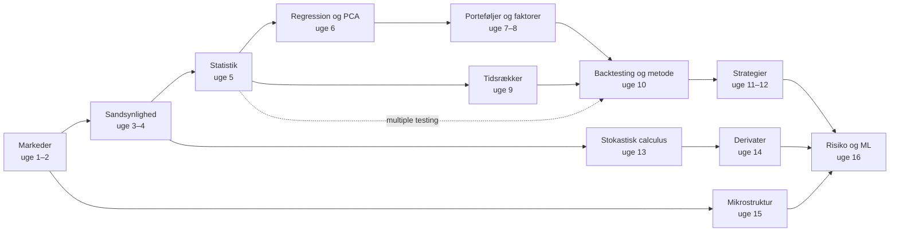

# Quant Trading & Research: fra sandsynlighed til strategier

*Læringsplan, noter, øvelser og løsninger til YouTube-playlisten **"Quant Trading & Research - Markets to Models to Strategies"***

Dette dokument er din studiemakker til playlisten. Videoerne er forelæsningerne, og dokumentet giver dig resten: en plan uge for uge, noter der samler op og lukker huller, øvelser på tre niveauer med fulde løsninger, programmeringsopgaver, et forskningsprojekt og interview-træning.

Når du er færdig, skal du kunne forklare og selv udføre hele kæden

> **markeder → sandsynlighed → statistik → regression → porteføljer og faktorer → tidsrækker → forskningsmetode → strategier → stokastisk calculus → derivater → mikrostruktur → risiko**

og kunne svare præcist på spørgsmål som *"Hvorfor er en Sharpe ratio på 2 i en backtest ikke bevis for noget?"*, *"Hvad er en risikoneutral sandsynlighed?"* og *"Hvad koster det at handle?"*.

> ⚠️ **Vigtigt: undervisning, ikke investeringsrådgivning.**
> - Intet i dette dokument er en anbefaling om at købe eller sælge noget. Strategierne er her for at blive forstået og testet, ikke for at blive handlet med rigtige penge.
> - **Backtests overvurderer systematisk resultaterne** (uge 10 forklarer hvorfor). Brug **papirhandel** (paper trading), hvis du vil prøve noget af "live".
> - Gearing, derivater og short-salg kan give tab, der er større end det, du har sat ind.
> - For at oprette din egen handelskonto skal du normalt være myndig (18 år).
> - **Markedsmanipulation og insiderhandel er ulovligt** (EU's markedsmisbrugsforordning, MAR), også i lille skala.

---

## Sådan bruger du planen

**Forudsætninger:** Matematik A på HTX-niveau, Python, og gerne *Foundations of Mathematics*-planen. Den giver dig vanen med definitioner og beviser. Alt andet bliver bygget op undervejs.

**Rytmen i en uge** (typisk 3 arbejdsgange á ca. 3 timer, i alt ca. 8–9 timer plus valgfrie videoer):

1. **Se videoerne aktivt.** Stop ved hvert *"Pause og tænk"*-spørgsmål. Videoer markeret *(valgfri)* kan du springe over første gang.
2. **Læs 🧠 Kernebegreber.** Noterne dækker hele ugens pensum, også det, videoerne springer over. Det gælder især Kelly-kriteriet, Greeks og delta-hedging, purged cross-validation og Almgren–Chriss, som ingen god video dækker.
3. **Lav øvelserne.** Minimum: alle ★, de fleste ★★, mindst én ★★★, 💻-opgaverne og 🗣️-opgaven.
4. **Tjek løsningerne først efter et ærligt forsøg.** Brug 15-minutters-reglen: læs kun hintet, og prøv igen.
5. **Tag checkpointet,** før du går videre.

**Symbolforklaring:**

| Mærke | Betydning |
|---|---|
| ★ / ★★ / ★★★ | Grundlæggende / standard (udledning, analyse) / udfordring |
| 💻 | Programmering. Referenceløsningerne bruger kun Pythons **standardbibliotek** og **simuleret data med fast seed**, så outputtet kan genskabes præcist |
| 🗣️ | Forklar eller skriv med dine egne ord |
| **Q3.1** | Video fra playlisten (uge 3, nummer 1). Se nøglen nedenfor |

**Om koden:** Referenceløsningerne er bevidst skrevet uden numpy og pandas. Du lærer mere af at have implementeret OLS, GARCH og en binomialmodel én gang fra bunden. I praksis bruger alle kvanter numpy og pandas, så installér dem, når du er klar:

```bash
py -m pip install numpy pandas matplotlib
```

Nogle opgaver har en valgfri variant *"Med numpy/pandas"*.

**Data:** Øvelserne bruger simuleret data. Til projektet kan du hente gratis data selv, fx dagspriser fra [Stooq](https://stooq.com/db/h/), makrodata fra FRED (fred.stlouisfed.org) og faktordata fra [Kenneth French Data Library](https://mba.tuck.dartmouth.edu/pages/faculty/ken.french/data_library.html). Python-pakken `yfinance` er uofficiel og kan gå i stykker. Tjek altid for splits, udbytte og overlevelsesbias (survivorship bias).

**Visning:** LaTeX-formler, foldbare løsninger (`<details>`) og Mermaid-diagram vises bedst i **Obsidian**, **VS Code** eller på **GitHub**.

---

## Fremskridt

- [ ] Uge 1: Markeder, instrumenter og kvant-roller
- [ ] Uge 2: Afkast, risiko og Python
- [ ] Uge 3: Sandsynlighed I
- [ ] Uge 4: Sandsynlighed II
- [ ] Uge 5: Statistik og inferens
- [ ] Uge 6: Lineær algebra, regression og PCA · *Projekt del A*
- [ ] Uge 7: Porteføljeteori og CAPM
- [ ] Uge 8: Faktormodeller
- [ ] Uge 9: Tidsrækker
- [ ] Uge 10: Backtesting og forskningsmetode · *Projekt del B*
- [ ] Uge 11: Momentum, mean reversion og statistisk arbitrage
- [ ] Uge 12: Carry, value, trend og porteføljekonstruktion
- [ ] Uge 13: Stokastisk calculus
- [ ] Uge 14: Derivater og Black–Scholes · *Projekt del C*
- [ ] Uge 15: Markedsmikrostruktur, market making og eksekvering
- [ ] Uge 16: Risikostyring, machine learning og karriere · *Projekt del D*
- [ ] Interview-træning og afsluttende selvtest

---

## Det store kort



Den vigtigste enkeltidé i forløbet er **forskellen på signal og støj**. Den starter med Bayes (uge 3), bliver formel med hypotesetest og multiple testing (uge 5), bliver praktisk med backtest-overfitting (uge 10) og ender med machine learning i finans (uge 16). Den kvant, der har styr på den, slår den, der kender flest strategier.

---

## Overblik: 16 uger

| Uge | Emne | Videoer (kerne) | Tilføjet i noterne | Tid (ca.) |
|---|---|---|---|---|
| 1 | Markeder, instrumenter og kvant-roller | MIT 18.S096 L1, Shiller (børser, EMH), Simons TED | Ordrebog, nutidsværdi | 9 t |
| 2 | Afkast, risiko og Python | Lo 15.401 Ses 13 | Log- vs. simple afkast, Sharpe, drawdown | 8½ t |
| 3 | Sandsynlighed I | Harvard Stat 110 L4, L7, L9 | Bayes og "signaler", gambler's ruin | 8½ t |
| 4 | Sandsynlighed II | Stat 110 L13, L21, L29 | Fede haler, diversifikationens matematik | 8½ t |
| 5 | Statistik og inferens | MIT 18.650 L4, L7 + Quantopian p-hacking | Sharpe-standardfejl, Holm/BH, bootstrap | 9 t |
| 6 | Lineær algebra, regression og PCA | Strang 18.06 L15–16, 18.650 L13 | OLS fra bunden, beta, power iteration | 9 t |
| 7 | Porteføljeteori og CAPM | Lo 15.401 Ses 14–15 | Tangentportefølje, estimationsfejl | 8½ t |
| 8 | Faktormodeller | Ben Felix, Quantopian ×2 | Faktor-zoo, replikationskrise | 9 t |
| 9 | Tidsrækker | ritvikmath ×6, MIT 18.S096 L8, kointegration ×2 | GARCH, Engle–Granger | 9 t |
| 10 | Backtesting og forskningsmetode | López de Prado, Quantopian, Chan | Purged CV, deflated Sharpe | 8½ t |
| 11 | Momentum, mean reversion, stat arb | Man AHL ×2, Quantopian pairs | Halveringstid, z-score-handel | 8 t |
| 12 | Carry, value, trend, porteføljekonstruktion | Man AHL, Asness, MIT 18.S096 L16 | Signalkombination, volatilitetsmål | 8½ t |
| 13 | Stokastisk calculus | MIT 18.S096 L5, L17, L18 | Itô fra bunden, simulering | 9 t |
| 14 | Derivater og Black–Scholes | Lo Ses 11, Khan ×2, MIT 18.S096 L19 | Greeks, delta-hedging, smil | 9 t |
| 15 | Mikrostruktur og eksekvering | Københavns Universitet (Starkov) ×3 | Glosten–Milgrom, Kyle, Almgren–Chriss | 9 t |
| 16 | Risiko, ML og karriere | MIT 18.S096 L7, López de Prado (Cornell), Jane Street | Kelly, ES, interview-træning | 9 t |
| +2 | Projekt, interview-træning, selvtest | | *Fra hypotese til forskningsrapport* | 10–15 t |

---

## Playlisten: nøgle

Alle videoer er tjekket (titel og kanal). Den fulde liste med URL'er står i `Quant_Trading_Research_Cloud_Handoff.md`. Hovedkilderne er:

| Kilde | Kanal | Uger |
|---|---|---|
| MIT 18.S096 *Topics in Mathematics with Applications in Finance* (2013) | MIT OpenCourseWare | 1, 4, 6–9, 11–14, 16 |
| MIT 15.401 *Finance Theory I* (Andrew Lo, 2008) | MIT OpenCourseWare | 1, 2, 7, 10, 14 |
| Harvard *Statistics 110: Probability* (Joe Blitzstein) | Harvard University | 3, 4 |
| MIT 18.650 *Statistics for Applications* (2016) og MIT 18.06 (Strang) | MIT OpenCourseWare | 5, 6, 8 |
| Yale ECON 252 *Financial Markets* (Robert Shiller) | YaleCourses | 1, 14 |
| Quantopian Lecture Series og QuantCon | Quantopian | 2, 5, 8–11, 16 |
| *Time Series Talk* | ritvikmath | 9 |
| *AHL Explains* | Man AHL | 11, 12 |
| *Financial Markets Microstructure* (Københavns Universitet, Egor Starkov) | economification | 15 |
| Marcos López de Prado | Quantopian / egen kanal / Mathematical Investor | 10, 12, 16 |

---

## Hvad jeg har tilføjet, og hvorfor

1. **Emner uden en god video er dækket fuldt i noterne:** Kelly-kriteriet, Greeks og delta-hedging, volatilitetssmilet, purged cross-validation, Almgren–Chriss og Glosten–Milgrom. Research-agenterne fandt ingen video på universitetsniveau om dem, kun influencer-indhold, og det er valgt fra.
2. **Al kode bruger kun standardbiblioteket og simuleret data.** Løsningerne kan derfor køres overalt med præcist det angivne output, og du lærer modellerne indefra.
3. **Signal vs. støj er den gennemgående tråd:** Bayes, så multiple testing, så deflated Sharpe og til sidst ML. Det er den fejl, der koster flest kvanter penge.
4. **Et forskningsprojekt i fire dele,** som du laver efter uge 6, 10, 14 og 16. Du skal pre-registrere hypotesen, logge alle forsøg og være ærlig om negative resultater.
5. **Interview-træning** med 15 klassiske kvant-opgaver og fulde svar, plus Jane Streets officielle mock-interview.
6. **Danske vinkler:** mikrostruktur-ugen bruger Københavns Universitets kursus, og Lasse Heje Pedersens *Efficiently Inefficient* (CBS) er anbefalet læsning.

---

## Notation: snydeark

| Symbol | Betydning | Uge |
|---|---|---|
| $R_t = P_t/P_{t-1} - 1$ | simpelt afkast | 2 |
| $r_t = \ln(P_t/P_{t-1})$ | log-afkast | 2 |
| $\sigma,\ \sigma_{\text{ann}} = \sigma_{\text{dag}}\sqrt{252}$ | volatilitet (annualiseret) | 2 |
| $SR = (\mathbb{E}[R] - r_f)/\sigma$ | Sharpe ratio | 2, 5 |
| $\mathbb{E}[X],\ \mathrm{Var}(X),\ \mathrm{Cov}(X,Y),\ \rho$ | forventning, varians, kovarians, korrelation | 3–4 |
| $\Sigma,\ w^\top \Sigma w$ | kovariansmatrix, porteføljevarians | 6–7 |
| $\beta_i = \mathrm{Cov}(R_i,R_m)/\mathrm{Var}(R_m)$ | beta | 6–7 |
| $\alpha$ | afkast, der ikke forklares af risikofaktorerne | 7–8 |
| $\phi,\ \omega,\ \alpha,\ \beta$ (GARCH) | AR-koefficient og GARCH-parametre | 9 |
| $W_t,\ dW_t$ | Brownsk bevægelse og dens tilvækst | 13 |
| $\Delta,\ \Gamma,\ \mathcal{V},\ \Theta$ | Greeks: delta, gamma, vega, theta | 14 |
| $\lambda$ (Kyle) | prispåvirkning pr. enhed ordrestrøm | 15 |
| $\mathrm{VaR}_\alpha,\ \mathrm{ES}_\alpha$ | Value at Risk, Expected Shortfall | 16 |
| $f^*$ | Kelly-andel | 16 |

---

## Uge 1 — Markeder, instrumenter og kvant-roller

> **Læringsmål:** Kende de vigtigste aktivklasser og deres payoffs, forstå hvordan en børs matcher ordrer, og regne sikkert med nutidsværdi og rentes rente (diskret og kontinuert). Kunne forklare alpha vs. beta, de tre former for markedseffektivitet og hvorfor de fleste strategier fejler.
> **Tidsforbrug:** ca. 4 t video (+ 1,3 t valgfri) · ca. 5 t øvelser
> **Forudsætninger:** HTX Matematik A (eksponential- og logaritmefunktioner, geometriske summer); Foundations-planen (beviser, grænseværdier) til de teoretiske øvelser.

### 📺 Se

- [ ] **Q1.1** 1. Introduction, Financial Terms and Concepts (MIT OpenCourseWare, 18.S096)
  Fokus: ordforrådet — aktiver, markeder, købs- og salgssiden (buy side/sell side), og hvordan matematik bruges i praksis.
  Pause og tænk: Hvorfor er en markedspris i virkeligheden et *par* af tal (bid og ask) og ikke ét tal?
- [ ] **Q1.2** 21. Exchanges, Brokers, Dealers, Clearinghouses (YaleCourses, Shiller 2011)
  Fokus: hvem der står mellem køber og sælger, og hvorfor et clearinghus fjerner modpartsrisiko.
  Pause og tænk: Hvad ville der ske med en handel, hvis sælgeren gik konkurs mellem handelsdag og afregningsdag — med og uden clearinghus?
- [ ] **Q1.3** 6. Efficient Markets vs. Excess Volatility (YaleCourses, Shiller 2008)
  Fokus: markedseffektivitet (efficient market hypothesis) og Shillers argument om, at kurser svinger mere end udbyttet kan retfærdiggøre.
  Pause og tænk: Hvis en pris er en *forventning* om fremtidige udbytter, burde den så svinge mere eller mindre end de faktiske udbytters nutidsværdi? Hvorfor?
- [ ] **Q1.4** The mathematician who cracked Wall Street | Jim Simons (TED)
  Fokus: hvordan en forskningsorganisation (ikke et enkelt genialt signal) bygger en kvant-strategi; data, mange svage signaler, samarbejde.
  Pause og tænk: Hvilke af Simons' pointer handler om matematik, og hvilke handler om organisation og omkostninger? Husk: én ekstraordinær fond er ikke bevis for, at metoden virker for alle (overlevelsesbias).
- [ ] **Q1.5** Ses 2: Present Value Relations I (MIT OpenCourseWare, 15.401) — (valgfri)
  Fokus: nutidsværdi (present value) som det grundlæggende værktøj til at sammenligne betalinger på forskellige tidspunkter.
  Pause og tænk: Hvorfor skal man diskontere med en højere rente, jo mere risikabel en betalingsstrøm er?

### 🧠 Kernebegreber

**1. Aktivklasser (asset classes).** $S_t$ betegner prisen på det underliggende aktiv til tid $t$, og $T$ er udløbstidspunktet.

- *Aktie (stock, equity):* ejerandel i en virksomhed. Afkast = kursændring + udbytte (dividend). En long-position kan højst tabe 100 %.
- *Obligation (bond):* et lån. Betaler kuponer (coupons) og hovedstolen (face value) ved udløb. Når renten stiger, falder kursen. Danmark har et af verdens største realkreditobligationsmarkeder i forhold til økonomiens størrelse.
- *Forward/future:* aftale i dag om at handle til tid $T$ til prisen $F$. Payoff for long: $S_T - F$. Futures er standardiserede, handles på en børs og afregnes dagligt (mark-to-market) via margin.
- *Option:* en call giver retten (ikke pligten) til at købe til strike $K$, payoff $\max(S_T-K,0)$; en put giver retten til at sælge, payoff $\max(K-S_T,0)$. Køberen betaler en præmie (premium). **Profit = payoff − præmie** (vi ignorerer renten på præmien i denne uge).
- *Valuta (FX):* handles i par, fx EUR/DKK. Danmark fører fastkurspolitik over for euroen.
- *Råvarer (commodities):* olie, metaller, landbrugsvarer — handles mest via futures.

Short-salg (short selling): man låner et aktiv, sælger det og køber det tilbage senere. Tabet er i princippet ubegrænset. Gearing (leverage) via futures, optioner eller lån giver stor eksponering for lidt kapital — og betyder, at man kan tabe mere end sit indskud.

**2. Børsen og ordrebogen (order book).**

- *Limitordre (limit order):* "køb 100 stk. til en pris på højst 50,00". Den hviler i bogen, hvis den ikke kan handles med det samme.
- *Markedsordre (market order):* "køb 100 stk. nu til bedste pris". Den handles straks mod de hvilende ordrer og "går gennem bogen" (walks the book), hvis den er større end det, der ligger på bedste pris.
- *Bid* = højeste købspris i bogen, *ask* = laveste salgspris. Spread $s = \text{ask} - \text{bid}$, midtpris $m = (\text{bid}+\text{ask})/2$, relativ spread $s/m$.
- *Pris-tid-prioritet (price-time priority):* bedste pris handles først; ved samme pris handles den ældste ordre først. Handlen sker til den **hvilende** ordres pris. Den, der hviler, leverer likviditet (maker); den, der rammer bogen, tager likviditet (taker). At lægge ordrer, man ikke har til hensigt at få handlet, for at give et falsk billede af udbud og efterspørgsel (spoofing/layering) er markedsmanipulation og ulovligt efter MAR.
- *Clearing og afvikling (settlement):* en central modpart (CCP, clearinghus) træder ind som køber over for enhver sælger og omvendt, så ingen bærer risiko på den oprindelige modpart. CCP'en kræver margin. Værdipapirer og penge skifter hænder ved afviklingen: T+2 i EU (overgang til T+1 er besluttet, planlagt fra oktober 2027), T+1 i USA (siden maj 2024).

*Omkostningen ved en round trip* (køb og straks salg): man køber til ask og sælger til bid og taber altså $s$ pr. stk. plus kurtage (commission) $c$ (i procent) på begge handler:
$$
\text{round-trip-omkostning i \%} \approx \frac{s}{m} + 2c .
$$
Store ordrer flytter desuden prisen (markedspåvirkning, market impact) — det kommer i uge 15.

**3. Markedsdeltagere og kvant-roller.**

| Deltager | Hvad de gør | Typisk horisont |
|---|---|---|
| Market maker | stiller både bid og ask, tjener spreadet, bærer lagerrisiko | sekunder–dage |
| Hedgefond | aktiv forvaltning for professionelle investorer, ofte long/short og gearing | dage–år |
| Prop-firma (proprietary trading) | handler for egne penge, ofte højfrekvent eller market making | ms–dage |
| Pensionskasse/kapitalforvalter | forvalter opsparing, store ordrer, lange horisonter | år–årtier |
| Retail | private investorer | varierer |

- *Quant researcher:* finder og tester hypoteser om afkast; statistik, data, forskningsmetode (uge 5, 10).
- *Quant trader:* driver strategier i markedet; risiko, eksekvering, hurtige beslutninger under usikkerhed (uge 3, 15, 16).
- *Quant developer:* bygger data-pipelines, backtest-motor og handelssystemer; software-kvalitet og latenstid.

**4. Alpha og beta.** Med markedsafkast $R_m$ og risikofri rente $r_f$ skriver man
$$
R_i - r_f = \alpha_i + \beta_i\,(R_m - r_f) + \varepsilon_i, \qquad \beta_i = \frac{\operatorname{Cov}(R_i,R_m)}{\operatorname{Var}(R_m)} .
$$
*Beta* er markedseksponering — den kan købes næsten gratis i en indeksfond. *Alpha* er afkastet ud over det, markedseksponeringen forklarer — sjælden, dyr og udsat for konkurrence. Et højt afkast er ikke i sig selv alpha: det kan være gearet beta. Den fulde teori kommer i uge 7–8.

**5. Nutidsværdi og rentes rente.** Med rente $r$ pr. år og $m$ tilskrivninger pr. år vokser $PV$ efter $T$ år til
$$
FV = PV\left(1+\frac{r}{m}\right)^{mT} \xrightarrow{\;m\to\infty\;} PV\,e^{rT} \quad\text{(kontinuert forrentning)} .
$$
Den effektive årlige rente er $r_{\text{eff}} = (1+r/m)^m - 1$, kontinuert $e^r - 1$. Omvendt er nutidsværdien af en betaling $CF$ om $T$ år $PV = CF/(1+r)^T$ (eller $CF\,e^{-rT}$). Vigtige lukkede udtryk ($C$ betales ved slutningen af hvert år, første gang om ét år):
$$
\text{annuitet: } C\,\frac{1-(1+r)^{-n}}{r}, \qquad \text{evig rente (perpetuity): } \frac{C}{r}, \qquad \text{Gordons vækstmodel: } \frac{C}{r-g}\ (g<r).
$$
*Regneeksempel:* 10.000 kr. til 4 % i 10 år giver $10.000\cdot 1{,}04^{10} = 14.802{,}44$ kr. ved årlig tilskrivning, $10.000\,(1+0{,}04/12)^{120} = 14.908{,}33$ kr. ved månedlig og $10.000\,e^{0{,}4} = 14.918{,}25$ kr. ved kontinuert forrentning. Bemærk $\ln(FV/PV) = rT$ ved kontinuert forrentning — det er præcis log-afkastet fra uge 2.

**6. Effektive markeder (EMH).** Et marked er effektivt med hensyn til et informationssæt, hvis priserne fuldt afspejler den information, så den ikke kan bruges til at opnå risikojusteret merafkast *efter omkostninger*.

- *Svag form (weak):* informationssættet er historiske priser og volumen → ren kursmønster-analyse giver ikke merafkast.
- *Halvstærk form (semi-strong):* al offentlig information (regnskaber, nyheder).
- *Stærk form (strong):* også privat information. Bemærk: at handle på intern viden (insiderhandel) og at manipulere kurser er ulovligt efter EU's markedsmisbrugsforordning (MAR) — uanset hvad EMH siger.

*Joint hypothesis-problemet:* enhver test af EMH kræver en model for "normalt" (risikokompenseret) afkast, så en anomali kan altid skyldes en forkert risikomodel. *Grossman–Stiglitz:* hvis priserne var perfekt effektive, kunne ingen tjene på at indsamle information — så ville ingen gøre det. Markederne må derfor være "effektivt ineffektive" (Lasse Heje Pedersen, *Efficiently Inefficient*).

*Shillers overvolatilitet (excess volatility):* lad $P_t^*$ være nutidsværdien af de udbytter, der *faktisk* blev betalt efter $t$. Hvis $P_t = E_t[P_t^*]$, er prognosefejlen $U_t = P_t^* - P_t$ ukorreleret med $P_t$, og så er
$$
\operatorname{Var}(P^*) = \operatorname{Var}(P) + \operatorname{Var}(U) \ \ge\ \operatorname{Var}(P).
$$
En rationel prognose svinger altså *mindre* end det, den forudsiger. Shiller fandt det modsatte i data: aktiekurser svinger langt mere end $P^*$ (under antagelse af konstant diskonteringsrente). Fama (effektive markeder) og Shiller (overvolatilitet) fik Nobelprisen i økonomi i 2013 — delt med Lars Peter Hansen (økonometriske metoder til at teste prismodeller). Begge sider har en pointe.

**7. Hvorfor de fleste strategier fejler.**

- *Omkostninger:* 0,3 % pr. round trip lyder lidt, men handler man én gang om dagen, er $(1-0{,}003)^{252} \approx 0{,}469$: man har tabt over halvdelen af kapitalen til omkostninger alene på et år.
- *Konkurrence:* før omkostninger er aktiv forvaltning et nulsumsspil i forhold til markedet (øvelse 1.13). Dit signal skal være bedre end dem, der handler mod dig.
- *Overfitting:* med nok forsøg finder man altid noget, der "virkede" historisk (uge 5 og 10).
- *Crowding og regimeskift:* når mange handler samme strategi, kan den bryde sammen samtidig (Khandani & Lo, *What Happened to the Quants in August 2007?*).
- *Risiko og gearing:* en strategi med positiv forventning kan stadig ruinere en for stor position (uge 3).

**Typiske fejl**

- At blande payoff og profit sammen (glemme præmien) — eller glemme, at den, der har solgt optionen (short-siden), har den modsatte profit.
- At tro, at en markedsordre handles til midtprisen.
- At bruge den nominelle rente som effektiv rente ved månedlig tilskrivning.
- At kalde højt afkast for "alpha" uden at korrigere for beta og gearing.
- At læse EMH som "priserne er altid korrekte". Hypotesen siger kun, at afvigelserne ikke systematisk kan udnyttes efter omkostninger og risiko.
- At glemme, at short-salg og futures kan tabe mere end indskuddet.

### ✏️ Øvelser

**1.1** ★ — Du sætter 10.000 kr. ind til en nominel rente på 4 % p.a. i 10 år. Beregn slutbeløbet ved (a) årlig, (b) månedlig og (c) kontinuert tilskrivning, og (d) den effektive årlige rente i (b) og (c).

**1.2** ★ — En obligation betaler kupon 50 kr. om året i 3 år og 1.000 kr. i hovedstol ved udløb (sammen med sidste kupon). Beregn kursen (nutidsværdien), når markedsrenten er 6 %, og når den er 5 %. Forklar, hvorfor kursen er under 1.000 i det første tilfælde.

**1.3** ★ — En aktie har bid 99,90 og ask 100,10. Du køber 200 stk. og sælger dem straks igen; kurtagen er 0,05 % af handelsbeløbet på hver handel. (a) Hvad er dit samlede tab i kr. og i procent af handelsbeløbet målt i midtpris? (b) Hvad er der tilbage af 1 kr. efter et år, hvis du laver én sådan round trip hver handelsdag (252 dage) og strategien ellers giver 0 i afkast?

**1.4** ★ — Lav en profit-tabel for $S_T \in \{80, 90, 100, 110, 120\}$ for: (a) en long future med $F=100$; (b) en long call med $K=100$ og præmie 5; (c) en short put med $K=95$ og præmie 2; (d) positionen (b)+(c). Sammenlign (d) med (a). (Put-call-paritet i uge 14.)

**1.5** ★★ — En ordrebog ser sådan ud (ordrer nævnt i ankomstrækkefølge ved hver pris). Ask: 100,30: S3 (300 stk.); 100,20: S1 (200), S2 (100). Bid: 100,00: B1 (400); 99,90: B2 (200), B3 (300). Der ankommer i rækkefølge: (a) markedsordre køb 250; (b) limitordre sælg 500 til 99,95; (c) limitordre køb 150 til 100,25. Angiv for hver ordre handlerne (pris, antal, modpart), og bestem bid, ask og spread efter hvert trin. Hvad blev gennemsnitsprisen i (c)?

**1.6** ★★ — (a) Udled annuitetsformlen $PV = C\,\frac{1-(1+r)^{-n}}{r}$ ud fra den geometriske sum, og find grænsen for $n\to\infty$. (b) Vis, at en betalingsstrøm $C, C(1+g), C(1+g)^2,\dots$ (første betaling om ét år) har nutidsværdien $C/(r-g)$ for $g<r$. (c) En aktie forventes at betale udbytte 10 kr. om et år med vækst $g = 2\,\%$. Find prisen for $r = 6\,\%$, $7\,\%$ og $8\,\%$, og kommentér følsomheden. (Pointen bruges i 1.10.)

**1.7** ★★ — Hvilken form for EMH (svag, halvstærk, stærk) ville hver påstand være i strid med, hvis den holdt *efter omkostninger og risikojustering*? (a) Aktier, der er steget mest de seneste 12 måneder, stiger i gennemsnit mere end andre de næste måneder. (b) Kurser reagerer først fuldt på en overraskende regnskabsmeddelelse over flere uger. (c) Direktører, der køber aktier i egen virksomhed, opnår i gennemsnit merafkast. (d) Billige "value"-aktier har historisk haft højere gennemsnitsafkast end dyre vækstaktier. Diskutér især (d) i lyset af joint hypothesis-problemet.

**1.8** ★★ — Den risikofri rente er 2 % og markedsafkastet 10 % i et år. Fond A gav 12 % med $\beta = 1{,}3$; fond B gav 8 % med $\beta = 0{,}5$; fond C er en 2× gearet indeksfond, der gav 18 % (antag $\beta = 2$). Beregn alpha for hver fond (antag $\varepsilon = 0$), og forklar, hvorfor den fond med størst afkast ikke er den bedste. (Bruges i uge 7.)

**1.9** ★★★ — Lad $a_m = (1+r/m)^m$ for $r>0$. (a) Vis med AM–GM-uligheden, at $a_m \le a_{m+1}$. Hint: se på de $m+1$ tal $1+r/m$ ($m$ gange) og $1$. (b) Vis, at $a_m \to e^r$. (c) Fortolk: hvorfor giver hyppigere tilskrivning altid mindst lige så meget, men aldrig mere end $e^r$?

**1.10** ★★★ — (Shillers test.) Lad $P_t^* = P_t + U_t$, hvor prognosefejlen $U_t$ er ukorreleret med $P_t$ (det følger af rationelle forventninger: alt, hvad der er kendt til tid $t$, er ukorreleret med fejlen). (a) Vis $\operatorname{Var}(P^*) = \operatorname{Var}(P) + \operatorname{Var}(U)$ og dermed $\sigma(P) \le \sigma(P^*)$. (b) Vis $\operatorname{Corr}(P, P^*) = \sigma(P)/\sigma(P^*)$. (c) En analyse (illustrative tal) finder $\sigma(P) = 20$ og $\sigma(P^*) = 8$. Hvad kan man konkludere? Nævn to antagelser, man kunne angribe i stedet for at forkaste EMH (brug 1.6c).

**1.11** ★★ 💻 — Skriv en lille matching-motor med pris-tid-prioritet i Python (kun standardbiblioteket). Den skal kunne modtage limit- og markedsordrer, registrere handler som (aggressor, hvilende ordre, pris, antal) og udskrive bogen. Afspil scenariet fra 1.5 og kontrollér dine svar. (Motoren genbruges i uge 15.)

**1.12** ★ 💻 — Skriv funktionerne `fv`, `pv`, `eff_rate` og `pv_cashflows` (diskret tilskrivning med $m$ pr. år samt kontinuert), og genskab tallene fra 1.1 og 1.2.

**1.13** ★★ 🗣️ — Forklar med egne ord (10–15 linjer) William Sharpes "aritmetik for aktiv forvaltning": markedet består af passive investorer (der ejer markedsporteføljen) og aktive investorer. Hvorfor må de aktive *i gennemsnit* få markedsafkastet før omkostninger og mindre efter? Hvad betyder det for en ny kvant-strategi, og hvilke af Jim Simons' pointer (Q1.4) passer ind?

### ✅ Løsninger

<details>
<summary>Løsning 1.1</summary>

(a) $10.000\cdot 1{,}04^{10} = 14.802{,}44$ kr.
(b) $10.000\,(1+0{,}04/12)^{120} = 14.908{,}33$ kr.
(c) $10.000\,e^{0{,}04\cdot 10} = 10.000\,e^{0{,}4} = 14.918{,}25$ kr.
(d) Månedlig: $(1+0{,}04/12)^{12} - 1 = 4{,}0742\,\%$. Kontinuert: $e^{0{,}04}-1 = 4{,}0811\,\%$.

Forskellen mellem månedlig og kontinuert tilskrivning er lille (ca. 10 kr.), forskellen mellem årlig og månedlig er større (ca. 106 kr.) — se 1.9.

</details>

<details>
<summary>Løsning 1.2</summary>

Ved 6 %:
$$
PV = \frac{50}{1{,}06} + \frac{50}{1{,}06^2} + \frac{1050}{1{,}06^3} = 47{,}17 + 44{,}50 + 881{,}60 = 973{,}27 .
$$
Ved 5 %: $PV = 1000{,}00$ præcis (kuponrenten er lig markedsrenten, så obligationen handler til pari).

Ved 6 % kræver markedet mere i afkast, end kuponen giver (5 % af 1.000). Køberen kompenseres ved at betale mindre end 1.000 i dag og få kursgevinsten op til 1.000 ved udløb. Generelt: højere rente → lavere obligationskurs.

</details>

<details>
<summary>Løsning 1.3</summary>

(a) Køb: $200\cdot 100{,}10 = 20.020$ kr. plus kurtage $0{,}0005\cdot 20.020 = 10{,}01$ kr. Salg: $200\cdot 99{,}90 = 19.980$ kr. minus kurtage $9{,}99$ kr. Tab: $40 + 10{,}01 + 9{,}99 = 60$ kr. I procent af $200\cdot 100{,}00 = 20.000$ kr. (midtpris): $0{,}30\,\%$. Det stemmer med $s/m + 2c = 0{,}20/100 + 2\cdot 0{,}05\,\% = 0{,}30\,\%$.

(b) $(1-0{,}003)^{252} = 0{,}469$. Der er ca. 47 øre tilbage af hver krone — et tab på 53 % alene fra omkostninger. Høj omsætning (turnover) kræver en meget stærk fordel (edge), før strategien overhovedet går i nul efter omkostninger.

</details>

<details>
<summary>Løsning 1.4</summary>

| $S_T$ | (a) long future | (b) long call | (c) short put | (d) = (b)+(c) |
|---|---|---|---|---|
| 80 | −20 | −5 | −13 | −18 |
| 90 | −10 | −5 | −3 | −8 |
| 100 | 0 | −5 | 2 | −3 |
| 110 | 10 | 5 | 2 | 7 |
| 120 | 20 | 15 | 2 | 17 |

Udregning: (b) $\max(S_T-100,0) - 5$; (c) $-\max(95-S_T,0) + 2$.
(d) ligner en long future: under 95 og over 100 har den hældning 1, og den er flad (−3) mellem 95 og 100. Sammen giver de to optioner altså næsten den samme eksponering som futuren. Med samme strike i begge ville long call + short put give præcis en forward-eksponering (put-call-paritet, uge 14). Bemærk, at den korte put har en begrænset gevinst (2), men et potentielt stort tab — en asymmetrisk risikoprofil.

</details>

<details>
<summary>Løsning 1.5</summary>

Start: bid 100,00, ask 100,20, spread 0,20.

(a) Markedskøb 250: handler 200 @ 100,20 mod S1 og 50 @ 100,20 mod S2 (S1 er ældst). Tilbage: S2 med 50 @ 100,20. Bid 100,00, ask 100,20, spread 0,20.

(b) Limitsalg 500 @ 99,95: den bedste bid 100,00 ≥ 99,95, så der handles 400 @ 100,00 mod B1. Den næste bid (99,90) er under limitten, så de resterende 100 stk. hviler som ask @ 99,95. Nu er bid 99,90 og ask 99,95, spread 0,05.

(c) Limitkøb 150 @ 100,25: handler 100 @ 99,95 mod L1 (den hvilende rest fra b) og derefter 50 @ 100,20 mod S2. Gennemsnitspris $(100\cdot 99{,}95 + 50\cdot 100{,}20)/150 = 15.005/150 = 100{,}033$. Intet hviler. Slutbog: ask 100,30 (S3, 300); bid 99,90 (B2 200, B3 300). Spread 0,40.

Pointe: handlerne sker til den *hvilende* ordres pris, så køberen i (c) fik en bedre pris end sin limit.

</details>

<details>
<summary>Løsning 1.6</summary>

(a) Med $v = 1/(1+r)$:
$$
PV = C\sum_{k=1}^{n} v^k = C\,v\,\frac{1-v^n}{1-v} = C\,\frac{1-(1+r)^{-n}}{r},
$$
da $v/(1-v) = 1/r$. For $n\to\infty$ går $(1+r)^{-n}\to 0$ (når $r>0$), så $PV \to C/r$.

(b) $\sum_{k\ge 1} C(1+g)^{k-1}(1+r)^{-k} = \frac{C}{1+r}\sum_{j\ge 0}\left(\frac{1+g}{1+r}\right)^j = \frac{C}{1+r}\cdot\frac{1}{1-\frac{1+g}{1+r}} = \frac{C}{r-g}$. Rækken konvergerer netop fordi $(1+g)/(1+r) < 1$.

(c) $r=6\,\%$: $10/0{,}04 = 250$; $r=7\,\%$: $10/0{,}05 = 200$; $r=8\,\%$: $10/0{,}06 = 166{,}67$. Et fald i diskonteringsrenten på ét procentpoint hæver prisen med 25 %. En stigning på ét procentpoint sænker den med 16,7 %. Små ændringer i den krævede forrentning giver altså store kursudsving — selv når udbytterne er uændrede.

</details>

<details>
<summary>Løsning 1.7</summary>

(a) Momentum bygger kun på historiske kurser → i strid med den **svage** form (og dermed også de stærkere).
(b) Post-earnings-announcement drift: offentlig information indarbejdes langsomt → i strid med den **halvstærke** form.
(c) Direktører har privat information → i strid med den **stærke** form. Bemærk: direktørers handler skal indberettes og offentliggøres, og handel på intern viden er ulovlig (MAR). Hvis andre kan tjene på at følge de *offentliggjorte* direktørhandler, er det i strid med den halvstærke form.
(d) Ikke nødvendigvis i strid med nogen form. Value-præmien kan være kompensation for risiko (fx at value-aktier klarer sig dårligt i kriser), og så er den et udtryk for beta, ikke alpha. Ifølge joint hypothesis-problemet kan vi ikke afgøre, om det er markedet, der er ineffektivt, eller vores risikomodel, der er forkert. Det er præcis debatten mellem Fama og Shiller (og emnet i uge 8 og 12).

</details>

<details>
<summary>Løsning 1.8</summary>

$\alpha = (R - r_f) - \beta(R_m - r_f)$, hvor $R_m - r_f = 8\,\%$:
- A: $10 - 1{,}3\cdot 8 = 10 - 10{,}4 = -0{,}4\,\%$.
- B: $6 - 0{,}5\cdot 8 = 6 - 4 = +2{,}0\,\%$.
- C: $16 - 2\cdot 8 = 0\,\%$.

C har størst afkast, men det er ren gearet markedseksponering, som enhver kan skabe billigt. A har *tabt* i forhold til en tilsvarende gearet indeksposition. Kun B har skabt værdi ud over beta. Et estimat for ét år er dog meget usikkert (uge 5): et års tal siger næsten intet om, hvorvidt alpha er ægte.

</details>

<details>
<summary>Løsning 1.9</summary>

(a) AM–GM for de $m+1$ positive tal $1+\frac rm$ ($m$ gange) og $1$:
$$
\left(\Big(1+\tfrac rm\Big)^m\cdot 1\right)^{\frac{1}{m+1}} \le \frac{m\big(1+\frac rm\big)+1}{m+1} = 1 + \frac{r}{m+1}.
$$
Opløft til potens $m+1$: $a_m \le (1+\frac{r}{m+1})^{m+1} = a_{m+1}$. Uligheden er skarp, da tallene ikke alle er ens.

(b) $\ln a_m = m\ln(1+r/m) = r\cdot\frac{\ln(1+x)}{x}$ med $x = r/m \to 0$. Da $\lim_{x\to 0}\ln(1+x)/x = 1$ (det er differentialkvotienten af $\ln$ i 1), går $\ln a_m \to r$. Da $\exp$ er kontinuert, går $a_m \to e^r$.

(c) Hyppigere tilskrivning betyder, at renter begynder at forrente sig tidligere ("renters rente"). Følgen er voksende og begrænset opad af sin grænse $e^r$. Derfor er kontinuert forrentning det maksimale for en given nominel rente — og det naturlige matematiske grænsetilfælde, som vi bruger med log-afkast fra uge 2.

</details>

<details>
<summary>Løsning 1.10</summary>

(a) $\operatorname{Var}(P+U) = \operatorname{Var}(P) + \operatorname{Var}(U) + 2\operatorname{Cov}(P,U) = \operatorname{Var}(P) + \operatorname{Var}(U)$, da $\operatorname{Cov}(P,U) = 0$. Da $\operatorname{Var}(U)\ge 0$, er $\operatorname{Var}(P^*)\ge\operatorname{Var}(P)$. Tag kvadratrod.

(b) $\operatorname{Cov}(P,P^*) = \operatorname{Cov}(P,P) + \operatorname{Cov}(P,U) = \operatorname{Var}(P)$. Derfor er $\operatorname{Corr}(P,P^*) = \operatorname{Var}(P)/(\sigma(P)\sigma(P^*)) = \sigma(P)/\sigma(P^*)$. Det er konsistent med (a), da en korrelation højst er 1.

(c) $\sigma(P) = 20 > 8 = \sigma(P^*)$ strider mod (a). Enten er markedet ikke rationelt (overvolatilitet), eller også holder modellens antagelser ikke. To antagelser, man kan angribe:
1. *Konstant diskonteringsrente.* 1.6c viser, at små ændringer i $r$ giver store prisudsving. Tidsvarierende risikopræmier kan altså skabe volatilitet uden irrationalitet.
2. *Stationaritet og stikprøve.* $P^*$ beregnes ud fra en endelig periode med en antaget slutværdi, og hvis priser og udbytter har trend, er variansen ikke veldefineret (stationaritet, uge 9).

Konklusionen er altså en *joint hypothesis*: EMH plus konstant diskonteringsrente er forkastet, ikke nødvendigvis EMH alene.

</details>

<details>
<summary>Løsning 1.11</summary>

```python
from collections import deque

class OrderBook:
    def __init__(self):
        self.bids = {}    # pris -> deque af [id, antal], ældste først
        self.asks = {}
        self.trades = []  # (aggressor, hvilende ordre, pris, antal)

    def submit(self, oid, side, qty, price=None):
        """side = 'buy'/'sell'; price=None betyder market order."""
        book = self.asks if side == "buy" else self.bids
        while qty > 0 and book:
            p = min(book) if side == "buy" else max(book)   # bedste modpris
            if price is not None and (p > price if side == "buy" else p < price):
                break                                        # limit ikke krydset
            queue = book[p]
            resting = queue[0]                               # tidsprioritet
            q = min(qty, resting[1])
            self.trades.append((oid, resting[0], p, q))
            qty -= q
            resting[1] -= q
            if resting[1] == 0:
                queue.popleft()
                if not queue:
                    del book[p]
        if qty > 0 and price is not None:                    # rest hviler i bogen
            own = self.bids if side == "buy" else self.asks
            own.setdefault(price, deque()).append([oid, qty])
        return qty   # uhandlet rest af en markedsordre annulleres

    def show(self):
        for p in sorted(self.asks, reverse=True):
            print(f"  ASK {p:7.2f}  {[tuple(o) for o in self.asks[p]]}")
        for p in sorted(self.bids, reverse=True):
            print(f"  BID {p:7.2f}  {[tuple(o) for o in self.bids[p]]}")

ob = OrderBook()
ob.submit("S1", "sell", 200, 100.20)
ob.submit("B1", "buy", 400, 100.00)
ob.submit("S2", "sell", 100, 100.20)
ob.submit("B2", "buy", 200, 99.90)
ob.submit("S3", "sell", 300, 100.30)
ob.submit("B3", "buy", 300, 99.90)
ob.submit("M1", "buy", 250)            # (a) markedskøb
ob.submit("L1", "sell", 500, 99.95)    # (b) limitsalg
ob.submit("L2", "buy", 150, 100.25)    # (c) limitkøb
for t in ob.trades:
    print(t)
ob.show()
```

Forventet output:

```
('M1', 'S1', 100.2, 200)
('M1', 'S2', 100.2, 50)
('L1', 'B1', 100.0, 400)
('L2', 'L1', 99.95, 100)
('L2', 'S2', 100.2, 50)
  ASK  100.30  [('S3', 300)]
  BID   99.90  [('B2', 200), ('B3', 300)]
```

Bemærk: i et rigtigt system bruger man heltal (fx priser i øre eller ticks) i stedet for kommatal, så nøglerne er præcise. `min(book)` er $O(n)$ i antal prisniveauer; rigtige motorer bruger sorterede strukturer (fx en sorteret liste med `bisect` eller en hob (heap)).

</details>

<details>
<summary>Løsning 1.12</summary>

```python
import math

def fv(pv, r, years, m=1):
    """Fremtidsværdi. m = tilskrivninger pr. år; m=None betyder kontinuert."""
    if m is None:
        return pv * math.exp(r * years)
    return pv * (1 + r / m) ** (m * years)

def pv(cf, r, years, m=1):
    return cf / fv(1.0, r, years, m)

def eff_rate(r, m=1):
    return fv(1.0, r, 1, m) - 1

def pv_cashflows(cfs, r):
    """cfs[k-1] udbetales ved slutningen af år k."""
    return sum(pv(c, r, k) for k, c in enumerate(cfs, start=1))

for m in (1, 12, None):
    print(m, round(fv(10_000, 0.04, 10, m), 2), round(eff_rate(0.04, m), 6))
print(round(pv_cashflows([50, 50, 1050], 0.06), 2))
print(round(pv_cashflows([50, 50, 1050], 0.05), 2))
```

Forventet output:

```
1 14802.44 0.04
12 14908.33 0.040742
None 14918.25 0.040811
973.27
1000.0
```

</details>

<details>
<summary>Løsning 1.13</summary>

Et godt svar indeholder:
- Markedsafkastet er det værdivægtede gennemsnit af *alle* investorers afkast. De passive ejer præcis markedsporteføljen og får derfor markedsafkastet (før deres meget lave omkostninger).
- Derfor må de aktive *samlet* også få markedsafkastet før omkostninger: $R_m = w_p R_m + (1-w_p) R_{\text{aktiv}}$ giver $R_{\text{aktiv}} = R_m$.
- Aktive investorer har højere omkostninger (handel, research, gebyrer), så den gennemsnitlige aktive krone må klare sig dårligere end den gennemsnitlige passive krone efter omkostninger. Det er aritmetik, ikke en empirisk påstand.
- Det udelukker ikke, at *nogle* aktive vinder — men kun på bekostning af andre aktive. Alpha er et nulsumsspil før omkostninger og et negativsumsspil efter.
- For en ny kvant-strategi: man skal have en grund til, at netop *man* er den bedre informerede eller hurtigere part, eller at man bliver betalt for at bære en risiko eller levere likviditet. Ellers er man den, der betaler.
- Kobling til Simons: mange små, svage signaler, store investeringer i data og eksekvering for at holde omkostningerne nede, og en organisation, der tester ting systematisk. Plus en bemærkning om, at én succesrig fond ikke er bevis for metoden generelt (overlevelsesbias).

</details>

### 🔗 Forbindelse

Denne uge giver ordforrådet og de første værktøjer: payoffs (genbruges i uge 14), ordrebog og spread (uge 15), alpha/beta (uge 7–8) og nutidsværdi. Kontinuert forrentning leder direkte til log-afkast i uge 2, og EMH-diskussionen er baggrunden for hele forskningsdelen: en strategi skal forklare, *hvorfor* den kan tjene penge efter omkostninger, i et marked med hård konkurrence.

### 🏁 Checkpoint

Du er klar til næste uge, når du kan:
- [ ] tegne/tabellere profit for long/short future, call og put, inkl. præmie;
- [ ] matche en sekvens af limit- og markedsordrer i hånden med pris-tid-prioritet og angive bid, ask og spread bagefter;
- [ ] beregne round-trip-omkostning ($s/m + 2c$) og dens årlige effekt ved høj omsætning;
- [ ] regne fremtids- og nutidsværdi ved årlig, $m$-dobbelt og kontinuert forrentning samt bruge annuitets- og Gordon-formlen;
- [ ] beregne alpha givet afkast, beta og $r_f$ — og forklare, hvorfor gearet beta ikke er alpha;
- [ ] forklare de tre former for EMH, joint hypothesis-problemet og Shillers argument $\operatorname{Var}(P^*)\ge\operatorname{Var}(P)$.

---

## Uge 2 — Afkast, risiko og Python

> **Læringsmål:** Regne sikkert med simple afkast og log-afkast, annualisere middelværdi og volatilitet og beregne Sharpe ratio, max drawdown, skævhed og korrelation. Forstå forskellen på aritmetisk og geometrisk middel (volatility drag) og de klassiske datafejl: justerede priser, udbytter, splits og overlevelsesbias.
> **Tidsforbrug:** ca. 1,5 t video (+ 2,5 t valgfri) · ca. 7 t øvelser
> **Forudsætninger:** Uge 1 (rentes rente, kontinuert forrentning); HTX-statistik (middelværdi, spredning); grundlæggende Python.

### 📺 Se

- [ ] **Q2.1** Ses 12: Options III & Risk and Return I (MIT OpenCourseWare, 15.401) — (valgfri)
  Fokus: kun anden halvdel (Risk and Return I): historiske afkast for aktier, obligationer og statsveksler, og hvorfor højere gennemsnitsafkast går hånd i hånd med højere risiko.
  Pause og tænk: Hvis aktier historisk har givet mere end obligationer, hvorfor ejer så ikke alle udelukkende aktier?
- [ ] **Q2.2** Ses 13: Risk and Return II & Portfolio Theory I (MIT OpenCourseWare, 15.401)
  Fokus: middelværdi, varians og standardafvigelse af afkast, aritmetisk vs. geometrisk middel og den første intuition om diversifikation.
  Pause og tænk: Hvorfor er variansen af en portefølje af to aktiver ikke bare det vægtede gennemsnit af de to varianser? Hvilket led mangler?
- [ ] **Q2.3** Quantopian Lecture Series: Introduction to Python (Quantopian) — (valgfri)
  Fokus: Python-grundlag (lister, løkker, funktioner) med finansdata som eksempel. Spring over, hvis du allerede er fortrolig med Python.
  Pause og tænk: Hvordan ville du beregne en liste af daglige afkast ud fra en liste af priser uden at "kigge ind i fremtiden"?
- [ ] **Q2.4** Algorithmic Trading Using Python - Full Course (freeCodeCamp.org) — (valgfri)
  Fokus: kun det første projekt — at hente data og bygge en simpel portefølje i kode. Det er praktisk værktøj, *ikke* forskningsmetode: der er hverken omkostninger, statistiske test eller kontrol for overlevelsesbias.
  Pause og tænk: Hvilke af denne uges datafejl (overlevelsesbias, ujusterede priser, look-ahead) kunne snige sig ind i projektet? Og husk: kode, der kan sende ordrer, bør kun køre mod en papirhandelskonto (paper trading).

### 🧠 Kernebegreber

**1. Simpelt afkast og log-afkast.** For priser $P_0, P_1, \dots$ (uden udbytte) er
$$
R_t = \frac{P_t}{P_{t-1}} - 1 \quad\text{(simpelt afkast, simple return)}, \qquad r_t = \ln\frac{P_t}{P_{t-1}} = \ln(1+R_t) \quad\text{(log-afkast, log return)} .
$$
Taylorudviklingen af $\ln(1+R)$ giver $r = R - R^2/2 + R^3/3 - \dots$, så for små afkast er $r\approx R$, men $r < R$ altid (for $R\ne 0$). Eksempel: $R = +10\,\%$ giver $r = 9{,}53\,\%$; $R = -10\,\%$ giver $r = -10{,}54\,\%$.

- *Over tid er log-afkast additive:* $1 + R_{0\to T} = \prod_{t=1}^T (1+R_t)$ og dermed $r_{0\to T} = \ln(P_T/P_0) = \sum_{t=1}^T r_t$. Summer er meget lettere at analysere statistisk end produkter (centralgrænsesætningen i uge 4, Brownsk bevægelse i uge 13).
- *På tværs af aktiver er simple afkast additive:* holder du vægtene $w_i$ ($\sum_i w_i = 1$) ved periodens start, er porteføljens afkast $R_p = \sum_i w_i R_i$. For log-afkast gælder kun $r_p = \ln\big(\sum_i w_i e^{r_i}\big) \ne \sum_i w_i r_i$.

Tommelfingerregel: brug log-afkast til tidsaggregering og modeller, simple afkast til porteføljer og P&L.

**2. Totalafkast, udbytte og justerede priser.** Lad aktien betale udbyttet $D_t$ med ex-dato $t$ (ex-dividend date: den første handelsdag, hvor en køber ikke længere får udbyttet; ikke at forveksle med skæringsdatoen (record date), som typisk ligger en handelsdag senere). På ex-datoen falder kursen typisk med ca. $D_t$, men investoren har ikke tabt noget: udbyttet opvejer kursfaldet. Det korrekte totalafkast (total return) er
$$
R_t = \frac{P_t + D_t}{P_{t-1}} - 1 .
$$
Ved et aktiesplit $k\!:\!1$ bliver hver aktie til $k$ aktier, og kursen deles med ca. $k$ — igen uden værditab. Dataleverandører udgiver derfor *justerede priser* (adjusted prices): alle kurser *før* hændelsen ganges med en faktor (fx $1/k$ ved split og $P_t/(P_t+D_t)$ ved udbytte), så afkast beregnet af den justerede serie er totalafkast. Konventionerne varierer lidt mellem leverandører — tjek altid, hvad din kolonne betyder.

**3. Datahygiejne (data hygiene) og bias.**

- *Overlevelsesbias (survivorship bias):* en database, der kun indeholder selskaber eller fonde, som findes i dag, mangler dem, der gik konkurs, blev opkøbt eller lukkede. Afkastene bliver systematisk for høje (øvelse 2.12).
- *Look-ahead bias:* at bruge information, som ikke var kendt på beslutningstidspunktet — fx dagens lukkekurs til en handel "i dag", reviderede regnskabstal eller dagens indeksmedlemmer. Brug data, som de så ud dengang (point-in-time data).
- *Selskabshændelser (corporate actions):* splits, udbytter, spin-offs, ticker-skift. Et afkast på $-50\,\%$ på én dag er oftere et split end et krak.
- *Praktisk:* manglende dage (helligdage), fejlagtige handler (bad ticks), tidszoner, valuta og afnoteringsafkast (delisting returns). Kig altid på data, før du regner på dem.

**4. Aritmetisk vs. geometrisk middel — volatility drag.** For afkast $R_1,\dots,R_T$ er
$$
A = \frac1T\sum_{t=1}^T R_t, \qquad G = \Big(\prod_{t=1}^T (1+R_t)\Big)^{1/T} - 1 .
$$
Ifølge AM–GM-uligheden anvendt på tallene $1+R_t$ er $G \le A$, med lighed kun når alle afkast er ens. Med $\hat\sigma^2 = \frac1T\sum_t (R_t - A)^2$ og Taylorudviklingen $\ln(1+R)\approx R - R^2/2$ får man
$$
\ln(1+G) = \frac1T\sum_t \ln(1+R_t) \approx A - \tfrac12(\hat\sigma^2 + A^2), \qquad\text{og dermed}\qquad G \approx A - \frac{\hat\sigma^2}{2}
$$
(brug $e^L - 1\approx L + L^2/2$; leddene med $A^2/2$ går ud). Eksempel: $+50\,\%$ og derefter $-50\,\%$ giver $A = 0$, men $G = \sqrt{1{,}5\cdot 0{,}5} - 1 = -13{,}4\,\%$. $A$ er det forventede afkast i én periode; $G$ er den vækstrate, formuen faktisk realiserer over mange perioder. Gearing øger $\sigma^2$ kvadratisk, men $A$ kun lineært — derfor kan for meget gearing gøre $G$ negativ (uge 3 og 16).

**5. Volatilitet og annualisering.** Volatiliteten er standardafvigelsen af afkast, estimeret med stikprøvespredningen $s = \sqrt{\frac{1}{n-1}\sum_t (R_t - \bar R)^2}$. Antag, at de daglige log-afkast er uafhængige og identisk fordelte (iid) med middelværdi $\mu_d$ og varians $\sigma_d^2$. Så har årsafkastet $\sum_{t=1}^{252} r_t$ middelværdien $252\,\mu_d$ og variansen $252\,\sigma_d^2$ (variansen af en sum af uafhængige variable er summen af varianserne, uge 3–4), dvs.
$$
\mu_{\text{ann}} = 252\,\mu_d, \qquad \sigma_{\text{ann}} = \sigma_d\sqrt{252} \approx 15{,}87\,\sigma_d .
$$
Daglig volatilitet på 1 % svarer altså til ca. 15,9 % p.a. Er afkastene autokorrelerede, er $\sqrt{252}$-reglen forkert (øvelse 2.9, uge 9).

**6. Sharpe ratio.** For en given periode (dag, måned, år) er
$$
SR = \frac{E[R] - r_f}{\sigma(R - r_f)},
$$
estimeret med stikprøvemiddel og -spredning af merafkastet (excess return). Under iid-antagelsen er $SR_{\text{ann}} = \sqrt{252}\cdot SR_{\text{dag}}$, fordi tælleren skalerer med 252 og nævneren med $\sqrt{252}$. Sharpe ratio er uafhængig af gearing: ganges merafkastet med $L>0$, ganges både tæller og nævner med $L$. Advarsler: (i) den estimeres med stor usikkerhed — med ét års data er standardfejlen på den årlige Sharpe ratio ca. 1 (under iid-normalfordelte afkast er $\operatorname{SE}(\widehat{SR}_{\text{ann}})\approx\sqrt{(1+SR^2/2)/T}$ med $T$ i år, jf. Lo 2002; uge 5 og 10); (ii) den ignorerer skævhed og hale-risiko (øvelse 2.8).

**7. Max drawdown.** Med den løbende top $M_t = \max_{s\le t} P_s$ er drawdown $DD_t = 1 - P_t/M_t$ og max drawdown $MDD = \max_t DD_t$. Den beregnes i ét gennemløb ved at opdatere $M_t$ undervejs. Et tab på $L$ kræver en efterfølgende gevinst på $L/(1-L)$ for at komme tilbage: $-50\,\%$ kræver $+100\,\%$.

**8. Skævhed og kurtosis.** For $X$ med middelværdi $\mu$ og spredning $\sigma$:
$$
\text{skævhed (skewness)} = \frac{E[(X-\mu)^3]}{\sigma^3}, \qquad \text{kurtosis} = \frac{E[(X-\mu)^4]}{\sigma^4} .
$$
Normalfordelingen har skævhed 0 og kurtosis 3; *overskudskurtosis* (excess kurtosis) er kurtosis minus 3. Daglige aktieafkast har typisk stor overskudskurtosis (fede haler, fat tails), og aktieindeks har negativ skævhed. Strategier, der "sælger forsikring" (fx korte optioner), har mange små gevinster og sjældne store tab: flot Sharpe ratio, men stærkt negativ skævhed.

**9. Kovarians og korrelation.** $\operatorname{Cov}(X,Y) = E[(X-\mu_X)(Y-\mu_Y)]$ og $\rho = \operatorname{Corr}(X,Y) = \operatorname{Cov}(X,Y)/(\sigma_X\sigma_Y) \in [-1,1]$. For en portefølje af to aktiver gælder
$$
\sigma_p^2 = w_1^2\sigma_1^2 + w_2^2\sigma_2^2 + 2w_1w_2\,\rho\,\sigma_1\sigma_2 .
$$
Jo lavere $\rho$, jo mere diversifikation (uge 4 og 7). Pas på: korrelationer stiger ofte netop i kriser.

**Typiske fejl**

- At lægge simple afkast sammen over tid (eller log-afkast på tværs af aktiver).
- At beregne afkast af ujusterede priser — så ligner et split et krak, og udbytterne forsvinder.
- At annualisere volatilitet med 252 i stedet for $\sqrt{252}$ (eller glemme, at $\sqrt{252}$ forudsætter iid).
- At bruge $A$ som det, en investor "fik" over mange år; det er $G$.
- At sammenligne Sharpe ratios fra forskellige frekvenser (daglig vs. årlig) eller glemme $r_f$.
- At teste en strategi på *dagens* indeksmedlemmer tilbage i tid (overlevelses- og look-ahead bias på én gang).

### ✏️ Øvelser

**2.1** ★ — Priserne er $100, 110, 99, 108{,}9$. Beregn (a) de tre simple afkast og log-afkast, (b) det samlede afkast på begge måder og kontrollér, at summen af log-afkastene er $\ln(108{,}9/100)$, (c) det aritmetiske og det geometriske middel af de simple afkast.

**2.2** ★ — En portefølje har 60 % i aktiv A og 40 % i aktiv B. I en periode giver A $+10\,\%$ og B $-5\,\%$. Beregn porteføljens simple afkast og log-afkast, og sammenlign med det vægtede gennemsnit af de to log-afkast. Hvilken regel fra Kernebegreber illustrerer det?

**2.3** ★ — En strategi har dagligt gennemsnitsafkast 0,05 % og daglig spredning 1,2 %. Den risikofri rente er 2 % p.a. Beregn annualiseret middelafkast, annualiseret volatilitet og annualiseret Sharpe ratio — både ved at annualisere først og ved at beregne den daglige Sharpe ratio og gange med $\sqrt{252}$. Hvilken antagelse bruger du?

**2.4** ★ — En aktie lukker i 200 kr. på dag 1. Dag 2 er ex-dato for et udbytte på 4 kr., og aktien lukker i 198. Før åbningen på dag 3 gennemføres et split 2:1, og aktien lukker i 101. (a) Beregn de "naive" afkast af de rå lukkekurser. (b) Beregn de korrekte totalafkast for dag 2 og dag 3. (c) Hvad er det samlede afkast over de to dage, hvis udbyttet geninvesteres i aktien til lukkekursen på dag 2?

**2.5** ★★ — Priserne er $100, 120, 90, 110, 130, 80, 100, 140$. (a) Beregn den løbende top og drawdown for hver dag, og find max drawdown. (b) Hvor stor en stigning skal der til fra bunden for at nå den tidligere top? (c) Vis generelt, at et tab på $L$ kræver en gevinst på $L/(1-L)$, og forklar, hvorfor drawdowns er så vigtige for gearede strategier.

**2.6** ★★ — (a) Et aktiv skifter mellem $+20\,\%$ og $-20\,\%$. Find $A$ og $G$, og sammenlign $A - G$ med $\hat\sigma^2/2$. (b) Bevis, at $G\le A$ for vilkårlige afkast $R_t > -1$. (c) Et indeks skifter dag for dag mellem $+2\,\%$ og $-2\,\%$ i 252 dage. Et produkt giver dagligt *det dobbelte* af indeksets afkast (2× daglig gearing). Hvad er hver af dem værd efter ét år pr. investeret krone? Forklar forskellen med volatility drag.

**2.7** ★★ — To aktiver har $\sigma_1 = 20\,\%$ og $\sigma_2 = 30\,\%$. (a) Beregn volatiliteten af en 50/50-portefølje for $\rho = 1$; $0{,}3$; $0$ og $-1$. (b) Find for $\rho = -1$ den vægt $w_1$, der giver en risikofri portefølje. (c) Vis, at $\sigma_p \le w_1\sigma_1 + w_2\sigma_2$ for $w_1,w_2\ge 0$. (Bruges i uge 7.)

**2.8** ★★ — En strategi (fx salg af optioner langt ude af pengene, out of the money) giver hver måned $+1\,\%$ med sandsynlighed 0,99 og $-20\,\%$ med sandsynlighed 0,01, uafhængigt af andre måneder. (a) Beregn middelværdi, spredning, skævhed og kurtosis for månedsafkastet. (b) Beregn den månedlige og den annualiserede Sharpe ratio (antag $r_f = 0$ og iid). (c) Hvad er sandsynligheden for, at en 3-årig track record slet ikke indeholder en tabsmåned? Og for mindst én $-20\,\%$-måned på 5 år? Kommentér.

**2.9** ★★ — (a) Vis, at hvis daglige log-afkast er iid, gælder $SR_T = \sqrt{T}\,SR_1$ for $T$-dages-afkast. (b) Antag i stedet, at de daglige afkast har samme varians $\sigma^2$, korrelation $\rho$ mellem naboer og korrelation 0 ellers. Vis, at $\operatorname{Var}\big(\sum_{t=1}^T r_t\big) = \sigma^2\big(T + 2(T-1)\rho\big)$. (c) Med $\rho = 0{,}1$: hvor meget overvurderer $\sqrt{252}$-reglen den årlige Sharpe ratio? (Bruges i uge 9.)

**2.10** ★★★ — (Shannons dæmon, volatility harvesting.) Et aktiv skifter deterministisk mellem at blive ganget med $u = 2$ og med $1/u = 0{,}5$, så dets geometriske afkast er 0. Kontanter giver 0 % i rente. (a) Du holder hele tiden andelen $f\in[0,1]$ af formuen i aktivet og rebalancerer efter hver periode. Find vækstfaktoren over to perioder, $g(f)$, og vis, at den maksimeres af $f^* = 1/2$ for *ethvert* $u>1$. (b) Beregn den geometriske vækstrate pr. periode for $f=1/2$, $u=2$, og sammenlign med approksimationen $A - \hat\sigma^2/2$. (c) Forklar, hvorfor dette ikke er en "gratis pengemaskine" i rigtige markeder. (Forsmag på Kelly-kriteriet i uge 3 og 16.)

**2.11** ★★ 💻 — Skriv funktionerne `simple_returns`, `log_returns`, `ann_vol`, `sharpe`, `max_drawdown` og `skew_kurt` med kun standardbiblioteket. Simulér en GBM-lignende prissti over 5 år med `random.seed(42)`, $\mu = 8\,\%$ og $\sigma = 20\,\%$ p.a. via
$$
P_t = P_{t-1}\exp\!\Big(\big(\mu - \tfrac{\sigma^2}{2}\big)\Delta t + \sigma\sqrt{\Delta t}\,Z_t\Big), \qquad \Delta t = 1/252,\quad Z_t \sim N(0,1)\ \text{iid},
$$
og udskriv nøgletallene. Sammenlign aritmetisk og geometrisk middel. Hvad siger resultatet om, hvor svært det er at estimere $\mu$ i forhold til $\sigma$? (Funktionerne genbruges i uge 10.)

**2.12** ★★ 💻 — (Overlevelsesbias.) Simulér 1000 fonde *uden* evner: hver måned i 5 år er afkastet normalfordelt med middelværdi 0,5 % og spredning 4 % for alle fonde. En fond, der på noget tidspunkt er under 80 % af startværdien, lukkes og forsvinder fra databasen. Sammenlign det gennemsnitlige årlige (geometriske) afkast for alle fonde med det for de overlevende. Brug `random.seed(7)`.

**2.13** ★★ 🗣️ — En ven viser dig en backtest: "Jeg købte de 20 aktier i det nuværende C25-indeks med det højeste udbytte, rebalancerede årligt fra 2005 til i dag og slog indekset med 4 % om året." Skriv 10–15 linjer om, hvilke datafejl og bias der kan ligge i resultatet, og hvad du ville gøre for at teste det ordentligt.

### ✅ Løsninger

<details>
<summary>Løsning 2.1</summary>

(a) $R_1 = 110/100 - 1 = 10\,\%$, $R_2 = 99/110 - 1 = -10\,\%$, $R_3 = 108{,}9/99 - 1 = 10\,\%$. Log-afkast: $r_1 = \ln 1{,}1 = 0{,}09531$, $r_2 = \ln 0{,}9 = -0{,}10536$, $r_3 = 0{,}09531$.

(b) Simpelt: $1{,}1\cdot 0{,}9\cdot 1{,}1 - 1 = 0{,}089 = 8{,}9\,\%$. Log: $0{,}09531 - 0{,}10536 + 0{,}09531 = 0{,}08526 = \ln 1{,}089$. ✓ Summen af de simple afkast ville give $10\,\%$, hvilket er forkert.

(c) $A = (0{,}10 - 0{,}10 + 0{,}10)/3 = 3{,}33\,\%$ og $G = 1{,}089^{1/3} - 1 = 2{,}88\,\%$. $G < A$ som forventet.

</details>

<details>
<summary>Løsning 2.2</summary>

$R_p = 0{,}6\cdot 0{,}10 + 0{,}4\cdot(-0{,}05) = 0{,}04 = 4\,\%$, så $r_p = \ln 1{,}04 = 0{,}03922$.

Vægtet gennemsnit af log-afkastene: $0{,}6\ln 1{,}1 + 0{,}4\ln 0{,}95 = 0{,}6\cdot 0{,}09531 + 0{,}4\cdot(-0{,}05129) = 0{,}03667 \ne 0{,}03922$.

Simple afkast er additive på tværs af aktiver, log-afkast er ikke. Afvigelsen skyldes, at $\ln$ er konkav: $\sum_i w_i\ln(1+R_i) \le \ln\big(\sum_i w_i(1+R_i)\big)$ (Jensens ulighed, uge 4).

</details>

<details>
<summary>Løsning 2.3</summary>

Annualiseret middel: $252\cdot 0{,}0005 = 12{,}6\,\%$. Annualiseret volatilitet: $0{,}012\sqrt{252} = 0{,}012\cdot 15{,}875 = 19{,}05\,\%$.

Metode 1: $SR = (0{,}126 - 0{,}02)/0{,}1905 = 0{,}556$.
Metode 2: daglig $r_f = 0{,}02/252 = 0{,}0000794$, så $SR_{\text{dag}} = (0{,}0005 - 0{,}0000794)/0{,}012 = 0{,}03505$ og $SR_{\text{ann}} = 0{,}03505\cdot\sqrt{252} = 0{,}556$.

De to metoder giver præcis det samme. Antagelsen er, at de daglige afkast er iid (ingen autokorrelation, konstant fordeling), så middelværdien skalerer med 252 og variansen med 252.

</details>

<details>
<summary>Løsning 2.4</summary>

(a) Naivt: dag 2: $198/200 - 1 = -1{,}00\,\%$; dag 3: $101/198 - 1 = -48{,}99\,\%$. Det ligner et krak.

(b) Dag 2: $(198 + 4)/200 - 1 = +1{,}00\,\%$. Dag 3: én gammel aktie er blevet til to nye, så værdien af én gammel aktie er $2\cdot 101 = 202$, og afkastet er $202/198 - 1 = +2{,}02\,\%$.

(c) Efter dag 2 har du 1 aktie (198 kr.) og 4 kr. kontant; geninvesteret giver det $202/198 = 1{,}0202$ aktier. Efter splittet er det $2{,}0404$ aktier à 101 kr. $= 206{,}08$ kr. Samlet afkast: $206{,}08/200 - 1 = 3{,}04\,\%$, præcis lig $1{,}01\cdot 1{,}0202 - 1$. Uden geninvestering ville man have $202 + 4 = 206$ kr., dvs. $3{,}00\,\%$.

</details>

<details>
<summary>Løsning 2.5</summary>

(a)

| Dag | Pris | Løbende top | Drawdown |
|---|---|---|---|
| 0 | 100 | 100 | 0 |
| 1 | 120 | 120 | 0 |
| 2 | 90 | 120 | 25,0 % |
| 3 | 110 | 120 | 8,3 % |
| 4 | 130 | 130 | 0 |
| 5 | 80 | 130 | 38,5 % |
| 6 | 100 | 130 | 23,1 % |
| 7 | 140 | 140 | 0 |

$MDD = 1 - 80/130 = 38{,}46\,\%$ (fra toppen 130 til bunden 80). Bemærk, at det *ikke* er afstanden mellem den globale top (140) og den globale bund (80), fordi bunden kom før toppen.

(b) $130/80 - 1 = 62{,}5\,\%$.

(c) Efter tabet er formuen $1-L$. Vi skal finde $x$ med $(1-L)(1+x) = 1$, dvs. $x = \frac{1}{1-L} - 1 = \frac{L}{1-L}$. Funktionen er konveks og går mod uendelig for $L\to 1$: $-20\,\%$ kræver $+25\,\%$, $-50\,\%$ kræver $+100\,\%$, $-90\,\%$ kræver $+900\,\%$. Med gearing ganges tabene op, og en tilstrækkelig stor drawdown udløser margin calls eller tvangslukning, før man når at komme tilbage.

</details>

<details>
<summary>Løsning 2.6</summary>

(a) $A = 0$ og $G = \sqrt{1{,}2\cdot 0{,}8} - 1 = \sqrt{0{,}96} - 1 = -2{,}02\,\%$. Med $\hat\sigma = 0{,}20$ er $\hat\sigma^2/2 = 0{,}02$, så $A - G = 2{,}02\,\% \approx 2\,\%$. ✓

(b) Tallene $x_t = 1 + R_t$ er positive. AM–GM giver $\big(\prod_t x_t\big)^{1/T} \le \frac1T\sum_t x_t$, dvs. $1+G \le 1+A$. Lighed gælder, netop når alle $x_t$ er ens.

(c) Indekset: hvert par af dage giver faktoren $1{,}02\cdot 0{,}98 = 0{,}9996$; efter 126 par: $0{,}9996^{126} = 0{,}9508$, et tab på 4,9 %. Det gearede produkt: $1{,}04\cdot 0{,}96 = 0{,}9984$ pr. par og $0{,}9984^{126} = 0{,}8173$, et tab på 18,3 % — næsten fire gange indeksets tab, ikke to gange. Forklaring: dagligt er $A = 0$ for begge, men drag $\approx \sigma^2/2$ vokser med kvadratet af gearingen ($0{,}02^2/2 = 0{,}0002$ mod $0{,}04^2/2 = 0{,}0008$ pr. dag). Produkter med daglig gearing er derfor dårligt egnede til at holde længe i volatile markeder — en konkret gearingsrisiko.

</details>

<details>
<summary>Løsning 2.7</summary>

(a) $\sigma_p^2 = 0{,}25\cdot 0{,}04 + 0{,}25\cdot 0{,}09 + 2\cdot 0{,}25\cdot\rho\cdot 0{,}2\cdot 0{,}3 = 0{,}0325 + 0{,}03\rho$.

| $\rho$ | $\sigma_p^2$ | $\sigma_p$ |
|---|---|---|
| 1 | 0,0625 | 25,0 % |
| 0,3 | 0,0415 | 20,4 % |
| 0 | 0,0325 | 18,0 % |
| −1 | 0,0025 | 5,0 % |

(b) For $\rho = -1$ er $\sigma_p^2 = (w_1\sigma_1 - w_2\sigma_2)^2$, som er 0, når $0{,}2\,w_1 = 0{,}3\,(1-w_1)$, dvs. $w_1 = 0{,}3/0{,}5 = 0{,}6$.

(c) Da $\rho\le 1$ og $w_1w_2\sigma_1\sigma_2\ge 0$, er $\sigma_p^2 \le w_1^2\sigma_1^2 + w_2^2\sigma_2^2 + 2w_1w_2\sigma_1\sigma_2 = (w_1\sigma_1 + w_2\sigma_2)^2$. Tag kvadratrod. Porteføljens risiko er altså aldrig større end det vægtede gennemsnit af risiciene — og strengt mindre, når $\rho<1$ og begge vægte er positive. Det er diversifikationsgevinsten.

</details>

<details>
<summary>Løsning 2.8</summary>

(a) $\mu = 0{,}99\cdot 0{,}01 + 0{,}01\cdot(-0{,}20) = 0{,}0079$. Afvigelserne fra middelværdien er $0{,}0021$ og $-0{,}2079$.
$\sigma^2 = 0{,}99\cdot 0{,}0021^2 + 0{,}01\cdot 0{,}2079^2 = 0{,}00043659$, så $\sigma = 2{,}089\,\%$.
Skævhed: $\big(0{,}99\cdot 0{,}0021^3 + 0{,}01\cdot(-0{,}2079)^3\big)/\sigma^3 = -9{,}85$. Kurtosis: $\big(0{,}99\cdot 0{,}0021^4 + 0{,}01\cdot 0{,}2079^4\big)/\sigma^4 = 98{,}0$ (overskudskurtosis 95,0). Til sammenligning har normalfordelingen 0 og 3.

(b) $SR_{\text{md}} = 0{,}0079/0{,}02089 = 0{,}378$ og $SR_{\text{ann}} = 0{,}378\sqrt{12} = 1{,}31$ — det ser flot ud.

(c) $P(\text{ingen tabsmåned på 36 md.}) = 0{,}99^{36} = 0{,}696$. I 70 % af tilfældene viser en 3-årig track record kun $+1\,\%$-måneder: spredning 0 og en "uendelig" Sharpe ratio. $P(\text{mindst ét krak på 60 md.}) = 1 - 0{,}99^{60} = 45{,}3\,\%$. Pointen: Sharpe ratio og en kort historik fanger slet ikke hale-risikoen. Bruger man desuden gearing, kan én krakmåned udslette kontoen. Man skal også se på skævhed, værste udfald og stresstests (uge 16).

</details>

<details>
<summary>Løsning 2.9</summary>

(a) Med iid er $E\big[\sum_{t=1}^T r_t\big] = T\mu$ og $\operatorname{Var}\big(\sum_t r_t\big) = T\sigma^2$, så $SR_T = T\mu/(\sqrt T\sigma) = \sqrt T\cdot\mu/\sigma = \sqrt T\,SR_1$ (med $r_f$ trukket fra i $\mu$).

(b) $\operatorname{Var}\big(\sum_t r_t\big) = \sum_t\sum_s\operatorname{Cov}(r_t,r_s)$. Der er $T$ diagonalled med værdien $\sigma^2$ og $2(T-1)$ ordnede nabopar $(t, t\pm 1)$ med værdien $\rho\sigma^2$. Alle andre led er 0. I alt $\sigma^2\big(T + 2(T-1)\rho\big)$.

(c) $252 + 2\cdot 251\cdot 0{,}1 = 302{,}2$, så den sande årlige spredning er $\sigma\sqrt{302{,}2} = 17{,}38\,\sigma$ i stedet for $15{,}87\,\sigma$. Middelværdien er uændret, så $\sqrt{252}$-reglen overvurderer Sharpe ratio med faktoren $17{,}38/15{,}87 = 1{,}095$, dvs. ca. 9,5 %. Positiv autokorrelation (fx fra illikvide aktiver med "udglattede" priser) får altså en strategi til at se bedre ud, end den er.

</details>

<details>
<summary>Løsning 2.10</summary>

(a) I en op-periode bliver formuen ganget med $1 + f(u-1)$, i en ned-periode med $1 + f(1/u - 1)$. Over to perioder (rækkefølgen er ligegyldig):
$$
g(f) = \big(1 + fa\big)\Big(1 - \frac{fa}{u}\Big), \qquad a = u - 1 > 0 .
$$
$g'(f) = a\big(1 - \frac{fa}{u}\big) - \frac au(1 + fa) = a - \frac au - \frac{2fa^2}{u}$. Sæt $g'(f) = 0$: $\frac{2fa^2}{u} = \frac{a(u-1)}{u} = \frac{a^2}{u}$, så $f^* = 1/2$. Da $g''(f) = -2a^2/u < 0$, er det et maksimum, og det afhænger ikke af $u$.

(b) Med $u=2$, $f = 1/2$: op giver $1 + 0{,}5 = 1{,}5$, ned giver $1 - 0{,}25 = 0{,}75$. $g = 1{,}125$, og vækstraten pr. periode er $\sqrt{1{,}125} - 1 = 6{,}07\,\%$, selvom aktivet selv ikke vokser! Porteføljens afkast er $+50\,\%$ og $-25\,\%$: $A = 12{,}5\,\%$ og $\hat\sigma = 37{,}5\,\%$, så $A - \hat\sigma^2/2 = 0{,}125 - 0{,}0703 = 5{,}47\,\%$. Approksimationen er rimelig, men ikke præcis, fordi afkastene er store (restleddet i Taylorudviklingen er ikke lille).

(c) Rebalancering sælger efter stigninger og køber efter fald. Det reducerer porteføljens varians og dermed dens drag. Men gevinsten opstår her kun, fordi aktivet har *perfekt mean reversion* og der ingen omkostninger er. Rigtige priser kan trende længe (så rebalancering koster vækst), hver rebalancering koster spread og kurtage (uge 1), og man kender ikke $u$. $f^*$ er et eksempel på at maksimere den forventede log-vækst — Kelly-kriteriet (uge 3 og 16).

</details>

<details>
<summary>Løsning 2.11</summary>

```python
import math, random, statistics

def simple_returns(p):
    return [p[t] / p[t - 1] - 1 for t in range(1, len(p))]

def log_returns(p):
    return [math.log(p[t] / p[t - 1]) for t in range(1, len(p))]

def ann_vol(rets, periods=252):
    return statistics.stdev(rets) * math.sqrt(periods)       # stikprøve-sd (n-1)

def sharpe(rets, rf_annual=0.0, periods=252):
    """Annualiseret Sharpe ratio; antager iid afkast (sqrt(252)-reglen)."""
    excess = [r - rf_annual / periods for r in rets]
    return statistics.mean(excess) / statistics.stdev(excess) * math.sqrt(periods)

def max_drawdown(p):
    peak, mdd = p[0], 0.0
    for x in p:
        peak = max(peak, x)
        mdd = max(mdd, 1 - x / peak)
    return mdd

def skew_kurt(x):
    m = statistics.mean(x)
    s = statistics.pstdev(x)
    sk = sum((v - m) ** 3 for v in x) / len(x) / s ** 3
    ku = sum((v - m) ** 4 for v in x) / len(x) / s ** 4
    return sk, ku - 3                                        # skævhed, overskudskurtosis

# GBM-lignende sti: 5 år, mu = 8 %, sigma = 20 % p.a.
random.seed(42)
mu, sigma, dt, n = 0.08, 0.20, 1 / 252, 5 * 252
p = [100.0]
for _ in range(n):
    z = random.gauss(0, 1)
    p.append(p[-1] * math.exp((mu - sigma**2 / 2) * dt + sigma * math.sqrt(dt) * z))

R, r = simple_returns(p), log_returns(p)
years = n / 252
arith = statistics.mean(R) * 252
geom = (p[-1] / p[0]) ** (1 / years) - 1
print(f"slutkurs          {p[-1]:.2f}")
print(f"aritm. middel p.a. {arith:.4f}")
print(f"geom. middel p.a.  {geom:.4f}")
print(f"log-middel p.a.    {statistics.mean(r) * 252:.4f}")
print(f"aritm - log        {arith - statistics.mean(r) * 252:.4f}  (sigma^2/2 = {ann_vol(R)**2 / 2:.4f})")
print(f"ann. vol           {ann_vol(R):.4f}")
print(f"Sharpe (rf=2 %)    {sharpe(R, 0.02):.3f}")
print(f"max drawdown       {max_drawdown(p):.4f}")
sk, ek = skew_kurt(r)
print(f"skævhed, ex.kurt.  {sk:.3f} {ek:.3f}")
```

Forventet output:

```
slutkurs          81.79
aritm. middel p.a. -0.0203
geom. middel p.a.  -0.0394
log-middel p.a.    -0.0402
aritm - log        0.0200  (sigma^2/2 = 0.0200)
ann. vol           0.1999
Sharpe (rf=2 %)    -0.201
max drawdown       0.5613
skævhed, ex.kurt.  0.080 0.037
```

Fortolkning:
- Forskellen mellem aritmetisk middel og log-middel er $0{,}0200 = \hat\sigma^2/2$ — volatility drag præcis som forudsagt. (Det geometriske middel er $e^{\text{log-middel}} - 1$.)
- Volatiliteten rammes næsten præcist (0,1999 mod den sande 0,20), men middelafkastet er *negativt*, selvom det sande $\mu$ er 8 %! Standardfejlen på et årligt middel estimeret over 5 år er ca. $0{,}20/\sqrt5 = 8{,}9\,\%$. Middelværdier er meget svære at estimere, volatilitet er let — en central lektie for hele planen (uge 5 og 10).
- En max drawdown på 56 % i en aktie med positiv forventning viser, hvor hårde de enkelte stier kan være.
- Skævhed og overskudskurtosis er tæt på 0, fordi vi har simuleret normalfordelte log-afkast. Rigtige data har fede haler.

*Valgfri variant med numpy (kræver at numpy er installeret — ikke standardbiblioteket; genbruger listen `p` fra koden ovenfor):*

```python
import numpy as np
p = np.array(p)
R = p[1:] / p[:-1] - 1
vol = R.std(ddof=1) * np.sqrt(252)
mdd = (1 - p / np.maximum.accumulate(p)).max()
```

</details>

<details>
<summary>Løsning 2.12</summary>

```python
import random, statistics

random.seed(7)
N_FUNDS, MONTHS = 1000, 60
all_ann, surv_ann = [], []
for _ in range(N_FUNDS):
    v, low = 1.0, 1.0
    for _ in range(MONTHS):
        v *= 1 + random.gauss(0.005, 0.04)   # ingen evner: samme fordeling for alle
        low = min(low, v)
    ann = v ** (12 / MONTHS) - 1             # geometrisk årligt afkast over 5 år
    all_ann.append(ann)
    if low >= 0.80:                          # fonde under 80 % lukkes og forsvinder
        surv_ann.append(ann)                 # ... fra databasen

print("overlevende fonde:", len(surv_ann))
print(f"gns. årligt afkast, alle fonde:      {statistics.mean(all_ann):.4f}")
print(f"gns. årligt afkast, kun overlevende: {statistics.mean(surv_ann):.4f}")
print(f"andel med negativt afkast, alle:        {sum(a < 0 for a in all_ann) / len(all_ann):.3f}")
print(f"andel med negativt afkast, overlevende: {sum(a < 0 for a in surv_ann) / len(surv_ann):.3f}")
```

Forventet output:

```
overlevende fonde: 815
gns. årligt afkast, alle fonde:      0.0537
gns. årligt afkast, kun overlevende: 0.0682
andel med negativt afkast, alle:        0.188
andel med negativt afkast, overlevende: 0.087
```

Alle fonde er identiske og uden evner, men databasen med de overlevende viser ca. 1,5 procentpoint mere i årligt afkast og under halvt så mange tabere. (For at kunne sammenligne lader simulationen de lukkede fondes stier fortsætte "i skyggen".) I rigtige fondsdatabaser forsvinder dårlige fonde netop sådan — og en backtest på dagens aktieunivers har samme problem.

</details>

<details>
<summary>Løsning 2.13</summary>

Et godt svar indeholder:
- **Overlevelsesbias og look-ahead i universet:** "det nuværende C25" er valgt med viden fra i dag. Selskaber, der klarede sig dårligt, gik konkurs eller blev opkøbt, er ikke med; dem, der voksede sig store nok til at komme ind, er. Universet skal være indeksmedlemmerne *på hvert rebalanceringstidspunkt* (point-in-time). Desuden har C25 kun eksisteret siden ca. 2016 (før da var C20 hovedindekset), så et "C25-benchmark" tilbage til 2005 er tilbageberegnet.
- **Udbytte og justerede priser:** bruges totalafkast for både strategi og benchmark? Sammenlignes et totalafkast med et kursindeks uden udbytte, får en udbyttestrategi en kunstig fordel på ca. udbytteprocenten.
- **Timing:** var udbyttet kendt (annonceret) på handelsdagen?
- **Omkostninger og skat:** kurtage, spread og skat af udbytte.
- **Risiko:** er de 4 % blot højere beta eller sektorkoncentration (alpha vs. beta, uge 1 og 8)? Se på volatilitet, Sharpe ratio og drawdown, ikke kun afkast.
- **Statistisk usikkerhed og datamining:** én periode, få aktier — og hvor mange varianter blev prøvet, før denne blev vist? (uge 5 og 10).
- **Bedre test:** point-in-time univers inkl. afnoterede selskaber, totalafkast, realistiske omkostninger, et passende benchmark og test på en anden periode eller et andet marked (out-of-sample).

</details>

### 🔗 Forbindelse

Afkast, volatilitet, Sharpe ratio og drawdown er måleenhederne for resten af planen: de bruges til at vurdere porteføljer (uge 7), strategier (uge 11–12) og risiko (uge 16). Log-afkast og $\sqrt{T}$-skalering leder til sandsynlighedsregning og CLT (uge 3–4) og senere til Brownsk bevægelse (uge 13). Lektien om, at middelværdier er svære at estimere, er udgangspunktet for statistik (uge 5) og backtesting (uge 10).

### 🏁 Checkpoint

Du er klar til næste uge, når du kan:
- [ ] omregne mellem simple afkast og log-afkast og vide, hvornår hvilke er additive;
- [ ] beregne totalafkast med udbytte og håndtere et split korrekt;
- [ ] annualisere middelafkast, volatilitet og Sharpe ratio og angive iid-antagelsen;
- [ ] forklare og udregne volatility drag $G\approx A - \sigma^2/2$, også for gearede produkter;
- [ ] beregne max drawdown i ét gennemløb og den nødvendige gevinst for at komme tilbage;
- [ ] nævne mindst fire datafejl (overlevelsesbias, look-ahead, ujusterede priser, manglende afnoterede selskaber) og forklare, hvordan man undgår dem.

---

## Uge 3 — Sandsynlighed I

> **Læringsmål:** Arbejde præcist med sandsynlighedsrum, betinget sandsynlighed, Bayes' regel og uafhængighed — og undgå base rate-fejlen. Kende Bernoulli-, binomial- og geometrisk fordeling, regne forventning (med linearitet og indikatortricket) og varians, og bruge first-step-analyse på gambler's ruin og klassiske interviewopgaver.
> **Tidsforbrug:** ca. 2,5 t video (+ 1,7 t valgfri) · ca. 6 t øvelser
> **Forudsætninger:** Foundations (mængder, funktioner, induktion); uge 2 (volatility drag); HTX-sandsynlighed (binomialfordelingen).

### 📺 Se

- [ ] **Q3.1** Lecture 4: Conditional Probability | Statistics 110 (Harvard University)
  Fokus: definitionen $P(A\mid B) = P(A\cap B)/P(B)$, Bayes' regel og hvordan intuitionen fejler (fx sygdomstest-eksemplet).
  Pause og tænk: Hvorfor er $P(\text{positiv test}\mid\text{syg})$ og $P(\text{syg}\mid\text{positiv test})$ så forskellige, når sygdommen er sjælden?
- [ ] **Q3.2** Lecture 5: Conditioning Continued, Law of Total Probability | Statistics 110 (Harvard University) — (valgfri)
  Fokus: loven om total sandsynlighed og "betingning er sjælen i statistik" (conditioning is the soul of statistics).
  Pause og tænk: Hvordan kan man løse et svært problem ved at betinge på det første skridt?
- [ ] **Q3.3** Lecture 7: Gambler's Ruin and Random Variables | Statistics 110 (Harvard University)
  Fokus: differensligningen for gambler's ruin og dens løsning; definitionen af en stokastisk variabel som en funktion.
  Pause og tænk: Hvad sker der med ruinsandsynligheden, hvis spillet er en smule til din fordel, men modparten (markedet) har ubegrænset kapital?
- [ ] **Q3.4** Lecture 8: Random Variables and Their Distributions | Statistics 110 (Harvard University) — (valgfri)
  Fokus: PMF, CDF, binomialfordelingen som sum af Bernoulli-variable.
  Pause og tænk: Hvorfor er en stokastisk variabel ikke "tilfældig" og heller ikke en "variabel" i matematisk forstand?
- [ ] **Q3.5** Lecture 9: Expectation, Indicator Random Variables, Linearity | Statistics 110 (Harvard University)
  Fokus: linearitet af forventning (også uden uafhængighed), indikatorvariable og den geometriske fordeling.
  Pause og tænk: Hvorfor gælder $E[X+Y] = E[X]+E[Y]$ altid, mens $\operatorname{Var}(X+Y) = \operatorname{Var}(X)+\operatorname{Var}(Y)$ kræver mere?

### 🧠 Kernebegreber

**1. Sandsynlighedsrum (probability space).** Et sandsynlighedsrum er et tripel $(\Omega, \mathcal F, P)$:

- $\Omega$ er udfaldsrummet (sample space), fx $\{1,\dots,6\}^2$ for to terninger.
- $\mathcal F$ er mængden af *hændelser* (events), dvs. delmængder af $\Omega$. Den skal indeholde $\Omega$ og være lukket under komplement og tællelige foreninger (en $\sigma$-algebra). For endelige eller tællelige $\Omega$ tager man bare potensmængden $\mathcal P(\Omega)$ fra Foundations.
- $P:\mathcal F\to[0,1]$ opfylder $P(\Omega) = 1$ og $P\big(\bigcup_k A_k\big) = \sum_k P(A_k)$ for parvis disjunkte $A_1, A_2, \dots$ (Kolmogorovs aksiomer).

Konsekvenser: $P(\emptyset) = 0$, $P(A^c) = 1 - P(A)$, $A\subseteq B \Rightarrow P(A)\le P(B)$ og $P(A\cup B) = P(A) + P(B) - P(A\cap B)$. Er alle udfald i et endeligt $\Omega$ lige sandsynlige, er $P(A) = \lvert A\rvert/\lvert\Omega\rvert$ (den naive definition) — så er sandsynlighed tælling (kombinatorik).

**2. Betinget sandsynlighed og Bayes.** For $P(B)>0$ er
$$
P(A\mid B) = \frac{P(A\cap B)}{P(B)} .
$$
Er $B_1,\dots,B_n$ en opdeling (partition) af $\Omega$, gælder *loven om total sandsynlighed*
$$
P(A) = \sum_{j=1}^n P(A\mid B_j)\,P(B_j),
$$
og dermed *Bayes' regel*
$$
P(B_j\mid A) = \frac{P(A\mid B_j)\,P(B_j)}{\sum_k P(A\mid B_k)\,P(B_k)} .
$$
I *odds-form*: $\dfrac{P(B\mid A)}{P(B^c\mid A)} = \dfrac{P(A\mid B)}{P(A\mid B^c)}\cdot\dfrac{P(B)}{P(B^c)}$, dvs. posterior-odds = likelihood ratio × prior-odds. Odds-formen er praktisk, når der kommer flere uafhængige beviser: man ganger blot med en likelihood ratio for hvert.

*Regneeksempel (base rate):* 10 % af aktierne i et univers ender med at slå markedet med mere end 20 procentpoint næste år ("vindere"). En model markerer 70 % af vinderne, men også 30 % af de andre. Så er $P(\text{markeret}) = 0{,}7\cdot 0{,}1 + 0{,}3\cdot 0{,}9 = 0{,}34$, og
$$
P(\text{vinder}\mid\text{markeret}) = \frac{0{,}07}{0{,}34} = 20{,}6\,\% .
$$
Selvom modellen "fanger 70 %", er fire ud af fem markerede aktier ikke vindere. Det lave grundniveau (base rate) dominerer. At overse det kaldes *base rate-fejlen* (base rate fallacy).

**3. Uafhængighed.** $A$ og $B$ er uafhængige, hvis $P(A\cap B) = P(A)P(B)$ (svarer til $P(A\mid B) = P(A)$, når $P(B)>0$). Hændelserne $A_1,\dots,A_n$ er (gensidigt) uafhængige, hvis produktreglen gælder for *enhver* delfamilie — parvis uafhængighed er ikke nok. Eksempel: kast to mønter og lad $A$ = "1. er plat", $B$ = "2. er plat", $C$ = "de er ens". De er parvis uafhængige, men $P(A\cap B\cap C) = 1/4 \ne 1/8$. *Disjunkt er ikke det samme som uafhængig:* disjunkte hændelser med positiv sandsynlighed er stærkt afhængige (indtræffer den ene, kan den anden ikke). I finans: daglige afkast er næsten ukorrelerede fra dag til dag, men deres *størrelse* er afhængig over tid (volatilitetsklynger, uge 9) — ukorreleret er altså ikke det samme som uafhængig.

**4. Stokastiske variable og fordelinger.** En stokastisk variabel (random variable) er en funktion $X:\Omega\to\mathbb R$. Dens fordeling beskrives af PMF'en $p_X(x) = P(X=x)$ (diskret) eller fordelingsfunktionen (CDF) $F_X(x) = P(X\le x)$. Med $q = 1-p$:

| Fordeling | Historie | PMF | $E[X]$ | $\operatorname{Var}(X)$ |
|---|---|---|---|---|
| Bernoulli($p$) | ét forsøg, succes = 1 | $P(X=1)=p$, $P(X=0)=q$ | $p$ | $pq$ |
| Bin($n,p$) | antal succeser i $n$ uafhængige forsøg | $\binom nk p^k q^{n-k}$ | $np$ | $npq$ |
| Geom($p$) | antal fiaskoer før første succes | $q^k p$, $k\ge 0$ | $q/p$ | $q/p^2$ |
| First Success FS($p$) | antal forsøg til og med første succes | $q^{k-1}p$, $k\ge 1$ | $1/p$ | $q/p^2$ |

Pas på: bøger bruger forskellige konventioner for den geometriske fordeling (Blitzstein & Hwang bruger "fiaskoer før succes").

**5. Forventning, linearitet og indikatortricket.** $E[X] = \sum_x x\,P(X=x)$. *Linearitet:* $E[aX + bY] = aE[X] + bE[Y]$ — altid, også når $X$ og $Y$ er afhængige. *Indikatoren* $I_A$ er 1, hvis $A$ indtræffer, ellers 0, og $E[I_A] = P(A)$ (broen mellem forventning og sandsynlighed). Indikatortricket: skriv en tællevariabel som en sum af indikatorer, $X = \sum_j I_{A_j}$, så er $E[X] = \sum_j P(A_j)$. Eksempel: $X\sim\text{Bin}(n,p)$ er en sum af $n$ Bernoulli-indikatorer, så $E[X] = np$ uden nogen binomialsummer. *LOTUS:* $E[g(X)] = \sum_x g(x)P(X=x)$, men generelt er $E[g(X)]\ne g(E[X])$.

*First-step-analyse:* for $X\sim\text{FS}(p)$ betinger man på første forsøg: med sandsynlighed $p$ er man færdig efter 1 forsøg, ellers er man tilbage ved start med ét forsøg brugt. Så $E[X] = 1 + q\,E[X]$, dvs. $E[X] = 1/p$.

**6. Varians.** $\operatorname{Var}(X) = E[(X-\mu)^2] = E[X^2] - (E[X])^2$ og $\operatorname{Var}(aX+b) = a^2\operatorname{Var}(X)$. For *uafhængige* $X,Y$ er $\operatorname{Var}(X+Y) = \operatorname{Var}(X) + \operatorname{Var}(Y)$ (generelt kommer $2\operatorname{Cov}(X,Y)$ til, uge 4). Derfor er $\operatorname{Var}(\text{Bin}(n,p)) = npq$. *Eksempel:* ved 252 uafhængige handler, der hver giver gevinst med sandsynlighed 0,53, er antallet af vindende handler i gennemsnit $133{,}6$ med spredning $\sqrt{252\cdot 0{,}53\cdot 0{,}47} = 7{,}9$.

**7. Gambler's ruin.** En spiller har $i$ enheder og vinder eller taber 1 enhed pr. runde med sandsynlighed $p$ hhv. $q$. Spillet stopper ved 0 (ruin) eller $N$. Lad $p_i = P(\text{nå } N \text{ før } 0)$. First-step-analyse giver
$$
p_i = p\,p_{i+1} + q\,p_{i-1}, \qquad p_0 = 0,\ p_N = 1,
$$
med løsningen (øvelse 3.6), hvor $\varrho = q/p$:
$$
p_i = \frac{1 - \varrho^{\,i}}{1 - \varrho^{\,N}} \quad (p\ne q), \qquad p_i = \frac iN \quad (p = q = \tfrac12).
$$
Lader man $N\to\infty$ (modparten — kasinoet eller markedet — har ubegrænset kapital), bliver ruinsandsynligheden $1$ for $p\le\tfrac12$ og $\varrho^{\,i}$ for $p>\tfrac12$.

*Fortolkning som risiko for ruin (risk of ruin):* $i$ er din kapital målt i positionsstørrelser. Med en reel fordel $p = 0{,}51$ og en kapital på 10 positioner er ruinsandsynligheden $(0{,}49/0{,}51)^{10} = 67\,\%$; med 100 positioner kun $1{,}8\,\%$. Positionsstørrelsen i forhold til kapitalen betyder mere end selve fordelen. Modellen er stærkt forenklet (faste indsatser, uafhængige handler, ingen omkostninger), men pointen holder: selv en strategi med positiv forventning kan ruinere en for stor position.

**8. Interviewopgaver: ventetid på mønstre.** Kast en fair mønt (H = krone, T = plat), til mønstret HH (to gange krone i træk) optræder. Tilstande: "start" og "har lige set H". Med $e_0$ og $e_H$ som forventet antal resterende kast:
$$
e_0 = 1 + \tfrac12 e_H + \tfrac12 e_0, \qquad e_H = 1 + \tfrac12\cdot 0 + \tfrac12 e_0 \quad\Longrightarrow\quad e_0 = 6 .
$$
For HT er svaret 4: man venter på et H ($E = 2$) og derefter på et T ($E = 2$), og et ekstra H ødelægger ikke fremskridtet. For HH sender et T én tilbage til start. Samme teknik (Markov-kæder, uge 4) løser mange quant-interviewopgaver.

**Typiske fejl**

- At forveksle $P(A\mid B)$ med $P(B\mid A)$ og ignorere grundniveauet (anklagerens fejlslutning, prosecutor's fallacy).
- At tro, at disjunkte hændelser er uafhængige.
- At bruge $\operatorname{Var}(X+Y) = \operatorname{Var}(X) + \operatorname{Var}(Y)$ uden uafhængighed (eller ukorrelerethed).
- At blande de to konventioner for den geometriske fordeling sammen (forskel på 1 i middelværdien).
- At tro, at $E[g(X)] = g(E[X])$, fx $E[1/X] = 1/E[X]$.
- Spillerens fejlslutning (gambler's fallacy): efter fem tabte uafhængige handler er en gevinst ikke "mere sandsynlig".

### ✏️ Øvelser

**3.1** ★ — (a) Kast to fair terninger. Find $P(\text{sum} = 7)$, $P(\text{mindst én sekser})$ og $P(\text{sum} = 7\mid\text{mindst én sekser})$. (b) Træk to kort uden tilbagelægning fra et almindeligt spil med 52 kort. Find $P(\text{begge er esser})$, $P(\text{2. kort er es}\mid\text{1. kort er ikke es})$ og $P(\text{2. kort er es})$.

**3.2** ★ — Et krak indtræffer i en given måned med sandsynlighed 2 %. En indikator giver alarm i 90 % af krakmånederne og i 10 % af de øvrige måneder. (a) Find $P(\text{alarm})$ og $P(\text{krak}\mid\text{alarm})$. (b) Hvor mange falske alarmer er der i gennemsnit pr. ægte alarm? (c) En anden indikator med samme egenskaber, betinget uafhængig af den første givet krak/ikke-krak, giver også alarm. Find $P(\text{krak}\mid\text{begge alarmer})$ med odds-formen.

**3.3** ★ — En strategi rammer rigtigt i hver handel med sandsynlighed $0{,}55$, uafhængigt af andre handler. (a) Find forventning og varians af antallet af vindere $X$ i 10 handler. (b) Find $P(X\ge 7)$. (c) Find $P(X\ge 7)$, hvis strategien i virkeligheden er et møntkast ($p = 0{,}5$). Hvad siger det om at vurdere en strategi ud fra 10 handler?

**3.4** ★★ — ("Han forudsagde de sidste 3 krak.") 1000 analytikere uden evner forudsiger hvert år uafhængigt et krak med sandsynlighed 0,2. I en 20-årig periode var der 3 krak. (a) Hvad er sandsynligheden for, at en bestemt analytiker forudsagde alle 3? Hvor mange af de 1000 forventer man har gjort det, og hvad er sandsynligheden for, at mindst én har? (b) Hvor mange falske alarmer har en sådan analytiker i gennemsnit haft i de 17 andre år? (c) Antag, at 1 % af analytikerne har ægte evner og forudsiger et krak med sandsynlighed 0,9 i krakår. Find $P(\text{evner}\mid\text{forudsagde alle 3})$ (se kun på krakårene). (d) Hvad mangler i analysen i (c), og hvad har det med overlevelsesbias (uge 2) at gøre?

**3.5** ★★ — (Indikatortricket.) (a) $n$ personer har hver en hat, og hattene fordeles tilfældigt (uniform tilfældig permutation). Find det forventede antal personer, der får deres egen hat. (b) $X_1,\dots,X_n$ er iid kontinuerte dagsafkast (ingen sammenfald). Dag $k$ er en "rekorddag", hvis $X_k > X_j$ for alle $j<k$ (dag 1 er altid rekord). Vis, at $P(\text{dag } k \text{ er rekord}) = 1/k$, og find det forventede antal rekorddage på et år med 252 dage. (c) Vis med indikatorer, at $\operatorname{Var}(\text{Bin}(n,p)) = np(1-p)$, og beregn middelværdi og spredning af antallet af vindere i 252 uafhængige handler med $p = 0{,}53$.

**3.6** ★★ — (Gambler's ruin.) (a) Udled formlen for $p_i$: vis ud fra $p_i = p\,p_{i+1} + q\,p_{i-1}$, at $p_{i+1} - p_i = \varrho\,(p_i - p_{i-1})$ med $\varrho = q/p$, og teleskopér. (b) Beregn $p_{10}$ for $N = 20$ og $p\in\{0{,}49;\ 0{,}50;\ 0{,}51\}$. (c) En kasinospiller med $p = 0{,}49$ starter med 10 og stopper ved 100. Hvad er hans gevinstsandsynlighed? (d) Find ruinsandsynligheden for $N\to\infty$ med $p = 0{,}51$ og $i = 10$ hhv. $i = 100$.

**3.7** ★★ — (Positionsstørrelse og risiko for ruin.) En trader har 100.000 kr. og en strategi, hvor hver handel uafhængigt vinder eller taber det samme beløb $b$ med $p = 0{,}53$. Der er intet mål ($N = \infty$). (a) Find ruinsandsynligheden for $b = 10.000$, $5.000$ og $2.000$ kr. (b) Find den forventede gevinst pr. handel i hvert tilfælde. (c) Diskutér afvejningen, og nævn mindst to måder, modellen er urealistisk på. (Bruges i uge 16.)

**3.8** ★★ — (Mønt-mønstre.) En mønt viser krone (H) med sandsynlighed $p$. (a) Vis med first-step-analyse, at det forventede antal kast til første HH er $(1+p)/p^2$, og til første HT er $1/(pq)$. Kontrollér for $p = 1/2$. (b) Beregn begge for $p = 0{,}6$. (c) For en fair mønt: hvad er sandsynligheden for, at HH optræder før TH? (Hint: hvad skal de to første kast være?)

**3.9** ★★★ — (Spillets varighed.) Lad $D_i$ være det forventede antal runder i gambler's ruin fra $i$ (stop ved 0 eller $N$). (a) Begrund, at $D_i = 1 + p\,D_{i+1} + q\,D_{i-1}$ med $D_0 = D_N = 0$. (b) Vis, at $D_i = i(N-i)$ for $p = 1/2$. (c) Vis for $p\ne q$, at
$$
D_i = \frac{i}{q-p} - \frac{N}{q-p}\cdot\frac{1-\varrho^{\,i}}{1-\varrho^{\,N}}, \qquad \varrho = q/p .
$$
(d) Beregn $D_{10}$ for $N = 20$ og $p\in\{0{,}49;\ 0{,}5\}$. Hvad sker der med $D_i$ for $p = 1/2$, når $N\to\infty$ — selvom ruin er sikker?

**3.10** ★★★ — (Kelly-kriteriet, første møde.) Du kan gentagne gange satse en brøkdel $f\in[0,1)$ af din formue på et væddemål, der med sandsynlighed $p$ giver $+f$ og ellers $-f$ (dvs. $W_{k} = W_{k-1}(1 + fX_k)$ med $X_k = \pm 1$). (a) Vis, at $\frac1n\ln(W_n/W_0)$ er et gennemsnit af iid variable med middelværdi $g(f) = p\ln(1+f) + q\ln(1-f)$. (Ifølge store tals lov, uge 4, går gennemsnittet mod $g(f)$.) (b) Vis, at $g$ maksimeres af $f^* = p - q$, og vis $g(f)\approx f(p-q) - f^2/2$. Sammenlign med $A - \sigma^2/2$ fra uge 2. (c) For $p = 0{,}53$: beregn $g$ for $f = 0{,}03;\ 0{,}06;\ 0{,}12;\ 0{,}20$ og den typiske (median-)formue efter 1000 væddemål, $W_0e^{1000\,g(f)}$. (d) Hvorfor bør man i praksis satse *mindre* end $f^*$? (Uddybes i uge 16.)

**3.11** ★★ 💻 — Skriv en Monte Carlo-simulation af gambler's ruin og sammenlign den estimerede gevinstsandsynlighed med den eksakte formel for $(p,i,N)\in\{(0{,}5;10;20), (0{,}49;10;20), (0{,}51;10;20), (0{,}51;10;50), (0{,}45;5;10)\}$. Brug 20.000 simulationer pr. tilfælde, `random.seed(2024)`, og angiv to standardfejl $2\sqrt{\hat p(1-\hat p)/n}$.

**3.12** ★★ 💻 — Simulér ventetiden på HH og på HT med en fair mønt (100.000 gentagelser, `random.seed(11)`), og udskriv gennemsnit og spredning. Estimér også $P(\text{HH før TH})$. Sammenlign med 3.8.

**3.13** ★★ 🗣️ — Et nyhedsbrev reklamerer: "Vores model forudsagde de sidste 3 krak — tilmeld dig nu!" Forklar på 10–15 linjer, med begreberne fra denne uge, hvorfor det er svagt bevis. Forklar også, hvorfor det samme problem opstår, når en kvant-forsker afprøver 1000 strategier og kun viser den bedste backtest.

### ✅ Løsninger

<details>
<summary>Løsning 3.1</summary>

(a) $\Omega$ har 36 lige sandsynlige udfald. Sum 7: $(1,6),(2,5),\dots,(6,1)$, dvs. 6 udfald, så $P = 6/36 = 1/6$. Mindst én sekser: $1 - (5/6)^2 = 11/36$. Fællesmængden er $\{(1,6),(6,1)\}$, så
$$
P(\text{sum}=7\mid\text{mindst én sekser}) = \frac{2/36}{11/36} = \frac{2}{11} \approx 0{,}182 .
$$
Betingelsen *ændrer* sandsynligheden (fra $1/6\approx 0{,}167$), så hændelserne er afhængige.

(b) $P(\text{to esser}) = \frac{4}{52}\cdot\frac{3}{51} = \frac{1}{221}$. $P(\text{2. es}\mid\text{1. ikke es}) = 4/51$. Total sandsynlighed:
$$
P(\text{2. es}) = \frac{3}{51}\cdot\frac{4}{52} + \frac{4}{51}\cdot\frac{48}{52} = \frac{12 + 192}{2652} = \frac{1}{13},
$$
præcis som for 1. kort — af symmetri.

</details>

<details>
<summary>Løsning 3.2</summary>

(a) $P(\text{alarm}) = 0{,}9\cdot 0{,}02 + 0{,}1\cdot 0{,}98 = 0{,}018 + 0{,}098 = 0{,}116$ og
$$
P(\text{krak}\mid\text{alarm}) = \frac{0{,}018}{0{,}116} = 15{,}5\,\% .
$$
(b) $0{,}098/0{,}018 = 5{,}4$ falske alarmer pr. ægte.

(c) Prior-odds: $0{,}02/0{,}98 = 0{,}0204$. Likelihood ratio for én alarm: $0{,}9/0{,}1 = 9$. Med to betinget uafhængige alarmer: posterior-odds $= 0{,}0204\cdot 9\cdot 9 = 1{,}653$, så $P = 1{,}653/2{,}653 = 62{,}3\,\%$. Bemærk: i praksis er indikatorer sjældent betinget uafhængige (de bygger ofte på de samme data), og så er gevinsten ved den anden alarm meget mindre.

</details>

<details>
<summary>Løsning 3.3</summary>

(a) $X\sim\text{Bin}(10;0{,}55)$: $E[X] = 5{,}5$ og $\operatorname{Var}(X) = 10\cdot 0{,}55\cdot 0{,}45 = 2{,}475$ (spredning 1,57).

(b) $P(X = k) = \binom{10}{k}0{,}55^k 0{,}45^{10-k}$:
$k=7$: $0{,}1665$; $k=8$: $0{,}0763$; $k=9$: $0{,}0207$; $k=10$: $0{,}0025$. I alt $P(X\ge 7) = 0{,}2660$.

(c) $P(X\ge 7) = \big(\binom{10}{7}+\binom{10}{8}+\binom{10}{9}+\binom{10}{10}\big)/2^{10} = (120+45+10+1)/1024 = 0{,}1719$.

Et rent møntkast giver 7+ rigtige ud af 10 i 17 % af tilfældene; en ægte 55 %-strategi gør det kun i 27 %. Ti handler kan næsten ikke skelne de to — man skal bruge hundredvis eller tusindvis af uafhængige observationer (uge 5).

</details>

<details>
<summary>Løsning 3.4</summary>

(a) $P = 0{,}2^3 = 0{,}008$. Forventet antal: $1000\cdot 0{,}008 = 8$. $P(\text{mindst én}) = 1 - 0{,}992^{1000} = 0{,}9997$. Det er praktisk talt sikkert, at *nogen* "forudsagde de sidste 3 krak" ved rent held.

(b) $17\cdot 0{,}2 = 3{,}4$ falske alarmer i gennemsnit.

(c) Bayes:
$$
P(\text{evner}\mid\text{3 af 3}) = \frac{0{,}01\cdot 0{,}9^3}{0{,}01\cdot 0{,}729 + 0{,}99\cdot 0{,}008} = \frac{0{,}00729}{0{,}00729 + 0{,}00792} = 47{,}9\,\% .
$$
Selv efter tre ud af tre er det omtrent lige så sandsynligt, at personen er heldig, som at personen har evner.

(d) Analysen ignorerer de falske alarmer: hvis en "dygtig" analytiker også sjældnere giver falske alarmer, bør år uden krak også indgå i likelihood'en, og de 3,4 falske alarmer pr. heldig analytiker tæller imod. Desuden ser vi kun de analytikere, der ramte (dem, der tog fejl, skriver ingen nyhedsbreve) — en udvælgelse præcis som overlevelsesbias.

</details>

<details>
<summary>Løsning 3.5</summary>

(a) Lad $I_j$ være indikator for, at person $j$ får sin egen hat. $P(I_j = 1) = 1/n$, så $E[\sum_j I_j] = n\cdot\frac1n = 1$ — uanset $n$, og selvom indikatorerne er afhængige.

(b) Af symmetri er hver af de $k$ første værdier lige sandsynligt den største (der er ingen sammenfald), så $P(\text{dag }k\text{ er rekord}) = 1/k$. Forventet antal rekorder: $\sum_{k=1}^{252} 1/k = H_{252} \approx 6{,}11$ (approksimativt $\ln 252 + 0{,}5772$). Pointe: "rekorddage" er ikke sjældne i ren støj — der kommer i gennemsnit 6 på et år.

(c) $X = \sum_{j=1}^n I_j$ med uafhængige $I_j\sim\text{Bernoulli}(p)$. $\operatorname{Var}(I_j) = E[I_j^2] - p^2 = p - p^2 = p(1-p)$, da $I_j^2 = I_j$. Uafhængighed giver $\operatorname{Var}(X) = np(1-p)$. Med $n = 252$, $p = 0{,}53$: $E[X] = 133{,}56$, $\operatorname{Var}(X) = 62{,}77$, spredning $7{,}92$.

</details>

<details>
<summary>Løsning 3.6</summary>

(a) Da $p + q = 1$, kan venstresiden skrives $(p+q)p_i$, så $p(p_{i+1} - p_i) = q(p_i - p_{i-1})$, dvs. $d_i = \varrho\,d_{i-1}$ med $d_i = p_{i+1} - p_i$. Induktion giver $d_i = \varrho^{\,i} d_0 = \varrho^{\,i} p_1$. Teleskopsum:
$$
p_i = \sum_{k=0}^{i-1} d_k = p_1\sum_{k=0}^{i-1}\varrho^{\,k} = p_1\,\frac{1-\varrho^{\,i}}{1-\varrho} \quad(\varrho\ne 1).
$$
Betingelsen $p_N = 1$ giver $p_1 = (1-\varrho)/(1-\varrho^{\,N})$, så $p_i = (1-\varrho^{\,i})/(1-\varrho^{\,N})$. For $\varrho = 1$ er $p_i = i\,p_1$ og $p_1 = 1/N$, så $p_i = i/N$.

(b) $p = 0{,}49$: $p_{10} = 0{,}4013$; $p = 0{,}50$: $0{,}5$; $p = 0{,}51$: $0{,}5987$. To procentpoint fordel i hver runde giver ca. 20 procentpoint i det samlede spil.

(c) $\varrho = 0{,}51/0{,}49$: $p_{10} = (1 - \varrho^{10})/(1 - \varrho^{100}) = 0{,}0092$. Under 1 % — kasinoets lille fordel bliver knusende over mange runder.

(d) $\varrho = 0{,}49/0{,}51 = 0{,}9608$: ruinsandsynligheden er $\varrho^{10} = 0{,}670$ for $i = 10$ og $\varrho^{100} = 0{,}0183$ for $i = 100$ (jf. Kernebegreber afsnit 7).

</details>

<details>
<summary>Løsning 3.7</summary>

(a) Kapitalen målt i enheder er $i = 100.000/b$, og $\varrho = 0{,}47/0{,}53 = 0{,}8868$. Ruinsandsynlighed $\varrho^{\,i}$:
- $b = 10.000$ ($i = 10$): $0{,}301$
- $b = 5.000$ ($i = 20$): $0{,}0905$
- $b = 2.000$ ($i = 50$): $0{,}0025$

(b) $E[\text{gevinst}] = (p - q)\,b = 0{,}06\,b$: henholdsvis 600, 300 og 120 kr. pr. handel.

(c) Store positioner giver højere forventet gevinst pr. handel, men 30 % risiko for at miste alt; små positioner giver næsten ingen ruinrisiko, men kræver mange flere handler for samme forventede gevinst — og hver handel koster spread og kurtage (uge 1), som kan æde hele fordelen på 6 %. Urealistiske antagelser: $p$ er ikke kendt (den er estimeret og ofte overvurderet), handler er ikke uafhængige (de taber ofte samtidig), gevinst og tab er ikke lige store og faste, der er omkostninger, og professionelle skalerer positionen med kapitalen (som i 3.10) — så "ruin" bliver en dyb drawdown i stedet for præcis 0.

</details>

<details>
<summary>Løsning 3.8</summary>

(a) HH: tilstande 0 (intet fremskridt) og H. $e_0 = 1 + p\,e_H + q\,e_0$ og $e_H = 1 + q\,e_0$. Indsæt: $e_0 = 1 + p + pq\,e_0 + q\,e_0$, så $e_0(1 - q - pq) = 1+p$. Da $1 - q - pq = p - pq = p^2$, er $e_0 = (1+p)/p^2$. For $p = 1/2$: $1{,}5/0{,}25 = 6$. ✓

HT: vent på første H (FS($p$), forventet $1/p$), derefter på første T (FS($q$), forventet $1/q$); ekstra H'er ændrer ikke tilstanden. I alt $1/p + 1/q = (p+q)/(pq) = 1/(pq)$. For $p = 1/2$: 4. ✓

(b) $p = 0{,}6$: HH: $1{,}6/0{,}36 = 4{,}44$; HT: $1/0{,}24 = 4{,}17$.

(c) Hvis de to første kast er HH, vinder HH. Ellers forekommer der et T, før HH optræder første gang: lad HH første gang stå på plads $k-1, k$ med $k\ge 3$. Så må plads $k-2$ være T (ellers var HH kommet før), og dermed stod TH på plads $k-2, k-1$ — før HH. Altså $P(\text{HH før TH}) = P(\text{de to første er HH}) = 1/4$.

</details>

<details>
<summary>Løsning 3.9</summary>

(a) Fra $i$ (med $0<i<N$) spilles mindst én runde; derefter står man i $i+1$ (sandsynlighed $p$) eller $i-1$ (sandsynlighed $q$) og har forventet $D_{i+1}$ hhv. $D_{i-1}$ runder tilbage (loven om total forventning, uge 4). Ved 0 og $N$ er spillet slut.

(b) Indsæt $D_i = i(N-i)$: $1 + \frac12\big[(i+1)(N-i-1) + (i-1)(N-i+1)\big] = 1 + \frac12\big[2i(N-i) - 2\big] = i(N-i)$. ✓ Randbetingelserne holder. Løsningen er entydig: forskellen mellem to løsninger opfylder den homogene ligning, hvis løsninger er $A + Bi$, og randbetingelserne tvinger $A = B = 0$.

(c) En partikulær løsning er $D_i = i/(q-p)$: $1 + p\frac{i+1}{q-p} + q\frac{i-1}{q-p} = 1 + \frac{i + p - q}{q-p} = \frac{i}{q-p}$. ✓ Den homogene ligning har løsningerne $A + B\varrho^{\,i}$ (som i 3.6). $D_0 = 0$ giver $A = -B$, og $D_N = 0$ giver $B = \frac{N}{(q-p)(1-\varrho^{\,N})}$, hvilket giver formlen.

(d) $p = 0{,}5$: $D_{10} = 10\cdot 10 = 100$ runder. $p = 0{,}49$: $D_{10} = 98{,}70$ (samme værdi for $p = 0{,}51$ af symmetri). For $p = 1/2$ og $N\to\infty$ går $D_i = i(N-i)\to\infty$: ruin er sikker, men det forventede antal runder til ruin er uendeligt. "Sikkert på langt sigt" og "hurtigt" er to forskellige ting.

</details>

<details>
<summary>Løsning 3.10</summary>

(a) $\ln(W_n/W_0) = \sum_{k=1}^n\ln(1 + fX_k)$. Leddene er iid og antager værdien $\ln(1+f)$ med sandsynlighed $p$ og $\ln(1-f)$ med sandsynlighed $q$, så deres middelværdi er $g(f)$.

(b) $g'(f) = \frac{p}{1+f} - \frac{q}{1-f} = 0 \iff p(1-f) = q(1+f) \iff f = p - q$. Da $g''(f) = -\frac{p}{(1+f)^2} - \frac{q}{(1-f)^2} < 0$, er det et maksimum. Med $\ln(1\pm f)\approx \pm f - f^2/2$ er $g(f)\approx f(p - q) - f^2/2$. Afkastet pr. væddemål, $fX_k$, har middelværdi $f(p-q)$ og varians $f^2(1-(p-q)^2)\approx f^2$, så det er præcis $A - \sigma^2/2$ fra uge 2: volatility drag straffer for store indsatser. Den tilnærmede maksimering giver $f = p-q$ og $g(f^*)\approx (p-q)^2/2$.

(c) $p = 0{,}53$, $f^* = 0{,}06$:

| $f$ | $g(f)$ | $e^{1000\,g(f)}$ |
|---|---|---|
| 0,03 (halv Kelly) | 0,001350 | 3,86 |
| 0,06 (Kelly) | 0,001801 | 6,06 |
| 0,12 (dobbelt Kelly) | −0,000017 | 0,98 |
| 0,20 | −0,008247 | 0,00026 |

Dobbelt Kelly giver nul vækst, og $f = 0{,}20$ udsletter næsten formuen — selvom hver eneste indsats har positiv forventning. Halv Kelly giver 75 % af væksten med halv volatilitet.

(d) I praksis kender man ikke $p$; man estimerer den, og estimatet er typisk for optimistisk (uge 5 og 10). Da overindsats er meget værre end underindsats (kurven falder stejlt til højre for $f^*$), bruger professionelle en brøkdel af Kelly. Dertil kommer omkostninger, fede haler og korrelerede tab. Bemærk: dette er en matematisk model af væddemål med kendte sandsynligheder, ikke en opskrift på at tjene penge i markedet.

</details>

<details>
<summary>Løsning 3.11</summary>

```python
import random, math

def win_prob(p, i, N):
    """Eksakt P(nå N før 0) fra start i, med P(+1) = p."""
    if p == 0.5:
        return i / N
    r = (1 - p) / p
    return (1 - r**i) / (1 - r**N)

def simulate(p, i, N, n_sims):
    wins = 0
    for _ in range(n_sims):
        x = i
        while 0 < x < N:
            x += 1 if random.random() < p else -1
        wins += (x == N)
    return wins / n_sims

random.seed(2024)
n = 20_000
print(" p     i   N   eksakt  simuleret  2*SE")
for p, i, N in [(0.5, 10, 20), (0.49, 10, 20), (0.51, 10, 20), (0.51, 10, 50), (0.45, 5, 10)]:
    exact = win_prob(p, i, N)
    est = simulate(p, i, N, n)
    se = math.sqrt(est * (1 - est) / n)
    print(f"{p:.2f} {i:3d} {N:3d}   {exact:.4f}  {est:.4f}    {2*se:.4f}")
```

Forventet output:

```
 p     i   N   eksakt  simuleret  2*SE
0.50  10  20   0.5000  0.5036    0.0071
0.49  10  20   0.4013  0.4054    0.0069
0.51  10  20   0.5987  0.5999    0.0069
0.51  10  50   0.3813  0.3796    0.0069
0.45   5  10   0.2683  0.2609    0.0062
```

Fire af fem estimater ligger inden for to standardfejl af den eksakte værdi. Det sidste afviger med ca. 2,4 standardfejl. Det er ikke en fejl i koden: et 95 %-interval rammer forbi i ca. 1 ud af 20 tilfælde, så blandt fem sammenligninger er en enkelt "overraskelse" ikke usædvanlig. Det er multipel testning i miniformat (uge 5). Med flere simulationer skrumper standardfejlen som $1/\sqrt n$.

</details>

<details>
<summary>Løsning 3.12</summary>

```python
import random, statistics

def wait_for(pattern):
    """Antal kast, til mønstret (fx 'HH') optræder første gang."""
    seq = ""
    while not seq.endswith(pattern):
        seq += random.choice("HT")
    return len(seq)

def first_of(a, b):
    """Hvilket af mønstrene a og b optræder først?"""
    seq = ""
    while True:
        seq += random.choice("HT")
        if seq.endswith(a):
            return a
        if seq.endswith(b):
            return b

random.seed(11)
n = 100_000
for pat in ("HH", "HT"):
    w = [wait_for(pat) for _ in range(n)]
    print(pat, round(statistics.mean(w), 3), "sd", round(statistics.stdev(w), 3))
hh_first = sum(first_of("HH", "TH") == "HH" for _ in range(n)) / n
print("P(HH før TH) ~", round(hh_first, 4))
```

Forventet output:

```
HH 6.006 sd 4.672
HT 3.988 sd 1.993
P(HH før TH) ~ 0.2479
```

Simulationen bekræfter $E = 6$ og $4$ samt $P(\text{HH før TH}) = 1/4$ fra 3.8. De teoretiske spredninger er $\sqrt{22}\approx 4{,}69$ for HH og $\sqrt{2+2} = 2$ for HT (summen af to uafhængige FS($\tfrac12$)-variable, hver med varians $q/p^2 = 2$). Bemærk den store spredning for HH: lange ventetider er almindelige.

</details>

<details>
<summary>Løsning 3.13</summary>

Et godt svar indeholder:
- **Base rate og Bayes:** spørgsmålet er $P(\text{model god}\mid\text{ramte 3 krak})$, ikke $P(\text{ramte 3 krak}\mid\text{model god})$. Når ægte forudsigelsesevne er sjælden, er de fleste "rigtige" forudsigelser held (3.4: ca. 50/50 selv efter 3 ud af 3).
- **Mange forsøgere:** blandt mange nyhedsbreve eller modeller vil nogle ramme ved rent tilfælde (3.4a: 8 ud af 1000 forventes; næsten sikkert mindst én).
- **Falske alarmer:** hvor mange krak forudsagde modellen, som *ikke* kom? En model, der altid råber "krak", rammer alle krak.
- **Udvælgelse og overlevelsesbias:** vi hører kun fra dem, der ramte; dem, der tog fejl, reklamerer ikke.
- **Lille stikprøve:** 3 hændelser er meget lidt data; krak er sjældne og forskellige.
- **Kobling til forskning:** at teste 1000 strategier og vise den bedste er samme mekanisme — den bedste backtest er udvalgt på støj og overvurderer den sande præstation (multiple comparisons/p-hacking, uge 5; deflated Sharpe ratio og overfitting, uge 10). Løsningen er at tælle og rapportere alle forsøg, korrigere for dem og teste out-of-sample.

</details>

### 🔗 Forbindelse

Denne uge lægger det sandsynlighedsteoretiske fundament: Bayes og base rates er sproget for at vurdere signaler (uge 5, 10), forventning og varians bruges overalt, og gambler's ruin samt Kelly er den første model for positionsstørrelse og risiko for ruin (uge 16). Næste uge udvider til kontinuerte fordelinger (normalfordelingen), kovarians, store tals lov og CLT — det, der forklarer, hvorfor $\sqrt{T}$-skaleringen fra uge 2 virker. Ventetids- og Markov-argumenterne kommer igen i uge 4 og i quant-interviews (uge 16).

### 🏁 Checkpoint

Du er klar til næste uge, når du kan:
- [ ] definere et sandsynlighedsrum og udlede $P(A\cup B) = P(A)+P(B)-P(A\cap B)$ fra aksiomerne;
- [ ] løse en Bayes-opgave med base rate både med formlen og i odds-form;
- [ ] give et eksempel på parvis, men ikke gensidig, uafhængighed og forklare forskellen på disjunkt og uafhængig;
- [ ] angive PMF, middelværdi og varians for Bernoulli-, binomial- og geometrisk fordeling (begge konventioner);
- [ ] bruge indikatortricket til at finde en forventet tælling (fx faste punkter eller rekorder);
- [ ] udlede gambler's ruin-formlen og bruge den til at forklare, hvorfor positionsstørrelse bestemmer risikoen for ruin;
- [ ] løse HH/HT-ventetidsopgaven med first-step-analyse.

---

## Uge 4 — Sandsynlighed II

> **Læringsmål:** Regne sikkert med kontinuerte fordelinger (normal, lognormal, Student-t), forstå fede haler (fat tails) og kurtosis, og bruge kovarians og korrelation til at forklare diversifikation matematisk. Kende store tals lov (law of large numbers, LLN) og den centrale grænseværdisætning (central limit theorem, CLT) — og hvorfor CLT virker langsomt for finansdata — samt random walks og Markovkæder med to regimer.
> **Tidsforbrug:** ca. 2,5 t video (+ ca. 3 t valgfri) · ca. 6 t øvelser
> **Forudsætninger:** Uge 2 (afkast, log-afkast, $\sqrt{252}$-skalering) og uge 3 (stokastiske variable, forventning, varians, linearitet). Integralregning fra HTX Matematik A.

### 📺 Se

- [ ] **Q4.1** Lecture 13: Normal distribution | Statistics 110 (Harvard University)
  Fokus: standardisering $Z=(X-\mu)/\sigma$, symmetri, og hvorfor normalfordelingen er "stabil" under summer.
  Pause og tænk: Hvis daglige log-afkast er uafhængige og normalfordelte, hvilken fordeling har så summen over 5 dage — og hvorfor gælder det *ikke* automatisk for simple afkast?
- [ ] **Q4.2** Lecture 19: Joint, Conditional, and Marginal Distributions | Statistics 110 (Harvard University) — (valgfri)
  Fokus: simultan tæthed (joint density), marginalisering (integrér den anden variabel ud) og betingede fordelinger.
  Pause og tænk: To aktier kan hver for sig være normalfordelte, uden at deres *simultane* fordeling er bivariat normal. Hvorfor betyder det noget i et krak?
- [ ] **Q4.3** Lecture 21: Covariance and Correlation | Statistics 110 (Harvard University)
  Fokus: $\operatorname{Var}(X+Y)=\operatorname{Var}(X)+\operatorname{Var}(Y)+2\operatorname{Cov}(X,Y)$ og at korrelation er skalainvariant.
  Pause og tænk: Hvilket fortegn skal en kovarians have, for at en ekstra aktie *sænker* porteføljens varians mest?
- [ ] **Q4.4** Lecture 29: Law of Large Numbers and Central Limit Theorem | Statistics 110 (Harvard University)
  Fokus: forskellen på LLN (gennemsnittet går mod $\mu$) og CLT (fejlen er ca. normalfordelt og skrumper som $1/\sqrt n$).
  Pause og tænk: Hvorfor "redder" CLT os ikke fra krak-risiko på én enkelt dag?
- [ ] **Q4.5** Lecture 31: Markov Chains | Statistics 110 (Harvard University) — (valgfri)
  Fokus: overgangsmatrix, $\boldsymbol\pi_{t+1}=\boldsymbol\pi_t P$ og stationær fordeling.
  Pause og tænk: Hvad svarer "en tilstand" til, hvis kæden skal beskrive rolige og urolige markeder?
- [ ] **Q4.6** 3. Probability Theory (MIT OpenCourseWare, 18.S096) — (valgfri)
  Fokus: lognormalfordelingen for priser, momentgenererende funktioner og hvorfor finansdata har tungere haler end normalfordelingen.
  Pause og tænk: Hvorfor bruger man log-afkast og ikke simple afkast, når man modellerer priser som en sum af tilfældige stød?

### 🧠 Kernebegreber

**1. Kontinuerte stokastiske variable.** $X$ har tæthed (density) $f\ge 0$, hvis $P(a\le X\le b)=\int_a^b f(x)\,dx$ for alle $a\le b$ og $\int_{-\infty}^{\infty} f=1$. Fordelingsfunktionen (CDF) er $F(x)=P(X\le x)$ med $F'=f$. Bemærk $P(X=a)=0$. Forventning og varians:
$$
E[X]=\int x f(x)\,dx,\qquad E[g(X)]=\int g(x)f(x)\,dx\ \text{(LOTUS)},\qquad \operatorname{Var}(X)=E[X^2]-E[X]^2 .
$$

**2. Normalfordelingen.** $X\sim N(\mu,\sigma^2)$ har tæthed $f(x)=\frac{1}{\sigma\sqrt{2\pi}}e^{-(x-\mu)^2/(2\sigma^2)}$. Standardisering: $Z=(X-\mu)/\sigma\sim N(0,1)$ med CDF $\Phi$. Vigtige tal: $P(\lvert Z\rvert\le 1)\approx 0{,}683$, $P(\lvert Z\rvert\le 2)\approx 0{,}954$, $P(\lvert Z\rvert\le 3)\approx 0{,}997$; ensidede fraktiler $z_{0{,}95}=1{,}645$, $z_{0{,}975}=1{,}960$, $z_{0{,}99}=2{,}326$, $z_{0{,}995}=2{,}576$. Uafhængige normalfordelte variable summerer til en normalfordelt variabel: $aX+bY\sim N(a\mu_X+b\mu_Y,\ a^2\sigma_X^2+b^2\sigma_Y^2)$.

Den momentgenererende funktion (MGF) fås ved at kvadratkomplettere: $tz-\tfrac{z^2}{2}=\tfrac{t^2}{2}-\tfrac{(z-t)^2}{2}$, så
$$
E[e^{tZ}]=\int \tfrac{1}{\sqrt{2\pi}}e^{tz-z^2/2}\,dz=e^{t^2/2}\int \tfrac{1}{\sqrt{2\pi}}e^{-(z-t)^2/2}\,dz=e^{t^2/2},\qquad E[e^{tX}]=e^{t\mu+t^2\sigma^2/2}.
$$

**3. Lognormalfordelingen (lognormal).** Hvis $X\sim N(\mu,\sigma^2)$, er $Y=e^X$ lognormalfordelt. Fra MGF'en med $t=1$ og $t=2$:
$$
\text{median}(Y)=e^{\mu},\qquad E[Y]=e^{\mu+\sigma^2/2},\qquad \operatorname{Var}(Y)=e^{2\mu+\sigma^2}\big(e^{\sigma^2}-1\big).
$$
*Priser:* $P_T=P_0\exp\big(\sum_{t=1}^T r_t\big)$. Er log-afkastene $r_t$ iid $N(\mu,\sigma^2)$, er $\ln(P_T/P_0)\sim N(T\mu,\,T\sigma^2)$, og prisen er lognormal — altid positiv, ligesom en aktie med begrænset hæftelse. Middelværdien ligger over medianen, fordi fordelingen er højreskæv: få meget store gevinster trækker gennemsnittet op. Det forventede simple afkast er derfor større end det mediane $e^{T\mu}-1$: målt på log-skala er $\ln E[P_T/P_0]-E[\ln(P_T/P_0)]=T\sigma^2/2$. Forskellen $\sigma^2/2$ pr. periode kaldes ofte volatilitets-træk (volatility drag) og dukker op igen i Itô-calculus (uge 13) og Black–Scholes (uge 14).

*Regneeksempel.* Daglige log-afkast med $\mu=0{,}0004$ og $\sigma=0{,}01$ i 252 dage: $\ln(P_{252}/P_0)\sim N(0{,}1008;\ 0{,}1587^2)$, da $0{,}01\sqrt{252}=0{,}1587$. Medianen af $P_{252}/P_0$ er $e^{0{,}1008}=1{,}1061$, mens middelværdien er $e^{0{,}1008+0{,}0126}=e^{0{,}1134}=1{,}1201$.

**4. Fede haler (fat tails) og Student-t.** Skævhed (skewness) og kurtosis:
$$
\gamma=\frac{E[(X-\mu)^3]}{\sigma^3},\qquad \kappa=\frac{E[(X-\mu)^4]}{\sigma^4},\qquad \text{overskydende kurtosis (excess kurtosis)}=\kappa-3 .
$$
Normalfordelingen har $\gamma=0$, $\kappa=3$. Daglige aktieafkast har typisk $\kappa$ langt over 3 — mange små dage og få voldsomme — og aktieindeks har ofte negativ skævhed (enkeltaktier har dog ofte positiv). Student-t-fordelingen med $\nu$ frihedsgrader har tæthed $f(x)=c_\nu\,(1+x^2/\nu)^{-(\nu+1)/2}$. Tætheden aftager som en potens, $\lvert x\rvert^{-(\nu+1)}$, ikke som $e^{-x^2/2}$, så halesandsynligheden $P(\lvert X\rvert>x)$ aftager kun som $x^{-\nu}$. Momenter af orden $\ge\nu$ eksisterer ikke; $\operatorname{Var}=\nu/(\nu-2)$ for $\nu>2$, og overskydende kurtosis er $6/(\nu-4)$ for $\nu>4$. For at sammenligne med normalfordelingen bruger man en *standardiseret* t-fordeling, $X=T\sqrt{(\nu-2)/\nu}$, som har varians 1. Sandsynligheden $P(X>k)$ for et udfald over $k$ standardafvigelser (numerisk beregnet):

| $k$ | Normal | t, $\nu=5$ | t, $\nu=4$ | t, $\nu=3$ |
|---|---|---|---|---|
| 3 | $1{,}35\cdot10^{-3}$ | $5{,}86\cdot10^{-3}$ | $6{,}62\cdot10^{-3}$ | $6{,}92\cdot10^{-3}$ |
| 4 | $3{,}17\cdot10^{-5}$ | $1{,}79\cdot10^{-3}$ | $2{,}41\cdot10^{-3}$ | $3{,}08\cdot10^{-3}$ |
| 5 | $2{,}87\cdot10^{-7}$ | $6{,}64\cdot10^{-4}$ | $1{,}06\cdot10^{-3}$ | $1{,}62\cdot10^{-3}$ |
| 10 | $7{,}6\cdot10^{-24}$ | $2{,}48\cdot10^{-5}$ | $7{,}26\cdot10^{-5}$ | $2{,}10\cdot10^{-4}$ |

Ved 5 standardafvigelser er forskellen en faktor 2.000–6.000. Den 19. oktober 1987 (Black Monday) faldt S&P 500 ca. 20,5 % på én dag — med en typisk daglig volatilitet på omkring 1 % er det et "20-sigma-udfald", som normalfordelingen giver sandsynligheden $\Phi(-20)\approx 3\cdot10^{-89}$. Konklusionen er ikke, at det var uheld, men at modellen er forkert i halerne. En vigtig kilde til fede haler er, at volatiliteten skifter over tid (en *blanding* af rolige og urolige perioder, se 4.9, 4.13 og GARCH i uge 9).

**5. Simultane fordelinger (joint distributions), kovarians og korrelation.** For $(X,Y)$ med simultan tæthed $f(x,y)$ er marginalen $f_X(x)=\int f(x,y)\,dy$, den betingede tæthed $f(y\mid x)=f(x,y)/f_X(x)$, og $X,Y$ er uafhængige, netop når $f(x,y)=f_X(x)f_Y(y)$. Kovarians og korrelation:
$$
\operatorname{Cov}(X,Y)=E[(X-\mu_X)(Y-\mu_Y)]=E[XY]-E[X]E[Y],\qquad \rho=\operatorname{Corr}(X,Y)=\frac{\operatorname{Cov}(X,Y)}{\sigma_X\sigma_Y}\in[-1,1].
$$
Kovarians er bilineær, så for en portefølje med vægte $w_i$:
$$
\operatorname{Var}\Big(\sum_i w_iX_i\Big)=\sum_i\sum_j w_iw_j\operatorname{Cov}(X_i,X_j)=\sum_i w_i^2\sigma_i^2+2\sum_{i<j}w_iw_j\rho_{ij}\sigma_i\sigma_j .
$$
Uafhængighed medfører $\rho=0$, men ikke omvendt (4.8). Korrelation måler kun *lineær* afhængighed, og den er ikke konstant: i krak stiger korrelationerne typisk, netop når man har mest brug for diversifikation. Hvis $(X,Y)$ er bivariat normalfordelt, er ukorreleret det samme som uafhængig. I uge 6 skrives dobbeltsummen kompakt som $\mathbf w^\top\Sigma\mathbf w$.

**6. Diversifikation.** Lad $n$ aktiver have samme volatilitet $\sigma$ og parvis korrelation $\rho$, og tag den ligevægtede portefølje $w_i=1/n$. Der er $n$ variansled og $n(n-1)$ ordnede krydsled:
$$
\sigma_p^2=\frac{1}{n^2}\Big(n\sigma^2+n(n-1)\rho\sigma^2\Big)=\frac{\sigma^2}{n}+\Big(1-\frac1n\Big)\rho\sigma^2\ \xrightarrow[n\to\infty]{}\ \rho\sigma^2 .
$$
Den idiosynkratiske risiko (idiosyncratic risk) $\sigma^2/n$ forsvinder, mens den systematiske risiko (systematic risk) $\rho\sigma^2$ bliver. Med $\sigma=30\,\%$:

| $n$ | $\rho=0$ | $\rho=0{,}3$ | $\rho=0{,}6$ |
|---|---|---|---|
| 1 | 30,0 % | 30,0 % | 30,0 % |
| 5 | 13,4 % | 19,9 % | 24,7 % |
| 20 | 6,7 % | 17,4 % | 23,6 % |
| 100 | 3,0 % | 16,6 % | 23,3 % |
| $\infty$ | 0 % | 16,4 % | 23,2 % |

Efter 20 aktier er næsten al gevinst ved diversifikation høstet, når $\rho=0{,}3$. Det er grundlaget for CAPM og faktormodeller (uge 7–8): kun den risiko, der ikke kan diversificeres bort, bør belønnes.

**7. Store tals lov og den centrale grænseværdisætning.** Lad $X_1,X_2,\dots$ være iid med middelværdi $\mu$ og varians $\sigma^2<\infty$, og $\bar X_n=\frac1n\sum X_i$. Så er $E[\bar X_n]=\mu$ og $\operatorname{Var}(\bar X_n)=\sigma^2/n$, og Chebyshevs ulighed giver den svage LLN:
$$
P(\lvert\bar X_n-\mu\rvert\ge\varepsilon)\le\frac{\sigma^2}{n\varepsilon^2}\to 0 .
$$
CLT: $\sqrt n(\bar X_n-\mu)/\sigma\to N(0,1)$ i fordeling. Hvor *hurtigt*? For en sum $S_n$ af $n$ iid led er skævheden $\gamma/\sqrt n$ og den overskydende kurtosis $(\kappa-3)/n$ (4.9). Berry–Esseen-sætningen giver $\sup_x\lvert P(\text{standardiseret }S_n\le x)-\Phi(x)\rvert\le C\,E\lvert X-\mu\rvert^3/(\sigma^3\sqrt n)$ med $C<0{,}48$. Skæve og fedhalede fordelinger konvergerer altså langsomt, og har $X$ uendelig varians (fx Student-t med $\nu\le 2$), gælder den sædvanlige CLT slet ikke. For finansdata kommer det oveni, at afkastene ikke er uafhængige (volatilitets-klumper, volatility clustering), hvilket gør konvergensen endnu langsommere: månedsafkast er tættere på normalfordelte end dagsafkast, men krakhalerne forsvinder ikke.

**8. Random walk.** $S_n=S_0+\sum_{i=1}^n X_i$ med iid skridt. Log-prisen $p_t=\ln P_t$ som random walk med drift: $p_t=p_{t-1}+r_t$. Så er $E[p_T-p_0]=T\mu$ og $\operatorname{sd}(p_T-p_0)=\sigma\sqrt T$ — det er begrundelsen for $\sigma_{\text{ann}}=\sigma_{\text{daily}}\sqrt{252}$, og den forudsætter ukorrelerede skridt. Forholdet drift/støj vokser som $\sqrt T$, så over korte horisonter dominerer støjen fuldstændigt. Hypotesen om, at log-priser er en random walk, hænger sammen med svag markedseffektivitet (uge 1) og testes i uge 9.

**9. Markovkæder.** En følge $X_0,X_1,\dots$ med værdier i $\{1,\dots,m\}$ er en Markovkæde, hvis $P(X_{t+1}=j\mid X_t=i,X_{t-1},\dots)=P_{ij}$: fremtiden afhænger kun af nutiden. Overgangsmatricen (transition matrix) $P$ har rækkesummer 1. Fordelingen, skrevet som rækkevektor, opdateres som $\boldsymbol\pi_{t+1}=\boldsymbol\pi_t P$, så $\boldsymbol\pi_t=\boldsymbol\pi_0P^t$. En stationær fordeling (stationary distribution) opfylder $\boldsymbol\pi=\boldsymbol\pi P$ og $\sum_i\pi_i=1$. For en endelig, irreducibel kæde (alle tilstande kan nå hinanden) er den entydig; er kæden desuden aperiodisk, gælder $\boldsymbol\pi_t\to\boldsymbol\pi$ uanset start (se 4.10(d) for en periodisk kæde, der ikke konvergerer).

*To-regime-eksempel.* Tilstand 1 = rolig, 2 = stress, med
$$
P=\begin{pmatrix}1-a & a\\ b & 1-b\end{pmatrix}=\begin{pmatrix}0{,}98 & 0{,}02\\ 0{,}05 & 0{,}95\end{pmatrix},\qquad \boldsymbol\pi=\Big(\frac{b}{a+b},\ \frac{a}{a+b}\Big)=\Big(\frac57,\ \frac27\Big)\approx(0{,}714;\ 0{,}286).
$$
Opholdstiden i en tilstand er geometrisk fordelt: i gennemsnit $1/a=50$ dage rolig og $1/b=20$ dage i stress. Kombineret med forskellig volatilitet i hvert regime giver det fede haler og volatilitets-klumper (4.13). Skjulte Markov-modeller (hidden Markov models), hvor regimet ikke kan observeres direkte, bygger på denne idé.

**Typiske fejl**
- At skrive $E[e^X]=e^{E[X]}$. Korrekt er $E[e^X]=e^{\mu+\sigma^2/2}>e^{\mu}$ for normal $X$ (Jensens ulighed).
- At slutte "korrelation 0 ⇒ uafhængighed", eller at regne med, at korrelationer er de samme i krak som i rolige perioder.
- At bruge $\operatorname{Var}(X+Y)=\operatorname{Var}(X)+\operatorname{Var}(Y)$ uden at tjekke, at $X$ og $Y$ er ukorrelerede.
- At tro, at CLT gør daglige afkast normalfordelte. CLT handler om *summer* af mange led og virker langsomt i halerne.
- At bruge $\sqrt T$-skalering på afkast med autokorrelation.
- At forveksle rækker og søjler i $P$: række $i$ er "fra tilstand $i$", og $\boldsymbol\pi$ er en rækkevektor, der ganges på fra venstre.

### ✏️ Øvelser

**4.1** ★ — Årets log-afkast for en aktie modelleres som normalfordelt med $\mu=0{,}06$ og $\sigma=0{,}20$, og kursen i dag er $P_0=100$ kr. (a) Bestem medianen og middelværdien af $P_1=P_0e^{r}$. (b) Find $P(P_1<P_0)$. (c) Find et interval, som $P_1$ ligger i med 90 % sandsynlighed (symmetrisk i $r$). (d) Forklar, hvorfor middelværdien er større end medianen.

**4.2** ★ — Aktie A har $\sigma_A=20\,\%$, aktie B har $\sigma_B=30\,\%$, og $\rho_{AB}=0{,}25$. Du investerer 60 % i A og 40 % i B. (a) Beregn porteføljens volatilitet. (b) Gentag for $\rho=0$, $\rho=+1$ og $\rho=-1$. (c) Forklar resultatet for $\rho=-1$. Er det realistisk for to aktier?

**4.3** ★ 🗣️ — Brug tabellen i afsnit 4 og antag en daglig volatilitet på 1 % og middelværdi 0, så et fald på $k$ % er et udfald på $k$ standardafvigelser. (a) Hvad er sandsynligheden for et dagsfald på over 5 % under normalfordelingen, og hvor mange år går der i gennemsnit mellem sådanne dage (252 handelsdage pr. år, uafhængige dage)? (b) Samme spørgsmål under en standardiseret t-fordeling med $\nu=4$. (c) Gentag (a) og (b) for et fald på over 4 %. (d) Hvor mange standardafvigelser var Black Monday 1987, og hvad siger normalfordelingen om det? (e) Skriv 5–8 linjer: Hvorfor undervurderer normalfordelingen krak, og hvad betyder det for risikostyring? (Bruges i uge 16 om VaR.)

**4.4** ★ — En simpel markedsmodel har to tilstande, bull (B) og bear (D), med $P(B\to B)=0{,}9$ og $P(D\to D)=0{,}7$. (a) I dag er der bull. Hvad er sandsynligheden for bear om to dage? (b) Find den stationære fordeling ved at løse $\boldsymbol\pi=\boldsymbol\pi P$. (c) Hvor længe varer en bear-periode i gennemsnit? (d) Forventet dagligt afkast er $+0{,}10\,\%$ i bull og $-0{,}20\,\%$ i bear. Hvad er det langsigtede forventede daglige afkast?

**4.5** ★★ — (a) Udled formlen $\sigma_p^2=\sigma^2/n+(1-1/n)\rho\sigma^2$ for en ligevægtet portefølje af $n$ aktiver med fælles $\sigma$ og $\rho$. (b) Find grænsen for $n\to\infty$, og forklar forskellen på systematisk og idiosynkratisk risiko. (c) Med $\sigma=30\,\%$ og $\rho=0{,}3$: find det mindste $n$, så $\sigma_p$ højst er 10 % over grænseværdien. (d) Vis, at $\rho\ge -1/(n-1)$ altid må gælde. Hvorfor kan 10 aktiver ikke alle have parvis korrelation $-0{,}5$? (Bruges i uge 6 og 7.)

**4.6** ★★ — (a) Vis ved kvadratkomplettering, at $E[e^X]=e^{\mu+\sigma^2/2}$ for $X\sim N(\mu,\sigma^2)$. (b) Udled $\operatorname{Var}(e^X)$. (c) En aktie har årligt log-afkast med $\mu=0$ og $\sigma=0{,}30$. Find det forventede og det mediane simple afkast samt sandsynligheden for tab. (d) Vis, at hvis man ønsker $E[P_T]=P_0e^{mT}$ (forventet vækstrate $m$ pr. år) med log-afkast $N(\mu T,\sigma^2T)$, så skal $\mu=m-\sigma^2/2$. Find $\mu$ for $m=8\,\%$ og $\sigma=30\,\%$. (Udtrykket $\mu-\sigma^2/2$ dukker op igen i uge 13–14.)

**4.7** ★★ — Daglige log-afkast er iid med middelværdi $0{,}03\,\%$ og standardafvigelse $1{,}2\,\%$ (ikke nødvendigvis normalfordelte). (a) Brug CLT til at angive den tilnærmede fordeling af log-afkastet over 1 år (252 dage). (b) Find den tilnærmede sandsynlighed for et negativt år. (c) Gentag for 10 år. (d) Vis generelt, at forholdet mellem forventning og standardafvigelse for $T$-dages-summen er $(\mu/\sigma)\sqrt T$. Hvilke antagelser bruger du? Betyder et faldende $P(\text{tab})$, at aktier er "sikre på lang sigt"?

**4.8** ★★ — (a) Vis $\operatorname{Cov}(aX+b,\ cY+d)=ac\operatorname{Cov}(X,Y)$, og at korrelationen er uændret, når $ac>0$. (b) Bevis $\lvert\rho\rvert\le 1$ ved at se på $\operatorname{Var}(X/\sigma_X\pm Y/\sigma_Y)\ge 0$. Hvornår gælder lighedstegnet? (c) Lad $X\sim N(0,1)$ og $Y=X^2$. Vis, at $\operatorname{Cov}(X,Y)=0$, selvom $Y$ er en funktion af $X$. (d) Daglige afkast $r_t$ er næsten ukorrelerede med $r_{t-1}$, men $r_t^2$ er klart korreleret med $r_{t-1}^2$. Er det en modstrid? (Forbindelse til uge 9.)

**4.9** ★★★ — (Fede haler fra regimer, og hvorfor CLT er langsom.) (a) Lad $V$ være en tilfældig varians, der er $\sigma_2^2$ med sandsynlighed $p$ og ellers $\sigma_1^2$, og lad $X$ givet $V$ være $N(0,V)$. Vis $\operatorname{Var}(X)=E[V]$, $E[X^4]=3E[V^2]$ og dermed $\kappa=3E[V^2]/E[V]^2\ge 3$, med lighed kun hvis $V$ er konstant. (b) Beregn standardafvigelse og kurtosis for $p=2/7$, $\sigma_1=0{,}8\,\%$, $\sigma_2=2{,}5\,\%$. Sammenlign med 4.13. (c) Lad $X_1,\dots,X_n$ være iid med middelværdi 0, varians $\sigma^2$ og kurtosis $\kappa$. Vis, at $S_n=\sum X_i$ har kurtosis $3+(\kappa-3)/n$. (d) Daglige afkast har $\kappa=8$. Hvor mange dage skal summeres, før den overskydende kurtosis er under 0,1 under iid-antagelsen? Hvorfor er virkeligheden værre?

**4.10** ★★★ — Betragt den generelle to-tilstands-kæde $P=\begin{pmatrix}1-a & a\\ b & 1-b\end{pmatrix}$ med $0<a,b\le 1$. (a) Vis, at $\boldsymbol\pi=\big(b/(a+b),\ a/(a+b)\big)$ er den eneste stationære fordeling. (b) Lad $s_t=P(X_t=2)$. Vis $s_{t+1}-s^*=(1-a-b)(s_t-s^*)$ med $s^*=a/(a+b)$, og find dermed en lukket formel for $s_t$. (c) Med $a=0{,}02$, $b=0{,}05$ og $s_0=0$: beregn $s_{10}$ og $s_{50}$ og sammenlign med udskriften i 4.13. (d) Hvad sker der, når $a=b=1$? (e) Vis, at opholdstiden i tilstand 2 er geometrisk fordelt med middelværdi $1/b$.

**4.11** ★★ 💻 — (Monte Carlo-diversifikation.) Simulér afkast for $n$ aktiver med fælles $\sigma=30\,\%$ og parvis korrelation $\rho$ ved hjælp af en fælles faktor: $X_i=\sigma\big(\sqrt\rho\,M+\sqrt{1-\rho}\,\varepsilon_i\big)$, hvor $M,\varepsilon_1,\dots,\varepsilon_n$ er uafhængige $N(0,1)$. Vis først på papir, at $\operatorname{Corr}(X_i,X_j)=\rho$. Estimér derefter den ligevægtede porteføljes standardafvigelse for $n\in\{1,5,20,100\}$ og $\rho\in\{0;\ 0{,}3;\ 0{,}6\}$ (5000 perioder hver), og sammenlign med formlen fra 4.5. Brug `random.seed(4)`.

**4.12** ★★ 💻 — (CLT for skæve variable.) Lad $X_i=E_i-1$, hvor $E_i$ er eksponentialfordelt med rate 1 (middelværdi 0, varians 1, skævhed 2). For $n\in\{1,5,30,200\}$: simulér 20.000 værdier af $Z_n=\sum_{i=1}^n X_i/\sqrt n$, og beregn stikprøveskævheden samt $P(Z_n<-1{,}645)$ og $P(Z_n>1{,}645)$. Sammenlign med den teoretiske skævhed $2/\sqrt n$ og med normalfordelingens 5 % i hver hale. Brug `random.seed(12)`.

**4.13** ★★ 💻 — (Regime-simulation.) Brug kæden fra afsnit 9 ($a=0{,}02$, $b=0{,}05$). (a) Find den stationære fordeling ved iteration $\boldsymbol\pi_{k+1}=\boldsymbol\pi_kP$ fra $\boldsymbol\pi_0=(1,0)$, og udskriv for $k=0,10,50,200$. (b) Simulér 100.000 dage. I rolig tilstand er dagsafkastet $N(0{,}05\,\%;\ (0{,}8\,\%)^2)$, i stress $N(-0{,}1\,\%;\ (2{,}5\,\%)^2)$. Udskriv andelen af stressdage, daglig og årlig volatilitet, kurtosis og antallet af dage med $\lvert R-\bar R\rvert>4$ standardafvigelser, og sammenlign med normalfordelingen. Brug `random.seed(13)`.

### ✅ Løsninger

<details>
<summary>Løsning 4.1</summary>

(a) Medianen af $r$ er 0,06, og $e^x$ er voksende, så $\text{median}(P_1)=100e^{0{,}06}=106{,}18$ kr. Middelværdien er $E[P_1]=100e^{0{,}06+0{,}20^2/2}=100e^{0{,}08}=108{,}33$ kr.

(b) $P(P_1<P_0)=P(r<0)=\Phi\big((0-0{,}06)/0{,}20\big)=\Phi(-0{,}3)=0{,}382$.

(c) $r\in[0{,}06-1{,}645\cdot0{,}20;\ 0{,}06+1{,}645\cdot0{,}20]=[-0{,}269;\ 0{,}389]$ med 90 % sandsynlighed, så $P_1\in[100e^{-0{,}269};\ 100e^{0{,}389}]=[76{,}41;\ 147{,}55]$ kr. Intervallet er ikke symmetrisk omkring 100: nedsiden er $-23{,}6$ kr., opsiden $+47{,}6$ kr.

(d) $e^x$ er konveks, så Jensens ulighed giver $E[e^r]>e^{E[r]}$. Fordelingen af $P_1$ er højreskæv: store gevinster er mulige, mens tabet er begrænset til 100 kr. Den lange højre hale trækker middelværdien op over medianen.

</details>

<details>
<summary>Løsning 4.2</summary>

(a) $\sigma_p^2=0{,}6^2\cdot0{,}04+0{,}4^2\cdot0{,}09+2\cdot0{,}6\cdot0{,}4\cdot0{,}25\cdot0{,}20\cdot0{,}30=0{,}0144+0{,}0144+0{,}0072=0{,}0360$, så $\sigma_p=18{,}97\,\%$. Det er under det 60/40-vægtede gennemsnit af volatiliteterne, $0{,}6\cdot20\,\%+0{,}4\cdot30\,\%=24\,\%$ — og endda under A's egne 20 %.

(b) $\rho=0$: $\sigma_p^2=0{,}0288$, $\sigma_p=16{,}97\,\%$. $\rho=+1$: $\sigma_p=0{,}6\cdot0{,}20+0{,}4\cdot0{,}30=24\,\%$ (ingen diversifikation, kun et vægtet gennemsnit). $\rho=-1$: $\sigma_p=\lvert0{,}6\cdot0{,}20-0{,}4\cdot0{,}30\rvert=\lvert0{,}12-0{,}12\rvert=0$.

(c) Med $\rho=-1$ er $R_B$ en eksakt aftagende lineær funktion af $R_A$, og vægtene 60/40 er netop dem, der udligner udsvingene: porteføljen er risikofri. For to aktier er det urealistisk. Perfekt negativ korrelation findes kun for konstruerede par, fx en aktie og en short-position i samme aktie. Et aktiv og en option på det er kun *tilnærmet* og lokalt perfekt (negativt) korreleret, fordi optionens værdi er en ikke-lineær funktion af aktivets kurs (delta-hedging, uge 14). Selv de bedste hedges har basisrisiko.

</details>

<details>
<summary>Løsning 4.3</summary>

(a) Et fald på over 5 % er 5 standardafvigelser: $p=\Phi(-5)=2{,}87\cdot10^{-7}$. Ventetiden til første sådan dag er geometrisk fordelt med middelværdi $1/p$ dage, dvs. $1/(2{,}87\cdot10^{-7}\cdot252)\approx 13.800$ år.

(b) $p=1{,}06\cdot10^{-3}$ (symmetri: venstre hale = højre hale), så ventetiden er $1/(1{,}06\cdot10^{-3}\cdot252)\approx 3{,}7$ år.

(c) 4 %: normal $p=3{,}17\cdot10^{-5}$ giver ca. 125 år; t med $\nu=4$ giver $p=2{,}41\cdot10^{-3}$, dvs. ca. 1,6 år.

(d) Ca. $20{,}5/1\approx 20$ standardafvigelser. Normalfordelingen giver $\Phi(-20)\approx 3\cdot10^{-89}$, altså i praksis umuligt i universets levetid. Udfaldet viser, at modellen er forkert, ikke at markedet var "uheldigt".

(e) Et godt svar indeholder:
- Normalhaler aftager som $e^{-x^2/2}$, mens empiriske afkast har potens-haler (Student-t med lavt $\nu$ passer bedre), så sandsynligheden for store tab undervurderes med flere størrelsesordener.
- En vigtig kilde til de fede haler er skiftende volatilitet (regimer, volatilitets-klumper); desuden stiger korrelationerne i krak, så diversifikationen svigter netop dér.
- Konsekvens: risikomål baseret på normalfordelingen (fx parametrisk VaR) ser for pæne ud, især langt ude i halen. Man bør bruge fedhalede fordelinger, historiske scenarier og stressscenarier og mål som expected shortfall (uge 16).
- Gearing (leverage) forstærker problemet: en 5-sigma-dag ($-5\,\%$) med 5× gearing koster 25 % af kontoen, og et fald som i 1987 ville udslette den.

</details>

<details>
<summary>Løsning 4.4</summary>

$P=\begin{pmatrix}0{,}9 & 0{,}1\\ 0{,}3 & 0{,}7\end{pmatrix}$ med rækkefølgen (B, D).

(a) $P(\text{D om 2 dage}\mid B)=(P^2)_{BD}=0{,}9\cdot0{,}1+0{,}1\cdot0{,}7=0{,}16$.

(b) $\pi_B=0{,}9\pi_B+0{,}3\pi_D\Rightarrow 0{,}1\pi_B=0{,}3\pi_D\Rightarrow\pi_B=3\pi_D$. Med $\pi_B+\pi_D=1$ fås $\boldsymbol\pi=(0{,}75;\ 0{,}25)$. Kontrol med formlen $b/(a+b)=0{,}3/0{,}4=0{,}75$.

(c) Hver dag i bear slutter perioden med sandsynlighed 0,3, så længden er geometrisk med middelværdi $1/0{,}3\approx 3{,}3$ dage.

(d) $0{,}75\cdot0{,}10\,\%+0{,}25\cdot(-0{,}20\,\%)=0{,}075\,\%-0{,}05\,\%=0{,}025\,\%$ pr. dag. Det er forventningen under den stationære fordeling (loven om total forventning fra uge 3).

</details>

<details>
<summary>Løsning 4.5</summary>

(a) Med $w_i=1/n$: $\sigma_p^2=\sum_i\sum_j\frac{1}{n^2}\operatorname{Cov}(X_i,X_j)$. Der er $n$ led med $i=j$ (hvert $\sigma^2$) og $n(n-1)$ led med $i\ne j$ (hvert $\rho\sigma^2$):
$$
\sigma_p^2=\frac{n\sigma^2+n(n-1)\rho\sigma^2}{n^2}=\frac{\sigma^2}{n}+\Big(1-\frac1n\Big)\rho\sigma^2 .
$$

(b) $\sigma_p^2\to\rho\sigma^2$. Leddet $\sigma^2/n$ er den idiosynkratiske (selskabsspecifikke) risiko, som forsvinder ved diversifikation. $\rho\sigma^2$ er den systematiske risiko, som alle aktiverne deler, og som ikke kan diversificeres bort.

(c) Grænsen er $\sqrt{0{,}3}\cdot0{,}30=16{,}43\,\%$; 10 % over giver $18{,}07\,\%$, dvs. varians $\le 1{,}21\cdot0{,}027=0{,}03267$. Kravet $0{,}027+0{,}063/n\le0{,}03267$ giver $n\ge 0{,}063/0{,}00567=11{,}1$, så $n=12$ ($\sigma_p=17{,}96\,\%$; for $n=11$ er $\sigma_p=18{,}09\,\%$).

(d) Variansen er ikke-negativ: $\frac{\sigma^2}{n}\big(1+(n-1)\rho\big)\ge 0\Rightarrow\rho\ge-1/(n-1)$. For $n=10$ kræves $\rho\ge-1/9\approx-0{,}111$, så $-0{,}5$ er umuligt: den ligevægtede portefølje ville få negativ varians. Intuition: hvis A og B bevæger sig modsat, og A og C bevæger sig modsat, må B og C bevæge sig i samme retning. Vi ser det igen som positiv semidefinithed i uge 6.

</details>

<details>
<summary>Løsning 4.6</summary>

(a) Skriv $X=\mu+\sigma Z$. Så er $E[e^X]=e^\mu E[e^{\sigma Z}]$ og
$$
E[e^{\sigma Z}]=\int\frac{1}{\sqrt{2\pi}}e^{\sigma z-z^2/2}\,dz=e^{\sigma^2/2}\int\frac{1}{\sqrt{2\pi}}e^{-(z-\sigma)^2/2}\,dz=e^{\sigma^2/2},
$$
fordi det sidste integral er tætheden for $N(\sigma,1)$ integreret, altså 1. Dermed er $E[e^X]=e^{\mu+\sigma^2/2}$.

(b) $2X\sim N(2\mu,4\sigma^2)$, så $E[e^{2X}]=e^{2\mu+2\sigma^2}$, og $\operatorname{Var}(e^X)=e^{2\mu+2\sigma^2}-e^{2\mu+\sigma^2}=e^{2\mu+\sigma^2}(e^{\sigma^2}-1)$.

(c) Forventet simpelt afkast $e^{0+0{,}09/2}-1=e^{0{,}045}-1=4{,}60\,\%$. Median $e^0-1=0\,\%$. $P(\text{tab})=P(r<0)=0{,}5$. Investoren "forventer" altså 4,6 %, men taber halvdelen af tiden.

(d) $E[P_T]=P_0e^{\mu T+\sigma^2T/2}=P_0e^{mT}\iff\mu=m-\sigma^2/2$. Med $m=0{,}08$, $\sigma=0{,}30$: $\mu=0{,}08-0{,}045=0{,}035$. Den typiske (mediane) vækst er altså kun 3,5 % pr. år, selvom den forventede er 8 %. Jo højere volatilitet, jo større forskel.

</details>

<details>
<summary>Løsning 4.7</summary>

(a) Summen af 252 iid led har middelværdi $252\cdot0{,}0003=0{,}0756$ og standardafvigelse $0{,}012\sqrt{252}=0{,}1905$. CLT giver tilnærmet $N(0{,}0756;\ 0{,}1905^2)$.

(b) $P(\text{negativ})\approx\Phi(-0{,}0756/0{,}1905)=\Phi(-0{,}397)=0{,}346$.

(c) 10 år $=2520$ dage: middel $0{,}756$, standardafvigelse $0{,}012\sqrt{2520}=0{,}602$, $P\approx\Phi(-1{,}255)=0{,}105$.

(d) $E[S_T]/\operatorname{sd}(S_T)=T\mu/(\sigma\sqrt T)=(\mu/\sigma)\sqrt T$. Antagelser: uafhængige (mindst ukorrelerede) og identisk fordelte dagsafkast med endelig varians, og $T$ stor nok til CLT. Daglige afkast behøver *ikke* være normalfordelte, men tilnærmelsen er dårligst i halerne. Et faldende $P(\text{tab})$ betyder ikke "sikkert": standardafvigelsen på slutformuen vokser stadig med $\sqrt T$, så de dårlige scenarier bliver større i kroner. Desuden kan parametrene ændre sig over tid, og vi kender ikke $\mu$ præcist (uge 5). En 10 % sandsynlighed for et negativt 10-årsafkast er ikke lille.

</details>

<details>
<summary>Løsning 4.8</summary>

(a) $\operatorname{Cov}(aX+b,cY+d)=E[(aX-a\mu_X)(cY-c\mu_Y)]=ac\operatorname{Cov}(X,Y)$, da konstanterne forsvinder ved centrering. Standardafvigelserne bliver $\lvert a\rvert\sigma_X$ og $\lvert c\rvert\sigma_Y$, så $\operatorname{Corr}=\frac{ac}{\lvert ac\rvert}\rho=\rho$ for $ac>0$ (og $-\rho$ for $ac<0$). Korrelation afhænger altså ikke af enheder (kroner vs. dollar, procent vs. decimaltal).

(b) $0\le\operatorname{Var}(X/\sigma_X\pm Y/\sigma_Y)=1+1\pm2\rho$, så $\rho\ge-1$ og $\rho\le1$. Lighed $\rho=\pm1$ kræver varians 0, dvs. $X/\sigma_X\mp Y/\sigma_Y$ er konstant: $Y$ er en eksakt lineær funktion af $X$.

(c) $\operatorname{Cov}(X,X^2)=E[X^3]-E[X]E[X^2]=0-0\cdot1=0$, da $N(0,1)$ er symmetrisk. Men $Y$ er fuldstændig bestemt af $X$, fx er $P(Y>4\mid\lvert X\rvert>2)=1\ne P(Y>4)$.

(d) Ingen modstrid. Ukorrelerede afkast betyder, at fortegnet i morgen ikke kan forudsiges lineært ud fra i dag (svag EMH). Men *størrelsen* af udsvingene kan godt forudsiges: store bevægelser følges af store bevægelser (volatilitets-klumper). Det er afhængighed uden korrelation, præcis som i (c), og det modelleres med ARCH/GARCH i uge 9.

</details>

<details>
<summary>Løsning 4.9</summary>

(a) Givet $V$ er $E[X\mid V]=0$, $E[X^2\mid V]=V$ og $E[X^4\mid V]=3V^2$ (normalfordelingens fjerde moment). Loven om total forventning giver $E[X]=0$, $\operatorname{Var}(X)=E[V]$ og $E[X^4]=3E[V^2]$, så $\kappa=3E[V^2]/E[V]^2$. Da $E[V^2]-E[V]^2=\operatorname{Var}(V)\ge0$, er $\kappa\ge3$, med lighed præcis når $\operatorname{Var}(V)=0$.

(b) $E[V]=\frac27\cdot0{,}025^2+\frac57\cdot0{,}008^2=0{,}0001786+0{,}0000457=0{,}0002243$, så $\operatorname{sd}=1{,}50\,\%$ (årligt $1{,}50\,\%\cdot\sqrt{252}=23{,}8\,\%$). $E[V^2]=\frac27\cdot0{,}025^4+\frac57\cdot0{,}008^4=1{,}146\cdot10^{-7}$, og $\kappa=3\cdot1{,}146\cdot10^{-7}/(2{,}243\cdot10^{-4})^2=6{,}83$. Simulationen i 4.13 giver 6,84 og 1,51 %: den marginale fordeling afhænger kun af den stationære andel af stressdage, ikke af at regimerne varer længe.

(c) $E[S_n^2]=n\sigma^2$. I $E[S_n^4]=\sum_{i,j,k,l}E[X_iX_jX_kX_l]$ forsvinder alle led, hvor et indeks optræder præcis én gang (uafhængighed og middel 0). Tilbage er $n$ led $E[X_i^4]=\kappa\sigma^4$ og led af typen $X_i^2X_j^2$ med $i\ne j$: for hvert af de $n(n-1)/2$ uordnede par er der $\binom42=6$ placeringer, i alt $3n(n-1)\sigma^4$. Derfor
$$
\kappa(S_n)=\frac{n\kappa\sigma^4+3n(n-1)\sigma^4}{n^2\sigma^4}=3+\frac{\kappa-3}{n}.
$$

(d) $(8-3)/n\le0{,}1\iff n\ge50$ dage. I virkeligheden er dagsafkast ikke uafhængige: regimer og volatilitets-klumper varer uger til måneder, så nabodage har samme høje eller lave varians. Summen "ser" derfor færre uafhængige stykker, og den overskydende kurtosis aftager langsommere end $1/n$.

</details>

<details>
<summary>Løsning 4.10</summary>

(a) $\pi_1=\pi_1(1-a)+\pi_2b\iff a\pi_1=b\pi_2$. Sammen med $\pi_1+\pi_2=1$ giver det $\pi_2=a/(a+b)$ og $\pi_1=b/(a+b)$ entydigt. Den anden ligning i $\boldsymbol\pi=\boldsymbol\pi P$ er den samme ligning.

(b) $s_{t+1}=(1-s_t)a+s_t(1-b)=a+(1-a-b)s_t$. Fikspunktet opfylder $s^*=a+(1-a-b)s^*$, dvs. $s^*=a/(a+b)$. Træk ligningerne fra hinanden: $s_{t+1}-s^*=(1-a-b)(s_t-s^*)$. Ved induktion er $s_t=s^*+(1-a-b)^t(s_0-s^*)$. Når $0<a+b<2$, er $\lvert1-a-b\rvert<1$, og $s_t\to s^*$ geometrisk.

(c) $1-a-b=0{,}93$, $s^*=2/7$, $s_0=0$: $s_t=\frac27(1-0{,}93^t)$. $s_{10}=\frac27(1-0{,}4840)=0{,}1474$ og $s_{50}=\frac27(1-0{,}0266)=0{,}2781$, præcis som iterationen i 4.13.

(d) $a=b=1$: kæden skifter tilstand hver dag, $1-a-b=-1$, og $s_t$ veksler mellem 0 og 1 uden at konvergere. Kæden er periodisk (periode 2), selvom $\boldsymbol\pi=(\frac12,\frac12)$ stadig er stationær.

(e) Fra tilstand 2 bliver kæden med sandsynlighed $1-b$ og forlader med sandsynlighed $b$, uafhængigt af fortiden (Markov-egenskaben). Antal dage $L$ i tilstanden opfylder $P(L=k)=(1-b)^{k-1}b$ for $k\ge1$, altså geometrisk med $E[L]=1/b$ (uge 3).

</details>

<details>
<summary>Løsning 4.11</summary>

På papir: $\operatorname{Var}(X_i)=\sigma^2(\rho+1-\rho)=\sigma^2$, og for $i\ne j$ er $\operatorname{Cov}(X_i,X_j)=\sigma^2\rho\operatorname{Var}(M)=\rho\sigma^2$, da alle $\varepsilon$-led er uafhængige. Altså $\operatorname{Corr}=\rho$. Det er en én-faktor-model, den simpleste faktormodel (uge 8).

```python
import math, random

random.seed(4)
sigma = 0.30          # årlig volatilitet pr. aktiv
T = 5000              # antal simulerede perioder

def sim_port_sd(n, rho):
    a, b = math.sqrt(rho), math.sqrt(1 - rho)
    xs = []
    for _ in range(T):
        M = random.gauss(0, 1)                     # fælles faktor
        s = sum(a * M + b * random.gauss(0, 1) for _ in range(n))
        xs.append(sigma * s / n)                   # ligevægtet portefølje
    m = sum(xs) / T
    return math.sqrt(sum((x - m) ** 2 for x in xs) / (T - 1))

print(" rho    n   sim_sd  teori_sd")
for rho in (0.0, 0.3, 0.6):
    for n in (1, 5, 20, 100):
        teori = math.sqrt(sigma**2 / n + (1 - 1/n) * rho * sigma**2)
        print(f"{rho:4.1f} {n:4d}   {sim_port_sd(n, rho):.4f}   {teori:.4f}")
    print(f"{rho:4.1f}  inf      -     {math.sqrt(rho) * sigma:.4f}")
```

Forventet output:

```
 rho    n   sim_sd  teori_sd
 0.0    1   0.3038   0.3000
 0.0    5   0.1307   0.1342
 0.0   20   0.0672   0.0671
 0.0  100   0.0297   0.0300
 0.0  inf      -     0.0000
 0.3    1   0.2993   0.3000
 0.3    5   0.2009   0.1990
 0.3   20   0.1736   0.1736
 0.3  100   0.1666   0.1662
 0.3  inf      -     0.1643
 0.6    1   0.3028   0.3000
 0.6    5   0.2463   0.2474
 0.6   20   0.2374   0.2362
 0.6  100   0.2321   0.2332
 0.6  inf      -     0.2324
```

Simulation og teori stemmer inden for stikprøveusikkerheden (relativ standardfejl på en standardafvigelse ved 5000 observationer er ca. $1/\sqrt{2\cdot5000}=1\,\%$). Med $\rho>0$ flader kurven ud omkring $\sqrt\rho\,\sigma$.

</details>

<details>
<summary>Løsning 4.12</summary>

```python
import math, random

random.seed(12)
N = 20000                       # antal gentagelser pr. n

def skew(xs):
    m = sum(xs) / len(xs)
    v = sum((x - m) ** 2 for x in xs) / len(xs)
    return sum((x - m) ** 3 for x in xs) / len(xs) / v ** 1.5

print("   n  skew_sim  skew_teori  P(Z<-1.645)  P(Z>1.645)")
for n in (1, 5, 30, 200):
    zs = []
    for _ in range(N):
        s = sum(random.expovariate(1.0) - 1.0 for _ in range(n))  # middel 0, varians 1
        zs.append(s / math.sqrt(n))
    lo = sum(z < -1.645 for z in zs) / N
    hi = sum(z > 1.645 for z in zs) / N
    print(f"{n:4d}  {skew(zs):8.3f}  {2 / math.sqrt(n):10.3f}  {lo:11.4f}  {hi:10.4f}")
print("Normalfordeling: skew 0, begge haler 0.0500")
```

Forventet output:

```
   n  skew_sim  skew_teori  P(Z<-1.645)  P(Z>1.645)
   1     1.941       2.000       0.0000      0.0703
   5     0.901       0.894       0.0121      0.0668
  30     0.371       0.365       0.0343      0.0587
 200     0.174       0.141       0.0443      0.0544
Normalfordeling: skew 0, begge haler 0.0500
```

Fortolkning: skævheden falder som $2/\sqrt n$. For $n=1$ er $Z=E_1-1\ge-1$, så $Z$ kan slet ikke komme under $-1{,}645$. Selv ved $n=30$ (den klassiske tommelfingerregel) er venstre hale 3,4 % i stedet for 5 % og højre hale 5,9 %. Halerne er det sidste, der bliver normale, og det er netop halerne, risikostyring handler om. (Ved $n=200$ ligger den simulerede skævhed lidt over teorien; stikprøveskævhed er selv ret usikker.)

</details>

<details>
<summary>Løsning 4.13</summary>

```python
import math, random

P = [[0.98, 0.02],    # rolig -> (rolig, stress)
     [0.05, 0.95]]    # stress -> (rolig, stress)

# 1) Stationær fordeling ved iteration: pi_{k+1} = pi_k P
pi = [1.0, 0.0]
for k in range(201):
    if k in (0, 10, 50, 200):
        print(f"k={k:3d}: pi = ({pi[0]:.4f}, {pi[1]:.4f})")
    pi = [pi[0] * P[0][0] + pi[1] * P[1][0],
          pi[0] * P[0][1] + pi[1] * P[1][1]]
print(f"Teori: ({0.05/0.07:.4f}, {0.02/0.07:.4f})")

# 2) Simulér regimer og daglige afkast
random.seed(13)
mu, sd = [0.0005, -0.001], [0.008, 0.025]
s, n_days, tid_stress, R = 0, 100_000, 0, []
for _ in range(n_days):
    R.append(random.gauss(mu[s], sd[s]))
    tid_stress += s
    s = 1 if random.random() < P[s][1] else 0
m = sum(R) / n_days
v = sum((r - m) ** 2 for r in R) / n_days
kurt = sum((r - m) ** 4 for r in R) / n_days / v ** 2
print(f"Andel dage i stress: {tid_stress / n_days:.4f}")
print(f"Daglig sd: {math.sqrt(v):.4f}, aarlig vol: {math.sqrt(v * 252):.3f}")
print(f"Kurtosis: {kurt:.2f} (normal: 3)")
k = sum(abs(r - m) > 4 * math.sqrt(v) for r in R)
print(f"Dage med |R - m| > 4 sd: {k} (normal ville give ca. {n_days * 6.3e-5:.0f})")
```

Forventet output:

```
k=  0: pi = (1.0000, 0.0000)
k= 10: pi = (0.8526, 0.1474)
k= 50: pi = (0.7219, 0.2781)
k=200: pi = (0.7143, 0.2857)
Teori: (0.7143, 0.2857)
Andel dage i stress: 0.2882
Daglig sd: 0.0151, aarlig vol: 0.239
Kurtosis: 6.84 (normal: 3)
Dage med |R - m| > 4 sd: 480 (normal ville give ca. 6)
```

Fortolkning: iterationen konvergerer som $0{,}93^k$ (4.10). Hvert regime er normalfordelt, men blandingen har kurtosis 6,8 (teori 6,83, se 4.9), og der er ca. 75 gange så mange 4-sigma-dage, som en normalfordeling med samme volatilitet ville give ($P(\lvert Z\rvert>4)=6{,}3\cdot10^{-5}$). Desuden klumper de store dage sig i stressperioderne — volatilitets-klumper med (næsten) ingen autokorrelation i selve afkastene. (Den lille forskel i middelafkast mellem regimerne giver en ubetydelig positiv autokorrelation, ca. 0,002.)

</details>

### 🔗 Forbindelse

Kovarians og diversifikationsformlen er fundamentet for porteføljeteori og CAPM (uge 7) og faktormodeller (uge 8); i uge 6 bliver dobbeltsummen til $\mathbf w^\top\Sigma\mathbf w$. Lognormalfordelingen og $\mu-\sigma^2/2$ er byggestenene i geometrisk Brownsk bevægelse og Black–Scholes (uge 13–14), mens fede haler og regimer motiverer GARCH (uge 9) og VaR/expected shortfall (uge 16). LLN og CLT er grundlaget for næste uges statistik: hvorfor et estimeret middelafkast har standardfejl $\sigma/\sqrt T$.

### 🏁 Checkpoint

Du er klar til næste uge, når du kan:
- [ ] beregne median, middelværdi og intervaller for en lognormal pris ud fra log-afkastets $\mu$ og $\sigma$;
- [ ] forklare med tal, hvorfor normalfordelingen undervurderer krak, og angive kurtosis for en blanding af to normalfordelinger;
- [ ] beregne volatiliteten af en portefølje med to eller flere aktiver ud fra $\sigma_i$ og $\rho_{ij}$;
- [ ] udlede $\sigma^2/n+(1-1/n)\rho\sigma^2$ og forklare systematisk vs. idiosynkratisk risiko;
- [ ] formulere LLN og CLT og forklare, hvorfor CLT konvergerer langsomt i halerne;
- [ ] finde den stationære fordeling for en to-tilstands-Markovkæde både analytisk og ved iteration.

---

## Uge 5 — Statistik og inferens

> **Læringsmål:** Forstå estimatorer (bias, varians, MSE), udlede maximum likelihood-estimatorer, konstruere konfidensintervaller og udføre t-tests — og se, at en t-test af middelafkastet *er* en test af Sharpe ratio. Kunne beregne standardfejlen på en Sharpe ratio, forstå p-værdier korrekt og korrigere for mange test (Bonferroni, Holm, Benjamini–Hochberg) samt bruge bootstrap.
> **Tidsforbrug:** ca. 3,5 t video (+ ca. 1,3 t valgfri) · ca. 5,5 t øvelser
> **Forudsætninger:** Uge 2 (Sharpe ratio, annualisering) og uge 4 (normalfordeling, LLN, CLT). Differentialregning fra HTX Matematik A.

### 📺 Se

- [ ] **Q5.1** 4. Parametric Inference (cont.) and Maximum Likelihood Estimation (MIT OpenCourseWare, 18.650)
  Fokus: estimator som tilfældig variabel, bias/varians, og likelihood-funktionen som "hvor sandsynlige er data givet $\theta$".
  Pause og tænk: Hvorfor maksimerer man $\ln L$ i stedet for $L$, og hvorfor giver det samme maksimumspunkt?
- [ ] **Q5.2** 7. Parametric Hypothesis Testing (MIT OpenCourseWare, 18.650)
  Fokus: nulhypotese, teststørrelse, niveau, type I- og type II-fejl og p-værdi.
  Pause og tænk: Hvis du forkaster $H_0$ på 5 %-niveau, er sandsynligheden så 95 % for, at din strategi virker? (Svaret er nej — find ud af hvorfor.)
- [ ] **Q5.3** 8. Parametric Hypothesis Testing (cont.) (MIT OpenCourseWare, 18.650) — (valgfri)
  Fokus: styrke (power), ensidede vs. tosidede test, og asymptotiske test (Wald).
  Pause og tænk: Hvordan afhænger styrken af stikprøvestørrelsen, når den sande effekt er lille?
- [ ] **Q5.4** Quantopian Lecture Series: p-Hacking and Multiple Comparisons Bias (Quantopian)
  Fokus: hvordan mange forsøg skaber falske fund, og Bonferroni-korrektion.
  Pause og tænk: Hvor mange "forsøg" har du reelt lavet, hvis du har prøvet 5 parametre på 4 aktiver og kun skriver om den bedste kombination?

### 🧠 Kernebegreber

**1. Estimatorer.** Data $X_1,\dots,X_n$ er iid fra en fordeling med ukendt parameter $\theta$. En estimator $\hat\theta=g(X_1,\dots,X_n)$ er selv en stokastisk variabel. Den har
$$
\text{bias}(\hat\theta)=E[\hat\theta]-\theta,\qquad \operatorname{MSE}(\hat\theta)=E[(\hat\theta-\theta)^2]=\text{bias}^2+\operatorname{Var}(\hat\theta).
$$
(Bevis: skriv $\hat\theta-\theta=(\hat\theta-E\hat\theta)+(E\hat\theta-\theta)$ og gang ud; krydsleddet har forventning 0.) $\hat\theta$ er central (unbiased), hvis bias $=0$, og konsistent (consistent), hvis $\hat\theta_n\to\theta$ i sandsynlighed. Standardfejlen (standard error, SE) er (et estimat af) $\operatorname{sd}(\hat\theta)$. En skæv (biased) estimator kan have *lavere* MSE end en central (5.7): det er bias–varians-afvejningen (bias–variance tradeoff), som går igen i hele machine learning (uge 16).

**2. Middelværdi og varians.** $\bar X$ er central med $\operatorname{Var}(\bar X)=\sigma^2/n$, så $\operatorname{SE}(\bar X)=s/\sqrt n$. Stikprøvevariansen $s^2=\frac{1}{n-1}\sum(X_i-\bar X)^2$ er central: af identiteten $\sum(X_i-\bar X)^2=\sum(X_i-\mu)^2-n(\bar X-\mu)^2$ følger $E[\cdot]=n\sigma^2-\sigma^2=(n-1)\sigma^2$.

*Finanspointe.* Med daglig $\sigma=1\,\%$ og $\mu=0{,}04\,\%$ er SE for middelafkastet efter ét år $1\,\%/\sqrt{252}=0{,}063\,\%$, altså *større* end selve $\mu$. Volatiliteten estimeres derimod præcist: for normalfordelte data er $\operatorname{SE}(\hat\sigma)\approx\sigma/\sqrt{2n}=0{,}045\,\%$, ca. 4,5 % af $\sigma$ (fede haler gør den noget større, men stadig lille). Forventede afkast er svære at estimere, risiko er (relativt) let. Det præger hele porteføljeteorien (uge 7).

**3. Maximum likelihood (MLE).** Likelihood $L(\theta)=\prod_i f(x_i;\theta)$ og log-likelihood $\ell(\theta)=\sum_i\ln f(x_i;\theta)$. MLE er $\hat\theta=\arg\max\ell(\theta)$.
- *Normal:* $\ell(\mu,\sigma^2)=-\frac n2\ln(2\pi\sigma^2)-\frac{1}{2\sigma^2}\sum(x_i-\mu)^2$. Sæt partielle afledte lig 0: $\hat\mu=\bar x$ og $\hat\sigma^2=\frac1n\sum(x_i-\bar x)^2$ (skæv med faktor $(n-1)/n$).
- *Eksponential:* $f(x)=\lambda e^{-\lambda x}$, $\ell=n\ln\lambda-\lambda\sum x_i$, $\ell'=n/\lambda-\sum x_i=0\Rightarrow\hat\lambda=1/\bar x$.

Under passende regularitetsbetingelser er MLE konsistent og asymptotisk normal: $\hat\theta\approx N\big(\theta,\ 1/(nI(\theta))\big)$, hvor Fisher-informationen er $I(\theta)=-E[\partial^2\ln f(X;\theta)/\partial\theta^2]$. MLE er invariant: MLE af $g(\theta)$ er $g(\hat\theta)$.

**4. Konfidensintervaller.** For normale data er $(\bar X-\mu)/(s/\sqrt n)$ t-fordelt med $n-1$ frihedsgrader, og et 95 %-konfidensinterval er
$$
\bar x\pm t_{n-1;\,0{,}975}\cdot\frac{s}{\sqrt n}\qquad(t_{n-1;\,0{,}975}\approx1{,}96\ \text{for stort }n).
$$
Fortolkning: *proceduren* rammer $\mu$ i 95 % af gentagne stikprøver. Det er ikke "95 % sandsynlighed for, at $\mu$ ligger i netop dette interval" — $\mu$ er en fast størrelse i den frekventistiske ramme.

**5. Hypotesetest.** Nulhypotese $H_0:\mu=0$ (ingen edge) mod $H_1:\mu\ne0$ (eller $\mu>0$). Teststørrelse (test statistic) $t=\bar x/(s/\sqrt n)$. Forkast $H_0$, hvis $\lvert t\rvert>c$, hvor $c$ vælges, så $P(\text{forkast}\mid H_0)=\alpha$. p-værdien er sandsynligheden under $H_0$ for en teststørrelse mindst lige så ekstrem som den observerede, fx $p=2(1-\Phi(\lvert t\rvert))$ tosidet for stort $n$.

| | $H_0$ sand (ingen edge) | $H_0$ falsk (ægte edge) |
|---|---|---|
| Forkast $H_0$ | Type I-fejl, sandsynlighed $\alpha$ | Korrekt, styrke (power) $1-\beta$ |
| Forkast ikke | Korrekt | Type II-fejl, sandsynlighed $\beta$ |

*t-test og Sharpe ratio.* Lad $X_t$ være overskudsafkast $R_t-r_f$ over $T$ perioder, og $\widehat{SR}_{\text{periode}}=\bar x/s$. Så er
$$
t=\frac{\bar x}{s/\sqrt T}=\widehat{SR}_{\text{periode}}\sqrt T=\widehat{SR}_{\text{ann}}\sqrt{\text{antal år}},
$$
hvor det sidste bruger $SR_{\text{ann}}=SR_{\text{dag}}\sqrt{252}$ og dermed iid-antagelsen. Antal år, der kræves for $t=2$, er $(2/SR_{\text{ann}})^2$: 16 år ved $SR=0{,}5$, 4 år ved $SR=1$, 1 år ved $SR=2$. Under $H_1$ er $t$ tilnærmet $N(SR_{\text{ann}}\sqrt{\text{år}},\,1)$, hvilket giver styrken.

*Regneeksempel.* 4 års daglige data med $\widehat{SR}_{\text{ann}}=0{,}8$: $t=0{,}8\cdot\sqrt4=1{,}6$, tosidet $p=2(1-\Phi(1{,}6))=0{,}11$. Ikke signifikant på 5 %, selvom en Sharpe ratio på 0,8 er respektabel.

**6. p-værdier gjort rigtigt.**
- $p$ er *ikke* $P(H_0\text{ sand}\mid\text{data})$, og $1-p$ er ikke sandsynligheden for, at strategien virker.
- $p$ måler ikke effektens størrelse: et lille, økonomisk uinteressant afkast kan være "signifikant" med nok data.
- $p>0{,}05$ beviser ikke, at der ingen effekt er — måske er styrken bare lav.
- Under $H_0$ er $p$ uniformt fordelt på $[0,1]$: 5 % af rene støj-strategier får $p<0{,}05$.
- p-værdien gælder kun for *én* test, der er valgt på forhånd. Valg af den bedste blandt mange gør den ugyldig.

**7. Standardfejl på Sharpe ratio (Lo 2002).** For iid normale afkast giver deltametoden (5.10)
$$
\operatorname{SE}(\widehat{SR})\approx\sqrt{\frac{1+\tfrac12 SR^2}{T}},
$$
med $SR$ og $T$ målt i samme periode. Annualiseret: $\operatorname{SE}_{\text{ann}}=\operatorname{SE}_{\text{periode}}\cdot\sqrt{\text{perioder pr. år}}$, og med daglige data gælder groft $\operatorname{SE}_{\text{ann}}\approx1/\sqrt{\text{år}}$. Eksempel: $\widehat{SR}_{\text{ann}}=1$ estimeret på 3 års daglige data har $\operatorname{SE}_{\text{ann}}\approx0{,}58$ og et 95 %-interval på ca. $[-0{,}13;\ 2{,}13]$ (5.4). Fede haler, negativ skævhed og positiv autokorrelation øger typisk usikkerheden, og autokorrelation gør desuden $\sqrt{252}$-annualiseringen forkert (Lo 2002).

**8. Mange test (multiple testing).** Tester man $m$ uafhængige støj-strategier på niveau $\alpha$, er $P(\text{mindst ét falsk fund})=1-(1-\alpha)^m$; for $m=100$ og $\alpha=5\,\%$ er det 99,4 %, og man forventer 5 falske fund. Den største af $N$ uafhængige støj-t-værdier vokser kun langsomt med $N$, asymptotisk som $\sqrt{2\ln N}$. Formlen overvurderer for moderat $N$ ($\sqrt{2\ln200}=3{,}26$); den sande gennemsnitlige maksimumsværdi for $N=200$ er ca. 2,75 (simulationen i 5.11 giver 2,79). To fejlbegreber:
- *FWER* (family-wise error rate) $=P(\text{mindst én falsk forkastelse})$.
  *Bonferroni:* forkast $H_i$ hvis $p_i\le\alpha/m$.
  *Holm (step-down):* sortér $p_{(1)}\le\dots\le p_{(m)}$; forkast $H_{(1)},H_{(2)},\dots$ så længe $p_{(k)}\le\alpha/(m-k+1)$, og stop ved første brud. Holm kontrollerer FWER som Bonferroni, men forkaster altid mindst lige så mange.
- *FDR* (false discovery rate) $=E[V/\max(R,1)]$, hvor $V$ er antallet af falske forkastelser og $R$ det samlede antal forkastelser: den forventede andel falske fund blandt fundene.
  *Benjamini–Hochberg (BH):* find det største $k$ med $p_{(k)}\le k\alpha/m$, og forkast $H_{(1)},\dots,H_{(k)}$. Det er gyldigt under uafhængighed (og positiv afhængighed) og er mindre konservativt.

Harvey, Liu og Zhu (2016) argumenterer for, at nye faktorer bør kræve $t>3$ i stedet for $t>2$, fordi feltet samlet har testet hundredvis af ideer. Det svarer til ca. 9 års data ved $SR_{\text{ann}}=1$. I uge 10 kommer den deflaterede Sharpe ratio, der korrigerer for antal forsøg direkte.

**9. Bootstrap.** Ukendt fordeling? Brug den empiriske fordeling som stedfortræder. Træk $B$ stikprøver af størrelse $T$ *med tilbagelægning* fra data, beregn statistikken på hver, og brug deres spredning som SE og deres 2,5 %- og 97,5 %-fraktiler som et percentil-konfidensinterval. Fordel: ingen normalitetsantagelse, virker for komplicerede statistikker som Sharpe ratio og drawdown. Begrænsning: den simple bootstrap antager iid; for tidsrækker med afhængighed bruges block bootstrap (træk sammenhængende blokke).

**Typiske fejl**
- At tro, at $\hat\sigma^2$ med $1/n$ er "forkert": det er MLE, bare skæv. Vælg bevidst.
- At tolke $p=0{,}03$ som "97 % sikker på, at strategien virker".
- At rapportere den bedste af mange backtests med dens naive p-værdi (p-hacking).
- At glemme, at $t=SR\sqrt{\text{år}}$ forudsætter iid-afkast, og at en Sharpe ratio uden standardfejl er næsten meningsløs.
- At bruge simpel bootstrap på autokorrelerede data.
- At blande perioder: SR og $T$ i Lo-formlen skal have samme enhed.

### ✏️ Øvelser

**5.1** ★ — Fem månedlige afkast (i %): $2,\ -1,\ 3,\ 0,\ 1$. (a) Beregn $\bar x$, $s^2$ (med $n-1$) og MLE-variansen $\hat\sigma^2$ (med $n$). (b) Beregn $\operatorname{SE}(\bar x)$. (c) Opstil et 95 %-konfidensinterval for $\mu$ med $t_{4;\,0{,}975}=2{,}776$. (d) Test $H_0:\mu=0$ tosidet på 5 %-niveau. (e) Hvad kan du konkludere?

**5.2** ★ — En strategi har over 5 år (1260 handelsdage) et gennemsnitligt dagligt overskudsafkast på $0{,}04\,\%$ og en daglig standardafvigelse på $1{,}2\,\%$. (a) Beregn t-værdien for $H_0:\mu=0$. (b) Beregn den annualiserede Sharpe ratio, og tjek $t=SR_{\text{ann}}\sqrt{\text{år}}$. (c) Find den tosidede p-værdi (normal-approksimation). (d) Hvor mange års data skulle der til for $t=2$, hvis Sharpe ratioen er uændret?

**5.3** ★ — En strategi har en sand $SR_{\text{ann}}=0{,}5$. Du tester $H_0:SR=0$ mod $H_1:SR>0$ ensidet på 5 %-niveau (kritisk værdi 1,645) med 10 års daglige data. (a) Hvad er den tilnærmede fordeling af $t$ under $H_1$? (b) Beregn styrken og sandsynligheden for en type II-fejl. (c) Hvor mange år kræves for en styrke på 80 % ($z_{0{,}8}=0{,}842$)? (d) Kommentér.

**5.4** ★ — En backtest viser $\widehat{SR}_{\text{ann}}=1{,}0$ over 3 år. (a) Beregn Lo-standardfejlen med daglige data ($T=756$) og et tilnærmet 95 %-interval for $SR_{\text{ann}}$. (b) Gentag med månedlige data ($T=36$). (c) Hvor mange år med daglige data kræves, før den nedre grænse af 95 %-intervallet er over 0, hvis $\widehat{SR}_{\text{ann}}=1$?

**5.5** ★★ — (a) Udled MLE for $\mu$ og $\sigma^2$ for iid $N(\mu,\sigma^2)$-data, og tjek, at det er et maksimum. (b) Vis $E[\hat\sigma^2]=\frac{n-1}{n}\sigma^2$, og at $s^2$ derfor er central. (c) Er $s=\sqrt{s^2}$ en central estimator for $\sigma$? (Hint: Jensen.)

**5.6** ★★ — Ventetider i sekunder mellem handler i en aktie: $0{,}5;\ 2{,}0;\ 1{,}2;\ 0{,}3;\ 3{,}0;\ 0{,}8;\ 1{,}7;\ 0{,}5$. Antag eksponentialfordeling med rate $\lambda$. (a) Find MLE $\hat\lambda$. (b) Beregn Fisher-informationen $I(\lambda)$, den asymptotiske SE og et tilnærmet 95 %-interval. (c) Find MLE af middelventetiden og af $P(\text{ventetid}>2\text{ s})$. (d) Er $\hat\lambda$ central? Brug, at $S=\sum X_i$ er Gamma$(n,\lambda)$-fordelt med $E[1/S]=\lambda/(n-1)$. (Ordreankomster som Poisson-proces bruges i uge 15.)

**5.7** ★★ — (Krympning, shrinkage.) Estimér $\mu$ med $\hat\mu_c=c\bar X$, $0\le c\le1$. (a) Vis $\operatorname{MSE}(\hat\mu_c)=(1-c)^2\mu^2+c^2\sigma^2/n$. (b) Find det optimale $c^*$ og den minimale MSE. (c) Daglige afkast med $\mu=0{,}04\,\%$, $\sigma=1\,\%$, $n=252$: beregn $c^*$ og forholdet mellem MSE for $c^*$ og for $c=1$. (d) Hvorfor kan man ikke bruge $c^*$ direkte i praksis, og hvad er pointen så? (Bruges i uge 7, hvor Markowitz-optimering er meget følsom over for $\hat\mu$.)

**5.8** ★★ — Ti strategier har p-værdierne $0{,}001;\ 0{,}004;\ 0{,}006;\ 0{,}012;\ 0{,}020;\ 0{,}035;\ 0{,}041;\ 0{,}20;\ 0{,}45;\ 0{,}80$. Med $\alpha=0{,}05$: hvor mange forkastes (a) uden korrektion, (b) med Bonferroni, (c) med Holm, (d) med Benjamini–Hochberg? Vis tabellen over tærskler. (e) Hvad lover hver metode?

**5.9** ★★ 🗣️ — (a) Du tester 100 uafhængige strategier uden edge, tosidet på 5 %-niveau. Hvor mange "signifikante" forventer du, og hvad er sandsynligheden for mindst én? (b) Hvilken $\lvert t\rvert$-grænse kræver Bonferroni for $m=100$ ved FWER 5 %? (c) Hvor mange års data kræves ved $SR_{\text{ann}}=1$ for at nå $t=3$, og for at nå Bonferroni-grænsen? (d) En ven skriver: "Jeg har prøvet 50 varianter af min moving average-strategi. Den bedste har $t=2{,}3$ og $p=0{,}02$ — den er bevist!" Skriv et svar på 6–10 linjer, der forklarer, hvad p-værdien betyder og ikke betyder, og hvad vennen bør gøre.

**5.10** ★★★ — (Lo's formel via deltametoden.) Lad $X_1,\dots,X_T$ være iid $N(\mu,\sigma^2)$ og $SR=\mu/\sigma$. Brug uden bevis, at $\bar X$ og $s^2$ er uafhængige, og at $\operatorname{Var}(s^2)=2\sigma^4/(T-1)\approx2\sigma^4/T$. (a) Formulér deltametoden (første ordens Taylor): $\operatorname{Var}(g(\hat\theta))\approx g'(\theta)^2\operatorname{Var}(\hat\theta)$, og for to uafhængige estimatorer en tilsvarende sum. (b) Vis $\operatorname{Var}(s)\approx\sigma^2/(2T)$. (c) Vis $\operatorname{Var}(\widehat{SR})\approx(1+SR^2/2)/T$. (d) Fortolk de to led. Hvorfor er $\operatorname{SE}_{\text{ann}}\approx1/\sqrt{\text{år}}$ med daglige data?

**5.11** ★★ 💻 — (200 støj-strategier.) Simulér 200 strategier med hver 504 daglige afkast fra $N(0;\ (1\,\%)^2)$ — ingen har edge. (a) Find den højeste t-værdi, dens annualiserede Sharpe ratio og dens naive ensidede p-værdi. (b) Gentag hele forsøget i 50 "verdener", og find andelen af verdener, hvor den bedste t-værdi er over 1,96 og over 3, samt gennemsnittet af den bedste t-værdi. (c) Sammenlign med teorien $1-(1-q)^{200}$, hvor $q$ er halesandsynligheden. Brug `random.seed(511)`.

**5.12** ★★ 💻 — (Holm og BH.) Implementér `holm(p, alpha)` og `bh(p, alpha)`, der returnerer mængden af indekser, der forkastes. Tjek dem på p-værdierne fra 5.8. Simulér derefter 190 støj-strategier og 10 strategier med ægte $SR_{\text{ann}}=1$, hver med 10 års daglige data ($T=2520$, daglig $\sigma=1\,\%$). Beregn tosidede p-værdier (normal-approksimation), og sammenlign antal fund, ægte fund og falske fund for naiv 5 %, Bonferroni, Holm og BH. Brug `random.seed(512)`.

**5.13** ★★ 💻 — (Bootstrap af Sharpe ratio.) Simulér 3 års daglige afkast ($T=756$) fra $N(0{,}05\,\%;\ (1\,\%)^2)$ med `random.seed(1)` og $r_f=0$. Beregn $\widehat{SR}_{\text{ann}}$, et percentil-bootstrap-95 %-interval med $B=2000$ og bootstrap-SE, og sammenlign med Lo-formlen. Hvad er den sande $SR_{\text{ann}}$, og ligger den i intervallet?

### ✅ Løsninger

<details>
<summary>Løsning 5.1</summary>

(a) $\bar x=(2-1+3+0+1)/5=1$. Afvigelser $1,-2,2,-1,0$, kvadratsum $1+4+4+1+0=10$. $s^2=10/4=2{,}5$ (så $s=1{,}581$) og $\hat\sigma^2=10/5=2{,}0$.

(b) $\operatorname{SE}(\bar x)=1{,}581/\sqrt5=0{,}707$ procentpoint.

(c) $1\pm2{,}776\cdot0{,}707=1\pm1{,}963$, dvs. $[-0{,}96;\ 2{,}96]$ %.

(d) $t=1/0{,}707=1{,}41<2{,}776$: $H_0$ forkastes ikke. (Svarer til, at 0 ligger i intervallet.)

(e) Intet om, hvorvidt der er en edge: med 5 observationer er intervallet næsten 4 procentpoint bredt. "Ikke signifikant" betyder her primært "for lidt data", ikke "ingen effekt".

</details>

<details>
<summary>Løsning 5.2</summary>

(a) $t=\dfrac{0{,}0004}{0{,}012/\sqrt{1260}}=0{,}03333\cdot35{,}50=1{,}18$.

(b) $SR_{\text{dag}}=0{,}0004/0{,}012=0{,}0333$, $SR_{\text{ann}}=0{,}0333\cdot\sqrt{252}=0{,}529$, og $0{,}529\cdot\sqrt5=1{,}18$ ✓.

(c) $p=2(1-\Phi(1{,}18))\approx0{,}24$.

(d) $(2/0{,}529)^2=14{,}3$ år — og det forudsætter, at strategien virker uændret i 14 år.

</details>

<details>
<summary>Løsning 5.3</summary>

(a) $t\approx N(0{,}5\sqrt{10};\ 1)=N(1{,}581;\ 1)$.

(b) Styrke $=P(t>1{,}645)=P(Z>1{,}645-1{,}581)=P(Z>0{,}064)=0{,}475$. Type II-fejl: $\beta=0{,}525$.

(c) Kræv $0{,}5\sqrt Y-1{,}645\ge0{,}842$, dvs. $\sqrt Y\ge2{,}487/0{,}5=4{,}97$ og $Y\ge24{,}7$ år.

(d) En god strategi med $SR=0{,}5$ bliver oftere *overset* end fundet med 10 års data, og 25 år er længere end de fleste markedsregimer varer. Statistisk test af strategier med moderat Sharpe ratio har lav styrke. Derfor er økonomisk begrundelse, out-of-sample-test og flere uafhængige markeder vigtige (uge 10).

</details>

<details>
<summary>Løsning 5.4</summary>

(a) $SR_{\text{dag}}=1/\sqrt{252}=0{,}0630$. $\operatorname{SE}_{\text{dag}}=\sqrt{(1+0{,}0630^2/2)/756}=\sqrt{1{,}00198/756}=0{,}03641$. $\operatorname{SE}_{\text{ann}}=0{,}03641\cdot\sqrt{252}=0{,}578$. 95 %-interval: $1\pm1{,}96\cdot0{,}578=[-0{,}13;\ 2{,}13]$.

(b) $SR_{\text{md}}=1/\sqrt{12}=0{,}2887$. $\operatorname{SE}_{\text{md}}=\sqrt{(1+0{,}2887^2/2)/36}=\sqrt{1{,}0417/36}=0{,}1701$, $\operatorname{SE}_{\text{ann}}=0{,}1701\cdot\sqrt{12}=0{,}589$. Næsten det samme: det er antallet af *år*, ikke antal observationer, der bestemmer præcisionen af Sharpe ratioen (fordi $SR^2/2$-leddet er lille).

(c) $\operatorname{SE}_{\text{ann}}=\sqrt{(1+SR_{\text{dag}}^2/2)/Y}$. Kræv $1{,}96\cdot\operatorname{SE}_{\text{ann}}<1$: $Y>1{,}96^2\cdot1{,}00198=3{,}85$ år.

</details>

<details>
<summary>Løsning 5.5</summary>

(a) $\ell(\mu,v)=-\frac n2\ln(2\pi v)-\frac{1}{2v}\sum(x_i-\mu)^2$ med $v=\sigma^2$.
$\partial\ell/\partial\mu=\frac1v\sum(x_i-\mu)=0\Rightarrow\hat\mu=\bar x$.
$\partial\ell/\partial v=-\frac{n}{2v}+\frac{1}{2v^2}\sum(x_i-\mu)^2=0\Rightarrow\hat v=\frac1n\sum(x_i-\bar x)^2$.
Maksimum: for fast $v$ er $\ell$ en nedadvendt parabel i $\mu$. Indsat $\hat\mu$ er $h(v)=-\frac n2\ln v-\frac{Q}{2v}$ (plus konstant) med $Q=\sum(x_i-\bar x)^2>0$; $h'(v)=\frac{1}{2v^2}(Q-nv)$ er positiv for $v<Q/n$ og negativ for $v>Q/n$, så $\hat v=Q/n$ er globalt maksimum.

(b) $\sum(X_i-\bar X)^2=\sum(X_i-\mu)^2-n(\bar X-\mu)^2$ (udvid $X_i-\bar X=(X_i-\mu)-(\bar X-\mu)$ og brug $\sum(X_i-\mu)=n(\bar X-\mu)$). Forventning: $n\sigma^2-n\cdot\sigma^2/n=(n-1)\sigma^2$. Altså $E[\hat\sigma^2]=\frac{n-1}{n}\sigma^2$ og $E[s^2]=\sigma^2$.

(c) Nej. $\sqrt{\cdot}$ er strengt konkav, så Jensen giver $E[s]=E[\sqrt{s^2}]<\sqrt{E[s^2]}=\sigma$ (strengt, da $s^2$ ikke er konstant). $s$ undervurderer $\sigma$ en smule; bias forsvinder for $n\to\infty$.

</details>

<details>
<summary>Løsning 5.6</summary>

(a) $\sum x_i=10{,}0$, $n=8$, $\bar x=1{,}25$ s, $\hat\lambda=1/1{,}25=0{,}8$ handler pr. sekund.

(b) $\ln f=\ln\lambda-\lambda x$, $\partial^2/\partial\lambda^2=-1/\lambda^2$, så $I(\lambda)=1/\lambda^2$. Asymptotisk $\operatorname{Var}(\hat\lambda)\approx\lambda^2/n$, $\operatorname{SE}\approx\hat\lambda/\sqrt n=0{,}8/\sqrt8=0{,}283$. Interval: $0{,}8\pm1{,}96\cdot0{,}283=[0{,}25;\ 1{,}35]$. (Med $n=8$ er normal-approksimationen grov.)

(c) Invarians: middelventetid $1/\hat\lambda=1{,}25$ s, og $\widehat P(X>2)=e^{-2\hat\lambda}=e^{-1{,}6}=0{,}202$.

(d) $E[\hat\lambda]=E[n/S]=n\lambda/(n-1)$, så $\hat\lambda$ overvurderer med faktoren $8/7$ her. $(n-1)/S=\frac{n-1}{n}\hat\lambda=0{,}7$ er central. MLE er konsistent, men ikke nødvendigvis central i små stikprøver.

</details>

<details>
<summary>Løsning 5.7</summary>

(a) $E[c\bar X]=c\mu$, så bias $=(c-1)\mu$, og $\operatorname{Var}(c\bar X)=c^2\sigma^2/n$. MSE $=(1-c)^2\mu^2+c^2\sigma^2/n$.

(b) $\frac{d}{dc}$: $-2(1-c)\mu^2+2c\sigma^2/n=0\Rightarrow c^*=\dfrac{\mu^2}{\mu^2+\sigma^2/n}$. Indsat: $\operatorname{MSE}^*=\dfrac{\mu^2\,\sigma^2/n}{\mu^2+\sigma^2/n}=c^*\cdot\sigma^2/n$.

(c) $\mu^2=1{,}6\cdot10^{-7}$, $\sigma^2/n=10^{-4}/252=3{,}97\cdot10^{-7}$. $c^*=1{,}6/(1{,}6+3{,}97)=0{,}287$. Forholdet $\operatorname{MSE}^*/\operatorname{MSE}(1)=c^*=0{,}287$: krympning mod 0 reducerer MSE med over 70 %.

(d) $c^*$ afhænger af det ukendte $\mu$. Pointen er princippet: når signal/støj er lavt ($\mu^2\ll\sigma^2/n$), betaler det sig at krympe estimater mod et fornuftigt udgangspunkt (0, et gennemsnit på tværs af aktiver, eller CAPM-forventninger). Det er idéen bag James–Stein, Black–Litterman og regularisering i ML.

</details>

<details>
<summary>Løsning 5.8</summary>

$m=10$, p-værdierne er allerede sorteret.

| $k$ | $p_{(k)}$ | Bonferroni $0{,}005$ | Holm $0{,}05/(11-k)$ | BH $0{,}005k$ |
|---|---|---|---|---|
| 1 | 0,001 | ja | 0,00500 ja | 0,005 ja |
| 2 | 0,004 | ja | 0,00556 ja | 0,010 ja |
| 3 | 0,006 | nej | 0,00625 ja | 0,015 ja |
| 4 | 0,012 | nej | 0,00714 **nej → stop** | 0,020 ja |
| 5 | 0,020 | nej | – | 0,025 ja |
| 6 | 0,035 | nej | – | 0,030 nej |
| 7 | 0,041 | nej | – | 0,035 nej |
| 8–10 | 0,20; 0,45; 0,80 | nej | – | 0,040; 0,045; 0,050 nej |

(a) Uden korrektion: 7 ($p\le0{,}05$). (b) Bonferroni: 2. (c) Holm: 3. (d) BH: det største $k$ med $p_{(k)}\le0{,}005k$ er $k=5$, så 5 forkastes.

(e) Bonferroni og Holm: sandsynligheden for *mindst ét* falsk fund er højst 5 %. BH: i gennemsnit er højst 5 % af fundene falske (under uafhængighed). Ingen korrektion: hver enkelt test har 5 % falsk-positiv-risiko, så blandt mange test er falske fund næsten sikre.

</details>

<details>
<summary>Løsning 5.9</summary>

(a) Forventet antal: $100\cdot0{,}05=5$. $P(\ge1)=1-0{,}95^{100}=0{,}994$.

(b) Tosidet med $\alpha/m=0{,}0005$: $\lvert t\rvert>z_{1-0{,}00025}=3{,}48$.

(c) $t=SR\sqrt{\text{år}}$: $t=3$ kræver 9 år, $t=3{,}48$ kræver $3{,}48^2=12{,}1$ år.

(d) Et godt svar indeholder:
- $p=0{,}02$ betyder: *hvis* strategien ingen edge havde, og *hvis* det var den eneste test, ville en så høj t-værdi forekomme i 2 % af tilfældene. Det er ikke sandsynligheden for, at strategien er nytteløs.
- Med 50 varianter er den bedste t-værdi forventeligt omkring 2,2–2,3 selv for ren støj ($P(\max\ge2{,}3)\approx1-(1-0{,}011)^{50}\approx0{,}42$ ensidet, hvis varianterne var uafhængige; de er korrelerede, men problemet består).
- Korriger for antallet af forsøg (Bonferroni: $p\le0{,}001$ kræves), eller hellere: rapportér alle 50, brug en hold-out-periode, test på andre markeder og inkludér transaktionsomkostninger.
- Spørg efter en økonomisk begrundelse og effektens størrelse efter omkostninger, ikke kun signifikans.
- Paper trading før rigtige penge; selv en ægte edge kan forsvinde.

</details>

<details>
<summary>Løsning 5.10</summary>

(a) Deltametoden: hvis $\hat\theta\approx N(\theta,v)$ med lille $v$, så er $g(\hat\theta)\approx g(\theta)+g'(\theta)(\hat\theta-\theta)$ og $\operatorname{Var}(g(\hat\theta))\approx g'(\theta)^2v$. For $h(\hat a,\hat b)$ med uafhængige $\hat a,\hat b$: $\operatorname{Var}(h)\approx h_a^2\operatorname{Var}(\hat a)+h_b^2\operatorname{Var}(\hat b)$ (partielle afledte i de sande værdier).

(b) $s=g(s^2)$ med $g(v)=\sqrt v$, $g'(v)=1/(2\sqrt v)$. $\operatorname{Var}(s)\approx\frac{1}{4\sigma^2}\cdot\frac{2\sigma^4}{T}=\frac{\sigma^2}{2T}$.

(c) $h(m,s)=m/s$: $h_m=1/\sigma$, $h_s=-\mu/\sigma^2$. Med uafhængighed (normale data):
$$
\operatorname{Var}(\widehat{SR})\approx\frac{1}{\sigma^2}\cdot\frac{\sigma^2}{T}+\frac{\mu^2}{\sigma^4}\cdot\frac{\sigma^2}{2T}=\frac{1}{T}\Big(1+\frac{SR^2}{2}\Big).
$$

(d) "1" kommer fra usikkerheden på middelafkastet (det samme som i t-testen); "$SR^2/2$" fra usikkerheden på volatiliteten. Med daglige data er $SR_{\text{dag}}\approx0{,}03$–$0{,}13$, så andet led er ubetydeligt, og $\operatorname{SE}_{\text{dag}}\approx1/\sqrt T$. Annualiseret: $\operatorname{SE}_{\text{ann}}\approx\sqrt{252/T}=1/\sqrt{\text{år}}$. Ved ikke-normale data kommer skævhed og kurtosis ind i formlen og øger typisk SE.

</details>

<details>
<summary>Løsning 5.11</summary>

```python
import math, random, statistics as st

random.seed(511)
N_STRAT, T = 200, 504          # 200 strategier, 2 år daglige data

def t_stat(xs):
    return st.mean(xs) / st.stdev(xs) * math.sqrt(len(xs))

def best_t():
    return max(t_stat([random.gauss(0, 0.01) for _ in range(T)])
               for _ in range(N_STRAT))

# Én "verden" i detaljer
t = best_t()
sr_ann = t / math.sqrt(T) * math.sqrt(252)
p_naiv = 0.5 * math.erfc(t / math.sqrt(2))            # ensidet p, normal-approks.
print(f"Bedste strategi: t = {t:.2f}, SR_ann = {sr_ann:.2f}, naiv p = {p_naiv:.4f}")

# Gentag i 50 verdener
ts = [best_t() for _ in range(50)]
print(f"Andel verdener med bedste t > 1.96: {sum(x > 1.96 for x in ts) / 50:.2f}")
print(f"Andel verdener med bedste t > 3.00: {sum(x > 3.00 for x in ts) / 50:.2f}")
print(f"Gennemsnitlig bedste t: {st.mean(ts):.2f}")
```

Forventet output (kører nogle sekunder):

```
Bedste strategi: t = 2.74, SR_ann = 1.94, naiv p = 0.0031
Andel verdener med bedste t > 1.96: 0.98
Andel verdener med bedste t > 3.00: 0.28
Gennemsnitlig bedste t: 2.79
```

(c) Teori: $1-0{,}975^{200}=0{,}994$ for $t>1{,}96$ og $1-(1-0{,}00135)^{200}=0{,}237$ for $t>3$; simulationen (0,98 og 0,28 over kun 50 verdener) stemmer inden for usikkerheden. Fortolkning: den bedste af 200 støj-strategier har typisk en annualiseret Sharpe ratio omkring 2 og en naiv p-værdi under 1 % — helt uden edge. Selv $t>3$ er ikke nok, når man har prøvet 200 ting; Bonferroni ville kræve $t>z_{1-0{,}05/200}=3{,}48$ (ensidet).

</details>

<details>
<summary>Løsning 5.12</summary>

```python
import math, random, statistics as st

def holm(p, alpha=0.05):
    m = len(p)
    order = sorted(range(m), key=lambda i: p[i])
    rej = set()
    for k, i in enumerate(order):            # k = 0, 1, ..., m-1
        if p[i] <= alpha / (m - k):
            rej.add(i)
        else:
            break                             # stop ved første accept
    return rej

def bh(p, alpha=0.05):
    m = len(p)
    order = sorted(range(m), key=lambda i: p[i])
    kmax = 0
    for k, i in enumerate(order, start=1):
        if p[i] <= k * alpha / m:
            kmax = k                          # største k der opfylder kravet
    return set(order[:kmax])

# Tjek mod øvelse 5.8
p8 = [0.001, 0.004, 0.006, 0.012, 0.020, 0.035, 0.041, 0.20, 0.45, 0.80]
print("5.8:", "Holm", len(holm(p8)), " BH", len(bh(p8)))

# 190 rene støj-strategier + 10 med ægte edge (SR_ann = 1), 10 års data
random.seed(512)
T, p, edge = 2520, [], set(range(190, 200))
for j in range(200):
    mu = 0.01 / math.sqrt(252) if j in edge else 0.0
    x = [random.gauss(mu, 0.01) for _ in range(T)]
    t = st.mean(x) / st.stdev(x) * math.sqrt(T)
    p.append(math.erfc(abs(t) / math.sqrt(2)))   # tosidet p (normal-approks.)

naiv = {i for i in range(200) if p[i] <= 0.05}
bonf = {i for i in range(200) if p[i] <= 0.05 / 200}
for navn, R in (("Naiv 5%", naiv), ("Bonferroni", bonf),
                ("Holm", holm(p)), ("BH (FDR 5%)", bh(p))):
    print(f"{navn:12s} forkastet: {len(R):3d}  heraf edge: {len(R & edge):2d}"
          f"  falske: {len(R - edge):2d}")
```

Forventet output:

```
5.8: Holm 3  BH 5
Naiv 5%      forkastet:  18  heraf edge: 10  falske:  8
Bonferroni   forkastet:   6  heraf edge:  6  falske:  0
Holm         forkastet:   6  heraf edge:  6  falske:  0
BH (FDR 5%)  forkastet:   7  heraf edge:  7  falske:  0
```

Fortolkning: uden korrektion er 8 af 18 fund falske (44 %). Bonferroni og Holm fjerner de falske fund, men taber 4 af de 10 ægte strategier (med $SR=1$ og 10 år er $t\approx3{,}2$ i gennemsnit, tæt på grænsen). BH er mindre konservativ og finder én ægte mere. Valget afhænger af, hvad en falsk positiv koster: at handle på en falsk strategi koster penge, så i kvantforskning foretrækkes ofte strenge krav.

</details>

<details>
<summary>Løsning 5.13</summary>

```python
import math, random, statistics as st

random.seed(1)
T = 756                                      # 3 år daglige afkast
R = [random.gauss(0.0005, 0.01) for _ in range(T)]

def sharpe_ann(x):                           # r_f = 0 for enkelheds skyld
    return st.mean(x) / st.stdev(x) * math.sqrt(252)

sr = sharpe_ann(R)
B = 2000
boot = sorted(sharpe_ann(random.choices(R, k=T)) for _ in range(B))
lo, hi = boot[int(0.025 * B)], boot[int(0.975 * B) - 1]

sr_d = sr / math.sqrt(252)
se_lo = math.sqrt((1 + sr_d**2 / 2) / T) * math.sqrt(252)   # Lo (2002), iid
print(f"Estimeret SR_ann: {sr:.3f}")
print(f"Bootstrap 95%-CI: [{lo:.3f}, {hi:.3f}]")
print(f"Lo-approks. 95%-CI: [{sr - 1.96 * se_lo:.3f}, {sr + 1.96 * se_lo:.3f}]")
print(f"Bootstrap SE: {st.stdev(boot):.3f}   Lo SE: {se_lo:.3f}")
```

Forventet output:

```
Estimeret SR_ann: 0.907
Bootstrap 95%-CI: [-0.223, 2.072]
Lo-approks. 95%-CI: [-0.225, 2.040]
Bootstrap SE: 0.574   Lo SE: 0.578
```

Den sande værdi er $0{,}0005/0{,}01\cdot\sqrt{252}=0{,}794$, som ligger i intervallet. Bootstrap og Lo-formlen er næsten enige, fordi data her *er* iid normale. Med rigtige afkast (fede haler, volatilitets-klumper) vil de typisk afvige, og så bør man bruge block bootstrap. Bemærk: 3 år med en god strategi er ikke nok til at udelukke $SR=0$.

</details>

### 🔗 Forbindelse

Denne uge giver værktøjerne til at skelne signal fra støj. t-statistikken for regressionskoefficienter (uge 6), krympning af forventede afkast (uge 7) og test af faktorpræmier (uge 8) bygger direkte på det. Multiple testing, Sharpe-standardfejl og bootstrap er kernen i backtesting-metoden i uge 10 (deflateret Sharpe ratio, purged cross-validation), og MLE bruges til at estimere GARCH-modeller i uge 9.

### 🏁 Checkpoint

Du er klar til næste uge, når du kan:
- [ ] definere bias, varians og MSE og vise $\operatorname{MSE}=\text{bias}^2+\operatorname{Var}$;
- [ ] udlede MLE for normal- og eksponentialfordelingen;
- [ ] beregne et konfidensinterval og en t-test for et middelafkast og omregne mellem $t$ og $SR_{\text{ann}}\sqrt{\text{år}}$;
- [ ] beregne Lo-standardfejlen for en Sharpe ratio og forklare, hvorfor den afhænger af antal år;
- [ ] udføre Bonferroni, Holm og Benjamini–Hochberg i hånden og forklare FWER vs. FDR;
- [ ] forklare med egne ord, hvad en p-værdi er og ikke er, og hvorfor den bedste af mange backtests er overvurderet;
- [ ] lave et bootstrap-konfidensinterval i Python med standardbiblioteket.

---

## Uge 6 — Lineær algebra, regression og PCA

> **Læringsmål:** Regne med matricer (produkt, transponering, invers af 2×2 og 3×3), skrive porteføljevarians som $\mathbf w^\top\Sigma\mathbf w$ og forstå positiv semidefinithed. Udlede mindste kvadraters metode som en projektion, estimere alpha og beta med OLS inkl. $R^2$ og t-værdier, kende faldgruberne, og forstå egenværdier, PCA og power iteration.
> **Tidsforbrug:** ca. 3,3 t video (+ ca. 3 t valgfri) · ca. 5,5 t øvelser
> **Forudsætninger:** Vektorer fra HTX Matematik A; uge 4 (kovarians, diversifikation) og uge 5 (SE, t-test). Foundations-planen (beviser, lineære afbildninger som funktioner).

### 📺 Se

- [ ] **Q6.1** 15. Projections onto Subspaces (MIT OpenCourseWare, 18.06)
  Fokus: projektion af en vektor på en linje og et underrum; fejlvektoren står vinkelret.
  Pause og tænk: Hvorfor er det *nærmeste* punkt i et underrum netop det, hvor fejlen er vinkelret på underrummet?
- [ ] **Q6.2** 16. Projection Matrices and Least Squares (MIT OpenCourseWare, 18.06)
  Fokus: $P=X(X^\top X)^{-1}X^\top$ og normalligningerne $X^\top X\hat{\boldsymbol\beta}=X^\top\mathbf y$ for at fitte en ret linje.
  Pause og tænk: Hvad sker der med $X^\top X$, hvis to søjler i $X$ er proportionale — fx afkast målt i både procent og decimaltal?
- [ ] **Q6.3** 13. Regression (MIT OpenCourseWare, 18.650)
  Fokus: den statistiske model $\mathbf y=X\boldsymbol\beta+\boldsymbol\varepsilon$, fordelingen af $\hat{\boldsymbol\beta}$ og test af koefficienter.
  Pause og tænk: Hvilke antagelser om $\boldsymbol\varepsilon$ skal holde, for at standardfejlene er rigtige?
- [ ] **Q6.4** 21. Eigenvalues and Eigenvectors (MIT OpenCourseWare, 18.06) — (valgfri)
  Fokus: $A\mathbf v=\lambda\mathbf v$, $\det(A-\lambda I)=0$, spor = sum af egenværdier.
  Pause og tænk: Hvad gør gentagen multiplikation med $A$ ved en tilfældig vektor?
- [ ] **Q6.5** 25. Symmetric Matrices and Positive Definiteness (MIT OpenCourseWare, 18.06) — (valgfri)
  Fokus: symmetriske matricer har reelle egenværdier og ortogonale egenvektorer; positiv definit ⇔ alle egenværdier $>0$.
  Pause og tænk: Hvorfor skal en kovariansmatrix være positiv semidefinit?
- [ ] **Q6.6** 6. Regression Analysis (MIT OpenCourseWare, 18.S096) — (valgfri)
  Fokus: regression i finansiel sammenhæng, Gauss–Markov-antagelserne og hvad der sker, når de brydes.
  Pause og tænk: Hvilke af antagelserne er mest tvivlsomme for daglige aktieafkast?

### 🧠 Kernebegreber

**1. Vektorer og matricer.** Vektorer skrives med fed skrift og opfattes som søjlevektorer: $\mathbf x\in\mathbb R^n$. En $m\times n$-matrix $A$ har elementer $a_{ij}$. Produktet $AB$ (kræver: antal søjler i $A$ = antal rækker i $B$) har $(AB)_{ij}=\sum_k a_{ik}b_{kj}$. Matrixproduktet er associativt, men *ikke* kommutativt. Transponering: $(A^\top)_{ij}=a_{ji}$ og $(AB)^\top=B^\top A^\top$. Skalarproduktet (prikproduktet, dot product) er $\mathbf x^\top\mathbf y=\sum x_iy_i$, og $\lVert\mathbf x\rVert^2=\mathbf x^\top\mathbf x$. $A$ (kvadratisk) er invertibel, hvis der findes $A^{-1}$ med $AA^{-1}=A^{-1}A=I$; det gælder netop, når $\det A\ne0$, dvs. når søjlerne er lineært uafhængige. For 2×2:
$$
\begin{pmatrix}a&b\\c&d\end{pmatrix}^{-1}=\frac{1}{ad-bc}\begin{pmatrix}d&-b\\-c&a\end{pmatrix},\qquad\text{fx}\quad\begin{pmatrix}2&1\\1&3\end{pmatrix}^{-1}=\frac15\begin{pmatrix}3&-1\\-1&2\end{pmatrix}.
$$
For større matricer bruges Gauss–Jordan-elimination: rækkereducér $[A\mid I]$ til $[I\mid A^{-1}]$ (6.2). I praksis løser man $A\mathbf x=\mathbf b$ direkte med Gauss-elimination i stedet for at invertere.

**2. Kovariansmatricen og porteføljevarians.** For en vektor af afkast $\mathbf R=(R_1,\dots,R_n)^\top$ med $\boldsymbol\mu=E[\mathbf R]$ er kovariansmatricen
$$
\Sigma=E\big[(\mathbf R-\boldsymbol\mu)(\mathbf R-\boldsymbol\mu)^\top\big],\qquad\Sigma_{ij}=\operatorname{Cov}(R_i,R_j).
$$
Den er symmetrisk med varianserne på diagonalen, og $\Sigma=DCD$, hvor $D=\operatorname{diag}(\sigma_1,\dots,\sigma_n)$ og $C$ er korrelationsmatricen. En portefølje med vægte $\mathbf w$ har afkast $R_p=\mathbf w^\top\mathbf R$ og
$$
E[R_p]=\mathbf w^\top\boldsymbol\mu,\qquad\operatorname{Var}(R_p)=\mathbf w^\top\Sigma\mathbf w=\sum_i\sum_jw_iw_j\Sigma_{ij},\qquad\operatorname{Cov}(\mathbf a^\top\mathbf R,\mathbf b^\top\mathbf R)=\mathbf a^\top\Sigma\mathbf b .
$$
*Eksempel (tallene fra 4.2):* $\Sigma=\begin{pmatrix}0{,}04&0{,}015\\0{,}015&0{,}09\end{pmatrix}$, $\mathbf w=(0{,}6;\ 0{,}4)^\top$ giver $\Sigma\mathbf w=(0{,}030;\ 0{,}045)^\top$ og $\mathbf w^\top\Sigma\mathbf w=0{,}018+0{,}018=0{,}036$. Leddene $w_i(\Sigma\mathbf w)_i/\sigma_p^2$ er aktivernes *risikobidrag* (risk contributions) og summerer til 1 (her 50 % hver, selvom vægtene er 60/40).

*Positiv semidefinit (PSD):* $\mathbf w^\top\Sigma\mathbf w\ge0$ for alle $\mathbf w$, fordi det er en varians. Positiv definit (PD), hvis $>0$ for alle $\mathbf w\ne\mathbf 0$: ingen kombination af aktiverne er risikofri. En stikprøve-kovariansmatrix fra $T$ observationer af $n\ge T$ aktiver har rang højst $T-1<n$ og er derfor *ikke* PD — et praktisk problem i uge 7–8. En matrix sat sammen af parvise skøn kan endda være ugyldig (6.6).

**3. Projektion og mindste kvadraters metode (least squares).** Givet $\mathbf y\in\mathbb R^T$ og $X\in\mathbb R^{T\times k}$ (søjler: konstant, forklarende variable) søger vi $\boldsymbol\beta$, der minimerer $\lVert\mathbf y-X\boldsymbol\beta\rVert^2$. Vektorerne $X\boldsymbol\beta$ udgør søjlerummet (column space). Det nærmeste punkt er den ortogonale projektion, hvor residualet $\mathbf e=\mathbf y-X\hat{\boldsymbol\beta}$ står vinkelret på alle søjler:
$$
X^\top(\mathbf y-X\hat{\boldsymbol\beta})=\mathbf 0\iff X^\top X\hat{\boldsymbol\beta}=X^\top\mathbf y\quad\text{(normalligningerne)},\qquad\hat{\boldsymbol\beta}=(X^\top X)^{-1}X^\top\mathbf y .
$$
(Pythagoras: for ethvert $\mathbf b$ er $\lVert\mathbf y-X\mathbf b\rVert^2=\lVert\mathbf e\rVert^2+\lVert X(\hat{\boldsymbol\beta}-\mathbf b)\rVert^2\ge\lVert\mathbf e\rVert^2$.) Projektionsmatricen $P=X(X^\top X)^{-1}X^\top$ giver $\hat{\mathbf y}=P\mathbf y$ og $\mathbf e=(I-P)\mathbf y$; den er symmetrisk og idempotent ($P^2=P$). $X^\top X$ er invertibel, netop når søjlerne i $X$ er lineært uafhængige (ingen perfekt multikollinearitet).

**4. Simpel regression og markedsmodellen.** Markedsmodellen (market model) for en aktie:
$$
R_{i,t}-r_f=\alpha+\beta\,(R_{m,t}-r_f)+\varepsilon_t .
$$
Med $x_t=R_{m,t}-r_f$, $y_t=R_{i,t}-r_f$ og $X=[\mathbf 1\ \ \mathbf x]$ giver normalligningerne
$$
\hat\beta=\frac{\sum(x_t-\bar x)(y_t-\bar y)}{\sum(x_t-\bar x)^2}=\frac{\widehat{\operatorname{Cov}}(x,y)}{\widehat{\operatorname{Var}}(x)},\qquad\hat\alpha=\bar y-\hat\beta\bar x .
$$
Residualerne summerer til 0 og er ortogonale på $\mathbf x$. Determinationskoefficienten $R^2=1-\text{SSE}/\text{SST}$, med $\text{SSE}=\sum e_t^2$ og $\text{SST}=\sum(y_t-\bar y)^2$, er andelen af variansen, som markedet forklarer; i simpel regression er $R^2=\hat\rho_{xy}^2$. $\beta$ er den systematiske eksponering, $\alpha$ det gennemsnitlige merafkast, som markedet ikke forklarer (CAPM i uge 7 siger $\alpha=0$).

*Regneeksempel.* $\mathbf x=(-1,0,1,2)$, $\mathbf y=(-1;\ 0{,}5;\ 1;\ 3{,}5)$ (i %). $\bar x=0{,}5$, $\bar y=1$, $S_{xx}=5$, $S_{xy}=1{,}5\cdot2+0{,}5\cdot0{,}5+0+1{,}5\cdot2{,}5=7$. Så $\hat\beta=1{,}4$ og $\hat\alpha=1-1{,}4\cdot0{,}5=0{,}3$. Residualer $(0{,}1;\ 0{,}2;\ -0{,}7;\ 0{,}4)$, sum 0 ✓. $\text{SSE}=0{,}70$, $\text{SST}=10{,}5$, $R^2=0{,}933$.

**5. Inferens for koefficienterne.** Under antagelserne (i) linearitet, (ii) $E[\varepsilon_t\mid X]=0$, (iii) homoskedasticitet $\operatorname{Var}(\varepsilon_t\mid X)=\sigma^2$, (iv) ingen autokorrelation i $\varepsilon$ — samt fuld rang af $X$ (afsnit 3) — er $\hat{\boldsymbol\beta}$ central (det kræver kun (i), (ii) og fuld rang) med
$$
\operatorname{Var}(\hat{\boldsymbol\beta}\mid X)=\sigma^2(X^\top X)^{-1},\qquad s^2=\frac{\text{SSE}}{T-k},\qquad\operatorname{SE}(\hat\beta)=\frac{s}{\sqrt{S_{xx}}}\ \text{(simpel regression)} .
$$
Gauss–Markov-sætningen: under (i)–(iv) har OLS den mindste varians blandt alle lineære centrale estimatorer (BLUE, best linear unbiased estimator). t-værdien for $H_0:\beta=\beta_0$ er $(\hat\beta-\beta_0)/\operatorname{SE}(\hat\beta)$, t-fordelt med $T-k$ frihedsgrader under normale fejl (ellers asymptotisk normal). I eksemplet: $s^2=0{,}70/2=0{,}35$, $\operatorname{SE}(\hat\beta)=\sqrt{0{,}35/5}=0{,}265$, $t=1{,}4/0{,}265=5{,}29$ for $\beta=0$ og $t=0{,}4/0{,}265=1{,}51$ for $\beta=1$. Bemærk, at $\operatorname{SE}(\hat\alpha)=s\sqrt{1/T+\bar x^2/S_{xx}}\approx s/\sqrt T$ (når $\bar x\approx0$) typisk er stor i forhold til $\alpha$: alpha er meget sværere at påvise end beta (6.8).

**6. Faldgruber med finansdata.**
- *Heteroskedasticitet:* volatiliteten svinger (uge 4, 9), så (iii) brydes. Koefficienterne er stadig centrale, men standardfejlene er forkerte. Brug robuste (White/HC) standardfejl.
- *Autokorrelation:* især ved overlappende afkast (fx månedsafkast beregnet hver dag). SE bliver for små; brug Newey–West eller ikke-overlappende data.
- *Outliers og leverage:* én krakdag med stort $\lvert x_t-\bar x\rvert$ kan flytte $\hat\beta$ markant (6.9).
- *Ikke-stationaritet:* beta ændrer sig over tid; brug rullende vinduer, og vær forsigtig med lange perioder.
- *Udeladte variable (omitted variable bias):* mangler en variabel, der er korreleret med $x$, opsuger $\hat\beta$ dens effekt (6.11).
- *Høj $R^2$ er ikke kausalitet*, og en regression udvalgt blandt mange er p-hacking (uge 5).

**7. Egenværdier og egenvektorer.** $A\mathbf v=\lambda\mathbf v$ med $\mathbf v\ne\mathbf 0$; egenværdierne er rødderne i $\det(A-\lambda I)=0$. For en symmetrisk 2×2-matrix:
$$
\begin{pmatrix}a&b\\b&c\end{pmatrix}:\qquad\lambda_{1,2}=\frac{a+c}{2}\pm\sqrt{\Big(\frac{a-c}{2}\Big)^2+b^2}\quad(\text{altid reelle}).
$$
Spektralsætningen (spectral theorem): en symmetrisk $\Sigma$ kan skrives $\Sigma=Q\Lambda Q^\top$ med ortogonal $Q$ (søjler = ortonormale egenvektorer) og diagonal $\Lambda$. Derfor gælder: $\Sigma$ er PSD ⇔ alle $\lambda_i\ge0$; $\operatorname{spor}(\Sigma)=\sum\lambda_i$ (sporet, trace = summen af varianserne); $\det\Sigma=\prod\lambda_i$.

**8. Principalkomponentanalyse (principal component analysis, PCA).** Find en enhedsvektor $\mathbf w$, der maksimerer $\operatorname{Var}(\mathbf w^\top\mathbf R)=\mathbf w^\top\Sigma\mathbf w$. Skriv $\mathbf w=\sum c_i\mathbf q_i$ i egenbasen med $\sum c_i^2=1$: så er $\mathbf w^\top\Sigma\mathbf w=\sum\lambda_ic_i^2\le\lambda_1$, med lighed for $\mathbf w=\mathbf q_1$. Første principalkomponent er altså egenvektoren for den største egenværdi, og den forklarer andelen $\lambda_1/\sum\lambda_i$ af den samlede varians. Næste komponent maksimerer variansen vinkelret på $\mathbf q_1$ osv. For aktier har første komponent typisk vægte med samme fortegn på alle aktier: den er "markedet". For en korrelationsmatrix med fælles $\rho>0$ er $\lambda_1=1+(n-1)\rho$ med egenvektor $\mathbf 1/\sqrt n$, og de øvrige egenværdier er $1-\rho$ (6.7) — samme matematik som diversifikationsformlen i uge 4.

**9. Power iteration (potensmetoden).** Start med $\mathbf v_0$ og gentag $\mathbf v_{k+1}=\Sigma\mathbf v_k/\lVert\Sigma\mathbf v_k\rVert$. Hvis $\lambda_1>\lvert\lambda_2\rvert$ og $\mathbf v_0$ har en komponent langs $\mathbf q_1$, konvergerer $\mathbf v_k\to\pm\mathbf q_1$ med fejl af størrelsesorden $(\lvert\lambda_2\rvert/\lambda_1)^k$ (6.10). Egenværdien estimeres med Rayleigh-kvotienten $\mathbf v^\top\Sigma\mathbf v$. Næste komponent findes ved deflation: gentag med $\Sigma-\lambda_1\mathbf q_1\mathbf q_1^\top$.

**Typiske fejl**
- At regne $AB=BA$, eller at glemme at vende rækkefølgen i $(AB)^\top=B^\top A^\top$.
- At bruge $\sum w_i^2\sigma_i^2$ som porteføljevarians og glemme kovarianserne (= antage $\Sigma$ diagonal).
- At regressere *priser* på priser i stedet for *afkast* på afkast (spurious regression, uge 9).
- At tolke en lille t-værdi for $\alpha$ som "alpha er nul" — eller en stor $\hat\alpha$ med lille t som bevis for skill.
- At tro, at OLS-standardfejl er gyldige med heteroskedastiske eller autokorrelerede fejl.
- At glemme, at egenvektorer kun er bestemt op til fortegn (og skala): $-\mathbf q_1$ er lige så god.

### ✏️ Øvelser

**6.1** ★ — Lad $A=\begin{pmatrix}1&2\\3&4\end{pmatrix}$ og $B=\begin{pmatrix}0&1\\1&0\end{pmatrix}$. (a) Beregn $AB$ og $BA$. (b) Beregn $(AB)^\top$ og $B^\top A^\top$. (c) Find $A^{-1}$, og kontrollér. (d) Løs $A\mathbf x=(5,6)^\top$.

**6.2** ★ — Lad $B=\begin{pmatrix}2&0&1\\1&1&0\\0&1&1\end{pmatrix}$. (a) Beregn $\det B$. (b) Find $B^{-1}$ med Gauss–Jordan-elimination. (c) Løs $B\mathbf x=(3,2,2)^\top$.

**6.3** ★ — Tre aktiver har kovariansmatrix (årlig) $\Sigma=\begin{pmatrix}0{,}04&0{,}012&0{,}006\\0{,}012&0{,}09&0{,}009\\0{,}006&0{,}009&0{,}0225\end{pmatrix}$ og vægte $\mathbf w=(0{,}5;\ 0{,}3;\ 0{,}2)^\top$. (a) Find volatiliteterne og korrelationerne. (b) Beregn $\Sigma\mathbf w$, $\mathbf w^\top\Sigma\mathbf w$ og $\sigma_p$. (c) Beregn risikobidragene $w_i(\Sigma\mathbf w)_i/\sigma_p^2$, og sammenlign med vægtene. (d) Sammenlign $\sigma_p$ med det vægtede gennemsnit af volatiliteterne.

**6.4** ★ — Månedlige overskudsafkast (%) for markedet $x$ og en aktie $y$: $x=(-2,-1,0,1,2,3)$, $y=(-2{,}5;\ -1{,}5;\ 0{,}5;\ 1{,}0;\ 2{,}5;\ 3{,}5)$. (a) Beregn $\hat\beta$ og $\hat\alpha$. (b) Beregn residualerne, og tjek at de summerer til 0 og er ortogonale på $x$. (c) Beregn $R^2$. (d) Beregn $\operatorname{SE}(\hat\beta)$ og t-værdien for $\beta=0$.

**6.5** ★★ — (a) Udled normalligningerne ved at sætte gradienten af $f(\boldsymbol\beta)=(\mathbf y-X\boldsymbol\beta)^\top(\mathbf y-X\boldsymbol\beta)$ lig nul. (Hint: udvid og brug $\nabla_{\boldsymbol\beta}(\mathbf c^\top\boldsymbol\beta)=\mathbf c$ og $\nabla_{\boldsymbol\beta}(\boldsymbol\beta^\top A\boldsymbol\beta)=2A\boldsymbol\beta$ for symmetrisk $A$.) (b) Vis, at med $X=[\mathbf 1\ \ \mathbf x]$ giver normalligningerne $\hat\beta=S_{xy}/S_{xx}$ og $\hat\alpha=\bar y-\hat\beta\bar x$. (c) Vis, at $P=X(X^\top X)^{-1}X^\top$ er symmetrisk og idempotent, og at $P\mathbf e=\mathbf 0$. (d) Vis $\text{SST}=\text{SSR}+\text{SSE}$, hvor $\text{SSR}=\sum(\hat y_t-\bar y)^2$, når der er en konstant i modellen.

**6.6** ★★ — (a) Bevis, at enhver kovariansmatrix er PSD. (b) En analytiker har estimeret parvise korrelationer fra forskellige perioder og fået $C=\begin{pmatrix}1&0{,}9&0{,}9\\0{,}9&1&0{,}2\\0{,}9&0{,}2&1\end{pmatrix}$. Vis, at $C$ ikke kan være en korrelationsmatrix, ved at finde $\mathbf w$ med $\mathbf w^\top C\mathbf w<0$. Beregn også $\det C$. (c) Forklar intuitivt, hvorfor korrelationerne er inkonsistente. (d) Hvad kan der ske, hvis sådan en matrix bruges i en porteføljeoptimering (uge 7)?

**6.7** ★★ — (a) Find egenværdier og normerede egenvektorer for $\Sigma=\begin{pmatrix}0{,}05&0{,}02\\0{,}02&0{,}08\end{pmatrix}$. Hvor stor en andel af variansen forklarer første principalkomponent? Tjek spor og determinant. (b) Lad $C=(1-\rho)I+\rho\mathbf 1\mathbf 1^\top$ være $n\times n$-korrelationsmatricen med fælles $\rho$. Vis, at $\mathbf 1$ er egenvektor med $\lambda_1=1+(n-1)\rho$, og at enhver $\mathbf u\perp\mathbf 1$ er egenvektor med $\lambda=1-\rho$. (c) Udled heraf igen $\rho\ge-1/(n-1)$, og vis at variansen af den ligevægtede portefølje (af standardiserede aktiver) er $\lambda_1/n$. Sammenlign med uge 4.

**6.8** ★★ — En regression af en fonds månedlige overskudsafkast på markedets over $T=60$ måneder giver $\hat\beta=1{,}2$ og $\hat\alpha=0{,}3\,\%$ pr. måned. Markedets overskudsafkast har stikprøvestandardafvigelse $s_x=4\,\%$ og middelværdi tæt på 0, og residualernes standardafvigelse er $s=5\,\%$. (a) Beregn $\operatorname{SE}(\hat\beta)$, og test $\beta=0$ og $\beta=1$. (b) Beregn tilnærmet $\operatorname{SE}(\hat\alpha)\approx s/\sqrt T$ og t-værdien for $\alpha=0$. (c) Beregn tilnærmet $R^2$. (d) Hvor mange måneders data kræves for $t(\hat\alpha)=2$, hvis det sande $\alpha$ er $0{,}3\,\%$ og alt andet er uændret? Kommentér.

**6.9** ★★ — Tilføj en krakmåned $(x,y)=(-10,-6)$ til data i 6.4. (a) Beregn $\hat\beta$, $\hat\alpha$ og $R^2$ igen. (b) Hvor stor en andel af $S_{xx}$ står det nye punkt for? (c) Hvilken beta er "den rigtige" for en risikomanager, og hvad bør man gøre med sådanne punkter?

**6.10** ★★★ — (Én-faktor-kovarians og power iteration.) Lad $\mathbf R=\mathbf b\,M+\boldsymbol\varepsilon$, hvor $\operatorname{Var}(M)=\sigma_m^2$, $\boldsymbol\varepsilon$ har kovarians $\sigma_\varepsilon^2I$ og er ukorreleret med $M$. (a) Vis $\Sigma=\sigma_m^2\mathbf b\mathbf b^\top+\sigma_\varepsilon^2I$. (b) Vis, at $\mathbf b$ er egenvektor med $\lambda_1=\sigma_m^2\lVert\mathbf b\rVert^2+\sigma_\varepsilon^2$, og at alle $\mathbf u\perp\mathbf b$ har $\lambda=\sigma_\varepsilon^2$. (c) Med $\mathbf b=(0{,}8;\ 1{,}0;\ 1{,}2;\ 0{,}9;\ 1{,}1)$ og $\sigma_m=\sigma_\varepsilon=1\,\%$ dagligt: beregn $\lambda_1$ og andelen af den samlede varians. (d) Bevis, at power iteration konvergerer mod $\pm\mathbf q_1$ med fejl af orden $(\lvert\lambda_2\rvert/\lambda_1)^k$ for en symmetrisk matrix med $\lambda_1>\lvert\lambda_2\rvert\ge\dots$, når startvektoren har $c_1\ne0$. Hvor mange iterationer kræves ca. i (c) for en fejl under $10^{-8}$?

**6.11** ★★ 💻 — (OLS fra bunden.) Implementér (i) `solve(A, b)`, der løser $A\mathbf x=\mathbf b$ med Gauss-elimination med delvis pivotering, og (ii) `ols(X, y)`, der løser normalligningerne og returnerer $\hat{\boldsymbol\beta}$, standardfejl og $R^2$. Simulér $T=1000$ dage med `random.seed(611)`: markedsafkast $m_t\sim N(0{,}04\,\%;\ (1\,\%)^2)$, en sektorfaktor $s_t=0{,}5\,m_t+N(0;\ (0{,}8\,\%)^2)$ og aktieafkast $y_t=0{,}02\,\%+1{,}0\,m_t+0{,}6\,s_t+N(0;\ (1{,}5\,\%)^2)$. Estimér (a) den simple beta med den lukkede formel, (b) modellen med kun markedet, (c) modellen med marked og sektor. (d) Forklar, hvorfor beta i (b) er ca. 1,3 og ikke 1,0.

**6.12** ★★ 💻 — (Power iteration og "markedet".) Simulér $T=2000$ dages afkast for 5 aktier fra én-faktor-modellen i 6.10 med `random.seed(612)`. Beregn stikprøve-kovariansmatricen, find topegenvektoren med 100 trin power iteration fra $(1,0,0,0,0)$, egenværdien via Rayleigh-kvotienten og andelen af den samlede varians. Sammenlign med den normerede beta-vektor og med teorien fra 6.10.

**6.13** ★★ 🗣️ — Skriv ca. 10–15 linjer: Du har estimeret en aktiepulje med markedsmodellen på 10 års daglige data og fundet $\hat\alpha=4\,\%$ om året med $t=2{,}1$. Gennemgå OLS-antagelserne én ad gangen, og forklar for hver, hvordan den kan være brudt for finansdata, hvilken retning det typisk påvirker konklusionen, og hvad du ville gøre. Afslut med, hvorfor resultatet ikke i sig selv er grundlag for at investere.

### ✅ Løsninger

<details>
<summary>Løsning 6.1</summary>

(a) $AB=\begin{pmatrix}2&1\\4&3\end{pmatrix}$ (søjlerne byttes), $BA=\begin{pmatrix}3&4\\1&2\end{pmatrix}$ (rækkerne byttes). $AB\ne BA$.

(b) $(AB)^\top=\begin{pmatrix}2&4\\1&3\end{pmatrix}$. $B^\top A^\top=B\begin{pmatrix}1&3\\2&4\end{pmatrix}=\begin{pmatrix}2&4\\1&3\end{pmatrix}$ ✓.

(c) $\det A=4-6=-2$, $A^{-1}=-\frac12\begin{pmatrix}4&-2\\-3&1\end{pmatrix}=\begin{pmatrix}-2&1\\1{,}5&-0{,}5\end{pmatrix}$. Kontrol: $\begin{pmatrix}1&2\\3&4\end{pmatrix}\begin{pmatrix}-2&1\\1{,}5&-0{,}5\end{pmatrix}=\begin{pmatrix}-2+3&1-1\\-6+6&3-2\end{pmatrix}=I$ ✓.

(d) $\mathbf x=A^{-1}(5,6)^\top=(-10+6;\ 7{,}5-3)=(-4;\ 4{,}5)$. Kontrol: $-4+9=5$, $-12+18=6$ ✓.

</details>

<details>
<summary>Løsning 6.2</summary>

(a) Udvikling efter første række: $\det B=2(1\cdot1-0\cdot1)-0+1\cdot(1\cdot1-1\cdot0)=2+1=3$.

(b) Rækkeoperationer på $[B\mid I]$:
$$
\left[\begin{array}{ccc|ccc}2&0&1&1&0&0\\1&1&0&0&1&0\\0&1&1&0&0&1\end{array}\right]
\xrightarrow{R_1\leftrightarrow R_2}
\left[\begin{array}{ccc|ccc}1&1&0&0&1&0\\2&0&1&1&0&0\\0&1&1&0&0&1\end{array}\right]
\xrightarrow{R_2-2R_1}
\left[\begin{array}{ccc|ccc}1&1&0&0&1&0\\0&-2&1&1&-2&0\\0&1&1&0&0&1\end{array}\right]
$$
Byt $R_2\leftrightarrow R_3$, og tag $R_3+2R_2$:
$$
\left[\begin{array}{ccc|ccc}1&1&0&0&1&0\\0&1&1&0&0&1\\0&0&3&1&-2&2\end{array}\right]
\xrightarrow{R_3/3,\ R_2-R_3,\ R_1-R_2}
\left[\begin{array}{ccc|ccc}1&0&0&\tfrac13&\tfrac13&-\tfrac13\\0&1&0&-\tfrac13&\tfrac23&\tfrac13\\0&0&1&\tfrac13&-\tfrac23&\tfrac23\end{array}\right]
$$
Altså $B^{-1}=\frac13\begin{pmatrix}1&1&-1\\-1&2&1\\1&-2&2\end{pmatrix}$. Kontrol af første søjle: $B\cdot\frac13(1,-1,1)^\top=\frac13(2+1,\ 1-1,\ -1+1)=(1,0,0)$ ✓. (Faktoren $\frac13=1/\det B$ er ikke en tilfældighed.)

(c) $\mathbf x=B^{-1}(3,2,2)^\top=\frac13(3+2-2,\ -3+4+2,\ 3-4+4)=(1,1,1)$. Kontrol: $2+1=3$, $1+1=2$, $1+1=2$ ✓.

</details>

<details>
<summary>Løsning 6.3</summary>

(a) $\sigma=(\sqrt{0{,}04},\sqrt{0{,}09},\sqrt{0{,}0225})=(20\,\%,\ 30\,\%,\ 15\,\%)$. $\rho_{12}=0{,}012/(0{,}2\cdot0{,}3)=0{,}2$, $\rho_{13}=0{,}006/(0{,}2\cdot0{,}15)=0{,}2$, $\rho_{23}=0{,}009/(0{,}3\cdot0{,}15)=0{,}2$.

(b) $\Sigma\mathbf w$: række 1: $0{,}02+0{,}0036+0{,}0012=0{,}0248$; række 2: $0{,}006+0{,}027+0{,}0018=0{,}0348$; række 3: $0{,}003+0{,}0027+0{,}0045=0{,}0102$. $\mathbf w^\top\Sigma\mathbf w=0{,}5\cdot0{,}0248+0{,}3\cdot0{,}0348+0{,}2\cdot0{,}0102=0{,}0124+0{,}01044+0{,}00204=0{,}02488$, så $\sigma_p=15{,}77\,\%$.

(c) Risikobidrag: $0{,}0124/0{,}02488=49{,}8\,\%$, $0{,}01044/0{,}02488=42{,}0\,\%$, $0{,}00204/0{,}02488=8{,}2\,\%$. Aktiv 2 har 30 % af kapitalen, men 42 % af risikoen; aktiv 3 har 20 % af kapitalen, men kun 8 % af risikoen. (Risk parity i uge 12 vælger vægte, så bidragene er ens.)

(d) Vægtet gennemsnit: $0{,}5\cdot20+0{,}3\cdot30+0{,}2\cdot15=22\,\%$. Diversifikation sænker risikoen fra 22 % til 15,8 %.

</details>

<details>
<summary>Løsning 6.4</summary>

(a) $\bar x=0{,}5$, $\bar y=3{,}5/6=0{,}5833$. $x-\bar x=(-2{,}5;-1{,}5;-0{,}5;0{,}5;1{,}5;2{,}5)$, $S_{xx}=17{,}5$. $S_{xy}=\sum(x_t-\bar x)y_t=6{,}25+2{,}25-0{,}25+0{,}5+3{,}75+8{,}75=21{,}25$. (Man må gerne bruge $y_t$ i stedet for $y_t-\bar y$, da $\sum(x_t-\bar x)=0$.) $\hat\beta=21{,}25/17{,}5=1{,}2143$, $\hat\alpha=0{,}5833-1{,}2143\cdot0{,}5=-0{,}0238$ (%).

(b) $e_t=y_t-\hat\alpha-\hat\beta x_t$: $(-0{,}048;\ -0{,}262;\ 0{,}524;\ -0{,}190;\ 0{,}095;\ -0{,}119)$. Sum: 0 ✓. $\sum x_te_t=0{,}095+0{,}262+0-0{,}190+0{,}190-0{,}357=0{,}000$ ✓ (op til afrunding).

(c) $\text{SSE}=0{,}4048$, $\text{SST}=\sum(y_t-\bar y)^2=26{,}208$, $R^2=1-0{,}4048/26{,}208=0{,}985$.

(d) $s^2=0{,}4048/4=0{,}1012$, $\operatorname{SE}(\hat\beta)=\sqrt{0{,}1012/17{,}5}=0{,}0760$, $t=1{,}2143/0{,}0760=16{,}0$.

</details>

<details>
<summary>Løsning 6.5</summary>

(a) $f(\boldsymbol\beta)=\mathbf y^\top\mathbf y-2(X^\top\mathbf y)^\top\boldsymbol\beta+\boldsymbol\beta^\top X^\top X\boldsymbol\beta$ (de to krydsled er ens skalarer). $\nabla f=-2X^\top\mathbf y+2X^\top X\boldsymbol\beta=\mathbf 0$ giver $X^\top X\hat{\boldsymbol\beta}=X^\top\mathbf y$. Det er et minimum, fordi $X^\top X$ er PSD ($\mathbf v^\top X^\top X\mathbf v=\lVert X\mathbf v\rVert^2\ge0$), så $f$ er konveks.

(b) $X^\top X=\begin{pmatrix}T&\sum x_t\\\sum x_t&\sum x_t^2\end{pmatrix}$, $X^\top\mathbf y=\begin{pmatrix}\sum y_t\\\sum x_ty_t\end{pmatrix}$. Første ligning: $T\alpha+\beta\sum x_t=\sum y_t\Rightarrow\hat\alpha=\bar y-\hat\beta\bar x$. Indsæt i anden: $(\bar y-\beta\bar x)T\bar x+\beta\sum x_t^2=\sum x_ty_t\Rightarrow\beta(\sum x_t^2-T\bar x^2)=\sum x_ty_t-T\bar x\bar y$, dvs. $\hat\beta=S_{xy}/S_{xx}$.

(c) $P^\top=X\big((X^\top X)^{-1}\big)^\top X^\top=P$, da $X^\top X$ er symmetrisk. $P^2=X(X^\top X)^{-1}X^\top X(X^\top X)^{-1}X^\top=P$. $P\mathbf e=P(I-P)\mathbf y=(P-P^2)\mathbf y=\mathbf 0$.

(d) $\mathbf y-\bar y\mathbf 1=(\hat{\mathbf y}-\bar y\mathbf 1)+\mathbf e$. Da $\mathbf 1$ er en søjle i $X$, er $\mathbf e\perp\mathbf 1$ og $\mathbf e\perp\hat{\mathbf y}$ (som ligger i søjlerummet), så $\mathbf e\perp(\hat{\mathbf y}-\bar y\mathbf 1)$. Pythagoras giver $\text{SST}=\text{SSR}+\text{SSE}$, og dermed $0\le R^2\le1$. Uden konstant gælder det ikke, og $R^2$ kan blive misvisende.

</details>

<details>
<summary>Løsning 6.6</summary>

(a) For enhver $\mathbf w$ er $\mathbf w^\top\Sigma\mathbf w=\operatorname{Var}(\mathbf w^\top\mathbf R)\ge0$. Det samme gælder stikprøve-kovariansmatricen: $\mathbf w^\top S\mathbf w$ er stikprøvevariansen af $\mathbf w^\top\mathbf R_t$.

(b) $\mathbf w=(1,-1,-1)$: $\mathbf w^\top C\mathbf w=3+2\big(1\cdot(-1)\cdot0{,}9+1\cdot(-1)\cdot0{,}9+(-1)(-1)\cdot0{,}2\big)=3+2(-1{,}6)=-0{,}2<0$. En "portefølje" med negativ varians er umulig, så $C$ er ikke en korrelationsmatrix. $\det C=1+2\cdot0{,}9\cdot0{,}9\cdot0{,}2-0{,}81-0{,}81-0{,}04=-0{,}336<0$; da determinanten er produktet af egenværdierne, er mindst én negativ.

(c) Hvis aktiv 1 er stærkt korreleret med både 2 og 3 (0,9), må 2 og 3 også være ret stærkt korrelerede. Man kan vise $\rho_{23}\ge\rho_{12}\rho_{13}-\sqrt{(1-\rho_{12}^2)(1-\rho_{13}^2)}=0{,}81-0{,}19=0{,}62$. 0,2 er inkonsistent.

(d) En optimeringsalgoritme (optimizer), der minimerer $\mathbf w^\top C\mathbf w$, vil udnytte retningen med negativ egenværdi og finde en "risikofri" (eller negativ-risiko) portefølje med store long/short-positioner — skaleret op giver det absurde, voldsomt gearede positioner. Løsning: projicér til nærmeste PSD-matrix, krymp mod en struktureret matrix, eller estimér alle korrelationer på samme periode.

</details>

<details>
<summary>Løsning 6.7</summary>

(a) $\frac{a+c}{2}=0{,}065$, $\sqrt{0{,}015^2+0{,}02^2}=\sqrt{0{,}000625}=0{,}025$, så $\lambda_1=0{,}09$ og $\lambda_2=0{,}04$. For $\lambda_1$: $(0{,}05-0{,}09)v_1+0{,}02v_2=0\Rightarrow v_2=2v_1$, $\mathbf q_1=(1,2)/\sqrt5=(0{,}447;\ 0{,}894)$. For $\lambda_2$: $\mathbf q_2=(2,-1)/\sqrt5$ (ortogonal ✓). Andel: $0{,}09/0{,}13=69{,}2\,\%$. Spor: $0{,}05+0{,}08=0{,}13=0{,}09+0{,}04$ ✓. Determinant: $0{,}004-0{,}0004=0{,}0036=0{,}09\cdot0{,}04$ ✓. Første komponent vægter det mest volatile aktiv tungest.

(b) $C\mathbf 1=(1-\rho)\mathbf 1+\rho\mathbf 1(\mathbf 1^\top\mathbf 1)=(1-\rho+n\rho)\mathbf 1=(1+(n-1)\rho)\mathbf 1$. For $\mathbf u\perp\mathbf 1$ er $\mathbf 1^\top\mathbf u=0$, så $C\mathbf u=(1-\rho)\mathbf u$. Rummet af sådanne $\mathbf u$ har dimension $n-1$.

(c) PSD kræver alle egenværdier $\ge0$: $1-\rho\ge0$ og $1+(n-1)\rho\ge0$, dvs. $-1/(n-1)\le\rho\le1$ — samme betingelse som i 4.5. Med $\mathbf w=\mathbf 1/n$: $\mathbf w^\top C\mathbf w=\frac{1}{n^2}\mathbf 1^\top C\mathbf 1=\frac{n\lambda_1}{n^2}=\frac{1+(n-1)\rho}{n}=\frac1n+\big(1-\frac1n\big)\rho$, præcis uge 4's formel med $\sigma=1$. For $\rho>0$ er $\lambda_1$ den største egenværdi, så den ligevægtede portefølje *er* (op til skala) første principalkomponent, og dens andel af den samlede varians $\lambda_1/\operatorname{spor}(C)=\lambda_1/n\to\rho$. (For $\rho<0$ er $\mathbf 1$ i stedet egenvektoren med den *mindste* egenværdi.)

</details>

<details>
<summary>Løsning 6.8</summary>

(a) $S_{xx}=(T-1)s_x^2=59\cdot0{,}0016=0{,}0944$. $\operatorname{SE}(\hat\beta)=s/\sqrt{S_{xx}}=0{,}05/(0{,}04\sqrt{59})=0{,}163$. $t(\beta=0)=1{,}2/0{,}163=7{,}4$: klart signifikant. $t(\beta=1)=0{,}2/0{,}163=1{,}23$: kan ikke afvise, at fonden blot har markedsrisiko med beta 1.

(b) $\operatorname{SE}(\hat\alpha)\approx0{,}05/\sqrt{60}=0{,}645\,\%$, $t=0{,}3/0{,}645=0{,}46$. Et alpha på 3,6 % om året er langt fra signifikant.

(c) Forklaret varians $\hat\beta^2s_x^2=1{,}44\cdot0{,}0016=0{,}00230$, residualvarians $0{,}0025$: $R^2\approx0{,}00230/0{,}00480=0{,}48$.

(d) $t=\alpha\sqrt T/s=2\Rightarrow T=(2\cdot0{,}05/0{,}003)^2=1111$ måneder $\approx93$ år. Beta kan estimeres præcist på 5 år, men alpha af realistisk størrelse kan i praksis ikke påvises statistisk ud fra én fonds afkast. Derfor kræver alpha-påstande en økonomisk begrundelse og bred evidens (mange aktiver, mange markeder).

</details>

<details>
<summary>Løsning 6.9</summary>

(a) Nu er $T=7$, $\bar x=-1$, $\bar y=-2{,}5/7=-0{,}357$. $S_{xx}=\sum x_t^2-7\bar x^2=(19+100)-7=112$. Med $\sum x_ty_t=5+1{,}5+0+1+5+10{,}5+60=83$ er $S_{xy}=\sum x_ty_t-7\bar x\bar y=83-7\cdot(-1)(-0{,}357)=83-2{,}5=80{,}5$. $\hat\beta=80{,}5/112=0{,}719$ (før: 1,214), $\hat\alpha=-0{,}357+0{,}719=0{,}362$ (før: $-0{,}024$). $\text{SSE}=5{,}50$, $\text{SST}=63{,}36$, $R^2=0{,}913$.

(b) Punktets bidrag til $S_{xx}$ er $(x-\bar x)^2=(-10+1)^2=81$ af 112, altså 72 %. Ét punkt bestemmer i praksis hældningen (høj leverage).

(c) Begge tal fortæller noget: 1,21 er følsomheden i normale måneder, 0,72 er (mest) opførslen i ét krak. For en risikomanager er krakopførslen vigtig, men én observation er et meget usikkert grundlag. God praksis: plot data, rapportér resultater med og uden punktet, overvej robust regression eller winsorisering (winsorizing: værdier uden for fx 1 %- og 99 %-fraktilen erstattes af selve fraktilen) *til estimation*, men slet aldrig krakdage fra risikoanalysen. Bemærk, at $R^2$ forblev høj, så $R^2$ alene afslører ikke problemet.

</details>

<details>
<summary>Løsning 6.10</summary>

(a) $\operatorname{Cov}(\mathbf R)=\mathbf b\operatorname{Var}(M)\mathbf b^\top+\operatorname{Cov}(\boldsymbol\varepsilon)+\text{krydsled}$; krydsleddene er 0, da $M$ og $\boldsymbol\varepsilon$ er ukorrelerede. Altså $\Sigma=\sigma_m^2\mathbf b\mathbf b^\top+\sigma_\varepsilon^2I$.

(b) $\Sigma\mathbf b=\sigma_m^2\mathbf b(\mathbf b^\top\mathbf b)+\sigma_\varepsilon^2\mathbf b=(\sigma_m^2\lVert\mathbf b\rVert^2+\sigma_\varepsilon^2)\mathbf b$. For $\mathbf u\perp\mathbf b$: $\Sigma\mathbf u=\sigma_m^2\mathbf b(\mathbf b^\top\mathbf u)+\sigma_\varepsilon^2\mathbf u=\sigma_\varepsilon^2\mathbf u$.

(c) $\lVert\mathbf b\rVert^2=0{,}64+1+1{,}44+0{,}81+1{,}21=5{,}1$. $\lambda_1=10^{-4}\cdot5{,}1+10^{-4}=6{,}1\cdot10^{-4}$. Spor $=10^{-4}\cdot5{,}1+5\cdot10^{-4}=10{,}1\cdot10^{-4}$. Andel: $6{,}1/10{,}1=60{,}4\,\%$. Første principalkomponent $\propto\mathbf b$: "markedet" med beta-vægte.

(d) Skriv $\mathbf v_0=\sum c_i\mathbf q_i$ i den ortonormale egenbasis. Så er $\Sigma^k\mathbf v_0=\sum c_i\lambda_i^k\mathbf q_i=c_1\lambda_1^k\big(\mathbf q_1+\sum_{i\ge2}\frac{c_i}{c_1}(\lambda_i/\lambda_1)^k\mathbf q_i\big)$. Normeringen i hvert trin ændrer kun skalaen, så $\mathbf v_k$ er den normerede version af dette. Parentesens restled har norm $\le\frac{\lVert\mathbf v_0\rVert}{\lvert c_1\rvert}(\lvert\lambda_2\rvert/\lambda_1)^k\to0$, så $\mathbf v_k\to\operatorname{sign}(c_1)\mathbf q_1$ med fejl $O\big((\lvert\lambda_2\rvert/\lambda_1)^k\big)$. I (c) er $\lambda_2/\lambda_1=1/6{,}1=0{,}164$, og $0{,}164^{10}\approx1{,}4\cdot10^{-8}$, så ca. 10–11 iterationer er nok. (Er $\lambda_1\approx\lambda_2$, går det meget langsomt.)

</details>

<details>
<summary>Løsning 6.11</summary>

```python
import math, random

def solve(A, b):
    """Løs A x = b ved Gauss-elimination med delvis pivotering."""
    n = len(A)
    M = [row[:] + [bi] for row, bi in zip(A, b)]          # udvidet matrix
    for c in range(n):
        piv = max(range(c, n), key=lambda r: abs(M[r][c]))
        M[c], M[piv] = M[piv], M[c]
        for r in range(c + 1, n):
            f = M[r][c] / M[c][c]
            for k in range(c, n + 1):
                M[r][k] -= f * M[c][k]
    x = [0.0] * n
    for r in range(n - 1, -1, -1):                         # tilbagesubstitution
        x[r] = (M[r][n] - sum(M[r][k] * x[k] for k in range(r + 1, n))) / M[r][r]
    return x

def ols(X, y):
    """X: liste af rækker (inkl. 1-tal for skæring). Returnerer beta, SE, R^2."""
    n, k = len(X), len(X[0])
    XtX = [[sum(X[i][a] * X[i][b] for i in range(n)) for b in range(k)] for a in range(k)]
    Xty = [sum(X[i][a] * y[i] for i in range(n)) for a in range(k)]
    beta = solve(XtX, Xty)
    res = [y[i] - sum(X[i][a] * beta[a] for a in range(k)) for i in range(n)]
    s2 = sum(e * e for e in res) / (n - k)
    # (X^T X)^{-1} søjle for søjle -> diagonalen giver Var(beta_j) = s2 * [(X^T X)^{-1}]_jj
    inv_diag = [solve(XtX, [1.0 if r == j else 0.0 for r in range(k)])[j] for j in range(k)]
    se = [math.sqrt(s2 * d) for d in inv_diag]
    ybar = sum(y) / n
    r2 = 1 - sum(e * e for e in res) / sum((v - ybar) ** 2 for v in y)
    return beta, se, r2

random.seed(611)
T = 1000
m = [random.gauss(0.0004, 0.010) for _ in range(T)]               # markedsafkast
s = [0.5 * mi + random.gauss(0, 0.008) for mi in m]                # sektorfaktor, korreleret med m
y = [0.0002 + 1.0 * mi + 0.6 * si + random.gauss(0, 0.015) for mi, si in zip(m, s)]

# Simpel regression med lukkede formler
mb, yb = sum(m) / T, sum(y) / T
b = sum((a - mb) * (c - yb) for a, c in zip(m, y)) / sum((a - mb) ** 2 for a in m)
print(f"Simpel (formel):   alpha = {yb - b * mb:.5f}, beta = {b:.3f}")

for navn, X in (("Kun marked", [[1.0, mi] for mi in m]),
                ("Marked + sektor", [[1.0, mi, si] for mi, si in zip(m, s)])):
    beta, se, r2 = ols(X, y)
    print(navn + ": " + ", ".join(f"{bj:.4f} (t={bj / sj:.1f})" for bj, sj in zip(beta, se))
          + f", R2 = {r2:.3f}")
```

Forventet output:

```
Simpel (formel):   alpha = 0.00013, beta = 1.354
Kun marked: 0.0001 (t=0.3), 1.3543 (t=27.0), R2 = 0.423
Marked + sektor: -0.0001 (t=-0.2), 1.0741 (t=19.4), 0.5847 (t=9.9), R2 = 0.475
```

(d) Udeladt variabel: når sektoren mangler, er $y=0{,}0002+1{,}0\,m+0{,}6(0{,}5\,m+u)+\varepsilon=0{,}0002+1{,}3\,m+(0{,}6u+\varepsilon)$, så den "sande" simple beta er $1+0{,}6\cdot0{,}5=1{,}3$. Generelt er $\hat\beta_{\text{simpel}}\to\beta_m+\beta_s\operatorname{Cov}(s,m)/\operatorname{Var}(m)$. Estimaterne 1,354 (SE ca. 0,05) og 1,074/0,585 ligger inden for ca. 1–1,5 SE af 1,3 og 1,0/0,6. Bemærk, at alpha (sandt 0,02 % pr. dag $\approx$ 5 % om året) slet ikke kan påvises på 4 år (t = 0,3) — jf. 6.8. Funktionen `solve` genbruges i uge 7 til porteføljeoptimering.

*Valgfri variant med numpy (kræver pakken numpy, som ikke er en del af standardbiblioteket; fortsætter koden ovenfor og bruger dens `T`, `m`, `s` og `y`):*

```python
import numpy as np
X = np.column_stack([np.ones(T), m, s])
beta, *_ = np.linalg.lstsq(X, np.array(y), rcond=None)
print(beta)   # samme tal som "Marked + sektor"
```

</details>

<details>
<summary>Løsning 6.12</summary>

```python
import math, random

random.seed(612)
betas = [0.8, 1.0, 1.2, 0.9, 1.1]
T, n = 2000, len(betas)
R = []
for _ in range(T):
    M = random.gauss(0, 0.01)                                   # markedsfaktor
    R.append([b * M + random.gauss(0, 0.01) for b in betas])

mu = [sum(r[i] for r in R) / T for i in range(n)]
S = [[sum((r[i] - mu[i]) * (r[j] - mu[j]) for r in R) / (T - 1)
      for j in range(n)] for i in range(n)]                      # stikprøve-kovariansmatrix

v = [1.0] + [0.0] * (n - 1)                                     # startvektor
for it in range(100):
    w = [sum(S[i][j] * v[j] for j in range(n)) for i in range(n)]
    norm = math.sqrt(sum(x * x for x in w))
    v = [x / norm for x in w]
lam = sum(v[i] * sum(S[i][j] * v[j] for j in range(n)) for i in range(n))  # Rayleigh-kvotient

print("Top-egenvektor:   ", [round(x, 3) for x in v])
bn = math.sqrt(sum(b * b for b in betas))
print("Betas normeret:   ", [round(b / bn, 3) for b in betas])
print(f"lambda_1 = {lam:.6f}, andel af total varians = {lam / sum(S[i][i] for i in range(n)):.3f}")
```

Forventet output:

```
Top-egenvektor:    [0.364, 0.422, 0.531, 0.399, 0.498]
Betas normeret:    [0.354, 0.443, 0.531, 0.399, 0.487]
lambda_1 = 0.000598, andel af total varians = 0.593
```

Fortolkning: topegenvektoren er tæt på de normerede betas, og $\lambda_1=5{,}98\cdot10^{-4}$ og andelen 59,3 % ligger tæt på teoriens $6{,}1\cdot10^{-4}$ og 60,4 % (6.10). Afvigelserne er stikprøvefejl i $S$ efter 2000 dage. Med rigtige aktieafkast får man på samme måde en første komponent med samme fortegn på alle aktier — et statistisk estimat af "markedet" (uge 8).

*Valgfri variant med numpy (kræver pakken numpy og `import numpy as np`):* `lam, Q = np.linalg.eigh(np.array(S)); print(lam[-1], Q[:, -1])` — `eigh` sorterer egenværdierne stigende, og egenvektoren kan have modsat fortegn.

</details>

<details>
<summary>Løsning 6.13</summary>

Et godt svar indeholder:
- *Linearitet og stabile parametre:* beta og alpha ændrer sig over tid (regimer). Tjek med rullende vinduer eller delperioder; et alpha, der kun findes i én delperiode, er mistænkeligt.
- *$E[\varepsilon\mid X]=0$ / udeladte variable:* "alpha" kan være eksponering mod andre faktorer (size, value, momentum — uge 8). Tilføj faktorer; ofte forsvinder alpha.
- *Homoskedasticitet:* brudt (volatilitets-klumper). Brug robuste standardfejl; t-værdien falder typisk.
- *Ingen autokorrelation:* daglige data er næsten ukorrelerede, men illikvide aktier giver forsinkede priser (brug Dimson-beta med flere forsinkede markedsafkast, lags). Brug Newey–West-standardfejl.
- *Normalitet/outliers:* fede haler; få dage kan drive resultatet. Tjek robusthed uden ekstreme dage.
- *Data snooping:* hvor mange puljer/perioder blev afprøvet? $t=2{,}1$ overlever næppe en multiple-testing-korrektion (uge 5) og er under grænsen $t>3$ fra Harvey, Liu og Zhu.
- *Omkostninger og implementerbarhed:* alpha før handelsomkostninger, short-begrænsninger og skat er ikke alpha.
- Afslutning: resultatet er et svagt, ikke-robust statistisk fund på historiske data. Det er ingen garanti for fremtidige afkast; næste skridt er out-of-sample-test og en økonomisk forklaring, ikke at investere.

</details>

### 🔗 Forbindelse

Kovariansmatricen og $\mathbf w^\top\Sigma\mathbf w$ er selve sproget i porteføljeteori (uge 7), hvor `solve` fra 6.11 bruges til at finde minimum-varians-porteføljer. Regression er motoren i CAPM-test og faktormodeller (uge 8), og PCA giver de statistiske faktorer. Faldgruberne (heteroskedasticitet, autokorrelation, spurious regression) fører direkte til tidsrækkeanalysen i uge 9.

### 🏁 Checkpoint

Du er klar til næste uge, når du kan:
- [ ] gange matricer, transponere og invertere en 2×2- og en 3×3-matrix i hånden;
- [ ] beregne $\mathbf w^\top\Sigma\mathbf w$ og risikobidrag for en portefølje med 3 aktiver;
- [ ] forklare, hvorfor en kovariansmatrix er PSD, og afsløre en ugyldig korrelationsmatrix;
- [ ] udlede normalligningerne og forklare dem geometrisk som en projektion;
- [ ] estimere alpha og beta med OLS, beregne $R^2$, standardfejl og t-værdier og nævne mindst fire faldgruber med finansdata;
- [ ] finde egenværdier og egenvektorer for en symmetrisk 2×2-matrix og forklare, hvorfor første principalkomponent af aktieafkast ligner markedet;
- [ ] implementere OLS (Gauss-elimination) og power iteration i ren Python.

---

## Uge 7 — Porteføljeteori og CAPM

> **Læringsmål:** Kunne opstille og løse Markowitz' middelværdi-varians-problem (to aktiver i hånden, $n$ aktiver med matricer), finde minimum-varians- og tangensporteføljen og forklare kapitalmarkedslinjen og to-fonds-separation. Kunne udlede CAPM-relationen, fortolke beta og Jensens alpha og forklare, hvorfor naiv optimering er ustabil, og hvad 1/N og risikoparitet gør bedre.
> **Tidsforbrug:** ca. 2,7 t video (+ ca. 2,7 t valgfri) · ca. 6 t øvelser
> **Forudsætninger:** Uge 2 (afkast, volatilitet, Sharpe ratio), uge 4 (kovarians og korrelation), uge 5 (standardfejl, t-test), uge 6 (matricer, invers, regression, positiv definithed).

### 📺 Se

- [ ] **Q7.1** Ses 14: Portfolio Theory II (MIT OpenCourseWare, 15.401)
  Fokus: hvordan to aktiver med korrelation under 1 giver en krum mængde af mulige porteføljer, og hvorfor kun den øvre del (den effektive rand) er interessant.
  Pause og tænk: Hvad sker der med kurven af mulige porteføljer, når korrelationen går fra $+1$ til $-1$? Hvor ligger minimum-varians-porteføljen i de to yderpunkter?
- [ ] **Q7.2** Ses 15: Portfolio Theory III & The CAPM and APT I (MIT OpenCourseWare, 15.401)
  Fokus: den risikofri rente, tangensporteføljen og springet fra "hvad bør én investor gøre" til "hvad sker der i ligevægt, når alle gør det" (CAPM).
  Pause og tænk: Hvorfor skal *alle* investorer i CAPM holde den samme risikable portefølje, og hvorfor må den så være markedsporteføljen?
- [ ] **Q7.3** Ses 16: The CAPM and APT II (MIT OpenCourseWare, 15.401) — (valgfri)
  Fokus: security market line, beta i praksis og den empiriske kritik af CAPM; overgangen til multifaktormodeller (uge 8).
  Pause og tænk: Hvis lav-beta-aktier historisk har haft *højere* risikojusteret afkast end CAPM forudsiger, hvilken af CAPM's antagelser kunne så være brudt?
- [ ] **Q7.4** 14. Portfolio Theory (MIT OpenCourseWare, 18.S096) — (valgfri)
  Fokus: den matematiske version med Lagrange-multiplikatorer og matricer; sammenlign med afsnit 3–5 nedenfor.
  Pause og tænk: Hvilke af de løste formler kræver, at kovariansmatricen er invertibel, og hvad betyder det i praksis, hvis den næsten ikke er det?

### 🧠 Kernebegreber

**1. Opsætning.** Vi har $n$ risikable aktiver med afkastvektor $\mathbf{R}=(R_1,\dots,R_n)^\top$ over én periode, forventet afkast $\boldsymbol{\mu}=E[\mathbf{R}]$ og kovariansmatrix $\boldsymbol{\Sigma}=\operatorname{Cov}(\mathbf{R})$ med $\Sigma_{ij}=\operatorname{Cov}(R_i,R_j)$. Vi antager, at $\boldsymbol{\Sigma}$ er positiv definit (intet aktiv er en lineær kombination af de andre), så $\boldsymbol{\Sigma}^{-1}$ findes. En portefølje er en vægtvektor $\mathbf{w}$ med $\mathbf{1}^\top\mathbf{w}=1$; negative vægte er short-salg (short selling). Porteføljens afkast er $R_p=\mathbf{w}^\top\mathbf{R}$, og

$$
\mu_p=\mathbf{w}^\top\boldsymbol{\mu},\qquad \sigma_p^2=\mathbf{w}^\top\boldsymbol{\Sigma}\mathbf{w}=\sum_{i}\sum_{j} w_iw_j\Sigma_{ij}.
$$

Middelværdi-varians-analyse (mean-variance analysis, Markowitz 1952) antager, at investoren kun bekymrer sig om $\mu_p$ og $\sigma_p$ — rimeligt, hvis afkast er (tilnærmelsesvis) normalfordelte (eller nytten er kvadratisk), men det ignorerer fede haler (fat tails) og skævhed (skewness), som vi vender tilbage til i uge 9 og 16.

**2. To aktiver.** Med vægt $w$ i aktiv 1 og $1-w$ i aktiv 2 er

$$
\sigma_p^2 = w^2\sigma_1^2+(1-w)^2\sigma_2^2+2w(1-w)\rho\sigma_1\sigma_2 .
$$

For $\rho=1$ er $\sigma_p=w\sigma_1+(1-w)\sigma_2$ (ingen diversifikation); for $\rho<1$ er $\sigma_p$ strengt mindre end det vægtede gennemsnit af volatiliteterne, når $0<w<1$. Det er diversifikationsgevinsten. Sætter vi $d\sigma_p^2/dw=0$, får vi minimum-varians-vægten

$$
w^*=\frac{\sigma_2^2-\rho\sigma_1\sigma_2}{\sigma_1^2+\sigma_2^2-2\rho\sigma_1\sigma_2}.
$$

**3. Minimum-varians-porteføljen (global minimum variance, GMV).** Minimér $\tfrac12\mathbf{w}^\top\boldsymbol{\Sigma}\mathbf{w}$ under $\mathbf{1}^\top\mathbf{w}=1$. Lagrange-funktionen $L=\tfrac12\mathbf{w}^\top\boldsymbol{\Sigma}\mathbf{w}-\lambda(\mathbf{1}^\top\mathbf{w}-1)$ giver $\boldsymbol{\Sigma}\mathbf{w}=\lambda\mathbf{1}$, altså $\mathbf{w}=\lambda\boldsymbol{\Sigma}^{-1}\mathbf{1}$, og bibetingelsen bestemmer $\lambda$:

$$
\mathbf{w}_{\text{mv}}=\frac{\boldsymbol{\Sigma}^{-1}\mathbf{1}}{\mathbf{1}^\top\boldsymbol{\Sigma}^{-1}\mathbf{1}},\qquad \sigma^2_{\text{mv}}=\frac{1}{\mathbf{1}^\top\boldsymbol{\Sigma}^{-1}\mathbf{1}}.
$$

Bemærk: $\mathbf{w}_{\text{mv}}$ afhænger slet ikke af $\boldsymbol{\mu}$ — en fordel, fordi $\boldsymbol{\mu}$ er det sværeste at estimere (afsnit 8).

**4. Den effektive rand (efficient frontier).** Minimér variansen under $\mathbf{1}^\top\mathbf{w}=1$ og $\boldsymbol{\mu}^\top\mathbf{w}=m$. Med konstanterne $A=\mathbf{1}^\top\boldsymbol{\Sigma}^{-1}\mathbf{1}$, $B=\mathbf{1}^\top\boldsymbol{\Sigma}^{-1}\boldsymbol{\mu}$, $C=\boldsymbol{\mu}^\top\boldsymbol{\Sigma}^{-1}\boldsymbol{\mu}$ og $D=AC-B^2>0$ er den mindste varians

$$
\sigma^2(m)=\frac{Am^2-2Bm+C}{D}
$$

(udledning i øvelse 7.10). Kurven er en hyperbel i $(\sigma,\mu)$-planen med toppunkt i GMV ($m=B/A$, $\sigma^2=1/A$). Den øvre gren, $m\ge B/A$, er den effektive rand: ingen anden portefølje har højere forventet afkast for samme risiko.

**5. Risikofrit aktiv, CML og tangensporteføljen.** Tilføj et risikofrit aktiv med rente $r_f$. Lægges andelen $x$ i en risikabel portefølje $P$ og $1-x$ risikofrit, er $\mu=r_f+x(\mu_P-r_f)$ og $\sigma=x\sigma_P$ — en ret linje med hældning $(\mu_P-r_f)/\sigma_P$, dvs. $P$'s Sharpe ratio. Den stejlest mulige linje rører den effektive rand i *tangensporteføljen* (tangency portfolio) $T$. Sæt $\mathbf{e}=\boldsymbol{\mu}-r_f\mathbf{1}$ (merafkast, excess returns) og maksimér $S(\mathbf{w})=\mathbf{w}^\top\mathbf{e}/\sqrt{\mathbf{w}^\top\boldsymbol{\Sigma}\mathbf{w}}$. Gradienten er nul, når $\mathbf{e}=k\,\boldsymbol{\Sigma}\mathbf{w}$ med $k=\mathbf{w}^\top\mathbf{e}/\sigma^2_p$, så

$$
\mathbf{w}_T=\frac{\boldsymbol{\Sigma}^{-1}(\boldsymbol{\mu}-r_f\mathbf{1})}{\mathbf{1}^\top\boldsymbol{\Sigma}^{-1}(\boldsymbol{\mu}-r_f\mathbf{1})},\qquad SR_T^2=(\boldsymbol{\mu}-r_f\mathbf{1})^\top\boldsymbol{\Sigma}^{-1}(\boldsymbol{\mu}-r_f\mathbf{1}).
$$

(Formlen kræver $\mathbf{1}^\top\boldsymbol{\Sigma}^{-1}\mathbf{e}>0$, dvs. $r_f<B/A$.) Linjen $E[R]=r_f+SR_T\,\sigma$ kaldes kapitalmarkedslinjen (capital market line, CML).

*To-fonds-separation (two-fund separation):* enhver middelværdi-varians-investor holder en kombination af det risikofri aktiv og $T$. Risikoaversionen bestemmer kun blandingen: med nyttefunktionen $E[R]-\tfrac{\gamma}{2}\sigma^2$ er den optimale andel i $T$ lig $x^*=(\mu_T-r_f)/(\gamma\sigma_T^2)$. $x^*>1$ betyder lånefinansiering (gearing, leverage) — i virkeligheden låner man dyrere end $r_f$, og gearing forstørrer tab.

**6. CAPM.** Antag yderligere, at der er én periode, at alle investorer er middelværdi-varians-investorer med samme $\boldsymbol{\mu},\boldsymbol{\Sigma}$, at alle kan låne og udlåne til $r_f$, og at der ingen skatter eller omkostninger er. Så holder alle $T$, og da den samlede efterspørgsel skal svare til udbuddet af aktier (markedsclearing, market clearing), må $T$ være markedsporteføljen $M$ (alle aktiver vægtet efter markedsværdi). Af førsteordensbetingelsen $\mathbf{e}=k\boldsymbol{\Sigma}\mathbf{w}_T$ ses komponentvis $e_i=k\operatorname{Cov}(R_i,R_M)$, og ganges med $\mathbf{w}_T^\top$ fås $e_M=k\operatorname{Var}(R_M)$. Divider:

$$
E[R_i]-r_f=\beta_i\,(E[R_M]-r_f),\qquad \beta_i=\frac{\operatorname{Cov}(R_i,R_M)}{\operatorname{Var}(R_M)} .
$$

Grafen af $E[R_i]$ mod $\beta_i$ er *security market line* (SML). Forskel: CML gælder kun effektive porteføljer og har $\sigma$ på x-aksen; SML gælder *alle* aktiver og har $\beta$ på x-aksen. En porteføljes beta er det vægtede gennemsnit $\beta_p=\sum_i w_i\beta_i$.

**7. Systematisk og idiosynkratisk risiko.** Regressionen $R_i-r_f=\alpha_i+\beta_i(R_M-r_f)+\varepsilon_i$ med $\operatorname{Cov}(\varepsilon_i,R_M)=0$ giver

$$
\operatorname{Var}(R_i)=\underbrace{\beta_i^2\sigma_M^2}_{\text{systematisk}}+\underbrace{\sigma^2_{\varepsilon,i}}_{\text{idiosynkratisk}} .
$$

I en ligevægtet portefølje af $N$ aktier med ukorrelerede $\varepsilon_i$ og samme $\sigma_\varepsilon^2$ er den idiosynkratiske varians $\sigma_\varepsilon^2/N\to 0$. Idiosynkratisk risiko kan diversificeres væk og belønnes derfor ikke i CAPM; kun beta-risiko giver risikopræmie. *Jensens alpha* $\alpha_i=E[R_i]-r_f-\beta_i(E[R_M]-r_f)$ er den lodrette afstand til SML; i CAPM-ligevægt er alle $\alpha_i=0$. I praksis estimeres $\alpha$ og $\beta$ med OLS (uge 6), og $\hat\alpha$ er næsten altid meget usikker (øvelse 7.8).

**8. Estimationsfejl — hvorfor naiv Markowitz er ustabil.** Formlerne bruger de *sande* $\boldsymbol{\mu},\boldsymbol{\Sigma}$, men vi kender kun estimater. Standardfejlen på et gennemsnitligt årsafkast er $\sigma/\sqrt{T_{\text{år}}}$: med $\sigma=20\,\%$ og 10 års data er den ca. $6{,}3$ procentpoint — større end de præmier, vi prøver at måle. Hyppigere data hjælper ikke på middelværdien (øvelse 7.7), men hjælper på kovariansen. Optimeringen overvægter systematisk de aktiver, hvis $\hat\mu$ tilfældigvis er for høj, og vægtene afhænger af $\boldsymbol{\Sigma}^{-1}$, som er ekstremt følsom, når aktiver er stærkt korrelerede (næsten singulær matrix, små egenværdier, uge 6). Michaud (1989) kaldte derfor Markowitz-optimering en "fejlmaksimerer" (error maximizer). DeMiguel, Garlappi & Uppal (2009) fandt, at ingen af de 14 optimeringsmodeller, de testede, konsekvent slog 1/N-porteføljen uden for stikprøven (out-of-sample).

*Robuste alternativer:*
- **1/N:** $w_i=1/n$. Ingen estimation, ingen fejl — men ignorerer risikoforskelle.
- **Naiv risikoparitet (risk parity; inverse volatility):** $w_i\propto 1/\sigma_i$. Bruger kun volatiliteter, som estimeres langt mere præcist end middelværdier.
- **Lige risikobidrag (equal risk contribution, ERC):** risikobidraget $RC_i=w_i(\boldsymbol{\Sigma}\mathbf{w})_i/\sigma_p$ opfylder $\sum_i RC_i=\sigma_p$ (Eulers sætning, da $\sigma_p$ er homogen af grad 1). ERC vælger $\mathbf{w}$ så alle $RC_i$ er ens. For to aktiver er ERC lig inverse volatility (øvelse 7.9).
- Andre: bibetingelser (constraints, fx ingen short-salg), krympning (shrinkage) af $\hat{\boldsymbol\mu}$ og $\hat{\boldsymbol\Sigma}$ mod enkle mål, GMV (bruger ikke $\boldsymbol\mu$).

**9. Regneeksempel.** To aktiver: $\mu_1=5\,\%$, $\mu_2=9\,\%$, $\sigma_1=10\,\%$, $\sigma_2=20\,\%$, $\rho=0{,}25$, $r_f=1\,\%$. Så $\operatorname{Cov}=0{,}25\cdot0{,}1\cdot0{,}2=0{,}005$.
- GMV: $w^*=(0{,}04-0{,}005)/(0{,}01+0{,}04-0{,}01)=0{,}875$. $\sigma^2=0{,}875^2\cdot0{,}01+0{,}125^2\cdot0{,}04+2\cdot0{,}875\cdot0{,}125\cdot0{,}005=0{,}009375$, $\sigma=9{,}68\,\%$ (lavere end begge aktiver!), $\mu=5{,}5\,\%$.
- Tangens: $\mathbf{e}=(0{,}04;\,0{,}08)$. $\boldsymbol\Sigma^{-1}\propto\begin{pmatrix}0{,}04&-0{,}005\\-0{,}005&0{,}01\end{pmatrix}$, så $\boldsymbol\Sigma^{-1}\mathbf{e}\propto(0{,}0012;\,0{,}0006)$, dvs. $\mathbf{w}_T=(2/3;\,1/3)$. $\mu_T=6{,}33\,\%$, $\sigma_T^2=0{,}01111$, $\sigma_T=10{,}54\,\%$, $SR_T=5{,}33/10{,}54=0{,}506$ (årlig).

**Typiske fejl**
- At glemme kovariansleddet $2w_1w_2\operatorname{Cov}$ — eller at bruge $\rho$ i stedet for $\rho\sigma_1\sigma_2$.
- At blande CML ($\sigma$ på x-aksen, kun effektive porteføljer) og SML ($\beta$ på x-aksen, alle aktiver).
- At tro at en aktie med høj volatilitet *skal* have højt forventet afkast i CAPM. Kun beta prissættes.
- At tolke $\hat\alpha\neq 0$ som bevis for dygtighed uden at se på standardfejlen — og uden at spørge "alpha i forhold til hvilken model?" (uge 8).
- At stole på optimerede vægte med fire decimaler. De er støj plus en lille smule signal.

### ✏️ Øvelser

**7.1** ★ — To aktiver har $\sigma_1=15\,\%$ og $\sigma_2=25\,\%$ (årlig) og korrelation $\rho=0{,}2$. Du placerer 60 % i aktiv 1 og 40 % i aktiv 2. (a) Beregn porteføljens volatilitet. (b) Gentag for $\rho=1$, $\rho=0$ og $\rho=-1$. (c) Hvor stor er diversifikationsgevinsten i (a) målt i procentpoint i forhold til det vægtede gennemsnit af volatiliteterne?

**7.2** ★ — Samme to aktiver som i 7.1 ($\rho=0{,}2$) med $\mu_1=8\,\%$ og $\mu_2=12\,\%$. Find minimum-varians-vægten $w^*$ og porteføljens forventede afkast og volatilitet. For hvilke værdier af $\rho$ ville $w^*>1$ (short i aktiv 2)?

**7.3** ★ — $r_f=2\,\%$ og $E[R_M]=7\,\%$. (a) Hvad er det CAPM-forventede afkast for en aktie med $\beta=1{,}3$? (b) En analytiker forventer 10 % for aktien. Hvad er dens alpha, og ligger den over eller under SML? (c) En portefølje består af 50 % i aktien, 30 % i en aktie med $\beta=0{,}8$ og 20 % i kontanter (risikofrit). Hvad er porteføljens beta og CAPM-forventede afkast?

**7.4** ★ — En aktie har $\beta=1{,}2$ og total volatilitet $35\,\%$; markedets volatilitet er $16\,\%$. (a) Opdel variansen i systematisk og idiosynkratisk del. Hvor stor en andel er systematisk (= $R^2$ i markedsregressionen)? (b) Du køber en ligevægtet portefølje af 50 aktier af samme type (samme beta, ukorrelerede $\varepsilon$). Hvad er porteføljens volatilitet, og hvor stor en andel af variansen er nu systematisk?

**7.5** ★★ — Brug aktiverne fra 7.2 og $r_f=2\,\%$. (a) Find tangensporteføljen $\mathbf{w}_T$, $\mu_T$, $\sigma_T$ og $SR_T$. (b) Kontrollér, at $SR_T^2=\mathbf{e}^\top\boldsymbol\Sigma^{-1}\mathbf{e}$. (c) En investor har nytte $E[R]-\tfrac{\gamma}{2}\sigma^2$ med $\gamma=4$. Hvor stor en andel placerer hun i $T$, og hvad bliver hendes forventede afkast og volatilitet?

**7.6** ★★ — (a) Bevis: Hvis $\mathbf{w}_T$ er tangensporteføljen, gælder $E[R_i]-r_f=\beta_{i,T}(E[R_T]-r_f)$ for *ethvert* aktiv $i$, hvor $\beta_{i,T}=\operatorname{Cov}(R_i,R_T)/\operatorname{Var}(R_T)$. (b) Lad $P$ være en vilkårlig portefølje med merafkast $m_P$ og volatilitet $\sigma_P$. Tilføj en lille position $\varepsilon$ i aktiv $i$'s merafkast (finansieret med lån til $r_f$). Vis at $\frac{d}{d\varepsilon}SR\big\rvert_{\varepsilon=0}=\alpha_{i,P}/\sigma_P$, hvor $\alpha_{i,P}=m_i-\beta_{i,P}m_P$. Fortolk: hvad betyder alpha for en porteføljeforvalter?

**7.7** ★★ — Et aktiv har sand årlig volatilitet $20\,\%$. (a) Hvad er standardfejlen på det gennemsnitlige årsafkast estimeret over 10 år, og hvad er et 95 %-konfidensinterval for $\mu$? (b) Hvor mange års data skal der til, for at standardfejlen kommer ned på 1 procentpoint? (c) Vis, at det ikke hjælper at bruge daglige data i stedet: med $252T$ uafhængige dagsafkast med varians $\sigma^2/252$ er standardfejlen på det *annualiserede* gennemsnit stadig $\sigma/\sqrt{T}$.

**7.8** ★★ — Over 60 måneder har en fond gennemsnitligt merafkast $0{,}90\,\%$ pr. måned og markedet $0{,}70\,\%$. Stikprøvevariansen af markedets merafkast er $0{,}0016$ (dvs. standardafvigelse $4\,\%$ pr. md.), og kovariansen mellem fondens og markedets merafkast er $0{,}00192$. Residualernes standardafvigelse er $2\,\%$ pr. md. (a) Estimér $\beta$ og Jensens $\alpha$ (pr. måned og ca. pr. år). (b) Beregn standardfejlen $SE(\hat\alpha)=s_\varepsilon\sqrt{1/T+\bar x^2/S_{xx}}$ med $S_{xx}=\sum(x_t-\bar x)^2$, og $t$-værdien. Er alphaen signifikant? (c) Hvad lærer du om at bedømme forvaltere på 5 års data?

**7.9** ★★★ — Risikoparitet. (a) Vis, at for to aktiver med positive vægte og vilkårlig korrelation $\rho>-1$ har porteføljen lige risikobidrag ($RC_1=RC_2$), hvis og kun hvis $w_1\sigma_1=w_2\sigma_2$, dvs. $w_i\propto 1/\sigma_i$. (b) Aktier: $\sigma_A=16\,\%$, obligationer: $\sigma_O=6\,\%$, $\rho=0{,}2$. Find risikoparitetsvægtene, porteføljens volatilitet og hvert aktivs risikobidrag. (c) Hvor stor en andel af risikoen i en klassisk 60/40-portefølje kommer fra aktierne? (d) Hvilken gearing skal risikoparitetsporteføljen have for at ramme $10\,\%$ volatilitet, og hvilke risici følger med?

**7.10** ★★★ — Den effektive rand. (a) Løs $\min\tfrac12\mathbf{w}^\top\boldsymbol\Sigma\mathbf{w}$ under $\mathbf{1}^\top\mathbf{w}=1$ og $\boldsymbol\mu^\top\mathbf{w}=m$ med Lagrange-multiplikatorer, og vis $\sigma^2(m)=(Am^2-2Bm+C)/D$. (b) Vis, at minimum er i $m=B/A$ med $\sigma^2=1/A$. (c) Vis, at $D>0$, medmindre $\boldsymbol\mu$ er proportional med $\mathbf{1}$ (hint: Cauchy–Schwarz for det indre produkt $\langle\mathbf{x},\mathbf{y}\rangle=\mathbf{x}^\top\boldsymbol\Sigma^{-1}\mathbf{y}$). (d) Vis, at alle porteføljer på randen er kombinationer af to faste porteføljer (to-fonds-sætningen uden risikofrit aktiv).

**7.11** ★★ 💻 — Tre aktiver: $\boldsymbol\mu=(6\,\%,8\,\%,11\,\%)$, $\boldsymbol\sigma=(12\,\%,18\,\%,25\,\%)$, korrelationer $\rho_{12}=0{,}3$, $\rho_{13}=0{,}2$, $\rho_{23}=0{,}5$, $r_f=2\,\%$. Skriv et program (kun standardbiblioteket, egen $3\times3$-invers via kofaktorer) der finder minimum-varians- og tangensporteføljen med $\mu$, $\sigma$ og Sharpe ratio, og som udskriver den effektive rand $\sigma(m)$ og CML for $m=5\,\%,\dots,14\,\%$. Tjek, at CML for hvert $m$ kræver *mindre* $\sigma$ end randen (dvs. ligger over/til venstre for randen i $(\sigma,\mu)$-planen), med lighed kun i tangenspunktet. (Funktionerne genbruges i uge 12.)

**7.12** ★★ 💻 — Følsomhed. Brug opsætningen fra 7.11 og beregn tangensvægtene, når (i) $\mu_2$ hæves 1 procentpoint og (ii) $\mu_3$ sænkes 1 procentpoint. Gentag med $\rho_{23}=0{,}9$. Evaluér hver portefølje med de *sande* $\boldsymbol\mu$ (Sharpe ratio) og sammenlign med 1/N. Hvad viser tallene om vægtenes stabilitet — og om hvor meget Sharpe ratio det koster?

**7.13** ★ 🗣️ — Skriv 10–15 linjer: Hvorfor kan en "dum" 1/N-portefølje slå en Markowitz-optimeret portefølje i praksis, selvom Markowitz per definition er optimal? Inddrag estimationsfejl, antallet af parametre og hvad backtests af optimerede porteføljer typisk overvurderer.

### ✅ Løsninger

<details>
<summary>Løsning 7.1</summary>

$\operatorname{Cov}=\rho\sigma_1\sigma_2$, og $\sigma_p^2=0{,}36\cdot0{,}0225+0{,}16\cdot0{,}0625+2\cdot0{,}6\cdot0{,}4\cdot\operatorname{Cov}=0{,}0081+0{,}01+0{,}48\,\operatorname{Cov}$.

(a) $\rho=0{,}2$: $\operatorname{Cov}=0{,}0075$, $\sigma_p^2=0{,}0181+0{,}0036=0{,}0217$, $\sigma_p=14{,}73\,\%$.

(b) $\rho=1$: $\sigma_p^2=0{,}0361$, $\sigma_p=19{,}00\,\%$ (præcis det vægtede gennemsnit $0{,}6\cdot15+0{,}4\cdot25$). $\rho=0$: $\sigma_p^2=0{,}0181$, $\sigma_p=13{,}45\,\%$. $\rho=-1$: $\sigma_p=\lvert 0{,}6\cdot15-0{,}4\cdot25\rvert=1{,}00\,\%$.

(c) $19{,}00-14{,}73=4{,}27$ procentpoint lavere volatilitet uden at ændre det forventede afkast.

</details>

<details>
<summary>Løsning 7.2</summary>

$w^*=\dfrac{0{,}0625-0{,}0075}{0{,}0225+0{,}0625-0{,}015}=\dfrac{0{,}055}{0{,}07}=0{,}7857$.

$\mu=0{,}7857\cdot8+0{,}2143\cdot12=8{,}86\,\%$. $\sigma^2=0{,}7857^2\cdot0{,}0225+0{,}2143^2\cdot0{,}0625+2\cdot0{,}7857\cdot0{,}2143\cdot0{,}0075=0{,}019286$, så $\sigma=13{,}89\,\%$ — lavere end aktiv 1 alene (15 %).

$w^*>1\iff \sigma_2^2-\rho\sigma_1\sigma_2>\sigma_1^2+\sigma_2^2-2\rho\sigma_1\sigma_2\iff \rho\sigma_1\sigma_2>\sigma_1^2\iff\rho>\sigma_1/\sigma_2=0{,}6$. (Nævneren er positiv for $\rho<1$.) Ved høj korrelation kan man reducere risikoen ved at shorte det mest volatile aktiv.

</details>

<details>
<summary>Løsning 7.3</summary>

(a) $2+1{,}3\cdot(7-2)=8{,}5\,\%$.

(b) $\alpha=10-8{,}5=1{,}5$ procentpoint. Aktien ligger *over* SML (den er "billig" ifølge analytikeren — men kun hvis analytikerens forventning er rigtig, og det er netop det store spørgsmål).

(c) $\beta_p=0{,}5\cdot1{,}3+0{,}3\cdot0{,}8+0{,}2\cdot0=0{,}89$. $E[R_p]=2+0{,}89\cdot5=6{,}45\,\%$.

</details>

<details>
<summary>Løsning 7.4</summary>

(a) Systematisk: $\beta^2\sigma_M^2=1{,}44\cdot0{,}0256=0{,}036864$. Total: $0{,}35^2=0{,}1225$. Idiosynkratisk: $0{,}1225-0{,}036864=0{,}085636$, dvs. $\sigma_\varepsilon=29{,}26\,\%$. Systematisk andel $=0{,}036864/0{,}1225=30{,}1\,\%$ ($R^2=0{,}30$).

(b) Beta er stadig $1{,}2$, men den idiosynkratiske varians bliver $0{,}085636/50=0{,}001713$. Total varians $0{,}036864+0{,}001713=0{,}038577$, $\sigma_p=19{,}64\,\%$. Systematisk andel: $95{,}6\,\%$. Næsten al risiko, der er tilbage, er markedsrisiko — og det er den, CAPM siger, der betales for.

</details>

<details>
<summary>Løsning 7.5</summary>

(a) $\mathbf{e}=(0{,}06;\,0{,}10)$, $\boldsymbol\Sigma=\begin{pmatrix}0{,}0225&0{,}0075\\0{,}0075&0{,}0625\end{pmatrix}$, $\det\boldsymbol\Sigma=0{,}00135$, $\boldsymbol\Sigma^{-1}=\frac{1}{0{,}00135}\begin{pmatrix}0{,}0625&-0{,}0075\\-0{,}0075&0{,}0225\end{pmatrix}$.
$\boldsymbol\Sigma^{-1}\mathbf{e}\propto(0{,}00375-0{,}00075;\ -0{,}00045+0{,}00225)=(0{,}0030;\,0{,}0018)$. Normaliseret: $\mathbf{w}_T=(0{,}625;\,0{,}375)$.
$\mu_T=0{,}625\cdot8+0{,}375\cdot12=9{,}5\,\%$. $\sigma_T^2=0{,}625^2\cdot0{,}0225+0{,}375^2\cdot0{,}0625+2\cdot0{,}625\cdot0{,}375\cdot0{,}0075=0{,}021094$, $\sigma_T=14{,}52\,\%$. $SR_T=7{,}5/14{,}52=0{,}516$.

(b) $\mathbf{e}^\top\boldsymbol\Sigma^{-1}\mathbf{e}=(0{,}06\cdot0{,}0030+0{,}10\cdot0{,}0018)/0{,}00135=0{,}00036/0{,}00135=0{,}2667$, og $\sqrt{0{,}2667}=0{,}516$. ✓

(c) $x^*=0{,}075/(4\cdot0{,}021094)=0{,}889$. Hun har 88,9 % i $T$ og 11,1 % risikofrit: $E[R]=2+0{,}889\cdot7{,}5=8{,}67\,\%$, $\sigma=0{,}889\cdot14{,}52=12{,}91\,\%$. Bemærk at fordelingen *mellem* de to risikable aktiver (62,5/37,5) er uafhængig af $\gamma$ — det er to-fonds-separation.

</details>

<details>
<summary>Løsning 7.6</summary>

(a) Førsteordensbetingelsen for maksimal Sharpe ratio er $\mathbf{e}=k\boldsymbol\Sigma\mathbf{w}_T$ for en skalar $k$ (afsnit 5). Komponent $i$ af $\boldsymbol\Sigma\mathbf{w}_T$ er $\sum_j\Sigma_{ij}w_{T,j}=\operatorname{Cov}(R_i,\sum_j w_{T,j}R_j)=\operatorname{Cov}(R_i,R_T)$. Altså $e_i=k\operatorname{Cov}(R_i,R_T)$ for alle $i$. Gang med $w_{T,i}$ og summér: $e_T=\mathbf{w}_T^\top\mathbf{e}=k\,\mathbf{w}_T^\top\boldsymbol\Sigma\mathbf{w}_T=k\operatorname{Var}(R_T)$. Division giver $e_i/e_T=\operatorname{Cov}(R_i,R_T)/\operatorname{Var}(R_T)=\beta_{i,T}$. ∎ (CAPM følger, når man *derudover* argumenterer, at $T=M$ i ligevægt.)

(b) Merafkastet er $R_P^e+\varepsilon R_i^e$ med middelværdi $m_P+\varepsilon m_i$ og varians $v(\varepsilon)=\sigma_P^2+2\varepsilon c+\varepsilon^2\sigma_i^2$, $c=\operatorname{Cov}(R_i,R_P)$. $SR(\varepsilon)=(m_P+\varepsilon m_i)v(\varepsilon)^{-1/2}$, så
$SR'(0)=m_i\sigma_P^{-1}-m_P\cdot\tfrac12\sigma_P^{-3}\cdot 2c=\dfrac{m_i-(c/\sigma_P^2)m_P}{\sigma_P}=\dfrac{\alpha_{i,P}}{\sigma_P}.$
Fortolkning: et aktiv med positiv alpha i forhold til din nuværende portefølje forbedrer din Sharpe ratio, hvis du tilføjer lidt af det; negativ alpha → reducér. En portefølje $P$ af de risikable aktiver med $m_P>0$ er tangensporteføljen præcis når alle alphaer er nul (så (b) er det omvendte af (a)). Alpha er altså "marginal forbedring af Sharpe ratio" — men kun hvis den er ægte og ikke estimationsstøj.

</details>

<details>
<summary>Løsning 7.7</summary>

(a) $SE=0{,}20/\sqrt{10}=6{,}32$ procentpoint. 95 %-interval: $\hat\mu\pm1{,}96\cdot6{,}32=\hat\mu\pm12{,}4$ procentpoint. Et estimat på 8 % er altså foreneligt med alt fra ca. $-4\,\%$ til $20\,\%$.

(b) $0{,}20/\sqrt{T}=0{,}01\Rightarrow T=400$ år.

(c) Daglig middelværdi estimeres med $\bar r_d$, $\operatorname{Var}(\bar r_d)=(\sigma^2/252)/(252T)$. Det annualiserede gennemsnit er $252\bar r_d$ med varians $252^2\cdot\sigma^2/(252^2T)=\sigma^2/T$. Standardfejlen er $\sigma/\sqrt T$ — uændret. Middelværdien afhænger kun af den samlede tidsperiode (start- og slutpris), ikke af hvor tit man måler — for log-afkast helt præcist, da summen af dagslog-afkast er $\ln(P_{\text{slut}}/P_{\text{start}})$. (Varians og kovarians estimeres derimod bedre med hyppigere data.)

</details>

<details>
<summary>Løsning 7.8</summary>

(a) $\hat\beta=0{,}00192/0{,}0016=1{,}2$. $\hat\alpha=0{,}90-1{,}2\cdot0{,}70=0{,}06\,\%$ pr. måned, ca. $0{,}72\,\%$ pr. år.

(b) $S_{xx}=60\cdot0{,}0016=0{,}096$ (med $1/T$-varians; med $1/(T-1)$ fås $0{,}0944$ og stort set samme resultat). $\bar x^2/S_{xx}=0{,}000049/0{,}096=0{,}00051$, $1/T=0{,}016667$. $SE(\hat\alpha)=0{,}02\sqrt{0{,}017177}=0{,}00262=0{,}262\,\%$ pr. md. $t=0{,}06/0{,}262=0{,}23$. Langt fra signifikant ($\lvert t\rvert<1{,}96$).

(c) Med 5 års data kan man ikke skelne en alpha på 0,7 % om året fra nul — man skulle bruge ca. $(1{,}96/0{,}229)^2\cdot5\approx370$ år for at gøre den signifikant med samme støj. Forvaltere bedømt på korte perioder er overvejende bedømt på held. Dertil kommer overlevelsesbias (lukkede fonde forsvinder fra databaserne).

</details>

<details>
<summary>Løsning 7.9</summary>

(a) $(\boldsymbol\Sigma\mathbf{w})_1=w_1\sigma_1^2+w_2\rho\sigma_1\sigma_2$ og $(\boldsymbol\Sigma\mathbf{w})_2=w_2\sigma_2^2+w_1\rho\sigma_1\sigma_2$. Så $RC_1\sigma_p=w_1^2\sigma_1^2+w_1w_2\rho\sigma_1\sigma_2$ og $RC_2\sigma_p=w_2^2\sigma_2^2+w_1w_2\rho\sigma_1\sigma_2$. Krydsleddene er ens, så $RC_1=RC_2\iff w_1^2\sigma_1^2=w_2^2\sigma_2^2\iff w_1\sigma_1=w_2\sigma_2$ (positive vægte). Korrelationen falder ud. ($\rho>-1$ sikrer $\sigma_p>0$, så $RC_i$ er defineret.) ∎ (For tre eller flere aktiver er ERC generelt *ikke* lig inverse volatility; det gælder fx, når alle parvise korrelationer er ens.)

(b) $w_A=\frac{1/16}{1/16+1/6}=\frac{6}{22}=27{,}3\,\%$, $w_O=72{,}7\,\%$. $\sigma_p^2=0{,}2727^2\cdot0{,}0256+0{,}7273^2\cdot0{,}0036+2\cdot0{,}2727\cdot0{,}7273\cdot0{,}2\cdot0{,}16\cdot0{,}06=0{,}004570$, $\sigma_p=6{,}76\,\%$. $RC_A=RC_O=3{,}38$ procentpoint (halvdelen hver).

(c) 60/40: $\sigma_p^2=0{,}36\cdot0{,}0256+0{,}16\cdot0{,}0036+2\cdot0{,}24\cdot0{,}00192=0{,}010714$, $\sigma_p=10{,}35\,\%$. Aktiernes andel: $0{,}6(0{,}6\cdot0{,}0256+0{,}4\cdot0{,}00192)/0{,}010714=90{,}3\,\%$. "Balanceret" i kroner, men 90 % aktierisiko.

(d) Gearing $L=10/6{,}76=1{,}48$. Risici: lånerente over $r_f$, margin calls i stressperioder, korrelationer der stiger i kriser (fx samtidigt fald i aktier og obligationer ved rentestigninger), og at tab forstørres med samme faktor som afkast.

</details>

<details>
<summary>Løsning 7.10</summary>

(a) $L=\tfrac12\mathbf{w}^\top\boldsymbol\Sigma\mathbf{w}-\lambda(\mathbf{1}^\top\mathbf{w}-1)-\gamma(\boldsymbol\mu^\top\mathbf{w}-m)$. $\nabla_{\mathbf w}L=\boldsymbol\Sigma\mathbf{w}-\lambda\mathbf1-\gamma\boldsymbol\mu=\mathbf0$ giver $\mathbf{w}=\lambda\boldsymbol\Sigma^{-1}\mathbf1+\gamma\boldsymbol\Sigma^{-1}\boldsymbol\mu$. Bibetingelserne: $\lambda A+\gamma B=1$ og $\lambda B+\gamma C=m$. Løsning (Cramers regel): $\lambda=(C-Bm)/D$, $\gamma=(Am-B)/D$. Variansen: $\mathbf{w}^\top\boldsymbol\Sigma\mathbf{w}=\mathbf{w}^\top(\lambda\mathbf1+\gamma\boldsymbol\mu)=\lambda+\gamma m=\dfrac{C-Bm+Am^2-Bm}{D}=\dfrac{Am^2-2Bm+C}{D}$. Da $\boldsymbol\Sigma$ er positiv definit, er problemet konvekst, så stationærpunktet er minimum.

(b) $\frac{d}{dm}(Am^2-2Bm+C)=0\Rightarrow m=B/A$. Indsat: $(B^2/A-2B^2/A+C)/D=(AC-B^2)/(AD)=1/A$.

(c) $\boldsymbol\Sigma^{-1}$ er positiv definit, så $\langle\mathbf x,\mathbf y\rangle=\mathbf x^\top\boldsymbol\Sigma^{-1}\mathbf y$ er et indre produkt. Cauchy–Schwarz: $B^2=\langle\mathbf1,\boldsymbol\mu\rangle^2\le\langle\mathbf1,\mathbf1\rangle\langle\boldsymbol\mu,\boldsymbol\mu\rangle=AC$, med lighed kun hvis $\boldsymbol\mu\parallel\mathbf1$ (alle aktiver har samme forventede afkast). Så $D>0$ ellers.

(d) Sæt $\mathbf w_{\text{mv}}=\boldsymbol\Sigma^{-1}\mathbf1/A$ og $\mathbf w_\mu=\boldsymbol\Sigma^{-1}\boldsymbol\mu/B$ (begge summerer til 1, når $B\neq0$). Fra (a): $\mathbf w=(\lambda A)\mathbf w_{\text{mv}}+(\gamma B)\mathbf w_\mu$ med $\lambda A+\gamma B=1$. Hver randportefølje er altså en (evt. gearet) kombination af to faste fonde.

</details>

<details>
<summary>Løsning 7.11</summary>

```python
import math

def inv3(M):
    (a, b, c), (d, e, f), (g, h, i) = M
    cof = [[e*i - f*h, -(d*i - f*g), d*h - e*g],
           [-(b*i - c*h), a*i - c*g, -(a*h - b*g)],
           [b*f - c*e, -(a*f - c*d), a*e - b*d]]
    det = a*cof[0][0] + b*cof[0][1] + c*cof[0][2]
    return [[cof[j][k] / det for j in range(3)] for k in range(3)]  # adj = cof^T

def mv(M, v):
    return [sum(m * x for m, x in zip(row, v)) for row in M]

def dot(u, v):
    return sum(a * b for a, b in zip(u, v))

mu = [0.06, 0.08, 0.11]
sd = [0.12, 0.18, 0.25]
rho = [[1.0, 0.3, 0.2],
       [0.3, 1.0, 0.5],
       [0.2, 0.5, 1.0]]
rf = 0.02
S = [[rho[i][j] * sd[i] * sd[j] for j in range(3)] for i in range(3)]
Si = inv3(S)
ones = [1.0, 1.0, 1.0]

x1, xmu = mv(Si, ones), mv(Si, mu)
A, B, C = sum(x1), sum(xmu), dot(mu, xmu)
w_mv = [x / A for x in x1]
z = mv(Si, [m - rf for m in mu])
w_t = [x / sum(z) for x in z]

def stats(w):
    return dot(w, mu), math.sqrt(dot(w, mv(S, w)))

for navn, w in [("Min-varians", w_mv), ("Tangens", w_t)]:
    m, s = stats(w)
    print(f"{navn:11s} w = {[round(x, 4) for x in w]}  "
          f"mu = {m:.4f}  sigma = {s:.4f}  SR = {(m - rf) / s:.4f}")

m_t, s_t = stats(w_t)
SR_t = (m_t - rf) / s_t
print("mu_p  sigma_front  sigma_CML")
for k in range(5, 15):
    m = k / 100
    s_f = math.sqrt((A * m * m - 2 * B * m + C) / (A * C - B * B))
    print(f"{m:.2f}  {s_f:.4f}       {(m - rf) / SR_t:.4f}")
```

Forventet output:

```
Min-varians w = [0.7502, 0.1931, 0.0568]  mu = 0.0667  sigma = 0.1113  SR = 0.4195
Tangens     w = [0.5377, 0.2058, 0.2564]  mu = 0.0769  sigma = 0.1229  SR = 0.4632
mu_p  sigma_front  sigma_CML
0.05  0.1401       0.0648
0.06  0.1164       0.0864
0.07  0.1126       0.1079
0.08  0.1303       0.1295
0.09  0.1627       0.1511
0.10  0.2028       0.1727
0.11  0.2470       0.1943
0.12  0.2933       0.2159
0.13  0.3410       0.2375
0.14  0.3894       0.2591
```

CML-kolonnen er overalt mindre end randen; de to er næsten ens omkring $m\approx0{,}077$ (tangenspunktet). Under $m=0{,}0667$ (GMV) er randen den *ineffektive* gren. Alle vægte er positive her, men det er ikke garanteret (se 7.12).

*Valgfri variant med numpy (kræver, at numpy er installeret; ikke nødvendig for opgaven):*

```python
import numpy as np
mu = np.array([0.06, 0.08, 0.11]); sd = np.array([0.12, 0.18, 0.25])
R = np.array([[1, .3, .2], [.3, 1, .5], [.2, .5, 1]]); S = R * np.outer(sd, sd)
w_mv = np.linalg.solve(S, np.ones(3)); w_mv /= w_mv.sum()
w_t = np.linalg.solve(S, mu - 0.02);   w_t /= w_t.sum()
print(w_mv.round(4), w_t.round(4))
```

(`solve` er numerisk bedre end at beregne inversen eksplicit.)

</details>

<details>
<summary>Løsning 7.12</summary>

```python
import math

def inv3(M):
    (a, b, c), (d, e, f), (g, h, i) = M
    cof = [[e*i - f*h, -(d*i - f*g), d*h - e*g],
           [-(b*i - c*h), a*i - c*g, -(a*h - b*g)],
           [b*f - c*e, -(a*f - c*d), a*e - b*d]]
    det = a*cof[0][0] + b*cof[0][1] + c*cof[0][2]
    return [[cof[j][k] / det for j in range(3)] for k in range(3)]

rf = 0.02
sd = [0.12, 0.18, 0.25]
mu = [0.06, 0.08, 0.11]                          # "sande" forventede afkast

def cov(rho):
    return [[rho[i][j] * sd[i] * sd[j] for j in range(3)] for i in range(3)]

def tangens(m, S):
    Si = inv3(S)
    z = [sum(Si[i][j] * (m[j] - rf) for j in range(3)) for i in range(3)]
    return [x / sum(z) for x in z]

def sharpe(w, S):                                # evalueret med de SANDE mu
    m = sum(wi * mi for wi, mi in zip(w, mu))
    v = sum(w[i] * S[i][j] * w[j] for i in range(3) for j in range(3))
    return (m - rf) / math.sqrt(v)

for navn, r23 in [("rho23=0.5", 0.5), ("rho23=0.9", 0.9)]:
    S = cov([[1, .3, .2], [.3, 1, r23], [.2, r23, 1]])
    print(navn)
    for lbl, m in [("basis       ", mu),
                   ("mu2 + 1 %-p.", [0.06, 0.09, 0.11]),
                   ("mu3 - 1 %-p.", [0.06, 0.08, 0.10])]:
        w = tangens(m, S)
        print(f"  {lbl}: w = {[round(x, 3) for x in w]}  sand SR = {sharpe(w, S):.3f}")
    print(f"  1/N         : w = [0.333, 0.333, 0.333]  sand SR = {sharpe([1/3] * 3, S):.3f}")
```

Forventet output:

```
rho23=0.5
  basis       : w = [0.538, 0.206, 0.256]  sand SR = 0.463
  mu2 + 1 %-p.: w = [0.482, 0.309, 0.21]  sand SR = 0.459
  mu3 - 1 %-p.: w = [0.551, 0.247, 0.202]  sand SR = 0.461
  1/N         : w = [0.333, 0.333, 0.333]  sand SR = 0.449
rho23=0.9
  basis       : w = [0.717, -0.221, 0.503]  sand SR = 0.451
  mu2 + 1 %-p.: w = [0.565, 0.278, 0.157]  sand SR = 0.432
  mu3 - 1 %-p.: w = [0.655, 0.107, 0.238]  sand SR = 0.442
  1/N         : w = [0.333, 0.333, 0.333]  sand SR = 0.410
```

Fortolkning:
- Med $\rho_{23}=0{,}5$ flytter en ændring på 1 procentpoint i *ét* forventet afkast vægten i aktiv 2 med 4–10 procentpoint.
- Med $\rho_{23}=0{,}9$ (to næsten ens aktiver, $\boldsymbol\Sigma$ tæt på singulær) svinger vægten i aktiv 2 fra $-22\,\%$ (short) til $+28\,\%$ — et sving på 50 procentpoint fra en ændring, der er langt mindre end standardfejlen på et estimeret middelafkast (7.7).
- Tabet i *sand* Sharpe ratio er lille her, fordi fejlen kun er 1 procentpoint i ét aktiv. Med realistiske estimationsfejl (flere procentpoint i alle aktiver) bliver tabet langt større, og 1/N (0,449 og 0,410) bliver svær at slå. Pointen: vægtene er ustabile, og ustabile vægte giver også høj omsætning og dermed handelsomkostninger.

</details>

<details>
<summary>Løsning 7.13</summary>

Et godt svar indeholder:
- Markowitz er kun optimal med de *sande* $\boldsymbol\mu$ og $\boldsymbol\Sigma$. Med estimater optimerer man støjen med: aktiver med tilfældigt for højt $\hat\mu$ overvægtes ("error maximization").
- Middelværdier har enorme standardfejl ($\sigma/\sqrt T$, uafhængigt af datafrekvens, jf. 7.7); kovarianser er bedre, men $\hat{\boldsymbol\Sigma}^{-1}$ forstærker fejl ved høje korrelationer.
- Antal parametre: $n$ middelværdier + $n(n+1)/2$ kovarianser — med 100 aktiver over 5000 tal. 1/N estimerer intet og har derfor nul estimationsfejl, men har en vis systematisk fejl (bias).
- Afvejning mellem bias og varians (bias–variance tradeoff), samme idé som i uge 6 og senere i machine learning (uge 16).
- En backtest, der optimerer på samme data som den evaluerer på, overvurderer Sharpe ratio (in-sample); optimerede porteføljer har også høj omsætning og dermed omkostninger, som backtests ofte undervurderer.
- Nævner robuste mellemveje: GMV, risikoparitet, bibetingelser, krympning.

</details>

### 🔗 Forbindelse

Uge 7 forbinder sandsynlighed og lineær algebra (uge 4 og 6) med økonomi: kovariansmatricen er hele historien om diversifikation. CAPM er den første faktormodel med én faktor; uge 8 generaliserer til mange faktorer. Estimationsfejl-pointen er kimen til uge 10 (backtest-overfitting), og risikoparitet og volatilitetsskalering vender tilbage i uge 12.

### 🏁 Checkpoint

Du er klar til næste uge, når du kan:
- [ ] beregne volatiliteten og minimum-varians-vægten for to aktiver i hånden,
- [ ] udlede $\mathbf w_{\text{mv}}=\boldsymbol\Sigma^{-1}\mathbf1/(\mathbf1^\top\boldsymbol\Sigma^{-1}\mathbf1)$ og $\mathbf w_T\propto\boldsymbol\Sigma^{-1}(\boldsymbol\mu-r_f\mathbf1)$ med Lagrange/gradient,
- [ ] forklare CML, SML og to-fonds-separation og forskellen på dem,
- [ ] udlede CAPM-relationen fra tangensbetingelsen og fortolke beta og Jensens alpha,
- [ ] opdele en akties varians i systematisk og idiosynkratisk del og forklare, hvorfor kun den første prissættes,
- [ ] regne standardfejlen på et estimeret middelafkast og forklare, hvorfor naiv optimering er ustabil,
- [ ] beregne inverse-volatility-vægte og risikobidrag for en lille portefølje.

---

## Uge 8 — Faktormodeller

> **Læringsmål:** Kunne opstille en lineær faktormodel, udlede kovariansstrukturen $\boldsymbol\Sigma=\mathbf B\boldsymbol\Sigma_F\mathbf B^\top+\mathbf D$ og bruge den til risikodekomponering. Kende APT, Fama–French- og Carhart-faktorerne, forklare hvad en faktorpræmie er (risiko- vs. adfærdsforklaringer), skelne alpha, beta og smart beta og estimere faktoreksponeringer med regression. Forstå statistiske faktorer (PCA) og hvorfor "faktorzooen" er et multipel-test-problem.
> **Tidsforbrug:** ca. 2 t video (+ ca. 2,7 t valgfri) · ca. 7 t øvelser
> **Forudsætninger:** Uge 5 (t-test, p-hacking, multiple sammenligninger), uge 6 (multipel regression, egenværdier, PCA-idéen), uge 7 (CAPM, beta, alpha, systematisk/idiosynkratisk risiko).

### 📺 Se

- [ ] **Q8.1** Should You Be Factor Investing? (Ben Felix)
  Fokus: hvad faktorerne size, value, profitabilitet og momentum er, og hvad evidensen siger. Rettet mod private investorer, men evidensbaseret; se det som en oversigt, ikke som en anbefaling.
  Pause og tænk: Hvis en faktorpræmie er betaling for risiko, hvornår må man så forvente, at faktoren klarer sig *dårligt*?
- [ ] **Q8.2** Quantopian Lecture Series: Risk Factor Expsosure (Quantopian)
  Fokus: hvordan man måler en strategis eksponering mod kendte faktorer med regression, og hvorfor skjult faktoreksponering ligner alpha.
  Pause og tænk: En strategi har høj Sharpe ratio, men en regression viser stor eksponering mod momentum. Er den så "god"? Hvad afhænger svaret af?
- [ ] **Q8.3** Quantopian Lecture Series: Fundamental Factor Models (Quantopian)
  Fokus: faktorer bygget af virksomhedskarakteristika (fx book-to-market, størrelse) og long-short-porteføljer sorteret efter karakteristikken.
  Pause og tænk: Hvorfor bruger man en long-short-portefølje (top minus bund) i stedet for bare top-porteføljen som faktor?
- [ ] **Q8.4** 19. Principal Component Analysis (MIT OpenCourseWare, 18.650) — (valgfri)
  Fokus: PCA som egenværdidekomponering af kovariansmatricen og "andel forklaret varians".
  Pause og tænk: Hvad ville første hovedkomponent af 500 aktiers afkast typisk ligne, og hvorfor?
- [ ] **Q8.5** 15. Factor Modeling (MIT OpenCourseWare, 18.S096) — (valgfri)
  Fokus: tidsrække- vs. tværsnitsregression og statistiske faktormodeller i matrixform.
  Pause og tænk: Hvilke antagelser om residualerne skal holde, for at $\mathbf D$ er en diagonalmatrix?

### 🧠 Kernebegreber

**1. Lineær faktormodel.** For $n$ aktiver og $K$ faktorer $F_1,\dots,F_K$:

$$
R_i=\alpha_i+\sum_{k=1}^{K}\beta_{ik}F_k+\varepsilon_i,\qquad\text{dvs.}\qquad \mathbf R=\boldsymbol\alpha+\mathbf B\mathbf F+\boldsymbol\varepsilon,
$$

hvor $\mathbf B$ er $n\times K$-matricen af faktoreksponeringer (factor loadings, betaer). Antagelser for en *streng* (strict) faktormodel: $E[\varepsilon_i]=0$, $\operatorname{Cov}(\varepsilon_i,F_k)=0$ og $\operatorname{Cov}(\varepsilon_i,\varepsilon_j)=0$ for $i\neq j$. Så følger (øvelse 8.5)

$$
\boldsymbol\Sigma=\operatorname{Cov}(\mathbf R)=\mathbf B\boldsymbol\Sigma_F\mathbf B^\top+\mathbf D,\qquad \mathbf D=\operatorname{diag}(\sigma^2_{\varepsilon,1},\dots,\sigma^2_{\varepsilon,n}).
$$

Al korrelation mellem aktiver går gennem faktorerne. Gevinsten er færre parametre: for $n=500$, $K=5$ har en fri $\boldsymbol\Sigma$ $n(n+1)/2=125.250$ parametre, faktormodellen kun $nK+K(K+1)/2+n=3015$. Det er derfor, de fleste professionelle (kommercielle) risikomodeller er faktormodeller.

*Lille eksempel (én faktor):* $\beta=(0{,}8;\,1{,}2)$, $\sigma_F=15\,\%$, $\sigma_\varepsilon=(20\,\%;\,25\,\%)$. Så $\Sigma_{11}=0{,}64\cdot0{,}0225+0{,}04=0{,}0544$, $\Sigma_{22}=1{,}44\cdot0{,}0225+0{,}0625=0{,}0949$, $\Sigma_{12}=0{,}8\cdot1{,}2\cdot0{,}0225=0{,}0216$, og korrelationen er $0{,}0216/\sqrt{0{,}0544\cdot0{,}0949}=0{,}30$ — bestemt af faktoren alene.

**2. Risikodekomponering.** For en aktie: $\operatorname{Var}(R_i)=\boldsymbol\beta_i^\top\boldsymbol\Sigma_F\boldsymbol\beta_i+\sigma^2_{\varepsilon,i}$. For en portefølje $\mathbf w$ er eksponeringen $\boldsymbol\beta_p=\mathbf B^\top\mathbf w$ (vægtet gennemsnit af betaer), og

$$
\sigma_p^2=\boldsymbol\beta_p^\top\boldsymbol\Sigma_F\boldsymbol\beta_p+\sum_i w_i^2\sigma^2_{\varepsilon,i}.
$$

Første led er faktorrisiko, andet led specifik risiko, der falder som ca. $1/n$ ved diversifikation. Risikostyring i en kvantfond handler i høj grad om at styre $\boldsymbol\beta_p$ (fx markedsneutral: $\beta_{p,\text{MKT}}=0$).

**3. Estimation af eksponeringer.** *Tidsrækkeregression (time-series regression):* for hvert aktiv regresseres $R_{i,t}-r_{f,t}$ på faktorafkastene $F_{1,t},\dots,F_{K,t}$ over tid (multipel OLS, uge 6). Når faktorerne selv er handlede merafkast (long-short-porteføljer eller markedets merafkast), er skæringen $\alpha_i$ den del af merafkastet, modellen ikke forklarer. *Tværsnitsregression* (cross-sectional regression, Fama–MacBeth): hver periode regresseres alle aktiers afkast på deres betaer eller karakteristika; koefficienterne er periodens faktorafkast. Tidsgennemsnittet af koefficienterne estimerer præmien $\lambda_k$, og standardfejlen beregnes ud fra koefficienternes variation over tid ($s/\sqrt T$). *Fundamentale faktormodeller* (fx kommercielle risikomodeller) kender eksponeringerne fra karakteristika og estimerer faktorafkastene.

**4. APT (arbitrage pricing theory, Ross 1976).** Hvis afkast følger en $K$-faktormodel og den idiosynkratiske risiko kan diversificeres væk, så må der (approksimativt, for næsten alle aktiver) gælde

$$
E[R_i]=r_f+\sum_{k=1}^K\beta_{ik}\lambda_k ,
$$

hvor $\lambda_k$ er faktor $k$'s risikopræmie. Argument: man kan bygge en veldiversificeret portefølje med nul investering og nul faktoreksponering; den er (næsten) risikofri og må derfor have (næsten) nul forventet afkast — ellers er der arbitrage (øvelse 8.6). CAPM er specialtilfældet $K=1$ med markedet som faktor, men APT siger ikke, *hvilke* faktorer der er de rigtige.

**5. Fama–French og Carhart.** Faktorerne er long-short-porteføljer:
- **MKT−RF:** markedets merafkast.
- **SMB** (small minus big): små minus store selskaber (markedsværdi).
- **HML** (high minus low): høj minus lav book-to-market (value minus growth).
- **RMW** (robust minus weak): høj minus lav rentabilitet (profitability). **CMA** (conservative minus aggressive): lav minus høj investering (aktivvækst). FF3 = MKT, SMB, HML (Fama & French 1993); FF5 tilføjer RMW og CMA (Fama & French 2015).
- **MOM/UMD** (up minus down; momentum-effekten dokumenteret af Jegadeesh & Titman 1993, tilføjet som fjerde faktor af Carhart 1997): vindere minus tabere målt på det samlede afkast over månederne $t-12$ til $t-2$ (den seneste måned springes over pga. kortsigtet reversal).

Konstruktion: hver periode sorteres aktier efter karakteristikken (Fama–French bruger 2×3-sorteringer på størrelse og karakteristik, værdivægtede porteføljer), man går long i toppen og short i bunden og beholder positionerne til næste rebalancering. Gratis historiske faktordata findes i **Kenneth French Data Library**.

**6. Hvad er en faktorpræmie?** Faktorpræmien (factor premium) er $\lambda_k=E[F_k]$ for en handlet long-short-faktor. Tre typer forklaringer:
1. *Risiko:* faktoren taber i dårlige tider (fx value-selskaber er ofte nødlidende og rammes hårdt i recessioner), så investorer kræver betaling. Præmien bør bestå.
2. *Adfærd (behavioral):* systematiske fejl — overreaktion (value), underreaktion (momentum) — som består pga. grænser for arbitrage (limits to arbitrage): risiko, omkostninger, short-restriktioner. Præmien kan svinde, når den bliver kendt og handlet.
3. *Data mining:* præmien var aldrig der; den blev fundet ved at prøve mange ting (afsnit 8).

Lasse Heje Pedersens "Efficiently Inefficient" beskriver markeder som "effektivt ineffektive": ineffektive nok til, at aktive forvaltere kan blive kompenseret for deres omkostninger og risiko, men effektive nok til, at merafkastet er lille og svært at hente — ikke et gratis måltid.

**7. Alpha, beta og smart beta.** Alpha er altid *relativ til en model*: $\alpha_i=E[R_i]-r_f-\boldsymbol\beta_i^\top\boldsymbol\lambda$. En fond med CAPM-alpha kan have nul FF3-alpha, hvis afkastet kommer fra value- eller size-eksponering (øvelse 8.3). *Beta* (markedseksponering) er billig (indeksfonde). *Smart beta* (faktorinvestering) er regelbaseret, gennemsigtig eksponering mod kendte faktorer — prismæssigt en mellemting. Ægte alpha er det, der er tilbage efter alle kendte faktorer og omkostninger, og det er sjældent og kapacitetsbegrænset.

**8. Statistiske faktorer: PCA.** Hovedkomponentanalyse (principal component analysis, PCA) finder faktorerne direkte fra kovariansmatricen. Skriv $\boldsymbol\Sigma=\mathbf Q\boldsymbol\Lambda\mathbf Q^\top$ (spektralsætningen, uge 6) med egenværdier $\lambda_1\ge\dots\ge\lambda_n\ge0$ og ortonormale egenvektorer $\mathbf q_k$. Hovedkomponent $k$ er porteføljen $\mathbf q_k^\top\mathbf R$ med varians $\lambda_k$, og andelen af total varians er $\lambda_k/\sum_j\lambda_j$. For aktier ligner første komponent næsten altid "markedet" (alle vægte samme fortegn; øvelse 8.7). Fordele: kræver ingen teori, kun afkastdata. Ulemper: faktorerne har ingen økonomisk fortolkning, fortegnet er vilkårligt, de er ustabile over tid, og $\hat{\boldsymbol\Sigma}$ er støjfyldt, når $n$ er stor i forhold til $T$ (hvis $T\le n$ er $\hat{\boldsymbol\Sigma}$ endda singulær).

**9. Faktorzooen (the factor zoo) og replikationskrisen.** Forskere har publiceret flere hundrede "faktorer" (Harvey, Liu & Zhu 2016 talte over 300). Med mange forsøg og 5 %-signifikansniveau dukker der næsten med sikkerhed falske opdagelser op (uge 5): tester man 200 faktorer uden ægte præmie, forventer man 10 "signifikante". Harvey, Liu & Zhu foreslår derfor $\lvert t\rvert>3$ for nye faktorer. Replikationsstudier (fx Hou, Xue & Zhang 2020) finder, at en stor del af anomalierne forsvinder med rimelige metodevalg (værdivægtning, udelukkelse af mikroaktier), og McLean & Pontiff (2016) finder, at afkastet falder betydeligt efter publicering. Konsekvens for dig: en ny faktor kræver en økonomisk begrundelse, høj $t$-værdi, robusthed over perioder og markeder og en ærlig opgørelse af, hvor mange ting du har prøvet (uge 10).

**Typiske fejl**
- At kalde et afkast "alpha" uden at angive modellen — eller at måle alpha mod CAPM, når strategien har tydelig value- eller momentumeksponering.
- At glemme kovariansen mellem faktorer i $\boldsymbol\beta^\top\boldsymbol\Sigma_F\boldsymbol\beta$ (faktorer er sjældent ukorrelerede).
- At tro at den idiosynkratiske risiko forsvinder i en koncentreret portefølje med 5 aktier.
- At tolke en høj historisk faktor-Sharpe ratio som fremtidig — glemmer handelsomkostninger, short-omkostninger, kapacitet og publiceringseffekt.
- At bruge look-ahead: karakteristikken skal være kendt *før* den periode, hvis afkast man måler (fx regnskabstal først offentliggøres måneder efter periodens slutning).

### ✏️ Øvelser

**8.1** ★ — Et univers har $n=1000$ aktier. (a) Hvor mange frie parametre har en fuld kovariansmatrix? (b) Hvor mange har en streng 3-faktormodel (betaer, faktorkovarians, idiosynkratiske varianser)? (c) Du har 10 års månedsdata. Hvorfor kan stikprøvekovariansmatricen ikke inverteres, og hvad betyder det for Markowitz-optimering (uge 7)?

**8.2** ★ — En aktie har eksponering $\boldsymbol\beta=(1{,}1;\,0{,}4)$ mod to faktorer med $\sigma_{F_1}=16\,\%$, $\sigma_{F_2}=10\,\%$ og faktorkorrelation $-0{,}2$; den idiosynkratiske volatilitet er $20\,\%$. Beregn faktorvariansen, den totale volatilitet og faktorandelen af variansen.

**8.3** ★ — En aktiv fond har haft gennemsnitligt merafkast $8\,\%$ om året *før* gebyrer (illustrative tal). Markedspræmien var $6\,\%$, SMB-præmien $2\,\%$ og HML-præmien $3\,\%$. (a) Med CAPM-beta $1{,}0$: hvad er CAPM-alpha? (b) En FF3-regression giver eksponeringerne $0{,}95$ (MKT), $0{,}3$ (SMB), $0{,}5$ (HML). Hvad er FF3-alpha? (c) Fonden tager 1,5 % i årligt gebyr, mens en faktor-ETF med samme eksponeringer koster 0,25 %. Diskutér kort.

**8.4** ★ — En portefølje har vægte $(0{,}5;\,0{,}3;\,0{,}2)$ i tre aktier med markedsbetaer $(1{,}2;\,0{,}8;\,1{,}0)$, HML-betaer $(-0{,}3;\,0{,}6;\,0{,}2)$ og idiosynkratiske volatiliteter $(25\,\%;\,20\,\%;\,30\,\%)$. Faktorerne er ukorrelerede med $\sigma_{\text{MKT}}=16\,\%$ og $\sigma_{\text{HML}}=10\,\%$. Find $\boldsymbol\beta_p$, faktorvarians, specifik varians, total volatilitet og faktorandel.

**8.5** ★★ — Bevis under antagelserne for en streng faktormodel, at $\boldsymbol\Sigma=\mathbf B\boldsymbol\Sigma_F\mathbf B^\top+\mathbf D$. Vis specielt, at $\operatorname{Cov}(R_i,R_j)=\boldsymbol\beta_i^\top\boldsymbol\Sigma_F\boldsymbol\beta_j$ for $i\neq j$. Hvilken antagelse brydes, hvis to aktier fra samme branche har korrelerede residualer, og hvad gør man så i praksis?

**8.6** ★★ — Én-faktormodel uden idiosynkratisk risiko (veldiversificerede porteføljer): $R_A=10\,\%+1{,}5\tilde F$ og $R_B=7\,\%+0{,}75\tilde F$, hvor $\tilde F$ er faktorens uventede del ($E[\tilde F]=0$), og $r_f=3\,\%$. (a) Vis, at $A$ og $B$ ikke kan opfylde APT med samme $\lambda$. (b) Konstruér en portefølje med nul investering og nul faktoreksponering, og find dens (sikre) afkast pr. 1 kr. shortet i $A$. (c) Hvorfor er virkelig "statistisk arbitrage" ikke risikofri?

**8.7** ★★ — $n$ aktier har alle variansen $\sigma^2$ og parvis korrelation $\rho\in[0,1)$, så $\boldsymbol\Sigma=\sigma^2[(1-\rho)\mathbf I+\rho\mathbf 1\mathbf 1^\top]$. (a) Vis, at $\mathbf1$ er egenvektor med egenværdi $\sigma^2(1+(n-1)\rho)$, og at enhver vektor ortogonal på $\mathbf1$ er egenvektor med egenværdi $\sigma^2(1-\rho)$. (b) Hvor stor en andel af variansen forklarer første hovedkomponent for $n=100$, $\rho=0{,}3$? Hvad går andelen mod for $n\to\infty$? (c) Fortolk første hovedkomponent som portefølje.

**8.8** ★★ — (a) Du tester 200 kandidatfaktorer, som alle i virkeligheden har nul præmie, med tosidet test på 5 %-niveau (antag uafhængige tests). Hvad er det forventede antal falske opdagelser, og hvad er sandsynligheden for mindst én? (b) Hvilken $\lvert t\rvert$-grænse giver Bonferroni-korrektion? (c) En faktor har gennemsnit $0{,}4\,\%$ og standardafvigelse $3\,\%$ pr. måned over 20 år. Beregn $t$-værdien. Består den 5 %-testen, Harvey–Liu–Zhu-grænsen $t>3$ og Bonferroni?

**8.9** ★★★ — Analytisk forudsigelse af 8.11. Hver måned har $N=200$ aktier afkast $R_i=\beta_im+p\,c_i+\varepsilon_i$, hvor $c_i\sim N(0,1)$ er en kendt karakteristik, $\beta_i\sim U(0{,}5;\,1{,}5)$, $m$ er markedsafkastet ($E[m]=0{,}6\,\%$, $\sigma_m=4{,}5\,\%$), $\varepsilon_i\sim N(0;\,0{,}08^2)$, alt uafhængigt, og $p=0{,}3\,\%$. Long-short-porteføljen er ligevægtet long i de 40 aktier med højest $c_i$ og short i de 40 laveste. (a) Brug $E[Z\mid Z>z_{0,8}]=\varphi(z_{0,8})/0{,}2$ for $Z\sim N(0,1)$ til at finde den forventede månedlige præmie. (b) Approksimér månedlig standardafvigelse (idiosynkratisk del plus beta-ubalance-del) og den annualiserede Sharpe ratio. (c) Hvorfor er porteføljen næsten markedsneutral, selvom den ikke er konstrueret til at være det?

**8.10** ★★ 💻 — Simulér 240 måneder af to korrelerede faktorer: $F_1\sim N(0{,}6\,\%;\,4{,}5\,\%^2)$ ("marked") og $F_2=0{,}1(F_1-0{,}006)+N(0{,}3\,\%;\,3\,\%^2)$ ("value"). Tre aktier har $(\beta_1,\beta_2,\sigma_\varepsilon)$ = A: $(1{,}0;\,0{,}5;\,5\,\%)$, B: $(1{,}3;\,-0{,}4;\,8\,\%)$, C: $(0{,}7;\,0{,}9;\,4\,\%)$ og sand alpha 0. Estimér $\alpha,\beta_1,\beta_2$ med OLS (løs 2×2-normalligningerne på centrerede data selv) og sammenlign den estimerede faktorandel af variansen med den sande $\boldsymbol\beta^\top\boldsymbol\Sigma_F\boldsymbol\beta/(\boldsymbol\beta^\top\boldsymbol\Sigma_F\boldsymbol\beta+\sigma_\varepsilon^2)$. Brug `random.seed(3)`.

**8.11** ★★ 💻 — Byg en faktor. Simulér modellen fra 8.9 i 120 måneder (`random.seed(11)`), byg long-short-porteføljen hver måned, og rapportér gennemsnit, standardafvigelse, annualiseret Sharpe ratio, $t$-værdi og korrelation med markedet. Træk derefter omkostninger fra (fuld udskiftning af begge ben hver måned, 10 bp pr. handel). Kør til sidst en *placebo* med $p=0$. Sammenlign med 8.9. (Byggestenen genbruges i uge 11 og 12.)

**8.12** ★ 🗣️ — Skriv 10–15 linjer: Forklar forskellen på en risikoforklaring og en adfærdsforklaring af value-præmien, og hvad hver af dem forudsiger om præmiens fremtid. Forklar også med dine egne ord forskellen mellem alpha, beta og smart beta, og hvorfor "faktorzooen" bør gøre dig skeptisk over for nye faktorer.

### ✅ Løsninger

<details>
<summary>Løsning 8.1</summary>

(a) $n(n+1)/2=1000\cdot1001/2=500.500$.

(b) $\mathbf B$: $1000\cdot3=3000$; $\boldsymbol\Sigma_F$: $3\cdot4/2=6$; $\mathbf D$: $1000$. I alt $4006$ — over 100 gange færre.

(c) $T=120$ observationer. Stikprøvekovariansmatricen er $\frac{1}{T-1}\sum_t(\mathbf r_t-\bar{\mathbf r})(\mathbf r_t-\bar{\mathbf r})^\top$, en sum af $T$ matricer af rang 1, hvor de centrerede vektorer summerer til nul; rangen er derfor højst $T-1=119<1000$. Matricen er singulær, $\hat{\boldsymbol\Sigma}^{-1}$ findes ikke, og Markowitz-formlerne fra uge 7 kan slet ikke bruges. Selv med $T$ lidt større end $n$ er de mindste egenværdier groft undervurderet, og optimeringen udnytter de "næsten risikofri" retninger, som er ren støj. Faktormodellen $\mathbf B\boldsymbol\Sigma_F\mathbf B^\top+\mathbf D$ er positiv definit, når alle $\sigma^2_{\varepsilon,i}>0$.

</details>

<details>
<summary>Løsning 8.2</summary>

$\operatorname{Cov}(F_1,F_2)=-0{,}2\cdot0{,}16\cdot0{,}10=-0{,}0032$.
Faktorvarians: $1{,}1^2\cdot0{,}0256+0{,}4^2\cdot0{,}01+2\cdot1{,}1\cdot0{,}4\cdot(-0{,}0032)=0{,}030976+0{,}0016-0{,}002816=0{,}02976$.
Total varians: $0{,}02976+0{,}04=0{,}06976$, volatilitet $26{,}41\,\%$. Faktorandel: $0{,}02976/0{,}06976=42{,}7\,\%$. (Uden kovariansleddet ville man have fået $0{,}03258$ og overvurderet faktorrisikoen.)

</details>

<details>
<summary>Løsning 8.3</summary>

(a) $8-1{,}0\cdot6=2\,\%$.

(b) Forklaret: $0{,}95\cdot6+0{,}3\cdot2+0{,}5\cdot3=5{,}7+0{,}6+1{,}5=7{,}8\,\%$. FF3-alpha $=8-7{,}8=0{,}2\,\%$.

(c) Næsten al CAPM-"alpha" var value- og size-eksponering, som kan købes regelbaseret (smart beta). Fondens 1,5 % gebyr betaler altså for ca. 0,2 % ægte merværdi før gebyr; efter gebyr er FF3-alphaen $0{,}2-1{,}5=-1{,}3\,\%$. Desuden er 0,2 % ikke signifikant forskellig fra nul med realistiske standardfejl (jf. 7.8). Netto: fonden $8-1{,}5=6{,}5\,\%$ mod $7{,}8-0{,}25=7{,}55\,\%$ for en faktor-ETF med samme eksponeringer — *hvis* ETF'en faktisk høster papirfaktorernes præmier, hvilket den sjældent gør fuldt ud (handelsomkostninger, ingen short-ben i mange produkter). (Faktorpræmier er historiske gennemsnit; de er hverken garanterede eller stabile.)

</details>

<details>
<summary>Løsning 8.4</summary>

$\boldsymbol\beta_p=(0{,}5\cdot1{,}2+0{,}3\cdot0{,}8+0{,}2\cdot1{,}0;\ 0{,}5\cdot(-0{,}3)+0{,}3\cdot0{,}6+0{,}2\cdot0{,}2)=(1{,}04;\ 0{,}07)$.
Faktorvarians: $1{,}04^2\cdot0{,}0256+0{,}07^2\cdot0{,}01=0{,}027689+0{,}000049=0{,}027738$.
Specifik varians: $0{,}25\cdot0{,}0625+0{,}09\cdot0{,}04+0{,}04\cdot0{,}09=0{,}015625+0{,}0036+0{,}0036=0{,}022825$.
Total: $0{,}050563$, volatilitet $22{,}49\,\%$. Faktorandel $54{,}9\,\%$. Med kun tre aktier er næsten halvdelen af risikoen stadig specifik.

</details>

<details>
<summary>Løsning 8.5</summary>

$\mathbf R-E[\mathbf R]=\mathbf B(\mathbf F-E[\mathbf F])+\boldsymbol\varepsilon$ (da $E[\boldsymbol\varepsilon]=\mathbf0$). Så
$\boldsymbol\Sigma=E[(\mathbf B\tilde{\mathbf F}+\boldsymbol\varepsilon)(\mathbf B\tilde{\mathbf F}+\boldsymbol\varepsilon)^\top]=\mathbf B E[\tilde{\mathbf F}\tilde{\mathbf F}^\top]\mathbf B^\top+\mathbf B E[\tilde{\mathbf F}\boldsymbol\varepsilon^\top]+E[\boldsymbol\varepsilon\tilde{\mathbf F}^\top]\mathbf B^\top+E[\boldsymbol\varepsilon\boldsymbol\varepsilon^\top]$,
hvor $\tilde{\mathbf F}=\mathbf F-E[\mathbf F]$. De to midterste led er nul, fordi $\operatorname{Cov}(\varepsilon_i,F_k)=0$. Det sidste er $\mathbf D$ (diagonal), fordi $\operatorname{Cov}(\varepsilon_i,\varepsilon_j)=0$ for $i\ne j$. Altså $\boldsymbol\Sigma=\mathbf B\boldsymbol\Sigma_F\mathbf B^\top+\mathbf D$. Element $(i,j)$ med $i\neq j$: $D_{ij}=0$ og $(\mathbf B\boldsymbol\Sigma_F\mathbf B^\top)_{ij}=\boldsymbol\beta_i^\top\boldsymbol\Sigma_F\boldsymbol\beta_j$. ∎

Korrelerede residualer i samme branche bryder antagelsen om diagonal $\mathbf D$. I praksis tilføjer man branchefaktorer (industry factors) som dummy-eksponeringer, så branche-samvariationen flyttes ind i $\mathbf B\boldsymbol\Sigma_F\mathbf B^\top$ (det gør kommercielle risikomodeller).

</details>

<details>
<summary>Løsning 8.6</summary>

(a) APT kræver $E[R]-r_f=\beta\lambda$. $A$: $\lambda=(10-3)/1{,}5=4{,}67\,\%$. $B$: $\lambda=(7-3)/0{,}75=5{,}33\,\%$. Forskellige, så $B$ er "for billig" i forhold til $A$.

(b) Køb 2 kr. $B$ (beta $2\cdot0{,}75=1{,}5$), short 1 kr. $A$ (beta $-1{,}5$), og lån 1 kr. til $r_f$. Nettoinvestering: $2-1-1=0$. Afkast: $2(0{,}07+0{,}75\tilde F)-(0{,}10+1{,}5\tilde F)-0{,}03=0{,}01$. Faktorleddet går ud, så gevinsten er sikkert 1 øre pr. krone shortet — arbitrage, som ifølge APT ikke kan bestå (handlen ville presse $B$'s pris op og $A$'s ned).

(c) I virkeligheden er der idiosynkratisk risiko (porteføljer er ikke uendeligt diversificerede), betaerne er estimerede og ustabile, modellen kan mangle faktorer, og der er handels- og short-omkostninger, finansieringsrisiko og risiko for, at prisforskellen vokser, før den lukker (jf. Khandani & Lo om kvant-krakket i august 2007). Det er derfor "statistisk" arbitrage — med reel risiko for tab.

</details>

<details>
<summary>Løsning 8.7</summary>

(a) $\boldsymbol\Sigma\mathbf1=\sigma^2[(1-\rho)\mathbf1+\rho\mathbf1(\mathbf1^\top\mathbf1)]=\sigma^2[(1-\rho)+n\rho]\mathbf1=\sigma^2(1+(n-1)\rho)\mathbf1$. For $\mathbf v\perp\mathbf1$ er $\mathbf1^\top\mathbf v=0$, så $\boldsymbol\Sigma\mathbf v=\sigma^2(1-\rho)\mathbf v$. Det ortogonale komplement har dimension $n-1$, så vi har alle $n$ egenværdier.

(b) Total varians $=\operatorname{tr}\boldsymbol\Sigma=n\sigma^2$. Andel: $(1+(n-1)\rho)/n=(1+99\cdot0{,}3)/100=30{,}7\,\%$. For $n\to\infty$ går andelen mod $\rho$.

(c) Den normerede egenvektor er $\mathbf1/\sqrt n$: lige store vægte i alle aktier — en ligevægtet markedsportefølje. Det forklarer, hvorfor første hovedkomponent i rigtige aktiedata ligner markedet.

</details>

<details>
<summary>Løsning 8.8</summary>

(a) Forventet antal: $200\cdot0{,}05=10$. $P(\text{mindst én})=1-0{,}95^{200}=0{,}99996$ — praktisk talt sikkert.

(b) Bonferroni: hver test på niveau $0{,}05/200=0{,}00025$ tosidet, dvs. $\lvert t\rvert>z_{1-0{,}000125}\approx3{,}66$.

(c) $t=0{,}004/(0{,}03/\sqrt{240})=0{,}004/0{,}001936=2{,}07$. Består 5 %-testen ($>1{,}96$), men hverken $t>3$ eller Bonferroni. Hvis faktoren blev fundet blandt mange forsøg, er den ikke overbevisende.

</details>

<details>
<summary>Løsning 8.9</summary>

(a) $z_{0,8}=0{,}8416$, $\varphi(0{,}8416)=0{,}2800$, så $E[c\mid\text{top }20\,\%]\approx0{,}2800/0{,}2=1{,}40$ og symmetrisk $-1{,}40$ i bunden. Forventet præmie: $p\cdot2{,}80=0{,}003\cdot2{,}80=0{,}84\,\%$ pr. måned. (Med 40 ud af 200 er "top 20 %" defineret ved stikprøvens ordensstørrelser; approksimationen er god.)

(b) Idiosynkratisk: gennemsnit af 40 uafhængige $\varepsilon$ har varians $0{,}0064/40$; forskellen mellem to ben: $0{,}0064\cdot2/40=0{,}00032$. Beta-ubalance: $\operatorname{Var}(\beta)=1/12$ for $U(0{,}5;1{,}5)$; forskellen mellem to gennemsnit af 40: $2/(12\cdot40)=1/240$; ganget med $E[m^2]=\sigma_m^2+E[m]^2=0{,}045^2+0{,}006^2=0{,}002061$: $8{,}6\cdot10^{-6}$. I alt $0{,}000329$, sd $\approx1{,}81\,\%$. (Variationen i $c$-spændet bidrager med en ubetydelig smule.) $SR_{\text{ann}}\approx(0{,}84/1{,}81)\sqrt{12}=1{,}61$ (skalering med $\sqrt{12}$ forudsætter iid månedsafkast, hvilket holder i simulationen).

(c) $c_i$ er uafhængig af $\beta_i$, så gennemsnitsbetaen er den samme i begge ben ($E[\bar\beta_{\text{top}}-\bar\beta_{\text{bund}}]=0$). Markedet går ud. Med rigtige data er karakteristika ofte korrelerede med beta, og så skal man beta-neutralisere eksplicit.

Bemærk: en Sharpe ratio på 1,6 kommer af, at vi har *bygget* en stor præmie ind i simulationen. Historiske akademiske faktorer har typisk haft langt lavere Sharpe ratios før omkostninger.

</details>

<details>
<summary>Løsning 8.10</summary>

```python
import random, statistics as st

random.seed(3)
T = 240                                                        # 20 års månedsdata
F1 = [random.gauss(0.006, 0.045) for _ in range(T)]            # "marked"
F2 = [0.1 * (f - 0.006) + random.gauss(0.003, 0.03) for f in F1]  # "value"
aktier = {"A": (1.0, 0.5, 0.05), "B": (1.3, -0.4, 0.08), "C": (0.7, 0.9, 0.04)}
vF1, vF2, cF = 0.045**2, 0.1**2 * 0.045**2 + 0.03**2, 0.1 * 0.045**2   # sande momenter

def ols2(y, x1, x2):
    """OLS af y på konstant, x1, x2 via centrerede normalligninger."""
    m1, m2, my = st.fmean(x1), st.fmean(x2), st.fmean(y)
    a = [u - m1 for u in x1]; b = [u - m2 for u in x2]; c = [u - my for u in y]
    s11 = sum(u * u for u in a); s22 = sum(u * u for u in b)
    s12 = sum(u * v for u, v in zip(a, b))
    s1y = sum(u * v for u, v in zip(a, c)); s2y = sum(u * v for u, v in zip(b, c))
    det = s11 * s22 - s12 ** 2
    b1 = (s22 * s1y - s12 * s2y) / det
    b2 = (s11 * s2y - s12 * s1y) / det
    return my - b1 * m1 - b2 * m2, b1, b2

print("aktie  b1    b1_hat   b2    b2_hat   alpha_hat  faktorandel(est/sand)")
for navn, (b1, b2, s_eps) in aktier.items():
    R = [b1 * f1 + b2 * f2 + random.gauss(0, s_eps) for f1, f2 in zip(F1, F2)]
    a_h, b1_h, b2_h = ols2(R, F1, F2)
    fit = [b1_h * f1 + b2_h * f2 for f1, f2 in zip(F1, F2)]
    est = st.pvariance(fit) / st.pvariance(R)
    vf = b1**2 * vF1 + b2**2 * vF2 + 2 * b1 * b2 * cF
    sand = vf / (vf + s_eps**2)
    print(f"  {navn}   {b1:4.2f}  {b1_h:6.3f}  {b2:5.2f}  {b2_h:6.3f}  {a_h:8.5f}"
          f"    {est:5.1%} / {sand:5.1%}")
```

Forventet output:

```
aktie  b1    b1_hat   b2    b2_hat   alpha_hat  faktorandel(est/sand)
  A   1.00   1.014   0.50   0.432  -0.00257    55.1% / 49.6%
  B   1.30   1.306  -0.40  -0.382   0.00337    34.2% / 34.4%
  C   0.70   0.758   0.90   0.921  -0.00074    54.0% / 55.5%
```

Kommentarer:
- Betaerne genfindes inden for ca. én standardfejl; fx er $SE(\hat\beta_2)\approx\sigma_\varepsilon/(\sigma_{F_2}\sqrt T)=0{,}05/(0{,}030\cdot15{,}5)\approx0{,}11$ for A, så $0{,}432$ mod $0{,}5$ er helt normalt.
- Den sande alpha er 0, men $\hat\alpha_B=0{,}34\,\%$ pr. måned (ca. 4 % om året!). Dens standardfejl er ca. $0{,}08/\sqrt{240}\approx0{,}52\,\%$, så $t\approx0{,}65$. Endnu et eksempel på, at estimeret alpha er støj, indtil det modsatte er bevist.
- Faktorandelen er stikprøvens $R^2$; den svinger omkring den sande værdi.

*Valgfri variant med numpy (kræver numpy; ikke nødvendig for opgaven):* `X = np.column_stack([np.ones(T), F1, F2]); coef, *_ = np.linalg.lstsq(X, R, rcond=None)` giver $(\hat\alpha,\hat\beta_1,\hat\beta_2)$ direkte.

</details>

<details>
<summary>Løsning 8.11</summary>

```python
import random, statistics as st, math

def long_short(premie, seed, N=200, T=120, q=40):
    random.seed(seed)
    beta = [random.uniform(0.5, 1.5) for _ in range(N)]
    ls, mkt = [], []
    for t in range(T):
        m = random.gauss(0.006, 0.045)                       # markedsafkast
        c = [random.gauss(0, 1) for _ in range(N)]            # karakteristik, kendt ved start
        R = [beta[i] * m + premie * c[i] + random.gauss(0, 0.08) for i in range(N)]
        orden = sorted(range(N), key=lambda i: c[i])
        top, bund = orden[-q:], orden[:q]
        ls.append(st.fmean(R[i] for i in top) - st.fmean(R[i] for i in bund))
        mkt.append(m)
    mu, sd = st.fmean(ls), st.stdev(ls)
    print(f"premie={premie}: gns={mu:.4%}/md  sd={sd:.4%}  SR_ann={mu / sd * math.sqrt(12):.2f}"
          f"  t={mu / (sd / math.sqrt(T)):.2f}  corr(LS,marked)={st.correlation(ls, mkt):.2f}")
    omk = 4 * 0.001                       # 4 handler à 10 bp pr. måned (fuld udskiftning)
    print(f"   efter omk.: gns={mu - omk:.4%}/md  SR_ann={(mu - omk) / sd * math.sqrt(12):.2f}")

long_short(0.003, seed=11)
long_short(0.0, seed=11)      # placebo: ingen sand præmie
```

Forventet output (`statistics.correlation` kræver Python 3.10+):

```
premie=0.003: gns=0.7705%/md  sd=1.8451%  SR_ann=1.45  t=4.57  corr(LS,marked)=0.03
   efter omk.: gns=0.3705%/md  SR_ann=0.70
premie=0.0: gns=-0.0637%/md  sd=1.8419%  SR_ann=-0.12  t=-0.38  corr(LS,marked)=0.02
   efter omk.: gns=-0.4637%/md  SR_ann=-0.87
```

Fortolkning:
- Gennemsnittet $0{,}77\,\%$ ligger inden for en halv standardfejl ($1{,}85/\sqrt{120}=0{,}17$ procentpoint) af forudsigelsen $0{,}84\,\%$ fra 8.9; sd $1{,}85\,\%$ mod forudsagt $1{,}81\,\%$. Korrelationen med markedet er ca. 0, som forudsagt.
- Omkostninger halverer Sharpe ratio: fuld månedlig udskiftning er dyrt. I virkeligheden ændrer karakteristika sig langsomt (fx book-to-market), så omsætningen er lavere — men short-lån, market impact og spreads kommer oveni.
- Placeboen viser, at metoden ikke selv skaber afkast; efter omkostninger taber den penge. Det er det, en strategi uden ægte signal gør.

</details>

<details>
<summary>Løsning 8.12</summary>

Et godt svar indeholder:
- *Risikoforklaring:* value-selskaber er mere udsatte i dårlige tider (høj gæld, nødlidende, ufleksibel kapital); præmien er betaling for at bære den risiko og bør derfor bestå — men faktoren kan have lange, smertefulde tabsperioder (fx value i store dele af 2010'erne og i 2020).
- *Adfærdsforklaring:* investorer ekstrapolerer og overreagerer på dårlige nyheder, så value-aktier bliver for billige; består pga. grænser for arbitrage. Forudsiger, at præmien kan svinde, når den bliver kendt og handlet af mange (crowding), og at den varierer med sentiment.
- Begge kan være delvist rigtige; det er svært at skelne dem ud fra data alene.
- *Beta:* markedseksponering, billig. *Smart beta:* regelbaseret eksponering mod kendte faktorer, mellempris. *Alpha:* afkast ud over alle kendte faktorer og omkostninger — modelafhængig, sjælden og usikkert estimeret.
- *Faktorzoo:* hundredvis af testede faktorer betyder mange falske positive (uge 5); kræv høj $t$-værdi, økonomisk begrundelse, robusthed uden for stikprøven og tæl alle forsøg.

</details>

### 🔗 Forbindelse

Uge 8 generaliserer CAPM (uge 7) til mange faktorer og gør kovariansmatricen håndterbar via $\mathbf B\boldsymbol\Sigma_F\mathbf B^\top+\mathbf D$ — grundlaget for risikomodeller i uge 12 og 16. Long-short-konstruktionen er den samme som i momentum- og stat-arb-strategierne i uge 11, og faktorzooen er hovedmotivationen for backtest-metodikken i uge 10. Næste uge tilføjer tidsdimensionen: afkast er ikke uafhængige over tid, især ikke deres volatilitet.

### 🏁 Checkpoint

Du er klar til næste uge, når du kan:
- [ ] skrive en faktormodel op i matrixform og bevise $\boldsymbol\Sigma=\mathbf B\boldsymbol\Sigma_F\mathbf B^\top+\mathbf D$,
- [ ] dekomponere en akties og en porteføljes varians i faktor- og specifik risiko,
- [ ] forklare APT-argumentet og konstruere en arbitrageportefølje i et simpelt eksempel,
- [ ] nævne Fama–French-faktorerne og momentum og forklare, hvordan de konstrueres,
- [ ] beregne alpha i forhold til både CAPM og FF3 og forklare, hvorfor de er forskellige,
- [ ] estimere faktorbetaer med OLS i Python og fortolke $\hat\alpha$ med standardfejl,
- [ ] forklare, hvorfor multiple tests gør mange publicerede faktorer tvivlsomme, og hvilken $t$-grænse man bør kræve.

---

## Uge 9 — Tidsrækker

> **Læringsmål:** Kunne definere (svag) stationaritet, autokovarians, ACF og PACF og genkende hvid støj, random walk, AR(1), MA(1) og ARMA. Kunne udlede AR(1)'s momenter, estimere $\phi$ med OLS og forklare Dickey–Fuller-testen. Kunne modellere volatilitetsklynger med ARCH/GARCH(1,1) og lave volatilitetsprognoser, samt forklare integration, spurious regression og kointegration (Engle–Granger).
> **Tidsforbrug:** ca. 3,3 t video (+ ca. 1,3 t valgfri) · ca. 5,5 t øvelser
> **Forudsætninger:** Uge 2 (log-afkast), uge 4 (kovarians, korrelation, CLT), uge 5 (MLE, hypotesetest), uge 6 (OLS og dens standardfejl).

### 📺 Se

- [ ] **Q9.1** Time Series Talk : Stationarity (ritvikmath)
  Fokus: hvad det betyder, at en tidsrækkes statistiske egenskaber ikke ændrer sig over tid, og hvordan man ser det på en graf.
  Pause og tænk: Er en aktiekurs stationær? Er dens daglige log-afkast? Hvad med kvadratet af log-afkastene?
- [ ] **Q9.2** Time Series Talk : Autocorrelation and Partial Autocorrelation (ritvikmath)
  Fokus: forskellen på ACF (al korrelation med lag $k$) og PACF (den *direkte* korrelation efter at have fjernet mellemliggende lags).
  Pause og tænk: Hvis $X_t$ kun afhænger direkte af $X_{t-1}$, hvorfor er korrelationen mellem $X_t$ og $X_{t-2}$ så ikke nul?
- [ ] **Q9.3** Time Series Talk : Autoregressive Model (ritvikmath)
  Fokus: AR(p)-modellen og hvordan den genkendes på PACF.
  Pause og tænk: Hvad sker der med en AR(1)-proces, hvis $\phi=1$? Hvis $\phi=1{,}05$?
- [ ] **Q9.4** Time Series Talk : Moving Average Model (ritvikmath)
  Fokus: MA(q)-modellen — hukommelse af tidligere *stød* i stedet for tidligere *værdier* — og at dens ACF er nul efter lag $q$.
  Pause og tænk: Hvorfor er en MA(1)-proces altid stationær, uanset $\theta$?
- [ ] **Q9.5** 8. Time Series Analysis I (MIT OpenCourseWare, 18.S096)
  Fokus: den formelle ramme — stationaritet, Wold-repræsentation, AR/MA/ARMA og hvordan de bruges på finansielle data.
  Pause og tænk: Hvilke af de viste egenskaber holder for afkast, og hvilke kun for priser?
- [ ] **Q9.6** Time Series Talk : ARCH Model (ritvikmath)
  Fokus: at variansen kan være betinget af gårsdagens stød, selvom middelværdien ikke er forudsigelig.
  Pause og tænk: Kan en proces være ukorreleret over tid og alligevel *afhængig*? Giv et eksempel.
- [ ] **Q9.7** GARCH Model : Time Series Talk (ritvikmath)
  Fokus: GARCH(1,1) som "ARCH med hukommelse" og fortolkningen af $\alpha$, $\beta$ og $\alpha+\beta$.
  Pause og tænk: Hvad betyder det for prognosen, at $\alpha+\beta$ er tæt på 1?
- [ ] **Q9.8** 9. Volatility Modeling (MIT OpenCourseWare, 18.S096) — (valgfri)
  Fokus: estimation af volatilitet, GARCH via maksimum likelihood og stiliserede fakta om finansielle afkast.
  Pause og tænk: Hvorfor estimeres GARCH med MLE og ikke med OLS?
- [ ] **Q9.9** Integration, Cointegration, and Stationarity (Quantopian)
  Fokus: ordenen af integration, I(0) og I(1), og hvordan en lineær kombination af to I(1)-serier kan være stationær.
  Pause og tænk: Hvorfor er en høj korrelation mellem to kurser *ikke* det samme som kointegration?
- [ ] **Q9.10** Cointegration - an introduction (Ben Lambert)
  Fokus: den præcise definition af kointegration og intuitionen "en fuld mand med sin hund i snor".
  Pause og tænk: Hvis to serier er kointegrerede, hvad ved man så om deres spread på lang sigt?

### 🧠 Kernebegreber

**1. Stokastisk proces og stationaritet.** En tidsrække er en realisation af en stokastisk proces $\{X_t\}_{t\in\mathbb Z}$. Processen er *svagt stationær* (weakly/covariance stationary), hvis
1. $E[X_t]=\mu$ er konstant,
2. $\operatorname{Var}(X_t)=\gamma(0)<\infty$ er konstant,
3. $\operatorname{Cov}(X_t,X_{t-k})=\gamma(k)$ kun afhænger af lag $k$, ikke af $t$.

$\gamma(k)$ er autokovariansfunktionen, og autokorrelationsfunktionen (ACF) er $\rho(k)=\gamma(k)/\gamma(0)$. Stikprøve-ACF: $\hat\rho(k)=\sum_{t=k+1}^{T}(x_t-\bar x)(x_{t-k}-\bar x)/\sum_{t=1}^T(x_t-\bar x)^2$. For iid data er $\hat\rho(k)\approx N(0,1/T)$, så $\pm1{,}96/\sqrt T$ er et 95 %-bånd (husk: med 20 lags vil ca. én af dem krydse båndet ved et tilfælde). *Partiel autokorrelation* (PACF) $\phi_{kk}$ er den sidste koefficient i regressionen af $X_t$ på $X_{t-1},\dots,X_{t-k}$ — korrelationen med lag $k$ efter at have fjernet effekten af lag $1,\dots,k-1$.

**2. Hvid støj og random walk.** *Hvid støj* (white noise): $E[\varepsilon_t]=0$, $\operatorname{Var}(\varepsilon_t)=\sigma^2$, $\operatorname{Cov}(\varepsilon_t,\varepsilon_s)=0$ for $t\ne s$ (ukorreleret; iid er stærkere). *Random walk:* $P_t=P_{t-1}+\varepsilon_t$, så $P_t=P_0+\sum_{s=1}^t\varepsilon_s$ og $\operatorname{Var}(P_t)=t\sigma^2$ — variansen vokser, så processen er *ikke* stationær. Differensen $\Delta P_t=\varepsilon_t$ er stationær. Log-kurser ligner tilnærmelsesvis random walks (med drift), og log-afkast ligner tilnærmelsesvis hvid støj. Derfor modellerer man afkast, ikke kurser.

**3. AR(1).** $X_t=c+\phi X_{t-1}+\varepsilon_t$ med hvid støj $\varepsilon_t$ (varians $\sigma^2$). Gentagen indsættelse giver for $\lvert\phi\rvert<1$

$$
X_t=\mu+\sum_{j=0}^{\infty}\phi^j\varepsilon_{t-j},\qquad \mu=\frac{c}{1-\phi},
$$

og heraf

$$
\operatorname{Var}(X_t)=\frac{\sigma^2}{1-\phi^2},\qquad \rho(k)=\phi^{k}.
$$

AR(1) er stationær hvis og kun hvis $\lvert\phi\rvert<1$ (for en proces bygget op af fortidens stød, dvs. $X_{t-1}$ ukorreleret med $\varepsilon_t$ — den eneste fortolkning, vi bruger); $\phi=1$ er en random walk (*enhedsrod*, unit root), $\lvert\phi\rvert>1$ eksploderer. ACF aftager geometrisk i absolut værdi (og skifter fortegn hvert lag, hvis $\phi<0$); PACF er $\phi$ ved lag 1 og 0 derefter. Prognose: $E_t[X_{t+h}]=\mu+\phi^h(X_t-\mu)$ — afvigelser fra middelværdien halveres efter *halveringstiden* (half-life) $h_{1/2}=\ln(0{,}5)/\ln\phi$ (for $0<\phi<1$). Strategier baseret på tilbagevenden mod middelværdien (mean reversion) i uge 11 bygger netop på det.

*Estimation:* regressér $X_t$ på konstant og $X_{t-1}$ med OLS. $\hat\phi$ er konsistent for $\lvert\phi\rvert<1$, men skævt nedad (biased) i små stikprøver: $E[\hat\phi]-\phi\approx-(1+3\phi)/T$ (Kendall-bias).

**4. MA(1) og ARMA.** $X_t=\mu+\varepsilon_t+\theta\varepsilon_{t-1}$. Altid stationær (endelig sum af hvid støj): $\gamma(0)=\sigma^2(1+\theta^2)$, $\gamma(1)=\theta\sigma^2$, $\gamma(k)=0$ for $k\ge2$. Så $\rho(1)=\theta/(1+\theta^2)$ og ACF *afskæres* efter lag 1, mens PACF aftager. ARMA(p,q) kombinerer: $X_t=c+\sum_{i=1}^p\phi_iX_{t-i}+\varepsilon_t+\sum_{j=1}^q\theta_j\varepsilon_{t-j}$. Identifikation (Box–Jenkins):

| Model | ACF | PACF |
|---|---|---|
| AR(p) | aftager gradvist | nul efter lag $p$ |
| MA(q) | nul efter lag $q$ | aftager gradvist |
| ARMA(p,q) | aftager gradvist | aftager gradvist |
| Enhedsrod | aftager meget langsomt fra næsten 1 | stor ved lag 1 (næsten 1) |

I praksis vælges orden også med informationskriterier (AIC/BIC), og residualerne tjekkes for restautokorrelation (Ljung–Box-test).

**5. Dickey–Fuller-testen.** Skriv AR(1) som $\Delta X_t=c+\gamma X_{t-1}+e_t$ med $\gamma=\phi-1$. Test $H_0:\gamma=0$ (enhedsrod) mod $H_1:\gamma<0$ (stationær). Under $H_0$ følger $t$-værdien for $\hat\gamma$ *ikke* en $t$-fordeling, men Dickey–Fuller-fordelingen; asymptotiske 5 %-kritiske værdier: $-1{,}95$ (uden konstant), $-2{,}86$ (med konstant), $-3{,}41$ (med konstant og trend). *Augmented* DF (ADF) tilføjer led $\sum_j\delta_j\Delta X_{t-j}$ for at fange autokorrelation i $e_t$. Testen har lav styrke (power): en stationær proces med $\phi=0{,}98$ er svær at skelne fra en random walk med få års data.

**6. Volatilitetsklynger og stiliserede fakta.** Daglige afkast har (i) næsten ingen autokorrelation, (ii) stærk positiv autokorrelation i $r_t^2$ og $\lvert r_t\rvert$ — store udsving følges af store udsving (volatility clustering), (iii) fede haler: kurtosis $E[(r-\mu)^4]/\sigma^4>3$, (iv) leverage-effekt: fald øger volatiliteten mere end stigninger. En model med konstant $\sigma$ fanger ingen af dem.

**7. ARCH og GARCH.** Skriv afkastet (efter at en evt. middelværdi er trukket fra) som $\varepsilon_t=\sigma_tz_t$ med $z_t$ iid, $E[z_t]=0$, $\operatorname{Var}(z_t)=1$, og $\sigma_t$ kendt ved tid $t-1$.
- ARCH(1) (Engle 1982): $\sigma_t^2=\omega+\alpha\varepsilon_{t-1}^2$.
- GARCH(1,1) (Bollerslev 1986):

$$
\sigma_t^2=\omega+\alpha\varepsilon_{t-1}^2+\beta\sigma_{t-1}^2,\qquad \omega>0,\ \alpha,\beta\ge0 .
$$

$\varepsilon_t$ er ukorreleret (hvid støj), men ikke uafhængig: $\varepsilon_t^2$ er forudsigelig. Tag forventning: $E[\varepsilon_t^2]=E[\sigma_t^2]=:\bar\sigma^2$ opfylder $\bar\sigma^2=\omega+(\alpha+\beta)\bar\sigma^2$, så processen er (kovarians)stationær når $\alpha+\beta<1$, med langsigtsvarians

$$
\bar\sigma^2=\frac{\omega}{1-\alpha-\beta},\qquad E_t[\sigma_{t+h}^2]=\bar\sigma^2+(\alpha+\beta)^{h-1}\big(\sigma_{t+1}^2-\bar\sigma^2\big).
$$

$\alpha+\beta$ kaldes persistensen (typisk 0,95–0,99 for daglige aktieafkast). RiskMetrics' EWMA, $\sigma_t^2=(1-\lambda)\varepsilon_{t-1}^2+\lambda\sigma_{t-1}^2$ med $\lambda=0{,}94$, er grænsetilfældet $\omega=0$, $\alpha+\beta=1$ uden mean reversion. GARCH estimeres med maksimum likelihood (uge 5): med normale $z_t$ maksimeres $\sum_t\big[-\tfrac12\ln(2\pi\sigma_t^2)-\varepsilon_t^2/(2\sigma_t^2)\big]$ numerisk. Selv med normale $z_t$ har $\varepsilon_t$ fede haler (øvelse 9.9).

*Regneeksempel:* $\alpha=0{,}08$, $\beta=0{,}90$, langsigtsvolatilitet $1\,\%$ pr. dag ($15{,}9\,\%$ årligt med $\sqrt{252}$), så $\omega=10^{-4}\cdot0{,}02=2\cdot10^{-6}$. I dag er $\sigma_t=2\,\%$ og $\varepsilon_t=-3\,\%$. Så $\sigma_{t+1}^2=2\cdot10^{-6}+0{,}08\cdot0{,}0009+0{,}90\cdot0{,}0004=4{,}34\cdot10^{-4}$, dvs. $\sigma_{t+1}=2{,}08\,\%$. Om 10 dage: $10^{-4}+0{,}98^{9}(4{,}34-1)\cdot10^{-4}=3{,}785\cdot10^{-4}$, dvs. $1{,}95\,\%$ — volatiliteten vender kun langsomt tilbage mod 1 %.

**8. Integration, spurious regression og kointegration.** En proces er *integreret af orden $d$*, I($d$), hvis den skal differenseres $d$ gange for at blive stationær: log-kurser er typisk I(1), afkast I(0). Regresserer man én I(1)-serie på en anden *uafhængig* I(1)-serie, får man typisk høj $R^2$ og "signifikante" $t$-værdier — *spurious regression* (Granger & Newbold 1974) — fordi residualerne selv er I(1), og OLS-standardfejlene er ugyldige.

To I(1)-serier $X_t,Y_t$ er *kointegrerede*, hvis der findes $\beta$ så $Y_t-\beta X_t$ er I(0). De kan vandre vilkårligt langt væk, men ikke fra hinanden: spreadet $s_t=Y_t-\beta X_t$ er mean-reverting. *Engle–Granger to-trinsmetode:*
1. Estimér $Y_t=a+bX_t+u_t$ med OLS (superkonsistent ved kointegration).
2. Test residualerne $\hat u_t$ for enhedsrod med (A)DF, men brug Engle–Granger-kritiske værdier (mere negative, fordi $\hat\beta$ er valgt til at gøre residualerne så stationære som muligt): ca. $-3{,}34$ ved 5 % for to serier med konstant.

Kointegrerede systemer har en fejlkorrektionsrepræsentation (error correction model): mindst én af serierne reagerer på gårsdagens spread. Det er det statistiske grundlag for pairs trading (uge 11) — men kointegrationsrelationer kan bryde sammen (fusioner, regnskabsskandaler, regimeskift), så en historisk test er ingen garanti.

**Typiske fejl**
- At regressere kurser på kurser og tro på $R^2$ og $t$-værdier (spurious regression).
- At bruge almindelige $t$-kritiske værdier ($-1{,}645$) i en enhedsrodstest.
- At forveksle korrelation mellem afkast med kointegration mellem kurser — de er hverken nødvendige eller tilstrækkelige for hinanden.
- At konkludere "uforudsigelig" fra en flad ACF for $r_t$ uden at se på ACF for $r_t^2$.
- At glemme at $\alpha+\beta<1$ er nødvendig for, at GARCH har en endelig langsigtsvarians.
- At glemme Kendall-bias: et estimeret $\hat\phi$ (og dermed halveringstiden) fra en kort dataserie får systematisk processen til at se mere mean-reverting ud, end den er.

### ✏️ Øvelser

**9.1** ★ — $X_t=0{,}5+0{,}8X_{t-1}+\varepsilon_t$ med hvid støj, $\sigma_\varepsilon=1$. (a) Find $\mu$, $\operatorname{Var}(X_t)$, $\rho(1)$ og $\rho(3)$. (b) Find halveringstiden. (c) Givet $X_t=5$: find $E_t[X_{t+1}]$, $E_t[X_{t+2}]$ og $E_t[X_{t+10}]$.

**9.2** ★ — $X_t=\varepsilon_t+0{,}5\varepsilon_{t-1}$ med $\sigma_\varepsilon=2$. (a) Find $\operatorname{Var}(X_t)$, $\rho(1)$ og $\rho(2)$. (b) Vis, at $\lvert\rho(1)\rvert\le\tfrac12$ for enhver MA(1). (c) Vis, at $\theta$ og $1/\theta$ giver samme ACF.

**9.3** ★ — Du har $T=400$ observationer. Identificér den mest sandsynlige model ud fra beskrivelsen: (a) ACF: $0{,}62;\,0{,}40;\,0{,}23;\,0{,}15;\dots$, PACF: $0{,}62;\,0{,}03;\,-0{,}04;\dots$ (b) ACF: $-0{,}41;\,0{,}04;\,-0{,}02;\dots$, PACF: $-0{,}41;\,-0{,}19;\,-0{,}10;\dots$ (c) ACF: $0{,}99;\,0{,}98;\,0{,}97;\dots$ (d) alle ACF- og PACF-værdier ligger i $[-0{,}08;\,0{,}08]$. Angiv også 95 %-båndet.

**9.4** ★ — En GARCH(1,1) for daglige afkast har $\omega=2\cdot10^{-6}$, $\alpha=0{,}10$, $\beta=0{,}85$. (a) Find langsigtsvolatiliteten pr. dag og annualiseret. (b) I dag var $\sigma_t=1{,}5\,\%$ og $\varepsilon_t=2{,}5\,\%$. Find $\sigma_{t+1}$. (c) Find prognosen for volatiliteten om 20 dage og halveringstiden for afvigelser i variansen.

**9.5** ★★ — (a) Udled for en stationær AR(1) uden at bruge MA(∞)-formen: $\mu=c/(1-\phi)$, $\gamma(0)=\sigma^2/(1-\phi^2)$ og $\gamma(k)=\phi\gamma(k-1)$, så $\rho(k)=\phi^k$. (Hint: tag forventning, varians og kovarians med $X_{t-k}$ på begge sider og brug stationaritet.) (b) For en random walk med $P_0=0$: vis $\operatorname{Cov}(P_t,P_{t+k})=t\sigma^2$ og $\operatorname{Corr}(P_t,P_{t+k})=\sqrt{t/(t+k)}$. Hvad betyder det for stikprøve-ACF'en af en kursserie?

**9.6** ★★ — (a) Udled langsigtsvariansen for GARCH(1,1) og prognoseformlen $E_t[\sigma^2_{t+h}]=\bar\sigma^2+(\alpha+\beta)^{h-1}(\sigma^2_{t+1}-\bar\sigma^2)$. (b) Hvad bliver prognosen for EWMA ($\omega=0$, $\alpha+\beta=1$)? (c) Vis, at variansen af det samlede afkast over de næste $h$ dage (givet info i dag) er $\sum_{j=1}^hE_t[\sigma^2_{t+j}]$, når afkastene er ukorrelerede. Hvorfor er $\sigma\sqrt h$ en dårlig tilnærmelse lige efter et krak? (Bruges i uge 16 til VaR.)

**9.7** ★★ — En DF-regression med konstant på 500 daglige observationer af et spread giver $\Delta X_t=0{,}02-0{,}035X_{t-1}+e_t$ med $SE(\hat\gamma)=0{,}015$. (a) Beregn testværdien og konkludér på 5 %-niveau. (b) Hvad ville man (fejlagtigt) konkludere med en almindelig ensidet $t$-test? (c) Hvilket $\hat\phi$ og hvilken halveringstid svarer estimatet til? (d) Et andet spread giver $\hat\gamma=-0{,}06$ med samme standardfejl. Konklusion?

**9.8** ★★ — (a) Lad $X_t$ være I(1) og $Y_t=\beta X_t+u_t$ med $u_t$ stationær. Vis, at $Y_t-bX_t$ er I(1) for alle $b\ne\beta$, så kointegrationsvektoren er entydig op til skalering. (b) Forklar præcist, hvorfor en regression af én random walk på en anden uafhængig random walk giver vildledende $t$-værdier, mens en regression af deres *afkast* (differenser) ikke gør det.

**9.9** ★★★ — ARCH(1) med normale stød: $\varepsilon_t=\sigma_tz_t$, $z_t\sim N(0,1)$ iid, $\sigma_t^2=\omega+\alpha\varepsilon_{t-1}^2$, $0\le\alpha<1$. Antag stationaritet og endeligt fjerde moment. (a) Vis $E[\varepsilon_t^2]=\omega/(1-\alpha)$. (b) Vis, at kurtosis er

$$
\kappa=\frac{E[\varepsilon_t^4]}{(E[\varepsilon_t^2])^2}=\frac{3(1-\alpha^2)}{1-3\alpha^2}\quad\text{for }3\alpha^2<1 .
$$

(c) Beregn $\kappa$ for $\alpha=0{,}3$ og $\alpha=0{,}5$. Hvad sker der for $\alpha\ge1/\sqrt3$? (d) Forklar, hvorfor betingede normale stød kan give ubetinget fede haler.

**9.10** ★★ 💻 — Simulér en AR(1) med $\phi=0{,}6$, $\sigma_\varepsilon=1$, $T=500$ (200 indsvingningsperioder (burn-in) kasseres, `random.seed(6)`). Estimér $\phi$ med OLS, beregn stikprøve-ACF for lag 1–5 og sammenlign med $0{,}6^k$ og med 95 %-båndet. Gentag derefter estimationen 2000 gange med $T=50$ (seeds $0,\dots,1999$) og sammenlign gennemsnittet af $\hat\phi$ med Kendall-tilnærmelsen. (Bruges i uge 11 til halveringstider.)

**9.11** ★★ 💻 — Simulér 5000 dage af GARCH(1,1) med $\omega=10^{-6}$, $\alpha=0{,}08$, $\beta=0{,}91$ og normale stød (`random.seed(42)`). Rapportér stikprøvens standardafvigelse, min/maks af $\sigma_t$, kurtosis (sammenlign med iid normal), antal dage med $\lvert r\rvert>4$ standardafvigelser (sammenlign med normalfordelingen) og ACF for $r_t$ og $r_t^2$ ved lag 1, 2, 5, 10. Hvad viser tallene om volatilitetsklynger?

**9.12** ★★★ 💻 — Simulér to uafhængige random walks $X_t,Z_t$ og en stationær AR(1) $U_t$ med $\phi=0{,}7$ ($T=500$, `random.seed(6)`), og sæt $Y_t=1+2X_t+U_t$. Implementér Engle–Granger: OLS af $Y$ på $X$ (med $t$-værdi og $R^2$), derefter DF-regression uden konstant på residualerne, $\Delta\hat u_t=\gamma\hat u_{t-1}+\eta_t$, og sammenlign med $-3{,}34$. Gør det samme for $Z$ på $X$. Kør til sidst 500 Monte Carlo-par af uafhængige random walks ($T=200$) og mål, hvor ofte $\lvert t(\hat b)\rvert>1{,}96$. (Grundlaget for pairs trading i uge 11.)

**9.13** ★ 🗣️ — Skriv 10–15 linjer til en medstuderende: Hvad er stationaritet, og hvorfor modellerer man afkast i stedet for kurser? Hvad betyder det, at to aktier er kointegrerede, og hvorfor er en historisk signifikant kointegrationstest ikke en garanteret pengemaskine?

### ✅ Løsninger

<details>
<summary>Løsning 9.1</summary>

(a) $\mu=0{,}5/(1-0{,}8)=2{,}5$. $\operatorname{Var}=1/(1-0{,}64)=2{,}778$ (sd $1{,}667$). $\rho(1)=0{,}8$, $\rho(3)=0{,}8^3=0{,}512$.

(b) $h_{1/2}=\ln0{,}5/\ln0{,}8=3{,}11$ perioder.

(c) $E_t[X_{t+h}]=2{,}5+0{,}8^h(5-2{,}5)$: $h=1$: $4{,}5$; $h=2$: $4{,}1$; $h=10$: $2{,}5+0{,}1074\cdot2{,}5=2{,}77$.

</details>

<details>
<summary>Løsning 9.2</summary>

(a) $\operatorname{Var}=\sigma^2(1+\theta^2)=4\cdot1{,}25=5$. $\rho(1)=\theta/(1+\theta^2)=0{,}5/1{,}25=0{,}4$. $\rho(2)=0$ ($X_t$ og $X_{t-2}$ deler intet stød).

(b) $(1-\lvert\theta\rvert)^2\ge0\Rightarrow1+\theta^2\ge2\lvert\theta\rvert\Rightarrow\lvert\theta\rvert/(1+\theta^2)\le\tfrac12$, med lighed for $\theta=\pm1$. En stikprøve-ACF med $\hat\rho(1)=0{,}7$ og nul derefter kan altså ikke være MA(1).

(c) $\dfrac{1/\theta}{1+1/\theta^2}=\dfrac{\theta}{\theta^2+1}$. Samme ACF; man vælger konventionelt den *invertible* version $\lvert\theta\rvert<1$.

</details>

<details>
<summary>Løsning 9.3</summary>

95 %-bånd: $\pm1{,}96/\sqrt{400}=\pm0{,}098$.

(a) ACF aftager gradvist (ca. $0{,}62^k$), PACF afskåret efter lag 1 → AR(1) med $\phi\approx0{,}62$.

(b) ACF afskåret efter lag 1, PACF aftager → MA(1); $\rho(1)=-0{,}41$ giver $\theta\approx-0{,}52$ (løs $\theta/(1+\theta^2)=-0{,}41$: $0{,}41\theta^2+\theta+0{,}41=0$ har rødderne $-0{,}52$ og $-1{,}92$; den invertible er $\theta\approx-0{,}52$). Negativ lag-1-autokorrelation ses fx i afkast med bid-ask bounce (uge 15).

(c) Ekstremt langsom aftagen fra næsten 1 → ikke-stationær (enhedsrod), fx en kursserie. Differensér serien (fx fra kurser til afkast), og analysér igen.

(d) Alt inden for båndet → forenelig med hvid støj. (Tjek også ACF for de kvadrerede værdier, før du konkluderer uafhængighed!)

</details>

<details>
<summary>Løsning 9.4</summary>

(a) $\bar\sigma^2=2\cdot10^{-6}/(1-0{,}95)=4\cdot10^{-5}$, dvs. $0{,}632\,\%$ pr. dag og $0{,}632\cdot\sqrt{252}=10{,}04\,\%$ årligt.

(b) $\sigma_{t+1}^2=2\cdot10^{-6}+0{,}10\cdot0{,}000625+0{,}85\cdot0{,}000225=0{,}000002+0{,}0000625+0{,}00019125=2{,}5575\cdot10^{-4}$, så $\sigma_{t+1}=1{,}60\,\%$.

(c) $E_t[\sigma^2_{t+20}]=4\cdot10^{-5}+0{,}95^{19}(2{,}5575-0{,}4)\cdot10^{-4}=4\cdot10^{-5}+0{,}3774\cdot2{,}1575\cdot10^{-4}=1{,}214\cdot10^{-4}$, dvs. $1{,}10\,\%$ (kvadratroden af variansprognosen; strengt taget er $E_t[\sigma_{t+20}]$ lidt mindre pga. Jensens ulighed). Halveringstid: $\ln0{,}5/\ln0{,}95=13{,}5$ dage.

</details>

<details>
<summary>Løsning 9.5</summary>

(a) *Middelværdi:* $E[X_t]=c+\phi E[X_{t-1}]$; stationaritet giver $\mu=c+\phi\mu$, så $\mu=c/(1-\phi)$. *Varians:* $X_{t-1}$ afhænger kun af stød til og med $t-1$, så den er ukorreleret med $\varepsilon_t$: $\gamma(0)=\phi^2\gamma(0)+\sigma^2\Rightarrow\gamma(0)=\sigma^2/(1-\phi^2)$ (kræver $\phi^2<1$, ellers ville variansen være negativ eller uendelig — det viser også nødvendigheden af $\lvert\phi\rvert<1$). *Autokovarians:* for $k\ge1$ er $\operatorname{Cov}(X_t,X_{t-k})=\phi\operatorname{Cov}(X_{t-1},X_{t-k})+\operatorname{Cov}(\varepsilon_t,X_{t-k})=\phi\gamma(k-1)+0$. Induktion: $\gamma(k)=\phi^k\gamma(0)$, $\rho(k)=\phi^k$.

(b) $P_t=\sum_{s=1}^t\varepsilon_s$ og $P_{t+k}=P_t+\sum_{s=t+1}^{t+k}\varepsilon_s$, hvor den sidste sum er ukorreleret med $P_t$ (hvid støj: stød på forskellige tidspunkter er ukorrelerede). $\operatorname{Cov}(P_t,P_{t+k})=\operatorname{Var}(P_t)=t\sigma^2$. $\operatorname{Corr}=t\sigma^2/\sqrt{t\sigma^2(t+k)\sigma^2}=\sqrt{t/(t+k)}$. For store $t$ er den tæt på 1 for alle moderate $k$, så stikprøve-ACF'en af en kursserie aftager meget langsomt fra næsten 1 — præcis mønstret i 9.3(c). Korrelationen afhænger af $t$, hvilket igen viser ikke-stationaritet.

</details>

<details>
<summary>Løsning 9.6</summary>

(a) Da $z_t$ er uafhængig af $\sigma_t$: $E_{t-1}[\varepsilon_t^2]=\sigma_t^2E[z_t^2]=\sigma_t^2$. Ubetinget: $\bar\sigma^2=\omega+\alpha\bar\sigma^2+\beta\bar\sigma^2\Rightarrow\bar\sigma^2=\omega/(1-\alpha-\beta)$, positiv og endelig kun for $\alpha+\beta<1$. For $h\ge2$ giver loven om itererede forventninger $E_t[\varepsilon^2_{t+h-1}]=E_t[\sigma^2_{t+h-1}]$, så $E_t[\sigma^2_{t+h}]=\omega+(\alpha+\beta)E_t[\sigma^2_{t+h-1}]$. Træk $\bar\sigma^2=\omega+(\alpha+\beta)\bar\sigma^2$ fra: $E_t[\sigma^2_{t+h}]-\bar\sigma^2=(\alpha+\beta)(E_t[\sigma^2_{t+h-1}]-\bar\sigma^2)$. Iterér ned til $\sigma^2_{t+1}$ (kendt i dag): faktoren $(\alpha+\beta)^{h-1}$.

(b) $\omega=0$, $\alpha+\beta=1$: $E_t[\sigma^2_{t+h}]=\sigma^2_{t+1}$ for alle $h$ — flad prognose, ingen tilbagevenden til et langsigtsniveau.

(c) $\operatorname{Var}_t(\sum_{j=1}^h\varepsilon_{t+j})=\sum_j\operatorname{Var}_t(\varepsilon_{t+j})+2\sum_{i<j}\operatorname{Cov}_t(\cdot)$. Kovarianserne er nul ($E_t[\varepsilon_{t+i}\varepsilon_{t+j}]=E_t[\varepsilon_{t+i}\sigma_{t+j}E[z_{t+j}]]=0$ for $i<j$), og $\operatorname{Var}_t(\varepsilon_{t+j})=E_t[\sigma^2_{t+j}]$. Lige efter et krak er $\sigma_{t+1}$ høj, men forventes at falde; $\sigma_{t+1}\sqrt h$ overvurderer så risikoen over lange horisonter, mens $\bar\sigma\sqrt h$ undervurderer den på kort sigt.

</details>

<details>
<summary>Løsning 9.7</summary>

(a) $t=-0{,}035/0{,}015=-2{,}33$. DF-kritisk værdi med konstant ved 5 %: $-2{,}86$. Da $-2{,}33>-2{,}86$, kan enhedsroden ikke forkastes.

(b) En almindelig ensidet $t$-test (kritisk værdi $-1{,}645$) ville forkaste og fejlagtigt erklære spreadet stationært — en klassisk vej til falske mean reversion-strategier.

(c) $\hat\phi=1+\hat\gamma=0{,}965$; halveringstid $\ln0{,}5/\ln0{,}965=19{,}5$ dage. (Og Kendall-biasen gør, at den sande $\phi$ snarere er større.) "Ikke forkastet" betyder ikke "bevist random walk": testen har lav styrke for $\phi$ tæt på 1.

(d) $t=-0{,}06/0{,}015=-4{,}0<-2{,}86$: forkast enhedsrod på 5 %-niveau. Men hvis spreadet er dannet med et estimeret $\hat\beta$ (Engle–Granger), skal man bruge $-3{,}34$; $-4{,}0$ består også den.

</details>

<details>
<summary>Løsning 9.8</summary>

(a) $Y_t-bX_t=(\beta-b)X_t+u_t$. Antag for modstrid, at den er stationær. Da $u_t$ er stationær, ville $(\beta-b)X_t=(Y_t-bX_t)-u_t$ være en differens af to stationære processer og dermed have begrænset varians ($\operatorname{Var}(A-B)\le(\operatorname{sd}A+\operatorname{sd}B)^2$ af Cauchy–Schwarz). Men $X_t$ er I(1) med voksende varians, så det kræver $\beta-b=0$. Altså er $Y_t-bX_t$ ikke stationær for $b\ne\beta$, og dens differens $(\beta-b)\Delta X_t+\Delta u_t$ er stationær, så den er I(1). ∎

(b) Under $H_0$ ($b=0$) er residualet $Z_t-a$ selv en random walk: stærkt autokorreleret og med voksende varians. OLS-standardfejlen antager ukorrelerede residualer med konstant varians og undervurderer derfor usikkerheden kraftigt; $t$-værdien vokser med $\sqrt T$ i stedet for at følge en $t$-fordeling, og $R^2$ konvergerer til en tilfældig variabel i stedet for 0. Differenserne (afkastene) er iid støj, så den sædvanlige OLS-teori gælder, og en $t$-test har det nominelle niveau.

</details>

<details>
<summary>Løsning 9.9</summary>

(a) $E[\varepsilon_t^2]=E[\sigma_t^2]E[z_t^2]=E[\sigma_t^2]=\omega+\alpha E[\varepsilon_{t-1}^2]$. Stationaritet: $v=\omega+\alpha v\Rightarrow v=\omega/(1-\alpha)$.

(b) $E[z^4]=3$ for $N(0,1)$, og $z_t$ er uafhængig af $\sigma_t$: $m_4:=E[\varepsilon_t^4]=3E[\sigma_t^4]=3E[(\omega+\alpha\varepsilon_{t-1}^2)^2]=3(\omega^2+2\alpha\omega v+\alpha^2m_4)$. Løs: $m_4(1-3\alpha^2)=3\omega(\omega+2\alpha v)=3\omega^2\big(1+\tfrac{2\alpha}{1-\alpha}\big)=3\omega^2\tfrac{1+\alpha}{1-\alpha}$. Så $m_4=\dfrac{3\omega^2(1+\alpha)}{(1-\alpha)(1-3\alpha^2)}$ (positiv og endelig kun for $3\alpha^2<1$), og
$\kappa=m_4/v^2=\dfrac{3\omega^2(1+\alpha)}{(1-\alpha)(1-3\alpha^2)}\cdot\dfrac{(1-\alpha)^2}{\omega^2}=\dfrac{3(1-\alpha^2)}{1-3\alpha^2}$. ∎

(c) $\alpha=0{,}3$: $3\cdot0{,}91/0{,}73=3{,}74$. $\alpha=0{,}5$: $3\cdot0{,}75/0{,}25=9$. For $\alpha\ge1/\sqrt3\approx0{,}577$ er fjerde moment uendeligt (kurtosis uendelig), selvom variansen er endelig så længe $\alpha<1$.

(d) Afkast er en *blanding* af normalfordelinger med forskellige varianser: rolige perioder giver mange små afkast, urolige perioder enkelte meget store. En blanding af normalfordelinger med samme middelværdi har altid kurtosis $\ge3$ (fordi $E[\sigma^4]-(E[\sigma^2])^2=\operatorname{Var}(\sigma^2)\ge0$, så $\kappa=3E[\sigma^4]/(E[\sigma^2])^2\ge3$).

</details>

<details>
<summary>Løsning 9.10</summary>

```python
import random, statistics as st

def ar1(phi, T, seed, burn=200):
    random.seed(seed)
    x, out = 0.0, []
    for t in range(T + burn):
        x = phi * x + random.gauss(0, 1)
        if t >= burn:
            out.append(x)
    return out

def ols_phi(x):                      # X_t = c + phi X_{t-1} + e
    y, z = x[1:], x[:-1]
    my, mz = st.fmean(y), st.fmean(z)
    return (sum((a - my) * (b - mz) for a, b in zip(y, z))
            / sum((b - mz) ** 2 for b in z))

def acf(x, k):
    m = st.fmean(x)
    d = [v - m for v in x]
    return sum(d[t] * d[t - k] for t in range(k, len(x))) / sum(v * v for v in d)

x = ar1(0.6, 500, seed=6)
print(f"phi_hat = {ols_phi(x):.4f}")
for k in range(1, 6):
    print(f"lag {k}: ACF = {acf(x, k):6.3f}   teori 0.6^k = {0.6 ** k:.3f}")
print(f"95%-bånd for hvid støj: +/-{1.96 / 500 ** 0.5:.3f}")

est = [ols_phi(ar1(0.6, 50, seed=s)) for s in range(2000)]
print(f"T=50: gns. phi_hat over 2000 sim. = {st.fmean(est):.3f}  (tilnærmelse 0.6-(1+3*0.6)/50 = {0.6 - 2.8 / 50:.3f})")
```

Forventet output:

```
phi_hat = 0.6031
lag 1: ACF =  0.603   teori 0.6^k = 0.600
lag 2: ACF =  0.395   teori 0.6^k = 0.360
lag 3: ACF =  0.250   teori 0.6^k = 0.216
lag 4: ACF =  0.174   teori 0.6^k = 0.130
lag 5: ACF =  0.122   teori 0.6^k = 0.078
95%-bånd for hvid støj: +/-0.088
T=50: gns. phi_hat over 2000 sim. = 0.539  (tilnærmelse 0.6-(1+3*0.6)/50 = 0.544)
```

Kommentarer: $\hat\phi$ rammer fint med $T=500$. Stikprøve-ACF'en ved højere lags afviger mere fra teorien (standardfejlen for $\hat\rho(k)$ er større end $1/\sqrt T$ for en autokorreleret proces — båndet $\pm0{,}088$ gælder kun under hvid støj). Med $T=50$ er $\hat\phi$ i gennemsnit $0{,}539$ i stedet for $0{,}6$: Kendall-biasen er reel og betyder, at halveringstider estimeret på korte dataserier er for korte (for optimistiske for en mean reversion-strategi).

</details>

<details>
<summary>Løsning 9.11</summary>

```python
import random, statistics as st

random.seed(42)
omega, alpha, beta = 1e-6, 0.08, 0.91          # langsigtsvarians = 1e-6/0.01 = 1e-4
T = 5000
s2 = omega / (1 - alpha - beta)                # start i langsigtsvariansen
r, sig = [], []
for t in range(T):
    eps = (s2 ** 0.5) * random.gauss(0, 1)
    r.append(eps); sig.append(s2 ** 0.5)
    s2 = omega + alpha * eps ** 2 + beta * s2   # varians for næste dag
iid = [random.gauss(0, 0.01) for _ in range(T)]  # sammenligning: iid normal

def kurt(x):
    m = st.fmean(x); d = [v - m for v in x]
    return st.fmean(v ** 4 for v in d) / st.fmean(v ** 2 for v in d) ** 2

def acf(x, k):
    m = st.fmean(x); d = [v - m for v in x]
    return sum(d[t] * d[t - k] for t in range(k, len(x))) / sum(v * v for v in d)

print(f"sd(r) = {st.pstdev(r):.5f}  (teori 0.01)   min/max dagsvol = {min(sig):.4f}/{max(sig):.4f}")
print(f"kurtosis: GARCH = {kurt(r):.2f}   iid normal = {kurt(iid):.2f}")
sd = st.pstdev(r)
print("dage med |r| > 4 sd:", sum(abs(v) > 4 * sd for v in r),
      " (normalfordeling forventer ca.", round(T * 6.3e-5, 1), ")")
for k in (1, 2, 5, 10):
    print(f"lag {k:2d}: ACF(r) = {acf(r, k):6.3f}   ACF(r^2) = {acf([v * v for v in r], k):6.3f}")
```

Forventet output:

```
sd(r) = 0.01104  (teori 0.01)   min/max dagsvol = 0.0044/0.0361
kurtosis: GARCH = 6.35   iid normal = 2.90
dage med |r| > 4 sd: 18  (normalfordeling forventer ca. 0.3 )
lag  1: ACF(r) =  0.013   ACF(r^2) =  0.289
lag  2: ACF(r) = -0.004   ACF(r^2) =  0.255
lag  5: ACF(r) = -0.007   ACF(r^2) =  0.271
lag 10: ACF(r) =  0.035   ACF(r^2) =  0.266
```

Fortolkning:
- Dagsvolatiliteten svinger mellem $0{,}44\,\%$ og $3{,}61\,\%$ — en faktor 8 — selvom parametrene er konstante.
- $r_t$ er praktisk talt ukorreleret (ACF omkring $\pm1{,}96/\sqrt{5000}=\pm0{,}028$; lag 10 ligger lidt uden for, hvilket ikke er overraskende — under GARCH er båndet desuden for smalt, fordi det forudsætter iid data), men $r_t^2$ har stor og *langsomt aftagende* autokorrelation: volatilitetsklynger. Uforudsigeligt fortegn, forudsigelig størrelse.
- Kurtosis $6{,}35>3$ og 18 dage ud over 4 sd mod ca. $0{,}3$ forventet under normalfordelingen: fede haler, selvom hvert enkelt stød er normalt (jf. 9.9). Den teoretiske GARCH-kurtosis er $3(1-0{,}99^2)/(1-0{,}99^2-2\cdot0{,}08^2)=8{,}4$; stikprøvekurtosis konvergerer langsomt og undervurderer typisk ved fede haler.
- $\operatorname{sd}(r)=1{,}10\,\%$ mod teoretisk $1\,\%$: med persistens $0{,}99$ er selv 5000 dage (ca. 20 år) en kort stikprøve for variansen.

</details>

<details>
<summary>Løsning 9.12</summary>

```python
import random, statistics as st

def ols(y, x):
    """y = a + b x + e. Returnerer a, b, t(b), residualer, R^2."""
    mx, my = st.fmean(x), st.fmean(y)
    sxx = sum((u - mx) ** 2 for u in x)
    b = sum((u - mx) * (v - my) for u, v in zip(x, y)) / sxx
    a = my - b * mx
    e = [v - a - b * u for u, v in zip(x, y)]
    s2 = sum(v * v for v in e) / (len(y) - 2)
    r2 = 1 - sum(v * v for v in e) / sum((v - my) ** 2 for v in y)
    return a, b, b / (s2 / sxx) ** 0.5, e, r2

def df_t(e):
    """DF-regression uden konstant: diff(e_t) = gamma e_{t-1} + eta. Returnerer t(gamma)."""
    lag, d = e[:-1], [e[t] - e[t - 1] for t in range(1, len(e))]
    sll = sum(v * v for v in lag)
    g = sum(u * v for u, v in zip(lag, d)) / sll
    s2 = sum((v - g * u) ** 2 for u, v in zip(lag, d)) / (len(d) - 1)
    return g, g / (s2 / sll) ** 0.5

random.seed(6)
T = 500
X, Z, U = [0.0], [0.0], [0.0]
for t in range(1, T):
    X.append(X[-1] + random.gauss(0, 1))           # random walk
    Z.append(Z[-1] + random.gauss(0, 1))           # uafhængig random walk
    U.append(0.7 * U[-1] + random.gauss(0, 1))     # stationær AR(1)-spread
Y = [1 + 2 * x + u for x, u in zip(X, U)]          # kointegreret med X

for navn, y in [("Y på X (kointegreret)", Y), ("Z på X (uafhængige)", Z)]:
    a, b, tb, e, r2 = ols(y, X)
    g, tg = df_t(e)
    print(f"{navn}: b = {b:.3f}  t(b) = {tb:.1f}  R2 = {r2:.2f}  "
          f"DF: gamma = {g:.3f}  t = {tg:.2f}  ->",
          "kointegration" if tg < -3.34 else "ingen evidens")

# Monte Carlo: hvor ofte er en "naiv" t-test signifikant for to UAFHÆNGIGE random walks?
def rw(n):
    v = [0.0]
    for _ in range(n - 1):
        v.append(v[-1] + random.gauss(0, 1))
    return v
hits = sum(abs(ols(rw(200), rw(200))[2]) > 1.96 for _ in range(500))
print(f"Andel af 500 uafh. par med |t(b)| > 1.96: {hits / 500:.0%}  (burde være 5 %)")
```

Forventet output:

```
Y på X (kointegreret): b = 1.985  t(b) = 462.5  R2 = 1.00  DF: gamma = -0.376  t = -10.73  -> kointegration
Z på X (uafhængige): b = -0.471  t(b) = -23.6  R2 = 0.53  DF: gamma = -0.020  t = -2.32  -> ingen evidens
Andel af 500 uafh. par med |t(b)| > 1.96: 85%  (burde være 5 %)
```

Fortolkning:
- Kointegreret par: $\hat b=1{,}985$ (sand 2), residualerne er klart stationære ($t=-10{,}7\ll-3{,}34$), og $\hat\gamma=-0{,}376$ er i samme størrelsesorden som $\phi-1=-0{,}3$ for spreadet $U$ (residualerne er ikke helt lig $U$, og $\hat\gamma$ har stikprøvevariation).
- Uafhængige random walks: $t(\hat b)=-23{,}6$ og $R^2=0{,}53$ ser imponerende ud, men er ren spurious regression. DF-testen på residualerne afslører det ($t=-2{,}32>-3{,}34$).
- Monte Carlo: 85 % af *uafhængige* par får "signifikant" hældning ved 5 %-niveau. Regressioner af kurser på kurser er meningsløse uden en kointegrationstest.
- Bemærk til uge 10–11: hvis man tester tusindvis af aktiepar for kointegration, finder man mange falske par (multiple tests igen), og ægte par kan holde op med at være kointegrerede.

</details>

<details>
<summary>Løsning 9.13</summary>

Et godt svar indeholder:
- Svag stationaritet: konstant middelværdi og varians og autokovarians, der kun afhænger af lag — så historien er informativ om fremtiden.
- Kurser er (næsten) random walks: variansen vokser med tiden, og gennemsnit, korrelationer og regressioner på kursniveauer er misvisende (spurious regression). Afkast er tilnærmelsesvis stationære, så statistik på dem giver mening — men deres *volatilitet* varierer (GARCH).
- Kointegration: to I(1)-kurser har en lineær kombination (spread), der er stationær og mean-reverting; de kan ikke drive vilkårligt langt fra hinanden.
- Ikke en pengemaskine: relationen er estimeret og kan bryde sammen (strukturelle brud, fusioner, regimeskift); test på mange par giver falske fund; halveringstiden kan være længere end ens tålmodighed eller kapital; handelsomkostninger, short-omkostninger og gearing kan æde gevinsten; tab kan blive store, hvis spreadet fortsætter med at vokse. Afprøv kun på papir (paper trading) og med ærlig out-of-sample-test (uge 10).

</details>

### 🔗 Forbindelse

Uge 9 tilføjer tid til de statiske modeller fra uge 4–8: afkast er næsten ukorrelerede, men volatiliteten er forudsigelig, og visse kombinationer af kurser er mean-reverting. AR(1)/halveringstid og Engle–Granger er de direkte værktøjer til mean reversion og pairs trading i uge 11, GARCH-prognoser bruges til volatilitetsskalering i uge 12 og VaR i uge 16, og random walk er den diskrete forløber for Brownsk bevægelse i uge 13. Spurious regression og multiple tests er centrale advarsler i uge 10.

### 🏁 Checkpoint

Du er klar til næste uge, når du kan:
- [ ] definere svag stationaritet, ACF og PACF og beregne en stikprøve-ACF i Python,
- [ ] udlede middelværdi, varians og ACF for AR(1) og MA(1) og genkende dem fra ACF/PACF-mønstre,
- [ ] estimere $\phi$ med OLS, beregne halveringstiden og forklare Kendall-biasen,
- [ ] udføre og fortolke en Dickey–Fuller-test med de rigtige kritiske værdier,
- [ ] beregne GARCH(1,1)-langsigtsvarians og flerdagsprognoser i hånden og forklare volatilitetsklynger og fede haler,
- [ ] forklare spurious regression og udføre Engle–Granger-testen for kointegration i Python.

---

## Uge 10 — Backtesting og forskningsmetode

> **Læringsmål:** Kende forskningspipelinen fra hypotese til robusthedstest og de klassiske fejl (look-ahead, survivorship, data snooping, overfitting). Kunne lave lækagefri validering i tidsrækker (walk-forward, purging og embargo) og korrigere en Sharpe ratio for antallet af forsøg (Deflated Sharpe Ratio).
> **Tidsforbrug:** ca. 2,5 t video (+ ca. 1,5 t valgfri) · ca. 6 t øvelser
> **Forudsætninger:** Uge 2 (afkast, Sharpe ratio, $\sqrt{252}$-reglen), uge 4 (normalfordeling, CLT), uge 5 (hypotesetest, p-værdier, multiple comparisons), uge 9 (autokorrelation). Fra Foundations: præcise definitioner og bevisførelse.

### 📺 Se

- [ ] **Q10.1** The 7 Reasons Most Machine Learning Funds Fail Marcos Lopez de Prado from QuantCon 2018 (Quantopian)
  Fokus: hvorfor forskning organiseret som "backtest indtil det virker" systematisk producerer falske opdagelser.
  Pause og tænk: Hvis 1000 forskere hver tester én tilfældig idé, og kun de bedste bliver publiceret, hvad ved du så om den publicerede Sharpe ratio?
- [ ] **Q10.2** Quantopian Lecture Series: Overfitting (Quantopian)
  Fokus: forskellen mellem at fitte signal og at fitte støj; in-sample vs. out-of-sample.
  Pause og tænk: Hvorfor bliver in-sample-performance altid bedre, når du tilføjer en parameter, mens out-of-sample-performance ofte bliver dårligere?
- [ ] **Q10.3** The Deflated Sharpe Ratio (Advances in Financial Machine Learning)
  Fokus: den forventede maksimale Sharpe ratio blandt $N$ værdiløse forsøg og korrektion for skævhed og kurtosis.
  Pause og tænk: Hvilket tal er sværest at kende i praksis: $T$, skævheden eller antallet af forsøg $N$? Hvorfor?
- [ ] **Q10.4** Enhancing Statistical Significance of Backtests by Dr. Ernest Chan at QuantCon 2017 (Quantopian)
  Fokus: simulerede data og resampling som supplement til den ene historiske sti.
  Pause og tænk: Hvad kan en backtest på simulerede data afsløre, som den historiske backtest ikke kan, og hvad kan den ikke?
- [ ] **Q10.5** Ses 19: Efficient Markets II (MIT OpenCourseWare, 15.401) — (valgfri)
  Fokus: hvad markedseffektivitet betyder for, hvor ofte en backtest *bør* finde noget.
  Pause og tænk: Hvis markedet var perfekt effektivt, hvor stor en andel af dine backtests ville så se signifikante ud på 5 %-niveau?

### 🧠 Kernebegreber

**1. Forskningspipelinen.** En kvantitativ strategi er en kæde af beslutninger, og hvert led kan indføre fejl:

1. **Hypotese:** en økonomisk begrundelse *før* data (hvem betaler dig, og hvorfor?).
2. **Data:** punkt-i-tid-data (point-in-time), inkl. afnoterede aktier og korrekte tidsstempler.
3. **Signal:** en funktion $s_t = f(\text{information kendt til tid } t)$.
4. **Portefølje:** fra signal til vægte $w_t$ (størrelse, gearing, begrænsninger).
5. **Omkostninger:** spread, kurtage, slippage, markedspåvirkning (market impact), lånegebyr ved short-salg.
6. **Evaluering:** nettoafkast, Sharpe ratio, drawdown, turnover, statistisk usikkerhed.
7. **Robusthed:** out-of-sample, andre markeder/perioder, parameterfølsomhed, korrektion for antal forsøg.

**2. De klassiske former for bias.**
- **Look-ahead bias:** signalet bruger information, der ikke var kendt på beslutningstidspunktet. Eksempler: handel til samme lukkekurs, som signalet beregnes af; regnskabstal dateret til periodens slutning i stedet for offentliggørelsesdatoen; z-score med middelværdi og standardafvigelse fra *hele* stikprøven; dagens indeksmedlemmer brugt bagud i tid.
- **Survivorship bias (overlevelsesbias):** datasættet indeholder kun aktiver, der stadig eksisterer. Konkurser og afnoteringer forsvinder, så historiske afkast ser for gode ud.
- **Data snooping / selection bias:** man prøver mange varianter og rapporterer den bedste. Den bedste af mange værdiløse strategier ser god ud *pr. konstruktion* (afsnit 5).
- **Overfitting:** modellen tilpasser sig støjen i den konkrete stikprøve. Symptom: høj in-sample (IS)-performance, svag out-of-sample (OOS)-performance.

**3. Tidskonvention uden look-ahead.** Lad $P_t$ være lukkekursen på dag $t$ og $R_t = P_t/P_{t-1} - 1$. Signalet $s_t$ beregnes efter lukning på dag $t$ og handles *ved lukning på dag $t+1$* (konservativt; alternativt ved åbning $t+1$). Positionen i perioden $(t+1, t+2]$ er altså $w_{t+1} = s_t$, og med proportionale omkostninger $c$ pr. handlet enhed er nettoafkastet

$$R^{\text{net}}_{t} = w_{t-1} R_{t} - c\,\lvert w_{t} - w_{t-1} \rvert .$$

Den årlige omkostningsbelastning er $c \cdot \text{turnover pr. år}$, hvor turnover $= \sum_t \lvert w_t - w_{t-1}\rvert$. Eksempel: $c = 10$ bp og turnover 40 gange kapitalen om året giver $4\,\%$ om året i omkostninger. En god kontrol: ændr alle priser *efter* tid $t$ og verificér, at $s_0, \dots, s_t$ er uændrede (gøres i øvelse 10.10). Markedspåvirkning vokser typisk som $\sigma\sqrt{Q/V}$ (handelsstørrelse $Q$, dagsvolumen $V$; "square-root law", uge 15). Derfor har enhver strategi en **kapacitet**: over en vis størrelse æder omkostningerne afkastet.

**4. Validering i tidsrækker.**
- **IS/OOS-split:** estimér og vælg på de første data, evaluér én gang på de sidste. Holdout-perioden må kun "røres" én gang, ellers bliver den også in-sample.
- **Walk-forward:** estimér på $[0, t]$ (ekspanderende) eller $[t-L, t]$ (rullende), handl i $(t, t+k]$, flyt frem. Realistisk, men giver kun én OOS-sti.
- **k-fold krydsvalidering (cross-validation):** opdel data i $k$ blokke, træn på $k-1$, test på den sidste, rotér. I tidsrækker lækker den, fordi (i) observationer er autokorrelerede, og (ii) labels overlapper: hvis label for dag $i$ er afkastet fra $i$ til $i+h$, deler naboobservationer de samme fremtidige afkast.

**Purging og embargo (López de Prado).** Giv hver observation $i$ et *informationsinterval* $[t_{i,0}, t_{i,1}]$: fra tidspunktet hvor featuren observeres, til tidspunktet hvor label er kendt. Lad testmængden dække $[T_0, T_1]$ (fra den første testobservations $t_{i,0}$ til den sidste testobservations $t_{i,1}$).
- **Purging:** fjern fra træningsmængden enhver observation $j$, hvis interval overlapper testens: $t_{j,1} \ge T_0$ og $t_{j,0} \le T_1$.
- **Embargo:** fjern desuden træningsobservationer med $t_{j,0} \in (T_1, T_1 + h]$ for en lille buffer $h$ (fx $1\,\%$ af stikprøven). Begrundelse: features efter testperioden er ofte beregnet med glidende vinduer, der indeholder testperiodens data, og seriel korrelation gør nabodata informative.

*Eksempel:* dagsdata, label = 10-dages fremtidigt afkast, så $[t_{i,0}, t_{i,1}] = [i, i+10]$. Test = dag 200–299 giver $[T_0, T_1] = [200, 309]$. Purging fjerner dag 190–199 (deres labels rækker ind i testen) og dag 300–309. Med embargo $h = 5$ fjernes også dag 310–314.

**5. Multipel testning og den maksimale Sharpe ratio.** For iid-normalfordelte afkast med kendt $\sigma$ er $\widehat{SR} = \hat\mu/\sigma$ (pr. periode) normalfordelt med varians $1/T$; når $\sigma$ også estimeres (stadig iid normal), giver Lo (2002) asymptotisk $\operatorname{Var}(\widehat{SR}) \approx (1 + \tfrac12 SR^2)/T$. Annualiseret (under iid-antagelsen) er standardfejlen derfor ca. $\sqrt{252/T} = 1/\sqrt{\text{antal år}}$. Fem års data giver $\sigma_{SR} \approx 0{,}45$ annualiseret. En annualiseret SR på 0,5 er altså *ikke* signifikant med fem års data.

*Multipel testning igen (uge 5).* t-værdien for "middelafkast $= 0$" er ca. $SR_{\text{ann}}\sqrt{Y}$ ($Y$ = antal år). Med $N$ uafhængige tests på niveau $\alpha$ forventes $N\alpha$ falske fund, og Bonferroni kræver niveau $\alpha/N$ pr. test. Harvey, Liu & Zhu (2016) argumenterer på den baggrund for at kræve $t > 3$ (ikke 2) for nye faktorer. Ekstremværdi-tilgangen nedenfor siger det samme i Sharpe-enheder.

Antag nu $N$ uafhængige forsøg, alle med sand SR $= 0$, og estimater $\widehat{SR}_n \sim N(0, \sigma_{SR}^2)$. Ekstremværdi-teori (Gumbel-grænsen) giver approksimationen

$$E\Big[\max_{n \le N} \widehat{SR}_n\Big] \approx \sigma_{SR}\left( (1-\gamma)\,\Phi^{-1}\!\left(1 - \frac{1}{N}\right) + \gamma\,\Phi^{-1}\!\left(1 - \frac{1}{N e}\right) \right),$$

hvor $\gamma \approx 0{,}5772$ er Euler–Mascheroni-konstanten og $\Phi^{-1}$ standardnormalfordelingens kvantilfunktion. Formlen er asymptotisk (stor $N$), antager uafhængige forsøg og er et *forventet* maksimum, ikke en grænse. Med $\sigma_{SR} = 1$ giver den 1,575 / 2,531 / 3,255 for $N = 10 / 100 / 1000$ (den eksakte værdi af $E[\max]$ for uafhængige standardnormale, fundet ved numerisk integration eller Monte Carlo: 1,539 / 2,508 / 3,241; approksimationen ligger altså lidt for højt for små $N$). Fem års data og 100 forsøg: $0{,}45 \cdot 2{,}53 \approx 1{,}13$. **En annualiseret SR på 1,1 fremkommer altså af ren støj**, hvis man har prøvet 100 ting.

**6. PSR og Deflated Sharpe Ratio.** Probabilistic Sharpe Ratio (Bailey & López de Prado) for en benchmark $SR^*$, med SR pr. periode, $T$ observationer, skævhed $\hat\gamma_3$ og kurtosis $\hat\gamma_4$ (ikke excess; normalfordeling har 3):

$$\widehat{PSR}(SR^*) = \Phi\!\left( \frac{(\widehat{SR} - SR^*)\sqrt{T-1}}{\sqrt{1 - \hat\gamma_3 \widehat{SR} + \frac{\hat\gamma_4 - 1}{4}\widehat{SR}^2}} \right).$$

**Deflated Sharpe Ratio** er $DSR = \widehat{PSR}(SR_0)$, hvor $SR_0$ er den forventede maksimale SR fra afsnit 5, med $N$ = antal forsøg og $\sigma_{SR}$ = standardafvigelsen af SR-estimaterne på tværs af forsøgene. DSR fortolkes (som hos Bailey & López de Prado) som sandsynligheden for, at den sande SR overstiger, hvad held alene kunne give; formelt er $\widehat{PSR}(SR^*)$ én minus den asymptotiske p-værdi for testen $H_0: SR \le SR^*$ (uge 5). Kræv typisk $DSR \ge 0{,}95$. Negativ skævhed og fede haler sænker DSR. Bemærk: $N$ kendes kun, hvis du har **logget alle forsøg**.

**7. Probability of Backtest Overfitting (PBO), idé.** Del data i $S$ blokke. For hver måde at vælge $S/2$ blokke som IS (resten OOS): vælg den konfiguration, der er bedst IS, og find dens relative rang $\omega \in (0,1)$ OOS (rang/$(N+1)$, hvor rang 1 er dårligst). Logit $\lambda = \ln(\omega/(1-\omega))$. PBO $=$ andelen af opdelinger med $\lambda \le 0$, dvs. at "IS-vinderen" havner i den dårlige halvdel OOS. PBO nær 0,5 eller derover betyder, at udvælgelsen ikke virker. Metoden hedder Combinatorially Symmetric Cross-Validation (CSCV).

**8. López de Prados "7 reasons" (Q10.1), i hovedtræk.**
1. *Sisyphus-paradigmet:* isolerede "stjerne-forskere" i stedet for en samlebåndsproces med specialister (data, features, modeller, backtest, eksekvering).
2. *Forskning via backtesting:* backtesten er en sidste kontrol, ikke et forskningsværktøj. Brug fx feature importance til at forstå, *hvorfor* noget virker.
3. *Kronologisk sampling:* tidsbarer (time bars, fx ét datapunkt pr. dag) har dårlige statistiske egenskaber; volumen- eller dollarbarer sampler efter informationsankomst.
4. *Heltalsdifferentiering:* afkast (1. differens) er stationære, men har mistet "hukommelsen"; fraktionel differentiering (fractional differentiation) er et kompromis.
5. *Labels med fast horisont:* ignorerer volatilitet og stop-loss/take-profit; "triple-barrier"-metoden er et alternativ.
6. *Retning og størrelse læres samtidig:* meta-labeling adskiller "hvilken side?" fra "hvor meget?".
7. *Ikke-iid-observationer:* overlappende labels skal vægtes efter unikhed. (Den udvidede "10 reasons"-version tilføjer CV-lækage, walk-forward-backtest og backtest-overfitting, dvs. afsnit 4–7 ovenfor.)

**9. Forskningshygiejne.** Skriv en **præregistrering** (pre-registration) før du ser OOS-data: hypotese, univers, periode, signaldefinition, evalueringsmål, antal varianter. Før en **forsøgslog** over *alle* kørsler (parametre, data-version, resultat). Versionér kode og data, brug faste seeds, og rapportér også de forsøg, der fejlede. Papirhandel (paper trading) i en periode er en ekstra, ægte OOS-test, før rigtige penge kommer i nærheden.

**Typiske fejl**
- At beregne signal og handle til samme kurs ($w_t R_t$ i stedet for $w_{t-1}R_t$).
- At normalisere, vælge univers eller fjerne outliers med hele stikprøven.
- At kigge på OOS-resultatet, justere, og kigge igen. Så er det ikke længere OOS.
- At glemme short-omkostninger, lånetilgængelighed og at store ordrer flytter prisen.
- At rapportere SR uden periode, uden standardfejl og uden antallet af forsøg.
- At tro, at en god backtest er bevis. Backtests overvurderer systematisk fremtidig performance.

### ✏️ Øvelser

**10.1** ★ — Afgør for hver backtest, om der er look-ahead bias, survivorship bias, selection bias eller ingen af delene (der kan være flere), og foreslå en rettelse. (a) Signalet beregnes på dagens lukkekurs, og handlen sker til samme lukkekurs. (b) En strategi på "S&P 500-aktier" 2000–2020 bruger indeksets medlemmer pr. 2020. (c) Et z-score-signal bruger middelværdi og standardafvigelse for 2000–2020. (d) Kvartalsregnskaber dateres til kvartalets sidste dag. (e) Et 200-dages glidende gennemsnit beregnes til og med i går og handles ved dagens åbning. (f) En forsker prøver 300 indikator-kombinationer og rapporterer den bedste.

**10.2** ★ — Et ligevægtet univers på 10 aktier følges i 10 år. 7 aktier overlever med et gennemsnitligt samlet afkast på $+35\,\%$. 3 afnoteres undervejs med samlede afkast $-50\,\%$, $-70\,\%$ og $-100\,\%$. (a) Hvad viser en backtest på et overlevelsesbiased datasæt? (b) Hvad er det korrekte gennemsnitlige afkast (køb-og-hold, ligevægtet ved start)? (c) Hvorfor rammer biasen især strategier, der køber "billige" eller "faldne" aktier?

**10.3** ★ — En strategi har brutto-merafkast $12\,\%$ om året og volatilitet $10\,\%$, dvs. brutto-SR 1,2. Omkostninger er $8$ bp pr. enhed turnover. (a) Find netto-SR ved turnover 25 gange om året. (b) Samme signal handles hurtigere med turnover 250 gange om året. Find netto-SR. (c) Find break-even-omkostningen pr. enhed ved turnover 250.

**10.4** ★ — Brug formlen for den forventede maksimale SR med fem års daglige data (så $\sigma_{SR} \approx 1/\sqrt{5}$ annualiseret). (a) Beregn den forventede maksimale annualiserede SR for $N = 10, 100, 1000$ værdiløse forsøg. Brug `statistics.NormalDist().inv_cdf`. (b) En kollega fremviser SR $= 1{,}1$ efter "en del forsøg". Hvilke spørgsmål stiller du?

**10.5** ★★ — (a) Lad $R_1, \dots, R_T$ være iid $N(\mu, \sigma^2)$ med kendt $\sigma$, og $\widehat{SR} = \bar R/\sigma$. Vis, at $\widehat{SR} \sim N(SR, 1/T)$ med $SR = \mu/\sigma$. (b) Vis, at den annualiserede standardfejl (iid, 252 dage) er $1/\sqrt{Y}$, hvor $Y$ er antal år. (c) Hvor mange års data kræves, før et 95 %-konfidensinterval for en sand annualiseret SR på 0,5 forventes at udelukke 0? Og for SR $= 1{,}0$? (d) Kommentér korrektionsfaktoren $\sqrt{1 + \tfrac12 SR^2}$ fra Lo (2002) for daglige data.

**10.6** ★★ — 100 daglige observationer (indeks 0–99) med label = 5-dages fremtidigt afkast, så observation $i$ har informationsinterval $[i, i+5]$ (antag at kurserne findes). Der bruges 5-fold CV med blokke à 20. (a) Testblokken er observation 40–59. Hvilke træningsobservationer skal purges? (b) Tilføj en embargo på $2\,\%$ af stikprøven. Hvor mange træningsobservationer er der tilbage? (c) Gentag for testblokken 80–99. (d) Forklar, hvorfor naiv k-fold CV giver for optimistiske resultater, og hvorfor embargoen kun lægges *efter* testblokken.

**10.7** ★★ — En backtest over 5 år ($T = 1260$ dage) har annualiseret SR 1,5, skævhed $-0{,}5$ og kurtosis 6. Forskeren har logget $N = 50$ forsøg, og standardafvigelsen af de *daglige* SR-estimater på tværs af forsøgene er $0{,}028$. (a) Find den daglige SR (iid-antagelse). (b) Beregn $\widehat{PSR}(0)$. (c) Beregn $SR_0$ (dagligt og annualiseret) og $DSR$. (d) Fortolk. Består strategien på niveau 0,95?

**10.8** ★★ — Fire strategikonfigurationer A–D er evalueret i fire tidsblokke (SR pr. blok):

| Konfiguration | Blok 1 | Blok 2 | Blok 3 | Blok 4 |
|---|---|---|---|---|
| A | 2,0 | 1,5 | −0,5 | −1,0 |
| B | −0,9 | 1,8 | 1,2 | −0,6 |
| C | 0,3 | 0,2 | 0,4 | 0,1 |
| D | −1,2 | −0,4 | 1,6 | 2,1 |

Udfør CSCV med $S = 4$: for hver af de $\binom{4}{2} = 6$ måder at vælge to IS-blokke, find IS-vinderen (højeste gennemsnit), dens OOS-rang (1 = dårligst af 4), $\omega = \text{rang}/5$ og $\lambda$. Beregn PBO og fortolk. Hvilken konfiguration ville du stole mest på?

**10.9** ★★★ — Lad $Z_1, \dots, Z_N$ være standardnormalfordelte og $M = \max_n Z_n$. (a) Vis uden antagelse om uafhængighed, at $E[M] \le \sqrt{2 \ln N}$. Hint: Jensen på $e^{tM}$ og $E[e^{tZ}] = e^{t^2/2}$. (b) Antag uafhængighed. Vis $P(M \le x) = \Phi(x)^N$ og find medianen af $M$ for $N = 100$. (c) Forklar, hvorfor $\Phi^{-1}(1 - 1/N)$ er en naturlig "typisk størrelse" af $M$ (forventet antal overskridelser). (d) Sammenlign for $N = 100$: øvre grænse, median, Gumbel-approksimationen (2,531) og Monte Carlo (ca. 2,51). (e) Hvad sker der med det forventede maksimum, hvis forsøgene er stærkt positivt korrelerede? Hvad betyder det for "$N$" i DSR?

**10.10** ★★ 💻 — Skriv en hændelsesdrevet (event-driven) backtester i ren Python, der behandler én dag ad gangen: (1) P&L på gårsdagens position, (2) udfør ordren besluttet i går til dagens lukkekurs med proportional omkostning $c$, (3) beregn nyt signal med data *til og med i dag*. Test den på 10 års simulerede priser (`random.seed(10)`, daglige log-afkast $N(0{,}0002;\ 0{,}01^2)$) med køb-og-hold og en MA(50)-regel (long over gennemsnittet, short under), med $c = 0$ og $c = 10$ bp. Rapportér CAGR, SR, max drawdown og turnover pr. år. Indbyg en automatisk look-ahead-test.

**10.11** ★★★ 💻 — Overfitting på ren støj. Simulér 20 uafhængige prisserier uden drift (`random.seed(s)`, $s = 0, \dots, 19$; daglige log-afkast $N(0;\ 0{,}01^2)$; 2 år IS + 2 år OOS). For hver serie: optimér MA-vinduet $w \in \{2, \dots, 150\}$ for en long/short-MA-regel (signal $t$, handel $t+1$, 5 bp omkostning) på IS-SR, og evaluér det valgte $w$ OOS. Rapportér gennemsnitlig bedste IS-SR, gennemsnitlig OOS-SR og andelen med OOS-SR $< 0$. Sammenlign med formlen for det forventede maksimum med $N = 149$ og forklar forskellen.

**10.12** ★★ 🗣️ — Skriv en præregistrering (ca. en halv side) for en hypotetisk trendstrategi på et aktieindeks: hypotese og økonomisk begrundelse, data, signal, eksekveringsantagelser, omkostninger, evalueringsmål, antal tilladte varianter, IS/OOS-opdeling og stopkriterier. Forklar til sidst med egne ord, hvordan præregistrering og en forsøgslog adresserer mindst tre af López de Prados pointer.

### ✅ Løsninger

<details>
<summary>Løsning 10.1</summary>

(a) **Look-ahead.** Lukkekursen kendes først i det øjeblik, man skulle have handlet. Ret: handl ved næste dags åbning eller lukning ($w_{t-1}R_t$).

(b) **Survivorship** (og look-ahead via indeksmedlemskab). Aktier, der faldt ud af indekset eller gik konkurs, mangler, og aktier, der *kom ind* pga. stærke kursstigninger, er med fra start. Ret: brug punkt-i-tid-medlemslister og afnoterede aktier.

(c) **Look-ahead.** Middelværdi og spredning for 2000–2020 indeholder fremtiden. Ret: rullende eller ekspanderende estimater med data til og med $t$.

(d) **Look-ahead.** Regnskaber offentliggøres typisk uger efter kvartalsslut. Ret: brug offentliggørelsesdatoen (punkt-i-tid-database) plus en buffer.

(e) **Ingen bias.** Al information er kendt før handlen.

(f) **Selection bias / data snooping.** Resultatet for den bedste af 300 har en opadrettet bias. Ret: log alle forsøg, korrigér (DSR, Bonferroni, holdout), kræv en økonomisk begrundelse.

</details>

<details>
<summary>Løsning 10.2</summary>

(a) Det biasede datasæt indeholder kun de 7 overlevere: gennemsnit $+35\,\%$.

(b) Ligevægtet ved start (køb-og-hold) er porteføljens samlede afkast gennemsnittet af de 10 afkast:
$$\frac{7 \cdot 35 + (-50) + (-70) + (-100)}{10} = \frac{245 - 220}{10} = 2{,}5\,\%.$$
Biasen er altså $32{,}5$ procentpoint.

(c) "Billige" og "faldne" aktier er netop dem med størst risiko for konkurs og afnotering. Survivorship-data udelader de værste udfald i den gruppe, så value- og kontrastrategier (contrarian) ser kunstigt gode ud.

</details>

<details>
<summary>Løsning 10.3</summary>

(a) Omkostning $= 25 \cdot 0{,}0008 = 2\,\%$ om året. Netto-merafkast $= 10\,\%$, volatiliteten er (næsten) uændret, så netto-SR $= 0{,}10/0{,}10 = 1{,}0$.

(b) Omkostning $= 250 \cdot 0{,}0008 = 20\,\%$. Netto $= 12\,\% - 20\,\% = -8\,\%$, SR $= -0{,}8$.

(c) Break-even: $c^* = 0{,}12/250 = 0{,}00048 = 4{,}8$ bp pr. enhed. Lektionen er, at omkostninger skalerer lineært med turnover, mens bruttoafkastet sjældent gør.

</details>

<details>
<summary>Løsning 10.4</summary>

(a) $\sigma_{SR} = 1/\sqrt 5 = 0{,}4472$. Med $\gamma = 0{,}5772$:

| $N$ | $\Phi^{-1}(1-1/N)$ | $\Phi^{-1}(1-1/(Ne))$ | Faktor | $E[\max]$ annualiseret |
|---|---|---|---|---|
| 10 | 1,2816 | 1,7892 | 1,5746 | 0,70 |
| 100 | 2,3263 | 2,6802 | 2,5306 | 1,13 |
| 1000 | 3,0902 | 3,3759 | 3,2551 | 1,46 |

(Faktoren er $(1-\gamma)\Phi^{-1}(1-1/N) + \gamma\Phi^{-1}(1-1/(Ne))$, fx $0{,}4228 \cdot 2{,}3263 + 0{,}5772 \cdot 2{,}6802 = 2{,}5306$.)

(b) Hvor mange forsøg præcis (inkl. dem, der blev kasseret)? Hvor lang er perioden? Er SR brutto eller netto efter omkostninger? Hvordan er afkastfordelingen (skævhed, haler)? Findes en ægte OOS-periode eller papirhandel? Hvad er den økonomiske begrundelse? Med 100 forsøg på 5 år er 1,1 netop, hvad held giver.

</details>

<details>
<summary>Løsning 10.5</summary>

(a) $\bar R \sim N(\mu, \sigma^2/T)$ (sum af uafhængige normalfordelte). Division med konstanten $\sigma$ giver $\widehat{SR} \sim N(\mu/\sigma, 1/T)$.

(b) Under iid er annualiseret SR $= \sqrt{252}\cdot$ daglig SR, så standardfejlen bliver $\sqrt{252}\cdot\sqrt{1/T} = \sqrt{252/T} = 1/\sqrt{Y}$ med $T = 252Y$.

(c) Forventet nedre grænse $SR - 1{,}96/\sqrt{Y} > 0 \iff Y > (1{,}96/SR)^2$. SR $= 0{,}5$: $Y > 15{,}4$ år. SR $= 1{,}0$: $Y > 3{,}84$ år. Selv en god strategi kræver mange år for at kunne skelnes fra støj.

(d) Den daglige SR er lille (fx $1/\sqrt{252} \approx 0{,}063$ for annualiseret 1,0), så $\sqrt{1 + \tfrac12 \cdot 0{,}063^2} \approx 1{,}001$, dvs. ubetydeligt. Korrektionen betyder noget for månedlige eller årlige data og især ved ikke-normale afkast, hvor skævhed og kurtosis indgår (se PSR-formlen).

</details>

<details>
<summary>Løsning 10.6</summary>

(a) Testintervallet er $[T_0, T_1] = [40, 59 + 5] = [40, 64]$. Træningsobservation $j$ purges, hvis $j + 5 \ge 40$ og $j \le 64$, dvs. $j \in [35, 64]$. Uden for testblokken betyder det **35–39** og **60–64** (10 observationer).

(b) Embargo $h = 0{,}02 \cdot 100 = 2$: fjern også **65–66**. Tilbage: 0–34 (35 obs.) og 67–99 (33 obs.), i alt **68**.

(c) Test 80–99: $[T_0, T_1] = [80, 104]$. Purge $j \in [75, 79]$. Der er ingen observationer efter testen, så embargo er irrelevant. Træning: 0–74, i alt 75.

(d) Uden purging indeholder træningssættet observationer, hvis labels deler 4 af 5 daglige afkast med en testobservation. Modellen "har set" testsvaret, og testfejlen bliver for lav. Embargo efter testen: træningsobservationer lige efter testblokken har features (fx glidende gennemsnit), der er beregnet af testperiodens kurser, og er dermed korrelerede med testlabels. Før testblokken går informationen den anden vej (testens features bruger træningsdata), hvilket ikke lækker testsvar ind i træningen, og label-overlap dér klares af purging.

</details>

<details>
<summary>Løsning 10.7</summary>

(a) $\widehat{SR} = 1{,}5/\sqrt{252} = 0{,}09449$ pr. dag.

(b) Nævner: $\sqrt{1 - (-0{,}5)(0{,}09449) + \tfrac{6-1}{4}(0{,}09449)^2} = \sqrt{1 + 0{,}04725 + 0{,}01116} = 1{,}02879$.
$z = 0{,}09449 \cdot \sqrt{1259} / 1{,}02879 = 0{,}09449 \cdot 35{,}483/1{,}02879 = 3{,}259$, så $\widehat{PSR}(0) = \Phi(3{,}259) = 0{,}9994$.

(c) Faktoren for $N = 50$ er $(1-\gamma)\Phi^{-1}(0{,}98) + \gamma\Phi^{-1}(1 - 1/(50e))$, og $SR_0 = 0{,}028 \cdot 2{,}276 = 0{,}0637$ dagligt, dvs. $0{,}0637\sqrt{252} = 1{,}01$ annualiseret.
$z = (0{,}09449 - 0{,}06374)\cdot 35{,}483/1{,}02879 = 1{,}061$, så $DSR = \Phi(1{,}061) = 0{,}856$.

(d) Uden korrektion ser strategien overbevisende ud ($99{,}9\,\%$). Men 50 forsøg giver i forventning en bedste SR omkring 1,0 af ren støj, og så er sandsynligheden for, at den sande SR overstiger det niveau, kun $86\,\%$. Strategien består **ikke** på 0,95. Bemærk, at $\sigma_{SR} = 0{,}028 \approx 1/\sqrt{1260}$, præcis hvad iid-støj ville give.

</details>

<details>
<summary>Løsning 10.8</summary>

IS-gennemsnit, IS-vinder, OOS-gennemsnit og rang (1 = dårligst):

| IS-blokke | IS-vinder (gns.) | OOS: A, B, C, D | Rang | $\omega$ | $\lambda$ |
|---|---|---|---|---|---|
| 1,2 | A (1,75) | −0,75; 0,30; 0,25; 1,85 | 1 | 0,2 | −1,386 |
| 1,3 | A (0,75) | 0,25; 0,60; 0,15; 0,85 | 2 | 0,4 | −0,405 |
| 1,4 | A (0,50) | 0,50; 1,50; 0,30; 0,60 | 2 | 0,4 | −0,405 |
| 2,3 | B (1,50) | 0,50; −0,75; 0,20; 0,45 | 1 | 0,2 | −1,386 |
| 2,4 | D (0,85) | 0,75; 0,15; 0,35; 0,20 | 2 | 0,4 | −0,405 |
| 3,4 | D (1,85) | 1,75; 0,45; 0,25; −0,80 | 1 | 0,2 | −1,386 |

Fx IS-blokke 1,2: A har $(2{,}0+1{,}5)/2 = 1{,}75$, B $0{,}45$, C $0{,}25$, D $-0{,}8$, så A vinder. OOS (blok 3,4): A $-0{,}75$ er lavest, rang 1, $\omega = 1/5$, $\lambda = \ln(0{,}2/0{,}8) = -1{,}386$.

Alle 6 opdelinger har $\lambda \le 0$, så **PBO $= 6/6 = 1$**. At vælge efter IS-performance er her værre end at slå plat og krone: A, B og D er "regime-strategier", hvis gode perioder ikke gentager sig. C er aldrig IS-vinder, men er den eneste, der er positiv i alle blokke. Den er den mest troværdige (beskeden, stabil).

</details>

<details>
<summary>Løsning 10.9</summary>

(a) For $t > 0$: $e^{tE[M]} \le E[e^{tM}]$ (Jensen, $\exp$ konveks) $= E[\max_n e^{tZ_n}] \le \sum_n E[e^{tZ_n}] = N e^{t^2/2}$. Tag logaritmen: $E[M] \le \frac{\ln N}{t} + \frac{t}{2}$. Højresiden minimeres i $t = \sqrt{2\ln N}$, hvilket giver $E[M] \le \sqrt{2\ln N}$. Der blev ikke brugt uafhængighed.

(b) $\{M \le x\} = \bigcap_n \{Z_n \le x\}$, så ved uafhængighed er $P(M \le x) = \Phi(x)^N$. Medianen løser $\Phi(x)^N = \tfrac12$, dvs. $x = \Phi^{-1}(2^{-1/N})$. For $N = 100$: $\Phi^{-1}(0{,}99309) = 2{,}462$.

(c) Antallet af $Z_n > x$ har forventning $N(1 - \Phi(x))$. Det er 1, netop når $x = \Phi^{-1}(1-1/N)$: det niveau, hvor man "forventer én overskridelse". Maksimum ligger typisk omkring dette niveau, og Gumbel-korrektionen med $\gamma$ og $Ne$ justerer for fordelingens højreskævhed.

(d) $N = 100$: øvre grænse $\sqrt{2\ln 100} = 3{,}035$; median $2{,}462$; Gumbel $2{,}531$; Monte Carlo ca. $2{,}51$. Grænsen er grov, approksimationen god. Middelværdien ligger over medianen, fordi maksimum er højreskævt.

(e) Ved korrelation $\rho \to 1$ er alle forsøg ens, og $E[M] \to E[Z] = 0$. Korrelerede forsøg svarer til et mindre *effektivt* antal uafhængige forsøg. I DSR bør $N$ derfor være antallet af effektivt uafhængige forsøg (fx estimeret ved at klynge korrelerede strategier). Det er et vigtigt, men usikkert, input.

</details>

<details>
<summary>Løsning 10.10</summary>

```python
import math, random, statistics

def simulate_prices(n, mu=0.0002, sigma=0.01, seed=10, p0=100.0):
    random.seed(seed)
    prices = [p0]
    for _ in range(n):
        prices.append(prices[-1] * math.exp(random.gauss(mu, sigma)))
    return prices

def ma_rule(window):
    def signal(history):                  # history = priser t.o.m. i dag
        if len(history) < window:
            return 0.0
        ma = sum(history[-window:]) / window
        return 1.0 if history[-1] > ma else -1.0
    return signal

def backtest(prices, signal_fn, cost=0.0010):
    equity, pos, pending = 1.0, 0.0, None
    curve, turnover = [1.0], 0.0
    for t in range(1, len(prices)):
        equity *= 1 + pos * (prices[t] / prices[t - 1] - 1)  # 1) P&L på gammel position
        if pending is not None and pending != pos:            # 2) udfør gårsdagens ordre til P_t
            equity *= 1 - cost * abs(pending - pos)
            turnover += abs(pending - pos)
            pos = pending
        pending = signal_fn(prices[:t + 1])                   # 3) nyt signal: kun data t.o.m. t
        curve.append(equity)
    return curve, turnover

def stats(curve):
    r = [curve[i] / curve[i - 1] - 1 for i in range(1, len(curve))]
    mu, sd = statistics.mean(r), statistics.stdev(r)
    peak, mdd = curve[0], 0.0
    for v in curve:
        peak = max(peak, v)
        mdd = max(mdd, 1 - v / peak)
    cagr = curve[-1] ** (252 / len(r)) - 1
    return cagr, mu / sd * math.sqrt(252), mdd

prices = simulate_prices(2520)                                # 10 års dagspriser
for name, fn in [("Køb og hold", lambda h: 1.0), ("MA(50)", ma_rule(50))]:
    for c in (0.0, 0.0010):
        curve, to = backtest(prices, fn, cost=c)
        cagr, sr, mdd = stats(curve)
        print(f"{name:11s} {c*1e4:2.0f} bp: CAGR={cagr:6.2%} SR={sr:5.2f} "
              f"maxDD={mdd:6.2%} turnover/år={to / 10:4.1f}")
fn = ma_rule(50)                                              # look-ahead-test
alt = prices[:1001] + [p * 2 for p in prices[1001:]]          # ændr "fremtiden" efter t=1000
same_sig = all(fn(prices[:t + 1]) == fn(alt[:t + 1]) for t in range(1001))
same_eq = backtest(prices, fn)[0][:1001] == backtest(alt, fn)[0][:1001]
print("Ingen look-ahead (signaler og equity t.o.m. dag 1000 uændrede):",
      same_sig and same_eq)
```

Forventet output:

```text
Køb og hold  0 bp: CAGR= 1.15% SR= 0.15 maxDD=47.24% turnover/år= 0.1
Køb og hold 10 bp: CAGR= 1.14% SR= 0.15 maxDD=47.24% turnover/år= 0.1
MA(50)       0 bp: CAGR=-6.87% SR=-0.38 maxDD=59.01% turnover/år=43.1
MA(50)      10 bp: CAGR=-10.80% SR=-0.65 maxDD=72.92% turnover/år=43.1
Ingen look-ahead (signaler og equity t.o.m. dag 1000 uændrede): True
```

Kommentarer: Rækkefølgen 1)–2)–3) i løkken *er* look-ahead-beskyttelsen. Signalet fra dag $t$ kan tidligst handles til $P_{t+1}$ og tjener først fra $t+1$ til $t+2$. På en random walk har MA-reglen ingen kant. Turnover på 43 gange om året koster ca. $43 \cdot 10\text{ bp} \approx 4{,}3\,\%$ om året (log-skala), hvilket passer med faldet i CAGR. Bemærk også drawdowns på 47–73 % i en helt "normal" simuleret verden. Look-ahead-testen ændrer alle priser efter dag 1000 og verificerer, at både signalerne og hele backtestens equity-kurve op til dag 1000 er uændrede. Testen af equity-kurven fanger også fejl i selve løkken (fx hvis `prices[:t + 2]` ved en fejl blev sendt til signalfunktionen).

*Valgfri variant med numpy/pandas (kræver, at begge pakker er installeret; de er ikke en del af standardbiblioteket):* samme timing vektoriseret. `shift(1)` er look-ahead-beskyttelsen.

```python
import numpy as np, pandas as pd
p = pd.Series(prices)
sig = np.sign(p - p.rolling(50).mean()).fillna(0)   # signal ved luk t
pos = sig.shift(1).fillna(0)                        # handlet ved luk t+1
net = pos.shift(1) * p.pct_change() - 0.001 * pos.diff().abs()
```

</details>

<details>
<summary>Løsning 10.11</summary>

```python
import math, random, statistics

def sim(n, seed):
    random.seed(seed)
    p = [100.0]
    for _ in range(n):
        p.append(p[-1] * math.exp(random.gauss(0.0, 0.01)))  # ren støj: ingen drift
    return p

def strat_returns(p, w, cost=0.0005):
    cs = [0.0]
    for x in p:
        cs.append(cs[-1] + x)                       # kumulerede summer -> hurtige MA'er
    sig = [0.0] * len(p)
    for t in range(w - 1, len(p)):
        sig[t] = 1.0 if p[t] > (cs[t + 1] - cs[t + 1 - w]) / w else -1.0
    rets = []
    for t in range(3, len(p)):                      # signal t-2, handel t-1, afkast t-1 -> t
        trade = abs(sig[t - 2] - sig[t - 3])
        rets.append(sig[t - 2] * (p[t] / p[t - 1] - 1) - cost * trade)
    return rets

def sharpe(r):
    return statistics.mean(r) / statistics.stdev(r) * math.sqrt(252)

best_is, chosen_oos = [], []
for seed in range(20):
    p = sim(2 * 504 + 3, seed)                      # 2 år IS + 2 år OOS
    results = []
    for w in range(2, 151):                         # 149 forsøg
        r = strat_returns(p, w)
        results.append((sharpe(r[:504]), sharpe(r[504:]), w))
    is_sr, oos_sr, w = max(results)                 # vælg bedste in-sample
    best_is.append(is_sr)
    chosen_oos.append(oos_sr)
    if seed < 3:
        print(f"seed {seed}: bedste w={w:3d}  IS SR={is_sr:5.2f}  OOS SR={oos_sr:5.2f}")
print(f"Gns. bedste IS SR : {statistics.mean(best_is):5.2f}")
print(f"Gns. OOS SR       : {statistics.mean(chosen_oos):5.2f}")
print(f"Andel OOS SR < 0  : {sum(s < 0 for s in chosen_oos) / 20:.0%}")
```

Forventet output (tager nogle sekunder):

```text
seed 0: bedste w= 97  IS SR=-0.46  OOS SR=-0.02
seed 1: bedste w= 56  IS SR= 1.56  OOS SR= 0.18
seed 2: bedste w= 12  IS SR= 0.78  OOS SR=-0.20
Gns. bedste IS SR :  0.74
Gns. OOS SR       : -0.24
Andel OOS SR < 0  : 70%
```

Fortolkning: Den optimerede IS-SR er i gennemsnit $0{,}74$, OOS-SR $-0{,}24$. Den sande brutto-SR er 0, og omkostningerne gør netto-SR negativ. Optimeringen har kun fundet støj. Formlen med $\sigma_{SR} = \sqrt{252/504} = 0{,}707$ og $N = 149$ forudsiger $0{,}707 \cdot 2{,}668 = 1{,}89$, altså langt mere end observeret. To grunde: (1) nabovinduer ($w$ og $w+1$) giver næsten samme signal, så de 149 forsøg svarer til langt færre uafhængige forsøg (øvelse 10.9e); (2) omkostningerne trækker alle SR'er ned, især for korte vinduer med høj turnover (seed 0 viser, at selv den bedste kan være negativ). Pointen står fast: *IS-maksimum har en opadrettet bias, og OOS afslører det.*

</details>

<details>
<summary>Løsning 10.12</summary>

Et godt svar indeholder:
- En klar, falsificerbar hypotese med økonomisk begrundelse (fx langsom informationsspredning/risikopræmie, jf. uge 11) og et forventet fortegn.
- Præcist datasæt (kilde, periode, punkt-i-tid, håndtering af rul i futures/udbytter) og en IS/OOS-opdeling *fastlagt på forhånd*, med en holdout, der kun bruges én gang.
- Signaldefinition og eksekvering: signal ved luk $t$, handel ved $t+1$; omkostningsantagelse i bp pr. handel, slippage og evt. kapacitetsgrænse.
- Evalueringsmål: netto-SR (med periode og standardfejl), max drawdown, turnover, og hvad der tæller som "succes" (fx $DSR \ge 0{,}95$).
- Et loft over antal varianter (fx 3 vindueslængder) og en forsøgslog, der giver $N$ til DSR.
- Stopkriterier: hvornår idéen forkastes. Papirhandel før evt. rigtig kapital, og en erkendelse af, at backtest-afkast overvurderer fremtiden.
- Kobling til mindst tre pointer: fx "forskning via backtesting" (præregistrering tvinger hypotesen først), "backtest overfitting" (log + DSR), "CV-lækage/ikke-iid" (purging, embargo), "Sisyphus" (dokumentation gør forskningen reproducerbar for et team).

</details>

### 🔗 Forbindelse

Denne uge er planens "immunforsvar": alle strategier i uge 11–12 skal igennem samme pipeline, samme timing-konvention ($w_{t-1}R_t$) og samme skepsis over for antallet af forsøg. Purging og embargo vender tilbage i uge 16, når ML-modeller skal valideres, og omkostnings- og kapacitetsbegreberne uddybes med market impact i uge 15.

### 🏁 Checkpoint

Du er klar til næste uge, når du kan:
- [ ] skrive en backtest-løkke, hvor signal ved $t$ handles ved $t+1$, og bevise med en test, at den ikke kigger frem
- [ ] identificere look-ahead-, survivorship- og selection bias i en beskrevet backtest og foreslå en rettelse
- [ ] beregne omkostningsbelastning ud fra turnover og bp pr. handel samt break-even-omkostning
- [ ] udføre purging og embargo for en given testblok med overlappende labels
- [ ] beregne den forventede maksimale SR for $N$ forsøg, PSR og DSR, og fortolke resultatet
- [ ] forklare PBO/CSCV-idéen og hvorfor en forsøgslog er nødvendig

---

## Uge 11 — Momentum, mean reversion og statistisk arbitrage

> **Læringsmål:** Definere og implementere time-series momentum (TSMOM), cross-sectional momentum og short-term reversal, og forklare mulige årsager og crash-risiko. Modellere mean reversion med AR(1)/Ornstein–Uhlenbeck, beregne halveringstid og bygge en pairs-trading-strategi med hedge ratio, kointegrationstest og z-score-regler.
> **Tidsforbrug:** ca. 1,5 t video (+ ca. 2 t valgfri) · ca. 6,5 t øvelser
> **Forudsætninger:** Uge 4 (bivariat normalfordeling, kovarians, Markov-kæder), uge 6 (OLS), uge 9 (AR(1), stationaritet, Dickey–Fuller, kointegration), uge 10 (backtest-timing, omkostninger, multipel testning).

### 📺 Se

- [ ] **Q11.1** AHL Explains - Momentum (Man AHL)
  Fokus: trendfølgning som systematisk regel og intuitionen bag, hvorfor trends kan opstå.
  Pause og tænk: Hvad skal være sandt om afkastenes *autokorrelation*, for at en trendregel tjener penge i forventning?
- [ ] **Q11.2** AHL Explains - Cross Sectional Momentum (Man AHL)
  Fokus: forskellen mellem at sammenligne et aktiv med sin egen fortid og med andre aktiver.
  Pause og tænk: Kan en cross-sectional momentum-strategi tjene penge i et marked, hvor alle aktiver falder?
- [ ] **Q11.3** Introduction to Pairs Trading (Quantopian)
  Fokus: hedge ratio, spread, z-score og forskellen på korrelation og kointegration.
  Pause og tænk: To aktier har korrelation 0,9 i daglige afkast. Garanterer det, at deres prisforskel vender tilbage?
- [ ] **Q11.4** Mean Reversion Strategy with Ernest Chan | Cointegration, Stationarity & Bollinger Bands Explained (Quantra) — (valgfri)
  Fokus: Bollinger-bånd som z-score-regel og praktiske faldgruber.
  Pause og tænk: Hvordan vælger man vindueslængden for middelværdi og spredning uden at overfitte?
- [ ] **Q11.5** 12. Time Series Analysis III (MIT OpenCourseWare, 18.S096) — (valgfri)
  Fokus: kointegration og vektormodeller som teoretisk fundament for pairs trading.
  Pause og tænk: Hvorfor er en lineær kombination af to $I(1)$-serier normalt selv $I(1)$, og hvad er så specielt ved kointegration?

### 🧠 Kernebegreber

**1. Time-series momentum (TSMOM).** For hvert aktiv $i$ (typisk futures på aktieindeks, obligationer, valuta og råvarer) ses på dets *eget* merafkast over de seneste 12 måneder, $r^{(12)}_{i,t}$. Positionen er

$$w_{i,t} = \operatorname{sign}\big(r^{(12)}_{i,t}\big)\cdot \frac{\sigma_{\text{tgt}}}{\hat\sigma_{i,t}}, \qquad R^{\text{TSMOM}}_{i,t+1} = w_{i,t}\,R_{i,t+1},$$

hvor $\hat\sigma_{i,t}$ er en ex ante-volatilitet (fx EWMA af daglige afkast, uge 12) og $\sigma_{\text{tgt}}$ et mål (Moskowitz, Ooi & Pedersen, "Time Series Momentum", bruger $40\,\%$ pr. instrument). Volatilitetsskaleringen sikrer, at en obligationsfuture med $6\,\%$ volatilitet og en oliefuture med $35\,\%$ bidrager med samme risiko. Prisen er gearing på de rolige aktiver. Historisk var TSMOM positiv i langt de fleste af artiklens 58 markeder. Det er en historisk observation, ikke en garanti.

**En simpel model for, hvorfor fortegnsregler virker.** Lad $(X, Y)$ være bivariat normalfordelt med middelværdi 0, spredninger $\sigma_X, \sigma_Y$ og korrelation $\rho$ ($X$ = fortidens afkast, $Y$ = næste periodes afkast). Da $E[Y \mid X] = \rho\frac{\sigma_Y}{\sigma_X}X$ og $E\lvert X\rvert = \sigma_X\sqrt{2/\pi}$, er

$$E[\operatorname{sign}(X)\,Y] = E\big[\operatorname{sign}(X)\,E[Y\mid X]\big] = \rho\frac{\sigma_Y}{\sigma_X}E\lvert X\rvert = \rho\,\sigma_Y\sqrt{2/\pi}.$$

Fortegnsreglen tjener altså præcis, når afkast er positivt autokorrelerede over den valgte horisont. Med $\rho = 0{,}05$ er gevinsten lille pr. aktiv, og derfor handler man mange ukorrelerede markeder (uge 12: $\sqrt N$).

**2. Cross-sectional momentum (XSMOM).** Rangér $N$ aktier efter afkastet fra måned $t-12$ til $t-1$ ("12-1": den seneste måned springes over pga. short-term reversal). Køb top-decilen (winners), short bund-decilen (losers): **WML** (winners minus losers) er dollar-neutral (Jegadeesh & Titman 1993; Kenneth French Data Library har en momentumfaktor). XSMOM tjener på *relativ* styrke og kan derfor tjene penge, selv når alle aktier falder. Lo & MacKinlay (1990) analyserede kontrastrategien $w_{i,t} = -\frac1N(R_{i,t} - \bar R_t)$; for momentum-versionen $w_{i,t} = \frac1N(R_{i,t} - \bar R_t)$ (modsat fortegn) giver samme regning, med $\gamma_{ij} = \operatorname{Cov}(R_{i,t}, R_{j,t+1})$:

$$E[\pi_{t+1}] = \frac{N-1}{N^2}\sum_i \gamma_{ii} \;-\; \frac{1}{N^2}\sum_{i \ne j}\gamma_{ij} \;+\; \sigma^2_\mu,\qquad \sigma^2_\mu = \frac1N\sum_i(\mu_i - \bar\mu)^2.$$

Altså: egen-autokovarians (+), lead-lag mellem aktiver (−) og spredning i forventede afkast (+). Momentum er *ikke* blot "autokorrelation" (øvelse 11.9).

**3. Short-term reversal.** På horisonter fra dage til en måned vender enkeltaktiers relative afkast typisk delvist. Forklaringer: likviditetsforsyning (den, der køber af en presset sælger, får en præmie) og bid-ask bounce (Roll-modellen giver negativ autokovarians $-s^2/4$ i observerede prisændringer, uge 15). Omkostningerne er høje, fordi turnover er høj.

**4. Hvorfor kunne momentum eksistere?**
- *Adfærd:* underreaktion på nyheder (forankring, konservatisme), langsom informationsspredning, senere overreaktion og flokadfærd (herding).
- *Risiko:* momentum har crash-risiko og tidsvarierende beta; præmien kan være kompensation for netop det.
- *Institutioner:* langsomme kapitalstrømme, rebalancering, hedging-efterspørgsel.

**Momentum crashes** (Daniel & Moskowitz, "Momentum Crashes"): efter et stort markedsfald er losers typisk aktier med høj beta, og winners har lav beta. WML har derfor *negativ* beta, netop når markedet er faldet mest. En kraftig genopretning (fx 1932 og foråret 2009) gav meget store tab på få måneder. Udbetalingen ligner en solgt call på markedet. Volatilitetsskalering af WML har historisk dæmpet crashes (øvelse 11.7).

**5. Mean reversion og Ornstein–Uhlenbeck.** En stationær størrelse (et spread, en residual) svinger omkring et niveau $\theta$. Kontinuert model (uge 13): $dX_t = \kappa(\theta - X_t)\,dt + \sigma\,dW_t$. Observeret med tidsskridt $\Delta t$ bliver den en AR(1):

$$X_{t+1} - \theta = \phi\,(X_t - \theta) + \varepsilon_{t+1},\qquad \phi = e^{-\kappa\Delta t},\quad \varepsilon \sim \text{iid}(0, \sigma_\varepsilon^2).$$

Ved induktion er $E[X_{t+h} - \theta \mid X_t] = \phi^h(X_t - \theta)$. **Halveringstiden** (half-life) $h$ løser $\phi^h = \tfrac12$:

$$h = -\frac{\ln 2}{\ln\phi} = \frac{\ln 2}{\kappa\,\Delta t}\ \ (\text{i antal skridt}).$$

Estimering: regressér $\Delta X_t = c + g\,X_{t-1} + e_t$ med OLS, så $\hat\phi = 1 + \hat g$ og $\hat\theta = -\hat c/\hat g$. Eksempel: $\hat\phi = 0{,}95$ giver $h = 0{,}6931/0{,}0513 = 13{,}5$ dage. Stationær spredning: $\sigma_\varepsilon/\sqrt{1-\phi^2}$. **z-score:** $z_t = (X_t - \hat m_t)/\hat s_t$ med estimater, der kun bruger data til og med $t$ (uge 10). Halveringstiden er nyttig til at vælge vindueslængde og en tidsbaseret exit (fx efter $3h$).

**6. Pairs trading.** Vælg to økonomisk beslægtede aktiver $A$ og $B$. I en formationsperiode estimeres med OLS på log-priser

$$\ln P^A_t = \alpha + \beta \ln P^B_t + s_t .$$

$\beta$ er **hedge ratio**, og $s_t$ er **spreadet**. *Long spread* betyder: køb $A$ for 1 kr. og short $B$ for $\beta$ kr. Så er P&L $\approx R^A - \beta R^B \approx \Delta s$ pr. krone i $A$-benet.
- **Kointegrationstest (Engle–Granger):** test om $s_t$ er stationær med en Dickey–Fuller-regression $\Delta s_t = c + g\,s_{t-1} + e_t$ (evt. med lags). Fordi OLS vælger $\beta$, så residualerne bliver så små som muligt, ser spreadet mere stationært ud, end det er. Derfor skal t-værdien sammenlignes med Engle–Granger-kritiske værdier (ca. $-3{,}34$ på 5 % for to serier med konstant), ikke med den almindelige DF-værdi (ca. $-2{,}86$).
- **Regler (eksempel):** åbn short spread ved $z > 2$, long ved $z < -2$; luk ved $\lvert z\rvert < 0{,}5$; stop-loss ved $\lvert z\rvert > 4$ eller efter en maksimal holdetid.
- **Korrelation $\ne$ kointegration:** korrelation handler om korte afkast, kointegration om at *niveauerne* hænger sammen på lang sigt.
- **Risici:** relationen bryder sammen (opkøb, ny regulering, ændret forretning), $\beta$ ændrer sig, short-salg kan blive dyrt eller tilbagekaldt, to ben skal eksekveres samtidig, og *data mining*: screener man 500 par på 5 %-niveau, forventes 25 falske "kointegrerede" par.

**7. Statistisk arbitrage på porteføljeniveau.** Avellaneda & Lee ("Statistical Arbitrage in the US Equities Market") generaliserer pairs trading: hver akties afkast regresseres på faktorer (PCA-faktorer eller sektor-ETF'er, uge 8), og den kumulerede residual modelleres som en OU-proces. Man handler på en "s-score" (residualens z-score) med åbning omkring $\lvert s\rvert > 1{,}25$ og lukning tættere på 0. Resultatet er en markedsneutral portefølje af hundredvis af små, nogenlunde uafhængige væddemål. Risikoen er, at mange fonde ejer de samme positioner: i august 2007 tabte kvantitative markedsneutrale aktiefonde meget på få dage, sandsynligvis pga. tvangssalg i en stor, lignende portefølje (Khandani & Lo, "What Happened to the Quants in August 2007?").

**Jura.** Strategier, der *reagerer* på kursbevægelser, er lovlige. At forsøge at *skabe* bevægelser (fx "momentum ignition" med vildledende ordrer, eller spoofing) er markedsmanipulation og ulovligt under EU's markedsmisbrugsforordning (MAR).

**Typiske fejl**
- At beregne hedge ratio, middelværdi og spredning på hele perioden og så handle i samme periode (look-ahead).
- At bruge almindelige DF-kritiske værdier på residualer fra en estimeret regression.
- At forveksle høj korrelation med kointegration.
- At glemme, at et "billigt" spread kan blive billigere: uden stop-loss og positionsgrænser kan ét brud udslette mange små gevinster.
- At overse, at TSMOM med volatilitetsskalering kan kræve betydelig gearing i lavvolatile markeder.
- At teste mange lookbacks, tærskler eller par og kun rapportere den bedste (uge 10).

### ✏️ Øvelser

**11.1** ★ — Fire (illustrative) futures har 12-måneders afkast: aktieindeks $+8\,\%$, obligation $-3\,\%$, guld $+15\,\%$, olie $-20\,\%$, og ex ante-volatiliteter $16\,\%$, $6\,\%$, $15\,\%$, $35\,\%$. (a) Beregn TSMOM-positionerne (notionel som andel af kapitalen) med $\sigma_{\text{tgt}} = 10\,\%$ pr. aktiv. (b) Næste måneds afkast er $+2\,\%$, $+1\,\%$, $-1\,\%$, $-4\,\%$. Find hvert bens bidrag og summen. (c) Hvad er bruttogearingen $\sum\lvert w_i\rvert$, og hvilken risiko følger med?

**11.2** ★ — (a) Beregn halveringstiden for $\phi = 0{,}90$; $0{,}95$; $0{,}99$. (b) En regression på et dagligt spread giver $\Delta X_t = 0{,}01 - 0{,}04\,X_{t-1} + e_t$. Find $\hat\phi$, $\hat\theta$ og halveringstiden. (c) Med $\sigma_\varepsilon = 0{,}02$: find den stationære spredning for $\phi = 0{,}90$ og $\phi = 0{,}96$.

**11.3** ★ — Et spread har (fra formationsperioden) $m = 0$ og $s = 1$, så $z_t = s_t$. Dag 1–10: $0{,}4;\ 1{,}5;\ 2{,}4;\ 1{,}7;\ 1{,}0;\ 0{,}2;\ 0{,}6;\ -0{,}8;\ -2{,}3;\ -1{,}0$. Regel: åbn short ved $z > 2$, long ved $z < -2$, luk ved $\lvert z\rvert < 0{,}5$. P&L pr. dag er position $\times$ ændring i spread. (a) Antag (optimistisk), at du handler til lukkekursen samme dag som signalet. Find positionerne, brutto-P&L og netto-P&L med omkostning $0{,}1$ pr. handlet enhed. (b) Gentag med én dags forsinkelse (signal $t$, handel $t+1$). (c) Hvad lærer du om eksekveringsforsinkelse i strategier med kort halveringstid?

**11.4** ★ — OLS på log-priser giver hedge ratio $\beta = 1{,}3$. Du går long spread med $100\,000$ kr. i $A$. (a) Hvor mange kroner skal du shorte i $B$? (b) Find P&L, hvis $A$ stiger $2\,\%$ og $B$ stiger $1\,\%$, og hvis $A$ falder $3\,\%$ og $B$ falder $1\,\%$. (c) Vis, at et fælles stød, hvor $B$ stiger $10\,\%$ og $A$ stiger $13\,\%$, giver P&L $0$. (d) Hvad er bruttoeksponeringen, og hvad koster et lånegebyr på $1\,\%$ om året på short-benet?

**11.5** ★★ — (a) Bevis $E[\operatorname{sign}(X)\,Y] = \rho\,\sigma_Y\sqrt{2/\pi}$ for $(X, Y)$ bivariat normal med middelværdi 0. Brug $E[Y\mid X] = \rho\frac{\sigma_Y}{\sigma_X}X$, og vis selv $E\lvert X\rvert = \sigma_X\sqrt{2/\pi}$. (b) Lad $X$ være et markeds 12-måneders afkast og $Y$ næste måneds afkast med $\sigma_Y = 4\,\%$ og $\rho = 0{,}05$. Find den forventede månedlige gevinst. (c) Vis, at $\operatorname{Var}(\operatorname{sign}(X)Y) = \sigma_Y^2(1 - 2\rho^2/\pi)$, og find den månedlige og annualiserede SR (iid over måneder). (d) Hvad bliver SR med 25 ukorrelerede markeder af samme slags? (bruges i uge 12)

**11.6** ★★ — Lad $X_{t+1} - \theta = \phi(X_t - \theta) + \varepsilon_{t+1}$ med $\lvert\phi\rvert < 1$ og iid $\varepsilon$ med middelværdi 0 og varians $\sigma_\varepsilon^2$. (a) Vis ved induktion $E[X_{t+h} - \theta \mid X_t] = \phi^h(X_t - \theta)$. (b) Vis, at den stationære varians er $\sigma_\varepsilon^2/(1-\phi^2)$. (c) En OU-proces har $\kappa = 5$ pr. år. Find $\phi$ for daglige data, halveringstiden i handelsdage og den stationære spredning, når $\sigma_\varepsilon = 0{,}01$. (d) Et dagligt spread har $\hat\phi = 0{,}98$. Find $\hat\kappa$ pr. år og halveringstiden. (e) Du åbner ved $z = 2$. Hvad er den forventede z-score efter $h$ og $2h$ dage? (sammenlign med uge 13)

**11.7** ★★ — Efter et langt markedsfald har loser-porteføljen beta $1{,}6$, og winner-porteføljen beta $0{,}6$. (a) Hvad er WML's beta? (b) Markedet stiger $25\,\%$ på to måneder. Hvad er WML's forventede afkast fra beta alene? (c) WML's realiserede volatilitet er steget til $50\,\%$ årligt, og en forvalter skalerer til $15\,\%$. Hvad bliver tabet nu? (d) Forklar, hvorfor WML's udbetaling ligner en solgt call-option på markedet, og hvorfor det er en risiko, ikke en "fejl".

**11.8** ★★ — Tre kandidatpar har Dickey–Fuller-t-værdier på residualerne: $-3{,}10$, $-3{,}72$ og $-2{,}50$. (a) For hvilke par forkastes nulhypotesen "ingen kointegration" på 5 % med almindelige DF-værdier ($-2{,}86$), og for hvilke med Engle–Granger-værdier ($-3{,}34$)? (b) Forklar, hvorfor Engle–Granger-værdierne er mere negative. (c) Du screener 500 par, hvor ingen i virkeligheden er kointegrerede. Hvor mange falske fund forventer du på 5 %? Hvilket niveau pr. test kræver Bonferroni for en samlet fejlrate på 5 %? (d) Nævn to måder at mindske problemet på uden blot at sænke niveauet.

**11.9** ★★★ — (a) Udled Lo–MacKinlay-formlen for $E[\pi_{t+1}]$ i afsnit 2, hvor $\pi_{t+1} = \sum_i w_{i,t}R_{i,t+1}$, $w_{i,t} = \frac1N(R_{i,t} - \bar R_t)$, afkastene er kovariansstationære med middelværdier $\mu_i$, og $\gamma_{ij} = \operatorname{Cov}(R_{i,t}, R_{j,t+1})$. Vis også, at $\sum_i w_{i,t} = 0$. (b) $N = 3$ aktier med månedlige $\mu = (0{,}5\,\%;\ 1{,}0\,\%;\ 1{,}5\,\%)$, $\gamma_{ii} = -0{,}0002$ og $\gamma_{ij} = 0{,}0001$ for $i \ne j$. Beregn $E[\pi]$ og fortolk de tre led. Tjener momentum- eller kontrastrategien?

**11.10** ★★ 💻 — Simulér 20 års daglige afkast (`random.seed(11)`) fra en regimemodel: driften er $\pm 0{,}06\,\%$ pr. dag og skifter fortegn med sandsynlighed $1/150$ pr. dag (en Markov-kæde, uge 4), plus støj $N(0;\ 0{,}01^2)$. Implementér TSMOM med lookback $L \in \{20, 60, 120, 252\}$, positionsstørrelse $0{,}10/\hat\sigma$ ($\hat\sigma$ = annualiseret standardafvigelse over 60 dage, loft 3), signal ved $t$, handel ved $t+1$ og 5 bp i omkostning. Rapportér årligt afkast, volatilitet, SR, max drawdown, brutto-SR og turnover samt en kontrol på ren støj (drift 0). Diskutér resultatet i lyset af uge 10.

**11.11** ★★ 💻 — Simulér et kointegreret par (`random.seed(6)`): $\ln P^B$ er en random walk med daglig spredning $1\,\%$, og $\ln P^A = 0{,}2 + 1{,}3\ln P^B + u_t$ med $u_t = 0{,}95u_{t-1} + N(0;\ 0{,}01^2)$, 1000 dage. Brug dag 0–499 til at estimere $\beta$, spreadets middelværdi og spredning, en DF-t-værdi og halveringstiden. Handl dag 500–999 med reglerne fra afsnit 6 (åbn ved $\lvert z\rvert > 2$, luk ved $\lvert z\rvert < 0{,}5$, stop ved $\lvert z\rvert > 4$), signal $t$ og handel $t+1$, 5 bp pr. ben. Rapportér P&L, SR, max drawdown og antal handler. Gentag med et brud: fra dag 650 bliver $u_t$ en random walk.

**11.12** ★★ 🗣️ — Forklar for en klassekammerat (ca. en halv side): Hvordan kan der både være momentum og mean reversion i de samme markeder? Inddrag horisonter (dage, måneder, år), typen af aktiver/spreads, mulige mekanismer, momentum crashes, og hvorfor "crowding" (august 2007) er en særlig risiko for statistisk arbitrage.

### ✅ Løsninger

<details>
<summary>Løsning 11.1</summary>

(a) $w = \operatorname{sign}\cdot 0{,}10/\hat\sigma$: aktieindeks $+0{,}10/0{,}16 = +0{,}625$; obligation $-0{,}10/0{,}06 = -1{,}667$; guld $+0{,}667$; olie $-0{,}286$.

(b) Bidrag $w_i R_i$: $0{,}625 \cdot 2\,\% = +1{,}250\,\%$; $-1{,}667 \cdot 1\,\% = -1{,}667\,\%$; $0{,}667 \cdot (-1\,\%) = -0{,}667\,\%$; $-0{,}286 \cdot (-4\,\%) = +1{,}143\,\%$. Sum $\approx +0{,}06\,\%$. Hvert ben har samme ex ante-risiko (ca. $10\,\%/\sqrt{12} \approx 2{,}9\,\%$ pr. måned), så bidragene er af samme størrelsesorden, uanset aktivets volatilitet.

(c) $\sum\lvert w_i\rvert = 3{,}24$, dvs. notionel eksponering på 3,24 gange kapitalen, mest fra obligationen. Risici: volatiliteten kan springe op, før estimatet når at reagere (fx et pludseligt renteskift), margin calls og tvungen lukning af positioner. Gearing forstørrer tab lige så meget som gevinster.

</details>

<details>
<summary>Løsning 11.2</summary>

(a) $h = -\ln 2/\ln\phi$: $\phi = 0{,}90$: $0{,}6931/0{,}1054 = 6{,}58$ dage; $\phi = 0{,}95$: $13{,}51$ dage; $\phi = 0{,}99$: $68{,}97$ dage. Bemærk, hvor følsom $h$ er nær $\phi = 1$.

(b) $\hat g = -0{,}04$, så $\hat\phi = 0{,}96$ og $h = -\ln 2/\ln 0{,}96 = 16{,}98$ dage. Ligevægt: $\Delta X = 0 \iff X = -\hat c/\hat g = 0{,}01/0{,}04 = 0{,}25$.

(c) $\phi = 0{,}90$: $0{,}02/\sqrt{1 - 0{,}81} = 0{,}02/0{,}4359 = 0{,}0459$. $\phi = 0{,}96$: $0{,}02/\sqrt{0{,}0784} = 0{,}02/0{,}28 = 0{,}0714$. Langsommere mean reversion giver større udsving.

</details>

<details>
<summary>Løsning 11.3</summary>

(a) Positioner efter lukning (samme dag): dag 1–2: 0; dag 3 ($z = 2{,}4$): $-1$; dag 4–5: $-1$; dag 6 ($0{,}2$): 0; dag 7–8: 0 ($-0{,}8$ er ikke under $-2$); dag 9 ($-2{,}3$): $+1$; dag 10 ($\lvert -1{,}0\rvert$ er ikke under $0{,}5$): $+1$.
P&L: dag 3→4: $-1\cdot(1{,}7 - 2{,}4) = 0{,}7$; 4→5: $0{,}7$; 5→6: $0{,}8$; 9→10: $+1\cdot(-1{,}0 + 2{,}3) = 1{,}3$. Brutto $= 3{,}5$. Handlede enheder: dag 3, 6 og 9, i alt 3, omkostning $0{,}3$. Netto $= 3{,}2$ (long-positionen er stadig åben).

(b) Med forsinkelse gælder positionen fra dag $t+1$: $-1$ på dag 4, 5, 6; 0 på dag 7–9; $+1$ fra dag 10.
P&L: 4→5: $0{,}7$; 5→6: $0{,}8$; 6→7: $-1\cdot(0{,}6 - 0{,}2) = -0{,}4$. Brutto $= 1{,}1$, tre handlede enheder (dag 4, 7 og 10), netto $0{,}8$.

(c) I mean reversion sker en stor del af gevinsten i de første dage efter et ekstremt udsving (her 0,7 og 1,3), og exit'en kan komme lige før et nyt udsving (−0,4). Jo kortere halveringstid, jo dyrere er forsinkelse. Derfor er realistisk timing (uge 10) afgørende, og samme-dags-antagelsen overvurderer typisk resultatet kraftigt.

</details>

<details>
<summary>Løsning 11.4</summary>

(a) Short $\beta \cdot 100\,000 = 130\,000$ kr. i $B$.

(b) $A$ $+2\,\%$, $B$ $+1\,\%$: $2\,000 - 1\,300 = +700$ kr. $A$ $-3\,\%$, $B$ $-1\,\%$: $-3\,000 + 1\,300 = -1\,700$ kr.

(c) $+13\,000 - 0{,}10 \cdot 130\,000 = 13\,000 - 13\,000 = 0$. Hedge ratio'en neutraliserer netop de fælles bevægelser, hvor $A$ bevæger sig $\beta$ gange så meget som $B$. En dollar-neutral position ($100\,000$ mod $100\,000$) ville her have tjent $3\,000$ kr. på et rent markedsstød, altså ikke været hedget.

(d) Brutto $= 230\,000$ kr. Lånegebyr: $0{,}01 \cdot 130\,000 = 1\,300$ kr. om året, svarende til $1{,}3\,\%$ af $A$-benet. Det skal med i backtesten.

</details>

<details>
<summary>Løsning 11.5</summary>

(a) $E\lvert X\rvert = 2\int_0^\infty x\frac{1}{\sigma_X\sqrt{2\pi}}e^{-x^2/(2\sigma_X^2)}dx = \frac{2}{\sigma_X\sqrt{2\pi}}\Big[-\sigma_X^2 e^{-x^2/(2\sigma_X^2)}\Big]_0^\infty = \frac{2\sigma_X}{\sqrt{2\pi}} = \sigma_X\sqrt{2/\pi}$.
Tårnreglen: $E[\operatorname{sign}(X)Y] = E[\operatorname{sign}(X)E[Y\mid X]] = \rho\frac{\sigma_Y}{\sigma_X}E[\operatorname{sign}(X)X] = \rho\frac{\sigma_Y}{\sigma_X}E\lvert X\rvert = \rho\sigma_Y\sqrt{2/\pi}$.

(b) $0{,}05 \cdot 0{,}04 \cdot 0{,}7979 = 0{,}0016 = 0{,}16\,\%$ pr. måned (ca. $1{,}9\,\%$ om året).

(c) $(\operatorname{sign}X)^2 = 1$ (med sandsynlighed 1), så $E[(\operatorname{sign}(X)Y)^2] = E[Y^2] = \sigma_Y^2$, og $\operatorname{Var} = \sigma_Y^2 - \rho^2\sigma_Y^2\cdot 2/\pi = \sigma_Y^2(1 - 2\rho^2/\pi)$. Månedlig SR $= \rho\sqrt{2/\pi}/\sqrt{1 - 2\rho^2/\pi} = 0{,}0399/0{,}9992 = 0{,}0399$. Annualiseret: $0{,}0399\sqrt{12} = 0{,}138$.

(d) $N$ ukorrelerede strategier med samme SR og samme risiko: SR $\cdot\sqrt N = 0{,}138 \cdot 5 = 0{,}69$. En svag kant pr. marked kan blive brugbar ved diversifikation, *hvis* markederne virkelig er ukorrelerede.

</details>

<details>
<summary>Løsning 11.6</summary>

(a) $h = 1$: $E[X_{t+1} - \theta \mid X_t] = \phi(X_t - \theta) + E[\varepsilon_{t+1}] = \phi(X_t - \theta)$. Induktionsskridt: $E[X_{t+h+1} - \theta \mid X_t] = E\big[E[X_{t+h+1} - \theta \mid X_{t+h}] \mid X_t\big] = \phi\,E[X_{t+h} - \theta \mid X_t] = \phi^{h+1}(X_t - \theta)$ (tårnreglen og Markov-egenskaben).

(b) Ved stationaritet er $V = \operatorname{Var}(X_t) = \operatorname{Var}(X_{t+1}) = \phi^2 V + \sigma_\varepsilon^2$ (da $\varepsilon_{t+1}$ er uafhængig af $X_t$), så $V = \sigma_\varepsilon^2/(1-\phi^2)$.

(c) $\phi = e^{-5/252} = 0{,}98035$. $h = \ln 2/(5/252) = 34{,}9$ handelsdage. Stationær spredning: $0{,}01/\sqrt{1 - e^{-10/252}} = 0{,}0507$.

(d) $\hat\kappa = -252\ln 0{,}98 = 5{,}09$ pr. år; $h = -\ln 2/\ln 0{,}98 = 34{,}3$ dage.

(e) Forventet z-score: $2\phi^h = 1$ efter $h$ dage og $0{,}5$ efter $2h$ dage. Med exit ved $\lvert z\rvert < 0{,}5$ er den typiske holdetid altså i størrelsesordenen $2h$, men spredningen omkring forventningen er stor.

</details>

<details>
<summary>Løsning 11.7</summary>

(a) $\beta_{WML} = 0{,}6 - 1{,}6 = -1{,}0$.

(b) $-1{,}0 \cdot 25\,\% = -25\,\%$ fra markedseksponeringen alene.

(c) Skaleringsfaktor $0{,}15/0{,}50 = 0{,}3$, tab ca. $-7{,}5\,\%$. Volatilitetsskalering reducerer eksponeringen netop, når crash-risikoen er høj (efter turbulente perioder).

(d) Når markedet fortsætter ned, tjener WML (short high-beta losers); når det vender kraftigt op, taber WML meget. Efter fald er udbetalingen altså asymmetrisk som en solgt call: små gevinster i "normale" udfald, store tab ved en kraftig opgang. Crash-risikoen kan netop være en del af grunden til, at momentum historisk har givet en præmie. Det er en risiko, man bliver betalt for at bære, ikke en gratis gevinst.

</details>

<details>
<summary>Løsning 11.8</summary>

(a) Almindelig DF: $-3{,}10$ og $-3{,}72$ forkaster enhedsrod ("kointegreret"), $-2{,}50$ gør ikke. Engle–Granger: kun $-3{,}72$ forkaster. Par 1 er altså kun "kointegreret" med den forkerte tabel.

(b) $\hat\beta$ vælges ved OLS, så residualvariansen minimeres. Selv for to uafhængige random walks finder OLS den kombination, der *ser* mest stationær ud. Fordelingen af t-værdien under nulhypotesen er derfor forskudt mod negative værdier, og den kritiske værdi skal være mere negativ.

(c) $500 \cdot 0{,}05 = 25$ falske fund. Bonferroni: $0{,}05/500 = 0{,}0001$ pr. test.

(d) Kræv en økonomisk begrundelse før testen (samme branche, samme råvare, to aktieklasser i samme selskab); test kun et lille, præregistreret antal par; kræv stabilitet over flere delperioder; brug en separat OOS-periode til at bekræfte både kointegration og handelsresultat; kontrollér stabiliteten af halveringstid og $\beta$.

</details>

<details>
<summary>Løsning 11.9</summary>

(a) $\sum_i w_{i,t} = \frac1N\big(\sum_i R_{i,t} - N\bar R_t\big) = 0$, så strategien er dollar-neutral. Videre er
$$E[\pi_{t+1}] = \frac1N\sum_i E[R_{i,t}R_{i,t+1}] - \frac1N\sum_i E[\bar R_t R_{i,t+1}].$$
Her er $E[R_{i,t}R_{i,t+1}] = \gamma_{ii} + \mu_i^2$ og $E[\bar R_t R_{i,t+1}] = \frac1N\sum_j(\gamma_{ji} + \mu_j\mu_i)$. Altså
$$E[\pi_{t+1}] = \frac1N\sum_i\gamma_{ii} + \frac1N\sum_i\mu_i^2 - \frac1{N^2}\sum_{i,j}\gamma_{ji} - \bar\mu^2.$$
Del dobbeltsummen i $i = j$ og $i \ne j$, og brug $\frac1N\sum_i\mu_i^2 - \bar\mu^2 = \sigma_\mu^2$:
$$E[\pi_{t+1}] = \Big(\frac1N - \frac1{N^2}\Big)\sum_i\gamma_{ii} - \frac1{N^2}\sum_{i\ne j}\gamma_{ij} + \sigma_\mu^2 .$$

(b) $\frac{2}{9}\cdot 3\cdot(-0{,}0002) = -0{,}0001333$; $-\frac19\cdot 6\cdot 0{,}0001 = -0{,}0000667$; $\sigma_\mu^2 = \frac13(0{,}005^2 + 0 + 0{,}005^2) = 0{,}0000167$. Sum: $E[\pi] = -0{,}000183$.
Fortolkning: egen-reversal ($\gamma_{ii} < 0$) og positiv lead-lag mellem aktierne trækker begge mod en kontrastrategi; spredningen i forventede afkast trækker mod momentum, men er lille. Momentum-strategien taber i forventning, så kontrastrategien ($-w$) tjener $0{,}000183$ (i strategiens enheder, før omkostninger).

</details>

<details>
<summary>Løsning 11.10</summary>

```python
import math, random, statistics

def simulate(n, mu=0.0006, sigma=0.01, p_switch=1/150, seed=11):
    random.seed(seed)
    state, r = 1, []
    for _ in range(n):
        if random.random() < p_switch:
            state = -state                          # regimeskift: op-trend <-> ned-trend
        r.append(state * mu + random.gauss(0.0, sigma))
    return r

def tsmom(r, L, target=0.10, vol_win=60, cost=0.0005, cap=3.0):
    w = [0.0] * len(r)                              # w[t] besluttes ved luk t
    for t in range(max(L, vol_win), len(r)):
        sig = 1.0 if sum(r[t - L + 1:t + 1]) > 0 else -1.0
        vol = statistics.stdev(r[t - vol_win + 1:t + 1]) * math.sqrt(252)
        w[t] = sig * min(target / vol, cap)
    pnl = [w[t - 2] * r[t] - cost * abs(w[t - 2] - w[t - 3])   # handel ved luk t-1
           for t in range(3, len(r))]
    turnover = sum(abs(w[t] - w[t - 1]) for t in range(1, len(w))) / (len(w) / 252)
    return pnl, turnover

def report(name, x):
    eq, peak, mdd = 1.0, 1.0, 0.0
    for v in x:
        eq *= 1 + v
        peak = max(peak, eq)
        mdd = max(mdd, 1 - eq / peak)
    sr = statistics.mean(x) / statistics.stdev(x) * math.sqrt(252)
    print(f"{name:20s} afkast/år={statistics.mean(x)*252:6.2%} "
          f"vol={statistics.stdev(x)*math.sqrt(252):6.2%} SR={sr:5.2f} maxDD={mdd:6.2%}")

r = simulate(252 * 20)                              # 20 år
report("Køb og hold", r[3:])
for L in (20, 60, 120, 252):
    gross, _ = tsmom(r, L, cost=0.0)
    pnl, to = tsmom(r, L)
    report(f"TSMOM L={L}", pnl)
    sr_g = statistics.mean(gross) / statistics.stdev(gross) * math.sqrt(252)
    print(f"{'':20s} brutto SR={sr_g:5.2f}  turnover={to:5.1f} x kapital/år")
report("Kontrol: støj, L=120", tsmom(simulate(252 * 20, mu=0.0), 120)[0])
```

Forventet output:

```text
Køb og hold          afkast/år=-3.23% vol=15.93% SR=-0.20 maxDD=81.55%
TSMOM L=20           afkast/år=-0.44% vol=10.17% SR=-0.04 maxDD=43.26%
                     brutto SR= 0.12  turnover= 33.1 x kapital/år
TSMOM L=60           afkast/år= 2.65% vol=10.16% SR= 0.26 maxDD=29.91%
                     brutto SR= 0.34  turnover= 16.6 x kapital/år
TSMOM L=120          afkast/år= 4.67% vol=10.09% SR= 0.46 maxDD=22.40%
                     brutto SR= 0.52  turnover= 10.6 x kapital/år
TSMOM L=252          afkast/år= 1.46% vol= 9.95% SR= 0.15 maxDD=41.24%
                     brutto SR= 0.19  turnover=  9.2 x kapital/år
Kontrol: støj, L=120 afkast/år=-2.45% vol=10.08% SR=-0.24 maxDD=61.63%
```

Diskussion: Regimerne varer i gennemsnit 150 dage. Et lookback på 60–120 dage opdager skiftene hurtigt nok uden at reagere for meget på støj, mens 20 dage handler på støj (høj turnover), og 252 dage reagerer for langsomt. Volatilitetsmålet rammes pænt (ca. $10\,\%$). Omkostningerne koster mest for korte lookbacks. Kontrollen på ren støj viser, at reglen *taber* (omkostninger og tilfældighed), når der ingen trends er. Bemærk: at udpege $L = 120$ efter at have set alle fire er selv en udvælgelse ($N = 4$ forsøg), og med 20 år er standardfejlen på SR ca. $1/\sqrt{20} = 0{,}22$. Forskellen mellem $L = 60$ og $L = 120$ er altså ikke signifikant. Rigtige markeder har ingen garanteret regimestruktur.

</details>

<details>
<summary>Løsning 11.11</summary>

```python
import math, random, statistics

def ols(x, y):                                     # y = alpha + beta*x + fejl
    mx, my = statistics.mean(x), statistics.mean(y)
    beta = sum((xi - mx) * (yi - my) for xi, yi in zip(x, y)) / sum((xi - mx) ** 2 for xi in x)
    return my - beta * mx, beta

def simulate(n=1000, phi=0.95, brk=None, seed=6):
    random.seed(seed)
    b, u = [math.log(50.0)], [0.0]
    for t in range(1, n):
        b.append(b[-1] + random.gauss(0.0, 0.01))          # log-pris B: random walk
        rho = 1.0 if brk is not None and t >= brk else phi  # efter brud: spread = random walk
        u.append(rho * u[-1] + random.gauss(0.0, 0.01))
    a = [0.2 + 1.3 * bt + ut for bt, ut in zip(b, u)]      # log-pris A
    return a, b

def run(a, b, F=500, entry=2.0, exit_=0.5, stop=4.0, cost_leg=0.0005):
    alpha, beta = ols(b[:F], a[:F])                         # hedge ratio fra formationsperioden
    s = [ai - alpha - beta * bi for ai, bi in zip(a, b)]    # spread
    m, sd = statistics.mean(s[:F]), statistics.stdev(s[:F])
    x, y = s[:F - 1], [s[t] - s[t - 1] for t in range(1, F)]  # Dickey-Fuller-regression
    c, g = ols(x, y)
    res = [yi - c - g * xi for xi, yi in zip(x, y)]
    mx = statistics.mean(x)
    se = math.sqrt(sum(e * e for e in res) / (len(x) - 2) / sum((xi - mx) ** 2 for xi in x))
    print(f"beta={beta:.3f} DF-t={g / se:.2f} phi={1 + g:.3f} "
          f"half-life={-math.log(2) / math.log(1 + g):.1f} dage")
    pos, w, trades = 0, [], 0
    for t in range(F, len(s)):                              # beslutning ved luk t
        z = (s[t] - m) / sd
        if pos == 0 and abs(z) > entry and abs(z) < stop:
            pos, trades = (-1 if z > 0 else 1), trades + 1
        elif pos != 0 and (abs(z) < exit_ or abs(z) > stop):
            pos = 0                                         # gevinst-exit eller stop-loss
        w.append(pos)
    cost = cost_leg * (1 + beta)                            # pr. enhed spread handlet
    pnl = [w[k - 2] * (s[F + k] - s[F + k - 1]) - cost * abs(w[k - 1] - w[k - 2])
           for k in range(2, len(w))]                       # handel ved luk t+1
    cum, peak, mdd = 0.0, 0.0, 0.0
    for v in pnl:
        cum += v
        peak = max(peak, cum)
        mdd = max(mdd, peak - cum)
    sr = statistics.mean(pnl) / statistics.stdev(pnl) * math.sqrt(252)
    print(f"P&L={cum:+.4f} SR={sr:5.2f} maxDD={mdd:.4f} handler={trades}")

run(*simulate())                                            # stabil kointegration
run(*simulate(brk=650))                                     # relationen bryder sammen dag 650
```

Forventet output:

```text
beta=1.152 DF-t=-4.49 phi=0.923 half-life=8.6 dage
P&L=+0.4012 SR= 2.23 maxDD=0.0540 handler=10
beta=1.152 DF-t=-4.49 phi=0.923 half-life=8.6 dage
P&L=-0.1259 SR=-0.76 maxDD=0.2450 handler=11
```

Fortolkning: P&L er summen af log-spread-ændringer, dvs. ca. afkast pr. krone i $A$-benet ($+40\,\%$ over to år, før finansiering og lånegebyrer). DF-t $= -4{,}49$ er under Engle–Granger-værdien $-3{,}34$, så parret består testen (formationsdata er de samme i begge kørsler, da bruddet først kommer dag 650). Bemærk, at $\hat\beta = 1{,}15$ og $\hat\phi = 0{,}923$ afviger fra de sande $1{,}3$ og $0{,}95$: estimationsusikkerhed er reel selv i en perfekt model, og AR-koefficienter er nedadbiased i små stikprøver. SR $= 2{,}2$ er en *idealiseret* værdi, fordi data er konstrueret til at være kointegrerede. Med brud bliver resultatet negativt, max drawdown bliver mere end fire gange så stor, og stop-loss'et bliver ramt. Ét strukturelt brud kan æde mange små gevinster. Det er hovedrisikoen i pairs trading.

</details>

<details>
<summary>Løsning 11.12</summary>

Et godt svar indeholder:
- At effekterne lever på *forskellige horisonter og objekter*: reversal på dage–uger (likviditetsforsyning, bid-ask bounce), momentum på 3–12 måneder (underreaktion, langsom information) og langsigtet reversal/value på 3–5 år (overreaktion).
- At mean reversion i pairs/stat arb handler om *relative* priser (spreads, residualer efter faktorer), mens TSMOM handler om et aktivs egen retning. Begge kan eksistere samtidig.
- Mindst én adfærdsforklaring og én risikoforklaring, og at ingen af dem er endeligt bevist.
- Momentum crashes: negativ beta efter fald, kraftige genopretninger, optionslignende udbetaling, og at volatilitetsskalering historisk har dæmpet det.
- Crowding: når mange fonde har de samme positioner, kan én fonds tvangssalg flytte priserne mod alle (august 2007, Khandani & Lo). Korrelationer stiger i stress, og "markedsneutral" er ikke "risikofri".
- En bemærkning om, at historiske præmier kan svinde ind, når de bliver kendt og handlet (kapacitet, uge 12), og at backtests overvurderer.

</details>

### 🔗 Forbindelse

Momentum og mean reversion er de to grundlæggende "retninger" for systematiske signaler. Ugen bruger uge 9's tidsrækkeværktøjer (AR(1), kointegration) og uge 10's metode (timing, omkostninger, multipel testning). I uge 12 kombineres signalerne med carry og value i en volatilitetsstyret portefølje, og OU-processen får sin kontinuerte, stokastiske form i uge 13.

### 🏁 Checkpoint

Du er klar til næste uge, når du kan:
- [ ] beregne volatilitetsskalerede TSMOM-positioner og forklare, hvorfor de kræver gearing i lavvolatile markeder
- [ ] forklare forskellen på TSMOM, XSMOM (WML, 12-1) og short-term reversal
- [ ] udlede $E[\operatorname{sign}(X)Y] = \rho\sigma_Y\sqrt{2/\pi}$ og forklare, hvad det siger om trendregler
- [ ] estimere $\phi$ og halveringstid fra en regression og omregne mellem $\phi$ og $\kappa$
- [ ] bygge et pairs-trade med hedge ratio, Engle–Granger-test, z-score-regler, stop-loss og realistisk timing
- [ ] forklare momentum crashes og crowding-risiko med konkrete mekanismer

---

## Uge 12 — Carry, value, trend og porteføljekonstruktion

> **Læringsmål:** Forklare carry (FX og futures), value på tværs af aktivklasser, trendfølgning og volatilitetsrisikopræmien, inklusive deres crash-risici. Kunne kombinere signaler (z-scores, diversifikation, $\sqrt N$-reglen), styre risiko med volatilitetsmål og risk parity og vurdere kapacitet, crowding og turnover.
> **Tidsforbrug:** ca. 2,5 t video (+ ca. 2 t valgfri) · ca. 6 t øvelser
> **Forudsætninger:** Uge 4 (kovarians, korrelation), uge 7 (porteføljevarians, effektiv rand), uge 8 (faktorer), uge 9 (GARCH og volatilitetsklynger), uge 10 (omkostninger, overfitting), uge 11 (TSMOM, XSMOM, volatilitetsskalering).

### 📺 Se

- [ ] **Q12.1** AHL Explains - Volatility Scaling og AHL Explains - Signal Diversification (Man AHL)
  Fokus: hvorfor man styrer efter *risiko* frem for kroner, og hvorfor mange svage, ukorrelerede signaler slår ét stærkt.
  Pause og tænk: Hvis to signaler har samme Sharpe ratio og korrelation 1, hvad vinder du så ved at kombinere dem?
- [ ] **Q12.2** Cliff Asness on Factor Investing and the History of Financial Economics | Capitalism and Freedom (Hoover Institution)
  Fokus: value og momentum som faktorer, risiko- vs. adfærdsforklaringer og at holde fast i en strategi gennem lange drawdowns.
  Pause og tænk: Hvordan skelner man mellem "faktoren har en dårlig periode" og "faktoren er holdt op med at virke"?
- [ ] **Q12.3** 16. Portfolio Management (MIT OpenCourseWare, 18.S096)
  Fokus: porteføljeforvalterens opgave: risikobudget, positionsstørrelser, gearing og begrænsninger i praksis.
  Pause og tænk: Hvorfor er en optimizer, der fodres med estimerede middelværdier, farlig, og hvad gør praktikere i stedet?
- [ ] **Q12.4** Trading Strategies Deep Dive with Rob Carver and Alan Dunne | Systematic Investor 266 (Top Traders Unplugged) — (valgfri)
  Fokus: trend, carry og omkostninger set fra en systematisk praktikers stol.
  Pause og tænk: Hvilke af de nævnte tommelfingerregler kunne du teste i en simulation, og hvilke er erfaring, der ikke kan backtestes?
- [ ] **Q12.5** Causal Factor Investing (Advances in Financial Machine Learning) — (valgfri)
  Fokus: forskellen mellem en faktor med en kausal mekanisme og en statistisk sammenhæng fundet ved søgning.
  Pause og tænk: Hvorfor er en økonomisk mekanisme et forsvar mod den multiple testning fra uge 10?

### 🧠 Kernebegreber

**1. Carry.** *Carry* er det afkast, en position giver, hvis markedspriserne (spot) forbliver uændrede. Det er en forventning under en "intet sker"-antagelse, ikke et garanteret afkast.

*FX carry.* Lad $S$ være spotkursen (kr. pr. enhed udenlandsk valuta), $r_d$ den danske og $r_f$ den udenlandske rente (1 år). Dækket renteparitet (covered interest parity), som håndhæves af arbitrage, giver terminskursen (forward)
$$F = S\,\frac{1 + r_d}{1 + r_f}.$$
At købe valutaen på termin og holde spot uændret giver afkastet $S/F - 1 = \frac{1+r_f}{1+r_d} - 1 \approx r_f - r_d$: renteforskellen. *Udækket* renteparitet (uncovered interest parity, UIP) siger, at højrentevalutaen i forventning skal svække sig præcis så meget, at gevinsten forsvinder, dvs. $E[S_1] = F$. Empirisk har højrentevalutaer i gennemsnit svækket sig *mindre* end det (forward premium puzzle), og derfor har carry historisk givet en præmie. Prisen er crash-risiko: carry-afkast har negativ skævhed ("op ad trappen, ned med elevatoren"). I efteråret 2008 faldt højrentevalutaer kraftigt over for fx japanske yen, da carry-positioner blev lukket samtidig.

*Futures carry (roll yield).* For en råvare er $F = S\,e^{(r + u - y)\tau}$ med rente $r$, lageromkostning $u$ og convenience yield $y$ (gevinsten ved at have varen fysisk). Carry for en long-position i en future med løbetid $\tau$ er
$$C = \frac{S - F}{F} \quad (\text{pr. periode } \tau).$$
**Backwardation** ($F < S$) giver positiv carry: futuren "ruller op" mod spot. **Contango** ($F > S$) giver negativ carry. For obligationer er carry renten minus finansieringsrenten (for en lånefinansieret eller futures-position) plus "roll-down" langs rentekurven. Carry-signalet (long høj carry, short lav carry) virker på tværs af aktivklasser, men med de samme crash-risici (Koijen, Moskowitz, Pedersen & Vrugt, "Carry").

**2. Value på tværs af aktiver.** Value betyder "billigt i forhold til et fundamentalt anker":
- aktier: bogført egenkapital/markedsværdi (B/P), indtjening/pris;
- valuta: afvigelse af den reale valutakurs fra købekraftsparitet (PPP);
- råvarer: minus de seneste ~5 års afkast (langsigtet reversal);
- obligationer: real rente eller terminspræmie.

Value og momentum er historisk *negativt* korrelerede (ca. $-0{,}4$ til $-0{,}6$ på tværs af markeder i Asness, Moskowitz & Pedersen, "Value and Momentum Everywhere"): det, der er steget meget, er ofte blevet dyrt. Derfor er kombinationen mere stabil end hver del (øvelse 12.3d og 12.5). Value kan have meget lange drawdowns. Aktie-value havde en dyb og langvarig drawdown frem til 2020, og Q12.2 diskuterer, hvordan man forholder sig til det.

**3. Trendfølgning og "crisis alpha".** CTA'er (Commodity Trading Advisors, "managed futures") handler TSMOM fra uge 11 på 50–100+ futuresmarkeder med volatilitetsskalering. En langsigtet trendregel har en *konveks* udbetaling: store, vedvarende bevægelser i *begge* retninger giver gevinst, ligesom en long straddle-position (køb af både call og put, uge 14). Derfor har trendfølgning historisk ofte klaret sig godt i langvarige krisemarkeder (fx 2008, hvor mange trendfølgende fonde havde positive afkast, mens aktier faldt kraftigt): "crisis alpha". Det er ikke en garanti. Pludselige V-formede vendinger og lange perioder uden trends giver tab, og konveksiteten gælder kun over horisonter, der er længere end signalets lookback.

**4. Volatilitetsrisikopræmien (VRP).** Implicit volatilitet (implied volatility) $\sigma_{\text{imp}}$ udledes af optionspriser (uge 14), og realiseret volatilitet $\sigma_{\text{real}}$ måles bagefter. For aktieindeks har den implicitte varians historisk i gennemsnit ligget *over* den efterfølgende realiserede: $E[\sigma^2_{\text{imp}} - \sigma^2_{\text{real}}] > 0$. Den, der sælger volatilitet (fx sælger optioner eller en variance swap), indkasserer forskellen, men bærer samme slags risiko som et forsikringsselskab: mange små gevinster og sjældne, meget store tab. Udbetalingen har stærk negativ skævhed, og Sharpe ratio alene undervurderer risikoen (jf. PSR i uge 10). Eksempel: i februar 2018 mistede visse børshandlede short-volatilitetsprodukter næsten hele deres værdi på én dag. Short vol plus gearing er en klassisk vej til ruin.

**5. Kombination af signaler.** Signaler i forskellige enheder gøres sammenlignelige med en **z-score** $z = (x - \hat m)/\hat s$, enten på tværs af aktiver på samme dato (cross-sectional) eller over tid med data kun til og med $t$ (uge 10). Ekstreme værdier begrænses (winsorizing, fx til $\pm 3$), og z-scores midles med faste vægte.

**Sætning.** Lad $N$ strategier have samme forventede merafkast $\mu$, samme volatilitet $\sigma$ (dvs. samme $SR = s$) og parvis korrelation $\rho$. Den ligevægtede kombination har
$$SR_{\text{komb}} = s\,\frac{\sqrt N}{\sqrt{1 + (N-1)\rho}}\;\xrightarrow[N\to\infty]{}\; \frac{s}{\sqrt\rho}.$$
*Bevis:* $E = \mu$ og $\operatorname{Var} = \frac{1}{N^2}\big(N\sigma^2 + N(N-1)\rho\sigma^2\big) = \frac{\sigma^2(1 + (N-1)\rho)}{N}$. Divider. $\square$

For $\rho = 0$ får man $\sqrt N\cdot s$: fire ukorrelerede signaler med SR 0,4 giver 0,8. Med $\rho = 0{,}3$ giver *uendeligt* mange signaler højst $0{,}4/\sqrt{0{,}3} = 0{,}73$. Korrelation er det, der begrænser diversifikation. **Diversifikationsratioen** er
$$DR = \frac{\sum_i w_i\sigma_i}{\sigma_p} \ge 1 \quad (\text{for } w_i \ge 0,\ \text{da } \sigma_p \le \textstyle\sum_i w_i\sigma_i),$$
og når alle komponenter har samme SR, gælder $SR_p = s\cdot DR$ (øvelse 12.9). Bemærk, at estimerede SR'er er meget usikre (standardfejl ca. $1/\sqrt{\text{år}}$, uge 10). Praktikere bruger derfor ofte lige risikovægte frem for "optimale" vægte.

**6. Volatilitetsmål (volatility targeting).** Positionen skaleres, så den forventede volatilitet er konstant:
$$w_t = \min\!\Big(\frac{\sigma_{\text{tgt}}}{\hat\sigma_t\sqrt{252}},\; w_{\max}\Big), \qquad \hat\sigma_t^2 = \lambda\,\hat\sigma_{t-1}^2 + (1-\lambda)\,r_t^2 ,$$
med daglig EWMA-varians (RiskMetrics: $\lambda = 0{,}94$). Vægten på afkastet for $k$ dage siden er $(1-\lambda)\lambda^k$, så halveringstiden er $\ln\tfrac12/\ln\lambda \approx 11{,}2$ dage. Begrundelse: volatilitet klumper sig sammen (GARCH, uge 9), så nær fremtidig volatilitet kan forudsiges, mens middelafkast næsten ikke kan. Effekt: mere stabil risiko og typisk mindre drawdowns i perioder med høj volatilitet. Hvorvidt det også hæver SR afhænger af sammenhængen mellem volatilitet og forventet afkast og er omdiskuteret. Risici: loftet $w_{\max}$ (gearing i rolige perioder), forsinkelse ved pludselige stød og ekstra turnover.

**7. Risk parity.** Med porteføljevolatilitet $\sigma_p = \sqrt{\mathbf w^\top\Sigma\mathbf w}$ er aktiv $i$'s **risikobidrag**
$$RC_i = w_i\,\frac{\partial\sigma_p}{\partial w_i} = \frac{w_i(\Sigma\mathbf w)_i}{\sigma_p}, \qquad \sum_i RC_i = \frac{\mathbf w^\top\Sigma\mathbf w}{\sigma_p} = \sigma_p .$$
*Eksempel:* 60/40 med aktievolatilitet $15\,\%$, obligationer $5\,\%$ og $\rho = 0$: $\sigma_p^2 = 0{,}36\cdot 0{,}0225 + 0{,}16\cdot 0{,}0025 = 0{,}0085$, og aktierne står for $0{,}0081/0{,}0085 = 95\,\%$ af risikoen. **Risk parity** (equal risk contribution) kræver $RC_i = \sigma_p/N$. For to aktiver giver det $w_i \propto 1/\sigma_i$ uanset korrelationen (øvelse 12.9). Porteføljen får lav volatilitet og skal *geares* op for at nå et afkastmål. Det kræver billig finansiering og gør porteføljen sårbar, når aktier og obligationer falder samtidig (som i 2022).

**8. Kapacitet, crowding og turnover.** Markedspåvirkning pr. handlet enhed vokser med handelsstørrelsen (ca. $\propto\sqrt{Q/V}$, uge 15). Med kapital $A$ og en model $r(A) = a - b\sqrt A$ for nettoafkastet maksimeres kronegevinsten $A\,r(A)$ i $\sqrt{A^*} = \frac{2a}{3b}$, hvor nettoafkastet netop er $a/3$ (øvelse 12.8). **Crowding:** handler mange fonde det samme signal, er det deres *samlede* kapital, der bestemmer markedspåvirkningen, og exits sker samtidig (august 2007, uge 11). Turnover sænkes ved at glatte signalet (EWMA af signalet) eller med en buffer (no-trade zone), så små signalændringer ikke handles. En tommelfingerregel fra Carvers "Systematic Trading": brug højst omkring en tredjedel af den forventede brutto-SR på omkostninger.

**9. Porteføljeforvalterens rolle (Q12.3).** Signalforskning og porteføljekonstruktion er adskilte opgaver. Porteføljeforvalteren (PM) fordeler et **risikobudget** mellem strategier, sætter grænser (gearing, brutto/netto-eksponering, koncentration, drawdown), overvåger om live-resultater stemmer med backtesten, og fastlægger på forhånd kriterier for, hvornår en strategi skal skrues ned eller lukkes. Ingen af strategierne i denne uge er en "pengemaskine": alle har perioder med store tab, og historiske præmier kan svinde ind, når de bliver kendt og handlet.

**Typiske fejl**
- At tro, at carry er "gratis penge": det er kompensation for crash-risiko (negativ skævhed).
- At vurdere short-vol-strategier ud fra SR alene uden at se på skævhed, haler og worst case.
- At antage, at korrelationer er stabile: i kriser stiger de ofte, og diversifikationen forsvinder, når man har mest brug for den.
- At "optimere" vægte på estimerede SR'er og middelværdier (overfitting, uge 10) i stedet for robuste regler som lige risiko.
- At beregne volatilitetsestimatet med data efter beslutningstidspunktet.
- At glemme, at risk parity og volatilitetsmål indebærer gearing, finansieringsomkostninger og margin calls.

### ✏️ Øvelser

**12.1** ★ — (Illustrative tal.) Den danske 1-årsrente er $2\,\%$, renten i valutaen X er $6\,\%$, og spot er $S = 5{,}00$ kr. pr. X. (a) Find terminskursen $F$ for 1 år efter dækket renteparitet. (b) Du låner $1\,000\,000$ kr., veksler til X og placerer til $6\,\%$. Find gevinsten i kr., hvis spot efter et år er $5{,}00$, og hvis den er $4{,}60$. (c) Find break-even-spotkursen og sammenlign med $F$. Hvad påstår UIP, og hvad viser empirien?

**12.2** ★ — Råolie handles spot til 80 USD, og 3-måneders-futuren til 78 USD. (a) Er kurven i contango eller backwardation? Find carry for en long-position pr. kvartal og (simpelt) annualiseret. (b) Gentag for en 3-måneders-future til 83 USD. (c) Med $r = 4\,\%$ og $u = 2\,\%$ (kontinuert, årligt): find den convenience yield $y$, der forklarer prisen 78 USD i $F = Se^{(r+u-y)\tau}$.

**12.3** ★ — Fire signaler har hver SR 0,4 (årligt) og samme volatilitet. (a) Find SR for den ligevægtede kombination ved $\rho = 0$; $0{,}3$; $0{,}6$. (b) Hvad er den maksimale SR for uendeligt mange signaler med $\rho = 0{,}3$? (c) Hvad siger (a)–(b) om værdien af "endnu et signal", der ligner de eksisterende? (d) Et value- og et momentumsignal har hver SR 0,4 og korrelation $-0{,}5$. Find SR for 50/50-kombinationen.

**12.4** ★ — Aktier har volatilitet $15\,\%$, obligationer $5\,\%$, korrelation $0$. (a) Find volatiliteten og aktiernes andel af risikoen i en 60/40-portefølje. (b) Find risk parity-vægtene uden gearing og porteføljens volatilitet. (c) Hvor meget gearing skal der til, for at risk parity-porteføljen får samme volatilitet som 60/40? Angiv vægtene og lånet. (d) Hvilke risici har du påtaget dig?

**12.5** ★★ — Fem aktiver har 12-måneders afkast (momentum, i %) $12;\ 4;\ -2;\ -8;\ 9$ og et value-mål (positiv = billig) $-0{,}3;\ 0{,}1;\ 0{,}4;\ 0{,}2;\ -0{,}4$. (a) Beregn cross-sectional z-scores for hvert signal (brug stikprøvespredningen). (b) Kombinér 50/50 og omsæt til dollar-neutrale vægte med bruttoeksponering 2 (100 % long, 100 % short): $w_i = 2c_i/\sum_j\lvert c_j\rvert$. (c) Hvilket aktiv er det største long og short, og hvorfor? (d) Beregn (eller vurdér) korrelationen mellem de to z-score-vektorer og forklar fortegnet.

**12.6** ★★ — EWMA med $\lambda = 0{,}94$ og startværdi $\hat\sigma_0 = 1\,\%$ dagligt. De næste tre daglige afkast er $+2\,\%$, $-3\,\%$, $+1\,\%$. (a) Beregn $\hat\sigma_1, \hat\sigma_2, \hat\sigma_3$ (dagligt og annualiseret) og positionen $w = 0{,}10/(\hat\sigma\sqrt{252})$ efter hver dag. (b) Vis, at vægtene $(1-\lambda)\lambda^k$ summerer til 1, og find halveringstiden og den gennemsnitlige "alder" $\sum_k k(1-\lambda)\lambda^k$ af informationen. (c) Hvorfor må positionen, der holdes fra $t+1$, bruge $r_t$? Hvad ville være look-ahead?

**12.7** ★★ — En variance swap betaler til køberen $N_{\text{var}}(\sigma^2_{\text{real}} - K)$ efter et år. Du *sælger* den med $K = 0{,}20^2$ og $N_{\text{var}} = 1\,000\,000$ kr. (a) Find din gevinst, hvis den realiserede volatilitet bliver $15\,\%$. (b) Find dit tab, hvis den bliver $60\,\%$ (et krakår). (c) Antag kun de to udfald med krak-sandsynlighed $p$ pr. år. Find den $p$, der gør den forventede gevinst nul. (d) Forklar, hvorfor en historisk backtest af denne strategi uden et krak i stikprøven er særligt misvisende, og forbind til PSR (uge 10).

**12.8** ★★ — En strategi har brutto-merafkast $4\,\%$ om året og turnover 10 gange kapitalen. Faste omkostninger er 2 bp pr. enhed turnover, og markedspåvirkningen er $0{,}5$ bp $\cdot\sqrt{A}$ pr. enhed turnover, hvor $A$ er kapitalen i mio. kr. (a) Opskriv nettoafkastet $r(A)$, og beregn det for $A = 100$ og $A = 1000$. (b) Find kapaciteten, hvor $r(A) = 0$. (c) Find den kapital $A^*$, der maksimerer den samlede kronegevinst $A\,r(A)$, samt $r(A^*)$ og gevinsten. Vis generelt, at $r(A^*) = a/3$ for $r(A) = a - b\sqrt A$. (d) Hvorfor kan en forvalter, der lever af et gebyr på kapitalen, have en interesse i at vokse ud over $A^*$? Hvordan ændrer crowding regnestykket?

**12.9** ★★★ — Diversifikationens matematik. (a) Vis for to aktiver med volatiliteter $\sigma_1, \sigma_2$, korrelation $\rho > -1$ og positive vægte, at lige risikobidrag holder, netop når $w_1\sigma_1 = w_2\sigma_2$, uanset $\rho$. (b) Antag $\mu_i = s\,\sigma_i$ for alle $i$ (samme SR). Vis, at $SR_p = s\cdot DR$. (c) Udled heraf sætningen i afsnit 5 ved at beregne $DR$ for lige vægte, lige volatiliteter og fælles korrelation $\rho$. (d) For *ukorrelerede* strategier med SR'erne $s_1, \dots, s_N$: vis med Cauchy–Schwarz, at den maksimale $SR_p$ er $\sqrt{\sum_i s_i^2}$, opnået for $w_i \propto s_i/\sigma_i$. (e) Beregn for $s = (0{,}6;\ 0{,}4;\ 0{,}3)$ den optimale SR og SR ved lige risikovægte. Kommentér i lyset af uge 10.

**12.10** ★★ 💻 — Simulér 20 års daglige afkast for tre signaler (`random.seed(12)`), hver med årlig SR 0,5 og volatilitet $10\,\%$, i tre korrelationsscenarier: "lav/negativ" ($\rho_{12} = 0{,}1$, $\rho_{13} = -0{,}4$, $\rho_{23} = -0{,}1$), "uafhængig" og "høj" (alle $0{,}8$). Generér korrelerede normalfordelte stød med en Cholesky-faktorisering i ren Python (brug de samme stød i alle scenarier). Rapportér SR for hvert signal og for den ligevægtede kombination, og sammenlign med teorien $s\cdot 3/\sqrt{3 + 2\sum_{i<j}\rho_{ij}}$.

**12.11** ★★ 💻 — Simulér 20 års daglige afkast fra en GARCH(1,1)-model (`random.seed(12)`, $\mu = 0{,}03\,\%$ pr. dag, $\alpha = 0{,}08$, $\beta = 0{,}90$, langsigtet daglig volatilitet $1{,}25\,\%$). Implementér et volatilitetsmål på $10\,\%$ med EWMA ($\lambda = 0{,}94$), loft 2, beslutning ved $t$ og handel ved $t+1$ samt 2 bp i omkostning. Sammenlign med køb-og-hold og med køb-og-hold skaleret (ex post, kun til sammenligning) til samme volatilitet: årligt afkast, volatilitet, SR, max drawdown og spændet i årlig realiseret volatilitet.

**12.12** ★★ 🗣️ — Du er porteføljeforvalter for fire (simulerede) strategier med backtestede SR'er: trend 0,5, carry 0,4, value 0,3 og short vol 0,6. Skriv et notat (ca. en halv side) med: din fordeling af risikobudgettet og begrundelsen, hvordan porteføljen forventes at opføre sig i et pludseligt aktiekrak, hvilke strategier der er mest udsatte for crowding og kapacitetsgrænser, og dine på forhånd fastlagte kriterier for at skrue ned eller lukke en strategi.

### ✅ Løsninger

<details>
<summary>Løsning 12.1</summary>

(a) $F = 5{,}00\cdot 1{,}02/1{,}06 = 4{,}8113$ kr. pr. X. Valutaen handles "med rabat" på termin, fordi den har den højeste rente.

(b) $1\,000\,000/5 = 200\,000$ X, som vokser til $212\,000$ X. Gælden er $1\,020\,000$ kr.
- Spot $5{,}00$: $212\,000\cdot 5{,}00 = 1\,060\,000$ kr., gevinst $+40\,000$ kr. (præcis renteforskellen på $4\,\%$).
- Spot $4{,}60$ (valutaen er svækket $8\,\%$): $212\,000\cdot 4{,}60 = 975\,200$ kr., tab $-44\,800$ kr.

(c) Break-even: $1\,020\,000/212\,000 = 4{,}8113 = F$. UIP påstår, at den forventede fremtidige spot er netop $F$, så carry-handlen i forventning giver nul. Empirisk har højrentevalutaer i gennemsnit svækket sig mindre end UIP forudsiger (forward premium puzzle), hvilket har givet en positiv gennemsnitlig carry-præmie, men med sjældne, store tab som i (b).

</details>

<details>
<summary>Løsning 12.2</summary>

(a) $F < S$: **backwardation**. $C = (80 - 78)/78 = 2{,}56\,\%$ pr. kvartal, ca. $4\cdot 2{,}56\,\% = 10{,}3\,\%$ om året, *hvis* spot og kurvens form er uændrede.

(b) $F > S$: **contango**. $C = (80 - 83)/83 = -3{,}61\,\%$ pr. kvartal, ca. $-14{,}5\,\%$ om året. En long-investor taber ved at "rulle" futuren, selv om spot står stille.

(c) $\ln(78/80) = (0{,}04 + 0{,}02 - y)\cdot 0{,}25$, så $0{,}06 - y = -0{,}02532/0{,}25 = -0{,}1013$ og $y = 16{,}1\,\%$. En høj convenience yield (fx ved knappe lagre) skaber backwardation.

</details>

<details>
<summary>Løsning 12.3</summary>

(a) $SR = 0{,}4\cdot\sqrt4/\sqrt{1 + 3\rho}$: $\rho = 0$: $0{,}80$; $\rho = 0{,}3$: $0{,}8/\sqrt{1{,}9} = 0{,}58$; $\rho = 0{,}6$: $0{,}8/\sqrt{2{,}8} = 0{,}48$.

(b) $0{,}4/\sqrt{0{,}3} = 0{,}73$.

(c) Et nyt signal, der er stærkt korreleret med de eksisterende, tilføjer næsten intet. Det lønner sig mere at finde signaler med lav korrelation (anden aktivklasse, anden horisont, anden økonomisk mekanisme) end at forfine endnu en variant af det samme. Det er også en kilde til skjult multipel testning (uge 10).

(d) $N = 2$: $SR = 0{,}4\cdot 2/\sqrt{2 + 2\cdot(-0{,}5)} = 0{,}8/\sqrt{1} = 0{,}80$. Negativ korrelation fordobler SR. Det er grunden til, at value og momentum ofte kombineres.

</details>

<details>
<summary>Løsning 12.4</summary>

(a) $\sigma_p = \sqrt{0{,}0081 + 0{,}0004} = \sqrt{0{,}0085} = 9{,}22\,\%$. Aktiernes risikoandel: $0{,}0081/0{,}0085 = 95{,}3\,\%$ (med $\rho = 0$ er $w_i(\Sigma\mathbf w)_i = w_i^2\sigma_i^2$). "60/40" er altså risikomæssigt næsten en ren aktieportefølje.

(b) $w_i \propto 1/\sigma_i$: $1/0{,}15 = 6{,}67$ og $1/0{,}05 = 20$, så $w = (25\,\%,\ 75\,\%)$. $\sigma_p = \sqrt{0{,}0625\cdot 0{,}0225 + 0{,}5625\cdot 0{,}0025} = \sqrt{0{,}0028125} = 5{,}30\,\%$. Hvert aktiv bidrager med halvdelen af variansen.

(c) Gearing $9{,}22/5{,}30 = 1{,}74$: $43{,}5\,\%$ aktier og $130{,}4\,\%$ obligationer, finansieret med et lån på $73{,}8\,\%$ af kapitalen.

(d) Finansieringsrisiko (lånerenten kan stige, og gearing koster), margin calls, rente-/obligationsrisiko (den største eksponering), og risikoen for at korrelationen bliver positiv, så begge aktiver falder samtidig (som i 2022). Volatiliteter og korrelationer er estimater, ikke konstanter.

</details>

<details>
<summary>Løsning 12.5</summary>

(a) Momentum: gennemsnit $3$, afvigelser $9; 1; -5; -11; 6$, kvadratsum $264$, stikprøvevarians $66$, $s = 8{,}124$. z: $1{,}108;\ 0{,}123;\ -0{,}615;\ -1{,}354;\ 0{,}739$.
Value: gennemsnit $0$, kvadratsum $0{,}46$, varians $0{,}115$, $s = 0{,}3391$. z: $-0{,}885;\ 0{,}295;\ 1{,}180;\ 0{,}590;\ -1{,}180$.

(b) $c = \tfrac12(z^{\text{mom}} + z^{\text{val}})$: $0{,}112;\ 0{,}209;\ 0{,}282;\ -0{,}382;\ -0{,}220$ (summen er 0). $\sum\lvert c_j\rvert = 1{,}205$, så $w = 0{,}185;\ 0{,}347;\ 0{,}468;\ -0{,}634;\ -0{,}366$. Long-siden summerer til $1{,}00$ og short-siden til $-1{,}00$.

(c) Største long: aktiv 3 (billigt, og kun moderat negativ momentum). Største short: aktiv 4 (dårligst momentum, og ikke billigt nok til at opveje det). Aktiv 1 og 5 har stærk momentum, men er dyre. For aktiv 1 udligner signalerne næsten hinanden ($c_1 = 0{,}11$), mens aktiv 5's dyrhed ($z = -1{,}18$) vejer tungere end dets momentum ($z = 0{,}74$), så det ender som næststørste short.

(d) Korrelationen er ca. $-0{,}83$. Aktiver, der er steget meget, er typisk blevet dyre, så momentum og value peger ofte i modsat retning. Det er netop den negative korrelation, der gør kombinationen værdifuld (øvelse 12.3d), men her med kun 5 aktiver er tallet meget usikkert.

</details>

<details>
<summary>Løsning 12.6</summary>

(a) $\hat\sigma_1^2 = 0{,}94\cdot 0{,}0001 + 0{,}06\cdot 0{,}0004 = 0{,}000118$; $\hat\sigma_2^2 = 0{,}94\cdot 0{,}000118 + 0{,}06\cdot 0{,}0009 = 0{,}00016492$; $\hat\sigma_3^2 = 0{,}94\cdot 0{,}00016492 + 0{,}06\cdot 0{,}0001 = 0{,}00016102$.

| Dag | $\hat\sigma$ dagligt | $\hat\sigma$ årligt | $w$ |
|---|---|---|---|
| 0 | 1,000 % | 15,87 % | 0,630 |
| 1 | 1,086 % | 17,24 % | 0,580 |
| 2 | 1,284 % | 20,39 % | 0,491 |
| 3 | 1,269 % | 20,14 % | 0,496 |

(b) $\sum_{k\ge0}(1-\lambda)\lambda^k = (1-\lambda)\cdot\frac{1}{1-\lambda} = 1$ (geometrisk række, $0 < \lambda < 1$). Halveringstid: $\lambda^k = \tfrac12 \iff k = \ln 0{,}5/\ln 0{,}94 = 11{,}2$ dage. Gennemsnitlig alder: $\sum_k k(1-\lambda)\lambda^k = \frac{\lambda}{1-\lambda} = 15{,}7$ dage (differentiér den geometriske række: $\sum_k k\lambda^k = \lambda/(1-\lambda)^2$).

(c) $r_t$ er kendt ved lukning på dag $t$, før positionen for $t+1$ fastlægges. Look-ahead ville være at bruge $r_{t+1}$ (eller et volatilitetsestimat fra hele stikprøven) til at bestemme positionen for dag $t+1$. Så ville strategien "vide", hvornår de store udsving kommer.

</details>

<details>
<summary>Løsning 12.7</summary>

(a) $K = 0{,}04$. Sælgeren får $N_{\text{var}}(K - \sigma^2_{\text{real}}) = 1\,000\,000\cdot(0{,}04 - 0{,}0225) = +17\,500$ kr.

(b) $1\,000\,000\cdot(0{,}04 - 0{,}36) = -320\,000$ kr. Ét krakår koster lige så meget som ca. 18 "normale" år giver.

(c) $(1-p)\cdot 17\,500 - p\cdot 320\,000 = 0 \iff p = 17\,500/337\,500 = 5{,}2\,\%$, dvs. et krak ca. hvert 19. år. Præmien er altså kun attraktiv, hvis krak er sjældnere end det, og det kan man ikke afgøre sikkert fra få årtiers data.

(d) En stikprøve uden krak viser kun de små, stabile gevinster: høj SR, lav volatilitet, lille drawdown. Halerisikoen er usynlig, indtil den rammer. Negativ skævhed og høj kurtosis sænker PSR/DSR (uge 10), så rapportér altid skævhed, kurtosis og et stresstest-scenarie, ikke kun SR. Med gearing kan tabet overstige kapitalen.

</details>

<details>
<summary>Løsning 12.8</summary>

(a) $r(A) = 0{,}04 - 10\cdot 0{,}0002 - 10\cdot 0{,}00005\sqrt A = 0{,}038 - 0{,}0005\sqrt A$. $A = 100$: $3{,}80\,\% - 0{,}50\,\% = 3{,}30\,\%$. $A = 1000$: $3{,}80\,\% - 1{,}58\,\% = 2{,}22\,\%$.

(b) $\sqrt A = 0{,}038/0{,}0005 = 76$, så $A = 5\,776$ mio. kr.

(c) Generelt: $f(A) = aA - bA^{3/2}$, $f'(A) = a - \tfrac32 b\sqrt A = 0 \iff \sqrt{A^*} = \frac{2a}{3b}$, og $r(A^*) = a - b\cdot\frac{2a}{3b} = \frac a3$ ($f'' < 0$, så det er et maksimum). Her: $\sqrt{A^*} = 50{,}67$, $A^* = 2\,567$ mio. kr., $r(A^*) = 1{,}27\,\%$ og gevinst $\approx 32{,}5$ mio. kr. om året.

(d) Et gebyr på fx $1\,\%$ af kapitalen vokser med $A$, også efter at investorernes nettoafkast er faldet. Interessekonflikten er en grund til, at seriøse fonde lukker for ny kapital. Crowding: hvis andre handler samme signal, er det den *samlede* kapital i strategien, der skal indsættes i $\sqrt{A}$-leddet, og kapaciteten for den enkelte fond bliver mindre end beregnet. Modellen er stiliseret; den reelle impact-funktion skal estimeres (uge 15).

</details>

<details>
<summary>Løsning 12.9</summary>

(a) Med $a = w_1\sigma_1$, $b = w_2\sigma_2$ er $(\Sigma\mathbf w)_1 = w_1\sigma_1^2 + \rho w_2\sigma_1\sigma_2$, så $RC_1\sigma_p = a(a + \rho b)$ og tilsvarende $RC_2\sigma_p = b(b + \rho a)$. Lige bidrag: $a^2 + \rho ab = b^2 + \rho ab \iff a^2 = b^2 \iff a = b$ (begge positive). Korrelationen går ud. For $N \ge 3$ afhænger løsningen derimod af korrelationerne og findes numerisk.

(b) $\mu_p = \sum_i w_i\mu_i = s\sum_i w_i\sigma_i$, så $SR_p = \mu_p/\sigma_p = s\cdot\frac{\sum_i w_i\sigma_i}{\sigma_p} = s\cdot DR$.

(c) Med $w_i = 1/N$ og $\sigma_i = \sigma$ er $\sum w_i\sigma_i = \sigma$ og $\sigma_p^2 = \sigma^2(1 + (N-1)\rho)/N$, så $DR = \sqrt N/\sqrt{1 + (N-1)\rho}$, og (b) giver sætningen.

(d) Ukorrelerede: $\sigma_p^2 = \sum_i w_i^2\sigma_i^2$. Sæt $x_i = w_i\sigma_i$ (risikoallokering). Da $w_i\mu_i = x_i s_i$, er
$$SR_p = \frac{\sum_i x_i s_i}{\sqrt{\sum_i x_i^2}} \le \frac{\lVert\mathbf x\rVert\,\lVert\mathbf s\rVert}{\lVert\mathbf x\rVert} = \sqrt{\textstyle\sum_i s_i^2}$$
ved Cauchy–Schwarz, med lighed netop når $\mathbf x \propto \mathbf s$, dvs. $w_i \propto s_i/\sigma_i$ ($= \mu_i/\sigma_i^2$).

(e) Optimal: $\sqrt{0{,}36 + 0{,}16 + 0{,}09} = \sqrt{0{,}61} = 0{,}781$. Lige risiko ($x_i$ ens): $(0{,}6 + 0{,}4 + 0{,}3)/\sqrt3 = 0{,}751$. Forskellen er kun $0{,}03$, mens standardfejlen på hvert SR-estimat er ca. $1/\sqrt{\text{år}}$ (fx $0{,}22$ for 20 år, uge 10). "Optimale" vægte på estimerede SR'er fitter altså mest støj. Lige risiko er robust og næsten lige så god. Det er samme pointe som i Q12.3.

</details>

<details>
<summary>Løsning 12.10</summary>

```python
import math, random, statistics

def cholesky(C):                                   # C = L L^T, L nedre trekant
    n = len(C)
    L = [[0.0] * n for _ in range(n)]
    for i in range(n):
        for j in range(i + 1):
            s = C[i][j] - sum(L[i][k] * L[j][k] for k in range(j))
            L[i][j] = math.sqrt(s) if i == j else s / L[j][j]
    return L

def simulate(C, days=252 * 20, sr=0.5, vol=0.10, seed=12):
    random.seed(seed)                               # samme stød i alle scenarier
    L = cholesky(C)
    mu, sd = sr * vol / 252, vol / math.sqrt(252)
    out = []
    for _ in range(days):
        z = [random.gauss(0, 1) for _ in range(3)]
        out.append([mu + sd * sum(L[i][k] * z[k] for k in range(i + 1)) for i in range(3)])
    return out

def sharpe(x):
    return statistics.mean(x) / statistics.stdev(x) * math.sqrt(252)

scen = {"lav/negativ": [[1, 0.1, -0.4], [0.1, 1, -0.1], [-0.4, -0.1, 1]],
        "uafhængig":   [[1, 0, 0], [0, 1, 0], [0, 0, 1]],
        "høj (0,8)":   [[1, 0.8, 0.8], [0.8, 1, 0.8], [0.8, 0.8, 1]]}
for name, C in scen.items():
    R = simulate(C)
    singles = [sharpe([r[i] for r in R]) for i in range(3)]
    combo = sharpe([sum(r) / 3 for r in R])         # lige vægte (samme vol -> lige risiko)
    rho_sum = C[0][1] + C[0][2] + C[1][2]
    theory = 0.5 * 3 / math.sqrt(3 + 2 * rho_sum)
    print(f"{name:12s} enkelte SR: " + " ".join(f"{s:5.2f}" for s in singles)
          + f" | kombi SR={combo:5.2f} (teori {theory:4.2f})")
```

Forventet output:

```text
lav/negativ  enkelte SR:  0.61  0.43  0.59 | kombi SR= 1.11 (teori 1.01)
uafhængig    enkelte SR:  0.61  0.41  0.65 | kombi SR= 0.98 (teori 0.87)
høj (0,8)    enkelte SR:  0.61  0.54  0.65 | kombi SR= 0.65 (teori 0.54)
```

Fortolkning: Alle enkeltsignaler har sand SR 0,5, men de estimerede ligger mellem 0,41 og 0,65: 20 år giver en standardfejl på ca. $0{,}22$ (uge 10). Kombinationen har sand SR $1{,}01$, $0{,}87$ og $0{,}54$ i de tre scenarier, og simulationen rammer rækkefølgen og størrelsesordenen (alle tre estimater ligger lidt over teorien, fordi de deler de samme tilfældige stød, og signal 1 tilfældigvis har en god stikprøve). Ved høj korrelation giver kombinationen næsten intet ud over gennemsnittet af enkeltsignalerne. Cholesky-faktoriseringen kræver, at korrelationsmatricen er positiv definit (uge 6), ellers fejler `math.sqrt`.

*Valgfri variant med numpy (kræver, at numpy er installeret; bruger en anden tilfældighedsgenerator, så tallet afviger fra ovenfor):*

```python
import numpy as np
rng = np.random.default_rng(12)
C = np.array([[1, 0.1, -0.4], [0.1, 1, -0.1], [-0.4, -0.1, 1]])
R = 0.5 * 0.10 / 252 + 0.10 / np.sqrt(252) * rng.standard_normal((5040, 3)) @ np.linalg.cholesky(C).T
combo = R.mean(axis=1)
print(combo.mean() / combo.std(ddof=1) * np.sqrt(252))
```

</details>

<details>
<summary>Løsning 12.11</summary>

```python
import math, random, statistics

def garch(n, mu=0.0003, a=0.08, b=0.90, vol_lr=0.0125, seed=12):
    random.seed(seed)
    omega = (1 - a - b) * vol_lr ** 2
    var, r = vol_lr ** 2, []
    for _ in range(n):
        x = mu + math.sqrt(var) * random.gauss(0, 1)
        r.append(x)
        var = omega + a * (x - mu) ** 2 + b * var      # volatilitetsklynger (uge 9)
    return r

def vol_target(r, target=0.10, lam=0.94, cap=2.0, cost=0.0002):
    var, w = r[0] ** 2, [0.0] * len(r)
    for t in range(len(r)):
        var = lam * var + (1 - lam) * r[t] ** 2         # EWMA med data t.o.m. t
        w[t] = min(target / math.sqrt(var * 252), cap)  # besluttes ved luk t
    pnl = [w[t - 2] * r[t] - cost * abs(w[t - 2] - w[t - 3]) for t in range(3, len(r))]
    return pnl                                          # handel ved luk t+1

def stats(name, x):
    eq, peak, mdd = 1.0, 1.0, 0.0
    for v in x:
        eq *= 1 + v
        peak = max(peak, eq)
        mdd = max(mdd, 1 - eq / peak)
    yv = [statistics.stdev(x[i:i + 252]) * math.sqrt(252) for i in range(0, len(x) - 251, 252)]
    print(f"{name:22s} afkast/år={statistics.mean(x)*252:6.2%} vol={statistics.stdev(x)*math.sqrt(252):6.2%} "
          f"SR={statistics.mean(x)/statistics.stdev(x)*math.sqrt(252):5.2f} maxDD={mdd:6.2%} "
          f"årsvol {min(yv):5.1%}-{max(yv):5.1%}")

r = garch(252 * 20)
vt = vol_target(r)
bh = r[3:]
k = statistics.stdev(vt) / statistics.stdev(bh)        # ex post skalering KUN til sammenligning
stats("Køb og hold", bh)
stats(f"Køb og hold x {k:.2f}", [k * x for x in bh])
stats("Volatilitetsmål 10 %", vt)
```

Forventet output:

```text
Køb og hold            afkast/år= 4.57% vol=18.69% SR= 0.24 maxDD=58.17% årsvol 14.1%-23.1%
Køb og hold x 0.55     afkast/år= 2.52% vol=10.30% SR= 0.24 maxDD=36.01% årsvol  7.8%-12.8%
Volatilitetsmål 10 %   afkast/år= 3.32% vol=10.30% SR= 0.32 maxDD=33.48% årsvol  9.7%-10.9%
```

Fortolkning: Volatilitetsmålet holder den årlige realiserede volatilitet i et smalt bånd ($9{,}7$–$10{,}9\,\%$ mod $7{,}8$–$12{,}8\,\%$ for samme gennemsnitlige risiko uden styring), og max drawdown er lidt mindre. SR stiger fra $0{,}24$ til $0{,}32$, fordi modellen har *konstant* middelafkast: når volatiliteten er høj, er kompensationen pr. risikoenhed lav, og det betaler sig at holde mindre. I rigtige markeder er sammenhængen mellem volatilitet og forventet afkast usikker, så SR-gevinsten er ikke garanteret. Stabil risiko er den robuste fordel. Bemærk, at den skalerede køb-og-hold bruger hele stikprøvens volatilitet (look-ahead) og kun er et sammenligningsgrundlag.

</details>

<details>
<summary>Løsning 12.12</summary>

Et godt svar indeholder:
- En risikobaseret fordeling (fx lige risiko som udgangspunkt) frem for at vægte efter backtest-SR, med begrundelse i usikkerheden på SR-estimater og risikoen for overfitting (uge 10, øvelse 12.9e).
- En nedvægtning eller et loft på short vol, fordi dens SR overvurderer kvaliteten: negativ skævhed, fede haler, og backtesten indeholder måske ikke et rigtigt krak (øvelse 12.7).
- Krakscenarie: trend kan give gevinst ved et langvarigt fald, men taber ofte ved et pludseligt V-formet fald og rebound; carry og short vol taber typisk samtidig med aktier; korrelationer stiger i stress; value kan reagere i begge retninger.
- Crowding og kapacitet: carry, short vol og populære faktorer er udsatte for samtidige exits; turnover og markedspåvirkning sætter en grænse for porteføljens størrelse (øvelse 12.8).
- Konkrete, forhåndsdefinerede kriterier: fx maksimal drawdown pr. strategi i forhold til backtestens fordeling, live-SR uden for et konfidensinterval efter en fastsat periode, brud på den økonomiske begrundelse. Plus samlede grænser for gearing og volatilitet.
- Erkendelse af, at alle tal er simulerede/historiske, at backtests overvurderer fremtiden, og at ingen allokering er risikofri.

</details>

### 🔗 Forbindelse

Uge 10–12 udgør planens "strategidel": metode (uge 10), signaler (uge 11) og nu sammensætning og risikostyring. Carry og VRP peger frem mod uge 13–14, hvor terminspriser, optioner og implicit volatilitet får et præcist fundament i stokastisk calculus og Black–Scholes. Kapacitet og markedspåvirkning uddybes i uge 15, og VaR, gearing og koncentrationsrisiko i uge 16.

### 🏁 Checkpoint

Du er klar til næste uge, når du kan:
- [ ] beregne FX carry og futures carry (roll yield) og forklare, hvorfor carry har crash-risiko
- [ ] forklare value på tværs af aktivklasser og hvorfor value og momentum kombineres
- [ ] bevise og bruge formlen $SR_{\text{komb}} = s\sqrt N/\sqrt{1 + (N-1)\rho}$ og forklare diversifikationsratioen
- [ ] implementere et volatilitetsmål med EWMA uden look-ahead og forklare effekten på drawdowns
- [ ] beregne risikobidrag og risk parity-vægte for to aktiver, inklusive den nødvendige gearing
- [ ] forklare VRP, kapacitet og crowding med et talteksempel
- [ ] beskrive porteføljeforvalterens rolle og opstille forhåndsdefinerede kriterier for at lukke en strategi

---

## Uge 13 — Stokastisk calculus

> **Læringsmål:** Forstå Brownsk bevægelse som grænse for en random walk, regne med kvadratisk variation og Itô-integralet, anvende Itôs lemma og løse de to vigtigste SDE'er i finans: geometrisk Brownsk bevægelse og Ornstein–Uhlenbeck. Simulere dem med Euler–Maruyama.
> **Tidsforbrug:** ca. 4 t video (+ ca. 1,5 t valgfri) · ca. 5 t øvelser
> **Forudsætninger:** Uge 2 (log-afkast, $\sqrt{252}$-reglen), uge 3–4 (normalfordeling, kovarians, CLT, betinget forventning), uge 9 (AR(1), stationaritet), uge 11 (mean reversion/pairs). Fra Foundations: grænseværdier og præcise definitioner.

### 📺 Se

- [ ] **Q13.1** 5. Stochastic Processes I (MIT OpenCourseWare, 18.S096)
  Fokus: random walk, martingaler, stoppetider og overgangen fra diskret til kontinuert tid.
  Pause og tænk: Hvorfor skal en random walk med $n$ skridt pr. tidsenhed skaleres med $1/\sqrt{n}$ og ikke $1/n$?
- [ ] **Q13.2** 17. Stochastic Processes II (MIT OpenCourseWare, 18.S096)
  Fokus: definitionen af Brownsk bevægelse og dens egenskaber (kontinuitet, uafhængige tilvækster, ingen differentiabilitet).
  Pause og tænk: Hvis $W$ var differentiabel, hvad ville summen $\sum (\Delta W)^2$ så gå imod?
- [ ] **Q13.3** 18. Itō Calculus (MIT OpenCourseWare, 18.S096)
  Fokus: $(dW)^2 = dt$, Itôs lemma og Itô-integralet som grænseværdi af venstre-endepunktssummer.
  Pause og tænk: Hvorfor svarer venstre endepunkt til, at en trader vælger sin position *før* kursen bevæger sig?
- [ ] **Q13.4** 21. Stochastic Differential Equations (MIT OpenCourseWare, 18.S096) — (valgfri)
  Fokus: at løse SDE'er ved at gætte en funktion og bruge Itôs lemma; eksistens og entydighed.
  Pause og tænk: Hvilken funktion $f$ gør $f(S_t)$ til en simpel Brownsk bevægelse med drift, når $S$ er en GBM?

### 🧠 Kernebegreber

**Hvad vi springer over.** En fuldt stringent teori kræver målteori (measure theory): sandsynlighedsrum, $\sigma$-algebraer, filtreringer og konvergens i $L^2$. Vi bruger i stedet $\mathcal{F}_s$ = "informationen kendt til tid $s$" og $E[X \mid \mathcal{F}_s]$ som "bedste gæt givet den information" (uge 4). Eksistensen af Brownsk bevægelse (Wiener 1923) og den generelle konstruktion af Itô-integralet tages for givet. Alle regneregler nedenfor er korrekte; det er kun visse beviser, der er skitser.

**1. Fra random walk til Brownsk bevægelse (Brownian motion).** Lad $X_1, X_2, \dots$ være uafhængige med $P(X_i = 1) = P(X_i = -1) = \tfrac12$, og $S_n = X_1 + \dots + X_n$. Så er $E[S_n] = 0$ og $\operatorname{Var}(S_n) = n$. Tag $n$ skridt pr. tidsenhed og skalér:

$$W^{(n)}_t = \frac{S_{\lfloor nt \rfloor}}{\sqrt{n}}, \qquad \operatorname{Var}\big(W^{(n)}_t\big) = \frac{\lfloor nt \rfloor}{n} \to t.$$

Ved CLT (uge 4) er $W^{(n)}_t$ asymptotisk $N(0,t)$, og tilvækster over disjunkte intervaller bruger disjunkte $X_i$'er og er derfor uafhængige. Donskers sætning (uden bevis) siger, at hele stien konvergerer i fordeling mod:

**Definition (Brownsk bevægelse / Wiener-proces).** En proces $(W_t)_{t \ge 0}$ med
1. $W_0 = 0$;
2. uafhængige tilvækster (independent increments): for $0 \le t_0 < t_1 < \dots < t_k$ er $W_{t_1} - W_{t_0}, \dots, W_{t_k} - W_{t_{k-1}}$ uafhængige;
3. gaussiske tilvækster: $W_t - W_s \sim N(0,\, t - s)$ for $s < t$;
4. kontinuerte stier: $t \mapsto W_t$ er kontinuert (med sandsynlighed 1).

**2. Egenskaber.**
- $E[W_t] = 0$, $E[W_t^2] = t$, og for $s \le t$: $\operatorname{Cov}(W_s, W_t) = \operatorname{Cov}(W_s, W_s + (W_t - W_s)) = s$, dvs. $\operatorname{Cov}(W_s,W_t) = \min(s,t)$.
- **Martingal (martingale):** $E[W_t \mid \mathcal{F}_s] = W_s$ for $s \le t$ (tilvæksten er uafhængig af fortiden og har middelværdi 0). Et "fair spil": bedste gæt på fremtiden er nutiden.
- **Skalering:** for $c > 0$ er $\tilde W_t = c^{-1/2} W_{ct}$ igen en Brownsk bevægelse. Tid skalerer som (rum)$^2$ — det er grunden til $\sqrt{252}$-reglen i uge 2.
- **Ikke-differentiabel:** $\frac{W_{t+h} - W_t}{h} \sim N(0, 1/h)$, så variansen eksploderer for $h \to 0$. Sætning (Paley–Wiener–Zygmund, uden bevis): stierne er med sandsynlighed 1 *intetsteds* differentiable. Derfor giver "$dW/dt$" ingen mening, og vi har brug for en ny integralteori.

**3. Kvadratisk variation (quadratic variation).** For en inddeling $0 = t_0 < \dots < t_n = t$ med $\Delta t = t/n$ og $\Delta W_i = W_{t_{i+1}} - W_{t_i}$ sæt $Q_n = \sum_{i=0}^{n-1} (\Delta W_i)^2$. Da $(\Delta W_i)^2 = \Delta t \cdot Z_i^2$ med $Z_i \sim N(0,1)$ uafhængige og $\operatorname{Var}(Z^2) = E[Z^4] - 1 = 2$:

$$E[Q_n] = t, \qquad \operatorname{Var}(Q_n) = n \cdot 2(\Delta t)^2 = \frac{2t^2}{n} \to 0.$$

Altså $Q_n \to t$ i middelkvadrat: $[W]_t = t$. For en $C^1$-funktion er den kvadratiske variation 0 (øvelse 13.6). Heuristisk huskeregel ("multiplikationstabellen"):

$$(dt)^2 = 0, \qquad dt \cdot dW = 0, \qquad (dW)^2 = dt.$$

$(dW)^2 = dt$ er *ikke* en ligning for den enkelte tilvækst, men udtrykker at summen af kvadrerede tilvækster er deterministisk i grænsen.

**4. Itô-integralet.** Lad $H_t$ være *tilpasset (adapted)*: $H_t$ må kun afhænge af information til tid $t$. Definér

$$\int_0^t H_s\, dW_s = \lim_{n \to \infty} \sum_{i=0}^{n-1} H_{t_i} \big(W_{t_{i+1}} - W_{t_i}\big) \quad \text{(grænse i middelkvadrat)}.$$

*Hvorfor venstre endepunkt?* Tolk $H_{t_i}$ som antal aktier, du holder i $[t_i, t_{i+1})$, og $\Delta W_i$ som kursændringen. Gevinsten er position × kursændring, og positionen skal vælges *før* ændringen kendes. Da $H_{t_i}$ er uafhængig af $\Delta W_i$, gælder:
- $E\left[\int_0^t H\, dW\right] = 0$, og $\int_0^t H\, dW$ er en martingal i $t$, forudsat $E\left[\int_0^t H_s^2\,ds\right] < \infty$ (man kan ikke tjene penge i forventning på en martingal med en ikke-fremadskuende strategi; integrabilitetsbetingelsen udelukker fx "fordoblingsstrategier" med ubegrænset indsats);
- **Itô-isometrien:** $E\left[\left(\int_0^t H\, dW\right)^2\right] = E\left[\int_0^t H_s^2\, ds\right]$ (øvelse 13.9).

Evaluerer man integranden et andet sted i delintervallet, får man en anden grænseværdi — det er et symptom på, at $W$ har ubegrænset total variation og positiv kvadratisk variation; for $H = W$ er forskellen mellem højre- og venstre-summen netop $Q_n \to t$ (øvelse 13.6–13.7).

**Eksempel: $\int_0^t W\, dW$.** Fra identiteten $a(b-a) = \tfrac12(b^2 - a^2) - \tfrac12(b-a)^2$ med $a = W_{t_i}$, $b = W_{t_{i+1}}$ teleskoperer summen:

$$\sum_i W_{t_i} \Delta W_i = \tfrac12 W_t^2 - \tfrac12 Q_n \;\longrightarrow\; \int_0^t W_s\, dW_s = \frac{W_t^2 - t}{2}.$$

Bemærk det ekstra $-t/2$ i forhold til almindelig calculus ($\int x\,dx = x^2/2$). Det er netop den kvadratiske variation.

**5. Itô-processer og Itôs lemma.** En Itô-proces har formen $dX_t = a_t\, dt + b_t\, dW_t$ (kortform for $X_t = X_0 + \int_0^t a\, ds + \int_0^t b\, dW$). Lad $f(t,x)$ have kontinuerte $f_t, f_x, f_{xx}$. Taylorudvikling til 2. orden:

$$df = f_t\, dt + f_x\, dX + \tfrac12 f_{xx} (dX)^2 + \dots, \qquad (dX)^2 = b^2 (dW)^2 + 2ab\, dt\, dW + a^2 (dt)^2 = b^2\, dt.$$

**Itôs lemma.** $\displaystyle df(t, X_t) = \Big(f_t + a f_x + \tfrac12 b^2 f_{xx}\Big) dt + b f_x\, dW_t.$

Det ekstra led $\tfrac12 b^2 f_{xx}\,dt$ er hele forskellen fra den sædvanlige kæderegel (chain rule). Tjek: $f(x) = x^2$, $X = W$ giver $d(W^2) = 2W\, dW + dt$, dvs. $\int_0^t W\,dW = (W_t^2 - t)/2$. ✓

**6. Geometrisk Brownsk bevægelse (geometric Brownian motion, GBM).** Standardmodellen for en aktiekurs:

$$dS_t = \mu S_t\, dt + \sigma S_t\, dW_t,$$

dvs. det momentane afkast $dS/S$ har drift $\mu$ og volatilitet $\sigma$ (begge pr. år). Brug Itô på $f(x) = \ln x$ ($f_x = 1/x$, $f_{xx} = -1/x^2$, $b = \sigma S$):

$$d \ln S_t = \frac{1}{S_t}\, dS_t - \frac{1}{2} \frac{1}{S_t^2} \sigma^2 S_t^2\, dt = \Big(\mu - \tfrac12\sigma^2\Big) dt + \sigma\, dW_t.$$

Højresiden afhænger ikke af $S$, så vi integrerer direkte:

$$S_t = S_0 \exp\!\Big( \big(\mu - \tfrac12 \sigma^2\big) t + \sigma W_t \Big).$$

Konsekvenser: $S_t > 0$; log-afkast over $\Delta t$ er iid $N\big((\mu - \tfrac12\sigma^2)\Delta t,\ \sigma^2 \Delta t\big)$ (så $\sigma_{\text{ann}} = \sigma_{\text{daily}}\sqrt{252}$ holder eksakt i modellen); med $E[e^{\sigma W_t}] = e^{\sigma^2 t/2}$ fås $E[S_t] = S_0 e^{\mu t}$, mens medianen er $S_0 e^{(\mu - \sigma^2/2)t}$. Forskellen $\sigma^2/2$ kaldes **volatility drag**: den typiske sti vokser langsommere end middelværdien.

*Taleksempel.* $S_0 = 100$ dollar, $\mu = 0{,}08$, $\sigma = 0{,}20$, $T = 1$: $\ln S_T \sim N(\ln 100 + 0{,}06,\ 0{,}04)$. $E[S_T] = 100e^{0{,}08} = 108{,}33$ dollar, median $= 100 e^{0{,}06} = 106{,}18$ dollar, og $P(S_T < 100) = \Phi(-0{,}06/0{,}20) = \Phi(-0{,}3) = 0{,}382$. Selv med positiv drift ender kursen under startværdien i 38 % af tilfældene efter et år — i modellen. (Illustrative parametre, ikke en prognose.)

**7. Ornstein–Uhlenbeck (OU): mean reversion i kontinuert tid.**

$$dX_t = \kappa(\theta - X_t)\, dt + \sigma\, dW_t, \qquad \kappa > 0.$$

$X$ trækkes mod niveauet $\theta$ med hastighed $\kappa$. Løsning (øvelse 13.8, Itô på $e^{\kappa t} X_t$):

$$X_t = \theta + (X_0 - \theta) e^{-\kappa t} + \sigma \int_0^t e^{-\kappa (t-s)}\, dW_s,$$

så $E[X_t] = \theta + (X_0 - \theta)e^{-\kappa t}$, $\operatorname{Var}(X_t) = \frac{\sigma^2}{2\kappa}\big(1 - e^{-2\kappa t}\big)$, stationær fordeling $N\big(\theta, \sigma^2/(2\kappa)\big)$ og **halveringstid (half-life)** $\ln 2 / \kappa$. Samplet med skridt $\Delta$ er OU eksakt en AR(1) (uge 9): $X_{k+1} - \theta = \phi (X_k - \theta) + \varepsilon_k$ med $\phi = e^{-\kappa \Delta}$. Det er den model, man typisk estimerer på spreadet i en pairs-handel (uge 11): estimér $\hat\phi$ ved regression og sæt $\hat\kappa = -\ln \hat\phi / \Delta$.

**8. Euler–Maruyama.** For $dX = a(t,X)\,dt + b(t,X)\,dW$ og gitter $t_k = k\Delta t$:

$$X_{k+1} = X_k + a(t_k, X_k)\, \Delta t + b(t_k, X_k) \sqrt{\Delta t}\, Z_k, \qquad Z_k \sim N(0,1) \text{ iid}.$$

Det er Itô-integralets venstre-endepunkts-sum, brugt som algoritme. Under passende regularitetsbetingelser (uden bevis) har metoden *stærk* orden (strong order) $\tfrac12$ (stifejl $\sim \sqrt{\Delta t}$) og *svag* orden (weak order) 1 (fejl på forventninger $\sim \Delta t$). For GBM og OU kan man simulere eksakt, hvilket gør dem gode til at teste metoden (øvelse 13.12).

**Typiske fejl**
- At bruge den almindelige kæderegel: $d \ln S = dS/S$ er forkert; Itô-leddet $-\tfrac12\sigma^2\,dt$ mangler.
- At forveksle $\mu$ (drift i *simple* afkast, giver $E[S_t]$) med $\mu - \sigma^2/2$ (drift i *log*-afkast, giver medianen).
- At skrive $W_t - W_s \sim N(0, t-s)$ med $t-s$ som standardafvigelse; det er variansen. Standardafvigelsen er $\sqrt{t-s}$.
- At tro, at $(dW)^2 = dt$ betyder, at hver tilvækst kvadreret er præcis $\Delta t$.
- At evaluere integranden i højre endepunkt eller midtpunkt i en simulation og kalde resultatet et Itô-integral.
- At glemme, at GBM er en *model*: rigtige afkast har fede haler og volatilitetsklynger (uge 9).

### ✏️ Øvelser

**13.1** ★ — Lad $S_n$ være den symmetriske random walk og $W^{(n)}_t = S_{\lfloor nt \rfloor}/\sqrt{n}$. (a) Vis $E[S_n] = 0$ og $\operatorname{Var}(S_n) = n$. (b) Beregn $\operatorname{Var}(W^{(n)}_{0{,}5})$ for $n = 100$ og $n = 101$. (c) Approksimér $P(S_{100} \ge 10)$ med CLT, med og uden kontinuitetskorrektion, og sammenlign med den eksakte værdi $0{,}1841$. (d) Hvad går galt, hvis man skalerer med $1/n$ i stedet for $1/\sqrt{n}$?

**13.2** ★ — Lad $W$ være en Brownsk bevægelse. (a) Hvilken fordeling har $W_3 - W_1$? (b) Beregn $\operatorname{Cov}(W_2, W_5)$ og $\operatorname{Corr}(W_2, W_5)$. (c) Beregn $\operatorname{Var}(W_1 + W_3)$. (d) Beregn $P(W_4 > 2)$. (e) Beregn $P(W_2 > 0 \text{ og } W_3 - W_2 > 0)$. (f) Vis, at $X_t = 2 W_{t/4}$ har samme varians og kovariansfunktion som en Brownsk bevægelse.

**13.3** ★ — Brug Itôs lemma. (a) Find $d(W_t^3)$ og $d(W_t^4)$. (b) Tag forventning i den integrerede form af $d(W_t^4)$ og vis $E[W_t^4] = 3t^2$. (c) Find $d(tW_t)$ og udled $\int_0^t s\, dW_s = tW_t - \int_0^t W_s\, ds$. (d) Lad $S$ være en GBM. Find $d(S_t^2)$ og vis, at $S^2$ igen er en GBM; angiv dens drift og volatilitet.

**13.4** ★ — GBM med $S_0 = 100$ dollar, $\mu = 0{,}08$, $\sigma = 0{,}20$. (a) Hvad er den daglige volatilitet af log-afkast? (b) Angiv fordelingen af $\ln S_T$ for $T = 2$, og beregn $E[S_2]$, medianen af $S_2$ og $P(S_2 < 100)$. (c) Et (hypotetisk) aktiv har $\mu = 0{,}10$ og $\sigma = 0{,}45$. Beregn vækstraten for medianen. Hvad siger det om "forventet afkast" som eneste mål? (Knytter an til Kelly-kriteriet og gearing senere i planen.)

**13.5** ★★ — Lad $s < t$. Vis med uafhængige tilvækster: (a) $E[W_t \mid \mathcal{F}_s] = W_s$. (b) $W_t^2 - t$ er en martingal. (c) $M_t = \exp\big(\sigma W_t - \tfrac12 \sigma^2 t\big)$ er en martingal. (d) Brug (c) til at vise, at $e^{-\mu t} S_t$ er en martingal, når $S$ er en GBM med drift $\mu$. (bruges i uge 14 med $\mu = r$)

**13.6** ★★ — Kvadratisk og total variation. (a) Vis $E[Q_n] = t$ og $\operatorname{Var}(Q_n) = 2t^2/n$. (b) Brug Chebyshev til at give en øvre grænse for $P(\lvert Q_n - t \rvert > 0{,}1)$, når $t = 1$, $n = 10\,000$. (c) Vis, at en funktion $f \in C^1[0,t]$ har $\sum_i (f(t_{i+1}) - f(t_i))^2 \to 0$. (d) Vis $E\big[\sum_i \lvert \Delta W_i \rvert\big] = \sqrt{2nt/\pi}$ (brug $E\lvert Z\rvert = \sqrt{2/\pi}$). (e) Argumentér for, at en kontinuert sti med endelig total variation må have kvadratisk variation 0. Hvad følger for $W$?

**13.7** ★★ — Tre Riemann-summer for $\int_0^t W\, dW$. (a) Bevis identiteten $a(b-a) = \tfrac12(b^2 - a^2) - \tfrac12(b-a)^2$ og udled grænsen af venstre-summen $L_n = \sum W_{t_i}\Delta W_i$. (b) Vis, at højre-summen $R_n = \sum W_{t_{i+1}}\Delta W_i$ opfylder $R_n = L_n + Q_n$, og find grænsen. (c) Vis, at trapez-summen $\sum \tfrac12(W_{t_i} + W_{t_{i+1}})\Delta W_i$ er præcis $\tfrac12 W_t^2$. (d) Beregn $E[L_n]$ og $E[R_n]$. Hvilken af summerne kan en trader realisere, og hvorfor?

**13.8** ★★ — Ornstein–Uhlenbeck. (a) Brug Itô på $Y_t = e^{\kappa t} X_t$ til at løse $dX = \kappa(\theta - X)\,dt + \sigma\,dW$. (b) Udled $E[X_t]$ og $\operatorname{Var}(X_t)$ (brug Itô-isometrien) og den stationære fordeling. (c) Med $\kappa = 5$ pr. år, $\theta = 0$, $\sigma = 0{,}10$: find halveringstiden i handelsdage, den stationære standardafvigelse og AR(1)-koefficienten $\phi$ for daglige observationer. (d) På et (simuleret) dagligt spread estimeres $\hat\phi = 0{,}98$. Find $\hat\kappa$ og halveringstiden i dage. (binder tilbage til pairs-trading i uge 11)

**13.9** ★★★ — Itô-isometrien. (a) Lad $H$ være en simpel tilpasset proces: $H_s = h_i$ for $s \in [t_i, t_{i+1})$, hvor $h_i$ kun afhænger af information til tid $t_i$ og $E[h_i^2] < \infty$. Vis $E\big[\big(\sum_i h_i \Delta W_i\big)^2\big] = \sum_i E[h_i^2]\,\Delta t_i$. (b) Brug isometrien (accepter overgangen til grænsen) til at beregne $\operatorname{Var}\big(\int_0^t W\, dW\big)$. (c) Kontrollér resultatet direkte via $\int_0^t W\,dW = (W_t^2 - t)/2$ og øvelse 13.3. (d) Hvor i (a) brugte du, at $h_i$ er tilpasset? Giv et modeksempel, hvor $h_i$ "kigger ind i fremtiden".

**13.10** ★ 💻 — Simulér én Brownsk sti på $[0,1]$ med $2^{16}$ skridt (`random.seed(13)`). Beregn for inddelinger med $n = 2^4, 2^8, 2^{12}, 2^{16}$ intervaller den kvadratiske variation og den totale variation af *den samme* sti, og sammenlign med $t = 1$ og $\sqrt{2n/\pi}$.

**13.11** ★★ 💻 — Simulér en Brownsk sti på $[0,1]$ på et gitter med $2n$ skridt, $n = 10\,000$ (`random.seed(7)`). Brug de lige indeks som inddelingspunkter og de ulige som midtpunkter. Beregn venstre-, midtpunkts- og højre-summen for $\int_0^1 W\,dW$ og sammenlign med $(W_1^2 - 1)/2$, $W_1^2/2$ og $(W_1^2+1)/2$. Forklar midtpunktsresultatet teoretisk.

**13.12** ★★ 💻 — GBM med $S_0 = 100$, $\mu = 0{,}08$, $\sigma = 0{,}2$, $T = 1$. Simulér 10 000 stier (`random.seed(2026)`) med Euler–Maruyama for $n = 1, 10, 100$ skridt, og beregn på *de samme* Brownske tilvækster den eksakte løsning. Rapportér gennemsnittet af $S_T$ for begge metoder og den gennemsnitlige absolutte forskel. Sammenlign med $E[S_T] = 100e^{0{,}08}$, og forklar forskellen mellem stærk og svag fejl.

**13.13** ★★ 🗣️ — Skriv ca. en halv side: "Er geometrisk Brownsk bevægelse en god model for aktiekurser?" Diskutér hvad modellen fanger, hvad den overser (brug uge 9), og hvilke konsekvenser det får for optionsprisfastsættelse (uge 14) og risikostyring (uge 16).

### ✅ Løsninger

<details>
<summary>Løsning 13.1</summary>

(a) Linearitet: $E[S_n] = \sum E[X_i] = 0$. Uafhængighed: $\operatorname{Var}(S_n) = \sum \operatorname{Var}(X_i) = n \cdot (E[X_i^2] - 0) = n$.

(b) $n = 100$: $\lfloor 50 \rfloor = 50$, $\operatorname{Var} = 50/100 = 0{,}5$. $n = 101$: $\lfloor 50{,}5 \rfloor = 50$, $\operatorname{Var} = 50/101 = 0{,}495$. Begge går mod $t = 0{,}5$.

(c) Uden korrektion: $P(S_{100} \ge 10) \approx P(Z \ge 10/\sqrt{100}) = 1 - \Phi(1) = 0{,}1587$. $S_{100}$ tager kun lige værdier, så $\{S_{100} \ge 10\} = \{S_{100} > 8\}$; midtpunktet er 9: $P(Z \ge 0{,}9) = 0{,}1841$. Eksakt: $S_{100} = 2B - 100$ med $B \sim \text{Bin}(100, \tfrac12)$, så $P(B \ge 55) = 0{,}1841$. Korrektionen rammer næsten præcist.

(d) Med $1/n$ er $\operatorname{Var}(S_{\lfloor nt\rfloor}/n) \approx t/n \to 0$: grænsen er konstant 0 (store tals lov). Med $n^{-\alpha}$, $\alpha < \tfrac12$, eksploderer variansen. Kun $\alpha = \tfrac12$ giver en ikke-triviel grænse.

</details>

<details>
<summary>Løsning 13.2</summary>

(a) $W_3 - W_1 \sim N(0, 2)$.

(b) $\operatorname{Cov}(W_2, W_5) = \min(2,5) = 2$; $\operatorname{Corr} = 2/\sqrt{2 \cdot 5} = 0{,}632$.

(c) $\operatorname{Var}(W_1 + W_3) = 1 + 3 + 2\operatorname{Cov}(W_1, W_3) = 4 + 2 = 6$. (Alternativt: $W_1 + W_3 = 2W_1 + (W_3 - W_1)$ giver $4 + 2 = 6$.)

(d) $W_4 \sim N(0,4)$: $P(W_4 > 2) = P(Z > 1) = 0{,}1587$.

(e) $W_2$ og $W_3 - W_2$ er uafhængige og symmetriske om 0: $\tfrac12 \cdot \tfrac12 = \tfrac14$.

(f) $\operatorname{Var}(X_t) = 4 \cdot t/4 = t$ og $\operatorname{Cov}(X_s, X_t) = 4\min(s/4, t/4) = \min(s,t)$. $X$ er også gaussisk med kontinuerte stier og $X_0 = 0$; det er skaleringsegenskaben med $c = 1/4$.

</details>

<details>
<summary>Løsning 13.3</summary>

(a) $f(x) = x^3$: $f' = 3x^2$, $f'' = 6x$, så $d(W^3) = 3W^2\,dW + 3W\,dt$. $f(x) = x^4$: $d(W^4) = 4W^3\,dW + 6W^2\,dt$.

(b) $W_t^4 = \int_0^t 4W_s^3\,dW_s + \int_0^t 6W_s^2\,ds$. Itô-integralet har forventning 0, så $E[W_t^4] = \int_0^t 6s\,ds = 3t^2$. (Stemmer med $E[Z^4] = 3$ for $Z \sim N(0,1)$.)

(c) $f(t,x) = tx$: $f_t = x$, $f_x = t$, $f_{xx} = 0$. $d(tW_t) = W_t\,dt + t\,dW_t$. Integrér: $tW_t = \int_0^t W_s\,ds + \int_0^t s\,dW_s$.

(d) $f(x) = x^2$, $dS = \mu S\,dt + \sigma S\,dW$, $(dS)^2 = \sigma^2 S^2\,dt$:
$d(S^2) = 2S\,dS + (dS)^2 = (2\mu + \sigma^2) S^2\,dt + 2\sigma S^2\,dW$. Så $S^2$ er GBM med drift $2\mu + \sigma^2$ og volatilitet $2\sigma$.

</details>

<details>
<summary>Løsning 13.4</summary>

(a) $\sigma_{\text{daily}} = 0{,}20/\sqrt{252} = 0{,}0126$, dvs. ca. 1,26 % pr. dag.

(b) $\ln S_2 \sim N\big(\ln 100 + (0{,}08 - 0{,}02)\cdot 2,\ 0{,}04 \cdot 2\big) = N(\ln 100 + 0{,}12,\ 0{,}08)$.
$E[S_2] = 100e^{0{,}16} = 117{,}35$ dollar. Median $= 100e^{0{,}12} = 112{,}75$ dollar.
$P(S_2 < 100) = \Phi\big(-0{,}12/\sqrt{0{,}08}\big) = \Phi(-0{,}424) = 0{,}336$.

(c) Medianens vækstrate er $\mu - \sigma^2/2 = 0{,}10 - 0{,}10125 = -0{,}00125$, altså $-0{,}125$ % pr. år. Middelværdien vokser 10 % om året, men den typiske sti står stille eller falder; middelværdien trækkes op af få meget gode stier. Høj volatilitet koster vækst — derfor er gearing farlig (højere $\sigma$), og derfor maksimerer Kelly-kriteriet netop $\mu - \sigma^2/2$-agtige størrelser i stedet for $\mu$.

</details>

<details>
<summary>Løsning 13.5</summary>

Skriv $W_t = W_s + D$ med $D = W_t - W_s \sim N(0, t-s)$ uafhængig af $\mathcal{F}_s$.

(a) $E[W_t \mid \mathcal{F}_s] = W_s + E[D] = W_s$.

(b) $W_t^2 = W_s^2 + 2W_s D + D^2$, så $E[W_t^2 \mid \mathcal{F}_s] = W_s^2 + 2W_s \cdot 0 + (t-s)$. Altså $E[W_t^2 - t \mid \mathcal{F}_s] = W_s^2 - s$.

(c) $E[e^{\sigma W_t} \mid \mathcal{F}_s] = e^{\sigma W_s} E[e^{\sigma D}] = e^{\sigma W_s} e^{\sigma^2 (t-s)/2}$ (normalfordelingens MGF). Gang med $e^{-\sigma^2 t/2}$: $E[M_t \mid \mathcal{F}_s] = M_s$.

(d) $e^{-\mu t}S_t = S_0 \exp\big(\sigma W_t - \tfrac12\sigma^2 t\big) = S_0 M_t$, som er en martingal ifølge (c). I uge 14 erstattes $\mu$ af den risikofri rente $r$: den diskonterede kurs er en martingal under det risikoneutrale mål.

</details>

<details>
<summary>Løsning 13.6</summary>

(a) $\Delta W_i = \sqrt{\Delta t}\,Z_i$, så $E[Q_n] = n\Delta t = t$ og $\operatorname{Var}(Q_n) = n (\Delta t)^2 \operatorname{Var}(Z^2) = n (t/n)^2 \cdot 2 = 2t^2/n$.

(b) $P(\lvert Q_n - 1\rvert > 0{,}1) \le \dfrac{2/10\,000}{0{,}01} = 0{,}02$.

(c) Middelværdisætningen: $\lvert f(t_{i+1}) - f(t_i)\rvert \le M \Delta t$ med $M = \max\lvert f'\rvert$. Summen er højst $n M^2 (\Delta t)^2 = M^2 t^2/n \to 0$.

(d) $E\lvert \Delta W_i\rvert = \sqrt{\Delta t}\sqrt{2/\pi}$, så summen har forventning $n\sqrt{t/n}\sqrt{2/\pi} = \sqrt{2nt/\pi} \to \infty$.

(e) $\sum (\Delta f_i)^2 \le \max_i \lvert\Delta f_i\rvert \cdot \sum_i \lvert \Delta f_i\rvert \le \max_i \lvert\Delta f_i\rvert \cdot V$, hvor $V$ er den totale variation. En kontinuert funktion på $[0,t]$ er uniformt kontinuert, så $\max_i\lvert\Delta f_i\rvert \to 0$, og dermed går den kvadratiske variation mod 0. Da $[W]_t = t > 0$, har Brownsk bevægelse uendelig total variation. Derfor kan $\int H\,dW$ ikke defineres som et almindeligt Riemann–Stieltjes-integral sti for sti.

</details>

<details>
<summary>Løsning 13.7</summary>

(a) $\tfrac12(b^2 - a^2) - \tfrac12(b-a)^2 = \tfrac12(b^2 - a^2 - b^2 + 2ab - a^2) = ab - a^2 = a(b-a)$. Summér med $a = W_{t_i}$, $b = W_{t_{i+1}}$: første led teleskoperer til $\tfrac12(W_t^2 - W_0^2) = \tfrac12 W_t^2$, så $L_n = \tfrac12 W_t^2 - \tfrac12 Q_n \to \tfrac12(W_t^2 - t)$.

(b) $R_n - L_n = \sum (W_{t_{i+1}} - W_{t_i})\Delta W_i = Q_n$, så $R_n \to \tfrac12(W_t^2 + t)$.

(c) $\tfrac12(a + b)(b - a) = \tfrac12(b^2 - a^2)$ teleskoperer til $\tfrac12 W_t^2$ eksakt. (Det er Stratonovich-integralet, som følger almindelig calculus, men integranden bruger fremtidig information.)

(d) $E[L_n] = \tfrac12(t - t) = 0$, $E[R_n] = \tfrac12(t + t) = t$. Kun $L_n$ kan realiseres: positionen $W_{t_i}$ fastlægges før kursændringen. Med højre endepunkt skulle man kende $W_{t_{i+1}}$ på forhånd, og så kunne man i forventning "tjene" $t$ alene ved at kende fremtiden — et tegn på, at strategien snyder.

</details>

<details>
<summary>Løsning 13.8</summary>

(a) $f(t,x) = e^{\kappa t}x$: $f_t = \kappa e^{\kappa t}x$, $f_x = e^{\kappa t}$, $f_{xx} = 0$.
$dY = \kappa e^{\kappa t} X\,dt + e^{\kappa t}\big(\kappa(\theta - X)\,dt + \sigma\,dW\big) = \kappa\theta e^{\kappa t}\,dt + \sigma e^{\kappa t}\,dW$.
Integrér: $e^{\kappa t}X_t = X_0 + \theta(e^{\kappa t} - 1) + \sigma\int_0^t e^{\kappa s}\,dW_s$. Gang med $e^{-\kappa t}$: $X_t = \theta + (X_0 - \theta)e^{-\kappa t} + \sigma\int_0^t e^{-\kappa(t-s)}\,dW_s$.

(b) Itô-integralet har middelværdi 0: $E[X_t] = \theta + (X_0 - \theta)e^{-\kappa t}$. Isometrien: $\operatorname{Var}(X_t) = \sigma^2\int_0^t e^{-2\kappa(t-s)}\,ds = \frac{\sigma^2}{2\kappa}(1 - e^{-2\kappa t})$. Integralet af en deterministisk funktion mod $dW$ er normalfordelt, så for $t \to \infty$: $X_t \to N(\theta, \sigma^2/(2\kappa))$ i fordeling.

(c) Halveringstid $\ln 2/5 = 0{,}1386$ år $= 34{,}9$ handelsdage. Stationær sd $= 0{,}10/\sqrt{10} = 0{,}0316$. $\phi = e^{-5/252} = 0{,}9804$.

(d) $\hat\kappa = -\ln(0{,}98)\cdot 252 = 0{,}02020 \cdot 252 = 5{,}09$ pr. år. Halveringstid i dage: $\ln 2/(-\ln 0{,}98) = 34{,}3$ dage. Bemærk: $\hat\phi$ tæt på 1 har stor estimationsusikkerhed (uge 9: enhedsrods-problemet), så halveringstiden er meget usikker.

</details>

<details>
<summary>Løsning 13.9</summary>

(a) Udvid kvadratet. Diagonalled: $E[h_i^2\Delta W_i^2] = E\big[h_i^2\,E[\Delta W_i^2 \mid \mathcal{F}_{t_i}]\big] = E[h_i^2]\,\Delta t_i$, fordi $\Delta W_i$ er uafhængig af $\mathcal{F}_{t_i}$ og $h_i$ er kendt til tid $t_i$. Krydsled med $i < j$: $h_i, \Delta W_i, h_j$ er alle kendt til tid $t_j$, så $E[h_i\Delta W_i h_j \Delta W_j] = E\big[h_i\Delta W_i h_j\, E[\Delta W_j \mid \mathcal{F}_{t_j}]\big] = 0$. Summen giver påstanden.

(b) $E[\int_0^t W\,dW] = 0$ og $\operatorname{Var} = E\int_0^t W_s^2\,ds = \int_0^t s\,ds = t^2/2$.

(c) $\operatorname{Var}\big((W_t^2 - t)/2\big) = \tfrac14\operatorname{Var}(W_t^2) = \tfrac14(E[W_t^4] - t^2) = \tfrac14(3t^2 - t^2) = t^2/2$. ✓

(d) I begge betingede forventninger: at $h_i$ (og i krydsleddet $h_j$) er kendt på det tidspunkt, hvor næste tilvækst starter, og at tilvæksten er uafhængig af den information. Modeksempel: $h_i = \operatorname{sign}(\Delta W_i)$ ("kender næste kursbevægelse"). Så er $\sum h_i \Delta W_i = \sum \lvert\Delta W_i\rvert$ med forventning $\sqrt{2nt/\pi}$ — hverken middelværdi 0 eller isometri gælder.

</details>

<details>
<summary>Løsning 13.10</summary>

```python
import math, random

random.seed(13)
T, N = 1.0, 2**16                      # én fin sti med 65536 skridt
dW = [random.gauss(0.0, math.sqrt(T / N)) for _ in range(N)]
W = [0.0]
for x in dW:
    W.append(W[-1] + x)

for k in [4, 8, 12, 16]:
    m = 2**k                           # antal delintervaller
    step = N // m
    incr = [W[(i + 1) * step] - W[i * step] for i in range(m)]
    qv = sum(d * d for d in incr)
    tv = sum(abs(d) for d in incr)
    tv_teori = math.sqrt(2 * m * T / math.pi)
    print(f"n={m:6d}  QV={qv:.4f}  sd(QV)={math.sqrt(2 / m):.4f}  "
          f"TV={tv:8.2f}  E[TV]={tv_teori:8.2f}")
```

Forventet output:

```text
n=    16  QV=0.6043  sd(QV)=0.3536  TV=    2.57  E[TV]=    3.19
n=   256  QV=0.9863  sd(QV)=0.0884  TV=   12.91  E[TV]=   12.77
n=  4096  QV=0.9708  sd(QV)=0.0221  TV=   50.04  E[TV]=   51.06
n= 65536  QV=0.9963  sd(QV)=0.0055  TV=  203.73  E[TV]=  204.26
```

Den kvadratiske variation nærmer sig $t = 1$ med en spredning, der falder som $\sqrt{2/n}$, mens den totale variation vokser som $\sqrt{n}$ — præcis som i øvelse 13.6.

</details>

<details>
<summary>Løsning 13.11</summary>

```python
import math, random

random.seed(7)
T, n = 1.0, 10000
h = T / (2 * n)                        # fint gitter: lige indeks = t_i, ulige = midtpunkter
W = [0.0]
for _ in range(2 * n):
    W.append(W[-1] + random.gauss(0.0, math.sqrt(h)))

left  = sum(W[2*i]     * (W[2*i+2] - W[2*i]) for i in range(n))
mid   = sum(W[2*i + 1] * (W[2*i+2] - W[2*i]) for i in range(n))
right = sum(W[2*i + 2] * (W[2*i+2] - W[2*i]) for i in range(n))
WT = W[-1]
print(f"W_T              = {WT:.4f}")
print(f"venstre-sum      = {left:.4f}   (W_T^2 - T)/2 = {(WT**2 - T)/2:.4f}")
print(f"midtpunkt-sum    = {mid:.4f}   W_T^2/2       = {WT**2/2:.4f}")
print(f"hoejre-sum       = {right:.4f}   (W_T^2 + T)/2 = {(WT**2 + T)/2:.4f}")
```

Forventet output:

```text
W_T              = 0.6509
venstre-sum      = -0.2762   (W_T^2 - T)/2 = -0.2882
midtpunkt-sum    = 0.2107   W_T^2/2       = 0.2118
hoejre-sum       = 0.6999   (W_T^2 + T)/2 = 0.7118
```

Venstre- og højre-summens afvigelser (ca. 0,012) skyldes, at $Q_n = 0{,}976$ på denne sti i stedet for præcis 1; de forsvinder for $n \to \infty$.

*Teori for midtpunktet.* Skriv $W_{m_i} = W_{t_i} + A_i$ og $W_{t_{i+1}} = W_{m_i} + B_i$, hvor $A_i, B_i \sim N(0, \Delta t/2)$ er uafhængige. Så er $\sum W_{m_i}\Delta W_i = L_n + \sum A_i(A_i + B_i) = L_n + \sum A_i^2 + \sum A_i B_i$. Her går $\sum A_i^2 \to t/2$ (kvadratisk variation over halvdelen af tiden) og $\sum A_i B_i \to 0$ (middelværdi 0, varians $n(\Delta t/2)^2 \to 0$). Altså $\to \tfrac12(W_t^2 - t) + \tfrac12 t = \tfrac12 W_t^2$.

</details>

<details>
<summary>Løsning 13.12</summary>

```python
import math, random

random.seed(2026)
S0, mu, sigma, T = 100.0, 0.08, 0.20, 1.0
paths = 10000
print(f"teoretisk E[S_T] = {S0 * math.exp(mu * T):.4f}")
for n in [1, 10, 100]:
    dt = T / n
    sum_em = sum_ex = sum_err = 0.0
    for _ in range(paths):
        S_em, W = S0, 0.0
        for _ in range(n):
            dW = random.gauss(0.0, math.sqrt(dt))
            S_em += mu * S_em * dt + sigma * S_em * dW   # Euler-Maruyama
            W += dW
        S_ex = S0 * math.exp((mu - 0.5 * sigma**2) * T + sigma * W)  # eksakt, samme sti
        sum_em += S_em
        sum_ex += S_ex
        sum_err += abs(S_em - S_ex)
    print(f"n={n:3d}  E_EM={sum_em/paths:.4f}  E_eksakt={sum_ex/paths:.4f}  "
          f"gns|EM-eksakt|={sum_err/paths:.4f}")
```

Forventet output (tager højst et par sekunder):

```text
teoretisk E[S_T] = 108.3287
n=  1  E_EM=108.0613  E_eksakt=108.3668  gns|EM-eksakt|=2.1767
n= 10  E_EM=108.4686  E_eksakt=108.4930  gns|EM-eksakt|=0.7542
n=100  E_EM=108.5180  E_eksakt=108.5216  gns|EM-eksakt|=0.2465
```

*Fortolkning.* Den **stærke fejl** (stifejlen $E\lvert S^{EM}_T - S_T\rvert$) falder med ca. faktor $\sqrt{10} \approx 3{,}2$ for hver tidobling af $n$: orden $\tfrac12$. Den **svage fejl** (fejl i $E[S_T]$) kan regnes eksakt, fordi $E[S^{EM}_T] = 100(1 + \mu\Delta t)^n$: for $n = 1$ er den $100(1{,}08 - e^{0{,}08}) = -0{,}33$. I outputtet ses den som $E_{EM} - E_{\text{eksakt}} = -0{,}31$ ved $n = 1$ (begge metoder bruger samme stier, så Monte Carlo-støjen går næsten ud). Den falder som $1/n$ (teoretisk $-0{,}035$ ved $n = 10$ og $-0{,}004$ ved $n = 100$; i outputtet $-0{,}024$ og $-0{,}004$) og drukner hurtigt i Monte Carlo-støjen. Monte Carlo-standardfejlen er ca. $\operatorname{sd}(S_T)/\sqrt{10\,000} \approx 21{,}9/100 \approx 0{,}22$, hvilket forklarer, at de eksakte gennemsnit afviger op til ca. 0,2 fra 108,33 (hvert $n$ bruger nye tilfældige tal). Til optionsprisfastsættelse er den svage fejl den relevante; til stiafhængige ting som hedging er den stærke vigtigere.

</details>

<details>
<summary>Løsning 13.13</summary>

Et godt svar indeholder:
- **Det GBM fanger:** positive kurser; afkast er relative (skalainvariante); log-afkast er additive; varians vokser lineært i tid ($\sqrt{t}$-skalering, $\sqrt{252}$-reglen); en simpel, lukket løsning, som gør Black–Scholes mulig.
- **Det GBM overser:** fede haler (rigtige daglige afkast har langt flere $5\sigma$-dage end normalfordelingen tillader, fx oktober 1987); volatilitetsklynger og tidsvarierende volatilitet (ARCH/GARCH, uge 9); spring (jumps) ved nyheder; gearingseffekten (leverage effect: volatiliteten stiger, når kurserne falder); konstant $\mu$ og $\sigma$ er urealistisk, og $\mu$ er næsten umulig at estimere præcist (uge 5).
- **Konsekvenser for optioner:** markedets optionspriser svarer ikke til én konstant $\sigma$ — volatilitetssmilet/skew (uge 14) er markedets korrektion for fede haler og crash-risiko.
- **Konsekvenser for risiko:** normalfordelt VaR undervurderer halerisiko (uge 16); stresstests og historisk simulation supplerer.
- **Pointe om modeller:** GBM er et nyttigt udgangspunkt og et sprog, ikke en beskrivelse af virkeligheden; resultater bygget på den skal stresstestes.

</details>

### 🔗 Forbindelse

Denne uge giver sproget for finans i kontinuert tid: Brownsk bevægelse, Itôs lemma og SDE'er. GBM er fundamentet for Black–Scholes i uge 14, hvor delta-hedging-argumentet er én anvendelse af Itôs lemma, og martingal-resultatet fra øvelse 13.5 bliver til risikoneutral prisfastsættelse. OU-processen binder tilbage til AR(1) (uge 9) og pairs-trading (uge 11).

### 🏁 Checkpoint

Du er klar til næste uge, når du kan:
- [ ] skrive definitionen af Brownsk bevægelse og beregne $\operatorname{Cov}(W_s, W_t)$ og sandsynligheder som $P(W_4 > 2)$;
- [ ] forklare, hvorfor $[W]_t = t$, og hvad $(dW)^2 = dt$ betyder (og ikke betyder);
- [ ] udlede $\int_0^t W\,dW = (W_t^2 - t)/2$ fra venstre-summer og forklare, hvorfor venstre endepunkt er det økonomisk korrekte;
- [ ] anvende Itôs lemma på fx $\ln S$, $S^2$ og $e^{\kappa t}X_t$;
- [ ] udlede løsningen til GBM og beregne middelværdi, median og $P(S_T < S_0)$;
- [ ] løse OU-ligningen og omregne mellem $\kappa$, halveringstid og AR(1)-koefficienten $\phi$;
- [ ] implementere Euler–Maruyama og forklare stærk vs. svag fejl.

---

## Uge 14 — Derivater og Black–Scholes

> **Læringsmål:** Prisfastsætte forwards og optioner med no-arbitrage og replikation, regne i binomialmodellen (én og flere perioder) og forstå risikoneutral prisfastsættelse. Udlede Black–Scholes-formlen og -PDE'en, regne og fortolke Greeks, forstå delta-hedging, implicit volatilitet og volatilitetssmilet.
> **Tidsforbrug:** ca. 3 t video (+ ca. 4 t valgfri) · ca. 6 t øvelser
> **Forudsætninger:** Uge 2 (log-afkast), uge 3–4 (forventning, normalfordeling, CLT), uge 13 (GBM, Itôs lemma, martingaler — især øvelse 13.5). Fra Foundations: bevis ved modstrid (no-arbitrage-argumenter er netop det).

### 📺 Se

- [ ] **Q14.1** Ses 10: Forward and Futures Contracts II & Options I (MIT OpenCourseWare, 15.401 Andrew Lo) — (valgfri)
  Fokus: cash-and-carry-argumentet for forwardprisen og de grundlæggende optionsbegreber.
  Pause og tænk: Hvad skal du gøre i dag, hvis forwardprisen er *højere* end $S_0 e^{rT}$?
- [ ] **Q14.2** Ses 11: Options II (MIT OpenCourseWare, 15.401 Andrew Lo)
  Fokus: payoff-diagrammer, put–call-paritet og binomialmodellen.
  Pause og tænk: Hvorfor optræder sandsynligheden for, at aktien stiger, ikke i optionsprisen?
- [ ] **Q14.3** Introduction to the Black-Scholes formula | Finance & Capital Markets | Khan Academy (Khan Academy)
  Fokus: formlens opbygning og intuitionen bag $N(d_1)$ og $N(d_2)$.
  Pause og tænk: Hvilke af de fem input ($S, K, r, \sigma, T$) kan man observere direkte i markedet?
- [ ] **Q14.4** 19. Black-Scholes Formula, Risk-neutral Valuation (MIT OpenCourseWare, 18.S096)
  Fokus: udledning af PDE'en ved hedging og sammenhængen med risikoneutral forventning.
  Pause og tænk: Hvor i argumentet forsvinder aktiens drift $\mu$?
- [ ] **Q14.5** Implied volatility | Finance & Capital Markets | Khan Academy (Khan Academy)
  Fokus: at "vende formlen om" og læse $\sigma$ ud af en markedspris.
  Pause og tænk: Hvorfor findes der højst én implicit volatilitet for en given callpris?
- [ ] **Q14.6** 17. Options Markets (YaleCourses, Shiller 2011) — (valgfri)
  Fokus: optionsmarkedernes historie og institutioner, og hvad optioner bruges til i praksis.
  Pause og tænk: Hvem er naturlige købere og sælgere af puts på et aktieindeks?
- [ ] **Q14.7** 20. Option Price and Probability Duality (MIT OpenCourseWare, 18.S096) — (valgfri)
  Fokus: optionspriser som sandsynligheder/tætheder (risikoneutral fordeling).
  Pause og tænk: Hvad fortæller den anden afledte af callprisen mht. strike?

### 🧠 Kernebegreber

**Om denne uge.** Optioner er gearede instrumenter: en lille kursbevægelse kan give et stort procentvist tab, og en *solgt* (skrevet) option kan give tab, der er langt større end præmien — for en solgt call i princippet ubegrænset. Alt nedenfor er modeller og regneøvelser på illustrative tal, ikke anbefalinger. Vil du afprøve noget i praksis, så brug papirhandel (paper trading) og husk bid–ask-spænd, kurtage og marginkrav. Optioner er også et klassisk redskab ved insiderhandel, fordi gearingen forstørrer gevinsten; EU's markedsmisbrugsforordning (MAR) forbyder insiderhandel og markedsmanipulation i både aktier og derivater.

**1. No-arbitrage og forwards.** En **arbitrage** er en strategi med pris $\le 0$ i dag, payoff $\ge 0$ i alle scenarier og $> 0$ med positiv sandsynlighed — eller med pris $< 0$ i dag (man modtager penge) og payoff $\ge 0$ i alle scenarier. Vi antager friktionsløse markeder (ingen omkostninger, ubegrænset lån og udlån til den kontinuerte rente $r$, short-salg tilladt) og ingen arbitrage. En **forward** (terminskontrakt) forpligter køberen til at købe aktien til tid $T$ til prisen $F$, som aftales i dag uden betaling.

*Sætning.* For en aktie uden udbytte er $F = S_0 e^{rT}$. *Bevis (modstrid).* Er $F > S_0e^{rT}$: lån $S_0$, køb aktien, sælg forwarden. Ved $T$ leveres aktien mod $F$, og lånet $S_0e^{rT}$ tilbagebetales: sikker gevinst $F - S_0e^{rT} > 0$ uden startkapital. Er $F < S_0e^{rT}$: omvendt (short aktien, invester provenuet, køb forwarden). $\square$ Med kontinuert udbytteafkast $\delta$: $F = S_0e^{(r-\delta)T}$. En **future** er en børshandlet, standardiseret forward, der afregnes dagligt (marking to market) via en clearingcentral; med deterministisk rente er futures- og forwardprisen ens.

**2. Optioner.** En europæisk **call** (købsoption) giver retten, ikke pligten, til at købe til udnyttelseskursen (strike) $K$ ved $T$: payoff $(S_T - K)^+ = \max(S_T - K, 0)$. En **put** (salgsoption): $(K - S_T)^+$. En **amerikansk** option kan udnyttes når som helst før $T$. *At-the-money* (ATM): $S \approx K$; en call er *in-the-money* (ITM) når $S > K$, *out-of-the-money* (OTM) når $S < K$ (omvendt for puts).

**3. Put–call-paritet (put–call parity) og grænser.** Portefølje A: én call + nulkuponobligation (zero-coupon bond), der betaler $K$ ved $T$ (koster $Ke^{-rT}$). Portefølje B: én put + én aktie. Begge betaler $\max(S_T, K)$ ved $T$. Ens payoff i alle scenarier ⇒ ens pris i dag (ellers: køb den billige, sælg den dyre):

$$C - P = S_0 - Ke^{-rT}.$$

På samme måde (øvelse 14.5): $\max(S_0 - Ke^{-rT}, 0) \le C \le S_0$ og $\max(Ke^{-rT} - S_0, 0) \le P \le Ke^{-rT}$.

**4. Binomialmodellen med én periode.** Aktien går fra $S$ til $uS$ eller $dS$ over $\Delta t$. No-arbitrage kræver $d < e^{r\Delta t} < u$. En option med payoffs $V_u, V_d$ replikeres af $\Delta$ aktier og $B$ kr. i obligationen:

$$\Delta uS + Be^{r\Delta t} = V_u,\quad \Delta dS + Be^{r\Delta t} = V_d \;\Rightarrow\; \Delta = \frac{V_u - V_d}{(u-d)S},\quad B = e^{-r\Delta t}\frac{uV_d - dV_u}{u - d}.$$

Prisen er porteføljens pris, $V = \Delta S + B$, som kan omskrives til

$$V = e^{-r\Delta t}\big(qV_u + (1-q)V_d\big), \qquad q = \frac{e^{r\Delta t} - d}{u - d} \in (0,1).$$

Den *virkelige* sandsynlighed $p$ for en op-bevægelse indgår ikke: replikationen virker i begge scenarier. $q$ kaldes den **risikoneutrale sandsynlighed (risk-neutral probability)**, fordi $qu S + (1-q)dS = Se^{r\Delta t}$: under $q$ giver aktien præcis den risikofri rente.

**5. Flere perioder: CRR-træet.** Cox–Ross–Rubinstein vælger $u = e^{\sigma\sqrt{\Delta t}}$, $d = 1/u$, $\Delta t = T/n$. Prisen findes ved **baglæns induktion (backward induction)**: start med payoff i de $n+1$ slutknuder og anvend én-periode-formlen knude for knude. For en europæisk option svarer det til

$$V_0 = e^{-rT}\sum_{j=0}^{n}\binom{n}{j}q^j(1-q)^{n-j}\,\text{payoff}\big(S_0u^jd^{n-j}\big).$$

For en amerikansk option tages i hver knude $\max(\text{udnyttelsesværdi}, \text{fortsættelsesværdi})$. Når $n \to \infty$ konvergerer CRR-prisen mod Black–Scholes-prisen med en fejl af orden $1/n$, der svinger mellem lige og ulige $n$ (øvelse 14.9–14.10).

**6. Risikoneutral prisfastsættelse (risk-neutral valuation).** Grænsen af træet er GBM under et nyt mål $Q$: $dS_t = rS_t\,dt + \sigma S_t\,dW^Q_t$, og prisen på et europæisk derivat med payoff $g(S_T)$ er

$$V_0 = e^{-rT}\,E^Q\big[g(S_T)\big].$$

Det siger *ikke*, at investorer er risikoneutrale; det er en regneregel, der følger af replikation. Den diskonterede kurs $e^{-rt}S_t$ er en $Q$-martingal (øvelse 13.5 med $\mu = r$). Vi springer over: målskift (Girsanovs sætning) og martingal-repræsentation, som gør argumentet stringent i kontinuert tid.

**7. Black–Scholes-formlen (udledt via risikoneutral forventning).** Under $Q$ er $S_T = S_0\exp\big((r - \tfrac12\sigma^2)T + \sigma\sqrt T Z\big)$, $Z \sim N(0,1)$. Definér

$$d_1 = \frac{\ln(S_0/K) + (r + \tfrac12\sigma^2)T}{\sigma\sqrt T}, \qquad d_2 = d_1 - \sigma\sqrt T.$$

$S_T > K \iff Z > -d_2$. Så $C = e^{-rT}E^Q[S_T\mathbf{1}_{\{Z > -d_2\}}] - Ke^{-rT}Q(Z > -d_2)$, og $Q(Z > -d_2) = N(d_2)$. For første led bruges kvadratkomplettering, $e^{az}\varphi(z) = e^{a^2/2}\varphi(z - a)$ med $a = \sigma\sqrt T$ og $\varphi$ = standardnormaltætheden:

$$E^Q\big[S_T\mathbf{1}_{\{Z>-d_2\}}\big] = S_0e^{(r - \frac12\sigma^2)T}\int_{-d_2}^{\infty} e^{az}\varphi(z)\,dz = S_0e^{rT}\int_{-d_2}^{\infty}\varphi(z - a)\,dz = S_0e^{rT}N(d_2 + a) = S_0e^{rT}N(d_1).$$

$$\boxed{C = S_0N(d_1) - Ke^{-rT}N(d_2)}, \qquad P = Ke^{-rT}N(-d_2) - S_0N(-d_1) \;\text{(via paritet)}.$$

Fortolkning: $N(d_2) = Q(S_T > K)$ er den risikoneutrale udnyttelsessandsynlighed; $N(d_1)$ er callens delta. I kode: $N(x) = \tfrac12\big(1 + \operatorname{erf}(x/\sqrt2)\big)$ med `math.erf`.

**8. Black–Scholes-PDE'en (delta-hedging).** Lad $V(t, S)$ være optionens pris og $dS = \mu S\,dt + \sigma S\,dW$ (virkelig drift). Itô (uge 13): $dV = (V_t + \mu SV_S + \tfrac12\sigma^2S^2V_{SS})\,dt + \sigma SV_S\,dW$. Porteføljen $\Pi = V - \Delta S$ med $\Delta = V_S$, holdt fast over $[t, t+dt]$ (den stringente selvfinansierings-version springes over), har

$$d\Pi = \big(V_t + \tfrac12\sigma^2S^2V_{SS}\big)\,dt$$

— intet $dW$-led, og $\mu$ er forsvundet. En risikofri portefølje skal give den risikofri rente, $d\Pi = r\Pi\,dt$, ellers er der arbitrage:

$$V_t + \tfrac12\sigma^2S^2V_{SS} + rSV_S - rV = 0, \qquad V(T,S) = g(S).$$

Black–Scholes-formlen løser PDE'en med $g(S) = (S-K)^+$ (tjekkes numerisk i øvelse 14.4).

**9. Greeks for en europæisk call** (uden udbytte, $\tau = T - t$ = restløbetid):

| Greek | Definition | Formel (call) |
|---|---|---|
| Delta $\Delta$ | $\partial C/\partial S$ | $N(d_1)$ |
| Gamma $\Gamma$ | $\partial^2 C/\partial S^2$ | $\varphi(d_1)/(S\sigma\sqrt\tau)$ |
| Vega | $\partial C/\partial\sigma$ | $S\varphi(d_1)\sqrt\tau$ |
| Theta $\Theta$ | $\partial C/\partial t$ | $-S\varphi(d_1)\sigma/(2\sqrt\tau) - rKe^{-r\tau}N(d_2)$ |

*Taleksempel* ($S = K = 100$, $r = 0{,}05$, $\sigma = 0{,}20$, $T = 1$): $d_1 = 0{,}35$, $d_2 = 0{,}15$, $N(d_1) = 0{,}6368$, $N(d_2) = 0{,}5596$, $C = 63{,}68 - 95{,}12\cdot 0{,}5596 = 10{,}45$, $P = 5{,}57$. $\Gamma = 0{,}01876$, vega $= 37{,}52$ (dvs. $+0{,}375$ pr. volatilitetspoint), $\Theta = -6{,}41$ pr. år $\approx -0{,}0255$ pr. handelsdag.

**10. Delta-hedging og gamma-P&L.** Køb optionen, sælg $\Delta$ aktier, og finansier resten til $r$. Med Taylor og PDE'en (med den implicitte volatilitet $\sigma_i$, som optionen er købt til) bliver P&L over $dt$ (øvelse 14.8):

$$d\,\text{P\&L} = \tfrac12\Gamma S^2\Big[\Big(\frac{dS}{S}\Big)^2 - \sigma_i^2\,dt\Big] \approx \tfrac12\Gamma S^2\big(\sigma_{\text{realiseret}}^2 - \sigma_i^2\big)\,dt.$$

Den delta-hedgede long-option er altså et væddemål på, at den *realiserede* volatilitet bliver større end den *implicitte*; theta er prisen for gamma. Diskret rebalancering med $n$ handler giver en hedgefejl med standardafvigelse $\propto 1/\sqrt n$ (Derman–Kamals tommelfingerregel: ca. $\sqrt{\pi/4}\cdot\text{vega}\cdot\sigma/\sqrt n$), mens transaktionsomkostningerne vokser med $n$ — der er en afvejning. Kursspring (gaps) kan ikke hedges med delta.

**11. Implicit volatilitet (implied volatility).** Alle input undtagen $\sigma$ kan observeres. Da vega $> 0$, er $\sigma \mapsto C_{BS}(\sigma)$ strengt voksende, så ligningen $C_{BS}(\sigma) = C_{\text{marked}}$ har højst én løsning (og præcis én, når prisen ligger *strengt* inden for grænserne i afsnit 3). Løs med:
- **Bisektion:** halvér et interval $[\sigma_{lo}, \sigma_{hi}]$, hvor $C_{BS}$ skifter fortegn i forhold til markedsprisen; robust, ca. 30 halveringer giver 8 decimaler.
- **Newton:** $\sigma_{k+1} = \sigma_k - \big(C_{BS}(\sigma_k) - C_{\text{marked}}\big)/\text{vega}(\sigma_k)$; meget hurtig nær ATM, men kan fejle for dybt ITM/OTM, hvor vega er lille.

**12. Volatilitetssmilet (volatility smile) og skew.** Hvis Black–Scholes var sand, ville alle strikes give samme implicitte volatilitet. I aktieindeksmarkeder har OTM-puts (lav $K$) siden krakket i 1987 haft markant højere implicit volatilitet end ATM-optioner: en **skew**. I valutamarkeder ses ofte et mere symmetrisk **smil**. Fortolkning: markedets risikoneutrale fordeling har *federe venstrehale* end lognormalfordelingen — crash-risiko og efterspørgsel efter beskyttelse prisfastsættes. Mere præcist er den risikoneutrale tæthed givet ved $f_Q(K) = e^{rT}\,\partial^2 C/\partial K^2$ (Breeden–Litzenberger, Q14.7). Implicit volatilitet er derfor et *kvoteringssprog* ("hvilket $\sigma$ i den forkerte model giver den rigtige pris"), ikke en ren prognose: den indeholder også en risikopræmie, og for aktieindeks ligger den typisk over den efterfølgende realiserede volatilitet (volatilitetsrisikopræmien). Videre læsning: Hull, "Options, Futures and Other Derivatives"; Wilmott, "Paul Wilmott Introduces Quantitative Finance".

**Typiske fejl**
- At bruge den virkelige drift $\mu$ eller sandsynlighed $p$ i prisfastsættelsen; i no-arbitrage-prisen indgår kun $r$ og $q$.
- At glemme at diskontere: paritet og grænser bruger $Ke^{-rT}$, ikke $K$.
- At blande enheder: $\sigma$ og $r$ pr. år kræver $T$ i år; theta pr. dag kræver division med 252 (eller 365 kalenderdage — angiv konventionen).
- At kalde $N(d_1)$ for "sandsynligheden for udnyttelse"; det er $N(d_2)$, og kun under $Q$.
- At tro, at en delta-hedget position er risikofri ved diskret hedging, spring eller forkert volatilitet.
- At læse implicit volatilitet som en ren (middelret) forudsigelse af fremtidig volatilitet eller at tro, at "dyre" optioner automatisk er en god handel at sælge: short-optioner har små, hyppige gevinster og sjældne, store tab.

### ✏️ Øvelser

**14.1** ★ — En aktie uden udbytte koster $S_0 = 100$ dollar, $r = 3\,\%$ (kontinuert), $T = 0{,}5$ år. (a) Find forwardprisen. (b) En modpart kvoterer $F = 103$. Konstruér en arbitrage og find den sikre gevinst ved $T$. (c) Samme spørgsmål for $F = 100$. (d) Find $F$, hvis aktien har et kontinuert udbytteafkast $\delta = 2\,\%$. (e) Nævn to friktioner, der i praksis gør, at forwardprisen kan ligge i et bånd omkring den teoretiske værdi.

**14.2** ★ — $S_0 = K = 100$, $r = 5\,\%$, $T = 1$, og callen koster $C = 10{,}45$. (a) Udfyld payoff og gevinst (ignorér renter på præmien) ved $S_T \in \{80, 100, 120\}$ for long call, short call og long put (med putprisen fra (b)). (b) Find putprisen med put–call-paritet. (c) Putten handles til $6{,}50$. Konstruér en arbitrage, og angiv gevinsten i dag. (d) Hvorfor er en short call langt mere risikabel end en long call, selv om de har "samme" payoff-diagram spejlet?

**14.3** ★ — Én periode: $S = 100$, $u = 1{,}2$, $d = 0{,}9$, $r = 5\,\%$ pr. periode (kontinuert), call med $K = 100$. (a) Tjek no-arbitrage-betingelsen. (b) Find den replikerende portefølje $(\Delta, B)$ og callens pris. (c) Find $q$ og bekræft prisen med risikoneutral prisfastsættelse. (d) Prisfastsæt putten med samme strike i træet, og tjek put–call-paritet. (e) Den virkelige sandsynlighed for en op-bevægelse er $p = 0{,}7$. Ændrer det prisen? Hvorfor ikke?

**14.4** ★ — Black–Scholes med $S = K = 100$, $r = 0{,}05$, $\sigma = 0{,}20$, $T = 1$. (a) Beregn $d_1, d_2$, $C$ og $P$ (begge med formlen) og tjek paritet. (b) Beregn $\Delta, \Gamma$, vega og $\Theta$ for callen. (c) Tjek numerisk, at $\Theta + \tfrac12\sigma^2S^2\Gamma + rS\Delta - rC = 0$. (d) Fortolk: hvor mange aktier skal en market maker, der har solgt 100 calls, holde for at være delta-neutral? Hvad koster én handelsdag i tidsværdi, og hvad giver ét volatilitetspoint?

**14.5** ★★ — Bevis ved no-arbitrage (aktie uden udbytte, $r > 0$): (a) $C \le S_0$. (b) $C \ge S_0 - Ke^{-rT}$, og dermed $C \ge \max(S_0 - Ke^{-rT}, 0)$. (c) Det er aldrig optimalt at udnytte en amerikansk call før tid, så $C_{\text{am}} = C_{\text{eu}}$. (d) Vis $P \ge Ke^{-rT} - S_0$, og forklar intuitivt, hvorfor argumentet i (c) *ikke* virker for en amerikansk put.

**14.6** ★★ — CRR-træ med $n = 2$: $S_0 = K = 100$, $r = 0{,}05$, $\sigma = 0{,}20$, $T = 1$. (a) Beregn $u, d, q$ og alle aktiekurser i træet. (b) Prisfastsæt den europæiske call, og angiv delta i rod-knuden og i op-knuden. (c) Prisfastsæt den europæiske put, og tjek paritet. (d) Prisfastsæt den amerikanske put. I hvilken knude udnyttes den før tid? (e) Sammenlign med Black–Scholes (øvelse 14.4) og kommentér.

**14.7** ★★ — Black–Scholes-PDE'en og martingaler. (a) Vis, at $V(t,S) = S$ og $V(t,S) = Ke^{-r(T-t)}$ begge løser Black–Scholes-PDE'en, og forklar, hvorfor det giver mening økonomisk. (b) Brug linearitet og (a) til at vise, at put–call-paritet også følger af PDE'en. (c) Vis med Itô (uge 13), at $e^{-rt}V(t, S_t)$ har drift $0$ under $Q$ (dvs. når $dS = rS\,dt + \sigma S\,dW^Q$), hvis $V$ løser PDE'en. (d) Hvad betyder (c) for formlen $V_0 = e^{-rT}E^Q[g(S_T)]$?

**14.8** ★★ — Gamma-P&L. Du køber callen fra øvelse 14.4 til implicit volatilitet $\sigma_i = 20\,\%$ og delta-hedger kontinuert. (a) Udled $d\,\text{P\&L} = \tfrac12\Gamma S^2[(dS/S)^2 - \sigma_i^2\,dt]$ for porteføljen "long call, short $\Delta$ aktier, finansieret til $r$" ved Taylor og PDE'en. (b) Antag, at $\Gamma$ og $S$ er konstante. Beregn den forventede P&L pr. handelsdag og over et år, hvis den realiserede volatilitet bliver 25 %, og hvis den bliver 15 %. (c) Sammenlign med $C(\sigma = 0{,}25) - C(0{,}20) = 1{,}885$ og $C(0{,}15) - C(0{,}20) = -1{,}859$, og forklar, hvorfor tallene er af samme størrelsesorden, men ikke ens. (d) Nævn tre grunde til, at dette ikke er en "sikker" strategi i praksis.

**14.9** ★★★ — CRR konvergerer mod Black–Scholes. Med $u = e^{\sigma\sqrt{\Delta t}}$, $d = 1/u$, $q = (e^{r\Delta t} - d)/(u-d)$ og $X = \ln(S_{t+\Delta t}/S_t) \in \{\pm\sigma\sqrt{\Delta t}\}$: (a) Vis med Taylor-udvikling, at $q = \tfrac12 + \frac{(r - \sigma^2/2)\sqrt{\Delta t}}{2\sigma} + O(\Delta t)$. (b) Vis $E_q[X] = (r - \tfrac12\sigma^2)\Delta t + o(\Delta t)$ og $\operatorname{Var}_q(X) = \sigma^2\Delta t + o(\Delta t)$. (c) Argumentér for, at $\ln(S_T/S_0)$ i træet konvergerer i fordeling mod $N\big((r - \tfrac12\sigma^2)T, \sigma^2T\big)$, og at træprisen derfor går mod Black–Scholes-prisen (skitse er nok; angiv, hvilken version af CLT der skal bruges). (d) Beregn $q$ for $\Delta t = 0{,}5$ eksakt og med approksimationen fra (a).

**14.10** ★ 💻 — Skriv en CRR-pricer for en europæisk call (baglæns induktion) og en Black–Scholes-funktion med $N(x)$ via `math.erf`. Brug $S = K = 100$, $r = 0{,}05$, $\sigma = 0{,}20$, $T = 1$, og udskriv prisen og fejlen for $n = 1, 2, 3, 10, 11, 50, 51, 100, 500, 1000$. Hvordan aftager fejlen, og hvad sker der mellem lige og ulige $n$?

**14.11** ★★ 💻 — Implicit volatilitet ved bisektion. (a) En 1-årig ATM-call ($S = K = 100$, $r = 5\,\%$) handles til $12{,}00$. Find den implicitte volatilitet med bisektion på $[0{,}0001;\ 3]$ og tolerance $10^{-8}$; tæl halveringerne. (b) Fiktive (illustrative) markedspriser på 6-måneders calls med $S = 100$, $r = 3\,\%$: $K = 80{:}\ 22{,}42$; $90{:}\ 13{,}79$; $100{:}\ 6{,}65$; $110{:}\ 2{,}36$; $120{:}\ 0{,}68$. Beregn den implicitte volatilitet for hver strike, og beskriv formen. Hvad antyder den om markedets syn på venstrehalen? (c) Lad koden rejse en fejl (exception), hvis prisen ligger uden for no-arbitrage-grænserne.

**14.12** ★★ 💻 — Monte Carlo med antitetiske variable (antithetic variates). Prisfastsæt callen fra øvelse 14.4 ved at simulere $S_T$ under $Q$ (`random.seed(14)`). (a) Almindelig MC med $M = 50\,000$ normaltræk. (b) Antitetisk MC: $25\,000$ træk $z$, hvor hvert bidrager med $\tfrac12\big(g(z) + g(-z)\big)$. Rapportér estimat og standardfejl for begge, og variansreduktionen pr. normaltræk. (c) Forklar, hvorfor antitetiske variable virker godt her (hint: er payoff monoton i $z$?).

**14.13** ★★★ 💻 — Diskret delta-hedging. Sælg callen fra øvelse 14.4 til Black–Scholes-prisen, og delta-hedg på et gitter med $n$ lige store tidsskridt i løbet af året ($n = 4, 16, 64, 256$; hedgen sættes op ved start og rebalanceres i de $n - 1$ mellemliggende punkter) på 2000 simulerede GBM-stier med *virkelig* drift $\mu = 0{,}10$ og $\sigma = 0{,}20$ (`random.seed(99)`). Kontantbeholdningen forrentes med $r$. Beregn middelværdi og standardafvigelse af slut-P&L. (a) Vis, at standardafvigelsen falder som $1/\sqrt n$. (b) Forklar, hvorfor middelværdien er tæt på 0, selv om $\mu \ne r$. (c) Hvad ville transaktionsomkostninger gøre ved valget af $n$?

**14.14** ★★ 🗣️ — Skriv ca. en halv side: "Hvad fortæller volatilitets-skew'en os, og hvorfor bruger man stadig Black–Scholes?" Inddrag fede haler (uge 9 og 13.13), 1987, implicit volatilitet som kvoteringssprog og risikoen ved systematisk at sælge optioner.

### ✅ Løsninger

<details>
<summary>Løsning 14.1</summary>

(a) $F = 100e^{0{,}03\cdot 0{,}5} = 100e^{0{,}015} = 101{,}51$ dollar.

(b) $103 > 101{,}51$: forwarden er for dyr. I dag: lån 100, køb aktien, sælg forwarden (aftal at sælge til 103). Ved $T$: lever aktien, modtag 103, tilbagebetal $101{,}51$. Sikker gevinst $1{,}49$ uden startkapital.

(c) $100 < 101{,}51$: i dag short-sælg aktien, sæt de 100 i banken, køb forwarden. Ved $T$: banken giver $101{,}51$, betal 100 for aktien via forwarden og returnér den lånte aktie. Gevinst $1{,}51$.

(d) $F = 100e^{(0{,}03 - 0{,}02)\cdot 0{,}5} = 100e^{0{,}005} = 100{,}50$. Udbyttet tilfalder den, der holder aktien, så forwardkøberen "betaler" mindre.

(e) Fx: bid–ask-spænd og kurtage; forskellige lånerenter og udlånsrenter; omkostninger og begrænsninger ved short-salg (lånegebyr, risiko for at aktien kaldes tilbage); kapital- og marginkrav. Inden for båndet er arbitragen ikke rentabel.

</details>

<details>
<summary>Løsning 14.2</summary>

(b) $P = C - S_0 + Ke^{-rT} = 10{,}45 - 100 + 95{,}12 = 5{,}57$.

(a)

| $S_T$ | Long call: payoff / gevinst | Short call: payoff / gevinst | Long put: payoff / gevinst |
|---|---|---|---|
| 80 | 0 / $-10{,}45$ | 0 / $+10{,}45$ | 20 / $+14{,}43$ |
| 100 | 0 / $-10{,}45$ | 0 / $+10{,}45$ | 0 / $-5{,}57$ |
| 120 | 20 / $+9{,}55$ | $-20$ / $-9{,}55$ | 0 / $-5{,}57$ |

(c) Paritet siger, at putten bør koste $5{,}57$, så til $6{,}50$ er den for dyr. Sælg putten ($+6{,}50$) og byg en syntetisk put: køb callen ($-10{,}45$), short-sælg aktien ($+100$) og læg $Ke^{-rT} = 95{,}12$ i banken. Netto i dag: $6{,}50 - 10{,}45 + 100 - 95{,}12 = +0{,}93$. Ved $T$ betaler den syntetiske put $(K - S_T)^+$ og den solgte put koster $(K - S_T)^+$: netto 0. Gevinsten $0{,}93$ er låst fast i dag (før omkostninger og marginkrav; for amerikanske optioner på enkeltaktier skal man også håndtere tidlig udnyttelse).

(d) Long call: tabet er begrænset til præmien. Short call: gevinsten er begrænset til præmien, men tabet $S_T - K - C$ er ubegrænset, når kursen stiger. Derudover kræver short-positionen margin, som kan blive kaldt ind (margin call) netop når markedet bevæger sig imod en, så man kan blive tvunget til at lukke med tab.

</details>

<details>
<summary>Løsning 14.3</summary>

(a) $e^{0{,}05} = 1{,}0513$ og $0{,}9 < 1{,}0513 < 1{,}2$. ✓

(b) $V_u = 20$, $V_d = 0$. $\Delta = 20/(120 - 90) = 2/3$. $B = e^{-0{,}05}(1{,}2\cdot 0 - 0{,}9\cdot 20)/0{,}3 = -60e^{-0{,}05} = -57{,}07$ (lån). $C = \tfrac23\cdot 100 - 57{,}07 = 9{,}59$. Tjek: op: $\tfrac23\cdot 120 - 60 = 20$; ned: $\tfrac23\cdot 90 - 60 = 0$. ✓

(c) $q = (1{,}05127 - 0{,}9)/0{,}3 = 0{,}5042$. $C = e^{-0{,}05}\cdot 0{,}5042\cdot 20 = 9{,}59$. ✓

(d) $P_u = 0$, $P_d = 10$: $P = e^{-0{,}05}(1 - 0{,}5042)\cdot 10 = 4{,}72$. Paritet: $C - S + Ke^{-0{,}05} = 9{,}59 - 100 + 95{,}12 = 4{,}72$. ✓

(e) Nej. Prisen er bestemt af den replikerende portefølje, som giver optionens payoff i *begge* scenarier uanset deres sandsynligheder. Afvigede prisen, kunne man arbitrere mod porteføljen. $p$ påvirker optionens *forventede afkast*, men ikke dens pris givet aktiekursen (informationen om $p$ er allerede indregnet i $S$).

</details>

<details>
<summary>Løsning 14.4</summary>

(a) $d_1 = (0 + 0{,}05 + 0{,}02)/0{,}2 = 0{,}35$, $d_2 = 0{,}15$. $N(0{,}35) = 0{,}63683$, $N(0{,}15) = 0{,}55962$, $Ke^{-rT} = 95{,}1229$.
$C = 100\cdot 0{,}63683 - 95{,}1229\cdot 0{,}55962 = 10{,}4506$.
$P = 95{,}1229\cdot 0{,}44038 - 100\cdot 0{,}36317 = 5{,}5735$.
Paritet: $C - P = 4{,}8771 = 100 - 95{,}1229$. ✓

(b) $\varphi(0{,}35) = e^{-0{,}06125}/\sqrt{2\pi} = 0{,}37524$.
$\Delta = 0{,}6368$; $\Gamma = 0{,}37524/(100\cdot 0{,}2\cdot 1) = 0{,}018762$; vega $= 100\cdot 0{,}37524\cdot 1 = 37{,}524$;
$\Theta = -100\cdot 0{,}37524\cdot 0{,}2/2 - 0{,}05\cdot 95{,}1229\cdot 0{,}55962 = -3{,}7524 - 2{,}6616 = -6{,}414$ pr. år.

(c) $-6{,}4140 + \tfrac12\cdot 0{,}04\cdot 10\,000\cdot 0{,}018762 + 0{,}05\cdot 100\cdot 0{,}63683 - 0{,}05\cdot 10{,}4506 = -6{,}4140 + 3{,}7524 + 3{,}1842 - 0{,}5225 = 0{,}0001 \approx 0$ (afrundingsfejl; med fulde decimaler er summen 0). ✓

(d) Solgte 100 calls har delta $-63{,}7$, så market makeren skal *eje* ca. 64 aktier. Én handelsdag: $\Theta/252 = -0{,}0255$ pr. option, dvs. optionens værdi falder ca. $0{,}0255$; market makeren, der er short 100 calls, *tjener* ca. $2{,}55$ pr. handelsdag i tidsværdi (alt andet lige), men er short gamma. Ét volatilitetspoint ($\sigma$: $0{,}20 \to 0{,}21$): optionens værdi stiger ca. $0{,}375$, så market makeren *taber* ca. $37{,}5$ på 100 solgte calls (short vega).

</details>

<details>
<summary>Løsning 14.5</summary>

Hver del vises ved modstrid: antag uligheden brudt og konstruér en arbitrage.

(a) Er $C > S_0$: sælg callen, køb aktien; netto $C - S_0 > 0$ i dag. Ved $T$ har du $S_T$ og skylder højst $(S_T - K)^+ \le S_T$. Payoff $\ge 0$. Altså $C \le S_0$.

(b) Er $C < S_0 - Ke^{-rT}$: køb callen, short aktien, invester $Ke^{-rT}$; netto i dag $S_0 - C - Ke^{-rT} > 0$. Ved $T$: $(S_T - K)^+ - S_T + K = \max(K - S_T, 0) \ge 0$. Arbitrage. Da $C \ge 0$ (payoff $\ge 0$), følger $C \ge \max(S_0 - Ke^{-rT}, 0)$.

(c) Til ethvert tidspunkt $t < T$ gælder (b) med restløbetid: $C_{\text{am}} \ge C_{\text{eu}} \ge S_t - Ke^{-r(T-t)} > S_t - K$, når $r > 0$. Optionen er altså mere værd, hvis man beholder den (eller sælger den), end hvis man udnytter den. Derfor udnyttes den aldrig tidligt, og $C_{\text{am}} = C_{\text{eu}}$. Intuition: ved at vente beholder man renten på $K$ og forsikringen mod kursfald.

(d) Er $P < Ke^{-rT} - S_0$: køb putten og aktien, lån $Ke^{-rT}$; netto i dag $> 0$. Ved $T$: $(K - S_T)^+ + S_T - K = (S_T - K)^+ \ge 0$. For den amerikanske put virker (c) ikke, fordi grænsen $Ke^{-r(T-t)} - S_t$ er *mindre* end udnyttelsesværdien $K - S_t$. Dybt ITM modtager man $K$ med det samme ved at udnytte og kan forrente beløbet, mens putten aldrig kan blive mere værd end $K$; så kan det betale sig at udnytte tidligt. Øvelse 14.6 viser et konkret eksempel.

</details>

<details>
<summary>Løsning 14.6</summary>

(a) $\Delta t = 0{,}5$: $u = e^{0{,}2\sqrt{0{,}5}} = 1{,}15191$, $d = 0{,}86812$, $e^{r\Delta t} = 1{,}02532$, $q = (1{,}02532 - 0{,}86812)/(1{,}15191 - 0{,}86812) = 0{,}55391$, diskonteringsfaktor $e^{-0{,}025} = 0{,}97531$.
Kurser: $S_u = 115{,}19$, $S_d = 86{,}81$, $S_{uu} = 132{,}69$, $S_{ud} = 100$, $S_{dd} = 75{,}36$.

(b) $C_{uu} = 32{,}69$, $C_{ud} = C_{dd} = 0$. $C_u = 0{,}97531\cdot 0{,}55391\cdot 32{,}69 = 17{,}66$, $C_d = 0$, $C_0 = 0{,}97531\cdot 0{,}55391\cdot 17{,}66 = 9{,}54$.
$\Delta_0 = (17{,}66 - 0)/(115{,}19 - 86{,}81) = 0{,}622$; $\Delta_u = (32{,}69 - 0)/(132{,}69 - 100) = 1$ (callen er sikkert ITM fra op-knuden).

(c) $P_{dd} = 24{,}64$, $P_{uu} = P_{ud} = 0$. $P_d = 0{,}97531\cdot 0{,}44609\cdot 24{,}64 = 10{,}72$, $P_u = 0$, $P_0 = 0{,}97531\cdot 0{,}44609\cdot 10{,}72 = 4{,}66$. Paritet: $9{,}54 - 100 + 95{,}12 = 4{,}66$. ✓

(d) I ned-knuden: udnyttelsesværdi $100 - 86{,}81 = 13{,}19 > 10{,}72$ (fortsættelsesværdi) ⇒ udnyt før tid. $P_0^{\text{am}} = 0{,}97531\cdot 0{,}44609\cdot 13{,}19 = 5{,}74$, som er større end udnyttelsesværdien $0$ i roden, så putten udnyttes ikke i dag. Den tidlige udnyttelsespræmie er $5{,}74 - 4{,}66 = 1{,}07$.

(e) Black–Scholes: $C = 10{,}45$, $P = 5{,}57$. Med kun to skridt er træet groft (callen er 0,91 for lav); øvelse 14.10 viser konvergensen.

</details>

<details>
<summary>Løsning 14.7</summary>

(a) $V = S$: $V_t = 0$, $V_S = 1$, $V_{SS} = 0$: $0 + 0 + rS - rS = 0$. ✓ Økonomisk: aktien selv er et "derivat" med payoff $S_T$. $V = Ke^{-r(T-t)}$: $V_t = rV$, $V_S = V_{SS} = 0$: $rV - rV = 0$. ✓ Det er obligationen, der betaler $K$.

(b) PDE'en er lineær. $C - P$ løser PDE'en med slutbetingelse $(S - K)^+ - (K - S)^+ = S - K$. Det gør $S - Ke^{-r(T-t)}$ også (ved (a) og linearitet). Med entydighed af løsningen (accepteret uden bevis) er $C - P = S - Ke^{-r(T-t)}$.

(c) Lad $U = e^{-rt}V(t, S_t)$. Itô med $dS = rS\,dt + \sigma S\,dW^Q$:
$dU = e^{-rt}\big(-rV + V_t + rSV_S + \tfrac12\sigma^2S^2V_{SS}\big)\,dt + e^{-rt}\sigma SV_S\,dW^Q = e^{-rt}\sigma SV_S\,dW^Q$,
fordi parentesen er 0 ifølge PDE'en.

(d) $U$ er (under passende integrabilitet) en $Q$-martingal, så $U_0 = E^Q[U_T]$, dvs. $V_0 = e^{-rT}E^Q[g(S_T)]$. PDE-tilgangen og forventningstilgangen er to sider af samme sag (Feynman–Kac).

</details>

<details>
<summary>Løsning 14.8</summary>

(a) Porteføljens værdiændring: $d\text{P\&L} = dV - \Delta\,dS - r(V - \Delta S)\,dt$. Taylor: $dV = V_t\,dt + V_S\,dS + \tfrac12V_{SS}(dS)^2$. Med $\Delta = V_S$ forsvinder $dS$-leddet:
$d\text{P\&L} = (V_t - rV + rSV_S)\,dt + \tfrac12\Gamma(dS)^2$. PDE'en med $\sigma_i$ giver $V_t + rSV_S - rV = -\tfrac12\sigma_i^2S^2\Gamma$, så
$d\text{P\&L} = \tfrac12\Gamma S^2\big[(dS/S)^2 - \sigma_i^2\,dt\big]$.

(b) $\tfrac12\Gamma S^2 = \tfrac12\cdot 0{,}018762\cdot 10\,000 = 93{,}81$.
25 %: $93{,}81\cdot(0{,}0625 - 0{,}04)/252 = 0{,}00838$ pr. dag, $\approx 2{,}11$ over et år.
15 %: $93{,}81\cdot(0{,}0225 - 0{,}04)/252 = -0{,}00651$ pr. dag, $\approx -1{,}64$ over et år.

(c) Prisforskellene ved at genprissætte callen er $+1{,}885$ og $-1{,}859$. De er nutidsværdien af den P&L, man ville få (deterministisk), hvis man kendte den realiserede volatilitet og hedgede med delta beregnet ud fra *den*. Tallene i (b) antager konstant $\Gamma$ og $S$, men $\Gamma$ ændrer sig med kursen og tiden (den vokser nær udløb ATM og falder langt fra strike). Den korrekte formel er $\tfrac12\int_0^T e^{-rt}\Gamma_tS_t^2(\sigma_r^2 - \sigma_i^2)\,dt$ med $\sigma_r$ = den realiserede volatilitet, så P&L afhænger af *stien*. Størrelsesordenen (ca. vega gange volatilitetsforskellen, $37{,}5\cdot 0{,}05 = 1{,}88$) stemmer.

(d) Fx: den realiserede volatilitet kendes ikke på forhånd og kan blive lavere end den implicitte; diskret hedging giver støj (øvelse 14.13); transaktionsomkostninger ved hyppig rebalancering; spring og gaps kan ikke hedges; modelrisiko (volatiliteten er ikke konstant); og den modsatte position (solgt option) har store halerisici. Backtests af sådanne strategier overvurderer typisk resultatet (uge 10).

</details>

<details>
<summary>Løsning 14.9</summary>

Hint: udvikl alt til orden $\Delta t$ i tælleren og nævneren, og brug $h = \sqrt{\Delta t}$.

(a) Med $h = \sqrt{\Delta t}$: $u = 1 + \sigma h + \tfrac12\sigma^2h^2 + \tfrac16\sigma^3h^3 + O(h^4)$, $d = 1 - \sigma h + \tfrac12\sigma^2h^2 - \tfrac16\sigma^3h^3 + O(h^4)$, $e^{rh^2} = 1 + rh^2 + O(h^4)$. Så
$e^{r\Delta t} - d = \sigma h + (r - \tfrac12\sigma^2)h^2 + O(h^3)$ og $u - d = 2\sigma h + O(h^3)$.
$q = \dfrac{\sigma h + (r - \frac12\sigma^2)h^2 + O(h^3)}{2\sigma h\,(1 + O(h^2))} = \tfrac12 + \dfrac{(r - \frac12\sigma^2)h}{2\sigma} + O(h^2)$. $\square$

(b) $E_q[X] = q\sigma h - (1-q)\sigma h = (2q - 1)\sigma h = (r - \tfrac12\sigma^2)h^2 + O(h^3) = (r - \tfrac12\sigma^2)\Delta t + o(\Delta t)$.
$E_q[X^2] = \sigma^2h^2$ eksakt, så $\operatorname{Var}_q(X) = \sigma^2\Delta t - (E_q[X])^2 = \sigma^2\Delta t + O(\Delta t^2)$.
(En finere udvikling viser, at $O(h^2)$-leddet i $q$ faktisk er 0, så fejlen i $E_q[X]$ er $O(\Delta t^2)$; numerisk: $E_q[X]/\Delta t = 0{,}03050$, $0{,}03001$, $0{,}0300001$ for $\Delta t = 0{,}5$; $0{,}01$; $0{,}0001$.)

(c) $\ln(S_T/S_0) = \sum_{k=1}^n X_k$ med $X_k$ iid under $q$ (men fordelingen afhænger af $n$ — en *trekantsmatrix*). Middelværdi $n\,E_q[X] = (r - \tfrac12\sigma^2)T + o(1)$, varians $n\operatorname{Var}_q(X) = \sigma^2T + o(1)$. Summanderne er begrænsede af $\sigma\sqrt{\Delta t} \to 0$, så Lindeberg–Fellers CLT giver konvergens i fordeling mod $N\big((r - \tfrac12\sigma^2)T, \sigma^2T\big)$ — præcis fordelingen af $\ln(S_T/S_0)$ under $Q$ i afsnit 6–7. For en put er payoff begrænset og kontinuert, så $E_q[\text{payoff}] \to E^Q[\text{payoff}]$ (svag konvergens); callen følger af put–call-paritet, som gælder eksakt i træet. Altså træpris $\to$ Black–Scholes.

(d) Eksakt (øvelse 14.6): $q = 0{,}55391$. Approksimation: $\tfrac12 + 0{,}03\cdot 0{,}70711/0{,}4 = 0{,}55303$. Allerede tæt på for et groft skridt.

</details>

<details>
<summary>Løsning 14.10</summary>

```python
import math

def N(x):
    return 0.5 * (1.0 + math.erf(x / math.sqrt(2.0)))

def bs_call(S, K, r, sigma, T):
    d1 = (math.log(S / K) + (r + 0.5 * sigma**2) * T) / (sigma * math.sqrt(T))
    d2 = d1 - sigma * math.sqrt(T)
    return S * N(d1) - K * math.exp(-r * T) * N(d2)

def crr_call(S, K, r, sigma, T, n):
    dt = T / n
    u = math.exp(sigma * math.sqrt(dt)); d = 1.0 / u
    q = (math.exp(r * dt) - d) / (u - d)
    disc = math.exp(-r * dt)
    V = [max(S * u**j * d**(n - j) - K, 0.0) for j in range(n + 1)]  # j = antal op-skridt
    for step in range(n, 0, -1):
        V = [disc * (q * V[j + 1] + (1 - q) * V[j]) for j in range(step)]
    return V[0]

S, K, r, sigma, T = 100.0, 100.0, 0.05, 0.20, 1.0
bs = bs_call(S, K, r, sigma, T)
print(f"Black-Scholes: {bs:.6f}")
for n in [1, 2, 3, 10, 11, 50, 51, 100, 500, 1000]:
    c = crr_call(S, K, r, sigma, T, n)
    print(f"n={n:5d}  CRR={c:.6f}  fejl={c - bs:+.6f}")
```

Forventet output:

```text
Black-Scholes: 10.450584
n=    1  CRR=12.162285  fejl=+1.711701
n=    2  CRR=9.540501  fejl=-0.910082
n=    3  CRR=11.043871  fejl=+0.593288
n=   10  CRR=10.253409  fejl=-0.197175
n=   11  CRR=10.611200  fejl=+0.160617
n=   50  CRR=10.410692  fejl=-0.039892
n=   51  CRR=10.485018  fejl=+0.034435
n=  100  CRR=10.430612  fejl=-0.019972
n=  500  CRR=10.446585  fejl=-0.003998
n= 1000  CRR=10.448584  fejl=-0.001999
```

Fejlen aftager som ca. $2/n$ (fra $n = 100$ til $1000$: $-0{,}0200 \to -0{,}0020$), men med skiftende fortegn: for lige $n$ ligger en knude præcis på strike ($S_0u^jd^{n-j} = 100$), og prisen er for lav; for ulige $n$ ligger strike midt mellem to knuder, og prisen er for høj. Gennemsnittet af to nabo-$n$ er derfor langt bedre (fx $(10{,}4107 + 10{,}4850)/2 = 10{,}4479$). Bemærk, at $n = 2$ giver $9{,}5405$ som i øvelse 14.6.

</details>

<details>
<summary>Løsning 14.11</summary>

```python
import math

def N(x):
    return 0.5 * (1.0 + math.erf(x / math.sqrt(2.0)))

def bs_call(S, K, r, sigma, T):
    d1 = (math.log(S / K) + (r + 0.5 * sigma**2) * T) / (sigma * math.sqrt(T))
    d2 = d1 - sigma * math.sqrt(T)
    return S * N(d1) - K * math.exp(-r * T) * N(d2)

def implied_vol(price, S, K, r, T, lo=1e-4, hi=3.0, tol=1e-8):
    if not (bs_call(S, K, r, lo, T) <= price <= bs_call(S, K, r, hi, T)):
        raise ValueError("pris uden for no-arbitrage-intervallet")
    it = 0
    while hi - lo > tol:
        mid = 0.5 * (lo + hi)
        if bs_call(S, K, r, mid, T) < price:   # C er voksende i sigma
            lo = mid
        else:
            hi = mid
        it += 1
    return 0.5 * (lo + hi), it

iv, it = implied_vol(12.00, 100.0, 100.0, 0.05, 1.0)
print(f"(a) IV = {iv:.6f} efter {it} halveringer")

S, r, T = 100.0, 0.03, 0.5
priser = {80: 22.42, 90: 13.79, 100: 6.65, 110: 2.36, 120: 0.68}
for K, c in priser.items():
    iv, _ = implied_vol(c, S, K, r, T)
    print(f"(b) K={K:3d}  pris={c:5.2f}  IV={iv:.4f}")
```

Forventet output:

```text
(a) IV = 0.241117 efter 29 halveringer
(b) K= 80  pris=22.42  IV=0.2999
(b) K= 90  pris=13.79  IV=0.2500
(b) K=100  pris= 6.65  IV=0.2100
(b) K=110  pris= 2.36  IV=0.1898
(b) K=120  pris= 0.68  IV=0.1853
```

(a) $\sigma_{\text{imp}} = 24{,}11\,\%$. Antal halveringer: $\lceil\log_2(3/10^{-8})\rceil = 29$. Newton fra $\sigma_0 = 0{,}2$ når samme værdi med 8 decimaler på 3 iterationer.

(b) Den implicitte volatilitet falder fra 30 % ved $K = 80$ til ca. 18,5 % ved $K = 120$: en klassisk aktie-**skew**. Lave strikes svarer (via put–call-paritet) til OTM-puts, som altså er dyre i forhold til lognormal-modellen. Markedets risikoneutrale fordeling har en federe venstrehale (og tyndere højrehale) end lognormalfordelingen med én $\sigma$. Bemærk, at det er en *risikoneutral* fordeling: den indeholder også risikopræmien for crash-beskyttelse, ikke kun sandsynligheder.

(c) Indbygget i `implied_vol`: da $C_{BS}$ er voksende i $\sigma$, er prisen kun opnåelig, hvis den ligger mellem $C_{BS}(\sigma_{lo})$ og $C_{BS}(\sigma_{hi})$; for $\sigma \to 0$ går $C_{BS}$ mod den nedre no-arbitrage-grænse $\max(S - Ke^{-rT}, 0)$ og for $\sigma \to \infty$ mod $S$.

</details>

<details>
<summary>Løsning 14.12</summary>

```python
import math, random

random.seed(14)
S, K, r, sigma, T = 100.0, 100.0, 0.05, 0.20, 1.0
disc = math.exp(-r * T)
drift = (r - 0.5 * sigma**2) * T          # risikoneutral drift af ln S
vol = sigma * math.sqrt(T)

def payoff(z):
    return max(S * math.exp(drift + vol * z) - K, 0.0)

def mean_se(xs):
    m = sum(xs) / len(xs)
    var = sum((x - m) ** 2 for x in xs) / (len(xs) - 1)
    return m, math.sqrt(var / len(xs))

M = 50000                                  # samme antal normal-traek i begge metoder
plain = [disc * payoff(random.gauss(0, 1)) for _ in range(M)]
anti = []
for _ in range(M // 2):
    z = random.gauss(0, 1)
    anti.append(disc * 0.5 * (payoff(z) + payoff(-z)))

m1, se1 = mean_se(plain)
m2, se2 = mean_se(anti)
print("Black-Scholes:   10.4506")
print(f"almindelig MC:   {m1:.4f}  (SE {se1:.4f})")
print(f"antitetisk MC:   {m2:.4f}  (SE {se2:.4f})")
print(f"varians-reduktion pr. traek: {se1**2 / se2**2:.2f}x")
```

Forventet output:

```text
Black-Scholes:   10.4506
almindelig MC:   10.5098  (SE 0.0660)
antitetisk MC:   10.4104  (SE 0.0463)
varians-reduktion pr. traek: 2.03x
```

Begge estimater ligger inden for ca. 1 standardfejl af $10{,}4506$. Med det samme antal normaltræk har den antitetiske metode ca. halv varians (SE $0{,}046$ mod $0{,}066$), svarende til at fordoble antallet af simulationer gratis.

(c) Payoff $g(z)$ er voksende i $z$, så $g(z)$ og $g(-z)$ er negativt korrelerede: $\operatorname{Var}\big(\tfrac12(g(Z) + g(-Z))\big) = \tfrac12\operatorname{Var}(g(Z))(1 + \rho)$ med $\rho < 0$. Pr. normaltræk er variansen derfor $(1+\rho)$ gange den almindelige; her er $1 + \rho \approx 0{,}49$. For en symmetrisk payoff (fx en straddle, hvor $g(z) \approx g(-z)$) ville metoden næsten intet hjælpe eller endda øge variansen pr. normaltræk ($\rho > 0$).

</details>

<details>
<summary>Løsning 14.13</summary>

```python
import math, random

def N(x):
    return 0.5 * (1.0 + math.erf(x / math.sqrt(2.0)))

def bs_call_delta(S, K, r, sigma, tau):
    d1 = (math.log(S / K) + (r + 0.5 * sigma**2) * tau) / (sigma * math.sqrt(tau))
    d2 = d1 - sigma * math.sqrt(tau)
    return S * N(d1) - K * math.exp(-r * tau) * N(d2), N(d1)

random.seed(99)
S0, K, r, sigma, T = 100.0, 100.0, 0.05, 0.20, 1.0
mu = 0.10                     # "virkelig" drift - pricing afhaenger ikke af den
paths = 2000
for n in [4, 16, 64, 256]:
    dt = T / n
    pnl = []
    for _ in range(paths):
        S = S0
        C0, delta = bs_call_delta(S, K, r, sigma, T)
        cash = C0 - delta * S          # saelg call, koeb delta aktier
        for k in range(1, n + 1):
            z = random.gauss(0.0, 1.0)
            S *= math.exp((mu - 0.5 * sigma**2) * dt + sigma * math.sqrt(dt) * z)
            cash *= math.exp(r * dt)   # renter paa kontantbeholdningen
            if k < n:
                _, new_delta = bs_call_delta(S, K, r, sigma, T - k * dt)
                cash -= (new_delta - delta) * S   # rebalancering
                delta = new_delta
        pnl.append(cash + delta * S - max(S - K, 0.0))
    m = sum(pnl) / paths
    sd = math.sqrt(sum((x - m) ** 2 for x in pnl) / (paths - 1))
    print(f"n={n:4d}  gns. P&L={m:+.4f}  sd(P&L)={sd:.4f}  sd*sqrt(n)={sd*math.sqrt(n):.3f}")
```

Forventet output (tager højst et par sekunder):

```text
n=   4  gns. P&L=-0.0821  sd(P&L)=3.3275  sd*sqrt(n)=6.655
n=  16  gns. P&L=-0.0321  sd(P&L)=1.6843  sd*sqrt(n)=6.737
n=  64  gns. P&L=+0.0308  sd(P&L)=0.8643  sd*sqrt(n)=6.914
n= 256  gns. P&L=-0.0146  sd(P&L)=0.4233  sd*sqrt(n)=6.773
```

(a) $\text{sd}\cdot\sqrt n$ er næsten konstant ($\approx 6{,}7$), dvs. sd $\propto 1/\sqrt n$: fire gange så mange rebalanceringer halverer hedgefejlen. Derman–Kamals tommelfingerregel giver $\sqrt{\pi/4}\cdot 37{,}52\cdot 0{,}20 = 6{,}65$ — tæt på.

(b) Pr. interval er hedgefejlen ca. $\tfrac12\Gamma S^2[(\Delta S/S)^2 - \sigma^2\Delta t]$ (øvelse 14.8), hvis forventning er ca. 0, fordi den realiserede volatilitet er lig den volatilitet, optionen er solgt til. Driften $\mu$ indgår kun i højere orden: delta-hedgen fjerner eksponeringen mod kursens *retning*. Gennemsnittene ligger inden for ca. 1–2 standardfejl ($\text{sd}/\sqrt{2000}$) af 0.

(c) Hver rebalancering koster fx et halvt bid–ask-spænd på $\lvert\Delta_{\text{ny}} - \Delta_{\text{gl}}\rvert\cdot S$. De samlede omkostninger vokser med $n$ (cirka som $\sqrt n$, fordi den samlede ændring i delta over mange små skridt opfører sig som en random walk), mens hedgefejlen falder som $1/\sqrt n$. Der findes derfor et optimalt, endeligt $n$, og i praksis hedger man ofte efter bånd ("rebalancér når delta har flyttet sig mere end $x$") i stedet for efter kalender.

</details>

<details>
<summary>Løsning 14.14</summary>

Et godt svar indeholder:
- **Definition:** skew = implicit volatilitet afhænger af strike; for aktieindeks er IV højest for lave strikes (OTM-puts).
- **Tolkning:** den risikoneutrale fordeling har federe venstrehale end lognormal — markedet prisfastsætter crash-risiko og en præmie for beskyttelse. Knyt til fede haler og volatilitetsklynger (uge 9) og til kritikken af GBM (øvelse 13.13). Skew'en blev markant efter krakket i oktober 1987.
- **Hvorfor Black–Scholes overlever:** formlen er et monotont *kvoteringssprog* mellem pris og $\sigma$, som gør optioner med forskellige strikes og løbetider sammenlignelige; Greeks og hedging-intuitionen er robuste; mere avancerede modeller (lokal og stokastisk volatilitet, spring) kalibreres til den implicitte volatilitetsflade.
- **Risiko:** systematisk salg af optioner ("short volatility") tjener ofte en lille præmie, men har sjældne, meget store tab; med gearing kan tabene overstige kapitalen. Backtests undervurderer sådanne halerisici, fordi de sjældne hændelser måske ikke er i datasættet (uge 10).
- **Konklusion:** modellen er forkert, men nyttig, så længe man ved præcis, hvor den er forkert.

</details>

### 🔗 Forbindelse

Denne uge samler sandsynlighed (uge 3–4), stokastisk calculus (uge 13) og no-arbitrage til én teori: pris = diskonteret risikoneutral forventning = omkostning ved replikation. Delta-hedging og gamma-P&L er netop den risiko, en market maker i optioner styrer, og leder direkte til markedsmikrostruktur og market making i uge 15; volatilitets-skew og halerisiko vender tilbage i VaR og risikostyring i uge 16.

### 🏁 Checkpoint

Du er klar til næste uge, når du kan:
- [ ] udlede $F = S_0e^{rT}$ og put–call-paritet ved replikation og konstruere arbitragen, når de er brudt;
- [ ] prisfastsætte europæiske og amerikanske optioner i et binomialtræ med $q = (e^{r\Delta t} - d)/(u - d)$ og forklare, hvorfor $p$ ikke indgår;
- [ ] udlede Black–Scholes-formlen fra $e^{-rT}E^Q[(S_T - K)^+]$ og PDE'en fra delta-hedging-argumentet;
- [ ] beregne $\Delta, \Gamma$, vega og $\Theta$ for en call og tjekke dem mod PDE'en;
- [ ] forklare gamma-P&L-formlen $\tfrac12\Gamma S^2(\sigma_{\text{realiseret}}^2 - \sigma_i^2)\,dt$ og hvorfor diskret hedging giver fejl $\propto 1/\sqrt n$;
- [ ] finde implicit volatilitet med bisektion og fortolke en volatilitets-skew som et udsagn om halerne;
- [ ] implementere CRR-pricer og Monte Carlo med antitetiske variable og forklare deres fejl.

---

## Uge 15 — Markedsmikrostruktur, market making og eksekvering

> **Læringsmål:** Forstå hvordan en ordrebog (limit order book) danner priser, hvorfor der findes et spread (ordrebehandling, lager, adverse selection), og regne i modellerne Roll, Glosten–Milgrom og Kyle. Kunne måle eksekveringsomkostninger (VWAP, implementation shortfall, square-root-loven) og udlede Almgren–Chriss' optimale eksekveringsbane.
> **Tidsforbrug:** ca. 3 t video (+ ca. 1 t valgfri) · ca. 6 t øvelser
> **Forudsætninger:** Uge 1 (ordretyper, børser, market makers), uge 3–4 (betinget sandsynlighed, Bayes, kovarians), uge 6 (regression som $\operatorname{Cov}/\operatorname{Var}$), uge 9 (autokorrelation), uge 13 (Brownsk bevægelse, Itô-isometrien). Variationsregning (calculus of variations) er nyt stof, men kræver kun differentialregning og partiel integration.

### 📺 Se

- [ ] **Q15.1** Lecture 1: Concepts and Institutions (Financial Markets Microstructure) (economification)
  Fokus: ordretyper, handelspladser, aktører, og likviditetens tre dimensioner: snæverhed (spread), dybde og modstandskraft (resiliency).
  Pause og tænk: Hvem betaler spreadet, og hvem modtager det? Er det en "omkostning" for markedet som helhed?
- [ ] **Q15.2** Lecture 3, part 1: Information and Prices (Financial Markets Microstructure) (economification) — (valgfri)
  Fokus: hvordan handler afslører privat information, og hvorfor priser derfor bevæger sig i retning af ordrestrømmen.
  Pause og tænk: Hvis alle handlende var uinformerede, hvad ville spreadet så skulle dække?
- [ ] **Q15.3** Lecture 5, part 1: Depth determinants, Kyle Model (Financial Markets Microstructure) (economification)
  Fokus: Kyle-modellen, prispåvirkningen $\lambda$ og den informerede handlendes strategiske adfærd.
  Pause og tænk: Hvorfor handler den informerede *ikke* hele sin viden ud på én gang?
- [ ] **Q15.4** Lecture 12, part 1: High-Frequency and Algorithmic Trading (Financial Markets Microstructure) (economification)
  Fokus: hvad HFT-firmaer faktisk laver (market making, arbitrage), latency, og argumenterne for og imod.
  Pause og tænk: Hvem taber penge, når en hurtig handler "plukker" et forældet tilbud (stale quote)?
- [ ] **Q15.5** Søgeplads: én forelæsning på universitetsniveau om optimal eksekvering / Almgren–Chriss-modellen (søg: "Almgren Chriss optimal execution lecture") — (valgfri)
  Fokus: afvejningen mellem impact-omkostning og timing-risiko. Der findes ingen verificeret video; noterne nedenfor dækker modellen fuldt ud.
  Pause og tænk: Hvorfor handler en mere risikoavers trader hurtigere i starten?

### 🧠 Kernebegreber

**1. Ordrebogen.** En *limitordre (limit order)* angiver side, mængde og en grænsepris; den hviler i ordrebogen og *leverer* likviditet. En *markedsordre (market order)* handler straks mod de bedste hvilende ordrer og *forbruger* likviditet. Højeste købspris er *bid* $b$, laveste salgspris er *ask* $a$; *midtkursen (mid)* er $m = (a+b)/2$ og *spreadet* $s = a - b$, ofte i basispunkter: $s/m \cdot 10^4$ bp. *Dybde (depth)* er mængden på hvert prisniveau. Prisniveauerne ligger på et gitter med afstand *tick size* (fx $0{,}01$ kr.).

**Pris-tid-prioritet (price-time priority):** bedre pris handles først; ved samme pris handles den ældste ordre først. Derfor er kø-position værdifuld, og et for lille tick size giver mange prisniveauer og "kø-hop" (man byder et tick bedre), mens et stort tick size gør spreadet kunstigt bredt (det kan aldrig være under ét tick) og giver lange køer, hvor kø-positionen er meget værd. Mange børser har *maker–taker-gebyrer*: den, der leverer likviditet, får en lille rabat; den, der tager den, betaler.

| Bid (antal) | Bidpris | Askpris | Ask (antal) |
|---:|---:|---:|---:|
| 500 | 100,00 | 100,02 | 400 |
| 800 | 99,99 | 100,03 | 700 |
| 1 200 | 99,98 | 100,05 | 1 000 |

Her er $m = 100{,}01$ og $s = 0{,}02$ kr. $\approx 2$ bp. En markedsordre om køb af 1 500 aktier "går gennem bogen": $400 \cdot 100{,}02 + 700 \cdot 100{,}03 + 400 \cdot 100{,}05 = 150\,049$ kr., dvs. gennemsnit $100{,}0327$ kr., $2{,}27$ bp over mid. Store ordrer betaler mere pr. aktie: det er *market impact*.

**2. Hvorfor findes spreadet?** Tre komponenter:
- *Ordrebehandling (order processing):* gebyrer, teknologi, kapitalomkostninger.
- *Lagerrisiko (inventory):* en market maker, der har købt, bærer prisrisiko, indtil positionen er afviklet.
- *Adverse selection:* nogle modparter ved mere. Market makeren taber systematisk til dem og må tjene det ind hos de uinformerede.

**3. Roll-modellen (1984).** Fundamental værdi $V_t = V_{t-1} + u_t$ med $u_t$ iid, middelværdi 0, varians $\sigma_u^2$. Handelsprisen er $P_t = V_t + \tfrac{s}{2} q_t$, hvor $q_t \in \{-1, +1\}$ (salg/køb) er iid med sandsynlighed $\tfrac12$ og uafhængig af $u$. Så er
$$\Delta P_t = u_t + \tfrac{s}{2}(q_t - q_{t-1}), \qquad \operatorname{Cov}(\Delta P_t, \Delta P_{t-1}) = -\frac{s^2}{4}, \qquad \operatorname{Var}(\Delta P_t) = \sigma_u^2 + \frac{s^2}{2}.$$
(Kun leddet $\operatorname{Cov}(q_t - q_{t-1},\, q_{t-1} - q_{t-2}) = -\operatorname{Var}(q_{t-1}) = -1$ overlever.) Dette er *bid–ask-bounce*: prisen hopper mellem bid og ask og giver negativ autokorrelation i prisændringer, selv om værdien er en random walk. **Roll-estimatoren:** $\hat s = 2\sqrt{-\widehat{\operatorname{Cov}}(\Delta P_t, \Delta P_{t-1})}$, kun defineret når den estimerede kovarians er negativ.

**4. Glosten–Milgrom (1985).** Værdien er $V_H$ eller $V_L$ (sandsynlighed $\pi$ og $1 - \pi$). En handlende ankommer: med sandsynlighed $\mu$ er det en informeret, der køber hvis $V = V_H$ og sælger hvis $V = V_L$; ellers en uinformeret, der køber eller sælger med sandsynlighed $\tfrac12$. En market maker i fri konkurrence tjener nul i forventning *på hver handel* og sætter derfor
$$a = E[V \mid \text{køb}], \qquad b = E[V \mid \text{salg}].$$
Med Bayes (uge 3): $P(\text{køb} \mid H) = \mu + \tfrac{1-\mu}{2} = \tfrac{1+\mu}{2}$ og $P(\text{køb} \mid L) = \tfrac{1-\mu}{2}$.
*Eksempel:* $V_L = 95$, $V_H = 105$, $\pi = \tfrac12$, $\mu = 0{,}3$. Så $P(H \mid \text{køb}) = 0{,}65$, $a = 95 + 10 \cdot 0{,}65 = 101{,}5$ og symmetrisk $b = 98{,}5$. Spreadet er $3 = \mu (V_H - V_L)$. Det skyldes *udelukkende* adverse selection; med $\mu = 0$ er spreadet 0. Efter hver handel opdateres $\pi$, så priserne konvergerer mod den sande værdi: handler afslører information.

**5. Kyle (1985).** $v \sim N(p_0, \Sigma_0)$ kendes af én informeret handlende, der afgiver ordren $x$. Støjhandlere afgiver $u \sim N(0, \sigma_u^2)$, uafhængig af $v$. Market makeren ser kun den samlede ordrestrøm $y = x + u$ og sætter $p = E[v \mid y]$. Søger vi en lineær ligevægt $x = \beta(v - p_0)$, $p = p_0 + \lambda y$, fås (øvelse 15.9)
$$\lambda = \frac{\sqrt{\Sigma_0}}{2\sigma_u}, \qquad \beta = \frac{\sigma_u}{\sqrt{\Sigma_0}}, \qquad \Delta p = \lambda \cdot (\text{ordrestrøm}).$$
$1/\lambda$ er markedets *dybde*: mere støjhandel giver et dybere marked; mere privat information giver et tyndere. Prisen afslører præcis halvdelen af informationen: $\operatorname{Var}(v \mid y) = \Sigma_0/2$.

**6. Market making: P&L og lagerrisiko.** En market makers P&L er groft sagt
$$\text{P\&L} \approx \underbrace{\textstyle\sum \text{halvt spread}}_{\text{spread capture}} \;-\; \underbrace{\text{tab til informerede}}_{\text{adverse selection}} \;+\; \underbrace{\textstyle\int q_t \, dm_t}_{\text{lager} \times \text{prisbevægelse}}.$$
Det sidste led har middelværdi ca. 0, men stor varians, hvis lageret $q_t$ får lov at vokse. Derfor *forskyder* man sine kurser (skew): med et stort langt lager sænkes både bid og ask, så man sælger mere og køber mindre. **Avellaneda–Stoikov (2008)** formaliserer dette: med risikoaversion $\gamma$, volatilitet $\sigma$ og resterende tid $T - t$ kvoteres omkring *reservationsprisen* $r = m - q\gamma\sigma^2(T-t)$ med et optimalt totalt spread $\gamma\sigma^2(T-t) + \tfrac{2}{\gamma}\ln\!\big(1 + \tfrac{\gamma}{k}\big)$, hvor $k$ måler hvor hurtigt ordreankomster aftager med afstanden til mid (resultatet tages uden bevis). Intuitionen er det vigtige: lager er risiko, og risiko prissættes ind i kurserne.

**7. Market impact og benchmarks.** *Midlertidig (temporary) impact* forsvinder efter handlen; *permanent impact* bliver (information). Empirisk følger impact af en metaordre på $Q$ aktier, handlet over en dag med volumen $V$ og daglig volatilitet $\sigma$, ofte **square-root-loven**
$$\frac{\Delta P}{P} \approx Y\,\sigma\,\sqrt{Q/V}, \qquad Y \text{ af størrelsesorden } 1.$$
Impact pr. aktie er *konkav* i $Q$, men den samlede omkostning $Q \cdot \Delta P \propto Q^{3/2}$ vokser hurtigere end lineært.
- *VWAP* = $\sum_i p_i v_i / \sum_i v_i$ (volumenvægtet gennemsnitspris over perioden); *TWAP* = handl lige meget i hvert tidsinterval.
- **Implementation shortfall (IS)** (Perold 1988): forskellen mellem en papirportefølje handlet til beslutningsprisen og den faktiske. For et køb med beslutningspris $P_d$, handlet mængde $q$ til gennemsnit $\bar P$, ikke-handlet rest $X - q$ og slutpris $P_T$:
$$\text{IS} = \underbrace{q(\bar P - P_d)}_{\text{eksekvering}} + \underbrace{(X - q)(P_T - P_d)}_{\text{opportunitet}} + \text{gebyrer}.$$

**8. Almgren–Chriss (2000): optimal eksekvering.** Vi skal sælge $X$ aktier over $[0, T]$. Lad $x_t$ være resterende beholdning ($x_0 = X$, $x_T = 0$) og $v_t = -\dot x_t$ handelshastigheden. Model:
$$S_t = S_0 + \sigma W_t - \gamma (X - x_t), \qquad \tilde S_t = S_t - \eta v_t,$$
hvor $\gamma$ er permanent og $\eta$ midlertidig lineær impact, og $\tilde S_t$ er den opnåede pris. Omkostningen $C = X S_0 - \int_0^T \tilde S_t v_t\,dt$ bliver efter partiel integration
$$C = \tfrac12 \gamma X^2 + \eta \int_0^T v_t^2\,dt - \sigma \int_0^T x_t\,dW_t, \qquad E[C] = \tfrac12\gamma X^2 + \eta\!\int_0^T \dot x_t^2\,dt, \qquad \operatorname{Var}(C) = \sigma^2\!\int_0^T x_t^2\,dt$$
(Itô-isometrien, uge 13, for deterministisk $x$). Der er en **afvejning**: at handle hurtigt giver høj impact ($\eta\int \dot x^2$ stor), at handle langsomt giver timing-risiko ($\sigma^2 \int x^2$ stor). Minimér $E[C] + \phi \operatorname{Var}(C)$ med risikoaversion $\phi$. Permanent impact giver en konstant og påvirker ikke banen. Lad $x \to x + \varepsilon h$ med $h(0) = h(T) = 0$; at den afledte i $\varepsilon = 0$ er 0, giver efter partiel integration $\int_0^T (-2\eta \ddot x + 2\phi\sigma^2 x)\,h\,dt = 0$ for alle $h$, dvs.
$$\ddot x_t = \kappa^2 x_t, \quad \kappa = \sqrt{\frac{\phi\sigma^2}{\eta}} \qquad \Longrightarrow \qquad x_t = X\,\frac{\sinh(\kappa(T - t))}{\sinh(\kappa T)}.$$
- $\kappa \to 0$ (risikoneutral eller ingen volatilitet): $\sinh(z) \approx z$ giver $x_t = X(1 - t/T)$, dvs. **TWAP**.
- $\kappa T$ stor: $x_t \approx X e^{-\kappa t}$; man sælger det meste tidligt. $1/\kappa$ er en karakteristisk tidsskala ("halveringstid" $\ln 2/\kappa$).
- *Eksempel:* $\sigma = 0{,}6$ kr./$\sqrt{\text{dag}}$, $\eta = 10^{-6}$ kr.$\cdot$dag/aktie², $\phi = 10^{-6}$ pr. kr. giver $\kappa = 0{,}6$ pr. dag. Med $T = 5$ dage er $\kappa T = 3$, og halvvejs ($t = 2{,}5$) er der kun $\sinh(1{,}5)/\sinh(3) = 21{,}3\,\%$ tilbage mod 50 % ved TWAP.

Varierer man $\phi$, fås en *efficient frontier* af $(\operatorname{Var}, E)$-par, præcis som i porteføljeteorien (uge 7).

**9. HFT og latency.** HFT-firmaer laver især *market making* (størstedelen af deres volumen), *arbitrage* mellem handelspladser, ETF'er og futures, og kortsigtet statistisk arbitrage. Hastighed (colocation, mikrobølgelinks, FPGA'er) betyder noget, fordi den, der er langsom, får sine forældede kurser "plukket" (latency arbitrage = adverse selection i mikrosekunder). Debatten: snævrere spreads og lavere omkostninger for små investorer *versus* et socialt dyrt våbenkapløb og likviditet, der kan forsvinde i stress (Flash Crash 6. maj 2010). Forslag som frequent batch auctions (Budish, Cramton, Shim) og MiFID II's krav til algoritmehandel (test, kill switches, order-to-trade-grænser) er svar på det. **Spoofing og layering** (ordrer, man ikke har til hensigt at få udført, for at flytte prisen) er markedsmanipulation og ulovligt efter EU's markedsmisbrugsforordning (MAR).

**Typiske fejl**
- At tro, at spreadet er ren profit for market makeren. Det meste går til adverse selection og lagerrisiko.
- At bruge Roll-estimatoren, når kovariansen er positiv. Så er estimatoren udefineret; modellen passer ikke.
- At sammenligne en eksekvering med VWAP alene. Man kan "slå VWAP" og stadig have stor implementation shortfall, fordi ens egen handel flyttede VWAP.
- At tro, at impact er lineær i ordrestørrelsen. Empirisk er den konkav pr. aktie (square-root).
- At blande Kyles $\lambda$ (prispåvirkning) og Almgren–Chriss' $\phi$ (risikoaversion) sammen; i litteraturen bruges $\lambda$ ofte om begge.

### ✏️ Øvelser

**15.1** ★ — Brug ordrebogen i Kernebegreber afsnit 1. (a) Beregn mid og spread i kr. og bp. (b) En markedsordre sælger 1 000 aktier. Find gennemsnitsprisen, omkostningen i bp i forhold til mid og den nye bedste bid. Tag i (c) og (d) hver for sig udgangspunkt i den *oprindelige* bog. (c) En ny limitordre "køb 300 til 100,01" ankommer. Hvad sker der med spreadet, og hvor i køen står ordren? (d) En limitordre "sælg 200 til 100,00" ankommer. Bliver den til en handel eller en hvilende ordre?

**15.2** ★ — For en aktie, der handles omkring 20 kr., estimeres $\widehat{\operatorname{Cov}}(\Delta P_t, \Delta P_{t-1}) = -0{,}0004$ kr.² og $\widehat{\operatorname{Var}}(\Delta P_t) = 0{,}0012$ kr.² ud fra transaktionspriser. (a) Find Roll-estimatet af spreadet i kr. og bp. (b) Estimér $\sigma_u$ ud fra $\operatorname{Var}(\Delta P_t) = \sigma_u^2 + s^2/2$. (c) Hvad er førsteordens-autokorrelationen af $\Delta P_t$? (d) På en anden aktie er kovariansen $+0{,}0001$. Hvad gør du, og hvad kan forklaringen være?

**15.3** ★ — En pensionskasse vil købe $Q = 200\,000$ aktier i en aktie til 50 kr. med daglig volumen $V = 2$ mio. aktier og daglig volatilitet $\sigma = 1{,}5\,\%$. Brug square-root-loven med $Y = 0{,}8$. (a) Beregn den forventede impact i bp og den samlede omkostning i kr. (b) Gentag for $Q = 400\,000$. Hvor mange gange større er impact pr. aktie og den samlede omkostning? (c) Hvorfor kan det betale sig at fordele ordren over flere dage, og hvad koster det?

**15.4** ★ — En porteføljeforvalter (portfolio manager) beslutter at købe 10 000 aktier, da kursen er 50,00 kr. Traderen får købt 8 000 aktier til gennemsnitlig 50,12 kr. (kurtage 0,02 kr. pr. aktie); resten handles ikke, og dagen lukker i 50,40 kr. Markedets VWAP for dagen var 50,15 kr. (a) Beregn implementation shortfall opdelt i eksekvering, opportunitet og gebyrer, i kr. og i bp af papirporteføljens værdi. (b) Slog traderen VWAP? (c) Forklar, hvorfor de to benchmarks giver forskellige konklusioner.

**15.5** ★★ — Udled Roll-modellens resultater. (a) Vis $\operatorname{Cov}(\Delta P_t, \Delta P_{t-1}) = -s^2/4$ og $\operatorname{Var}(\Delta P_t) = \sigma_u^2 + s^2/2$. (b) Vis $\operatorname{Cov}(\Delta P_t, \Delta P_{t-k}) = 0$ for $k \ge 2$. (c) Hvad sker der med autokorrelationen, hvis man i stedet bruger midtkurser $V_t$? (bid–ask-bounce er en klassisk fejlkilde i backtests af kortsigtet mean reversion, uge 10–11)

**15.6** ★★ — Glosten–Milgrom med $V_L = 95$, $V_H = 105$, $\pi = \tfrac12$, $\mu = 0{,}3$. (a) Vis $a = 101{,}5$ og $b = 98{,}5$. (b) Den første handel er et køb. Opdatér $\pi$ og find de nye kurser $a$ og $b$. (c) Vis generelt for $\pi = \tfrac12$, at spreadet er $\mu(V_H - V_L)$. (d) Vis, at market makerens forventede gevinst på en handel på ask er 0, og forklar hvem der betaler de informeredes gevinst.

**15.7** ★★ — En simpel model for adverse selection: hver handel er med sandsynlighed $1 - \alpha$ en støjhandel og med sandsynlighed $\alpha$ en informeret handel. Market makeren kvoterer mid $\pm h$. Støjhandler handler til den kvoterede kurs, og værdien er uændret. En informeret handlende kender et kommende spring på $\pm J$ med $J > h$ og handler i springets retning. (a) Vis, at den forventede gevinst pr. handel er $h - \alpha J$, og find break-even-halvspreadet $h^*$. (b) Beregn $h^*$ for $\alpha = 0{,}2$, $J = 0{,}30$ kr. (c) Sammenlign med Glosten–Milgrom i 15.6: hvad svarer $J$ og $\alpha$ til? (d) Hvorfor bruger market makers så meget energi på at forudsige *hvem* de handler med?

**15.8** ★★ 💻 — Almgren–Chriss. (a) Vis, at $x_t = X\sinh(\kappa(T-t))/\sinh(\kappa T)$ opfylder $\ddot x = \kappa^2 x$, $x_0 = X$, $x_T = 0$. (b) Vis, at $x_t \to X(1 - t/T)$ for $\kappa \to 0$. (c) Skriv et program, der udskriver den resterende beholdning i procent ved $t/T = 0, 0{,}1, \dots, 1$ for $\kappa T = 0, 1, 3, 10$, samt faktorerne for forventet midlertidig omkostning $E/(\eta X^2/T)$ og varians $\operatorname{Var}/(\sigma^2 X^2 T)$. Brug $\int_0^T \cosh^2(\kappa s)\,ds = \tfrac{T}{2} + \tfrac{\sinh(2\kappa T)}{4\kappa}$ og $\int_0^T \sinh^2(\kappa s)\,ds = \tfrac{\sinh(2\kappa T)}{4\kappa} - \tfrac{T}{2}$. (d) Beregn $\kappa$ for eksemplets parametre.

**15.9** ★★★ — Kyle-ligevægten. (a) Givet $p = p_0 + \lambda y$: vis at den informerede maksimerer $E[(v - p)x \mid v]$ ved $x = (v - p_0)/(2\lambda)$. (b) Givet $x = \beta(v - p_0)$: vis at den bedste lineære prisfunktion har $\lambda = \operatorname{Cov}(v, y)/\operatorname{Var}(y)$ (uge 6), og at denne er lig $E[v \mid y]$'s hældning, fordi alt er normalfordelt. (c) Løs for $\lambda$ og $\beta$. (d) Vis $\operatorname{Var}(v \mid y) = \Sigma_0/2$ og at den informeredes forventede gevinst er $\tfrac12\sigma_u\sqrt{\Sigma_0}$. Hvem taber det? (e) Tal: $\sqrt{\Sigma_0} = 2$ kr., $\sigma_u = 10\,000$ aktier. Find $\lambda$, $\beta$ og prisændringen, når $v - p_0 = 1$ kr. og $u = -2\,000$.

**15.10** ★★★ — Almgren–Chriss for TWAP versus optimal bane. Sælg $X = 500\,000$ aktier med $\sigma = 0{,}6$, $\eta = 10^{-6}$, $\phi = 10^{-6}$ (enheder som i Kernebegreber; ignorér permanent impact). (a) Vis, at TWAP over $T$ dage har $E = \eta X^2/T$ og $\operatorname{Var} = \sigma^2 X^2 T/3$. (b) Find den horisont $T^*$, der minimerer $E + \phi \operatorname{Var}$ for TWAP, og vis $T^* = \sqrt3/\kappa$. (c) Beregn målfunktionen for TWAP med $T = 5$ og $T = T^*$ og for den optimale AC-bane med $T = 5$ (brug faktorerne fra 15.8). (d) Fortolk: hvorfor er "TWAP over en kortere periode" dårligere end AC-banen?

**15.11** ★★ 💻 — Simulér Roll-modellen: $V_t$ random walk med $V_0 = 50$ og $\sigma_u$, handel på $V_t \pm s/2$ med lige sandsynligt køb/salg, $s = 0{,}10$. Beregn Roll-estimatet for $(n, \sigma_u) = (20\,000;\, 0{,}05)$, $(250;\, 0{,}05)$ og $(250;\, 0{,}20)$ med seeds 1–5. Hvad lærer du om estimatorens præcision?

**15.12** ★★ 💻 — Simulér en market maker, der i 5 000 skridt kvoterer reservationsprisen $r = m - \text{skew}\cdot q$ $\pm h$ med $h = 0{,}05$. Støjhandlere rammer hver side med sandsynlighed $0{,}5\,e^{-20 \cdot \text{afstand til mid}}$, og mid bevæger sig med $N(0;\, 0{,}02^2)$. Med sandsynlighed $p_{\text{news}}$ kommer i stedet en nyhed: mid springer $\pm 0{,}30$, og en informeret handlende rammer kursen først. Rapportér gennemsnit og standardafvigelse af slut-P&L (mark-to-market) og gennemsnitligt maksimalt $\lvert\text{lager}\rvert$ over 40 seeds (0–39) for skew $\in \{0;\ 0{,}005\}$ og $p_{\text{news}} \in \{0;\ 0{,}02;\ 0{,}10\}$. Sammenlign med 15.7.

**15.13** ★★ 🗣️ — Skriv ca. en halv side: "Gør HFT markederne bedre eller værre?" Brug begreberne spread, adverse selection, latency arbitrage og likviditet i stress. Forklar også, hvor grænsen går mellem legitim algoritmisk market making og ulovlig manipulation.

### ✅ Løsninger

<details>
<summary>Løsning 15.1</summary>

(a) $m = (100{,}00 + 100{,}02)/2 = 100{,}01$ kr., $s = 0{,}02$ kr. $= 0{,}02/100{,}01 \cdot 10^4 \approx 2{,}0$ bp.

(b) Salget rammer bid-siden: $500 \cdot 100{,}00 + 500 \cdot 99{,}99 = 50\,000 + 49\,995 = 99\,995$ kr., gennemsnit $99{,}995$ kr. Omkostning i forhold til mid: $(100{,}01 - 99{,}995)/100{,}01 \cdot 10^4 \approx 1{,}5$ bp. Niveauet 100,00 er tømt, og 300 aktier er tilbage på 99,99, som nu er bedste bid. Spreadet er $100{,}02 - 99{,}99 = 0{,}03$ kr.

(c) (Med den oprindelige bog.) 100,01 er bedre end bedste bid (100,00) og lavere end ask, så ordren bliver ny bedste bid. Spreadet falder til $0{,}01$ kr. = ét tick, det mindst mulige. Ordren er først i køen på sit niveau, fordi den er alene der.

(d) En salgsordre med grænse 100,00 kan handle mod bid på 100,00: den er *marketable* (straks eksekverbar) og handler straks 200 aktier mod de 500 på 100,00. Den ældste ordre på niveauet handles først (pris-tid-prioritet). Ingen hvilende ordre opstår.

</details>

<details>
<summary>Løsning 15.2</summary>

(a) $\hat s = 2\sqrt{0{,}0004} = 2 \cdot 0{,}02 = 0{,}04$ kr., dvs. $0{,}04/20 \cdot 10^4 = 20$ bp.

(b) $\sigma_u^2 = 0{,}0012 - 0{,}04^2/2 = 0{,}0012 - 0{,}0008 = 0{,}0004$, så $\sigma_u = 0{,}02$ kr. pr. handel.

(c) $\rho_1 = -0{,}0004/0{,}0012 = -1/3$. Stærk negativ autokorrelation, som udelukkende skyldes bounce.

(d) Med positiv kovarians er $\sqrt{-\widehat{\operatorname{Cov}}}$ ikke defineret: rapportér "udefineret" (eller brug en anden estimator). Forklaringer: modellens antagelser holder ikke (fx er køb/salg positivt autokorrelerede, fordi store ordrer splittes op, eller værdien har momentum på kort sigt), eller der er blot estimationsstøj i et lille datasæt (se 15.11).

</details>

<details>
<summary>Løsning 15.3</summary>

(a) $Q/V = 0{,}1$: impact $= 0{,}8 \cdot 0{,}015 \cdot \sqrt{0{,}1} = 0{,}003795 \approx 37{,}9$ bp, dvs. ca. $0{,}19$ kr. pr. aktie. Samlet: $0{,}003795 \cdot 200\,000 \cdot 50 \approx 37\,947$ kr.

(b) $Q/V = 0{,}2$: $0{,}8 \cdot 0{,}015 \cdot \sqrt{0{,}2} = 0{,}005367 \approx 53{,}7$ bp. Pr. aktie: faktor $\sqrt2 \approx 1{,}41$. Samlet: $0{,}005367 \cdot 20$ mio. $\approx 107\,332$ kr., faktor $2^{3/2} \approx 2{,}83$.

(c) Fordeles 200 000 aktier over to dage, er $Q/V = 0{,}05$ pr. dag og den samlede impact-omkostning ca. $2 \cdot 0{,}8\cdot0{,}015\cdot\sqrt{0{,}05}\cdot 5$ mio. $\approx 26\,833$ kr. (under antagelse af at impact fra dag 1 er forsvundet). Prisen er timing-risiko: kursen kan løbe fra en, mens man venter. Det er præcis afvejningen i Almgren–Chriss.

</details>

<details>
<summary>Løsning 15.4</summary>

(a) Papirportefølje: $10\,000 \cdot 50{,}00 = 500\,000$ kr.
- Eksekvering: $8\,000 \cdot (50{,}12 - 50{,}00) = 960$ kr.
- Opportunitet: $2\,000 \cdot (50{,}40 - 50{,}00) = 800$ kr.
- Gebyrer: $8\,000 \cdot 0{,}02 = 160$ kr.

I alt IS $= 1\,920$ kr. $= 1\,920/500\,000 \cdot 10^4 = 38{,}4$ bp.

(b) Ja: 50,12 < 50,15, så traderen købte 3 øre under VWAP.

(c) VWAP måler kun, om man handlede godt *i forhold til dagens forløb*, og ens egen købsinteresse kan selv have trukket VWAP op. IS måler mod beslutningstidspunktet og medtager det, man *ikke* fik handlet. Her steg kursen, så den manglende eksekvering kostede. IS er det relevante mål for en investor; et VWAP-mål er let at "snyde", fx ved at handle mindre, når kursen løber fra en.

</details>

<details>
<summary>Løsning 15.5</summary>

(a) $\Delta P_t = u_t + \tfrac{s}{2}(q_t - q_{t-1})$. Alle $u$'er og $q$'er er indbyrdes uafhængige med $E[q] = 0$, $\operatorname{Var}(q) = 1$. Dermed
$$\operatorname{Cov}(\Delta P_t, \Delta P_{t-1}) = \tfrac{s^2}{4}\operatorname{Cov}(q_t - q_{t-1},\, q_{t-1} - q_{t-2}) = \tfrac{s^2}{4}\cdot\big(-\operatorname{Var}(q_{t-1})\big) = -\tfrac{s^2}{4},$$
fordi alle andre krydsled er kovarianser mellem uafhængige variable ($u_t$ og $u_{t-1}$ indgår ikke i begge). Variansen er $\operatorname{Var}(u_t) + \tfrac{s^2}{4}(\operatorname{Var} q_t + \operatorname{Var} q_{t-1}) = \sigma_u^2 + \tfrac{s^2}{2}$.

(b) For $k \ge 2$ indeholder $\Delta P_t$ kun $u_t, q_t, q_{t-1}$, og $\Delta P_{t-k}$ kun $u_{t-k}, q_{t-k}, q_{t-k-1}$. Mængderne er disjunkte, så kovariansen er 0.

(c) $\Delta V_t = u_t$ er iid, så autokorrelationen er 0 for alle lag. Den negative autokorrelation er en *artefakt* af at måle på transaktionspriser. En backtest, der "køber efter fald" på lukkekurser, kan derfor vise falsk profit, som forsvinder, når man skal betale spreadet.

</details>

<details>
<summary>Løsning 15.6</summary>

(a) $P(\text{køb}) = \tfrac12\cdot\tfrac{1{,}3}{2} + \tfrac12\cdot\tfrac{0{,}7}{2} = \tfrac12$. $P(H \mid \text{køb}) = \dfrac{0{,}5 \cdot 0{,}65}{0{,}5} = 0{,}65$, så $a = 0{,}65 \cdot 105 + 0{,}35 \cdot 95 = 101{,}5$. Symmetrisk $P(H \mid \text{salg}) = 0{,}35$ og $b = 98{,}5$.

(b) Nu er $\pi = 0{,}65$.
- Ved et nyt køb: $P(H \mid \text{køb}) = \dfrac{0{,}65 \cdot 0{,}65}{0{,}65 \cdot 0{,}65 + 0{,}35 \cdot 0{,}35} = \dfrac{0{,}4225}{0{,}545} = 0{,}7752$, så $a = 95 + 10 \cdot 0{,}7752 = 102{,}75$.
- Ved et salg: $P(H \mid \text{salg}) = \dfrac{0{,}65 \cdot 0{,}35}{0{,}65\cdot0{,}35 + 0{,}35\cdot0{,}65} = 0{,}5$, så $b = 100$.

Kurserne er flyttet op, og spreadet er nu $2{,}75$.

(c) Med $\pi = \tfrac12$: $P(H \mid \text{køb}) = \tfrac{1+\mu}{2}$, så $a = V_L + \tfrac{1+\mu}{2}(V_H - V_L)$ og $b = V_L + \tfrac{1-\mu}{2}(V_H - V_L)$. Det giver $a - b = \mu(V_H - V_L)$.

(d) Når market makeren sælger til ask (kunden køber), er hans gevinst $a - V$, og $E[a - V \mid \text{køb}] = a - E[V \mid \text{køb}] = 0$ pr. konstruktion. Fordeles på typer: market makeren taber til de informerede ($a < V_H$) og vinder på de uinformerede, som altså betaler de informeredes gevinst gennem spreadet.

</details>

<details>
<summary>Løsning 15.7</summary>

(a) En støjhandel giver gevinsten $h$ (handlet $h$ fra en uændret værdi). En informeret handel giver tabet $J - h$: køber den informerede på $m + h$, og værdien springer til $m + J$, taber market makeren $J - h$. Forventning: $(1-\alpha)h - \alpha(J - h) = h - \alpha J$. Break-even: $h^* = \alpha J$.

(b) $h^* = 0{,}2 \cdot 0{,}30 = 0{,}06$ kr., dvs. et spread på mindst $0{,}12$ kr.

(c) I 15.6 svarer $J$ til afstanden fra forventet værdi til $V_H$, dvs. $5$, og $\alpha$ til $\mu = 0{,}3$: $h^* = 1{,}5$, præcis halvdelen af GM-spreadet på 3. (I GM handler den informerede altid, så andelen af informerede blandt handler er $\mu$.)

(d) Fordi $h^*$ er proportional med $\alpha$. Kan man kende en "giftig" ordrestrøm fra en harmløs (fx ved at segmentere kunder eller trække sig ved nyheder), kan man kvotere snævert til støjhandlere og bredt eller slet ikke til informerede. Det er en kernekompetence hos market makers.

</details>

<details>
<summary>Løsning 15.8</summary>

(a) $\dot x_t = -X\kappa\cosh(\kappa(T-t))/\sinh(\kappa T)$ og $\ddot x_t = X\kappa^2\sinh(\kappa(T-t))/\sinh(\kappa T) = \kappa^2 x_t$. Randværdier: $x_0 = X\sinh(\kappa T)/\sinh(\kappa T) = X$ og $x_T = X\sinh(0)/\sinh(\kappa T) = 0$.

(b) $\sinh(z) = z + O(z^3)$, så $x_t = X\dfrac{\kappa(T-t) + O(\kappa^3)}{\kappa T + O(\kappa^3)} \to X\dfrac{T - t}{T}$ for $\kappa \to 0$.

(c) Med $v_t = -\dot x_t$ fås $\int_0^T v^2\,dt = \dfrac{X^2\kappa^2}{\sinh^2(\kappa T)}\Big(\dfrac{T}{2} + \dfrac{\sinh 2\kappa T}{4\kappa}\Big)$ og $\int_0^T x^2\,dt = \dfrac{X^2}{\sinh^2(\kappa T)}\Big(\dfrac{\sinh 2\kappa T}{4\kappa} - \dfrac{T}{2}\Big)$. Divider med $X^2/T$ hhv. $X^2 T$:

```python
import math

def holdings(kT, tau):
    """x(t)/X ved t = tau*T, når kappa*T = kT (kT = 0 betyder TWAP)."""
    if kT == 0:
        return 1 - tau
    return math.sinh(kT * (1 - tau)) / math.sinh(kT)

def cost_var(kT):
    """E[midl. omk.]/(eta X^2/T) og Var/(sigma^2 X^2 T)."""
    if kT == 0:
        return 1.0, 1 / 3
    sh2 = math.sinh(kT) ** 2
    return (kT ** 2 / sh2 * (0.5 + math.sinh(2 * kT) / (4 * kT)),
            (math.sinh(2 * kT) / (4 * kT) - 0.5) / sh2)

N = 10
print("t/T    " + "".join(f"{j / N:6.1f}" for j in range(N + 1)) + "   E-faktor  V-faktor")
for kT in (0, 1, 3, 10):
    row = "".join(f"{100 * holdings(kT, j / N):6.1f}" for j in range(N + 1))
    E, V = cost_var(kT)
    print(f"kT={kT:<3d}" + row + f"   {E:8.3f}  {V:8.3f}")

sigma, eta, phi, T = 0.6, 1e-6, 1e-6, 5      # kr./sqrt(dag), kr.*dag/aktie^2, 1/kr., dage
kappa = math.sqrt(phi * sigma ** 2 / eta)
print(f"kappa = {kappa:.2f} pr. dag, kappa*T = {kappa * T:.1f}, halveringstid ln2/kappa = {math.log(2) / kappa:.2f} dage")
```

Forventet output:

```
t/T       0.0   0.1   0.2   0.3   0.4   0.5   0.6   0.7   0.8   0.9   1.0   E-faktor  V-faktor
kT=0   100.0  90.0  80.0  70.0  60.0  50.0  40.0  30.0  20.0  10.0   0.0      1.000     0.333
kT=1   100.0  87.3  75.6  64.5  54.2  44.3  35.0  25.9  17.1   8.5   0.0      1.019     0.294
kT=3   100.0  73.9  54.6  40.1  29.4  21.3  15.1  10.2   6.4   3.0   0.0      1.552     0.163
kT=10  100.0  36.8  13.5   5.0   1.8   0.7   0.2   0.1   0.0   0.0   0.0      5.000     0.050
kappa = 0.60 pr. dag, kappa*T = 3.0, halveringstid ln2/kappa = 1.16 dage
```

(d) $\kappa = \sqrt{10^{-6}\cdot 0{,}36/10^{-6}} = 0{,}6$ pr. dag. Bemærk: med $\kappa T = 10$ er den forventede omkostning 5 gange TWAP's, men variansen kun 15 %. Større risikoaversion "køber" lavere risiko med højere impact.

</details>

<details>
<summary>Løsning 15.9</summary>

(a) $E[(v - p_0 - \lambda(x + u))x \mid v] = (v - p_0)x - \lambda x^2$, fordi $E[u] = 0$. Det er en konkav parabel i $x$; den afledte $(v - p_0) - 2\lambda x = 0$ giver $x = (v - p_0)/(2\lambda)$, dvs. $\beta = 1/(2\lambda)$.

(b) Den lineære funktion $p_0 + \lambda y$, der minimerer $E[(v - p_0 - \lambda y)^2]$, har (som OLS uden konstant, uge 6, med $E[y] = 0$) $\lambda = \operatorname{Cov}(v,y)/\operatorname{Var}(y)$. For simultant normalfordelte $(v, y)$ er $E[v \mid y]$ netop lineær med denne hældning (uge 4). Med $y = \beta(v - p_0) + u$: $\operatorname{Cov}(v,y) = \beta\Sigma_0$ og $\operatorname{Var}(y) = \beta^2\Sigma_0 + \sigma_u^2$.

(c) Indsæt $\beta = 1/(2\lambda)$: $\lambda = \dfrac{\Sigma_0/(2\lambda)}{\Sigma_0/(4\lambda^2) + \sigma_u^2}$. Gang over: $\dfrac{\Sigma_0}{4\lambda} + \lambda\sigma_u^2 = \dfrac{\Sigma_0}{2\lambda}$, dvs. $\lambda\sigma_u^2 = \dfrac{\Sigma_0}{4\lambda}$, så $\lambda^2 = \dfrac{\Sigma_0}{4\sigma_u^2}$. Dermed $\lambda = \dfrac{\sqrt{\Sigma_0}}{2\sigma_u}$ og $\beta = \dfrac{\sigma_u}{\sqrt{\Sigma_0}}$. Bemærk $\beta^2\Sigma_0 = \sigma_u^2$: den informerede skjuler sig præcis så meget, at hans ordre har samme varians som støjen.

(d) $\operatorname{Var}(v \mid y) = \Sigma_0 - \dfrac{\operatorname{Cov}(v,y)^2}{\operatorname{Var}(y)} = \Sigma_0 - \dfrac{\beta^2\Sigma_0^2}{2\beta^2\Sigma_0} = \dfrac{\Sigma_0}{2}$. Forventet gevinst: $E[(v-p_0)x - \lambda x^2] = \beta\Sigma_0 - \lambda\beta^2\Sigma_0 = \beta\Sigma_0(1 - \lambda\beta) = \tfrac12\beta\Sigma_0 = \tfrac12\sigma_u\sqrt{\Sigma_0}$. Market makeren tjener 0 i forventning, så støjhandlerne taber det samme: $E[(v - p)u] = -\lambda\sigma_u^2 = -\tfrac12\sigma_u\sqrt{\Sigma_0}$.

(e) $\lambda = 2/(2 \cdot 10\,000) = 0{,}0001$ kr. pr. aktie, $\beta = 10\,000/2 = 5\,000$ aktier pr. kr. Den informerede handler $x = 5\,000$; $y = 5\,000 - 2\,000 = 3\,000$; $\Delta p = 0{,}0001 \cdot 3\,000 = 0{,}30$ kr. Forventet gevinst $\tfrac12 \cdot 10\,000 \cdot 2 = 10\,000$ kr.

</details>

<details>
<summary>Løsning 15.10</summary>

(a) TWAP: $x_t = X(1 - t/T)$, $v_t = X/T$. $E = \eta\int_0^T (X/T)^2 dt = \eta X^2/T$. $\operatorname{Var} = \sigma^2\int_0^T X^2(1 - t/T)^2 dt = \sigma^2 X^2 T/3$.

(b) $f(T) = \eta X^2/T + \phi\sigma^2X^2T/3$; $f'(T) = -\eta X^2/T^2 + \phi\sigma^2X^2/3 = 0$ giver $T^* = \sqrt{3\eta/(\phi\sigma^2)} = \sqrt3/\kappa$. Det er et minimum, fordi $f'' > 0$.

(c) $\kappa = 0{,}6$, så $T^* = \sqrt3/0{,}6 \approx 2{,}89$ dage. $\eta X^2 = 10^{-6}\cdot 2{,}5\cdot10^{11} = 250\,000$ og $\sigma^2X^2 = 0{,}36\cdot2{,}5\cdot10^{11} = 9\cdot10^{10}$.
- TWAP, $T = 5$: $E = 50\,000$, $\phi\operatorname{Var} = 10^{-6}\cdot 9\cdot10^{10}\cdot 5/3 = 150\,000$, i alt $200\,000$ kr.
- TWAP, $T^*$: $E = \phi\operatorname{Var} = 86\,603$, i alt $173\,205$ kr. (ved optimum er de to led lige store).
- AC, $T = 5$ ($\kappa T = 3$): $E = 1{,}552 \cdot 50\,000 = 77\,615$, $\phi\operatorname{Var} = 0{,}1625 \cdot 9\cdot10^{10}\cdot 5 \cdot 10^{-6} = 73\,131$, i alt $\approx 150\,745$ kr.

(d) TWAP er bundet til konstant hastighed. AC-banen handler hurtigt i starten, hvor beholdningen (og dermed risikoen) er størst, og langsomt til sidst, hvor lidt er tilbage og impact pr. aktie kan holdes lav. Den udnytter, at variansen afhænger af $x_t^2$ og impact af $\dot x_t^2$, og fordeler hastigheden derefter.

</details>

<details>
<summary>Løsning 15.11</summary>

```python
import math, random, statistics

def roll_estimate(prices):
    dP = [prices[i] - prices[i - 1] for i in range(1, len(prices))]
    x, y = dP[1:], dP[:-1]
    mx, my = statistics.fmean(x), statistics.fmean(y)
    cov = sum((a - mx) * (b - my) for a, b in zip(x, y)) / (len(x) - 1)
    return cov, (2 * math.sqrt(-cov) if cov < 0 else float("nan"))

def simulate(n, s, sigma_u, seed):
    rng = random.Random(seed)
    V, prices = 50.0, []
    for _ in range(n):
        V += rng.gauss(0, sigma_u)          # fundamental værdi: random walk
        q = rng.choice((-1, 1))             # +1 køb, -1 salg (lige sandsynlige)
        prices.append(V + q * s / 2)        # handel på ask eller bid
    return prices

s = 0.10
for n, sigma_u in [(20000, 0.05), (250, 0.05), (250, 0.20)]:
    covs = []
    for seed in range(1, 6):
        cov, est = roll_estimate(simulate(n, s, sigma_u, seed))
        covs.append(f"{est:.3f}" if cov < 0 else "udef.")
    print(f"n={n:5d}, sigma_u={sigma_u:.2f}: estimater {covs}")
```

Forventet output:

```
n=20000, sigma_u=0.05: estimater ['0.101', '0.100', '0.099', '0.100', '0.102']
n=  250, sigma_u=0.05: estimater ['0.108', '0.085', '0.079', '0.065', '0.102']
n=  250, sigma_u=0.20: estimater ['0.104', '0.104', '0.040', 'udef.', '0.075']
```

Med mange handler er estimatoren præcis (sand værdi 0,10). Med 250 observationer er den meget usikker, og når $\sigma_u$ er stor i forhold til $s$, drukner bounce-signalet i værdistøj: i ét tilfælde bliver kovariansen positiv og estimatet udefineret. Roll-estimatoren er altså nyttig på lange serier eller som gennemsnit over mange aktier, ikke til præcise enkeltestimater.

</details>

<details>
<summary>Løsning 15.12</summary>

```python
import math, random, statistics

def run(skew, p_news, steps=5000, seed=0):
    rng = random.Random(seed)
    mid, cash, inv, max_inv = 100.0, 0.0, 0, 0
    h, J, A, k = 0.05, 0.30, 0.5, 20.0   # halvt spread, nyhedsspring, aktivitet, prisfølsomhed
    for _ in range(steps):
        r = mid - skew * inv                   # reservationspris (inventory skew)
        bid, ask = r - h, r + h
        if rng.random() < p_news:              # nyhed: informeret handler
            jump = J if rng.random() < 0.5 else -J
            if mid + jump > ask:
                cash += ask; inv -= 1          # MM sælger til informeret køber
            elif mid + jump < bid:
                cash -= bid; inv += 1          # MM køber af informeret sælger
            mid += jump
        else:                                  # støjhandlere
            if rng.random() < A * math.exp(-k * (ask - mid)):
                cash += ask; inv -= 1
            if rng.random() < A * math.exp(-k * (mid - bid)):
                cash -= bid; inv += 1
            mid += rng.gauss(0, 0.02)
        max_inv = max(max_inv, abs(inv))
    return cash + inv * mid, max_inv           # mark-to-market P&L

print(" skew  p_news  gns. P&L  sd P&L  gns. max|lager|")
for skew in (0.0, 0.005):
    for p_news in (0.0, 0.02, 0.10):
        res = [run(skew, p_news, seed=s) for s in range(40)]
        pnl = [x[0] for x in res]
        mi = statistics.fmean(x[1] for x in res)
        print(f"{skew:5.3f}  {p_news:5.2f}  {statistics.fmean(pnl):8.1f}  {statistics.stdev(pnl):6.1f}  {mi:8.1f}")
```

Forventet output:

```
 skew  p_news  gns. P&L  sd P&L  gns. max|lager|
0.000   0.00      92.8    42.2      50.5
0.000   0.02      67.9    94.5      47.8
0.000   0.10     -77.9   196.6      51.0
0.005   0.00      90.2     4.2       7.0
0.005   0.02      62.0     8.0       7.3
0.005   0.10     -46.8    17.1       8.0
```

Kontrol med 15.7: uden skew rammes hver side med sandsynlighed $0{,}5e^{-1} = 0{,}184$ pr. skridt, så forventet spread capture pr. skridt er $2\cdot0{,}184\cdot0{,}05 = 0{,}0184$ og over 5 000 skridt ca. $92$. Hver nyhed koster ca. $J - h = 0{,}25$. Forventet P&L: $p_{\text{news}} = 0{,}02$ giver $5000(0{,}98\cdot0{,}0184 - 0{,}02\cdot0{,}25) \approx 65$; $p_{\text{news}} = 0{,}10$ giver $\approx -42$. Det stemmer med simuleringen inden for usikkerheden.

Konklusioner: (1) Adverse selection æder spread-indtjeningen; med 10 % nyhedsskridt er strategien tabsgivende uanset lagerstyring, så spreadet skulle udvides (break-even $h^* = \alpha J$). (2) Skew ændrer næsten ikke middelværdien, men reducerer lager og P&L-spredning med en faktor 10 eller mere: uden skew driver lageret som en random walk, og P&L domineres af lager gange prisbevægelse. Det er Avellaneda–Stoikovs pointe. Modellen er stærkt forenklet (ingen kø, ingen gebyrer, ingen latency); den er et tankeeksperiment, ikke en handelsstrategi.

</details>

<details>
<summary>Løsning 15.13</summary>

Et godt svar indeholder:
- Hvad HFT er: automatiseret handel med meget kort holdeperiode, typisk market making og arbitrage, ikke "at forudsige markedet".
- Argumenter *for*: konkurrence mellem elektroniske market makers har presset spreads og omkostninger for små investorer ned; prisforskelle mellem handelspladser og mellem ETF og underliggende lukkes hurtigt.
- Argumenter *imod*: latency arbitrage er adverse selection mod langsommere likviditetsudbydere (liquidity providers), hvilket kan gøre spreadet bredere for alle; et våbenkapløb om mikrosekunder er socialt dyrt; likviditet kan forsvinde, netop når den behøves (Flash Crash 2010); "phantom liquidity" ved hurtigt annullerede ordrer.
- Mulige svar: frequent batch auctions, minimum hviletider, MiFID II-krav (test, kill switches, order-to-trade-grænser), tick size-regler.
- Grænsen mod manipulation: legitim market making placerer ordrer, man er villig til at handle; spoofing/layering placerer ordrer *uden hensigt om udførelse* for at vildlede andre om udbud og efterspørgsel. Det er ulovligt efter EU MAR, uanset hvor hurtigt det sker.
- En afvejet konklusion, der skelner mellem strategityper i stedet for at dømme "HFT" samlet.

</details>

### 🔗 Forbindelse

Mikrostrukturen er der, hvor teori møder virkelighed: hver backtest i uge 10–12 skal betale spreadet og prispåvirkningen, og en strategi, der ikke overlever square-root-impact, eksisterer ikke i praksis. Glosten–Milgrom og Kyle bruger Bayes og regression fra uge 3–6, og Almgren–Chriss genbruger Itô-isometrien fra uge 13 og mean–variance-tankegangen fra uge 7. Uge 16 tager skridtet fra omkostning pr. handel til risiko for hele porteføljen.

### 🏁 Checkpoint

Du er klar til næste uge, når du kan:

- [ ] beregne mid, spread, gennemsnitspris og ny bog efter en markedsordre i en given ordrebog;
- [ ] udlede $\operatorname{Cov}(\Delta P_t, \Delta P_{t-1}) = -s^2/4$ i Roll-modellen og anvende Roll-estimatoren;
- [ ] beregne bid og ask i Glosten–Milgrom med Bayes og forklare, hvorfor spreadet er $\mu(V_H - V_L)$;
- [ ] udlede Kyles $\lambda = \sqrt{\Sigma_0}/(2\sigma_u)$ og fortolke den som omvendt dybde;
- [ ] beregne implementation shortfall og en square-root-impact-omkostning;
- [ ] udlede Almgren–Chriss-banen $x_t = X\sinh(\kappa(T-t))/\sinh(\kappa T)$ og vise grænsen TWAP for $\kappa \to 0$.

---

## Uge 16 — Risikostyring, machine learning og karriere

> **Læringsmål:** Beregne og backteste Value at Risk og Expected Shortfall, forstå gearing, margin og drawdown, og udlede Kelly-kriteriet (diskret og kontinuert) samt hvorfor man i praksis bruger brøkdels-Kelly. Kende de særlige faldgruber ved machine learning i finans og vide, hvad kvant-jobsamtaler tester.
> **Tidsforbrug:** ca. 3,5 t video (+ ca. 2,5 t valgfri) · ca. 5,5 t øvelser
> **Forudsætninger:** Uge 2 (afkast, volatilitet, Sharpe ratio), uge 3–5 (fordelinger, CLT, likelihood, hypotesetest), uge 7 (porteføljevarians), uge 10 (overfitting, purged CV, deflated Sharpe), uge 13 (Itô's lemma), uge 15 (likviditet og impact).

### 📺 Se

- [ ] **Q16.1** 7. Value At Risk (VAR) Models (MIT OpenCourseWare, 18.S096)
  Fokus: historisk, parametrisk og Monte Carlo-VaR, horisont og konfidensniveau, og modellernes svagheder.
  Pause og tænk: Hvad siger en 99 %-VaR på 1 mio. kr. *ikke* noget om?
- [ ] **Q16.2** Quantopian Lecture Series: Leverage (Quantopian) — (valgfri)
  Fokus: hvordan gearing skalerer både afkast og risiko, og at finansieringsomkostninger og margin call ændrer regnestykket.
  Pause og tænk: Hvorfor ændrer gearing ikke Sharpe ratio, men godt sandsynligheden for at blive udslettet?
- [ ] **Q16.3** Quantopian Lecture Series: Position Concentration Risk (Quantopian) — (valgfri)
  Fokus: hvorfor få, store positioner giver høj idiosynkratisk risiko (kobl til diversifikation i uge 7).
  Pause og tænk: Hvor mange uafhængige væddemål skal en strategi med lille edge have for at have høj sandsynlighed for at tjene penge?
- [ ] **Q16.4** Cornell University (ORIE 5256): Advances in Financial Machine Learning (Mathematical Investor)
  Fokus: López de Prados argumenter for, hvorfor standard-ML fejler på finansielle data: labelling, purged CV, feature importance, backtest-overfitting.
  Pause og tænk: Hvilke af argumenterne har du allerede mødt i uge 10, og hvilke er nye?
- [ ] **Q16.5** Stefan Jansen talks about Machine Learning for Algorithmic Trading (algoseek) — (valgfri)
  Fokus: en praktikers arbejdsgang fra data og features til evaluering.
  Pause og tænk: Hvor i arbejdsgangen opstår lækage (leakage) lettest?
- [ ] **Q16.6** A Jane Street Trading Mock Interview with Graham and Andrea (Jane Street)
  Fokus: hvordan en trading-samtale foregår: tænk højt, regn hurtigt, opdatér på ny information, håndtér usikkerhed.
  Pause og tænk: Stop videoen ved første spørgsmål, og løs det selv, før du ser svaret.
- [ ] **Q16.7** Jim Simons (full length interview) - Numberphile (Numberphile2) — (valgfri)
  Fokus: vejen fra ren matematik til kvantitativ forskning, og kulturen bag Renaissance Technologies.
  Pause og tænk: Hvad ved vi faktisk om, *hvorfor* Medallion-fonden klarede sig så godt, og hvad er blot fortælling?

### 🧠 Kernebegreber

**1. Value at Risk.** Lad $L = -R \cdot W$ være porteføljens tab over en horisont $h$ (fx 1 dag). For konfidensniveau $\alpha$ (fx 99 %) er
$$\operatorname{VaR}_\alpha = \inf\{\ell : P(L \le \ell) \ge \alpha\},$$
dvs. $\alpha$-fraktilen af tabsfordelingen: "med sandsynlighed $\alpha$ taber vi højst $\operatorname{VaR}_\alpha$". Tre metoder:
- *Historisk:* sortér de seneste $n$ tab; VaR er det $k$'te største med $k = \lceil n(1-\alpha) \rceil$ (en af flere konventioner). Ingen fordelingsantagelse, men kun det, der allerede er sket, kan ske.
- *Parametrisk (varians–kovarians):* antag $R \sim N(\mu, \sigma^2)$, hvor $\sigma^2 = \mathbf{w}^\top \Sigma \mathbf{w}$ (uge 7). Så er $\operatorname{VaR}_\alpha = W(z_\alpha \sigma - \mu)$ med $z_{0{,}95} = 1{,}645$, $z_{0{,}99} = 2{,}326$.
- *Monte Carlo:* simulér mange scenarier fra en model (fx GARCH med t-fordelte innovationer, uge 9), revaluér porteføljen (også optioner, uge 14) og tag fraktilen.

*Eksempel:* $W = 10$ mio. kr., daglig $\sigma = 1{,}2\,\%$, $\mu \approx 0$: 1-dags $\operatorname{VaR}_{0{,}99} = 2{,}3263 \cdot 0{,}012 \cdot 10^7 \approx 279\,162$ kr. "$\sqrt{h}$-reglen" giver 10-dags VaR $\approx 279\,162\sqrt{10} \approx 882\,787$ kr., men *kun* under iid-afkast. Med volatilitetsklynger og fede haler er den upålidelig.

**2. Expected Shortfall.** $\operatorname{ES}_\alpha = E[L \mid L \ge \operatorname{VaR}_\alpha]$ (for kontinuerte fordelinger): det gennemsnitlige tab *i de værste* $1-\alpha$ *af tilfældene*. VaR fortæller, hvor halen begynder; ES fortæller, hvor slem den er. For normalfordelingen giver $E[Z \mid Z > z] = \varphi(z)/(1 - \Phi(z))$, at
$$\operatorname{ES}_\alpha = W\Big(\sigma\,\frac{\varphi(z_\alpha)}{1-\alpha} - \mu\Big), \qquad \text{fx } \operatorname{ES}_{0{,}975} = 2{,}338\,\sigma W \approx \operatorname{VaR}_{0{,}99}.$$
Derfor skiftede Basel-reglerne (FRTB) fra 99 %-VaR til 97,5 %-ES: samme niveau under normalitet, men ES straffer fede haler.

*Kohærente risikomål (Artzner m.fl. 1999):* $\rho$ er kohærent, hvis den er (i) monoton ($L_1 \le L_2 \Rightarrow \rho(L_1) \le \rho(L_2)$), (ii) translationsinvariant ($\rho(L + c) = \rho(L) + c$), (iii) positivt homogen ($\rho(tL) = t\rho(L)$, $t \ge 0$) og (iv) **subadditiv** ($\rho(L_1 + L_2) \le \rho(L_1) + \rho(L_2)$: diversifikation må ikke straffes). ES er kohærent (præcist: i den generelle definition $\operatorname{ES}_\alpha = \frac{1}{1-\alpha}\int_\alpha^1 \operatorname{VaR}_u\,du$, "gennemsnitstabet i de værste $1-\alpha$ af sandsynlighedsmassen", som falder sammen med $E[L \mid L \ge \operatorname{VaR}_\alpha]$ for kontinuerte fordelinger og bruges i øvelse 16.5); VaR er *ikke* subadditiv i almindelighed (øvelse 16.5). Det er hovedgrunden til, at ES foretrækkes, sammen med at VaR er blind for halens form.

**3. Backtest af VaR.** Lad $I_t = 1$, hvis tabet dag $t$ overstiger VaR (en *overskridelse*). Er modellen korrekt, er $I_t$ iid Bernoulli($p$) med $p = 1 - \alpha$, så antallet $x$ på $T$ dage er $\text{Bin}(T, p)$. **Kupiecs POF-test** (proportion of failures) er en likelihood ratio-test (uge 5):
$$\text{LR} = -2\ln\frac{(1-p)^{T-x}p^x}{(1-\hat p)^{T-x}\hat p^{\,x}}, \qquad \hat p = x/T, \qquad \text{LR} \approx \chi^2_1 \text{ under } H_0.$$
Afvis på 5 %-niveau, hvis $\text{LR} > 3{,}84$. Med $T = 250$ og $p = 1\,\%$ forventes 2,5 overskridelser. Overskridelser bør også være uafhængige (Christoffersens test): klynger af overskridelser afslører en model, der reagerer for langsomt på volatilitet. Basels "trafiklys": 0–4 overskridelser grøn, 5–9 gul, 10+ rød.

**4. Stresstest.** VaR og ES estimeres fra "normale" data. Stresstest spørger: hvad sker der i et bestemt scenarie? *Historiske* scenarier (oktober 1987, efteråret 2008, marts 2020, "quant quake" i august 2007, hvor mange kvantfonde med overlappende positioner tabte samtidig, jf. Khandani & Lo), *hypotetiske* (renter +200 bp, korrelationer går mod 1, likviditeten forsvinder) og *omvendte* stresstest (hvilket scenarie ville udslette os?).

**5. Gearing, margin og drawdown.** Gearing (leverage) $L$ = brutto-eksponering/egenkapital. Med lånerente $r_b$ og aktivafkast $R$ er egenkapitalens afkast $L R - (L-1) r_b$: forventning og standardafvigelse skaleres (næsten) med $L$, og et fald på $1/L$ udsletter egenkapitalen. Mæglere kræver *initial margin* og *vedligeholdelsesmargin*; falder egenkapitalen under sidstnævnte, kommer et *margin call*, og positionen kan blive lukket på det værst tænkelige tidspunkt. Short-salg har i princippet ubegrænset tab. *Drawdown:* $\text{DD}_t = 1 - W_t / \max_{s \le t} W_s$; max drawdown er den største værdi. Asymmetri: et tab på $d$ kræver en efterfølgende gevinst på $d/(1-d)$ (50 % tab kræver +100 %). Drawdown-kontrol: volatilitetsmål (vol targeting), positionsgrænser, nedskalering efter tab, og forudbestemte regler for, hvornår en strategi lukkes.

**6. Kelly-kriteriet.** *Binært væddemål:* man vinder $b$ pr. indsat krone med sandsynlighed $p$ og taber indsatsen med $q = 1-p$. Satses brøkdelen $f$ af formuen hver gang, er $W_n = W_0 (1+fb)^{S_n}(1-f)^{n-S_n}$, hvor $S_n$ er antal gevinster. Ved store tals lov (uge 4) gælder $\tfrac1n \ln(W_n/W_0) \to g(f)$ med *vækstraten*
$$g(f) = p\ln(1 + fb) + q\ln(1 - f), \qquad g'(f) = \frac{pb}{1+fb} - \frac{q}{1-f} = 0 \;\Longleftrightarrow\; f^* = p - \frac{q}{b}.$$
$g$ er strengt konkav ($g'' < 0$), så $f^*$ er det globale maksimum; er $f^* \le 0$ (ingen edge), skal man ikke spille. At maksimere $E[\ln W]$ giver den højeste langsigtede vækst næsten sikkert. At maksimere $E[W]$ ville give $f = 1$ og ruin med sandsynlighed 1.

*Eksempel:* $p = 0{,}55$, $b = 1$: $f^* = 0{,}10$, $g(f^*) = 0{,}00501$ pr. væddemål; $g(0{,}05) = 0{,}00375$ (75 % af væksten); $g(0{,}20) = -0{,}00014 < 0$. Dobbelt Kelly giver *negativ* vækst, selv om hvert væddemål har positiv forventning.

*Kontinuert version:* investér brøkdelen $f$ i et aktiv med $dS/S = (r + \mu)\,dt + \sigma\,dB$ ($\mu$ = merafkast) og resten risikofrit. Så er $dW/W = (r + f\mu)\,dt + f\sigma\,dB$, og Itô (uge 13) giver
$$d\ln W = \big(r + f\mu - \tfrac12 f^2\sigma^2\big)dt + f\sigma\,dB, \qquad f^* = \frac{\mu}{\sigma^2}, \qquad g^* = r + \frac{\mu^2}{2\sigma^2} = r + \frac{\text{SR}^2}{2}.$$
Med $f = cf^*$ er mervæksten $(c - c^2/2)\,\text{SR}^2$: halv Kelly giver $\tfrac34$ af væksten med halv volatilitet; dobbelt Kelly giver *nul* mervækst. For flere aktiver er $\mathbf{f}^* = \Sigma^{-1}\boldsymbol{\mu}$ (sammenlign med tangentporteføljen i uge 7).

*Hvorfor halv Kelly?* (1) $\mu$ er estimeret med stor usikkerhed (uge 5), og vækstkurven er asymmetrisk: at overbette med faktor 2 koster al mervækst, mens at underbette med faktor 2 kun koster 25 %. (2) Fede haler og ikke-stationaritet gør modellen forkert. (3) Drawdowns: under fuld Kelly er sandsynligheden for *på et tidspunkt* at falde til en brøkdel $x$ af startformuen lig $x$ (fx 50 % for en halvering); under brøkdel $c$ er den $x^{2/c - 1}$, dvs. $\tfrac18$ for halv Kelly (øvelse 16.9). Ruin i streng forstand ($W = 0$) sker ikke, når $f < 1$ i den binære model, men overbetting giver næsten sikker ødelæggelse i praksis: formuen går mod 0, når $g(f) < 0$.

**7. Machine learning i finans.** Hvorfor er det svært?
- *Lavt signal-støj-forhold:* et prognose-$R^2$ på 1 % for daglige afkast kan være værdifuldt, men forsvinder let i støj og omkostninger.
- *Ikke-stationaritet:* regimer skifter, og når en anomali bliver kendt, handles den væk.
- *Få uafhængige observationer:* 20 års dagsdata er kun ca. 5 000 punkter, og overlappende labels gør dem endnu færre.
- *Labelling:* "fixed-horizon" (fortegnet af afkastet over $h$ dage, evt. med tærskel) ignorerer, hvad der skete undervejs. **Triple-barrier**-metoden (López de Prado) mærker hver observation efter, hvilken af tre barrierer der rammes først: profit-take, stop-loss eller en tidsgrænse. *Meta-labelling* lærer en sekundær model at afgøre, om man skal følge en primær strategis signal (retningen kommer fra den primære model); den forudsagte sandsynlighed kan derefter bruges til positionsstørrelsen.
- *Validering:* labels med informationsintervaller $[t, t+h]$ overlapper. Almindelig k-fold CV lækker derfor information. **Purged k-fold CV** (uge 10) fjerner træningsobservationer, hvis intervaller overlapper testfoldens, og en *embargo* fjerner yderligere observationer lige efter testfolden.
- *Feature importance:* **MDI** (mean decrease impurity, i træ-modeller; in-sample og systematisk skæv (biased) til fordel for features med mange mulige værdier), **MDA** (mean decrease accuracy, permutationsbaseret og out-of-sample) og SFI (single feature importance). Formålet er at forstå, hvad modellen bruger, ikke at "data-mine" features.
- *Regularisering:* ridge/lasso (straf på koefficienter), lave træer, early stopping, ensembler (bagging). Og altid en simpel baseline (fx lineær regression eller "altid lang"), før man tror på en kompleks model.

**8. Kvant-karrierer.** Typiske roller: *quant researcher* (finder og tester signaler), *quant trader* (driver strategier, risiko og eksekvering, ofte hos market makers), *quant developer* (handelssystemer, data, lav latency), *risk quant/strats* i banker (modeller, prissætning, regulering) og *data scientist* hos kapitalforvaltere. Arbejdsgivere: market making- og prop-firmaer, hedgefonde, banker, kapitalforvaltere og pensionskasser (også i Danmark). Samtaler tester typisk: sandsynlighed og forventning (hurtigt og korrekt), hovedregning, market making- og væddemålsspil (sæt en pris, opdatér, styr risiko), statistik og ML, programmering (Python, ofte C++ til lav latency) og evnen til at tænke højt og indrømme usikkerhed. Forberedelse: regn mange opgaver (fx Blitzstein & Hwang), øv hovedregning med tidtagning, se Q16.6, byg et ærligt forskningsprojekt (det afsluttende projekt), og læs Lasse Heje Pedersens "Efficiently Inefficient" for at forstå strategierne fra praktikerens side. En relevant universitetsuddannelse (matematik, fysik, datalogi, statistik, økonomi) er normen.

**Typiske fejl**
- At læse VaR som "det maksimale tab". Det er en fraktil; tab ud over VaR sker per definition i $1-\alpha$ af tilfældene og kan være vilkårligt store.
- At bruge $\sqrt{h}$-skalering ukritisk på data med volatilitetsklynger og fede haler.
- At tro, at gearing forbedrer en strategi. Den ændrer ikke Sharpe ratio, men øger risikoen for drawdowns og margin calls.
- At bruge fuld Kelly med estimerede parametre. Estimationsfejl gør "fuld" Kelly til overbetting i praksis.
- At validere en ML-model med tilfældig k-fold CV på overlappende tidsrækkelabels, eller at rapportere hit rate uden omkostninger og uden baseline.

### ✏️ Øvelser

**16.1** ★ — En portefølje på 10 mio. kr. har daglig volatilitet $1{,}2\,\%$ og forventet dagligt afkast 0. Antag normalfordeling. Beregn (a) 1-dags $\operatorname{VaR}_{0{,}95}$ og $\operatorname{VaR}_{0{,}99}$, (b) 10-dags $\operatorname{VaR}_{0{,}99}$ med $\sqrt{h}$-reglen, (c) $\operatorname{ES}_{0{,}95}$, $\operatorname{ES}_{0{,}975}$ og $\operatorname{ES}_{0{,}99}$. Brug $\varphi(1{,}645) = 0{,}1031$, $\varphi(1{,}960) = 0{,}0584$, $\varphi(2{,}326) = 0{,}0267$. (d) Hvilken antagelse kræver (b)?

**16.2** ★ — Tyve daglige afkast (i %): $0{,}8;\ -1{,}2;\ 0{,}3;\ -2{,}9;\ 1{,}5;\ -0{,}4;\ 0{,}9;\ -0{,}7;\ 2{,}1;\ -4{,}1;\ 0{,}2;\ -0{,}9;\ 1{,}1;\ -1{,}8;\ 0{,}5;\ -0{,}2;\ 0{,}7;\ -2{,}3;\ 1{,}4;\ -0{,}6$. (a) Beregn historisk VaR og ES ved $\alpha = 0{,}90$ og $\alpha = 0{,}95$ med konventionen $k = \lceil n(1-\alpha)\rceil$. (b) Stikprøvens gennemsnit er $-0{,}28\,\%$ og standardafvigelse $1{,}583\,\%$. Beregn den parametriske (normale) VaR ved de to niveauer. (c) Hvad er problemet med en historisk 95 %-VaR baseret på 20 observationer?

**16.3** ★ — Du har 100 000 kr. egenkapital og låner 300 000 kr. til en position på 400 000 kr. (ignorér renter). (a) Hvad er gearingen? (b) Aktivet falder 15 %. Hvad er egenkapitalens afkast? (c) Vedligeholdelsesmarginen er 20 % af positionens værdi. Ved hvilket kursfald kommer margin call? (d) Ved hvilket fald er egenkapitalen væk? (e) Hvor stor en gevinst kræves for at indhente tabet i (b), hvis man fortsætter ugearet?

**16.4** ★ — Find Kelly-brøken $f^*$ og vækstraten $g(f^*)$ for (a) $p = 0{,}6$, $b = 1$; (b) $p = 0{,}4$, $b = 2$; (c) $p = 0{,}5$, $b = 1$; (d) $p = 0{,}3$, $b = 2$. (e) I (a): hvad er medianformuen efter 100 væddemål relativt til start?

**16.5** ★★ — To uafhængige obligationer giver hver et tab på 100 med sandsynlighed 4 % og ellers 0. (a) Find $\operatorname{VaR}_{0{,}95}$ for hver obligation og for porteføljen af begge. Er VaR subadditiv her? (b) Find $\operatorname{ES}_{0{,}95}$ for hver og for porteføljen, defineret som gennemsnitstabet i de værste 5 % af sandsynlighedsmassen. Tjek subadditivitet. (c) Hvorfor er det farligt for en risikoafdeling, at VaR kan "belønne" koncentration?

**16.6** ★★ — En 99 %-VaR-model backtestes over $T = 250$ dage. (a) Hvad er det forventede antal overskridelser? (b) Beregn Kupiecs LR for $x = 4$ og $x = 7$, og afgør om modellen afvises på 5 %-niveau. (c) Beregn den eksakte $P(X \ge 7)$ under $H_0$ (resultat: $0{,}0137$; vis udtrykket). (d) Hvad giver testen for $x = 0$, og hvorfor bekymrer en tilsynsmyndighed sig mindre om det tilfælde? (e) Hvad tester Kupiec *ikke*?

**16.7** ★★ — Kelly, diskret. (a) Udled $f^* = p - q/b$ og vis, at $g$ er strengt konkav på $[0, 1)$. (b) For $p = 0{,}55$, $b = 1$: beregn $g(0{,}05)$, $g(0{,}10)$, $g(0{,}20)$, og vis, at $g$ har et nulpunkt lidt under $0{,}2$. (c) Vis, at $E[W_n] = W_0(1 + f(pb - q))^n$, og at den maksimeres ved $f = 1$. Hvad sker der med $W_n$ ved $f = 1$? (d) Forklar forskellen på at maksimere $E[W_n]$ og $E[\ln W_n]$.

**16.8** ★★ — Kelly, kontinuert. (a) Udled $d\ln W$ med Itô's lemma og find $f^*$ og $g^*$. (b) Vis, at $f = cf^*$ giver mervæksten $(c - c^2/2)\text{SR}^2$, og find den for $c = \tfrac12, 1, 2$. (c) Tal: $\mu = 5\,\%$ merafkast, $\sigma = 20\,\%$, $r = 0$. Find $f^*$, $\text{SR}$, $g^*$ og volatiliteten af $\ln W$ under fuld og halv Kelly. (d) Antag, at det *sande* merafkast kun er $2{,}5\,\%$, men du bruger $f = 1{,}25$. Hvad bliver væksten? Og med $f = 0{,}625$? Konklusion om parameterusikkerhed?

**16.9** ★★★ — Drawdown under Kelly. Lad $r = 0$ og $f = cf^*$, så $Y_t = \ln(W_t/W_0)$ er en Brownsk bevægelse med drift $m = (c - c^2/2)\,\mu^2/\sigma^2$ og volatilitet $s = c\mu/\sigma$. (a) Vis med Itô, at $M_t = e^{-\theta Y_t}$ er en martingal, når $\theta = 2m/s^2$. (b) Brug optional stopping (som i Gambler's Ruin, uge 3) på stoppetiden "første gang $Y$ rammer $-a$ eller $b$", og lad $b \to \infty$ for at vise $P(Y \text{ rammer } -a) = e^{-\theta a}$. (c) Konkludér, at $P(W \text{ falder nogensinde til } xW_0) = x^{2/c - 1}$ for $0 < x < 1$. (d) Beregn sandsynligheden for nogensinde at halvere formuen under halv, fuld og dobbelt Kelly.

**16.10** ★★ — Purged k-fold CV. Du har 1 000 daglige observationer $t = 1, \dots, 1000$. Label $t$ er fortegnet af afkastet over de næste 5 dage, så dens informationsinterval er $[t, t+5]$. Testfolden er $t = 401, \dots, 600$. (a) Hvilke træningsobservationer skal fjernes ved purging? (b) Med en embargo på 10 dage forlænges testfoldens informationsinterval med 10 dage efter slutningen. Hvilke observationer fjernes nu, og hvor mange træningsobservationer er der tilbage? (c) Forklar præcis, hvordan almindelig k-fold CV ville lække information her. (d) Hvorfor er embargoen kun nødvendig *efter* testfolden?

**16.11** ★★ 💻 — Simulér 2 500 daglige afkast fra en Student-t-fordeling med $\nu = 4$ (som $Z/\sqrt{\chi^2_\nu/\nu}$, hvor $\chi^2_\nu$ er en sum af $\nu$ kvadrerede standardnormaler), skaleret til daglig standardafvigelse 1 % (`random.Random(16)`). Beregn historisk og normal-parametrisk VaR og ES for $\alpha = 0{,}95;\ 0{,}975;\ 0{,}99;\ 0{,}999$, og sammenlign med en Monte Carlo-reference baseret på 200 000 nye træk. Hvor fejler normalmodellen, og i hvilken retning?

**16.12** ★★ 💻 — Kelly-simulering: $p = 0{,}55$, $b = 1$, 1 000 væddemål, 2 000 stier (`random.Random(2016)`, samme udfald for alle strategier). Sammenlign halv, fuld og dobbelt Kelly: teoretisk og simuleret vækstrate, medianformue, $P(W_{1000} < W_0)$ og sandsynligheden for på et tidspunkt at være under $\tfrac12 W_0$. Sammenlign med 16.9.

**16.13** ★★ 🗣️ — En kollega viser dig en gradient boosting-model med 200 features, der forudsiger retningen af næste dags afkast for 50 aktier med 56 % hit rate i en tilfældig (shuffled) 5-fold CV. Skriv ca. en halv side om, hvad du vil undersøge, før du tror på modellen, og hvad der skal til, før den overhovedet kan papirhandles.

### ✅ Løsninger

<details>
<summary>Løsning 16.1</summary>

$\sigma W = 0{,}012 \cdot 10^7 = 120\,000$ kr.

(a) $\operatorname{VaR}_{0{,}95} = 1{,}6449 \cdot 120\,000 \approx 197\,382$ kr.; $\operatorname{VaR}_{0{,}99} = 2{,}3263 \cdot 120\,000 \approx 279\,162$ kr. (med eksakte fraktiler; de afrundede 1,645 og 2,326 giver 197 400 og 279 120 kr.).

(b) $279\,162 \cdot \sqrt{10} \approx 882\,787$ kr.

(c) $\operatorname{ES}_{0{,}95} = 120\,000 \cdot 0{,}1031/0{,}05 \approx 247\,526$ kr.; $\operatorname{ES}_{0{,}975} = 120\,000 \cdot 0{,}0584/0{,}025 \approx 280\,536$ kr.; $\operatorname{ES}_{0{,}99} = 120\,000 \cdot 0{,}0267/0{,}01 \approx 319\,826$ kr. (Tallene bruger eksakte værdier af $\varphi$; de afrundede værdier i opgaven giver ca. 247 440, 280 320 og 320 400 kr.) Bemærk $\operatorname{ES}_{0{,}975} \approx \operatorname{VaR}_{0{,}99}$.

(d) Uafhængige og identisk fordelte daglige afkast (så variansen over 10 dage er $10\sigma^2$), konstant position over de 10 dage og (for at fraktilen også skalerer) normalfordeling. Med volatilitetsklynger og fede haler er reglen kun en tommelfingerregel.

</details>

<details>
<summary>Løsning 16.2</summary>

(a) Tabene sorteret: $4{,}1;\ 2{,}9;\ 2{,}3;\ 1{,}8;\ 1{,}2;\ \dots$
- $\alpha = 0{,}90$: $k = \lceil 20 \cdot 0{,}1 \rceil = 2$, så $\operatorname{VaR} = 2{,}9\,\%$ og $\operatorname{ES} = (4{,}1 + 2{,}9)/2 = 3{,}5\,\%$.
- $\alpha = 0{,}95$: $k = 1$, så $\operatorname{VaR} = \operatorname{ES} = 4{,}1\,\%$.

(b) $\operatorname{VaR}_{0{,}90} = 1{,}2816 \cdot 1{,}583 + 0{,}28 \approx 2{,}31\,\%$ og $\operatorname{VaR}_{0{,}95} = 1{,}6449 \cdot 1{,}583 + 0{,}28 \approx 2{,}88\,\%$.

(c) Den historiske 95 %-VaR er her blot det største enkelttab: et enkelt datapunkt bestemmer estimatet, og standardfejlen er enorm. Der er heller ingen information om tab ud over det værste observerede. I praksis bruges mindst et-to års data (250–500 dage), og selv da er 99 %-fraktilen usikker. Den normale VaR er lavere end den historiske, hvilket *kunne* tyde på fede haler, men med kun 20 observationer er det meget svag evidens; det kræver en lang serie at sige noget om halerne (jf. 16.11).

</details>

<details>
<summary>Løsning 16.3</summary>

(a) $L = 400\,000/100\,000 = 4$.

(b) Positionen er $340\,000$; gælden $300\,000$; egenkapitalen $40\,000$. Afkast: $-60\,\% = 4 \cdot (-15\,\%)$.

(c) Krav: $400\,000(1 + R) - 300\,000 \ge 0{,}2 \cdot 400\,000(1 + R)$, dvs. $0{,}8 \cdot 400\,000(1+R) \ge 300\,000$, så $1 + R \ge 0{,}9375$. Margin call ved et fald på $6{,}25\,\%$ (position 375 000, egenkapital 75 000 = 20 %).

(d) Egenkapitalen er 0, når $400\,000(1+R) = 300\,000$, dvs. ved $-25\,\% = -1/L$.

(e) Fra 40 000 tilbage til 100 000 kræver $+150\,\%$ ($d/(1-d) = 0{,}6/0{,}4$). Gearing gør tab ikke bare større, men også sværere at indhente.

</details>

<details>
<summary>Løsning 16.4</summary>

(a) $f^* = 0{,}6 - 0{,}4 = 0{,}2$; $g = 0{,}6\ln 1{,}2 + 0{,}4 \ln 0{,}8 = 0{,}10939 - 0{,}08926 = 0{,}02014$.

(b) $f^* = 0{,}4 - 0{,}6/2 = 0{,}1$; $g = 0{,}4\ln 1{,}2 + 0{,}6\ln 0{,}9 = 0{,}07293 - 0{,}06322 = 0{,}00971$.

(c) $f^* = 0{,}5 - 0{,}5 = 0$: ingen edge, intet væddemål, $g = 0$.

(d) $f^* = 0{,}3 - 0{,}7/2 = -0{,}05 < 0$: forventningen pr. krone er $0{,}3 \cdot 2 - 0{,}7 = -0{,}1$. Spil ikke (i det binære setup kan man ikke tage den anden side).

(e) Medianen af $\ln(W_{100}/W_0)$ er ca. $100 \cdot g = 2{,}014$, så medianformuen er ca. $e^{2{,}014} \approx 7{,}5$ gange startformuen. (Medianen og ikke middelværdien, fordi $\ln W$ er en sum af iid led og dermed ca. symmetrisk fordelt.)

</details>

<details>
<summary>Løsning 16.5</summary>

(a) For én obligation er $P(L = 0) = 0{,}96 \ge 0{,}95$, så $\operatorname{VaR}_{0{,}95} = 0$. For porteføljen: $P(L = 0) = 0{,}96^2 = 0{,}9216 < 0{,}95$, og $P(L \le 100) = 1 - 0{,}04^2 = 0{,}9984$, så $\operatorname{VaR}_{0{,}95} = 100$. Da $100 > 0 + 0$, er VaR ikke subadditiv: den diversificerede portefølje ser mere risikabel ud.

(b) Én obligation: de værste 5 % består af 4 % med tab 100 og 1 % med tab 0: $\operatorname{ES} = (0{,}04 \cdot 100 + 0{,}01 \cdot 0)/0{,}05 = 80$. Porteføljen: $P(L = 200) = 0{,}0016$, $P(L = 100) = 2 \cdot 0{,}04 \cdot 0{,}96 = 0{,}0768$. De værste 5 %: 0,16 % med 200 og 4,84 % med 100: $\operatorname{ES} = (0{,}32 + 4{,}84)/0{,}05 = 103{,}2 \le 80 + 80 = 160$. Subadditiviteten holder.

(c) En trader med VaR-grænse kan "gemme" risiko i sjældne, store tab under VaR-niveauet (fx ved at sælge dybt out-of-the-money optioner), og en koncentreret position kan se sikrere ud end en spredt. Risikomålet giver så de forkerte incitamenter.

</details>

<details>
<summary>Løsning 16.6</summary>

(a) $250 \cdot 0{,}01 = 2{,}5$.

(b) $\text{LR}(x) = -2\big[(T-x)\ln(1-p) + x\ln p\big] + 2\big[(T-x)\ln(1 - x/T) + x\ln(x/T)\big]$.
- $x = 4$: $\hat p = 0{,}016$; $\text{LR} \approx 0{,}77 < 3{,}84$, modellen afvises ikke.
- $x = 7$: $\hat p = 0{,}028$; $\text{LR} \approx 5{,}50 > 3{,}84$, modellen afvises (den undervurderer risikoen).

(c) $P(X \ge 7) = 1 - \sum_{k=0}^{6}\binom{250}{k}0{,}01^k\,0{,}99^{250-k} \approx 0{,}0137$. Konsistent med afvisningen.

(d) $x = 0$: $\text{LR} = -2 \cdot 250\ln 0{,}99 \approx 5{,}03 > 3{,}84$. Statistisk afvises modellen også her, fordi den er *for konservativ*. En tilsynsmyndighed er mest bekymret for undervurdering af risiko (Basels trafiklys straffer kun mange overskridelser), men for banken koster for høj VaR unødig kapital.

(e) Uafhængighed af overskridelser (klynger), størrelsen af tabene ud over VaR (det tester ES-backtest), og om modellen holder i et andet regime.

</details>

<details>
<summary>Løsning 16.7</summary>

(a) $g'(f) = \dfrac{pb}{1+fb} - \dfrac{q}{1-f} = 0 \iff pb(1-f) = q(1+fb) \iff pb - q = fb(p+q) = fb$, så $f^* = (pb - q)/b = p - q/b$. $g''(f) = -\dfrac{pb^2}{(1+fb)^2} - \dfrac{q}{(1-f)^2} < 0$, så $g$ er strengt konkav, og det stationære punkt er globalt maksimum.

(b) $g(0{,}05) = 0{,}55\ln1{,}05 + 0{,}45\ln0{,}95 = 0{,}003753$; $g(0{,}10) = 0{,}005008$; $g(0{,}20) = 0{,}55\ln1{,}2 + 0{,}45\ln0{,}8 = 0{,}100277 - 0{,}100415 = -0{,}000138$. Da $g(0{,}10) > 0 > g(0{,}20)$ og $g$ er kontinuert, findes et nulpunkt imellem (numerisk $f \approx 0{,}1987$).

(c) Ét væddemål ganger formuen med $1 + fb$ eller $1 - f$, i forventning $1 + f(pb - q)$; uafhængighed giver $E[W_n] = W_0(1 + f(pb-q))^n$, voksende i $f$ når $pb > q$, altså maksimal ved $f = 1$. Men ved $f = 1$ er $W_n = 0$, så snart ét væddemål tabes: $P(W_n > 0) = p^n \to 0$.

(d) $E[W_n]$ domineres af ekstremt usandsynlige stier med enorm gevinst; den typiske sti går til 0. $E[\ln W_n] = n\,g(f)$ beskriver den typiske (median-)sti, og ved store tals lov er det den, man faktisk oplever over mange væddemål.

</details>

<details>
<summary>Løsning 16.8</summary>

(a) Med $F(W) = \ln W$: $F' = 1/W$, $F'' = -1/W^2$, $(dW)^2 = f^2\sigma^2W^2\,dt$. Itô: $d\ln W = \frac{dW}{W} - \frac{1}{2}\frac{(dW)^2}{W^2} = (r + f\mu - \tfrac12 f^2\sigma^2)\,dt + f\sigma\,dB$. Vækstraten $g(f) = r + f\mu - \tfrac12 f^2\sigma^2$ maksimeres ved $f^* = \mu/\sigma^2$ med $g^* = r + \mu^2/(2\sigma^2)$.

(b) $f\mu - \tfrac12 f^2\sigma^2$ med $f = c\mu/\sigma^2$ giver $c\mu^2/\sigma^2 - \tfrac12 c^2\mu^2/\sigma^2 = (c - c^2/2)\,\text{SR}^2$, hvor $\text{SR} = \mu/\sigma$. $c = \tfrac12$: $\tfrac38\text{SR}^2$ ($\tfrac34$ af maksimum); $c = 1$: $\tfrac12\text{SR}^2$; $c = 2$: $0$.

(c) $f^* = 0{,}05/0{,}04 = 1{,}25$ (dvs. 25 % gearing), $\text{SR} = 0{,}25$, $g^* = 0{,}0625/2 = 3{,}125\,\%$ pr. år. Volatiliteten af $\ln W$ er $f\sigma$: 25 % under fuld Kelly og 12,5 % under halv Kelly, hvor væksten er $2{,}34\,\%$.

(d) Sand $\mu = 0{,}025$: $g(1{,}25) = 1{,}25\cdot0{,}025 - \tfrac12\cdot1{,}5625\cdot0{,}04 = 0{,}03125 - 0{,}03125 = 0$. $g(0{,}625) = 0{,}015625 - 0{,}0078125 = 0{,}78\,\%$, som er det sande optimum. Halv Kelly med et estimat, der er dobbelt for højt, rammer det sande optimum; fuld Kelly med samme estimat giver nul vækst med 25 % volatilitet. Estimationsfejl i $\mu$ er reglen, ikke undtagelsen (uge 5: standardfejlen på et årligt middelafkast er $\sigma/\sqrt{\text{år}}$).

</details>

<details>
<summary>Løsning 16.9</summary>

(a) $dY = m\,dt + s\,dB$. Itô på $e^{-\theta Y}$: $dM = M\big(-\theta\,dY + \tfrac12\theta^2(dY)^2\big) = M\big(-\theta m + \tfrac12\theta^2 s^2\big)dt - \theta s M\,dB$. Driften er 0 netop når $\theta = 2m/s^2$, og så er $M$ en martingal.

(b) Lad $\tau$ være første gang $Y \in \{-a, b\}$ ($\tau < \infty$ med sandsynlighed 1, og $M$ er begrænset før $\tau$). Optional stopping: $1 = M_0 = E[M_\tau] = P_a e^{\theta a} + (1 - P_a)e^{-\theta b}$, så $P_a = \dfrac{1 - e^{-\theta b}}{e^{\theta a} - e^{-\theta b}}$. For $b \to \infty$ (med $\theta > 0$): $P_a \to e^{-\theta a}$. (Diskret analog: Gambler's Ruin med $(q/p)^a$.)

(c) $\theta = \dfrac{2m}{s^2} = \dfrac{2(c - c^2/2)\mu^2/\sigma^2}{c^2\mu^2/\sigma^2} = \dfrac{2c - c^2}{c^2} = \dfrac{2}{c} - 1$. At $W$ falder til $xW_0$ svarer til $a = -\ln x$, så $P = e^{(2/c - 1)\ln x} = x^{2/c - 1}$. (For $c \ge 2$ er $m \le 0$, og sandsynligheden er 1.)

(d) $x = \tfrac12$: halv Kelly ($c = \tfrac12$): $(\tfrac12)^3 = 12{,}5\,\%$; fuld Kelly: $50\,\%$; dobbelt Kelly: $100\,\%$. Selv den vækstoptimale strategi halverer altså formuen med 50 % sandsynlighed på et tidspunkt. Det er en væsentlig grund til, at praktikere vælger halv Kelly eller mindre.

</details>

<details>
<summary>Løsning 16.10</summary>

(a) Testlabels dækker samlet informationsintervallet $[401, 605]$. Træningsobservation $t$ overlapper, hvis $[t, t+5] \cap [401, 605] \neq \emptyset$, dvs. $t + 5 \ge 401$ og $t \le 605$: $t \in [396, 605]$. Ud over selve testfolden fjernes $t = 396, \dots, 400$ og $t = 601, \dots, 605$.

(b) Med embargo forlænges intervallet til $[401, 615]$, så $t \in [396, 615]$ fjernes. Træning: $t = 1, \dots, 395$ og $t = 616, \dots, 1000$, i alt $395 + 385 = 780$ observationer (mod 800 uden purging).

(c) Label 400 bruger afkastene på dag 401–405, og label 401 bruger dag 402–406: de deler fire af fem afkast. Står 400 i træning og 401 i test, har modellen reelt "set" det meste af testlabelen. Med tilfældig k-fold sker det for næsten alle testobservationer, og CV-præcisionen bliver kunstigt høj.

(d) Features er typisk beregnet fra fortiden (fx afkast over de sidste 20 dage). Observationer lige *efter* testfolden har features, der bruger testperiodens data, og pga. seriel korrelation kan de bære information om testlabels. Observationer *før* testfolden kan kun lække via deres labels, og det håndterer purging allerede.

</details>

<details>
<summary>Løsning 16.11</summary>

```python
import math, random, statistics
from statistics import NormalDist

def student_t(rng, nu):
    z = rng.gauss(0, 1)
    chi2 = sum(rng.gauss(0, 1) ** 2 for _ in range(nu))   # chi^2 med nu frihedsgrader
    return z / math.sqrt(chi2 / nu)

def hist_var_es(returns, alpha):
    losses = sorted((-r for r in returns), reverse=True)  # største tab først
    k = math.ceil(len(losses) * (1 - alpha))
    return losses[k - 1], statistics.fmean(losses[:k])

def normal_var_es(returns, alpha):
    m, s = statistics.fmean(returns), statistics.stdev(returns)
    z = NormalDist().inv_cdf(alpha)
    return z * s - m, s * NormalDist().pdf(z) / (1 - alpha) - m

nu, scale = 4, 0.01 / math.sqrt(2)          # daglig sd = 1 % (Var(t_4) = 2)
rng = random.Random(16)
sample = [scale * student_t(rng, nu) for _ in range(2500)]   # ca. 10 års data
big = [scale * student_t(rng, nu) for _ in range(200000)]    # MC-reference
print(f"sd = {statistics.stdev(sample):.4%}")
for alpha in (0.95, 0.975, 0.99, 0.999):
    hv, he = hist_var_es(sample, alpha)
    nv, ne = normal_var_es(sample, alpha)
    mv, me = hist_var_es(big, alpha)
    print(f"{alpha:.3f}: hist VaR {hv:.2%} ES {he:.2%} | normal VaR {nv:.2%} "
          f"ES {ne:.2%} | MC VaR {mv:.2%} ES {me:.2%}")
```

Forventet output (kører et par sekunder):

```
sd = 0.9955%
0.950: hist VaR 1.45% ES 2.18% | normal VaR 1.62% ES 2.04% | MC VaR 1.52% ES 2.28%
0.975: hist VaR 1.88% ES 2.72% | normal VaR 1.93% ES 2.31% | MC VaR 1.97% ES 2.85%
0.990: hist VaR 2.51% ES 3.60% | normal VaR 2.30% ES 2.64% | MC VaR 2.65% ES 3.73%
0.999: hist VaR 5.65% ES 7.82% | normal VaR 3.06% ES 3.33% | MC VaR 5.14% ES 7.03%
```

Fortolkning: $t_4$ har varians $\nu/(\nu-2) = 2$, derfor skaleringen. Ved 95 % *overvurderer* normalmodellen VaR (en fedhalet fordeling med samme varians har mere masse tæt på 0), men den undervurderer ES allerede her. Ved 99 % og især 99,9 % undervurderer den både VaR og ES kraftigt (3,33 % mod ca. 7 % ES ved 99,9 %). Den historiske metode følger halen bedre, men ved 99,9 % bygger den på kun $\lceil 2{,}5\rceil = 3$ observationer og er meget usikker (5,65 % mod MC's 5,14 %). Lektien: normal-VaR ser fornuftig ud ved moderate niveauer og fejler i halen, der hvor det gælder.

</details>

<details>
<summary>Løsning 16.12</summary>

```python
import math, random, statistics

p, b = 0.55, 1.0
f_star = p - (1 - p) / b                     # = 0.10
fracs = {"halv": 0.5 * f_star, "fuld": f_star, "dobbelt": 2 * f_star}
n_bets, n_paths = 1000, 2000
rng = random.Random(2016)
paths = [[rng.random() < p for _ in range(n_bets)] for _ in range(n_paths)]  # fælles udfald

def g(f):                                    # forventet log-vækst pr. væddemål
    return p * math.log(1 + f * b) + (1 - p) * math.log(1 - f)

print("strategi   f     g teori   g sim   median W  P(W<1)  P(min W<0.5)")
for name, f in fracs.items():
    finals, halved = [], 0
    for wins in paths:
        logw, low = 0.0, 0.0
        for w in wins:
            logw += math.log(1 + f * b) if w else math.log(1 - f)
            low = min(low, logw)
        finals.append(logw)
        halved += low < math.log(0.5)
    g_sim = statistics.fmean(finals) / n_bets
    med = math.exp(statistics.median(finals))
    p_loss = sum(x < 0 for x in finals) / n_paths
    print(f"{name:8s} {f:.2f}  {g(f):8.5f}  {g_sim:8.5f}  {med:8.2f}  {p_loss:6.3f}  {halved / n_paths:6.3f}")
```

Forventet output:

```
strategi   f     g teori   g sim   median W  P(W<1)  P(min W<0.5)
halv     0.05   0.00375   0.00376     42.63   0.009   0.125
fuld     0.10   0.00501   0.00503    149.66   0.053   0.473
dobbelt  0.20  -0.00014  -0.00009      0.87   0.510   0.914
```

Fuld Kelly har den højeste median ($\approx e^{5{,}01} \approx 150$), men 47 % af stierne har på et tidspunkt været halveret. Halv Kelly har 75 % af vækstraten (median ca. 43), men kun 12,5 % halveringsrisiko og næsten aldrig tab efter 1 000 væddemål. Dobbelt Kelly har *højere* forventet formue end fuld Kelly ($E[W] = 1{,}02^{1000}$), men medianen er under startformuen, og 91 % af stierne er på et tidspunkt halveret. Halveringssandsynlighederne ligger tæt på 16.9's kontinuerte svar ($\tfrac18$, $\tfrac12$, $1$); over en uendelig horisont ville dobbelt Kelly nå 1. Bemærk, at simuleringen *kender* $p$ præcis. I virkeligheden er edgen ukendt, hvilket taler endnu stærkere for brøkdels-Kelly.

</details>

<details>
<summary>Løsning 16.13</summary>

Et godt svar indeholder:
- **Lækage i valideringen:** shuffled k-fold på tidsrækker med overlappende eller seriel-korrelerede labels lækker fremtiden. Kræv purged/embargoed CV eller en ren walk-forward-test, og tjek, at features kun bruger data, der var kendt på beslutningstidspunktet (point-in-time, ingen survivorship bias).
- **Baseline og statistik:** hvad er hit rate for "altid op" (ofte 52–53 % for aktier)? Hvor mange observationer, og hvad er standardfejlen ($\approx\sqrt{0{,}25/n}$)? Hit rate er ikke det samme som profit: størrelsen af gevinster og tab tæller.
- **Multiple testing:** hvor mange modeller, feature-sæt og hyperparametre er prøvet? Brug deflated Sharpe ratio (uge 10) og log alle forsøg.
- **Omkostninger og kapacitet:** daglig omsætning i 50 aktier koster spread og impact (uge 15). Hvad er Sharpe ratio *efter* omkostninger?
- **Robusthed:** stabilitet over tid og regimer, feature importance (MDA frem for MDI), og om en simpel regulariseret model gør det næsten lige så godt.
- **Før papirhandel:** præregistreret regel, et out-of-sample-datasæt, der aldrig er rørt, risiko- og positionsgrænser, og papirhandel i en periode, før der overhovedet er tale om rigtige penge.

</details>

### 🔗 Forbindelse

Risikostyring binder planen sammen: VaR og ES bygger på fordelinger og fraktiler (uge 3–5), porteføljevarians (uge 7) og volatilitetsmodeller (uge 9); Kelly-kriteriet er Itô (uge 13) anvendt på positionsstørrelse; og ML-afsnittet gentager forskningsmetodens hovedbudskab fra uge 10: det sværeste er ikke at finde et mønster, men at bevise, at det ikke er støj. Det afsluttende projekt samler det hele i én ærlig forskningsrapport.

### 🏁 Checkpoint

Du er klar til næste uge, når du kan (her: det afsluttende projekts Del D):

- [ ] beregne historisk og parametrisk VaR og ES og forklare forskellen på de to mål;
- [ ] give et eksempel på, at VaR ikke er subadditiv, og forklare, hvorfor ES er kohærent;
- [ ] udføre Kupiecs test på et antal VaR-overskridelser;
- [ ] udlede Kelly-brøken $f^* = p - q/b$ og $f^* = \mu/\sigma^2$ og forklare, hvorfor halv Kelly er det praktiske valg;
- [ ] regne på gearing, margin call og drawdown;
- [ ] forklare purged k-fold CV, triple-barrier-labelling og forskellen på MDI og MDA;
- [ ] beskrive de vigtigste kvant-roller og hvad en jobsamtale tester.

---

## 🎓 Afsluttende projekt — Fra hypotese til forskningsrapport

Projektet løber parallelt med planen og samler den til ét stykke ærligt forskningsarbejde. Det skal ikke finde en "vindende strategi". Det skal vise, at du kan stille en præcis hypotese, teste den uden at snyde dig selv og rapportere resultatet, også når det er negativt. **Et negativt resultat er et gyldigt resultat**: "efter omkostninger og korrektion for antal forsøg finder jeg ingen evidens for X" er en fuldt acceptabel konklusion, og den er langt mere værd end en overfittet backtest. Der handles *ikke* med rigtige penge i noget led af projektet; i Del D bruges kun papirhandel (paper trading).

| Del | Afleveres efter | Leverance | Ca. tid |
|---|---|---|---|
| A | uge 6 | Notebook/script + 2 sider: stylized facts | 6 t |
| B | uge 10 | Præregistrering + backtest + 3–4 sider | 12 t |
| C | uge 14 | Optionsprismotor med tests + 2 sider om hedging | 12 t |
| D | uge 16 (+ 4 uger papirhandel) | Forskningsrapport på 6–10 sider + papirhandelslog | 15 t |

**Generelle krav til alle dele:** kode, der kan køres fra bunden (fast `random.seed`, eller en gemt datafil med dato og kilde); en README med hvordan man kører koden; alle tal i teksten skal kunne genskabes af koden; et kort afsnit "Begrænsninger". Henter du selv data (fx daglige indekskurser fra en gratis kilde som Stooq, eller Yahoo via det uofficielle Python-bibliotek yfinance), så notér kilde, dato og eventuelle huller, og respektér kildens brugsvilkår. Alternativt kan alle dele laves på simulerede data.

### Del A — Stylized facts (efter uge 6)

**Opgave:** Dokumentér de klassiske empiriske egenskaber ved daglige afkast for mindst ét indeks (eller en simuleret serie fra en GARCH-model med t-fordelte innovationer).

**Krav:**
1. Beregn log-afkast $r_t = \ln(P_t/P_{t-1})$ og deskriptiv statistik: gennemsnit, annualiseret volatilitet ($\sigma\sqrt{252}$), skævhed, excess kurtosis.
2. **Fede haler:** sammenlign andelen af observationer med $\lvert z\rvert > 3$ og $\lvert z\rvert > 4$ med normalfordelingens ($0{,}27\,\%$ og $0{,}006\,\%$).
3. **Svag autokorrelation i afkast:** ACF for $r_t$ ved lag 1–20 med båndet $\pm 2/\sqrt{n}$.
4. **Stærk autokorrelation i $\lvert r_t\rvert$** (volatilitetsklynger): samme ACF for $\lvert r_t\rvert$ (eller $r_t^2$).
5. Mindst én ekstra: aggregering (kurtosis for månedsafkast er lavere end for dagsafkast), leverage-effekten ($\operatorname{Corr}(r_t, \lvert r_{t+1}\rvert) < 0$) eller rullende 60-dages volatilitet.
6. To sider tekst: hvad betyder hvert fund for modellering (uge 9), risikostyring (uge 16) og optionsprissætning (uge 14)?

**Bedømmelse (tjekliste):**
- [ ] Afkast korrekt beregnet (log vs. simpel, ingen huller håndteret forkert, fx weekender)
- [ ] Alle fire stylized facts dokumenteret med tal, ikke kun påstande
- [ ] Usikkerhed angivet (fx ACF-bånd), og der skelnes mellem "statistisk signifikant" og "økonomisk betydningsfuldt"
- [ ] Ekstra fund (punkt 5) gennemført
- [ ] Reproducerbar kode og datakilde angivet
- [ ] Teksten forbinder fundene til senere modeller

<details>
<summary>Modelløsning Del A (standardbibliotek, simulerede data)</summary>

```python
import math, random, statistics

def simulate_garch_t(n, seed=2024, omega=2e-6, a=0.08, b=0.90, nu=5):
    """GARCH(1,1) med Student-t-innovationer (standardiseret til varians 1)."""
    rng = random.Random(seed)
    var, out = omega / (1 - a - b), []
    for _ in range(n):
        z = rng.gauss(0, 1) / math.sqrt(sum(rng.gauss(0, 1) ** 2 for _ in range(nu)) / nu)
        r = math.sqrt(var) * z * math.sqrt((nu - 2) / nu)
        out.append(r)
        var = omega + a * r * r + b * var
    return out

def acf(x, lag):
    m = statistics.fmean(x)
    num = sum((x[t] - m) * (x[t - lag] - m) for t in range(lag, len(x)))
    return num / sum((v - m) ** 2 for v in x)

r = simulate_garch_t(5000)          # erstat med egne log-afkast fra en CSV-fil
m, s = statistics.fmean(r), statistics.stdev(r)
skew = statistics.fmean([((v - m) / s) ** 3 for v in r])
exkurt = statistics.fmean([((v - m) / s) ** 4 for v in r]) - 3
tail = sum(abs(v - m) > 4 * s for v in r) / len(r)
print(f"ann. vol {s * math.sqrt(252):.1%}, skævhed {skew:.2f}, excess kurtosis {exkurt:.2f}")
print(f"andel |z|>4: {tail:.4f} (normal: 0.0001)")
print("lag  ACF(r)  ACF(|r|)   (±2/sqrt(n) =", f"{2 / math.sqrt(len(r)):.3f})")
absr = [abs(v) for v in r]
for lag in (1, 2, 5, 10, 20):
    print(f"{lag:3d}  {acf(r, lag):6.3f}  {acf(absr, lag):7.3f}")
```

Forventet output:

```
ann. vol 14.3%, skævhed -0.39, excess kurtosis 6.82
andel |z|>4: 0.0056 (normal: 0.0001)
lag  ACF(r)  ACF(|r|)   (±2/sqrt(n) = 0.028)
  1  -0.008    0.137
  2  -0.030    0.159
  5  -0.001    0.128
 10  -0.009    0.134
 20   0.008    0.108
```

Fortolkning: excess kurtosis på ca. 7 og ca. 90 gange så mange 4-sigma-dage som under normalfordelingen (fede haler); ACF for afkast ligger inden for (eller tæt på) båndet $\pm 0{,}028$, mens ACF for $\lvert r\rvert$ er ca. $0{,}11$–$0{,}16$ og aftager langsomt (volatilitetsklynger). Med rigtige data skal du forvente lignende mønstre. For et aktieindeks typisk også negativ skævhed og en leverage-effekt. Rapportens tekst skal forklare, at "ukorreleret" ikke betyder "uafhængig" (GARCH er netop et eksempel), og at normal-VaR og konstant-volatilitets-modeller (Black–Scholes) derfor undervurderer halerne.

Bemærk: GARCH-modellen gennemgås først i uge 9; i Del A bruges den blot som "sort boks"-datagenerator. Med netop disse parametre ($a = 0{,}08$, $b = 0{,}90$, $t_5$-innovationer med kurtosis 9) er $b^2 + 2ab + 9a^2 \approx 1{,}01 > 1$, så populationens fjerde moment er faktisk *uendeligt*: kurtosis-estimatet (her 6,82) svinger derfor meget fra seed til seed. Det er et godt eksempel på, at kurtosis er et skrøbeligt mål for fede haler; supplér med halesandsynligheder som $P(\lvert z\rvert > 4)$.

</details>

### Del B — Præregistreret backtest af én hypotese (efter uge 10)

**Opgave:** Test én simpel, økonomisk begrundet hypotese, fx tidsseriemomentum (Moskowitz, Ooi & Pedersen, "Time Series Momentum") på 3–6 likvide indeksfutures/ETF'er eller simulerede aktiver.

**Krav:**
1. **Præregistrering (pre-registration)** (1 side, dateret, skrevet *før* du ser testdata): hypotese og økonomisk begrundelse; univers og periode; signal (fx fortegn af 12-måneders afkast); positionsstørrelse (fx volatilitetsskaleret); omkostningsmodel; opdeling i in-sample og out-of-sample (fx 70/30, kronologisk); hvilke tal der rapporteres; hvad der tæller som "bekræftet".
2. **Trial-log:** hver variant du kører (lookback, omkostningsniveau, univers …) logges med resultat. Antallet af forsøg $N$ rapporteres.
3. Realistiske **omkostninger** (spread + kurtage + evt. impact, uge 15) og en følsomhedsanalyse (0, 1×, 2× omkostninger).
4. Nøgletal for IS og OOS: annualiseret afkast, volatilitet, Sharpe ratio (angiv periode og iid-antagelsen ved annualisering), max drawdown, omsætning.
5. **Statistisk evaluering:** standardfejl på Sharpe ratio, Probabilistic Sharpe Ratio og Deflated Sharpe Ratio med det loggede $N$ (uge 10).
6. Ingen look-ahead: signalet til tid $t$ bruger kun data til og med $t-1$. Kontrollér det eksplicit.
7. Konklusion: bekræftet / ikke bekræftet / uafklaret, med begrundelse.

**Bedømmelse (tjekliste):**
- [ ] Præregistreringen findes, er dateret og blev fulgt (afvigelser er dokumenteret og begrundet)
- [ ] Ingen look-ahead eller survivorship bias (eller den er diskuteret)
- [ ] Omkostninger modelleret og følsomhed vist
- [ ] OOS-perioden blev kun brugt én gang
- [ ] Antal forsøg logget og brugt i DSR
- [ ] Konklusionen følger af tallene, også hvis den er negativ
- [ ] Begrænsninger: kort historik, regimeskift, kapacitet, at en backtest overvurderer realiseret performance

<details>
<summary>Modelløsning Del B (standardbibliotek, simulerede data uden edge)</summary>

Dataene er bevidst simuleret *uden* nogen edge (nulhypotesen er sand). En korrekt pipeline skal derfor *ikke* finde noget. Det er den bedste første test af din kode.

```python
import math, random, statistics
from statistics import NormalDist

# --- 1. Data: 4 aktiver, 30 års månedsafkast UDEN indbygget edge (nulhypotesen) ---
rng = random.Random(10)
n_m, assets = 360, 4
vols = [0.15, 0.08, 0.20, 0.12]                       # årlig vol pr. aktiv
R = [[rng.gauss(0, v / math.sqrt(12)) for v in vols] for _ in range(n_m)]

# --- 2. Præregistreret regel: 12-mdr. fortegn, vol-skaleret til 10 % pr. aktiv ---
LOOKBACK, TARGET, COST = 12, 0.10, 0.001              # omkostning pr. enhed omsætning
def tsmom(R, lookback):
    pnl, prev = [], [0.0] * assets
    for t in range(max(lookback, 24), len(R)):
        w = []
        for i in range(assets):
            past = [R[s][i] for s in range(t - lookback, t)]
            vol = statistics.stdev([R[s][i] for s in range(t - 24, t)]) * math.sqrt(12)
            w.append(math.copysign(TARGET / vol, sum(past)) / assets)
        port = sum(w[i] * R[t][i] for i in range(assets))
        port -= COST * sum(abs(w[i] - prev[i]) for i in range(assets))
        pnl.append(port); prev = w
    return pnl

def sharpe(x):                                        # pr. periode (måned)
    return statistics.fmean(x) / statistics.stdev(x)

def psr(x, sr_star):                                  # Probabilistic Sharpe Ratio
    n, sr = len(x), sharpe(x)
    m, s = statistics.fmean(x), statistics.pstdev(x)
    g3 = statistics.fmean([((v - m) / s) ** 3 for v in x])
    g4 = statistics.fmean([((v - m) / s) ** 4 for v in x])
    den = math.sqrt(1 - g3 * sr + (g4 - 1) / 4 * sr ** 2)
    return NormalDist().cdf((sr - sr_star) * math.sqrt(n - 1) / den)

# --- 3. Split og trial-log ---
pnl = tsmom(R, LOOKBACK)
cut = int(0.7 * len(pnl))
ins, oos = pnl[:cut], pnl[cut:]
trials = {lb: sharpe(tsmom(R, lb)[:cut]) for lb in (1, 3, 6, 9, 12)}  # ALLE forsøg logges
N = len(trials)
v = statistics.variance(trials.values())
emc = 0.5772156649
sr0 = math.sqrt(v) * ((1 - emc) * NormalDist().inv_cdf(1 - 1 / N)
                      + emc * NormalDist().inv_cdf(1 - 1 / (N * math.e)))
print("in-sample SR pr. lookback (årlig):", {k: round(s * math.sqrt(12), 2) for k, s in trials.items()})
print(f"valgt regel (12 mdr.): IS SR {sharpe(ins) * math.sqrt(12):.2f}, OOS SR {sharpe(oos) * math.sqrt(12):.2f}")
print(f"PSR(0) IS {psr(ins, 0):.3f}; deflateret (SR* = {sr0 * math.sqrt(12):.2f} årlig) DSR {psr(ins, sr0):.3f}")
```

Forventet output:

```
in-sample SR pr. lookback (årlig): {1: -0.22, 3: -0.21, 6: -0.38, 9: -0.2, 12: -0.08}
valgt regel (12 mdr.): IS SR -0.08, OOS SR 0.17
PSR(0) IS 0.354; deflateret (SR* = 0.13 årlig) DSR 0.177
```

Fortolkning: strategiens afkast er afkast på futures-lignende positioner og dermed allerede "excess returns", så $r_f$ fratrækkes ikke. Alle Sharpe ratios er annualiseret med $\sqrt{12}$ under iid-antagelse. In-sample er SR negativ, og OOS-værdien 0,17 over ca. 8 år har en standardfejl på ca. $1/\sqrt{8} \approx 0{,}35$: langt fra signifikant. PSR $< 0{,}95$ og DSR endnu lavere; konklusionen er "ingen evidens for tidsseriemomentum i disse data", hvilket er *korrekt*, fordi der ikke er nogen. Anbefalet udvidelse: indbyg en kendt lille edge (fx en svag positiv autokorrelation i månedsafkast) og mål, hvor ofte pipelinen finder den (testens styrke). Med rigtige data: hent mindst 20 års data, og husk rullende futures-kontrakter (roll) eller brug ETF'er med udbytte geninvesteret.

</details>

### Del C — Optionsprismotor (efter uge 14)

**Opgave:** Byg et lille, testet bibliotek til prisfastsættelse af europæiske (og amerikanske) optioner og et delta-hedging-eksperiment.

**Krav:**
1. Black–Scholes-pris for call og put samt mindst delta (gerne gamma, vega).
2. Binomialmodel (Cox–Ross–Rubinstein) for europæiske og amerikanske optioner; vis konvergens mod Black–Scholes.
3. Monte Carlo-prisfastsættelse under det risikoneutrale mål med standardfejl.
4. Implied volatility ved bisektion (eller Newton med bisektion som sikkerhedsnet).
5. **Tests** (`assert`): put–call-paritet, binomial → BS, MC inden for 3 standardfejl, implied vol genfinder $\sigma$, amerikansk put $\ge$ europæisk put, prisgrænser $\max(S - Ke^{-rT}, 0) \le C \le S$.
6. **Delta-hedging-eksperiment:** sælg en call, hedg diskret $n$ gange, og vis at standardafvigelsen af hedge-fejlen falder ca. som $1/\sqrt{n}$. Udvidelser: hedging med forkert volatilitet, transaktionsomkostninger.
7. To sider: hvad viser eksperimentet om antagelserne bag Black–Scholes?

**Bedømmelse (tjekliste):**
- [ ] Alle fire prismetoder implementeret og indbyrdes konsistente
- [ ] Mindst seks meningsfulde tests, der alle består
- [ ] Hedge-fejlens skalering med $n$ dokumenteret
- [ ] Diskussion af modelrisiko (konstant vol, ingen spring, kontinuert handel, ingen omkostninger)
- [ ] Ren, kommenteret kode med funktioner, der kan genbruges i Del D

<details>
<summary>Modelløsning Del C (standardbibliotek)</summary>

```python
import math, random, statistics
from statistics import NormalDist
Phi = NormalDist().cdf

def bs(S, K, T, r, sigma, call=True):
    d1 = (math.log(S / K) + (r + sigma ** 2 / 2) * T) / (sigma * math.sqrt(T))
    d2 = d1 - sigma * math.sqrt(T)
    if call:
        return S * Phi(d1) - K * math.exp(-r * T) * Phi(d2)
    return K * math.exp(-r * T) * Phi(-d2) - S * Phi(-d1)

def bs_delta(S, K, T, r, sigma):
    return Phi((math.log(S / K) + (r + sigma ** 2 / 2) * T) / (sigma * math.sqrt(T)))

def crr(S, K, T, r, sigma, n, call=True, american=False):
    dt = T / n
    u = math.exp(sigma * math.sqrt(dt)); d = 1 / u
    q = (math.exp(r * dt) - d) / (u - d); disc = math.exp(-r * dt)
    pay = (lambda s: max(s - K, 0)) if call else (lambda s: max(K - s, 0))
    V = [pay(S * u ** j * d ** (n - j)) for j in range(n + 1)]
    for i in range(n - 1, -1, -1):
        V = [disc * (q * V[j + 1] + (1 - q) * V[j]) for j in range(i + 1)]
        if american:
            V = [max(V[j], pay(S * u ** j * d ** (i - j))) for j in range(i + 1)]
    return V[0]

def mc(S, K, T, r, sigma, n, seed=1):
    rng = random.Random(seed)
    pay = [max(S * math.exp((r - sigma ** 2 / 2) * T + sigma * math.sqrt(T) * rng.gauss(0, 1)) - K, 0)
           for _ in range(n)]
    disc = math.exp(-r * T)
    return disc * statistics.fmean(pay), disc * statistics.stdev(pay) / math.sqrt(n)

def implied_vol(price, S, K, T, r, lo=1e-4, hi=5.0):
    for _ in range(100):                      # bisektion: BS-prisen er voksende i sigma
        mid = (lo + hi) / 2
        lo, hi = (mid, hi) if bs(S, K, T, r, mid) < price else (lo, mid)
    return (lo + hi) / 2

def hedge_error(n_steps, n_paths=2000, S0=100, K=100, T=0.25, r=0.02, sigma=0.2, seed=7):
    """Sælg call, delta-hedg n_steps gange; returnér gns. og sd af slut-P&L."""
    rng, dt, res = random.Random(seed), T / n_steps, []
    for _ in range(n_paths):
        S = S0; cash = bs(S0, K, T, r, sigma); delta = 0.0
        for i in range(n_steps):
            new = bs_delta(S, K, T - i * dt, r, sigma)
            cash -= (new - delta) * S; delta = new
            cash *= math.exp(r * dt)
            S *= math.exp((r - sigma ** 2 / 2) * dt + sigma * math.sqrt(dt) * rng.gauss(0, 1))
        res.append(cash + delta * S - max(S - K, 0))
    return statistics.fmean(res), statistics.stdev(res)

# --- tests ---
S, K, T, r, sig = 100, 105, 0.5, 0.03, 0.25
c, p = bs(S, K, T, r, sig), bs(S, K, T, r, sig, call=False)
assert abs(c - p - (S - K * math.exp(-r * T))) < 1e-10          # put-call-paritet
assert abs(crr(S, K, T, r, sig, 500) - c) < 0.01                # binomial -> BS
m, se = mc(S, K, T, r, sig, 100000)
assert abs(m - c) < 3 * se                                      # MC inden for 3 SE
assert abs(implied_vol(c, S, K, T, r) - sig) < 1e-8             # implied vol genfinder sigma
assert crr(S, K, T, r, sig, 500, call=False, american=True) >= p  # amerikansk put >= europæisk
print(f"BS call {c:.4f}, put {p:.4f}, CRR(500) {crr(S, K, T, r, sig, 500):.4f}, MC {m:.4f} ± {se:.4f}")
for n in (4, 16, 64):
    mu, sd = hedge_error(n)
    print(f"hedge {n:3d} gange: gns. P&L {mu:+.3f}, sd {sd:.3f}")
```

Forventet output:

```
BS call 5.5760, put 9.0127, CRR(500) 5.5745, MC 5.6014 ± 0.0327
hedge   4 gange: gns. P&L +0.007, sd 1.627
hedge  16 gange: gns. P&L +0.005, sd 0.830
hedge  64 gange: gns. P&L +0.005, sd 0.441
```

Fortolkning: de tre prismetoder er enige inden for diskretiserings- og MC-fejl. Ved hedging falder standardafvigelsen med ca. en faktor 2, når antallet af rebalanceringer firdobles: $\text{sd} \propto 1/\sqrt{n}$. Gennemsnittet er tæt på 0, fordi optionen blev solgt til BS-prisen og stierne simuleres med samme $\sigma$. Udvidelser til rapporten: sælg til 20 % vol og hedg med 20 %, men simulér med sand vol 25 % (systematisk tab: langs hver sti ca. $\tfrac12\int_0^T \Gamma_t S_t^2(\sigma_{\text{sand}}^2 - \sigma_{\text{hedge}}^2)\,dt$, dvs. gamma-vægtet variansforskel; i forventning ca. prisforskellen $\text{BS}(25\,\%) - \text{BS}(20\,\%) \approx \text{vega}\cdot 5$ procentpoint); tilføj en omkostning pr. handlet aktie og vis, at hyppigere hedging nu har en pris (afvejning mellem hedge-fejl og omkostninger, jf. uge 15).

</details>

### Del D — Forskningsrapport, papirhandel og risiko (efter uge 16)

**Opgave:** Saml Del A–C i en forskningsrapport på 6–10 sider om strategien fra Del B (eller en revideret, *ny præregistreret* version), og følg den i 4 uger med papirhandel. Ingen rigtige penge: formålet er at øve proces, disciplin og ærlig rapportering.

**Krav:**
1. Rapporten følger strukturen nedenfor og kan læses af en person, der ikke har set koden.
2. **Papirhandelslog** i 4 uger: hver handelsdag (eller hver rebalancering) noteres dato, signal, målposition, antagen fill-pris (fx næste dags åbningskurs plus et halvt spread), omkostning, P&L og en kommentar. Ingen efterrationalisering: loggen skrives *på dagen*.
3. **Risikoafsnit:** VaR og ES (historisk og parametrisk) for strategien; positionsstørrelse begrundet (volatilitetsmål og en øvre grænse, fx højst halv Kelly *beregnet med en konservativ edge*); max drawdown-grænse; gearing og margin hvis relevant; et stresstest-scenarie.
4. **"Hvad ville få mig til at opgive strategien?"**: 3–5 konkrete, forudbestemte kriterier, skrevet før papirhandlen starter.
5. Afsnit om etik og regler: ingen handel på intern viden, ingen manipulation (EU MAR), og at resultater fra backtest og 4 ugers papirhandel ikke er bevis for fremtidig performance.

**Bedømmelse (tjekliste):**
- [ ] Klar hypotese og økonomisk begrundelse
- [ ] Metode reproducerbar; data og omkostninger beskrevet
- [ ] Resultater med usikkerhed (standardfejl, PSR/DSR) og ærlig fortolkning
- [ ] Papirhandelslog komplet og sammenlignet med backtestens forventning (implementation shortfall)
- [ ] Risikoafsnit med VaR/ES, sizing og drawdown-regler
- [ ] Forudbestemte stop-kriterier
- [ ] Begrænsninger og næste skridt; et negativt resultat præsenteret uden at blive pyntet

<details>
<summary>Disposition for rapporten (Del D)</summary>

1. **Resumé** (½ side): hypotese, data, hovedresultat med usikkerhed, konklusion.
2. **Introduktion og hypotese:** hvorfor skulle effekten eksistere (risikopræmie, adfærd, strukturel friktion)? Litteratur (fx "Time Series Momentum", Pedersen "Efficiently Inefficient").
3. **Data:** kilder, periode, rensning, stylized facts fra Del A (kort).
4. **Metode:** præregistreringen (som bilag), signal, sizing, omkostningsmodel, split, antal forsøg.
5. **Resultater:** tabel med IS/OOS-nøgletal, kumulativ P&L beskrevet, følsomhed over for omkostninger og parametre, PSR/DSR.
6. **Papirhandel:** log-resumé, realiseret vs. forventet P&L og omkostninger, hvad der overraskede.
7. **Risiko:** VaR/ES, stresstest, sizing (vol target, Kelly-loft), drawdown-regler, likviditet og kapacitet (square-root-impact).
8. **Hvad ville få mig til at opgive strategien?** Fx (i) OOS-Sharpe under 0 over 3 år, (ii) drawdown større end 2 gange den værste i backtesten, (iii) omkostninger mere end 50 % højere end antaget, (iv) at den økonomiske begrundelse ikke længere holder (fx strukturel ændring), (v) at den samme hypotese viser sig at være fundet ved datamining.
9. **Begrænsninger og videre arbejde.**
10. **Bilag:** kode-README, trial-log, papirhandelslog, præregistrering.

Eksempel på loghoved (én række pr. rebalancering):

| Dato | Aktiv | Signal | Målvægt | Antaget fill | Omk. (bp) | Dags-P&L | Kommentar |
|---|---|---|---|---|---|---|---|
| 2026-11-02 | Indeks-ETF A | +1 | +8 % | næste åbning + ½ spread | 3 | (udfyldes) | rebalancering efter månedsskifte |

</details>

---

## 🧠 Interview-træning

Femten klassiske spørgsmål af den type, kvant- og tradingfirmaer stiller. Løs dem med tidtagning, og sig dine tanker højt: i en rigtig samtale tæller processen lige så meget som svaret.

**1.** Hvor mange kast med en fair mønt skal du i forventning bruge, før du ser krone to gange i træk (HH, hvor H = krone/heads og T = plat/tails)? Og før du ser HT?

<details>
<summary>Svar</summary>

**HH: 6. HT: 4.** Lad $E_0$ være forventet antal kast fra start og $E_1$ efter netop et H. Så $E_0 = 1 + \tfrac12 E_1 + \tfrac12 E_0$ og $E_1 = 1 + \tfrac12\cdot 0 + \tfrac12 E_0$. Første ligning giver $E_0 = 2 + E_1$; indsat: $E_1 = 1 + 1 + \tfrac12 E_1$, så $E_1 = 4$ og $E_0 = 6$. For HT: vent på første H (forventet 2 kast), derefter på første T (forventet 2 kast), i alt 4, fordi et H efter H ikke "ødelægger" noget. Forskellen skyldes, at HH kan overlappe med sig selv.

</details>

**2.** Alice vinder, hvis HH kommer før HT; Bob vinder, hvis HT kommer før HH. Hvem har fordelen?

<details>
<summary>Svar</summary>

**Ingen: begge har sandsynlighed $\tfrac12$.** Indtil første H sker der intet. Kastet lige efter det første H afgør spillet: H giver HH, T giver HT. Det er en klassisk fælde at tro, at mønsteret med kortest forventet ventetid (HT) også vinder kapløbet.

</details>

**3.** Du kaster en terning og får øjentallet i kroner. Du må kaste én gang om (og skal så tage det nye resultat). Hvad er spillet værd med optimal strategi? Og med to omkast?

<details>
<summary>Svar</summary>

**4,25 kr.; med to omkast $14/3 \approx 4{,}67$ kr.** Et nyt kast er værd 3,5, så behold 4, 5, 6 og kast om ved 1, 2, 3: $\tfrac12\cdot 5 + \tfrac12\cdot 3{,}5 = 4{,}25$ (gennemsnittet af 4, 5, 6 er 5). Med to omkast er fortsættelsesværdien 4,25, så behold kun 5 og 6: $\tfrac13\cdot 5{,}5 + \tfrac23\cdot 4{,}25 = 14/3$. Princippet (baglæns induktion, optimal stopping): stop, når den nuværende værdi overstiger værdien af at fortsætte.

</details>

**4.** En pind af længde 1 brækkes to uniformt tilfældige steder. Hvad er sandsynligheden for, at de tre stykker kan danne en trekant?

<details>
<summary>Svar</summary>

**$\tfrac14$.** Tre stykker danner en trekant, netop når hvert stykke er kortere end $\tfrac12$ (trekantsuligheden, da summen er 1). Lad brudpunkterne være $U < V$ (halvdelen af enhedskvadratet, areal $\tfrac12$). Betingelserne $U < \tfrac12$, $V - U < \tfrac12$, $V > \tfrac12$ afgrænser en trekant med hjørner $(0, \tfrac12), (\tfrac12, \tfrac12), (\tfrac12, 1)$ og areal $\tfrac18$. Sandsynlighed: $\tfrac18 / \tfrac12 = \tfrac14$.

</details>

**5.** Tre kort: ét er rødt på begge sider, ét hvidt på begge sider, ét rødt/hvidt. Et kort trækkes, og du ser en rød side. Hvad er sandsynligheden for, at den anden side også er rød?

<details>
<summary>Svar</summary>

**$\tfrac23$** (Bertrands kassebetragtning). Der er tre lige sandsynlige røde *sider*, du kan se; to af dem tilhører det rød/røde kort. Svaret $\tfrac12$ ("det er et af to kort") ignorerer, at det rød/røde kort har dobbelt så stor chance for at vise rødt.

</details>

**6.** Monty Hall: du vælger én af tre døre; værten, som ved hvor præmien er, åbner en anden dør uden præmie og tilbyder dig at skifte. Skal du skifte?

<details>
<summary>Svar</summary>

**Ja: at skifte vinder med sandsynlighed $\tfrac23$.** Dit første valg er rigtigt med sandsynlighed $\tfrac13$, og værtens handling ændrer det ikke (han kan altid åbne en tom dør). I de $\tfrac23$ af tilfældene, hvor du valgte forkert, står præmien bag den eneste resterende dør. Nøglen er, at værten *ved* noget: information i handlinger (som i Glosten–Milgrom, uge 15).

</details>

**7.** Hvad er den forventede værdi af det største øjental, når man kaster to terninger?

<details>
<summary>Svar</summary>

**$161/36 \approx 4{,}47$.** $P(\max \le k) = (k/6)^2$, så $P(\max = k) = (k^2 - (k-1)^2)/36 = (2k-1)/36$. $E = \sum_{k=1}^6 k(2k-1)/36 = (1 + 6 + 15 + 28 + 45 + 66)/36 = 161/36$.

</details>

**8.** Hvor mange kast med en terning skal du i forventning bruge for at have set alle seks øjental?

<details>
<summary>Svar</summary>

**$14{,}7$.** Når du har set $k$ forskellige, er ventetiden på et nyt geometrisk fordelt med succes-sandsynlighed $(6-k)/6$ og forventning $6/(6-k)$. Linearitet: $6\big(1 + \tfrac12 + \tfrac13 + \tfrac14 + \tfrac15 + \tfrac16\big) = 6 \cdot 2{,}45 = 14{,}7$ (coupon collector).

</details>

**9.** $n$ personer lægger deres hat i en bunke, og hatte deles tilfældigt ud igen. Hvad er det forventede antal personer, der får deres egen hat?

<details>
<summary>Svar</summary>

**1, uanset $n$.** Lad $I_j$ være indikator for, at person $j$ får sin egen hat; $E[I_j] = 1/n$. Linearitet af forventning (uge 3) kræver ikke uafhængighed: $E[\sum I_j] = n \cdot 1/n = 1$.

</details>

**10.** $\operatorname{Corr}(X,Y) = \operatorname{Corr}(Y,Z) = 0{,}9$. Hvad er den mindst mulige værdi af $\operatorname{Corr}(X,Z)$?

<details>
<summary>Svar</summary>

**$0{,}62$.** Korrelationsmatricen skal være positiv semidefinit (uge 6). For standardiserede variable giver det $\rho_{XZ} \ge \rho_{XY}\rho_{YZ} - \sqrt{(1-\rho_{XY}^2)(1-\rho_{YZ}^2)} = 0{,}81 - 0{,}19 = 0{,}62$. Geometrisk: vinklen mellem $X$ og $Z$ er højst summen af to vinkler med cosinus $0{,}9$. Relevant for risiko: høje parvise korrelationer begrænser, hvor "diversificerende" en tredje position kan være.

</details>

**11.** "Make me a market" på summen af to terninger, der kastes om lidt. Hvad gør du, hvis jeg derefter køber på din ask? Og hvad hvis jeg viser dig, at den første terning er en 4'er?

<details>
<summary>Svar</summary>

Forventet sum $= 7$, standardafvigelse $\sqrt{2 \cdot 35/12} = \sqrt{35/6} \approx 2{,}42$. Et rimeligt første marked er fx **6,5 bid / 7,5 ask** (centreret om fair værdi, med et spread der beskytter mod, at modparten ved noget). Køber modparten på 7,5, tjener du i forventning 0,5, *hvis* der ikke er skjult information. Overvej altid: hvorfor handler hun? I et spil uden information kan du holde kursen; med mistanke om information flytter du kurserne op (adverse selection, uge 15). Er første terning en 4'er, er fair værdi $4 + 3{,}5 = 7{,}5$ og standardafvigelsen $\sqrt{35/12} \approx 1{,}71$: nyt marked fx **7 / 8**, og spreadet kan gøres smallere, fordi usikkerheden er mindre. Intervieweren tester konsistens (ingen arbitrage i dine kurser), hurtig opdatering og risikostyring (hvor meget vil du handle?).

</details>

**12.** Du tilbydes et gentaget væddemål: med sandsynlighed $\tfrac23$ fordobles indsatsen (gevinst 1:1), ellers tabes den. Du har 1 000 kr. Hvor meget satser du pr. gang?

<details>
<summary>Svar</summary>

**Kelly: $f^* = p - q/b = \tfrac23 - \tfrac13 = \tfrac13$, dvs. ca. 333 kr. i første runde, og derefter en tredjedel af den aktuelle formue.** Vækstraten er $g = \tfrac23\ln\tfrac43 + \tfrac13\ln\tfrac23 \approx 0{,}0566$ pr. runde. Et godt svar nævner, at alt-ind maksimerer forventet formue men giver ruin næsten sikkert, og at man i praksis vil satse mindre (fx halv Kelly, ca. 167 kr.), fordi sandsynligheden sjældent er kendt præcist (uge 16).

</details>

**13.** Hovedregning (uden papir, ca. 10 sekunder hver): (a) $17 \cdot 23$; (b) $1{,}05^{10}$; (c) $\sqrt{50}$; (d) $35\,\%$ af 240; (e) $3/7$ som decimaltal.

<details>
<summary>Svar</summary>

(a) $(20-3)(20+3) = 400 - 9 = 391$. (b) $\ln 1{,}05 \approx 0{,}0488$, så $1{,}05^{10} \approx e^{0{,}488} \approx 1{,}63$ (eksakt $1{,}6289$); 72-reglen giver fordobling på ca. $72/5 \approx 14$ perioder ved 5 % pr. periode. (c) $\sqrt{49} = 7$ og $\sqrt{50} \approx 7 + \tfrac{1}{14} \approx 7{,}07$ (førsteordens Taylor). (d) $0{,}35 \cdot 240 = 84$. (e) $3/7 = 0{,}428571\ldots$ (gentagende 428571). Tricket er at kende standardværdier ($\ln 2 \approx 0{,}693$, $e^{0{,}5} \approx 1{,}65$, $1/7 \approx 0{,}142857$) og bruge dem til hurtige approksimationer.

</details>

**14.** Fermi-estimat: hvor mange liter vand er der i et olympisk svømmebassin? Og ca. hvor mange badekar svarer det til?

<details>
<summary>Svar</summary>

Olympisk bassin: 50 m × 25 m × ca. 2 m dybde $= 2\,500$ m³ $= 2{,}5$ mio. liter. Et badekar rummer ca. 150–200 liter, altså ca. **12 000–17 000 badekar**. Intervieweren bedømmer ikke det præcise tal, men at du (1) opdeler problemet, (2) siger dine antagelser højt, (3) regner rigtigt med størrelsesordener, og (4) sanity-checker resultatet.

</details>

**15.** Kodning: skriv en funktion, der beregner max drawdown for en prisserie i $O(n)$ tid.

<details>
<summary>Svar</summary>

Hold styr på den hidtil højeste pris; drawdown til tid $t$ er $1 - P_t/\text{top}_t$.

```python
def max_drawdown(prices):
    """Største relative fald fra en tidligere top. O(n) tid, O(1) hukommelse."""
    peak, mdd = prices[0], 0.0
    for p in prices:
        peak = max(peak, p)
        mdd = max(mdd, 1 - p / peak)
    return mdd

assert max_drawdown([100, 110, 120]) == 0.0
assert abs(max_drawdown([100, 50, 200, 150]) - 0.5) < 1e-12
print(max_drawdown([100, 120, 90, 130, 65, 80]))
```

Forventet output:

```
0.5
```

Faldet fra 130 til 65 er 50 % (større end 120 → 90, som er 25 %). En naiv løsning, der sammenligner alle par, er $O(n^2)$. Opfølgningsspørgsmål, man bør kunne svare på: hvordan returnerer man også top- og bundtidspunktet, og hvad gør man med tomme lister eller priser $\le 0$?

</details>

---

## 🧪 Afsluttende selvtest

Tyve spørgsmål på tværs af hele planen. Ved sand/falsk-spørgsmål skal du *begrunde* dit svar; et rigtigt svar uden begrundelse tæller ikke.

**1.** Sand eller falsk: "En Sharpe ratio på 3 i en backtest er bevis for en god strategi."

<details>
<summary>Svar</summary>

**Falsk.** Med mange forsøg (parametre, universer, perioder) vil den bedste backtest have høj Sharpe ratio, selv uden edge (multiple testing, uge 5 og 10). Uden antal forsøg, omkostninger, OOS-test og Deflated Sharpe Ratio siger tallet næsten intet. En meget høj Sharpe ratio er snarere et advarselssignal om look-ahead, overfitting eller urealistiske omkostninger.

</details>

**2.** Sand eller falsk: "Log-afkast kan lægges sammen på tværs af aktier i en portefølje."

<details>
<summary>Svar</summary>

**Falsk.** Log-afkast lægges sammen *over tid* for samme aktiv: $\ln(P_T/P_0) = \sum_t r_t$. Porteføljens *simple* afkast er det vægtede gennemsnit af aktivernes simple afkast: $R_p = \sum_i w_i R_i$. Eksempel: 50/50 i to aktier med +50 % og −50 % giver $R_p = 0$, men gennemsnittet af log-afkastene er $(\ln1{,}5 + \ln0{,}5)/2 \approx -0{,}144$, svarende til $-13{,}4\,\%$. Forkert.

</details>

**3.** Sand eller falsk: "Den risikoneutrale sandsynlighed er markedets forventning til fremtiden."

<details>
<summary>Svar</summary>

**Falsk.** Det risikoneutrale mål $Q$ er et regneredskab: under $Q$ vokser alle aktiver med den risikofrie rente, så priser er diskonterede forventninger. Det indbygger risikopræmier; under det virkelige mål $P$ har aktier typisk højere forventet afkast. Fx er $Q$-sandsynligheden for et krak større end $P$-sandsynligheden, fordi investorer betaler for forsikring mod krak (uge 14).

</details>

**4.** Sand eller falsk: "Diversifikation kan fjerne al risiko."

<details>
<summary>Svar</summary>

**Falsk.** For en ligevægtet portefølje af $N$ aktiver med gennemsnitlig varians $\bar\sigma^2$ og gennemsnitlig kovarians $\bar c$ er variansen $\bar\sigma^2/N + (1 - 1/N)\bar c \to \bar c$. Den idiosynkratiske del forsvinder; den systematiske (markeds)risiko gør ikke (uge 7). Og i kriser stiger korrelationerne, så diversifikationen er mindst, når den behøves mest.

</details>

**5.** Sand eller falsk: "Hvis to aktier er stærkt korrelerede, er de kointegrerede."

<details>
<summary>Svar</summary>

**Falsk.** Korrelation handler om samvariation i (typisk) afkast; kointegration betyder, at en lineær kombination af *prisniveauerne* er stationær (uge 9). To aktier kan have højt korrelerede daglige afkast, men drive langsomt fra hinanden i niveau (ikke kointegrerede), og to kointegrerede serier kan have lav afkastkorrelation på kort sigt. To uafhængige random walks kan desuden vise høj "spurious" korrelation i niveauer.

</details>

**6.** En strategi har daglig volatilitet $1{,}2\,\%$ og daglig Sharpe ratio $0{,}05$. Find den annualiserede volatilitet og Sharpe ratio. Hvilken antagelse bruger du?

<details>
<summary>Svar</summary>

$\sigma_{\text{ann}} = 0{,}012\sqrt{252} \approx 19{,}0\,\%$ og $\text{SR}_{\text{ann}} = 0{,}05\sqrt{252} \approx 0{,}79$. Antagelse: daglige afkast er iid (især ukorrelerede). Med positiv autokorrelation undervurderer $\sqrt{252}$-reglen risikoen; med negativ overvurderer den den.

</details>

**7.** En kurs går fra 100 til 110 til 99. Find de simple afkast, de samlede simple og log-afkast, og forklar forskellen.

<details>
<summary>Svar</summary>

Simple afkast: $+10\,\%$ og $-10\,\%$; samlet $99/100 - 1 = -1\,\%$ (ikke 0, fordi simple afkast ganges sammen: $1{,}1 \cdot 0{,}9 = 0{,}99$). Log-afkast: $\ln1{,}1 + \ln0{,}9 = \ln 0{,}99 \approx -0{,}01005$; de lægges sammen over tid (uge 2).

</details>

**8.** Sand eller falsk: "En p-værdi på 0,03 betyder, at der er 3 % sandsynlighed for, at nulhypotesen er sand."

<details>
<summary>Svar</summary>

**Falsk.** p-værdien er $P(\text{data mindst så ekstreme} \mid H_0)$, ikke $P(H_0 \mid \text{data})$. Det sidste kræver en prior (Bayes, uge 3). Er de fleste testede hypoteser falske (som i strategisøgning), kan en stor del af "signifikante" fund være falske positiver (uge 5).

</details>

**9.** En aktie har $\operatorname{Cov}(R_i, R_m) = 0{,}0006$ og $\operatorname{Var}(R_m) = 0{,}0004$ (månedlige). Find beta. Med $r_f = 2\,\%$ og markedspræmie $5\,\%$ p.a.: hvad er CAPM's forventede afkast?

<details>
<summary>Svar</summary>

$\beta = 0{,}0006/0{,}0004 = 1{,}5$ (OLS-hældningen, uge 6). CAPM: $E[R_i] = 2\,\% + 1{,}5 \cdot 5\,\% = 9{,}5\,\%$ p.a. (uge 7).

</details>

**10.** To ukorrelerede aktiver har volatilitet 20 % og 10 %. Find minimumvarians-porteføljens vægte og volatilitet.

<details>
<summary>Svar</summary>

Med $\rho = 0$: $w_1 = \dfrac{\sigma_2^2}{\sigma_1^2 + \sigma_2^2} = \dfrac{0{,}01}{0{,}05} = 0{,}2$ og $w_2 = 0{,}8$. Varians $0{,}04 \cdot 0{,}04 + 0{,}64 \cdot 0{,}01 = 0{,}008$, volatilitet $\approx 8{,}94\,\%$: lavere end det mindst risikable aktiv alene.

</details>

**11.** En AR(1)-proces har $\phi = 0{,}8$. Er den stationær? Hvad er autokorrelationen ved lag 3 og halveringstiden for et stød?

<details>
<summary>Svar</summary>

Ja, da $\lvert\phi\rvert < 1$. $\rho(3) = 0{,}8^3 = 0{,}512$. Halveringstid: $\ln 0{,}5/\ln 0{,}8 \approx 3{,}1$ perioder (uge 9; bruges til mean reversion og pairs trading i uge 11).

</details>

**12.** Sand eller falsk: "Daglige aktieafkast er næsten ukorrelerede, så de er uafhængige."

<details>
<summary>Svar</summary>

**Falsk.** Ukorrelerede afkast kan være stærkt afhængige: $\lvert r_t\rvert$ og $r_t^2$ har tydelig positiv autokorrelation (volatilitetsklynger, modelleret med GARCH, uge 9 og projektets Del A). Ukorrelerethed udelukker kun lineær forudsigelighed af selve afkastet.

</details>

**13.** Sand eller falsk: "For en geometrisk Brownsk bevægelse $dS_t = \mu S_t\,dt + \sigma S_t\,dW_t$ (med $\sigma > 0$) er $E[\ln S_T] = \ln S_0 + \mu T$."

<details>
<summary>Svar</summary>

**Falsk.** Itô's lemma giver $d\ln S = (\mu - \tfrac12\sigma^2)dt + \sigma\,dW$, så $E[\ln S_T] = \ln S_0 + (\mu - \tfrac12\sigma^2)T$. Derimod er $E[S_T] = S_0 e^{\mu T}$. Forskellen mellem medianvækst og middelvækst er den samme, som gør dobbelt Kelly ødelæggende (uge 13 og 16).

</details>

**14.** Sand eller falsk: "Black–Scholes-prisen på en call afhænger ikke af aktiens forventede afkast $\mu$."

<details>
<summary>Svar</summary>

**Sand.** Optionen kan replikeres ved dynamisk delta-hedging med aktie og obligation; prisen bestemmes af replikationsomkostningen, som kun afhænger af $S, K, T, r, \sigma$. $\mu$ forsvinder, fordi hedgen fjerner eksponeringen mod aktiens retning (uge 14). (Det betyder ikke, at optionens *forventede afkast* er uafhængigt af $\mu$.)

</details>

**15.** En europæisk call og put har begge strike 100 og udløb om 1 år; $S = 100$ og callen koster 8. Find putprisen for $r = 0$ og for $r = 5\,\%$ (kontinuert).

<details>
<summary>Svar</summary>

Put–call-paritet: $P = C - S + Ke^{-rT}$. $r = 0$: $P = 8 - 100 + 100 = 8$. $r = 5\,\%$: $P = 8 - 100 + 100e^{-0{,}05} \approx 8 - 100 + 95{,}12 = 3{,}12$.

</details>

**16.** I en Glosten–Milgrom-model er værdien 90 eller 110 med lige sandsynlighed, og 20 % af de handlende er informerede. Hvad er bid, ask og spread? Hvad sker der med spreadet, hvis andelen af informerede stiger?

<details>
<summary>Svar</summary>

Spread $= \mu(V_H - V_L) = 0{,}2 \cdot 20 = 4$: ask $= 100 + 2 = 102$, bid $= 98$. Spreadet vokser lineært med andelen af informerede: det er prisen for adverse selection (uge 15).

</details>

**17.** Sand eller falsk: "En 1-dags 99 %-VaR på 1 mio. kr. betyder, at vi højst kan tabe 1 mio. kr. på en dag."

<details>
<summary>Svar</summary>

**Falsk.** VaR er en fraktil: i 1 % af dagene (ca. 2–3 dage om året) forventes tab *større* end 1 mio. kr., og VaR siger intet om hvor meget større. Det siger Expected Shortfall noget om (uge 16). Desuden er VaR et modelestimat, der kan være forkert.

</details>

**18.** Sand eller falsk: "Satser man dobbelt Kelly, får man dobbelt så høj vækst, bare med mere risiko."

<details>
<summary>Svar</summary>

**Falsk.** Vækstraten $g(f)$ er konkav med maksimum i $f^*$. I den kontinuerte model er mervæksten ved $f = 2f^*$ præcis 0 (i den binære model typisk let negativ), samtidig med at volatiliteten er fordoblet. Over-betting er værre end under-betting: halv Kelly giver 75 % af væksten (uge 16).

</details>

**19.** Sand eller falsk: "Almindelig k-fold krydsvalidering med tilfældig opdeling er fin til at vurdere en model, der forudsiger 5-dages afkast."

<details>
<summary>Svar</summary>

**Falsk.** Labels med overlappende 5-dages vinduer deler information, og tidsrækker er seriel-korrelerede. Tilfældig opdeling lækker derfor fremtidig information til træningen og giver for optimistiske resultater. Brug purged k-fold med embargo eller walk-forward-validering (uge 10 og 16).

</details>

**20.** Sand eller falsk: "Implied volatility er markedets uvildige prognose for den fremtidige realiserede volatilitet."

<details>
<summary>Svar</summary>

**Falsk.** Implied vol er den $\sigma$, der får Black–Scholes til at ramme markedsprisen. Den indeholder en risikopræmie: for aktieindeks har implied vol historisk i gennemsnit ligget over den efterfølgende realiserede (variance risk premium), fordi investorer betaler for beskyttelse. Desuden viser volatilitetssmilet, at én $\sigma$ ikke passer til alle strikes, altså at Black–Scholes' antagelser ikke holder (uge 14).

</details>

---

## 📚 Ressourcer

### Gratis

| Ressource | Hvad den er god til | Uger |
|---|---|---|
| [Introduction to Probability](https://www.probabilitybook.net/) (Blitzstein & Hwang) | Bogen til Stat 110. Gratis PDF | 3–4 |
| [MIT 18.S096 på OCW](https://ocw.mit.edu/courses/18-s096-topics-in-mathematics-with-applications-in-finance-fall-2013/) | Slides og noter til forelæsningerne | hele forløbet |
| [MIT 15.401 på OCW](https://ocw.mit.edu/courses/15-401-finance-theory-i-fall-2008/) | Andrew Los slides | 1, 2, 7, 14 |
| [Quantopian-forelæsningerne som notebooks](https://github.com/quantrocket-codeload/quant-finance-lectures) (vedligeholdt af QuantRocket) | Koden bag Quantopian-videoerne | 5, 8–11, 16 |
| [López de Prados forelæsninger (slides)](https://quantresearch.org/Lectures.htm) | Cornell ORIE 5256: backtesting og ML | 10, 16 |
| [Khandani & Lo: *What Happened to the Quants in August 2007?*](https://web.mit.edu/Alo/www/Papers/august07.pdf) | Crowding og "quant quake" | 10–12 |
| [AQR: *Time Series Momentum*](https://www.aqr.com/Insights/Research/Journal-Article/Time-Series-Momentum) (Moskowitz, Ooi, Pedersen) | Den centrale artikel om trend | 11 |
| [Kenneth French Data Library](https://mba.tuck.dartmouth.edu/pages/faculty/ken.french/data_library.html) | Gratis Fama–French-faktordata | 8, projekt |
| [Lasse Heje Pedersens undervisningsside](https://www.lhpedersen.com/teaching) | Materiale til *Efficiently Inefficient* | 8, 11–12 |

### Bøger, der er værd at låne eller købe

- **Lasse Heje Pedersen, *Efficiently Inefficient*.** Strategierne fra hedgefondenes side, skrevet af en dansk professor (CBS) med erfaring fra AQR. Den bedste bro mellem teori og praksis.
- **Marcos López de Prado, *Advances in Financial Machine Learning*.** Backtesting, labelling og purged CV.
- **Ernest Chan, *Algorithmic Trading*.** Mean reversion og momentum i praksis.
- **Robert Carver, *Systematic Trading*.** Porteføljekonstruktion og position sizing for systematiske strategier.
- **John Hull, *Options, Futures and Other Derivatives*.** Standardværket om derivater.
- **Paul Wilmott, *Paul Wilmott Introduces Quantitative Finance*.** Stokastisk calculus og prisfastsættelse med intuition.
- **Gregory Zuckerman, *The Man Who Solved the Market*.** Historien om Jim Simons og Renaissance, som letlæst motivation.
- **Xinfeng Zhou, *A Practical Guide to Quantitative Finance Interviews*.** Den klassiske samling af interview-opgaver.

---

## 📖 Ordliste: dansk–engelsk

| Dansk | Engelsk | Uge |
|---|---|---|
| afkast, log-afkast | return, log return | 2 |
| volatilitet | volatility | 2 |
| maksimalt fald (drawdown) | maximum drawdown | 2 |
| købs-/salgskurs, spread | bid/ask, spread | 1, 15 |
| ordrebog, limitordre, markedsordre | order book, limit order, market order | 1, 15 |
| nutidsværdi, diskontering | present value, discounting | 1 |
| betinget sandsynlighed | conditional probability | 3 |
| stokastisk variabel | random variable | 3 |
| middelværdi (forventning) | expectation | 3 |
| fede haler | fat tails | 4 |
| store tals lov, centrale grænseværdisætning | law of large numbers, central limit theorem | 4 |
| estimator, middelret | estimator, unbiased | 5 |
| maksimum likelihood | maximum likelihood | 5 |
| hypotesetest, signifikansniveau | hypothesis test, significance level | 5 |
| flere samtidige test | multiple testing | 5, 10 |
| mindste kvadraters metode | least squares (OLS) | 6 |
| egenværdi, egenvektor | eigenvalue, eigenvector | 6 |
| hovedkomponentanalyse | principal component analysis (PCA) | 6, 8 |
| effektiv rand | efficient frontier | 7 |
| tangentportefølje | tangency portfolio | 7 |
| systematisk / idiosynkratisk risiko | systematic / idiosyncratic risk | 7 |
| faktorpræmie | factor premium | 8 |
| stationaritet | stationarity | 9 |
| autokorrelation | autocorrelation | 9 |
| kointegration | cointegration | 9, 11 |
| overtilpasning | overfitting | 10 |
| skævhed ved udvælgelse | selection bias | 10 |
| udenfor-stikprøven | out-of-sample | 10 |
| transaktionsomkostninger | transaction costs | 10 |
| tilbagevenden til middelværdien | mean reversion | 11 |
| halveringstid | half-life | 11 |
| Brownsk bevægelse | Brownian motion | 13 |
| kvadratisk variation | quadratic variation | 13 |
| stokastisk differentialligning | stochastic differential equation (SDE) | 13 |
| køberet / salgsret (option) | call / put | 14 |
| afdækning (hedging) | hedging | 14 |
| risikoneutral prisfastsættelse | risk-neutral valuation | 14 |
| implicit volatilitet | implied volatility | 14 |
| prispåvirkning | market impact | 15 |
| informeret handel | informed trading | 15 |
| optimal eksekvering | optimal execution | 15 |
| gearing | leverage | 16 |
| positionsstørrelse | position sizing | 16 |

---

## 📝 Logbog-skabelon

```text
### Uge __  (dato: ________)

Videoer set:
Tid brugt:        video __ t   ·   øvelser __ t

De tre vigtigste idéer, med mine egne ord:
  1.
  2.
  3.

Øvelser løst:     ★ __/__   ★★ __/__   ★★★ __/__   💻 __/__   🗣️ __/__
Forsøgslog (projekt): antal backtests/varianter prøvet denne uge: __
Det har jeg endnu ikke forstået:
Checkpoint bestået?   ja / nej, gentager: ______
```

> 💡 Skriv **hver** backtest-variant, du prøver, ind i forsøgsloggen, også dem, der ikke virkede. Det er det, der gør din deflated Sharpe ratio ærlig (uge 10).

---

*God fornøjelse. Den vigtigste færdighed i kvant-faget er ikke at finde strategier, men at kunne se, hvornår et resultat ikke er til at stole på.*
